# 项目#6 - 使用语音助手使你的家更智能

本章致力于智能家居。**智能家居**是一个广泛的领域，旨在自动化你家的所有事物，以使你的生活体验更好、更舒适，例如智能照明系统、智能空调、智能电视等等。但在这章中，我们将探讨如何构建一个由**Arduino IoT Cloud**网页和移动仪表板控制的彩色智能灯泡。我们还将添加亚马逊 Alexa 语音助手，通过语音命令来控制智能灯泡。

在这里，我们将实际探索智能家居，选择**WS2812 RGB LED**环形灯和 Seeed Studio 最新、非常小巧的 XIAO 系列开发板，该开发板基于 ESP32，具有许多功能。借助灯光模块、开发板和 Arduino IoT Cloud，我们将构建一个智能照明系统。

到本章结束时，你将能够自信地使用任何开源 ESP32/ESP8266 或 Arduino 系列开发板，借助 Arduino IoT Cloud 构建智能家居解决方案。特别是，你将了解如何轻松地将亚马逊 Alexa 语音助手集成到你的智能家居项目中，使其对最终用户更加方便。

在本章中，我们将涵盖以下主要主题：

+   使用物联网创建更智能的家庭

+   必要组件 - 传感器和开发板

+   智能家居物联网项目的蓝图

+   初始设置 - 事物、网络凭证、云变量和代码

+   用户体验友好的控件 - 构建网页和移动仪表板

+   增强控制 - 将 Arduino IoT Cloud 与亚马逊 Alexa 集成

# 技术要求

完成本章练习需要以下硬件组件：

+   Seeed Studio XIAO ESP32C3

+   XIAO ESP32C3 的 USB Type-C 线缆

+   WS2812 RGB LED 环形灯

+   阳性端子、阴性端子和 Veroboard

+   跳线

+   焊锡枪

+   亚马逊 Echo Dot 和亚马逊 Alexa 移动应用

对于编码，我们将使用**Arduino Web Editor**，它包含大量开发板和传感器库，以及用于事物和仪表板设置的 Arduino IoT Cloud。为了开发硬件和传感器设计，我们需要**Fritzing**桌面软件和**Arduino IDE**来测试 WS2812 环形灯。

在这里，我们将使用**亚马逊 Echo Dot**作为语音助手来执行语音命令以控制智能灯泡。如果你没有 Echo Dot，那么你可以使用**亚马逊 Alexa**应用（适用于 Android/iOS）。本章的代码可在官方 GitHub 仓库中找到，请通过以下链接访问：[`github.com/PacktPublishing/Arduino-IoT-Cloud-for-Developers`](https://github.com/PacktPublishing/Arduino-IoT-Cloud-for-Developers)。

# 使用物联网创建更智能的家庭

**物联网技术**（**IoT**）在智能家居的发展中起着至关重要的作用。它使得家庭中的各种设备和家电能够连接、通信并自动化任务，从而为房主提供便利、舒适和效率。以下是智能家居中物联网的一些关键方面：

+   **连接性**：智能家居中的物联网设备连接到互联网，使它们能够相互通信，以及与房主远程通信。这种连接性使得无论身在何处，都可以使用智能手机、平板电脑或电脑控制、监控和自动化设备。

+   **家庭自动化**：物联网使得智能家居中各种任务的自动化成为可能。例如，灯光可以根据占用情况或一天中的时间自动开启或关闭。恒温器可以根据房主的偏好或在家中的存在情况调整温度设置。物联网驱动的自动化有助于优化能源使用、增强安全和简化日常活动。

+   **安全和监控**：物联网设备可以增强智能家居的安全性。智能锁提供无钥匙进入并允许远程访问控制。视频门铃允许房主远程看到并与访客通信。监控摄像头可以从任何地方访问和监控，提供额外的安全层。

+   **能源管理**：物联网设备有助于优化智能家居中的能源消耗。智能恒温器会学习用户的偏好并根据需要调整温度设置，在房间无人时节约能源。智能插座和电源插座可以监控和控制家电和电子产品的能源使用，帮助识别能源消耗大的设备并促进高效使用。

+   **语音控制**：与物联网设备集成的语音助手，如亚马逊 Alexa 或**谷歌助手**，使得智能家居中各种功能的免提控制成为可能。房主可以使用语音命令控制灯光、调整恒温器、播放音乐、查看天气并执行其他任务，从而提高便利性和可访问性。

+   **健康与福祉**：物联网设备可以促进智能家居中的健康与福祉。可穿戴设备，如健身追踪器或智能手表，可以与其他家庭设备，如智能秤或健康监测器，集成，以提供全面的健康数据和见解。这些数据可以与医疗保健专业人员共享，或用于自动化某些与健康相关的任务。

+   **家电控制**：物联网使得智能家居中各种家电的远程控制和监控成为可能。冰箱、烤箱、洗衣机和其他家电可以连接到互联网，允许房主检查其状态、接收警报或远程控制其操作。这种连接性为家务管理和操作提供了便利性和灵活性。

+   **集成和互操作性**：对于智能家居的物联网来说，一个关键方面是来自不同制造商的设备的集成和互操作性。例如**Zigbee**或**Z-Wave**这样的标准和协议，促进了设备之间无缝的连接和通信，确保不同的物联网产品可以在统一的生态系统中协同工作。

需要注意的是，尽管物联网技术为智能家居带来了众多好处，但它也引入了潜在的安全和隐私风险。房主应采取措施确保他们的物联网设备安全，例如使用强密码、保持固件更新以及确保适当的网络安全配置。

在这里，我们详细讨论了物联网如何改变人类在家庭和办公室的生活。接下来，我们将讨论进行本章项目所需的硬件和组件。

# 必要组件 – 传感器和开发板

在 ESP32 系列中，我们有各种各样的开发板，大小和引脚数量各不相同。在本章中，我们使用的是 Seeed Studio 的最新开发板**XIAO ESP32C3**，因为它非常紧凑，尺寸比其他板更小，当然，价格也更便宜，并且适用于 5V 以及 3.3V。以下图是 XIAO ESP32C3 的引脚布局图。

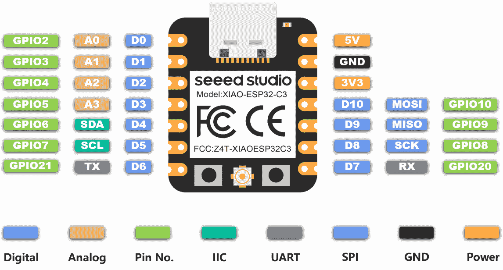

图 10.1 – XIAO ESP32C 引脚图

XIAO ESP32C 提供了多个数字输入/输出引脚。在之前的 ESP 系列板上，我们只找到一个模拟引脚，但在这块开发板上，我们有四个模拟引脚，这消除了在开发使用多个模拟引脚的解决方案时的最大障碍。使用之前的 ESP 系列板时，我们使用了 ADS1115/ADS1015 来获得额外的模拟引脚，因此这块开发板将为我们节省一些费用，因为我们可以在开发板上默认获得四个模拟引脚。

除了所有这些特性之外，XIAO 还提供内置的电池充电模块，并且该板针对功耗进行了优化，有助于将其用作可穿戴设备。对于连接性，提供了 Wi-Fi 和蓝牙选项。它还支持**低功耗蓝牙**（**BLE 5**），这更适用于物联网用例。有关更多详细信息，请访问[`wiki.seeedstudio.com/XIAO_ESP32C3_Getting_Started/`](https://wiki.seeedstudio.com/XIAO_ESP32C3_Getting_Started/)。

在当前项目中，我们需要一个数字引脚用于 WS2812 RGB LED 灯环。开发板的一个优点是有 5V 电源引脚，这在大多数 ESP32 系列开发板上是不常见的。

我们使用的是 WS2812 16 像素 RGB 环形灯，但它有不同的像素和形状，如棒状、矩阵和条形。对于灯具，我们更喜欢环形形状，但你们可以根据自己的喜好选择。WS2812 还提供长条形电缆，用于室内装饰和电脑桌——特别是对游戏玩家、酒店等。有不同供应商提供 WS2812 模块，但我们使用的是从 AliExpress 购买的 WS2812，它工作得很好。您可以从 Amazon、AdaFruit、SparkFun 或 AliExpress 购买。

WS2812 配备 RGB 颜色，并且它还允许您控制模块的亮度，范围从 1–100%。它还允许您控制每个单独的 LED 像素——无论是开/关，还是任何颜色，这为开发有趣解决方案和原型提供了广泛的应用场景。WS2812 RGB LED 有不同的尺寸和形状。以下图示显示了带有正面和背面的 RGB LED 环形灯。

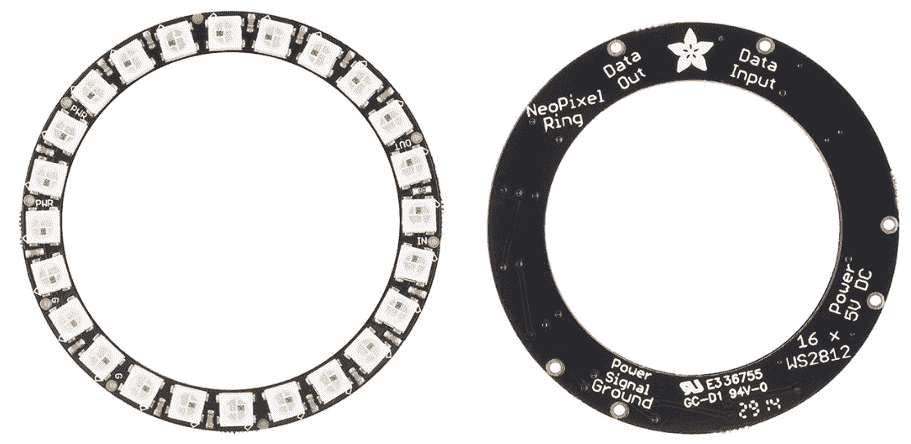

图 10.2 – WS2812 RGB LED 环形灯和引脚布局图

前面的图示展示了 WS2812 RGB 环形灯的引脚布局。WS2812 与 XIAO ESP32C3 的引脚连接完整配置显示在 *表 10.1* 中。*引脚 #1* 是一个 GND 引脚，它与 XIAO ESP32C3 板上的 GND 引脚相连。*引脚 #2* 是一个 5V DC 电源引脚，它既适用于 3.3V 也适用于 5V。*引脚 #3* 是 **数据输入**，它可以连接到任何数字引脚。*引脚 #4* 是 **数据输出**，仅在您想用另一个环形灯或条形灯扩展 WS2812 环形灯时使用——这个引脚将作为扩展连接到另一个环形灯的数据输入引脚。在这里，我将 **数据输入** 连接到板上的 *引脚 #D3*。您可以使用带有 WS2812 的公头或直接焊接电缆而不使用任何头针。

重要提示

WS2812 模块工作得很好，但仍然有必要验证环形灯/条形灯的所有像素是否都工作正常。在我的情况下，我的最后一个像素没有工作。

在本节中，我们讨论了 XIAO ESP32C3 和 WS2812 RGB 环形 LED，以及其引脚。接下来，我们将详细讨论项目架构，包括项目原理图和组装。

# 智能家居 IoT 项目蓝图

在前面的章节中，我们详细讨论了传感器和开发板。现在，是时候动手制作食谱了。在硬件开发中，在开始使用传感器和开发板之前，我们需要开发设计概念，以便更好地理解事物如何连接。有许多软件可用于设计和发展有关电子项目的概念，但我们将使用 Fritzing。

在以下两个小节中，首先，我们将讨论项目的原理图和设计，并解释如何通过焊接将开发板的引脚连接起来。接下来，我们将对 WS2812 进行一些测试，以检查所有颜色和像素是否正常工作。

## 原理图设计和组装

设计的目的是清楚地了解传感器将如何连接到开发板。它帮助工程师使用这些设计文件在面包板或 veroboard 上开发原型。设计的主要好处之一是 Fritzing 会在后台根据您的设计构建硬件原理图和**印刷电路板**（**PCB**）设计，设计师可以根据系统要求进行调整。XIAO ESP32C3 和 WS2812 RGB LED 环的完整连接图如下所示。

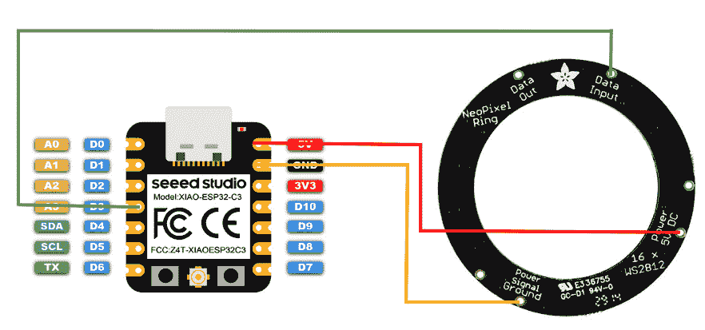

图 10.3 – XIAO ESP32C 和 WS2812 系统设计

*图 10*.*3*展示了整个设置的引脚图，但为了便于指导，我们还创建了*表 10.1*，它以简单的方式解释了如何将 WS2812 的引脚连接到 XIAO ESP32C。

| **XIAO ESP32C** | **WS2812 环形灯** |
| --- | --- |
| A3 | 数据输入 |
| 5V | 电源 5V 直流 |
| GND | 电源信号地 |

表 10.1 – XIAO ESP32C 和 WS2812 连接

上述设计和表格提供了如何将传感器连接到开发板的全面概述。根据设计，我们从 XIAO ESP32C3 板到 WS2812 模块有常见的 5V 和 GND 引脚。WS2812 是一个数字模块，因此我们将它的**数据输入**引脚连接到开发板的 D3 引脚。以下图显示了 veroboard 上智能灯泡的最终原型。

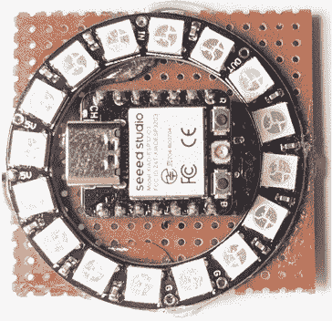

图 10.4 – 最终原型

在将电缆连接到模块和公排针连接到 XIAO ESP32C3 之后，根据原理图连接引脚。只有一个模块，因此不需要 veroboard。但这次我正在开发一个合适的原型——这就是为什么我使用了 veroboard。现在，是时候使用 ESP32C3 验证 WS2812 的颜色和像素了。

## 使用 Arduino IDE 测试 WS2812

要在 Arduino IDE 中安装 ESP32 系列开发板，首先，在首选项中添加板的定义文件。要继续操作，请按照以下步骤进行：

1.  导航到**文件** > **首选项**，并在**附加板管理器 URL**中填写 URL [`raw.githubusercontent.com/espressif/arduino-esp32/gh-pages/package_esp32_dev_index.json`](https://raw.githubusercontent.com/espressif/arduino-esp32/gh-pages/package_esp32_dev_index.json)，如图以下所示。

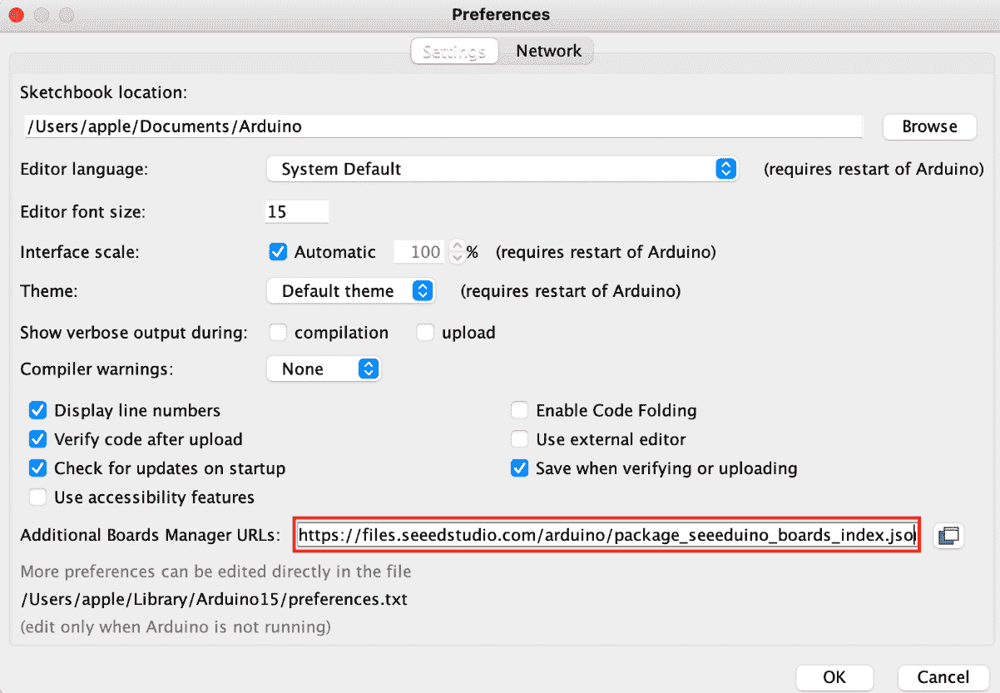

图 10.5 – Arduino IDE 中的 ESP32 板信息

1.  之后，在搜索框中导航到`esp32`，选择最新的**esp32**版本，并安装，如图所示。

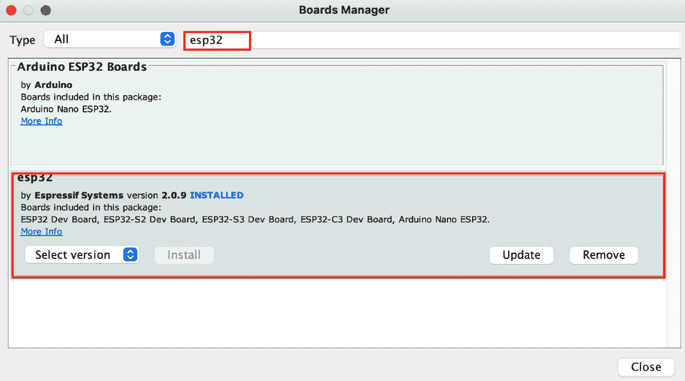


1.  最后，选择板子，导航到**工具** > **板** > **ESP32 Arduino**，并选择**XIAO_ESP32C3**。板子的列表有点长，你需要滚动到最底部，如图所示。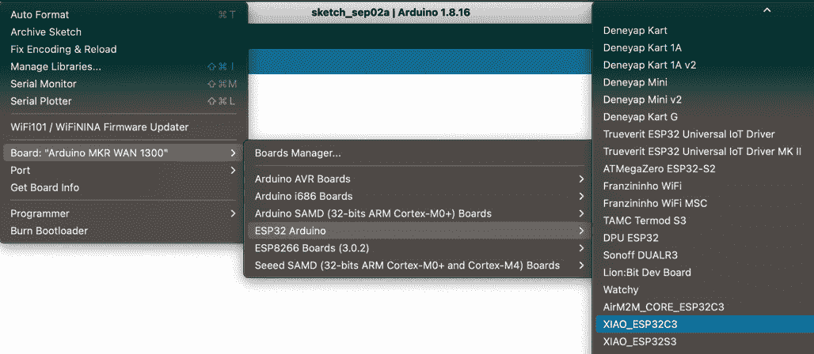


现在是安装 WS2812 库的时候了。在搜索栏中导航到`Adafruit neopixel`。在这里，你会得到不同的库，但你需要安装与搜索查询匹配的特定库。

现在我们已经准备好进行测试步骤。从官方 GitHub 仓库下载代码，导航到`WS2812_Testing`文件夹，并打开代码：

```cpp
#include <Adafruit_NeoPixel.h>
#define LED_PIN    D3
// How many NeoPixels are attached to the Arduino?
#define LED_COUNT 16
// Declare our NeoPixel strip object:
Adafruit_NeoPixel strip(LED_COUNT, LED_PIN, NEO_GRB + NEO_KHZ800);
void setup() {
  strip.begin();           // INITIALIZE NeoPixel strip object (REQUIRED)
  strip.show();            // Turn OFF all pixels ASAP
  strip.setBrightness(50); // Set BRIGHTNESS to about 1/5 (max = 255)
}
```

将`LED_PIN`常量更改为`D3`或`D5`。接下来，将像素数量分配给`LED_COUNT`常量。目前，我在 WS2812 中有 16 个像素，这就是为什么我插入`16`。修改后，将代码上传到板子。之后，你将在 LED 上看到白色，以及圆形形式的移动动画。在`setup()`方法中，我们初始化了`NeoPixel strip`并将亮度设置为 50%：

```cpp
// loop() function -- runs repeatedly as long as board is on ---------------
void loop() {
  for(int i=0; i<LED_COUNT+1; i++){
    strip.setBrightness(50);
    strip.setPixelColor(i, strip.Color(127+i, 127, 127)); //  Set pixel's color (in RAM)
    strip.show();
    delay(200);
  }
    for(int i=0; i<LED_COUNT+1; i++){
    strip.setBrightness(0);
    strip.setPixelColor(i, strip.Color(0, 0, 0)); //  Set pixel's color (in RAM)
    strip.show();
  }
}
```

在`loop()`方法中，有两个循环。第一个循环用于将白色分配给每个像素，并根据循环值打开像素，延迟 200 毫秒，而在第二个循环中，我们通过将亮度更改为`0`和 RGB 颜色更改为`0`，逐个关闭所有像素。

在本节中，我们在 veroboard 上组装了硬件组件，并使用代码验证 WS2812 RGB LED 是否工作。接下来，我们将在 Arduino IoT 云中设置设备和云变量，使我们的原型机运行。

# 初始设置 – 设备、网络凭证、云变量和代码

在设置好硬件后，现在是时候在 Arduino IoT 云中设置设备了。对于这个项目，我们需要一个云变量来控制 LED 亮度、颜色，以及打开/关闭 WS2812 环形灯，但我使用了三个不同的云变量，这样你就可以了解何时以及为什么需要使用这些云变量，每个变量都与一个特定的小部件连接。由于使用了 ESP 系列板，网络设置将与 Arduino 开发板不同。

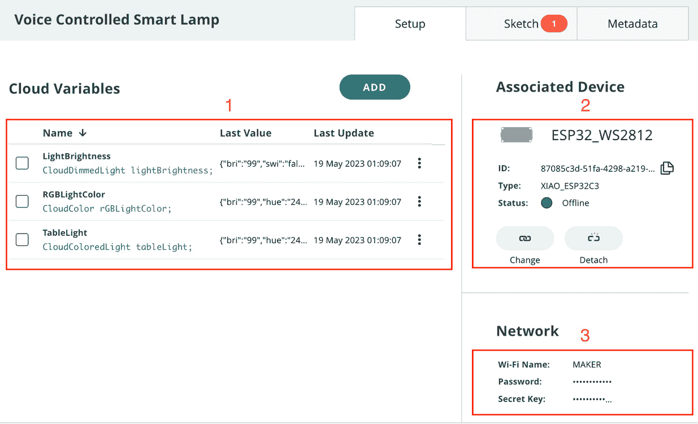

图 10.8 – 空气质量监控系统设备设置

设置一个新的`语音控制智能灯`，并按照以下步骤创建变量，关联设备和网络配置，最后编写代码：

1.  首先，我们需要为 WS2812 设置三个云变量。有关云变量的详细信息，请参阅以下部分。

1.  之后，我们需要将设备与实体关联起来。在当前项目中，我们使用 XIAO ESP32C3，因此向导将与 Arduino 板不同。完整的细节在*关联设备*部分有所说明。

1.  最后，我们需要设置设备的网络配置，但这次我们需要为 ESP 系列板提供安全密钥以确保连接安全。Arduino 兼容的板子在设备设置向导期间由 Arduino IoT Cloud 自动配置。

## 云变量

以下表格提供了我们在创建云变量时需要使用的所有变量的属性。对于 WS2812，我们可以使用整数和布尔数据类型，这会创建很多混乱，但多亏了 Arduino IoT Cloud 扩展的变量组，我们有**Dimmed light**、**Color**和**Colored Light**类型的变量。接下来，确保变量声明与*表 10.2*中所示相同，否则您需要根据您的命名修改示例代码。

在这里，我设置了读写权限，因为这次我们将从云仪表板或语音助手发送命令，因此必须授予云变量读写权限。

| **S#** | **Variable Name** | **Variable Type** | **Declaration** | **Permission** | **Update Policy** |
| --- | --- | --- | --- | --- | --- |
| 1 | `LightBrightness` | Dimmed light | `lightBrightness` | Read and write | On change |
| 2 | `RGBLightColor` | Color | `rGBLightColor` | Read and write | On change |
| 3 | `TableLight` | Colored Light | `tableLight` | Read and write | On change |

表 10.2 – 云变量属性表

之前，我提到我们只需要一个云变量，但我正在使用三个不同的云变量，并将解释它们的用法。如果我们从`RGBLightColor`开始，关于颜色变化只有一个选项。但如果我们转到**Colored Light**类型的云变量，那么它提供了所有三个选项：亮度、颜色以及开关。这个云变量也与 Amazon Alexa 兼容，并且这种类型的云变量将在 Amazon Alexa 智能家居技能门户中作为一个设备表示，这在*增强控制 - 将 Arduino IoT Cloud 与 Amazon Alexa 集成*部分有所讨论。

## 关联设备

变量创建后，是时候添加与实体关联的设备了。在添加设备之前，将开发板连接到计算机并打开**Arduino Create Agent**应用程序。以下图示显示了如何在弹出窗口中选择 ESP32，然后选择 XIAO_ESP32C3 开发板。

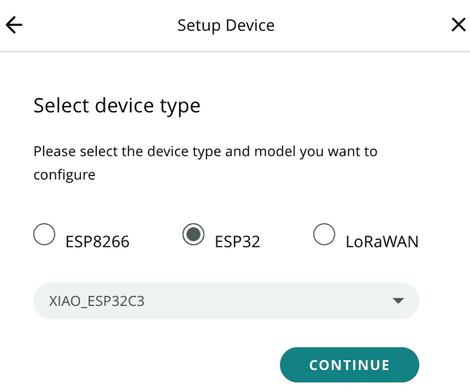

图 10.9 – 设备选择向导

按照以下步骤将 XIAO ESP32C3 与实体关联：

1.  在实体的页面中，点击**关联设备**部分下的**选择设备**按钮，如图 10.8*所示。

1.  将出现一个弹出窗口，其中您可以查看所有已可用的设备。如果您已经添加了您的 XIAO ESP32C3，请选择它。否则，点击 **设置** **新设备**。

1.  然后，点击 **第三方** **设备** 选项。

1.  从下拉菜单中选择 **ESP32** 和 **XIAO_ESP32C3**，然后点击 *图 10.9* 中显示的 **继续** 按钮。

1.  填写 **设备名称** 并点击 **下一步** 按钮。

1.  在最后的向导中，将显示 **设备 ID** 和 **密钥**。请将密钥复制到安全的地方，因为它将在网络配置过程中使用。

现在，让我们转到网络配置。

## 网络

在将设备与 Thing 关联后，是时候配置设备通信的 Wi-Fi 设置了。以下图显示了带有 **Wi-Fi 名称** 和 **密码** 字段的网络配置弹出窗口。

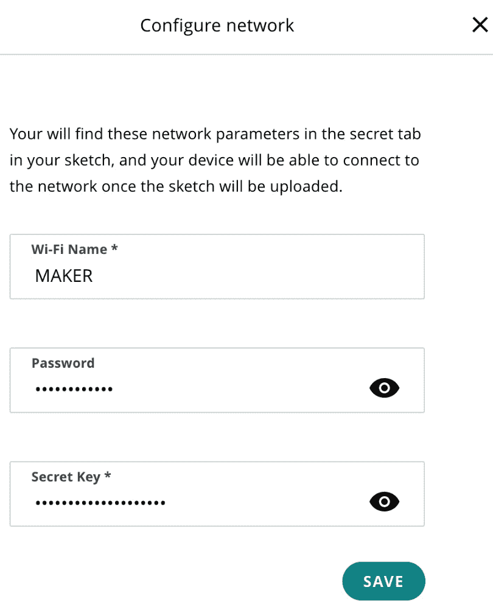

图 10.10 – Thing 的网络配置

您将找到一个新字段 – **密钥**。粘贴我们在设备创建期间从系统收到的密钥。

## 编码

该章节的代码可在本书的官方 GitHub 仓库中找到。从仓库下载 `Voice_Controlled_Smart_Lamp_may13a` 代码并将其导入到 Arduino Web 编辑器中。

您可以通过导航到 `delay()` 方法下载代码并将其放入您的 Thing 中 – 它将阻塞 `ArduinoCloud.update()` 方法。但在继续之前，我们需要在代码的开始处将 `LED_PIN` 常量更改为 `5` 并根据环/条带中的像素数量为 `LED_COUNT` 分配一个值。在这里，我将值设置为 `16`，因为我使用的是一个 16 像素的环：

```cpp
#define LED_PIN   5
// How many NeoPixels are attached to the Arduino?
#define LED_COUNT 16
// Declare our NeoPixel strip object:
Adafruit_NeoPixel strip(LED_COUNT, LED_PIN, NEO_GRB + NEO_KHZ800);
//Sync Variables
bool swi;
float bright;
float sat;
float hue;
```

如果我们回顾先前的常量代码，那么我们会看到有一个 `NeoPixel strip` 对象和四个全局变量（开关 `swi`）、亮度 `bright`）、饱和度 `sat`）和色调，这些将在以后用于从一个部件控制同步到另一个部件控制，以启用部件之间的同步。

在用适当的值填写前面的常量之后，是时候探索一些其他方法了。如果我们谈论设置，那么只有几行代码会初始化 `NeoPixel strip` 对象以及 Arduino IoT Cloud 和一些其他操作。在这个项目中，我们的 `loop()` 方法将包括一行关于 Arduino Cloud 更新的代码，没有其他内容。实际上，在这个项目中，代码将在部件侧发生任何变化时执行。

在项目中，我们还有四种更多方法。其中三种是面向事件的，一种是一个将被三个 `onLightBrightnessChange()`、`onRGBLightColorChange()` 和 `onTableLightChange()` 方法使用的通用辅助方法，而 `ControlTheWS2812()` 方法是一个 **通用辅助方法**。接下来，我们将逐步探索所有这些方法：

```cpp
void onLightBrightnessChange()  {
  // Add your code here to act upon LightBrightness change
  swi=lightBrightness.getSwitch();
  bright=lightBrightness.getBrightness();
  //Sync the values to tableLight Cloud Variable
  tableLight.setSwitch(swi);
  tableLight.setBrightness(bright);
  //Call the method for operations on WS2812
  ControlTheWS2812();
}
```

在 `onLightBrightnessChange()` 方法中，我们从 `lightBrightness` 云变量中获取亮度和开关值，随后将这些值与全局变量一起分配。最后一个调用的方法 `ControlTheWS2812()` 根据全局变量的值在 WS2812 环上执行操作：

```cpp
void onRGBLightColorChange()  {
  // Add your code here to act upon RGBLightColor change
  hue=rGBLightColor.getValue().hue;
  sat=rGBLightColor.getValue().sat;
  bright=rGBLightColor.getValue().bri;
  //Sync the values with LightBrightness & tableLight widget
  tableLight.setBrightness(bright);
  tableLight.setHue(hue);
  tableLight.setSaturation(sat);
  lightBrightness.setBrightness(bright);
  //Call the method for operations on WS2812
  ControlTheWS2812();
}
```

`onRGBLightColorChange()` 方法是在颜色控件控制中发生任何变化时将被调用的第二个方法。此方法从 `Color` 类型的云变量中获取色调、饱和度和亮度值，随后将这些值分配给其他云变量以及全局变量。最后一个调用的方法 `ControlTheWS2812()` 根据全局变量的值在 WS2812 环上执行操作：

```cpp
void onTableLightChange()  {
  // Add your code here to act upon TableLight change
  swi=tableLight.getSwitch();
  bright=tableLight.getBrightness();
  hue=tableLight.getHue();
  sat=tableLight.getSaturation();
  //Sync the values with LightBrightness & RGBLightColor widget
  lightBrightness.setSwitch(swi);
  lightBrightness.setBrightness(bright);
  rGBLightColor= Color(hue,sat,bright);
  //Call the method for operations on WS2812
  ControlTheWS2812();
}
```

`onTableLightChange()` 方法与 `tablelight` 云变量相关联，并将这些值分配给全局变量以及另外两个云变量以实现同步。最后一个调用的方法 `ControlTheWS2812()` 将根据全局变量的值在 WS2812 环上执行操作：

```cpp
void ControlTheWS2812(){
  // declare a variable of the Color data type and define it using the HSB values of the color variable
  Color currentColor=Color(hue,sat, bright);
  byte RValue;
  byte GValue;
  byte BValue;
  currentColor.getRGB(RValue, GValue, BValue);  // the variables will contain the RGB values after the function returns
  if(swi==true){
    strip.setBrightness(bright);
    for(int i=0; i<LED_COUNT+1; i++){
    strip.setPixelColor(i, strip.Color(RValue, GValue, BValue)); //  Set pixel's color (in RAM)
    strip.show();
  }
  }else{
    for(int i=0; i<LED_COUNT+1; i++){
    strip.setBrightness(0);
    strip.setPixelColor(i, strip.Color(0, 0, 0)); //  Set pixel's color (in RAM)
    strip.show();
    }
  }
}
```

最后，我们有我们的最后一个、通用的辅助方法 `ControlTheWS2812()`。此方法首先根据色调、饱和度和亮度生成 RGB 颜色。然后它将检查开关值 – 如果它是真的，那么条件将分配亮度和颜色到 WS2812 环，并借助 `for` 循环打开环上的每个像素。否则，它将亮度设置为 `0` 并关闭 WS2812 的所有像素。

重要提示

如果你在变量声明中使用了不同的 *命名*，那么请根据你的命名方案更新代码。但最好是首先按照书中的所有步骤进行，然后再分别更改云变量名称并修改你的代码。

Arduino IoT Cloud 仅在变量值更改时更新仪表板上的值。例如，如果温度是 30 度，5 分钟后仍然是同样的温度，那么 Arduino IoT Cloud 不会记录该值。所以，如果控件上的值没有变化，请不要感到困惑。此功能的另一个好处是，当你导出内容时，你将不会得到重复的数据。

在本节中，我们设置了事物，将 XIAO ESP32C3 与事物关联，并设置了不同类型的云变量以控制 LED 操作。我们还根据不同的方法详细讨论了设备的代码，一步一步地。现在，在下一节中，我们将设置仪表盘。

# 用户体验友好的控件 – 构建网页和移动仪表盘

在将代码上传到设备后，是时候为网页和移动设备设置仪表盘，以便使用不同的控件可视化数据了。以下截图显示了使用不同控件的光控制可视化。

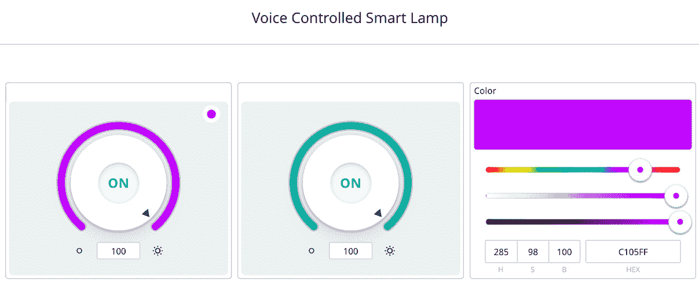

图 10.11 – 事物仪表盘

WS2812 有三个核心功能，包括 RGB 颜色、亮度和开关。在上一节中，我们创建了三个不同的云变量，提供了不同的功能。这就是为什么这里我们有三个不同的小部件控制，它们只与这些云变量一起工作。第一个小部件是`tableLight`云变量，能够执行 WS2812 上的所有操作，例如颜色变化、亮度控制和开关。

接下来，我们还有两个具有有限功能的小部件。第二个小部件是`lightBrightness`云变量，它只提供了一个开关和亮度控制，而我们的第三个小部件控制是`rGBLightColor`云变量，它只提供了选择颜色的选项。如果我们比较这三个小部件，那么**彩色灯光**小部件等于**调暗灯光**和**颜色**小部件，因为**彩色灯光**小部件有三个功能，包括开关、颜色选择和亮度控制，而**调暗灯光**小部件控制只有两个选项，亮度控制和开关功能，**颜色**小部件控制只有选择颜色的选项。

因此，最终的结论是，如果你有一个带有亮度控制功能的多色条，那么**彩色灯光**小部件和云变量就很好用；否则，对于带有亮度控制的单色灯，**调暗灯光**小部件和云变量是完美的。如果你只有带有多色选项但没有亮度控制的多色条，那么一个简单的**颜色**小部件和云变量类型就足够了，但请记住，**颜色**类型的云变量与 Amazon Alexa 不兼容。

在本节中，我们已经设置了包含不同类型小部件控制的仪表板，这有助于你以不同的方式控制 WS2812，例如控制亮度、颜色以及开关 LED 环。接下来，我们将使用 Arduino IoT Cloud 设置 Amazon Alexa 技能，通过 Amazon Alexa 使用语音命令控制我们的台灯。

# 增强控制功能 – 将 Arduino IoT Cloud 与 Amazon Alexa 集成

在 Arduino IoT Cloud 仪表板上测试完所有设备后，是时候将 Amazon Alexa 与我们的设备连接起来，以实现语音控制系统。我们有一个用于 Alexa 的物理硬件设备以及 Android/iOS 的移动应用程序。请访问[`alexa.amazon.com/`](https://alexa.amazon.com/)来设置此项目。我使用的是第二代 Amazon Echo Dot，但如果你无法访问 Alexa 硬件设备，那么你可以简单地使用移动应用程序。

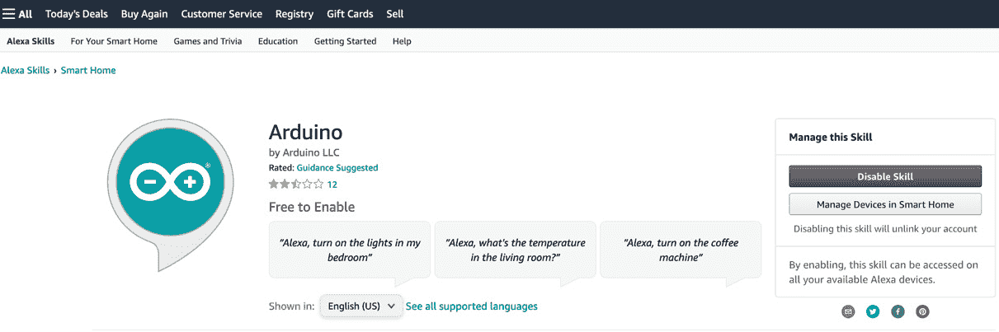

图 10.12 – Arduino Skill for Amazon Alexa

Arduino IoT Cloud 原生开发了一个适用于 Amazon Alexa 的技能，可以在[`www.amazon.com/Arduino-LLC/dp/B07ZT2PK2H`](https://www.amazon.com/Arduino-LLC/dp/B07ZT2PK2H)找到。设置您的 Amazon Alexa 并导航到前面的 URL 以启用技能，如图所示。当您链接账户时，它将自动链接已登录此技能的 Arduino IoT 云账户。因此，请确保您已经登录到 Arduino IoT 云。前面的图显示了 Amazon Alexa 的 Arduino 技能。

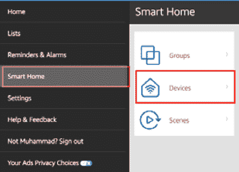

图 10.13 – Amazon Alexa 智能家居和设备

启用 Amazon Alexa 中的 Arduino 技能后，导航到[`alexa.amazon.com/spa/index.html`](https://alexa.amazon.com/spa/index.html)并点击左侧侧边栏中的**智能家居**链接，然后点击图中的**设备**。在这里，您将看到云变量将变成设备，如图所示。如果您看不到您想要的 Arduino IoT 云变量作为设备，那么在页面底部，点击**设备**页面上的**发现**按钮，这将花费大约 20 秒来加载所有内容。

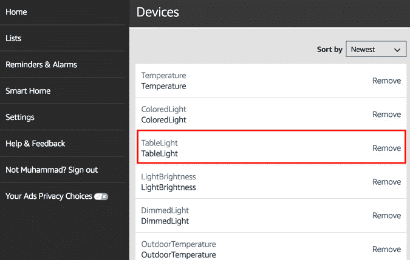

图 10.14 – Arduino Cloud 变量作为 Amazon Alexa 中的设备

最后，打开您的 Amazon Echo Dot 和基于 WS2812 的智能灯，并在 Amazon Alexa 上尝试以下语音命令。首先，尝试以下命令，这将帮助您打开/关闭**TableLight**。如图所示，**TableLight**现在正在作为 Amazon Alexa 智能家居中的设备运行：

```cpp
Hey Alexa Turn on the TableLight
Hey Alexa Turn off the TableLight
```

现在是时候使用语音命令来改变 WS2812 的亮度和颜色了。尝试以下命令，这将帮助您更新亮度和颜色。目前，我刚刚写了四种不同的颜色，但您可以选择任何您想要的颜色名称：

```cpp
Hey Alexa set the brightness of TableLight to 99
Hey Alexa set the brightness of TableLight to 50
Hey Alexa change the color of TableLight to red
Hey Alexa change the color of TableLight to blue
Hey Alexa change the color of TableLight to green
Hey Alexa change the color of TableLight to purple
```

最后，我正在使用 Alexa 计时器功能来安排在特定时间间隔后打开/关闭台灯。但您也可以像闹钟一样使用此功能，长时间打开/关闭 WS2812，例如在清晨提前打开灯光，晚上 10:00 关闭灯等：

```cpp
Hey Alexa turn on the table light after 30 minutes
Hey Alexa turn off the table light after 10 minutes
```

我们已经讨论了针对 Amazon Alexa 的不同语音命令，但您可以在互联网上搜索更多有关灯光控制和颜色的命令。

现在是时候讨论哪些 Arduino Cloud 变量与 Amazon Alexa 兼容了。您可以在[`www.amazon.com/Arduino-LLC/dp/B07ZT2PK2H`](https://www.amazon.com/Arduino-LLC/dp/B07ZT2PK2H)获取最新信息。目前，我们有以下列表的云变量可以完美与 Amazon Alexa 配合工作：

+   温度

+   运动检测

+   轻巧的智能插头和智能开关

+   调暗灯光

+   彩色灯光

根据前面的列表，你可以创建一个房间恒温器，这将帮助你根据室外和室内恒温器的温度来改变房间或厨房的温度，你可以控制你的供暖和冷却系统。为了开启/关闭任何设备，我们有四种不同类型的云变量，它们具有相同的数据类型布尔型但名称不同，包括灯光、智能插头、智能开关和运动检测。这四个变量可以用来控制任何继电器/电磁接触器来开启/关闭家用电器，例如冷却/供暖系统。我们已经在之前章节讨论了**调光灯光**和**彩色灯光**。

在本节中，我们设置了亚马逊 Alexa 与 Arduino 云技能，并尝试了与开启/关闭灯光以及如何更改 WS2812 RGB LED 环形灯的颜色和亮度相关的不同语音命令。

# 接下来是什么？

我们还有很多选项可供探索，但现在你的任务是使用不同的继电器、传感器和开发板进行更多实验并从中学习。在当前章节中，我们只使用了一个 WS2812 模块进行灯光控制，但你可以使用温度传感器、继电器和运动传感器来自动化你家的设备，例如自动化房间开关来控制风扇、排气扇、灯光和空调系统，根据房间温度来开启/关闭。

重要提示

在连接电缆到继电器时，玩弄高压电缆时要小心。

# 摘要

在本章中，我们探讨了如何使用 XIAO ESP32C3 和 WS2812 开发一个低成本、多色智能台灯，用于我们的房间。我们设置了事物，包括云变量创建、设备关联、网络配置和开发板的编码。后来，我们使用不同的小部件创建了一个仪表盘来控制 WS2812 RGB 环形灯。最后，我们使用亚马逊 Alexa 语音助手通过语音命令来开启/关闭我们的台灯，并控制其颜色和亮度。

本章将让你有信心构建更多有趣的东西，让你的家和办公室更智能。在下一章中，我们将讨论云调度器和空中更新功能。这两个功能都很有趣，专门设计用于在物联网节点上执行操作。

# 第四部分：学习 Arduino IoT 云的高级功能和展望

在*第四部分*中，读者被引导了解 Arduino IoT 云平台的高级功能，如何使用它们来开发专业应用程序，以及在整个生命周期中维护解决方案的工具。本书以一些关于进一步学习、实验和获取信息的建议结束。

本部分包含以下章节：

+   *第十一章*，*实现 Arduino IoT 云调度器和空中更新功能*

+   *第十二章*，*项目#6 – 跟踪和通知心率*

+   *第十三章*, *使用 Cloud CLI 编写 Arduino 物联网云脚本*

+   *第十四章*, *在 Arduino 物联网云中继续前进*
