# 11

# 实现 Arduino IoT Cloud 调度器和空中更新功能

世界充满了各种不同和有趣的用例，这些用例根据不同的情况而变化。在完全自动化的世界中，许多用例需要应用程序在特定时间或频率执行特定操作，这些由最终用户定义。为了处理这种情况，Arduino IoT Cloud 有一个**调度器**功能，允许最终用户通过仪表板配置执行时间和频率，而无需在最终设备上修改代码。在本章的初始阶段，你将了解 Arduino IoT Cloud 调度器功能和它的实现。

然后，本章将介绍**空中更新**（**OTA**）功能，该功能在远程设备（如移动节点、特别是远程物联网节点）中越来越受欢迎。OTA 功能允许您向物联网节点广播固件更新，这些节点将无线更新，无需任何物理连接。此过程使得在商业 Arduino-based/ESP 系列物联网节点的生命周期内进行远程维护成为可能，当新功能和安全修复可用时，可以降低相关的服务成本。

Arduino IoT Cloud 调度器提供通过仪表板小部件安排操作的能力，这有助于在不修改代码的情况下执行设备上的操作，用户可以简单地调整常规操作的执行时间。OTA 可以帮助您通过空中发送最新的代码和更新到设备，无需与设备有任何物理连接，这将节省操作成本和时间。

在本章中，我们将涵盖以下主题：

+   调度器在物联网中的重要性

+   使用 Arduino IoT Cloud 调度器——一个 MKR Wi-Fi 1010 示例

+   初始配置——设备、网络凭证、云变量和代码

+   仪表板创建和对调度器小部件的深入了解

+   当前任务——一个任务

+   探索物联网中的 OTA 更新

+   利用 Arduino IoT Cloud 进行 OTA 更新

# 技术要求

在我们继续之前，首先，你需要有一个与 Arduino IoT Cloud 兼容的板。我推荐带有一些 5 毫米 LED 的 Arduino **MKR Wi-Fi 1010**，但这里有完整的兼容板列表：[`store-usa.arduino.cc/pages/cloud-compatible-boards`](https://store-usa.arduino.cc/pages/cloud-compatible-boards)。你可以根据自己的需求选择一个。

其次，你需要有一个 Arduino IoT Cloud 账户。如果你还没有，你可以在[`cloud.arduino.cc/`](https://cloud.arduino.cc/)注册并根据自己的需求选择一个计划。

第三，我们需要下载并安装**Arduino Create Agent**。Arduino 为安装创建了一个非常漂亮的基于 Web 的指南，可在[`create.arduino.cc/getting-started/plugin/welcome`](https://create.arduino.cc/getting-started/plugin/welcome)找到。本章的代码可在本书的官方 GitHub 仓库[`github.com/PacktPublishing/Arduino-IoT-Cloud-for-Developers`](https://github.com/PacktPublishing/Arduino-IoT-Cloud-for-Developers)中找到。

重要提示

所有 Arduino 物联网云计划都在*第一章*中详细讨论。您也可以访问以下链接以获取最新的计划定价和功能：[`cloud.arduino.cc/plans/`](https://cloud.arduino.cc/plans/)。如果您来自教育机构，那么学生和教师有很多好的计划。Arduino 还根据其需求为商业组织提供定制计划。

# 调度器在物联网中的重要性

在物联网和云计算领域，调度器指的是负责管理和控制任务、进程或事件的时间安排和执行的组件或系统。其主要功能是确保物联网云设置中各种活动的平稳和高效运行。以下是采用调度器在物联网云环境中的优势：

+   **任务协调**：调度器通过允许用户定义依赖关系和优先级，在物联网云中协调多个任务和进程。这确保了任务按照期望的顺序执行，这对于涉及互连设备和服务的复杂物联网系统尤为重要。

+   **资源优化**：在物联网云中，通常有限的计算资源需要通过智能分配任务来优化其利用，这些任务基于需求、可用资源和优先级。这防止了资源过载或低效利用，从而提高了效率和成本效益。

+   **时间同步**：在物联网系统中，实现特定操作或事件的时间同步至关重要。调度器通过根据精确的时间要求协调任务执行来帮助实现时间同步。这种同步保证了设备、传感器和服务在预定的时间被触发或激活，从而实现准确的数据收集、分析和决策。

+   **能源效率**：许多物联网设备在有限的电池功率下运行，因此能源效率是一个重要的考虑因素。调度器通过优化任务调度来最小化设备的活跃时间并最大化睡眠或低功耗模式，从而节约能源。这延长了物联网设备的电池寿命，减少了维护需求，并提高了整体系统可靠性。

+   **容错性**：物联网系统容易受到网络问题、设备故障或服务不可用引起的故障和中断的影响。通过监控任务状态和检测故障，调度器集成了容错机制。它自动重新安排失败或中断的任务，确保物联网云中的操作连续性和可靠性。

总体而言，在物联网云环境中，调度器通过协调任务、优化资源、同步时间、节约能源、确保容错性和支持可扩展性，带来了组织、效率和可靠性。它的存在对于管理物联网系统的复杂性并最大化其性能至关重要。

在本节中，我们详细讨论了什么是调度器以及我们如何在产品开发中从中受益。在下一节中，我们将探讨 Arduino IoT 云调度器在现实场景中的好处，并学习如何使用 MKR Wi-Fi 101 实现 Arduino IoT 云调度器。

# 使用 Arduino IoT 云调度器——以 MKR Wi-Fi 1010 为例

在本节中，我们将探讨 Arduino IoT 云调度器如何提供不同的好处，以及何时何地我们需要调度功能。稍后，我们将通过使用 MKR Wi-Fi 1010 实现一个调度器的实际示例。

## Arduino IoT 云调度器

**Arduino IoT 云调度器**是集成到 Arduino IoT 云平台中的一个功能，它赋予用户为他们的连接 Arduino 设备安排和自动化操作和事件的能力。它提供了一种方便的方式来定义和管理物联网项目中各种任务和功能的时机。以下是 Arduino IoT 云调度器的一些关键方面和好处：

+   **任务调度**：Arduino IoT 云调度器允许用户在 Arduino 设备上安排任务和事件。它使得定义特定的时间、间隔或触发动作（如数据收集、设备控制和传感器读取）成为可能。

+   **远程控制**：通过利用调度器，用户可以远程触发 Arduino 设备上的操作。这种能力使得从任何位置控制自动化功能成为可能，无需直接物理访问设备。它增强了灵活性，并使物联网项目的远程管理更加高效。

+   **基于事件的触发**：调度器支持基于事件的触发，使用户能够根据特定的事件或条件自动化操作。例如，任务可以安排在特定传感器的值超过定义的阈值或检测到外部事件时执行。

+   **时区管理**：Arduino IoT 云调度器处理时区管理，确保任务根据期望的时区执行。当在不同时区运营或为不同地区的用户提供服务时，此功能特别有用。

+   **与物联网云服务的集成**：调度器与 Arduino 物联网云平台提供的其他功能和服务无缝集成。这包括数据存储、可视化和通知服务。用户可以将调度与数据记录、图表和警报相结合，创建全面且连贯的物联网应用。

+   **灵活性和定制**：Arduino 物联网云调度器提供了高度的可定制性，使用户能够为他们的任务定义复杂的计划和条件。用户可以指定任务频率、持续时间和间隔，并配置高级参数以满足他们的特定需求。

通过利用 Arduino 物联网云平台调度器的力量，用户可以自动化任务，远程控制设备，并为基于 Arduino 的物联网项目建立基于时间或事件驱动的流程。这一功能简化了跨设备动作的管理和协调，提升了物联网应用的功能性和效率。

在本节中，我们讨论了 Arduino 物联网云调度器如何为我们的任务提供调度的好处。在下一节中，我们将使用 MKR Wi-Fi 1010 实现一个调度器。

## MKR Wi-Fi 1010 示例

在本章中，我将不会进行复杂的项目来演示我们如何使用调度器。相反，我们将使用一个简单的 MKR Wi-Fi 1010 和三个 5 毫米 LED，我们将设置系统，使其在特定时间间隔后打开或关闭 LED。这个示例将简化硬件复杂性，并帮助您理解 Arduino 物联网云调度器的工作原理。*图 11.1*展示了 LED 如何连接到 MKR Wi-Fi 1010 以进行此调度器示例。

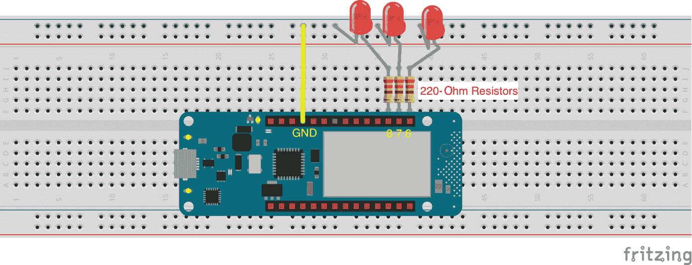

图 11.1 – 配有 LED 的 MKR Wi-Fi 1010

在这里，我们将仅使用三个 LED 来为三个不同的调度器/计时器。我们使用*引脚 8*、*7*和*6*将 LED 连接到 MKR Wi-Fi 1010，使用 220 欧姆的电阻，这将控制这些引脚的电源，一个公共**地**（**GND**）通过面包板连接到所有 LED。

在本节中，我们讨论了我们的项目原理图，其中我们解释了哪些引脚用于将 LED 连接到 MKR Wi-Fi 1010。在下一节中，我们将设置与“物”关联的“物”和设备，以及云变量创建和网络配置将逐步讨论，包括代码。

# 初始配置 – “物”、网络凭证、云变量和代码

在设置好硬件后，是时候在 Arduino 物联网云中设置一个“物”了。对于这个项目，我们需要为调度器设置三个云变量，这些变量将与仪表板小部件链接并从用户那里接收值。稍后，当调度器处于活动状态时，设备将执行操作（在我们的例子中，它将根据调度器时间打开和关闭 LED）。*图 11.2*给出了**云****调度器**“物”的完整概述。


图 11.2 – 云调度器事物设置

使用名称`CloudScheduler`设置一个新的事物。按照以下步骤创建云变量、关联设备、设置网络配置，最后编写代码。在*图 11*.2 中，所有步骤都以上方红色方框中的数字标记，这些步骤与以下步骤相关：

1.  首先，我们需要为`CloudScheduler`设置三个云变量。有关云变量的详细信息将在下一节中提供。

1.  之后，我们需要将设备与事物关联。在当前项目中，我们使用 Arduino 的 MKR Wi-Fi 1010，因此对于 Arduino 板，向导将是相同的。完整的详细信息可在*关联设备*部分找到。

1.  最后，我们需要为设备设置网络配置。Arduino 兼容的板在设备设置向导期间由 Arduino IoT Cloud 自动配置，因此你只需要提供 Wi-Fi**服务集标识符**（**SSID**）和密码。

## 云变量

以下表格解释了我们创建云变量时需要使用的所有变量属性。对于调度器，我们将使用自定义数据类型`Schedule`，这是由于 Arduino IoT Cloud 扩展变量组所提供的。然后，确保你有与表格中相同的`声明`变量；否则，你需要根据你的命名修改示例代码。

| **S#** | **变量名称** | **变量类型** | **声明** | **权限** | **更新策略** |
| --- | --- | --- | --- | --- | --- |
| 1 | `CloudScheduler1` | `Schedule` | `cloudScheduler1` | 读写 | 变更时 |
| 2 | `CloudScheduler2` | `Schedule` | `cloudScheduler2` | 读写 | 变更时 |
| 3 | `CloudScheduler3` | `Schedule` | `cloudScheduler3` | 读写 | 变更时 |

表 11.1 – 云变量声明列表

在这里，我将权限设置为*读取*和*写入*，因为我们将从 Arduino 仪表板输入日期、时间和间隔，这将由最终用户控制，设备仅在调度器处于`true`状态时执行 LED 开关操作。**更新策略**设置为**变更时**，因为仪表板将在用户更改调度器值时向设备发送数据。

## 关联设备

创建变量后，是时候添加设备并将其与事物关联了：

1.  在添加设备之前，将开发板连接到计算机并打开**Arduino Create** **代理**应用程序。

1.  为事物分配名称后，我们需要将其设备附加到它上面。当你点击**选择设备**按钮时，你会看到一个弹出窗口，显示可用的设备和添加新设备选项。在我们的案例中，我们在门户中没有设备，因此我们可以直接点击**设置新设备**来在账户中配置新设备。

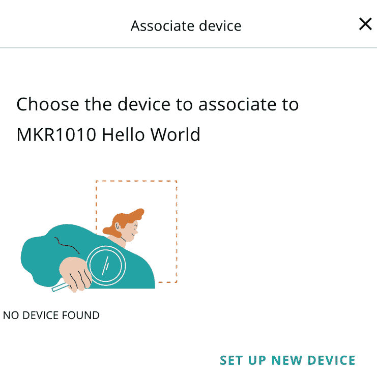

图 11.3 – 关联的设备

1.  然后，您将在弹出窗口中看到两个选项。第一个选项是**设置 Arduino 设备**，第二个选项是**设置第三方设备**。在这里，您将在两个选项下方看到一个说明，说明**兼容设备**。这意味着您不能使用所有类型的 Arduino 设备和第三方设备与 Arduino IoT Cloud 兼容。

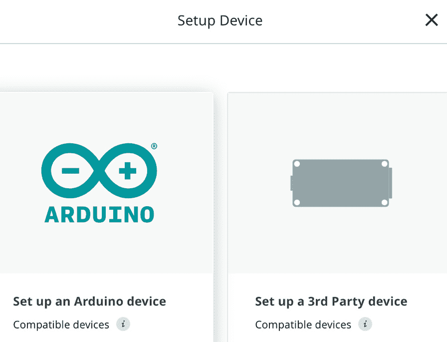

图 11.4 – 选择设备

根据可用的设备，从弹出窗口中选择一个选项。在本例中，我们将点击**设置 Arduino 设备**，因为在本章中，我们使用的是 MKR Wi-Fi 1010 板。在添加设备之前，请确保**Arduino Create Agent**已在您的机器上运行。

重要提示

这里是您可以找到与 Arduino IoT Cloud 兼容的板的链接：[`store-usa.arduino.cc/pages/cloud-compatible-boards`](https://store-usa.arduino.cc/pages/cloud-compatible-boards)。对于第三方设备，我们有三种选择，分别是 ESP8266、ESP32 和 **LoRaWAN** 设备。对于其他设备，我们有 API 访问，这在第二部分的*第二章*中已讨论。

1.  现在，您将看到**设置设备**弹出窗口，该窗口将开始搜索您的设备。确保设备已正确连接到机器。

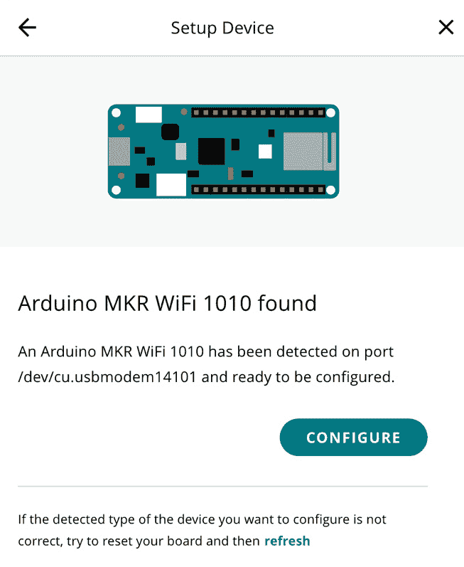

图 11.5 – 设置设备

向导将找到并列出所有连接的板及其名称和端口详细信息。点击**配置**按钮继续。如果向导在搜索后没有显示设备，请尝试将其插入不同的端口，并点击底部位置的**刷新**链接。

1.  在下一个配置向导中，提供设备名称。设备名称中不允许有空格和特殊字符。然后，点击**下一步**按钮。

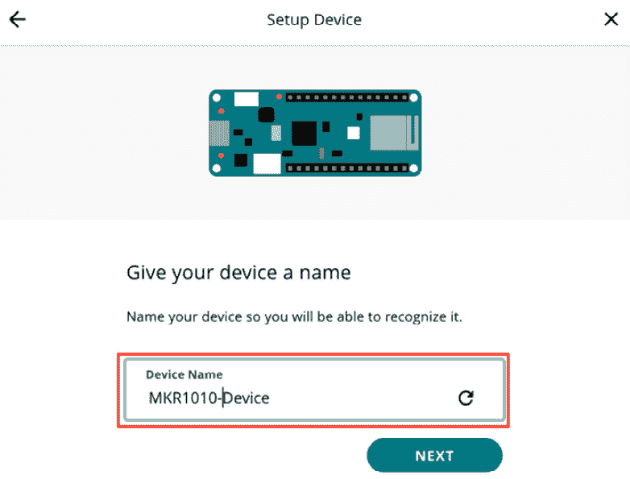

图 11.6 – 设备配置名称

之后，向导将开始设备配置过程。这可能需要五分钟，但在大多数情况下，配置设备只需要一分钟。

1.  在下一个弹出窗口中，您将看到**恭喜！您已设置完毕**的消息。点击**完成**按钮，设备将被附加到您的设备上。

在本节中，我们将 MKR Wi-Fi 1010 开发板与我们的设备关联起来。在下一节中，我们将配置 MKR Wi-Fi 1010 的 Wi-Fi 网络设置。

## 网络配置

在设备与设备关联后，我们可以看到设备处于离线状态。要使其上线，我们需要提供 Wi-Fi 详细信息。

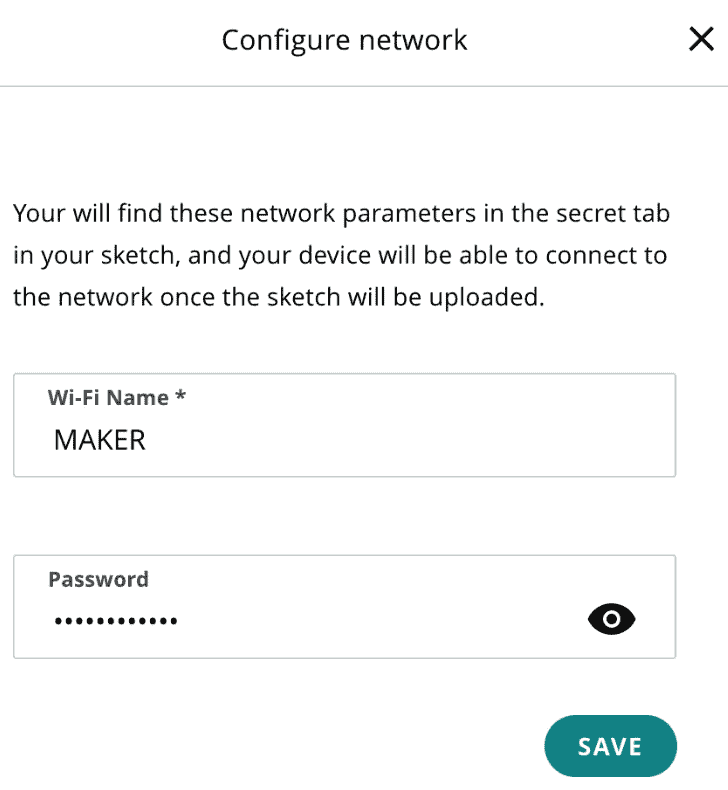

图 11.7 – 网络配置

在 **网络** 选项卡下的设备页面上，点击 **配置** 按钮。你会看到一个带有两个字段的 **配置网络** 弹出框 - **Wi-Fi 名称** 和 **密码**。输入 Wi-Fi SSID 和密码，然后点击 **保存** 按钮。

我们已经完成了设备和网络配置；只剩下编码部分。在下一节中，我们将查看设备的代码。

## 编码

本章的代码可在书的官方 GitHub 仓库中找到。从仓库中下载 `Cloud_Scheduler_may22a` 代码，并将其导入到你的 **Arduino** **Web 编辑器** 中。

你可以通过导航到 `delay()` 方法来下载代码并将其放入你的设备中，因为它将阻塞 `ArduinoCloud.update()` 方法：

```cpp
#define LED1 8
#define LED2 7
#define LED3 6
```

在这里，我们有一个非常简单的代码。首先，我们将定义 `LED1`、`LED2` 和 `LED3` 引脚常量，这些常量将在 `setup()` 方法中使用 `pinMode()` 方法初始化为输出：

```cpp
void setup() {
  pinMode(LED1,OUTPUT);
  pinMode(LED2,OUTPUT);
  pinMode(LED3,OUTPUT);
  // Initialize serial and wait for port to open:
  Serial.begin(9600);
  // This delay gives the chance to wait for a Serial Monitor without blocking if none is found
  delay(1500);
  // Defined in thingProperties.h
  initProperties();
  // Connect to Arduino IoT Cloud
  ArduinoCloud.begin(ArduinoIoTPreferredConnection);
  setDebugMessageLevel(2);
  ArduinoCloud.printDebugInfo();
}
```

然后，我们在 `loop()` 方法中有了关于调度器的所有代码，当调度器/计时器处于活动状态时，它将执行一个操作。在下面的代码中，我们为每个 `cloudScheduler` 云变量有一个单独的 `if-else` 语句；在这里，我们检查 `cloudScheduler` 是否处于活动状态，然后打开 LED；否则，关闭 LED。我们有 `cloudScheduler1`、`cloudScheduler2` 和 `cloudScheduler3`，以及三个 `if-else` 语句来检查它们的值：

```cpp
void loop() {
  ArduinoCloud.update();
  // Your code here
  //Cloud Scheduler 1 Code
  if(cloudScheduler1.isActive()){
    digitalWrite(LED1,HIGH);
  }else{
    digitalWrite(LED1,LOW);
  }
    //Cloud Scheduler 2 Code
  if(cloudScheduler2.isActive()){
    digitalWrite(LED2,HIGH);
  }else{
    digitalWrite(LED2,LOW);
  }
    //Cloud Scheduler 3 Code
  if(cloudScheduler3.isActive()){
    digitalWrite(LED3,HIGH);
  }else{
    digitalWrite(LED3,LOW);
  }
}
```

调度器小部件在配置上非常复杂，有很多选项，但它的代码非常简单直接。你只需要验证调度器状态是 `true` 还是 `false`，如果是 `true`，则继续执行任务；否则，停止任务。因此，在 `loop()` 方法中，我们有三个 `if-else` 语句，它们检查不同的云调度器/计时器的状态。如果特定的调度器处于活动状态，则特定的 LED 将打开；否则，它将关闭。

我将 LED 连接到 *Pin #8* 的 `cloudScheduler1`，将 LED 连接到 *Pin #7* 的 `cloudScheduler2`，将 LED 连接到 *Pin #6* 的 `cloudScheduler3`。现在，将第一个小部件的时间设置为每分钟 5 秒，第二个小部件为每分钟 10 秒，第三个小部件为每分钟 15 秒。所有 LED 将同时打开，但第一个 LED 将打开 5 秒，第二个 LED 将打开 10 秒，第三个将在 15 秒后关闭。在这个示例项目中，我们使用了三个不同的调度器来演示我们如何使用多个调度器/计时器来自动化单个开发板上的任务。

重要提示

如果你使用了不同的 *命名* 在变量声明中，那么根据你的命名方案更新代码。然而，首先最好按照书中的所有步骤进行，然后再分别更改云变量名称并修改你的代码。

另外，不要将代码放在 `loop()` 方法的末尾，因为它会在脉冲传感器读取时创建延迟。

在本节中，我们讨论了代码以及它是如何与 Arduino IoT Cloud Scheduler 一起工作来打开和关闭 LED 的。在下一节中，我们将设置仪表板，我们将放置调度器小部件并将其连接到我们的云变量。

# 仪表板创建和深入探讨调度器小部件

将代码上传到设备后，是时候为网页和移动设备设置仪表板，插入将链接到调度器变量的多个调度器小部件，以便进行进一步的控制和操作。以下图显示了具有不同计时器选项的可视化调度器：

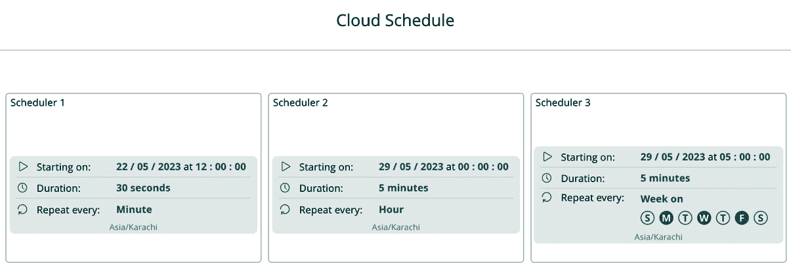

图 11.8 – 事物仪表板

我们有三个调度器变量。为了可视化所有这些变量，将分别将三个调度器小部件链接到每个云变量。这三个小部件和变量的目的是展示我们如何设置不同类型的计时器。第一个小部件演示了如何使用每分钟执行 30 秒的计时器，第二个小部件演示了如何使用每小时激活五分钟的计时器，第三个小部件演示了我们可以设置长时间计时器，例如在特定时间特定日期。在这里，我将其设置为在星期一、星期三和星期五激活五分钟。

我们只是设置了不同计时器设置的多个小部件。调度器小部件的一个示例设置如*图 11.9*所示，我们将深入探讨如何设置这些设置。这个控制小部件有多个配置选项，因此我认为有必要详细讨论它，以便提供适当的指导。

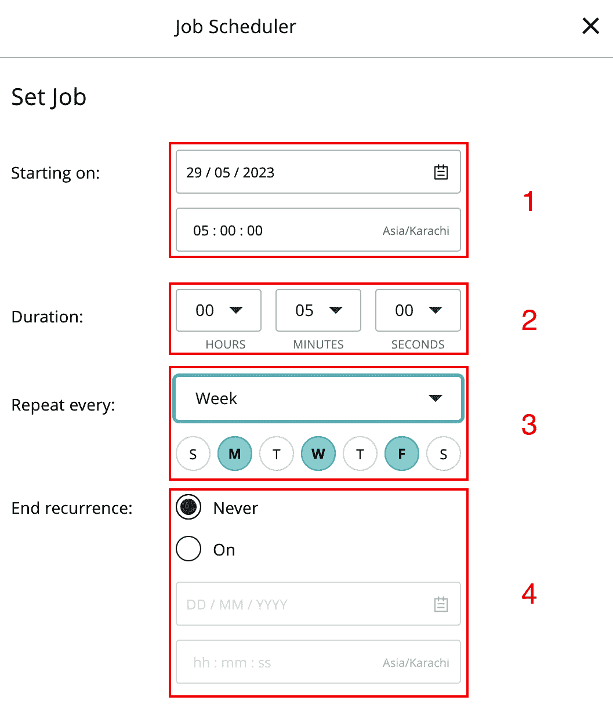

图 11.9 – 调度器小部件选项

当你点击调度器小部件时，会出现一个弹出窗口，其中包含选项，就像在前面的图中所示。在这里，我将截图分为四个不同的编号部分。从这个弹出窗口中，你可以从秒到年调整你的时间设置，设置开始和结束日期，或者选择无日期限制执行。让我们看看每个部分：

1.  在这里，我们有两个输入控制项——一个是起始日期，另一个是起始时间，如控制标题所示。

1.  接下来，我们有**持续时间**设置，其中包含三个下拉框——**小时**、**分钟**和**秒**。这将定义计时器在机器上执行的时间长度。例如，如果你想执行 30 秒的操作，只需选择**30 秒**并留出其他字段，或者如果你想执行 5 分钟的操作，则选择**5 分钟**并留出其他字段，依此类推。

1.  然后，我们有“重复间隔”设置，这仅适用于“周”、“月”和“年”；对于分钟和小时没有预设设置。我选择了“周”。在该选项下，显示了日期（通过其首字母），在那里你可以选择可以在哪一天/哪些天执行操作。对于“月”和“年”有不同的选项，稍后将会讨论。

1.  最后，我们有“结束重复”设置。在这里，我们有两个选项 – “永不”和“开启”。当你点击“开启”时，你需要输入操作停止的日期和时间。如果你想无限期执行，只需选择“永不”选项。

在“重复间隔”部分的“年”和“月”中，调度器有不同的选项。以下图示显示了这两个选项的所有详细信息。首先，让我们看看“月”：


图 11.10 – 调度器中的“月”选项

这里是“年”选项：


图 11.11 – 调度器中的“年”选项

对于“月”，我们有一个下拉菜单，允许我们选择日期（例如**1st**），而在“年”的情况下，我们有两个下拉菜单 – 一个用于日期，一个用于月份（例如**1st** **January**）。

在本节中，我们设置了包含三个不同调度器小部件的仪表板，并将布尔类型的云变量分配给了它们，这些变量将在我们的代码中用于检查调度器状态以及调度器是否处于活动状态。在下一节中，你将有一个作业任务，根据指定的要求使用调度器，这将给你一个很好的想法，了解你如何在项目中使用调度器功能来增强你的产品开发。

# 当前任务 – 一个作业

从之前连接三个 LED 到 MKR Wi-Fi 1010 并设置 Arduino IoT Cloud 调度器的前一个项目中继续，完成以下作业任务：

+   使用调度器连接三个继电器来控制任何电气/电子设备，例如风扇、灯光或加热器。

+   实现调度器来控制你家的室外/室内灯光的开关。

+   用蜂鸣器代替 LED，为你的房间/教室创建一个警报设备。

+   使用调度器打开惊喜照明，用于生日或周年纪念日。使用多个调度器相同的灯带，在不同的场合打开/关闭灯带。

+   使用调度器控制你的花园/隧道农场的电磁阀（这是可选的，如果你有智能农业设施）。

在本节中，我们概述了一个测试你不同场景技能的作业，帮助你探索在不同环境中使用调度器功能。在下一节中，我们将开始探索 OTA 的好处、Arduino IoT Cloud 的 OTA 功能、支持 OTA 的开发板以及如何在 Arduino IoT Cloud 中使用 OTA 功能。当然，你还将了解 Arduino IoT Cloud OTA 的优缺点。

# 探索物联网中的 OTA 更新

OTA 是指软件或固件更新或其他更新到设备的无线分发。这项技术允许更新在无需物理连接或手动干预的情况下被发送和安装到设备上。OTA 在各个行业中得到广泛应用，包括电信、汽车、消费电子和物联网。以下是 OTA 使用的几个示例：

+   **移动设备**：OTA 更新通常用于向智能手机和平板电脑分发操作系统更新、安全补丁和功能增强。用户会收到通知，提示他们无线下载和安装更新。

+   **汽车行业**：许多现代车辆都配备了 OTA 功能，使制造商能够远程更新车辆软件、信息娱乐系统、导航地图和其他功能。OTA 更新可以提高车辆性能、引入新功能并解决安全漏洞。

+   **物联网设备**：物联网设备，如智能家居设备、可穿戴设备和工业传感器，通常依赖于 OTA 更新来提供固件更新、错误修复和新功能。这使得制造商能够增强设备性能、解决漏洞并引入新功能，而无需物理访问设备。

+   **机顶盒和智能电视**：OTA 更新被用于向机顶盒和智能电视提供固件更新和软件补丁。这确保了这些设备能够保持最新功能、安全增强和错误修复。

OTA 更新提供了许多好处，包括便利性、成本效益以及快速解决安全漏洞或软件问题的能力。然而，确保 OTA 更新的完整性和安全性至关重要，以防止未经授权的访问或恶意活动，这些活动可能会损害设备或数据。

在本节中，我们探讨了 OTA 是什么以及它如何在当今世界提供好处。在下一节中，我们将详细讨论 Arduino IoT Cloud 的 OTA 功能，包括 Arduino IoT Cloud 支持的兼容设备，以及如何在 Arduino IoT Cloud 中使用 OTA 功能向设备发送固件更新。

# 利用 Arduino IoT Cloud 进行 OTA 更新

**Arduino 物联网云 OTA**是 Arduino 物联网云平台中的一个功能，旨在简化基于 Arduino 的物联网设备的远程监控和控制。此功能允许用户无线更新其部署的 Arduino 物联网设备的固件。

## Arduino 物联网云的优点

Arduino 物联网云 OTA 功能提供了以下功能：

+   **固件更新**：用户可以使用 Arduino 物联网云 OTA 远程更新其 Arduino 物联网设备以及 ESP 系列设备。这使部署错误修复、安全补丁、功能增强和新版本代码成为可能，而无需物理访问设备。

+   **代码同步**：OTA 功能确保 Arduino/ESP 系列物联网设备上运行的代码与云上存储的最新版本保持同步。它消除了手动逐个更新每个设备的必要性，从而在整个物联网设备群中保持一致性。

+   **OTA 配置**：除了固件更新和代码同步之外，Arduino 物联网云 OTA 还允许用户远程配置其 Arduino/ESP 系列物联网设备的参数或设置。这意味着可以修改设备行为，调整阈值，并更改变量，而无需物理干预。

+   **安全和完整性**：Arduino 物联网云 OTA 通过身份验证和加密机制确保固件更新的安全和完整性。这保护了在传输过程中的未授权访问或篡改，增强了物联网设备的安全性，并防止了潜在的安全漏洞。

通过提供一种方便且安全的方法来远程更新固件和配置设备，Arduino 物联网云 OTA 简化了基于 Arduino 的物联网部署的管理和维护。它提高了效率，降低了成本，并使用户能够通过最新的功能、错误修复和安全增强来保持其物联网设备更新。在以下小节中，我们将讨论 Arduino 物联网云 OTA 功能的缺点。

## Arduino 物联网云 OTA 的缺点

Arduino 物联网云 OTA 功能是用于远程更新连接到 Arduino 物联网云平台的 Arduino 设备的固件的便捷工具。然而，与任何技术一样，它也有其缺点和局限性。以下是 Arduino 物联网云 OTA 功能的缺点：

+   **带宽有限**：OTA 更新需要在互联网上传输数据，这可能在带宽有限或昂贵的地区造成成本或问题。大型固件更新可能会消耗大量数据。

+   **网络稳定性**：可靠的互联网连接对于 OTA 更新至关重要。如果在更新过程中设备断开连接，可能会导致固件更新失败或损坏，从而可能使设备无法使用。

+   **版本控制**：在多个设备上管理固件的不同版本可能会变得具有挑战性。跟踪哪些设备正在运行哪些固件版本并确保兼容性可能会耗费时间。

+   **兼容性问题**：OTA 更新可能无法与所有类型的设备和配置无缝工作。确保您的硬件支持 OTA 更新，并且您已安装必要的库和代码，这可能是一项复杂的任务。

+   **延迟**：根据固件更新的大小和互联网连接的速度，OTA 更新可能会引入延迟，导致设备在更新过程中暂时不可用。

+   **依赖 Arduino IoT Cloud**：要使用 Arduino IoT Cloud OTA 功能，您必须依赖 Arduino IoT Cloud 平台。如果平台出现停机或服务变更，可能会影响您执行 OTA 更新的能力。

+   **回滚选项有限**：在某些情况下，如果 OTA 更新失败或引起问题，回滚到以前的固件版本可能会很困难，尤其是如果您事先没有计划回滚机制。

尽管存在这些缺点，OTA 更新仍然是许多物联网项目的宝贵功能。然而，在实施 OTA 更新之前，仔细评估您项目的具体需求和限制，并通过适当的规划和安全措施解决这些挑战是至关重要的。

在本节中，我们讨论了 Arduino IoT Cloud OTA 功能的优点以及其缺点。在下一节中，我们将深入了解哪些硬件开发板与 Arduino IoT Cloud OTA 功能兼容，因为目前并非所有硬件开发板都支持该功能。因此，如果您需要在产品开发阶段为您的产品添加 OTA 功能，这一点是必须牢记在心的。

## Arduino OTA 兼容的开发硬件列表

并非所有官方 Arduino（或其他）开发板都准备好支持 OTA 功能，但以下是一些兼容并准备就绪的。请访问此链接查看有关 OTA 兼容开发板的所有信息：https://docs.arduino.cc/arduino-cloud/features/ota-getting-started。

这些是准备好进行 OTA 的官方 Arduino 开发板：

+   Arduino MKR Wi-Fi 1010

+   Arduino Nano 33 IoT

+   Arduino Nano RP2040 Connect

+   Portenta H7

+   Portenta Machine Control

+   Nicla Vision

+   Arduino Opta (PLC)

这些是准备进行 OTA 更新的 ESP32 系列开发板：

+   ESP32-S2-DevKitC

+   NodeMCU-32-S2

+   WeMos LOLIN D32

+   ESP32-S3-DevKitC

+   ESP32-CAM

+   NodeMCU-32S

+   Freenove ESP32 WROVER

+   ESP32-DevKitC-32E

+   DOIT ESP32 DevKit v1

好事是 Arduino 为 ESP32 系列开发板提供了最新功能。这些板子在学生/研究人员和专业开发者中非常受欢迎，因为它们的成本和全球的可用性。我使用了**XIAO ESP32-C3 系列开发板**进行各种项目，并测试了该板的 OTA 服务。根据我的个人经验，与 ESP32 系列相比，官方 Arduino 开发板上的 OTA 服务运行速度更快，但我希望在未来 Arduino Cloud 团队将为 ESP32 系列板优化 OTA 功能，以提供更快更好的体验。

重要提示

Arduino IoT Cloud 为 Wi-Fi 兼容设备提供了 OTA 功能。这意味着 LoRaWAN 目前与 OTA 功能不兼容。

在本节中，我们讨论了支持 Arduino IoT Cloud OTA 功能的广泛兼容板。在下一节中，我们将探讨如何使用 Arduino IoT Cloud 中的 OTA 功能通过互联网发送固件更新，而无需任何设备连接到主机电脑。

## 在 MKR Wi-Fi 1010 上实现 OTA 更新

首先，我们将探讨如何使用 OTA，然后我们将深入了解 OTA 在幕后是如何工作的。我们需要导航到一个使用支持 OTA 的开发板的“物”。我们将选择一个已经连接到 MKR Wi-Fi 1010 设备的“物”。导航到“物”中的**草图**标签。以下图显示了 OTA 功能和端口：

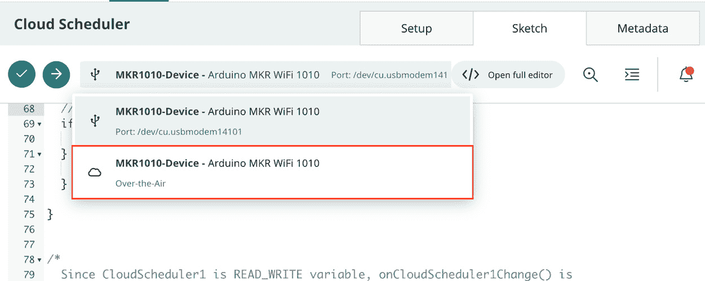

图 11.12 – 带有 OTA 更新功能的物理端口连接

我的设备连接到我的 MacBook，同时也通过 Wi-Fi 连接到 Arduino IoT Cloud。这就是为什么在前面的图中可以看到两个草图上传选项的原因。第一个是**端口**选项，仅在您的开发板直接连接到您的笔记本电脑/电脑时才可用，而第二个选项是**空中传输**，当您的代码在开发板上配置了网络设置并成功通过互联网连接到 Arduino IoT Cloud 时才可用。

选择**空中传输**选项，然后点击**草图上传**（绿色箭头图标）按钮；这将通过网络开始将您的更新代码上传到板子，而无需物理连接的干预。然而，您如何确认这是通过互联网完成的呢？只需将开发板从您的电脑上拔下，并用任何适配器供电，但请确保您的设备可以访问 Wi-Fi 路由器。

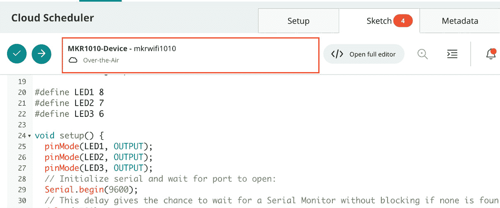

图 11.13 – 独立的空中传输更新选项

在断开与计算机的连接并通过电源适配器打开设备后，您将在您的**Sketch**标签中只看到**空中更新**选项。只需修改您的代码或添加一些额外的登录详细信息，然后点击**Sketch Uploading**（绿色箭头图标），在短时间内，您的代码将无缝地出现在开发板上。

根据我的经验，我常常认为我们应该有一个选项，通过这个选项我们可以修改/更新远程设备的代码，例如智能农业、仓库监控和工业监控设备，因为去偏远地方更新/修改代码非常困难。然而，Arduino IoT Cloud 的 OTA 功能使我们的生活总体上变得更加容易。有了 OTA 功能，我们可以节省时间和成本，并准时为设备提供正确的更新，而不会有任何延迟。

## OTA 的工作原理

让我们来谈谈 OTA 背后的工作原理。Arduino IoT Cloud 首先在云环境中根据所选设备编译代码，然后将这些编译文件存储在`OTA_REQ`标志为`true`时，它将从指定的 URL 开始下载编译文件。下载完成后，开发板将使用长度/CRC 检查验证下载的文件。下载验证后，板将开始使用最新的固件进行闪存。以下图展示了幕后发生的整个流程：

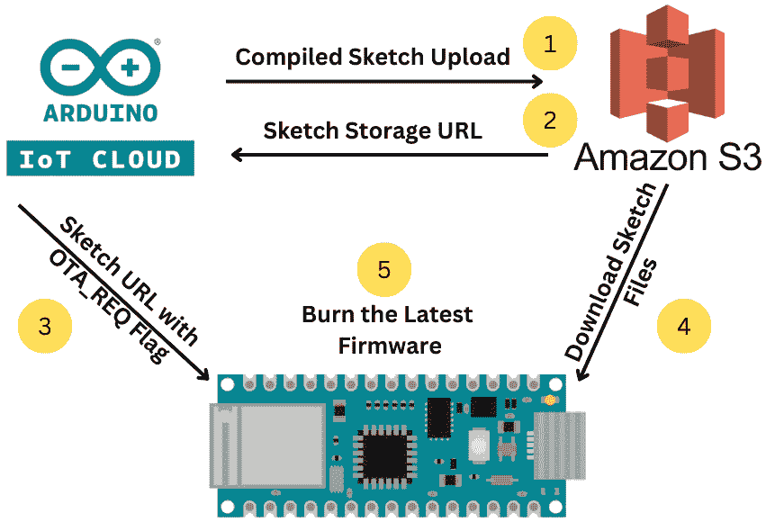

图 11.14 – Arduino IoT Cloud OTA 背后的工作原理

Arduino IoT Cloud 团队简化了这一过程的复杂性，并为开发者提供了 OTA 的单击选项。此图的目的是为您提供一个如何工作的概览，这可能会为您的未来开发提供新的想法。

在本节中，我们学习了如何实现 Arduino IoT Cloud 的 OTA 功能以发送固件 OTA。我们还讨论了 Arduino IoT Cloud 如何使用 Amazon S3 服务向设备发送固件更新。

# 摘要

在本章中，我们探讨了调度器以及我们如何使用 Arduino IoT Cloud 来自动化具有不同模式或随机操作模式的任务。我们使用简单的 LED 和 MKR Wi-Fi 1010 来演示多个调度器/定时器操作，这有助于您了解如何在现实世界的项目中使用此功能，例如在智能农业和智能工业中。

在本章的第二部分，我们探讨了 OTA。首先，我们讨论了 OTA 的优缺点以及我们如何利用它节省时间和成本。然后，我们使用 OTA 启用的发展板演示了 OTA 功能的使用，最后，我们探讨了 OTA 背后的工作原理。

在接下来的章节中，我们将实现一个医疗保健项目。你将学习如何使用心率传感器以及 Arduino 物联网云的 webhooks 功能，这些功能会将数据发送到第三方服务（**Zapier**）。我们将使用 Zapier 来设置一个*Zap*，该 Zap 将接收心率读数，如果读数超过或低于阈值，则会向指定人员发送电子邮件通知。
