# 12

# 项目 #6 – 跟踪和通知心率

本章致力于智能医疗保健和可穿戴设备。它展示了医疗设备如何与**Arduino IoT Cloud 平台**集成，并提供了 Arduino IoT Cloud 与第三方服务之间接口的示例。当测量的心率超过定义的心率阈值时，通知服务会向收件人发送通知。

在本章中，我们将通过使用**心率传感器**和 Seeed Studio 最新且非常小巧的开发板——**XIAO 系列**中的 XIAO ESP32C3，它具有许多功能——来实际探索智能健康和可穿戴设备。借助传感器的帮助、开发板和 Arduino IoT Cloud，我们将构建一个物联网智能健康解决方案。你还将学习如何设置 webhooks，以便将最新的心率值发送到 Zapier。最后，你将看到如何在 Zapier 中设置 Zaps，以便在心率数据上接收电子邮件/移动通知。

在本章中，我们将涵盖以下主要主题：

+   探索物联网智能健康解决方案

+   了解硬件组件——传感器和开发板

+   理解项目架构

+   设置事物、网络凭据、云变量和代码

+   设置网页和移动仪表板

+   设置通知服务

# 技术要求

以下硬件组件是完成本章练习所必需的：

+   Seeed Studio XIAO ESP32C3

+   XIAO ESP32C3 的 USB Type-C 线缆

+   脉搏传感器（在*了解硬件组件——传感器和开发板*部分找到完整详情和存储链接）

+   开发板上的公接头

+   跳线

对于编码，我们将使用**Arduino Web Editor**，它包含大量开发板和传感器库，以及用于事物和仪表板设置的 Arduino IoT Cloud。为了开发硬件和传感器设计，我们需要**Fritzing**桌面软件和**Arduino IDE**桌面软件，用于使用**串行绘图仪**对脉搏传感器进行校准，而串行绘图仪在 Arduino Web Editor 中不可用。

我们还将使用**Zapier**在传感器检测到心率超过我们指定的**每分钟跳动次数**（**BPM**）阈值时通过电子邮件发送警报。你可以根据项目需求使用免费/试用账户或购买 Zapier 专业计划，因为与免费账户相比，Zapier 专业计划提供了更多功能和功能。本章中使用的代码可在书籍的官方 GitHub 仓库[`github.com/PacktPublishing/Arduino-IoT-Cloud-for-Developers`](https://github.com/PacktPublishing/Arduino-IoT-Cloud-for-Developers)中找到。

# 探索物联网智能健康解决方案

**物联网**（**IoT**）在提供能够改善患者结果和降低医疗保健成本的智能医疗保健解决方案中发挥着重要作用。物联网设备可以收集实时数据，与其他设备通信，并生成有助于医疗保健提供者做出更好决策的见解。

以下是一些物联网在智能健康解决方案中应用的例子：

+   **远程患者监测**：物联网设备可用于实时监测患者健康状况，即使他们不在医院。可穿戴设备、传感器和医疗级物联网设备可以收集生命体征、心率、血糖水平和药物依从性的数据。医疗保健提供者可以使用这些数据提供个性化护理并防止并发症。

+   **远程医疗**：物联网设备可以启用虚拟咨询和远程医疗服务。患者可以通过视频会议与他们的医疗保健提供者沟通，医疗保健提供者可以通过物联网设备远程监测患者的健康状况。这可以提高医疗保健服务的可及性，降低医疗保健成本，并改善患者结果。

+   **智能药物管理**：物联网设备可以帮助患者更有效地管理他们的药物。物联网药物分配器可以在患者需要服药时提醒他们，并跟踪药物使用情况。医疗保健提供者可以使用这些数据提供个性化护理并防止用药错误。

+   **预测性维护**：物联网设备可用于监控医疗设备并预测何时需要维护。这有助于防止设备故障，减少停机时间，并改善患者结果。

+   **智能医院管理**：物联网设备可用于更有效地管理医院资源。例如，物联网资产跟踪系统可以帮助医疗保健提供者快速定位医疗设备，减少患者的等待时间。

总之，物联网可以启用改善患者结果和降低医疗保健成本的智能健康解决方案。医疗保健提供者可以使用物联网数据提供个性化护理并做出更明智的决策。随着物联网技术的不断发展，我们预计未来将看到更多创新的健康保健解决方案。

在本节中，我们讨论了物联网和智能医疗保健以及物联网如何对我们开发智能医疗保健产品有益。接下来，我们将探讨执行本章练习所需的硬件和传感器类型。

# 了解硬件组件——传感器和开发板

ESP32 系列提供了各种尺寸和引脚的开发板。在本章中，我们使用的是 Seeed Studio 的最新开发板，**XIAO ESP32C3**，因为它非常紧凑，尺寸比其他板更小，成本更低，并提供 5V 和 3.3V。*图 12.1*显示了我们将使用的 XIAO ESP32C3 的引脚图：

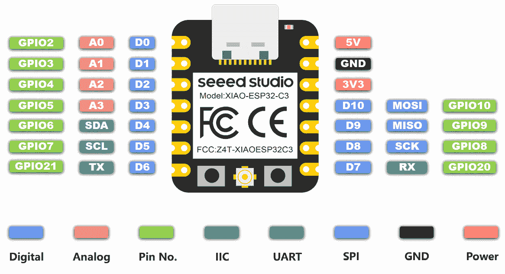

图 12.1 – XIAO ESP32C3 引脚图

XIAO ESP32C3 提供了多个数字输入/输出引脚。在之前的 ESP 系列板上，如 ESP8266，我们只有一个模拟引脚，但在这个开发板上我们有四个，这消除了在多个模拟引脚上开发解决方案时遇到的最大障碍。为了在之前的 ESP 系列板上解决这个问题，我们不得不使用 **ADS1115**/**ADS1015** 来增加额外的模拟引脚，因此这个开发板默认提供四个模拟引脚，可以为您节省一些费用。

除了这些特性，XIAO 提供了内置电池充电模块，并且该板针对功耗进行了优化，这使得该板非常适合开发可穿戴设备。对于连接性，Wi-Fi 和蓝牙都可用，包括 **低功耗蓝牙** (**BLE**) **5** 支持，这更适用于物联网用例。有关进一步详情，请访问 [`wiki.seeedstudio.com/XIAO_ESP32C3_Getting_Started/`](https://wiki.seeedstudio.com/XIAO_ESP32C3_Getting_Started/)。

对于我们当前的项目，我们需要一个用于 **脉冲传感器** 的模拟引脚和一个 5V 电源引脚。我们选择的开发板的一个优点是它有一个 5V 电源引脚，这在大多数 ESP32 系列开发板上是不存在的。

我们使用脉冲传感器来测量 BPM，但市场上还有各种其他用于 BPM 和脉搏测量的脉搏血氧计。以下脉冲传感器（*图 12*.*2*）是开源的，比其他传感器更便宜，也更易于使用。您也可以使用中国制造的脉冲传感器，但在使用这些传感器时需要控制条件。

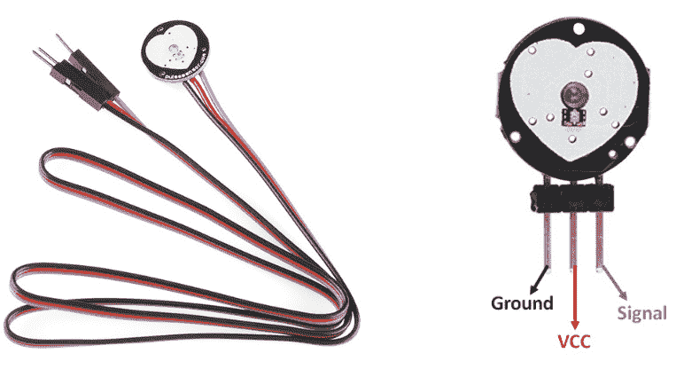

图 12.2 – 脉冲传感器及其引脚图

以下是可以购买原始脉冲传感器的官方商店列表：

+   **SparkFun**: [`www.sparkfun.com/products/11574`](https://www.sparkfun.com/products/11574)

+   **Adafruit**: [`www.adafruit.com/product/1093`](https://www.adafruit.com/product/1093)

+   **Amazon** **UK**: [`www.amazon.co.uk/dp/B01CPP4QM0`](https://www.amazon.co.uk/dp/B01CPP4QM0)

+   **Amazon** **USA**: [`www.amazon.com/PulseSensor-com-Original-Pulse-Sensor-project/dp/B01CPP4QM0`](https://www.amazon.com/PulseSensor-com-Original-Pulse-Sensor-project/dp/B01CPP4QM0)

前面的图显示了脉冲传感器的引脚布局。*引脚 #1* 是 GND 引脚，它连接到板上的 GND 引脚。*引脚 #2*，VCC，与 3.3V 和 5V 都兼容。*引脚 #3* 连接到板上的任何模拟引脚。我将它连接到板上的 *Pin #A1*。您可以将公头接到脉冲传感器上，或者直接焊接电缆而不使用任何头针。

测量脉搏是一个非常关键且困难的任务，但我们可以从由**世界著名的电子公司**发起的众筹项目[pulsesensor.com](http://pulsesensor.com)中受益。在这个网站上，你可以找到所有官方细节，包括规格、传感器的工作原理以及开发板代码示例。

重要提示

国产的脉搏传感器适合 DIY 项目，但即使是官方店铺的传感器，在没有使用实时**心电图**（**ECG**）、BPM 设备和医生验证的专业校准的情况下，也无法在实际应用场景中部署。

在本节中，我们讨论了脉搏传感器，以及你可以在哪里购买它，以及检查其引脚图以获得更好的理解。接下来，我们将检查项目架构，涵盖如何将传感器连接到 XIAO ESP32C3。

# 理解项目架构

在前面的章节中，我们详细讨论了传感器和开发板。现在，我们该开始着手制作食谱了。在硬件开发中，在我们开始使用传感器和开发板之前，我们需要开发设计概念，以便更好地理解事物如何连接。有许多软件可用于为电子项目设计和开发设计概念，但我们将使用 Fritzing。

在接下来的两个小节中，我们将涵盖原理图和项目设计，解释如何将引脚连接到开发板并进行焊接。接下来，我们将对*脉搏传感器读取阈值*进行一些校准，因为这对于不同的开发板是不同的。在我们将数据发送到云之前，这非常重要。

## 印制电路板设计和组装

设计的目的是清楚地了解传感器将如何连接到开发板。清晰的设计有助于工程师在**面包板**或**Veroboard**上开发原型。有效设计的另一个主要好处是，Fritzing 会根据你的设计在后台构建硬件原理图和 PCB 设计，然后设计师可以根据系统要求进行调整。*图 12.3*显示了项目原理图，展示了如何将脉搏传感器连接到 XIAO ESP32C3：


图 12.3 – XIAO ESP32C 和脉搏传感器系统设计

前面的设计图概述了如何将传感器连接到开发板。根据我们的设计，我们从开发板到脉搏传感器有 5V 和 GND。脉搏传感器是一个模拟传感器，因此我们将它的*信号*引脚连接到开发板的*A1*引脚。

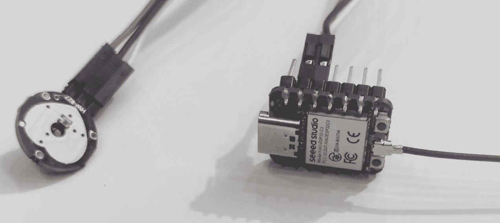

图 12.4 – 最终原型

在将公头焊接到脉冲传感器和 XIAO ESP32C3 之后，根据原理图连接引脚。只有一个传感器，因此不需要面包板。*图 12.4*显示了脉冲传感器直接通过跳线连接到 XIAO ESP32C3，而没有使用任何面包板或 Veroboard。现在，是时候校准脉冲传感器并通过将指尖放在传感器上来获取适当的阈值值了。

## 传感器校准

对于传感器校准，我们需要串行绘图器来识别脉冲值阈值。目前，Arduino Web 编辑器不支持串行绘图器，因此我们将使用 Arduino IDE。要使用 Arduino IDE，我们需要安装**Seeed Studio XIAO ESP32C3 系列**开发板和[pulsesensor.com](http://pulsesensor.com)库。

要在 Arduino IDE 中安装 ESP32 系列开发板，首先，在首选项中添加板的定义文件：

1.  导航到**文件** > **首选项**，并在**附加板管理器 URL**字段中填写以下 URL：[`raw.githubusercontent.com/espressif/arduino-esp32/gh-pages/package_esp32_dev_index.json`](https://raw.githubusercontent.com/espressif/arduino-esp32/gh-pages/package_esp32_dev_index.json)。

1.  然后，在搜索框中导航到`esp32`，选择**esp32**的最新版本，并安装它。

1.  最后，通过导航到**工具** > **板** > **ESP32 Arduino**并选择**XIAO_ESP32C3**来选择板。板列表有点长，您需要滚动到底部才能找到它。

是时候安装脉冲传感器库了。在搜索栏中导航到`pulsesensor playground`。这里只会返回一个库——安装它。

现在我们已经准备好进入校准步骤。导航到**文件** > **示例** > **PulseSensor Playground** > **入门项目**。在这里，您将获得校准的模板代码，我们将对其进行以下修改：

```cpp
//  Variables
int PulseSensorPurplePin = A1;        // Pulse Sensor PURPLE WIRE connected to ANALOG PIN 0
int LED = 10;   //  The on-board Arduino LED
```

将`PulseSensorPurplePin`变量设置为`A1`。请记住永远不要使用简单的`1`，因为它会给出不同的值。接下来，将`10`分配给`LED`变量。在这些修改完成后，将代码上传到板。要以图形格式监控记录的值，请导航到**工具** > **串行绘图器**。*图 12.5*显示了串行绘图器以图形形式展示所有值。阈值值由红色框标记。

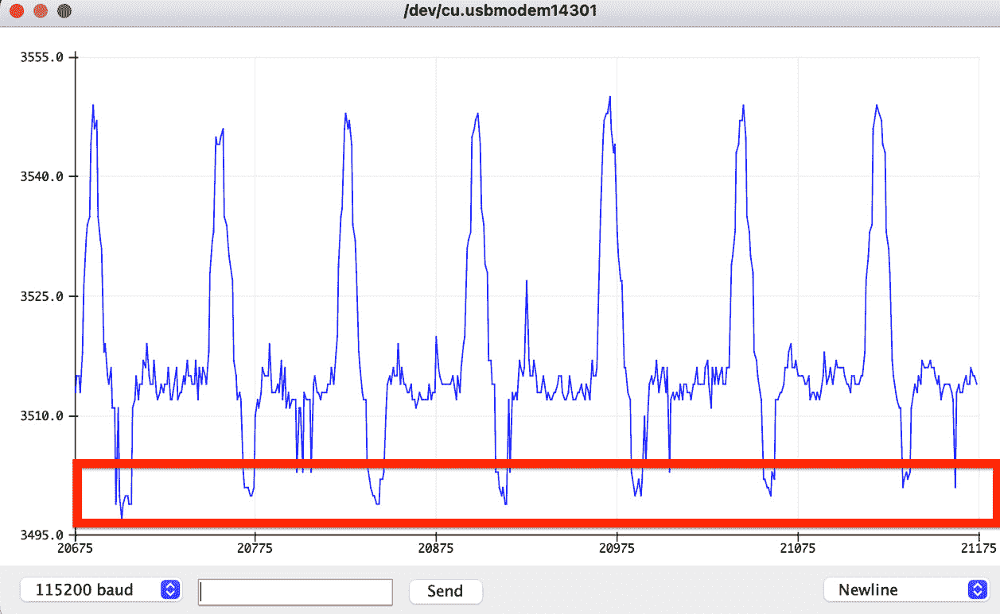

图 12.5 – 使用串行绘图器显示的脉冲传感器原始读取值图

将手指放在脉冲传感器的正面，上面有一个白色的心形标记。等待一段时间，让读取值在串行绘图器上稳定。几秒钟后，您应该看到如图所示稳定的读取值。将最低值标记为阈值。在我的情况下，我将**3500**作为阈值值以避免噪声。

之后，从 GitHub 仓库下载 *第十二章* 下的 `PulseSensor_BPM_Alternative` 代码（[B19752_12.xhtml#_idTextAnchor251]）。这是我们修改过的代码，我们将用它来显示 BPM。但在将代码上传到板子之前，请按照以下方式修改值：

```cpp
const int PULSE_INPUT = A1;
const int PULSE_BLINK = 10;
const int PULSE_FADE = 5;
const int THRESHOLD = 3450;   // Adjust this number to avoid noise when idle
```

将 `A1` 分配给 `PULSE_INPUT` 变量，将 `10` 分配给 `PULSE_BLINK`，并根据从 Serial Plotter 读取的稳定值设置 `THRESHOLD` 值。正如所述，我使用的是从我的图表中读取的 `3500`。将代码上传到板子，并在 Serial Monitor 中观察 BPM 读取值。将手指放在传感器的顶部，你会得到不同的 BPM 读取值。*图 12.6* 展示了它应该看起来是什么样子：

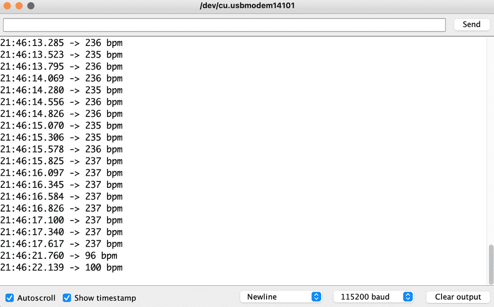

图 12.6 – 序列监视器中的 BPM 值

前面的图显示了随机的 BPM 值，当我们把手指放在传感器上时，它会检测到 **96** 和 **100** BPM。你可以玩一下传感器，并用任何专业智能手表验证读取值。接下来，我们需要在 Arduino IoT Cloud 中设置一个 Thing、一些代码和一个仪表盘，以准备我们的物联网项目。

# 设置 Thing、网络凭据、云变量和代码

在设置好硬件之后，现在是时候在 Arduino IoT Cloud 中设置一个 Thing 了。对于这个项目，我们需要一个云变量来从设备获取 BPM 读取值。由于我们使用的是 ESP 系列板，网络设置将与 Arduino IoT 开发板不同。*图 12.7* 展示了包括云变量、设备信息和网络配置在内的完整 Thing 详细信息：

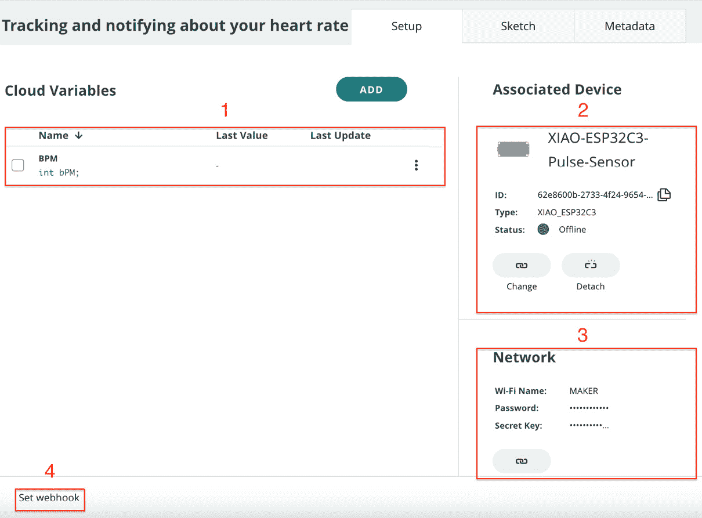

图 12.7 – 跟踪和通知心率 Thing 设置

设置一个新的 `Tracking and notifying about your heart rate`。然后，继续阅读本章的以下部分，它将带我们完成以下步骤：创建变量、关联设备、设置网络配置，最后应用代码：

1.  首先，我们需要为 **BPM** 设置一个云变量。有关云变量的详细信息，请参阅以下 *云变量* 部分。

1.  之后，我们需要将设备与 Thing 关联。在我们的当前项目中，我们使用的是 XIAO ESP32C3，因此向导将不同于 Arduino 板的向导。详细信息请参阅 *设备关联* 部分。

1.  接下来，我们需要为设备设置网络配置，但这次，我们需要为 ESP 系列板提供一个安全密钥，以确保连接的安全性（而 Arduino 兼容板在设备设置向导期间会自动由 Arduino IoT Cloud 配置）。

1.  最后，我们将在本章末尾设置 webhook，以及使用 Zapier 设置通知服务。

## 云变量

下表概述了我们在创建云变量时需要使用的属性。对于 BPM，我们可以只使用`整数`数据类型，但多亏了 Arduino IoT Cloud 扩展变量组，我们可以选择特定的`心率`变量类型。接下来，请确保您使用与表中相同的变量声明；否则，您将需要根据您自己的命名修改示例代码。

对于**权限**，虽然我们有**读/写**选项，但我选择了**只读**，因为我们只想从设备接收数据，而不是修改仪表板，因此**只读**模式将避免数据一致性问题。**更新策略**设置为**更改时**，因为设备将在检测到 BPM 值有任何变化时发送数据：

| **S#** | **变量名** | **变量类型** | **声明** | **权限** | **更新策略** |
| --- | --- | --- | --- | --- | --- |
| 1 | BPM | 心率 | `bPM` | 只读 | 更改时 |

表 12.1 – 我们事物的云变量

在本节中，我们创建了接收来自传感器设备的 BPM 心率值的云变量。在下一节中，我们将关联设备与事物。

## 设备关联

变量创建完成后，现在是时候添加设备并将其与事物关联起来。在添加设备之前，将开发板连接到计算机并打开**Arduino Create Agent**应用程序。*图 12.8*显示了设备设置向导，我们在下拉菜单中选择了**ESP32**，然后选择了**XIAO_ESP32C3**：

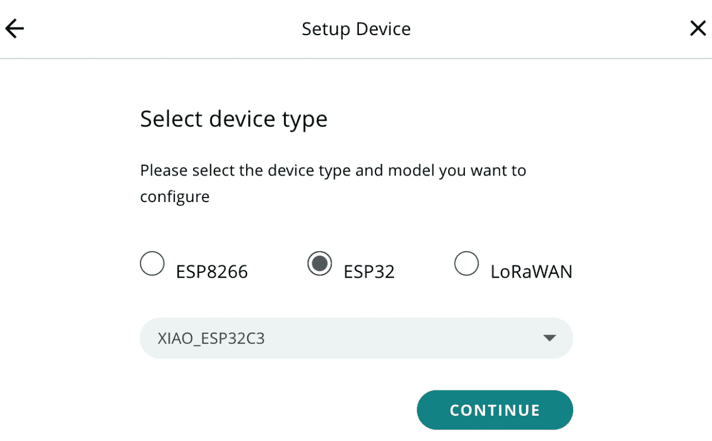

图 12.8 – 设备选择向导

1.  在事物页面上的**关联设备**部分下点击**选择设备**按钮。将弹出一个窗口，显示所有已可用的设备。如果您已经添加了您的 XIAO ESP32C3，请选择它。否则，点击**设置** **新设备**。

1.  然后，点击**第三方设备**选项。从下拉菜单中选择**ESP32**和**XIAO_ESP32C3**，然后点击**继续**按钮。

1.  在**设备名称**字段中填写，然后点击**下一步**按钮。

1.  在最后的向导屏幕上，将显示**设备 ID**和**密钥**值。将**密钥**值复制到安全的地方，因为它将在稍后的网络配置中需要。

在本节中，我们将 XIAO ESP32C3 设备与事物关联起来。设备关联过程与将 Arduino MKR1010 添加到事物中的过程有所不同。接下来，让我们完成网络设置。

## 网络

将设备与事物关联后，现在是时候配置设备通信的 Wi-Fi 设置了。使用*图 12.9*中所示表格填写您的**Wi-Fi 名称**和**密码**值。最后一个字段是**密钥**字段。粘贴我们在设备创建期间从系统中接收到的密钥值。

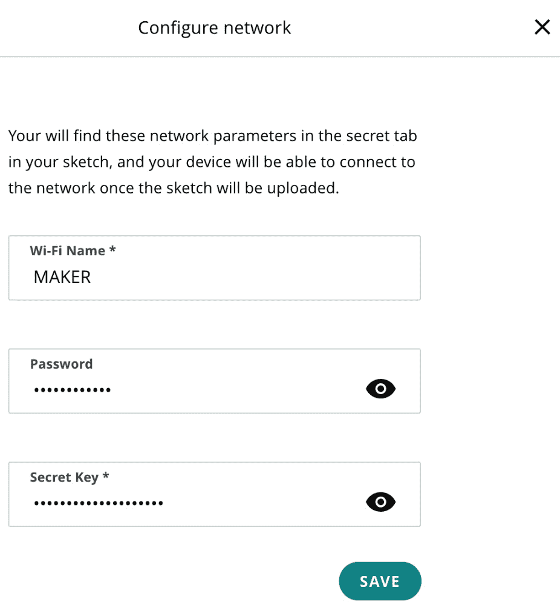

图 12.9 – 事物的网络配置

*图 12**.9*显示了输入所有相关值后应该看起来是什么样子。在下一小节中，我们将介绍设备的编码。

## 编程

本章的代码可在本书的官方 GitHub 仓库中找到。从仓库中下载`Tracking_and_notifying_Your_Heart_Rate_mar31a`代码，并将其导入 Arduino Web Editor。

你可以通过导航到**草图**选项卡来下载代码并将其添加到你的设备中。我们不会详细讨论代码，因为你在自己阅读代码后就会明白其要点，但我将解释我们初始化所有变量和常数的 main workflow。

记住永远不要使用`delay`方法，因为它会在`ArduinoCloud.update()`方法中创建阻塞。但在继续代码之前，我们需要将`PULSE_INPUT`变量设置为引脚`A1`，将`PULSE_BLINK`设置为数字引脚`10`用于 LED，并使用你的校准值设置`THRESHOLD`：

```cpp
const int PULSE_INPUT = A1;
const int PULSE_BLINK = 10;
const int PULSE_FADE = 5;
const int THRESHOLD = 3450; // Adjust this number to avoid noise when you will start getting values from sensor
```

在使用适当的值配置前面的变量之后，是时候探索循环方法了：

```cpp
  if (pulseSensor.sawNewSample()) {
    if (--samplesUntilReport == (byte) 0) {
      samplesUntilReport = SAMPLES_PER_SERIAL_SAMPLE;
      //pulseSensor.outputSample();
      if (pulseSensor.sawStartOfBeat()) {
          bPM=pulseSensor.getBeatsPerMinute();
           Serial.print(bPM);
           Serial.println(" bpm");
      }
    }
    /*******
      Here is a good place to add code that could take up
      to a millisecond or so to run.
    *******/
  }
  /******
     Don't add code here, because it could slow the sampling
     from the PulseSensor.
  ******/
```

在循环方法中，开发板会调用`pulseSensor.sawNewSample()`来获取新的样本，如果存在的话。除此之外，它不会调用任何活动，这就是为什么如果你在 BPM 数据中没有找到变化，你会看到返回的读取有延迟。如果传感器读取中发生了任何变化，则 BPM 读取将使用`pulseSensor.sawStartOfBeat()`方法进行验证。

在我们创建云变量的上一节中，回想一下云变量声明——我们的`pulseSensor.getBeatsPerMinute();`方法将传感器读取分配给那个`thingProperties.h`文件。所以，当你将这些值分配给这些常量时，循环中的`ArduinoCloud.update()`方法将自动将数据发送到云。最后，将代码上传到设备，并使用串行监视器验证返回的读取值。

重要提示

如果你使用了不同的*命名*在变量声明中，那么根据你的命名方案更新代码。然而，按照书中的步骤首先进行操作，然后稍后更改云变量名称并相应地修改你的代码会更好。

永远不要使用`delay`方法，因为它会在`ArduinoCloud.update()`方法中创建阻塞，并且不要在循环方法的末尾放置代码，因为它会导致脉搏传感器读取的延迟。

Arduino IoT Cloud 仅在变量值更改时才更新仪表板上的值。例如，如果心跳是`80`，并且 5 分钟后仍然相同，那么 Arduino IoT Cloud 将不会记录该值，所以如果你在图表上没有看到值的变化，请不要感到困惑。这个功能的另一个好处是，当你导出内容时，你将不会得到重复的数据。

在本节中，我们深入讨论了代码，并指导您了解代码操作以及如何设置阈值。在下一节中，我们将设置仪表板以不同格式可视化 BPM 值，以便更好地理解。

# 为网页和移动设备设置仪表板

在将代码上传到设备后，现在是时候设置网页和移动仪表板，以便使用不同的小部件可视化数据了。以下图示演示了这种可视化可能的外观：

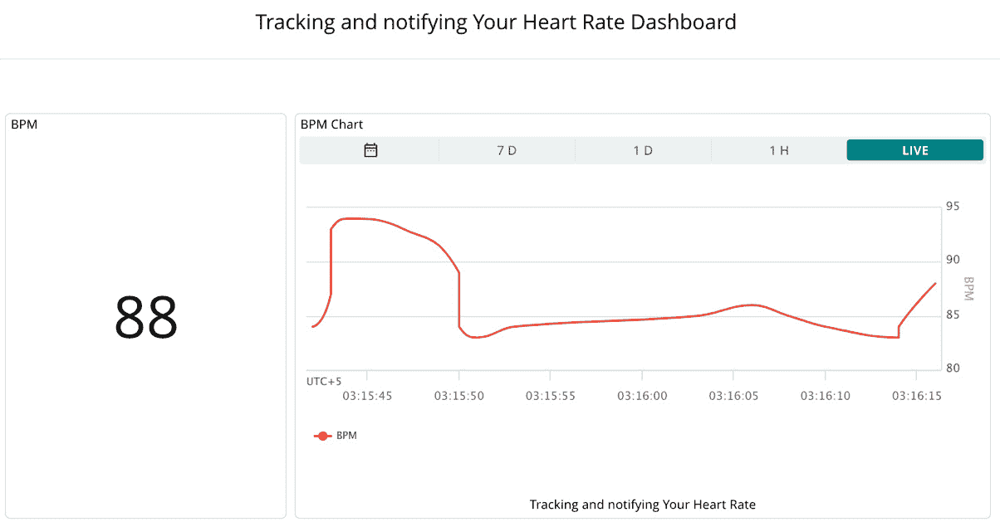

图 12.10 – 事物仪表板

在前面的图中，我们有一个 BPM 读数，为了可视化它，我们使用了两个小部件，**值**和**高级图表**。屏幕左侧的**值**小部件显示实时**BPM**值，而**高级图表**小部件展示了实时读数以及用于适当分析的历史读数，就像心电图机显示一样。这两个小部件都连接到 BPM 云变量。

**高级图表**小部件是新增的小部件之一，它包含各种功能，包括不同的图表格式，如线形图、样条图、样条图/线形图面积图和柱状图，以及自定义绘图颜色的选项。另一个重要功能是能够在同一图表上可视化多个云变量，这在简单的图表小部件中是不可用的。我们将在未来的项目中使用该功能进行适当的演示。

在本节中，我们简要讨论了一些小部件及其为何在我们的仪表板中使用。接下来，我们将使用 Zapier 设置通知服务，当脉冲检测到超过或低于我们的阈值时，将发送电子邮件/SMS。

# 设置通知服务

多个平台提供 **软件即服务** (**SaaS**) 基础设施，并作为各种应用程序之间的桥梁，使互操作性变得容易。此类平台包括 **Zapier**、**IFTTT** 和 **Integromat**，并提供接口将其他平台集成到 Arduino IoT 云平台中，以满足需求，而不是从头开始开发所需功能。

因此，首先，我们需要了解为什么我们需要 Zapier 自动化平台。在我们的当前项目中，我们希望在达到特定阈值时通过电子邮件/SMS 发送通知，但 Arduino IoT 云平台仅提供数据可视化、webhooks 和 API 功能。我们有两种解决此问题的方法。要么我们需要开发一个自定义解决方案，使用 Arduino webhooks 和 API 通过电子邮件/SMS 发送通知，或者我们可以使用自动化平台，如 Zapier 或 IFTTT，这比第一种方法节省时间和降低成本。

对于这个练习，我们将使用 Zapier，它将通过 **Arduino webhook** 接收数据。我们将在 Zaps 中应用 Zapier 过滤器来管理阈值，当阈值被超过时，Zapier 将发送关于 BPM 水平的电子邮件通知。*Zap* 是 Zapier 中用来描述允许连接应用程序和服务的自动化工作流程的术语，每个 Zap 可以包含多个操作。

在进行主要步骤之前，首先在 [zapier.com](http://zapier.com) 上注册并使用试用版，因为我们将要使用的 Zapier webhook 只在 *专业计划* 下可用。以下截图展示了设置我们的通知功能所需的触发器和两个操作：

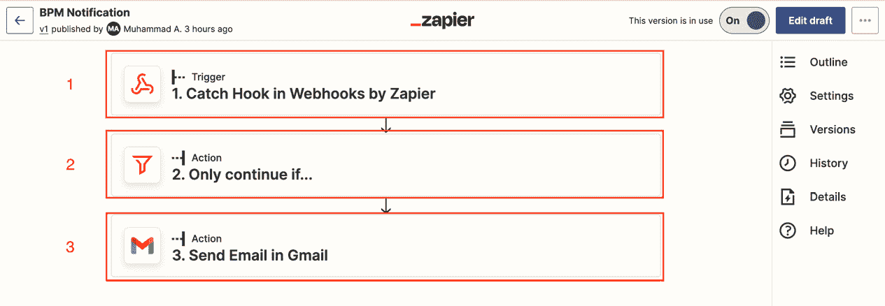

图 12.11 – Zapier 完整通知 Zap

创建此 Zap 的步骤，我们将在本节剩余部分进行操作，如下所示：

1.  首先，我们需要设置 **webhook 触发器**，它将提供一个 URL。这个 URL 应该通过点击 Arduino IoT Cloud Thing 页面上的 **设置 Webhook** 来插入到 **Thing** 中。这个触发器将负责接收来自 Arduino IoT Cloud 的数据。

1.  在第二步中，我们对 BPM 值应用过滤器，指定如果 BPM 大于 100 或小于 60，则进行下一个操作；否则，BPM 是正常的，不需要发送通知。

最后，我们将使用 **Zapier 的电子邮件** 或 **Gmail** 选项来发送通知。我们在 Zap 中添加了多个操作。为了使事情简单易管理，我们选择使用简单的电子邮件通知。或者，您也可以使用 **Twilio** 向收件人发送短信通知。

之前，我们已经逐步讨论了触发和发送通知所需的不同的触发器和操作。以下要点将指导您在 Zapier 中完成这些步骤：

1.  上一张截图大致展示了我们在 Zapier 中的设置。要在 Zapier 中创建一个新的 Zap，请点击 **创建** 按钮，然后选择 **新建 Zap**，这将打开一个新页面，您可以在其中选择所需的触发器和操作。

1.  在搜索栏中输入 `Webhook` 并选择 **Zapier Webhooks** 选项，这是在专业计划下可用的。点击 **事件** 并选择 **捕获钩子**，然后点击 **继续**。在 **触发器** 选项卡中，只需保持空的 **选择子键** 文本框不变，然后通过点击 **继续** 按钮进行下一步。

1.  在 **测试** 选项卡中，您将获得 **webhook URL** – 复制该 URL 并导航到 Arduino IoT Cloud 中的 **Thing**，然后点击 **设置 Webhook**。将 URL 插入弹出的窗口中，然后点击 **保存** 按钮。

返回 Zapier 并点击 **测试触发** 按钮以验证数据是否到达。在您验证之前，设备必须开启并连接到互联网以发送值。这可能不会在第一次尝试时成功；如果不成功，请再次尝试，您应该会看到数据到达，这意味着您已成功从 Arduino Thing 接收数据。*图 12*.12 显示了一个触发测试，展示了从 Arduino IoT Cloud 脉搏监测 Thing 接收到的值：

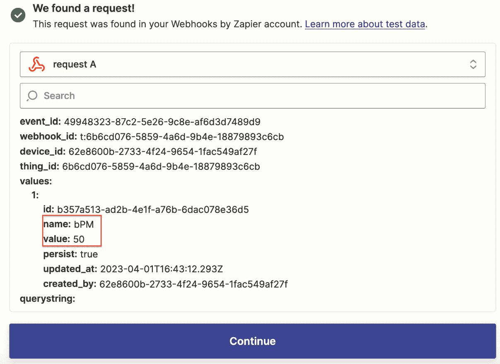

图 12.12 – 触发测试

上一张截图显示了 Zapier 成功从 Arduino IoT Cloud Thing 接收数据。在红色框中，我们可以看到 **bPM** 和 **value**。**value** 参数将在下一个动作中使用。点击 **继续** 按钮，将出现一个新的 **动作** 弹窗。在这里，我们需要配置过滤器动作，我们将设置 BPM 通知的阈值，如图 *12*.13 所示：

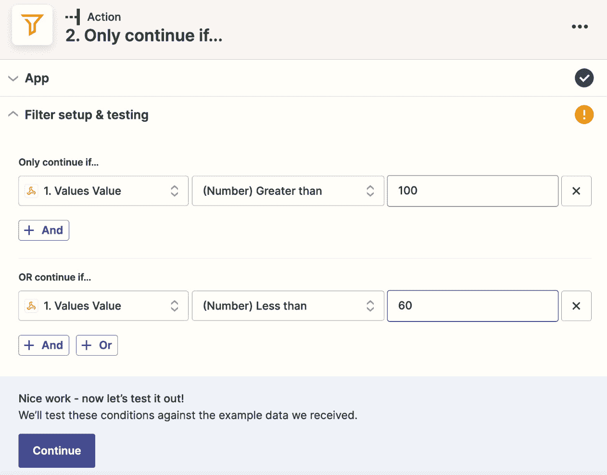

图 12.13 – 过滤器动作

在搜索框中输入 `Filter`，然后在下一个输入字段中选择 `100`。这会将上限阈值设置为 100 BPM。接下来，在下一个字段中点击 `60`。最后，点击 **继续**。

我们的过滤器已准备就绪；现在，我们需要电子邮件通知动作来完成设置。我们有两种发送电子邮件通知的方式：在搜索框中输入 `Email` 并点击 **通过 Zapier 发送电子邮件**。点击 **事件** 并选择 **发送出站电子邮件**。在下一个窗口中，设置电子邮件接收者、主题和正文的全部参数，如图下所示截图：

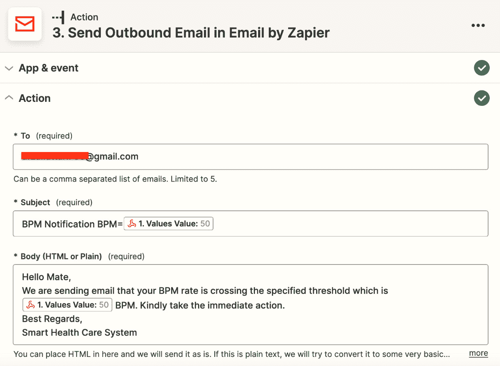

图 12.14 – 邮件通知设置

这里只有三个字段是必填的——在 **收件人** 字段中输入收件人电子邮件，为 **主题** 字段编写相关条目，并在 **正文** 区域中插入消息。是否填写其他字段或留空取决于您。如果您观察上一张截图，可能会注意到我在 **主题** 和 **正文** 字段中添加了 **Values Value**，这将显示触发通知的电子邮件中的值。点击页面底部的 **继续** 按钮并测试动作——如果您收到带有 BPM 值的电子邮件，那么发布 Zap 即可。

在本节中，我们使用 Zapier 为我们的脉搏监测器设置通知服务。我们创建了一个包含三个步骤的 Zap。首先，我们设置了负责接收数据的 webhook。第二步处理阈值，第三步和最后一步处理发送电子邮件通知。

# 接下来是什么？

有许多更多选项可供探索，但这些留给你去使用不同的健康传感器和开发板进行更多实验并从中学习。在当前章节中，我们只使用了一个传感器，它只提供了一个参数，但市场上有很多传感器提供了广泛的性能，包括血糖、血氧、血压、体温等的监测。

尝试以下传感器以增强你的实践知识，并从功能、范围和成本等方面将此选择与其他传感器进行比较：

+   LilyPad 温度传感器（[`www.sparkfun.com/products/8777`](https://www.sparkfun.com/products/8777)）

+   高灵敏度脉搏血氧仪和心率传感器，适用于可穿戴设备（[`www.seeedstudio.com/MAXREFDES117-HEART-RATE-AND-PULSE-OXIMETRY-MONITOR-p-2762.html?queryID=51de6141574a711bbe455cb4894ce3fb&objectID=411&indexName=bazaar_retailer_products`](https://www.seeedstudio.com/MAXREFDES117-HEART-RATE-AND-PULSE-OXIMETRY-MONITOR-p-2762.html?queryID=51de6141574a711bbe455cb4894ce3fb&objectID=411&indexName=bazaar_retailer_products)）

+   倒地检测模块（[`www.seeedstudio.com/24GHz-mmWave-Radar-Sensor-Fall-Detection-Module-p-5268.html`](https://www.seeedstudio.com/24GHz-mmWave-Radar-Sensor-Fall-Detection-Module-p-5268.html)）

+   开源 Arduino 血糖仪盾牌

+   MIKROE 系列健康传感器

# 摘要

在本章中，我们探讨了如何使用 XIAO ESP32C3 和一个脉搏传感器开发低成本可穿戴智能心率监测系统。需要注意的一个重要事项是在现场使用医疗传感器之前必须对其进行校准。我们设置了一个“事物”，其中包括云变量创建、设备关联、网络配置和为我们的开发板编写代码。后来，我们创建了一个仪表板，使用不同的小部件可视化我们的传感器读数，包括当前读数和历史数据，并通过图表帮助显示。最后，我们使用 Zapier 根据阈值设置基于 webhooks 的电子邮件通知服务，并了解了如何使用 webhooks 将第三方服务与 Arduino IoT Cloud 集成。

在下一章中，我们将学习如何在 Arduino IoT Cloud 中使用**Arduino Cloud CLI**（**CCLI**）进行脚本编写。这是一个通过终端命令提供对 Arduino IoT Cloud 服务访问的命令行工具。我们将使用 Arduino IoT Cloud CLI 来自动化大量操作，包括大量设备创建，这将帮助我们最小化操作和维护所需的时间。
