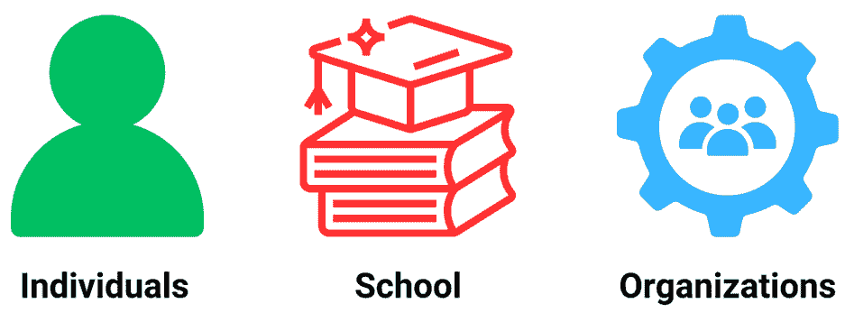
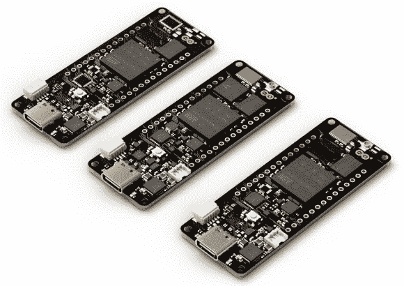
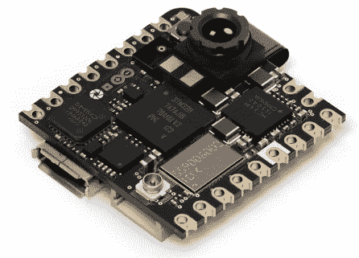
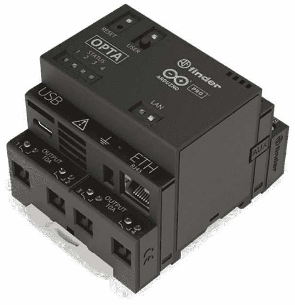
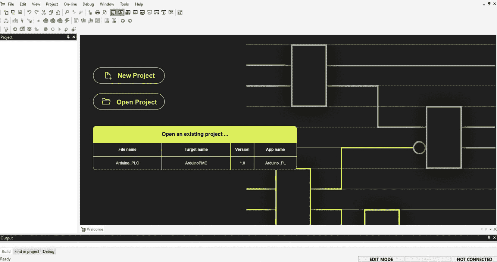

# 在 Arduino 物联网云中继续前进

**Arduino 物联网云**提供各种计划，每个计划都启用了不同级别的不同功能。在本章中，你将了解撰写时提供的不同选项，包括企业计划，以及它们提供的附加功能描述。

然后，你将被邀请通过实施和扩展具有更多功能的示例来实践之前章节中学到的内容。Arduino 物联网云是一个实时产品，始终在发展，本章将列出官方 Arduino 信息来源，让你能够监控任何更新和未来发布。

你还将了解专门为工业物联网解决方案设计的 Arduino PRO 硬件和软件工具。这些信息将帮助你为你的行业设计和构建专业解决方案。

在本章中，我们将涵盖以下主要主题：

+   Arduino 物联网云计划

+   Arduino PRO

+   更多资源和见解

# Arduino 物联网云计划

Arduino 物联网云为不同类型的实体提供不同的计划，每个实体都为用户提供了不同类型的定价计划。在 Arduino 物联网云中，主要有三种实体，包括个人、学校和机构，如图 14.1 所示。

图 14.1 – Arduino 物联网云计划的不同类别

Arduino 物联网云团队根据不同的类别和用户划分了定价计划，价格因类别而异。在这些类别中也有不同的定价计划。有关更新后的定价计划和功能，请访问[`cloud.arduino.cc/plans/`](https://cloud.arduino.cc/plans/)。

我们将在以下子节中逐步讨论所有类别，并在单独的章节中讨论商业计划。首先，我们将在下一子节中查看个人计划。

## 个人计划

首先，我们将从个人定价计划开始。这个类别专门为学习者、专业人士、创客、爱好者或任何希望作为个人实体学习或使用 Arduino 物联网云的人设计。对于他们，Arduino 物联网云有四个不同的计划，包括免费版、入门版、创客版和创客增强版。所有计划根据其功能有不同的定价，除了免费版，它对所有人免费提供，没有任何成本。

现在，我们将通过比较它们的限制、功能和成本，来讨论每个计划如何与其他计划不同，并在表 4.1 中列出。我们不会在这里比较所有功能，因为完整的详细信息可在 Arduino 物联网云计划页面上找到。在这里，我们只讨论重要功能。

| **功能** | **免费版** | **入门版** | **创客版** | **创客增强版** |
| --- | --- | --- | --- | --- |
| 设备数量 | 2 | 10 | 25 | 100 |
| 数据保留 | 1 天 | 15 天 | 90 天 | 1 年 |
| 云触发器 | 不可用 | 不可用 | 每天 100 通知 | 每天 400 通知 |
| 云变量 | 5 | 10 | 无限制 |
| API | 不可用 | 每秒 1 请求 | 每秒 10 请求 |
| 可分享仪表板 | 不可用 | 不可用 | 可用 |
| OTA | 不可用 | 可用 |
| 每年价格 | 免费 | 美元 23.88 | 美元 71.88 | 美元 239.98 |
| 每月价格 | 免费 | 不可用 | 美元 6.99 | 美元 23.99 |

表 14.1 – 个人计划功能比较

在 *表 14.1* 中，我们比较了不同计划的一些重要功能。首先，我们将探讨 *免费计划*，它只允许您创建两个设备。提供一天的数据保留，并且您可以为您的事物创建最多五个云变量。然而，云触发器、API 访问、可分享仪表板和（**OTA**）功能不可用。免费计划从学习角度来看是好的，您甚至可以托管多达两个个人物联网设备。

然后，我们有 *入门计划*，如果学生和爱好者想要在小规模上扩展他们的物联网设备，这个计划是完美的。此计划每年将花费他们 23.88 美元，并且仅提供年度计费，不提供月度计费。在这个计划中，您将获得 10 个设备，并保留 15 天的数据，每个设备最多有 10 个云变量。用户还将获得 API 和 OTA 功能的好处，但云触发器和可分享仪表板功能仍然不可用。

*maker 计划* 是这个类别中的第三个计划，适合那些设计和开发物联网解决方案并希望尝试 Arduino IoT Cloud 所有功能的用户。它每年花费 71.88 美元，并且可以按月支付。使用此计划，用户可以创建 25 个设备，并允许 90 天的数据保留（这对于数据记录来说是一个非常不错的选择）。此外，用户每天可以设置 100 个通知的云触发器，并且每秒允许 10 个 API 请求。

最后，我们有 *maker plus 计划*，这是物联网自由职业者或小型物联网初创企业的完美选择。在这个计划中，用户可以托管最多 100 个设备，并保留一年的数据，这对于专业的小规模部署来说是一个完美的组合，他们只需每年支付 239.98 美元或每月支付 23.99 美元。您可以在 *表 4.1* 或官方网站上查看 Maker Plus 计划的所有功能以及上述计划。

*机器学习工具* 对所有计划都是可用的，因此任何人都可以享受这一功能的益处，并将机器学习集成到他们的物联网解决方案中，使它们更加先进。这提供了在云端的强大机器学习功能，而无需任何麻烦。

让我们探讨一下针对自由职业者和小型物联网初创企业的 maker plus 计划的成本。此计划每年费用为 239.98 美元，允许您托管多达 100 个物联网设备。如果我们计算每个设备的成本，那么一年的成本大约为每个设备 2.40 美元，价格非常合理，而且基础设施和安全维护没有额外费用，因为这些需求都由 Arduino 物联网云平台团队管理。

在本小节中，我们详细讨论了适用于个人的不同 Arduino 云计划。在下一小节中，我们将探讨教育机构的计划。

## 学校计划

每个组织，例如谷歌、微软和亚马逊 AWS，都为教育机构提供特殊的定价计划，以帮助他们增长学生的知识和技能，根据最新的行业趋势进行准备。Arduino 物联网云平台也为学校、学院和大学提供特殊的定价计划。

除了特殊的定价计划外，Arduino 物联网云平台还为学生们提供免费计划，类似于个人免费计划。因此，我们不会讨论这一点，而是专注于定制化的学校计划。在学校计划类别中，价格根据学生人数而变化，但所有用户可用的功能都保持不变。*表 14.2*提供了根据学生人数的详细定价计划。有关学校的最新定价信息，请访问[`cloud.arduino.cc/plans`](https://cloud.arduino.cc/plans)。

| **学生人数** | **每位成员/每年的定价** |
| --- | --- |
| 5 至 50 名成员 | 每年每位成员 20 美元 |
| 51 至 100 名成员 | 每年每位成员 18 美元 |
| 101 名及以上成员 | 每年每位成员 15 美元 |

表 14.2 – 根据学生人数的学校定价计划

*表 14.2*说明了根据学生人数和每位成员的定价。让我们探讨一下他们为每位学校成员提供哪些功能。在学校计划中，每位成员可以创建多达 5 个设备，拥有无限的云变量和六个月的数据保留，这对于博士和硕士研究生来说非常好，因为他们可能需要从物联网设备收集数据以进行进一步的研究和实验，或者正在构建原型来解决现实世界的问题。此外，该计划每天提供 10 次云触发通知和每秒 10 次 API 请求。

Arduino 物联网云平台的学校计划也可以原生集成 Google Classroom 用户。这使得教师们可以通过 Google Classroom 轻松管理他们的学生、作业以及 Arduino 物联网云平台中的许多其他内容。Arduino 物联网云平台还提供符合**通用数据保护条例**（**GDPR**）的集中式计费和用户管理。

学生可以通过**GitHub Education**获得另一个优惠——**学生开发者包**。学生可以访问官方 GitHub 页面获取更多更新和新闻：[`education.github.com/pack#offers`](https://education.github.com/pack#offers)。根据 Arduino 和 GitHub 之间的当前协议，Arduino 提供为期六个月的 Arduino IoT Cloud 制造商计划免费服务，以及精选开发板的折扣。

在本小节中，我们深入探讨了教育定价计划和每个学生的特点。在下一节中，我们将详细探讨企业基础计划，该计划可以帮助您通过企业级功能扩展您的产品。

## 企业基础计划

在本节中，我们将首先探讨企业基础计划的基本功能，然后在不同的子节中，我们将探讨仅在企业计划中可用的专用功能，这些功能允许组织执行批量操作，如车队和设备管理。

企业基础计划专门为那些对将 Arduino IoT Cloud 作为解决方案部署和管理的主要基础设施感兴趣的组织设计。就定价和设备而言，该计划从 50 个设备的 42 美元起价，以 50 的倍数增加，最高可达 500 个。如果您有超过 500 个设备，则需要直接联系 Arduino 支持团队以获取定制定价计划。50 个设备的年费为 500 美元，每个设备每年 10 美元，每月大约 0.83 美元。这个每台设备的成本非常低廉，因为您不需要支付任何基础设施或开发费用、安全成本等。此计划还为您提供高级管理控制，这将使您的管理和操作比其他计划更容易。

企业计划中的**数据保留**期限为所有设备一年，每个设备都允许通过**云触发器**发送 20 条通知，以及每秒 10 次**API**请求。除了所有这些功能外，组织将通过票务系统获得**技术支持**，这在其他计划中不可用。

在本小节中，我们讨论了企业基础计划的基本功能。现在，我们将探讨在接下来的子节中基于角色的访问控制和车队管理。

### 基于角色的访问控制和车队管理

在企业层面，一个组织中通常有几位员工负责管理和执行不同的操作。组织根据员工的责任分配不同的访问级别是强制性的。为此，Arduino IoT Cloud 为组织提供了一个基于角色的访问控制系统，使他们能够轻松地为员工分配访问权限并根据其工作描述进行管理。

基于角色的访问控制确保了您的设备的安全性和安全性，并保护它们免受人为错误和错误的影响。借助基于角色的访问控制，您可以在项目协作中共享访问权限，并根据他们的管理责任将设备访问权限分配给不同级别的成员。

Arduino IoT Cloud 企业基础计划的另一个功能是编队管理。Arduino IoT Cloud 引入了此功能，以有效地轻松管理大量设备。编队管理包括设备过滤和分组功能、批量 OTA 更新、层次结构以及许多其他功能。

在本小节中，我们讨论了基于角色的访问控制和设备编队管理。在接下来的小节中，我们将探讨机器学习工具和 Portenta X8 Manager。

### 机器学习工具和 Portenta X8 Manager

随着人工智能和机器学习的快速发展，物联网解决方案将机器学习集成到其解决方案中已成为至关重要的需求，以便客户能够从其提高运营效率的能力中受益，例如预测性维护、异常检测和质量控制。

Arduino 团队与 Edge Impulse 合作，在 Arduino IoT Cloud 中提供机器学习集成。在 Edge Impulse 中，您可以通过将数据导入 Edge Impulse 或直接连接设备（如 Arduino Nano 33 BLE Sense、Arduino Nicla Vision、Arduino Portenta H7 或任何支持 Linux 的设备）来使用设备数据训练模型。此功能帮助开发人员和解决方案提供商使用图形用户界面和少量代码来训练模型。

然后，您可以使用 TinyML 将这些模型部署到 Arduino 支持的开发板上。有关详细信息，请访问[`cloud.arduino.cc/machine-learning-tools/`](https://cloud.arduino.cc/machine-learning-tools/)。在企业基础计划中，Arduino 每月收取 500 美元的机器学习服务费，包括每个任务 60 分钟，每月总计 1,000 分钟。

Portenta X8 Manager 是一个与 Arduino IoT Cloud 集成的专用扩展，旨在赋予用户保护和管理其 Portenta X8 Linux 发行版的能力。它提供了诸如**安全维护**、**容器化应用程序部署**和安全的**OTA**差异更新等基本功能。

Portenta X8 Manager 是为需要安全可靠地部署和管理大量 Portenta X8 设备的企业和组织设计的。它提供了一系列使其非常适合企业使用的功能，包括以下内容：

+   **安全 OTA 更新**：Portenta X8 Manager 使用安全的 OTA 更新过程确保设备始终使用最新的固件和安全补丁。

+   **容器化应用**：Portenta X8 管理器允许用户在其设备上部署和管理容器化应用。这使得部署和更新复杂应用变得容易，无需重新编程整个设备。

+   **基于角色的访问控制**（**RBAC**）：Portenta X8 管理器支持 RBAC，以便组织可以控制谁有权访问他们的设备和应用程序。

+   **审计日志**: Portenta X8 管理器提供审计日志功能，以便组织能够跟踪其设备和应用程序上的所有活动。

Portenta X8 管理器作为 Arduino IoT Cloud 企业基础计划的付费附加组件提供，该计划每月费用为 250 美元。更多详情，请参阅 **企业基础计划** 选项卡，该选项卡位于 **商业** 选项卡下的 Arduino IoT Cloud 计划页面中。

在本小节中，我们深入探讨了机器学习和 Arduino IoT Cloud 企业基础计划的 Portenta X8 管理器附加组件。在下一节中，我们将详细介绍 Arduino PRO 硬件和软件工具。

# Arduino PRO

Arduino PRO 是一个独立的产品线，包含硬件和软件类别中的专业工具。这些工具专门设计用于执行工业操作，例如航空、工业 4.0、医疗保健、机器人技术、智能城市和智能家庭/办公室中的操作。我们将在以下小节中逐步探索这些硬件和软件工具。

## Arduino PRO 硬件

Arduino PRO 是由 Arduino LLC 提供的产品线，该公司是流行的开源 Arduino 平台背后的公司。Arduino PRO 板卡是为那些对微控制器和电子有更深入理解的用户设计的，他们寻找的是比标准 Arduino 板卡提供更多功能和能力的板卡。这些板卡通常被创客、工程师和专业人士用于各种应用。

在以下小节中，我们将仅探讨三种类型的硬件；若要获取完整列表，请访问 [`www.arduino.cc/pro/platform-hardware/`](https://www.arduino.cc/pro/platform-hardware/)。

### Portenta 系列产品

Arduino Portenta 系列是一系列高性能的工业级板卡。这些板卡旨在能够同时执行高级代码，例如协议栈、机器学习，甚至是 MicroPython 或 JavaScript 这样的解释性语言，同时也能执行低级、实时任务。Portenta 系列在板卡的底部增加了两个 80 引脚的高密度连接器，确保了适用于广泛应用的扩展性。*图 14.2* 展示了 Portenta 系列的所有开发板。以下段落将逐步讨论这些板卡的详细信息。

图 14.2 – Portenta 系列开发板

在*图 14.2*中展示了 Arduino Portenta 系列中的一些开发板，以下列表详细介绍了这些板子：

+   **Portenta X8**：一块强大的工业级**系统级模块**（SOM），预装了 Linux 操作系统。由于其模块化容器架构，它能够运行设备无关的软件。它还提供板载 Wi-Fi/蓝牙低功耗连接，用于安全的操作系统/应用程序 OTA 更新。

+   **Portenta Max Carrier**：这款载板将 Portenta 模块转换为单板计算机或参考设计，从而实现高性能工业、建筑自动化和机器人应用的边缘 AI。

+   **Portenta H7 Lite Connected**：这款产品旨在为 AI 应用和低延迟控制解决方案提供 Portenta H7 的计算能力。通过移除高分辨率视频接口功能，它比完整的 H7 模块更具成本效益。

+   **Portenta H7 Lite**：一块允许您构建下一个智能项目的板子。它与 Arduino IoT Cloud 兼容，并允许您从世界任何地方连接设备、可视化数据、控制和共享您的项目。

+   **Portenta Machine Control**：这是一个完全集中化、低功耗的工业控制单元，能够驱动设备和机械。它可以使用 Arduino 框架或其他嵌入式开发平台进行编程。

注意，这些只是 Arduino Portenta 系列中的一小部分示例。您可以在[`store.arduino.cc/collections/portenta-family`](https://store.arduino.cc/collections/portenta-family)找到有关这些板子和其他相关产品的更多信息。

在本小节中，我们探讨了专门为工业用例设计的 Portenta 系列，它还支持包括 MicroPython 和 JavaScript 在内的不同编程语言。它还提供了并行执行并发操作的选择。在下一小节中，我们将探讨专门为语音和视觉设计的 Nicla 系列。

### Nicla 系列

Arduino Nicla 系列是一系列面向工业的板子，专为低功耗 AI、机器学习和机器视觉应用设计。这些板子配备了工业级传感器，并设计为自主、电池供电的系统。*图 14.3*展示了 Nicla Vision，但您可以访问官方网站查看 Nicla 系列的其他变体。

图 14.3 – Nicla Vision 开发板

这里是 Arduino Nicla 系列中可用的部分板子：

+   **Nicla Voice**：Arduino PRO 迄今为止最小的外形尺寸板子。它可以用于升级或改造现有机器和系统。由于其长电池供电自主性，它特别适合可穿戴产品，如头盔和智能手环。

+   **Nicla Vision**：一个方形板，配备 2 兆像素彩色摄像头传感器和其他内置设备，用于收集各种环境数据。它适用于边缘的基于机器视觉的应用。

注意，这些只是 Arduino Nicla 系列的一些示例。您可以在 [`www.arduino.cc/pro/hardware-nicla-family`](https://www.arduino.cc/pro/hardware-nicla-family) 找到有关这些板和其他相关产品的更多信息。

在这个小节中，我们讨论了 Nicla Voice 和 Nicla Vision，这两个开发板都是专门为工业用例设计的，在这些用例中，声音和视觉是控制机器过程的强制性要求，例如物流和装卸机器人。在下一小节中，我们将讨论 Arduino 的最新产品，即 Opta PLC。

### Opta PLC

Arduino Opta 是一个安全、易于使用的微 PLC，具有工业物联网功能，与 Finder 合作设计。它允许专业人士在利用开放且广为人知的 Arduino 生态系统的同时扩大自动化项目。Opta 板配备了强大的 STM32H747XI 双核 Cortex®-M7 + M4 MCU，可实现实时控制、监控和预测性维护应用。它支持安全的 OTA 固件更新，并通过其板载安全元素和 X.509 标准合规性建立从硬件到云的数据安全性。Opta 板还提供各种连接选项，如以太网、Wi-Fi 和蓝牙低功耗。*图 14.4* 显示了 Opta PLC；其他变体形状相同，但在通信功能上有所不同。

图 14.4 – Opta PLC

Arduino Opta 系列包括以下变体，如 *图 14.4* 所示（所有变体在形状上相同，但在连接性上不同，因此这里我只添加了一张图片）：

+   **Opta Lite**：这个变体具有板载以太网和 USB-C 编程端口

+   **Opta RS485**：除了以太网之外，这个变体还提供 RS485 半双工连接接口

+   **Opta Wi-Fi**：最通用的变体，提供 Wi-Fi/蓝牙低功耗连接

要编程 Arduino Opta 板，您可以使用 Arduino PLC IDE，它支持 IEC 61131-3 标准定义的五种编程语言 – 梯形图、功能块图、结构化文本、顺序功能图和指令列表。这使得 PLC 编程变得简单，并允许您快速编写 PLC 应用程序，或将现有的应用程序移植到 Arduino Opta 或 Portenta Machine Control。

如需了解更多关于 Arduino Opta 系列及其功能的信息，请访问 [`www.arduino.cc/pro/hardware-arduino-opta`](https://www.arduino.cc/pro/hardware-arduino-opta)。

在这些小节中，我们探讨了三种主要的顶级 Arduino PRO 硬件产品。在下一节中，我们将探讨 Arduino PRO 软件工具。

## Arduino PRO 软件

除了其硬件工具外，Arduino 还开发了 Pro 系列软件，包括**物联网云**、**IDE 2**、**Arduino CLI 应用程序**、**Arduino PLC IDE**和**语音识别引擎库**。有关这些工具的完整详细信息，请访问[`www.arduino.cc/pro/platform-software/`](https://www.arduino.cc/pro/platform-software/)。

在以下子节中，我们将介绍 Arduino PLC IDE 和语音识别引擎。

### Arduino PLC IDE

Arduino PLC IDE 是一个集成开发环境，允许您使用 IEC 61131-3 标准定义的五种编程语言来编程 Portenta Machine Control 和 Arduino Opta。这些语言如下：

+   梯形图

+   功能块图

+   结构化文本

+   顺序功能图

+   指令列表

Arduino PLC IDE 界面如图 14.5 所示，与 Arduino IDE 完全不同。它支持各种编程接口，如前所述，但 PLC 中著名的编程接口之一是梯形图，这是 PLC 工程师专门用于编程 PLC 的。

图 14.5 – Arduino PLC IDE

Arduino PLC IDE 提供了一个直观的用户界面（如图 14.5 所示），包括一套调试工具，包括监视窗口、带步骤执行的中断点、触发器、示波器功能和实时调试模式。它还通过快速移植解决方案扩展其功能，并允许通过集成草图编辑器将 PLC 编程与 Arduino 草图集成。这种协同作用使得这两个环境之间变量交换变得轻松，便于在软件应用程序中包含确定性循环任务和多任务处理。

Arduino PLC IDE 支持各种工业现场总线协议，包括 Modbus RTU、Modbus TCP 和 CANOpen。它提供了一套预安装的库和功能块，以及创建自定义库的选项。要使用 IEC 61131-3 编程，您需要使用 Arduino 官方商店提供的终身许可证密钥解锁硬件。

如需了解 Arduino PLC IDE 及其功能的信息，请访问官方页面[`www.arduino.cc/pro/software-plc-ide/`](https://www.arduino.cc/pro/software-plc-ide/)。

在本节中，我们讨论了 Arduino PLC IDE，它是专门为 Arduino Opta PLC 编程而设计的。Arduino PLC 支持五种不同的编程语言。在接下来的子节中，我们将探讨语音识别引擎库。

### 语音识别引擎库

**Arduino 语音识别引擎**是一个强大的软件库，它使您能够基于语音识别开发项目。它允许您通过语音命令与机器交互，无需语音训练或互联网连接。该库由全球语音识别领域的领导者 Cyberon 开发，旨在易于使用且与多个 Arduino 板和 Arduino IDE 兼容。它支持超过 40 种语言的语音命令，无论说话者的声音、语调或口音如何。您可以为不同的用户配置多个唤醒词和序列，无需为不同用户重新训练。

语音识别引擎非常适合各种应用，例如智能建筑和家庭自动化、信息亭、自动售货机、医院中的智能病床以及紧急警报系统。它能够倾听任何人对它说话，同时忽略背景噪音。

要开始使用 Arduino 语音识别引擎，您可以访问官方 Arduino 网站：[`www.arduino.cc/pro/software-speech-recognition-engine/`](https://www.arduino.cc/pro/software-speech-recognition-engine/)。它提供了一个功能强大的库，其中包含一个集成的 AI/ML 引擎，在基于音素建模方面表现出色。这个高级库能够在无需语音训练的情况下识别多个唤醒词和命令序列。该库与多个 Arduino 板兼容，无需额外的硬件、软件或互联网连接。

注意，还有一个名为 Nicla Voice 的 Arduino 板，这在 *Arduino PRO 硬件* 部分中已有讨论。该板在边缘实现了始终开启的语音和动作识别功能。它集成了来自 Syntiant 的神经决策处理器（NDP120），以运行多个 AI 算法。

在 Arduino PRO 部分及其子部分中，我们探讨了主要的 Arduino PRO 高端开发板，包括 Portenta 系列、Nicla 系列和 OPTA PLC 系列。我们还探讨了 Arduino PRO 软件，包括 Arduino PLC IDE 和语音识别引擎库。在接下来的部分，我们将介绍一些进一步的学习资源。

# 进一步的资源与见解

Arduino 根据最新的需求和趋势不断发展和完善其产品和服务的功能。因此，全面覆盖所有内容是有一定难度的。到目前为止，我仅仅提到了一些有用的资源，这些资源将帮助您了解最新的新闻和功能。

最好关注 Arduino 官方博客，获取其产品最新动态和更新，请访问 [`blog.arduino.cc/`](https://blog.arduino.cc/)。社区总是分享并帮助用户学习，所以加入增长最快的 Arduino 社区论坛，您可以通过以下链接找到：[`forum.arduino.cc/`](https://forum.arduino.cc/)。您还可以在 Arduino 项目中心分享您的项目，并从他人的项目中学习：[`projecthub.arduino.cc`](https://projecthub.arduino.cc)。为了与社区成员进行即时沟通，您可以加入 Discord 频道：[`discord.gg/jQJFwW7`](https://discord.gg/jQJFwW7)。

除了 Arduino 社区，您还可以成为其他全球知名创客社区的一部分，例如 [`Hackster.io`](https://Hackster.io) 和 [`instructables.com/`](https://instructables.com/)。在这些平台上，您将找到最新的项目以及完整的描述，这是保持自己更新的好方法。在从这些社区学习后，轮到您提交自己的 DIY 项目，以教育其他社区成员。上述两个社区还举办不同类别的比赛；尝试参加它们。

这里有一份其他 Arduino 资源列表，将帮助您进一步学习：

+   *Arduino 入门* 产品：[`www.arduino.cc/en/Guide`](https://www.arduino.cc/en/Guide)

+   文档：[`docs.arduino.cc/`](https://docs.arduino.cc/)

+   Arduino Cloud 文档：[`cloud.arduino.cc/resources`](https://cloud.arduino.cc/resources)

+   Arduino 编程语言的参考：[`www.arduino.cc/reference/en/`](https://www.arduino.cc/reference/en/)

+   Arduino IDE 文档的内置示例：[`docs.arduino.cc/built-in-examples/`](https://docs.arduino.cc/built-in-examples/)

+   内置库及其示例文档：[`docs.arduino.cc/library-examples/`](https://docs.arduino.cc/library-examples/)

+   Arduino 官方支持和知识库：[`support.arduino.cc/hc/en-us`](https://support.arduino.cc/hc/en-us)

+   Arduino 教育：[`www.arduino.cc/education`](https://www.arduino.cc/education)

+   硬件：[`www.arduino.cc/en/hardware`](https://www.arduino.cc/en/hardware)

+   专业硬件：[`www.arduino.cc/pro`](https://www.arduino.cc/pro)

在本节中，我们探讨了不同的在线资源，这些资源将帮助您了解最新发展，并成为在线创客社区的一员，保持自己进一步学习的热情。

# 摘要

在这一章中，我们探讨了个人、教育机构和企业组织的不同定价方案。所有方案都进行了深入讨论，我们还比较了方案以进一步探索差异。Arduino 物联网云根据用户需求提供不同计划的特性，具有不同的阈值。然后，我们深入探讨了 Arduino PRO 软件和硬件工具，使你能够在开发工业解决方案时做出明智的决定。最后，我们探讨了可以为你提供最新产品发展新闻和更新的进一步资源，我们还分享了用户可以通过成为会员从中受益的不同社区资源。

因此，在阅读这一章之后，你将能够确定你需要哪种定价方案来满足你的使用需求，并根据他们的需求指导你的组织或客户选择适合他们的 Arduino 云计划。你现在还了解 Arduino PRO 硬件开发板，包括 Portenta、Nicla 和 Opta 系列，以及 Arduino PRO 软件，包括 Arduino PLC IDE 和语音识别引擎。这条 Pro 线将帮助你识别和选择适用于你的专业和工业级解决方案的特定硬件和软件工具。最后，你现在知道如何通过跟踪提供的“进一步资源和见解”部分中的链接来保持自己更新。

当我们到达《Arduino 物联网云开发者指南》的结尾时，我希望这段旅程对你来说像对我一样富有启发性和回报。物联网的世界是一个充满无限可能性的领域，我们周围的事物变得更加智能、响应迅速和互联。

通过这些页面，我们探讨了物联网的基础知识，深入了解了 Arduino 物联网云的能力，并通过实际项目使我们的知识变得生动。我们拥抱了数据交换、高级脚本和提升我们生活的实用应用的力量。

记住，物联网开发是一场持续的冒险，无数的机会等待着你去发现。当你继续前进时，保持实验、创造和创新。世界需要你的想法、你的解决方案以及你对一个更智能、更互联的未来愿景。

无论你是新手还是经验丰富的开发者，我都鼓励你保持好奇心，持续学习，永不停止探索。物联网与 Arduino 的交汇处是创新蓬勃发展的地方，现在它就是你的游乐场。

感谢您与我一同踏上这段旅程。让我们为物联网和 Arduino 物联网云为我们的生活带来的无限可能性干杯。未来属于你们去创造。
