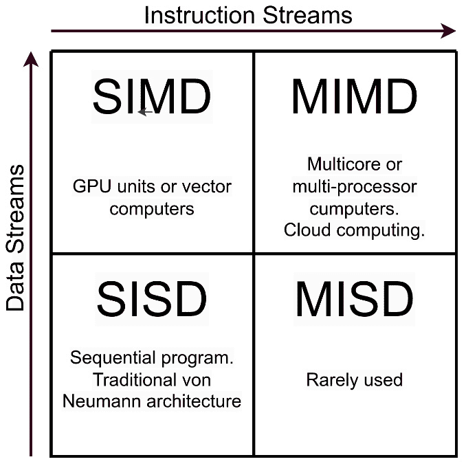
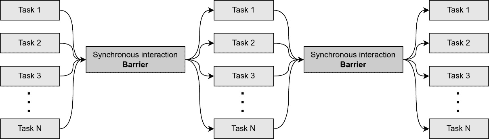
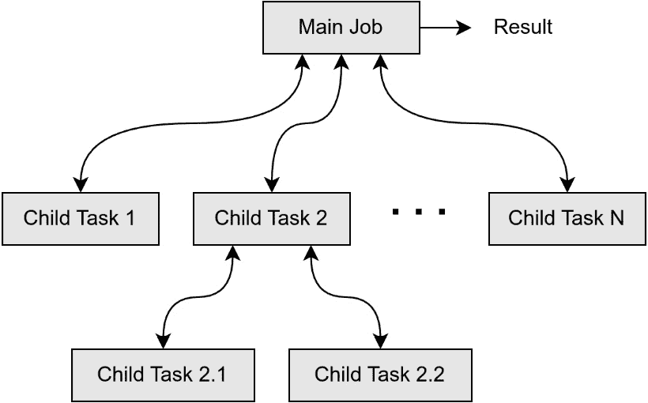
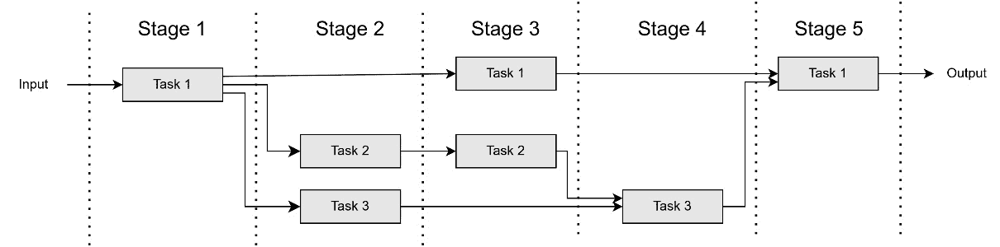
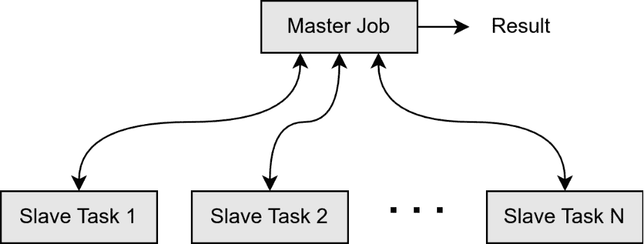
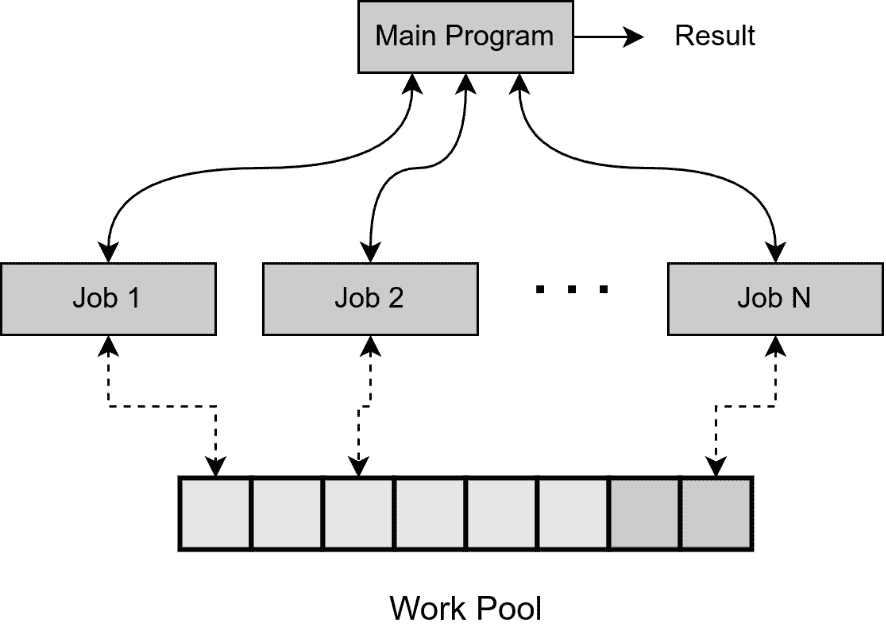
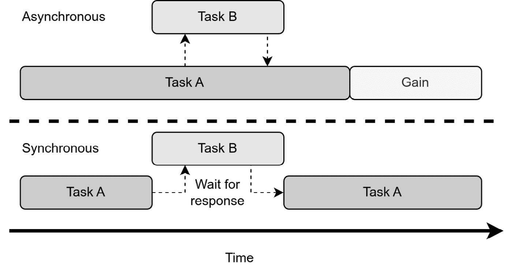
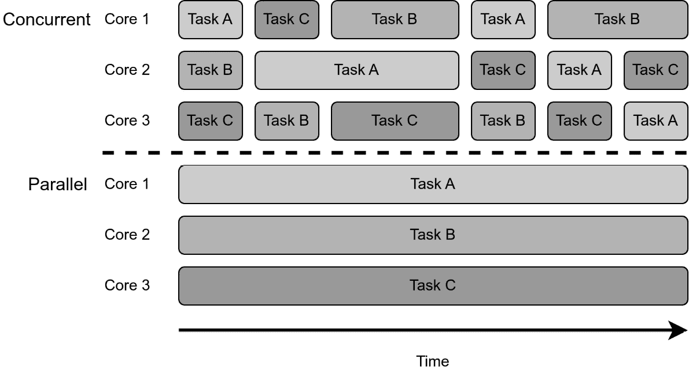
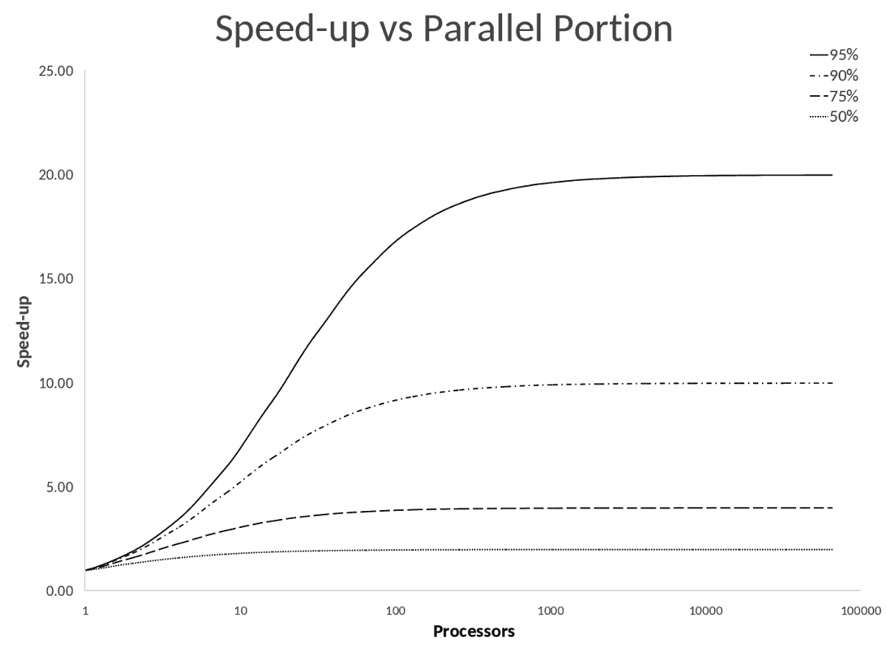

# 并行编程范式

在我们深入使用 C++进行**并行编程**之前，在前两章中，我们将专注于获取有关构建并行软件的不同方法以及软件如何与机器硬件交互的基础知识。

在本章中，我们将介绍并行编程以及我们在开发高效、响应和可扩展的并发和异步软件时可以使用的不同范式和模型。

在对我们可以采取的不同方法进行分类时，有许多方法可以分组概念和方法。由于我们在这本书中关注使用 C++构建的软件，我们可以将不同的并行编程范式分为以下几类：并发、异步编程、并行编程、响应式编程、数据流、多线程编程和事件驱动编程。

根据手头的问题，一个特定的范式可能比其他范式更适合解决特定场景。了解不同的范式将帮助我们分析问题并缩小最佳解决方案的范围。

在本章中，我们将涵盖以下主要主题：

+   什么是并行编程，为什么它很重要？

+   不同的并行编程范式有哪些，为什么我们需要了解它们？

+   在这本书中你将学到什么？

# 技术要求

本章没有技术要求。

在整本书中，我们将使用 C++20 开发不同的解决方案，在某些示例中，我们将使用 C++23。因此，我们需要安装 GCC 14 和 Clang 8。

本书展示的所有代码块都可以在以下 GitHub 仓库中找到：[`github.com/PacktPublishing/Asynchronous-Programming-with-CPP`](https://github.com/PacktPublishing/Asynchronous-Programming-with-CPP)。

# 了解分类、技术和模型

当任务或计算同时进行时，发生并行计算，其中任务是一个软件应用程序中的执行单元或工作单元。由于有许多实现并行化的方法，了解不同的方法将有助于编写高效的并行算法。这些方法通过范式和模型进行描述。

但首先，让我们从分类不同的并行计算系统开始。

## 系统分类和技术

1966 年，迈克尔·J·弗林对并行计算系统进行了最早的分类。弗林的分类法根据并行计算架构可以处理的数据流和指令数量定义了以下分类：

+   **单指令单数据（SISD）系统**：定义一个顺序程序

+   **单指令多数据（SIMD）系统**：在大型数据集上执行操作，例如在信号处理或 GPU 计算中

+   **多指令单数据（MISD）系统**：很少使用

+   **多指令多数据 (MIMD) 系统**：基于多核和多处理器计算机的最常见的并行架构

图 1.1：弗林分类法

这本书不仅关于用 C++ 构建软件，还关注它如何与底层硬件交互。在软件层面可能进行更有趣的划分或分类，在那里我们可以定义技术。我们将在后续章节中学习这些内容。

### 数据并行

许多不同的数据单元由同一程序或指令序列在 CPU 或 GPU 核心等不同的处理单元中并行处理。

**数据并行**是通过同一操作可以同时处理多少个不相交的数据集来实现的。大型数据集可以通过并行性被分割成更小且独立的块。

这种技术也具有高度的可扩展性，因为增加更多的处理单元可以处理更大的数据量。

在这个子集中，我们可以包括如 SSE、AVX、VMX 或 NEON 这样的 SIMD 指令集，这些指令集可以通过 C++ 的内建函数访问。还包括如 OpenMP 和 CUDA 这样的库，用于 NVIDIA GPU。一些使用示例可以在机器学习训练和图像处理中找到。这种技术与弗林定义的 SIMD 分类法相关。

如同往常，也有一些缺点。数据必须容易分割成独立的块。这种数据分割和后续合并也引入了一些开销，可能会降低并行化的好处。

### 任务并行

在每个 CPU 核心使用进程或线程运行不同任务的计算机中，当这些任务同时接收数据、处理数据并将通过消息传递生成的结果发送回来时，可以实现**任务并行**。

任务并行的优势在于能够设计出异构和细粒度的任务，这样可以更好地利用处理资源，在设计和解决方案时更加灵活，可能实现更高的加速比。

由于数据可能产生的任务之间的依赖性，以及每个任务的不同性质，调度和协调比数据并行更复杂。此外，任务创建还会增加一些处理开销。

在这里，我们可以包括弗林的 MISD 和 MIMD 分类法。一些示例可以在网络服务器请求处理系统或用户界面事件处理器中找到。

### 流并行

通过将计算分割成处理数据子集的各个阶段，可以并行处理数据元素连续序列，也称为**数据流**。

阶段可以并行运行。一些阶段生成其他阶段所需的输入，通过阶段依赖关系构建**管道**。处理阶段可以在不等待接收整个数据流的情况下，将结果发送到下一阶段。

流并行技术在处理连续数据时非常有效。它们也非常可扩展，因为可以通过添加更多处理单元来扩展，以处理额外的输入数据。由于流数据在到达时即被处理，这意味着不需要等待整个数据流发送完毕，这也意味着内存使用也得到了减少。

然而，像往常一样，也有一些缺点。由于它们的处理逻辑、错误处理和恢复，这些系统更难实现。我们可能还需要实时处理数据流，因此硬件也可能成为限制因素。

这些系统的例子包括监控系统、传感器数据处理以及音频和视频流。

### 隐式并行性

在这种情况下，编译器、运行时或硬件负责为程序员透明地并行化指令的执行。

这使得编写并行程序变得更容易，但限制了程序员对所使用策略的控制，甚至使得分析性能或调试变得更加困难。

现在我们已经更好地理解了不同的并行系统和技术，是时候学习在设计并行程序时可以使用的不同模型了。

## 并行编程模型

**并行编程模型**是用于表达算法和构建程序的并行计算机架构。模型越通用，其价值就越大，因为它可以在更广泛的场景中使用。在这方面，C++通过**标准模板库**（**STL**）中的库实现并行模型，可以用于从顺序应用程序中实现程序的并行执行。

这些模型描述了在程序的生命周期中，不同的任务如何相互作用以从输入数据中获得结果。它们的主要区别在于任务如何相互交互以及它们如何处理传入的数据。

### 阶段并行

在**阶段并行**，也称为议程或松散同步范式，多个作业或任务并行执行独立的计算。在某个时刻，程序需要使用屏障执行同步交互操作，以同步不同的进程。屏障是一种同步机制，确保在任一任务进一步执行之前，所有任务都达到它们执行中的特定点。接下来的步骤执行其他异步操作，依此类推。

图 1.2：阶段并行模型

此模型的优势在于任务之间的交互不会与计算重叠。另一方面，很难在所有处理单元之间达到平衡的工作负载和吞吐量。

### 分而治之

使用此模型的应用程序使用一个主要任务或作业，将工作负载分配给其子任务，将它们分配给更小的任务。

子任务并行计算结果并将其返回给父任务，在那里部分结果合并成最终结果。子任务还可以将分配的任务进一步细分，并创建自己的子任务。

这个模型与相位并行模型具有相同的缺点；难以实现良好的负载均衡。

图 1.3：分而治之模型

在*图 1.3*中，我们可以看到主工作如何将工作分配给几个子任务，以及**子任务 2**如何将其分配的工作进一步细分为两个额外的任务。

### 流水线

几个任务相互连接，构建一个虚拟流水线。在这个流水线中，各个阶段可以同时运行，在提供数据时重叠执行。

图 1.4：流水线模型

在前面的图中，三个任务在由五个阶段组成的流水线中交互。在每个阶段，一些任务正在运行，生成输出结果，这些结果被下一阶段的其他任务使用。

### 主从

使用**主从模型**，也称为**进程农场**，主工作执行算法的顺序部分，并产生和协调执行工作负载中的并行操作的从任务。当从任务完成其计算时，它会向主工作报告结果，主工作可能会随后发送更多数据给从任务进行处理。

图 1.5：主从模型

主要缺点是，如果主工作需要处理太多的从任务或任务太小，它可能会成为瓶颈。在确定每个任务要执行的工作量时存在权衡，这被称为**粒度**。当任务较小时，它们被称为细粒度，当任务较大时，它们被称为粗粒度。

### 工作池

在工作池模型中，一个全局结构持有待完成的工作项池。然后，主程序创建工作，从池中获取工作片段以执行。

这些工作可以生成更多的工作单元，并将它们插入工作池。当所有工作单元都完成且池为空时，并行程序完成其执行。

图 1.6：工作池模型

该机制有助于在空闲处理单元之间实现负载均衡。

在 C++中，这个池通常通过使用无序集合、队列或优先队列来实现。我们将在本书中实现一些示例。

既然我们已经了解了可以用来构建并行系统的各种模型，让我们探索可用的不同并行编程范式，以开发能够高效并行运行任务的软件。

# 理解各种并行编程范式

现在我们已经探讨了构建并行程序所使用的不同模型，是时候转向更抽象的分类，并通过探索不同的并行编程语言范式来了解如何编写并行程序的基本风格或原则。

## 同步编程

**同步编程**语言用于构建代码以严格顺序执行的程序。当一条指令正在执行时，程序会保持阻塞，直到指令完成。换句话说，没有多任务处理。这使得代码更容易理解和调试。

然而，这种行为使得程序在执行指令时对外部事件无响应，并且难以扩展。

这是最多编程语言（如 C、Python 或 Java）使用的传统范式。

这种范式特别适用于需要实时且有序响应输入事件的反应式或嵌入式系统。处理速度必须与环境施加的严格时间限制相匹配。

图 1.7：异步与同步执行时间

*图 1.7* 显示了系统中运行的两个任务。在同步系统中，任务 A 被任务 B 中断，只有在任务 B 完成其工作后才会继续执行。在异步系统中，任务 A 和 B 可以同时运行，因此可以在更短的时间内完成它们的工作。

## 并发编程

在**并发编程**中，可以同时运行多个任务。

任务可以独立运行，无需等待其他任务完成指令。它们还可以共享资源并相互通信。它们的指令可以异步运行，这意味着它们可以按任何顺序执行而不影响结果，增加了并行处理的可能性。另一方面，这也使得这类程序更难以理解和调试。

并发提高了程序的吞吐量，因为随着并发的增加，在时间间隔内完成的任务数量也增加（参见本章末尾“探索评估并行性的指标”部分中 Gustafson 定律的公式）。此外，它还实现了更好的输入和输出响应性，因为程序可以在等待期间执行其他任务。

并发软件中的主要问题是在正确地实现并发控制。在协调对共享资源的访问并确保不同计算执行之间发生正确的交互顺序时必须格外小心。错误的决定可能导致竞争条件、死锁或资源饥饿，这些内容在*第三章*和*第四章*中进行了深入解释。大多数这些问题通过遵循一致性或内存模型来解决，该模型定义了在访问共享内存时操作应该如何以及按何种顺序执行。

设计高效的并发算法是通过找到协调任务执行、数据交换、内存分配和调度的技术，以最小化响应时间并最大化吞吐量。

介绍并发的第一篇学术论文《解决并发程序控制问题》由迪杰斯特拉于 1965 年发表。互斥性也在此处被识别并解决。

并发可以在操作系统级别以抢占式的方式发生，其中调度器切换上下文（从一个任务切换到另一个任务）而不与任务交互。它也可以以非抢占式或协作式的方式发生，其中任务将控制权交给调度器，调度器选择另一个任务继续工作。

调度器通过保存运行程序的状态（内存和寄存器内容）来中断正在运行的程序，然后加载已恢复程序保存的状态并将控制权转交给它。这被称为**上下文切换**。根据任务的优先级，调度器可能允许高优先级任务比低优先级任务使用更多的 CPU 时间。

此外，一些特殊的操作系统软件，如内存保护，可能使用特殊的硬件来防止用户模式程序错误损坏监督软件。

这种机制不仅用于单核计算机，也用于多核计算机，允许执行比可用核心数更多的任务。

**抢占式多任务处理**还允许将重要任务提前调度以快速处理重要外部事件。当操作系统向这些任务发送触发中断的信号时，这些任务会唤醒并处理重要工作。

早期的 Mac 和 Windows 操作系统使用**非抢占式多任务处理**。这种技术至今仍在 RISC 操作系统上使用。Unix 系统从 1969 年开始使用抢占式多任务处理，成为所有 Unix-like 系统和从 Windows NT **3.1**和 Windows 95 开始的现代 Windows 版本的核心功能。

早期的 CPU 只能同时运行一条指令路径。通过在指令流之间切换，通过看似重叠的执行来在软件级别产生并行性的错觉，从而实现了并行性。

然而，在 2005 年，英特尔® 推出了多核处理器，这使得在硬件级别上可以同时执行多个指令流。这给编写软件时带来了一些挑战，因为硬件级别的并发现在需要被处理和利用。

C++ 从 C++11 开始支持并发编程，通过 **std::thread** 库。早期版本没有包括任何特定功能，因此程序员依赖于基于 Unix 系统中 POSIX 线程模型的平台特定库，或在 Windows 系统上依赖于专有的微软库。

现在我们更好地理解了并发是什么，我们需要区分并发和并行。并发发生在许多执行路径可以在重叠的时间段内交错执行时，而并行发生在这些任务由不同的 CPU 单元同时执行时，利用可用的多核资源。

图 1.8：并发与并行

并发编程被认为比并行编程更通用，因为后者有一个预定义的通信模式，而前者可以涉及任务之间任意和动态的通信和交互模式。

并行可以存在于没有并发（没有交错的时间段）的情况下，也可以在没有并行的情况下存在（通过在单核 CPU 上通过时间共享进行多任务处理）。

## 异步编程

异步编程允许一些任务在后台调度和运行，同时继续当前工作，无需等待计划中的任务完成。当这些任务完成后，它们将结果返回给主任务或调度器。

同步应用程序的一个关键问题是长时间操作可能会使程序对进一步的输入或处理无响应。异步程序通过接受新的输入来解决此问题，同时一些操作正在通过非阻塞任务执行，系统可以同时执行多个任务。这也允许更好的资源利用。

由于任务异步执行并在完成时返回结果，这种范式特别适合事件驱动程序。此外，它通常用于用户界面、Web 服务器、网络通信或长时间运行的后台处理。

随着硬件向单个处理器芯片上的多个处理核心发展，使用异步编程来利用所有可用的计算能力，通过在不同核心上并行运行任务，已经成为强制性的要求。

然而，异步编程有其挑战，正如我们将在本书中探讨的那样。例如，它增加了复杂性，因为代码不是按顺序解释的。这可能导致竞争条件。此外，错误处理和测试对于确保程序稳定性和防止问题至关重要。

正如我们将在本书中学到的，现代 C++还提供了异步机制，如协程，这些是可以在稍后挂起和恢复的程序，或者将`future`和`promise`作为异步程序中未知结果的代理，以同步程序执行。

## 并行编程

使用并行编程，可以在多个处理单元上同时执行多个计算任务，这些处理单元可以是同一台计算机上的所有处理单元（多核）或多台计算机（集群）。

主要有两种方法：

+   **共享内存并行性**：任务可以通过共享内存进行通信，这是一个所有处理器都可以访问的内存空间。

+   **消息传递并行性**：每个任务都有自己的内存空间，并使用消息传递技术与其他任务通信。

就像之前的范式一样，为了充分发挥潜力并避免错误或问题，并行计算需要同步机制来避免任务相互干扰。它还要求平衡负载以达到其全部潜力，以及在创建和管理任务时减少开销。这些需求增加了设计、实现和调试的复杂性。

## 多线程编程

多线程编程是并行编程的一个子集，其中程序被划分为多个线程，这些线程在同一个进程中执行独立的单元。线程之间共享进程、内存空间和资源。

正如我们之前提到的，共享内存需要同步机制。另一方面，由于不需要进程间通信，资源共享简化了。

例如，多线程编程通常用于实现**图形用户界面**（**GUI**）的响应性，流畅的动画，在 Web 服务器上处理多个客户端请求，或在数据处理中。

## 事件驱动编程

在事件驱动编程中，控制流由外部事件驱动。应用程序实时检测事件，并通过调用适当的事件处理方法或回调来对这些事件做出响应。

事件表示需要采取行动的动作。这个事件由事件循环监听，它持续监听传入的事件并将它们调度到适当的回调，该回调将执行所需操作。由于代码仅在发生动作时执行，因此这种范式通过资源使用和可扩展性提高了效率。

事件驱动编程对于处理用户界面、实时应用程序和网络连接监听器中的动作非常有用。

就像许多其他范式一样，增加的复杂性、同步和调试使得这种范式在实现和应用上变得复杂。

由于 C++是一种底层语言，因此使用回调或函数对象等技术来编写事件处理程序。

## 响应式编程

反应式编程处理数据流，这些是随时间连续的数据或值流。程序通常使用声明式或函数式编程构建，定义应用于流的操作符和转换的管道。这些操作通过调度器和**背压**处理机制异步发生。

当数据量超过消费者处理能力，他们无法处理所有数据时，就会发生背压现象。为了避免系统崩溃，反应式系统需要使用背压策略来防止系统故障。

这些策略包括以下内容：

+   通过请求发布者降低发布事件的速度来控制输入吞吐量。这可以通过遵循拉取策略实现，即发布者仅在消费者请求时发送事件，或者通过限制发送的事件数量，创建一个有限且可控的推送策略。

+   缓存额外的数据，这在数据突发或短时间内高带宽传输时特别有用。

+   通过丢弃一些事件或延迟它们的发布，直到消费者从背压状态中恢复。

因此，反应式程序可以是**基于拉取**或**基于推送**的。基于拉取的程序实现了从数据源主动拉取事件的经典案例。另一方面，基于推送的程序通过信号网络推送事件以到达订阅者。订阅者对变化做出反应而不阻塞程序，这使得这些系统非常适合对响应性至关重要的丰富用户界面环境。

反应式编程类似于事件驱动模型，其中来自各种来源的事件流可以进行转换、过滤、处理等。两者都增加了代码模块化，并适合实时应用。然而，也有一些不同之处，如下所示：

+   反应式编程对事件流做出反应，而事件驱动编程处理离散事件。

+   在事件驱动编程中，事件触发回调或事件处理器。在反应式编程中，可以创建一个包含不同转换操作符的管道，其中数据流将流动并修改事件。

使用反应式编程的系统软件的例子包括 X 窗口系统和 Qt、WxWidgets、Gtk+等库。反应式编程也用于实时传感器数据处理和仪表板。此外，它还应用于处理网络或文件 I/O 流量和数据处理。

在使用反应式编程时，要充分发挥其潜力，需要解决一些挑战。例如，调试分布式数据流和异步过程或通过微调调度器来优化性能是很重要的。此外，使用声明式或函数式编程使得通过反应式编程技术开发软件理解和学习起来更具挑战性。

## 数据流编程

使用**数据流编程**，程序被设计为一个有向图，节点代表计算单元，边代表数据流。节点仅在有可用数据时执行。这种范式是在 20 世纪 60 年代由麻省理工学院的 Jack Dennis 发明的。

数据流编程使代码和设计更易于阅读和清晰，因为它提供了不同计算单元及其交互的视觉表示。此外，独立节点可以在数据流编程中并行运行，增加并行性和吞吐量。因此，它类似于响应式编程，但提供了一种基于图的方法和视觉辅助来建模系统。

要实现数据流程序，我们可以使用哈希表。键标识一组输入，值描述要运行的任务。当给定键的所有输入都可用时，与该键关联的任务将被执行，生成可能触发哈希表中其他键的任务的额外输入值。在这些系统中，调度器可以通过对图数据结构进行拓扑排序来找到并行机会，按任务之间的相互依赖关系对不同的任务进行排序。

这种范式通常用于机器学习的大规模数据处理管道、来自传感器或金融市场数据的实时分析，以及音频、视频和图像处理系统。使用数据流范式的软件库示例包括 Apache Spark 和 TensorFlow。在硬件方面，我们可以找到数字信号处理、网络路由、GPU 架构、遥测和人工智能等方面的示例。

数据流编程的一种变体是**增量计算**，其中只有依赖于变化输入数据的输出被重新计算。这就像在 Excel 电子表格中某个单元格值改变时重新计算受影响的单元格一样。

现在我们已经了解了不同的并行编程系统、模型和范式，是时候介绍一些**指标**，这些指标有助于衡量并行系统的性能。

# 探索评估并行性的指标

指标是帮助我们了解系统性能并进行不同改进方法比较的测量。

这里有一些常用的指标和公式，用于评估系统中的并行性。

## 并行度

**并行度**（**DOP**）是一个指标，表示计算机同时执行的操作数量。它有助于描述并行程序和多处理器系统的性能。

当计算 DOP 时，我们可以使用可以同时进行的最大操作数，衡量没有瓶颈或依赖的理想情况。或者，我们可以使用平均操作数或特定时间点的并发操作数，反映系统实际实现的 DOP。可以通过使用分析器和性能分析工具来测量特定时间段内的线程数来进行近似。

这意味着 DOP 不是一个常数；它是一个动态指标，在应用程序执行过程中会发生变化。

例如，考虑一个处理多个文件的脚本工具。这些文件可以依次或同时处理，从而提高效率。如果我们有一台拥有**N**个核心的机器，并且我们想要处理**N**个文件，我们可以将一个文件分配给每个核心。

依次处理所有文件所需的时间如下：

![<mml:math   display="block"><mml:msub><mml:mrow><mml:mi>t</mml:mi></mml:mrow><mml:mrow><mml:mi>t</mml:mi><mml:mi>o</mml:mi><mml:mi>t</mml:mi><mml:mi>a</mml:mi><mml:mi>l</mml:mi></mml:mrow></mml:msub><mml:mo>=</mml:mo><mml:msub><mml:mrow><mml:mi>t</mml:mi></mml:mrow><mml:mrow><mml:mi>f</mml:mi><mml:mi>i</mml:mi><mml:mi>l</mml:mi><mml:mi>e</mml:mi><mml:mn>1</mml:mn></mml:mrow></mml:msub><mml:mo>+</mml:mo><mml:msub><mml:mrow><mml:mi>t</mml:mi></mml:mrow><mml:mrow><mml:mi>f</mml:mi><mml:mi>i</mml:mi><mml:mi>l</mml:mi><mml:mi>e</mml:mi><mml:mn>2</mml:mn></mml:mrow></mml:msub><mml:mo>+</mml:mo><mml:msub><mml:mrow><mml:mi>t</mml:mi></mml:mrow><mml:mrow><mml:mi>f</mml:mi><mml:mi>i</mml:mi><mml:mi>l</mml:mi><mml:mi>e</mml:mi><mml:mn>3</mml:mn></mml:mrow></mml:msub><mml:mo>+</mml:mo><mml:mo>⋯</mml:mo><mml:mo>+</mml:mo><mml:msub><mml:mrow><mml:mi>t</mml:mi></mml:mrow><mml:mrow><mml:mi>f</mml:mi><mml:mi>i</mml:mi><mml:mi>l</mml:mi><mml:mi>e</mml:mi><mml:mi>N</mml:mi></mml:mrow></mml:msub><mml:mo>≅</mml:mo><mml:mi>N</mml:mi><mml:mo>⋅</mml:mo><mml:mi>a</mml:mi><mml:mi>v</mml:mi><mml:mi>g</mml:mi><mml:mfenced separators="|"><mml:mrow><mml:msub><mml:mrow><mml:mi>t</mml:mi></mml:mrow><mml:mrow><mml:mi>f</mml:mi><mml:mi>i</mml:mi><mml:mi>l</mml:mi><mml:mi>e</mml:mi></mml:mrow></mml:msub></mml:mrow></mml:mfenced></mml:math>](img/1.png)

处理这些文件并行所需的时间如下：

![<mml:math   display="block"><mml:msub><mml:mrow><mml:mi>t</mml:mi></mml:mrow><mml:mrow><mml:mi>t</mml:mi><mml:mi>o</mml:mi><mml:mi>t</mml:mi><mml:mi>a</mml:mi><mml:mi>l</mml:mi></mml:mrow></mml:msub><mml:mo>=</mml:mo><mml:mi>m</mml:mi><mml:mi>a</mml:mi><mml:mi>x</mml:mi><mml:mfenced separators="|"><mml:mrow><mml:msub><mml:mrow><mml:mi>t</mml:mi></mml:mrow><mml:mrow><mml:mi>f</mml:mi><mml:mi>i</mml:mi><mml:mi>l</mml:mi><mml:mi>e</mml:mi><mml:mn>1</mml:mn></mml:mrow></mml:msub><mml:mo>,</mml:mo><mml:msub><mml:mrow><mml:mi>t</mml:mi></mml:mrow><mml:mrow><mml:mi>f</mml:mi><mml:mi>i</mml:mi><mml:mi>l</mml:mi><mml:mi>e</mml:mi><mml:mn>2</mml:mn></mml:mrow></mml:msub><mml:mo>,</mml:mo><mml:msub><mml:mrow><mml:mi>t</mml:mi></mml:mrow><mml:mrow><mml:mi>f</mml:mi><mml:mi>i</mml:mi><mml:mi>l</mml:mi><mml:mi>e</mml:mi><mml:mn>3</mml:mn></mml:mrow></mml:msub><mml:mo>,</mml:mo><mml:mo>⋯</mml:mo><mml:mo>,</mml:mo><mml:msub><mml:mrow><mml:mi>t</mml:mi></mml:mrow><mml:mrow><mml:mi>f</mml:mi><mml:mi>i</mml:mi><mml:mi>l</mml:mi><mml:mi>e</mml:mi><mml:mi>N</mml:mi></mml:mrow></mml:msub></mml:mrow></mml:mfenced></mml:math>](img/2.png)

因此，DOP 是**N**，即积极处理单独文件的活跃核心数。

并行化能够达到的速度提升有一个理论上的上限，这由**阿姆达尔定律**给出。

## 阿姆达尔定律

在一个并行系统中，我们可能会认为增加 CPU 核心的数量可以使程序运行速度加倍，从而将运行时间减半。然而，并行化的速度提升并不是线性的。在达到一定数量的核心后，由于上下文切换、内存分页等因素，运行时间不再减少。

阿姆达尔定律公式计算了并行化后任务可以实现的最高理论速度提升，如下所示：

在这里，**s**是改进部分的速度提升因子，**p**是可并行部分相对于整个过程的比率。因此，**1-p**代表任务不可并行（瓶颈或顺序部分）的比率，而**p/s**代表可并行部分实现的速度提升。

这意味着最大速度提升受限于任务的顺序部分。可并行化任务的比例越大（**p**接近**1**），最大速度提升增加得越多，直到达到速度提升因子（**s**）。另一方面，当顺序部分变得更大（**p**接近**0**）时，**Smax**趋向于**1**，这意味着无法实现改进。

图 1.9：处理器数量和并行化部分百分比的速度提升限制

并行系统中的**关键路径**由依赖计算的最长链定义。由于关键路径几乎无法并行化，它定义了顺序部分，从而定义了程序可以实现的更快的运行时间。

例如，如果一个过程的顺序部分代表运行时间的 10%，那么并行化部分的比例是**p=0.9**。在这种情况下，潜在的速度提升不会超过速度提升因子的 10 倍，无论有多少处理器可用。

## Gustafson 定律

Amdahl 定律公式只能用于固定大小的问题和增加资源。当使用更大的数据集时，并行化部分花费的时间增长速度远快于顺序部分。在这些情况下，Gustafson 定律公式更为乐观且更准确，因为它考虑了固定执行时间和随着额外资源增加的问题规模。

Gustafson 定律公式计算使用**p**个处理器获得的速度提升如下：

在这里，**p**是处理器的数量，**f**是剩余顺序任务的比例。因此，**(1-f)*p**表示通过将**(1-f)**任务分布在**p**个处理器上实现的加速，而**p**表示增加资源时所做的额外工作。

Gustafson 定律公式表明，当降低**f**时，速度提升受并行化影响，当增加**p**时，受可扩展性影响。

与 Amdahl 定律一样，Gustafson 定律公式是一个近似值，当测量并行系统改进时提供了有价值的视角。其他因素可能会降低效率，例如处理器或内存与存储之间的开销通信。

# 摘要

在本章中，我们学习了我们可以用来构建并行系统的不同架构和模型。然后我们探讨了可用来开发并行软件的各种并行编程范式的细节，并了解了它们的行为和细微差别。最后，我们定义了一些有用的指标来衡量并行程序的性能。

在下一章中，我们将探讨硬件和软件之间的关系，以及软件如何映射和与底层硬件交互。我们还将学习线程、进程和服务是什么，线程是如何调度的，以及它们如何相互通信。此外，我们还将涵盖进程间通信等内容。

# 进一步阅读

+   拓扑排序：[`zh.wikipedia.org/wiki/拓扑排序`](https://zh.wikipedia.org/wiki/拓扑排序)

+   C++ 编译器支持：[`zh.cppreference.com/w/cpp/compiler_support`](https://zh.cppreference.com/w/cpp/compiler_support)

+   C++20 编译器支持：[`zh.cppreference.com/w/cpp/compiler_support/20`](https://zh.cppreference.com/w/cpp/compiler_support/20)

+   C++23 编译器支持：[`zh.cppreference.com/w/cpp/compiler_support/23`](https://zh.cppreference.com/w/cpp/compiler_support/23)
