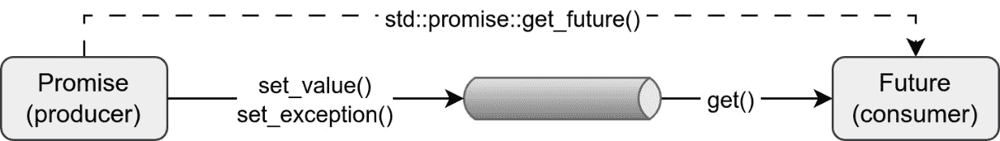
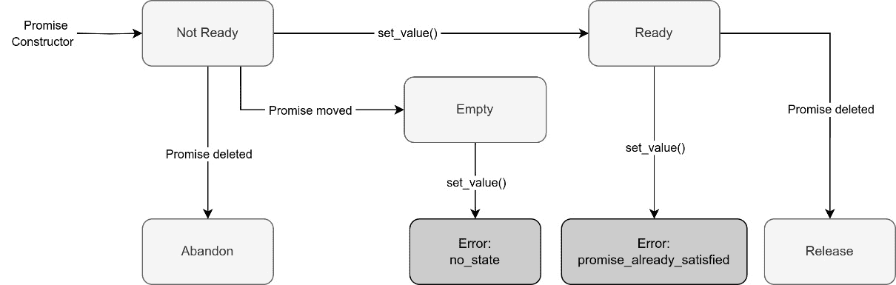
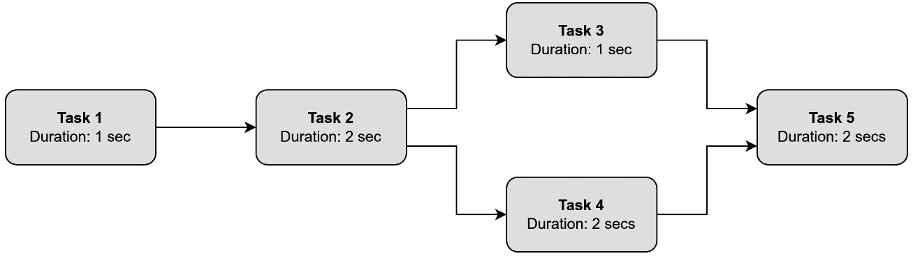

# 第六章：承诺和未来

在前面的章节中，我们学习了使用 C++管理和同步线程执行的基础知识。我们还在*第三章*中提到，要从线程返回值，我们可以使用承诺和未来。现在，是时候学习如何使用这些 C++特性来完成这一操作以及更多内容了。

**Futures**和**promises**是实现异步编程的基本块。它们定义了一种管理未来将完成的任务结果的方式，通常是在一个单独的线程中。

在本章中，我们将涵盖以下主要主题：

+   承诺和未来是什么？

+   共享未来是什么？它们与常规未来有何不同？

+   包裹任务是什么？我们何时使用它们？

+   我们如何检查未来的状态和错误？

+   使用承诺和未来的好处和缺点是什么？

+   真实场景和解决方案的示例

那么，让我们开始吧！

# 技术要求

承诺和未来自 C++11 以来就可用，但本章中的一些示例使用了 C++20 的特性，例如**std::jthread**，因此本章中显示的代码可以由支持 C++20 的编译器编译。

请参阅*第三章*中的*技术要求*部分，了解如何安装 GCC 13 和 Clang 8 编译器。

你可以在以下 GitHub 仓库中找到所有完整的代码：

[`github.com/PacktPublishing/Asynchronous-Programming-with-CPP`](https://github.com/PacktPublishing/Asynchronous-Programming-with-CPP)

本章的示例位于**Chapter_06**文件夹下。所有源代码文件都可以使用以下方式使用 CMake 编译：

```cpp
cmake . && cmake build .
```

可执行二进制文件将在**bin**目录下生成。

# 探索承诺和未来

**future**是一个表示未来某个不确定结果的物体，该结果将在未来某个时间完成。**promise**是提供该结果的一方。

承诺和未来自 C++11 版本起就是 C++标准的一部分，可以通过包含**<future>**头文件来使用，承诺通过**std::promise**类，未来通过**std::future**类。

**std::promise**和**std::future**对实现了一个单次生产者-消费者通道，其中承诺是生产者，未来是消费者。消费者（**std::future**）可以阻塞，直到生产者（**std::promise**）的结果可用。



图 6.1 – 承诺-未来通信通道

许多现代编程语言提供了类似的异步方法，例如 Python（使用**asyncio**库）、Scala（在**scala.concurrent**库中）、JavaScript（在其核心库中）、Rust（在其**标准库**（**std**）或如**promising_future**这样的 crate 中）、Swift（在 Combine 框架中），以及 Kotlin 等。

使用承诺（promises）和未来（futures）实现异步执行的基本原理是，我们想要运行的函数在后台执行，使用新线程或当前线程，而初始线程使用未来对象来检索函数计算出的结果。这个结果值将在函数完成后存储，因此同时，未来对象将用作占位符。异步函数将使用承诺对象将结果存储在未来的对象中，无需在初始线程和后台线程之间进行显式的同步机制。当初始线程需要该值时，它将从未来对象中检索。如果该值尚未准备好，初始线程的执行将被阻塞，直到未来对象准备好。

使用这个想法，使函数异步运行变得容易。我们只需要意识到该函数可以在单独的线程上运行，因此我们需要避免数据竞争，但结果通信和线程间的同步由承诺-未来对管理。

使用承诺和未来通过卸载计算提高了响应性，并且与线程和回调相比，提供了一种处理异步操作的结构化方法，我们将在本章中探讨。

让我们现在了解这两个对象。

## 承诺（Promises）

承诺在**<future>**头文件中定义为**std::promise**。

使用承诺，我们得到一个协议，即结果将在未来的某个时间点可用。这样，我们可以让后台任务执行其工作并计算结果。同时，主线程也将继续其任务，当需要结果时，请求它。那时，结果可能已经准备好了。

此外，如果抛出异常而不是返回有效值，承诺可以通信，并且它们将确保其生命周期持续到线程完成并将结果写入它。

因此，承诺是一种存储结果（值或异常）的设施，该结果稍后可以通过未来异步获取。承诺对象仅打算使用一次，之后不能修改。

除了结果外，每个承诺还持有共享状态。共享状态是一个内存区域，用于存储完成状态、同步机制以及指向结果的指针。它通过允许承诺存储结果或异常、在完成时发出信号以及允许未来对象访问结果（如果承诺尚未准备好则阻塞）来确保承诺和未来之间的适当通信和同步。承诺可以使用以下操作更新其共享状态：

+   **准备就绪**：承诺将结果存储在共享状态中，并将承诺的状态变为就绪，从而解除任何等待与承诺相关的未来对象的线程的阻塞。记住，结果可以是值（甚至可以是空值）或异常。

+   **释放**：承诺释放其对共享状态的引用，如果这是最后一个引用，则该引用将被销毁。这种内存释放机制类似于共享指针及其控制块所使用的机制。除非共享状态是由**std::async**创建且尚未处于就绪状态（我们将在下一章中学习这一点），否则此操作不会阻塞。

+   **放弃**：承诺存储了一个类型为**std::future_error**的异常，错误代码为**std::future_errc::broken_promise**，使共享状态准备好然后释放它。

可以使用其默认构造函数或使用自定义分配器来构造**std::promise**对象。在这两种情况下，都会创建一个新的承诺，其共享状态为空。承诺也可以使用移动构造函数来构造；因此，新的承诺将拥有其他承诺的共享状态。初始承诺将保持没有共享状态。

移动承诺在资源管理、通过避免额外复制进行优化以及保持正确的所有权语义的场景中很有用；例如，当承诺需要在另一个线程中完成、存储在容器中、返回到 API 调用的调用者或发送到回调处理程序时很有用。

承诺不能被复制（它们的复制构造函数或复制赋值运算符被删除），避免了两个承诺对象共享相同的共享状态，并在存储在共享状态中的结果时存在数据竞争的风险。

由于承诺可以被移动，它们也可以被交换。来自**标准模板库**（**STL**）的**std::swap**函数为承诺提供了模板特化。

当删除承诺对象时，相关的 future 仍然可以访问共享状态。如果删除发生在承诺设置值之后，共享状态将处于释放模式，因此 future 可以访问结果并使用它。然而，如果承诺在设置结果值之前被删除，共享状态将移动到放弃状态，并且 future 在尝试获取结果时将获得**std::future_errc::broken_promise**。

可以通过使用**std::promise**函数的**set_value()**来设置一个值，通过使用**set_exception()**函数来设置一个异常。结果以原子方式存储在承诺的共享状态中，使其状态准备好。让我们看一个例子：

```cpp
auto threadFunc = [](std::promise<int> prom) {
    try {
        int result = func();
        prom.set_value(result);
    } catch (...) {
        prom.set_exception(std::current_exception());
    }
};
std::promise<int> prom;
std::jthread t(threadFunc, std::move(prom));
```

在前面的例子中，创建了**prom**承诺并将其移动到**threadFunc** lambda 函数作为参数。由于承诺是不可复制的，我们需要使用按值传递并移动承诺到参数中，以避免复制。

在 lambda 函数内部，调用**func()**函数，并将结果存储在承诺中使用**set_value()**。如果**func()**抛出异常，它将被捕获并使用**set_exception()**存储到承诺中。正如我们稍后将要学习的，这个结果（值或异常）可以通过使用 future 在调用线程中提取。

在 C++14 中，我们还可以使用泛化 lambda 捕获将承诺传递到 lambda 捕获中：

```cpp
using namespace std::literals;
std::promise<std::string> prom;
auto t = std::jthread([prm = std::move(prom)] mutable {
    std::this_thread::sleep_for(100ms);
    prm.set_value("Value successfully set");
});
```

因此，**prm = std::move(prom)** 是将外部承诺 **prom** 移动到 lambda 的内部承诺 **prm** 中。默认情况下，参数被捕获为常量，所以我们需要将 lambda 声明为可变的，以便允许 **prm** 被修改。

**set_value()** 如果承诺没有共享状态（错误代码设置为 **no_state** ）或者共享状态已经存储了结果（错误代码设置为 **promise_already_satisfied** ），则可以抛出 **std::future_error** 异常。

**set_value()** 也可以不指定值使用。在这种情况下，它只是使状态准备好。这可以用作屏障，正如我们将在介绍 future 后在本章后面看到的那样。

*图 6.2* 显示了一个表示不同共享状态转换的图。



图 6.2 – Promise 共享状态转换图

有另外两个函数可以设置承诺的值，**set_value_at_thread_exit** 和 **set_exception_at_thread_exit** 。与之前一样，结果立即被存储，但使用这些新函数，状态不会立即准备好。状态在所有线程局部变量被销毁后，线程退出时才变为准备好。这在我们需要线程管理在退出前需要清理的资源时很有用，即使发生异常，或者如果我们想在线程退出时提供准确的日志活动或监控。

在抛出异常或同步机制以避免数据竞争方面，这两个函数的行为与 **set_value()** 和 **set_exception()** 相同。

现在我们已经了解了如何在承诺中存储结果，让我们来了解这对中的另一个成员，future。

## Futures

Future 定义在 **<future>** 头文件中，作为 **std::future**。

如我们之前所看到的，future 是通信通道的消费者端。它提供了访问承诺存储的结果的权限。

一个 **std::future** 对象必须通过调用 **get_future()** 从 **std::promise** 对象创建，或者通过 **std::packaged_task** 对象（本章后面将详细介绍）或调用 **std::async** 函数（在 *第七章* ）：

```cpp
std::promise<int> prom;
std::future<int> fut = prom.get_future();
```

与承诺一样，future 可以移动但不能复制，原因相同。为了从多个 future 中引用相同的共享状态，我们需要使用共享 future（在下一节 *共享 future* 中解释）。

**get()** 方法可以用来检索结果。如果共享状态仍然没有准备好，这个调用将通过内部调用 **wait()** 来阻塞。当共享状态准备好时，返回结果值。如果共享状态中存储了异常，那么这个异常将被重新抛出：

```cpp
try {
    int result = fut.get();
    std::cout << "Result from thread: " << result << '\n';
} catch (const std::exception& e) {
    std::cerr << "Exception: " << e.what() << '\n';
}
```

在前面的例子中，结果是通过使用**get()**函数从**fut**未来检索的。如果结果是值，它将以以**Result from thread**开头的行打印出来。另一方面，如果抛出了异常并将其存储到承诺中，它将被重新抛出并在调用线程中被捕获，并打印出以**Exception**开头的行。

调用**get()**方法后，**valid()**将返回**false**。如果由于某种原因在**valid()**为**false**时调用**get()**，行为是未定义的，但 C++标准建议抛出一个带有**std::future_errc::no_state**错误代码的**std::future_error**异常。当**valid()**函数返回**false**时，未来仍然可以被移动。

当一个未来被销毁时，它释放其共享状态引用。如果那是最后一个引用，共享状态将被销毁。除非在特定情况下使用**std::async**，否则这些操作不会阻塞，我们将在*第七章*中学习到这一点。

### 未来错误和错误代码

正如我们在前面的例子中看到的那样，一些处理异步执行和共享状态的功能可以抛出**std::future_error**异常。

这个异常类是从**std::logic_error**继承的，它反过来又是从**std::exception**继承的，分别定义在**<stdexcept>**和**<exception>**头文件中。

与 STL 中定义的任何其他异常一样，可以通过其**code()**函数或通过其**what()**函数使用解释性字符串来检查错误代码。

未来报告的错误代码由**std::future_errorc**定义，这是一个范围枚举（**enum class**）。C++标准定义了以下错误代码，但实现可能定义额外的代码：

+   **broken_promise**：当在设置结果之前删除承诺时报告，因此共享状态在有效之前被释放。

+   **future_already_retrieved**：当**std::promise::get_future()**被多次调用时发生。

+   **promise_already_satisfied**：当**std::promise::set_value()**报告共享状态已经有一个存储的结果时。

+   **no_state**：当使用某些方法但没有共享状态（因为是通过使用默认构造函数或移动创建的承诺）时报告。正如我们将在本章后面看到的那样，当调用某些包装任务（**std::packaged_task**）方法，例如**get_future()**、**make_ready_at_thread_exit()**或**reset()**，并且它们的共享状态尚未创建，或者当使用**std::future::get()**与尚未准备好的未来（**std::future::valid()**返回**false**）时，这种情况会发生。

### 等待结果

**std::future** 还提供了阻塞线程并等待结果可用的函数。这些函数是 **wait()**、**wait_for()** 和 **wait_until()**。**wait()** 函数将在结果准备好之前无限期地阻塞，**wait_for()** 在一段时间后，**wait_until()** 在达到特定时间后。所有这些函数都会在等待期间内结果可用时立即返回。

这些函数必须在 **valid()** 为 **true** 时调用。否则，行为是未定义的，但根据 C++ 标准建议抛出一个带有 **std::future_errc::no_state** 错误代码的 **std::future_error** 异常。

如前所述，使用 **std::promise::set_value()** 而不指定值将共享状态设置为就绪。这可以与 **std::future::wait()** 一起使用来实现一个屏障，并阻止线程在接收到信号之前继续执行。以下示例展示了这一机制的实际应用。

让我们先添加所需的头文件：

```cpp
#include <algorithm>
#include <cctype>
#include <chrono>
#include <future>
#include <iostream>
#include <iterator>
#include <sstream>
#include <thread>
#include <vector>
#include <set>
using namespace std::chrono_literals;
```

在 **main()** 函数内部，程序将首先创建两个承诺，**numbers_promise** 和 **letters_promise**，以及它们对应的未来，**numbers_ready** 和 **letters_ready**：

```cpp
std::promise<void> numbers_promise, letters_promise;
auto numbers_ready = numbers_promise.get_future();
auto letter_ready = letters_promise.get_future();
```

然后，**input_data_thread** 模拟了两个按顺序运行的 I/O 线程操作，一个将数字复制到一个向量中，另一个将字母插入到一个集合中：

```cpp
std::istringstream iss_numbers{"10 5 2 6 4 1 3 9 7 8"};
std::istringstream iss_letters{"A b 53 C,d 83D 4B ca"};
std::vector<int> numbers;
std::set<char> letters;
std::jthread input_data_thread([&] {
    // Step 1: Emulating I/O operations.
    std::copy(std::istream_iterator<int>{iss_numbers},
              std::istream_iterator<int>{},
              std::back_inserter(numbers));
    // Notify completion of Step 1.
    numbers_promise.set_value();
    // Step 2: Emulating further I/O operations.
    std::copy_if(std::istreambuf_iterator<char>
                               {iss_letters},
                   std::istreambuf_iterator<char>{},
                   std::inserter(letters,
                               letters.end()),
                               ::isalpha);
    // Notify completion of Step 2.
    letters_promise.set_value();
});
// Wait for numbers vector to be filled.
numbers_ready.wait();
```

当这个操作正在进行时，主线程通过使用 **numbers_ready.wait()** 停止其执行，等待对应的承诺 **numbers_promise** 准备就绪。一旦所有数字都被读取，**input_data_thread** 将调用 **numbers_promise.set_value()**，唤醒主线程并继续其执行。

如果字母尚未通过使用 **letters_ready** 未来的 **wait_for()** 函数读取，并且检查是否超时，那么数字将被排序并打印：

```cpp
std::sort(numbers.begin(), numbers.end());
if (letter_ready.wait_for(1s) == std::future_status::timeout) {
    for (int num : numbers) std::cout << num << ' ';
    numbers.clear();
}
// Wait for letters vector to be filled.
letter_ready.wait();
```

这段代码展示了主线程可以执行一些工作。同时，**input_data_thread** 继续处理传入的数据。然后，主线程将再次通过调用 **letters_ready.wait()** 等待。

最后，当所有字母都添加到集合中时，主线程将通过再次使用 **letters_promise.set_value()** 被信号唤醒，并且数字（如果尚未打印）和字母将按顺序打印：

```cpp
for (int num : numbers) std::cout << num << ' ';
std::cout << std::endl;
for (char let : letters) std::cout << let << ' ';
std::cout << std::endl;
```

正如我们在前面的例子中看到的，等待函数会返回一个未来状态对象。接下来，让我们学习这些对象是什么。

### 未来状态

**wait_for()** 和 **wait_until()** 返回一个 **std::future_status** 对象。

未来可以处于以下任何一种状态：

+   **Ready**：共享状态是 **Ready**，表示结果可以被检索。

+   **Deferred**：共享状态包含一个 **deferred** 函数，这意味着结果只有在明确请求时才会被计算。我们将在介绍 **std::async** 时学习更多关于延迟函数的内容。

+   **超时**：在共享状态准备好之前，指定的 **超时周期** 已经过去。

接下来，我们将学习如何通过使用共享未来在多个未来之间共享承诺结果。

## 共享未来

如我们之前看到的，**std::future** 只能移动，因此只有一个未来对象可以引用特定的异步结果。另一方面，**std::shared_future** 是可复制的，因此多个共享未来对象可以引用相同的共享状态。

因此，**std::shared_future** 允许从不同的线程安全访问相同的共享状态。共享未来对于在多个消费者或感兴趣方之间共享计算密集型任务的结果非常有用，可以减少冗余计算。此外，它们可以用作通知事件或作为同步机制，其中多个线程必须等待单个任务的完成。在本章的后面部分，我们将学习如何使用共享未来链式异步操作。

**std::shared_object** 的接口与 **std::future** 的接口相同，因此关于等待和获取函数的所有解释都适用于此处。

可以通过使用 **std::future::share()** 函数创建共享对象：

```cpp
std::shared_future<int> shared_fut = fut.share();
```

这将使原始未来失效（其 **valid()** 函数将返回 **false**）。

以下示例显示了如何同时将相同的结果发送到多个线程：

```cpp
#define sync_cout std::osyncstream(std::cout)
int main() {
    std::promise<int> prom;
    std::future<int> fut = prom.get_future();
    std::shared_future<int> shared_fut = fut.share();
    std::vector<std::jthread> threads;
    for (int i = 1; i <= 5; ++i) {
        threads.emplace_back([shared_fut, i]() {
            sync_cout << "Thread " << i << ": Result = "
                      << shared_fut.get() << std::endl;
        });
    }
    prom.set_value(5);
    return 0;
}
```

我们首先创建一个承诺 **prom**，从它获取未来 **fut**，最后通过调用 **share()** 获取共享未来 **shared_fut**。

然后，创建了五个线程并将它们添加到一个向量中，每个线程都有一个共享未来实例和一个索引。所有这些线程都将通过调用 **shared_future.get()** 等待承诺 **prom** 准备就绪。当在共享状态中设置值时，该值将可以通过所有线程访问。运行前一个程序的输出如下：

```cpp
Thread 5: Result = 5
Thread 3: Result = 5
Thread 4: Result = 5
Thread 2: Result = 5
Thread 1: Result = 5
```

因此，共享未来也可以用来同时向多个线程发出信号。

## 打包的任务

**打包的任务**，或 **std::packaged_task**，也在 **<future>** 头文件中定义，是一个模板类，它封装了一个将被异步调用的可调用对象。其结果存储在共享状态中，可以通过 **std::future** 对象访问。要创建 **std::packaged_task** 对象，我们需要定义模板参数，该参数表示将要调用的任务的功能签名，并将所需的函数作为其构造函数参数传递。以下是一些示例：

```cpp
// Using a thread.
std::packaged_task<int(int, int)> task1(
                      std::pow<int, int>);
std::jthread t(std::move(task1), 2, 10);
// Using a lambda function.
std::packaged_task<int(int, int)> task2([](int a, int b)
{
    return std::pow(a, b);
});
task2(2, 10);
// Binding to a function.
std::packaged_task<int()> task3(std::bind(std::pow<int, int>, 2, 10));
task3();
```

在前面的例子中，**task1** 是通过使用函数创建并通过使用线程执行。另一方面，**task2** 是通过使用 lambda 函数创建并通过调用其方法 **operator()** 执行。最后，**task3** 是通过使用 **std::bind** 的转发调用包装器创建。

要检索与任务关联的未来，只需从其 **packaged_task** 对象中调用 **get_future()**：

```cpp
std::future<int> result = task1.get_future();
```

与承诺和未来一样，可以通过使用默认构造函数、移动构造函数或分配器来使用没有共享状态的包装任务。因此，包装任务是移动-only 和不可复制的。此外，赋值运算符和交换函数的行为与承诺和未来类似。

包装任务的析构函数的行为类似于承诺的析构函数；如果在有效之前释放了共享状态，将抛出一个带有 **std::future_errc::broken_promise** 错误代码的 **std::future_error** 异常。与未来一样，包装任务定义了一个 **valid()** 函数，如果 **std::packaged_task** 对象有一个共享状态，该函数返回 **true**。

与承诺一样，**get_future()** 只能调用一次。如果这个函数被多次调用，将会抛出一个带有 **future_already_retrieved** 代码的 **std::future_error** 异常。如果包装的任务是从默认构造函数创建的，因此没有共享状态，错误代码将是 **no_state** 。

如前一个示例所示，存储的可调用对象可以通过使用 **operator()** 来调用：

```cpp
task1(2, 10);
```

有时候，只有在运行包装任务的线程退出并且所有其 **thread-local** 对象都被销毁时才使结果就绪是很有趣的。这是通过使用 **make_ready_at_thread_exit()** 函数实现的。即使结果直到线程退出才就绪，它也会立即计算，因此其计算不会被延迟。

例如，让我们定义以下函数：

```cpp
void task_func(std::future<void>& output) {
    std::packaged_task<void(bool&)> task{[](bool& done){
        done = true;
    }};
    auto result = task.get_future();
    bool done = false;
    task.make_ready_at_thread_exit(done);
    std::cout << "task_func: done = "
              << std::boolalpha << done << std::endl;
    auto status = result.wait_for(0s);
    if (status == std::future_status::timeout)
        std::cout << "task_func: result not ready\n";
    output = std::move(result);
}
```

这个函数创建了一个名为 **task** 的包装任务，将其布尔参数设置为 **true**。从这个任务中也创建了一个名为 **result** 的未来对象。当通过调用 **make_ready_at_thread_exit()** 执行任务时，其 **done** 参数被设置为 **true**，但未来结果仍然没有被标记为就绪。当 **task_func** 函数退出时，**result** 未来对象被移动到通过引用传递的位置。此时，线程退出，**result** 未来对象将被设置为就绪。

因此，如果我们使用以下代码从主线程调用此任务：

```cpp
std::future<void> result;
std::thread t{task_func, std::ref(result)};
t.join();
auto status = result.wait_for(0s);
if (status == std::future_status::ready)
    std::cout << «main: result ready\n»;
```

程序将显示以下输出：

```cpp
task_func: done = true
task_func: result not ready
main: result ready
```

**make_ready_at_thread_exit()** 如果没有共享状态（**no_state** 错误代码）或任务已经被调用（**promise_already_satisfied** 错误代码），将抛出 **std::future_error** 异常。

包装任务的状态也可以通过调用 **reset()** 来重置。这个函数将放弃当前状态并构建一个新的共享状态。显然，如果在调用 **reset()** 时没有状态，将抛出一个带有 **no_state** 错误代码的异常。重置后，必须通过调用 **get_future()** 来获取一个新的未来对象。

以下示例打印了前 10 个 2 的幂次方数。每个数字都是通过调用相同的 **packaged_task** 对象来计算的。在每次循环迭代中，**packaged_task** 被重置，并检索一个新的未来对象：

```cpp
std::packaged_task<int(int, int)> task([](int a, int b){
    return std::pow(a, b);
});
for (int i=1; i<=10; ++i) {
    std::future<int> result = task.get_future();
    task(2, i);
    std::cout << "2^" << i << " = "
              << result.get() << std::endl;
    task.reset();
}
```

执行前述代码的输出如下：

```cpp
2¹ = 2
2² = 4
2³ = 8
2⁴ = 16
2⁵ = 32
2⁶ = 64
2⁷ = 128
2⁸ = 256
2⁹ = 512
2¹⁰ = 1024
```

正如我们将在下一章中学习的，**std::async**提供了一种更简单的方法来实现相同的结果。**std::packaged_task**的唯一优点是能够指定任务将在哪个线程上运行。

现在我们已经了解了如何使用承诺、未来和打包任务，是时候了解这种方法的优点以及可能出现的缺点了。

# 承诺和未来的利弊

使用承诺和未来的优点以及一些缺点。以下是主要观点。

## 优点

作为管理异步操作的高级抽象，通过使用承诺（promises）和未来（futures）来编写和推理并发代码被简化了，并且错误更少。

未来和承诺允许任务并发执行，使程序能够有效地使用多个 CPU 核心。这可以提高计算密集型任务的性能并减少执行时间。

此外，它们通过将操作的启动与其完成解耦，简化了异步编程。正如我们稍后将会看到的，这对于 I/O 密集型任务特别有用，例如网络请求或文件操作，在这些任务中，程序可以在等待异步操作完成的同时继续执行其他任务。因此，它们不仅可以返回一个值，还可以返回一个异常，允许异常从异步任务传播到等待其完成的调用代码部分，这允许更干净的错误处理和恢复方式。

正如我们之前提到的，它们还提供了一种同步任务完成和检索其结果的方法。这有助于协调并行任务并管理它们之间的依赖关系。

## 缺点

不幸的是，并非所有消息都是积极的；也有一些领域受到了影响。

例如，使用未来和承诺进行异步编程在处理任务之间的依赖关系或管理异步操作的生命周期时可能会引入复杂性。如果存在循环依赖关系，还可能发生潜在的死锁。

同样，由于底层的同步机制，使用未来和承诺可能会引入一些性能开销，这些机制涉及协调异步任务和管理共享状态。

与其他并发或异步解决方案一样，与同步代码相比，使用未来和承诺的代码调试可能更具挑战性，因为执行流程可能是非线性的，并涉及多个线程。

现在是时候通过实现一些示例来解决真实场景了。

# 真实场景和解决方案的示例

现在我们已经了解了创建异步程序的一些新构建块，让我们为一些真实场景构建解决方案。在本节中，我们将学习如何执行以下操作：

+   取消异步操作

+   返回组合结果

+   链接异步操作并创建管道

+   创建一个线程安全的 **单生产者单消费者**（**SPSC**）任务队列

## 取消异步操作

如我们之前所见，未来（futures）提供了在等待结果之前检查完成或超时的能力。这可以通过检查 **std::future**、**wait_for()** 或 **wait_until()** 函数返回的 **std::future_status** 对象来实现。

通过结合使用未来（futures）和机制，如取消标志（通过 **std::atomic_bool** 实现）或超时，我们可以在必要时优雅地终止长时间运行的任务。超时取消可以通过简单地使用 **wait_for()** 和 **wait_until()** 函数来实现。

通过传递定义为 **std::atomic_bool** 的取消标志或令牌的引用，可以使用取消标志或令牌来取消任务。调用线程将此值设置为 **true** 以请求任务取消，而工作线程将定期检查此标志是否已设置。如果已设置，它将优雅地退出并执行任何需要完成的清理工作。

让我们先定义一个长时间运行的任务函数：

```cpp
const int CHECK_PERIOD_MS = 100;
bool long_running_task(int ms,
            const std::atomic_bool& cancellation_token) {
    while (ms > 0 && !cancellation_token) {
        ms -= CHECK_PERIOD_MS;
        std::this_thrsead::sleep_for(100ms);
    }
    return cancellation_token;
}
```

**long_running_task** 函数接受两个参数：一个表示运行任务的毫秒数（**ms**）和一个表示取消令牌的原子布尔值引用（**cancellation_token**）。该函数将定期检查取消令牌是否设置为 **true**。当运行周期结束或取消令牌设置为 **true** 时，线程将退出。

在主线程中，我们可以使用两个 **包装任务对象**来执行此函数，即 **task1** 持续时间为 500 毫秒，在线程 **t1** 中运行，而 **task2** 在线程 **t2** 中运行一秒钟。它们共享相同的取消令牌：

```cpp
std::atomic_bool cancellation_token{false};
std::cout << "Starting long running tasks...\n";
std::packaged_task<bool(int, const std::atomic_bool&)>
                task1(long_running_task);
std::future<bool> result1 = task1.get_future();
std::jthread t1(std::move(task1), 500,
                std::ref(cancellation_token));
std::packaged_task<bool(int, const std::atomic_bool&)>
                task2(long_running_task);
std::future<bool> result2 = task2.get_future();
std::jthread t2(std::move(task2), 1000,
                std::ref(cancellation_token));
std::cout << "Cancelling tasks after 600 ms...\n";
this_thread::sleep_for(600ms);
cancellation_token = true;
std::cout << "Task1, waiting for 500 ms. Cancelled = "
          << std::boolalpha << result1.get() << "\n";
std::cout << "Task2, waiting for 1 second. Cancelled = "
          << std::boolalpha << result2.get() << "\n";
```

在两个任务启动后，主线程休眠 600 毫秒。当它醒来时，它将取消令牌设置为 **true**。那时，**task1** 已经完成，但 **task2** 仍在运行。因此，**task2** 被取消。

这种解释与获得的输出一致：

```cpp
Starting long running tasks...
Cancelling tasks after 600 ms...
Task1, waiting for 500 ms. Cancelled = false
Task2, waiting for 1 second. Cancelled = true
```

接下来，让我们看看如何将几个异步计算结果组合成一个单独的未来（future）。

## 返回组合结果

异步编程中的另一种常见方法是使用多个承诺（promises）和未来（futures）将复杂任务分解为更小的独立子任务。每个子任务可以在单独的线程中启动，其结果存储在相应的承诺中。然后，主线程可以使用未来（futures）等待所有子任务完成，并将它们的结果组合起来以获得结果。

这种方法对于实现多个独立任务的并行处理非常有用，允许高效地利用多个核心以实现更快的计算。

让我们看看一个模拟值计算和 I/O 操作的任务示例。我们希望这个任务返回一个包含两个结果的元组，即作为 **int** 值的计算值，以及从文件中读取的信息作为 **string** 对象。因此，我们定义了 **combineFunc** 函数，它接受一个 **combineProm** 承诺作为参数，该承诺包含一个包含结果类型的元组。

此函数将创建两个线程，**computeThread** 和 **fetchData**，以及它们各自的承诺 **computeProm** 和 **fetchProm**，以及未来 **computeFut** 和 **fetchFut**：

```cpp
void combineFunc(std::promise<std::tuple<int,
                 std::string>> combineProm) {
    try {
        // Thread to simulate computing a value.
        std::cout << "Starting computeThread...\n";
        auto computeVal = [](std::promise<int> prom)
                            mutable {
            std::this_thread::sleep_for(1s);
            prom.set_value(42);
        };
        std::promise<int> computeProm;
        auto computeFut = computeProm.get_future();
        std::jthread computeThread(computeVal,
                              std::move(computeProm));
        // Thread to simulate downloading a file.
        std::cout << "Starting dataThread...\n";
        auto fetchData = [](
                 std::promise<std::string> prom) mutable {
            std::this_thread::sleep_for(2s);
            prom.set_value("data.txt");
        };
        std::promise<std::string> fetchProm;
        auto fetchFut = fetchProm.get_future();
        std::jthread dataThread(fetchData,
                                std::move(fetchProm));
        combineProm.set_value({
                    computeFut.get(),
                    fetchFut.get()
        });
    } catch (...) {
        combineProm.set_exception(
                    std::current_exception());
    }
}
```

如我们所见，两个线程将异步且独立地执行，生成一个结果并将其存储在它们各自的承诺中。

通过在各个未来上调用 **get()** 函数并将它们的结果组合成一个元组，然后通过调用其 **set_value()** 函数来设置组合承诺的值，从而设置组合承诺：

```cpp
combineProm.set_value({computeFut.get(), fetchFut.get()});
```

**combineFunc** 任务可以通过使用线程并设置 **combineProm** 承诺及其 **combineFut** 未来来像往常一样调用。在这个未来上调用 **get()** 函数将返回一个元组：

```cpp
std::promise<std::tuple<int, std::string>> combineProm;
auto combineFuture = combineProm.get_future();
std::jthread combineThread(combineFunc,
                           std::move(combineProm));
auto [data, file] = combineFuture.get();
std::cout << "Value [ " << data
          << " ]  File [ « << file << « ]\n»;
```

运行此示例将显示以下结果：

```cpp
Creating combined promise...
Starting computeThread...
Starting dataThread...
Value [ 42 ]  File [ data.txt ]
```

现在，让我们继续学习如何使用承诺和未来创建管道。

## 连接异步操作

承诺和未来可以连接在一起以顺序执行多个异步操作。我们可以创建一个管道，其中一个未来的结果成为下一个操作承诺的输入。这允许我们组合复杂的异步工作流程，其中一个任务的输出馈入下一个任务。

此外，我们还可以在管道中允许分支，并在需要之前保持一些任务处于关闭状态。这可以通过使用延迟执行的未来来实现，这在计算成本高但结果不一定总是需要的情况下很有用。因此，我们可以使用未来异步启动计算，并在需要时才检索结果。由于只有使用 **std::async** 才能创建具有延迟状态的未来，我们将将其留到下一章。

在本节中，我们将专注于创建以下任务图：



图 6.3 – 管道示例

我们首先定义一个名为 **Task** 的模板类，它接受一个可调用对象作为模板参数，用于定义要执行的功能。这个类还将允许我们创建与依赖任务共享未来的任务。这些任务将使用共享的未来来等待前驱任务通过在关联的承诺中调用 **set_value()** 来通知它们完成，然后再运行它们自己的任务：

```cpp
#define sync_cout std::osyncstream(std::cout)
template <typename Func>
class Task {
   public:
    Task(int id, Func& func)
        : id_(id), func_(func), has_dependency_(false) {
        sync_cout << "Task " << id
                 << " constructed without dependencies.\n";
        fut_ = prom_.get_future().share();
    }
    template <typename... Futures>
    Task(int id, Func& func, Futures&&... futures)
        : id_(id), func_(func), has_dependency_(true) {
        sync_cout << "Task " << id
                  << « constructed with dependencies.\n";
        fut_ = prom_.get_future().share();
        add_dependencies(
                  std::forward<Futures>(futures)...);
    }
    std::shared_future<void> get_dependency() {
        return fut_;
    }
    void operator()() {
        sync_cout << "Running task " << id_ << '\n';
        wait_completion();
        func_();
        sync_cout << "Signaling completion of task "
                  << id_ << ‹\n';
        prom_.set_value();
    }
   private:
    template <typename... Futures>
    void add_dependencies(Futures&&... futures) {
        (deps_.push_back(futures), ...);
    }
    void wait_completion() {
        sync_cout << "Waiting completion for task "
                  << id_ << ‹\n';
        if (!deps_.empty()) {
            for (auto& fut : deps_) {
                if (fut.valid()) {
                    sync_cout << "Fut valid so getting "
                              << "value in task "
                              << id_ << ‹\n';
                    fut.get();
                }
            }
        }
    }
   private:
    int id_;
    Func& func_;
    std::promise<void> prom_;
    std::shared_future<void> fut_;
    std::vector<std::shared_future<void>> deps_;
    bool has_dependency_;
};
```

让我们一步一步地描述这个 **Task** 类是如何实现的。

有两个构造函数：一个用于初始化一个没有与其他任务依赖关系的**Task**类型对象，另一个是模板化的构造函数，用于初始化一个具有可变数量依赖任务的任务。两者都初始化了一个标识符（**id_**），调用以执行任务的函数（**func_**），一个表示任务是否有依赖的布尔变量（**has_dependency_**），以及一个与将依赖于此任务的共享未来，**fut_**，共享的共享未来。这个**fut_**未来是从用于表示任务完成的**prom_**承诺中检索的。模板化构造函数还会调用**add_dependencies**函数，将作为参数传递的未来转发，这些未来将被存储在**deps_**向量中。

**get_dependency()**函数仅返回依赖任务使用的共享未来，以等待当前任务的完成。

最后，**operator()**通过调用**wait_completion()**等待先前任务的完成，该函数检查存储在**deps_**向量中的每个共享未来是否有效并等待通过调用**get()**结果就绪，一旦所有共享未来都就绪，意味着所有先前任务都已完成，**func_**函数被调用，运行任务，然后通过调用**set_value()**将**prom_**承诺设置为就绪，从而触发依赖任务。

在主线程中，我们定义管道如下，创建一个类似于*图 6* *.3* 中所示的图：

```cpp
auto sleep1s = []() { std::this_thread::sleep_for(1s); };
auto sleep2s = []() { std::this_thread::sleep_for(2s); };
Task task1(1, sleep1s);
Task task2(2, sleep2s, task1.get_dependency());
Task task3(3, sleep1s, task2.get_dependency());
Task task4(4, sleep2s, task2.get_dependency());
Task task5(5, sleep2s, task3.get_dependency(),
                       task4.get_dependency());
```

然后，我们需要通过触发所有任务并调用它们的**operator()**来启动管道。由于**task1**没有依赖，它将立即开始运行。所有其他任务都将等待其前驱任务完成工作：

```cpp
sync_cout << "Starting the pipeline..." << std::endl;
task1();
task2();
task3();
task4();
task5();
```

最后，我们需要等待管道完成所有任务的执行。我们可以通过简单地等待最后一个任务，**task5**，返回的共享未来就绪来实现这一点：

```cpp
sync_cout << "Waiting for the pipeline to finish...\n";
auto finish_pipeline_fut = task5.get_dependency();
finish_pipeline_fut.get();
sync_cout << "All done!" << std::endl;
```

这里是运行此示例的输出：

```cpp
Task 1 constructed without dependencies.
Getting future from task 1
Task 2 constructed with dependencies.
Getting future from task 2
Task 3 constructed with dependencies.
Getting future from task 2
Task 4 constructed with dependencies.
Getting future from task 4
Getting future from task 3
Task 5 constructed with dependencies.
Starting the pipeline...
Running task 1
Waiting completion for task 1
Signaling completion of task 1
Running task 2
Waiting completion for task 2
Fut valid so getting value in task 2
Signaling completion of task 2
Running task 3
Waiting completion for task 3
Fut valid so getting value in task 3
Signaling completion of task 3
Running task 4
Waiting completion for task 4
Fut valid so getting value in task 4
Signaling completion of task 4
Running task 5
Waiting completion for task 5
Fut valid so getting value in task 5
Fut valid so getting value in task 5
Signaling completion of task 5
Waiting for the pipeline to finish...
Getting future from task 5
All done!
```

使用这种方法可能会出现一些问题，我们必须注意。首先，依赖图必须是一个**有向无环图**（**DAG**），因此没有依赖任务之间的循环或循环。否则，可能会发生死锁，因为一个任务可能会等待一个未来发生但尚未启动的任务。此外，我们需要足够的线程来并发运行所有任务或有序启动任务；否则，也可能导致线程等待尚未启动的任务的完成，从而导致死锁。

这种方法的一个常见用例可以在**MapReduce**算法中找到，其中大型数据集在多个节点上并行处理，可以使用未来和线程来并发执行映射和归约任务，从而实现高效的分布式数据处理。

## 线程安全的 SPSC 任务队列

在这个最后一个例子中，我们将展示如何使用承诺和未来创建一个 SPSC 队列。

生产者线程为要添加到队列中的每个项目创建一个承诺。消费者线程等待从空队列槽中获取的未来对象。一旦生产者完成添加项目，它就在相应的承诺上设置值，通知等待的消费者。这允许在保持线程安全的同时在线程之间进行高效的数据交换。

让我们先定义线程安全的队列类：

```cpp
template <typename T>
class ThreadSafeQueue {
   public:
    void push(T value) {
        std::lock_guard<std::mutex> lock(mutex_);
        queue_.push(std::move(value));
        cond_var_.notify_one();
    }
    T pop() {
        std::unique_lock<std::mutex> lock(mutex_);
        cond_var_.wait(lock, [&]{
            return !queue_.empty();
        });
        T value = std::move(queue_.front());
        queue_.pop();
        return value;
    }
   private:
    std::queue<T> queue_;
    std::mutex mutex_;
    std::condition_variable cond_var_;
};
```

在这个例子中，我们简单地使用互斥锁来在推送或弹出元素时对所有队列数据结构进行互斥访问。我们希望保持这个例子简单，并专注于承诺和未来对象的交互。更好的方法可能是使用向量或循环数组，并使用互斥锁控制队列中各个元素的访问。

队列还使用一个条件变量，**cond_var_**，在尝试弹出元素时如果队列为空则等待，并在元素被推入时通知一个等待的线程。元素通过移动来在队列中进出。这是必需的，因为队列将存储未来对象，正如我们之前所学的，未来对象是可移动的但不可复制的。

将使用线程安全的队列来定义一个任务队列，该队列将存储未来对象，如下所示：

```cpp
using TaskQueue = ThreadSafeQueue<std::future<int>>;
```

然后，我们定义一个函数，**producer**，它接受队列的引用和一个将要生产的值，**val**。这个函数只是创建一个承诺，从承诺中检索一个未来对象，并将该未来对象推入队列。然后，我们通过使线程等待一个随机的毫秒数来模拟一个正在运行的任务并产生值，**val**。最后，该值存储在承诺中：

```cpp
void producer(TaskQueue& queue, int val) {
    std::promise<int> prom;
    auto fut = prom.get_future();
    queue.push(std::move(fut));
    std::this_thread::sleep_for(
            std::chrono::milliseconds(rand() % MAX_WAIT));
    prom.set_value(val);
}
```

在通信通道的另一端，**消费者**函数接受对同一队列的引用。同样，我们通过等待一个随机的毫秒数来模拟消费者端正在运行的任务。然后，从队列中弹出一个未来对象并检索其结果，该结果为值，**val**，或者如果发生错误则为异常：

```cpp
void consumer(TaskQueue& queue) {
    std::this_thread::sleep_for(
            std::chrono::milliseconds(rand() % MAX_WAIT));
    std::future<int> fut = queue.pop();
    try {
        int result = fut.get();
        std::cout << "Result: " << result << "\n";
    } catch (const std::exception& e) {
        std::cerr << "Exception: " << e.what() << '\n';
    }
}
```

对于这个例子，我们将使用以下常量：

```cpp
const unsigned VALUE_RANGE = 1000;
const unsigned RESULTS_TO_PRODUCE = 10; // Numbers of items to produce.
const unsigned MAX_WAIT = 500; // Maximum waiting time (ms) when producing items.
```

在主线程中，启动了两个线程；第一个运行生产者函数**producerFunc**，它将一些未来对象推入队列，而第二个线程运行消费者函数**consumerFunc**，它从队列中消费元素：

```cpp
TaskQueue queue;
auto producerFunc = [](TaskQueue& queue) {
    auto n = RESULTS_TO_PRODUCE;
    while (n-- > 0) {
        int val = rand() % VALUE_RANGE;
        std::cout << "Producer: Sending value " << val
                  << std::endl;
        producer(queue, val);
    }
};
auto consumerFunc = [](TaskQueue& queue) {
    auto n = RESULTS_TO_PRODUCE;
    while (n-- > 0) {
        std::cout << "Consumer: Receiving value"
                  << std::endl;
        consumer(queue);
    }
};
std::jthread producerThread(producerFunc, std::ref(queue));
std::jthread consumerThread(consumerFunc, std::ref(queue));
```

下面是执行此代码的示例输出：

```cpp
Producer: Sending value 383
Consumer: Receiving value
Producer: Sending value 915
Result: 383
Consumer: Receiving value
Producer: Sending value 386
Result: 915
Consumer: Receiving value
Producer: Sending value 421
Result: 386
Consumer: Receiving value
Producer: Sending value 690
Result: 421
Consumer: Receiving value
Producer: Sending value 926
Producer: Sending value 426
Result: 690
Consumer: Receiving value
Producer: Sending value 211
Result: 926
Consumer: Receiving value
Result: 426
Consumer: Receiving value
Producer: Sending value 782
Producer: Sending value 862
Result: 211
Consumer: Receiving value
Result: 782
Consumer: Receiving value
Result: 862
```

使用这样的生产者-消费者队列，消费者和生产者是解耦的，它们的线程以异步方式通信，允许生产者和消费者在另一边生成或处理值时执行额外的工作。

# 摘要

在这一章中，我们学习了关于承诺和未来的知识，如何使用它们在单独的线程中执行异步代码，以及如何使用包装任务运行可调用对象。这些对象和机制构成了许多编程语言（包括 C++）使用的异步编程的关键概念。

我们现在也理解了为什么承诺、未来和包装任务不能被复制，以及如何通过使用共享未来对象来共享未来。

最后，我们展示了如何使用未来、承诺和包装任务来解决现实生活中的问题。

如果你想更深入地探索承诺和未来，值得提一下一些第三方开源库，特别是**Boost.Thread**和**Facebook Folly**。这些库包括额外的功能，包括回调、执行器和组合器。

在下一章中，我们将学习一种更简单的方法，通过使用**std::async**来异步调用可调用对象。

# 进一步阅读

+   Boost 的未来和承诺：[`theboostcpplibraries.com/boost.thread-futures-and-promises`](https://theboostcpplibraries.com/boost.thread-futures-and-promises)

+   Facebook Folly 开源库：[`github.com/facebook/folly`](https://github.com/facebook/folly)

+   Facebook 的 C++11 未来：[`engineering.fb.com/2015/06/19/developer-tools/futures-for-c-11-at-facebook`](https://engineering.fb.com/2015/06/19/developer-tools/futures-for-c-11-at-facebook)

+   *‘Futures and Promises’ – 如何 Instagram 利用它来提高资源* *利用率*：[`scaleyourapp.com/futures-and-promises-and-how-instagram-leverages-it/`](https://scaleyourapp.com/futures-and-promises-and-how-instagram-leverages-it/)

+   SeaStar：高性能服务器应用的 C++开源框架：[`seastar.io`](https://seastar.io)
