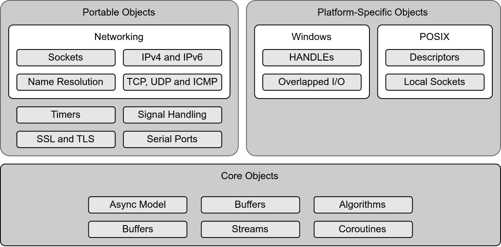
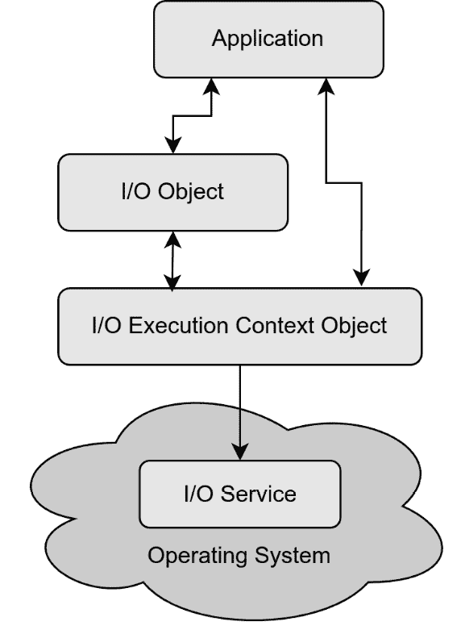
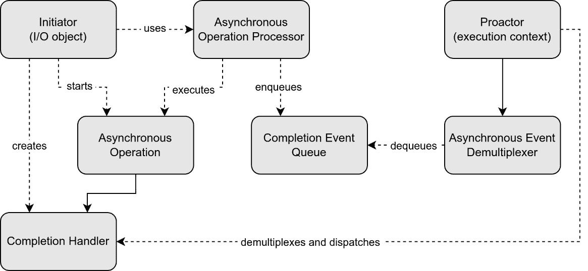

# 使用 Boost.Asio 进行异步编程

**Boost.Asio** 是 Boost 库家族中包含的一个 C++ 库，它简化了处理由操作系统（**OS**）管理的异步 **输入/输出**（**I/O**）任务解决方案的开发，使得开发处理内部和外部资源（如网络通信服务或文件操作）的异步软件变得更加容易。

为了这个目的，Boost.Asio 定义了操作系统服务（属于并受操作系统管理的服务）、I/O 对象（提供对操作系统服务的接口）以及 I/O 执行上下文对象（一个充当服务注册表和代理的对象）。

在以下页面中，我们将介绍 Boost.Asio，描述其主要构建块，并解释一些在工业界广泛使用的开发异步软件的常见模式。

在本章中，我们将涵盖以下主要主题：

+   Boost.Asio 是什么，以及它是如何简化使用外部资源的异步编程的

+   I/O 对象和 I/O 执行上下文是什么，以及它们如何与操作系统服务以及彼此交互

+   Proactor 和 Reactor 设计模式是什么，以及它们与 Boost.Asio 的关系

+   如何保持程序线程安全以及如何使用 strands 序列化任务

+   如何使用缓冲区有效地将数据传递给异步任务

+   如何取消异步操作

+   使用计时器和网络应用程序的常见实践示例

# 技术要求

对于本章，我们需要安装 Boost C++ 库。本书编写时的最新版本是 Boost 1.85.0。以下是发布说明：

[`www.boost.org/users/history/version_1_85_0.html`](https://www.boost.org/users/history/version_1_85_0.html)

对于 Unix 变体系统（Linux、macOS）的安装说明，请查看以下链接：

[`www.boost.org/doc/libs/1_85_0/more/getting_started/unix-variants.html`](https://www.boost.org/doc/libs/1_85_0/more/getting_started/unix-variants.html)

对于 Windows 系统，请查看以下链接：

[`www.boost.org/doc/libs/1_85_0/more/getting_started/windows.html`](https://www.boost.org/doc/libs/1_85_0/more/getting_started/windows.html)

此外，根据我们想要开发的项目，我们可能需要配置 **Boost.Asio** 或安装依赖项：

[`www.boost.org/doc/libs/1_85_0/doc/html/boost_asio/using.html`](https://www.boost.org/doc/libs/1_85_0/doc/html/boost_asio/using.html)

本章中展示的所有代码都将由 C++20 版本支持。请查阅*第三章*中的技术要求部分，其中包含有关如何安装 GCC 13 和 Clang 8 编译器的指导。

您可以在以下 GitHub 仓库中找到完整的代码：

[`github.com/PacktPublishing/Asynchronous-Programming-with-CPP`](https://github.com/PacktPublishing/Asynchronous-Programming-with-CPP)

本章的示例位于**Chapter_09**文件夹下。所有源代码文件都可以使用 CMake 编译，如下所示：

```cpp
cmake . && cmake —build .
```

可执行二进制文件将在*bin*目录下生成。

# 什么是 Boost.Asio？

**Boost.Asio**是由 Chris Kohlhoff 创建的跨平台 C++库，它提供了一个可移植的网络和低级 I/O 编程，包括套接字、定时器、主机名解析、套接字 iostreams、串行端口、文件描述符和 Windows HANDLEs，提供了一个一致的异步模型。它还提供了协程支持，但正如我们在上一章所学，它们现在在 C++20 中可用，所以我们将只在本章中简要介绍。

Boost.Asio 允许程序在不显式使用线程和锁的情况下管理长时间运行的操作。此外，因为它在操作系统服务之上实现了一层，所以它允许可移植性、效率、易用性和可扩展性，使用最合适的底层操作系统机制来实现这些目标，例如，分散-聚集 I/O 操作或在移动数据的同时最小化昂贵的复制。

让我们从学习 Boost.Asio 的基本块、I/O 对象和 I/O 执行上下文对象开始。

## I/O 对象

有时，应用程序需要访问操作系统服务，在这些服务上运行异步任务，并收集结果或错误。**Boost.Asio**提供了一个由 I/O 对象和 I/O 执行上下文对象组成的机制，以允许这种功能。

I/O 对象是表示执行 I/O 操作的实体任务的面向任务的 I/O 对象。正如我们在*图 9.1*中可以看到，Boost.Asio 提供了核心类来管理并发、流、缓冲区或其他核心功能，并为库提供通过**传输控制协议/互联网协议**（**TCP/IP**）、**用户数据报协议**（**UDP**）或**互联网控制消息协议**（**ICMP**）进行网络通信的可移植网络类，还包括定义安全层、传输协议和串行端口等任务的类，以及针对特定平台设置的特定类，以处理底层操作系统。



图 9.1 – I/O 对象

I/O 对象不会直接在操作系统中执行其任务。它们需要通过 I/O 执行上下文对象与操作系统进行通信。上下文对象的一个实例作为 I/O 对象构造函数的第一个参数传递。在这里，我们定义了一个 I/O 对象（一个三秒后到期的定时器）并通过其构造函数传递一个 I/O 执行上下文对象（**io_context**）：

```cpp
#include <boost/asio.hpp>
#include <chrono>
using namespace std::chrono_literals;
boost::asio::io_context io_context;
boost::asio::steady_timer timer(io_context, 3s);
```

大多数 I/O 对象都有以 **async_** 开头的方法名。这些方法触发异步操作，当操作完成时将调用完成处理程序，这是一个作为方法参数传递的可调用对象。这些方法立即返回，不会阻塞程序流程。当前线程可以在任务未完成时继续执行其他任务。一旦完成，完成处理程序将被调用并执行，处理异步任务的结果或错误。

I/O 对象还提供了阻塞的对应方法，这些方法将阻塞直到完成。这些方法不需要作为参数接收处理程序。

如前所述，请注意，I/O 对象不直接与操作系统交互；它们需要一个 I/O 执行上下文对象。让我们来了解这类对象。

## I/O 执行上下文对象

要访问 I/O 服务，程序至少使用一个表示操作系统 I/O 服务的网关的 I/O 执行上下文对象。它使用 **boost::asio::io_context** 类实现，为 I/O 对象提供操作系统服务的核心 I/O 功能。在 Windows 上，**boost::asio::io_context** 基于 **I/O completion ports** ( **IOCP** )，在 Linux 上，它基于 **epoll**，在 FreeBSD/macOS 上，它基于 **kqueue**。



图 9.2 – Boost.Asio 架构

**boost::asio::io_context** 是 **boost::asio::execution_context** 的子类，它是函数对象执行的基础类，也被其他执行上下文对象继承，例如 **boost::asio::thread_pool** 或 **boost::asio::system_context**。在本章中，我们将使用 **boost::asio::io_context** 作为我们的执行上下文对象。

自 1.66.0 版本以来，**boost::asio::io_context** 类已经取代了 **boost::asio::io_service** 类，采用了更多来自 C++ 的现代特性和实践。**boost::asio::io_service** 仍然可用于向后兼容。

如前所述，Boost.Asio 对象可以使用以 **async_** 开头的方法来调度异步操作。当所有异步任务都调度完毕后，程序需要调用 **boost::asio::io_context::run()** 函数来执行事件处理循环，允许操作系统处理任务并将结果传递给程序，并触发处理程序。

回到我们之前的例子，我们现在将设置完成处理程序，**on_timeout()**，这是一个可调用对象（在这种情况下是一个函数），我们在调用异步的 **async_wait()** 函数时将其作为参数传递。以下是代码示例：

```cpp
#include <boost/asio.hpp>
#include <iostream>
void on_timeout(const boost::system::error_code& ec) {
    if (!ec) {
        std::cout << "Timer expired.\n" << std::endl;
    } else {
        std::cerr << "Error: " << ec.message() << '\n';
    }
}
int main() {
    boost::asio::io_context io_context;
    boost::asio::steady_timer timer(io_context,
                              std::chrono::seconds(3));
    timer.async_wait(&on_timeout);
    io_context.run();
    return 0;
}
```

运行此代码后，我们应该在三个秒后在控制台看到消息 **Timer expired.**，或者在异步调用因任何原因失败时显示错误消息。

**boost::io_context::run()**是一个阻塞调用。这是为了保持事件循环运行，允许异步操作运行，并防止程序退出。显然，这个函数可以在新线程中调用，并让主线程保持未阻塞以继续其他任务，正如我们在前面的章节中看到的。

当没有挂起的异步操作时，**boost::io_context::run()**将返回。有一个模板类，**boost::asio::executor_work_guard**，可以在需要时保持**io_context**忙碌并避免其退出。让我们通过一个示例看看它是如何工作的。

让我们先定义一个后台任务，该任务将在等待两秒钟后通过**io_context**使用**boost::asio::io_context::post()**函数发布一些工作：

```cpp
#include <boost/asio.hpp>
#include <chrono>
#include <iostream>
#include <thread>
using namespace std::chrono_literals;
void background_task(boost::asio::io_context& io_context) {
    std::this_thread::sleep_for(2s);
    std::cout << "Posting a background task.\n";
    io_context.post([]() {
        std::cout << "Background task completed!\n";
    });
}
```

在**main()**函数中，创建了**io_context**对象，并使用该**io_context**对象构造了一个**work_guard**对象。

然后，创建了两个线程，**io_thread**，其中**io_context**运行，和**worker**，其中**background_task()**将运行。我们还像之前解释的那样，将**io_context**作为引用传递给后台任务以发布工作。

在此基础上，主线程进行了一些工作（等待五秒钟），然后通过调用其**reset()**函数移除工作保护，让**io_context**退出其**run()**函数，并在退出之前加入两个线程，如所示：

```cpp
int main() {
    boost::asio::io_context io_context;
    auto work_guard = boost::asio::make_work_guard(
                      io_context);
    std::thread io_thread([&io_context]() {
        std::cout << "Running io_context.\n";
        io_context.run();
        std::cout << "io_context stopped.\n";
    });
    std::thread worker(background_task,
                       std::ref(io_context));
    // Main thread doing some work.
    std::this_thread::sleep_for(5s);
    std::cout << "Removing work_guard." << std::endl;
    work_guard.reset();
    worker.join();
    io_thread.join();
    return 0;
}
```

如果我们运行前面的代码，这是输出：

```cpp
Running io_context.
Posting a background task.
Background task completed!
Removing work_guard.
io_context stopped.
```

我们可以看到后台线程如何正确地发布后台任务，并且这个任务在移除工作保护并停止 I/O 上下文对象的执行之前完成。

另一种保持**io_context**对象活跃并处理请求的方法是通过不断调用**async_**函数或从完成处理程序发布工作。这在读取或写入套接字或流时是一个常见的模式：

```cpp
#include <boost/asio.hpp>
#include <chrono>
#include <functional>
#include <iostream>
using namespace std::chrono_literals;
int main() {
    boost::asio::io_context io_context;
    boost::asio::steady_timer timer(io_context, 3s);
    std::function<void(const boost::system::error_code&)>
                  timer_handler;
    timer_handler = &timer, &timer_handler {
        if (!ec) {
            std::cout << "Handler: Timer expired.\n";
            timer.expires_after(1s);
            timer.async_wait(timer_handler);
        } else {
            std::cerr << "Handler error: "
                      << ec.message() << std::endl;
        }
    };
    timer.async_wait(timer_handler);
    io_context.run();
    return 0;
}
```

在这种情况下，**timer_handler**是一个作为 lambda 函数定义的完成处理程序，它捕获了计时器和自身。每秒钟，当计时器到期时，它打印**处理程序：计时器已过期**的消息，并通过将新的异步任务（使用**async_wait()**函数）入队到**io_context**对象中通过**计时器**对象来重启自己。

如我们所见，**io_context**对象可以从任何线程运行。默认情况下，此对象是线程安全的，但在某些场景中，如果我们想要更好的性能，我们可能想要避免这种安全性。这可以在其构造过程中进行调整，正如我们将在下一节中看到的。

### 并发提示

**io_context**构造函数接受一个并发提示作为参数，建议实现使用多少个活动线程来运行完成处理程序。

默认情况下，此值为**BOOST_ASIO_CONCURRENCY_HINT_SAFE**（值*1*），表示**io_context**对象将从一个线程运行，由于这个事实，可以启用一些优化。但这并不意味着**io_context**只能从单个线程使用；它仍然提供线程安全，并且可以使用来自多个线程的 I/O 对象。

可以指定的其他值如下：

+   **BOOST_ASIO_CONCURRENCY_HINT_UNSAFE**：禁用锁定，因此对**io_context**或 I/O 对象的操作必须在同一线程中发生。

+   **BOOST_ASIO_CONCURRENCY_HINT_UNSAFE_IO**：在反应器中禁用锁定，但在调度器中保持锁定，因此**io_context**对象中的所有操作都可以使用除**run()**函数和其他与执行事件处理循环相关的方法之外的不同线程。我们将在解释库背后的设计原则时了解调度器和反应器。

现在我们来了解事件处理循环是什么以及如何管理它。

## 事件处理循环

使用**boost::asio::io_context::run()**方法，**io_context**会阻塞并持续处理 I/O 异步任务，直到所有任务都已完成并且通知了完成处理程序。这个 I/O 请求处理是在内部事件处理循环中完成的。

有其他方法可以控制事件循环并避免在所有异步事件处理完毕之前阻塞。这些方法如下：

+   **poll**：运行事件处理循环以执行就绪处理程序

+   **poll_one**：运行事件处理循环以执行一个就绪处理程序

+   **run_for**：运行事件处理循环以指定的时间段

+   **run_until**：与上一个相同，但仅限于指定的时间

+   **run_one**：运行事件处理循环以执行最多一个处理程序

+   **run_one_for**：与上一个相同，但仅限于指定的时间段

+   **run_one_until**：与上一个相同，但仅限于指定的时间

事件循环也可以通过调用**boost::asio::io_context::stop()**方法或通过调用**boost:asio::io_context::stopped()**来检查其状态是否已停止来停止。

当事件循环没有运行时，已经安排的任务将继续执行。其他任务将保持挂起。可以通过再次使用前面提到的方法之一启动事件循环来恢复挂起的任务并收集挂起的结果。

在之前的示例中，应用程序通过调用异步方法或使用**post()**函数将一些工作发送到**io_context**。现在让我们了解**dispatch()**及其与**post()**的区别。

### 向 io_context 分配一些工作

除了通过来自不同 I/O 对象的异步方法或使用**executor_work_guard**（下面将解释）将工作发送到**io_context**之外，我们还可以使用**boost::asio::post()**和**boost::asio::dispatch()**模板方法。这两个函数都用于将一些工作调度到**io_context**对象中。

**post()** 函数保证任务将被执行。它将完成处理程序放入执行队列，最终将被执行：

```cpp
boost::asio::io_context io_context;
io_context.post([] {
    std::cout << "This will always run asynchronously.\n";
});
```

另一方面，如果 **io_context** 或 strand（本章后面将详细介绍 strand）与任务被派发的同一线程相同，则 **dispatch()** 可能会立即执行任务，否则将其放入队列以异步执行：

```cpp
boost::asio::io_context io_context;
io_context.dispatch([] {
    std::cout << "This might run immediately or be queued.\n";
});
```

因此，使用 **dispatch()**，我们可以通过减少上下文切换或队列延迟来优化性能。

已派发的事件可以直接从当前工作线程执行，即使队列中还有其他挂起的事件。必须始终由 I/O 执行上下文管理已发布的事件，等待其他处理程序完成，然后才能执行。

现在我们已经学习了某些基本概念，让我们了解同步和异步操作在底层是如何工作的。

# 与操作系统交互

**Boost.Asio** 可以使用同步和异步操作与 I/O 服务交互。让我们了解它们的行为以及主要区别是什么。

## 同步操作

如果程序想以同步方式使用 I/O 服务，通常，它将创建一个 I/O 对象并使用其同步操作方法：

```cpp
boost::asio::io_context io_context;
boost::asio::steady_timer timer(io_context, 3s);
timer.wait();
```

当调用 **timer.wait()** 时，请求被发送到 I/O 执行上下文对象（**io_context**），该对象调用操作系统执行操作。一旦操作系统完成任务，它将结果返回给 **io_context**，然后 **io_context** 将结果或错误（如果有任何问题）转换回 I/O 对象（**定时器**）。错误类型为 **boost::system::error_code**。如果发生错误，将抛出异常。

如果我们不希望抛出异常，我们可以通过引用将错误对象传递给同步方法以捕获操作状态并在之后进行检查：

```cpp
boost::system::error_code ec;
Timer.wait(server_endpoint, ec);
```

## 异步操作

在异步操作的情况下，我们还需要向异步方法传递一个完成处理程序。这个完成处理程序是一个可调用对象，当异步操作完成时，I/O 上下文对象将调用它，通知程序结果或操作错误。其签名如下：

```cpp
void completion_handler(
     const boost::system::error_code& ec);
```

继续以定时器为例，现在，我们需要调用异步操作：

```cpp
socket.async_wait(completion_handler);
```

再次强调，I/O 对象（**定时器**）将请求转发到 I/O 执行上下文对象（**io_context**）。**io_context** 向操作系统请求启动异步操作。

当操作完成时，操作系统将结果放入队列，其中 **io_context** 正在监听。然后，**io_context** 取出结果，将错误转换为错误代码对象，并触发完成处理程序以通知程序任务完成和结果。

为了允许 **io_context** 跟进这些步骤，程序必须执行 **boost::asio::io_context::run()**（或之前介绍过的类似函数，这些函数管理事件处理循环）并阻塞当前线程，以处理任何未完成的异步操作。如前所述，如果没有挂起的异步操作，**boost::asio::io_context::run()** 将退出。

完成处理器（Completion handlers）需要是可复制的，这意味着必须有一个复制构造函数可用。如果需要临时资源（如内存、线程或文件描述符），则在调用完成处理器之前释放该资源。这允许我们在不重叠资源使用的情况下调用相同的操作，从而避免增加系统的峰值资源使用。

### 错误处理

如前所述，**Boost.Asio** 允许用户以两种不同的方式处理错误：使用错误代码或抛出异常。如果我们调用 I/O 对象方法时传递一个对 **boost::system::error_code** 对象的引用，则实现将通过该变量传递错误；否则，将抛出异常。

我们已经通过检查错误代码实现了第一个方法的一些示例。现在让我们看看如何捕获异常。

以下示例创建了一个持续三秒钟的计时器。**io_context** 对象由后台线程 **io_thread** 运行。当计时器通过调用其 **async_wait()** 函数启动异步任务时，它传递了 **boost::asio::use_future** 参数，因此函数返回一个未来对象 **fut**，稍后在该 try-catch 块内部调用其 **get()** 函数以检索存储的结果或异常，正如我们在 *第六章* 中所学。在启动异步操作后，主线程等待一秒钟，然后计时器通过调用其 **cancel()** 函数取消操作。由于这发生在其到期时间（三秒钟）之前，因此会抛出异常：

```cpp
#include <boost/asio.hpp>
#include <chrono>
#include <future>
#include <iostream>
#include <thread>
using namespace std::chrono_literals;
int main() {
    boost::asio::io_context io_context;
    boost::asio::steady_timer timer(io_context, 1s);
    auto fut = timer.async_wait(
                     boost::asio::use_future);
    std::thread io_thread([&io_context]() {
                        io_context.run();
    });
    std::this_thread::sleep_for(3s);
    timer.cancel();
    try {
        fut.get();
        std::cout << "Timer expired successfully!\n";
    } catch (const boost::system::system_error& e) {
        std::cout << "Timer failed: "
                  << e.code().message() << '\n';
    }
    io_thread.join();
    return 0;
}
```

类型为 **boost::system::system_error** 的异常被捕获，并打印出其消息。如果在异步操作完成后（在这个例子中，通过让主线程休眠超过三秒钟），计时器取消其操作，计时器将成功到期，不会抛出异常。

现在我们已经看到了 Boost.Asio 的主要构建块以及它们是如何相互作用的，让我们回顾一下并理解其实现背后的设计模式。

# 反应器（Reactor）和执行者（Proactor）设计模式

当使用事件处理应用程序时，我们可以遵循两种方法来设计并发解决方案：反应器（Reactor）和执行者（Proactor）设计模式。

这些模式描述了处理事件所遵循的机制，表明了这些事件是如何被发起、接收、解多路复用和分派的。当系统收集和排队来自不同资源的 I/O 事件时，解多路复用这些事件意味着将它们分离以分派到正确的处理程序。

**Reactor 模式**同步和串行地解多路复用和调度服务请求。它通常遵循非阻塞同步 I/O 策略，如果操作可以执行，则返回结果；如果系统没有资源完成操作，则返回错误。

另一方面，**Proactor 模式**允许通过立即将控制权返回给调用者，以高效异步的方式解多路复用和调度服务请求，表明操作已启动。然后，被调用的系统将在操作完成时通知调用者。

因此，Proactor 模式在两个任务之间分配责任：执行异步的长时操作和完成处理程序，处理结果并通常调用其他异步操作。

**Boost.Asio** 通过以下元素实现 Proactor 设计模式：

+   **发起者**：一个 I/O 对象，用于启动异步操作。

+   **异步操作**：由操作系统异步运行的任务。

+   **异步操作处理器**：这执行异步操作，并将结果排队在完成事件队列中。

+   **完成事件队列**：一个事件队列，异步操作处理器将事件推入其中，而异步事件从队列中取出。

+   **异步事件解多路复用器**：这会阻塞 I/O 上下文，等待事件，并将完成的事件返回给调用者。

+   **完成处理程序**：一个可调用的对象，将处理异步操作的结果。

+   **Proactor**：这调用异步事件解多路复用器来出队事件并将它们分派给完成处理程序。这正是 I/O 执行上下文所做的事情。

*图 9* *.3* 清楚地显示了所有这些元素之间的关系：



图 9.3 – Proactor 设计模式

Proactor 模式在封装并发机制的同时，增加了关注点的分离，简化了应用程序的同步，并提高了性能。

另一方面，我们无法控制异步操作是如何或何时被调度，以及操作系统将如何高效地执行这些操作。此外，由于完成事件队列和调试和测试的复杂性增加，内存使用量也有所增加。

Boost.Asio 设计的另一个方面是执行上下文对象的线程安全性。现在让我们深入了解 Boost.Asio 中的线程是如何工作的。

# 使用 Boost.Asio 的多线程

I/O 执行上下文对象是线程安全的；它们的方法可以从不同的线程安全调用。这意味着我们可以使用单独的线程来运行阻塞的 **io_context.run()** 方法，并让主线程保持未阻塞状态，以便继续执行其他无关任务。

现在我们来解释如何根据使用线程的方式配置异步应用程序的不同方法。

## 单线程方法

任何 **Boost.Asio** 应用程序的起点和首选解决方案都应遵循单线程方法，其中 I/O 执行上下文对象在处理完成处理程序的同一线程中运行。这些处理程序必须是短小且非阻塞的。以下是一个在 I/O 上下文和主线程中运行的稳定定时器完成处理程序的示例：

```cpp
#include <boost/asio.hpp>
#include <chrono>
#include <iostream>
using namespace std::chrono_literals;
void handle_timer_expiry(
            const boost::system::error_code& ec) {
    if (!ec) {
        std::cout << "Timer expired!\n";
    } else {
        std::cerr << "Error in timer: "
                  << ec.message() << std::endl;
    }
}
int main() {
    boost::asio::io_context io_context;
    boost::asio::steady_timer timer(io_context,
                              std::chrono::seconds(1));
    timer.async_wait(&handle_timer_expiry);
    io_context.run();
    return 0;
}
```

如我们所见，**steady_timer** 定时器在执行 **io_context.run()** 函数的同一线程中调用异步的 **async_wait()** 函数，设置 **handle_timer_expiry()** 完成处理程序。当异步函数完成后，其完成处理程序将在同一线程中运行。

由于完成处理程序在主线程中运行，其执行应该快速，以避免冻结主线程和其他程序应执行的相关任务。在下一节中，我们将学习如何处理长时间运行的任务或完成处理程序，并保持主线程的响应性。

## 线程化长时间运行的任务

对于长时间运行的任务，我们可以保留主线程中的逻辑，但使用其他线程传递工作和将结果返回到主线程：

```cpp
#include <boost/asio.hpp>
#include <iostream>
#include <thread>
void long_running_task(boost::asio::io_context& io_context,
                       int task_duration) {
    std::cout << "Background task started: Duration = "
              << task_duration << " seconds.\n";
    std::this_thread::sleep_for(
                      std::chrono::seconds(task_duration));
    io_context.post([&io_context]() {
        std::cout << "Background task completed.\n";
        io_context.stop();
    });
}
int main() {
    boost::asio::io_context io_context;
    auto work_guard = boost::asio::make_work_guard
                                        (io_context);
    io_context.post([&io_context]() {
        std::thread t(long_running_task,
                      std::ref(io_context), 2);
        std::cout << "Detaching thread" << std::endl;
        t.detach();
    });
    std::cout << "Running io_context...\n";
    io_context.run();
    std::cout << "io_context exit.\n";
    return 0;
}
```

在此示例中，在创建 **io_context** 之后，使用工作保护来避免在发布任何工作之前立即返回 **io_context.run()** 函数。

发布的工作包括创建一个 **t** 线程以在后台运行 **long_running_task()** 函数。在 lambda 函数退出之前，该 **t** 线程被分离；否则，程序将终止。

在后台任务函数中，当前线程会暂停给定的时间，然后向 **io_context** 对象中发布另一个任务以打印消息并停止 **io_context** 本身。如果我们不调用 **io_context.stop()**，事件处理循环将无限期地继续运行，程序将无法结束，因为 **io_context.run()** 将由于工作保护而继续阻塞。

## 每个线程一个 I/O 执行上下文对象

这种方法类似于单线程方法，其中每个线程都有自己的 **io_context** 对象，并处理短小且非阻塞的完成处理程序：

```cpp
#include <boost/asio.hpp>
#include <chrono>
#include <iostream>
#include <syncstream>
#include <thread>
#define sync_cout std::osyncstream(std::cout)
using namespace std::chrono_literals;
void background_task(int i) {
    sync_cout << "Thread " << i << ": Starting...\n";
    boost::asio::io_context io_context;
    auto work_guard =
              boost::asio::make_work_guard(io_context);
    sync_cout << "Thread " << i << ": Setup timer...\n";
    boost::asio::steady_timer timer(io_context, 1s);
    timer.async_wait(
        & {
            if (!ec) {
                sync_cout << "Timer expired successfully!"
                          << std::endl;
            } else {
                sync_cout << "Timer error: "
                          << ec.message() << ‚\n';
        }
        work_guard.reset();
    });
    sync_cout << "Thread " << i << ": Running
                      io_context...\n";
    io_context.run();
}
int main() {
    const int num_threads = 4;
    std::vector<std::jthread> threads;
    for (auto i = 0; i < num_threads; ++i) {
        threads.emplace_back(background_task, i);
    }
    return 0;
}
```

在此示例中，创建了四个线程，每个线程运行 **background_task()** 函数，其中创建了一个 **io_context** 对象，并设置了一个定时器，在经过一秒后超时，并与其完成处理程序一起停止。

## 单个 I/O 执行上下文对象的多线程

现在，只有一个**io_context**对象，但它从不同的线程启动不同的 I/O 对象异步任务。在这种情况下，完成处理程序可以从这些线程中的任何一个被调用。以下是一个例子：

```cpp
#include <boost/asio.hpp>
#include <chrono>
#include <iostream>
#include <syncstream>
#include <thread>
#include <vector>
#define sync_cout std::osyncstream(std::cout)
using namespace std::chrono_literals;
void background_task(int task_id) {
    boost::asio::post([task_id]() {
        sync_cout << "Task " << task_id
                  << " is being handled in thread "
                  << std::this_thread::get_id()
                  << std::endl;
        std::this_thread::sleep_for(2s);
        sync_cout << "Task " << task_id
                  << " complete.\n";
    });
}
int main() {
    boost::asio::io_context io_context;
    auto work_guard = boost::asio::make_work_guard(
                                   io_context);
    std::jthread io_context_thread([&io_context]() {
        io_context.run();
    });
    const int num_threads = 4;
    std::vector<std::jthread> threads;
    for (int i = 0; i < num_threads; ++i) {
        background_task(i);
    }
    std::this_thread::sleep_for(5s);
    work_guard.reset();
    return 0;
}
```

在这个例子中，只创建并运行了一个**io_context**对象，并在一个单独的线程**io_context_thread**中执行。然后，创建了另外四个后台线程，工作被提交到**io_context**对象中。最后，主线程等待五秒钟，让所有线程完成它们的工作，并重置工作保护器，如果没有任何待处理的工作，则让**io_context.run()**函数返回。当程序退出时，所有线程自动合并，因为它们是**std::jthread**的实例。

## 并行化一个 I/O 执行上下文所做的工作

在上一个例子中，使用了一个独特的 I/O 执行上下文对象，其**run()**函数从不同的线程中被调用。然后，每个线程提交了一些工作，这些工作由完成处理程序在完成时在可用的线程中执行。

这是一种常见的并行化一个 I/O 执行上下文所做工作的方法，通过从多个线程调用其**run()**函数，将异步操作的处理分配给这些线程。这是可能的，因为**io_context**对象提供了一个线程安全的事件分发系统。

这里还有一个例子，其中创建了一个线程池，每个线程运行**io_context.run()**，使这些线程竞争从队列中拉取任务并执行它们。在这种情况下，仅使用一个在两秒后到期的计时器创建了一个异步任务。其中一个线程将拾取该任务并执行它：

```cpp
#include <boost/asio.hpp>
#include <iostream>
#include <thread>
#include <vector>
using namespace std::chrono_literals;
int main() {
    boost::asio::io_context io_context;
    boost::asio::steady_timer timer(io_context, 2s);
    timer.async_wait(
        [](const boost::system::error_code& /*ec*/) {
            std::cout << "Timer expired!\n";
    });
    const std::size_t num_threads =
                std::thread::hardware_concurrency();
    std::vector<std::thread> threads;
    for (std::size_t i = 0;
         i < std::thread::hardware_concurrency(); ++i) {
            threads.emplace_back([&io_context]() {
                io_context.run();
            });
    }
    for (auto& t : threads) {
        t.join();
    }
    return 0;
}
```

这种技术提高了可伸缩性，因为应用程序更好地利用了多个核心，并通过并发处理异步任务来降低延迟。此外，通过减少单线程代码处理许多同时进行的 I/O 操作时产生的瓶颈，可以减少竞争并提高吞吐量。

注意，完成处理程序也必须使用同步原语，并且如果它们在不同的线程之间共享或修改共享资源，则必须是线程安全的。

此外，不能保证完成处理程序执行的顺序。由于可以同时运行许多线程，任何一个线程都可能先完成并调用其相关的完成处理程序。

由于线程正在竞争从队列中拉取任务，如果线程池的大小不是最优的，可能会出现潜在的锁竞争或上下文切换开销，理想情况下应与硬件线程的数量相匹配，就像在这个例子中所做的那样。

现在，是时候了解对象的生存期如何影响我们使用 Boost.Asio 开发的异步程序稳定性了。

# 管理对象的生存期

异步操作可能引发的主要灾难性问题之一是，当操作进行时，一些必需的对象已经被销毁。因此，管理对象的生命周期至关重要。

在 C++中，一个对象的生命周期从构造函数结束开始，到析构函数开始结束。

保持对象存活的一个常用模式是让对象为自己创建一个指向自身的共享指针实例，确保只要存在指向该对象的共享指针，对象就保持有效，这意味着有持续进行的异步操作需要该对象。

这种技术被称为**shared-from-this**，它使用 C++11 以来可用的**std::enable_shared_from_this**模板基类，该基类提供了对象用来获取自身共享指针的**shared_from_this()**方法。

## 实现回声服务器 – 示例

让我们通过创建一个回声服务器来看看它是如何工作的。同时，我们将讨论这项技术，我们还将学习如何使用 Boost.Asio 进行网络编程。

在网络中传输数据可能需要很长时间才能完成，并且可能会发生几个错误。这使得网络 I/O 服务成为 Boost.Asio 处理的一个特殊良好案例。网络 I/O 服务是库中最早包含的服务之一。

在工业界，Boost.Asio 的主要常见用途是开发网络应用程序，因为它支持互联网协议 TCP、UDP 和 ICMP。该库还提供了一个基于**伯克利软件发行版**（**BSD**）套接字 API 的套接字接口，以允许使用低级接口开发高效和可扩展的应用程序。

然而，由于在这本书中我们关注的是异步编程，让我们专注于使用高级接口实现回声服务器。

回声服务器是一个监听特定地址和端口的程序，并将从该端口读取的所有内容写回。为此，我们将创建一个 TCP 服务器。

主程序将简单地创建一个**io_context**对象，通过传递**io_context**对象和一个要监听的端口号来设置**EchoServer**对象，并调用**io_context.run()**来启动事件处理循环：

```cpp
#include <boost/asio.hpp>
#include <memory>
constexpr int port = 1234;
int main() {
    try {
        boost::asio::io_context io_context;
        EchoServer server(io_context, port);
        io_context.run();
    } catch (std::exception& e) {
        std::cerr << "Exception: " << e.what() << "\n";
    }
    return 0;
}
```

当**EchoServer**初始化时，它将开始监听传入的连接。它是通过使用一个**boost::asio::tcp::acceptor**对象来做到这一点的。这个对象通过其构造函数接受一个**io_context**对象（对于 I/O 对象来说通常是这样的）和一个**boost::asio::tcp::endpoint**对象，该对象指示用于监听的连接协议和端口号。由于使用了**boost::asio::tcp::v4()**对象来初始化端点对象，因此**EchoServer**将使用的协议是 IPv4。没有指定给端点构造函数的 IP 地址，因此端点 IP 地址将是*任何地址*（IPv4 的**INADDR_ANY**或 IPv6 的**in6addr_any**）。接下来，实现**EchoServer**构造函数的代码如下：

```cpp
using boost::asio::ip::tcp;
class EchoServer {
   public:
    EchoServer(boost::asio::io_context& io_context,
               short port)
        : acceptor_(io_context,
                    tcp::endpoint(tcp::v4(),
                    port)) {
        do_accept();
    }
   private:
    void do_accept() {
        acceptor_.async_accept(this {
            if (!ec) {
                std::make_shared<Session>(
                    std::move(socket))->start();
            }
            do_accept();
        });
    }
    tcp::acceptor acceptor_;
};
```

**EchoServer** 构造函数在设置好接受者对象后调用 **do_accept()** 函数。**do_accept()** 函数调用 **async_accept()** 函数等待传入的连接。当客户端连接到服务器时，操作系统通过 **io_context** 对象返回连接的套接字（**boost::asio::tcp::socket**）或错误。

如果没有错误并且建立了连接，就创建一个 **Session** 对象的共享指针，将套接字移动到 **Session** 对象中。然后，**Session** 对象运行 **start()** 函数。

**Session** 对象封装了特定连接的状态，在本例中是 **socket_** 对象和 **data_** 缓冲区。它还通过使用 **do_read()** 和 **do_write()** 管理对该缓冲区的异步读取和写入，我们将在稍后实现它们。但在那之前，注释说明 **Session** 继承自 **std::enable_shared_from_this<Session>**，允许 **Session** 对象创建指向自身的共享指针，确保会话对象在整个异步操作的生命周期中保持活跃，只要至少有一个共享指针指向管理该连接的 **Session** 实例。这个共享指针是 **EchoServer** 对象中的 **do_accept()** 函数在建立连接时创建的。以下是 **Session** 类的实现：

```cpp
class Session
    : public std::enable_shared_from_this<Session>
{
   public:
    Session(tcp::socket socket)
        : socket_(std::move(socket)) {}
    void start() { do_read(); }
   private:
    static const size_t max_length = 1024;
    void do_read();
    void do_write(std::size_t length);
    tcp::socket socket_;
    char data_[max_length];
};
```

使用 **Session** 类允许我们将管理连接的逻辑与管理服务器的逻辑分开。**EchoServer** 只需要接受连接并为每个连接创建一个 **Session** 对象。这样，服务器可以管理多个客户端，保持它们的连接独立并异步管理。

**Session** 是使用 **do_read()** 和 **do_write()** 函数管理该连接行为的对象。当 **Session** 开始时，它的 **start()** 函数调用 **do_read()** 函数，如下所示：

```cpp
void Session::do_read() {
    auto self(shared_from_this());
    socket_.async_read_some(boost::asio::buffer(data_,
                                          max_length),
        this, self {
            if (!ec) {
                do_write(length);
            }
        });
}
```

**do_read()** 函数创建当前会话对象（**self**）的共享指针，并使用套接字的 **async_read_some()** 异步函数将一些数据读取到 **data_** 缓冲区。如果操作成功，此操作将返回复制到 **data_** 缓冲区的数据以及读取的字节数存储在 **length** 变量中。

然后，使用那个 **length** 变量调用 **do_write()**，通过使用 **async_write()** 函数异步地将 **data_** 缓冲区的内容写入套接字。当这个异步操作成功时，它通过再次调用 **do_read()** 函数来重启循环，如下所示：

```cpp
void Session::do_write(std::size_t length) {
    auto self(shared_from_this());
    boost::asio::async_write(socket_,
                             boost::asio::buffer(data_,
                                                length),
        this, self {
            if (!ec) {
                do_read();
            }
        });
}
```

你可能会想知道为什么定义了**self**但没有使用它。它看起来**self**是多余的，但作为 lambda 函数按值捕获它，会创建一个副本，增加对**this**对象的共享指针的引用计数，确保如果 lambda 是活跃的，会话不会被销毁。**this**对象被捕获以在 lambda 函数中提供对其成员的访问。

作为练习，尝试实现一个**stop()**函数，以中断**do_read()**和**do_write()**之间的循环。一旦所有异步操作完成并且 lambda 函数退出，**self**对象将被销毁，并且没有其他共享指针指向**Session**对象，因此会话将被销毁。

这种模式确保在异步操作期间对对象生命周期的健壮和安全管理，避免了悬垂指针或过早销毁，这可能导致不期望的行为或崩溃。

要测试此服务器，只需启动服务器，打开一个新的终端，并使用**telnet**命令连接到服务器并向其发送数据。作为参数，我们可以传递**localhost**地址，表示我们正在连接到同一台机器上运行的服务器（IP 地址为**127.0.0.1**）和端口号，在这种情况下，**1234**。

**telnet**命令将启动并显示一些关于连接的信息，并指示我们需要按下*Ctrl* + *}*键来关闭连接。

输入任何内容并按*Enter*键将发送输入的行到回显服务器，服务器将监听并发送回相同的内容；在这个例子中，将是**Hello world!**。

只需关闭连接并使用**quit**命令退出**telnet**回到终端：

```cpp
$ telnet localhost 1234
Trying 127.0.0.1...
Connected to localhost.
Escape character is '^]'.
Hello world!
Hello world!
telnet> quit
Connection closed.
```

在这个例子中，我们已经使用了一个缓冲区。让我们在下一节中了解更多关于它们的信息。

# 使用缓冲区传输数据

**缓冲区**是在 I/O 操作期间用于传输数据的连续内存区域。

Boost.Asio 定义了两种类型的缓冲区：**可变缓冲区**（**boost::asio::mutable_buffer**），其中可以写入数据，和**常量缓冲区**（**boost::asio::const_buffers**），用于创建只读缓冲区。可变缓冲区可以转换为常量缓冲区，但不能反向转换。这两种类型的缓冲区都提供了防止越界的保护。

此外，还有**boost::buffer**函数，用于从不同数据类型（原始内存的指针和大小、字符串（**std::string**）、或**原始数据**（**POD**）结构（意味着一个没有用户定义的复制赋值运算符或析构函数的类型、结构或类，并且没有私有或受保护的非静态数据成员）的数组或向量）创建可变或常量缓冲区。例如，要从字符数组创建缓冲区，我们可以使用以下代码：

```cpp
char data[1024];
mutable_buffer buffer = buffer(data, sizeof(data));
```

此外，请注意，缓冲区的所有权和生命周期是程序的责任，而不是 Boost.Asio 库的责任。

## Scatter-gather 操作

通过使用 scatter-gather 操作，可以有效地使用缓冲区，其中多个缓冲区一起用于接收数据（scatter-read）或发送数据（gather-write）。

**Scatter-read**是从唯一源读取数据到不同的非连续内存缓冲区的过程。

**Gather-write**是相反的过程；数据从不同的非连续内存缓冲区中收集并写入单个目标。

这些技术通过减少系统调用或数据复制的次数来提高效率和性能。它们不仅用于 I/O 操作，还用于其他用例，例如数据处理、机器学习或并行算法，如排序或矩阵乘法。

为了允许 scatter-gather 操作，可以将多个缓冲区一起传递到容器中的异步操作内部（**std::vector**、**std::list**、**std::array**或**boost::array**）。

这里是一个 scatter-read 的示例，其中套接字异步地将一些数据读取到**buf1**和**buf2**缓冲区中：

```cpp
std::array<char, 128> buf1, buf2;
std::vector<boost::asio::mutable_buffer> buffers = {
    boost::asio::buffer(buf1),
    boost::asio::buffer(buf2)
};
socket.async_read_some(buffers, handler);
```

这里是如何实现 gather-read 的：

```cpp
std::array<char, 128> buf1, buf2;
std::vector<boost::asio::const_buffer> buffers = {
    boost::asio::buffer(buf1),
    boost::asio::buffer(buf2)
};
socket.async_write_some(buffers, handler);
```

现在，套接字执行相反的操作，将两个缓冲区中的数据写入套接字缓冲区以进行异步发送。

## 流缓冲区

我们还可以使用流缓冲区来管理数据。**Stream buffers**由**boost::asio::basic_streambuf**类定义，基于**std::basic_streambuf** C++类，并在**<streambuf>**头文件中定义。它允许一个动态缓冲区，其大小可以适应传输的数据量。

让我们看看以下示例中流缓冲区如何与 scatter-gather 操作一起工作。在这种情况下，我们正在实现一个 TCP 服务器，该服务器监听并接受来自给定端口的客户端连接，将客户端发送的消息读取到两个流缓冲区中，并将它们的内容打印到控制台。由于我们感兴趣的是理解流缓冲区和 scatter-gather 操作，让我们通过使用同步操作来简化示例。

如前一个示例所示，在**main()**函数中，我们使用一个**boost::asio::ip::tcp::acceptor**对象来设置 TCP 服务器将用于接受连接的协议和端口。然后，在一个无限循环中，服务器使用该 acceptor 对象附加一个 TCP 套接字（**boost::asio::ip::tcp::socket**）并调用**handle_client()**函数：

```cpp
#include <array>
#include <iostream>
#include <boost/asio.hpp>
#include <boost/asio/streambuf.hpp>
using boost::asio::ip::tcp;
constexpr int port = 1234;
int main() {
    try {
        boost::asio::io_context io_context;
        tcp::acceptor acceptor(io_context,
                      tcp::endpoint(tcp::v4(), port));
        std::cout << "Server is running on port "
                  << port << "...\n";
        while (true) {
            tcp::socket socket(io_context);
            acceptor.accept(socket);
            std::cout << "Client connected...\n";
            handle_client(socket);
            std::cout << "Client disconnected...\n";
        }
    } catch (std::exception& e) {
        std::cerr << "Exception: " << e.what() << '\n';
    }
    return 0;
}
```

**handle_client()**函数创建了两个流缓冲区：**buf1**和**buf2**，并将它们添加到一个容器中，在这种情况下是**std::array**，用于 scatter-gather 操作。

然后，调用套接字的同步**read_some()**函数。此函数返回从套接字读取的字节数并将它们复制到缓冲区中。如果套接字连接出现任何问题，错误将返回到错误代码对象**ec**中。在这种情况下，服务器将打印错误消息并退出。

这里是实现方式：

```cpp
void handle_client(tcp::socket& socket) {
    const size_t size_buffer = 5;
    boost::asio::streambuf buf1, buf2;
    std::array<boost::asio::mutable_buffer, 2> buffers = {
        buf1.prepare(size_buffer),
        buf2.prepare(size_buffer)
    };
    boost::system::error_code ec;
    size_t bytes_recv = socket.read_some(buffers, ec);
    if (ec) {
        std::cerr << "Error on receive: "
                  << ec.message() << '\n';
        return;
    }
    std::cout << "Received " << bytes_recv << " bytes\n";
    buf1.commit(5);
    buf2.commit(5);
    std::istream is1(&buf1);
    std::istream is2(&buf2);
    std::string data1, data2;
    is1 >> data1;
    is2 >> data2;
    std::cout << "Buffer 1: " << data1 << std::endl;
    std::cout << "Buffer 2: " << data2 << std::endl;
}
```

如果没有错误，流缓冲区的 **commit()** 函数用于将五个字节传输到每个流缓冲区，即 **buf1** 和 **buf2**。这些缓冲区的内容通过使用 **std::istream** 对象提取并打印到控制台。

要执行此示例，我们需要打开两个终端。在一个终端中，我们执行服务器，在另一个终端中执行 **telnet** 命令，如前所述。在 **telnet** 终端中，我们可以输入一条消息（例如，*Hello World*）。这条消息将被发送到服务器。然后服务器终端将显示以下内容：

```cpp
Server is running on port 1234...
Client connected...
Received 10 bytes
Buffer 1: Hello
Buffer 2: Worl
Client disconnected...
```

如我们所见，只有 10 个字节被处理并分配到两个缓冲区中。两个单词之间的空格在通过 **iostream** 对象解析输入时被处理但被丢弃。

当接收到的数据大小可变且事先未知时，流缓冲区非常有用。这些类型的缓冲区可以与固定大小的缓冲区一起使用。

# 信号处理

**信号处理**允许我们捕获操作系统发送的信号，并在操作系统决定杀死应用程序进程之前优雅地关闭应用程序。

Boost.Asio 提供了 **boost::asio::signal_set** 类来实现此目的，该类启动对一个或多个信号发生的异步等待。

这是如何处理 **SIGINT** 和 **SIGTERM** 信号的示例：

```cpp
#include <boost/asio.hpp>
#include <iostream>
int main() {
    try {
        boost::asio::io_context io_context;
        boost::asio::signal_set signals(io_context,
                                  SIGINT, SIGTERM);
        auto handle_signal = & {
            if (!ec) {
                std::cout << "Signal received: "
                          << signal << std::endl;
                // Code to perform cleanup or shutdown.
                io_context.stop();
            }
        };
        signals.async_wait(handle_signal);
        std::cout << "Application is running. "
                  << "Press Ctrl+C to stop...\n";
        io_context.run();
        std::cout << "Application has exited cleanly.\n";
    } catch (std::exception& e) {
        std::cerr << "Exception: " << e.what() << '\n';
    }
    return 0;
}
```

**signals** 对象是 **signal_set**，列出了程序等待的信号，**SIGINT** 和 **SIGTERM**。此对象有一个 **async_wait()** 方法，它异步等待这些信号中的任何一个发生，并触发完成处理程序，**handle_signal()**。

如同在完成处理程序中通常所做的那样，**handle_signal()** 检查错误代码，**ec**，如果没有错误，可能会执行一些清理代码以干净和优雅地退出程序。在这个例子中，我们只是通过调用 **io_context.stop()** 来停止事件处理循环。

我们也可以通过使用 **signals.wait()** 方法同步等待信号。

如果应用程序是多线程的，信号事件处理程序必须在与 **io_context** 对象相同的线程中运行，通常是主线程。

在下一节中，我们将学习如何取消操作。

# 取消操作

一些 I/O 对象，如套接字或定时器，可以通过调用它们的 **close()** 或 **cancel()** 方法来取消未完成的异步操作。如果异步操作被取消，完成处理程序将接收到一个带有 **boost::asio::error::operation_aborted** 代码的错误。

在以下示例中，创建了一个定时器，并将其超时时间设置为五秒。但是，在主线程仅休眠两秒后，通过调用其 **cancel()** 方法取消定时器，使得完成处理程序以 **boost::asio::error::operation_aborted** 错误代码被调用：

```cpp
#include <boost/asio.hpp>
#include <chrono>
#include <iostream>
#include <thread>
using namespace std::chrono_literals;
void handle_timeout(const boost::system::error_code& ec) {
    if (ec == boost::asio::error::operation_aborted) {
        std::cout << "Timer canceled.\n";
    } else if (!ec) {
        std::cout << "Timer expired.\n";
    } else {
        std::cout << "Error: " << ec.message()
                  << std::endl;
    }
}
int main() {
    boost::asio::io_context io_context;
    boost::asio::steady_timer timer(io_context, 5s);
    timer.async_wait(handle_timeout);
    std::this_thread::sleep_for(2s);
    timer.cancel();
    io_context.run();
    return 0;
}
```

但如果我们想实现按操作取消，我们需要设置一个在取消信号发出时被触发的取消槽。这个取消信号/槽对构成了一个轻量级通道，用于通信取消操作，就像在*第六章*中解释的承诺和未来之间创建的那样。取消框架自 Boost.Asio 1.75 版本以来就可用。

这种方法实现了一种更灵活的取消机制，其中可以使用相同的信号取消多个操作，并且它与 Boost.Asio 的异步操作无缝集成。同步操作只能通过使用前面描述的**cancel()**或**close()**方法来取消；它们不受取消槽机制的支持。

让我们修改之前的示例，并使用取消信号/槽来取消计时器。我们只需要修改**main()**函数中取消计时器的方式。现在，当执行异步**async_wait()**操作时，通过使用**boost::asio::bind_cancellation_slot()**函数将取消信号的槽绑定到完成处理程序，将创建一个取消槽。

与之前一样，计时器的到期时间为五秒，再次强调，主线程只睡眠两秒。这次，通过调用**cancel_signal.emit()**函数发出取消信号。该信号将触发对应的取消槽，并使用**boost::asio::error::operation_aborted**错误代码执行完成处理程序，在控制台打印**Timer canceled.**消息；请参见以下内容：

```cpp
int main() {
    boost::asio::io_context io_context;
    boost::asio::steady_timer timer(io_context, 5s);
    boost::asio::cancellation_signal cancel_signal;
    timer.async_wait(boost::asio::bind_cancellation_slot(
        cancel_signal.slot(),
        handle_timeout
    ));
    std::this_thread::sleep_for(2s);
    cancel_signal.emit(
        boost::asio::cancellation_type::all);
    io_context.run();
    return 0;
}
```

当发出信号时，必须指定取消类型，让目标操作知道应用程序的要求和操作保证，从而控制取消的范围和行为。

取消的各类别如下：

+   **无**：不执行取消。如果我们想测试是否应该发生取消，这可能很有用。

+   **终止**：操作具有未指定的副作用，因此取消操作的唯一安全方法是关闭或销毁 I/O 对象，因为其结果是最终的，例如，完成任务或事务。

+   **部分**：操作具有定义良好的副作用，因此完成处理程序可以采取必要的行动来解决该问题，这意味着操作已部分完成，可以恢复或重试。

+   **全部**或**全部**：操作没有副作用。取消终止和部分操作，通过停止所有正在进行的异步操作实现全面取消。

如果异步操作不支持取消类型，则取消请求将被丢弃。例如，计时器操作支持所有取消类别，但套接字只支持 **Total** 和 **All**，这意味着如果我们尝试使用 **Partial** 取消来取消套接字异步操作，则此取消请求将被忽略。这防止了如果 I/O 系统尝试处理不受支持的取消请求时出现未定义的行为。

此外，在操作开始之前或完成之后提出的取消请求没有任何效果。

有时，我们需要按顺序运行一些工作。接下来，我们将介绍如何通过使用线程来实现这一点。

# 使用线程序列化工作负载

**线程**是一种严格的顺序和非并发调用完成处理器的机制。使用线程，异步操作可以在不使用互斥锁或其他之前在本书中看到的同步机制的情况下进行排序。线程可以是隐式的或显式的。

如本章前面所示，如果我们只从一个线程执行 **boost::asio::io_context::run()**，所有的事件处理器都将在一个隐式线程中执行，因为它们将一个接一个地按顺序排队并从 I/O 执行上下文中触发。

当存在链式异步操作时，其中一个异步操作安排下一个异步操作，依此类推，会发生另一个隐式线程。本章中的一些先前示例已经使用了这种技术，但这里还有一个例子。

在这种情况下，如果没有错误，计时器将通过在 **handle_timer_expiry()** 事件处理器中递归地设置过期时间并调用 **async_wait()** 方法来不断重启自己：

```cpp
#include <boost/asio.hpp>
#include <chrono>
#include <iostream>
using namespace std::chrono_literals;
void handle_timer_expiry(boost::asio::steady_timer& timer,
                        int count) {
    std::cout << "Timer expired. Count: " << count
              << std::endl;
    timer.expires_after(1s);
    timer.async_wait(&timer, count {
        if (!ec) {
            handle_timer_expiry(timer, count + 1);
        } else {
            std::cerr << „Error: „ << ec.message()
                      << std::endl;
        }
    });
}
int main() {
    boost::asio::io_context io_context;
    boost::asio::steady_timer timer(io_context, 1s);
    int count = 0;
    timer.async_wait(& {
        if (!ec) {
            handle_timer_expiry(timer, count);
        } else {
            std::cerr << "Error: " << ec.message()
                      << std::endl;
        }
    });
    io_context.run();
    return 0;
}
```

运行此示例将每秒打印一次 **Timer expired. Count: <number>** 行，计数器在每一行上递增。

如果某些工作需要序列化，但这些方法不适用，我们可以通过使用 **boost::asio::strand** 或其针对 I/O 上下文执行对象的特化，**boost::asio::io_context::strand** 来使用显式线程。使用这些线程对象发布的作业将按它们进入 I/O 执行上下文队列的顺序序列化其处理器的执行。

在以下示例中，我们将创建一个记录器，它将多个线程中的写入操作序列化到一个单个日志文件中。我们将从四个线程中记录消息，每个线程写入五条消息。我们期望输出是正确的，但这次不使用任何互斥锁或其他同步机制。

让我们先定义 **Logger** 类：

```cpp
#include <boost/asio.hpp>
#include <chrono>
#include <fstream>
#include <iostream>
#include <memory>
#include <string>
#include <thread>
#include <vector>
using namespace std::chrono_literals;
class Logger {
   public:
    Logger(boost::asio::io_context& io_context,
           const std::string& filename)
        : strand_(io_context), file_(filename
        , std::ios::out | std::ios::app)
    {
        if (!file_.is_open()) {
            throw std::runtime_error(
                      "Failed to open log file");
        }
    }
    void log(const std::string message) {
        strand_.post([this, message](){
            do_log(message);
        });
    }
   private:
    void do_log(const std::string message) {
        file_ << message << std::endl;
    }
    boost::asio::io_context::strand strand_;
    std::ofstream file_;
};
```

**Logger**构造函数接受一个 I/O 上下文对象，用于创建一个线程对象（**boost::asio::io_context::strand**），以及**std::string**，指定用于打开日志文件或创建它的日志文件名。日志文件用于追加新内容。如果构造函数完成前文件未打开，意味着在访问或创建文件时出现问题，构造函数将抛出异常。

记录器还提供了一个公共的**log()**函数，该函数接受**std::string**，指定一个消息作为参数。此函数使用线程对象将新工作提交到**io_context**对象。它是通过使用 lambda 函数实现的，通过值捕获记录器实例（对象**this**）和消息，并调用私有的**do_log()**函数，在该函数中使用**std::fstream**对象将消息写入输出文件。

程序中只有一个**Logger**类的实例，由所有线程共享。这样，线程将写入同一个文件。

让我们定义一个**worker()**函数，每个线程将运行此函数以将**num_messages_per_thread**条消息写入输出文件：

```cpp
void worker(std::shared_ptr<Logger> logger, int id) {
    for (unsigned i=0; i < num_messages_per_thread; ++i) {
        std::ostringstream oss;
        oss << "Thread " << id << " logging message " << i;
        logger->log(oss.str());
        std::this_thread::sleep_for(100ms);
    }
}
```

此函数接受对**Logger**对象的共享指针和一个线程标识符。它使用前面解释的**Logger**的公共**log()**函数打印所有消息。

为了交错线程执行并严格测试线程的工作方式，每个线程在写入每条消息后都将睡眠 100 毫秒。

最后，在**main()**函数中，我们启动一个**io_context**对象和一个工作保护器，以避免从**io_context**中提前退出。然后，创建一个指向**Logger**实例的共享指针，传递前面解释的必要参数。

通过使用**worker()**函数并传递对记录器的共享指针以及每个线程的唯一标识符，创建了一个线程池（**std::jthread**对象向量）。此外，还添加了一个运行**io_context.run()**函数的线程到线程池中。

在以下示例中，由于我们知道所有消息将在两秒内打印出来，我们使**io_context**只运行那个时间段，使用**io_context.run_for(2s)**。

当**run_for()**函数退出时，程序将打印**Done!**到控制台并结束：

```cpp
const std::string log_filename = "log.txt";
const unsigned num_threads = 4;
const unsigned num_messages_per_thread = 5;
int main() {
    try {
        boost::asio::io_context io_context;
        auto work_guard = boost::asio::make_work_guard(
                                 io_context);
        std::shared_ptr<Logger> logger =
             std::make_shared<Logger>(
                  io_context, log_filename);
        std::cout << "Logging "
                  << num_messages_per_thread
                  << " messages from " << num_threads
                  << " threads\n";
        std::vector<std::jthread> threads;
        for (unsigned i = 0; i < num_threads; ++i) {
            threads.emplace_back(worker, logger, i);
        }
        threads.emplace_back([&]() {
            io_context.run_for(2s);
        });
    } catch (std::exception& e) {
        std::cerr << "Exception: " << e.what() << '\n';
    }
    std::cout << "Done!" << std::endl;
    return 0;
}
```

运行此示例将显示以下输出：

```cpp
Logging 5 messages from 4 threads
Done!
```

这是生成的**log.txt**日志文件的内容。由于每个线程的睡眠时间相同，所有线程和消息都是顺序排列的：

```cpp
Thread 0 logging message 0
Thread 1 logging message 0
Thread 2 logging message 0
Thread 3 logging message 0
Thread 0 logging message 1
Thread 1 logging message 1
Thread 2 logging message 1
Thread 3 logging message 1
Thread 0 logging message 2
Thread 1 logging message 2
Thread 2 logging message 2
Thread 3 logging message 2
Thread 0 logging message 3
Thread 1 logging message 3
Thread 2 logging message 3
Thread 3 logging message 3
Thread 0 logging message 4
Thread 1 logging message 4
Thread 2 logging message 4
Thread 3 logging message 4
```

如果我们移除工作保护器，日志文件只包含以下内容：

```cpp
Thread 0 logging message 0
Thread 1 logging message 0
Thread 2 logging message 0
Thread 3 logging message 0
```

这是因为第一个工作批次被及时提交并排队到每个线程的**io_object**中，但在第二个消息批次提交之前，**io_object**在完成工作保护器的调度和通知完成处理程序后退出。

如果我们也在工作线程中移除**sleep_for()**指令，现在，日志文件的内容如下：

```cpp
Thread 0 logging message 0
Thread 0 logging message 1
Thread 0 logging message 2
Thread 0 logging message 3
Thread 0 logging message 4
Thread 1 logging message 0
Thread 1 logging message 1
Thread 1 logging message 2
Thread 1 logging message 3
Thread 1 logging message 4
Thread 2 logging message 0
Thread 2 logging message 1
Thread 2 logging message 2
Thread 2 logging message 3
Thread 2 logging message 4
Thread 3 logging message 0
Thread 3 logging message 1
Thread 3 logging message 2
Thread 3 logging message 3
Thread 3 logging message 4
```

之前，内容是按消息标识符排序的，现在则是按线程标识符排序。这是因为现在，当一个线程开始运行 **worker()** 函数时，它会一次性发布所有消息，没有任何延迟。因此，第一个线程（线程 **0**）在第二个线程有机会这样做之前，就将其所有工作入队，依此类推。

在进行进一步实验时，当我们向 strand 中发布内容时，我们通过以下指令捕获了日志记录器实例和消息的值：

```cpp
strand_.post([this, message]() { do_log(message); });
```

通过值捕获允许 lambda 函数运行 **do_log()** 时使用所需对象的副本，保持它们存活，正如在本章前面讨论对象生命周期时注释的那样。

假设，由于某种原因，我们决定使用以下指令通过引用捕获：

```cpp
strand_.post([&]() { do_log(message); });
```

然后，生成的日志文件将包含不完整的日志消息，甚至可能包含错误的字符，因为日志记录器是从属于不再存在的消息对象的内存区域打印的，当 **do_log()** 函数执行时。

因此，始终假设异步更改；操作系统可能会执行一些我们无法控制的变化，所以始终要知道我们控制的是什么，最重要的是，什么不是。

最后，我们不仅可以使用 lambda 表达式并通过值捕获 **this** 和 **message** 对象，还可以像下面这样使用 **std::bind**：

```cpp
strand_.post(std::bind(&Logger::do_log, this, message));
```

让我们学习如何通过使用协程简化我们之前实现的 echo 服务器，并通过添加一个命令从客户端退出连接来改进它。

# 协程

自 1.56.0 版本以来，Boost.Asio 也包括了协程的支持，并从 1.75.0 版本开始支持原生协程。

正如我们在上一章中学到的，使用协程简化了程序的编写方式，因为不需要添加完成处理程序并将程序的流程分割成不同的异步函数和回调。相反，使用协程，程序遵循顺序结构，异步操作调用会暂停协程的执行。当异步操作完成时，协程会恢复，让程序从之前暂停的地方继续执行。

在新版本（1.75.0 之后的版本）中，我们可以通过 **co_await** 使用原生 C++ 协程，在协程中等待异步操作，使用 **boost::asio::co_spawn** 来启动协程，以及使用 **boost::asio::use_awaitable** 来让 Boost.Asio 知道异步操作将使用协程。在早期版本（从 1.56.0 开始），可以通过 **boost::asio::spawn()** 和 **yield** 上下文使用协程。由于新方法更受欢迎，不仅因为它支持原生 C++20 协程，而且代码也更现代、简洁、易读，我们将在这个部分专注于这种方法。

让我们再次实现 echo 服务器，但这次使用 Boost.Asio 的 awaitable 接口和协程。我们还将添加一些改进，例如支持在发送 **QUIT** 命令时从客户端关闭连接，展示如何在服务器端处理数据或命令，以及在抛出任何异常时停止处理连接并退出。

让我们先实现 **main()** 函数。程序开始时使用 **boost::asio::co_spawn** 创建一个新的基于协程的线程。这个函数接受一个执行上下文（**io_context**，也可以使用 strand），一个返回类型为 **boost::asio::awaitable<R,E>** 的函数，该函数将用作协程的入口点（我们将实现并解释的 **listener()** 函数），以及一个完成令牌，当线程完成时将被调用。如果我们想在不通知其完成的情况下运行协程，我们可以传递 **boost::asio::detached** 令牌。

最后，我们通过调用 **io_context.run()** 开始处理异步事件。

如果有任何异常发生，它将被 try-catch 块捕获，并且通过调用 **io_context.stop()** 来停止事件处理循环：

```cpp
#include <boost/asio.hpp>
#include <iostream>
#include <sstream>
#include <string>
using boost::asio::ip::tcp;
int main() {
    boost::asio::io_context io_context;
    try {
        boost::asio::co_spawn(io_context,
                    listener(io_context, 12345),
                    boost::asio::detached);
        io_context.run();
    } catch (std::exception& e) {
        std::cerr << "Error: " << e.what() << std::endl;
        io_context.stop();
    }
    return 0;
}
```

**listener()** 函数接收一个 **io_context** 对象和监听器将接受的端口号作为参数，使用前面解释的 **acceptor** 对象。它还必须有一个返回类型为 **boost::asio::awaitable<R,E>** ，其中 **R** 是协程的返回类型，**E** 是可能抛出的异常类型。在这个例子中，**E** 被设置为默认值，因此没有明确指定。

通过调用 **async_accept** 接受器函数来接受连接。由于我们现在使用协程，我们需要将 **boost::asio::use_awaitable** 指定给异步函数，并使用 **co_await** 来停止协程执行，直到异步任务完成时恢复。

当监听协程任务恢复时，**acceptor.async_accept()** 返回一个套接字对象。协程继续通过使用 **boost::asio::co_spawn** 函数创建一个新的线程，执行 **echo()** 函数，并将 **socket** 对象传递给它：

```cpp
boost::asio::awaitable<void> listener(boost::asio::io_context& io_context, unsigned short port) {
    tcp::acceptor acceptor(io_context,
                           tcp::endpoint(tcp::v4(), port));
    while (true) {
        std::cout << "Accepting connections...\n";
        tcp::socket socket = co_await
                acceptor.async_accept(
                    boost::asio::use_awaitable);
        std::cout << "Starting an Echo "
                  << "connection handler...\n";
        boost::asio::co_spawn(io_context,
                              echo(std::move(socket)),
                              boost::asio::detached);
    }
}
```

**echo()** 函数负责处理单个客户端连接。它必须遵循与 **listener()** 函数相似的签名；它需要一个返回类型为 **boost::asio::awaitable<R,E>** 。如前所述，**socket** 对象是从监听器移动到这个函数中的。

函数异步地从套接字读取内容，并在一个无限循环中将其写回，只有当它接收到 **QUIT** 命令或抛出异常时循环才会结束。

异步读取是通过使用**socket.async_read_some()**函数完成的，该函数使用**boost::asio::buffer**将数据读入数据缓冲区，并返回读取的字节数（**bytes_read**）。由于异步任务由协程管理，因此将**boost::asio::use_awaitable**传递给异步操作。然后，**co_wait**只是指示协程引擎暂停执行，直到异步操作完成。

一旦接收到一些数据，协程的执行就会继续，检查是否真的有数据需要处理，如果没有，它将通过退出循环来结束连接，从而结束**echo()**函数。

如果读取到数据，它将其转换为**std::string**以便于操作。如果存在，它会移除**\r\n**结束符，并将字符串与**QUIT**进行比较。

如果存在**QUIT**，它将执行异步写入，发送**Good bye!**消息，并退出循环。否则，它将发送接收到的数据回客户端。在这两种情况下，都使用**boost::asio::async_write()**函数执行异步写入操作，传递套接字、**boost:asio::buffer**包装要发送的数据缓冲区，以及与异步读取操作相同的**boost::asio::use_awaitable**。

然后，再次使用**co_await**来挂起协程的执行，同时进行操作。一旦完成，协程将恢复，并在新的循环迭代中重复这些步骤：

```cpp
boost::asio::awaitable<void> echo(tcp::socket socket) {
    char data[1024];
    while (true) {
        std::cout << "Reading data from socket...\n";
        std::size_t bytes_read = co_await
                 socket.async_read_some(
                        boost::asio::buffer(data),
                        boost::asio::use_awaitable);
        if (bytes_read == 0) {
            std::cout << "No data. Exiting loop...\n";
            break;
        }
        std::string str(data, bytes_read);
        if (!str.empty() && str.back() == '\n') {
            str.pop_back();
        }
        if (!str.empty() && str.back() == '\r') {
            str.pop_back();
        }
        if (str == "QUIT") {
            std::string bye("Good bye!\n");
            co_await boost::asio::async_write(socket,
                         boost::asio::buffer(bye),
                         boost::asio::use_awaitable);
            break;
        }
        std::cout << "Writing '" << str
                  << "' back into the socket...\n";
        co_await boost::asio::async_write(socket,
                     boost::asio::buffer(data,
                                         bytes_read),
                     boost::asio::use_awaitable);
    }
}
```

协程循环直到没有读取到数据，这发生在客户端关闭连接、接收到**QUIT**命令或发生异常时。

异步操作被广泛应用于确保服务器在同时处理多个客户端时仍保持响应。

# 摘要

在本章中，我们学习了 Boost.Asio 以及如何使用这个库来管理由操作系统管理的资源的外部资源的异步任务。

为了这个目的，我们介绍了 I/O 对象和 I/O 执行上下文对象，并深入解释了它们是如何工作以及如何相互交互的，它们如何访问和与操作系统服务进行通信，它们背后的设计原则是什么，以及如何在单线程和多线程应用程序中正确使用它们。

我们还展示了 Boost.Asio 中可用于使用 strands 序列化工作、管理异步操作使用的对象的生命周期、如何启动、中断或取消任务、如何管理库使用的处理事件循环，以及如何处理操作系统发送的信号的不同技术。

还介绍了与网络和协程相关的其他概念，并使用这个强大的库实现了一些有用的示例。

所有这些概念和示例都使我们能够更深入地了解如何在 C++中管理异步任务，以及一个广泛使用的库是如何在底层实现这一目标的。

在下一章中，我们将学习另一个 Boost 库，Boost.Cobalt，它提供了一个丰富且高级的接口，用于基于协程开发异步软件。

# 进一步阅读

+   Boost.Asio 官方网站: [`www.boost.org/doc/libs/1_85_0/doc/html/boost_asio.html`](https://www.boost.org/doc/libs/1_85_0/doc/html/boost_asio.html)

+   Boost.Asio 参考: [`www.boost.org/doc/libs/1_85_0/doc/html/boost_asio/reference.html`](https://www.boost.org/doc/libs/1_85_0/doc/html/boost_asio/reference.html)

+   Boost.Asio 版本历史: [`www.boost.org/doc/libs/1_85_0/doc/html/boost_asio/history.html`](https://www.boost.org/doc/libs/1_85_0/doc/html/boost_asio/history.html)

+   Boost.Asio BSD 套接字 API: [`www.boost.org/doc/libs/1_85_0/doc/html/boost_asio/overview/networking/bsd_sockets.html`](https://www.boost.org/doc/libs/1_85_0/doc/html/boost_asio/overview/networking/bsd_sockets.html)

+   BSD 套接字 API: [`web.mit.edu/macdev/Development/MITSupportLib/SocketsLib/Documentation/sockets.html`](https://web.mit.edu/macdev/Development/MITSupportLib/SocketsLib/Documentation/sockets.html)

+   *Boost C++ 库, Boris* *Schälig* : [`theboostcpplibraries.com/boost.asio`](https://theboostcpplibraries.com/boost.asio)

+   *异步思维：使用 Boost.Asio 设计应用程序, Christopher* *Kohlhoff* : [`www.youtube.com/watch?v=D-lTwGJRx0o`](https://www.youtube.com/watch?v=D-lTwGJRx0o)

+   *CppCon 2016: 使用 Boost.Asio 进行异步 I/O, Michael* *Caisse* : [`www.youtube.com/watch?v=rwOv_tw2eA4`](https://www.youtube.com/watch?v=rwOv_tw2eA4)

+   *面向模式的软件架构 – 并发和网络对象模式* , *第 2 卷* , D. Schmidt et al, Wiley, 2000

+   *Boost.Asio C++ 网络编程食谱* , Dmytro Radchuk, Packt Publishing, 2016

+   *Proactor: 异步事件处理器的解复用和分发行为对象模式* , Irfan Pyarali, Tim Harrison, Douglas C Schmidt, Thomas D Jordan. 1997

+   *反应器：同步事件处理器的解复用和分发行为对象模式* , Douglas C Schmidt, 1995

+   *输入/输出完成* *端口* : [`en.wikipedia.org/wiki/Input/output_completion_port`](https://en.wikipedia.org/wiki/Input/output_completion_port)

+   *kqueue* : [`en.wikipedia.org/wiki/Kqueue`](https://en.wikipedia.org/wiki/Kqueue)

+   *epoll* : [`en.wikipedia.org/wiki/Epoll`](https://en.wikipedia.org/wiki/Epoll)
