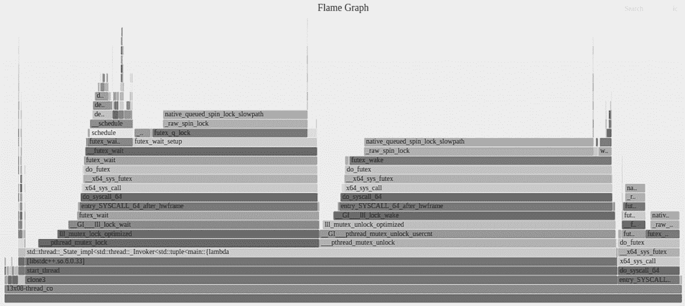

# 提高异步软件性能

在本章中，我们将介绍异步代码的性能方面。代码性能和优化是一个深奥且复杂的话题，我们无法在一章中涵盖所有内容。我们的目标是给你一个关于这个主题的良好介绍，并提供一些如何测量性能和优化代码的示例。

本章将涵盖以下关键主题：

+   专注于多线程应用程序的性能测量工具

+   什么是伪共享，如何识别它，以及如何修复/改进我们的代码

+   现代 CPU 内存缓存架构简介

+   对我们在*第五章*中实现的**单生产者单消费者**（**SPSC**）无锁队列的回顾

# 技术要求

如前几章所述，你需要一个支持 C++20 的现代 C++编译器。我们将使用 GCC 13 和 Clang 18。你还需要一台运行 Linux 的 Intel/AMD 多核 CPU 的 PC。对于本章，我们使用了在具有 CPU AMD Ryzen Threadripper Pro 5975WX（32 核心）的工作站上运行的 Ubuntu 24.04 LTS。8 核心的 CPU 是理想的，但 4 核心足以运行示例。

我们还将使用 Linux **perf**工具。我们将在本书的后面部分解释如何获取和安装这些工具。

本章的示例可以在本书的 GitHub 存储库中找到：[`github.com/PacktPublishing/Asynchronous-Programming-with-CPP`](https://github.com/PacktPublishing/Asynchronous-Programming-with-CPP)。

# 性能测量工具

要了解我们应用程序的性能，我们需要能够对其进行测量。如果从这个章节中有一个关键要点，那就是*永远不要估计或猜测你的代码性能*。要知道你的程序是否满足其性能要求（无论是延迟还是吞吐量），你需要测量，测量，然后再测量。

一旦你从性能测试中获得数据，你就会知道代码中的热点。也许它们与内存访问模式或线程竞争（例如，当多个线程必须等待获取锁以访问资源时）有关。这就是第二个最重要的要点发挥作用的地方：*在优化应用程序时设定目标*。不要试图达到可能的最优性能，因为总有改进的空间。正确的方法是设定一个明确的规范，包括目标，例如事务的最大处理时间或每秒处理的网络数据包数量。

在考虑这两个主要想法的同时，让我们从我们可以用来测量代码性能的不同方法开始。

## 代码内分析

理解代码性能的一个非常简单但实用的方法是 **代码内分析**，它包括添加一些额外的代码来测量某些代码段的执行时间。这种方法在编写代码时作为一个工具使用是很好的（当然，我们需要访问源代码）。这将使我们能够找到代码中的某些性能问题，正如我们将在本章后面看到的。

我们将使用 **std::chrono** 作为我们分析代码的初始方法。

以下代码片段展示了我们如何使用 **std::chrono** 对代码进行一些基本的性能分析：

```cpp
auto start = std::chrono::high_resolution_clock::now();
// processing to profile
auto end = std::chrono::high_resolution_clock::now();
auto duration = std::chrono::duration_cast<std::chrono::milliseconds>(end - start);
std::cout < duration.count() << " milliseconds\n";
```

在这里，我们获取了两个时间样本，它们调用了 **high_resolution_clock::now()** 并打印了转换成毫秒的时间间隔。根据我们估计的处理时间，我们可以使用微秒或秒，例如。使用这种简单技术，我们可以轻松地了解处理所需的时间，并且可以轻松地比较不同的选项。

在这里，**std::chrono::high_resolution_clock** 是提供最高精度（实现提供的最小滴答周期）的时钟类型。C++ 标准库允许它成为 **std::chrono::system_clock** 或 **std::chrono::steady_clock** 的别名。libstdc++ 将其别名为 **std::chrono::system_clock**，而 libc++ 使用 **std::chrono::steady_clock**。在本章的示例中，我们使用了 GCC 和 libstdc++。时钟分辨率为 1 纳秒：

```cpp
/**
 *  @brief Highest-resolution clock
 *
 *  This is the clock "with the shortest tick period." Alias to
 *  std::system_clock until higher-than-nanosecond definitions
 *  become feasible.
 *  @ingroup chrono
*/
using high_resolution_clock = system_clock;
```

现在，让我们看看一个完整的示例，用于分析 C++ 标准库中的两个排序算法——**std::sort** 和 **std::stable_sort** 的性能：

```cpp
#include <algorithm>
#include <chrono>
#include <iostream>
#include <random>
#include <utility>
int uniform_random_number(int min, int max) {
    static std::random_device rd;
    static std::mt19937 gen(rd());
    std::uniform_int_distribution dis(min, max);
    return dis(gen);
}
std::vector<int> random_vector(std::size_t n, int32_t min_val, int32_t max_val) {
    std::vector<int> rv(n);
    std::ranges::generate(rv, [&] {
            return uniform_random_number(min_val, max_val);
        });
    return rv;
}
using namespace std::chrono;
int main() {
    constexpr uint32_t elements = 100000000;
    int32_t minval = 1;
    int32_t maxval = 1000000000;
    auto rv1 = random_vector(elements, minval, maxval);
    auto rv2 = rv1;
    auto start = high_resolution_clock::now();
    std::ranges::sort(rv1);
    auto end = high_resolution_clock::now();
    auto duration = duration_cast<milliseconds>(end - start);
    std::cout << "Time to std::sort "
              << elements << " elements with values in ["
              << minval << "," << maxval << "] "
              << duration.count() << " milliseconds\n";
    start = high_resolution_clock::now();
    std::ranges::stable_sort(rv2);
    end = high_resolution_clock::now();
    duration = duration_cast<milliseconds>(end - start);
    std::cout << "Time to std::stable_sort "
              << elements << " elements with values in ["
              << minval << "," << maxval << "] "
              << duration.count() << " milliseconds\n";
    return 0;
}
```

上一段代码生成一个正态分布的随机数向量，然后使用 **std::sort()** 和 **std::stable_sort()** 对向量进行排序。这两个函数都排序向量，但 **std::sort()** 使用了称为 introsort 的快速排序和插入排序算法的组合，而 **std::stable_sort()** 使用了归并排序。排序是 *稳定的*，因为在原始和排序后的向量中，等效键具有相同的顺序。对于整数向量来说，这并不重要，但如果向量有三个具有相同值的元素，在排序向量后，数字将保持相同的顺序。

运行代码后，我们得到以下输出：

```cpp
Time to std::sort 100000000 elements with values in [1,1000000000] 6019 milliseconds
Time to std::stable_sort 100000000 elements with values in [1,1000000000] 7342 milliseconds
```

在这个例子中，**std::stable_sort()** 的速度比 **std::sort()** 慢。

在本节中，我们了解了一种简单的方法来测量代码段运行时间。这种方法是侵入性的，需要我们修改代码；它主要在我们开发应用程序时使用。在下一节中，我们将介绍另一种测量执行时间的方法，称为微基准测试。

## 代码微基准测试

有时候，我们只想独立分析一小段代码。我们可能需要多次运行它，然后获取平均运行时间或使用不同的输入数据运行它。在这些情况下，我们可以使用基准测试库（也称为 **微基准测试**）来完成这项工作——在不同的条件下执行我们代码的小部分。

微基准测试必须作为指导。请注意，代码在隔离状态下运行，当我们将所有代码一起运行时，由于代码不同部分之间复杂的交互，这可能会给我们带来非常不同的结果。请谨慎使用，并意识到微基准测试可能会误导。

我们可以使用许多库来基准测试我们的代码。我们将使用 *Google Benchmark*，这是一个非常好且广为人知的库。

让我们从获取代码和编译库开始。要获取代码，请运行以下命令：

```cpp
git clone https://github.com/google/benchmark.git
cd benchmark
git clone https://github.com/google/googletest.git
```

一旦我们有了基准测试和 Google Test 库的代码（后者是编译前者所必需的），我们就会构建它。

为构建创建一个目录：

```cpp
mkdir build
cd build
```

有了这些，我们在基准测试目录内创建了构建目录。

接下来，我们将使用 CMake 来配置构建并创建 **make** 所需的所有必要信息：

```cpp
cmake .. -DCMAKE_BUILD_TYPE=Release -DBUILD_SHARED_LIBRARIES=ON -DCMAKE_INSTALL_PREFIX=/usr/lib/x86_64-linux-gnu/
```

最后，运行 **make** 来构建和安装库：

```cpp
make -j16
sudo make install
```

您还需要将库添加到 **CmakeLists.txt** 文件中。我们已经在本书的代码中为您完成了这项工作。

一旦安装了 Google Benchmark，我们就可以通过一些基准函数的示例来学习如何使用该库进行一些基本的基准测试。

注意，**std::chrono** 和 Google Benchmark 都不是专门用于处理异步/多线程代码的工具，它们更像是通用工具。

这是使用 Google Benchmark 的第一个示例：

```cpp
#include <benchmark/benchmark.h>
#include <algorithm>
#include <chrono>
#include <iostream>
#include <random>
#include <thread>
void BM_vector_push_back(benchmark::State& state) {
    for (auto _ : state) {
        std::vector<int> vec;
        for (int i = 0; i < state.range(0); i++) {
            vec.push_back(i);
        }
    }
}
void BM_vector_emplace_back(benchmark::State& state) {
    for (auto _ : state) {
        std::vector<int> vec;
        for (int i = 0; i < state.range(0); i++) {
            vec.emplace_back(i);
        }
    }
}
void BM_vector_insert(benchmark::State& state) {
    for (auto _ : state) {
        std::vector<int> vec;
        for (int i = 0; i < state.range(0); i++) {
            vec.insert(vec.begin(), i);
        }
    }
}
BENCHMARK(BM_vector_push_back)->Range(1, 1000);
BENCHMARK(BM_vector_emplace_back)->Range(1, 1000);
BENCHMARK(BM_vector_insert)->Range(1, 1000);
int main(int argc, char** argv) {
    benchmark::Initialize(&argc, argv);
    benchmark::RunSpecifiedBenchmarks();
    return 0;
}
```

我们需要包含库头文件：

```cpp
#include <benchmark/benchmark.h>
```

所有基准测试函数都具有以下签名：

```cpp
void benchmark_function(benchmark::State& state);
```

这是一个具有一个参数的函数，**benchmark::State& state**，它返回 **void**。**benchmark::State** 参数具有双重用途：

+   **控制迭代循环**：**benchmark::State** 对象用于控制被基准测试的函数或代码应该执行多少次。通过重复测试足够多次以最小化变异性并收集有意义的数据，这有助于准确测量性能。

+   **测量时间和统计信息**：**state** 对象跟踪基准测试代码的运行时间，并提供报告指标（如经过时间、迭代次数和自定义计数器）的机制。

我们实现了三个函数来以不同的方式基准测试向 **std::vector** 序列添加元素：第一个函数使用 **std::vector::push_back**，第二个使用 **std::vector::emplace_back**，第三个使用 **std::vector::insert**。前两个函数在向量的末尾添加元素，而第三个函数在向量的开头添加元素。

一旦我们实现了基准测试函数，我们需要告诉库它们必须作为基准测试运行：

```cpp
BENCHMARK(BM_vector_push_back)->Range(1, 1000);
```

我们使用 **BENCHMARK** 宏来完成这项工作。对于本例中的基准测试，我们设置了每次迭代要插入向量中的元素数量。范围从 **1** 到 **1000**，每次迭代将插入前一次迭代元素数量的八倍，直到达到最大值。在这种情况下，它将插入 1、8、64、512 和 1000 个元素。

当我们运行第一个基准测试程序时，我们得到以下输出：

```cpp
2024-10-17T05:02:37+01:00
Running ./13x02-benchmark_vector
Run on (64 X 3600 MHz CPU s)
CPU Caches:
  L1 Data 32 KiB (x32)
  L1 Instruction 32 KiB (x32)
  L2 Unified 512 KiB (x32)
  L3 Unified 32768 KiB (x4)
Load Average: 0.00, 0.02, 0.16
----------------------------------------------------------------------
Benchmark                            Time             CPU   Iterations
----------------------------------------------------------------------
BM_vector_push_back/1             10.5 ns         10.5 ns     63107997
BM_vector_push_back/8             52.0 ns         52.0 ns     13450361
BM_vector_push_back/64             116 ns          116 ns      6021740
BM_vector_push_back/512            385 ns          385 ns      1819732
BM_vector_push_back/1000           641 ns          641 ns      1093474
BM_vector_emplace_back/1          10.8 ns         10.8 ns     64570848
BM_vector_emplace_back/8          53.3 ns         53.3 ns     13139191
BM_vector_emplace_back/64          108 ns          108 ns      6469997
BM_vector_emplace_back/512         364 ns          364 ns      1924992
BM_vector_emplace_back/1000        616 ns          616 ns      1138392
BM_vector_insert/1                10.6 ns         10.6 ns     65966159
BM_vector_insert/8                58.6 ns         58.6 ns     11933446
BM_vector_insert/64                461 ns          461 ns      1485319
BM_vector_insert/512              7249 ns         7249 ns        96756
BM_vector_insert/1000            23352 ns        23348 ns        29742
```

首先，程序打印出基准测试执行的信息：日期和时间、可执行文件名称以及它所运行的 CPU 信息。

看看以下这一行：

```cpp
Load Average: 0.00, 0.02, 0.16
```

这一行给出了 CPU 负载的估计：从 0.0（完全没有负载或非常低的负载）到 1.0（完全加载）。这三个数字分别对应于过去 5、10 和 15 分钟的 CPU 负载。

在打印 CPU 负载信息后，基准测试会打印出每次迭代的成果。以下是一个示例：

```cpp
BM_vector_push_back/64             116 ns          116 ns      6021740
```

这意味着 **BM_vector_push_back** 被调用了 6,021,740 次（迭代次数），在向量的插入过程中插入了 64 个元素。

**时间** 和 **CPU** 列给出了每次迭代的平均时间：

+   **时间**：这是从基准测试开始到结束所经过的真正时间。它包括基准测试期间发生的所有事情：CPU 计算、I/O 操作、上下文切换等。

+   **CPU 时间**：这是 CPU 处理基准测试指令所花费的时间。它可以小于或等于 **时间**。

在我们的基准测试中，因为操作很简单，我们可以看到 **时间** 和 **CPU** 大多数情况下是相同的。

通过查看结果，我们可以得出以下结论：

+   对于简单的对象，例如 32 位整数，**push_back** 和 **emplace_back** 花费的时间相同。

+   在这里，对于少量元素，**insert** 与 **push_back** / **emplace_back** 花费的时间相同，但从 64 个元素开始，它需要更多的时间。这是因为每次插入后，**insert** 必须复制向量中所有后续的元素（我们在向量的开头插入元素）。

以下示例也排序了一个 **std::vector** 序列，但这次，我们将使用微基准测试来测量执行时间：

```cpp
#include <benchmark/benchmark.h>
#include <algorithm>
#include <chrono>
#include <iostream>
#include <random>
#include <thread>
std::vector<int> rv1, rv2;
int uniform_random_number(int min, int max) {
    static std::random_device rd;
    static std::mt19937 gen(rd());
    std::uniform_int_distribution dis(min, max);
    return dis(gen);
}
std::vector<int> random_vector(std::size_t n, int32_t min_val, int32_t max_val) {
    std::vector<int> rv(n);
    std::ranges::generate(rv, [&] {
        return uniform_random_number(min_val, max_val);
    });
    return rv;
}
static void BM_vector_sort(benchmark::State& state, std::vector<int>& vec) {
    for (auto _ : state) {
        std::ranges::sort(vec);
    }
}
static void BM_vector_stable_sort(benchmark::State& state, std::vector<int>& vec) {
    for (auto _ : state) {
        std::ranges::stable_sort(vec);
    }
}
BENCHMARK_CAPTURE(BM_vector_sort, vector, rv1)->Iterations(1)->Unit(benchmark::kMillisecond);
BENCHMARK_CAPTURE(BM_vector_stable_sort, vector, rv2)->Iterations(1)->Unit(benchmark::kMillisecond);
int main(int argc, char** argv) {
    constexpr uint32_t elements = 100000000;
    int32_t minval = 1;
    int32_t maxval = 1000000000;
    rv1 = random_vector(elements, minval, maxval);
    rv2 = rv1;
    benchmark::Initialize(&argc, argv);
    benchmark::RunSpecifiedBenchmarks();
    return 0;
}
```

上述代码生成一个随机数字的向量。在这里，我们运行两个基准测试函数来排序向量：一个使用 **std::sort**，另一个使用 **std::stable_sort**。请注意，我们使用了同一个向量的两个副本，所以两个函数的输入是相同的。

以下代码行使用了 **BENCHMARK_CAPTURE** 宏。这个宏允许我们将参数传递给我们的基准测试函数——在这种情况下，一个对 **std::vector** 的引用（我们通过引用传递以避免复制向量并影响基准测试结果）。

我们指定结果以毫秒为单位而不是纳秒：

```cpp
BENCHMARK_CAPTURE(BM_vector_sort, vector, rv1)->Iterations(1)->Unit(benchmark::kMillisecond);
```

下面是基准测试的结果：

```cpp
-------------------------------------------------------------------------
Benchmark                          Time         CPU   Iterations
-------------------------------------------------------------------------
BM_vector_sort                     5877 ms      5876 ms            1
BM_vector_stable_sort.             7172 ms      7171 ms            1
```

结果与我们使用 **std::chrono** 测量时间得到的结果一致。

对于我们最后的 Google Benchmark 示例，我们将创建一个线程（**std::thread**）：

```cpp
#include <benchmark/benchmark.h>
#include <algorithm>
#include <chrono>
#include <iostream>
#include <random>
#include <thread>
static void BM_create_terminate_thread(benchmark::State& state) {
    for (auto _ : state) {
        std::thread thread([]{ return -1; });
        thread.join();
    }
}
BENCHMARK(BM_create_terminate_thread)->Iterations(2000);
int main(int argc, char** argv) {
    benchmark::Initialize(&argc, argv);
    benchmark::RunSpecifiedBenchmarks();
    return 0;
}
```

这个例子很简单：**BM_create_terminate_thread** 创建一个线程（什么都不做，只是返回 0）并等待它结束（**thread.join()**）。我们运行 **2000** 次迭代以估计创建线程所需的时间。

结果如下：

```cpp
---------------------------------------------------------------
----------
Benchmark                        Time             CPU
Iterations
---------------------------------------------------------------
----------
BM_create_terminate_thread.       32424 ns        21216 ns     2000
```

在本节中，我们学习了如何使用 Google Benchmark 库创建微基准来测量某些函数的执行时间。再次强调，微基准只是一个近似值，由于被基准测试的代码的隔离性质，它们可能会有误导性。请谨慎使用。

## Linux 的 **perf** 工具

在我们的代码中使用 **std::chrono** 或像 Google Benchmark 这样的微基准库需要获取要分析代码的访问权限，并且能够通过添加额外的调用来测量代码段的执行时间或运行小的代码片段作为微基准函数来修改它。

使用 Linux 的 **perf** 工具，我们可以分析程序的执行，而不需要更改其任何代码。

Linux 的 **perf** 工具是一个强大、灵活且广泛使用的性能分析和分析工具，适用于 Linux 系统。它提供了对内核和用户空间级别的系统性能的详细洞察。

让我们考虑 **perf** 的主要用途。

首先，我们有 **CPU 分析**。**perf** 工具允许你捕获进程的执行配置文件，测量哪些函数消耗了最多的 CPU 时间。这可以帮助识别代码中 CPU 密集的部分和瓶颈。

以下命令行将在我们编写的用于说明工具基本原理的小型 **13x07-thread_contention** 程序上运行 **perf**。此应用程序的代码可以在本书的 GitHub 仓库中找到：

```cpp
perf record --call-graph dwarf ./13x07-thread_contention
```

**--call-graph** 选项将函数调用层次结构的数据记录在名为 **perf.data** 的文件中，而 **dwarf** 选项指示 **perf** 使用 dwarf 文件格式来调试符号（以获取函数名称）。

在之前的命令之后，我们必须运行以下命令：

```cpp
 perf script > out.perf
```

这将把记录的数据（包括调用栈）输出到名为 **out.perf** 的文本文件中。

现在，我们需要将文本文件转换为带有调用图的图片。为此，我们可以运行以下命令：

```cpp
gprof2dot -f perf out.perf -o callgraph.dot
```

这将生成一个名为 **callgraph.dot** 的文件，可以使用 Graphviz 进行可视化。

你可能需要安装 **gprof2dot**。为此，你需要在你的电脑上安装 Python。运行以下命令来安装 **gprof2dot**：

```cpp
pip install gprof2dot
```

还需要安装 Graphviz。在 Ubuntu 上，你可以这样做：

```cpp
sudo apt-get install graphviz
```

最后，你可以通过运行以下命令生成 **callgraph.png** 图片：

```cpp
dot -Tpng callgraph.dot -o callgraph.png
```

另一种非常常见的可视化程序调用图的方法是使用火焰图。

要生成火焰图，请克隆**FlameGraph**仓库：

```cpp
git clone https://github.com/brendangregg/FlameGraph.git
```

在**FlameGraph**文件夹中，您将找到生成火焰图的脚本。

运行以下命令：

```cpp
FlameGraph/stackcollapse-perf.pl out.perf > out.folded
```

此命令将堆栈跟踪折叠成火焰图工具可以使用的形式。现在，运行以下命令：

```cpp
Flamegraph/flamegraph.pl out.folded > flamegraph.svg
```

您可以使用网页浏览器可视化火焰图：



图 13.1：火焰图的概述

现在，让我们学习如何收集程序的性能统计数据。

以下命令将显示在**13x05-sort_perf**执行期间执行的指令数量和使用的 CPU 周期。每周期指令数是 CPU 在每个时钟周期中执行的指令的平均数。此指标仅在微基准测试或测量代码的短部分时才有用。对于此示例，我们可以看到 CPU 每个周期执行一条指令，这对于现代 CPU 来说是平均的。在多线程代码中，由于执行的并行性，我们可以得到一个更大的数字，但此指标通常用于测量和优化在单个 CPU 核心中执行的代码。此数字必须解释为我们如何保持 CPU 忙碌，因为它取决于许多因素，例如内存读取/写入的数量、内存访问模式（线性连续/非线性）、代码中的分支级别等：

```cpp
perf stat -e instructions,cycles ./13x05-sort_perf
```

运行前面的命令后，我们得到了以下结果：

```cpp
Performance counter stats for './13x05-sort_perf':
    30,993,024,309      instructions                     #     1.03   
             insn per cycle
    30,197,863,655      cycles
       6.657835162 seconds time elapsed
       6.502372000 seconds user
       0.155008000 seconds sys
```

运行以下命令，您可以获取所有预定义事件的列表，您可以使用**perf**分析这些事件：

```cpp
perf list
```

让我们再进行几个操作：

```cpp
perf stat -e branches ./13x05-sort_perf
```

之前的命令测量了已执行的分支指令的数量。我们得到了以下结果：

```cpp
Performance counter stats for './13x05-sort_perf':
     5,246,138,882      branches
       6.712285274 seconds time elapsed
       6.551799000 seconds user
       0.159970000 seconds sys
```

在这里，我们可以看到，执行指令中有六分之一是分支指令，这在排序大型向量的程序中是预期的。

如前所述，测量代码中的分支级别很重要，尤其是在代码的短部分（以避免可能影响测量的交互）。如果没有分支或只有很少的分支，CPU 将运行指令的速度会更快。分支的主要问题是 CPU 可能需要重建流水线，这可能会很昂贵，尤其是如果分支在内部/关键循环中。

以下命令将报告 L1 缓存数据访问的数量（我们将在下一节中看到 CPU 缓存）：

```cpp
perf stat -e all_data_cache_accesses ./13x05-sort_perf
```

我们得到了以下结果：

```cpp
Performance counter stats for './13x05-sort_perf':
    21,286,061,764      all_data_cache_accesses
       6.718844368 seconds time elapsed
       6.561416000 seconds user
       0.157009000 seconds sys
```

让我们回到我们的锁竞争示例，并使用**perf**收集一些有用的统计数据。

使用**perf**的另一个好处是**CPU 迁移**——也就是说，线程从一个 CPU 核心移动到另一个核心的次数。线程在核心之间的迁移可能会降低缓存性能，因为当线程移动到新的核心时，会失去缓存数据的优势（关于缓存的更多内容将在下一节中介绍）。

让我们运行以下命令：

```cpp
perf stat -e cpu-migrations ./13x07-thread_contention
```

这导致了以下输出：

```cpp
Performance counter stats for './13x08-thread_contention':
                45      cpu-migrations
      50.476706194 seconds time elapsed
      57.333880000 seconds user
     262.123060000 seconds sys
```

让我们看看使用 **perf** 的另一个优点：**上下文切换**。它计算执行过程中的上下文切换次数（线程被交换出去和另一个线程被调度的次数）。高上下文切换可能表明太多线程正在竞争 CPU 时间，从而导致性能下降。

让我们运行以下命令：

```cpp
perf stat -e context-switches ./13x07-thread_contention
```

这导致以下输出：

```cpp
Performance counter stats for './13x08-thread_contention':
        13,867,866      cs
      47.618283562 seconds time elapsed
      52.931213000 seconds user
     247.033479000 seconds sys
```

这一节的内容到此结束。在这里，我们介绍了 Linux **perf** 工具及其一些应用。我们将在下一节研究 CPU 内存缓存和假共享。

# 假共享

在本节中，我们将研究多线程应用程序中一个常见的问题，称为 **假共享**。

我们已经知道，多线程应用程序的理想实现是尽量减少不同线程之间共享的数据。理想情况下，我们应该只为读取访问共享数据，因为在这种情况下，我们不需要同步线程来访问共享数据，因此我们不需要支付运行时成本，也不需要处理死锁和活锁等问题。

现在，让我们考虑一个简单的例子：四个线程并行运行，生成随机数，并计算它们的总和。每个线程独立工作，生成随机数并计算存储在它刚刚写入的变量中的总和。这是一个理想的应用（尽管对于这个例子来说有点牵强），线程独立工作，没有任何共享数据。

以下代码是我们将在本节中分析的示例的完整源代码。在阅读解释时，你可以参考它：

```cpp
#include <chrono>
#include <iostream>
#include <random>
#include <thread>
#include <vector>
struct result_data {
    unsigned long result { 0 };
};
struct alignas(64) aligned_result_data {
    unsigned long result { 0 };
};
void set_affinity(int core) {
    if (core < 0) {
        return;
    }
    cpu_set_t cpuset;
    CPU_ZERO(&cpuset);
    CPU_SET(core, &cpuset);
    if (pthread_setaffinity_np(pthread_self(), sizeof(cpu_set_t), &cpuset) != 0) {
        perror("pthread_setaffinity_np");
        exit(EXIT_FAILURE);
    }
}
template <typename T>
auto random_sum(T& data, const std::size_t seed, const unsigned long iterations, const int core) {
    set_affinity(core);
    std::mt19937 gen(seed);
    std::uniform_int_distribution dist(1, 5);
    for (unsigned long i = 0; i < iterations; ++i) {
        data.result += dist(gen);
    }
}
using namespace std::chrono;
void sum_random_unaligned(int num_threads, uint32_t iterations) {
    auto* data = new(static_cast<std::align_val_t>(64)) result_data[num_threads];
    auto start = high_resolution_clock::now();
    std::vector<std::thread> threads;
    for (std::size_t i = 0; i < num_threads; ++i) {
        set_affinity(i);
        threads.emplace_back(random_sum<result_data>, std::ref(data[i]), i, iterations, i);
    }
    for (auto& thread : threads) {
        thread.join();
    }
    auto end = high_resolution_clock::now();
    auto duration = std::chrono::duration_cast<milliseconds>(end - start);
    std::cout << "Non-aligned data: " << duration.count() << " milliseconds" << std::endl;
    operator delete[] (data, static_cast<std::align_val_t>(64));
}
void sum_random_aligned(int num_threads, uint32_t iterations) {
    auto* aligned_data = new(static_cast<std::align_val_t>(64)) aligned_result_data[num_threads];
    auto start = high_resolution_clock::now();
    std::vector<std::thread> threads;
    for (std::size_t i = 0; i < num_threads; ++i) {
        set_affinity(i);
        threads.emplace_back(random_sum<aligned_result_data>, std::ref(aligned_data[i]), i, iterations, i);
    }
    for (auto& thread : threads) {
        thread.join();
    }
    auto end = high_resolution_clock::now();
    auto duration = std::chrono::duration_cast<milliseconds>(end - start);
    std::cout << "Aligned data: " << duration.count() << " milliseconds" << std::endl;
    operator delete[] (aligned_data, static_cast<std::align_val_t>(64));
}
int main() {
    constexpr unsigned long iterations{ 100000000 };
    constexpr unsigned int num_threads = 8;
    sum_random_unaligned(8, iterations);
    sum_random_aligned(8, iterations);
    return 0;
}
```

如果你编译并运行前面的代码，你会得到类似于以下输出的结果：

```cpp
Non-aligned data: 4403 milliseconds
Aligned data: 160 milliseconds
```

程序仅调用两个函数：**sum_random_unaligned** 和 **sum_random_aligned**。这两个函数做的是同一件事：它们创建八个线程，每个线程生成随机数并计算它们的总和。线程之间没有共享数据。你可以看到这两个函数几乎相同，主要区别在于 **sum_random_unaligned** 使用以下数据结构来存储生成的随机数的总和：

```cpp
struct result_data {
    unsigned long result { 0 };
};
```

**sum_random_aligned** 函数使用了一个稍微不同的方法：

```cpp
struct alignas(64) aligned_result_data {
    unsigned long result { 0 };
};
```

唯一的区别是使用了 **alignas(64)** 来通知编译器，数据结构实例必须在 64 字节边界上对齐。

我们可以看到，性能差异非常明显，因为线程正在执行相同的任务。只需将每个线程写入的变量对齐到 64 字节边界，就可以大大提高性能。

要理解为什么会发生这种情况，我们需要考虑现代 CPU 的一个特性——内存缓存。

# CPU 内存缓存

现代 CPU 在计算方面非常快，当我们想要达到最大性能时，内存访问是主要的瓶颈。内存访问的良好估计约为 150 纳秒。在这段时间内，我们的 3.6 GHz CPU 已经通过了 540 个时钟周期。作为一个粗略估计，如果 CPU 每两个周期执行一条指令，那么就是 270 条指令。对于一个普通应用程序，内存访问是一个问题，即使编译器可能会重新排序它生成的指令，CPU 也可能重新排序指令以优化内存访问并尽可能多地运行指令。

因此，为了提高现代 CPU 的性能，我们有了所谓的**CPU 缓存**或**内存缓存**，这是芯片中的内存，用于存储数据和指令。这种内存比 RAM 快得多，允许 CPU 更快地检索数据，从而显著提高整体性能。

作为现实生活中的缓存示例，想想一个厨师。他们需要一些原料来为他们的餐厅客户准备午餐。现在，想象一下，他们只有在客户来到餐厅并点餐时才购买这些原料。这将非常慢。他们也可以去超市购买一天的原料，比如。现在，他们可以为所有客户烹饪，并在更短的时间内为他们提供餐点。

CPU 缓存遵循相同的概念：当 CPU 需要访问一个变量时，比如一个 4 字节的整数，它会读取 64 字节（这个大小可能因 CPU 而异，但大多数现代 CPU 使用这个大小）的连续内存，*以防万一*它可能需要访问更多的连续数据。

线性内存数据结构，如**std::vector**，在内存访问方面将表现得更好，因为这些情况下，缓存可以大幅提高性能。对于其他类型的数据结构，如**std::list**，则不会是这样。当然，这仅仅是关于优化缓存使用。

你可能想知道，如果 CPU 缓存内存如此之好，为什么所有内存都像那样？答案是成本。缓存内存非常快（比 RAM 快得多），但它也非常昂贵。

现代 CPU 采用分层缓存结构，通常由三个级别组成，称为 L1、L2 和 L3：

+   **L1 缓存**是最小和最快的。它也是最接近 CPU 的，同时也是最昂贵的。它通常分为两部分：一个指令缓存用于存储指令，一个数据缓存用于存储数据。典型的大小是 64 Kb，分为 32 Kb 用于指令和 32 Kb 用于数据。L1 缓存的典型访问时间在 1 到 3 纳秒之间。

+   **L2 缓存**比 L1 大，速度略慢，但仍然比 RAM 快得多。典型的 L2 缓存大小在 128 Kb 到 512 Kb 之间（本章中使用的 CPU 每个核心有 512 Kb 的 L2 缓存）。典型的 L2 缓存访问时间约为 3 到 5 纳秒。

+   **L3 缓存**是三者中最大且速度最慢的。L1 和 L2 缓存是每个核心的（每个核心都有自己的 L1 和 L2 缓存），但 L3 是多个核心共享的。我们的 CPU 每组八个核心共享 32 Mb 的 L3 缓存。典型的访问时间大约是 10 到 15 纳秒。

有了这些，让我们将注意力转向与内存缓存相关的一个重要概念。

## 缓存一致性

CPU 不直接访问 RAM。这种访问总是通过缓存进行的，只有当 CPU 在缓存中找不到所需的数据时才会访问 RAM。在多核系统中，每个核心都有自己的缓存意味着同一块 RAM 可能同时存在于多个核心的缓存中。这些副本需要始终同步；否则，计算结果可能会不正确。

到目前为止，我们已经看到每个核心都有自己的 L1 缓存。让我们回到我们的例子，思考一下当我们使用非对齐内存运行函数时会发生什么。

在这种情况下，每个 **result_data** 实例是 8 字节。我们创建了一个包含 8 个 **result_data** 实例的数组，每个线程一个。总共占用的内存将是 64 字节，所有实例在内存中都是连续的。每次线程更新随机数的总和时，它都会改变存储在缓存中的值。记住，CPU 总是会一次读取和写入 64 字节（这被称为**缓存行**——你可以将其视为最小的内存访问单元）。所有变量都在同一个缓存行中，即使线程没有共享它们（每个线程都有自己的变量——**sum**），CPU 也不知道这一点，需要使更改对所有核心可见。

在这里，我们有 8 个核心，每个核心都在运行一个线程。每个核心已经从 RAM 中加载了 64 字节的内存到 L1 缓存中。由于线程只读取变量，所以一切正常，但一旦某个线程修改了它的变量，缓存行的内容就会被无效化。

现在，由于剩余的 7 个核心中的缓存行无效，CPU 需要将更改传播到所有核心。如前所述，即使线程没有共享变量，CPU 也不可能知道这一点，并且需要更新所有核心的所有缓存行以保持值的一致性。这被称为缓存一致性。如果线程共享变量，那么不将更改传播到所有核心是不正确的。

在我们的例子中，缓存一致性协议在 CPU 内部产生了相当多的流量，因为所有线程都*共享变量所在的内存区域*，尽管从程序的角度来看它们并不共享。这就是我们称之为伪共享的原因：变量之所以共享，是因为缓存和缓存一致性协议的工作方式。

当我们将数据对齐到 64 字节边界时，每个实例占用 64 字节。这保证了它们位于自己的缓存行中，并且不需要缓存一致性流量，因为在这种情况下，没有数据共享。在这种情况下，性能要好得多。

让我们使用**perf**来确认这一点是否真的发生了。

首先，我们在执行**sum_random_unaligned**时运行**perf**。我们想看看程序访问缓存的次数和缓存未命中的次数。每次缓存需要更新，因为它包含的数据也在另一个核心的缓存行中，都算作一次缓存未命中：

```cpp
perf stat -e cache-references,cache-misses ./13x07-false_sharing
```

我们得到以下结果：

```cpp
Performance counter stats for './13x07-false_sharing':
       251,277,877      cache-references
       242,797,999      cache-misses
                        # 96.63% of all cache refs
```

大多数缓存引用都是缓存未命中。这是预期的，因为伪共享。

现在，如果我们运行**sum_random_aligned**，结果会有很大不同：

```cpp
Performance counter stats for './13x07-false_sharing':
           851,506      cache-references
           231,703      cache-misses
                        # 27.21% of all cache refs
```

缓存引用和缓存未命中的数量都小得多。这是因为不需要不断更新所有核心的缓存以保持缓存一致性。

在本节中，我们看到了多线程代码中最常见的性能问题之一：伪共享。我们看到了一个带有和没有伪共享的函数示例，以及伪共享对性能的负面影响。

在下一节中，我们将回到我们在*第五章*中实现的 SPSC 无锁队列，并提高其性能。

# SPSC 无锁队列

在*第五章*中，我们实现了一个 SPSC 无锁队列，作为如何从两个线程同步访问数据结构的示例，而不使用锁。这个队列仅由两个线程访问：一个生产者将数据推送到队列，一个消费者从队列中弹数据。这是最容易同步的队列。

我们使用了两个原子变量来表示队列的头部（读取缓冲区索引）和尾部（写入缓冲区索引）：

```cpp
std::atomic<std::size_t> head_ { 0 };
std::atomic<std::size_t> tail_ { 0 };
```

为了避免伪共享，我们可以将代码更改为以下内容：

```cpp
alignas(64) std::atomic<std::size_t> head_ { 0 };
alignas(64) std::atomic<std::size_t> tail_ { 0 };
```

在这次更改之后，我们可以运行我们实现的代码来测量生产者和消费者线程每秒执行的操作数（推/弹）。代码可以在本书的 GitHub 仓库中找到。

现在，我们可以运行**perf**：

```cpp
perf stat -e cache-references,cache-misses ./13x09-spsc_lock_free_queue
```

我们将得到以下结果：

```cpp
101559149 ops/sec
 Performance counter stats for ‹./13x09-spsp_lock_free_queue›:
       532,295,487      cache-references
       219,861,054      cache-misses                     #   41.30% of all cache refs
       9.848523651 seconds time elapsed
```

在这里，我们可以看到队列每秒能够处理大约 1 亿次操作。此外，大约有 41%的缓存未命中。

让我们回顾一下队列的工作原理。在这里，生产者是唯一写入**tail_**的线程，消费者是唯一写入**head_**的线程。尽管如此，两个线程都需要读取**tail_**和**head_**。我们已经将这两个原子变量声明为**aligned(64)**，以确保它们保证位于不同的缓存行中，从而没有伪共享。然而，存在真正的共享。真正的共享也会生成缓存一致性流量。

真正的共享意味着两个线程都共享对两个变量的访问权限，即使每个变量只是由一个线程（并且总是同一个线程）写入。在这种情况下，为了提高性能，我们必须减少共享，尽可能避免每个线程对两个变量的读访问。我们无法避免数据共享，但我们可以减少它。

让我们关注生产者（对于消费者也是同样的机制）：

```cpp
bool push(const T &item) {
    std::size_t tail = tail_.load(std::memory_order_relaxed);
    std::size_t next_tail = (tail + 1) & (capacity_ - 1);
    if (next_tail == cache_head_) {
        cache_head_ = head_.load(std::memory_order_acquire);
        if (next_tail == cache_head_) {
            return false;
        }
    }
    buffer_[tail] = item;
    tail_.store(next_tail, std::memory_order_release);
    return true;
}
```

**push()** 函数只由生产者调用。

让我们分析一下该函数的功能：

+   它原子地读取环形缓冲区中存储最后一个项目的索引：

    ```cpp
    std::size_t tail = tail_.load(std::memory_order_relaxed);
    ```

+   它计算项目将在环形缓冲区中存储的索引：

    ```cpp
    std::size_t next_tail = (tail + 1) & (capacity_ - 1);
    ```

+   它检查环形缓冲区是否已满。然而，它不是读取 **head_** ，而是读取缓存的头部值：

    ```cpp
        if (next_tail == cache_head_) {
    ```

    初始时，**cache_head_** 和 **cache_tail_** 都被设置为零。如前所述，使用这两个变量的目的是最小化核心之间的缓存更新。缓存变量技术是这样的：每次调用 **push**（或 **pop** ）时，我们原子地读取 **tail_**（由同一线程写入，因此不需要缓存更新）并生成下一个存储传递给 **push** 函数的项目索引。现在，我们不是使用 **head_** 来检查队列是否已满，而是使用 **cache_head_**，它只被一个线程（生产者线程）访问，避免了任何缓存一致性流量。如果队列“已满”，则通过原子加载 **head_** 来更新 **cache_head_**。在此更新之后，我们再次检查。如果第二次检查的结果是队列已满，则返回 **false**。

    使用这些局部变量（生产者使用 **cache_head_** ，消费者使用 **cache_tail_** ）的优势在于它们减少了真正的共享——也就是说，访问可能在不同核心的缓存中更新的变量。当生产者在消费者尝试获取它们之前在队列中推送多个项目时（消费者也是如此），这将表现得更好。比如说生产者在队列中插入 10 个项目，而消费者尝试获取一个项目。在这种情况下，使用缓存变量进行的第一次检查将告诉我们队列是空的，但在更新为实际值之后，它将正常工作。消费者只需通过检查队列是否为空（只读取 **cache_tail_** 变量）就可以获取另外九个项目。

+   如果环形缓冲区已满，则更新 **cache_head_** ：

    ```cpp
    head_.load(std::memory_order_acquire);
            if (next_tail == cache_head_) {
                return false;
            }
    ```

+   如果缓冲区已满（不仅仅是 **cache_head_** 需要更新），则返回 **false** 。生产者无法将新项目推送到队列中。

+   如果缓冲区未满，将项目添加到环形缓冲区并返回 **true**：

    ```cpp
    buffer_[tail] = item;
        tail_.store(next_tail, std::memory_order_release);
        return true;
    ```

我们可能减少了生产者线程访问 **tail_** 的次数，从而减少了缓存一致性流量。考虑以下情况：生产者和消费者使用队列，生产者调用 **push()**。当 **push()** 更新 **cache_head_** 时，它可能比 **tail_** 前面多一个槽位，这意味着我们不需要读取 **tail_**。

同样的原则也适用于消费者和 **pop()**。

在修改代码以减少缓存一致性流量后，让我们再次运行 **perf**：

```cpp
162493489 ops/sec
 Performance counter stats for ‹./13x09-spsp_lock_free_queue›:
       474,296,947      cache-references
       148,898,301      cache-misses                     #   31.39% of all cache refs
       6.156437788 seconds time elapsed
      12.309295000 seconds user
       0.000999000 seconds sys
```

在这里，我们可以看到性能提高了大约 60%，并且缓存引用和缓存缺失的数量更少。

通过这样，我们学习了如何通过减少两个线程之间共享数据的访问来提高性能。

# 摘要

在本章中，我们介绍了你可以用来分析代码的三个方法：**std::chrono**，使用 Google Benchmark 库进行微基准测试，以及 Linux 的 **perf** 工具。

我们还看到了如何通过减少/消除伪共享和减少真实共享来提高多线程程序的性能，从而减少缓存一致性流量。

本章提供了一些基本的分析技术介绍，这些技术将作为进一步研究的起点非常有用。正如我们在本章开头所说，性能是一个复杂的话题，值得有它自己的书籍。

# 进一步阅读

+   Fedor G. Pikus，*编写高效程序的艺术*，第一版，Packt Publishing，2021。

+   Ulrich Drepper，*程序员应了解的内存知识*，2007。

+   Shivam Kunwar，*优化多线程性能*（[`www.youtube.com/watch?v=yN7C3SO4Uj8`](https://www.youtube.com/watch?v=yN7C3SO4Uj8)）。
