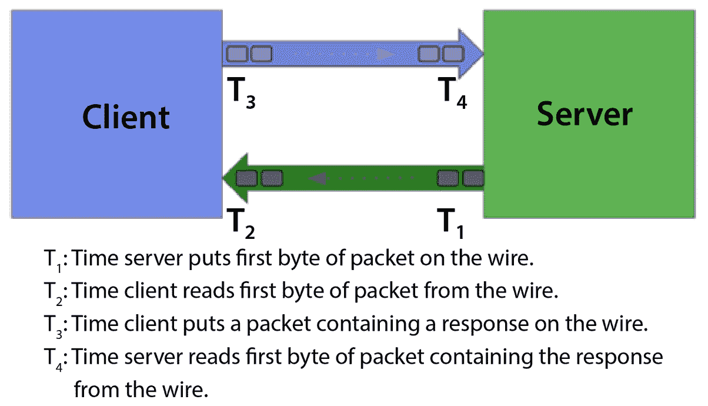
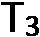
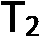
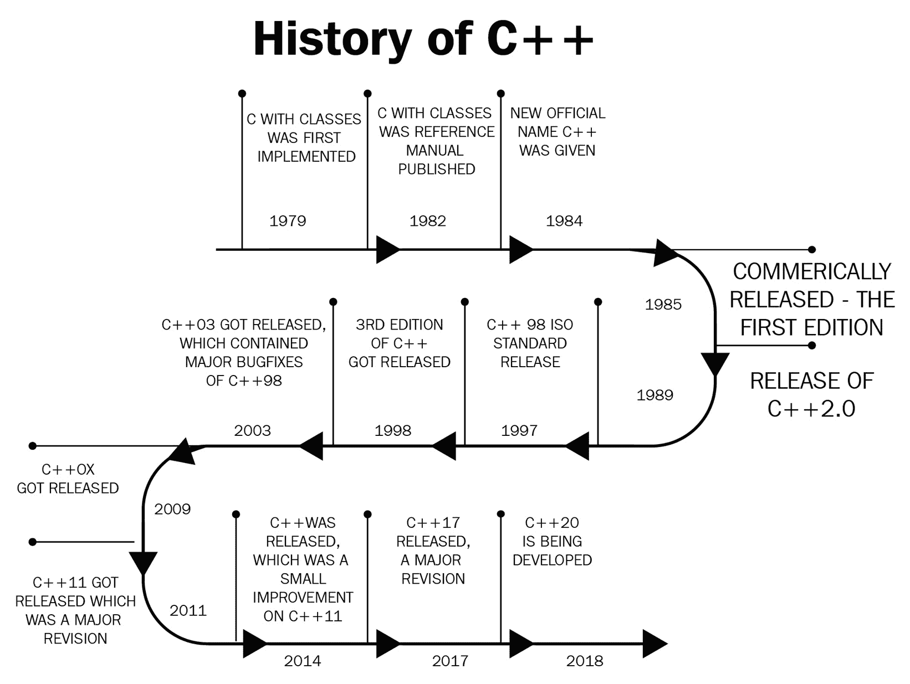

# 1

# 介绍 C++中的低延迟应用开发

让我们以低延迟应用为起点，通过在本章中介绍它们来开启我们的旅程。在本章中，我们将首先了解对延迟敏感和对延迟关键的应用的行为和需求。我们将了解应用延迟对依赖快速和严格响应时间的业务产生的巨大商业影响。

我们还将讨论为什么 C++是低延迟应用开发中最受欢迎的编程语言之一。我们将用这本书的大部分篇幅从头开始构建一个完整的低延迟电子交易系统。因此，这将是一个很好的章节，让你了解使用 C++的动机以及它为什么是低延迟应用中最流行的语言。

我们还将介绍不同业务领域的一些重要低延迟应用。部分动机是让你明白，延迟确实在不同业务领域对响应时间敏感的使用案例中非常重要。另一个动机是识别这些应用在行为、期望、设计和实现方面的相似性。尽管它们解决不同的商业问题，但这些应用的低延迟需求通常建立在相似的技术设计和实现原则之上。

在本章中，我们将涵盖以下主题：

+   理解对延迟敏感的应用的需求

+   理解为什么 C++是首选编程语言

+   介绍一些重要的低延迟应用

为了有效地构建超低延迟应用，我们首先应该理解我们将在这本书的其余部分中引用的术语和概念。我们还应该了解为什么 C++已经成为大多数低延迟应用开发的明确选择。始终牢记低延迟的商业影响也很重要，因为目标是构建低延迟应用以使业务的底线受益。本章讨论了这些想法，以便在我们深入本书其余部分的技术细节之前，你能建立一个良好的基础。

# 理解对延迟敏感的应用的需求

在本节中，我们将讨论一些概念，这些概念对于理解对延迟敏感的应用的哪些指标很重要。首先，让我们明确地定义延迟的含义和对延迟敏感的应用是什么。

**延迟**被定义为任务开始到任务完成之间的时间延迟。根据定义，任何处理或工作都会产生一些开销或延迟——也就是说，除非系统完全不工作，否则没有系统具有零延迟。这里的重要细节是，某些系统可能具有微不足道的毫秒分之一延迟，并且对额外微秒的容忍度可能很低。

低延迟应用是指那些尽可能快速执行任务并响应或返回结果的程序。这里的要点是，反应延迟是这类应用的重要标准，因为更高的延迟可能会降低性能，甚至使应用完全无用。另一方面，当这类应用以预期的低延迟运行时，它们可以击败竞争对手，以最大速度运行，实现最大吞吐量，或提高生产力和改善用户体验——具体取决于应用和业务。

低延迟可以被视为一个既定量又定性的术语。定量方面很明显，但定性方面可能并不一定明显。根据上下文，架构师和开发者可能在某些情况下愿意接受更高的延迟，但在某些情况下可能不愿意接受额外的微秒。例如，如果用户刷新网页或等待视频加载，几秒钟的延迟是可以接受的。然而，一旦视频加载并开始播放，就不再能够承受几秒钟的延迟来渲染或显示，而不会对用户体验产生负面影响。一个极端的例子是高速金融交易系统，其中额外的几微秒可能会在盈利公司和无法竞争的公司之间产生巨大的差异。

在以下小节中，我们将介绍适用于低延迟应用的一些术语。理解这些术语非常重要，这样我们才能继续讨论低延迟应用，因为我们将会频繁地引用这些概念。我们将讨论的概念和术语用于区分不同的延迟敏感型应用、延迟的测量以及这些应用的要求。

## 理解延迟敏感型与延迟关键型应用

**延迟敏感型应用**和**延迟关键型应用**之间存在微妙但重要的区别。延迟敏感型应用是指，随着性能延迟的降低，它提高了业务影响或盈利能力。因此，系统可能在较高的性能延迟下仍然功能正常，甚至可能盈利，但如果降低延迟，则可能获得更高的盈利能力。这类应用的例子包括操作系统（OSes）、网络浏览器、数据库等。

另一方面，延迟关键的应用程序是指当性能延迟高于某个阈值时，会完全失败的应用程序。这里的要点是，虽然延迟敏感的应用程序在更高的延迟下可能会损失部分盈利能力，但延迟关键的应用程序在足够高的延迟下会完全失败。这类应用的例子包括交通控制系统、金融交易系统、自动驾驶汽车和一些医疗设备。

## 测量延迟

在本节中，我们将讨论不同的测量延迟的方法。这些方法之间的真正区别在于，我们考虑的处理任务的开始和结束是什么。另一种方法是我们测量的单位——时间是其中最常见的一个，但在某些情况下，如果涉及到指令级测量，也可以使用 CPU 时钟周期。接下来，我们将查看不同的测量方法，但首先，我们展示一个通用服务器-客户端系统的图，而不深入使用案例或传输协议的具体细节。这是因为测量延迟是通用的，适用于具有这种服务器-客户端设置的许多不同应用程序。

图 1.1 – 具有不同跳数时间戳的通用服务器-客户端系统

我们在这里展示这个图是因为，在接下来的几个小节中，我们将定义并理解服务器到客户端以及返回服务器的往返路径上不同跳数之间的延迟。

### 首字节到达时间

**首字节到达时间**是指从发送者发送请求（或响应）的第一个字节到接收者接收第一个字节所经过的时间。这通常（但不一定）适用于具有数据传输操作且对延迟敏感的网络链路或系统。在*图 1*.1 中，首字节到达时间将是  和  之间的差异

### 往返时间

**往返时间**（**RTT**）是指数据包从一个进程传输到另一个进程所需的时间，以及响应数据包返回原始进程所需的时间。同样，这通常（但不一定）用于服务器和客户端进程之间的网络流量往返，但也可以用于一般情况下的两个进程之间的通信。

默认情况下，RTT 包括服务器进程读取、处理和响应发送者发送的请求所需的时间——也就是说，RTT 通常包括服务器处理时间。在电子交易的情况下，真正的 RTT 延迟基于三个组成部分：

+   首先，交易所信息到达参与者所需的时间

+   其次，算法分析信息和做出决策所需的时间

+   最后，决策从达到交易所并经过撮合引擎处理所需的时间

我们将在本书的最后一节，*分析和改进性能*中进一步讨论这个问题。

### 交易计时

**交易计时**（**TTT**）与 RTT 类似，是电子交易系统中最常用的术语。TTT 被定义为从数据包（通常是市场数据包）首次击中参与者的基础设施（交易服务器）到参与者完成处理该数据包并发送数据包（订单请求）到交易交易所的时间。因此，TTT 包括交易基础设施读取数据包、处理数据包、计算交易信号、根据该信号生成订单请求并将其*发送出去*所需的时间。**发送出去**通常意味着将数据写入网络套接字。我们将在本书的最后一节，*分析和改进性能*中重新审视这个主题，并对其进行更详细的探讨。在*图 1.1*中，TTT 将是和之间的差异。

### CPU 时钟周期

**CPU 时钟周期**基本上是 CPU 处理器可以完成的最低工作量增量。实际上，它们是驱动 CPU 处理器的振荡器两次脉冲之间的时间间隔。测量 CPU 时钟周期通常用于测量指令级别的延迟——即在处理器级别的极低级别。C++既是一种低级语言，也是一种高级语言；它允许你根据需要接近硬件，同时也提供了诸如类、模板等高级抽象。但通常，C++开发者不会花很多时间处理极低级别的或可能是汇编语言。这意味着编译后的机器代码可能并不完全符合 C++开发者的预期。此外，根据编译器版本、处理器架构等因素，可能还有更多差异的来源。因此，对于极高性能敏感的低延迟代码，工程师通常测量执行了多少条指令以及完成这些指令所需的 CPU 时钟周期数。这种级别的优化通常是可能达到的最高优化级别，与内核级别的优化并列。

现在我们已经看到了一些不同应用中测量延迟的不同方法，在下一节中，我们将探讨一些延迟汇总指标以及它们在不同场景下的重要性。

## 区分延迟指标

特定延迟指标相对于其他指标的重要性取决于应用和业务本身。例如，一个延迟关键的应用，如自动驾驶软件系统，比平均延迟更关心峰值延迟。低延迟电子交易系统通常比峰值延迟更关心平均延迟和更小的延迟方差。由于应用和消费者的性质，视频流和播放应用可能通常优先考虑高吞吐量而不是较低的延迟方差。

### 吞吐量与延迟

在我们查看这些指标本身之前，首先，我们需要清楚地理解两个术语之间的区别——**吞吐量**和**延迟**——这两个术语非常相似，经常被互换使用，但不应如此。吞吐量定义为在特定时间内完成的工作量，而延迟是单个任务完成的速度。为了提高吞吐量，通常的方法是引入并行性并添加额外的计算、内存和网络资源。请注意，每个单独的任务可能不会以尽可能快的速度处理，但总体上，在一段时间后，将完成更多任务。这是因为，虽然每个任务单独处理时可能需要更长的时间，但并行性提高了任务集的吞吐量。另一方面，延迟是对每个单独的任务从开始到结束进行测量的，即使总体上执行的任务较少。

### 平均延迟

**平均延迟**基本上是系统的预期平均响应时间。它只是所有延迟测量观测值的平均值。这个指标包括大异常值，因此对于经历大范围性能延迟的系统来说可能是一个嘈杂的指标。

### 中值延迟

**中值延迟**通常是衡量系统预期响应时间的更好指标。由于它是延迟测量观测值的中间值，因此排除了大异常值的影响。因此，有时它比平均延迟指标更受欢迎。

### 峰值延迟

**峰值延迟**是对于系统来说一个重要的指标，因为单个大的异常性能可能会对系统产生灾难性的影响。峰值延迟的大值也可能显著影响系统的平均延迟指标。

### 延迟方差

对于需要尽可能确定性的延迟配置文件的系统，性能延迟的实际**方差**是一个重要的指标。这通常在预期的延迟相当可预测的情况下很重要。对于低延迟方差的系统，平均延迟、中值延迟和峰值延迟都预计会非常接近。

## 对延迟敏感的应用需求

在本节中，我们将正式描述对延迟敏感型应用程序的行为以及这些应用程序预期遵守的性能配置文件。显然，延迟敏感型应用程序需要低延迟性能，但在这里我们将尝试探索“低延迟”一词的细微差别，并讨论一些不同的看待方式。

### 正确性和鲁棒性

当我们思考延迟敏感型应用程序时，通常认为低延迟是这类应用程序最重要的单一方面。但在现实中，这类应用程序的一个巨大需求是正确性，我们指的是非常高的鲁棒性和容错性。直观上，这个想法应该完全合理；这些应用程序需要非常低的延迟才能成功，这应该告诉你这些应用程序也有非常高的吞吐量，需要处理大量的输入并产生大量的输出。因此，系统需要非常接近 100%的正确性，并且非常鲁棒，以便在业务领域取得成功。此外，随着应用程序在其生命周期中的增长和变化，正确性和鲁棒性要求也需要保持。

### 平均低延迟

这是思考延迟敏感型应用程序时最明显的要求。预期的反应或处理延迟需要尽可能低，以便应用程序或业务整体能够成功。在这里，我们关注平均和中值性能延迟，并希望它尽可能低。按设计，这意味着系统不能有太多的异常值或性能延迟的高峰。

### 峰值延迟上限

我们使用“峰值延迟上限”这个术语来指代必须为应用程序可能遇到的最大延迟设定一个明确的上限。这种行为对所有延迟敏感型应用程序都很重要，但对于延迟关键型应用程序来说尤为重要。即使在一般情况下，对于少数几个案例具有极高性能延迟的应用程序通常会破坏系统的性能。这实际上意味着应用程序需要处理任何输入、场景或事件序列，并在低延迟期内完成。当然，处理非常罕见和特定场景的性能可能远高于最可能的情况，但这里的重点是它不能是无界的或不可接受的。

### 可预测的延迟 - 低延迟变化

一些应用程序更喜欢预期的性能延迟是可预测的，即使这意味着如果平均延迟指标高于可能的情况，需要牺牲一点延迟。这实际上意味着此类应用程序将确保所有不同输入或事件的预期性能延迟尽可能小地变化。实现零延迟变化是不可能的，但可以在数据结构、算法、代码实现和设置方面做出一些选择，以尽可能最大限度地减少这种变化。

### 高吞吐量

如前所述，低延迟和吞吐量相关但并不相同。因此，有时一些需要尽可能高吞吐量的应用程序在设计实现上可能有所不同，以最大化吞吐量。关键是最大化吞吐量可能需要牺牲平均性能延迟或增加峰值延迟以实现这一点。

在本节中，我们介绍了适用于低延迟应用程序性能和这些指标业务影响的概念。当我们讨论我们构建的应用程序的性能时，我们将在本书的其余部分需要这些概念。接下来，我们将继续讨论，并探索用于低延迟应用程序开发的编程语言。我们将讨论支持低延迟应用程序的语言特性，并了解为什么 C++ 在开发和提高对延迟敏感的应用程序时位居榜首。

# 理解为什么 C++ 是首选编程语言

在低延迟应用程序方面，有几种高级语言选择——Java、Scala、Go 和 C++。在本节中，我们将讨论为什么 C++ 是低延迟应用程序中最受欢迎的语言之一。我们将讨论 C++ 语言的一些特性，这些特性支持高级语言结构以支持大型代码库。C++ 的强大之处在于它还提供了类似于 C 编程语言的非常低级别的访问权限，以支持非常高级的控制和优化。

## 编译型语言

C++ 是一种编译型语言，而不是解释型语言。编译型语言是一种编程语言，其中源代码被翻译成机器码二进制文件，该文件可以在特定架构上运行。编译型语言的例子有 C、C++、Erlang、Haskell、Rust 和 Go。编译型语言的替代品是解释型语言。解释型语言的不同之处在于程序是由解释器运行的，解释器逐行运行源代码并执行每个命令。解释型语言的例子包括 Ruby、Python 和 JavaScript。

解释性语言本质上比编译性语言慢，因为与编译性语言在编译时就将代码翻译成机器指令不同，这里的解释到机器指令是在运行时完成的。然而，随着即时编译技术的发展，解释性语言的性能并没有慢很多。对于编译性语言，代码在编译时已经为特定硬件预先构建，因此在运行时没有额外的解释步骤。由于 C++是一种编译性语言，它为开发者提供了对硬件的大量控制。这意味着有能力的开发者可以优化诸如内存管理、CPU 使用、缓存性能等方面。此外，由于编译性语言在编译时就已经转换为特定硬件的机器代码，因此它可以进行大量的优化。因此，一般来说，编译性语言，尤其是 C++，执行速度更快，效率更高。

## 更接近硬件——低级语言

与其他流行的编程语言，如 Python、Java 等相比，C++是低级语言，因此它与硬件非常接近。这在软件与运行其上的目标硬件紧密耦合，甚至需要低级支持的情况下特别有用。与硬件非常接近也意味着在用 C++构建系统时，存在显著的速度优势。特别是在低延迟应用，如**高频交易**（**HFT**）中，几微秒的差距可能造成巨大的差异，C++通常是行业中的黄金标准。

我们将讨论一个例子，说明更接近硬件如何帮助 C++性能超过另一种语言，如 Java。C/C++指针是内存中对象的实际地址。因此，软件可以直接访问内存和内存中的对象，而无需额外的抽象，这些抽象会减慢速度。然而，这也意味着应用程序开发者通常必须显式地管理对象的创建、所有权、销毁和生命周期，而不是像 Python 或 Java 那样依赖编程语言为您管理这些事情。C++接近硬件的一个极端例子是，可以直接从 C++语句中调用汇编指令——我们将在后面的章节中看到这个例子。

## 资源的确定性使用

对于低延迟应用来说，高效使用资源至关重要。嵌入式应用（这些应用也常用于实时应用）在时间和内存资源上尤其有限。在像 Java 和 Python 这样的依赖自动垃圾回收的语言中，存在非确定性的因素——也就是说，垃圾回收器可能会在性能不可预测的情况下引入较大的延迟。此外，对于内存非常有限的系统，使用 C 和 C++这样的低级语言可以做一些特殊的事情，比如通过指针将数据放置在内存中的自定义部分或地址。在 C 和 C++这样的语言中，程序员负责显式创建、管理和释放内存资源，从而允许资源的确定性和高效使用。

## 速度和高效性能

C++比大多数其他编程语言都要快，原因我们已经讨论过了。它还提供了出色的并发和多线程支持。显然，这对于开发对延迟敏感甚至对延迟至关重要的低延迟应用来说，又是一个很好的特性。这样的需求也常常出现在服务器负载很重的应用中，如 Web 服务器、应用服务器、数据库服务器、交易服务器等。

C++的另一个优点是由于其编译时优化能力。C 和 C++支持宏或预处理器指令、`constexpr`指定符和模板元编程等功能。这些功能使我们能够将大量处理从运行时移动到编译时。基本上，这意味着我们通过在构建机器代码二进制时将大量处理移动到编译步骤，最小化了在关键代码路径上运行时的工作量。我们将在后续章节中详细讨论这些功能，当我们在构建一个完整的电子交易系统时，它们的益处将变得非常明显。

## 语言构造和特性

C++语言本身是灵活性和功能丰富的完美结合。它为开发者提供了很多自由度，他们可以利用它将应用调整到非常低的级别。然而，它也提供了很多高级抽象，可以用来构建非常大型、功能丰富、通用和可扩展的应用，同时在需要时仍能保持极低的延迟。在本节中，我们将探讨一些 C++特有的语言特性，这些特性使其处于独特的低级控制和高级抽象功能的位置。

### 可移植性

首先，C++高度可移植，可以构建适用于许多不同操作系统、平台、CPU 架构的应用程序。由于它不需要针对不同平台的不同运行时解释器，所需要做的就是编译时构建正确的二进制文件，这相对简单，最终部署的二进制文件可以在任何平台上运行。此外，我们之前已经讨论的一些其他特性（例如，在低内存和较弱的 CPU 架构上运行的能力，以及不需要垃圾回收的要求）使得它比其他一些高级语言更加可移植。

### 编译器优化

我们已经讨论过 C++是一种编译型语言，这使得它从本质上比解释型语言更快，因为它不会产生额外的运行时成本。由于开发者的完整源代码被编译成最终的执行二进制文件，编译器有机会全面分析所有对象和代码路径。这导致了在编译时实现非常高的优化水平的可能性。现代编译器与现代硬件紧密合作，生成一些令人惊讶的优化机器代码。这里的要点是，开发者可以专注于解决业务问题，并且假设 C++开发者是合格的，编译程序仍然可以非常优化，而不需要开发者投入大量的时间和精力。由于 C++还允许你直接内联汇编代码，这给了开发者更大的机会与编译器合作，生成高度优化的可执行文件。

### 静态类型

当谈到编程语言中的类型系统时，有两种选择——**静态类型语言**和**动态类型语言**。静态类型语言在编译过程中对数据类型（整数、浮点数、双精度浮点数、结构体和类）以及这些类型之间的交互进行检查。动态类型语言在运行时执行这些类型检查。静态类型语言的例子有 C++和 Java，动态类型语言的例子有 Python、Perl 和 JavaScript。

静态类型语言的一个重大好处是，由于所有类型检查都是在编译时完成的，这给了我们机会在程序运行之前找到并消除许多错误。显然，仅类型检查本身不能找到所有可能的错误，但我们试图说明的是，静态类型语言在编译时发现与类型相关的错误和错误方面做得更好。这对于高度数值化的低延迟应用程序尤其如此。

静态类型语言的一个巨大好处，尤其是在低延迟应用方面，是由于类型检查是在编译时进行的，这为编译器提供了额外的机会，在编译时优化类型和类型交互。事实上，编译语言之所以运行得更快，很大程度上是因为静态类型检查系统与动态类型检查系统本身的差异。这也是为什么对于像 Python 这样的动态类型语言，高性能库如 NumPy 在创建数组和矩阵时需要类型的原因。

### 多范式

与其他一些语言不同，C++并不强迫开发者遵循特定的编程范式。它支持许多不同的编程范式，如单体、过程式、**面向对象编程**（**OOP**）、泛型编程等。这使得它非常适合广泛的用途，因为它允许开发者以有利于最大优化和最低延迟的方式设计程序，而不是将编程范式强加给该应用。

### 库

C++本身就附带了一个大型的 C 和 C++库，它提供了大量的数据结构、算法和抽象，用于以下任务：

+   网络编程

+   动态内存管理

+   数值操作

+   错误和异常处理

+   字符串操作

+   常用算法

+   **输入/输出**（**I/O**）操作包括文件操作

+   多线程支持

此外，庞大的 C++开发者社区已经构建并开源了许多库；我们将在以下小节中讨论其中一些最受欢迎的库。

#### 标准模板库

**标准模板库**（**STL**）是一个非常流行且广泛使用的模板化和仅包含头文件的库，它包含数据结构和容器、这些容器的迭代器和分配器，以及用于排序、搜索等任务的算法。

#### Boost

**Boost**是一个大型 C++库，它提供了对多线程、网络操作、图像处理、**正则表达式**（**regex**）、线性代数、单元测试等方面的支持。

#### Asio

**Asio**（**异步输入/输出**）是另一个广为人知且广泛使用的库，它有两个版本：**非 Boost**版本和作为 Boost 库一部分的版本。它提供了对多线程并发、实现和使用异步 I/O 模型的支持，并且可移植到所有主要平台。

#### GNU 科学库

**GNU 科学库**（**GSL**）为各种数学概念和操作提供支持，如复数、矩阵和微积分，并管理其他函数。

#### 活动模板库

**Active Template Library**（**ATL**）是一个模板丰富的 C++库，用于帮助编程**组件对象模型**（**COM**）。它取代了之前的**Microsoft Foundation Classes**（**MFC**）库，并对其进行了改进。它由微软开发，是开源的，并且大量使用了重要的低延迟 C++特性，即**奇特重复模板模式**（**CRTP**），我们也将在此书中深入探讨并大量使用它。它支持 COM 功能，如双接口、ActiveX 控件、连接点、可拆卸接口、COM 枚举接口等，还有更多。

#### Eigen

**Eigen**是一个用于数学和科学应用的强大 C++库。它提供了线性代数、数值方法和求解器、复数等数值类型、几何特征和操作等功能。

#### LAPACK

**线性代数包**（**LAPACK**）是另一个专门用于线性代数、线性方程以及支持大矩阵例程的强大 C++库。它实现了许多功能，如求解联立线性方程、最小二乘法、特征值、**奇异值分解**（**SVD**）以及更多应用。

#### OpenCV

**Open Source Computer Vision**（**OpenCV**）是计算机图形和视觉相关应用中最知名的 C++库之一。它也适用于 Java 和 Python，并提供了许多用于人脸和物体识别、3D 模型、机器学习、深度学习等的算法。

#### mlpack

**mlpack**是一个超级快速、仅包含头文件的 C++库，用于广泛的各种机器学习模型及其相关的数学运算。它还支持 Go、Julia、R 和 Python 等其他语言。

#### QT

**QT**是构建跨平台图形程序时最流行的库之一。它支持 Windows、Linux、macOS，甚至 Android 和嵌入式系统等平台。它是开源的，用于构建 GUI 小部件。

#### Crypto++

**Crypto++**是一个免费的开源 C++库，用于支持密码学算法、操作和实用工具。它拥有许多密码学算法、随机数生成器、块加密、函数、公钥操作、秘密共享等，跨越 Linux、Windows、macOS、iOS 和 Android 等多个平台。

### 适合大型项目

在上一节中，我们讨论了 C++的设计和众多特性，使其非常适合低延迟应用。C++的另一个方面是，由于它为开发者提供的灵活性和允许构建的所有高级抽象，它实际上非常适合非常大的现实世界项目。像编译器、云处理和存储系统以及**操作系统**这样的大型项目就是出于这些原因用 C++编写的。我们将深入探讨这些以及其他许多试图在低延迟性能、功能丰富性和不同的业务案例之间取得平衡的应用，而且很多时候，C++是开发此类系统的完美选择。

## 成熟且庞大的社区支持

C 编程语言最初是在 1972 年创建的，然后 C++（最初被称为带类的 C）在 1983 年创建。C++是一种非常成熟的语言，并且被广泛嵌入到许多不同业务领域的许多应用中。一些例子包括 Unix 操作系统、Oracle MySQL、Linux 内核、Microsoft Office 和 Microsoft Visual Studio——这些都是在 C++中编写的。C++存在了 40 年意味着大多数软件问题都已经遇到，并且已经设计和实现了解决方案。C++也非常受欢迎，并且作为大多数计算机科学学位的一部分进行教授，此外，还有一个庞大的开发者工具、第三方组件、开源项目、库、手册、教程、书籍等库，专门针对它。总之，有大量的文档、示例和社区支持支持新的 C++开发者和新的 C++项目。

## 正在积极开发的语言

尽管 C++已经 40 岁了，但它仍然处于积极开发中。自从 1985 年第一个 C++版本商业发布以来，C++标准和语言已经经历了多次改进和增强。按时间顺序，发布了 C++ 98、C++ 03、C++ 0X、C++ 11、C++ 14、C++ 17 和 C++ 20，C++ 23 正在开发中。每个版本都带来了改进和新特性。因此，C++是一种强大的语言，并且随着时间的推移不断进化，添加现代特性。以下是一个展示 C++多年演变的图表：

图 1.2 – C++的演变

考虑到 C++编程语言已经非常成熟，超快的速度，高级抽象与低级硬件访问和控制的完美结合，庞大的知识库，以及开发者社区以及最佳实践、库和工具，C++是低延迟应用开发的明显选择。

在本节中，我们探讨了为低延迟应用开发选择 C++ 编程语言的原因。我们讨论了使其成为这些应用极佳选择的各项特性、功能、库和社区支持。C++ 深度嵌入到大多数具有严格性能要求的程序中，这并不令人惊讶。在下一节中，我们将探讨不同商业领域的许多不同低延迟应用，目标是理解这些应用共享的相似之处。

# 介绍一些重要的低延迟应用

在本节中，我们将探讨不同商业领域的一些常见低延迟应用，以便我们熟悉不同类型的低延迟应用以及延迟如何在它们的性能中扮演重要角色。此外，讨论这些应用将揭示这些应用在性质和设计上的相似之处。

## 低级低延迟应用

首先，我们将从被认为是极低级的应用开始，这意味着非常接近硬件。请注意，所有低延迟应用至少有一部分是低级的，因为按照定义，这就是实现低延迟性能的方式。然而，这些应用的大部分处理的是主要与低级细节相关的整个应用；让我们接下来讨论这些。

### 电信

我们已经讨论过，C++ 是最快的编程语言之一。它在构建电话交换机、路由器、互联网、太空探测器以及电信基础设施的各个部分中得到了广泛应用。这些应用需要处理大量的并发连接，并促进它们之间的通信。这些应用需要以速度和效率执行这些任务，使它们成为低延迟应用的优秀例子。

### 嵌入式系统

由于 C++ 与其他高级编程语言相比更接近硬件，因此它被用于低延迟敏感的嵌入式系统。这些应用的例子包括用于医学领域的机器、手术工具、智能手表等。C++ 通常是医疗应用的优选语言，例如 MRI 机器、实验室测试系统以及管理患者信息的系统。此外，还有用于建模医疗数据、进行研究模拟等用例。

### 编译器

有趣的是，各种编程语言的编译器使用 C 和 C++ 来构建这些语言的编译器。原因再次是，C 和 C++ 是接近硬件的低级语言，可以有效地构建这些编译器。编译器应用程序本身能够非常大地优化编程语言的代码，并生成低延迟的机器代码。

### 操作系统

从微软 Windows 到 macOS 再到 Linux 本身，所有主要的操作系统都是用 C++编写的——这又是 C++作为低级语言使其成为低延迟应用理想选择的一个例子。操作系统极其庞大且极其复杂。除此之外，它们还必须具有低延迟和高度性能，才能成为具有竞争力的现代操作系统。

例如，Linux 通常是许多高负载服务器以及为低延迟应用设计的服务器的首选操作系统，因此操作系统本身需要非常高的性能。除了传统的操作系统之外，C 和 C++也被广泛用于构建移动操作系统，如 iOS、Android 和 Windows 手机内核。总的来说，操作系统需要在管理所有系统和硬件资源方面非常快速和高效。构建操作系统的 C++开发者可以利用语言的能力来构建超低延迟的操作系统。

### 云/分布式系统

开发和使用云和分布式存储及处理系统的组织对低延迟有非常高的要求。因此，它们严重依赖像 C++这样的编程语言。分布式存储系统必须支持非常快速和高效的文件系统操作，因此需要接近硬件。此外，分布式处理通常意味着高并发级别，依赖低延迟的多线程库，以及高负载容忍和可扩展性优化要求。

### 数据库

数据库是另一类需要低延迟、高并发和并行性的应用的好例子。数据库也是许多不同商业领域许多不同应用中的关键组件。Postgres、MySQL 和 MongoDB（目前最受欢迎的数据库系统）都是用 C 和 C++编写的——这又是为什么 C++是低延迟应用首选语言的一个例子。C++也是设计和构建数据库以优化存储效率的理想选择。

### 飞行软件和交通控制

商用飞机和军用飞机的飞行软件是具有低延迟关键应用的一类。在这里，代码不仅需要遵循非常严格的指南，非常健壮，并且经过非常彻底的测试，而且应用程序还需要可预测地响应和反应事件，并在严格的延迟阈值内。

交通控制软件依赖于许多传感器，这些传感器需要监控车辆的速度、位置和流量，并将这些信息传输到中央软件。软件随后使用这些信息来控制交通标志、地图和交通灯。显然，对于这种实时应用，它需要具有低延迟并且能够快速高效地处理大量数据。

## 高级低延迟应用

在本小节中，我们将讨论许多人可能认为稍微高级一点的低延迟应用。这些是人们在尝试解决商业问题时通常会想到的应用；然而，需要注意的是，这些应用仍然需要实现和使用低级优化技术，以提供所需性能。

### 图形和视频游戏应用

图形应用需要超快的渲染性能，这又是一个低延迟应用的例子。图形软件采用计算机视觉、图像处理等技术，通常涉及在众多大型矩阵上进行大量非常快且非常高效的矩阵运算。当涉及到视频游戏中的图形渲染时，对低延迟性能的要求更为严格，因为这些是交互式应用，速度和响应性对用户体验至关重要。如今，视频游戏通常在多个平台上提供，以覆盖更广泛的受众。这意味着这些应用，或者这些应用的简化版本，需要在低端设备上运行，这些设备可能没有很多计算和内存资源。总体而言，视频游戏有很多资源密集型操作——渲染图形、同时处理多个玩家、快速响应用户输入等。C++非常适合所有这些应用，并被用于创建许多知名游戏，如《反恐精英》、《星际争霸》和《魔兽世界》，以及游戏引擎如虚幻引擎。C++也适合不同的游戏平台——Windows PC、任天堂 Switch、Xbox 和 PlayStation。

### 增强现实和虚拟现实应用

**增强现实**（**AR**）和**虚拟现实**（**VR**）都是增强和增强现实生活环境或创建全新虚拟环境的技术。虽然 AR 只是通过向我们的实时视图添加数字元素来增强环境，但 VR 则创建了一个完全新的模拟环境。因此，这些应用将图形渲染和视频游戏应用提升到了一个新的水平。

增强现实（AR）和虚拟现实（VR）技术已经找到了许多不同的商业应用场景，例如设计和建筑、维护和修理、培训和教学、医疗保健、零售和营销，甚至是在技术本身领域。AR 和 VR 应用与视频游戏应用有类似的要求，需要实时处理来自各种来源的大量数据，并且需要无缝且平滑地处理用户交互。这些应用的技术挑战在于处理有限的处理能力和可用内存，可能有限的移动带宽，以及保持低延迟和实时性能，以免影响用户体验。

### 浏览器

网络浏览器通常比它们看起来要复杂。网络浏览器中包含渲染引擎，这些引擎需要低延迟和高效的处理。此外，通常还需要与数据库和交互式渲染代码进行交互，以便用户不必等待很长时间才能更新内容或响应交互式内容。由于网络浏览器的低延迟要求，C++经常被选为这种应用的优先语言也就不足为奇了。实际上，一些最受欢迎的网络浏览器（如 Google Chrome、Mozilla Firefox、Safari、Opera 等）都大量使用了 C++。

### 搜索引擎

搜索引擎是另一个需要低延迟和高度高效的数据结构、算法和代码库的应用场景。现代搜索引擎，如 Google，使用诸如网络爬虫技术、索引基础设施、页面排名算法以及其他复杂算法（包括机器学习）等技术。Google 的搜索引擎依赖于 C++以高度低延迟和高效的方式实现所有这些要求。

### 库

许多高级库通常有严格的功能要求，并且可以被视为低延迟应用本身，但通常，它们是更大低延迟应用和业务的关键组件。这些库涵盖了不同的领域——网络编程、数据结构、更快的算法、数据库、多线程、数学库（例如，机器学习）等等。这些库需要非常低的延迟和高性能处理，例如涉及大量矩阵运算的计算，其中许多矩阵也可能非常大。

应该在这里清楚的是，在这些应用中性能是至关重要的——C++经常被大量使用的另一个领域。尽管像 TensorFlow 这样的许多库在 Python 中可用，但实际上，这些库的核心机器学习数学运算实际上是用 C++实现的，以支持在大型数据集上运行这些机器学习方法。

### 银行和金融应用程序

银行应用程序是另一类需要每天处理数百万笔交易的低延迟应用，需要低延迟、高并发性和健壮性。大型银行有数百万客户和数十亿笔交易，所有这些都需要正确且快速地执行，并且能够扩展以处理客户负载，从而数据库和服务器负载。正如我们之前讨论的那样，C++自动成为许多这些银行应用程序的选择。

当涉及到金融建模、电子交易系统和交易策略等应用时，低延迟比其他任何领域都更为关键。C++的速度和确定性性能使其非常适合处理数十亿的市场更新、发送数百万订单以及在交易所进行交易，尤其是在高频交易（HFT）方面。由于市场更新非常快，交易应用程序需要非常快速地获取正确数据以执行交易，否则会导致损失，这些损失可能会破坏大量的交易利润，甚至更糟。在研究和开发方面，跨多个交易所的多种交易工具的模拟也需要进行大规模的低延迟分布式处理，以便快速高效地完成。定量开发和研究以及风险分析库也用 C++编写，因为它们需要尽可能快地处理大量数据。其中一个最好的例子是定价和风险库，它计算期权产品的公平交易价格并运行许多模拟以评估期权风险，因为搜索空间是巨大的。

### 移动电话应用程序

现代移动应用程序功能丰富。此外，它们必须在具有非常有限的硬件资源的平台上运行。这使得这些应用程序的实现必须具有非常低的延迟，并且在使用它们有限的资源时必须非常高效。然而，这些应用程序仍然需要非常快速地响应用户交互，可能需要处理后端连接，并在移动设备上渲染高质量的图形。Android 和 Windows OS 等移动平台、Google Chrome 和 Firefox 等浏览器以及 YouTube 等应用程序都有大量的 C++参与。

## 物联网和机器对机器应用

**物联网**（**IoT**）和**机器对机器**（**M2M**）应用基于连接设备自动收集、存储和交换数据。总体而言，虽然物联网和 M2M 在本质上相似，但在网络、可扩展性、互操作性和人机交互等方面存在一些差异。

物联网（IoT）是一个广泛的概念，指的是将不同的物理设备连接在一起。物联网设备通常是嵌入在其他更大设备中的执行器和传感器，例如智能恒温器、冰箱、门铃、汽车、智能手表、电视和医疗设备。这些设备在具有有限计算资源、电源需求和最小可用内存资源的平台上运行。

M2M 是一种通信方法，其中多个机器通过有线或无线连接相互交互，无需任何人为监督或交互。这里的关键点是互联网连接对于 M2M 不是必需的。因此，物联网是 M2M 的一个子集，但 M2M 是一个更广泛的基于 M2M 通信系统的宇宙。M2M 技术被应用于不同的应用中，如安全、追踪和追溯、自动化、制造和设施管理。

我们之前已经讨论过这些应用，但在此再次总结，物联网和 M2M 技术被应用于电信、医疗和保健、制药、汽车和航空航天工业、零售和物流及供应链管理、制造以及军事卫星数据分析系统等应用中。

本节主要介绍了不同商业领域和用例，在这些领域中低延迟应用蓬勃发展，在某些情况下，低延迟应用对业务来说是必需的。我们的希望是您能理解低延迟应用被应用于许多不同的领域，尽管这可能并不立即明显。本节的另一个目标是确定这些应用之间共享的相似之处，尽管它们被设计来解决不同的商业问题。

# 摘要

在本章中，我们介绍了低延迟应用。首先，我们定义了延迟敏感型和延迟关键型应用以及不同的延迟度量。然后，我们讨论了在低延迟应用中重要的不同指标以及其他定义低延迟应用要求的考虑因素。

我们在本章的一节中探讨了为什么 C++是跨不同业务领域低延迟应用中最常选择的语言。具体来说，我们讨论了语言本身的特点以及语言的灵活性和底层性质，这使得 C++在低延迟应用中成为完美的选择。

最后，我们考察了不同业务领域中的许多低延迟应用的例子以及它们共享的相似之处。这次讨论的要点是，尽管业务案例不同，但这些应用共享许多共同的要求和特性。再次强调，在这里，C++对于大多数（如果不是所有）这些不同业务领域的低延迟应用都是一个很好的选择。

在下一章中，我们将更详细地讨论一些最受欢迎的低延迟应用。在本书中，我们将使用低延迟电子交易作为一个案例研究来理解和应用 C++低延迟技术。然而，在我们这样做之前，我们将探讨其他低延迟应用，例如实时视频流、实时离线和在线视频游戏应用，以及物联网应用。
