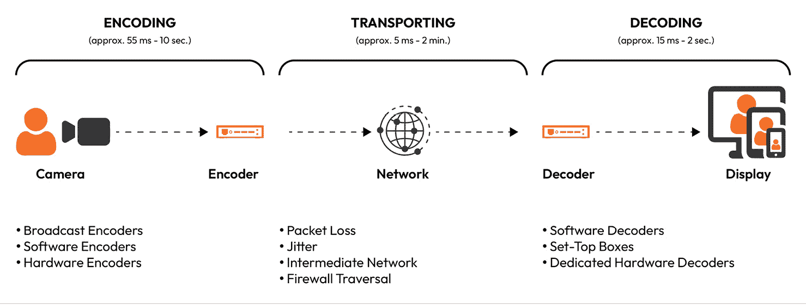
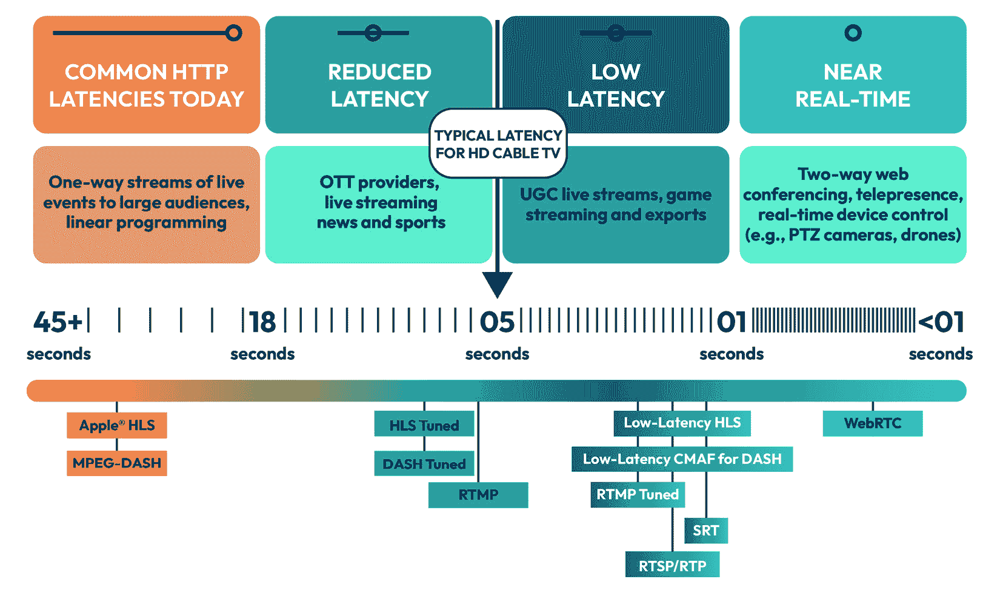
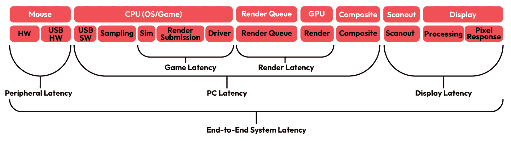
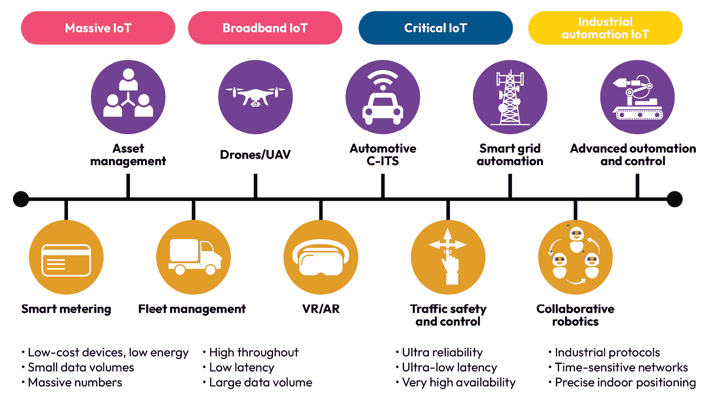

# 第二章：在 C++ 中设计一些常见的低延迟应用程序

在本章中，我们将探讨不同领域的应用，包括视频流、在线游戏、实时数据分析以及电子交易。我们将了解它们的行为，以及在极低延迟考虑下需要实时执行哪些功能。我们将介绍电子交易生态系统，因为我们将将其作为本书的案例研究，并从零开始使用 C++ 构建系统，重点关注理解和使用低延迟理念。

在本章中，我们将涵盖以下主题：

+   理解直播视频流媒体应用程序中的低延迟性能

+   理解在游戏应用中哪些低延迟约束是重要的

+   讨论物联网（IoT）和零售分析系统的设计

+   探索低延迟电子交易

本章的目标是深入探讨不同商业领域中低延迟应用程序的一些技术方面。在本章结束时，你应该能够理解和欣赏实时视频流、离线和在线游戏应用、物联网机器和应用程序以及电子交易等应用程序所面临的技术挑战。你将能够理解技术进步如何提供不同的解决方案来解决这些问题，并使这些业务可行且有利可图。

# 理解直播视频流媒体应用程序中的低延迟性能

在本节中，我们将首先讨论视频流应用程序中低延迟性能背后的细节。我们将定义与直播视频流相关的重要概念和术语，以建立对该领域和业务用例的理解。我们将了解这些应用程序中的延迟原因及其商业影响。最后，我们将讨论构建和支持低延迟视频流应用程序的技术、平台和解决方案。

## 定义低延迟流媒体中的重要概念

在这里，我们将首先定义一些与低延迟流媒体应用程序相关的重要概念和术语。让我们从一些基础知识开始，然后逐步深入到更复杂的概念。

### 视频流中的延迟

**视频流**被定义为实时或接近实时传输的音视频内容。通常，延迟指的是输入事件和输出事件之间的时间延迟。在直播视频流应用的背景下，延迟特指从直播视频流撞击录制设备的摄像头开始，然后传输到目标观众屏幕，并在那里渲染和显示的时间。应该很容易直观地理解为什么这也被称为直播视频流应用中的**玻璃到玻璃延迟**。在视频流应用中，玻璃到玻璃延迟非常重要，无论实际应用是什么，无论是视频通话、其他应用的直播视频流，还是在线视频游戏渲染。在直播中，视频延迟基本上是视频帧在录制端捕捉到视频帧在观众端显示之间的延迟。另一个常见的术语是**延迟**，它通常只是指高于预期的玻璃到玻璃延迟，用户可能会将其感知为性能降低或抖动。

### 视频分发服务和内容分发网络

**视频分发服务**（**VDS**）是一个相对容易理解的概念的时髦说法。VDS 基本上意味着负责从源端接收多个视频和音频流并将其呈现给观众的系统。VDS 最著名的例子之一就是**内容分发网络**（**CDN**）。CDN 是一种在全球范围内高效分发内容的方法。

### 转码、转封装和转比特率

让我们讨论与音频视频流编码相关的三个概念：

+   **转码**指的是将媒体流从一种格式（例如，更低级别的细节，如编解码器、视频大小、采样率、编码器格式等）解码的过程，并可能以不同的格式或不同的参数进行重新编码。

+   **转封装**与转码类似，但在这里，交付格式发生变化，而编码没有变化，就像转码的情况一样。

+   **转比特率**也与转码类似，但我们会改变视频比特率；通常，它会压缩到更低的值。视频比特率是每秒传输的比特数（或千比特数），它捕捉视频流中的信息和质量。

+   在下一节中，我们将了解低延迟视频流应用中延迟的来源。

## 理解视频流应用中延迟的来源

让我们看看玻璃到玻璃旅程中发生的事情的细节。本节中我们的最终动机是了解视频流应用中延迟的来源。此图从摄像头到显示的高层次描述了玻璃到玻璃旅程中发生的事情：

图 2.1 – 在实时视频流应用中的玻璃到玻璃传输过程

### 讨论玻璃到玻璃传输过程中的步骤

我们将首先了解低延迟视频流应用中玻璃到玻璃传输过程中的所有步骤和组件。存在两种延迟形式——初始启动延迟以及直播开始后视频帧之间的延迟。通常对于用户体验来说，略微更长的启动延迟远比视频帧之间的延迟更受欢迎，但在尝试减少一种延迟的同时通常会有所权衡。因此，我们需要了解哪个指标对于特定用例来说更重要，并相应地调整设计和技术细节。以下是广播者到接收者的玻璃到玻璃传输过程中的步骤：

1.  广播者端的摄像头捕捉和处理音频和视频

1.  广播者的视频消费和包装

1.  编码器对内容进行转码、转封装和转码率调整

1.  通过适当的协议（s）在网络中发送数据

1.  通过 VDS（如 CDN）进行分发

1.  接收端接收和缓冲

1.  在观众设备上解码内容

1.  在接收端处理数据包丢失、网络变化等问题

1.  在观众选择的设备上渲染音频-视频内容

1.  可能收集观众的交互输入（选择、音频、视频等）用于交互式应用，并在需要时将它们发送回广播者

现在我们已经描述了从发送者到接收者以及可能返回到发送者的内容交付细节，在下一节中，我们将描述在该路径上可能出现延迟的地方。通常，每一步不会花费很长时间，但多个组件中的高延迟可能会累积并导致用户体验的显著下降。

### 描述路径上高延迟的可能性

我们将探讨低延迟视频流应用中高延迟的原因。在之前小节中讨论的玻璃到玻璃路径的每个组件中，都有许多原因导致这种情况。

#### 物理距离、服务器负载和互联网质量

+   这是一个显而易见的问题：源和目的地之间的物理距离将影响玻璃到玻璃延迟。当从不同国家流式传输视频时，这种情况有时非常明显。

+   除了距离之外，互联网连接本身的质量也会影响流式传输延迟。缓慢或带宽有限的连接会导致不稳定、缓冲和延迟。

根据同时流式传输视频的用户数量以及这给流媒体路径中的服务器带来的负载，延迟和用户体验可能会有所不同。过载的服务器会导致响应时间变慢，延迟增加，缓冲和延迟，甚至可能导致流式传输完全停止。

#### 捕获设备和硬件

视频和音频捕获设备对端到端延迟有很大影响。将音频和视频帧转换为数字信号需要时间。记录器、编码器、处理器、重新编码器、解码器和重新传输器等高级系统对最终用户体验有显著影响。捕获设备和硬件将决定延迟值。

#### 流媒体协议、传输和抖动缓冲区

考虑到存在不同的流媒体协议（我们将在稍后讨论），最终的选择可以决定视频流应用的网络延迟。如果协议没有针对动态自适应流进行优化，它可能会增加延迟。总的来说，直播视频流协议分为两大类——基于 HTTP 和非基于 HTTP 的——这两大类选项之间的延迟和可扩展性存在差异，这将改变最终系统的性能。

在 VDS 路径中选择的互联网路由可以改变端到端延迟。这些路由也可能随时间变化，数据包可能在某些跳转处排队，甚至可能在接收端顺序错乱。处理这些问题的软件被称为**抖动缓冲区**。如果 CDN 存在问题，也可能导致额外的延迟。此外，还有一些限制，例如编码比特率（较低的比特率意味着每单位时间内传输的数据更少，从而导致较低的延迟），这可能会改变遇到的延迟。

#### 编码——转码和转速率

编码过程决定了最终视频输出的压缩、格式等，编码协议的选择和质量将对性能产生巨大影响。此外，还有许多观众设备（电视、手机、PC、Mac 等）和网络（3G、4G、5G、LAN、Wi-Fi 等）选项，流媒体提供商需要实现**自适应比特率**（**ABR**）来有效地处理这些选项。运行编码器的计算机或服务器需要足够的 CPU 和内存资源来跟上传入的音视频数据。无论我们是在计算机上使用编码软件，还是在*BoxCaster*或*Teradek*等编码硬件上进行编码，我们都会产生从几毫秒到几秒的处理延迟。编码器需要执行的任务包括摄取原始视频数据、缓冲内容，并在转发之前对其进行解码、处理和重新编码。

#### 在观众的设备上解码和播放

假设内容在没有引起明显延迟的情况下到达观众的设备，客户端仍然必须解码、播放和渲染内容。视频播放器不会逐个渲染接收到的视频段，而是有一个接收到的段缓冲区，通常在内存中。这意味着在视频开始播放之前，会缓冲几个段，具体取决于所选段的实际大小，这可能会在最终用户端引起延迟。例如，如果我们选择包含 10 秒视频的段长度，最终用户的播放器至少必须接收到一个完整的段才能播放，这将在发送者和接收者之间引入额外的 10 秒延迟。通常，这些段长在 2 到 10 秒之间，试图在优化网络效率和玻璃到玻璃延迟之间取得平衡。显然，观众设备、平台、硬件、CPU、内存和播放器效率等因素可能会增加玻璃到玻璃延迟。

## 在低延迟视频流中测量延迟

在低延迟视频流应用中测量延迟并不极端复杂，因为我们关注的延迟范围至少应该是几秒钟，这样用户才能感知到延迟或滞后。测量端到端视频延迟的最简单方法如下：

+   首先应该使用一个**场记板**应用程序。场记板是用于在电影制作过程中同步视频和音频的工具，有应用程序可以检测由于延迟导致的两个流之间的同步问题。

+   另一个选项是将视频流重新发布给自己，通过排除网络因素来测量在捕获、编码、解码和渲染步骤中是否存在任何延迟。

+   一个明显的解决方案是截图两个运行相同直播流的屏幕，以发现差异。

+   测量实时视频流延迟的最佳解决方案是在源端给视频流本身添加时间戳，然后接收者可以使用它来确定玻璃到玻璃延迟。显然，发送者和接收者使用的时钟需要相互之间合理地同步。

## 理解高延迟的影响

在我们了解高延迟对低延迟视频流应用的影响之前，首先，我们需要定义不同应用可接受的延迟是多少。对于不需要太多实时交互的视频流应用，5 秒以内的延迟是可以接受的。对于需要支持直播和交互式用例的流应用，1 秒以内的延迟对用户来说就足够了。显然，对于点播视频，延迟不是问题，因为它已经预先录制，没有直播组件。总的来说，实时直播应用中的高延迟会对最终用户体验产生负面影响。实时关键动机是观众希望感到连接，并得到身临其境的感觉。接收和渲染内容的大延迟会破坏实时观看的感觉。最令人烦恼的体验之一就是实时视频因延迟而经常暂停和缓冲。

让我们简要讨论由于延迟造成的实时视频流应用的主要负面影响。

### 低音视频质量

如果流系统的组件无法实现实时延迟，通常会导致更高的压缩级别。由于音频视频数据的高压缩级别，音频质量有时会听起来混乱和刮擦，视频质量可能会模糊和像素化，所以整体用户体验会更差。

### 缓冲暂停和延迟

缓冲是可能破坏用户体验的最糟糕的事情之一，因为观众会经历抖动性能，而不是平滑体验。如果视频不断暂停以缓冲和赶上，这对观众来说非常令人沮丧，并可能导致观众退出视频、平台或业务本身，再也不回来。

### 音视频同步问题

在许多实时音频视频流应用的实现中，音频数据与视频数据分开发送，因此音频数据可以比视频数据更快地到达接收器。这是因为从本质上讲，音频数据的大小比视频数据小，由于高延迟，视频数据可能在接收器端落后于音频数据。这导致同步问题，并损害了观众对实时视频流体验的感受。

### 播放 - 回放和快进

即使应用不是 100%的实时，高延迟也可能导致回放和快进的问题。这是因为音频视频数据将不得不重新发送，以便最终用户的播放器可以与新选定的位置重新同步。

## 探索低延迟视频流技术

在本节中，我们将探讨适用于音频-视频数据编码、解码、流式传输和分发的不同技术协议。这些协议专门为低延迟视频流应用和平台设计。这些协议分为两大类 – 基于 HTTP 的协议和非基于 HTTP 的协议 – 但对于低延迟视频流，通常来说，基于 HTTP 的协议是首选，正如本节将要展示的。

图 2.2 – 实时视频流延迟和技术

### 非基于 HTTP 的协议

非基于 HTTP 的协议结合了**用户数据报协议**（**UDP**）和**传输控制协议**（**TCP**）来从发送方传输数据到接收方。这些协议可用于低延迟应用，但许多协议没有对自适应流媒体技术的先进支持，并且可扩展性有限。这些协议的例子包括**实时流协议**（**RTSP**）和**实时消息协议**（**RTMP**），我们将在下一节中讨论。

#### RTSP

RTSP 是一种应用层协议，它曾用于视频的低延迟流式传输。它还具有播放功能，允许播放和暂停视频内容，并且可以处理多个数据流。然而，这已不再是当今的流行做法，并且已被其他更现代的协议所取代，我们将在后面的章节中看到。RTSP 被现代协议如 HLS 和 DASH 所取代，因为许多接收器不支持 RTSP；它与 HTTP 不兼容，并且随着基于 Web 的流式传输应用程序的出现而失去了人气。

#### Flash 和 RTMP

Flash 应用程序曾经非常流行。它们使用 RTMP，并且对于低延迟流式传输用例表现良好。然而，由于许多原因，包括大多数与安全相关的原因，Flash 作为一项技术已经大幅下降其受欢迎程度。随着需求的增长，Web 浏览器和 CDN 已经移除了对 RTMP 的支持，因为它在扩展性方面表现不佳。RTMP 是一种流式传输协议，它实现了流式传输中的低延迟，但如前所述，现在正被其他技术所取代。

### 基于 HTTP 的协议

基于 HTTP 的协议通常将连续的音视频数据流分解成长度为 2 到 10 秒的小段。这些段随后通过 CDN 或网络服务进行传输。由于它们仍然具有可接受的低延迟、功能丰富且可扩展性更好，因此这些协议是低延迟实时流应用的优选协议。然而，这些协议确实存在我们之前提到的一个缺点：延迟的产生取决于段落的长度。最小延迟至少是段落的长度，因为接收器在能够播放之前需要接收至少一个完整的段落。在某些情况下，延迟可能以段长度为单位的倍数增加，这取决于视频播放设备的实现。例如，iOS 在播放第一个段落之前至少缓冲三个到五个段落，以确保平滑渲染。

以下是一些基于 HTTP 的协议的示例：

+   **HTTP 实时** **流** **（HLS**）

+   **HTTP 动态** **流** **（HDS**）

+   **微软平滑** **流** **（MSS**）

+   **通过 HTTP 的动态自适应流** **（DASH**）

+   **通用媒体应用** **格式** **（CMAF**）

+   **高效流** **协议** **（HESP**）

我们将在本节中讨论一些这些协议，以了解它们的工作原理以及它们如何在实时视频流应用中实现低延迟性能。总体而言，这些协议旨在扩展到数百万个同时接收器，并支持自适应流和播放。基于 HTTP 的流协议使用标准 HTTP 协议进行通信，并需要一个服务器进行分发。相比之下，我们稍后将探讨的**Web 实时通信** **（WebRTC**）是一种**点对点** **（P2P**）协议，可以从技术上在两台机器之间建立直接通信，并跳过中间机器或服务器的需求。

#### HLS

HLS 既用于实时也用于点播音视频内容传输，并且可以非常有效地扩展。HLS 通常由视频传输平台从 RTMP 转换而来。使用 RTMP 和 HLS 是实现低延迟并将流传输到所有设备的最佳方式。有一种名为**低延迟 HLS** **（LL-HLS**）的变体可以将延迟降低到 2 秒以下，但它仍然是实验性的。LL-HLS 通过利用流和渲染部分段的能力，而不是要求完整段，从而实现了低延迟音视频实时流。HLS 和 LL-HLS 作为最广泛使用的 ABR 流协议的成功，源于其可扩展性适用于众多用户，以及与大多数类型的设备、浏览器和播放器的兼容性。

#### CMAF

CMAF 相对较新；严格来说，它并不是一个全新的格式，而是为视频流封装和传输各种协议的形式。它与基于 HTTP 的协议（如 HLS 和 DASH）一起工作，用于编码、封装和解码视频片段。这通常有助于企业通过降低存储成本和音视频流延迟来提高效率。

#### DASH

DASH 是由**动态图像专家组**（**MPEG**）的工作创建的，是我们之前讨论的 HLS 协议的替代品。它与 HLS 非常相似，因为它准备不同质量级别的音视频内容，并将它们分成小段以实现 ABR 流。在底层，DASH 仍然依赖于 CMAF，具体来说，它依赖的一个特性是**分块编码**，这有助于将一个片段分成几个毫秒的小子片段。它依赖的另一个特性是**分块传输编码**，它将这些发送到分发层的子片段实时分发。

#### HESP

HESP 是另一种 ABR 基于 HTTP 的流媒体协议。这个协议有雄心勃勃的目标，包括超低延迟、提高可扩展性、支持目前流行的 CDN、降低带宽需求以及减少在流之间切换的时间（即启动新的音视频流的延迟）。由于其延迟极低（<500 毫秒），它成为了 WebRTC 协议的竞争对手，但 HESP 可能成本较高，因为它不是一个开源协议。

基本上，与其它协议相比，HESP 的主要不同之处在于它依赖于两个数据流而不是一个。其中一个数据流（只包含关键帧或快照帧）被称为**初始化流**。另一个数据流包含对初始化流中帧进行增量更改的数据，这个数据流被称为**续流**。因此，虽然初始化流中的关键帧包含快照数据并需要更高的带宽，但它们支持在播放过程中快速定位视频中的各种位置。但是，续流带宽较低，因为它只包含更改，并且可以在接收器视频播放器与初始化流同步后快速回放。

虽然在纸面上，HESP 可能听起来完美无缺，但它有几个缺点，例如编码和存储两个流而不是一个的成本更高，需要编码和分发两个流而不是一个，以及需要在接收器平台上的播放器上进行更新以解码和渲染这两个流。

### WebRTC

WebRTC 被视为实时视频流媒体行业的新标准，它允许亚秒级延迟，因此可以在大多数平台和几乎每个浏览器（如 Safari、Chrome、Opera、Firefox 等）上播放。它是一个 P2P 协议（即，它可以在设备或流媒体应用之间创建直接通信通道）。WebRTC 的一个大优点是它不需要额外的插件来支持音频-视频流和回放。它还支持 ABR 和双向实时音频-视频流的自适应视频质量变化。尽管 WebRTC 使用 P2P 协议并且可以建立用于会议的直接连接，但性能仍然依赖于硬件和网络质量，因为这对于所有协议来说都是一个考虑因素，无论它们是 P2P 还是其他类型。

WebRTC 确实存在一些挑战，例如需要自己的多媒体服务器基础设施，需要加密交换的数据，处理 UDP 间隙的安全协议，尝试以经济高效的方式在全球范围内扩展，以及处理 WebRTC 组合的多个协议所带来的工程复杂性。

## 探索低延迟流媒体解决方案和平台

在本节中，我们将探讨一些最流行的低延迟视频流解决方案和商业平台。这些平台基于我们在上一节中讨论的所有技术，来解决与实时音频-视频流应用中高延迟相关的大量商业问题。请注意，许多这些平台支持和使用多个底层流媒体协议，但我们将提到主要用于这些平台的主要协议。

### Twitch

Twitch 是一个非常受欢迎的在线平台，主要用于视频游戏玩家实时直播他们的游戏，并通过聊天、评论、捐赠等方式与目标受众互动。不用说，这需要低延迟流媒体以及扩展到大型社区的能力，这正是 Twitch 所提供的。Twitch 使用 RTMP 来满足其广播需求。

### Zoom

Zoom 是 COVID 大流行和远程办公时代中流行起来的实时视频会议平台之一。Zoom 提供实时低延迟的音频和视频会议，几乎没有延迟，并支持许多同时在线的用户。在视频会议期间，它还提供屏幕共享和群组聊天等功能。Zoom 主要使用 WebRTC 流媒体协议技术。

### Dacast

Dacast 是一个用于广播事件的平台，尽管它的低延迟性能不如一些其他实时流媒体应用，但在广播目的上仍然具有可接受的表现。它价格合理且运行良好，但并不支持大量的交互式工作流程。Dacast 也使用 RTMP 流媒体协议。

### Ant Media Server

Ant Media 服务器使用 WebRTC 技术提供极低延迟的视频流平台，旨在在本地或云端的 企业级使用。它也被用于需要核心实时视频流功能的现场视频监控和基于监控的应用。CacheFly 使用基于自定义 Websocket 的端到端流解决方案。

### Vimeo

Vimeo 是另一个非常流行的视频流平台，虽然不是业务中最快的，但仍然被广泛使用。它主要用于存放实时直播事件广播和点播视频分发应用。Vimeo 默认使用 RTMP 流，但也支持其他协议，包括 HLS。

### 哇哦

Wowza 在在线实时视频流领域已经存在很长时间，非常可靠且广泛使用。它被许多大型公司如索尼、Vimeo 和 Facebook 使用，专注于在非常大规模上提供商业和企业级的视频流服务。Wowza 是另一个使用 RTMP 流协议技术的平台。

### Evercast

Evercast 是一个超低延迟的流平台，它为协作内容创作和编辑应用以及直播应用找到了很多用途。由于它能够支持超低延迟性能，多个协作者能够流式传输他们的工作空间并创建一个实时协作编辑的环境。由于 COVID 大流行、远程工作和协作以及在线协作教育系统的需求，这类用例在近年来爆炸式增长。Evercast 主要在其流服务器上使用 WebRTC。

### CacheFly

CacheFly 是另一个提供现场事件直播视频流服务的平台。它提供可接受的低延迟（以秒计），并且对于实时音视频广播应用具有良好的可扩展性。CacheFly 使用基于自定义 Websocket 的端到端流解决方案。

### Vonage Video API

Vonage 视频 API（之前称为 **TokBox**）是另一个提供实时视频流功能并针对大型企业以支持企业级应用的平台。它支持数据加密，这使得它成为寻找音频视频会议、会议和在线培训的企业、公司和医疗保健公司的首选选择。Vonage 使用 RTMP 以及 HLS 作为其广播技术。

### Open Broadcast Software (OBS)

OBS 是另一个低延迟的视频流平台，它也是开源的，这使得它在很多可能因为企业级解决方案而变得有威慑力的圈子中很受欢迎。许多直播内容创作者使用 OBS，甚至一些平台如 Facebook Live 和 Twitch 也使用了 OBS 的某些部分。OBS 支持多种协议，如 RTMP 和 **Secure Reliable Transport** (**SRT**)。

在这里，我们结束了对直播视频流应用低延迟考虑因素的讨论。接下来，我们将过渡到视频游戏应用，与直播视频流应用相比，它们有一些共同的特点，尤其是在在线视频游戏方面。

# 理解在游戏应用中低延迟约束的重要性

自从 20 世纪 60 年代游戏首次诞生以来，电子游戏已经发生了巨大的变化，如今，电子游戏不再仅仅是独自游玩，甚至也不再是和旁边的人一起游玩或对抗。如今，游戏涉及全球各地的许多玩家，甚至这些游戏的品质和复杂性也大大增加。当谈到现代游戏应用时，超低延迟和高可扩展性是非协商性的要求。随着 AR 和 VR 等新技术的出现，这进一步增加了对超低延迟性能的需求。此外，随着移动游戏与在线游戏的结合，复杂的游戏应用已经移植到智能手机上，需要超低延迟的内容分发系统、多人游戏系统和超级快速的处理速度。

在上一节中，我们详细讨论了低延迟实时视频流应用，包括交互式流应用。在本节中，我们将探讨低延迟考虑因素、高延迟影响以及促进视频游戏应用中低延迟性能的技术。由于许多现代视频游戏要么是在线的，要么是在云中，或者由于多人游戏功能而具有强大的在线存在感，因此上一节中学到的很多东西在这里仍然很重要。实时流式传输和渲染视频游戏、防止延迟以及快速有效地响应用户交互是游戏应用中的必要条件。此外，还有一些额外的概念、考虑因素和技术，可以最大化低延迟游戏性能。

## 低延迟游戏应用中的概念

在我们了解游戏应用中高延迟的影响以及如何提高这些应用的延迟之前，我们将定义并解释一些与游戏应用及其性能相关的概念。当谈到低延迟游戏应用时，最重要的概念是**刷新率**、**响应时间**和**输入延迟**。这些应用的主要目标是尽量减少玩家与屏幕上他们控制的角色之间的延迟。实际上，这意味着任何用户输入都会立即反映在屏幕上，并且由于游戏环境的变化而对角色所做的任何更改也会立即在屏幕上渲染。当游戏感觉非常流畅，玩家感觉他们真的身处屏幕上渲染的游戏世界时，就达到了最佳的用户体验。现在，让我们深入讨论与低延迟游戏应用相关的重要概念。

### 延迟

在计算机科学和在线视频游戏应用中，**延迟**是指从数据从用户的计算机发送到服务器（或可能是其他玩家的计算机）直到数据返回到原始用户计算机的时间。通常，延迟的幅度取决于应用；对于低延迟电子交易，这将是数百微秒，而对于游戏应用，通常是数十到数百毫秒。延迟基本上衡量了在没有服务器或客户端机器上的任何处理延迟的情况下，服务器和客户端之间通信的速度。

游戏应用对实时性的要求越接近，所需的延迟时间就越低。这通常适用于像**第一人称射击**（**FPS**）和体育赛车游戏这样的游戏，而像**大型多人在线**（**MMO**）游戏和一些**实时策略**（**RTS**）游戏则可以容忍更高的延迟。通常，游戏界面本身会具备延迟功能或实时显示延迟统计数据。一般来说，50 到 100 毫秒的延迟是可以接受的，超过 100 毫秒可能会在游戏过程中造成明显的延迟，而任何高于这个数值的延迟都会使玩家的体验大打折扣，变得不可行。通常，低于 25 毫秒的延迟是理想的，它能够保证良好的响应速度，清晰的视觉效果，以及无游戏延迟。

### 每秒帧数 (FPS)

**FPS**（不要与**第一人称射击游戏**混淆）是在线游戏应用中另一个重要的概念。FPS 衡量显卡每秒可以渲染多少帧或图像。FPS 也可以用于衡量显示器硬件本身（即显示器硬件本身可以显示或更新的帧数）。更高的 FPS 通常会导致游戏世界的渲染更平滑，用户体验对输入和游戏事件更敏感。较低的 FPS 会导致游戏和渲染感觉僵硬、卡顿和闪烁，总体上，会导致游戏乐趣和接受度显著降低。

对于一个游戏要能正常运作或甚至可玩，30 FPS 是最低必要条件，这可以支持游戏机和一些 PC 游戏。只要 FPS 保持在 20 FPS 以上，这些游戏就可以继续玩，而不会有明显的延迟和退化。对于大多数游戏，60 FPS 或更高是大多数显卡、PC、显示器和电视容易支持的理想性能范围。超过 60 FPS，下一个里程碑是 120 FPS，这仅适用于连接到至少支持 144-Hz 刷新率显示器的顶级游戏硬件。超过这个范围，240 FPS 是可达到的最大帧率，需要与 240-Hz 刷新率的显示器配对。这种高端配置通常仅适用于最大的游戏爱好者。

### 刷新率

**刷新率**是一个与每秒帧数（FPS）非常密切相关的概念，尽管技术上它们略有不同，但它们确实相互影响。刷新率还衡量屏幕刷新的速度，并影响硬件可以支持的最大 FPS。和 FPS 一样，刷新率越高，在游戏过程中屏幕上动画运动时的渲染过渡就越平滑。最大刷新率控制着可以达到的最大 FPS，因为尽管显卡的渲染速度可能比显示器刷新速度快，但瓶颈变成了显示器刷新率。当 FPS 超过刷新率时，我们遇到的一种显示问题是称为**屏幕撕裂**。屏幕撕裂是指显卡（GPU）没有与显示器同步，因此有时显示器会在当前帧的上方绘制一个不完整的帧，导致屏幕上出现水平或垂直的分割，部分帧和完整帧重叠。这并不完全破坏游戏体验，但至少如果偶尔发生，可能会分散注意力，如果非常频繁，则可能完全破坏游戏画面的质量。处理屏幕撕裂有各种技术，我们稍后会探讨，例如**垂直同步**（**V-Sync**）、**自适应同步**、**FreeSync**、**Fast Sync**、**G-Sync**和**可变刷新率**（**VRR**）。

### 输入延迟

**输入延迟**衡量的是用户生成输入（如按键、鼠标移动或鼠标点击）与屏幕上对该输入作出响应之间的延迟。这基本上是硬件和游戏对用户输入和交互的响应速度。显然，对于所有游戏来说，这个值都不是零，它是硬件本身（控制器、鼠标、键盘、互联网连接、处理器、显示器等）或游戏软件本身（处理输入、更新游戏和角色状态、调度图形更新、通过显卡渲染以及刷新显示器）的总和。当输入延迟较高时，游戏感觉不灵敏且延迟，这可能会影响玩家在多人或在线游戏中的表现，甚至完全破坏用户的游戏体验。

### 响应时间

**响应时间**常被误认为是输入延迟，但它们是不同的术语。响应时间指的是像素响应时间，这基本上意味着像素改变颜色所需的时间。虽然输入延迟影响游戏响应速度，但响应时间影响屏幕上渲染动画的模糊度。直观地说，如果像素响应时间较高，当在屏幕上渲染运动或动画时，像素改变颜色所需的时间更长，从而导致模糊。较低的像素响应时间（1 毫秒或更低）会导致清晰和锐利的图像和动画质量，即使对于具有快速摄像机移动的游戏也是如此。这类游戏的良好例子包括第一人称射击游戏和赛车游戏。当响应时间较高时，我们会遇到一种称为**鬼影**的伪影，这指的是当有运动时，轨迹和伪影缓慢地从屏幕上消失。通常，鬼影和较高的像素响应时间并不是问题，现代硬件可以轻松提供小于 5 毫秒的响应时间，并渲染清晰的动画。

### 网络带宽

网络带宽以相同的方式影响在线游戏应用，就像它会影响实时视频流应用一样。带宽衡量每秒可以上传到或从游戏应用服务器下载多少兆比特。带宽还受到数据包丢失的影响，我们将在下一部分讨论，并且根据玩家和连接到的游戏服务器的位置而变化。"竞争"是网络带宽时需要考虑的另一个术语。竞争是指尝试访问同一服务器或共享资源的并发用户数量，以及这会不会导致服务器过载。

### 网络数据包丢失和抖动

网络数据包丢失是在网络中传输数据包时不可避免的事实。网络数据包丢失会降低有效带宽，并导致重传和恢复协议，这会引入额外的延迟。一些数据包丢失是可以容忍的，但当网络数据包丢失率非常高时，它们会降低在线游戏应用的用户体验，甚至可能使其完全停止。**抖动**类似于数据包丢失，但在此情况下，数据包到达顺序错误。由于游戏软件位于用户端，这会引入额外的延迟，因为接收器必须保存顺序错误的数据包，等待尚未到达的数据包，然后按顺序处理数据包。

### 网络协议

当涉及到网络协议时，有两大协议用于在互联网上传输数据：**TCP** 和 **UDP**。TCP 通过跟踪成功送达接收者的数据包并具有重传丢失数据包的机制，提供了一种可靠的传输协议。这里的优势很明显，因为应用程序不能在数据包和信息丢失的情况下运行。这里的缺点是，这些额外的机制来检测和处理数据包丢失会导致额外的延迟（额外的毫秒数）并更有效地使用可用带宽。必须依赖 TCP 的应用程序示例包括在线购物和在线银行，在这些情况下，确保数据正确送达至关重要，即使它晚些时候送达。UDP 则侧重于确保数据尽可能快地送达，并具有更高的带宽效率。然而，它这样做是以不保证交付甚至不保证数据包顺序交付为代价的，因为它没有重传丢失数据包的机制。UDP 对于可以容忍一些数据包丢失而不会完全崩溃的应用程序以及更倾向于丢失信息而不是延迟信息的应用程序来说效果很好。此类应用程序的示例包括实时视频流和某些在线游戏应用组件。例如，一些视频组件或在线视频游戏中的渲染组件可以通过 UDP 传输，但某些组件，如用户输入和游戏及玩家状态更新，需要通过 TCP 发送。

图 2.3 – 端到端视频游戏系统中的组件

## 提高游戏应用性能

在上一节中，我们讨论了一些适用于低延迟游戏应用的概念及其对应用和用户体验的影响。在本节中，我们将探讨游戏应用中高延迟来源的更多细节，并讨论我们可以采取的步骤来提高游戏应用的延迟和性能，从而改善用户体验。

### 从开发者的角度来考虑游戏应用优化

首先，我们来看看游戏开发者用来优化游戏应用性能的方法和技术。让我们快速描述一下开发者采用的一些优化技术——一些适用于所有应用，而另一些则仅适用于游戏应用。

#### 管理内存、优化缓存访问和优化热点路径

与其他低延迟应用一样，游戏应用必须高效地使用可用资源并最大化运行时性能。这包括正确管理内存以避免内存泄漏，尽可能预先分配和初始化尽可能多的东西。避免在关键路径上使用垃圾回收和动态内存分配与释放等机制，对于满足一定的运行时性能预期也很重要。这对于游戏应用尤其相关，因为视频游戏中有很多对象，尤其是那些创建和处理大型世界的对象。

大多数低延迟应用的一个重要方面是尽可能高效地使用数据和指令缓存。游戏应用也不例外，尤其是考虑到它们必须处理的大量数据。

许多应用，包括游戏应用，在关键循环中花费了大量的时间。对于游戏应用来说，这可能是一个检查输入、根据物理引擎更新游戏状态、角色状态等，并在屏幕上渲染，以及生成音频输出的循环。游戏开发者通常花费大量时间关注这个关键路径上执行的操作，就像我们在任何低延迟应用中运行紧密循环时所做的。

#### 视锥剔除

在计算机图形学中，术语“视锥”（view frustum）指的是当前屏幕上可见的游戏世界的一部分。“视锥剔除”（frustum culling）是一个术语，指的是确定屏幕上哪些对象是可见的，并且只渲染屏幕上的那些对象的技术。另一种思考方式是，大多数游戏引擎会尽量减少对屏幕外对象的处理能力。这通常是通过将对象的显示或渲染功能与其数据和管理逻辑（如位置、状态、下一步动作等）分离来实现的。消除不在屏幕上的对象的渲染开销，可以将处理成本降低到极低。另一种引入这种分离的方法是，有一个更新方法用于对象在屏幕上时，另一个更新方法用于对象在屏幕外时。

#### 缓存计算和使用数学近似

这是一个易于理解的优化技术，适用于需要执行大量昂贵数学计算的应用程序。特别是游戏应用，在它们的物理引擎中数学计算非常重，尤其是在拥有大型世界和世界中有大量对象的 3D 游戏中。在这种情况下，使用缓存值而不是每次都重新计算，使用查找表以内存使用换取 CPU 使用来查找值，以及使用数学近似而不是极其精确但昂贵的表达式等优化技术被使用。这些优化技术在视频游戏领域已经使用了很长时间，因为长期以来，硬件资源极其有限，开发这样的系统需要依赖这些技术。

来自**id Software**（该公司的开创性工作推动了诸如《狼人杀》、《毁灭战士》、《雷神之锤》等游戏）的射线投射引擎是老日子里低延迟软件开发的一个令人印象深刻的杰作。另一个例子是那些屏幕上有许多敌人但许多敌人有相似的运动模式并且可以重用而不是重新计算的情况。

#### 优先处理关键任务并利用 CPU 空闲时间

处理巨大游戏世界中许多对象的引擎通常有许多频繁更新的对象。而不是在每一帧更新时更新每个对象，游戏引擎需要优先处理需要在关键部分执行的任务（例如，自上一帧以来视觉属性已更改的对象）。一个简单的实现是为每个对象提供一个成员方法，游戏引擎可以使用它来检查自上一帧以来是否已更改，并优先更新这些对象的更新。例如，一些游戏组件，如场景（固定环境对象、天气、光照等）和**抬头显示**（**HUD**）并不经常改变，并且通常具有极其有限的动画序列。与更新这些组件相关的任务比其他一些游戏组件的任务优先级稍低。

将任务分类为高优先级和低优先级任务还意味着游戏引擎可以通过确保在所有硬件和游戏设置中执行高优先级任务来保证良好的游戏体验。如果游戏引擎检测到大量的 CPU 空闲时间，它可以添加额外的低优先级功能（如粒子引擎、光照、阴影、大气效果等）。

#### 根据层、深度和纹理顺序绘制调用

一个游戏引擎需要确定向显卡发送哪些渲染或绘制调用。为了优化性能，这里的目的是不仅要最小化发出的绘制调用数量，还要对这些绘制调用进行排序和分组，以最优的方式执行它们。当将对象渲染到屏幕上时，我们必须考虑以下层次或因素：

+   **全屏层**：这包括 HUD、游戏层、半透明效果层等

+   **视口层**：如果存在镜子、传送门、分屏等，则存在这些层

+   **深度考虑**：我们需要按照从后向前或从远到近的顺序绘制对象

+   **纹理考虑**：这包括纹理、着色、光照等

在这些不同层次和组件的排序以及绘制调用发送到显卡的顺序上需要做出各种决策。一个例子是在透明对象可能按从后向前排序（即首先按深度排序，然后按纹理排序）的情况下。对于不透明对象，可能首先按纹理排序，并消除位于不透明对象后面的对象的绘制调用。

### 从玩家的角度接近游戏应用优化

对于游戏应用，很多性能取决于最终用户的硬件、操作系统和游戏设置。本节描述了最终用户可以采取的一些措施，以在不同的设置和不同的资源可用性下最大化游戏性能。

#### 升级硬件

提高游戏应用性能的第一个明显方法就是提高最终用户游戏运行的硬件。一些重要的候选者包括游戏显示器、鼠标、键盘和控制器。具有更高刷新率的游戏显示器（例如支持 1920 x 1080p（像素）分辨率的 360-Hz 显示器和支持 2560 x 1440p 分辨率的 240-Hz 显示器）可以提供高质量的渲染和流畅的动画，并增强游戏体验。我们还可以使用具有极高轮询率的鼠标，这允许点击和移动比以前更快地被记录下来，从而减少延迟和滞后。同样，对于键盘，游戏键盘具有更高的轮询率，可以提高响应时间，尤其是在有很多连续按键的游戏中，这通常是 RTS 游戏的情况。这里还要提到的一个重要点是，使用针对特定游戏机和平台官方和信誉良好的控制器通常会产生最佳性能。

#### 游戏显示器刷新率

我们之前已经讨论过这个方面几次，但随着非常高质量的图像和动画的兴起，游戏显示器的质量和容量本身也变得相当重要。在这里，关键是要有一个高刷新率显示器，同时具有低像素响应时间，以便动画可以快速且平滑地渲染和更新。配置还必须避免我们之前讨论过的屏幕撕裂、重影和模糊等伪影。

#### 升级您的显卡

升级显卡是另一种可以通过提高帧率从而改善游戏性能的选项。NVIDIA 发现，在某些情况下，升级显卡和 GPU 驱动程序可以帮助游戏性能提高超过 20%。NVIDIA GeForce、ATI Radeon、Intel HD 显卡等都是流行的供应商，它们提供更新和优化的驱动程序，可以根据用户平台上安装的显卡来提升游戏性能。

#### 超频显卡

除了升级 GPU，或者作为升级 GPU 的补充，另一个可能的改进领域是尝试通过超频 GPU 来增加 FPS。**超频**GPU 的原理是通过提高 GPU 的频率，从而最终增加 GPU 的 FPS 输出。超频 GPU 的一个缺点是内部温度会升高，在极端情况下可能导致过热。因此，在超频时，你应该监控温度的升高，逐步增加超频级别，并在过程中进行监控，确保 PC、笔记本电脑或游戏机有足够的冷却措施。GPU 超频可以使性能提升大约 10%。

#### 升级您的 RAM

这是一种明显的通用改进技术，也适用于低延迟游戏应用。向 PC、智能手机、平板电脑或游戏机添加额外的 RAM，可以让游戏应用和图形渲染任务发挥最佳性能。幸运的是，过去十年中 RAM 的成本大幅下降，因此这是一种提升游戏应用性能的简单方法，并且非常推荐。

#### 调整硬件、操作系统和游戏设置

在前面的子节中，我们讨论了一些可以升级硬件资源以改善游戏应用性能的选项。在本节中，我们将讨论可以针对硬件、平台、操作系统以及游戏设置本身进行优化的设置，以进一步推动游戏应用性能。

#### 启用游戏模式

游戏模式是适用于高端电视和类似高端显示器等显示器的设置。启用游戏模式会禁用显示器的额外功能，这可以提高图像和动画质量，但代价是更高的延迟。启用游戏模式会导致图像质量略有下降，但可以通过减少渲染延迟来帮助改善低延迟游戏应用程序的最终用户体验。Windows 10 上的 Windows 游戏模式就是一个游戏模式的例子，当启用时，它会优化游戏性能。

#### 使用高性能模式

我们在这里讨论的高性能模式指的是电源设置。不同的电源设置试图在电池使用和性能之间进行优化；高性能模式会更快地消耗电池电量，并且可能比低性能模式更高地提高内部温度，但同时也提高了正在运行的应用程序的性能。

#### 延迟自动更新

自动更新是 Windows 中特别常见的一项功能，它会自动下载和安装安全修复程序。虽然这通常不是一个大问题，但如果在我们进行在线游戏会话的过程中开始了一个特别大的自动更新下载和安装，那么它可能会影响游戏性能和体验。如果这与一个利用高处理器使用和带宽的游戏会话同时发生，自动更新可能会激增处理器使用率和带宽消耗，并降低游戏性能。因此，当运行对延迟敏感和资源密集型的游戏应用程序时，关闭或延迟自动 Windows 更新通常是一个好主意。

#### 关闭后台服务

这是另一种类似于我们刚才讨论的延迟自动更新的选项。在这里，我们找到并关闭可能正在后台运行但并非必需以正确运行低延迟游戏会话的应用程序和服务。实际上，关闭这些应用程序可以防止它们在游戏会话中意外和非确定性地消耗硬件资源。通过使尽可能多的资源可用给该应用程序，这最大化了低延迟游戏应用程序的性能。

#### 达到或超过刷新率

我们之前已经讨论过屏幕撕裂的概念，所以我们至少需要一个系统，其中帧率至少等于或超过刷新率，以防止屏幕撕裂。FreeSync 和 G-Sync 等技术可以在提供低延迟性能的同时，实现无撕裂的平滑渲染。当帧率超过刷新率时，延迟仍然保持低，但如果帧率开始以很大的幅度超过刷新率，屏幕撕裂可能会再次出现。这可以通过使用 V-Sync 技术或有意限制帧率来解决。FreeSync 和 G-Sync 需要硬件支持，因此您需要兼容的 GPU 才能使用这些技术。但 FreeSync 和 G-Sync 的优点是，您可以完全禁用引入延迟的 V-Sync，只要您的硬件支持，您就可以获得低延迟和无撕裂的渲染体验。

#### 禁用三重缓冲和 V-Sync，并仅在全屏模式下运行

我们之前解释过，V-Sync 由于需要将 GPU 渲染的帧与显示设备同步，可能会引入额外的延迟。**三重缓冲**只是 V-Sync 的另一种形式，其目标也是减少屏幕撕裂。当游戏在窗口模式下运行时，三重缓冲尤其重要，此时游戏在窗口内运行而不是全屏。关键点是，为了禁用 V-Sync 和三重缓冲以改善延迟和性能，我们必须仅在全屏模式下运行。

#### 优化游戏设置以实现低延迟和高帧率

现代游戏提供了大量选项和设置，旨在最大化性能（有时以牺牲渲染质量为代价），最终用户可以根据他们的目标硬件、平台、网络资源和性能需求来优化这些参数。例如，降低**抗锯齿**设置，或者降低分辨率。最后，调整与观看距离、纹理渲染、阴影和照明相关的设置，也可以以降低渲染质量为代价来最大化性能。抗锯齿旨在在低分辨率环境中渲染高分辨率图像时，将平滑边缘而不是锯齿边缘呈现出来，因此降低抗锯齿设置会降低图像的平滑度，但会加速低延迟性能。如果需要额外的性能，也可以降低如火焰、水、运动模糊和镜头光晕等高级渲染效果。

### 进一步优化您的硬件

在最后两个小节中，我们讨论了通过升级硬件资源和调整硬件、操作系统和游戏设置来优化低延迟游戏应用选项。在本节最后，我们将讨论如何进一步挤压性能，以及我们有哪些选项可以进一步优化在线低延迟游戏应用性能。

#### 安装 DirectX 12 Ultimate

DirectX 是由微软开发的 Windows 图形和游戏 API。将 DirectX 升级到最新版本意味着游戏平台可以访问最新的修复和改进以及更好的性能。目前，DirectX 12 Ultimate 是最新版本，预计 DirectX 13 将在 2022 年底或 2023 年初发布。

#### 碎片整理和优化磁盘

硬盘碎片整理发生在文件在硬盘上创建和删除时，以及空闲和已用磁盘空间块分散或碎片化，导致驱动器性能降低。**硬盘驱动器**（**HDD**）和**固态驱动器**（**SSD**）通常是大多数游戏平台常用的两种存储选项。SSD 比 HDD 快得多，并且通常不会遭受许多与碎片化相关的问题，但仍然可能随着时间的推移而变得不理想。例如，Windows 有一个磁盘碎片整理和优化应用程序来优化驱动器的性能，这可以提高游戏应用程序的性能。

#### 确保笔记本电脑冷却效果最佳

当由于处理器、网络、内存和磁盘使用率高而承受重负载时，笔记本电脑或 PC 的内部温度会升高。除了危险之外，它还迫使笔记本电脑通过限制资源消耗来尝试自己冷却，从而最终影响性能。我们特别提到笔记本电脑来解释这个问题，因为 PC 通常比笔记本电脑有更好的空气流动和冷却能力。通过清理通风口和风扇，去除灰尘和污垢，将它们放在坚硬、光滑和平坦的表面上，使用外部电源供电以不耗尽电池，甚至可能使用额外的冷却支架，可以提升笔记本电脑的游戏性能。

#### 使用 NVIDIA Reflex 低延迟技术

**NVIDIA Reflex**低延迟技术旨在最小化从用户点击鼠标或按下键盘或控制器上的键的那一刻起，到该动作在屏幕上产生影响的时刻所测量的输入延迟。我们已经在本文中讨论了延迟的来源，NVIDIA 将其分解为从输入设备到处理器和显示器的九个部分。NVIDIA Reflex 软件通过改善 CPU 和 GPU 之间的通信路径，通过跳过不必要的任务和暂停来优化帧交付和渲染，并加速 GPU 渲染时间，从而加快了这一关键路径的性能。NVIDIA 还提供 NVIDIA Reflex 延迟分析器来测量使用这些低延迟增强所实现的加速速度。

# 讨论物联网和零售分析系统的设计

在上一章中，我们讨论了物联网和零售分析以及它们所创造的不同用例。本节的重点将简要讨论用于实现这些应用和用例低延迟性能的技术。请注意，物联网是一个仍在积极发展和演变的科技领域，因此在接下来的几年中，将会有许多突破和进步。让我们快速回顾一下物联网和零售数据分析的一些重要用例。许多这些新的应用和未来可能性都是由 5G 无线技术、**边缘计算**和**人工智能**（**AI**）的研究和进步所推动的。我们将在下一节中探讨这些方面，以及其他有助于使用低延迟物联网和零售数据分析的应用技术。

许多应用属于远程检查/分析类别，在这些类别中，无人机可以在远程技术人员、监控基础设施（如桥梁、隧道、铁路、公路和水道）以及变压器、公用事业电线、天然气管道和电力及电话线路等领域作为第一道防线来替代人类。将这些应用与人工智能技术相结合，可以增强数据分析的复杂性，从而创造新的机会和用例。引入增强现实技术也增加了可能性。现代汽车收集大量数据，并且随着自动驾驶汽车的可能性，物联网的应用用例将进一步扩展。农业自动化、航运和物流、供应链管理、库存和仓库管理以及车队管理为物联网技术创造了大量额外的用例，并分析了这些设备生成和收集的数据。

## 确保物联网设备低延迟

在本节中，我们将探讨一些有助于在物联网应用和零售分析中实现低延迟性能的考虑因素。请注意，我们之前讨论的许多针对实时视频流和在线视频游戏用例的考虑因素也适用于此处，例如硬件资源、编码和解码数据流、内容分发机制以及硬件和系统级优化。为了简洁起见，我们在此不会重复这些技术，但我们将介绍一些特定于物联网和零售数据分析的低延迟考虑因素。

### P2P 连接

物联网设备的 P2P 连接在物联网设备之间或物联网设备与最终用户应用程序之间建立直接连接。用户的设备输入直接发送到目标物联网设备，中间没有任何第三方服务或服务器，以最小化延迟。同样，来自物联网设备的数据直接从设备流回其他设备。P2P 方法是对通过云连接物联网设备的替代方案，因为云有额外的延迟，这是由于额外的服务器数据库、云工作实例等造成的。P2P 也被称为物联网的**应用使能平台（AEP**），这是一种对基于云的 AEP 的替代方案。

### 使用第五代无线技术（5G）

5G 无线技术提供更高的带宽、超低延迟、可靠性和可扩展性。不仅最终用户从 5G 中受益，它还帮助了需要低延迟和实时数据流和处理的物联网设备和应用的所有步骤。5G 的低延迟促进了更快速和更可靠的库存跟踪、运输服务监控、对分销物流的实时可见性等。5G 网络的设计考虑到了所有不同的物联网用例，因此它非常适合所有类型的物联网应用以及更多。

### 理解边缘计算

**边缘计算**是一种分布式处理技术，其关键点是将处理应用程序和数据存储组件尽可能靠近数据源，在这种情况下，是捕获数据的物联网设备。边缘计算打破了旧的模式，即数据由远程设备记录，然后传输到中央存储和处理位置，然后将结果传输回设备和客户端应用程序。这项令人兴奋的新技术正在改变大量由众多物联网设备生成的数据如何传输、存储和处理。边缘计算的主要目标是降低在长距离传输大量数据时的带宽成本，并支持超低延迟，以促进需要尽可能快速和高效处理大量数据的实时应用程序。此外，它还可以降低企业的成本，因为它们不一定需要集中式和基于云的存储和处理解决方案。这一点在物联网应用中尤为重要，因为设备生成数据的规模巨大，这意味着带宽消耗将呈指数增长。

理解边缘计算系统的物理架构的所有细节是困难的，并且超出了本书的范围。然而，在非常高的层面上，客户端设备和物联网设备连接到附近的边缘模块。通常，服务提供商或企业部署了许多网关和服务器，以建立自己的边缘网络来支持这些边缘计算操作。可以使用这些边缘模块的设备范围从物联网传感器、笔记本电脑和计算机、智能手机和平板电脑、摄像头、麦克风，以及你能想象到的任何其他设备。

#### 理解 5G 和边缘计算之间的关系

我们之前提到，5G 的设计和开发是考虑到物联网和边缘计算的。因此，物联网、5G 和边缘计算都是相互关联的，它们相互协作以最大化这些物联网应用的使用案例和性能。理论上，边缘计算可以部署到非 5G 网络上，但显然，5G 是首选网络。然而，情况并非相反；要发挥 5G 的真正力量，你需要一个边缘计算基础设施来真正最大化 5G 提供的所有功能。这是直观的，因为没有边缘计算基础设施，设备的数据必须长途跋涉才能得到处理，然后结果也必须长途跋涉才能到达最终用户的应用或其他设备。在这些情况下，即使你有 5G 网络，由于数据传输距离造成的延迟远大于使用 5G 获得的延迟改进。因此，在物联网应用和需要实时分析零售数据的应用中，边缘计算是必要的。

#### 理解边缘计算和人工智能之间的关系

数据分析技术、机器学习和人工智能已经彻底改变了从物联网设备收集的零售和非零售数据是如何被分析以得出有意义的见解的。NVIDIA 在开发新的硬件解决方案方面是先驱，不仅推动了边缘计算，还推动了人工智能处理的极限。Jetson AGX Orin 是 NVIDIA 如何将人工智能和机器人功能打包成一个单一产品的特别好的例子。

我们不会过多地介绍 Jetson AGX Orin，因为这既不是本书的重点，也不在本书的范围内。Jetson AGX Orin 具有一些使其非常适合人工智能、机器人和自动驾驶汽车的品质——它体积紧凑、功能强大且节能。其功率和能效使其适用于人工智能应用并实现边缘计算。特别是这一最新型号允许开发者将人工智能、机器人、**自然语言处理**（**NLP**）、计算机视觉等结合到一个紧凑的包中，使其非常适合机器人。该设备还具有多个 I/O 连接器，兼容许多不同的传感器（MIPI、USB、摄像头等）。此外，还有额外的硬件扩展插槽以支持存储、无线等功能。这款强大的 GPU 设备非常适合深度学习（以及经典机器学习）和计算机视觉应用，如机器人。

#### 购买和部署边缘计算系统

当涉及到购买和设置边缘计算基础设施时，企业通常会选择以下两种途径之一：定制组件并在内部构建和管理基础设施，或者使用为企业提供和管理边缘服务的供应商。

在内部构建和管理边缘计算基础设施需要来自 IT、网络和业务部门的专长。然后，他们可以从硬件供应商（如 IBM、Dell 等）选择边缘设备，并为特定用例设计和管理 5G 网络基础设施。这种选择仅对那些认为为特定用例定制边缘计算基础设施具有价值的的大型企业有意义。至于由第三方供应商协助和管理边缘计算基础设施的选项，供应商将根据费用设置硬件、软件和网络架构。这把复杂系统如边缘计算基础设施的管理留给在该领域具有专长的公司，如 GE 和西门子，从而使客户企业能够专注于在此基础设施之上构建。

### 利用邻近性

我们在前面章节中已经隐含地讨论了这一点，但现在我们将在这里明确地讨论。物联网应用的一个关键要求是达到超低延迟性能，而实现这一目标的关键是利用物联网用例中涉及的不同设备和应用之间的邻近性。边缘计算是利用邻近性来最小化从数据捕获到处理以及与其他设备或客户端应用共享结果之间的延迟的关键。正如我们之前所看到的，非边缘计算基础设施的最大瓶颈是数据中心和处理资源与数据源和结果目的地之间的距离。随着分布式的数据中心相互之间相隔数英里，这种情况会变得更糟，最终导致临界的高延迟和滞后。显然，将边缘计算资源放置在数据源附近是推动物联网采用、物联网用例以及将物联网业务扩展到大量设备和用户的关键。

### 降低云成本

这是我们之前讨论过的另一个问题，但我们将在本节中正式讨论它。目前有数十亿个物联网设备，它们产生连续的数据流。任何有效的物联网驱动业务都需要在大规模增加设备和客户端数量的情况下具有极高的可扩展性，这会导致记录和由边缘计算处理的数据量呈指数增长，以及将结果传输到其他设备和客户端。依赖于集中式云基础设施的数据密集型基础设施无法以经济高效的方式支持物联网应用，而且数据和云基础设施本身也成为企业开支的一个重大部分。明显的解决方案是找到一种低成本边缘解决方案（第三方或内部），并使用它来满足物联网数据捕获、存储和处理的需求。这消除了与在云解决方案中传输数据相关的成本，并可以显著提高边缘计算可靠性并降低成本。

我们将通过以下图表总结对低延迟物联网应用的讨论，以展示物联网应用的当前和未来状态：

图 2.4 – 物联网应用的当前和未来状态

# 探索低延迟电子交易

低延迟应用的最后一个例子是用于低延迟电子交易和超低延迟电子交易的应用，也称为 HFT。在本书的剩余部分，我们将从头开始使用 C++构建一个完整的端到端低延迟电子交易系统。因此，在本节中，我们将简要讨论电子交易应用实现低延迟性能的重要考虑因素，然后在后续章节中详细介绍底层细节。《Sebastian Donadio、Sourav Ghosh 和 Romain Rossier 合著的《开发高频交易系统》》对于有兴趣的读者来说是一本了解低延迟电子交易系统更详细信息的优秀书籍。本书的重点将是使用 C++从头开始设计和构建每个组件，以了解低延迟应用开发，但那本书可以作为 HFT 业务背后额外理论的良好参考。

## 理解现代电子交易中低延迟的需求

随着电子交易现代化和高速交易（HFT）的兴起，对于这些应用来说，低延迟比以往任何时候都更加重要。在许多情况下，实现更低的延迟会导致交易收入的直接增加。在某些情况下，存在一种持续的竞争，试图不断降低延迟以保持市场中的竞争优势。在极端情况下，如果一个参与者落后于最低可能延迟的军备竞赛，他们可能会倒闭。

现代电子市场的交易机会极为短暂，因此只有能够处理市场数据并找到这种机会，并迅速下单以应对这种机会的市场参与者才能盈利。反应不够快意味着你只能获得机会的一小部分，通常只有最快的参与者能获得所有利润，而所有其他较慢的参与者则一无所获。这里的另一个细微之处在于，如果一个参与者不够快地反应市场事件，他们也可能在交易中处于错误的一边，并输给那些能够足够快地反应事件的参与者。在这种情况下，交易利润不仅会降低，而且交易收入可能会变成负数（即亏损）。为了更好地理解这一点，让我们举一个我们将在这本书中构建的例子：市场创造和流动性获取算法。

不深入细节的话，市场做市算法在市场中持有订单，其他参与者可以在需要时与之交易。因此，市场做市算法需要不断重新评估其活跃订单，并根据市场条件调整它们的价格和数量。然而，流动性获取算法并不总是持有市场中的活跃订单。这个算法相反地等待机会出现，然后与市场做市算法的活跃订单进行交易。对高频交易市场的简单看法就是市场做市算法和流动性获取算法之间持续的战斗，因为它们自然站在对立的立场。

在这种设置中，当市场做市算法在修改其市场中的活跃订单时速度较慢时，它会亏损。例如，根据市场条件，短期内市场价格明显会上涨；如果市场做市算法的卖出订单有被执行的风险，因为它不再想以那些价格卖出，那么市场做市算法会尝试移动或取消其卖出订单。同时，一个流动性获取算法会尝试看是否可以发送一个买入订单来与市场做市者的卖出订单进行交易。在这场竞争中，如果市场做市算法比流动性获取算法慢，它将无法修改或取消其卖出订单。如果流动性获取算法慢，它将无法执行其想要的订单，要么是因为一个不同的（并且更快的）算法在它之前执行了，要么是因为市场做市者能够避开。这个例子应该清楚地表明，延迟直接影响到电子交易的交易收入。

对于高频交易（HFT），客户端的交易应用可以在亚毫秒级延迟内接收和处理市场数据，分析信息，寻找机会，并向交易所发送订单，所有这些操作都在亚毫秒级延迟内完成，并且使用**现场可编程门阵列**（**FPGAs**）可以将延迟降低到亚微秒级。FPGAs 是一种可重新编程的特殊硬件芯片，可以直接在芯片上构建极其专业化和低延迟的功能。理解 FPGAs 的细节以及开发和使用它们是一个超出本书范围的先进主题。

尽管我们在前面的例子中提到了交易表现和收入，但低延迟在电子交易业务的其它方面也很重要，这些方面可能并不立即明显。显然，交易收入和表现仍然是交易应用的主要关注点；长期业务连续性的另一个重要要求是实时风险管理。由于每个电子市场都有许多交易工具，并且这些工具在一天中持续变化价格，因此风险管理系统需要跟上大量的数据，这些数据涵盖了全天所有交易所和所有产品。

此外，由于公司在其所有产品和交易所上采用高频交易策略，因此公司在这所有产品上的头寸会全天快速变化。一个实时风险管理系统需要评估公司在这所有产品上的不断变化的敞口与市场价格，以追踪全天的盈亏和风险。风险评估指标和系统本身可能相当复杂；例如，在期权交易中，通常会在实时或接近实时的情况下运行蒙特卡洛模拟，以尝试找到最坏情况下的风险评估。一些风险管理系统还负责在超过其风险限制时关闭自动化交易策略。这些风险系统通常被添加到多个组件中——一个中央风险系统、订单网关以及交易策略本身——但我们将在本书的后续章节中了解这些细节。

## 实现电子交易中的最低延迟

在本节中，我们将简要讨论在实施低延迟电子交易系统时的一些高级思想和概念。当然，随着我们在接下来的章节中构建电子交易生态系统，我们将通过示例以更详细的方式重新审视这些内容。

### 优化交易服务器硬件

获取强大的交易服务器以支持低延迟交易操作是第一步。通常，这些服务器的处理能力取决于交易系统进程的架构，例如我们期望运行多少个进程，我们期望消耗多少网络资源，以及我们期望这些应用程序消耗多少内存。通常，低延迟交易应用程序在繁忙的交易期间具有高 CPU 使用率，低内核使用率（系统调用），低内存消耗，以及相对较高的网络资源使用率。CPU 寄存器、缓存架构和容量也很重要，通常，如果可能的话，我们会尝试获取更大的尺寸，但这些可能会非常昂贵。高级考虑因素，如**非一致性内存访问**（**NUMA**）、处理器指令集、指令流水线和指令并行性、缓存层次架构细节、超线程和超频 CPU 通常也会被考虑，但这些是极其高级的优化技术，超出了本书的范围。

### 网络接口卡、交换机和内核旁路

需要支持超低延迟交易应用（特别是那些必须读取大量市场数据、更新网络数据包并处理它们的）的交易服务器需要专门的**网络接口卡**（**NICs**）和交换机。适用于此类应用的优选网络接口卡需要具有非常低的延迟性能、低抖动和大的缓冲容量，以处理市场数据突发而不会丢失数据包。此外，适用于现代电子交易应用的优选网络接口卡支持一条特别低延迟的路径，该路径避免了系统调用和缓冲区复制，称为**内核旁路**。**Solarflare**是一个例子，它提供了**OpenOnload**和**ef_vi**以及**TCPDirect**等 API，当使用它们的网络接口卡时可以绕过内核；**Exablaze**是另一个支持内核旁路的专用网络接口卡的例子。网络交换机在网络拓扑结构中的多个位置出现，支持位于彼此较远处的交易服务器之间的互连，以及交易服务器和电子交易所服务器之间的互连。对于网络交换机，一个重要的考虑因素是交换机可以支持的缓冲区大小，以缓冲需要转发的数据包。另一个重要要求是交换机接收数据包并将其转发到正确接口之间的延迟，称为**交换延迟**。交换延迟通常非常低，在数十到数百纳秒的范围内，但这适用于所有通过交换机的入站或出站流量，因此需要保持一致的低延迟，以避免对交易性能产生负面影响。

### 理解多线程、锁、上下文切换和 CPU 调度

我们在上一章讨论了与带宽和低延迟密切相关但技术上不同的概念。有时人们错误地认为具有更多线程的架构总是具有更低的延迟，但这并不总是正确的。多线程在某些低延迟电子交易系统的领域增加了价值，我们将在本书中构建的系统中使用它。但这里的关键点是，在使用 HFT 系统中的额外线程时，我们需要小心，因为虽然增加线程通常可以提高需要它的应用程序的吞吐量，但它有时也会导致应用程序的延迟增加。随着线程数量的增加，我们必须考虑并发和线程安全，如果我们需要在线程之间进行同步和并发使用锁，那么这会增加额外的延迟和上下文切换。上下文切换不是免费的，因为调度器和操作系统必须保存被切换出的线程或进程的状态，并加载将要运行的线程或进程的状态。许多锁实现都是基于内核系统调用的，这比用户空间例程更昂贵，因此进一步增加了高度多线程应用程序的延迟。为了获得最佳性能，我们试图让 CPU 调度器做很少的工作（即，计划运行的进程和线程永远不会被上下文切换出来，并保持在用户空间中运行）。此外，将特定的线程和进程固定到特定的 CPU 核心上相当常见，这消除了上下文切换，操作系统不需要寻找空闲核心来调度任务，并且还提高了内存访问效率。

### 动态分配内存和管理内存

动态内存分配是在运行时对任意大小的内存块进行请求。在非常高的层面上，动态内存的分配和释放是由操作系统通过遍历一个空闲内存块列表，并尝试分配一个与程序请求大小相匹配的连续块来处理的。动态内存释放是通过将释放的块附加到操作系统管理的空闲块列表中来处理的。随着程序一天天运行，内存越来越碎片化，搜索这个列表可能会产生越来越高的延迟。此外，如果动态内存的分配和释放位于相同的临界路径上，那么每次都会产生额外的开销。这是我们之前讨论过的，也是我们选择 C++作为构建低延迟和资源受限应用程序首选语言的主要原因之一。在本书的后续章节中，我们将探讨动态内存分配的性能影响以及避免它的技术，当我们构建自己的交易系统时。

### 静态链接与动态链接，以及编译时间与运行时

**链接**是将高级编程语言源代码转换为特定架构的机器代码过程中的编译或翻译步骤。链接将不同库中的代码片段连接在一起——这些库可以是代码库内部的或外部的独立库。在链接步骤中，我们有两种选择：**静态链接**或**动态链接**。

动态链接是指链接器在链接时不将库中的代码合并到最终的二进制文件中。相反，当主应用程序第一次需要共享库中的代码时，解析是在运行时进行的。显然，当共享库代码第一次被调用时，会带来特别大的额外成本。更大的缺点是，由于编译器和链接器在编译和链接时不将代码合并，它们无法执行可能的优化，从而导致应用程序整体效率低下。

**静态链接**是指链接器将应用程序代码和库依赖项的代码安排到一个单一的二进制可执行文件中。这里的优点是库已经在编译时被链接，因此操作系统在应用程序开始执行之前不需要在运行时启动时查找和解析依赖项，通过加载依赖库。更大的优点是，这为程序在编译和链接时进行超级优化创造了机会，从而在运行时产生更低的延迟。静态链接相对于动态链接的缺点是，应用程序的二进制文件要大得多，每个依赖于相同外部库的应用程序二进制文件都有一个所有外部库代码的副本编译并链接到二进制文件中。对于超低延迟的电子交易系统来说，通常会将所有依赖库静态链接，以最小化运行时性能延迟。

我们在上一章讨论了编译时间与运行时处理的比较，那种方法试图将尽可能多的处理移动到编译步骤，而不是在运行时。这增加了编译时间，但运行时性能延迟要低得多，因为很多工作已经在编译时完成。在接下来的几章中，我们将详细探讨这一点，特别是在构建我们的 C++电子交易系统时。

# 摘要

在本章中，我们探讨了不同商业领域中的不同低延迟应用。目标是了解低延迟应用如何影响不同领域的业务，以及一些这些应用共享的相似之处，例如硬件要求、优化、软件设计、性能优化，以及用于实现这些性能要求的不同革命性技术。

我们首先详细研究的应用是实时、低延迟、在线视频流应用。我们讨论了不同的概念，调查了高延迟的来源，以及它如何影响性能和业务。最后，我们讨论了不同的技术和解决方案，以及平台，这些平台有助于低延迟视频流应用的成功。

我们接下来研究的应用与视频流应用有很多重叠——离线和在线视频游戏应用。我们介绍了一些适用于离线和在线游戏应用的概念和考虑因素，并解释了它们对用户体验的影响，从而最终影响业务性能。我们讨论了在尝试最大化这些应用的性能时需要考虑的众多事项，从适用于实时视频流应用的大量因素到游戏应用额外的硬件和软件考虑因素。

然后，我们简要讨论了物联网（IoT）设备和零售数据收集与分析应用对低延迟性能的要求。这是一个相对较新且快速发展的技术，预计在未来十年内将积极增长。在物联网设备方面正在进行大量研究和进步，我们在取得进展的同时发现了新的商业理念和用例。我们讨论了 5G 无线和边缘计算技术如何打破中心数据存储和处理的老模式，以及这对物联网设备和应用为何至关重要。

在本章中，我们简要讨论的最后一些应用是低延迟电子交易和高频交易（HFT）应用。我们保持了讨论的简短性，并专注于在最大化低延迟和超低延迟电子交易应用性能方面的高级理念。我们这样做是因为我们将在本书剩余的章节中从头开始构建一个完整的端到端 C++低延迟电子交易生态系统。当我们这样做时，我们将通过示例和性能数据讨论、理解和实现所有不同的低延迟 C++概念和理念，因此关于这一应用将有更多内容。

我们将从不同低延迟应用的讨论转向对 C++编程语言的更深入讨论。我们将讨论使用 C++实现低延迟性能的正确方法，不同的现代 C++特性，以及如何释放现代 C++编译器优化的力量。
