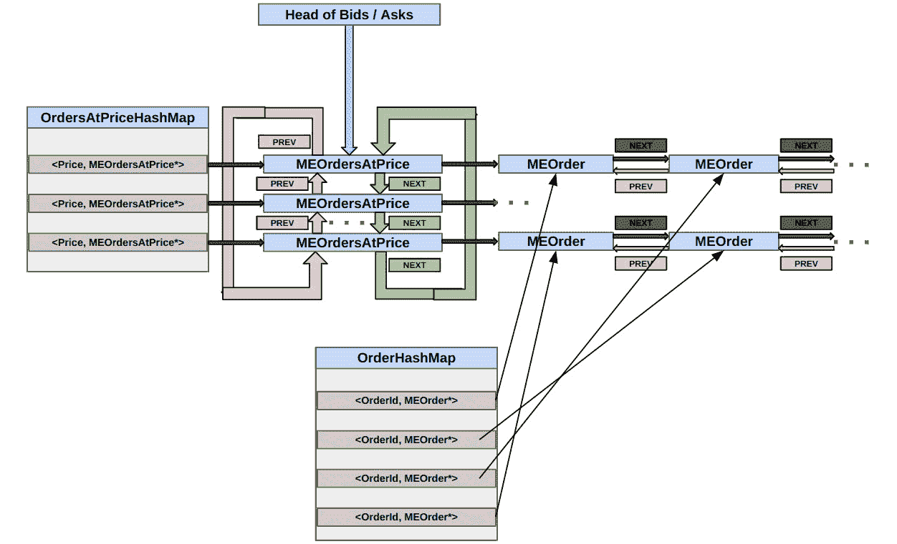
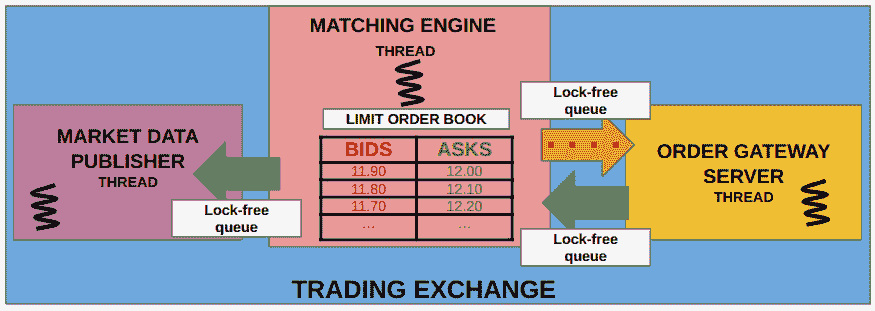
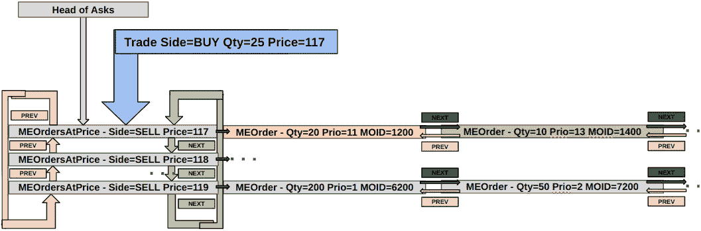

# 6

# 构建 C++匹配引擎

我们在上一章讨论了本书中将构建的电子交易生态系统设计。我们将从交易所的匹配引擎开始。在本章中，我们将专注于基于客户输入的订单构建交易所匹配引擎的订单簿的任务。我们将实现跟踪这些订单、在订单*交叉*时进行匹配以及更新订单簿所需的各个数据结构和算法。"交叉"意味着当买方订单的价格等于或高于卖方订单的价格时，它们可以相互执行，但我们将在本章中更详细地讨论这一点。我们将专注于在这些操作中实现尽可能低的延迟，因为具有最佳基础设施的交易所可能进行最多的业务，并受到参与者的青睐。目前，我们不会担心交易交换中市场数据发布者和订单网关服务器组件的细节。

在本章中，我们将涵盖以下主题：

+   定义匹配引擎中的操作和交互

+   构建匹配引擎和交换外部数据

+   构建订单簿和匹配订单

我们将首先澄清一些假设，以简化匹配引擎并限制本书中可以涵盖的范围。我们将在第一部分定义一些类型、常量和基本结构。

# 技术要求

本书的所有代码都可以在本书的 GitHub 仓库[`github.com/PacktPublishing/Building-Low-Latency-Applications-with-CPP`](https://github.com/PacktPublishing/Building-Low-Latency-Applications-with-CPP)中找到。本章的源代码位于仓库的`Chapter6`目录中。

重要的是，您已经阅读并理解了*设计我们的交易生态系统*章节中介绍的电子交易生态系统设计。请注意，在本章中，我们还将使用在*第四章*中构建的代码，即*构建低延迟应用的 C++构建块*，这些代码可以在本书 GitHub 仓库的`Chapter6/common/`目录中找到。

本书源代码开发环境的规格如下所示。我们提供此环境的详细信息，因为本书中展示的所有 C++代码并不一定可移植，可能需要在您的环境中进行一些小的修改才能运行：

+   操作系统: `Linux 5.19.0-41-generic #42~22.04.1-Ubuntu SMP PREEMPT_DYNAMIC Tue Apr 18 17:40:00 UTC 2 x86_64 x86_64 GNU/Linux.`

+   GCC: `g++ (Ubuntu 11.3.0-1ubuntu1~22.04.1) 11.3.0.`

+   CMake: `cmake` 版本 3.23.2.

+   Ninja: `1.10.2.`

# 定义匹配引擎中的操作和交互

在这里，我们将声明和定义我们在本章构建匹配引擎时需要的类型、常量和结构。

## 定义一些类型和常量

让我们定义一些常见的 `typedef` 来记录我们将在这本书的其余部分使用的类型。我们还将定义一些常量来表示一些存在的假设，纯粹是为了简化我们的匹配引擎设计。请注意，您不需要这些限制/常量，我们将此增强留给感兴趣的您。本小节的所有代码都可以在 GitHub 仓库中找到，该仓库位于本书的 `Chapter6/common/types.h` 文件中。

### 定义一些基本类型

我们将在我们的电子交易系统中定义一些类型来存储不同的属性，例如以下内容：

+   `OrderId` 用于标识订单

+   `TickerId` 用于标识交易工具

+   `ClientId` 用于交易所识别不同的客户

+   `Price` 用于存储工具的价格

+   `Qty` 用于存储订单的数量值

+   `Priority` 用于捕获在价格水平上的 **先进先出**（**FIFO**）队列中订单的位置，如 *设计我们的交易* *生态系统* 章节中所述。

+   `Side` 用于表示订单的（买/卖）方

我们还将提供基本方法将这些转换为字符串，仅用于日志记录目的。让我们逐一查看这些代码块，以了解接下来的声明：

```cpp
#pragma once
#include <cstdint>
#include <limits>
#include "common/macros.h"
```

首先，我们定义了 `OrderId` 类型来标识订单，它是一个简单的 `uint64_t`，并添加了一个相应的 `orderIdToString()` 方法来记录它。我们还添加了一个 `OrderId_INVALID` 监视器方法来表示无效值：

```cpp
namespace Common {
  typedef uint64_t OrderId;
  constexpr auto OrderId_INVALID =
    std::numeric_limits<OrderId>::max();
  inline auto orderIdToString(OrderId order_id) ->
    std::string {
    if (UNLIKELY(order_id == OrderId_INVALID)) {
      return "INVALID";
    }
    return std::to_string(order_id);
  }
```

我们定义了 `TickerId` 类型来标识交易工具，它是一个简单的 `uint32_t` 类型，并为它添加了一个相应的 `tickerIdToString()` 方法。我们有一个 `TickerId_INVALID` 监视器值用于无效工具：

```cpp
  typedef uint32_t TickerId;
  constexpr auto TickerId_INVALID =
    std::numeric_limits<TickerId>::max();
  inline auto tickerIdToString(TickerId ticker_id) ->
    std::string {
    if (UNLIKELY(ticker_id == TickerId_INVALID)) {
      return "INVALID";
    }
    return std::to_string(ticker_id);
  }
```

`ClientId` 类型用于区分不同的交易参与者。`ClientId_INVALID` 值表示一个无效的监视器。`clientIdToString()` 方法用于日志记录目的：

```cpp
  typedef uint32_t ClientId;
  constexpr auto ClientId_INVALID =
    std::numeric_limits<ClientId>::max();
  inline auto clientIdToString(ClientId client_id) ->
    std::string {
    if (UNLIKELY(client_id == ClientId_INVALID)) {
      return "INVALID";
    }
    return std::to_string(client_id);
  }
```

下一个类型是 `Price`，用于捕获订单上的价格。我们还添加了一个 `Price_INVALID` 常量来表示无效价格。最后，一个 `priceToString()` 方法将这些值转换为字符串：

```cpp
  typedef int64_t Price;
  constexpr auto Price_INVALID =
    std::numeric_limits<Price>::max();
  inline auto priceToString(Price price) -> std::string {
    if (UNLIKELY(price == Price_INVALID)) {
      return "INVALID";
    }
    return std::to_string(price);
  }
```

`Qty` 类型是 `typedef` 为 `uint32_t`，表示订单数量。我们还提供了常用的 `Qty_INVALID` 监视器值和 `qtyToString()` 方法将它们转换为字符串：

```cpp
  typedef uint32_t Qty;
  constexpr auto Qty_INVALID =
    std::numeric_limits<Qty>::max();
  inline auto qtyToString(Qty qty) -> std::string {
    if (UNLIKELY(qty == Qty_INVALID)) {
      return "INVALID";
    }
    return std::to_string(qty);
  }
```

`Priority` 类型只是 `uint64_t` 类型队列中的一个位置。我们分配了 `Priority_INVALID` 监视器值和 `priorityToString()` 方法：

```cpp
  typedef uint64_t Priority;
  constexpr auto Priority_INVALID =
    std::numeric_limits<Priority>::max();
  inline auto priorityToString(Priority priority) ->
    std::string {
    if (UNLIKELY(priority == Priority_INVALID)) {
      return "INVALID";
    }
    return std::to_string(priority);
  }
```

`Side` 类型是一个枚举，包含两个有效值，如下面的代码块所示。我们同样定义了一个 `sideToString()` 方法，就像我们之前对其他类型所做的那样：

```cpp
  enum class Side : int8_t {
    INVALID = 0,
    BUY = 1,
    SELL = -1
  };
  inline auto sideToString(Side side) -> std::string {
    switch (side) {
      case Side::BUY:
        return "BUY";
      case Side::SELL:
        return "SELL";
      case Side::INVALID:
        return "INVALID";
    }
    return "UNKNOWN";
  }
}
```

这些就是本章所需的所有基本类型。接下来，我们将定义一些限制以简化我们系统的设计。

### 定义一些限制和约束

我们将定义以下常量限制：

+   `LOG_QUEUE_SIZE`表示日志记录器使用的无锁队列的大小。这表示在不使日志记录器队列满的情况下，可以保留在内存中的最大字符数。

+   `ME_MAX_TICKERS`表示交易所支持的交易工具数量。

+   `ME_MAX_CLIENT_UPDATES`表示匹配引擎尚未处理的来自所有客户端的最大未处理订单请求数量。这也代表了订单服务器尚未发布的匹配引擎的最大订单响应数量。

+   `ME_MAX_MARKET_UPDATES`表示匹配引擎生成的尚未由市场数据发布者发布的最大市场更新数量。

+   `ME_MAX_NUM_CLIENTS`表示在我们的交易生态系统中可以存在的最大同时市场参与者数量。

+   `ME_MAX_ORDER_IDS`表示单个交易工具可能的最大订单数量。

+   `ME_MAX_PRICE_LEVELS`表示匹配引擎维护的限价订单簿的价格级别的最大深度。

注意，这里选择这些值是任意性的；这些值可以根据我们运行的电子交易生态系统的容量增加或减少。我们选择 2 的幂次来允许在尝试计算地址时使用位移而不是乘法；然而，在现代处理器上这种影响是可以忽略不计的，我们不会建议过分担心这一点。我们之前描述的常量的来源在此处展示：

```cpp
namespace Common {
  constexpr size_t LOG_QUEUE_SIZE = 8 * 1024 * 1024;
  constexpr size_t ME_MAX_TICKERS = 8;
  constexpr size_t ME_MAX_CLIENT_UPDATES = 256 * 1024;
  constexpr size_t ME_MAX_MARKET_UPDATES = 256 * 1024;
  constexpr size_t ME_MAX_NUM_CLIENTS = 256;
  constexpr size_t ME_MAX_ORDER_IDS = 1024 * 1024;
  constexpr size_t ME_MAX_PRICE_LEVELS = 256;
}
```

这些是我们目前需要的所有常量。现在，我们可以将注意力转向匹配引擎内部需要的一些更复杂的结构。

## 设计匹配引擎

我们需要一些结构来使我们的匹配引擎能够与市场数据发布者和订单服务器组件进行通信。

### 定义 MEClientRequest 和 ClientRequestLFQueue 类型

`MEClientRequest`结构由订单服务器用于将客户端的订单请求转发给匹配引擎。记住，从订单服务器到匹配引擎的通信是通过我们之前构建的无锁队列组件建立的。`ClientRequestLFQueue`是`MEClientRequest`对象的无锁队列的 typedef。这个结构的代码可以在 GitHub 仓库的`Chapter6/order_server/client_request.h`文件中找到：

```cpp
#pragma once
#include <sstream>
#include "common/types.h"
#include "common/lf_queue.h"
using namespace Common;
namespace Exchange {
```

在这里注意两点——我们使用`#pragma pack()`指令来确保这些结构体是紧凑的，不包含任何额外的填充。这一点很重要，因为这些结构体将在后续章节中被作为平面二进制结构在网络中发送和接收。我们还定义了一个`ClientRequestType`枚举来定义订单请求的类型——是新的订单请求还是取消现有订单的请求。我们还定义了一个`INVALID`哨兵值和一个`clientRequestTypeToString()`方法，将这个枚举转换为人类可读的字符串：

```cpp
#pragma pack(push, 1)
  enum class ClientRequestType : uint8_t {
    INVALID = 0,
    NEW = 1,
    CANCEL = 2
  };
  inline std::string
    clientRequestTypeToString(ClientRequestType type) {
    switch (type) {
      case ClientRequestType::NEW:
        return "NEW";
      case ClientRequestType::CANCEL:
        return "CANCEL";
      case ClientRequestType::INVALID:
        return "INVALID";
    }
    return "UNKNOWN";
  }
```

现在，我们可以定义`MEClientRequest`结构体，它将包含交易参与者向交易所发出的单个订单请求的信息。请注意，这是匹配引擎使用的内部表示，但不一定是客户端发送的确切格式。我们将在下一章“与市场参与者通信”中探讨这一点。这个结构体的重要成员如下：

+   一个类型为`ClientRequestType`的`type_`变量

+   发送此请求的交易客户端的`client_id_`变量，其类型为`ClientId`

+   一个`ticker_id_`变量，其类型为`TickerId`，表示此请求针对的金融工具

+   为此请求所进行的订单的`OrderId`（`order_id_`），这可能是一个新订单或引用现有订单

+   订单的`Side`在`side_`变量中

+   订单的`Price`在`price_`变量中

+   订单中保存的`Qty`在`qty_`变量中

此外，我们还将添加一个简单的`toString()`方法，以帮助我们在以后进行日志记录，如下所示：

```cpp
  struct MEClientRequest {
    ClientRequestType type_ = ClientRequestType::INVALID;
    ClientId client_id_ = ClientId_INVALID;
    TickerId ticker_id_ = TickerId_INVALID;
    OrderId order_id_ = OrderId_INVALID;
    Side side_ = Side::INVALID;
    Price price_ = Price_INVALID;
    Qty qty_ = Qty_INVALID;
    auto toString() const {
      std::stringstream ss;
      ss << "MEClientRequest"
         << " ["
         << "type:" << clientRequestTypeToString(type_)
         << " client:" << clientIdToString(client_id_)
         << " ticker:" << tickerIdToString(ticker_id_)
         << " oid:" << orderIdToString(order_id_)
         << " side:" << sideToString(side_)
         << " qty:" << qtyToString(qty_)
         << " price:" << priceToString(price_)
         << "]";
      return ss.str();
    }
  };
```

如前所述，我们还定义了`ClientRequestLFQueue`类型定义来表示这些结构的锁-free 队列，如下面的代码片段所示。`#pragma pack(pop)`简单地恢复了对齐设置到默认值——即不是紧密打包（这是我们通过指定`#pragma pack(push, 1)`指令设置的）。这是因为我们只想紧密打包将通过网络发送的结构，而其他则不是：

```cpp
#pragma pack(pop)
  typedef LFQueue<MEClientRequest> ClientRequestLFQueue;
}
```

我们将定义一个与匹配引擎使用的类似结构体，用于向订单服务器组件发送订单响应。让我们在下一小节中看看这个结构体。

### 定义 MEClientResponse 和 ClientResponseLFQueue 类型

让我们展示匹配引擎用于向订单服务器组件发送订单响应的结构体的实现，以便将其分发给客户端。类似于上一节，我们还将定义`ClientResponseLFQueue`，它是一个`MEClientResponse`对象的锁-free 队列。此结构体的代码可在 GitHub 仓库的`Chapter6/order_server/client_response.h`源文件中找到：

```cpp
#pragma once
#include <sstream>
#include "common/types.h"
#include "common/lf_queue.h"
using namespace Common;
namespace Exchange {
```

首先，我们将定义一个`ClientResponseType`枚举来表示客户端订单的响应类型。除了`INVALID`哨兵值外，它还包含表示新订单请求被接受、订单被取消、订单被执行或取消请求被匹配引擎拒绝的值。我们还添加了`clientResponseTypeToString()`方法，用于将`ClientResponseType`值转换为字符串：

```cpp
#pragma pack(push, 1)
  enum class ClientResponseType : uint8_t {
    INVALID = 0,
    ACCEPTED = 1,
    CANCELED = 2,
    FILLED = 3,
    CANCEL_REJECTED = 4
  };
  inline std::string
    clientResponseTypeToString(ClientResponseType type) {
    switch (type) {
      case ClientResponseType::ACCEPTED:
        return "ACCEPTED";
      case ClientResponseType::CANCELED:
        return "CANCELED";
      case ClientResponseType::FILLED:
        return "FILLED";
      case ClientResponseType::CANCEL_REJECTED:
        return "CANCEL_REJECTED";
      case ClientResponseType::INVALID:
        return "INVALID";
    }
    return "UNKNOWN";
  }
```

最后，我们定义了匹配引擎内部使用的`MEClientResponse`消息，用于在客户端订单有更新时与交易客户端通信订单响应消息。在我们查看源代码之前，此结构体中的重要数据成员如下列所示：

+   一个表示客户端响应类型的`ClientResponseType type_`变量

+   一个 `client_id_` 变量，类型为 `ClientId`，用于表示响应消息针对哪个市场参与者。

+   一个 `ticker_id_` 变量，类型为 `TickerId`，用于表示此响应的交易工具。

+   一个 `client_order_id_` 变量，用于标识此响应消息影响的订单的 `OrderId`。这个 `OrderId` 是客户端在原始 `MEClientRequest` 消息中为订单发送的。

+   一个名为 `market_order_id_` 的变量，也是 `OrderId` 类型，但这个变量用于在公共市场数据流中识别这个订单。由于不同的市场参与者可能会发送具有相同 `client_order_id_` 值的订单，因此这个 `OrderId` 在所有市场参与者中是唯一的。即使在那些情况下，具有相同 `client_order_id_` 的两个订单在其响应中也会有不同的 `market_order_id_` 值。这个 `market_order_id_` 值也用于生成此订单的市场更新。

+   一个 `side_` 变量，类型为 `Side`，用于表示此订单响应的方面。

+   客户端响应更新的 `Price` 以及它是否被接受、取消或执行。

+   一个 `exec_qty_` 变量，类型为 `Qty`，仅在订单执行事件中使用。这个变量用于在 `MEClientResponse` 消息中保存执行了多少数量。这个值不是累积的，这意味着当订单被部分执行多次时，会为每次单独的执行生成一个 `MEClientResponse` 消息，并且只包含那次特定执行中的数量，而不是所有执行的总和。

+   一个 `leaves_qty_` 变量，也是 `Qty` 类型，表示原始订单的数量中有多少仍然在匹配引擎的订单簿中活跃。这用于传达此特定订单在簿中的大小，该订单仍然活跃，可能进行进一步的执行。

最后，我们还有我们常用的 `toString()` 方法，用于方便的日志记录。如前所述的 `MEClientResponse` 结构定义如下：

```cpp
  struct MEClientResponse {
    ClientResponseType type_ = ClientResponseType::INVALID;
    ClientId client_id_ = ClientId_INVALID;
    TickerId ticker_id_ = TickerId_INVALID;
    OrderId client_order_id_ = OrderId_INVALID;
    OrderId market_order_id_ = OrderId_INVALID;
    Side side_ = Side::INVALID;
    Price price_ = Price_INVALID;
    Qty exec_qty_ = Qty_INVALID;
    Qty leaves_qty_ = Qty_INVALID;
    auto toString() const {
      std::stringstream ss;
      ss << "MEClientResponse"
         << " ["
         << "type:" << clientResponseTypeToString(type_)
         << " client:" << clientIdToString(client_id_)
         << " ticker:" << tickerIdToString(ticker_id_)
         << " coid:" << orderIdToString(client_order_id_)
         << " moid:" << orderIdToString(market_order_id_)
         << " side:" << sideToString(side_)
         << " exec_qty:" << qtyToString(exec_qty_)
         << " leaves_qty:" << qtyToString(leaves_qty_)
         << " price:" << priceToString(price_)
         << "]";
      return ss.str();
    }
  };
#pragma pack(pop)
```

`ClientResponseLFQueue` 类型定义如下，它表示我们之前讨论的结构的无锁队列：

```cpp
  typedef LFQueue<MEClientResponse> ClientResponseLFQueue;
}
```

这就结束了我们需要表示客户端请求和匹配引擎响应的结构讨论。让我们继续到下一小节中的市场更新结构。

### 定义 MEMarketUpdate 和 MEMarketUpdateLFQueue 类型

市场更新结构由匹配引擎用于向市场数据发布组件提供市场数据更新。我们还有一个 `MEMarketUpdateLFQueue` 类型来表示 `MEMarketUpdate` 对象的无锁队列。此代码可以在 `Chapter6/exchange/market_data/market_update.h` 源文件中找到：

```cpp
#pragma once
#include <sstream>
#include "common/types.h"
using namespace Common;
namespace Exchange {
```

`MEMarketUpdate`结构体也需要是一个打包结构体，因为它将是通过网络发送和接收的消息的一部分；因此，我们再次使用`#pragma pack()`指令。在我们定义结构体之前，我们需要定义`MarketUpdateType`枚举，它表示订单市场更新中的更新操作。除了承担`INVALID`哨兵值外，它还可以用来表示订单簿中订单被添加、修改或取消的事件，以及市场中的交易事件：

```cpp
#pragma pack(push, 1)
  enum class MarketUpdateType : uint8_t {
    INVALID = 0,
    ADD = 1,
    MODIFY = 2,
    CANCEL = 3,
    TRADE = 4
  };
  inline std::string
    marketUpdateTypeToString(MarketUpdateType type) {
    switch (type) {
      case MarketUpdateType::ADD:
        return "ADD";
      case MarketUpdateType::MODIFY:
        return "MODIFY";
      case MarketUpdateType::CANCEL:
        return "CANCEL";
      case MarketUpdateType::TRADE:
        return "TRADE";
      case MarketUpdateType::INVALID:
        return "INVALID";
    }
    return "UNKNOWN";
  }
```

最后，我们定义了`MEMarketUpdate`结构体，它包含以下重要的数据成员：

+   `MarketUpdateType`的`type_`变量，用于表示市场更新的类型。

+   一个类型为`OrderId`的`order_id_`变量，用于表示限价订单簿中特定订单，该订单更新适用于此订单。

+   一个类型为`TickerId`的`ticker_id_`变量，用于表示此更新适用的交易工具。

+   一个表示此订单方向的`Side`变量。

+   一个表示此市场订单更新中确切价格的`Price`变量。

+   一个类型为`Priority`的`priority_`字段，正如我们之前讨论的，它将用于指定此订单在 FIFO 队列中的确切位置。我们构建了一个所有价格相同的订单的 FIFO 队列。此字段指定了此订单在该队列中的位置/位置。

完整的`MEMarketUpdate`结构体如下所示，以及`MEMarketUpdateLFQueue`类型定义，它捕获了`MEMarketUpdate`结构体消息的无锁队列：

```cpp
  struct MEMarketUpdate {
    MarketUpdateType type_ = MarketUpdateType::INVALID;
    OrderId order_id_ = OrderId_INVALID;
    TickerId ticker_id_ = TickerId_INVALID;
    Side side_ = Side::INVALID;
    Price price_ = Price_INVALID;
    Qty qty_ = Qty_INVALID;
    Priority priority_ = Priority_INVALID;
    auto toString() const {
      std::stringstream ss;
      ss << "MEMarketUpdate"
         << " ["
         << " type:" << marketUpdateTypeToString(type_)
         << " ticker:" << tickerIdToString(ticker_id_)
         << " oid:" << orderIdToString(order_id_)
         << " side:" << sideToString(side_)
         << " qty:" << qtyToString(qty_)
         << " price:" << priceToString(price_)
         << " priority:" << priorityToString(priority_)
         << "]";
      return ss.str();
    }
  };
#pragma pack(pop)
  typedef Common::LFQueue<Exchange::MEMarketUpdate>
    MEMarketUpdateLFQueue;
}
```

这就完成了我们需要表示和发布来自匹配引擎的市场数据更新的结构。在下一个小节中，我们将构建一些结构和定义一些类型，我们将使用它们来构建限价订单簿。

## 设计交易所订单簿

在本节中，我们将定义一些构建块，这些构建块将被用来高效地构建、维护和更新限价订单簿。在我们讨论我们需要的每个结构和对象之前，我们将为您展示一个图表，以帮助您建立对限价订单簿实现的直观理解。

限价订单簿组织为一系列买方订单（称为挂单）和卖方订单（称为卖单）。在匹配引擎中，价格相同的订单按照**先进先出**（**FIFO**）的顺序组织。我们已在*设计我们的交易生态系统*章节中讨论了这些细节，在*设计交易交易所中的 C++匹配引擎*部分。

对于我们在匹配引擎内部构建的订单簿，我们有一个包含活跃订单的买入价格和卖出价格列表。每个价格水平由 `MEOrdersAtPrice` 结构表示，如下所示。买入价格按从高到低的价格水平排序，卖出价格按从低到高的价格水平排序。每个 `MEOrdersAtPrice` 使用双向链表从高到低优先级存储单个订单。每个单个订单的信息包含在 `MEOrder` 结构中。我们将使用类型为 `OrdersAtPriceHashMap` 的哈希表跟踪每个价格水平，该哈希表按该级别的价格索引。我们还将使用类型为 `OrderHashMap` 的哈希表跟踪每个 `MEOrder` 对象，按其 `market_order_id_` 值索引。表示我们匹配引擎订单簿此设计的图示如下。



图 6.1 – 匹配引擎内部限价订单簿的设计

既然我们已经讨论了限价订单簿数据结构的整体设计和构成它的组件，我们可以开始定义实现该设计所需的基本结构。在下一小节中，我们首先设计基本块——用于存储单个订单信息的 `MEOrder` 结构。

### 定义 MEOrder、OrderHashMap 和 ClientOrderHashMap 类型

第一个结构用于在订单簿内部存储单个限价订单的信息，我们将称之为 `MEOrder`。这将在以下代码块中展示，代码可以在 GitHub 仓库的 `Chapter6/matcher/me_order.h` 和 `Chapter6/matcher/me_order.cpp` 源文件中找到。

`MEOrder` 结构中包含以下重要数据成员，用于保存表示单个订单在限价订单簿中所需的属性：

+   一个类型为 `TickerId` 的 `ticker_id_` 变量，用于表示该订单对应的工具。

+   一个类型为 `ClientId` 的 `client_id_` 变量，用于捕获拥有此订单的市场参与者。

+   两个 `OrderId` 集合，正如我们之前讨论的那样——`client_order_id_`，这是客户端在其订单请求中发送的内容，以及 `market_order_id_`，由匹配引擎生成，且在整个客户端中是唯一的。

+   `Side side_` 用于表示订单是买入订单还是卖出订单。

+   一个类型为 `Price` 的 `price_` 变量，用于表示订单的价格。

+   `Qty qty_` 用于表示在订单簿中仍然活跃的订单数量。

+   一个类型为 `Priority` 的 `priority_` 变量，正如我们之前讨论的那样，它将代表此订单在具有相同 `side_` 和 `price_` 值的其他 `MEOrder` 实例队列中的确切位置。

+   `MEOrder`结构体也有两个指向其他`MEOrder`对象的指针。这是因为`MEOrder`对象也被维护为一个双向链表，按照在`MEOrdersAtPrice`结构体中的价格级别排列，正如我们在上一节中讨论的那样：

```cpp
#pragma once
#include <array>
#include <sstream>
#include "common/types.h"
using namespace Common;
namespace Exchange {
  struct MEOrder {
    TickerId ticker_id_ = TickerId_INVALID;
    ClientId client_id_ = ClientId_INVALID;
    OrderId client_order_id_ = OrderId_INVALID;
    OrderId market_order_id_ = OrderId_INVALID;
    Side side_ = Side::INVALID;
    Price price_ = Price_INVALID;
    Qty qty_ = Qty_INVALID;
    Priority priority_ = Priority_INVALID;
    MEOrder *prev_order_ = nullptr;
    MEOrder *next_order_ = nullptr;
    // only needed for use with MemPool.
    MEOrder() = default;
    MEOrder(TickerId ticker_id, ClientId client_id, OrderId
      client_order_id, OrderId market_order_id, Side side,
      Price price,Qty qty, Priority priority, MEOrder
      *prev_order, MEOrder *next_order) noexcept
        :     ticker_id_(ticker_id),
              client_id_(client_id),
              client_order_id_(client_order_id),
              market_order_id_(market_order_id),
              side_(side),
              price_(price),
              qty_(qty),
              priority_(priority),
              prev_order_(prev_order),
              next_order_(next_order) {}
    auto toString() const -> std::string;
  };
```

此外，`OrderHashMap`类型用于表示一个哈希表，使用`std::array`实现，其中`OrderId`是键，`MEOrder`是值。我们还将定义另一个类型，`ClientOrderHashMap`，它也是一个哈希表，使用`std::array`来表示从`ClientId`到`OrderHashMap`对象的映射：

```cpp
  typedef std::array<MEOrder *, ME_MAX_ORDER_IDS>
    OrderHashMap;
  Typedef std::array<OrderHashMap, ME_MAX_NUM_CLIENTS>
    ClientOrderHashMap;
}
```

我们为`MEOrder`结构体提供了`toString()`方法，该方法非常简单，可在`Chapter6/exchange/matcher/me_order.cpp`文件中找到：

```cpp
#include "me_order.h"
namespace Exchange {
  auto MEOrder::toString() const -> std::string {
    std::stringstream ss;
    ss << "MEOrder" << "["
       << "ticker:" << tickerIdToString(ticker_id_) << " "
       << "cid:" << clientIdToString(client_id_) << " "
       << "oid:" << orderIdToString(client_order_id_) << " "
       << "moid:" << orderIdToString(market_order_id_) << " "
       << "side:" << sideToString(side_) << " "
       << "price:" << priceToString(price_) << " "
       << "qty:" << qtyToString(qty_) << " "
       << "prio:" << priorityToString(priority_) << " "
       << "prev:" << orderIdToString(prev_order_ ?
         prev_order_->market_order_id_ :
         OrderId_INVALID) << " "
       << "next:" << orderIdToString(next_order_ ?
         next_order_->market_order_id_ :
         OrderId_INVALID) << "]";
    return ss.str();
  }
}
```

接下来，我们将构建一些包含和管理订单对象的其他结构体。

### 定义`MEOrdersAtPrice`和`OrdersAtPriceHashMap`类型

如*图 6**.1*所示，我们定义了另一个结构体，用于维护`MEOrder`对象列表，我们称之为`MEOrdersAtPrice`。这个结构体，在下面的代码块中展示，将用于存储在相同价格下输入的所有订单，按照先进先出（FIFO）优先级顺序排列。这是通过创建一个按优先级从高到低排列的`MEOrder`对象的单链表来实现的。为此，我们创建了一个`first_me_order_`类型的`MEOrder`指针变量，它将代表此价格级别的第一个订单，而随后的其他订单将按照 FIFO 顺序链接在一起。

`MEOrdersAtPrice`结构体也有两个指向`MEOrdersAtPrice`对象的指针，一个用于前一个（`prev_entry_`），一个用于下一个（`next_entry_`）。这是因为该结构体本身是`MEOrdersAtPrice`对象的双向链表中的一个节点。`MEOrdersAtPrice`的双向链表按照买卖双方的从最积极到最不积极的顺序排列价格。

该结构体包含的两个其他变量分别是`side_`变量，其类型为`Side`，以及`price_`变量，其类型为`Price`，分别代表此价格级别的买卖方向和价格：

```cpp
namespace Exchange {
  struct MEOrdersAtPrice {
    Side side_ = Side::INVALID;
    Price price_ = Price_INVALID;
    MEOrder *first_me_order_ = nullptr;
    MEOrdersAtPrice *prev_entry_ = nullptr;
    MEOrdersAtPrice *next_entry_ = nullptr;
```

我们添加了一个默认构造函数和一个简单的自定义容器来初始化此结构体的对象：

```cpp
    MEOrdersAtPrice() = default;
    MEOrdersAtPrice(Side side, Price price, MEOrder
      *first_me_order, MEOrdersAtPrice *prev_entry,
      MEOrdersAtPrice *next_entry)
        : side_(side), price_(price),
        first_me_order_(first_me_order),
        prev_entry_(prev_entry), next_entry_(next_entry) {}
```

我们还添加了一个简单的`toString()`方法，用于日志记录，如下所示：

```cpp
    auto toString() const {
      std::stringstream ss;
      ss << "MEOrdersAtPrice["
         << "side:" << sideToString(side_) << " "
         << "price:" << priceToString(price_) << " "
         << "first_me_order:" << (first_me_order_ ?
           first_me_order_->toString() : "null") << " "
         << "prev:" << priceToString(prev_entry_ ?
           prev_entry_->price_ : Price_INVALID) << " "
         << "next:" << priceToString(next_entry_ ?
           next_entry_->price_ : Price_INVALID) << "]";
      return ss.str();
    }
  };
```

`OrdersAtPriceHashMap`类型表示一个哈希表，通过`std::array`实现，用于表示从价格到`MEOrdersAtPrice`的映射：

```cpp
  typedef std::array<MEOrdersAtPrice *,
    ME_MAX_PRICE_LEVELS> OrdersAtPriceHashMap;
}
```

这就完成了关于设置匹配引擎和限价订单簿的初始类型、定义和基本结构的本节内容。接下来，我们可以看看匹配引擎框架是如何构建的。

# 构建匹配引擎和交换外部数据

在本节中，我们将构建匹配引擎类的各个部分。处理客户端请求、构建和更新限价订单簿以及生成订单响应和市场更新的大部分繁重工作将转交给订单簿类，我们将在下一节讨论。请重新阅读上一章中关于在交易交易所中设计 C++匹配引擎的*设计 C++匹配引擎的章节*，以复习我们将构建的组件及其设计原则。我们在此处呈现该章节的图表，以便于参考，展示了匹配引擎的设计。



图 6.2 – 我们匹配引擎组件的设计

匹配引擎是一个独立的执行线程，它从`ClientRequestLFQueue`中消费订单请求，将订单响应发布到`ClientResponseLFQueue`，并将市场更新发布到`MEMarketUpdateLFQueue`。让我们首先声明并定义一些用于构建、销毁、线程管理和匹配引擎的样板功能的代码。

## 构建匹配引擎

`MatchingEngine`类包含一些重要的数据成员 – 首先，一个用于跟踪每个交易工具的限价订单簿的`OrderBookHashMap`对象。该类还包含以下对象的指针 – `ClientRequestLFQueue`、`ClientResponseLFQueue`和`MEMarketUpdateLFQueue`，所有这些都将通过构造函数传递给它。让我们首先声明并定义一些用于构建、销毁、线程管理和匹配引擎的样板功能的代码。我们还将有一个用于跟踪线程状态的布尔变量`run_`，一个`time_str_`字符串和一个`Logger`对象来输出一些日志。下一节代码的源文件可在 GitHub 上这本书的`Chapter6/exchange/matcher/matching_engine.h`中找到。

首先，我们需要包含以下头文件来构建我们的匹配引擎：

```cpp
#pragma once
#include "common/thread_utils.h"
#include "common/lf_queue.h"
#include "common/macros.h"
#include "order_server/client_request.h"
#include "order_server/client_response.h"
#include "market_data/market_update.h"
#include "me_order_book.h"
```

我们接下来声明构造函数和析构函数方法，并添加`start()`和`stop()`方法，分别启动和停止主匹配引擎循环的执行，我们将在稍后构建它：

```cpp
namespace Exchange {
  class MatchingEngine final {
  public:
    MatchingEngine(ClientRequestLFQueue *client_requests,
                   ClientResponseLFQueue *client_responses,
                   MEMarketUpdateLFQueue *market_updates);
    ~MatchingEngine();
    auto start() -> void;
    auto stop() -> void;
```

我们添加了我们通常的构造函数和赋值运算符的样板代码，以防止意外复制：

```cpp
    // Deleted default, copy & move constructors and
    // assignment-operators.
    MatchingEngine() = delete;
    MatchingEngine(const MatchingEngine &) = delete;
    MatchingEngine(const MatchingEngine &&) = delete;
    MatchingEngine &operator=(const MatchingEngine &) =
      delete;
    MatchingEngine &operator=(const MatchingEngine &&) =
      delete;
```

最后，我们添加这个`MatchingEngine`类的数据成员，如之前所述。类型为`OrderBookHashMap`的`ticker_order_book_`变量用于存储每个工具的`MEOrderBook`。我们将`ClientRequestLFQueue`、`ClientResponseLFQueue`和`MEMarketUpdateLFQueue`类型的`incoming_requests_`、`outgoing_ogw_responses_`和`outgoing_md_updates_`指针分别存储，以与其他线程进行通信。然后，我们有`run_`布尔变量，我们将其标记为`volatile`，因为它将从不同的线程中被访问：

```cpp
  private:
    OrderBookHashMap ticker_order_book_;
    ClientRequestLFQueue *incoming_requests_ = nullptr;
    ClientResponseLFQueue *outgoing_ogw_responses_ =
      nullptr;
    MEMarketUpdateLFQueue *outgoing_md_updates_ = nullptr;
    volatile bool run_ = false;
    std::string time_str_;
    Logger logger_;
  };
}
```

让我们看看构造函数、析构函数以及创建并启动执行 `run()` 方法的线程的 `start()` 方法的实现（我们很快就会看到）。这段代码位于 `Chapter6/exchange/matcher/matching_engine.cpp` 源文件中。构造函数本身很简单——它初始化内部数据成员并为每个支持的交易工具创建一个 `MEOrderBook` 实例：

```cpp
#include "matching_engine.h"
namespace Exchange {
  MatchingEngine::MatchingEngine(ClientRequestLFQueue
    *client_requests, ClientResponseLFQueue
    *client_responses, MEMarketUpdateLFQueue
    *market_updates)
      : incoming_requests_(client_requests),
        outgoing_ogw_responses_(client_responses),
        outgoing_md_updates_(market_updates),
        logger_("exchange_matching_engine.log") {
    for(size_t i = 0; i < ticker_order_book_.size(); ++i) {
      ticker_order_book_[i] = new MEOrderBook(i, &logger_,
        this);
    }
  }
```

析构函数与构造函数相反，重置内部数据成员变量。它还会删除在构造函数中创建的 `MEOrderBook` 对象：

```cpp
  MatchingEngine::~MatchingEngine() {
    run_ = false;
    using namespace std::literals::chrono_literals;
    std::this_thread::sleep_for(1s);
    incoming_requests_ = nullptr;
    outgoing_ogw_responses_ = nullptr;
    outgoing_md_updates_ = nullptr;
    for(auto& order_book : ticker_order_book_) {
      delete order_book;
      order_book = nullptr;
    }
  }
```

`start()` 方法创建并启动一个新线程，将其分配给 `MatchingEngine::run()` 方法。在这样做之前，它启用 `run_` 标志，因为它控制 `run()` 方法的执行：

```cpp
  auto MatchingEngine::start() -> void {
    run_ = true;
    ASSERT(Common::createAndStartThread(-1,
      "Exchange/MatchingEngine", [this]() { run(); }) !=
      nullptr, "Failed to start MatchingEngine thread.");
  }
```

`stop()` 方法只是将 `run_` 标志设置为 `false`，这反过来会导致 `run()` 方法退出其主循环，但这一点很快就会变得清晰：

```cpp
  auto MatchingEngine::stop() -> void {
    run_ = false;
  }
}
```

接下来，我们将研究处理匹配引擎如何消费订单请求并发布订单响应和市况更新的源代码。但首先，让我们展示匹配引擎线程执行的 main `run()` 循环。这段代码非常简单——它只是从 `incoming_requests_` 无锁队列中消费 `MEClientRequest` 对象，并将它们转发到 `processClientRequest()` 方法。为了实现这一点，它简单地检查 `LFQueue::getNextToRead()` 方法以查看是否有有效的条目可供读取，如果有，就将该条目处的对象转发以进行处理，并使用 `LFQueue::updateReadIndex()` 方法更新无锁队列中的读取索引。这段代码位于 `Chapter6/exchange/matcher/matching_engine.h` 源文件中：

```cpp
auto run() noexcept {
  logger_.log("%:% %() %\n", __FILE__, __LINE__,
    __FUNCTION__, Common::getCurrentTimeStr(&time_str_));
  while (run_) {
    const auto me_client_request =
      incoming_requests_->getNextToRead();
    if (LIKELY(me_client_request)) {
      logger_.log("%:% %() % Processing %\n", __FILE__,
        __LINE__, __FUNCTION__,
        Common::getCurrentTimeStr(&time_str_),
                  me_client_request->toString());
      processClientRequest(me_client_request);
      incoming_requests_->updateReadIndex();
    }
  }
}
```

现在，让我们看看处理客户端请求的源代码。

## 从订单网关队列中消费和发布

首先，我们将从 `matching_engine.h` 头文件中 `MatchingEngine` 类的 `processClientRequest()` 函数实现开始。这个实现简单地检查 `MEClientRequest` 的类型，并将其转发到对应工具的限价订单簿。它通过访问 `ticker_order_book_` 容器，使用 `MEClientRequest` 中的 `ticker_id_` 字段来找到这个 `MEClientRequest` 应该对应的正确订单簿实例：

```cpp
auto processClientRequest(const MEClientRequest *client_request) noexcept {
  auto order_book = ticker_order_book_[client_request
    ->ticker_id_];
```

对于尝试添加新订单（`ClientRequestType::NEW`）的客户端请求，我们调用 `MEOrderBook::add()` 方法并让它处理该请求：

```cpp
  switch (client_request->type_) {
    case ClientRequestType::NEW: {
      order_book->add(client_request->client_id_,
        client_request->order_id_,
        client_request->ticker_id_,
        client_request->side_, client_request->price_,
        client_request->qty_);
    }
      break;
```

类似地，尝试取消现有订单（`ClientRequestType::CANCEL`）的客户端请求会被转发到 `MEOrderBook::cancel()` 方法：

```cpp
    case ClientRequestType::CANCEL: {
      order_book->cancel(client_request->client_id_,
        client_request->order_id_,
        client_request->ticker_id_);
    }
      break;
    default: {
      FATAL("Received invalid client-request-type:" +
        clientRequestTypeToString(client_request->type_));
    }
      break;
  }
}
```

我们还将在同一个类中定义一个方法，限价订单簿将使用该方法通过`MEClientResponse`消息发布订单响应。它只是将响应写入`outgoing_ogw_responses_`无锁队列并推进写入索引。它是通过调用`LFQueue::getNextToWriteTo()`方法找到下一个有效的索引来写入`MEClientResponse`消息，将数据移动到该槽位，并通过调用`LFQueue::updateWriteIndex()`方法更新下一个写入索引来实现的：

```cpp
auto sendClientResponse(const MEClientResponse *client_response) noexcept {
  logger_.log("%:% %() % Sending %\n", __FILE__, __LINE__,
    __FUNCTION__, Common::getCurrentTimeStr(&time_str_),
    client_response->toString());
  auto next_write = outgoing_ogw_responses_
    ->getNextToWriteTo();
  *next_write = std::move(*client_response);
  outgoing_ogw_responses_->updateWriteIndex();
}
```

现在，我们将查看一些与刚才看到的类似的代码，但它用于发布市场数据更新。

## 发布到市场数据发布器队列

`Chapter6/exchange/matcher/matching_engine.h`中的`sendMarketUpdate()`方法由限价订单簿使用，通过`MEMarketUpdate`结构发布市场数据更新。它只是将数据写入`outgoing_md_updates_`无锁队列并推进写入者。它以与我们之前看到完全相同的方式执行此操作——通过调用`getNextToWriteTo()`方法，将`MEMarketUpdate`消息写入该槽位，并使用`updateWriteIndex()`更新下一个写入索引：

```cpp
auto sendMarketUpdate(const MEMarketUpdate *market_update) noexcept {
  logger_.log("%:% %() % Sending %\n", __FILE__, __LINE__,
    __FUNCTION__, Common::getCurrentTimeStr(&time_str_),
    market_update->toString());
  auto next_write = outgoing_md_updates_
    ->getNextToWriteTo();
  *next_write = *market_update;
  outgoing_md_updates_->updateWriteIndex();
}
```

这部分内容到此结束，我们现在已经完成了匹配引擎的实现。在下一小节中，我们将把这些部分组合成交易交换的二进制文件，除了限价订单簿的实现，这是本章我们将讨论的最后一部分。

## 构建交换应用程序二进制文件

现在，我们可以构建交易交换的二进制文件。我们将实例化匹配引擎对象所需的三个无锁队列，用于订单请求、订单响应和市场更新。我们还将创建`MatchingEngine`对象并启动线程，然后二进制文件将永久休眠。由于应用程序进入无限循环，我们还将为该应用程序安装信号处理程序，以捕获外部信号并优雅地退出。请注意，随着我们在本书后续章节中构建订单服务器和市场数据发布器组件，这些组件需要添加到此处，此代码将在本书的后续章节中扩展。该应用程序的代码位于 GitHub 存储库中的`Chapter6/exchange/exchange_main.cpp`。

首先，我们添加一些变量，这些变量将作为`Logger`对象和`MatchingEngine`对象的指针。我们还将添加一个`signal_handler()`方法，当终止交换应用程序时将被调用。信号处理程序简单地删除这些对象并退出：

```cpp
#include <csignal>
#include "matcher/matching_engine.h"
Common::Logger* logger = nullptr;
Exchange::MatchingEngine* matching_engine = nullptr;
void signal_handler(int) {
  using namespace std::literals::chrono_literals;
  std::this_thread::sleep_for(10s);
  delete logger; logger = nullptr;
  delete matching_engine; matching_engine = nullptr;
  std::this_thread::sleep_for(10s);
  exit(EXIT_SUCCESS);
}
```

目前，`main()` 方法相当简单，直到我们在下一章添加其他组件。它使用 `std::signal()` 例程安装 `signal_handler()` 方法以捕获外部 `SIGINT` 信号。`SIGINT` 信号是信号值 2，当在 Linux 中按下 *Ctrl* + *C* 或向 `ClientRequestLFQueue` 变量 `client_requests` 和 `ClientResponseLFQueue` 变量 `client_responses` 发送 `kill –2 PID` 时发送给正在运行的过程。我们还初始化了无锁队列变量 `market_updates`，其类型为 `MEMarketUpdateLFQueue`，容量为 `ME_MAX_MARKET_UPDATES`。`main()` 方法还使用 `Logger` 类的实例初始化 `logger` 变量：

```cpp
int main(int, char **) {
  logger = new Common::Logger("exchange_main.log");
  std::signal(SIGINT, signal_handler);
  const int sleep_time = 100 * 1000;
  Exchange::ClientRequestLFQueue
    client_requests(ME_MAX_CLIENT_UPDATES);
  Exchange::ClientResponseLFQueue
    client_responses(ME_MAX_CLIENT_UPDATES);
  Exchange::MEMarketUpdateLFQueue
    market_updates(ME_MAX_MARKET_UPDATES);
```

最后，`main()` 方法使用我们创建的 `MatchingEngine` 类的实例初始化 `matching_engine` 变量，并从前面的代码块中传递它所需的三个无锁队列。然后它调用 `start()` 方法，以便主匹配引擎线程可以开始执行。此时，`main()` 方法已完成，因此它进入一个无限循环，其中大部分时间都在睡眠，等待一个将杀死此进程的外部信号：

```cpp
  std::string time_str;
  logger->log("%:% %() % Starting Matching Engine...\n",
    __FILE__, __LINE__, __FUNCTION__,
    Common::getCurrentTimeStr(&time_str));
  matching_engine = new
    Exchange::MatchingEngine(&client_requests,
    &client_responses, &market_updates);
  matching_engine->start();
  while (true) {
    logger->log("%:% %() % Sleeping for a few
    milliseconds..\n", __FILE__, __LINE__, __FUNCTION__,
    Common::getCurrentTimeStr(&time_str));
    usleep(sleep_time * 1000);
  }
}
```

为了便于构建主二进制文件，我们提供了一个脚本，`Chapter6/build.sh`，它使用 CMake 和 Ninja 构建此二进制文件。你可能需要更新此脚本以指向系统中的正确二进制文件，或者如果你更喜欢，可以使用不同的构建系统。下一节将提供有关如何运行此 `exchange_main` 应用程序的一些信息。

## 运行交易所应用程序二进制文件

运行 `exchange_main` 应用程序此时只需调用 `exchange_main` 二进制文件，如下面的代码块所示。我们还会展示你应在终端上看到的输出：

```cpp
sghosh@sghosh-ThinkPad-X1-Carbon-3rd:~/Building-Low-Latency-Applications-with-CPP/Chapter6$ ./cmake-build-release/exchange_main
Set core affinity for Common/Logger exchange_main.log 139685103920704 to -1
Set core affinity for Common/Logger exchange_matching_engine.log 139684933506624 to -1
Set core affinity for Exchange/MatchingEngine 139684925113920 to -1
```

如前所述，可以通过发送 `SIGINT` 信号来停止此进程。此时，它将生成三个日志文件，类似于以下片段中所示。然而，请注意，此时日志文件中没有什么有趣的内容，因为我们只构建了所有需要构建的完整交易生态系统组件中的匹配引擎组件。在下一章的结尾，*与市场参与者通信*，我们将再次运行此应用程序，并添加额外的组件，输出将更有趣：

```cpp
exchange_main.log exchange_matching_engine.log
```

下一节将探讨订单簿的内部工作原理以及它如何处理客户端订单请求并生成订单响应和市场更新。

# 构建订单簿和匹配订单

本节实现了订单簿功能。记住，订单簿处理来自匹配引擎转发给客户端的订单请求。它检查订单请求类型，更新订单簿，为客户端生成订单响应，并为公共市场数据馈送生成市场数据更新。匹配引擎中所有限价订单的代码都在`me_order_book.h`和`me_order_book.cpp`源文件中，保存在本书 GitHub 仓库的`Chapter6/exchange/matcher/`目录中。

## 构建内部数据结构

首先，我们将声明限价订单簿的数据成员。我们之前在图 6.1 中展示了一个表示构成限价订单簿的数据结构的图表。限价订单簿包含以下重要数据成员：

+   一个指向`MatchingEngine`父类的`matching_engine_`指针变量，用于订单簿发布订单响应和市场数据更新。

+   `ClientOrderHashMap`变量，`cid_oid_to_order_`，用于按其`ClientId`键跟踪`OrderHashMap`对象。提醒一下，`OrderHashMap`按其`OrderId`键跟踪`MEOrder`对象。

+   `MEOrdersAtPrice`对象的`orders_at_price_pool_`内存池变量，用于创建新对象并将死亡对象返回。

+   双向链表的头部分别是出价（`bids_by_price_`）和询问（`asks_by_price_`），因为我们按价格级别将订单跟踪为`MEOrdersAtPrice`对象列表。

+   一个哈希表，`OrdersAtPriceHashMap`，用于跟踪价格级别的`MEOrdersAtPrice`对象，使用级别的价格作为映射中的键。

+   一个`MEOrder`对象的内存池，称为`order_pool_`，其中`MEOrder`对象从中创建并返回，而不产生动态内存分配。

+   一些次要成员，例如用于此订单簿的`TickerId`，用于跟踪下一个市场数据订单 ID 的`OrderId`，一个`MEClientResponse`变量（`client_response_`），一个`MEMarketUpdate`对象（`market_update_`），一个用于记录时间的字符串，以及用于日志记录的`Logger`对象。

首先，我们包含一些依赖的头文件，并提前声明`MatchingEngine`类，因为我们将在尚未完全定义该类型的情况下引用它：

```cpp
#pragma once
#include "common/types.h"
#include "common/mem_pool.h"
#include "common/logging.h"
#include "order_server/client_response.h"
#include "market_data/market_update.h"
#include "me_order.h"
using namespace Common;
namespace Exchange {
  class MatchingEngine;
  class MEOrderBook final {
```

现在，我们将定义数据成员变量，如之前所述：

```cpp
private:
  TickerId ticker_id_ = TickerId_INVALID;
  MatchingEngine *matching_engine_ = nullptr;
  ClientOrderHashMap cid_oid_to_order_;
  MemPool<MEOrdersAtPrice> orders_at_price_pool_;
  MEOrdersAtPrice *bids_by_price_ = nullptr;
  MEOrdersAtPrice *asks_by_price_ = nullptr;
  OrdersAtPriceHashMap price_orders_at_price_;
  MemPool<MEOrder> order_pool_;
  MEClientResponse client_response_;
  MEMarketUpdate market_update_;
  OrderId next_market_order_id_ = 1;
  std::string time_str_;
  Logger *logger_ = nullptr;
```

在这一点上，我们还将定义之前提到的`OrderBookHashMap`类型，它是一个按`TickerId`索引的`MEOrderBook`对象的`std::array`：

```cpp
 typedef std::array<MEOrderBook *, ME_MAX_TICKERS> OrderBookHashMap;
  };
}
```

接下来，让我们展示构造函数和析构函数的直接实现，以及默认构造函数和赋值运算符的样板代码：

```cpp
#include "me_order_book.h"
#include "matcher/matching_engine.h"
MEOrderBook::MEOrderBook(TickerId ticker_id, Logger *logger, MatchingEngine *matching_engine)
    : ticker_id_(ticker_id),
      matching_engine_(matching_engine),
      orders_at_price_pool_(ME_MAX_PRICE_LEVELS),
      order_pool_(ME_MAX_ORDER_IDS), logger_(logger) {
}
MEOrderBook::~MEOrderBook() {
  logger_->log("%:% %() % OrderBook\n%\n", __FILE__,
    __LINE__, __FUNCTION__,
    Common::getCurrentTimeStr(&time_str_),
              toString(false, true));
  matching_engine_ = nullptr;
  bids_by_price_ = asks_by_price_ = nullptr;
  for (auto &itr: cid_oid_to_order_) {
    itr.fill(nullptr);
  }
}
```

然后，我们在大多数类中添加样板代码以防止意外复制和分配`MEOrderBook`对象：

```cpp
// Deleted default, copy & move constructors and
// assignment-operators.
MEOrderBook() = delete;
MEOrderBook(const MEOrderBook &) = delete;
MEOrderBook(const MEOrderBook &&) = delete;
MEOrderBook &operator=(const MEOrderBook &) = delete;
MEOrderBook &operator=(const MEOrderBook &&) = delete;
```

在我们继续实现将在订单簿上执行的不同操作之前，让我们先介绍一些简单的方法来生成新的市场订单 ID，将`Price`转换为`OrdersAtPriceHashMap`中的索引，并在给定`Price`时访问`OrdersAtPriceHashMap price_orders_at_price_`映射：

```cpp
namespace Exchange {
  class MatchingEngine;
  class MEOrderBook final {
private:
```

`generateNewMarketOrderId()`方法很简单；它返回`next_market_order_id_`值，并在下次调用此方法时增加它：

```cpp
  auto generateNewMarketOrderId() noexcept -> OrderId {
    return next_market_order_id_++;
  }
```

`priceToIndex()`方法将`Price`参数转换为介于`0`和`ME_MAX_PRICE_LEVELS-1`之间的索引，然后用于索引价格级别的`std::array`：

```cpp
  auto priceToIndex(Price price) const noexcept {
    return (price % ME_MAX_PRICE_LEVELS);
  }
```

最后，`getOrdersAtPrice()`实用方法通过将提供的`Price`转换为索引来索引`price_orders_at_price_`的`std::array`，使用`priceToIndex()`方法，该方法返回`MEOrdersAtPrice`对象：

```cpp
  auto getOrdersAtPrice(Price price) const noexcept ->
    MEOrdersAtPrice * {
    return price_orders_at_price_.at(priceToIndex(price));
  }
  };
}
```

接下来的几个小节将详细说明处理新订单请求和现有订单取消请求的重要操作，以及匹配跨越订单簿另一侧现有被动订单的积极订单。我们还将生成并发布订单响应和市场数据更新回匹配引擎。

## 处理新的被动订单

在订单簿中，我们需要首先执行的重要任务是处理客户订单请求，这些请求希望在市场中下新订单。我们将实现`MEOrderBook::add()`方法，这是匹配引擎首先调用的方法。它生成并发送`MEClientResponse`，接受新订单，并将其发送给匹配引擎（以发送给发送新订单的客户）。然后，它还会通过调用`checkForMatch()`方法检查新订单是否与另一侧的现有被动订单交叉，以及是否完全或部分匹配。如果新订单根本不匹配或部分填充并留下一些数量在订单簿中，`MEOrder`将被添加到订单簿中。在这种情况下，它还会为公共市场数据馈送生成`MEMarketUpdate`，并将其发送回匹配引擎（由市场数据发布组件发布）。我们将在本节中简要讨论`getNextPriority()`、`checkForMatch()`和`addOrder()`方法，但让我们首先探索`MEOrderBook::add()`方法：

```cpp
auto MEOrderBook::add(ClientId client_id, OrderId client_order_id, TickerId ticker_id, Side side, Price price, Qty qty) noexcept -> void {
```

它首先生成`new_market_order_id_`，用于`MEClientResponse`和`MEMarketUpdate`。它更新`client_response_`数据成员，其中包含此请求的属性，并调用`MatchingEngine::sendClientResponse()`方法将响应发布回匹配引擎：

```cpp
  const auto new_market_order_id =
    generateNewMarketOrderId();
  client_response_ = {ClientResponseType::ACCEPTED,
    client_id, ticker_id, client_order_id,
    new_market_order_id, side, price, 0, qty};
  matching_engine_->sendClientResponse(&client_response_);
```

接下来，`MEOrderBook::add()` 方法调用 `MEOrderBook::checkForMatch()` 方法，该方法检查订单簿的当前状态与刚刚到达的新客户端请求。它检查是否可以做出部分或完全匹配。`checkForMatch()` 方法（我们很快就会构建）返回匹配事件后剩余的订单数量（如果有）。对于完全没有执行的订单，返回的 `leaves_qty` 与订单上的原始数量相同。对于部分执行的订单，它是匹配后剩余的数量。对于完全执行的订单，此方法将返回 `0` 值，并将其分配给 `leaves_qty`。我们很快就会看到 `checkForMatch()` 的完整实现，但现在，让我们使用它：

```cpp
  const auto leaves_qty = checkForMatch(client_id,
    client_order_id, ticker_id, side, price, qty,
    new_market_order_id);
```

如果匹配事件后还有剩余数量，我们需要生成一个与这个新订单相对应的市场数据更新，该订单将加入订单簿。为此，`MEOrderBook::add()` 方法通过调用 `MEOrderBook::getNextPriority()` 方法来找出这个订单的正确优先级值。它从 `order_pool_` 内存池中分配一个新的 `MEOrder` 对象，并为其分配这个订单的属性。然后，它调用 `MEOrderBook::addOrder()` 方法，实际上在 `MEOrdersAtPrice` 数据结构中正确的价格水平和优先级添加它。最后，它用市场更新的值填写 `market_update_` 对象，并调用 `MatchingEngine::sendMarketUpdate()` 方法将其发布到匹配引擎：

```cpp
  if (LIKELY(leaves_qty)) {
    const auto priority = getNextPriority(ticker_id,
    price);
    auto order = order_pool_.allocate(ticker_id, client_id,
      client_order_id, new_market_order_id, side, price,
      leaves_qty, priority, nullptr, nullptr);
    addOrder(order);
    market_update_ = {MarketUpdateType::ADD,
      new_market_order_id, ticker_id, side, price,
      leaves_qty, priority};
    matching_engine_->sendMarketUpdate(&market_update_);
  }
}
```

`getNextPriority()` 方法相当直接。如果某个价格水平已经存在某个价格，那么它就返回比该价格最后订单高一级的优先级值。如果该价格水平不存在，那么它为该价格水平的第一个订单返回 `1`：

```cpp
auto getNextPriority(Price price) noexcept {
  const auto orders_at_price = getOrdersAtPrice(price);
  if (!orders_at_price)
    return 1lu;
  return orders_at_price->first_me_order_->prev_order_
    ->priority_ + 1;
}
```

接下来，我们将详细说明如何将新订单添加到限价订单簿。该方法将传递给它的 `MEOrder` 对象追加到该订单的价格的 `MEOrdersAtPrice` 条目末尾。如果一个 `MEOrdersAtPrice` 条目不存在（新的价格水平），它首先分配一个新的条目，使用 `addOrdersAtPrice()` 方法将新水平添加到簿中，然后追加订单。此外，它还在 `ClientOrderHashMap id_oid_to_order_` 映射中跟踪 `MEOrder` 对象，映射从 `ClientId` 和 `OrderId` 到 `MEOrder` 对象：

```cpp
auto addOrder(MEOrder *order) noexcept {
```

首先，我们尝试通过调用 `getOrdersAtPrice()` 方法并保存到 `orders_at_price` 变量中来检查和获取 `MEOrdersAtPrice`，如果存在的话。然后，我们检查是否存在有效的 `MEOrdersAtPrice`，这意味着存在一个具有该订单价格和方向的定价水平。如果这样的价格水平不存在，并且这是形成该水平的第一个订单，我们就会从 `orders_at_price_pool_` 中创建一个新的 `MEOrdersAtPrice`，初始化它，并在其上调用 `addOrdersAtPrice()` 方法：

```cpp
  const auto orders_at_price = getOrdersAtPrice(order
    ->price_);
  if (!orders_at_price) {
    order->next_order_ = order->prev_order_ = order;
    auto new_orders_at_price =
      orders_at_price_pool_.allocate(order->side_,
      order->price_, order, nullptr, nullptr);
    addOrdersAtPrice(new_orders_at_price);
  }
```

如果存在有效的价格级别，我们将新的订单附加到`MEOrder`对象的双向链表的末尾，该链表可通过`MEOrdersAtPrice`的`first_me_order_`成员访问。然后，我们更新被添加的`MEOrder`上的`prev_order_`和`next_order_`指针以及链表的最后一个元素，之后`MEOrder`对象被附加：

```cpp
  else {
    auto first_order = (orders_at_price ?
      orders_at_price->first_me_order_ : nullptr);
    first_order->prev_order_->next_order_ = order;
    order->prev_order_ = first_order->prev_order_;
    order->next_order_ = first_order;
    first_order->prev_order_ = order;
  }
```

最后，我们将此`MEOrder`指针添加到`cid_oid_to_order_`容器中，该容器是`std::array`的`std::array`实例的`std::array`，首先按订单的`client_id_`索引，然后按订单的`client_order_id_`索引：

```cpp
  cid_oid_to_order_.at(order->client_id_)
    .at(order->client_order_id_) = order;
}
```

最后，为了完成关于向簿中添加新订单的讨论，我们需要实现`addOrdersAtPrice()`方法来向簿中添加新的价格级别。此方法首先将新的`MEOrdersAtPrice`条目添加到`OrdersAtPriceHashMap price_orders_at_price_`中。然后，它遍历报价或询问价格级别，从最激进的到最不激进的，以找到新价格级别的正确位置。请注意，此实现遍历`MEOrdersAtPrice`对象的一侧的双向链表。可能有一种替代实现，通过遍历`price_orders_at_price_`哈希图来找到正确的位置。两种实现都是可行的，并且根据价格级别的数量和连续价格之间的距离而有所不同。我们将在本书末尾的*优化我们的 C++* *系统性能* *章节中重新讨论这个话题。

`addOrdersAtPrice()`方法的第一个任务是将在`price_orders_at_price_`哈希图中插入新的`MEOrdersAtPrice`，映射从`Price`到`MEOrdersAtPrice`：

```cpp
auto addOrdersAtPrice(MEOrdersAtPrice *new_orders_at_price) noexcept {
  price_orders_at_price_.at(priceToIndex(
    new_orders_at_price->price_)) = new_orders_at_price;
```

然后，我们需要将其插入到按价格排列的买卖报价的正确位置。我们通过首先将一个`best_orders_by_price`变量分配给报价或询问的开始部分，并按价格排序来实现这一点：

```cpp
  const auto best_orders_by_price = (new_orders_at_price->
    side_ == Side::BUY ? bids_by_price_ : asks_by_price_);
```

我们需要处理一个边缘情况，即没有报价或没有询问——也就是说，订单簿的一侧是空的。在这种情况下，我们设置`bids_by_price_`或`asks_by_price_`成员，它们指向该侧排序列表的头部：

```cpp
  if (UNLIKELY(!best_orders_by_price)) {
    (new_orders_at_price->side_ == Side::BUY ?
      bids_by_price_ : asks_by_price_) =
      new_orders_at_price;
    new_orders_at_price->prev_entry_ =
      new_orders_at_price->next_entry_ =
      new_orders_at_price;
  }
```

否则，我们需要在价格级别的双向链表中找到正确的条目。我们通过遍历报价或询问，直到找到正确的价格级别，在它之前或之后插入新的价格级别来实现这一点。我们在以下`target`变量中跟踪新价格级别之前或之后的价格级别，并使用`add_after`布尔标志跟踪我们是否需要在目标变量之后或之前插入：

```cpp
  else {
    auto target = best_orders_by_price;
    bool add_after = ((new_orders_at_price->side_ ==
      Side::SELL && new_orders_at_price->price_ >
      target->price_) || (new_orders_at_price->side_ ==
      Side::BUY && new_orders_at_price->price_ <
      target->price_));
    if (add_after) {
      target = target->next_entry_;
      add_after = ((new_orders_at_price->side_ ==
        Side::SELL && new_orders_at_price->price_ >
        target->price_) || (new_orders_at_price->side_ ==
        Side::BUY && new_orders_at_price->price_ <
        target->price_));
    }
    while (add_after && target != best_orders_by_price) {
      add_after = ((new_orders_at_price->side_ ==
      Side::SELL && new_orders_at_price->price_ >
      target->price_) || (new_orders_at_price->side_ ==
      Side::BUY && new_orders_at_price->price_ <
      target->price_));
      if (add_after)
        target = target->next_entry_;
    }
```

一旦我们找到了新的`MEOrdersAtPrice`条目的正确位置，我们就通过更新`target` `MEOrdersAtPrice`结构中的`prev_entry_`或`next_entry_`变量以及被附加的新`MEOrdersAtPrice`来附加新的价格级别，如下所示：

```cpp
    if (add_after) { // add new_orders_at_price after
                     // target.
      if (target == best_orders_by_price) {
        target = best_orders_by_price->prev_entry_;
      }
      new_orders_at_price->prev_entry_ = target;
      target->next_entry_->prev_entry_ =
        new_orders_at_price;
      new_orders_at_price->next_entry_ =
        target->next_entry_;
      target->next_entry_ = new_orders_at_price;
    } else { // add new_orders_at_price before target.
      new_orders_at_price->prev_entry_ =
        target->prev_entry_;
      new_orders_at_price->next_entry_ = target;
      target->prev_entry_->next_entry_ =
        new_orders_at_price;
      target->prev_entry_ = new_orders_at_price;
```

最后，如果我们在一个现有价格级别之前添加新的价格级别，我们需要检查是否将此价格级别添加到前面会改变 `bids_by_price_` 或 `asks_by_price_` 变量。记住，这些变量分别跟踪出价或要价的开始——也就是说，最高的出价价格和最低的要价价格。如果我们有一个新的最佳出价/要价价格级别，我们将分别更新 `bids_by_price_` 或 `asks_by_price_` 变量：

```cpp
      if ((new_orders_at_price->side_ == Side::BUY &&
        new_orders_at_price->price_ > best_orders_by_price
        ->price_) || new_orders_at_price->side_ ==
        Side::SELL && new_orders_at_price->price_ <
        best_orders_by_price->price_)) {
        target->next_entry_ = (target->next_entry_ ==
        best_orders_by_price ? new_orders_at_price :
        target->next_entry_);
        (new_orders_at_price->side_ == Side::BUY ?
          bids_by_price_ : asks_by_price_) =
          new_orders_at_price;
      }
    }
  }
}
```

接下来，我们将讨论处理订单取消请求的源代码。

## 处理订单取消请求

处理订单取消请求的代码是从撮合引擎转发的。首先，它检查取消请求是否有效，这意味着 `ClientId` 是有效的，并且取消请求中的 `OrderId` 与订单簿中的活动订单相对应。如果订单不可取消，它将生成并发布一个 `MEClientResponse` 消息来表示拒绝的取消请求返回给撮合引擎。如果订单可以取消，它将生成 `MEClientResponse` 来表示成功的取消尝试，并调用 `removeOrder()` 方法从限价订单簿中删除订单。我们将在下一个方法之后讨论 `removeOrder()` 的细节。

我们将跟踪一个 `is_cancelable` 布尔变量，以确定我们是否能够成功找到并取消客户端的订单。如果 `client_id` 大于最大可能的客户端 ID 值，则我们无法取消订单。如果客户端 ID 有效，则我们检查 `cid_oid_to_order_` 容器中的提供的 `client_id` 和 `order_id` 值。如果不存在有效的订单，则我们确认订单不可取消：

```cpp
auto MEOrderBook::cancel(ClientId client_id, OrderId order_id, TickerId ticker_id) noexcept -> void {
  auto is_cancelable = (client_id <
    cid_oid_to_order_.size());
  MEOrder *exchange_order = nullptr;
  if (LIKELY(is_cancelable)) {
    auto &co_itr = cid_oid_to_order_.at(client_id);
    exchange_order = co_itr.at(order_id);
    is_cancelable = (exchange_order != nullptr);
  }
```

如果我们确定订单无法取消，我们将生成一个类型为 `ClientResponseType::CANCEL_REJECTED` 的 `MEClientResponse` 消息来通知撮合引擎：

```cpp
  if (UNLIKELY(!is_cancelable)) {
    client_response_ =
      {ClientResponseType::CANCEL_REJECTED, client_id,
      ticker_id, order_id, OrderId_INVALID,
      Side::INVALID, Price_INVALID, Qty_INVALID,
      Qty_INVALID};
  }
```

如果我们成功取消订单，我们将更新 `client_response_` 成员变量和 `market_update_` 成员变量中的属性。然后，我们调用 `removeOrder()` 方法来更新我们的订单簿并从其中删除此订单。最后，我们使用 `sendMarketUpdate()` 方法将市场更新发送给撮合引擎，并使用 `sendClientResponse()` 方法将客户端响应发送给撮合引擎：

```cpp
  else {
    client_response_ = {ClientResponseType::CANCELED,
      client_id, ticker_id, order_id,
      exchange_order->market_order_id_,
      exchange_order->side_, exchange_order->price_,
      Qty_INVALID, exchange_order->qty_};
    market_update_ = {MarketUpdateType::CANCEL,
      exchange_order->market_order_id_, ticker_id,
      exchange_order->side_, exchange_order->price_, 0,
      exchange_order->priority_};
    removeOrder(exchange_order);
    matching_engine_->sendMarketUpdate(&market_update_);
  }
  matching_engine_->sendClientResponse(&client_response_);
}
```

接下来，让我们实现 `removeOrder()` 方法。它首先找到被删除订单所属的 `MEOrdersAtPrice`，然后从 `MEOrdersAtPrice` 中包含的订单列表中找到并删除 `MEOrder`。如果被删除的订单是该价格级别的唯一订单，该方法还将调用 `removeOrdersAtPrice()` 来删除整个价格级别，因为在此删除之后，该价格级别将不再存在。最后，它从 `cid_oid_to_order_` 哈希表中删除该 `MEOrder` 的条目，并将释放的 `MEOrder` 对象返回到 `order_pool_` 内存池：

```cpp
auto removeOrder(MEOrder *order) noexcept {
  auto orders_at_price = getOrdersAtPrice(order->price_);
  if (order->prev_order_ == order) { // only one element.
    removeOrdersAtPrice(order->side_, order->price_);
  } else { // remove the link.
    const auto order_before = order->prev_order_;
    const auto order_after = order->next_order_;
    order_before->next_order_ = order_after;
    order_after->prev_order_ = order_before;
    if (orders_at_price->first_me_order_ == order) {
      orders_at_price->first_me_order_ = order_after;
    }
    order->prev_order_ = order->next_order_ = nullptr;
  }
  cid_oid_to_order_.at(order->client_id_).at(order
    ->client_order_id_) = nullptr;
  order_pool_.deallocate(order);
}
```

为了结束我们对处理订单取消请求所涉及的任务的讨论，我们将实现 `removeOrdersAtPrice()` 方法。它从出价或询问侧的 `MEOrdersAtPrice` 的双链表中查找并删除 `MEOrdersAtPrice`。如果被删除的价格条目恰好是该侧订单簿上唯一的 `MEOrdersAtPrice` 条目，它将双链表的头设置为 `nullptr`，表示订单簿的一侧为空。最后，该方法从该价格的价格订单哈希表 `price_orders_at_price_` 中删除条目，并将释放的 `MEOrdersAtPrice` 返回到 `orders_at_price_pool_` 内存池：

```cpp
auto removeOrdersAtPrice(Side side, Price price) noexcept {
  const auto best_orders_by_price = (side == Side::BUY ?
    bids_by_price_ : asks_by_price_);
  auto orders_at_price = getOrdersAtPrice(price);
  if (UNLIKELY(orders_at_price->next_entry_ ==
    orders_at_price)) { // empty side of book.
    (side == Side::BUY ? bids_by_price_ : asks_by_price_) =
      nullptr;
  } else {
    orders_at_price->prev_entry_->next_entry_ =
      orders_at_price->next_entry_;
    orders_at_price->next_entry_->prev_entry_ =
      orders_at_price->prev_entry_;
    if (orders_at_price == best_orders_by_price) {
      (side == Side::BUY ? bids_by_price_ : asks_by_price_)
      = orders_at_price->next_entry_;
    }
    Orders_at_price->prev_entry_ = orders_at_price
      ->next_entry_ = nullptr;
  }
  price_orders_at_price_.at(priceToIndex(price)) = nullptr;
  orders_at_price_pool_.deallocate(orders_at_price);
}
```

我们需要处理的最后一个操作是一个重要的操作——将侵略性订单与订单簿另一侧的被动订单进行匹配。我们将在下一节中查看该操作的实现。

## 匹配侵略性订单并更新订单簿

在本小节中，我们将通过展示我们之前遇到的 `MEOrderBook::checkForMatch()` 方法来实现限价订单簿中的匹配功能。图 6.3 所示的图解展示了在限价订单簿的假设状态下会发生什么。在这里，展示了询问侧的状态，由 `MEOrdersAtPrice` 表示的被动卖价是 `MEOrder` 对象，第一个具有 `MEOrder` 的优先级，在 FIFO 队列中跟随的具有优先级 **13**，市场订单 ID 为 **1400**，数量为 **10**。在这种情况下，一个数量为 **25**、价格为 **117**（用蓝色表示）的新买订单将与市场订单 ID 为 **1200**（用黄色表示）的第一个订单匹配，并完全执行它。然后，它将对市场订单 ID 为 **1400**（用洋红色表示）的订单的剩余数量 **5** 进行部分执行，并完成匹配事件。这些步骤在以下图解的算法中展示。



图 6.3 – 限价订单簿中匹配事件的示例

此方法遍历位于新（可能具有侵略性）订单对面的一侧的 `MEOrdersAtPrice` 对象。它从最具有侵略性到最不具有侵略性的价格水平遍历价格，并且对于每个价格水平，按照先进先出（FIFO）的顺序，从第一个到最后一个匹配该价格水平下包含的 `MEOrder` 对象。它继续将新订单与另一侧的被动订单进行匹配，从最具有侵略性到最不具有侵略性的价格，并在价格水平的第一到最后一个订单，通过调用 `match()` 方法。当新侵略性订单没有更多未匹配的数量可以匹配，另一侧剩余的价格水平不再与新订单的价格交叉，或者订单簿的一侧为空时，它停止并返回。此时，它将新订单上剩余的未匹配数量返回给调用者：

```cpp
auto MEOrderBook::checkForMatch(ClientId client_id, OrderId client_order_id, TickerId ticker_id, Side side, Price price, Qty qty, Qty new_market_order_id) noexcept {
  auto leaves_qty = qty;
```

我们持续迭代所有询问价格水平，从最低价格到最高价格排列，从`asks_by_price_`级别开始。对于`asks_by_price_`级别，我们从`MEOrder`类型指针的`first_me_order_`对象开始，按照先进先出（FIFO）的顺序迭代，从最低到最高优先级。对于每个可以与新激进订单匹配的订单，我们调用`MEOrder::match()`方法来执行实际匹配。我们继续这样做，直到没有更多的`leaves_qty`剩余，`asks_by_price_`变量为`nullptr`表示空订单簿的一侧，或者剩余的价格水平无法用于匹配新订单：

```cpp
  if (side == Side::BUY) {
    while (leaves_qty && asks_by_price_) {
      const auto ask_itr = asks_by_price_->first_me_order_;
      if (LIKELY(price < ask_itr->price_)) {
        break;
      }
      match(ticker_id, client_id, side, client_order_id,
        new_market_order_id, ask_itr, &leaves_qty);
    }
  }
```

如果新订单有一侧是卖出，我们将执行与之前描述相同的逻辑，只是我们迭代`bids_by_price_`价格水平，这些价格水平从最高买入价格到最低买入价格排列，如下所示：

```cpp
  if (side == Side::SELL) {
    while (leaves_qty && bids_by_price_) {
      const auto bid_itr = bids_by_price_->first_me_order_;
      if (LIKELY(price > bid_itr->price_)) {
        break;
      }
      match(ticker_id, client_id, side, client_order_id,
        new_market_order_id, bid_itr, &leaves_qty);
    }
  }
  return leaves_qty;
}
```

当新激进订单与订单簿另一侧的现有被动订单匹配时，会调用`match()`方法。它计算执行数量，这是新订单数量和它将与之匹配的现有被动订单数量的最小值。它从这个执行数量中减去激进订单的剩余数量以及与之匹配的被动订单。它生成两个执行订单响应并发送给匹配引擎——一个发送给发送激进订单的客户，另一个发送给被动订单被执行的客户。它还创建并发布一个类型为`MarketUpdateType::TRADE`的市场更新，以通知参与者关于公共市场数据流中的执行情况。最后，它检查这笔交易是否完全执行了被动订单，如果是完全执行，它生成另一个类型为`MarketUpdateType::CANCEL`的市场更新，通知参与者被动订单已被移除。如果被动订单只是部分匹配，它将生成一个类型为`MarketUpdateType::MODIFY`的市场更新，包含被动限价订单的新剩余数量。

这意味着选择忽略市场数据流中的交易消息的参与者仍然可以准确地构建和维护限价订单簿。理论上，我们可以消除额外的取消或修改市场更新，但这将要求下游市场数据消费者将交易消息应用于他们的订单簿并更新它们。

`MEOrderBook::match()`方法接受一些参数来识别客户信息，但关键参数是`MEOrder`指针`itr`和`Qty`指针`leaves_qty`。`MEOrder`指针代表订单簿中与新订单匹配的订单，而`Qty`代表新订单上的剩余数量。这些参数通过指针传递，因为我们将在该方法中直接修改它们，并期望这些更改在调用方法中反映出来：

```cpp
auto MEOrderBook::match(TickerId ticker_id, ClientId client_id, Side side, OrderId client_order_id, OrderId new_market_order_id, MEOrder* itr, Qty* leaves_qty) noexcept {
```

我们计算 `fill_qty` 变量，使其成为账本中存在的被动订单数量和新订单数量的最小值。然后我们使用 `fill_qty` 减少订单簿中的 `leaves_qty` 和 `MEOrder` 对象上的 `qty_` 成员：

```cpp
  const auto order = itr;
  const auto order_qty = order->qty_;
  const auto fill_qty = std::min(*leaves_qty, order_qty);
  *leaves_qty -= fill_qty;
  order->qty_ -= fill_qty;
```

我们生成一个类型为 `ClientResponseType::FILLED` 的客户端响应消息，是为发送新订单的客户准备的，并使用 `sendClientResponse()` 方法将其调度到匹配引擎：

```cpp
  client_response_ = {ClientResponseType::FILLED,
    client_id, ticker_id, client_order_id,
    new_market_order_id, side, itr->price_, fill_qty,
    *leaves_qty};
  matching_engine_->sendClientResponse(&client_response_);
```

我们还生成了一个第二客户端响应消息，类型为 `ClientResponseType::FILLED`；这个消息是为订单在订单簿中且被匹配的客户准备的：

```cpp
  client_response_ = {ClientResponseType::FILLED, order
    ->client_id_, ticker_id, order->client_order_id_,
    order->market_order_id_, order->side_, itr->price_,
    fill_qty, order->qty_};
  matching_engine_->sendClientResponse(&client_response_);
```

我们还将生成一个类型为 `MarketUpdateType::TRADE` 的市场更新，并使用 `sendMarketUpdate()` 方法发布它，通知参与者关于发生的交易交易，并为他们提供 `fill_qty`：

```cpp
  market_update_ = {MarketUpdateType::TRADE,
    OrderId_INVALID, ticker_id, side, itr->price_,
    fill_qty, Priority_INVALID};
  matching_engine_->sendMarketUpdate(&market_update_);
```

最后，我们将为账本中存在的被动客户订单生成一个市场更新。如果这个 `MEOrder` 上还有剩余数量，那么我们生成一个 `MarketUpdateType::MODIFY` 消息，并传递该订单上剩余的数量。如果订单完全执行，则生成一个 `MarketUpdateType::CANCEL` 更新，发布它，并调用 `MEOrderBook::removeOrder()` 方法从订单簿中移除这个 `MEOrder`：

```cpp
  if (!order->qty_) {
    market_update_ = {MarketUpdateType::CANCEL,
      order->market_order_id_, ticker_id, order->side_,
      order->price_, order_qty, Priority_INVALID};
    matching_engine_->sendMarketUpdate(&market_update_);
    removeOrder(order);
  } else {
    market_update_ = {MarketUpdateType::MODIFY,
      order->market_order_id_, ticker_id, order->side_,
      order->price_, order->qty_, order->priority_};
    matching_engine_->sendMarketUpdate(&market_update_);
  }
}
```

这结束了我们对处理客户订单请求、更新匹配引擎内部的限价订单簿以及生成和发布订单响应和市场更新的操作的讨论。

# 摘要

我们在本章中开始了我们的电子交易生态系统的 C++ 实现。我们构建的第一个组件是交易所匹配引擎，该引擎负责接受和回答来自交易所基础设施中订单服务器组件的订单请求。此组件还负责生成和发布市场数据更新到交易所基础设施中的市场数据发布者组件。

首先，我们在我们的匹配引擎和限价订单簿中声明了一些假设。我们还定义了一些基本的 `OrderId`，并在 `MEOrdersAtPrice` 结构中将相同价格下的订单链接在一起。重申我们之前已经讨论过的内容，这些价格级别本身是在一个双向链表和按价格索引的哈希表中维护的。

然后，我们构建了匹配引擎组件，这是一个独立的执行线程，它从订单服务器消费更新，并将响应和市场数据更新发布回订单服务器和市场数据发布者。我们还构建了电子交易交易所的主应用程序二进制文件，我们将在下一章中对其进行增强。

最后，我们详细阐述了构建和更新限价订单簿数据结构的机制。我们讨论了处理新订单请求和订单取消请求所涉及的任务。我们还实现了撮合引擎的功能，以执行新积极订单与现有被动订单之间的实际匹配，这些订单在价格上交叉。匹配事件为参与匹配事件的参与者生成私有执行消息。此外，该事件还生成交易消息和公共市场数据流上的订单删除或修改。

在下一章中，我们将构建市场数据发布者组件，该组件负责消费由撮合引擎生成的市场数据更新，并将其传输到线上供参与者消费。此外，我们还将构建位于电子交易交易所中的订单服务器组件，该组件负责与不同市场参与者订单网关的通信，将请求和响应转发到和从撮合引擎。
