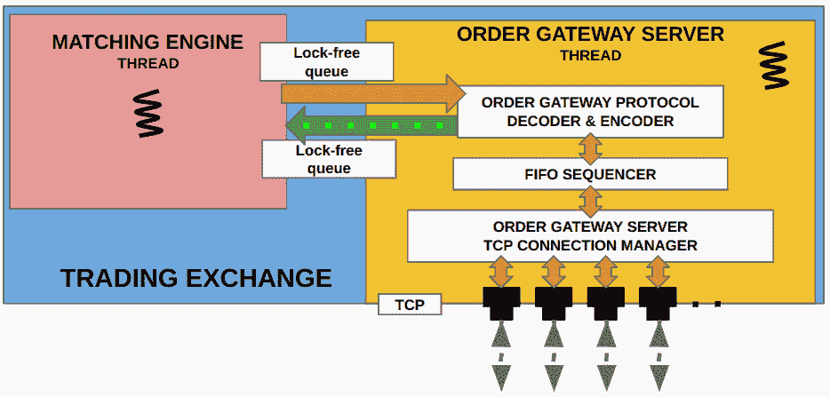
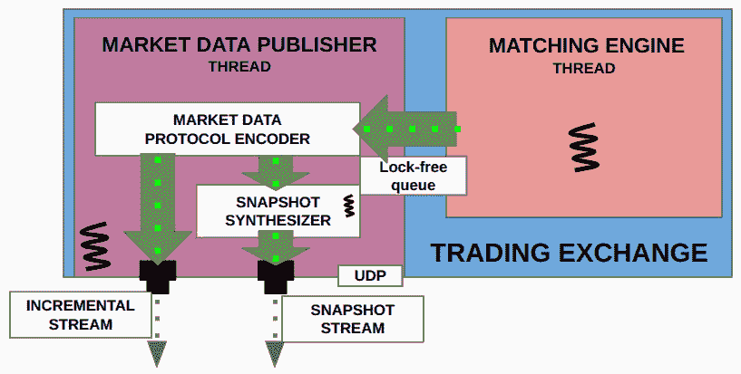
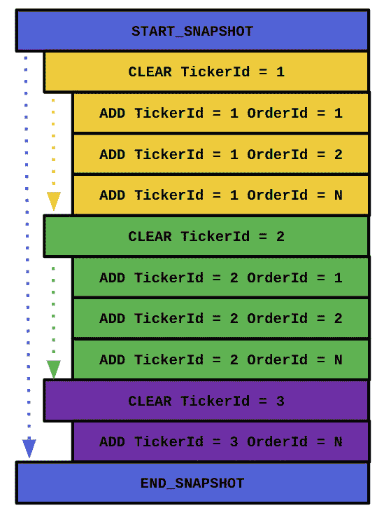
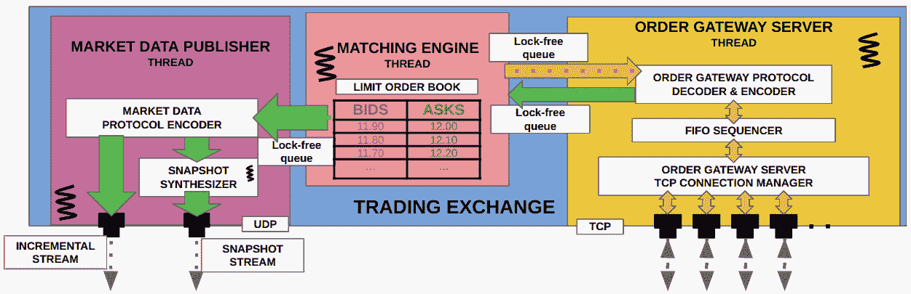

# 与市场参与者通信

在本章中，我们将构建电子交易交易所中的订单网关组件，该组件负责接受客户端连接、处理请求，并在有更新时向客户端发布关于其订单的响应。公平性、低延迟和低抖动（延迟变化）是这里的重要要求，以促进高频交易参与者。我们还将构建从交易交易所发布市场数据的组件。这些市场数据更新旨在允许客户端构建电子交易交易所持有的所有客户订单的订单簿。当有订单更新和匹配发生时，这些市场更新需要尽快发送出去，因此重点将放在超低延迟性能上。此外，交易所还需要定期为那些掉包或在市场已经开盘后开始参与的市场参与者提供订单簿快照。

在本章中，我们将涵盖以下主题：

+   定义市场数据协议和订单数据协议

+   构建订单网关服务器

+   构建市场数据发布者

+   构建主要交易所应用程序

# 技术要求

本书的所有代码都可以在本书的 GitHub 仓库[`github.com/PacktPublishing/Building-Low-Latency-Applications-with-CPP`](https://github.com/PacktPublishing/Building-Low-Latency-Applications-with-CPP)中找到。本章的源代码可以在仓库中的`Chapter7`目录中找到。

重要的是，你已经阅读并理解了*设计我们的交易生态系统*章节中展示的电子交易生态系统的设计。我们在本章构建的组件将与我们在*构建 C++匹配引擎*章节中构建的匹配引擎交互，因此我们假设你熟悉这一点。和之前一样，我们将使用我们在*构建低延迟应用的 C++构建块*章节中构建的构建块。

# 定义市场数据协议和订单数据协议

在我们构建交易交换内部发布市场数据更新并接收和响应客户端请求的组件之前，我们需要最终确定协议。该协议需要公开可用，以便想要连接到交易所、处理更新和发送订单请求的市场参与者能够构建他们的软件。该协议是交易所和市场参与者将用于通信的*语言*。我们将有两个协议——一个用于市场数据更新的格式，另一个用于发送订单请求和接收订单响应的格式。

## 设计市场数据协议

对于市场数据协议，我们将定义一个内部格式，这是匹配引擎使用的，以及一个公共格式，用于市场参与者。我们在*构建匹配引擎*章节的*定义匹配引擎中的操作和交互*部分中看到了内部匹配格式，即`MEMarketUpdate`结构。在本节中，我们将定义公共市场数据格式，它将被封装在`MDPMarketUpdate`结构中。记住，我们提到市场数据格式可以是几种类型和不同复杂度，例如 FAST 协议或 SBE 协议。对于我们的市场数据格式，我们将使用`Chapter7/exchange/market_data/market_update.h`源文件。

在我们查看市场数据协议之前，提醒一下，我们首先在*设计我们的交易生态系统*章节的*理解交易所如何向参与者发布信息*部分的*设计市场数据发布者*子部分中解释了市场数据快照是什么，为什么需要它，以及它是如何使用增量市场数据更新合成的。此外，我们在同一章节的*构建市场参与者与交易所的接口*部分讨论了快照数据流的更多细节。因此，如果需要复习这些概念，重新访问这些部分将是有益的。但为了重新介绍快照消息，这些消息包含任何给定时间限价订单簿状态的完整信息，并且如果市场参与者需要重新构建完整的限价订单簿，可以使用这些信息。

在我们查看`MDPMarketUpdate`结构之前，让我们首先回顾一下我们在上一章中创建的`MarketUpdateType`枚举。在本章中，我们将在此处添加几个新的枚举类型——`CLEAR`、`SNAPSHOT_START`和`SNAPSHOT_END`——这些将在以后需要。`CLEAR`消息用于通知客户端他们应该在他们的端清除/清空订单簿，`SNAPSHOT_START`表示快照消息的开始，而`SNAPSHOT_END`表示快照更新中的所有更新都已交付。

更新的枚举列表如下所示：

```cpp
#pragma once
#include <sstream>
#include "common/types.h"
using namespace Common;
namespace Exchange {
  enum class MarketUpdateType : uint8_t {
    INVALID = 0,
    CLEAR = 1,
    ADD = 2,
    MODIFY = 3,
    CANCEL = 4,
    TRADE = 5,
    SNAPSHOT_START = 6,
    SNAPSHOT_END = 7
  };
}
```

我们的 `MDPMarketUpdate` 结构相对于 `MEMarketUpdate` 结构增加了一个重要的字段，即序列号字段。这个 `size_t seq_num_` 字段是交易所发布的每个市场更新的递增序列号值。对于每个新的市场更新，序列号正好比前一个市场更新大 1。这个序列号字段将由市场数据消费者在市场参与者的交易系统中用来检测市场更新的间隔。记住，对于我们的市场数据发布者，我们将以 UDP 格式发布市场数据，这是一个不可靠的协议。所以，当网络层面出现数据包丢失，或者如果某个参与者的系统丢失了一个数据包，他们可以使用序列号字段来检测这一点。我们再次展示 `MEMarketUpdate` 的内部格式，以及新的公共 `MDPMarketUpdate` 格式如下：

```cpp
#pragma pack(push, 1)
  struct MEMarketUpdate {
    MarketUpdateType type_ = MarketUpdateType::INVALID;
    OrderId order_id_ = OrderId_INVALID;
    TickerId ticker_id_ = TickerId_INVALID;
    Side side_ = Side::INVALID;
    Price price_ = Price_INVALID;
    Qty qty_ = Qty_INVALID;
    Priority priority_ = Priority_INVALID;
    auto toString() const {
      std::stringstream ss;
      ss << "MEMarketUpdate"
         << " ["
         << " type:" << marketUpdateTypeToString(type_)
         << " ticker:" << tickerIdToString(ticker_id_)
         << " oid:" << orderIdToString(order_id_)
         << " side:" << sideToString(side_)
         << " qty:" << qtyToString(qty_)
         << " price:" << priceToString(price_)
         << " priority:" << priorityToString(priority_)
         << "]";
      return ss.str();
    }
  };
  struct MDPMarketUpdate {
    size_t seq_num_ = 0;
    MEMarketUpdate me_market_update_;
    auto toString() const {
      std::stringstream ss;
      ss << "MDPMarketUpdate"
         << " ["
         << " seq:" << seq_num_
         << " " << me_market_update_.toString()
         << "]";
      return ss.str();
    }
  };
#pragma pack(pop)
```

因此，`MDPMarketUpdate` 简单地是 `MEMarketUpdate`，只是在前面添加了一个 `seq_num_` 字段。在我们完成这个子节之前，我们将定义两个简单的 `typedef`，我们将在本章后面用到。我们在上一章中看到了第一个，`MEMarketUpdateLFQueue`；新的 `MDPMarketUpdateLFQueue` 与之类似，代表一个 `MDPMarketUpdate` 结构的锁免费列队：

```cpp
  typedef Common::LFQueue<Exchange::MEMarketUpdate>
    MEMarketUpdateLFQueue;
  typedef Common::LFQueue<Exchange::MDPMarketUpdate>
    MDPMarketUpdateLFQueue;
```

这就完成了我们对市场数据协议的设计。接下来，我们将看到订单数据协议的设计。

## 设计订单数据协议

在这个子节中，我们将设计客户端将用来向交易所发送订单请求并从其接收订单响应的公共订单数据协议，具体来说是订单网关服务器。

首先，我们将看到从市场参与者的订单网关发送到交易所订单网关服务器的消息格式。在 *构建 C++ 匹配引擎* 章节中，我们已经讨论了 `ClientRequestType` 枚举、`MEClientRequest` 结构和匹配引擎使用的 `ClientRequestLFQueue` `typedef`，在 *定义匹配引擎中的操作和交互* 部分。`MEClientRequest` 是匹配引擎使用的内部格式，但 `OMClientRequest` 是市场参与者在向交易所订单网关服务器发送订单请求时需要使用的格式。与市场数据格式类似，`OMClientRequest` 有一个序列号字段 `seq_num_`，然后是 `MEClientRequest` 结构。这里的序列号字段与之前的作用类似，确保交易所和客户端的订单网关组件彼此同步。这个结构的代码在 `Chapter7/exchange/order_server/client_request.h` 文件中：

```cpp
#pragma once
#include <sstream>
#include "common/types.h"
#include "common/lf_queue.h"
using namespace Common;
namespace Exchange {
#pragma pack(push, 1)
  struct OMClientRequest {
    size_t seq_num_ = 0;
    MEClientRequest me_client_request_;
    auto toString() const {
      std::stringstream ss;
      ss << "OMClientRequest"
         << " ["
         << "seq:" << seq_num_
         << " " << me_client_request_.toString()
         << "]";
      return ss.str();
    }
  };
#pragma pack(pop)
}
```

我们为交易所的订单网关服务器发送给客户端订单网关组件的响应设计了一个对称的结构。我们在上一章中看到了`MEClientResponse`结构，它用于交易交换基础设施内部匹配引擎和订单网关服务器组件之间的内部通信。`OMClientResponse`结构是市场参与者用来接收和处理订单响应的公共格式。像之前看到的其他结构一样，有一个用于同步的序列号字段，以及该结构的剩余有效载荷是`MEClientResponse`结构。这个结构可以在`Chapter7/exchange/order_server/client_response.h`文件中找到：

```cpp
#pragma once
#include <sstream>
#include "common/types.h"
#include "common/lf_queue.h"
using namespace Common;
namespace Exchange {
#pragma pack(push, 1)
  struct OMClientResponse {
    size_t seq_num_ = 0;
    MEClientResponse me_client_response_;
    auto toString() const {
      std::stringstream ss;
      ss << "OMClientResponse"
         << " ["
         << "seq:" << seq_num_
         << " " << me_client_response_.toString()
         << "]";
      return ss.str();
    }
  };
#pragma pack(pop)
}
```

本章所需的新结构设计到此结束。接下来，我们将开始讨论订单网关服务器的实现，首先从它如何处理来自市场参与者的客户端请求开始。

# 构建订单网关服务器

在本节中，我们将开始构建订单网关服务器基础设施，它负责为客户端设置 TCP 服务器以连接到。订单网关服务器还需要按照请求到达的顺序处理来自不同客户端的请求，并将它们转发给匹配引擎。最后，它还需要从匹配引擎接收订单响应，并将它们转发给对应市场参与者的正确 TCP 连接。我们将重新审视订单网关服务器的结构以及它与匹配引擎和市场参与者的交互，如下所述。



图 7.1 – 订单网关服务器及其子组件

为了帮助您回忆，订单网关服务器接收新的 TCP 连接或已建立的 TCP 连接上的客户端请求。然后，这些请求通过一个 FIFO 序列器阶段，以确保请求按照它们到达交易所基础设施的确切顺序进行处理。在上一节中描述的内部匹配引擎格式和公共订单数据格式之间存在转换。在上一章《构建匹配引擎》中，我们已经构建了匹配引擎的通信路径，这是通过无锁队列实现的。关于该组件的设计细节以及它在我们的电子交易生态系统中所起的作用，在《设计我们的交易生态系统》一章中已有详细讨论，特别是在《理解电子交易生态系统的布局》和《理解交易所如何向参与者发布信息》部分。因此，我们强烈建议在构建交易所的订单网关服务器时重新阅读那一章。

首先，我们将构建`OrderServer`类，它代表前面图中订单网关服务器组件。`OrderServer`的代码位于`Chapter7/exchange/order_server/order_server.h`和`Chapter7/exchange/order_server/order_server.cpp`文件中。

## 在网关服务器中定义数据成员的顺序

`OrderServer`类有几个重要的数据成员：

+   一个名为`tcp_server_`的变量，它是`Common::TCPServer`类的一个实例，将被用来托管一个 TCP 服务器以轮询市场参与者的传入连接，并轮询已建立的 TCP 连接以查看是否有任何连接可以读取数据。

+   一个名为`fifo_sequencer_`的变量，它是`FIFOSequencer`类的一个实例，负责确保来自不同 TCP 连接的客户请求按照它们到达的正确顺序进行处理。

+   一个无锁队列变量`outgoing_responses_`，其类型为`ClientResponseLFQueue`，通过它接收来自匹配引擎的`MEClientResponse`消息，这些消息需要发送给正确的市场参与者。

+   一个大小为`ME_MAX_NUM_CLIENTS`的`std::array` `cid_tcp_socket_`，包含`TCPSocket`对象，它将被用作从客户端 ID 到该客户端`TCPSocket`连接的哈希映射。

+   两个大小为`ME_MAX_NUM_CLIENTS`的`std::array`，用于跟踪`OMClientResponse`和`OMClientRequest`消息上的交易所到客户端和客户端到交易所的序列号。这些是`cid_next_outgoing_seq_num_`和`cid_next_exp_seq_num_`变量。

+   一个布尔变量`run_`，它将被用来启动和停止`OrderServer`线程。请注意，它被标记为`volatile`，因为它将从不同的线程中访问，并且我们希望在这里防止编译器优化，以确保在多线程环境中的正确功能：

    ```cpp
    #pragma once
    ```

    ```cpp
    #include <functional>
    ```

    ```cpp
    #include "common/thread_utils.h"
    ```

    ```cpp
    #include "common/macros.h"
    ```

    ```cpp
    #include "common/tcp_server.h"
    ```

    ```cpp
    #include "order_server/client_request.h"
    ```

    ```cpp
    #include "order_server/client_response.h"
    ```

    ```cpp
    #include "order_server/fifo_sequencer.h"
    ```

    ```cpp
    namespace Exchange {
    ```

    ```cpp
      class OrderServer {
    ```

    ```cpp
      private:
    ```

    ```cpp
        const std::string iface_;
    ```

    ```cpp
        const int port_ = 0;
    ```

    ```cpp
        ClientResponseLFQueue *outgoing_responses_ = nullptr;
    ```

    ```cpp
        volatile bool run_ = false;
    ```

    ```cpp
        std::string time_str_;
    ```

    ```cpp
        Logger logger_;
    ```

    ```cpp
        std::array<size_t, ME_MAX_NUM_CLIENTS> cid_next_outgoing_
    ```

    ```cpp
        seq_num_;
    ```

    ```cpp
        std::array<size_t, ME_MAX_NUM_CLIENTS> cid_next_exp_seq_
    ```

    ```cpp
        num_;
    ```

    ```cpp
        std::array<Common::TCPSocket *, ME_MAX_NUM_CLIENTS> cid_tcp_
    ```

    ```cpp
        socket_;
    ```

    ```cpp
        Common::TCPServer tcp_server_;
    ```

    ```cpp
        FIFOSequencer fifo_sequencer_;
    ```

    ```cpp
      };
    ```

    ```cpp
    }
    ```

在我们进入下一个子节之前，还有一个小的声明，即`OrderServer`类有以下方法声明，我们将在后续子节中定义它们。这些是与构造函数、析构函数、`start()`方法和`stop()`方法相对应的方法，但就目前而言，不要担心这些方法的细节；我们很快就会定义它们：

```cpp
    OrderServer(ClientRequestLFQueue *client_requests,
    ClientResponseLFQueue *client_responses, const std::string &iface,
    int port);
    ~OrderServer();
    auto start() -> void;
    auto stop() -> void;
```

在下一个子节中，我们将初始化和销毁`OrderServer`类及其成员变量。

## 初始化订单网关服务器

这个类的构造函数很简单。我们使用一些基本值初始化三个数组：序列号设置为 1，`TCPSocket`设置为`nullptr`。我们还将两个回调成员`recv_callback_`和`recv_finished_callback_`设置为指向`recvCallback()`和`recvFinishedCallback()`成员函数。我们将在接下来的几个小节中讨论这些回调处理方法。`OrderServer`类的构造函数接受两个无锁队列对象的指针：一个用于将`MEClientRequest`转发到匹配引擎，另一个用于从匹配引擎接收`MEClientResponse`。它还接受一个网络接口和端口号，该端口号用于订单网关服务器监听并接受客户端连接：

```cpp
#include "order_server.h"
namespace Exchange {
  OrderServer::OrderServer(ClientRequestLFQueue *client_requests,
    ClientResponseLFQueue *client_responses, const std::string &iface,
    int port)
      : iface_(iface), port_(port), outgoing_responses_(client_
    responses), logger_("exchange_order_server.log"),
        tcp_server_(logger_), fifo_sequencer_(client_requests, 
    &logger_) {
    cid_next_outgoing_seq_num_.fill(1);
    cid_next_exp_seq_num_.fill(1);
    cid_tcp_socket_.fill(nullptr);
    tcp_server_.recv_callback_ = this { 
    recvCallback(socket, rx_time); };
    tcp_server_.recv_finished_callback_ = [this]() {
    recvFinishedCallback(); };
  }
}
```

我们还将定义一个`start()`方法，它将 bool run_ 设置为 true。这是控制主线程运行时间的标志。我们还初始化`TCPServer`成员对象，以便在构造函数中提供的接口和端口上开始监听。最后，它创建并启动一个将执行`run()`方法的线程，我们将在接下来的几个小节中看到这个方法。现在，我们不会为在这个应用程序中创建的任何线程设置亲和性，但我们将在本书的末尾讨论优化可能性：

```cpp
  auto OrderServer::start() -> void {
    run_ = true;
    tcp_server_.listen(iface_, port_);
    ASSERT(Common::createAndStartThread(-1, "Exchange/OrderServer",
    [this]() { run(); }) != nullptr, "Failed to start OrderServer
    thread.");
  }
```

我们定义了一个互补的`stop()`方法，它只是将`run_`标志设置为 false，这将导致`run()`方法完成执行（关于这一点我们稍后还会讨论）：

```cpp
  auto OrderServer::stop() -> void {
    run_ = false;
  }
```

`OrderServer`类的析构函数也很简单。它调用`stop()`方法指示主线程停止执行，然后等待一段时间，以便线程完成任何挂起的任务：

```cpp
  OrderServer::~OrderServer() {
    stop();
    using namespace std::literals::chrono_literals;
    std::this_thread::sleep_for(1s);
  }
```

这就完成了本小节关于这个类初始化的讨论。接下来，我们将研究`OrderServer`处理通过 TCP 连接传入的客户端请求所需的功能。

## 处理传入的客户端请求

在本小节中，我们将讨论我们需要处理传入客户端请求的代码。这些客户端请求通过 TCP 连接接收，并通过`TCPServer`（如我们在构造函数中设置的）将这些请求分发给`recvCallback()`和`recvFinishedCallback()`方法。我们将把这个方法的实现分解成不同的块，以便我们更好地理解它。

这个方法中的第一个代码块检查可用数据的大小是否至少与一个完整的`OMClientRequest`结构体的大小一样大。然后它将可用数据分成与`OMClientRequest`对象大小相等的块，并遍历可用数据。它将`TCPSocket`中的`rcv_buffer_`重新解释为`OMClientRequest`结构体，并将其保存到`request`变量中，该变量是`OMClientRequest`指针类型：

```cpp
    auto recvCallback(TCPSocket *socket, Nanos rx_time) noexcept {
      logger_.log("%:% %() % Received socket:% len:% rx:%\n", __FILE__,
    __LINE__, __FUNCTION__, Common::getCurrentTimeStr(&time_str_),
                  socket->fd_, socket->next_rcv_valid_index_, rx_
    time);
      if (socket->next_rcv_valid_index_ >= sizeof(OMClientRequest)) {
        size_t i = 0;
        for (; i + sizeof(OMClientRequest) <= socket->next_rcv_valid_
        index_; i += sizeof(OMClientRequest)) {
        auto request = reinterpret_cast<const OMClientRequest         *>(socket->rcv_buffer_ + i);
          logger_.log("%:% %() % Received %\n", __FILE__, __LINE__,
          __FUNCTION__, Common::getCurrentTimeStr(&time_str_),
          request->toString());
```

一旦它获得了需要处理的`OMClientRequest`，它将检查这是否是这个客户端的第一个请求。如果是这种情况，那么它将通过将其添加到我们用作哈希表的`cid_tcp_socket_` `std::array`中来跟踪这个客户端的`TCPSocket`实例：

```cpp
          if (UNLIKELY(cid_tcp_socket_[request->me_client_request_.
          client_id_] == nullptr)) {
            cid_tcp_socket_[request->me_client_request_.client_id_] =
            socket;
          }
```

如果对于这个客户端-id 已经在`cid_tcp_socket_`容器中存在一个`TCPSocket`条目，那么我们将确保之前跟踪的`TCPSocket`与当前请求的`TCPSocket`匹配。如果不匹配，我们将记录一个错误并跳过处理这个请求：

```cpp
          if (cid_tcp_socket_[request->me_client_request_.client_id_]
          != socket) {
            logger_.log("%:% %() % Received ClientRequest from
            ClientId:% on different socket:% expected:%\n", __FILE__,
            __LINE__, __FUNCTION__,
                        Common::getCurrentTimeStr(&time_str_),
                        request->me_client_request_.client_id_,
                        socket->fd_,
                        cid_tcp_socket_[request->me_client_request_.
                        client_id_]->fd_);
            continue;
          }
```

接下来，我们将执行一个序列号检查，以确保这个`OMClientRequest`上的序列号与我们根据最后收到的消息所期望的序列号完全一致。如果期望的序列号和接收到的序列号之间存在不匹配，那么我们将记录一个错误并忽略这个请求：

```cpp
          auto &next_exp_seq_num = cid_next_exp_seq_num_[request->me_
          client_request_.client_id_];
          if (request->seq_num_ != next_exp_seq_num) {
            logger_.log("%:% %() % Incorrect sequence number.
            ClientId:% SeqNum expected:% received:%\n", __FILE__,
            __LINE__, __FUNCTION__,
                        Common::getCurrentTimeStr(&time_str_),
                        request->me_client_request_.client_id_, next_
                        exp_seq_num, request->seq_num_);
            continue;
          }
```

这里有一个注意事项，在现实设置中，如果交换接收到的请求是在错误的套接字上，或者如果序列号不匹配，它将向客户端发送一个拒绝响应，以通知他们错误。为了简化，这里省略了这一点，但如果需要，添加它并不困难。如果我们已经执行了这个循环的这部分，那么我们将为这个客户端的下一个`OMClientRequest`递增下一个预期的序列号，并将这个请求转发到 FIFO 序列器数据成员。这里需要注意的是，我们还转发`rx_time`，这是这个 TCP 数据包的软件接收时间，因为 FIFO 序列器需要这些信息来正确地排序请求。我们将在下一小节中讨论 FIFO 序列器如何实现这一点：

```cpp
          ++next_exp_seq_num;
          fifo_sequencer_.addClientRequest(rx_time, request->me_
          client_request_);
        }
        memcpy(socket->rcv_buffer_, socket->rcv_buffer_ + i, socket-
        >next_rcv_valid_index_ - i);
        socket->next_rcv_valid_index_ -= i;
      }
    }
```

记住，当所有`recvCallback()`方法从当前对`TCPServer::sendAndRecv()`的调用中分发出去时，会调用`recvFinishedCallback()`方法。`recvFinishedCallback()`方法指示`FIFOSequencer`正确排序它已排队的`MEClientRequests`并将它们推送到匹配引擎。当我们在下一小节中讨论`FIFOSequencer`的设计和实现时，这种机制将变得清晰：

```cpp
    auto recvFinishedCallback() noexcept {
      fifo_sequencer_.sequenceAndPublish();
    }
```

接下来，我们将讨论 FIFO 序列器组件，该组件负责从处理客户端请求的角度维护公平性。它通过确保在不同 TCP 连接上接收到的请求以它们在网关服务器接收到的确切顺序进行处理来实现这一点。

## 使用 FIFO 序列器公平处理请求

订单网关服务器中的 FIFO 序列器子组件负责确保客户端请求按到达时间顺序处理。这是必要的，因为顺序网关服务器从不同的 TCP 连接中读取和调度客户端请求，这些请求到达的时间不同。让我们首先定义这个类内部的数据成员。FIFO 序列器的代码位于 `Chapter7/exchange/order_server/fifo_sequencer.h` 源文件中。

### 定义 FIFO 序列器中的数据成员

首先，我们定义一个常量 `ME_MAX_PENDING_REQUESTS`，它表示在网络套接字上所有 TCP 连接中可以同时挂起的最大请求数量。如果顺序网关服务器正忙于其他任务并且没有在非常短的时间内轮询 TCP 连接，那么在这段时间内可能到达的客户端请求可能会在网络套接字级别排队。

FIFO 序列器使用此常量来创建一个大小为 `RecvTimeClientRequest` 结构的 `std::array`。在这个 `FIFOSequencer` 类中，这个成员变量被命名为 `pending_client_requests_`。为了计算 `pending_client_requests_` 数组中实际挂起的请求条目数量，我们将维护一个 `size_t` 类型的 `pending_size_` 变量。

`RecvTimeClientRequest` 结构有两个成员——`recv_time_`，类型为 `Nanos`，以及一个 `request_` 变量，类型为 `MEClientRequest`。这个结构捕获了客户端请求以及它在订单网关服务器上的到达时间。我们将按时间对这些进行排序，然后按到达顺序处理它们。为了使排序变得容易，我们将定义一个 `<` 操作符，如果操作符的左侧（**LHS**）的客户端请求在操作符的右侧（**RHS**）的客户端请求之前接收，则返回 `true`。

最后，这个类中最后一个重要的成员变量是 `incoming_requests_`，它属于 `ClientRequestLFQueue` 类型，这是 FIFO 序列器用来将 `MEClientRequest` 发送到匹配引擎的无锁队列：

```cpp
#pragma once
#include "common/thread_utils.h"
#include "common/macros.h"
#include "order_server/client_request.h"
namespace Exchange {
  constexpr size_t ME_MAX_PENDING_REQUESTS = 1024;
  class FIFOSequencer {
  private:
    ClientRequestLFQueue *incoming_requests_ = nullptr;
    std::string time_str_;
    Logger *logger_ = nullptr;
    struct RecvTimeClientRequest {
      Nanos recv_time_ = 0;
      MEClientRequest request_;
      auto operator<(const RecvTimeClientRequest &rhs) const {
        return (recv_time_ < rhs.recv_time_);
      }
    };
    std::array<RecvTimeClientRequest, ME_MAX_PENDING_REQUESTS>
    pending_client_requests_;
    size_t pending_size_ = 0;
  };
}
```

现在，让我们查看源代码以初始化 FIFO 序列器。

### 初始化 FIFO 序列器

`FIFOSequencer` 类的构造函数简单明了，易于理解。它如下所示，并初始化 `incoming_requests_` `ClientRequestLFQueue` 和 `logger_`，这两个都是通过这个类的构造函数传递给它的：

```cpp
  class FIFOSequencer {
  public:
    FIFOSequencer(ClientRequestLFQueue *client_requests, Logger 
    *logger)
        : incoming_requests_(client_requests), logger_(logger) {
    }
```

现在，我们将查看 FIFO 序列器中最重要的功能——按接收时间顺序排队客户端请求并发布它们。

### 按顺序发布客户端请求

我们在之前的子节“处理传入客户端请求”中使用了`FIFOSequencer::addClientRequest()`方法。在这里，我们展示了其实现，这相当简单，只需将其添加到`pending_client_requests_`的末尾，并将`pending_size_`变量递增以表示添加了一个额外的条目。请注意，我们始终期望一次最多只有`ME_MAX_PENDING_REQUESTS`，因为我们将其设置为高值。如果这个限制不够，我们有增加数组大小并可能切换到使用`RecvTimeClientRequest`对象的`MemPool`的选项：

```cpp
    auto addClientRequest(Nanos rx_time, const MEClientRequest
    &request) {
      if (pending_size_ >= pending_client_requests_.size()) {
        FATAL("Too many pending requests");
      }
      pending_client_requests_.at(pending_size_++) =
      std::move(RecvTimeClientRequest{rx_time, request});
    }
```

我们也在之前的子节“处理传入客户端请求”中使用了`FIFOSequencer::sequenceAndPublish()`方法。这是`FIFOSequencer`类中最重要的方法，并执行以下任务：

+   首先，它按到达时间升序对`pending_client_requests_`容器中的所有`RecvTimeClientRequest`条目进行排序。它通过使用`std::sort()`算法来实现这一点，该算法反过来使用我们为`RecvTimeClientRequest`对象构建的`<`运算符来排序容器。这里有一点需要注意：如果元素数量非常大，排序可能会变得耗时，但在这里我们很少期望这种情况发生，因为同时挂起的请求数量预计会相当低。这将是另一个优化领域，但在决定如何改进之前，我们需要在实际中测量我们系统的负载和性能。

+   在排序步骤之后，它将每个`MEClientRequest`条目写入`incoming_requests_` `LFQueue`，该队列流向匹配引擎。

+   最后，它将`pending_size_`变量重置以标记处理结束，并从方法返回：

    ```cpp
        auto sequenceAndPublish() {
    ```

    ```cpp
          if (UNLIKELY(!pending_size_))
    ```

    ```cpp
            return;
    ```

    ```cpp
          logger_->log("%:% %() % Processing % requests.\n", __
    ```

    ```cpp
          FILE__, __LINE__, __FUNCTION__, Common::getCurrentTimeStr
    ```

    ```cpp
          (&time_str_), pending_size_);
    ```

    ```cpp
          std::sort(pending_client_requests_.begin(), pending_
    ```

    ```cpp
          client_requests_.begin() + pending_size_);
    ```

    ```cpp
          for (size_t i = 0; i < pending_size_; ++i) {
    ```

    ```cpp
            const auto &client_request = pending_client_requests_.
    ```

    ```cpp
            at(i);
    ```

    ```cpp
            logger_->log("%:% %() % Writing RX:% Req:%
    ```

    ```cpp
            to FIFO.\n", __FILE__, __LINE__, __FUNCTION__,
    ```

    ```cpp
            Common::getCurrentTimeStr(&time_str_),
    ```

    ```cpp
                         client_request.recv_time_, client_request.
    ```

    ```cpp
                         request_.toString());
    ```

    ```cpp
            auto next_write = incoming_requests_->getNextToWriteTo();
    ```

    ```cpp
            *next_write = std::move(client_request.request_);
    ```

    ```cpp
            incoming_requests_->updateWriteIndex();
    ```

    ```cpp
          }
    ```

    ```cpp
          pending_size_ = 0;
    ```

    ```cpp
        }
    ```

这标志着我们订单网关服务器内部`FIFOSequencer`子组件的设计和实现的结束。现在，我们可以回到我们的`OrderServer`类的设计，通过添加将客户端响应发送回客户端的功能。

## 发送客户端响应

在本节中，我们将探讨`OrderServer`在`run()`方法中执行的两个重要任务。请记住，这个`run()`方法是这个类的主要循环，它在我们在“初始化订单网关服务器”子节中创建并启动的线程上运行，具体在`start()`方法中。`run()`方法执行以下两个主要任务：

+   它在其持有的`TCPServer`对象上调用`poll()`方法。请记住，`poll()`方法检查并接受新的连接，移除已死连接，并检查是否有任何已建立的 TCP 连接上有数据可用，即客户端请求。

+   它还调用它持有的`TCPServer`对象的`sendAndRecv()`方法。`sendAndRecv()`方法从每个 TCP 连接中读取数据，并为它们分发回调。`sendAndRecv()`调用还会在 TCP 连接上发送任何出站数据，即客户端响应。这个代码块如下所示，应该很容易理解：

    ```cpp
        auto run() noexcept {
    ```

    ```cpp
          logger_.log("%:% %() %\n", __FILE__, __LINE__, __
    ```

    ```cpp
          FUNCTION__, Common::getCurrentTimeStr(&time_str_));
    ```

    ```cpp
          while (run_) {
    ```

    ```cpp
            tcp_server_.poll();
    ```

    ```cpp
            tcp_server_.sendAndRecv();
    ```

+   `run()`循环还会清空`outgoing_responses_`无锁队列，匹配引擎使用这个队列来发送需要分发到正确客户端的`MEClientResponse`消息。

+   它遍历`outgoing_responses_`队列中的可用数据，然后对于每个读取的`MEClientResponse`，它首先找出正确的出站序列号。这是要发送给该客户端 ID 的`OMClientResponse`消息上的序列号。它是通过在`cid_next_outgoing_seq_num_`数组中查找这个答案来做到这一点的，我们实际上是将它用作从客户端 ID 到序列号的哈希表：

    ```cpp
            for (auto client_response = outgoing_responses_-
    ```

    ```cpp
            >getNextToRead(); outgoing_responses_->size() &&
    ```

    ```cpp
            client_response; client_response = outgoing_responses_-
    ```

    ```cpp
            >getNextToRead()) {
    ```

    ```cpp
              auto &next_outgoing_seq_num = cid_next_outgoing_seq_
    ```

    ```cpp
              num_[client_response->client_id_];
    ```

    ```cpp
              logger_.log("%:% %() % Processing cid:% seq:% %\n", __
    ```

    ```cpp
              FILE__, __LINE__, __FUNCTION__,
    ```

    ```cpp
              Common::getCurrentTimeStr(&time_str_),
    ```

    ```cpp
              client_response->client_id_, next_
    ```

    ```cpp
              outgoing_seq_num, client_response-
    ```

    ```cpp
              >toString());
    ```

+   它还会检查它是否有一个有效的`TCPSocket`用于这个响应目标客户端 ID。它在`cid_tcp_socket_`数组中查找这个信息，这是一个从客户端 ID 到`TCPSocket`对象的哈希表。

+   然后，它通过调用`TCPSocket::send()`方法，向该客户端 ID 发送一个`OMClientResponse`消息到`TCPSocket`。它是通过首先发送`next_outgoing_seq_num_`值，然后发送由匹配引擎生成的`MEClientResponse`消息来实现的。这可能一开始并不明显，但实际上这是在发送一个`OMClientResponse`消息，因为`OMClientResponse`消息实际上只是一个序列号字段，后面跟着一个`MEClientResponse`消息，这正是我们刚才所做的。

+   最后，它更新读取索引和下一个出站消息的序列号，并继续循环：

    ```cpp
              ASSERT(cid_tcp_socket_[client_response->client_id_] !=
    ```

    ```cpp
              nullptr,
    ```

    ```cpp
                     "Dont have a TCPSocket for ClientId:" + 
    ```

    ```cpp
                     std::to_string(client_response->client_id_));
    ```

    ```cpp
              cid_tcp_socket_[client_response->client_id_]-
    ```

    ```cpp
              >send(&next_outgoing_seq_num, sizeof(next_outgoing_
    ```

    ```cpp
              seq_num));
    ```

    ```cpp
              cid_tcp_socket_[client_response->client_id_]-
    ```

    ```cpp
              >send(client_response, sizeof(MEClientResponse));
    ```

    ```cpp
              outgoing_responses_->updateReadIndex();
    ```

    ```cpp
              ++next_outgoing_seq_num;
    ```

    ```cpp
            }
    ```

    ```cpp
          }
    ```

    ```cpp
        }
    ```

这就完成了我们电子交易基础设施中订单网关服务器组件的完整设计和实现。接下来，我们将查看发布公共市场数据给参与者的组件。

# 构建市场数据发布者

我们需要构建的电子交易交易所的最后一个组件是市场数据发布者，这是交易所如何向需要它的任何市场参与者发布公共市场数据更新的方式。回顾市场数据发布者的设计，我们展示了一个图表，说明这个组件如何与匹配引擎通信，并通过 UDP 向市场数据参与者发布，如下所示。



图 7.2 – 市场数据发布者和其子组件

我们想提醒您，市场数据发布者的目的和设计在《设计我们的交易生态系统》章节中进行了详细讨论，具体在《理解电子交易生态系统的布局》和《理解交易所如何向参与者发布信息》部分。我们强烈建议您重新阅读这些部分，以便在我们构建市场数据发布组件时能够跟上进度。

让我们首先通过了解如何从撮合引擎中消费更新并将其发布到 `MarketDataPublisher` 类来开始。`MarketDataPublisher` 类的所有源代码都在 `Chapter7/exchange/market_data/market_data_publisher.h` 和 `Chapter7/exchange/market_data/market_data_publisher.cpp` 源文件中。

## 定义市场数据发布者的数据成员

`MarketDataPublisher` 类有以下重要成员：

+   一个 `next_inc_seq_num_` 变量，其类型为 `size_t`，代表将在下一个发出的增量市场数据消息上设置的序列号。我们在《设计我们的交易生态系统》章节中讨论了增量快照市场数据更新的概念，在《理解交易所如何向参与者发布信息》和《构建市场参与者与交易所的接口》部分。

+   一个 `outgoing_md_updates_` 变量，其类型为 `MEMarketUpdateLFQueue`，这是一个 `MEMarketUpdate` 消息的无锁队列。我们在《构建 C++ 撮合引擎》章节的《定义撮合引擎中的操作和交互》部分讨论了 `MEMarketUpdate` 结构。这个 `LFQueue` 是撮合引擎发送 `MEMarketUpdate` 消息的方式，然后市场数据发布者通过 UDP 发布这些消息。

+   一个名为 `incremental_socket_` 的成员，它是一个 `McastSocket`，用于在增量多播流上发布 UDP 消息。

+   一个 `snapshot_synthesizer_` 变量，我们将在下一小节中讨论。这个对象将负责从撮合引擎提供的更新中生成限价订单簿的快照，并定期在快照多播流上发布整个订单簿的快照。这在《设计我们的交易生态系统》章节的《理解交易所如何向参与者发布信息》部分进行了讨论，特别是在《设计市场数据发布者》子部分。

+   一个名为 `snapshot_md_updates_` 的无锁队列实例，其类型为 `MDPMarketUpdateLFQueue`，这是一个包含 `MDPMarketUpdate` 消息的无锁队列。该队列由市场数据发布线程使用，以将发送到增量流的 `MDPMarketUpdate` 消息发布到 `SnapshotSynthesizer` 组件。这个 `LFQueue` 是必要的，因为 `SnapshotSynthesizer` 在与 `MarketDataPublisher` 不同的线程上运行，这主要是为了确保快照合成和发布过程不会减慢对延迟敏感的 `MarketDataPublisher` 组件：

+   `MarketDataPublisher` 类的最后一个重要成员是 `run_` 布尔变量，它仅用于控制何时启动和停止 `MarketDataPublisher` 线程。由于它可以从不同的线程访问，就像 `OrderServer` 类中的 `run_` 变量一样，因此它也被标记为 `volatile`：

    ```cpp
    #pragma once
    ```

    ```cpp
    #include <functional>
    ```

    ```cpp
    #include "market_data/snapshot_synthesizer.h"
    ```

    ```cpp
    namespace Exchange {
    ```

    ```cpp
      class MarketDataPublisher {
    ```

    ```cpp
      private:
    ```

    ```cpp
        size_t next_inc_seq_num_ = 1;
    ```

    ```cpp
        MEMarketUpdateLFQueue *outgoing_md_updates_ = nullptr;
    ```

    ```cpp
        MDPMarketUpdateLFQueue snapshot_md_updates_;
    ```

    ```cpp
        volatile bool run_ = false;
    ```

    ```cpp
        std::string time_str_;
    ```

    ```cpp
        Logger logger_;
    ```

    ```cpp
        Common::McastSocket incremental_socket_;
    ```

    ```cpp
        SnapshotSynthesizer *snapshot_synthesizer_ = nullptr;
    ```

    ```cpp
      };
    ```

    ```cpp
    }
    ```

在下一节中，我们将看到这些数据成员是如何初始化的。

## 初始化市场数据发布者

在本小节中，我们将探讨如何初始化 `MarketDataPublisher`，以及如何启动和停止 `MarketDataPublisher` 组件。首先，我们将查看构造函数，其表示如下。传递给它的 `market_updates` 参数是 `MEMarketUpdateLFQueue` 对象，匹配引擎将在其上发布市场更新。构造函数还接收网络接口和两套 IP 地址和端口号——一套用于增量市场数据流，另一套用于快照市场数据流。在构造函数中，它使用构造函数中传递的参数初始化 `outgoing_md_updates_` 成员，并将 `snapshot_md_updates_` `LFQueue` 初始化为大小为 `ME_MAX_MARKET_UPDATES`，这是我们之前在 *设计 C++ 匹配引擎* 章节中定义的，在 *定义匹配引擎中的操作和交互* *部分* 中，并在 `common/types.h` 源文件中可用。它还使用本类的日志文件初始化 `logger_` 对象，并使用构造函数中提供的增量 IP 地址和端口号初始化 `incremental_socket_` 变量。最后，它创建一个 `SnapshotSynthesizer` 对象，并将 `snapshot_md_updates_` `LFQueue` 和快照多播流信息传递给它：

```cpp
#include "market_data_publisher.h"
namespace Exchange {  MarketDataPublisher::MarketDataPublisher(MEMarketUpdateLFQueue
   *market_updates, const std::string &iface,
                                           const std::string 
                                           &snapshot_ip, int snapshot_
                                           port,
                                           const std::string
                                           &incremental_ip, int 
                                           incremental_port)
      : outgoing_md_updates_(market_updates), snapshot_md_updates_(ME_
      MAX_MARKET_UPDATES),
        run_(false), logger_("exchange_market_data_publisher.log"),
        incremental_socket_(logger_) {
    ASSERT(incremental_socket_.init(incremental_ip, iface,
    incremental_port, /*is_listening*/ false) >= 0,
           "Unable to create incremental mcast socket. error:" +
           std::string(std::strerror(errno)));
    snapshot_synthesizer_ = new SnapshotSynthesizer(&snapshot_md_
    updates_, iface, snapshot_ip, snapshot_port);
  }
```

我们还提供了一个 `start()` 方法，如下所示，其功能与我们在 `OrderServer` 类中看到的 `start()` 方法类似。首先，它将 `run_` 标志设置为 `true`，然后创建并启动一个新的线程，并将 `run()` 方法分配给该线程，这将是我们 `MarketDataPublisher` 组件的主要 `run` 循环。它还调用 `SnapshotSynthesizer` 对象的 `start()` 方法，以便启动 `SnapshotSynthesizer` 线程：

```cpp
    auto start() {
      run_ = true;
      ASSERT(Common::createAndStartThread(-1, "Exchange/
      MarketDataPublisher", [this]() { run(); }) != nullptr, "Failed
      to start MarketData thread.");
      snapshot_synthesizer_->start();
    }
```

析构函数相当直观；它调用`stop()`方法来停止正在运行的`MarketDataPublisher`线程，然后等待一小段时间，让线程完成任何挂起的任务，并删除`SnapshotSynthesizer`对象。我们将在析构函数之后立即看到`stop()`方法的实现，但它应该不难猜测该方法的样子：

```cpp
    ~MarketDataPublisher() {
      stop();
      using namespace std::literals::chrono_literals;
      std::this_thread::sleep_for(5s);
      delete snapshot_synthesizer_;
      snapshot_synthesizer_ = nullptr;
    }
```

最后，正如之前提到的，我们展示`stop()`方法。该方法只是将`run_`标志设置为`false`，并指示`SnapshotSynthesizer`线程停止：

```cpp
    auto stop() -> void {
      run_ = false;
      snapshot_synthesizer_->stop();
    }
```

现在我们已经看到了如何初始化这个类，我们将看看`MarketDataPublisher`如何发布订单簿更新，首先是增量更新市场数据通道的更新，然后是快照更新市场数据通道的更新。

## 发布订单簿更新

`MarketDataPublisher`中的主要`run()`循环执行几个重要操作，我们将在下面讨论。首先，它通过读取匹配引擎发布的任何新的`MEMarketDataUpdates`来清空`outgoing_md_updates_`队列。以下代码块显示了这部分内容：

```cpp
  auto MarketDataPublisher::run() noexcept -> void {
    logger_.log("%:% %() %\n", __FILE__, __LINE__, __FUNCTION__,
    Common::getCurrentTimeStr(&time_str_));
    while (run_) {
      for (auto market_update = outgoing_md_updates_->getNextToRead();
           outgoing_md_updates_->size() && market_update; market_
           update = outgoing_md_updates_->getNextToRead()) {
        logger_.log("%:% %() % Sending seq:% %\n", __FILE__, __LINE__,
        __FUNCTION__, Common::getCurrentTimeStr(&time_str_), next_inc_
        seq_num_,
                    market_update->toString().c_str());
```

一旦它从匹配引擎接收到`MEMarketUpdate`消息，它就会继续将其写入`incremental_socket_` UDP 套接字。但是，它需要以`MDPMarketUpdate`格式写入消息，这只是一个序列号后面跟着一个`MEMarketUpdate`消息。正如我们在`OrderServer`中看到的那样，它将通过首先写入`next_inc_seq_num_`来实现这一点，这是将要发送到增量流的下一个增量序列号，然后写入它从匹配引擎接收到的`MEMarketUpdate`。这一逻辑在以下代码块中显示，包括它刚刚从`LFQueue`中读取的读取索引增加的行：

```cpp
        incremental_socket_.send(&next_inc_seq_num_, sizeof(next_inc_
        seq_num_));
        incremental_socket_.send(market_update,
        sizeof(MEMarketUpdate));
        outgoing_md_updates_->updateReadIndex();
```

在这里，它还需要执行一个额外的步骤，即将它写入套接字相同的增量更新写入`snapshot_md_updates_` `LFQueue`，以通知`SnapshotSynthesizer`组件关于匹配引擎发送给客户端的新增量更新。以下代码块显示了这部分内容：

```cpp
        auto next_write = snapshot_md_updates_.getNextToWriteTo();
        next_write->seq_num_ = next_inc_seq_num_;
        next_write->me_market_update_ = *market_update;
        snapshot_md_updates_.updateWriteIndex();
```

最后，它增加增量流序列号跟踪器，以便发送下一个消息，并在`incremental_socket_`上调用`sendAndRecv()`，以便将消息放入线路上：

```cpp
        ++next_inc_seq_num_;
      }
      incremental_socket_.sendAndRecv();
    }
  }
}
```

这就完成了我们需要执行的所有任务，以从匹配引擎消费更新并生成增量市场更新多播流。在下一个子节中，我们将处理市场数据发布者中的最后关键步骤，即综合订单簿快照并定期在快照多播流上发布它们。

## 综合和发布快照

本节将专注于 `SnapshotSynthesizer` 类的设计和实现，该类从 `MarketDataPublisher` 线程中消费增量 `MDPMarketDataUpdates`，合成整个订单簿的完整快照，并定期在快照多播流上发布完整的簿快照。`SnapshotSynthesizer` 的所有源代码可以在 `Chapter7/exchange/market_data/snapshot_synthesizer.h` 和 `Chapter7/exchange/market_data/snapshot_synthesizer.cpp` 源文件中找到。

### 定义快照合成器中的数据成员

让我们先定义 `SnapshotSynthesizer` 类中的数据成员。其中重要的成员如下所述：

+   首先，`snapshot_md_updates_` 是 `MDPMarketUpdateLFQueue` 类型的变量，这是 `MarketDataPublisher` 用于向该组件发布增量 `MDPMarketUpdates` 的方式，我们之前在章节中已经提到过。

+   它还有一个 `snapshot_socket_` 变量，这是一个 `McastSocket`，用于将快照市场数据更新发布到快照多播流。

+   其中最重要的数据成员是 `ticker_orders_` 变量，它是一个大小为 `ME_MAX_TICKERS` 的 `std::array`，用于表示每个交易工具的簿快照。这个数组中的每个元素都是一个 `std::array`，包含 `MEMarketUpdate` 指针和一个最大大小为 `ME_MAX_ORDER_IDS`，用于从 `OrderId` 到对应订单的哈希映射。正如我们之前所做的那样，我们使用第一个 `std::array` 作为从 `TickerId` 到限价订单簿快照的哈希映射。第二个 `std::array` 也是一个从 `OrderId` 到订单信息的哈希映射。我们还将有一个 `order_pool_` 数据成员，它是 `MEMarketUpdate` 对象的 `MemPool` 类型。这个内存池是我们将用于在更新 `ticker_orders_` 容器中的订单簿快照时分配和释放 `MEMarketUpdate` 对象的。

+   我们有两个变量用于跟踪 `SnapshotSynthesizer` 处理的最后一条增量市场数据更新的信息。第一个是 `last_inc_seq_num_` 变量，用于跟踪它接收到的最后一条增量 `MDPMarketUpdate` 的序列号。第二个是 `last_snapshot_time_` 变量，用于跟踪最后通过 UDP 发布快照的时间，因为该组件将只定期发布所有簿的完整快照。

+   还有一个布尔变量 `run_`，它与我们之前构建的 `OrderServer` 和 `MarketDataPublisher` 组件中的 `run_` 变量具有类似的作用。这个变量将用于启动和停止 `SnapshotSynthesizer` 线程，并且由于它将从多个线程访问，因此会被标记为 `volatile`：

    ```cpp
    #pragma once
    ```

    ```cpp
    #include "common/types.h"
    ```

    ```cpp
    #include "common/thread_utils.h"
    ```

    ```cpp
    #include "common/lf_queue.h"
    ```

    ```cpp
    #include "common/macros.h"
    ```

    ```cpp
    #include "common/mcast_socket.h"
    ```

    ```cpp
    #include "common/mem_pool.h"
    ```

    ```cpp
    #include "common/logging.h"
    ```

    ```cpp
    #include "market_data/market_update.h"
    ```

    ```cpp
    #include "matcher/me_order.h"
    ```

    ```cpp
    using namespace Common;
    ```

    ```cpp
    namespace Exchange {
    ```

    ```cpp
      class SnapshotSynthesizer {
    ```

    ```cpp
      private:
    ```

    ```cpp
        MDPMarketUpdateLFQueue *snapshot_md_updates_ = nullptr;
    ```

    ```cpp
        Logger logger_;
    ```

    ```cpp
        volatile bool run_ = false;
    ```

    ```cpp
        std::string time_str_;
    ```

    ```cpp
        McastSocket snapshot_socket_;
    ```

    ```cpp
        std::array<std::array<MEMarketUpdate *, ME_MAX_ORDER_IDS>,
    ```

    ```cpp
        ME_MAX_TICKERS> ticker_orders_;
    ```

    ```cpp
        size_t last_inc_seq_num_ = 0;
    ```

    ```cpp
        Nanos last_snapshot_time_ = 0;
    ```

    ```cpp
        MemPool<MEMarketUpdate> order_pool_;
    ```

    ```cpp
      };
    ```

    ```cpp
    }
    ```

在下一小节中，我们将看到这些变量是如何初始化的，当我们查看 `SnapshotSynthesizer` 类的初始化过程时。

### 初始化快照合成器

`SnapshotSynthesizer`构造函数接受一个`MDPMarketUpdateLFQueue`类型的参数，该参数由`MarketDataPublisher`组件传递给它。它还接收网络接口名称和快照 IP 及端口，以表示多播流。构造函数从传递给它的参数初始化`snapshot_md_updates_`数据成员，并用新的文件名初始化`logger_`。它初始化`MEMarketUpdate` `MemPool`，使其大小为`ME_MAX_ORDER_IDS`。它还初始化`snapshot_socket_`，并配置它在该提供的网络接口上发布快照多播 IP 和端口的消息：

```cpp
#include "snapshot_synthesizer.h"
namespace Exchange {
  SnapshotSynthesizer::SnapshotSynthesizer(MDPMarketUpdateLFQueue
  *market_updates, const std::string &iface,
                                           const std::string &snapshot_
                                           ip, int snapshot_port)
      : snapshot_md_updates_(market_updates), logger_("exchange_
      snapshot_synthesizer.log"), snapshot_socket_(logger_), order_
      pool_(ME_MAX_ORDER_IDS) {
    ASSERT(snapshot_socket_.init(snapshot_ip, iface, snapshot_port,
    /*is_listening*/ false) >= 0,
           "Unable to create snapshot mcast socket. error:" +
           std::string(std::strerror(errno)));
  }
```

我们也在这里添加了一个`start()`方法，就像我们之前对其他类所做的那样。这个`start()`方法将`run_`标志设置为 true，创建并启动一个线程，并将`run()`方法分配给该线程：

```cpp
  void SnapshotSynthesizer::start() {
    run_ = true;
    ASSERT(Common::createAndStartThread(-1, "Exchange/
    SnapshotSynthesizer", [this]() { run(); }) != nullptr,
           "Failed to start SnapshotSynthesizer thread.");
  }
```

这个类的析构函数非常简单；它只是调用`stop()`方法。`stop()`方法也非常简单，只是将`run_`标志设置为 false，以便`run()`方法退出：

```cpp
  SnapshotSynthesizer::~SnapshotSynthesizer() {
    stop();
  }
  void SnapshotSynthesizer::stop() {
    run_ = false;
  }
```

接下来，我们将查看`SnapshotSynthesizer`的重要部分，它将合成订单簿快照并定期发布快照。

### 合成订单簿快照

为不同交易工具合成订单簿快照的过程类似于构建`OrderBook`。然而，这里的区别在于，快照合成过程只需要维护活订单的最后状态，因此它是一个更简单的容器。我们接下来将要构建的`addToSnapshot()`方法每次在向`SnapshotSynthesizer`提供新的增量市场数据更新时都会接收一个`MDPMarketUpdate`消息。我们将把这个方法分成几个代码块，以便更容易理解。

在第一个代码块中，我们从`MDPMarketUpdate`消息中提取`MEMarketUpdate`部分，并将其存储在`me_market_update`变量中。它还从`ticker_orders_ std::array`哈希表中找到对应于该工具的正确`TickerId`的`MEMarketUpdate`消息的`std::array`。然后，我们在`MarketUpdateType`的类型上使用 switch case，并单独处理每个这些情况。在我们查看 switch case 下的每个情况之前，让我们先展示`addToSnapshot()`方法中描述的初始代码块：

```cpp
  auto SnapshotSynthesizer::addToSnapshot(const MDPMarketUpdate
  *market_update) {
    const auto &me_market_update = market_update->me_market_update_;
    auto *orders = &ticker_orders_.at(me_market_update.ticker_id_);
    switch (me_market_update.type_) {
```

现在，我们将展示`switch case`中`MarketUpdateType::ADD`情况的实现。为了处理`MarketUpdateType::ADD`消息，我们只需将其插入到`MEMarketUpdate` `std::array`的正确`OrderId`位置。我们通过从`order_pool_`内存池中分配并使用`allocate()`调用，传递`MEMarketUpdate`对象以复制字段来创建一个`MEMarketUpdate`消息：

```cpp
      case MarketUpdateType::ADD: {
        auto order = orders->at(me_market_update.order_id_);
        ASSERT(order == nullptr, "Received:" + me_market_update.
        toString() + " but order already exists:" + (order ? order-
        >toString() : ""));
        orders->at(me_market_update.order_id_) = order_pool_.
        allocate(me_market_update);
      }
        break;
```

`MarketUpdateType::MODIFY`的处理方式与`MarketUpdateType::ADD`类似。这里的微小差异是我们只更新`qty_`和`price_`字段，并保持条目上的`type_`字段不变：

```cpp
      case MarketUpdateType::MODIFY: {
        auto order = orders->at(me_market_update.order_id_);
        ASSERT(order != nullptr, "Received:" + me_market_update.
        toString() + " but order does not exist.");
        ASSERT(order->order_id_ == me_market_update.order_id_,
        "Expecting existing order to match new one.");
        ASSERT(order->side_ == me_market_update.side_, "Expecting
        existing order to match new one.");
        order->qty_ = me_market_update.qty_;
        order->price_ = me_market_update.price_;
      }
        break;
```

`MarketUpdateType::CANCEL`类型与`MarketUpdateType::ADD`相反。在这里，我们在哈希表中找到`MEMarketUpdate`，并对其调用`deallocate()`。我们还将在哈希表中的`std::array`条目设置为`nullptr`，以标记其为已取消或死订单：

```cpp
      case MarketUpdateType::CANCEL: {
        auto order = orders->at(me_market_update.order_id_);
        ASSERT(order != nullptr, "Received:" + me_market_update.
        toString() + " but order does not exist.");
        ASSERT(order->order_id_ == me_market_update.order_id_,
        "Expecting existing order to match new one.");
        ASSERT(order->side_ == me_market_update.side_, "Expecting
        existing order to match new one.");
        order_pool_.deallocate(order);
        orders->at(me_market_update.order_id_) = nullptr;
      }
        break;
```

我们不需要对其他枚举值进行任何操作，因此我们忽略它们。我们只需更新我们在增量市场数据流中看到的最后一个序列号，该序列号存储在`last_inc_seq_num_`数据成员中：

```cpp
      case MarketUpdateType::SNAPSHOT_START:
      case MarketUpdateType::CLEAR:
      case MarketUpdateType::SNAPSHOT_END:
      case MarketUpdateType::TRADE:
      case MarketUpdateType::INVALID:
        break;
    }
    ASSERT(market_update->seq_num_ == last_inc_seq_num_ + 1, "Expected
    incremental seq_nums to increase.");
    last_inc_seq_num_ = market_update->seq_num_;
  }
```

这就完成了从增量`MEMarketUpdate`消息中合成和更新订单簿快照的代码。接下来，我们将查看如何生成和发布完整的快照流。

### 发布快照

下一个方法——`publishSnapshot()`——在我们想要发布订单簿当前状态的完整快照时被调用。在我们查看发布快照消息的代码之前，让我们首先尝试理解包含多个金融工具订单簿完整状态的快照消息的格式和内容。完整的快照消息的格式如下所示：

1.  第一个`MDPMarketUpdate`消息是`MarketUpdateType::SNAPSHOT_START`类型，`seq_num_ = 0`，以标记快照消息的开始。

1.  然后，对于每个金融工具，我们发布以下内容：

    1.  一个`MDPMarketUpdate`消息，消息类型为`MarketUpdateType::CLEAR`，指示客户端在应用后续消息之前清除其订单簿

    1.  对于快照中存在的每个订单，我们发布一个`MDPMarketUpdate`消息，消息类型为`MarketUpdateType::ADD`，直到我们发布了所有订单的信息

1.  最后，我们发布一个`MDPMarketUpdate`消息，消息类型为`MarketUpdateType::SNAPSHOT_END`，以标记快照消息的结束。需要注意的是，对于`SNAPSHOT_START`和`SNAPSHOT_END`消息，我们将`OrderId`值设置为用于构建此快照的最后一个增量序列号。市场参与者将使用此序列号来同步快照市场数据流与增量市场数据流。

此设计在以下图中表示，其中快照包含三个金融工具的数据。



图 7.3 – 描述我们的市场数据快照消息布局的图

在考虑了这种格式之后，让我们看看合成和发布我们之前描述的快照消息格式的代码。首先，我们发布`MarketUpdateType::SNAPSHOT_START`消息，如下所示：

```cpp
  auto SnapshotSynthesizer::publishSnapshot() {
    size_t snapshot_size = 0;
    const MDPMarketUpdate start_market_update{snapshot_size++,
    {MarketUpdateType::SNAPSHOT_START, last_inc_seq_num_}};
    logger_.log("%:% %() % %\n", __FILE__, __LINE__, __FUNCTION__,
    getCurrentTimeStr(&time_str_), start_market_update.toString());
    snapshot_socket_.send(&start_market_update,
    sizeof(MDPMarketUpdate));
```

然后，我们遍历所有我们将发布快照的金融工具。我们首先为该金融工具发布`MDPMarketUpdate`消息，消息类型为`MarketUpdateType::CLEAR`：

```cpp
    for (size_t ticker_id = 0; ticker_id < ticker_orders_.size();
    ++ticker_id) {
      const auto &orders = ticker_orders_.at(ticker_id);
      MEMarketUpdate me_market_update;
      me_market_update.type_ = MarketUpdateType::CLEAR;
      me_market_update.ticker_id_ = ticker_id;
      const MDPMarketUpdate clear_market_update{snapshot_size++, me_
      market_update};
      logger_.log("%:% %() % %\n", __FILE__, __LINE__, __FUNCTION__,
      getCurrentTimeStr(&time_str_), clear_market_update.toString());
      snapshot_socket_.send(&clear_market_update,
      sizeof(MDPMarketUpdate));
```

然后，我们遍历该交易工具的所有订单，并检查实时订单——即没有`nullptr`值的条目。对于每个有效订单，我们使用`MarketUpdateType::ADD`为该`OrderId`发布`MDPMarketUpdate`消息：

```cpp
      for (const auto order: orders) {
        if (order) {
          const MDPMarketUpdate market_update{snapshot_size++, *order};
          logger_.log("%:% %() % %\n", __FILE__, __LINE__, __
          FUNCTION__, getCurrentTimeStr(&time_str_), market_update.
          toString());
          snapshot_socket_.send(&market_update, sizeof(MDPMarketUpdate));
          snapshot_socket_.sendAndRecv();
        }
      }
    }
```

最后，我们使用`MarketUpdateType::SNAPSHOT_END`类型发布`MDPMarketUpdate`消息，以表示本轮快照消息的结束：

```cpp
    const MDPMarketUpdate end_market_update{snapshot_size++, {MarketUpdateType::SNAPSHOT_END, last_inc_seq_num_}};
    logger_.log("%:% %() % %\n", __FILE__, __LINE__, __FUNCTION__,
    getCurrentTimeStr(&time_str_), end_market_update.toString());
    snapshot_socket_.send(&end_market_update,
    sizeof(MDPMarketUpdate));
    snapshot_socket_.sendAndRecv();
    logger_.log("%:% %() % Published snapshot of % orders.\n",
    __FILE__, __LINE__, __FUNCTION__, getCurrentTimeStr(&time_str_),
    snapshot_size - 1);
  }
```

这就完成了快照流的规划和在`publishSnapshot()`方法中发布它的代码。在下一小节中，我们将通过实现将一切串联起来的主要`run()`循环来完成对市场数据发布者基础设施中`SnapshotSynthesizer`组件的讨论。

### 运行主循环

请记住，`SnapshotSynthesizer`在独立的线程上运行，与`MarketDataPublisher`线程分开，以避免对发布增量市场数据流的组件造成延迟。`run()`方法是分配给`SnapshotSynthesizer`线程的方法。它唯一执行的任务是检查`snapshot_md_updates_`无锁队列中的新条目，这是`MarketDataPublisher`发送增量`MDPMarketUpdate`消息的地方。对于它读取的每个增量`MDPMarketUpdate`消息，它调用我们之前构建的`addToSnapshot()`方法。此外，它将`last_snapshot_time_`变量与从`getCurrentTime()`获取的当前时间进行比较，以查看是否已过去一分钟。如果自上次发布快照以来至少过去了一分钟，它将调用`publishSnapshot()`方法来发布一个新的快照。它还记住当前时间作为上次发布完整快照的时间：

```cpp
  void SnapshotSynthesizer::run() {
    logger_.log("%:% %() %\n", __FILE__, __LINE__, __FUNCTION__,
    getCurrentTimeStr(&time_str_));
    while (run_) {
      for (auto market_update = snapshot_md_updates_->getNextToRead();
      snapshot_md_updates_->size() && market_update; market_update =
      snapshot_md_updates_->getNextToRead()) {
        logger_.log("%:% %() % Processing %\n", __FILE__, __LINE__,
        __FUNCTION__, getCurrentTimeStr(&time_str_),
                    market_update->toString().c_str());
        addToSnapshot(market_update);
        snapshot_md_updates_->updateReadIndex();
      }
      if (getCurrentNanos() - last_snapshot_time_ > 60 * NANOS_TO_
      SECS) {
        last_snapshot_time_ = getCurrentNanos();
        publishSnapshot();
      }
    }
  }
}
```

这标志着`SnapshotSynthesizer`以及`MarketDataPublisher`组件和我们的完整电子交易交易所基础设施的设计和实现完成。在下一节中，我们将构建主要的电子交易所应用程序，这将把我们在电子交易所方面构建的所有组件串联起来。

# 构建主要交易所应用程序

在本章的最后一节以及电子交易交易所讨论的最后一节，我们将构建主要交易所应用程序。这将是一个独立的二进制应用程序，它将运行订单网关服务器、匹配引擎和市场数据发布者，并执行以下任务：

+   订单网关服务器接受客户端连接和客户端请求。

+   匹配引擎构建限价订单簿。

+   匹配引擎也执行客户端订单之间的匹配。

+   匹配引擎和订单网关服务器发布客户端响应。

+   匹配引擎和市场数据发布者根据客户端请求发布增量市场数据更新。

+   市场数据发布者还综合并定期发布订单簿的完整快照。

完整的设计在以下图中展示。



图 7.4 – 最终交易交换应用程序及其所有组件

此交易所应用程序的代码位于 `Chapter7/exchange/exchange_main.cpp` 源文件中。

我们将在全局范围内创建 `Logger`、`MatchingEngine`、`MarketDataPublisher` 和 `OrderServer` 实例。我们还将创建信号处理函数，因为当向应用程序发送 UNIX 信号时，它将被终止。信号处理器清理组件并退出：

```cpp
#include <csignal>
#include "matcher/matching_engine.h"
#include "market_data/market_data_publisher.h"
#include "order_server/order_server.h"
Common::Logger *logger = nullptr;
Exchange::MatchingEngine *matching_engine = nullptr;
Exchange::MarketDataPublisher *market_data_publisher = nullptr;
Exchange::OrderServer *order_server = nullptr;
void signal_handler(int) {
  using namespace std::literals::chrono_literals;
  std::this_thread::sleep_for(10s);
  delete logger;
  logger = nullptr;
  delete matching_engine;
  matching_engine = nullptr;
  delete market_data_publisher;
  market_data_publisher = nullptr;
  delete order_server;
  order_server = nullptr;
  std::this_thread::sleep_for(10s);
  exit(EXIT_SUCCESS);
}
```

`main()` 函数初始化日志对象，安装信号处理器，并设置三个无锁队列——`client_requests`，类型为 `ClientRequestLFQueue`，`client_responses`，类型为 `ClientResponseLFQueue`，以及 `market_updates`，类型为 `MEMarketUpdateLFQueue`，以促进三个主要组件之间的通信：

```cpp
int main(int, char **) {
  logger = new Common::Logger("exchange_main.log");
  std::signal(SIGINT, signal_handler);
  const int sleep_time = 100 * 1000;
  Exchange::ClientRequestLFQueue client_requests(ME_MAX_CLIENT_
  UPDATES);
  Exchange::ClientResponseLFQueue client_responses(ME_MAX_CLIENT_
  UPDATES);
  Exchange::MEMarketUpdateLFQueue market_updates(ME_MAX_MARKET_
  UPDATES);
```

然后，我们创建并启动 `MatchingEngine` 组件的实例，并传递三个 `LFQueue` 对象：

```cpp
  std::string time_str;
  logger->log("%:% %() % Starting Matching Engine...\n", __FILE__, __
  LINE__, __FUNCTION__, Common::getCurrentTimeStr(&time_str));
  matching_engine = new Exchange::MatchingEngine(&client_requests,
  &client_responses, &market_updates);
  matching_engine->start();
```

我们还将创建并启动 `MarketDataPublisher` 实例，并为其提供快照和增量流信息以及 `market_updates` `LFQueue` 对象。

关于本章以及随后的章节中指定的接口、IP 和端口的一个注意事项是，我们随意选择了这些；如果需要，请随意更改它们。这里重要的是，电子交易所和交易客户端使用的市场数据流 IP:port 信息应该匹配，同样，电子交易所和交易客户端使用的订单服务器 IP:port 信息也应该匹配：

```cpp
  const std::string mkt_pub_iface = "lo";
  const std::string snap_pub_ip = "233.252.14.1", inc_pub_ip =
  "233.252.14.3";
  const int snap_pub_port = 20000, inc_pub_port = 20001;
  logger->log("%:% %() % Starting Market Data Publisher...\n", __
  FILE__, __LINE__, __FUNCTION__, Common::getCurrentTimeStr(&time_
  str));
  market_data_publisher = new Exchange::MarketDataPublisher(&market_
  updates, mkt_pub_iface, snap_pub_ip, snap_pub_port, inc_pub_ip, inc_
  pub_port);
  market_data_publisher->start();
```

我们使用 `order_server` 对象执行类似任务——创建 `OrderServer` 并在提供订单网关服务器配置信息后启动它：

```cpp
  const std::string order_gw_iface = "lo";
  const int order_gw_port = 12345;
  logger->log("%:% %() % Starting Order Server...\n", __FILE__, __
  LINE__, __FUNCTION__, Common::getCurrentTimeStr(&time_str));
  order_server = new Exchange::OrderServer(&client_requests, &client_
  responses, order_gw_iface, order_gw_port);
  order_server->start();
```

最后，`main()` 线程将无限期地休眠，因为三个组件内的线程将从这一点开始运行交易所：

```cpp
  while (true) {
    logger->log("%:% %() % Sleeping for a few milliseconds..\n", __
    FILE__, __LINE__, __FUNCTION__, Common::getCurrentTimeStr(&time_
    str));
    usleep(sleep_time * 1000);
  }
}
```

按照以下方式运行应用程序将在屏幕上产生一些最小输出，但大部分输出将记录到我们从三个组件及其子组件创建的日志文件中：

```cpp
(base) sghosh@sghosh-ThinkPad-X1-Carbon-3rd:~/Building-Low-Latency-Applications-with-CPP/Chapter7$ ./cmake-build-release/exchange_main
Set core affinity for Common/Logger exchange_main.log 140329423955712 to -1
Set core affinity for Common/Logger exchange_matching_engine.log 140329253541632 to -1
Set core affinity for Exchange/MatchingEngine 140329245148928 to –1
...
Sun Mar 26 13:58:04 2023 Flushing and closing Logger for exchange_order_server.log
Sun Mar 26 13:58:04 2023 Logger for exchange_order_server.log exiting.
```

使用 `kill –2 PID` 命令向 `exchange_main` 应用程序发送 `SIGINT` 信号将其终止。我们可以检查日志文件以查看不同组件做了什么。请注意，但目前的输出并不特别有趣。它只是记录了组件被创建和启动。一旦我们为这个交易交易所添加客户端，它们将连接并发送客户端请求，这种输出将包含更多信息：

```cpp
(base) sghosh@sghosh-ThinkPad-X1-Carbon-3rd:~/Building-Low-Latency-Applications-with-CPP/Chapter7$ tail -n 10 *.log
```

`exchange_main.log` 文件包含有关不同组件创建的信息，如下所示：

```cpp
==> exchange_main.log <==
/home/sghosh/Building-Low-Latency-Applications-with-CPP/Chapter7/exchange/exchange_main.cpp:43 main() Sun Mar 26 09:13:49 2023 Starting Matching Engine...
/home/sghosh/Building-Low-Latency-Applications-with-CPP/Chapter7/exchange/exchange_main.cpp:51 main() Sun Mar 26 09:13:51 2023 Starting Market Data Publisher...
/home/sghosh/Building-Low-Latency-Applications-with-CPP/Chapter7/exchange/exchange_main.cpp:58 main() Sun Mar 26 09:13:56 2023 Starting Order Server...
/home/sghosh/Building-Low-Latency-Applications-with-CPP/Chapter7/exchange/exchange_main.cpp:63 main() Sun Mar 26 09:13:58 2023 Sleeping for a few milliseconds..
```

`exchange_market_data_publisher.log` 文件创建 UDP 套接字并调用 `run()` 方法，如下所示：

```cpp
==> exchange_market_data_publisher.log <==
/home/sghosh/Building-Low-Latency-Applications-with-CPP/Chapter7/common/socket_utils.cpp:68 createSocket() Sun Mar 26 09:13:52 2023 ip:233.252.14.3 iface:lo port:20001 is_udp:1 is_blocking:0 is_listening:0 ttl:32 SO_time:0
/home/sghosh/Building-Low-Latency-Applications-with-CPP/Chapter7/exchange/market_data/market_data_publisher.cpp:15 run() Sun Mar 26 09:13:54 2023
```

由于尚未执行匹配操作且未构建订单簿，`exchange_matching_engine.log` 文件目前没有太多有意义的输出：

```cpp
==> exchange_matching_engine.log <==
                          X
/home/sghosh/Building-Low-Latency-Applications-with-CPP/Chapter7/exchange/matcher/me_order_book.cpp:12 ~MEOrderBook() Sun Mar 26 09:15:00 2023 OrderBook
Ticker:7
                          X
```

`exchange_order_server.log`文件还包含有关`TCPServer`的创建和主线程的`run()`方法的一些信息：

```cpp
==> exchange_order_server.log <==
/home/sghosh/Building-Low-Latency-Applications-with-CPP/Chapter7/common/socket_utils.cpp:68 createSocket() Sun Mar 26 09:13:57 2023 ip:127.0.0.1 iface:lo port:12345 is_udp:0 is_blocking:0 is_listening:1 ttl:0 SO_time:1
/home/sghosh/Building-Low-Latency-Applications-with-CPP/Chapter7/exchange/order_server/order_server.h:25 run() Sun Mar 26 09:13:57 2023
```

最后，`exchange_snapshot_synthesizer.log`文件为不同的交易工具输出一个空快照的消息，因为订单簿中还没有订单：

```cpp
==> exchange_snapshot_synthesizer.log <==
/home/sghosh/Building-Low-Latency-Applications-with-CPP/Chapter7/exchange/market_data/snapshot_synthesizer.cpp:82 publishSnapshot() Sun Mar 26 09:14:55 2023 MDPMarketUpdate [ seq:2 MEMarketUpdate [ type:CLEAR ticker:1 oid:INVALID side:INVALID qty:INVALID price:INVALID priority:INVALID]]
/home/sghosh/Building-Low-Latency-Applications-with-CPP/Chapter7/exchange/market_data/snapshot_synthesizer.cpp:82 publishSnapshot() Sun Mar 26 09:14:55 2023 MDPMarketUpdate [ seq:3 MEMarketUpdate [ type:CLEAR ticker:2 oid:INVALID side:INVALID qty:INVALID price:INVALID priority:INVALID]]
...
/home/sghosh/Building-Low-Latency-Applications-with-CPP/Chapter7/exchange/market_data/snapshot_synthesizer.cpp:96 publishSnapshot() Sun Mar 26 09:14:55 2023 MDPMarketUpdate [ seq:9 MEMarketUpdate [ type:SNAPSHOT_END ticker:INVALID oid:0 side:INVALID qty:INVALID price:INVALID priority:INVALID]]
/home/sghosh/Building-Low-Latency-Applications-with-CPP/Chapter7/exchange/market_data/snapshot_synthesizer.cpp:100 publishSnapshot() Sun Mar 26 09:14:55 2023 Published snapshot of 9 orders.
```

这就结束了我们对电子交易交易所的讨论、设计和实现。在下一章中，我们将构建客户端端的交易系统。

# 摘要

本章专门用于构建订单网关服务器和市场数据发布者组件。我们还把我们上一章构建的匹配引擎组件与本章构建的订单网关服务器和市场数据发布者组件结合起来，构建最终的交易交易所主应用程序。

首先，我们定义了交易所将用于在有线上发布数据并供客户端用于编写市场数据消费者应用的公共市场数据协议。我们执行了类似的任务，以订单网关协议，以便客户端应用可以理解它们发送给交易所订单网关服务器的客户端请求的格式，并接收响应。

我们构建了订单网关服务器，其设计在*设计我们的交易生态系统*章节中确立。我们构建了`OrderServer`类，它构建并运行`TCPServer`以接受和管理 TCP 客户端连接。我们添加了处理传入客户端请求和发送客户端响应的功能。我们还构建了`FIFOSequencer`组件，它负责按接收到的顺序对传入的 TCP 客户端请求进行排序/排序，以保持市场中的公平性。

我们构建的下一个组件是在同一章节中设计的，即*设计我们的交易生态系统*，这是市场数据发布者。我们构建了`MarketDataPublisher`，它从匹配引擎消费市场数据更新，并生成一个多播流，包含增量市场数据更新。我们还添加了`SnapshotSynthesizer`组件，它在不同的线程上运行，负责从`MarketDataPublisher`消费市场数据更新并合成完整订单簿的快照。这个完整快照由`SnapshotSynthesizer`定期在快照多播流上发布。

最后，我们构建了主要的电子交易交易所应用程序，它将我们迄今为止构建的所有交易所端组件连接起来。这将作为支持多个客户端和不同交易工具的中心电子交易交易所，供客户端连接和交易，以及接收市场数据更新。

在下一章中，我们将关注点从交易所基础设施转移到市场参与者基础设施。下一章将专注于连接到订单网关服务器并与它通信的功能，以及接收和处理电子交易所发布的市场数据更新。

# 第三部分：构建实时 C++算法交易系统

在本部分，我们将开始构建交易客户端的 C++算法交易系统。我们将构建与交易交易所接口的组件，以处理市场数据，并连接到交易所订单网关进行通信。我们还将构建 C++框架，在这个框架上我们将构建市场做市和流动性获取的交易算法。在高频交易领域，参与者会花费大量时间和精力来减少延迟并最大化性能（和利润）。最后，我们将在这个框架中实现市场做市和流动性获取的交易算法，运行整个交易生态系统，并理解所有组件之间的交互。

本部分包含以下章节：

+   *第八章**，在 C++中处理市场数据和向交易所发送订单*

+   *第九章**，构建 C++交易算法构建块*

+   *第十章**，构建 C++市场做市和流动性获取算法*
