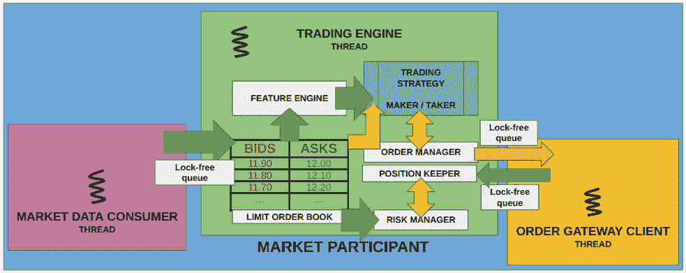

# 构建 C++交易算法的构建块

在本章中，我们将构建构成我们交易应用智能的组件。这些是交易策略将非常依赖以做出决策、发送和管理订单、跟踪和管理位置、**损益**（**PnLs**）以及管理风险的组件。交易策略不仅需要跟踪交易损益，因为目标是赚钱，而且这些组件还需要跟踪损益以决定何时停止交易（如果需要的话）。我们将学习如何从市场数据更新中计算复杂特征，根据订单执行和市场更新跟踪交易表现，在市场上发送和管理实时策略订单，以及管理市场风险。在本章中，我们将涵盖以下主题：

+   对执行做出反应和管理位置、损益和风险

+   构建特征引擎和计算复杂特征

+   使用执行、更新位置和损益

+   发送和管理订单

+   计算和管理风险

# 技术要求

本书的所有代码都可以在本书的 GitHub 仓库中找到，该仓库地址为[`github.com/PacktPublishing/Building-Low-Latency-Applications-with-CPP`](https://github.com/PacktPublishing/Building-Low-Latency-Applications-with-CPP)。本章的源代码位于该仓库的`Chapter9`目录中。

你必须阅读并理解在*第*章*设计我们的交易生态系统*中介绍的电子交易生态系统的设计，特别是*设计一个低延迟 C++交易算法框架*部分。和之前一样，我们将使用我们在*第*章*为低延迟应用构建 C++构建块*中构建的构建块。

本书源代码开发环境的规格在此展示。我们提供了这个环境的详细信息，因为本书中展示的所有 C++代码可能并不一定可移植，可能需要一些小的修改才能在你的环境中运行：

+   `Linux 5.19.0-41-generic #42~22.04.1-Ubuntu SMP PREEMPT_DYNAMIC Tue Apr 18 17:40:00 UTC 2 x86_64 x86_64` `x86_64 GNU/Linux.`

+   `g++ (Ubuntu` `11.3.0-1ubuntu1~22.04.1) 11.3.0.`

+   `cmake` `版本 3.23.2.`

+   `1.10.2.`

# 对执行做出反应和管理位置、损益和风险

我们需要构建一些基本的构建块，这些构建块将构建并支持我们的交易策略。我们在*第*章*设计我们的交易生态系统*中的*设计一个低延迟 C++交易算法框架*部分讨论了这些组件的需求。我们已经实现了一个主要组件——限价订单簿，但在这个部分，我们将构建我们需要的其余组件，即以下内容：

+   一个`FeatureEngine`，它将被用来计算驱动交易策略决策的简单和复杂特征/信号

+   一个`PositionKeeper`，它将接收执行并计算重要的指标，如头寸、损益、交易量等

+   一个`OrderManager`，它将被策略用来发送订单、管理它们并在有更新时更新这些订单

+   一个`RiskManager`来计算和检查交易策略试图承担的市场风险以及它已经实现的风险

下面的图示显示了所有这些组件的拓扑结构以及它们如何相互交互。如果您需要刷新对这些组件存在的原因、它们的目的、它们如何相互交互以及它们如何设计的记忆，请回顾*第*章*设计我们的交易生态系统*，并查看*设计低延迟 C++交易算法框架*部分的子节。



图 9.1 – 交易引擎内部的子组件

现在，让我们开始实施这些组件的工作，从下一子节的功能引擎开始。但在我们这样做之前，我们需要为`Side`枚举添加两个额外的方法，这将使我们的源代码在以后变得更加简单。这两个方法都可以在`Chapter9/common/types.h`头文件中找到。

我们将添加的第一个方法是`sideToIndex()`方法，它将`Side`值转换为可以用于索引数组的索引。这将允许我们维护由`Side`值索引的不同类型的对象数组。实现很简单——我们只需将`side`类型转换为`size_t`类型并加 1，以考虑到`Side::SELL`的值为-1，并且有效索引从 0 开始：

```cpp
  inline constexpr auto sideToIndex(Side side) noexcept {
    return static_cast<size_t>(side) + 1;
  }
```

我们还将定义一个`sideToValue()`方法，它将`Side`值转换为`Side::BUY`的 1 或`Side::SELL`的-1。这将在我们计算头寸和损益时有所帮助，我们将在本节稍后看到：

```cpp
  inline constexpr auto sideToValue(Side side) noexcept {
    return static_cast<int>(side);
  }
```

现在我们已经处理了这些额外的功能，我们可以开始计算功能引擎。

# 构建特征和计算复杂特征

在本节中，我们将构建一个功能引擎的最小版本。我们将只计算两个简单的特征——一个（市场价格）基于订单簿价格顶部和数量计算公平市场价格，另一个（激进交易量比）计算交易量与订单簿顶部数量的比较大小。我们将使用这些特征值来驱动本章后面的市场制作和流动性获取交易算法。我们构建的`FeatureEngine`类的源代码可以在 GitHub 上的`Chapter9/trading/strategy/feature_engine.h`文件中找到。我们在*第*章*设计我们的交易生态系统*中讨论了该组件的详细信息，在*设计低延迟 C++交易算法框架*部分。

## 在功能引擎中定义数据成员

首先，我们需要声明`FeatureEngine`类并在其中定义数据成员。首先，我们将包含所需的头文件并定义一个表示无效或未初始化特征值的常量哨兵值。这被称为`Feature_INVALID`，如下所示：

```cpp
#pragma once
#include "common/macros.h"
#include "common/logging.h"
using namespace Common;
namespace Trading {
  constexpr auto Feature_INVALID =
    std::numeric_limits<double>::quiet_NaN();
```

我们的`FeatureEngine`类是基础的，并且包含两个重要的`double`类型数据成员——一个用于计算和存储公平市场价格值，`mkt_price_`，另一个用于计算和存储激进交易数量比率特征值，`agg_trade_qty_ratio_`。它还存储了一个指向`Logger`对象的指针（`logger_`），用于日志记录：

```cpp
  class FeatureEngine {
  private:
    std::string time_str_;
    Common::Logger *logger_ = nullptr;
    double mkt_price_ = Feature_INVALID,
      agg_trade_qty_ratio_ = Feature_INVALID;
  };
```

接下来，我们将看看如何初始化这个类，因为我们已经用`Feature_INVALID`值初始化了两个特征变量。

## 初始化特征引擎

这个类的构造函数接受一个`Logger`对象并初始化`logger_`数据成员——仅此而已：

```cpp
    FeatureEngine(Common::Logger *logger)
        : logger_(logger) {
    }
```

在这里，我们将展示两个获取方法——`getMktPrice()`和`getAggTradeQtyRatio()`——以获取`FeatureEngine`类负责计算的两个特征值：

```cpp
    auto getMktPrice() const noexcept {
      return mkt_price_;
    }
    auto getAggTradeQtyRatio() const noexcept {
      return agg_trade_qty_ratio_;
    }
```

在接下来的两个子节中，我们将看到这个组件如何处理订单簿更新和交易事件，并更新特征值。

## 在订单簿变化上计算特征

`FeatureEngine`类期望在订单簿更新时调用`onOrderBookUpdate()`方法。首先，它使用`MarketOrderBook::getBBO()`提取 BBO。提醒一下，如果它们有效，则`mkt_price_`值。公平市场价格被公式化为订单簿数量加权价格，`(bid_price * ask_qty + ask_price * bid_qty) / (bid_qty + ask_qty)`。请注意，这只是公平市场价格的一个单一公式；在特征工程中要记住的重要事情是没有单一的正确公式。鼓励您制定一个公平市场价格或其他任何您希望在将来使用的特征值的版本。我们在这里使用的公式试图在买方订单多于卖方订单时将公平市场价格移向出价，在卖方订单多于买方订单时将其移向要价：

```cpp
    auto onOrderBookUpdate(TickerId ticker_id, Price price,
      Side side, MarketOrderBook* book) noexcept -> void {
      const auto bbo = book->getBBO();
      if(LIKELY(bbo->bid_price_ != Price_INVALID && bbo-
        >ask_price_ != Price_INVALID)) {
        mkt_price_ = (bbo->bid_price_ * bbo->ask_qty_ +
          bbo->ask_price_ * bbo->bid_qty_) /
            static_cast<double>(bbo->bid_qty_ + bbo->
              ask_qty_);
      }
      logger_->log("%:% %() % ticker:% price:% side:% mkt-
        price:% agg-trade-ratio:%\n", __FILE__, __LINE__,
          __FUNCTION__,
                   Common::getCurrentTimeStr(&time_str_),
                     ticker_id, Common::priceToString
                       (price).c_str(),
                   Common::sideToString(side).c_str(),
                     mkt_price_, agg_trade_qty_ratio_);
    }
```

下一个子节将计算另一个特征，我们将称之为激进交易数量比率，用于将交易数量作为订单簿价格水平数量的分数来计算。

## 在交易事件上计算特征

`FeatureEngine` 预期在市场数据流中出现交易事件时调用 `onTradeUpdate()` 方法。正如我们之前所看到的，它获取 BBO 并检查价格是否有效，然后计算 `agg_trade_qty_ratio_` 特征，该特征是交易量与交易所攻击的 BBO 数量的比率。正如我们之前提到的关于该特征，没有单一正确的特征公式 – 这只是我们现在使用的公式；希望你在未来会添加自己的公式。这个公式试图衡量交易攻击者相对于攻击者交易的 BBO 侧可用的流动性的大小。我们只是试图通过我们计算的这个特征量化交易压力。正如我们之前提到的，还有许多其他可能的公式：

```cpp
    auto onTradeUpdate(const Exchange::MEMarketUpdate
      *market_update, MarketOrderBook* book) noexcept -> void {
      const auto bbo = book->getBBO();
      if(LIKELY(bbo->bid_price_ != Price_INVALID && bbo->
        ask_price_ != Price_INVALID)) {
        agg_trade_qty_ratio_ = static_cast<double>
          (market_update->qty_) / (market_update->side_ ==
            Side::BUY ? bbo->ask_qty_ : bbo->bid_qty_);
      }
      logger_->log("%:% %() % % mkt-price:% agg-trade-ratio
        :%\n", __FILE__, __LINE__, __FUNCTION__,
                   Common::getCurrentTimeStr(&time_str_),
                   market_update->toString().c_str(),
                     mkt_price_, agg_trade_qty_ratio_);
    }
```

那就是本书中 `FeatureEngine` 的全部实现。在下一节中，我们将学习如何处理执行情况，并使用这些信息来更新头寸和 PnL。

# 使用执行情况更新头寸和 PnL

现在，我们将构建一个 `PositionKeeper` 类，该类将负责处理策略订单的执行情况，并计算和跟踪头寸和 PnL。该组件被策略以及风险管理者用于计算不同目的的头寸和 PnL。`PositionKeeper` 类的所有源代码位于 GitHub 上的 `Chapter9/trading/strategy/position_keeper.h` 文件中。在我们构建管理所有交易工具头寸的 `PositionKeeper` 类之前，我们需要构建一个也存在于同一源文件中的 `PositionInfo` 结构体。`PositionInfo` 结构体是用于管理单个交易工具的头寸和 PnL 的低级结构体；我们将在接下来的几个小节中更详细地介绍它。我们在 *第* 章 *设计我们的交易生态系统* 的 *设计低延迟 C++交易算法框架* 部分中讨论了该组件的细节。

## 在 `PositionInfo` 中声明数据成员

首先，我们必须指定 `position_keeper.h` 文件所需的 `include` 文件，如下所示：

```cpp
#pragma once
#include "common/macros.h"
#include "common/types.h"
#include "common/logging.h"
#include "exchange/order_server/client_response.h"
#include "market_order_book.h"
using namespace Common;
```

`PositionInfo` 结构体内的数据成员在源代码中呈现。重要的数据成员如下：

+   一个 `position_` 变量，其类型为 `int32_t`，用于表示当前头寸。这可以是正数、负数或 0。

+   三个 `double` 类型的值 – `real_pnl_`、`unreal_pnl_` 和 `total_pnl_` – 分别用于跟踪已关闭头寸的已实现或已关闭的 PnL（`real_pnl_`）、当前开放头寸的未实现或开放 PnL（`unreal_pnl_`），以及总 PnL，这是两个值的总和（`total_pnl_`）。已实现 PnL 仅在发生额外订单执行时才会改变；如果存在非零头寸且市场价格发生变化，未实现 PnL 即使没有订单执行也可能改变。

+   一个足够大的`std::array`，其大小足以容纳买方和卖方的条目。这个数组将使用`sideToIndex(Side::BUY)`和`sideToIndex(Side::SELL)`值进行索引。这个`open_vwap_` `std::array`变量跟踪在存在开放多头（正）或空头（负）持仓时每侧的价格和执行数量的乘积。我们需要这个来通过比较开放多头或空头持仓的**加权平均价格**（**VWAP**）与当前市场价格来计算未实现盈亏。

+   一个`volume_`变量，其类型为`Qty`，用于跟踪已执行的总数量。

+   一个指向名为`bbo_`的`BBO`对象的`const`指针变量，该变量将在市场更新时用于获取更新的订单簿顶端价格：

```cpp
namespace Trading {
  struct PositionInfo {
    int32_t position_ = 0;
    double real_pnl_ = 0, unreal_pnl_ = 0, total_pnl_ = 0;
    std::array<double, sideToIndex(Side::MAX) + 1>
      open_vwap_;
    Qty volume_ = 0;
    const BBO *bbo_ = nullptr;
```

我们还将为此结构添加一个简单的`toString()`方法来将此结构的实例转换为字符串：

```cpp
    auto toString() const {
       std::stringstream ss;
       ss << "Position{"
          << "pos:" << position_
          << " u-pnl:" << unreal_pnl_
          << " r-pnl:" << real_pnl_
          << " t-pnl:" << total_pnl_
          << " vol:" << qtyToString(volume_)
          << " vwaps:[" << (position_ ? open_vwap_
            .at(sideToIndex(Side::BUY)) / std::abs
              (position_) : 0)
          << "X" << (position_ ? open_vwap_
            .at(sideToIndex(Side::SELL)) / std::abs
               (position_) : 0)
         << "] "
         << (bbo_ ? bbo_->toString() : "") << "}";
       return ss.str();
    }
```

接下来，我们需要处理订单执行情况，并根据这些执行情况更新持仓和盈亏（PnL）。

## 在`PositionInfo`中处理订单执行

当一个交易策略的订单被执行时，`PositionKeeper`需要更新跟踪执行交易工具的持仓和盈亏。它是通过向`PositionInfo::addFill()`方法提供与订单执行对应的`MEClientResponse`消息来做到这一点的。我们将在本小节中构建它。

在我们查看`PositionInfo::addFill()`方法的实现源代码之前，我们将查看一个示例，说明如何更新实现和未实现盈亏的算法。这将帮助你轻松理解实现源代码。我们将跟踪在几个假设的执行过程中假设交易工具的不同变量的演变。在我们的表格中，我们将显示以下变量作为列：

+   **position – old**：这是处理当前执行消息之前的持仓。

+   **position – new**：这将是在处理当前执行消息后的新持仓。

+   **open_vwap – BUY**：这是仅针对买入执行的执行价格和执行数量的乘积之和。

+   **open_vwap – SELL**：这是仅针对卖出执行的执行价格和执行数量的乘积之和。

+   **VWAP – BUY**：这是当前多头/正持仓的实际 VWAP，以价格单位表示，而不是价格乘以数量。

+   **VWAP – SELL**：这是当前空头/负持仓的实际 VWAP，以价格单位表示，而不是价格乘以数量。

+   **PnL – real**：这是处理此执行后的实现盈亏。

+   **PnL – unreal**：这是处理此执行后的开放持仓的未实现盈亏。

假设我们得到一个以 100.0 的价格买入 10 个单位的执行，我们必须更新`open_vwap`、`BUY`侧的`VWAP`以及新的持仓，如下所示。目前不需要对未实现盈亏进行更改：

| **position** | **open_vwap** | **VWAP** | **PnL** |
| --- | --- | --- | --- |
| **旧** | **新** | **BUY** | **SELL** | **BUY** | **SELL** | **real** | **unreal** |
| 0 | 10 | 1000.0 | 0.0 | 100.0 | 0.0 | 0.0 | 0.0 |

假设我们再次以 90.0 的价格执行买入 10 的操作。我们的旧仓位是 10，新仓位将是 20。`BUY`（买入）的`open_vwap`属性现在将 10 * 90 加到之前的 1,000 上，变成 1,900。开放多头/正仓位的`VWAP`列是 95，可以通过将 1,900（`BUY` `open_vwap`）除以 20（新仓位）来计算。我们通过使用 95 的`VWAP`和最新的执行价格 90，将-5 的差额乘以 20 的仓位来计算未实现损益，得到-100。由于我们的多头/正仓位的`VWAP`高于当前市场价格（由最新执行价格表示），我们有一个负的未实现损益：

| **仓位** | **open_vwap** | **VWAP** | **PnL** |
| --- | --- | --- | --- |
| **旧** | **新** | **BUY** | **SELL** | **BUY** | **SELL** | **real** | **unreal** |
| 10 | 20 | 1900.0 | 0.0 | 95.0 | 0.0 | 0.0 | -100.0 |

现在，假设我们执行了一次以 92 的价格卖出 10 的卖出操作。我们的旧仓位从 20 减少到 10。由于这是一次卖出操作，我们的`open_vwap`和`VWAP`在`BUY`（买入）方面没有变化。由于我们关闭了 10 个多头/正仓位，我们将有一些已实现损益（PnL），而剩余的 10 个多头/正仓位将基于这次最新执行的执行价格有一些未实现损益。已实现损益是通过使用 92 的卖出执行价格、多头/正仓位的`VWAP`属性（95）以及 10 的执行数量来计算的，得到已实现损益为(92 - 95) * 10 = -30。在这种情况下，未实现损益也是相同的，因为还剩下多头/正仓位 10：

| **仓位** | **open_vwap** | **VWAP** | **PnL** |
| --- | --- | --- | --- |
| **旧** | **新** | **BUY** | **SELL** | **BUY** | **SELL** | **real** | **unreal** |
| 20 | 10 | 1900.0 | 0.0 | 95.0 | 0.0 | -30.0 | -30.0 |

现在，假设我们收到另一个以 97 的价格卖出 20 的卖出执行。这将导致我们的仓位从 10 翻转到-10（注意，我们将`open_vwap`和`VWAP`的`BUY`（买入）方面设置为 0）。由于-10 的仓位和 97 的执行价格，`SELL`（卖出）方面的`open_vwap`属性变为 970。我们关闭了之前的 10 仓位，该仓位在 95 的`VWAP`下以 97 的价格卖出。由于我们以高于我们多头/正仓位`VWAP`属性的价格卖出，我们获得了(97 - 95) * 10 = 20 的利润，加上之前的已实现损益-30，最终得到`realized`（已实现）损益为-10。这里的未实现损益为 0，因为 97 的`VWAP`与当前的执行价格 97 相同：

| **仓位** | **open_vwap** | **VWAP** | **PnL** |
| --- | --- | --- | --- |
| **旧** | **新** | **BUY** | **SELL** | **BUY** | **SELL** | **real** | **unreal** |
| 10 | -10 | 0.0 | 970.0 | 0.0 | 97.0 | -10.0 | 0.0 |

假设我们得到另一个以 94 价格卖出 20 的卖出执行。在这里，空头/负头寸从 -10 增加到 -30。`open_vwap` 属性在 `SELL` 方面通过将 (20 * 94) 加到之前的值 970 上进行更新，得到 2,850。我们的空头头寸的 `VWAP` 属性更新为 95，通过将 `open_vwap` 属性 2,850 除以头寸 30 得到 95。由于头寸增加且没有减少或关闭，实际 PnL 没有变化。未实现 PnL 使用这次新执行上的执行价格 94，将其与 `VWAP` 属性 95 进行比较，并使用新的头寸 -30 得到 (95 - 94) * 30 = 30：

| **位置** | **开盘 VWAP** | **VWAP** | **PnL** |
| --- | --- | --- | --- |
| **旧值** | **新值** | **买入** | **卖出** | **买入** | **卖出** | **实际** | **未实现** |
| -10 | -30 | 0.0 | 2850.0 | 0.0 | 95.0 | -10.0 | 30.0 |

假设还有一次以 90 价格卖出 10 的卖出执行。空头/负头寸从 -30 增加到 -40。我们将新执行的价格和数量乘积（10 * 90）加到之前的 `open_vwap` 属性的 `SELL` 2,850 上，得到 3,750。实际 `VWAP` 的空头头寸从 95 变为 93.75，这是通过将这个 3,750 的值除以新的头寸 40 得到的。实际 PnL 没有变化，因为头寸增加了，但没有减少或关闭。未实现 PnL 使用 (93.75 - 90) * 40 = 150 进行更新：

| **位置** | **开盘 VWAP** | **VWAP** | **PnL** |
| --- | --- | --- | --- |
| **旧值** | **新值** | **买入** | **卖出** | **买入** | **卖出** | **实际** | **未实现** |
| -30 | -40 | 0.0 | 3750.0 | 0.0 | 93.75 | -10.0 | 150.0 |

最后，假设我们收到一个以 88 价格买入 40 的买入执行。这次执行将平掉我们的空头/负头寸 -40，因此新的头寸将为 0。未实现 PnL 将为 0，由于没有开放头寸，`open_vwap` 和 `VWAP` 属性对于双方都将为 0。实际 PnL 使用之前的 `VWAP` 属性、执行价格和 40 的头寸进行更新，所以 (93.75 - 88) * 40 = 230。这加到之前实现的 PnL -10 上，得到最终实现的 PnL 为 220：

| **位置** | **开盘 VWAP** | **VWAP** | **PnL** |
| --- | --- | --- | --- |
| **旧值** | **新值** | **买入** | **卖出** | **买入** | **卖出** | **实际** | **未实现** |
| -40 | 0 | 0.0 | 0.0 | 0.0 | 0.0 | 220.0 | 0.0 |

现在，我们可以继续讨论这个算法的实现细节。

我们必须做的第一件事是初始化几个局部变量。在这里，`old_position` 变量保存更新前的 `current position_` 值。`side_index` 和 `opp_side_index` 使用 `sideToIndex()` 方法找到 `open_vwap_` 数组中对应执行方向和执行方向相反方向的索引。我们还必须初始化一个 `side_value` 变量，对于买入执行将是 +1，对于卖出执行将是 -1：

```cpp
    auto addFill(const Exchange::MEClientResponse
      *client_response, Logger *logger) noexcept {
      const auto old_position = position_;
      const auto side_index = sideToIndex(client_response->
        side_);
      const auto opp_side_index = sideToIndex
        (client_response->side_ == Side::BUY ? Side::SELL :
          Side::BUY);
      const auto side_value = sideToValue(client_response->
        side_);
```

现在，我们必须使用这个响应中的执行数量（`exec_qty_`）和我们初始化的`side_value`变量来更新`position_`变量。我们还必须通过将新的执行数量添加到其中来更新`volume_`成员。当我们收到一个买进订单的执行时，我们的头寸会增加；相反，当我们收到一个卖出订单的执行时，我们的头寸会减少。当我们的头寸为正，也就是所谓的多头头寸时，价格上涨时我们获利，价格下跌时我们亏损。当我们的头寸为负，也就是所谓的空头头寸时，价格下跌时我们获利，价格上涨时我们亏损：

```cpp
      position_ += client_response->exec_qty_ * side_value;
      volume_ += client_response->exec_qty_;
```

对于我们来说，下一个重要的步骤是更新`open_vwap_`条目的`std::array`变量。我们将检查在此执行之前我们是否处于平衡状态（头寸为 0）并使用此执行开立新头寸，或者如果我们已经有一个开立的头寸并且我们得到了增加该头寸的执行。在这种情况下，我们将简单地使用`side_index`来索引正确的方向来更新`open_vwap_`变量。由于`open_vwap_`跟踪执行价格和在该价格下执行的数量乘积，我们可以简单地乘以此执行的价格和执行数量，并将其添加到现有的总和，如下所示：

```cpp
      if (old_position * sideToValue(client_response->
        side_) >= 0) { // opened / increased position.
        open_vwap_[side_index] += (client_response->price_
          * client_response->exec_qty_);
      }
```

现在，我们需要处理我们之前已经有一个未平仓头寸的情况。这次最近的执行会减少或平掉头寸。在这种情况下，我们需要使用执行方向的相反方向的`open_vwap_`条目来更新已实现 PnL（`real_pnl_`）。有一点需要理解的是，只有当未平仓头寸减少或关闭时，已实现 PnL 才会更新，因为在这种情况下，我们已经买进和卖出了一定数量的资产。另一种思考方式是，我们可以将部分买进数量与部分卖出数量相匹配，从而创建一对买进和卖出交易。在这种情况下，我们已经平仓了至少部分头寸。在前一种情况下，即我们要么开了一个新头寸，要么增加了一个已经开头的头寸，我们没有一对买进和卖出交易可以匹配，因此我们不需要更新已实现 PnL。

首先，我们将计算一个`opp_side_vwap`值，这是另一侧所有执行的加权平均价格，使用`open_vwap_`条目为`opp_side_index`，并使用此执行之前的`old_position`的绝对值来归一化。记住，`open_vwap_`变量命名不佳；它跟踪执行价格和数量的乘积，而不仅仅是价格，所以通过除以由`old_position`表示的数量来得到实际的 VWAP。然后，我们将使用在`opp_side_vwap`中计算的 VWAP 和新的`position_`值的绝对值来更新`opp_side_index`的`open_vwap_`条目。

我们可以通过找到执行数量（`exec_qty_`）的最小数量值和`old_position`的绝对值来更新`real_pnl_`值。我们必须将这个值乘以当前执行消息的价格（`price_`）和`opp_side_vwap`之间的差值。最后，我们需要将这个乘积乘以`opp_side_value`来考虑是否盈利（以低于卖出 VWAP 的价格买入或以高于买入 VWAP 的价格卖出）或亏损（以高于卖出 VWAP 的价格买入或以低于买入 VWAP 的价格卖出）：

```cpp
        else { // decreased position.
        const auto opp_side_vwap = open_vwap_
          [opp_side_index] / std::abs(old_position);
        open_vwap_[opp_side_index] = opp_side_vwap * std::
          abs(position_);
        real_pnl_ += std::min
          (static_cast<int32_t>(client_response->
            exec_qty_), std::abs(old_position)) *
                     (opp_side_vwap - client_response->
                        price_) * sideToValue
                          (client_response->side_);
```

如果这次执行导致头寸翻转，即从多头头寸变为空头头寸或反之，我们需要处理一个边缘情况。这种情况可能发生在，例如，我们持有一定数量的多头/正值头寸，并收到一个数量大于该头寸的卖出执行。相反，这也可能发生在我们持有一定数量的空头/负值头寸，并收到一个数量大于该头寸的买入执行。在这些情况中，我们从一个正/多头头寸变为负/空头头寸，或者从一个负/空头头寸变为正/多头头寸。在这种情况下，我们可以简单地重置对应于相反侧的`open_vwap_`值为 0，并重置执行侧（以及因此新头寸侧）的`open_vwap_`值，使其成为最新执行价格和当前`position_`绝对值的乘积：

```cpp
        if (position_ * old_position < 0) { // flipped
          position to opposite sign.
          open_vwap_[side_index] = (client_response->price_
            * std::abs(position_));
          open_vwap_[opp_side_index] = 0;
        }
      }
```

最后，我们将通过更新未实现损益（`unreal_pnl_`）值来结束`PositionInfo::addFill()`方法的封装。我们现在处于平衡状态（`position_ == 0`）的情况很简单——我们重置两边的`open_vwap_`变量并将`unreal_pnl_`设置为 0，因为没有开放头寸意味着没有`unreal_pnl_`：

```cpp
      if (!position_) { // flat
        open_vwap_[sideToIndex(Side::BUY)] = open_vwap_
          [sideToIndex(Side::SELL)] = 0;
        unreal_pnl_ = 0;
      }
```

如果在此执行后我们仍然有一个开放的`position_`，那么我们可以通过将`position_`的绝对值乘以当前执行价格与从`position_`侧的`open_vwap_`条目计算出的 VWAP 之间的差值来计算`unreal_pnl_`值：

```cpp
        else {
        if (position_ > 0)
          unreal_pnl_ =
              (client_response->price_ - open_vwap_
                [sideToIndex(Side::BUY)] / std::abs
                  (position_)) *
              std::abs(position_);
        else
          unreal_pnl_ =
              (open_vwap_[sideToIndex(Side::SELL)] / std::
                abs(position_) - client_response->price_) *
              std::abs(position_);
      }
```

最后，`total_pnl_`只是`real_pnl_`和`unreal_pnl_`的总和，如前所述：

```cpp
      total_pnl_ = unreal_pnl_ + real_pnl_;
      std::string time_str;
      logger->log("%:% %() % % %\n", __FILE__, __LINE__,
        __FUNCTION__, Common::getCurrentTimeStr(&time_str),
                  toString(), client_response->
                    toString().c_str());
    }
```

我们需要添加到`PositionInfo`中的最后一块功能是处理市场价格的变动以及更新任何开放头寸的未实现损益（PnL）。我们将在下一小节中探讨这个功能。

## 处理`PositionInfo`中的订单簿变动

当市场更新导致我们构建的订单簿发生变化时，我们需要更新未实现和总盈亏（PnL）值。`PositionInfo::updateBBO()` 方法由 `PositionKeeper` 类在收到市场更新时调用，这会导致订单簿发生变化。我们提供与更新过的交易工具对应的 `BBO` 对象，在 `updateBBO()` 方法中。我们将此方法中提供的 `bbo` 参数保存在我们的 `PositionInfo` 结构体中的 `bbo_` 数据成员中。此方法仅在 `position_` 不为零且提供的 BBO 上的要价和卖价有效时才有意义。这是我们首先需要检查的事项：

```cpp
    auto updateBBO(const BBO *bbo, Logger *logger) noexcept {
      std::string time_str;
      bbo_ = bbo;
      if (position_ && bbo->bid_price_ != Price_INVALID &&
        bbo->ask_price_ != Price_INVALID) {
```

如果我们需要更新未实现 PnL，我们可以使用 BBO 价格的中值，我们可以计算并保存在 `mid_price` 变量中，如下所示：

```cpp
        const auto mid_price = (bbo->bid_price_ + bbo->
          ask_price_) * 0.5;
```

之后，我们可以使用之前子节中看到的相同逻辑来更新 `unreal_pnl_`，只是我们使用 `mid_price` 值而不是执行价格。让我们解释一下为什么即使我们没有额外的执行，我们也要更新未实现 PnL。假设我们有一个从假设价格为 100 的执行中获得的多头头寸。在这个时候，初始未实现 PnL 是 0。让我们还假设，在未来，市场价格（由我们的 `mid_price` 变量表示）上涨到 110。在这种情况下，我们的实现 PnL 没有改变，因为我们没有执行任何卖出订单。然而，我们的未实现 PnL 增加了，因为我们如果决定平仓多头头寸，我们会以大约等于 `mid_price` 的价格获得执行。这就是为什么我们在市场价格变化时更新未实现 PnL，即使没有执行额外的订单。此外，请注意，实现 PnL 捕获买卖执行对的 PnL，因此在这里不需要更新，因为没有额外的执行：

```cpp
        if (position_ > 0)
          unreal_pnl_ =
              (mid_price – open_vwap_
                [sideToIndex(Side::BUY)] / std::
                  abs(position_)) *
              std::abs(position_);
        else
          unreal_pnl_ =
              (open_vwap_[sideToIndex(Side::SELL)] / std::
                 abs(position_) – mid_price) *
              std::abs(position_);
```

最后，我们必须更新 `total_pnl_` 数据成员，并在它自上次更改以来发生变化时记录它：

```cpp
        const auto old_total_pnl = total_pnl_;
        total_pnl_ = unreal_pnl_ + real_pnl_;
        if (total_pnl_ != old_total_pnl)
          logger->log("%:% %() % % %\n", __FILE__, __LINE__
            , __FUNCTION__, Common::
               getCurrentTimeStr(&time_str),
                      toString(), bbo_->toString());
      }
    }
```

这就完成了我们对 `PositionInfo` 结构体所需的所有功能。我们现在将讨论 `PositionKeeper` 类，我们将使用它来管理整个交易引擎中所有交易工具的头寸和 PnL。

## 设计 PositionKeeper

`PositionKeeper` 类管理交易引擎中所有交易工具的头寸和 PnL。`PositionKeeper` 类包含一个 `std::array` 的 `PositionInfo` 对象，并且足够大，可以容纳 `ME_MAX_TICKERS` 数量的对象：

```cpp
  class PositionKeeper {
  private:
    std::string time_str_;
    Common::Logger *logger_ = nullptr;
    std::array<PositionInfo, ME_MAX_TICKERS>
      ticker_position_;
  };
```

我们将添加一个获取并返回提供 `TickerId` 的 `PositionInfo` 实例的获取器方法 `getPositionInfo()`：

```cpp
    auto getPositionInfo(TickerId ticker_id) const noexcept {
      return &(ticker_position_.at(ticker_id));
    }
```

我们还将添加一个简单的 `toString()` 方法，我们将在稍后用于日志记录：

```cpp
    auto toString() const {
      double total_pnl = 0;
      Qty total_vol = 0;
      std::stringstream ss;
      for(TickerId i = 0; i < ticker_position_.size(); ++i) {
        ss << "TickerId:" << tickerIdToString(i) << " " <<
          ticker_position_.at(i).toString() << "\n";
        total_pnl += ticker_position_.at(i).total_pnl_;
        total_vol += ticker_position_.at(i).volume_;
      }
      ss << "Total PnL:" << total_pnl << " Vol:" <<
        total_vol << "\n";
      return ss.str();
    }
```

初始化此类对象很简单，我们将在下一节中讨论。

## 初始化 PositionKeeper

`PositionKeeper` 构造函数接受一个 `Logger` 对象，并用该参数初始化 `logger_` 数据成员，如下所示：

```cpp
    PositionKeeper(Common::Logger *logger)
        : logger_(logger) {
    }
```

接下来，我们将看到如何在 `PositionKeeper` 类中处理订单执行和 `BBO` 的变化，并将其转发到正确的 `PositionInfo` 对象。

## 在 `PositionKeeper` 中处理订单执行和市场更新

`PositionKeeper::addFill()` 方法处理订单执行，其实现很简单。它只是简单地调用正确的 `PositionInfo::addFill()` 方法在 `TickerId` 的 `PositionInfo` 对象上，如下所示：

```cpp
    auto addFill(const Exchange::MEClientResponse
      *client_response) noexcept {
      ticker_position_.at(client_response->
        ticker_id_).addFill(client_response, logger_);
    }
```

`PositionKeeper::updateBBO()` 方法处理由于市场更新和订单簿中相应的变化而导致的 `BBO` 变化。它还简单地调用正确的 `PositionInfo::updateBBO()` 方法在 `TickerId` 的 `PositionInfo` 对象上，如下所示：

```cpp
    auto updateBBO(TickerId ticker_id, const BBO *bbo)
      noexcept {
      ticker_position_.at(ticker_id).updateBBO(bbo,
        logger_);
    }
```

这就完成了我们 `PositionKeeper` 类中所需的所有设计和实现。在下一节中，我们将构建一个订单管理类，该类将被交易策略用于在更高层次上管理它们的订单。

# 发送和管理订单

在 *第* 章 *设计我们的交易生态系统* 中，我们讨论了交易系统订单管理组件（*设计低延迟 C++交易算法框架* 部分）的目的。在本节中，我们将实现一个 `OrderManager` 类来封装这个类内部的订单管理逻辑，从而使交易策略能够轻松管理它们的订单。在我们构建 `OrderManager` 类本身之前，我们需要定义一个基本构建块，称为 `OMOrder` 结构。

## 定义 OMOrder 结构及其相关类型

在本节的第一小节中，我们将定义一些将在 `OrderManager` 类及其子组件中使用的枚举和类型。本小节的所有源代码都在 GitHub 上的 `Chapter9/trading/strategy/om_order.h` 源文件中。

首先，我们必须提供 `om_order.h` 文件所需的 `include` 文件：

```cpp
#pragma once
#include <array>
#include <sstream>
#include "common/types.h"
using namespace Common;
namespace Trading {
```

现在，我们必须声明一个 `OMOrderState` 枚举，它将用于跟踪订单管理器中策略订单（`OMOrder`）的状态。这些状态代表 `OMOrder` 的状态，如下所述：

+   `INVALID` 状态表示无效的订单状态。

+   `PENDING_NEW` 状态表示由 `OrderManager` 发送的新订单尚未被电子交易交易所接受。

+   当我们收到交易所的响应以表示接受时，订单从 `PENDING_NEW` 状态变为 `LIVE` 状态。

+   与 `PENDING_NEW` 状态类似，`PENDING_CANCEL` 状态表示订单已被发送至交易所进行取消，但交易所尚未处理或尚未收到响应。

+   `DEAD` 状态表示不存在的订单——它可能尚未发送或已完全执行或成功取消：

```cpp
  enum class OMOrderState : int8_t {
    INVALID = 0,
    PENDING_NEW = 1,
    LIVE = 2,
    PENDING_CANCEL = 3,
    DEAD = 4
  };
```

我们还必须添加一个方法，将`OMOrderState`枚举转换为字符串，用于日志记录，如下所示：

```cpp
  inline auto OMOrderStateToString(OMOrderState side) ->
    std::string {
    switch (side) {
      case OMOrderState::PENDING_NEW:
        return "PENDING_NEW";
      case OMOrderState::LIVE:
        return "LIVE";
      case OMOrderState::PENDING_CANCEL:
        return "PENDING_CANCEL";
      case OMOrderState::DEAD:
        return "DEAD";
      case OMOrderState::INVALID:
        return "INVALID";
    }
    return "UNKNOWN";
  }
```

现在，我们可以定义`OMOrder`结构，它具有以下关键字段：

+   一个`ticker_id_`变量，其类型为`TickerId`，用于表示此订单是为哪个交易工具

+   一个`order_id_`变量，其类型为`OrderId`，这是分配给此订单对象的唯一订单 ID

+   一个`side_`变量，用于存储此订单的`Side`属性

+   订单的`Price`存储在`price_`数据成员中

+   此订单的实时或请求的`Qty`存储在`qty_`变量中

+   一个`order_state_`变量，其类型为`OMOrderState`，这是我们之前定义的，用于表示`OMOrder`的当前状态：

```cpp
  struct OMOrder {
    TickerId ticker_id_ = TickerId_INVALID;
    OrderId order_id_ = OrderId_INVALID;
    Side side_ = Side::INVALID;
    Price price_ = Price_INVALID;
    Qty qty_ = Qty_INVALID;
    OMOrderState order_state_ = OMOrderState::INVALID;
```

我们还必须添加一个`toString()`方法，将`OMOrder`对象转换为字符串，用于日志记录：

```cpp
    auto toString() const {
      std::stringstream ss;
      ss << "OMOrder" << "["
         << "tid:" << tickerIdToString(ticker_id_) << " "
         << "oid:" << orderIdToString(order_id_) << " "
         << "side:" << sideToString(side_) << " "
         << "price:" << priceToString(price_) << " "
         << "qty:" << qtyToString(qty_) << " "
         << "state:" << OMOrderStateToString(order_state_)
         << "]";
      return ss.str();
    }
  };
```

在这里，我们定义一个`OMOrderSideHashMap`类型定义，表示`OMOrder`对象的`std::array`，并指示此数组的容量足够大，可以容纳买方和卖方的条目。`OMOrderSideHashMap`类型的对象将通过`sideToIndex(Side::BUY)`和`sideToIndex(Side::SELL)`索引进行索引：

```cpp
  typedef std::array<OMOrder, sideToIndex(Side::MAX) + 1>
    OMOrderSideHashMap;
```

我们还必须定义一个`OMOrderTickerSideHashMap`，它只是另一个足够大的`std::array`，可以容纳所有交易工具——即`ME_MAX_TICKERS`大小：

```cpp
  typedef std::array<OMOrderSideHashMap, ME_MAX_TICKERS>
    OMOrderTickerSideHashMap;
```

现在，我们可以构建订单管理器类，该类用于管理交易策略的`OMOrder`对象。

## 设计 OrderManager 类

我们简化的订单管理器将代表交易策略管理`OMOrder`对象。为了保持简单，我们的`OrderManager`类将允许最多在买方和卖方各有一个订单。我们将在本节中查看此实现的详细信息。`OrderManager`类的所有代码都可以在`Chapter9/trading/strategy/order_manager.h`和`Chapter9/trading/strategy/order_manager.cpp`源文件中找到。

## 定义 OrderManager 中的数据成员

我们需要定义属于我们`OrderManager`类的数据成员。但在我们这样做之前，在下面的代码块中，我们提供了需要在`order_manager.h`源文件中包含的头文件。我们还必须声明`TradeEngine`类，因为我们将在本类中引用它，但想避免循环依赖问题：

```cpp
#pragma once
#include "common/macros.h"
#include "common/logging.h"
#include "exchange/order_server/client_response.h"
#include "om_order.h"
#include "risk_manager.h"
using namespace Common;
namespace Trading {
  class TradeEngine;
```

现在，我们可以在`OrderManager`类中设计内部数据成员。关键成员如下：

+   一个`trade_engine_`变量。这是一个指向`TradeEngine`对象的指针。我们将使用它来存储使用此订单管理器的父`TradeEngine`实例。

+   存储在`risk_manager_`成员变量中的`RiskManager`对象的常量引用。这将用于执行*交易前*风险检查——即在新订单发送到交易所之前执行的风险检查。

+   一个`ticker_side_order_`变量，其类型为`OMOrderTickerSideHashMap`，用于保存每个交易工具的（一个买入和一个卖出）`OMOrder`对象对。这将被用作一个哈希表，首先按我们想要发送订单的仪器的`TickerId`值索引，然后按`sideToIndex(Side::BUY)`或`sideToIndex(Side::SELL)`值索引来管理买入或卖出订单。

+   从`1`开始的新的唯一订单 ID，我们将使用简单的`next_order_id_`变量（`OrderId`类型）来生成：

```cpp
  class OrderManager {
  private:
    TradeEngine *trade_engine_ = nullptr;
    const RiskManager& risk_manager_;
    std::string time_str_;
    Common::Logger *logger_ = nullptr;
    OMOrderTickerSideHashMap ticker_side_order_;
    OrderId next_order_id_ = 1;
  };
}
```

那就是`OrderManager`类内部的所有数据。在下一小节中，我们将学习如何初始化这些成员以及`OrderManager`类本身。

## 初始化 OrderManager

初始化`OrderManager`很简单。除了在类定义本身中初始化的内容外，我们还必须初始化`trade_engine_`、`risk_manager_`和`logger_`数据成员，我们期望它们通过构造函数参数传递：

```cpp
    OrderManager(Common::Logger *logger, TradeEngine
      *trade_engine, RiskManager& risk_manager)
        : trade_engine_(trade_engine),
          risk_manager_(risk_manager), logger_(logger) {
    }
```

如此所示，我们必须添加一个简单的便利函数，我们可以在我们的`OrderManager`实现中使用它，称为`getOMOrderSideHashMap()`。这个函数简单地返回提供的`TickerId`的`OMOrderSideHashMap`实例：

```cpp
    auto getOMOrderSideHashMap(TickerId ticker_id) const {
      return &(ticker_side_order_.at(ticker_id));
    }
```

接下来，我们可以继续到`OrderManager`中的一个重要任务——发送新订单。

## 从 OrderManager 发送新订单

`OrderManager::newOrder()`方法是我们订单管理类中的底层方法。它需要一个指向`OMOrder`对象的指针，该对象将发送这个新订单。它还需要设置新发送的订单上的`TickerId`、`Price`、`Side`和`Qty`属性：

```cpp
  auto OrderManager::newOrder(OMOrder *order, TickerId
    ticker_id, Price price, Side side, Qty qty) noexcept -> void {
```

它创建一个`ClientRequestType::NEW`类型的`MEClientRequest`结构，并填充通过参数传递的属性，将`OrderId`设置为`next_order_id_`，将`ClientId`设置为`TradeEngine`的客户 ID，这可以通过调用`clientId()`方法获得。它还调用`TradeEngine::sendClientRequest()`并提供它刚刚初始化的`MEClientRequest`对象（`new_request`）：

```cpp
    const Exchange::MEClientRequest
      new_request{Exchange::ClientRequestType::NEW,
        trade_engine_->clientId(), ticker_id,
         next_order_id_, side, price, qty};
    trade_engine_->sendClientRequest(&new_request);
```

最后，它更新在方法参数中提供的`OMOrder`对象指针，并将新发送的订单上设置的属性分配给它。请注意，此`OMOrder`的状态被设置为`OMOrderState::PENDING_NEW`，因为它将很快被发送出去，但只有在交易所接受它并且我们收到响应后才会生效。它还增加`next_order_id_`变量以保持任何可能稍后发送的新订单的唯一性：

```cpp
    *order = {ticker_id, next_order_id_, side, price, qty,
      OMOrderState::PENDING_NEW};
    ++next_order_id_;
    logger_->log("%:% %() % Sent new order % for %\n",
      __FILE__, __LINE__, __FUNCTION__,
                 Common::getCurrentTimeStr(&time_str_),
                 new_request.toString().c_str(), order->
                   toString().c_str());
  }
```

我们将很快看到`newOrder()`方法是从哪里被调用的，但在那之前，让我们看看取消订单的互补任务。

## 取消来自 OrderManager 的订单

`OrderManager::cancelOrder()`是我们订单管理类中的底层方法，它将被用来向由`OrderManager`管理的实时订单发送取消请求。它只接受一个参数，即将要发送取消请求的`OMOrder`对象：

```cpp
  auto OrderManager::cancelOrder(OMOrder *order) noexcept
    -> void {
```

与 `newOrder()` 方法类似，我们必须初始化一个 `MEClientRequest` 类型的 `client_request` 对象，并将其属性从传递到方法中的 `OMOrder` 对象中填充。它调用 `TradeEngine::sendClientRequest()` 方法来发送取消请求。需要理解的一点是，`next_order_id_` 成员变量仅用于为新出订单请求生成新的订单 ID。取消现有订单不会改变 `next_order_id_` 变量，如下面的代码块所示。在我们的设计中，`next_order_id_` 在每次我们发送 `ClientRequestType::NEW` 类型的 `MEClientRequest` 时都会顺序递增。理论上，我们可以在下一个新订单请求中重用刚刚取消的订单的 `order_id_` 值，但这需要我们跟踪空闲订单 ID，这也不是特别困难。这只是我们做出的一个设计选择，但如果你愿意，可以修改这个方案并跟踪空闲订单 ID：

```cpp
    const Exchange::MEClientRequest cancel_request
      {Exchange::ClientRequestType::CANCEL, trade_engine_->
        clientId(),
     order->ticker_id_, order->order_id_, order->side_,
       order->price_,
     order->qty_};
    trade_engine_->sendClientRequest(&cancel_request);
```

最后，我们必须更新 `OMOrder` 对象的 `order_state_` 值为 `OMOrderState::PENDING_CANCEL`，以表示已发送取消请求：

```cpp
    order->order_state_ = OMOrderState::PENDING_CANCEL;
    logger_->log("%:% %() % Sent cancel % for %\n",
      __FILE__, __LINE__, __FUNCTION__,
                 Common::getCurrentTimeStr(&time_str_),
                 cancel_request.toString().c_str(), order->
                   toString().c_str());
  }
```

之前我们提到，`newOrder()` 和 `cancelOrder()` 是 `OrderManager` 类中的低级方法。使用 `OrderManager` 的交易策略不会直接调用这些方法；相反，它们将通过调用 `OrderManager::moveOrders()` 方法让 `OrderManager` 来管理订单。我们将在下一小节中构建这个方法。

## 添加方法以简化订单管理

在我们构建 `moveOrders()` 方法之前，我们将构建一个更多用于 `OrderManager` 的低级方法。这个方法称为 `moveOrder()`，它管理单个订单，根据提供的参数发送新订单或取消现有订单。这个方法最重要的参数是一个指向 `OMOrder` 对象的指针。它还接受 `TickerId`、`Price`、`Side` 和 `Qty` 参数。这个方法的目的确保传递给它的 `OMOrder` 对象被放置或替换为提供的 `price`、`side` 和 `qty` 参数。这涉及到取消现有订单（如果它不是指定的价格）和/或使用指定的 `price` 和 `qty` 参数放置新订单的组合：

```cpp
    auto moveOrder(OMOrder *order, TickerId ticker_id,
      Price price, Side side, Qty qty) noexcept {
```

这个方法决定采取的操作取决于传递给它的 `OMOrder` 对象的当前 `order_state_`。我们将逐个通过不同的 `OMOrderState` 情况，从 `OMOrderState::LIVE` 开始。如果 `OMOrder` 对象已经是活跃的/有效的，它会检查 `price` 参数是否与订单的 `price_` 属性匹配。如果不是这种情况，它将调用 `OrderManager::cancelOrder()` 方法来取消这个订单，并在下一次迭代中替换它：

```cpp
      switch (order->order_state_) {
        case OMOrderState::LIVE: {
          if(order->price_ != price || order->qty_ != qty)
            cancelOrder(order);
        }
          break;
```

对于订单处于`INVALID`或`DEAD`状态的情况，这意味着在市场上不活跃，我们将使用我们之前构建的`OrderManager::newOrder()`方法来放置订单。但需要通过调用`RiskManager::checkPreTradeRisk()`方法并与`RiskManager`确认此操作是否允许，并将我们希望发送的订单的`TickerId`、`Side`和`Qty`属性传递给它。此时，应该清楚为什么这被称为预交易风险——我们在执行操作/交易之前检查我们是否可以执行此操作。我们将很快讨论`RiskManager`的设计和实现，以及`checkPreTradeRisk()`方法。目前，你需要知道的是，如果风险检查通过，它返回`RiskCheckResult::ALLOWED`枚举值，如果风险检查失败，则返回不同的值——也就是说，操作/交易是不允许的。在下面的代码块中，我们只有在`checkPreTradeRisk()`方法返回`RiskCheckResult::ALLOWED`时才通过调用`newOrder()`方法发送订单。最后，这里我们使用`riskCheckResultToString()`方法记录一个错误消息，如果风险检查失败。我们很快就会介绍这一点：

```cpp
        case OMOrderState::INVALID:
        case OMOrderState::DEAD: {
          if(LIKELY(price != Price_INVALID)) {
            const auto risk_result = risk_manager_
              .checkPreTradeRisk(ticker_id, side, qty);
            if(LIKELY(risk_result == RiskCheckResult
              ::ALLOWED))
              newOrder(order, ticker_id, price, side, qty);
            else
              logger_->log("%:% %() % Ticker:% Side:% Qty:%
                RiskCheckResult:%\n", __FILE__, __LINE__,
                   __FUNCTION__,
                           Common::getCurrentTimeStr(&time_
                             str_),
                           tickerIdToString(ticker_id),
                             sideToString(side),
                               qtyToString(qty),
                           riskCheckResultToString
                             (risk_result));
          }
        }
          break;
```

对于`OMOrder`对象的`order_state_`为`PENDING_NEW`或`PENDING_CANCEL`的情况，我们什么都不做，因为我们正在等待电子交易交换的响应，然后才能继续操作：

```cpp
        case OMOrderState::PENDING_NEW:
        case OMOrderState::PENDING_CANCEL:
          break;
      }
    }
```

现在，我们已经拥有了构建`OrderManager::moveOrders()`方法所需的所有组件。这是交易策略用来生成和管理所需订单的主要方法。它接受一些参数——工具的`TickerId`参数，购买订单的`Price`参数的`bid_price`，卖出订单的`Price`参数的`ask_price`，以及一个`Qty`类型的`clip`参数，这将代表购买和卖出订单的数量。我们将在*定义 TradeEngineCfg 结构*小节中看到这个`clip`参数的来源，在*计算和管理风险*部分。目前，请注意，术语`clip`来自枪械弹药的`clip`术语，在我们的交易策略的上下文中，它表示我们的交易策略可以发送的每个订单的大小。我们将看到这个参数被用来设置新订单请求的大小。这只是我们选择的变量名称；它也可以是`trade_size`、`order_size`等等。

在这里需要注意的是，如果为 `bid_price` 或 `ask_price` 传递 `Price_INVALID` 的价格值，将会导致订单被取消——也就是说，订单将只在买方或卖方一侧存在，而不是在两侧都存在。这是因为 `moveOrder()` 方法会在 `OMOrder` 上的价格与传递给方法的价格不匹配时取消订单。并且因为任何在市场中的活跃 `OMOrder` (`OMOrderState::LIVE`) 都将有一个有效的价格，而不是 `Price_INVALID`，这个检查将评估为真，从而导致订单被取消。还有一点需要注意，目前，我们支持买方和卖方订单的单个 `clip` 值，但很容易扩展以使买方订单和卖方订单有不同的数量。此方法的实现非常简单——通过使用 `ticker_id` 值索引 `ticker_side_order_` 容器，并使用 `sideToIndex(Side::BUY)` 值索引它来获取买方订单 (`bid_order`)。然后，它在这个 `bid_order` 上调用 `OrderManager::moveOrder()` 方法，并传递 `bid_price` 参数作为价格，传递 `clip` 参数作为数量。对于卖方订单 (`ask_order`)，我们做同样的事情，除了使用 `sideToIndex(Side::SELL)` 和 `ask_price` 作为卖方侧：

```cpp
    auto moveOrders(TickerId ticker_id, Price bid_price,
      Price ask_price, Qty clip) noexcept {
      auto bid_order =
        &(ticker_side_order_.at(ticker_id)
          .at(sideToIndex(Side::BUY)));
      moveOrder(bid_order, ticker_id, bid_price, Side::BUY,
        clip);
      auto ask_order = &(ticker_side_order_
        .at(ticker_id).at(sideToIndex(Side::SELL)));
      moveOrder(ask_order, ticker_id, ask_price, Side::
        SELL, clip);
    }
```

我们需要向我们的 `OrderManager` 类添加一个最终的功能，即处理传入的订单响应。我们将在下一个子节中处理这个问题。

## 处理订单更新和更新订单

在我们可以结束对 `OrderManager` 实现的讨论之前，我们需要添加一些代码来处理以 `MEClientResponse` 消息形式传入的订单响应。我们将在这里构建的 `OrderManager::onOrderUpdate()` 方法期望被调用并传递一个 `MEClientResponse` 对象：

```cpp
    auto onOrderUpdate(const Exchange::MEClientResponse
      *client_response) noexcept -> void {
      logger_->log("%:% %() % %\n", __FILE__, __LINE__,
        __FUNCTION__, Common::
          getCurrentTimeStr(&time_str_),
                   client_response->toString().c_str());
```

首先，我们必须获取这个 `MEClientResponse` 消息针对的 `OMOrder` 对象。我们可以通过使用 `client_response` 中的 `ticker_id_` 字段访问 `ticker_side_order_` 容器，并通过使用 `sideToIndex()` 方法将 `client_response` 消息中的 `side_` 字段转换为索引来实现这一点。这在上面的代码块中显示：

```cpp
      auto order = &(ticker_side_order_.at(client_response
        ->ticker_id_).at(sideToIndex(client_response
          ->side_)));
      logger_->log("%:% %() % %\n", __FILE__, __LINE__,
        __FUNCTION__, Common::
          getCurrentTimeStr(&time_str_),
                   order->toString().c_str());
```

我们将更新之前获取的 `OMOrder` 对象，但这取决于我们收到的 `MEClientResponse` 类型。在 `ClientResponseType::ACCEPTED` 的情况下，我们只需要将此 `OMOrder` 对象的 `order_state_` 成员设置为 `OMOrderState::LIVE`，以将其标记为已接受并在市场上活跃：

```cpp
      switch (client_response->type_) {
        case Exchange::ClientResponseType::ACCEPTED: {
          order->order_state_ = OMOrderState::LIVE;
        }
          break;
```

如果响应类型是 `ClientResponseType::CANCELED`，那么我们只需将 `OMOrder` 的 `order_state_` 变量更新为 `OMOrderState::DEAD`，因为它在市场上不再活跃：

```cpp
        case Exchange::ClientResponseType::CANCELED: {
          order->order_state_ = OMOrderState::DEAD;
        }
          break;
```

如果`MEClientResponse`是`ClientResponseType::FILLED`类型，这是为了表示执行，我们将更新`OMOrder`上的`qty_`字段为新的`leaves_qty_`。这反映了市场上仍然存在的实时数量。我们还需要检查如果`qty_`字段（以及因此`client_response`上的`leaves_qty_`字段）为 0，意味着订单已完全执行，该订单在市场上不再活跃。如果是这样，我们必须将`order_state_`设置为`OMOrderState::DEAD`：

```cpp
        case Exchange::ClientResponseType::FILLED: {
          order->qty_ = client_response->leaves_qty_;
          if(!order->qty_)
            order->order_state_ = OMOrderState::DEAD;
        }
          break;
```

我们忽略了`CANCEL_REJECTED`和`INVALID`的`ClientResponseType`枚举值，因为没有任何需要采取的操作：

```cpp
        case Exchange::ClientResponseType::CANCEL_REJECTED:
        case Exchange::ClientResponseType::INVALID: {
        }
          break;
      }
    }
```

这标志着我们对`OrderManager`组件的讨论、设计和实现的结束。然而，我们在`OrderManager`类的实现中引用并使用了`RiskManager`，而没有讨论其所有细节。我们将在下一节中这样做。

# 计算和管理风险

在我们可以构建我们的交易策略之前，我们还需要构建的最终组件是`RiskManager`。`RiskManager`组件通过交易策略使用的相同`OrderManager`实例跟踪交易策略在市场上的活跃订单数量。它还使用`PositionKeeper`实例跟踪头寸和已实现和未实现的盈亏，该实例跟踪交易策略的头寸和盈亏。它检查策略是否保持在分配的风险限制内。如果交易策略超过了其风险限制，例如，如果它损失的钱超过了允许的金额，试图发送超过允许的订单，或者构建超过允许的仓位，它将阻止其交易。为了使我们的`RiskManager`保持简单，我们将在客户端交易系统中对每个交易工具的最大允许订单大小、最大允许仓位和最大允许损失实现风险检查。我们的`RiskManager`的源代码可以在`Chapter9/trading/strategy/risk_manager.h`和`Chapter9/trading/strategy/risk_manager.cpp`源文件中找到。首先，我们将声明一个枚举和一个`RiskInfo`结构体。我们在*第*章*设计我们的交易生态系统*中的*设计低延迟 C++交易算法框架*部分讨论了该组件的详细信息。

## 定义 RiskCfg 结构体

首先，我们将定义一个包含风险配置的结构体。这被称为`RiskCfg`结构体，并在`Chapter9/common/types.h`头文件中定义。风险配置包含以下参数：

+   `Qty`类型的`max_order_size_`成员。它表示策略允许发送的最大允许订单大小。

+   `Qty`类型的`max_position_`成员变量。它表示策略允许构建的最大仓位。

+   `double`类型的`max_loss_`变量。这是在交易策略被关闭以进一步交易之前允许的最大损失。

我们还必须为结构体添加一个`toString()`方法，以便进行日志记录：

```cpp
  struct RiskCfg {
    Qty max_order_size_ = 0;
    Qty max_position_ = 0;
    double max_loss_ = 0;
    auto toString() const {
      std::stringstream ss;
      ss << "RiskCfg{"
         << "max-order-size:" <<
           qtyToString(max_order_size_) << " "
         << "max-position:" << qtyToString(max_position_)
         << " "
         << "max-loss:" << max_loss_
         << "}";
      return ss.str();
    }
  };
```

在下一节中，我们将定义另一个配置结构。这个结构将用于配置 `TradeEngine`。

## 定义 TradeEngineCfg 结构

首先，我们必须定义一个结构来封装 `TradeEngine` 配置。我们将称之为 `TradeEngineCfg`。这是我们用作高级 `TradeEngine` 配置的内容，并在 `Chapter9/common/types.h` 头文件中定义。它有以下重要的数据成员：

+   `Qty` 类型的 `clip_` 成员。这是交易策略将用作它们发送的订单数量的。

+   `double` 类型的 `threshold_` 成员。这将由交易策略使用，并将用于特征值，以决定是否需要做出交易决策。

+   最后一个成员是一个 `RiskCfg` 类型的 `risk_cfg_` 变量。我们之前定义了这个变量，以便它可以保存风险配置。

同样，我们还必须定义一个 `toString()` 方法，将这些对象转换为字符串以便进行日志记录。这里描述的所有代码都可以在以下代码块中看到：

```cpp
  struct TradeEngineCfg {
    Qty clip_ = 0;
    double threshold_ = 0;
    RiskCfg risk_cfg_;
    auto toString() const {
      std::stringstream ss;
      ss << "TradeEngineCfg{"
         << "clip:" << qtyToString(clip_) << " "
         << "thresh:" << threshold_ << " "
         << "risk:" << risk_cfg_.toString()
         << "}";
      return ss.str();
    }
  };
```

我们在这里定义的 `TradeEngineCfgHashMap` 类型是一个 `std::array`，包含这些 `TradeEngineCfg` 对象，并且足够大，可以容纳所有可能的 `TickerId` 值 (`ME_MAX_TICKERS`)：

```cpp
  typedef std::array<TradeEngineCfg, ME_MAX_TICKERS>
    TradeEngineCfgHashMap;
```

现在，我们需要定义一个类型来表示风险检查的结果——`RiskCheckResult` 枚举。

## 声明 RiskCheckResult 枚举

首先，我们将正式声明之前遇到的 `RiskCheckResult` 枚举。但在我们这样做之前，让我们看看在 `risk_manager.h` 头文件中我们需要包含的文件。我们还需要提前声明之前构建的 `OrderManager` 类，这样我们就可以使用它而不会遇到循环头文件依赖问题：

```cpp
#pragma once
#include "common/macros.h"
#include "common/logging.h"
#include "position_keeper.h"
#include "om_order.h"
using namespace Common;
namespace Trading {
  class OrderManager;
```

`RiskCheckResult` 枚举用于封装 `RiskManager` 中风险检查结果的信息。让我们更详细地看看这些值：

+   `INVALID` 表示一个无效的哨兵值。

+   `ORDER_TOO_LARGE` 表示风险检查失败，因为我们试图发送的订单数量将超过允许的最大订单数量限制。

+   `POSITION_TOO_LARGE` 表示当前头寸加上我们试图发送的订单数量可能会使我们超过在 `RiskManager` 中配置的最大头寸限制。

+   `LOSS_TOO_LARGE` 枚举表示风险检查失败的事实，因为交易策略的总损失（已实现损失加上未实现损失）超过了在 `RiskManager` 中允许的值。

+   `ALLOWED` 枚举是一个表示所有风险检查都成功通过的值。如前所述，这是唯一允许交易策略向交易所发送额外订单的值：

```cpp
  enum class RiskCheckResult : int8_t {
    INVALID = 0,
    ORDER_TOO_LARGE = 1,
    POSITION_TOO_LARGE = 2,
    LOSS_TOO_LARGE = 3,
    ALLOWED = 4
  };
```

我们还将添加一个 `riskCheckResultToString()` 方法，将这些枚举转换为字符串，以便进行日志记录：

```cpp
  inline auto riskCheckResultToString(RiskCheckResult
    result) {
    switch (result) {
      case RiskCheckResult::INVALID:
        return "INVALID";
      case RiskCheckResult::ORDER_TOO_LARGE:
        return "ORDER_TOO_LARGE";
      case RiskCheckResult::POSITION_TOO_LARGE:
        return "POSITION_TOO_LARGE";
      case RiskCheckResult::LOSS_TOO_LARGE:
        return "LOSS_TOO_LARGE";
      case RiskCheckResult::ALLOWED:
        return "ALLOWED";
    }
    return "";
  }
```

在下一节中，我们将定义基本的`RiskInfo`结构体，它包含我们执行单个交易工具风险检查所需的信息。

## 定义 RiskInfo 结构

如前所述，`RiskInfo`结构体包含执行单个交易工具风险检查所需的信息。`RiskManager`类维护和管理一个`RiskInfo`对象容器。`RiskInfo`结构体需要以下重要的数据成员：

+   一个指向`PositionInfo`的`const`指针`position_info_`。这将用于获取交易工具的位置和 PnL 信息。

+   一个`RiskCfg`类型的对象`risk_cfg_`，用于保存此工具配置的风险限制。这些限制将被检查：

```cpp
  struct RiskInfo {
    const PositionInfo *position_info_ = nullptr;
    RiskCfg risk_cfg_;
```

让我们为这个类添加一个`toString()`方法，用于日志记录：

```cpp
    auto toString() const {
      std::stringstream ss;
      ss << "RiskInfo" << "["
         << "pos:" << position_info_->toString() << " "
         << risk_cfg_.toString()
         << "]";
      return ss.str();
    }
```

最后，我们必须定义一个`TickerRiskInfoHashMap`类型，它是一个大小为`ME_MAX_TICKERS`的`RiskInfo`对象`std::array`。我们将使用它作为`TickerId`到`RiskInfo`对象的哈希表：

```cpp
  typedef std::array<RiskInfo, ME_MAX_TICKERS>
    TickerRiskInfoHashMap;
```

接下来，我们将查看`checkPreTradeRisk()`方法的实现，该方法执行实际的风险检查。

## 在 RiskInfo 中执行风险检查

`checkPreTradeRisk()`方法接受一个`Side`参数和一个`Qty`参数，并根据风险检查是否因某些原因通过或失败返回一个`RiskCheckResult`枚举值：

```cpp
    auto checkPreTradeRisk(Side side, Qty qty) const
      noexcept {
```

首先，它检查传递给方法的`qty`参数是否大于`RiskCfg`对象（`risk_cfg_`）中的`max_order_size_`成员。如果是这种情况，风险检查失败，并返回`RiskCheckResult::ORDER_TOO_LARGE`枚举值：

```cpp
      if (UNLIKELY(qty > risk_cfg_.max_order_size_))
        return RiskCheckResult::ORDER_TOO_LARGE;
```

然后，它检查当前`position_`（它从`position_info_`数据成员中获取），加上我们想要发送的额外`qty`，是否超过了`RiskCfg`对象（`risk_cfg_`）中允许的最大`max_position_`限制。注意，它在这里使用`sideToValue(side)`方法来正确计算如果执行这个新的`qty`，位置可能是什么，然后使用`std::abs()`方法来正确地与`max_position_`参数进行比较。在失败的情况下，它通过返回`RiskCheckResult::POSITION_TOO_LARGE`方法来表示错误：

```cpp
      if (UNLIKELY(std::abs(position_info_->position_ +
        sideToValue(side) * static_cast<int32_t>(qty)) >
          static_cast<int32_t>(risk_cfg_.max_position_)))
        return RiskCheckResult::POSITION_TOO_LARGE;
```

最后，它检查我们`RiskManager`中的最后一个风险指标，即总损失。它将`position_info_`中的`total_pnl_`与`risk_cfg_`配置中的`max_loss_`参数进行比较。如果损失超过允许的最大损失，它将返回一个`RiskCheckResult::LOSS_TOO_LARGE`枚举值：

```cpp
      if (UNLIKELY(position_info_->total_pnl_ <
        risk_cfg_.max_loss_))
        return RiskCheckResult::LOSS_TOO_LARGE;
```

最后，如果所有风险检查都成功通过，它将返回`RiskCheckResult::ALLOWED`值：

```cpp
      return RiskCheckResult::ALLOWED;
    }
```

这个重要的方法完成了`RiskInfo`结构体的设计和实现。现在，我们可以开始构建`RiskManager`类，该类被我们之前提到的其他组件使用。

## 设计 RiskManager 中的数据成员

现在，我们将设计我们的`RiskManager`，首先定义构成这个类的数据成员。关键成员是一个`ticker_risk_`变量，其类型为`TickerRiskInfoHashMap`，并持有`RiskInfo`对象。我们之前已经定义了它：

```cpp
  class RiskManager {
  private:
    std::string time_str_;
    Common::Logger *logger_ = nullptr;
    TickerRiskInfoHashMap ticker_risk_;
  };
```

接下来，我们将学习如何初始化`RiskManager`类。

## 初始化我们的`RiskManager`类

`RiskManager`构造函数期望一个`Logger`对象，一个指向`PositionKeeper`对象的指针，以及一个指向`TradeEngineCfgHashMap`类型（`ticker_cfg`）对象的引用，该对象持有风险配置。它初始化`logger_`成员变量，并将`PositionKeeper`中的`PositionInfo`对象（`getPositionInfo()`）和`TradeEngineCfgHashMap`中的`RiskCfg`对象（`risk_cfg_`）存储在`TickerRiskInfoHashMap`数据成员（`ticker_risk_`）中：

```cpp
  RiskManager::RiskManager(Common::Logger *logger, const
    PositionKeeper *position_keeper, const
      TradeEngineCfgHashMap &ticker_cfg)
      : logger_(logger) {
    for (TickerId i = 0; i < ME_MAX_TICKERS; ++i) {
      ticker_risk_.at(i).position_info_ = position_keeper
        ->getPositionInfo(i);
      ticker_risk_.at(i).risk_cfg_ =
        ticker_cfg[i].risk_cfg_;
    }
  }
```

接下来，我们将实现`RiskManager`需要执行的最终任务——执行风险检查。

## 在`RiskManager`中执行风险检查

给定一个工具的`TickerId`，以及我们期望发送的订单的`Side`和`Qty`，在`RiskManager`中对其进行风险检查是直接的。它只是获取与该工具对应的正确`RiskInfo`对象，调用`RiskInfo::checkPreTradeRisk()`方法，并返回该方法返回的值：

```cpp
    auto checkPreTradeRisk(TickerId ticker_id, Side side,
      Qty qty) const noexcept {
      return ticker_risk_.at(ticker_id)
        .checkPreTradeRisk(side, qty);
    }
```

这就完成了我们对`RiskManager`组件的设计和实现，以及在我们开始组装它们并构建我们的交易策略之前所需的所有组件。我们将在下一章开始介绍这一点。

一个重要的注意事项是，在我们能够构建和运行一个有意义的交易客户端之前，我们需要构建本章中展示的所有组件，以及*构建 C++市场做市和流动性获取算法*章节中的所有组件。由于我们的生态系统由服务器（交易交易所）和客户端（交易客户端）基础设施组成，我们将在*构建 C++市场做市和流动性获取算法*章节，*构建和运行主要交易应用程序*部分之前等待，然后我们才能运行完整的生态系统。

# 摘要

在本章中，我们的主要关注点是增强市场参与者交易系统的智能和复杂性。首先，我们讨论了我们的市场做市和流动性获取交易策略。我们讨论了这些策略背后的动机，它们如何在市场中寻求利润，以及这些算法的交易动态。

我们实现了构成我们交易策略智能的重要组件。第一个是特征引擎，它用于从市场数据中计算交易特征/信号，以便它们可以被交易策略用来做出明智的交易决策。接下来是持仓管理器，它负责跟踪交易策略的持仓和盈亏，随着策略在市场中的订单被执行。然后，我们研究了订单管理器组件，它负责发送和管理市场中的实时订单，以简化交易策略的实施。风险管理器是我们考虑的最后一个，也可能是最重要的组件，因为它负责跟踪和调节交易算法目前所承担的风险，以及它试图承担的任何额外风险。

现在我们已经将所有重要组件集中在一起，在下一章中，我们将构建我们的市场做市策略，以在市场中提供被动流动性。然后，我们将构建流动性获取的交易算法，以发送积极的订单并在市场中发起和管理头寸。最后，我们将构建我们的交易引擎框架，它将容纳所有必要的组件，并构建和驱动我们构建的交易算法。通过这样做，我们将完成我们的电子交易生态系统。
