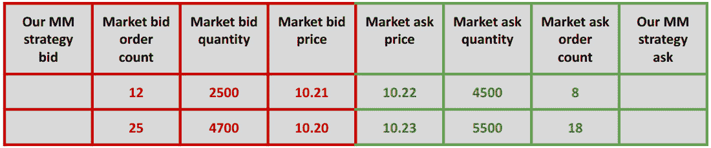
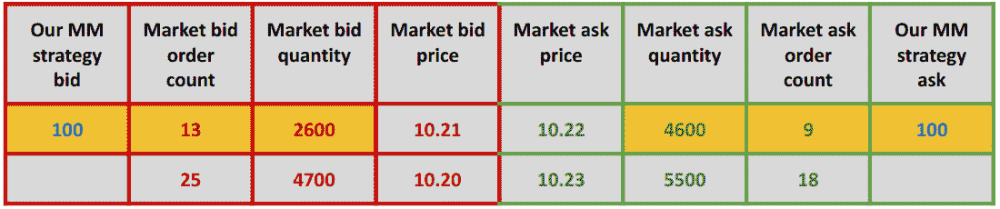
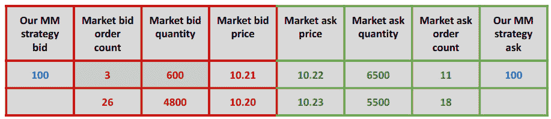
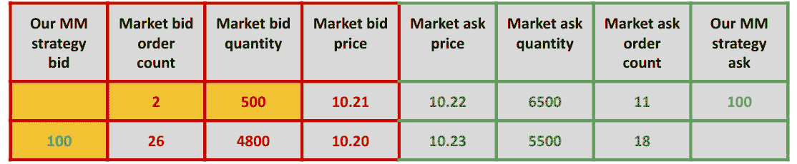
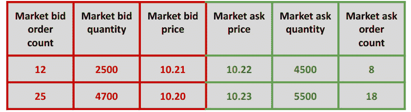
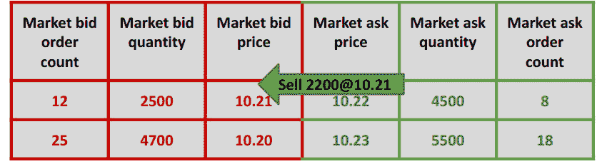
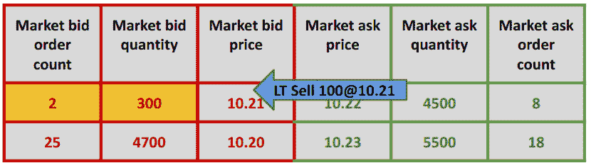

# 10

# 构建 C++市场做市和流动性获取算法

在本章中，我们将在前几章构建的所有组件之上实现一个 C++市场做市算法。此市场做市算法将连接到我们之前构建的交易交易所并发送订单。此外，我们将在相同的交易引擎框架中实现一个 C++流动性获取算法。此流动性获取算法也将连接到交易交易所并发送订单。

本章将涵盖以下主题：

+   理解我们的交易算法的行为

+   管理订单簿中提供的被动流动性

+   主动开仓和平仓

+   构建交易引擎框架

+   构建和运行主要交易应用程序

# 技术要求

本书的所有代码都可以在 GitHub 仓库中找到，仓库地址为[`github.com/PacktPublishing/Building-Low-Latency-Applications-with-CPP`](https://github.com/PacktPublishing/Building-Low-Latency-Applications-with-CPP)。本章的源代码位于仓库中的`Chapter10`目录。

重要的是，您已经阅读并理解了*设计我们的交易生态系统*章节中介绍的电子交易生态系统的设计，特别是*设计低延迟 C++交易算法框架*部分。还预期您对前两个章节——*在 C++中处理市场数据和向交易所发送订单*和*构建 C++交易算法构建块*相当熟悉，因为我们将在此章中使用我们在那两个章节中构建的每一个组件。

本书源代码开发环境的规格在此展示。我们提供此环境的详细信息，因为本书中展示的所有 C++代码并不一定可移植，可能需要在您的环境中进行一些小的修改才能工作：

+   OS: `Linux 5.19.0-41-generic #42~22.04.1-Ubuntu SMP PREEMPT_DYNAMIC Tue Apr 18 17:40:00 UTC 2 x86_64 x86_64 GNU/Linux`

+   GCC: `g++ (Ubuntu 11.3.0-1ubuntu1~22.04.1) 11.3.0`

+   CMake: `cmake version 3.23.2`

+   Ninja: `1.10.2`

# 理解我们的交易算法的行为

在本节中，我们将讨论我们将在此章中构建的两个交易策略（市场做市交易策略和流动性获取交易策略）的行为和背后的动机的一些额外细节。通过为每个策略提供一个假设示例，我们还将尝试理解策略订单流机制，并在本章末尾将我们的 C++系统中的这些交易策略实现时，进一步加深我们的理解。

## 理解市场做市交易算法

做市交易策略旨在通过试图*捕捉价差*来获利，这仅仅意味着在市场上以最佳报价价格被动且快速地买入，并以最佳要价价格被动地卖出（或先卖出后买入）。做市策略的盈利能力取决于交易工具的价差、策略在一段时间内可以执行的买卖交易数量，以及买卖交易之间的市场价格变动幅度。应该清楚的是，做市策略只会与其他*跨越价差*并发出积极买卖订单的策略进行交易，这是我们所说的**流动性获取交易策略**。这意味着做市交易策略很少期望与其他做市交易策略进行交易，因为所有此类策略都寻求被动地执行其订单。为了实现这一点，做市交易策略会在订单簿中发送和管理被动限价订单，并试图使用智能来修改这些订单的价格，从而提高其执行效率和尽可能频繁地成功捕捉价差的可能性。在下一个小节中，我们将讨论一个假设的例子，说明做市交易策略将如何管理其订单。

## 用示例检查做市机制

在本小节中，我们将讨论在假设市场条件下我们的做市交易策略将如何表现。这将有助于加强你对做市算法行为方式的理解。在我们这样做之前，让我们先尝试理解以下表格。

该表格展示了市场订单簿的一种状态，称为**价格水平聚合订单簿**。这个术语的含义是，同一侧和同一价格的所有订单都被分组/聚合到一个单一的价格水平中，因此如果有 12 个订单在报价侧，价格都相同（10.21），总数量为 2,500，它们可以表示为一个单独的条目。这如下所示，以及类似地按下一个买入价格水平 10.20 和要价水平 10.22 和 10.23 的价格进行分组。



图 10.1 – 一个订单簿快照，按价格水平聚合

在前面的图表中，列的含义如下（从左到右）：

+   **我们的 MM 策略报价**：这代表我们的**做市**（**MM**）策略在这个价格水平上的买入订单数量，在这种情况下是没有

+   **市场报价订单数量**：这代表组成这个价格水平的市场买入订单数量

+   **市场报价数量**：在这个价格水平上所有买入订单数量的总和

+   **市场报价价**：这代表了这个报价价位的报价价格

+   **市场卖出价格**：这代表这个卖出价格水平的价格

+   **市场卖出数量**：这个价格水平上所有卖出订单数量的总和

+   **市场卖出订单数量**：这代表构成这个价格水平的卖出订单的数量

+   **我们的 MM 策略的卖出报价**：这代表我们的 MM 策略在这个价格水平上的卖出订单数量，在这种情况下是没有

现在，让我们假设我们的 MM 策略在市场处于我们这里描述的状态时开始运行。我们也假设，对于这个例子，我们的策略将发送一个被动买入订单和一个被动卖出订单，每个订单的数量为 100 股。让我们说，策略决定以价格 10.21 和 10.22 分别加入最佳买入价格水平和最佳卖出价格水平。它是通过发送数量为 100 的单一买入订单和单一卖出订单来做到这一点的。以下图表表示这一事件，图中用金色突出显示的块表示由于这一行动而发生变化的事物。



图 10.2 – 当我们的 MM 订单在市场两边加入时的事件

最后，让我们考虑一个最后的场景，假设在 10.21 的最佳出价上的订单要么因为交易事件而完全执行并被移除，要么仅仅被拥有它们的市参与者取消。如果数量下降足够大，让我们假设我们的 MM 交易策略也决定不在该价格水平上存在。在策略决定将其最佳出价订单从当前价格水平移动到一价格水平之外的价格之前，价格聚合订单簿的状态如下，即从价格 10.21 到 10.20：



图 10.3 – 当我们的 MM 订单决定将其出价移动到一价格水平之外时价格水平簿的状态

这个决定可能是由广泛的因素造成的，这取决于策略及其特性。然而，对于这个例子，让我们提供一个简单的直观想法 – 与愿意以 10.22 卖出的人数（6,500 股）相比，较少的人愿意以 10.21 购买（总共只有 600 股）。你可能会得出结论，也许不再明智尝试在 10.21 购买，或者公平的市场价格可能是在 10.21，你希望尝试以略低于这个价格的价格购买。下一个图表显示了 MM 策略决定取消其在 10.21 的买入订单并将其买入订单重新定位到 10.20 时价格水平簿的状态。



图 10.4 – 当我们的 MM 策略将其出价从 10.21 的价格重新定位到 10.20 时的事件

本小节的讨论旨在提高你对简单 MM 策略机制的认知，在下一小节中，我们将继续探讨流动性获取交易算法。

## 理解流动性获取交易算法

在许多方面，流动性获取交易算法与 MM 算法相反。它不是向簿中发送被动订单并等待它们被动执行，而是在需要时发送积极订单以执行交易。从这一意义上说，它*跨越了价差*（发送积极订单执行），而不是像 MM 策略那样试图*捕捉价差*。这种策略押注于正确判断市场方向——也就是说，当它认为价格将进一步上涨时，它会积极买入；当它认为价格将进一步下跌时，它会积极卖出。关于这种交易算法的便利之处在于，由于它不需要始终在订单簿中保持需要管理的活跃订单，因此订单管理非常简单。另一种理解方式是，当策略需要执行交易时，它会向订单簿发送一个订单，几乎立即执行，然后从订单管理角度来看就完成了。关于这种交易算法的不便之处在于，预测市场方向极其困难，但我们将不会深入探讨这一点，因为这不是本书的重点。在下一小节中，我们将像对 MM 策略那样理解这种策略的交易机制。

### 通过示例检查流动性获取机制

再次，让我们看看 MM 部分讨论的价格水平聚合视图的订单簿，假设初始状态如图所示，这也是 MM 示例的相同初始状态。



图 10.5 – 对于一个假设示例，在给定时间点价格水平簿的状态

让我们假设，在这个例子中，我们的流动性获取策略具有一个特征，该特征试图跟随非常大的交易方向。这意味着，如果市场发生一个非常大的交易事件，我们的流动性获取算法将决定与这个交易事件采取相同的方向。因此，如果发生一个非常大的买入交易，我们的流动性获取算法将积极买入，如果发生一个非常大的卖出交易，我们的流动性获取算法将积极卖出。正如之前提到的，这只是一个示例特征；在实践中，不同的流动性获取算法将有许多这样的特征，这些特征将决定是否进行交易。对于我们的简单流动性获取算法示例，我们将使用市场中的大额积极交易这一特征。

为了理解这看起来是什么样子，让我们假设，在给定的价格水平簿记的先前状态下，一个 2,200 单位的非常大的卖出执行订单击中了 10.21 的买入价格水平，在此之前该价格水平的总数量为 2,500。这个事件在以下图表中显示，其中绿色箭头代表市场数据中的交易积极方。



图 10.6 – 一个大额卖出积极方引起交易事件的事件

这个交易事件将导致最佳买入数量从 2,500 减少到 300 – 即，通过交易积极方的数量。此外，让我们假设，我们的流动性获取策略观察到 2,200 单位的较大交易，并决定在 10.21 的价格发送一个积极卖出订单。让我们还假设，像 MM 策略一样，我们的流动性获取策略也发送了一个 100 单位的卖出订单。这个事件在以下图表中显示。



图 10.7 – 我们的流动性获取算法在价格为 10.21 时发送的 100 单位积极卖出订单的事件

这就结束了我们作为交易系统的一部分所寻求构建的两个交易策略的理论讨论。我们将在接下来的几节中了解它们在框架中的实际实现，但首先，我们需要为这些策略构建一些额外的构建块，这将在下一节中完成。

## 添加一个枚举来定义算法类型

我们将在`Chapter10/common/types.h`头文件中定义一个`AlgoType`枚举，它有以下有效值 – `MAKER`代表 MM，`TAKER`代表流动性获取，`RANDOM`代表我们之前构建的随机交易策略。我们还有`INVALID`和`MAX`值：

```cpp
  enum class AlgoType : int8_t {
    INVALID = 0,
    RANDOM = 1,
    MAKER = 2,
    TAKER = 3,
    MAX = 4
  };
```

我们将添加一个标准的`algoTypeToString()`方法，用于将`AlgoType`类型转换为字符串，如下所示：

```cpp
  inline auto algoTypeToString(AlgoType type) -> std::string {
    switch (type) {
      case AlgoType::RANDOM:
        return "RANDOM";
      case AlgoType::MAKER:
        return "MAKER";
      case AlgoType::TAKER:
        return "TAKER";
      case AlgoType::INVALID:
        return "INVALID";
      case AlgoType::MAX:
        return "MAX";
    }
    return "UNKNOWN";
  }
```

我们将在下一个代码块中构建的 `stringToAlgoType()` 方法，它解析一个字符串并将其转换为 `AlgoType` 枚举值。它是通过遍历所有可能的 `AlgoType` 枚举值，并将字符串参数与对那个 `AlgoType` 枚举值调用 `algoTypeToString()` 的输出进行比较来完成的。如果字符串表示形式匹配，则返回 `algo_type` 枚举：

```cpp
  inline auto stringToAlgoType(const std::string &str) ->
    AlgoType {
    for (auto i = static_cast<int>(AlgoType::INVALID); i <=
      static_cast<int>(AlgoType::MAX); ++i) {
      const auto algo_type = static_cast<AlgoType>(i);
      if (algoTypeToString(algo_type) == str)
        return algo_type;
    }
    return AlgoType::INVALID;
  }
```

接下来，我们将继续构建支持我们的交易策略所需的不同构建块。

# 管理订单簿中提供的被动流动性

到目前为止，我们已经拥有了开始构建我们的交易策略所需的所有子组件。我们将构建的第一个策略将是 MM 算法，该算法发送的订单预计将被动地停留在订单簿中。我们已经在本章前面讨论了这种交易算法的细节，因此在本节中，我们将专注于 C++ 实现。此 `MarketMaker` 交易算法的所有源代码都可以在 `Chapter10/trading/strategy/market_maker.h` 和 `Chapter10/trading/strategy/market_maker.cpp` 源文件中找到。

## 在 MarketMaker 算法中定义数据成员

首先，我们需要定义构成 `MarketMaker` 类的数据成员。关键成员如下：

+   一个名为 `feature_engine_` 的常量 `FeatureEngine` 对象的指针，我们将使用它来获取公平市场价格，使用我们之前看到的 `FeatureEngine::getMktPrice()` 方法。

+   一个指向名为 `order_manager_` 的 `OrderManager` 对象的指针，该对象将用于管理此策略发送的被动订单

+   一个 `ticker_cfg_` 变量，其类型为常量 `TradeEngineCfgHashMap`，用于存储此算法将交易的多种交易工具的交易参数

让我们检查类定义，从 `market_maker.h` 头文件中需要的 `include` 文件开始：

```cpp
#pragma once
#include "common/macros.h"
#include "common/logging.h"
#include "order_manager.h"
#include "feature_engine.h"
using namespace Common;
```

现在，在下一个代码块中，我们可以定义 `MarketMaker` 类和上述数据成员：

```cpp
namespace Trading {
  class MarketMaker {
  private:
    const FeatureEngine *feature_engine_ = nullptr;
    OrderManager *order_manager_ = nullptr;
    std::string time_str_;
    Common::Logger *logger_ = nullptr;
    const TradeEngineCfgHashMap ticker_cfg_;
  };
}
```

下一节将定义构造函数以初始化此 `MarketMaker` 类的一个实例。

## 初始化 MarketMaker 算法

在 `market_maker.cpp` 文件中实现的构造函数将在下一个代码块中展示。构造函数在构造函数中接受一些参数：

+   一个 `Logger` 对象，它将被保存在 `logger_` 成员变量中，并用于日志记录目的。

+   一个指向 `TradeEngine` 对象的指针，该对象将用于将父 `TradeEngine` 实例中的 `algoOnOrderBookUpdate`、`algoOnTradeUpdate` 和 `algoOnOrderUpdate` 回调绑定到 `MarketMaker` 对象中的相应方法。这样，当 `TradeEngine` 接收到回调时，`MarketMaker` 交易策略可以接收并处理这些回调。

+   一个指向常量 `FeatureEngine` 对象的指针，该对象将被存储在 `feature_engine_` 数据成员中，并用于提取算法所需的特征值，如之前所述。

+   一个指向 `OrderManager` 对象的指针，该对象将用于管理此策略的订单，构造函数将简单地保存在 `order_manager_` 数据成员中。

+   对一个常量 `TradeEngineCfgHashMap` 的引用，该常量将被保存在 `ticker_cfg_` 成员中，并用于做出交易决策，因为它包含了交易参数：

    ```cpp
    #include "market_maker.h"
    ```

    ```cpp
    #include "trade_engine.h"
    ```

    ```cpp
    namespace Trading {
    ```

    ```cpp
      MarketMaker::MarketMaker(Common::Logger *logger,
    ```

    ```cpp
        TradeEngine *trade_engine, const FeatureEngine
    ```

    ```cpp
          *feature_engine,
    ```

    ```cpp
    OrderManager *order_manager, const
    ```

    ```cpp
      TradeEngineCfgHashMap &ticker_cfg)
    ```

    ```cpp
          : feature_engine_(feature_engine),
    ```

    ```cpp
            order_manager_(order_manager),
    ```

    ```cpp
              logger_(logger),
    ```

    ```cpp
            ticker_cfg_(ticker_cfg) {
    ```

如前所述，并如图所示，我们将使用 lambda 方法覆盖 `TradeEngine::algoOnOrderBookUpdate()`、`TradeEngine::algoOnTradeUpdate()` 和 `TradeEngine::algoOnOrderUpdate()` 方法，分别将它们转发到 `MarketMaker::onOrderBookUpdate()`、`MarketMaker::onTradeUpdate()` 和 `MarketMaker::onOrderUpdate()` 方法：

```cpp
    trade_engine->algoOnOrderBookUpdate_ = this {
      onOrderBookUpdate(ticker_id, price, side, book);
    };
    trade_engine->algoOnTradeUpdate_ = this {
        onTradeUpdate(market_update, book); };
    trade_engine->algoOnOrderUpdate_ = this { onOrderUpdate(client_response); };
  }
}
```

下一个子节处理 `MarketMaker` 交易算法中最重要的任务——处理订单簿更新并对其做出反应发送订单。

## 处理订单簿更新和交易事件

`MarketMaker::onOrderBookUpdate()` 方法通过 `TradeEngine::algoOnOrderBookUpdate_` `std::function` 成员变量被 `TradeEngine` 调用。这是 `MarketMaker` 交易策略根据其希望其买入和卖出订单的价格做出交易决策的地方：

```cpp
    auto onOrderBookUpdate(TickerId ticker_id, Price price,
      Side side, const MarketOrderBook *book) noexcept -> void {
      logger_->log("%:% %() % ticker:% price:% side:%\n",
        __FILE__, __LINE__, __FUNCTION__,
                   Common::getCurrentTimeStr(&time_str_),
                     ticker_id, Common::
                       priceToString(price).c_str(),
                   Common::sideToString(side).c_str());
```

它使用 `getBBO()` 方法从 `w` 获取 `BBO` 并将其保存在 `bbo` 变量中。我们还获取市场数量加权的 `BBO` 价格并将其保存在 `fair_price` 变量中：

```cpp
      const auto bbo = book->getBBO();
      const auto fair_price = feature_engine_->
        getMktPrice();
```

我们对 `bbo` 和 `fair_price` 中的最佳 `bid_price_` 和 `ask_price_` 值进行合理性检查，以确保价格不是 `Price_INVALID` 且特征值不是 `Feature_INVALID`。只有当这是 `true` 时，我们才会采取任何行动；否则，我们可能会在无效的特征上采取行动或以无效的价格发送订单：

```cpp
      if (LIKELY(bbo->bid_price_ != Price_INVALID && bbo->
        ask_price_ != Price_INVALID && fair_price !=
          Feature_INVALID)) {
        logger_->log("%:% %() % % fair-price:%\n",
          __FILE__, __LINE__, __FUNCTION__,
                     Common::getCurrentTimeStr(&time_str_),
                     bbo->toString().c_str(), fair_price);
```

我们从 `ticker_cfg_` 容器中获取并保存 `clip` 数量，这将是发送给交易所的被动订单的数量。我们还提取并保存 `threshold` 值，我们将使用它来决定发送买入和卖出订单的价格：

```cpp
        const auto clip = ticker_cfg_.at(ticker_id).clip_;
        const auto threshold =
          ticker_cfg_.at(ticker_id).threshold_;
```

我们初始化两个价格变量，`bid_price` 和 `ask_price`，分别代表我们的买入和卖出订单的价格。如果从 `FeatureEngine::getMktPrice()` 方法计算出的 `fair_price` 与市场买入价格之间的差异超过 `threshold` 值，则将 `bid_price` 设置为最佳买入价格。否则，将 `bid_price` 设置为一个低于最佳市场买入价格的价格。我们使用相同的逻辑计算 `ask_price` – 如果从公平价格到最佳卖出价格的差异超过阈值，则使用最佳卖出价格，否则使用更高的价格。背后的动机很简单；当我们认为公平价格高于最佳买入价格时，我们愿意以最佳买入价格买入，预期价格会上涨。当我们认为公平价格低于最佳卖出价格时，我们愿意以最佳卖出价格卖出，预期价格会下跌：

```cpp
        const auto bid_price = bbo->bid_price_ -
          (fair_price - bbo->bid_price_ >= threshold ? 0 :
            1);
        const auto ask_price = bbo->ask_price_ + (bbo->
          ask_price_ - fair_price >= threshold ? 0 : 1);
```

我们使用在前面的代码块 a 中计算的 `bid_price` 和 `ask_price` 变量，并将它们传递给 `OrderManager::moveOrders()` 方法，以将订单移动到所需的价格：

```cpp
        order_manager_->moveOrders(ticker_id, bid_price,
          ask_price, clip);
      }
    }
```

当有交易事件时，`MarketMaker` 交易算法不做任何事情，只是记录它接收到的交易消息，如下所示：

```cpp
    auto onTradeUpdate(const Exchange::MEMarketUpdate
      *market_update, MarketOrderBook * /* book */)
       noexcept -> void {
      logger_->log("%:% %() % %\n", __FILE__, __LINE__,
        __FUNCTION__, Common::
         getCurrentTimeStr(&time_str_),
                   market_update->toString().c_str());
    }
```

我们还有一个任务来完成 `MarketMaker` 交易策略——处理其订单的更新，这将在下一小节中讨论。

## 处理 MarketMaker 算法中的订单更新

对于 `MarketMaker` 交易算法的订单更新处理很简单；它只是将 `MEClientResponse` 消息转发到它用于管理订单的 `order_manager_` 成员。这是通过调用我们之前实现的 `OrderManager::onOrderUpdate()` 方法来实现的：

```cpp
    auto onOrderUpdate(const Exchange::MEClientResponse
      *client_response) noexcept -> void {
      logger_->log("%:% %() % %\n", __FILE__, __LINE__,
        __FUNCTION__, Common::
         getCurrentTimeStr(&time_str_),
                   client_response->toString().c_str());
      order_manager_->onOrderUpdate(client_response);
    }
```

这就完成了我们对 MM 交易算法的实现。在下一节中，我们将处理我们将在这本书中构建的另一种类型的交易策略——一个流动性获取算法。

# 主动开仓和关仓

在本节中，我们将构建一个流动性获取算法，其行为在本章的第一节中已介绍。这种交易策略不会像 MM 算法那样发送被动订单；相反，它发送与订单簿中休息的流动性进行交易的主动订单。`LiquidityTaker` 算法的源代码位于 `Chapter10/trading/strategy/liquidity_taker.h` 和 `Chapter10/trading/strategy/liquidity_taker.cpp` 源文件中。首先，我们将在下一小节中定义构成 `LiquidityTaker` 类的数据成员。

## 定义 LiquidityTaker 算法的数据成员

`LiquidityTaker` 交易策略具有与我们在上一节中构建的 `MarketMaker` 算法相同的数据成员。在我们描述数据成员本身之前，我们将展示需要在 `liquidity_taker.h` 源文件中包含的头文件：

```cpp
#pragma once
#include "common/macros.h"
#include "common/logging.h"
#include "order_manager.h"
#include "feature_engine.h"
using namespace Common;
```

现在，我们可以定义数据成员，它们与 MM 算法中相同。`LiquidityTaker` 类有一个 `feature_engine_` 成员，它是一个指向 `FeatureEngine` 对象的常量指针，一个指向 `OrderManager` 对象的 `order_manager_` 指针，以及一个常量 `ticker_cfg_` 成员，其类型为 `TradeEngineCfgHashMap`。这些成员与在 `MarketMaker` 类中的用途相同；`feature_engine_` 用于提取主动交易与订单簿顶部数量的比率。`order_manager_` 对象用于发送和管理此交易策略的订单。最后，`ticker_cfg_` 对象持有此算法将用于做出交易决策并向交易所发送订单的交易参数：

```cpp
namespace Trading {
  class LiquidityTaker {
  private:
    const FeatureEngine *feature_engine_ = nullptr;
    OrderManager *order_manager_ = nullptr;
    std::string time_str_;
    Common::Logger *logger_ = nullptr;
    const TradeEngineCfgHashMap ticker_cfg_;
  };
}
```

在下一节中，我们将看到如何初始化一个 `LiquidityTaker` 对象。

## 初始化 LiquidityTaker 交易算法

`LiquidityTaker`类的初始化与`MarketMaker`类的初始化相同。构造函数期望以下参数——一个`Logger`对象，此算法运行的`TradeEngine`对象，一个用于计算特征的`FeatureEngine`对象，一个用于管理此交易策略订单的`OrderManager`对象，以及包含此策略交易参数的`TradeEngineCfgHashMap`对象：

```cpp
#include "liquidity_taker.h"
#include "trade_engine.h"
namespace Trading {
  LiquidityTaker::LiquidityTaker(Common::Logger *logger,
    TradeEngine *trade_engine, FeatureEngine
      *feature_engine,
    OrderManager *order_manager,
    const TradeEngineCfgHashMap &ticker_cfg):
      feature_engine_(feature_engine),
        order_manager_(order_manager), logger_(logger),
        ticker_cfg_(ticker_cfg) {
```

此构造函数还覆盖了`TradeEngine`对象中的回调，包括订单簿更新、交易事件以及算法订单（如`MarketMaker`算法）的更新。`TradeEngine`中的`std::function`成员`algoOnOrderBookUpdate_`、`algoOnTradeUpdate_`和`algoOnOrderUpdate_`分别通过 lambda 方法绑定到`LiquidityTaker`内部的`onOrderBookUpdate`、`onTradeUpdate`和`onOrderUpdate`方法，如下所示（以及我们之前看到的）：

```cpp
    trade_engine->algoOnOrderBookUpdate_ = this {
      onOrderBookUpdate(ticker_id, price, side, book);
    };
    trade_engine->algoOnTradeUpdate_ = this {
       onTradeUpdate(market_update, book); };
    trade_engine->algoOnOrderUpdate_ = this { onOrderUpdate(client_response); };
  }
}
```

接下来，我们将讨论处理由于市场数据事件而导致的交易事件和订单簿更新的代码。

## 处理交易事件和订单簿更新

对于`MarketMaker`交易策略，我们看到了它只在订单簿更新时做出交易决策，而在交易更新时则不采取任何行动。`LiquidityTaker`策略则相反——它在`onTradeUpdate()`方法中做出交易决策，而在`onOrderBookUpdate()`方法中不采取任何行动。我们将在下一个代码块中首先查看`LiquidityTaker::onTradeUpdate()`方法的实现：

```cpp
    auto onTradeUpdate(const Exchange::MEMarketUpdate
      *market_update, MarketOrderBook *book) noexcept -> void {
      logger_->log("%:% %() % %\n", __FILE__, __LINE__,
        __FUNCTION__, Common::
          getCurrentTimeStr(&time_str_),
                   market_update->toString().c_str());
```

我们将使用`getBBO()`方法在`bbo`局部变量中获取并保存`BBO`。对于这个交易策略，我们将通过调用`FeatureEngine::getAggTradeQtyRatio()`方法从特征引擎中获取侵略性交易数量比特征，并将其保存到`agg_qty_ratio`变量中：

```cpp
      const auto bbo = book->getBBO();
      const auto agg_qty_ratio = feature_engine_->
        getAggTradeQtyRatio();
```

正如我们之前看到的，在我们决定采取订单操作之前，我们将检查`bid_price_`、`ask_price_`和`agg_qty_ratio`是否为有效值：

```cpp
      if (LIKELY(bbo->bid_price_ != Price_INVALID && bbo->
        ask_price_ != Price_INVALID && agg_qty_ratio !=
          Feature_INVALID)) {
        logger_->log("%:% %() % % agg-qty-ratio:%\n",
          __FILE__, __LINE__, __FUNCTION__,
                     Common::getCurrentTimeStr(&time_str_),
                     bbo->toString().c_str(),
                       agg_qty_ratio);
```

如果有效性检查通过，我们首先需要从`ticker_cfg_`对象中获取`clip_`成员，用于这个交易消息的`TickerId`，如下面的代码块所示，并将其保存到`clip`局部变量中。同样，我们将从`ticker_cfg_`配置对象中获取并保存该`TickerId`的`threshold_`成员：

```cpp
        const auto clip = ticker_cfg_.at(market_update->
          ticker_id_).clip_;
        const auto threshold = ticker_cfg_
          .at(market_update->ticker_id_).threshold_;
```

为了决定我们是否为这个算法发送或调整活跃订单，我们将检查`agg_qty_ratio`是否超过了我们之前获取的阈值：

```cpp
        if (agg_qty_ratio >= threshold) {
```

要使用`OrderManager::moveOrders()`方法发送订单，我们将检查激进的交易是买入交易还是卖出交易。如果是买入交易，我们将发送一个激进的买入订单以在最佳`BBO` `ask_price_`处获取流动性，并指定一个`Price_INVALID`的卖出价格，不发送任何卖出订单。相反，如果它是卖出交易，并且我们想要发送一个激进的卖出订单以获取流动性，我们将在`BBO`对象中指定一个`bid_price_`的卖出价格，并通过指定一个`Price_INVALID`的买入价格不发送任何买入订单。请记住，这种交易策略通过激进地一次发送一个买入或卖出订单来在市场中确定方向，而不是像`MarketMaker`算法那样同时发送两者：

```cpp
          if (market_update->side_ == Side::BUY)
            order_manager_->moveOrders(market_update->
              ticker_id_, bbo->ask_price_, Price_INVALID,
                clip);
          else
            order_manager_->moveOrders(market_update->
              ticker_id_, Price_INVALID, bbo->bid_price_,
                clip);
        }
      }
    }
```

如前所述，并在以下代码块中所示，此`LiquidityTaker`交易策略在`onOrderBookUpdate()`方法中不对订单更新采取任何行动：

```cpp
    auto onOrderBookUpdate(TickerId ticker_id, Price price,
      Side side, MarketOrderBook *) noexcept -> void {
      logger_->log("%:% %() % ticker:% price:% side:%\n",
        __FILE__, __LINE__, __FUNCTION__,
                   Common::getCurrentTimeStr(&time_str_),
                     ticker_id, Common::
                       priceToString(price).c_str(),
                   Common::sideToString(side).c_str());
    }
```

与`LiquidityTaker`相关的下一个结论性部分增加了对策略订单的订单更新处理。

## 在`LiquidityTaker`算法中处理订单更新

如以下代码块所示，`LiquidityTaker::onOrderUpdate()`方法与`MarketMaker::onOrderUpdate()`方法有相同的实现，只是简单地使用`OrderManager::onOrderUpdate()`方法将订单更新转发给订单管理器。

```cpp
    auto onOrderUpdate(const Exchange::MEClientResponse
      *client_response) noexcept -> void {
      logger_->log("%:% %() % %\n", __FILE__, __LINE__,
        __FUNCTION__, Common::
          getCurrentTimeStr(&time_str_),
                   client_response->toString().c_str());
      order_manager_->onOrderUpdate(client_response);
    }
```

这就完成了我们对`LiquidityTaker`交易策略的实现。在下一节中，我们将讨论构建我们交易应用的最终形式，以便我们可以在我们的电子交易生态系统中构建和运行这些实际的交易策略。

# 构建交易引擎框架

在本节中，我们将构建`TradeEngine`类中的交易引擎框架。这个框架将我们构建的所有不同组件连接在一起——包括`OrderGateway`、`MarketDataConsumer`、`MarketOrderBook`、`FeatureEngine`、`PositionKeeper`、`OrderManager`、`RiskManager`、`MarketMaker`和`LiquidityTaker`组件。为了提醒交易引擎组件，我们在此展示所有子组件的图示。我们已经构建了所有子组件；现在，我们将构建这些子组件存在的交易引擎框架。


图 10.8 – 客户交易系统中的交易引擎组件

我们将像往常一样，从这个节开始定义我们类的数据成员。所有基本`TradeEngine`框架的源代码都在`Chapter10/trading/strategy/trade_engine.h`和`Chapter10/trading/strategy/trade_engine.cpp`源文件中。

## 定义交易引擎的数据成员

在我们定义`TradeEngine`类的数据成员之前，我们展示`trade_engine.h`源文件需要包含的头文件：

```cpp
#pragma once
#include <functional>
#include "common/thread_utils.h"
#include "common/time_utils.h"
#include "common/lf_queue.h"
#include "common/macros.h"
#include "common/logging.h"
#include "exchange/order_server/client_request.h"
#include "exchange/order_server/client_response.h"
#include "exchange/market_data/market_update.h"
#include "market_order_book.h"
#include "feature_engine.h"
#include "position_keeper.h"
#include "order_manager.h"
#include "risk_manager.h"
#include "market_maker.h"
#include "liquidity_taker.h"
```

`TradeEngine`类需要以下基本数据成员：

+   它有一个类型为 `ClientId` 的 `client_id_` 变量，用于表示唯一的交易应用程序实例

+   我们创建了一个类型为 `MarketOrderBookHashMap` 的 `ticker_order_book_` 实例，提醒一下，这是一个 `MarketOrderBook` 对象的 `std::array`，用于表示从 `TickerId` 到 `MarketOrderBook` 的哈希映射，针对该工具。

+   我们有三个无锁队列用于接收市场数据更新、发送订单请求和接收来自 `MarketDataConsumer` 和 `OrderGateway` 组件的订单响应。我们使用 `incoming_md_updates_` 变量接收市场数据更新，它是指向类型 `MEMarketUpdateLFQueue`（`MEMarketUpdate` 消息的 `LFQueue`）的指针。我们使用 `outgoing_ogw_requests_` 变量发送客户端订单请求，它是指向类型 `ClientRequestLFQueue`（`MEClientRequest` 消息的 `LFQueue`）的指针。我们使用 `incoming_ogw_responses_` 变量接收客户端订单响应，它是指向类型 `ClientResponseLFQueue`（`MEClientResponse` 消息的 `LFQueue`）的指针。

+   我们有通常的布尔变量 `run_`，它将控制主 `TradeEngine` 线程的执行，并标记为 `volatile`。

+   我们有一个类型为 `Nanos` 的 `last_event_time_` 变量，用于跟踪收到交易所最后一条消息的时间

+   我们还将有一个名为 `logger_` 的 `Logger` 变量，为 `TradeEngine` 创建一个日志文件：

```cpp
namespace Trading {
  class TradeEngine {
  private:
    const ClientId client_id_;
    MarketOrderBookHashMap ticker_order_book_;
    Exchange::ClientRequestLFQueue *outgoing_ogw_requests_
      = nullptr;
    Exchange::ClientResponseLFQueue
      *incoming_ogw_responses_ = nullptr;
    Exchange::MEMarketUpdateLFQueue *incoming_md_updates_ =
      nullptr;
    Nanos last_event_time_ = 0;
    volatile bool run_ = false;
    std::string time_str_;
    Logger logger_;
```

我们还需要上一章中每个组件的实例，具体如下：

+   一个类型为 `FeatureEngine` 的变量 `feature_engine_`，用于计算复杂特征值

+   一个类型为 `PositionKeeper` 的 `position_keeper_` 变量，用于跟踪交易策略的头寸和盈亏（**PnLs**），即从我们的交易中赚取或亏损的资金

+   一个名为 `order_manager_` 的 `OrderManager` 实例，它将被交易策略用于发送和管理实时订单

+   一个名为 `risk_manager_` 的 `RiskManager` 对象，用于管理交易策略的风险

+   一个指向 `MarketMaker` 对象的指针 `mm_algo_`，如果我们将 `TradeEngine` 配置为运行 MM 交易算法，它将被初始化

+   类似地，一个指向 `LiquidityTaker` 对象的指针 `taker_algo_`，如果我们将 `TradeEngine` 配置为运行流动性获取交易策略，它将被初始化：

```cpp
    FeatureEngine feature_engine_;
    PositionKeeper position_keeper_;
    OrderManager order_manager_;
    RiskManager risk_manager_;
    MarketMaker *mm_algo_ = nullptr;
    LiquidityTaker *taker_algo_ = nullptr;
```

我们还将添加三个 `std::function` 成员变量，`TradeEngine` 将使用这些变量将市场数据和订单更新转发到它实例化的交易策略。具体说明如下：

+   `algoOnOrderBookUpdate_` `std::function` 与 `TradeEngine::onOrderBookUpdate()` 方法的签名相同，并用于将订单簿更新转发到交易策略

+   `algoOnTradeUpdate_` `std::function` 与 `TradeEngine::onTradeUpdate()` 方法的签名相同，并用于将交易事件转发到交易策略

+   `algoOnOrderUpdate_` `std::function` 与 `TradeEngine::onOrderUpdate()` 方法的签名相同，并用于将订单更新/响应转发到交易策略：

```cpp
    std::function<void(TickerId ticker_id, Price price,
      Side side, MarketOrderBook *book)>
        algoOnOrderBookUpdate_;
    std::function<void(const Exchange::MEMarketUpdate
      *market_update, MarketOrderBook *book)>
        algoOnTradeUpdate_;
    std::function<void(const Exchange::MEClientResponse
      *client_response)> algoOnOrderUpdate_;
```

为了默认初始化这三个 `std::function` 数据成员，我们将创建三个新方法，这些方法只是记录它们接收到的参数。它们在此处显示：

```cpp
    auto defaultAlgoOnOrderBookUpdate(TickerId ticker_id,
      Price price, Side side, MarketOrderBook *) noexcept
       -> void {
      logger_.log("%:% %() % ticker:% price:% side:%\n",
        __FILE__, __LINE__, __FUNCTION__,
                  Common::getCurrentTimeStr(&time_str_),
                    ticker_id, Common::
                      priceToString(price).c_str(),
                  Common::sideToString(side).c_str());
    }
    auto defaultAlgoOnTradeUpdate(const
      Exchange::MEMarketUpdate *market_update,
        MarketOrderBook *) noexcept -> void {
      logger_.log("%:% %() % %\n", __FILE__, __LINE__,
        __FUNCTION__, Common::
          getCurrentTimeStr(&time_str_),
                  market_update->toString().c_str());
    }
    auto defaultAlgoOnOrderUpdate(const
      Exchange::MEClientResponse *client_response) noexcept
        -> void {
      logger_.log("%:% %() % %\n", __FILE__, __LINE__,
        __FUNCTION__, Common::
          getCurrentTimeStr(&time_str_),
                  client_response->toString().c_str());
    }
```

接下来，我们将讨论初始化 `TradeEngine` 类及其成员变量的某些方法的代码。

## 初始化交易引擎

`TradeEngine` 类的构造函数需要一个 `ClientId` 参数来标识客户端订单请求中使用的交易应用程序。它还需要指向三种类型的 `LFQueue` 的指针 – `ClientRequestLFQueue`、`ClientResponseLFQueue` 和 `MEMarketUpdateLFQueue`，分别用于初始化 `outgoing_ogw_requests_`、`incoming_ogw_responses_` 和 `incoming_md_updates_` 数据成员。它还需要一个 `algo_type` 参数，其类型为 `AlgoType`，用于指定交易策略的类型，以及一个 `ticker_cfg` 参数，其类型为对 `const TradeEngineCfgHashMap` 的引用，其中包含风险管理器和交易策略的配置参数。

构造函数还使用日志文件初始化 `Logger logger_` 成员变量，并为每个可能的 `TickerId` 值创建一个 `MarketOrderBook` 组件，将它们保存在 `ticker_order_book_` 容器中。它对每个 `MarketOrderBook` 组件调用 `setTradeEngine()` 方法，以便在 `TradeEngine` 中接收来自簿的回调。我们还初始化了对应于交易子组件的数据成员 – `feature_engine_`、`position_keeper_`、`order_manager_` 和 `risk_manager_`：

```cpp
  TradeEngine::TradeEngine(Common::ClientId client_id,
    AlgoType algo_type,
const TradeEngineCfgHashMap &ticker_cfg,
Exchange::ClientRequestLFQueue *client_requests,
Exchange::ClientResponseLFQueue *client_responses,
Exchange::MEMarketUpdateLFQueue *market_updates)
      : client_id_(client_id),
        outgoing_ogw_requests_(client_requests),
          incoming_ogw_responses_(client_responses),
        incoming_md_updates_(market_updates),
          logger_("trading_engine_" + std::
            to_string(client_id) + ".log"),
        feature_engine_(&logger_),
        position_keeper_(&logger_),
        order_manager_(&logger_, this, risk_manager_),
        risk_manager_(&logger_, &position_keeper_,
          ticker_cfg) {
    for (size_t i = 0; i < ticker_order_book_.size(); ++i) {
      ticker_order_book_[i] = new MarketOrderBook(i, &logger_);
      ticker_order_book_[i]->setTradeEngine(this);
    }
```

在构造函数的主体中，除了我们之前创建的订单簿之外，我们还将我们的新 `std::function` 成员 – `algoOnOrderBookUpdate_`、`algoOnTradeUpdate_` 和 `algoOnOrderUpdate_` – 初始化为默认值 – `defaultAlgoOnOrderBookUpdate()`、`defaultAlgoOnTradeUpdate()` 和 `defaultAlgoOnOrderUpdate()` 方法：

```cpp
    algoOnOrderBookUpdate_ = this {
      defaultAlgoOnOrderBookUpdate(ticker_id, price, side,
        book);
    };
    algoOnTradeUpdate_ = this { defaultAlgoOnTradeUpdate(market_update,
        book); };
    algoOnOrderUpdate_ = this {
      defaultAlgoOnOrderUpdate(client_response); };
```

最后，我们将初始化一个交易策略实例，它可以是类型为 `MarketMaker` 的 `mm_algo_` 或类型为 `LiquidityTaker` 的 `taker_algo_` 交易策略。此初始化过程如下所示；请记住，`MarketMaker` 或 `LiquidityTaker` 对象将更新/覆盖成员变量 – `algoOnOrderBookUpdate_`、`algoOnTradeUpdate_` 和 `algoOnOrderUpdate_` – 以指向它们自己的方法实现：

```cpp
    if (algo_type == AlgoType::MAKER) {
      mm_algo_ = new MarketMaker(&logger_, this,
        &feature_engine_, &order_manager_, ticker_cfg);
    } else if (algo_type == AlgoType::TAKER) {
      taker_algo_ = new LiquidityTaker(&logger_, this,
        &feature_engine_, &order_manager_, ticker_cfg);
    }
    for (TickerId i = 0; i < ticker_cfg.size(); ++i) {
      logger_.log("%:% %() % Initialized % Ticker:% %.\n",
        __FILE__, __LINE__, __FUNCTION__,
                  Common::getCurrentTimeStr(&time_str_),
                  algoTypeToString(algo_type), i,
                  ticker_cfg.at(i).toString());
    }
  }
```

我们有一个 `start()` 方法，正如我们在其他组件中看到的那样。再次强调，它将 `run_` 标志设置为 `true` 以允许 `run()` 方法执行，并创建并启动一个线程来执行 `run()` 方法：

```cpp
    auto start() -> void {
      run_ = true;
      ASSERT(Common::createAndStartThread(-1,
        "Trading/TradeEngine", [this] { run(); }) !=
          nullptr, "Failed to start TradeEngine thread.");
    }
```

析构函数对变量进行了一些简单的反初始化。首先，它将 `run_` 标志设置为 `false`，稍作等待以让主线程退出，然后继续删除每个 `MarketOrderBook` 实例，清空 `ticker_order_book_` 容器，并最终重置它持有的 `LFQueue` 指针。它还删除了对应于交易策略的 `mm_algo_` 和 `taker_algo_` 成员：

```cpp
  TradeEngine::~TradeEngine() {
    run_ = false;
    using namespace std::literals::chrono_literals;
    std::this_thread::sleep_for(1s);
    delete mm_algo_; mm_algo_ = nullptr;
    delete taker_algo_; taker_algo_ = nullptr;
    for (auto &order_book: ticker_order_book_) {
      delete order_book;
      order_book = nullptr;
    }
    outgoing_ogw_requests_ = nullptr;
    incoming_ogw_responses_ = nullptr;
    incoming_md_updates_ = nullptr;
  }
```

这个类熟悉的 `stop()` 方法首先等待直到所有来自 `incoming_ogw_responses_` 和 `incoming_md_updates_` `LFQueue` 对象的 `MEClientResponse` 和 `MEMarketUpdate` 消息都被清空。然后，它将 `run_` 标志重置以停止主 `run()` 线程并从函数返回：

```cpp
    auto stop() -> void {
      while(incoming_ogw_responses_->size() ||
        incoming_md_updates_->size()) {
        logger_.log("%:% %() % Sleeping till all updates
          are consumed ogw-size:% md-size:%\n", __FILE__,
            __LINE__, __FUNCTION__,
                    Common::getCurrentTimeStr(&time_str_),
                       incoming_ogw_responses_->size(),
                         incoming_md_updates_->size());
        using namespace std::literals::chrono_literals;
        std::this_thread::sleep_for(10ms);
      }
      logger_.log("%:% %() % POSITIONS\n%\n", __FILE__,
        __LINE__, __FUNCTION__, Common::
         getCurrentTimeStr(&time_str_),
                  position_keeper_.toString());
      run_ = false;
    }
```

我们将添加到这个基本框架中的下一个方法旨在用于向交易所发送 `MEClientRequest` 消息。

## 发送客户端请求

交易引擎框架中的 `sendClientRequest()` 方法非常简单。它接收一个 `MEClientRequest` 对象，并将其简单地写入 `outgoing_ogw_requests_` 无锁队列，以便 `OrderGateway` 组件可以取走并发送到交易交易所：

```cpp
  auto TradeEngine::sendClientRequest(const
    Exchange::MEClientRequest *client_request) noexcept ->
    void {
    logger_.log("%:% %() % Sending %\n", __FILE__,
      __LINE__, __FUNCTION__, Common::
        getCurrentTimeStr(&time_str_),
                client_request->toString().c_str());
    auto next_write = outgoing_ogw_requests_->
      getNextToWriteTo();
    *next_write = std::move(*client_request);
    outgoing_ogw_requests_->updateWriteIndex();
  }
```

下一个子节将展示主要的 `run()` 循环，并展示我们如何处理来自交易所的传入数据。

## 处理市场数据更新和客户端响应

`TradeEngine` 的主线程执行 `run()` 方法，该方法简单地检查传入的数据 `LFQueue` 并读取和处理任何可用的更新。

首先，我们检查并清空 `incoming_ogw_responses_` 队列。对于我们在其中读取的每个 `MEClientResponse` 消息，我们调用 `TradeEngine::onOrderUpdate()` 方法，并将来自 `OrderGateway` 的响应消息传递给它：

```cpp
  auto TradeEngine::run() noexcept -> void {
    logger_.log("%:% %() %\n", __FILE__, __LINE__,
      __FUNCTION__, Common::getCurrentTimeStr(&time_str_));
    while (run_) {
      for (auto client_response = incoming_ogw_responses_->
        getNextToRead(); client_response; client_response =
          incoming_ogw_responses_->getNextToRead()) {
        logger_.log("%:% %() % Processing %\n", __FILE__,
          __LINE__, __FUNCTION__, Common::
            getCurrentTimeStr(&time_str_),
                    client_response->toString().c_str());
        onOrderUpdate(client_response);
        incoming_ogw_responses_->updateReadIndex();
        last_event_time_ = Common::getCurrentNanos();
      }
```

我们使用 `incoming_md_updates_` 无锁队列执行类似任务。我们读取任何可用的 `MEMarketUpdate` 消息，并通过调用 `MarketOrderBook::onMarketUpdate()` 方法并将市场更新传递给它，将它们传递给正确的 `MarketOrderBook` 实例：

```cpp
      for (auto market_update = incoming_md_updates_->
        getNextToRead(); market_update; market_update =
          incoming_md_updates_->getNextToRead()) {
        logger_.log("%:% %() % Processing %\n", __FILE__,
         __LINE__, __FUNCTION__, Common::
           getCurrentTimeStr(&time_str_),
                    market_update->toString().c_str());
        ASSERT(market_update->ticker_id_ <
         ticker_order_book_.size(),
               "Unknown ticker-id on update:" +
                 market_update->toString());
        ticker_order_book_[market_update->ticker_id_]->
          onMarketUpdate(market_update);
        incoming_md_updates_->updateReadIndex();
        last_event_time_ = Common::getCurrentNanos();
      }
    }
  }
```

注意，在前面两个代码块中，当我们成功读取和分发市场数据更新或订单响应时，我们会更新 `last_event_time_` 变量以跟踪事件的时间，正如我们在本节前面所描述的。在下一个子节中，我们将看到一些小的杂项占位符方法。

## 处理订单簿、交易和订单响应更新

`TradeEngine::onOrderBookUpdate()` 方法执行几个任务。首先，它从 `MarketOrderBook` 获取 `BBO`，它通过调用 `MarketOrderBook::getBBO()` 方法在方法参数中接收。它将更新的 `BBO` 提供给 `position_keeper_` 和 `feature_engine_` 数据成员。对于 `FeatureEngine` 成员，它调用 `FeatureEngine::onOrderBookUpdate()` 方法来通知特征引擎更新其特征值。该方法还需要调用 `algoOnOrderBookUpdate_()` 以便交易策略可以接收关于订单簿更新的通知：

```cpp
  auto TradeEngine::onOrderBookUpdate(TickerId ticker_id,
    Price price, Side side, MarketOrderBook *book) noexcept
      -> void {
    logger_.log("%:% %() % ticker:% price:% side:%\n",
      __FILE__, __LINE__, __FUNCTION__,
                Common::getCurrentTimeStr(&time_str_),
                  ticker_id, Common::priceToString
                     (price).c_str(),
                Common::sideToString(side).c_str());
    const auto bbo = book->getBBO();
    position_keeper_.updateBBO(ticker_id, bbo);
    feature_engine_.onOrderBookUpdate(ticker_id, price,
       side, book);
    algoOnOrderBookUpdate_(ticker_id, price, side, book);
  }
```

在交易事件上被调用的 `TradeEngine::onTradeUpdate()` 方法也执行几个任务，这些任务类似于我们刚才看到的 `onOrderBookUpdate()` 方法中的任务。它通过调用 `onTradeUpdate()` 方法将交易事件传递给 `FeatureEngine`，以便特征引擎可以更新其计算的特征值。它还通过调用 `algoOnTradeUpdate_()` `std::function` 成员将交易事件传递给交易策略：

```cpp
  auto TradeEngine::onTradeUpdate(const
    Exchange::MEMarketUpdate *market_update,
      MarketOrderBook *book) noexcept -> void {
    logger_.log("%:% %() % %\n", __FILE__, __LINE__,
      __FUNCTION__, Common::getCurrentTimeStr(&time_str_),
                market_update->toString().c_str());
    feature_engine_.onTradeUpdate(market_update, book);
    algoOnTradeUpdate_(market_update, book);
  }
```

最后，`TradeEngine::onOrderUpdate()` 执行两件事。它检查 `MEClientResponse` 是否对应于执行（`ClientResponseType::FILLED`），并调用 `PositionKeeper::addFill()` 方法来更新头寸和 PnLs。它还调用 `algoOnOrderUpdate_()` `std::function` 成员函数，以便交易策略可以处理 `MEClientResponse`：

```cpp
  auto TradeEngine::onOrderUpdate(const
    Exchange::MEClientResponse *client_response) noexcept
      -> void {
    logger_.log("%:% %() % %\n", __FILE__, __LINE__,
      __FUNCTION__, Common::getCurrentTimeStr(&time_str_),
                client_response->toString().c_str());
    if (UNLIKELY(client_response->type_ ==
     Exchange::ClientResponseType::FILLED))
      position_keeper_.addFill(client_response);
    algoOnOrderUpdate_(client_response);
  }
```

现在，我们可以通过定义我们所需的杂项方法来总结下一小节中 `TradeEngine` 框架的设计和实现。

## 添加一些杂项方法

本节定义了 `TradeEngine` 类的一些杂项方法。第一个方法 `initLastEventTime()` 简单地将 `last_event_time_` 变量初始化为当前时间，该时间通过调用 `getCurrentNanos()` 方法获得：

```cpp
    auto initLastEventTime() {
      last_event_time_ = Common::getCurrentNanos();
    }
```

`silentSeconds()` 方法返回自上次收到事件以来经过的时间（以秒为单位）：

```cpp
    auto silentSeconds() {
      return (Common::getCurrentNanos() - last_event_time_)
        / NANOS_TO_SECS;
    }
```

`clientId()` 方法是一个简单的获取器方法，它返回此 `TradeEngine` 实例的 `client_id_`：

```cpp
    auto clientId() const {
      return client_id_;
    }
```

这就完成了我们交易引擎框架的设计和实现。在下一节中，我们将构建主要交易应用程序的二进制文件。

# 构建和运行主要交易应用程序

在本章的最后部分，我们将最终使用本章以及前两章中构建的所有组件来构建主要交易应用程序。首先，我们将讨论 `trading_main` 二进制应用程序的实现，该应用程序结合了 `MarketDataConsumer`、`OrderGateway`、`MarketOrderBook` 和 `TradeEngine` 组件。之后，我们将运行我们的完整电子交易生态系统——电子交易交易所（*Communicating with Market Participants* 章节中的 `exchange_main` 应用程序）以及一些市场参与者实例（我们将构建的 `trading_main` 应用程序）。

## 构建主要交易应用程序

现在，让我们构建可执行的 `trading_main` 二进制文件，该文件将在市场参与者的交易系统中初始化并运行所有组件。此应用程序的源代码位于 `Chapter10/trading/trading_main.cpp` 源文件中。

首先，我们将包含必要的头文件并创建一些基本变量来表示我们需要的不同组件。具体来说，我们将有一个 `Logger` 对象指针用于日志记录，一个 `TradeEngine` 对象指针用于基本交易引擎框架，一个 `MarketDataConsumer` 对象指针用于消费市场数据，以及一个 `OrderGateway` 对象指针用于连接并与交易所的订单服务器通信：

```cpp
#include <csignal>
#include "strategy/trade_engine.h"
#include "order_gw/order_gateway.h"
#include "market_data/market_data_consumer.h"
#include "common/logging.h"
Common::Logger *logger = nullptr;
Trading::TradeEngine *trade_engine = nullptr;
Trading::MarketDataConsumer *market_data_consumer = nullptr;
Trading::OrderGateway *order_gateway = nullptr;
```

现在，我们开始入口点——`main()` 方法。在命令行中，我们将接受以下形式的参数——`trading_main CLIENT_ID ALGO_TYPE [CLIP_1 THRESH_1 MAX_ORDER_SIZE_1 MAX_POS_1 MAX_LOSS_1] [CLIP_2 THRESH_2 MAX_ORDER_SIZE_2 MAX_POS_2 MAX_LOSS_2] …`

第一个参数代表此交易应用实例的`ClientId`。我们还将接受`AlgoType`作为第二个参数，以及每个`TickerId`对应的每个交易算法实例的配置作为剩余参数。我们将通过调用`srand()`方法并传递`client_id`来为这个特定实例生成随机数：

```cpp
int main(int argc, char **argv) {
  const Common::ClientId client_id = atoi(argv[1]);
  srand(client_id);
```

我们将提取`AlgoType`，如下所示：

```cpp
  const auto algo_type = stringToAlgoType(argv[2]);
```

我们还将从剩余的命令行参数中初始化一个类型为`TradeEngineCfgHashMap`的对象，如下面的代码块所示：

```cpp
  TradeEngineCfgHashMap ticker_cfg;
  size_t next_ticker_id = 0;
  for (int i = 3; i < argc; i += 5, ++next_ticker_id) {
    ticker_cfg.at(next_ticker_id) =
      {static_cast<Qty>(std::atoi(argv[i])),
        std::atof(argv[i + 1]),
                                     {static_cast<Qty>(std:
                                     :atoi(argv[i + 2])),
                                      static_cast<Qty>(std:
                                     :atoi(argv[i + 3])),
                                      std::atof(argv[i +
                                       4])}};
  }
```

我们将初始化我们之前声明的组件变量——`Logger`、`client_requests` `LFQueue`、`client_responses` `LFQueue`和`market_updates` `LFQueue`。我们还将定义一个`sleep_time`变量并将其设置为 20 微秒。我们将在发送给交易交换的`OrderGatewayServer`组件的连续订单请求之间使用这个值进行暂停，仅在随机交易策略中：

```cpp
  logger = new Common::Logger("trading_main_" +
    std::to_string(client_id) + ".log");
  const int sleep_time = 20 * 1000;
  Exchange::ClientRequestLFQueue
    client_requests(ME_MAX_CLIENT_UPDATES);
  Exchange::ClientResponseLFQueue
    client_responses(ME_MAX_CLIENT_UPDATES);
  Exchange::MEMarketUpdateLFQueue
    market_updates(ME_MAX_MARKET_UPDATES);
  std::string time_str;
```

我们将首先初始化并启动`TradeEngine`组件。我们将传递`client_id`、`algo_type`、`ticker_cfg`对象中的策略配置以及`TradeEngine`构造函数所需的锁-free 队列。然后我们调用`start()`方法，让主线程开始执行，如下面的代码块所示：

```cpp
  logger->log("%:% %() % Starting Trade Engine...\n",
    __FILE__, __LINE__, __FUNCTION__,
     Common::getCurrentTimeStr(&time_str));
  trade_engine = new Trading::TradeEngine(client_id,
    algo_type,ticker_cfg,&client_requests,
        &client_responses,&market_updates);
  trade_engine->start();
```

我们接下来通过传递`exchange_main`的`OrderGateway`服务器组件的 IP 和端口信息来对`OrderGateway`组件执行类似的初始化。我们还传递`client_requests`和`client_responses` `LFQueue`变量，以便从其中消费`MEClientRequest`消息并将`MEClientResponse`消息写入，然后我们在主线程上使用`start()`：

```cpp
  const std::string order_gw_ip = "127.0.0.1";
  const std::string order_gw_iface = "lo";
  const int order_gw_port = 12345;
  logger->log("%:% %() % Starting Order Gateway...\n",
    __FILE__, __LINE__, __FUNCTION__,
      Common::getCurrentTimeStr(&time_str));
  order_gateway = new Trading::OrderGateway(client_id,
    &client_requests, &client_responses, order_gw_ip,
      order_gw_iface, order_gw_port);
  order_gateway->start();
```

最后，我们初始化并启动`MarketDataConsumer`组件。它需要快照流和增量流的 IP 和端口信息，这些流是交易所的`MarketDataPublisher`发布市场数据的地方。它还需要`market_updates` `LFQueue`变量，它将写入解码后的市场数据更新。最后，由于所有组件都已准备就绪，我们将启动`market_data_consumer`以便我们可以处理任何可用的市场数据更新：

```cpp
  const std::string mkt_data_iface = "lo";
  const std::string snapshot_ip = "233.252.14.1";
  const int snapshot_port = 20000;
  const std::string incremental_ip = "233.252.14.3";
  const int incremental_port = 20001;
  logger->log("%:% %() % Starting Market Data
    Consumer...\n", __FILE__, __LINE__, __FUNCTION__,
      Common::getCurrentTimeStr(&time_str));
  market_data_consumer = new
    Trading::MarketDataConsumer(client_id, &market_updates,
      mkt_data_iface, snapshot_ip, snapshot_port,
        incremental_ip, incremental_port);
  market_data_consumer->start();
```

现在，我们几乎准备好向交易所发送订单了；我们首先需要完成几个更小的任务。首先，`main()`应用程序将短暂休眠，以便我们刚刚在各个组件中创建并启动的线程可以运行几秒钟：

```cpp
  usleep(10 * 1000 * 1000);
```

我们还将通过调用`TradeEngine::initLastEventTime()`方法初始化`TradeEngine`中的第一个事件时间。我们故意延迟了这个成员的初始化，直到我们准备好开始交易：

```cpp
  trade_engine->initLastEventTime();
```

如果`AlgoType`是`AlgoType::RANDOM`，我们将在这里实现交易逻辑，因为它非常简单。首先，我们将检查`algo_type`变量，并根据`algo_type`参数指定的随机交易策略进行分支：

```cpp
  if (algo_type == AlgoType::RANDOM) {
```

对于这个随机交易算法，我们将创建一个独特的起始 `OrderId` 值，该值仅适用于此交易应用程序的实例，使用我们从命令行参数接收的 `client_id`：

```cpp
  Common::OrderId order_id = client_id * 1000;
```

由于在我们的当前测试设置中，我们使用随机价格、数量和方向发送订单，因此我们将为每个工具初始化一个随机参考价格，我们将在这个参考价格值周围随机发送订单。我们这样做纯粹是为了让不同的交易工具具有略微不同且随机的价格订单。每个工具的随机参考价格存储在 `ticker_base_price` 变量中。我们还将创建 `std::vector` 的 `MEClientRequest` 消息来存储我们发送给交易所的订单请求。我们还将为其中一些订单发送取消请求以练习该功能；因此，我们将它们保存起来以备取消时使用：

```cpp
  std::vector<Exchange::MEClientRequest>
    client_requests_vec;
  std::array<Price, ME_MAX_TICKERS> ticker_base_price;
  for(size_t i = 0; i < ME_MAX_TICKERS; ++i)
    ticker_base_price[i] = (rand() % 100) + 100;
```

现在，我们可以开始向交易所发送一些订单，但在开始之前，我们将初始化 `TradeEngine` 的 `last_event_time_` 变量：

```cpp
  trade_engine->initLastEventTime();
```

在下面的循环中，该循环执行 10,000 次，我们将执行以下任务。

我们将随机选择一个 `TickerId`，生成一个接近该工具的 `ticker_base_price` 参考价格值的随机 `Price`，生成一个随机 `Qty`，并为即将发送的订单生成一个随机 `Side`：

```cpp
  for (size_t i = 0; i < 10000; ++i) {
      const Common::TickerId ticker_id = rand() %
        Common::ME_MAX_TICKERS;
      const Price price = ticker_base_price[ticker_id] +
        (rand() % 10) + 1;
      const Qty qty = 1 + (rand() % 100) + 1;
      const Side side = (rand() % 2 ? Common::Side::BUY :
        Common::Side::SELL);
```

我们将创建一个类型为 `ClientRequestType::NEW` 的 `MEClientRequest` 消息，并带有这些属性，然后通过 `sendClientRequest()` 方法调用将其传递给 `TradeEngine`。发送订单请求后，我们将暂停 `sleep_time`（20 微秒），并且我们还将把刚刚发送的 `MEClientRequest` 消息保存在 `client_requests_vec` 容器中：

```cpp
    Exchange::MEClientRequest
      new_request{Exchange::ClientRequestType::NEW,
        client_id, ticker_id, order_id++, side, price,
          qty};
    trade_engine->sendClientRequest(&new_request);
    usleep(sleep_time);
    client_requests_vec.push_back(new_request);
```

暂停之后，我们从客户请求容器中随机选择一个我们发送的客户请求。我们将请求类型更改为 `ClientRequestType::CANCEL` 并将其发送到 `TradeEngine`。然后，我们再次暂停并继续循环迭代：

```cpp
    const auto cxl_index = rand() %
      client_requests_vec.size();
    auto cxl_request = client_requests_vec[cxl_index];
    cxl_request.type_ =
      Exchange::ClientRequestType::CANCEL;
    trade_engine->sendClientRequest(&cxl_request);
    usleep(sleep_time);
  }
}
```

在发送完所有订单流后，我们等待直到我们遇到一个 60 秒的周期，在此期间 `TradeEngine` 没有收到任何市场更新和订单响应。这是一种简单的方法来检测由于此客户端或任何其他交易客户端连接到交易所而没有市场活动的情况：

```cpp
  while (trade_engine->silentSeconds() < 60) {
    logger->log("%:% %() % Waiting till no activity, been
      silent for % seconds...\n", __FILE__, __LINE__,
        __FUNCTION__,
                Common::getCurrentTimeStr(&time_str),
                  trade_engine->silentSeconds());
    using namespace std::literals::chrono_literals;
    std::this_thread::sleep_for(10s);
  }
```

在一段不活跃期后，此应用程序退出。我们首先停止每个组件并暂停一段时间，然后反初始化并退出应用程序：

```cpp
  trade_engine->stop();
  market_data_consumer->stop();
  order_gateway->stop();
  using namespace std::literals::chrono_literals;
  std::this_thread::sleep_for(10s);
  delete logger;
  logger = nullptr;
  delete trade_engine;
  trade_engine = nullptr;
  delete market_data_consumer;
  market_data_consumer = nullptr;
  delete order_gateway;
  order_gateway = nullptr;
  std::this_thread::sleep_for(10s);
  exit(EXIT_SUCCESS);
}
```

这标志着 `trading_main` 应用程序的实现完成。我们在 `Chapter10/scripts/build.sh` 中包含了一个构建脚本，该脚本使用 CMake 和 Ninja 构建库和 `trading_main` 应用程序，以及我们之前构建的 `exchange_main` 应用程序。您将不得不编辑此脚本以指向您系统上的正确二进制文件，或者如果您希望，切换到不同的构建系统。`scripts/build.sh` 脚本预计将从 `Chapter10` 的 `root` 目录运行，它只是配置构建文件，在这种情况下使用 `Ninja`，并清理和重建发布和调试版本的构建。我们想澄清，选择 `Ninja` 是完全随机的；我们构建和运行系统不依赖于任何 `Ninja` 特定的东西。构建过程在 `Chapter10/cmake-build-release` 和 `Chapter10/cmake-build-debug` 目录中生成二进制文件。运行交易二进制的脚本使用 `Chapter10/cmake-build-release` 目录中的二进制文件。

## 运行最终的交易生态系统

我们终于到了可以运行整个电子交易生态系统的地步，虽然现在承认的是使用随机交易策略。我们将展示两个脚本——一个是 `Chapter10/scripts/run_clients.sh`，该脚本配置为启动具有客户端 ID 1 到 5 的五个 `trading_main` 应用程序实例。第二个脚本是 `Chapter10/scripts/run_exchange_and_clients.sh`，它首先使用 `build.sh` 脚本构建库和二进制文件。然后，它启动 `exchange_main` 应用程序，并继续使用 `run_clients.sh` 脚本启动交易客户端实例。最后，它等待所有交易客户端实例完成执行，然后终止交易所实例，并退出。

我们将不会查看完整的 `run_clients.sh` 脚本，但这里展示了一个创建 `MarketMaker` 算法的第一个交易客户端的示例：

```cpp
./cmake-build-release/trading_main  1 MAKER 100 0.6 150 300 -100 60 0.6 150 300 -100 150 0.5 250 600 -100 200 0.4 500 3000 -100 1000 0.9 5000 4000 -100 300 0.8 1500 3000 -100 50 0.7 150 300 -100 100 0.3 250 300 -100 &
```

在这个脚本中，客户端 ID 1 和 2 是 MM 交易算法，客户端 ID 3 和 4 是流动性获取交易算法，最后一个客户端 ID，5，是一个随机交易算法。随机交易算法实例的存在是为了模拟由于任何原因而由市场其他参与者进行的所有交易。我们这样做是因为，在我们的生态系统中，我们只运行五个交易客户端（由于工作站上的资源有限）。然而，我们鼓励那些拥有更多 CPU 资源的人尽可能多地运行系统可以处理的交易客户端。请记住，在实践中，市场是由来自数千（如果不是更多）市场参与者的订单和交易组成的。

首先，我们有构建过程的输出，这是通过运行 `scripts/run_exchange_and_clients.sh` 脚本生成的，该脚本内部调用 `scripts/build.sh` 脚本来首先构建所有内容。请注意，您需要处于如这里所示的 `Chapter10` 根目录中，以便此脚本能够正确运行：

```cpp
sghosh@sghosh-ThinkPad-X1-Carbon-3rd:~/Building-Low-Latency-Applications-with-CPP/Chapter10$ bash scripts/run_exchange_and_clients.sh
...
-- Build files have been written to: /home/sghosh/Building-Low-Latency-Applications-with-CPP/Chapter10/cmake-build-release
...
[36/37] Linking CXX executable trading_main
[37/37] Linking CXX executable exchange_main
```

然后，我们有`exchange_main`应用程序启动的输出：

```cpp
-----------------------------------------
Starting Exchange...
-----------------------------------------
Set core affinity for Common/Logger exchange_main.log 140716464399936 to -1
Set core affinity for Common/Logger exchange_matching_engine.log 140716293985856 to -1
...
```

然后，生成`trading_main`实例启动的输出：

```cpp
-----------------------------------------
Starting TradingClient 1...
-----------------------------------------
Set core affinity for Common/Logger trading_main_1.log 139636947019328 to -1
...
-----------------------------------------
Starting TradingClient 5...
-----------------------------------------
Set core affinity for Common/Logger trading_main_5.log 139837285852736 to -1
...
```

最后，我们有关闭的交易客户端的输出，然后交易所退出：

```cpp
Set core affinity for Trading/MarketDataConsumer 139836325348928 to –1
...
Thu Apr  6 12:37:04 2023 Flushing and closing Logger for trading_main_1.log
...
Thu Apr  6 12:37:21 2023 Logger for trading_order_gateway_5.log exiting.
-----------------------------------------
Stopping Exchange...
-----------------------------------------
...
Thu Apr  6 12:38:09 2023 Logger for exchange_order_server.log exiting.
```

注意，这只是在屏幕上显示的输出。有趣细节在日志文件中，我们将在下一小节中检查和讨论。

另一个重要的注意事项是，`exchange_main`应用程序有 10 个线程，每个`trading_main`应用程序有 8 个线程。这些线程中的许多是`Logger`线程（`exchange_main`有五个，`trading_main`有四个），以及`main()`方法的线程（`exchange_main`和`trading_main`各有一个），它们不是 CPU 密集型，大部分运行时间都在休眠。最佳的设置需要整个生态系统很多核心，这在用于电子交易的生产级交易服务器上是常见的。在这些生产级交易服务器上，我们可以为剩余的每个关键线程分配一个 CPU 核心（`exchange_main`有四个，`trading_main`有三个）。由于我们不确定运行在哪个服务器上，所以我们故意避免为这些线程设置亲和性。如果您的系统 CPU 和/或内存资源有限，我们的建议是在`run_clients.sh`脚本中减少启动的交易客户端数量。

## 检查运行输出

在本节结论中，我们将查看运行`run_exchange_and_clients.sh`脚本生成的日志文件。我们知道在本章中运行的交易策略并不有趣，因为它向交易所发送随机订单，但日志文件中有一些重要的观察结果。运行`run_exchange_and_clients.sh`脚本应该生成类似于以下日志文件：

```cpp
exchange_main.log  exchange_market_data_publisher.log  exchange_matching_engine.log  exchange_order_server.log  exchange_snapshot_synthesizer.log
trading_engine_1.log  trading_main_1.log  trading_market_data_consumer_1.log  trading_order_gateway_1.log
… trading_order_gateway_5.log
```

要理解和跟踪事件，我们的建议是关联我们从各个组件和子组件的`Logger::log()`调用生成的日志行，然后在日志文件中找到它们。

作为示例，让我们跟随一个客户端向交易所发送订单、接收请求、生成客户端响应和该订单请求的市场更新的路径。假设，在这个例子中，我们想找到**OrderId=1445**和**MarketOrderId=53**的路径；该订单遵循的路径如下所示，从日志文件中可以看出。请注意，这只是一个从这次特定运行生成的示例，可能无法重现；这里的目的是了解如何跟踪我们生态系统中的事件：

1.  `MEClientRequest`新订单由`trading_main`实例的`TradeEngine`组件发送，该实例的`ClientId`为 1：

    ```cpp
    trading_engine_5.log:trade_engine.cpp:33 sendClientRequest() Thu Apr  6 12:26:47 2023 Sending MEClientRequest [type:NEW client:1 ticker:0 oid:1445 side:BUY qty:10 price:184]
    ```

1.  `OrderGateway`组件从无锁队列中获取该请求，并通过 TCP 连接将其发送到交易所，如下所示：

    ```cpp
    trading_order_gateway_5.log:order_gateway.cpp:19 run() Thu Apr  6 12:26:47 2023 Sending cid:1 seq:891 MEClientRequest [type:NEW client:1 ticker:0 oid:1445 side:BUY qty:10 price:184]
    ```

1.  `exchange_main`应用程序内部的`OrderServer`组件从`TCPServer`套接字接收它，如下所示：

    ```cpp
    exchange_order_server.log:order_server.h:55 recvCallback() Thu Apr  6 12:26:47 2023 Received OMClientRequest [seq:891 MEClientRequest [type:NEW client:1 ticker:0 oid:1445 side:BUY qty:10 price:184]]
    ```

1.  `OrderServer` 组件内部的 `FifoSequencer` 子组件根据软件接收时间对客户端订单请求 (`MEClientRequest`) 进行排序，并将其发布到 `MatchingEngine` 的无锁队列中：

    ```cpp
    exchange_order_server.log:fifo_sequencer.h:38 sequenceAndPublish() Thu Apr  6 12:26:47 2023 Writing RX:1680802007777361000 Req:MEClientRequest [type:NEW client:1 ticker:0 oid:1445 side:BUY qty:10 price:184] to FIFO.
    ```

1.  `MatchingEngine` 组件最终从 `LFQueue` 接收此请求并处理它，如下面的日志文件所示：

    ```cpp
    exchange_matching_engine.log:matching_engine.h:66 run() Thu Apr  6 12:26:47 2023 Processing MEClientRequest [type:NEW client:1 ticker:0 oid:1445 side:BUY qty:10 price:184]
    ```

1.  作为对收到的订单请求的响应，`MatchingEngine` 组件生成一个 `MEClientResponse` 消息，该消息由 `OrderServer` 组件发布给客户端：

    ```cpp
    exchange_matching_engine.log:matching_engine.h:48 sendClientResponse() Thu Apr  6 12:26:47 2023 Sending MEClientResponse [type:ACCEPTED client:1 ticker:0 coid:1445 moid:53 side:BUY exec_qty:0 leaves_qty:10 price:184]
    ```

1.  与添加到限价订单簿中的新订单相对应，`MatchingEngine` 也生成一个 `MEMarketUpdate` 消息，如下所示。这是为了让 `MarketDataPublisher` 组件发布并更新它维护的快照：

    ```cpp
    exchange_matching_engine.log:matching_engine.h:55 sendMarketUpdate() Thu Apr  6 12:26:47 2023 Sending MEMarketUpdate [ type:ADD ticker:0 oid:53 side:BUY qty:10 price:184 priority:2]
    ```

1.  `OrderServer` 组件从 `LFQueue` 中获取 `MEClientResponse` 消息，并向正确的 TCP 连接上的客户端发送 `OMClientResponse` 消息：

    ```cpp
    exchange_order_server.log:order_server.h:32 run() Thu Apr  6 12:26:47 2023 Processing cid:1 seq:1343 MEClientResponse [type:ACCEPTED client:1 ticker:0 coid:1445 moid:53 side:BUY exec_qty:0 leaves_qty:10 price:184]
    ```

1.  `MarketDataPublisher` 组件接收由 `MatchingEngine` 发送的 `MEMarketUpdate` 消息，并在增量市场数据多播流上发送 `MDPMarketUpdate` 消息：

    ```cpp
    exchange_market_data_publisher.log:market_data_publisher.cpp:19 run() Thu Apr  6 12:26:47 2023 Sending seq:902 MEMarketUpdate [ type:ADD ticker:0 oid:53 side:BUY qty:10 price:184 priority:2]
    ```

1.  `MarketDataPublisher` 组件内部的 `SnapshotSynthesizer` 子组件也接收这个增量 `MEMarketUpdate` 消息，并将其添加到它维护的快照中：

    ```cpp
    exchange_snapshot_synthesizer.log:snapshot_synthesizer.cpp:107 run() Thu Apr  6 12:26:47 2023 Processing MDPMarketUpdate [ seq:902 MEMarketUpdate [ type:ADD ticker:0 oid:53 side:BUY qty:10 price:184 priority:2]]
    ```

1.  在某个时刻，`SnapshotSynthesizer` 在快照多播市场数据流上发布 `MDPMarketUpdate` 消息的快照，包括这个市场更新：

    ```cpp
    exchange_snapshot_synthesizer.log:snapshot_synthesizer.cpp:88 publishSnapshot() Thu Apr  6 12:27:40 2023 MDPMarketUpdate [ seq:7 MEMarketUpdate [ type:ADD ticker:0 oid:53 side:BUY qty:10 price:184 priority:2]]
    ```

1.  `trading_main` 应用程序内部的 `OrderGateway` 组件接收来自连接到交易所的 TCPSocket 的订单请求的 `OMClientResponse` 响应：

    ```cpp
    trading_order_gateway_5.log:order_gateway.cpp:37 recvCallback() Thu Apr  6 12:26:47 2023 Received OMClientResponse [seq:1343 MEClientResponse [type:ACCEPTED client:1 ticker:0 coid:1445 moid:53 side:BUY exec_qty:0 leaves_qty:10 price:184]]
    ```

1.  `trading_main` 应用程序内部的 `MarketDataConsumer` 组件接收增量市场数据流上的 `MDPMarketUpdate` 消息：

    ```cpp
    trading_market_data_consumer_5.log:market_data_consumer.cpp:177 recvCallback() Thu Apr  6 12:26:47 2023 Received incremental socket len:42 MDPMarketUpdate [ seq:902 MEMarketUpdate [ type:ADD ticker:0 oid:53 side:BUY qty:10 price:184 priority:2]]
    ```

    ```cpp
    trading_market_data_consumer_5.log:market_data_consumer.cpp:193 recvCallback() Thu Apr  6 12:26:47 2023 MDPMarketUpdate [ seq:902 MEMarketUpdate [ type:ADD ticker:0 oid:53 side:BUY qty:10 price:184 priority:2]]
    ```

1.  `TradeEngine` 组件最终从 `OrderGateway` 组件通过无锁队列接收 `MEClientResponse` 消息。它还通过 `onOrderUpdate()` 回调转发 `MEClientResponse` 消息：

    ```cpp
    trading_engine_5.log:trade_engine.cpp:44 run() Thu Apr  6 12:26:47 2023 Processing MEClientResponse [type:ACCEPTED client:1 ticker:0 coid:1445 moid:53 side:BUY exec_qty:0 leaves_qty:10 price:184]
    ```

    ```cpp
    trading_engine_5.log:trade_engine.cpp:75 onOrderUpdate() Thu Apr  6 12:26:47 2023 MEClientResponse [type:ACCEPTED client:1 ticker:0 coid:1445 moid:53 side:BUY exec_qty:0 leaves_qty:10 price:184]
    ```

1.  `TradeEngine` 也接收 `MEMarketUpdate` 消息，更新 `MarketOrderBook`，并反过来从 `TradeEngine` 中的订单簿接收 `onOrderBookUpdate()`：

    ```cpp
    trading_engine_5.log:trade_engine.cpp:52 run() Thu Apr  6 12:26:47 2023 Processing MEMarketUpdate [ type:ADD ticker:0 oid:53 side:BUY qty:10 price:184 priority:2]
    ```

    ```cpp
    trading_engine_5.log:trade_engine.cpp:64 onOrderBookUpdate() Thu Apr  6 12:26:47 2023 ticker:0 price:184 side:BUY
    ```

希望这个例子能让你对我们交易生态系统中不同组件的功能有更深入的了解。这也应该作为如何调查我们电子交易宇宙中各种应用、组件和子组件中不同事件的例子。

现在，让我们关注由我们的其他组件生成的条目——`FeatureEngine`、`RiskManager`、`PositionKeeper` 和 `OrderManager`——以及策略——`MarketMaker` 和 `LiquidityTaker` 算法：

1.  以下日志行显示了 `FeatureEngine` 在订单簿更新或市场数据中出现新的交易事件时更新的特征值：

    ```cpp
    trading_engine_1.log:feature_engine.h:23 onOrderBookUpdate() Thu May 11 16:10:45 2023 ticker:7 price:152 side:BUY mkt-price:152.394 agg-trade-ratio:0.0994475
    ```

    ```cpp
    trading_engine_1.log:feature_engine.h:34 onTradeUpdate() Thu May 11 16:10:45 2023 MEMarketUpdate [ type:TRADE ticker:1 oid:INVALID side:SELL qty:50 price:170 priority:INVALID] mkt-price:170.071 agg-trade-ratio:1
    ```

    ```cpp
    trading_engine_1.log:feature_engine.h:23 onOrderBookUpdate() Thu May 11 16:10:45 2023 ticker:2 price:119 side:SELL mkt-price:115.299 agg-trade-ratio:0.262712
    ```

    ```cpp
    trading_engine_1.log:feature_engine.h:34 onTradeUpdate() Thu May 11 16:10:45 2023 MEMarketUpdate [ type:TRADE ticker:3 oid:INVALID side:BUY qty:18 price:180 priority:INVALID] mkt-price:115.299 agg-trade-ratio:0.00628931
    ```

    ```cpp
    trading_engine_1.log:feature_engine.h:23 onOrderBookUpdate() Thu May 11 16:10:45 2023 ticker:3 price:180 side:SELL mkt-price:178.716 agg-trade-ratio:0.00628931
    ```

    ```cpp
    trading_engine_1.log:feature_engine.h:34 onTradeUpdate() Thu May 11 16:10:45 2023 MEMarketUpdate [ type:TRADE ticker:3 oid:INVALID side:BUY qty:30 price:180 priority:INVALID] mkt-price:178.716 agg-trade-ratio:0.0105485
    ```

1.  以下日志行对应于 `PositionKeeper` 在 `BBO` 变化或处理额外执行时更新：

    ```cpp
    trading_engine_1.log:position_keeper.h:75 addFill() Thu May 11 16:10:38 2023 Position{pos:476 u-pnl:-120.715 r-pnl:6248.71 t-pnl:6128 vol:8654 vwaps:[114.254X0] BBO{21@115X116@296}} MEClientResponse [type:FILLED client:1 ticker:2 coid:962 moid:1384 side:BUY exec_qty:25 leaves_qty:102 price:114]
    ```

    ```cpp
    trading_engine_1.log:position_keeper.h:98 updateBBO() Thu May 11 16:10:42 2023 Position{pos:194 u-pnl:15.8965 r-pnl:311.103 t-pnl:327 vol:802 vwaps:[180.918X0] BBO{730@180X182@100}} BBO{730@180X182@100}
    ```

    ```cpp
    trading_engine_1.log:position_keeper.h:75 addFill() Thu May 11 16:10:42 2023 Position{pos:392 u-pnl:688.98 r-pnl:6435.02 t-pnl:7124 vol:8782 vwaps:[114.242X0] BBO{44@114X116@150}} MEClientResponse [type:FILLED client:1 ticker:2 coid:970 moid:1394 side:SELL exec_qty:83 leaves_qty:44 price:116]
    ```

    ```cpp
    trading_engine_1.log:position_keeper.h:98 updateBBO() Thu May 11 16:10:44 2023 Position{pos:373 u-pnl:282.585 r-pnl:6468.41 t-pnl:6751 vol:8801 vwaps:[114.242X0] BBO{19@114X116@131}} BBO{19@114X116@131}
    ```

1.  由于我们在“构建 C++ 交易算法构建块”章节中讨论的几个原因，`RiskManager` 的失败在日志文件中显示如下：

    ```cpp
    trading_engine_1.log:order_manager.h:69 moveOrder() Thu May 11 16:10:41 2023 Ticker:1 Side:BUY Qty:60 RiskCheckResult:POSITION_TOO_LARGE
    ```

    ```cpp
    trading_engine_1.log:order_manager.h:69 moveOrder() Thu May 11 16:10:41 2023 Ticker:4 Side:SELL Qty:1000 RiskCheckResult:LOSS_TOO_LARGE
    ```

    ```cpp
    trading_engine_1.log:order_manager.h:69 moveOrder() Thu May 11 16:10:42 2023 Ticker:2 Side:BUY Qty:150 RiskCheckResult:POSITION_TOO_LARGE
    ```

1.  在日志文件中，`OrderManager` 的事件如下所示，因为尝试发送订单请求并处理响应：

    ```cpp
    trading_engine_1.log:order_manager.h:26 onOrderUpdate() Thu May 11 16:10:36 2023 OMOrder[tid:6 oid:965 side:SELL price:125 qty:15 state:PENDING_CANCEL]
    ```

    ```cpp
    trading_engine_1.log:order_manager.cpp:13 newOrder() Thu May 11 16:10:37 2023 Sent new order MEClientRequest [type:NEW client:1 ticker:6 oid:966 side:SELL qty:50 price:126] for OMOrder[tid:6 oid:966 side:SELL price:126 qty:50 state:PENDING_NEW]
    ```

    ```cpp
    trading_engine_1.log:order_manager.h:23 onOrderUpdate() Thu May 11 16:10:37 2023 MEClientResponse [type:ACCEPTED client:1 ticker:6 coid:966 moid:1806 side:SELL exec_qty:0 leaves_qty:50 price:126]
    ```

    ```cpp
    trading_engine_1.log:order_manager.h:26 onOrderUpdate() Thu May 11 16:10:37 2023 OMOrder[tid:6 oid:966 side:SELL price:126 qty:50 state:PENDING_NEW]
    ```

    ```cpp
    trading_engine_1.log:order_manager.cpp:26 cancelOrder() Thu May 11 16:10:37 2023 Sent cancel MEClientRequest [type:CANCEL client:1 ticker:1 oid:927 side:SELL qty:60 price:170] for OMOrder[tid:1 oid:927 side:SELL price:170 qty:60 state:PENDING_CANCEL]
    ```

    ```cpp
    trading_engine_1.log:order_manager.h:23 onOrderUpdate() Thu May 11 16:10:37 2023 MEClientResponse [type:CANCELED client:1 ticker:1 coid:927 moid:1826 side:SELL exec_qty:INVALID leaves_qty:60 price:170]
    ```

1.  `LiquidityTaker` 交易策略中的事件如下所示。这些对应于订单簿更新、交易事件和策略订单的更新：

    ```cpp
    trading_engine_1.log:liquidity_taker.h:19 onOrderBookUpdate() Thu May 11 16:07:48 2023 ticker:4 price:183 side:SELL
    ```

    ```cpp
    trading_engine_1.log:liquidity_taker.h:19 onOrderBookUpdate() Thu May 11 16:07:48 2023 ticker:7 price:153 side:BUY
    ```

    ```cpp
    trading_engine_1.log:liquidity_taker.h:25 onTradeUpdate() Thu May 11 16:07:48 2023 MEMarketUpdate [ type:TRADE ticker:7 oid:INVALID side:SELL qty:90 price:154 priority:INVALID]
    ```

    ```cpp
    trading_engine_1.log:liquidity_taker.h:32 onTradeUpdate() Thu May 11 16:07:48 2023 BBO{368@154X155@2095} agg-qty-ratio:0.244565
    ```

    ```cpp
    trading_engine_1.log:liquidity_taker.h:19 onOrderBookUpdate() Thu May 11 16:07:48 2023 ticker:7 price:154 side:BUY
    ```

    ```cpp
    trading_engine_1.log:liquidity_taker.h:49 onOrderUpdate() Thu May 11 16:07:48 2023 MEClientResponse [type:FILLED client:3 ticker:7 coid:202 moid:792 side:BUY exec_qty:90 leaves_qty:183 price:154]
    ```

    ```cpp
    trading_engine_1.log:liquidity_taker.h:19 onOrderBookUpdate() Thu May 11 16:07:48 2023 ticker:0 price:180 side:BUY
    ```

1.  同样，`MarketMaker` 交易算法中的事件在日志文件中显示，如下所示：

    ```cpp
    trading_engine_1.log:market_maker.h:47 onOrderUpdate() Thu May 11 16:06:12 2023 MEClientResponse [type:FILLED client:1 ticker:5 coid:418 moid:552 side:BUY exec_qty:62 leaves_qty:160 price:137]
    ```

    ```cpp
    trading_engine_1.log:market_maker.h:42 onTradeUpdate() Thu May 11 16:06:12 2023 MEMarketUpdate [ type:TRADE ticker:3 oid:INVALID side:BUY qty:47 price:180 priority:INVALID]
    ```

    ```cpp
    trading_engine_1.log:market_maker.h:19 onOrderBookUpdate() Thu May 11 16:06:12 2023 ticker:3 price:180 side:SELL
    ```

    ```cpp
    trading_engine_1.log:market_maker.h:27 onOrderBookUpdate() Thu May 11 16:06:12 2023 BBO{2759@178X180@2409} fair-price:179.068
    ```

    ```cpp
    trading_engine_1.log:market_maker.h:19 onOrderBookUpdate() Thu May 11 16:06:12 2023 ticker:0 price:183 side:SELL
    ```

    ```cpp
    trading_engine_1.log:market_maker.h:27 onOrderBookUpdate() Thu May 11 16:06:12 2023 BBO{4395@181X182@534} fair-price:181.892
    ```

    ```cpp
    trading_engine_1.log:market_maker.h:42 onTradeUpdate() Thu May 11 16:06:12 2023 MEMarketUpdate [ type:TRADE ticker:5 oid:INVALID side:SELL qty:62 price:137 priority:INVALID]
    ```

    ```cpp
    trading_engine_1.log:market_maker.h:19 onOrderBookUpdate() Thu May 11 16:06:12 2023 ticker:5 price:137 side:BUY
    ```

我们鼓励您更详细地检查各种日志文件，以了解不同组件中发生的处理过程以及我们整个电子交易生态系统的运作方式。

# 摘要

本章重点介绍了使用我们在前两章中构建的所有组件，并利用它们构建我们的智能交易策略——MM 交易策略和流动性获取交易算法。我们花了一些时间理解这两个交易算法的理论、动机和行为，并辅以一些示例。

在接下来的两节中，我们实现了 C++ MM 交易算法，该算法管理被动订单，以及流动性获取算法，该算法向市场发送积极订单。

然后，我们构建了交易引擎框架，该框架将市场数据消费者、订单网关、功能引擎、仓位保持者、订单管理器和风险管理器以及两个交易算法结合在一起。这个框架是我们用来将这些组件连接起来并促进流入和流出数据流以及交易智能的框架。

最后，我们构建了主要的交易应用程序，`trading_main`，这是市场参与者侧 `exchange_main` 应用程序的补充。然后我们运行了几个不同的交易应用程序实例，以在我们的生态系统中运行随机交易算法、MM 算法和流动性获取算法。我们检查了在电子交易生态系统运行时生成的日志文件，因为不同的交易客户端系统和策略通过电子交易所相互交互。

在下一章中，我们将添加一个仪表系统来衡量我们整个电子交易生态系统的性能。我们在这本书中提到，优化某物的第一步是衡量系统和其组件的性能，我们将在下一章开始这样做。

# 第四部分：分析和改进性能

在本部分，我们将测量我们交易生态系统中所有不同 C++组件的性能。我们将分别分析不同组件的延迟配置文件，以及测量端到端往返路径的性能。从那里，我们将讨论进一步的优化技术，并观察我们 C++优化努力的成效。我们还将讨论可以对我们的电子交易生态系统进行的某些未来改进。

本部分包含以下章节：

+   *第十一章，添加仪表和测量性能*

+   *第十二章，分析和优化我们的 C++系统性能*
