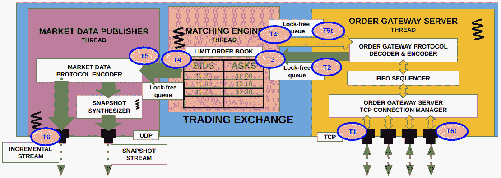
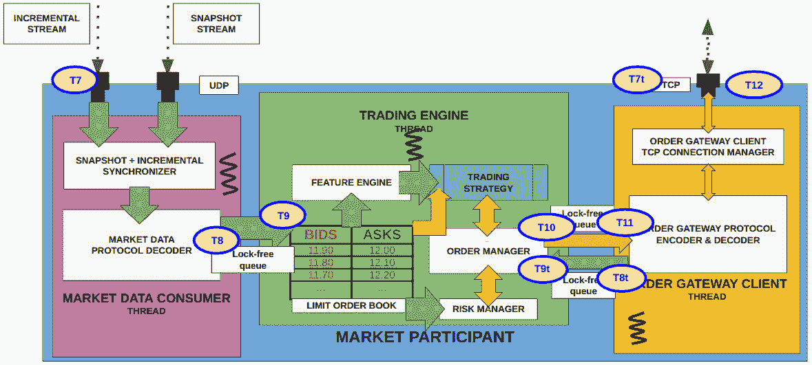

# 11

# 添加性能测量工具和测量性能

在本章中，我们将添加一个系统来测量本书中构建的 C++组件的性能。我们将测量我们在*第二部分*中构建的交易交易所系统的延迟以及在前一节中构建的客户端交易系统的延迟。最后，我们将通过运行前一节中构建的不同算法来测量和分析端到端系统的性能。在本章中，我们将涵盖以下主题：

+   添加一个用于测量系统性能的仪器系统

+   测量交易所的延迟

+   测量交易引擎的延迟

+   使用新的仪器系统运行整个生态系统

# 技术要求

本书的所有代码都可以在 GitHub 仓库[`github.com/PacktPublishing/Building-Low-Latency-Applications-with-CPP`](https://github.com/PacktPublishing/Building-Low-Latency-Applications-with-CPP)中找到。本章的源代码位于仓库中的`Chapter11`目录。

本章依赖于许多前面的章节，因为我们将会测量电子交易生态系统中所有不同组件和子组件的性能。因此，我们期望您熟悉我们迄今为止构建的代码库，特别是*构建 C++匹配引擎*、*与市场参与者通信*、*在 C++中处理市场数据和向交易所发送订单*、*构建 C++交易算法构建块*以及最终*构建 C++市场做市和流动性获取算法*章节。

本书源代码开发环境的规格如下所示。我们提供此环境的详细信息，因为本书中展示的所有 C++代码可能并不一定可移植，可能需要在您的环境中进行一些小的修改才能运行：

+   操作系统 – `Linux 5.19.0-41-generic #42~22.04.1-Ubuntu SMP PREEMPT_DYNAMIC Tue Apr 18 17:40:00 UTC 2 x86_64 x86_64` `x86_64 GNU/Linux`

+   GCC – `g++ (Ubuntu` `11.3.0-1ubuntu1~22.04.1) 11.3.0`

+   CMake – `cmake` `版本 3.23.2`

+   Ninja – `1.10.2`

# 添加一个用于测量系统性能的仪器系统

我们需要解决的首要任务是添加一些实用方法，这些方法将作为我们性能测量系统的基石。这些方法旨在用于测量在同一服务器上运行的进程的内部组件和子组件的延迟。这些方法也旨在用于测量不同组件之间的延迟，实际上这些组件可能不在同一服务器上，例如交易交易所和交易客户端，它们位于不同的服务器上。然而，请注意，在本书中，为了简化，我们在同一服务器上运行交易交易所和交易客户端。现在，让我们从下一节开始添加这些工具。

## 使用 RDTSC 添加性能测量工具

我们添加的第一个性能测量工具并不直接测量时间本身，而是测量代码库中两个位置之间经过的 CPU 时钟周期数。这是通过读取 `rdtsc` 的值来实现的，以获取并返回这个值，它以两个 32 位值的格式返回这个值，我们将这些值转换成一个单一的 64 位值。如果我们不关心将它们转换为时间单位，我们可以直接使用这些 `rdtsc` 值来测量/比较性能。另一种选择是将这个 `rdtsc` 值转换为时间单位，这是通过将这个值除以系统的时钟频率来实现的，该频率指定为每秒的 CPU 时钟周期数。例如，在我的系统中，CPU 时钟频率大约为 2.6 GHz，如下所示：

```cpp
sghosh@sghosh-ThinkPad-X1-Carbon-3rd:~/Building-Low-Latency-Applications-with-CPP/Chapter11$ cat /proc/cpuinfo | grep MHz
cpu MHz         : 2645.048
cpu MHz         : 2645.035
cpu MHz         : 2645.033
cpu MHz         : 2645.050
```

这意味着如果我们测量代码块执行前后 `rdtsc` 值，并且这两个值之间的差是 26 个时钟周期，在我的系统中，这相当于大约 26 / 2.6 = 10 纳秒的执行时间。我们将在本节最后的小节中进一步讨论这个问题，*理解实践中测量系统的一些问题*。因此，不再拖延，让我们看看这个测量实现的代码。本节的所有代码都可以在 `Chapter11/common/perf_utils.h` 源文件中找到。

首先，我们实现了一个 `rdtsc()` C++ 方法，该方法内部调用 `rdtsc` 汇编指令，并为其提供两个变量 `lo` 和 `hi`，以读取构成最终 `rdtsc` 值的低位和高位 32 位。`__asm__` 指令告诉编译器其后的内容是一个汇编指令。`__volatile__` 指令存在是为了防止编译器优化指令，以确保每次调用时都执行原样指令，从而确保我们每次都读取 TSC 寄存器。我们将输出保存到 `lo` 和 `hi` 变量中，最后，通过位移操作，从它们中创建一个 64 位值并返回：

```cpp
#pragma once
namespace Common {
  inline auto rdtsc() noexcept {
    unsigned int lo, hi;
    __asm__ __volatile__ ("rdtsc" : "=a" (lo), "=d" (hi));
    return ((uint64_t) hi << 32) | lo;
  }
}
```

接下来，我们将定义一个简单的预处理器宏 `START_MEASURE`，它接受一个名为 `TAG` 的参数，它所做的只是创建一个具有该名称的变量，并将我们刚刚构建的 `rdtsc()` 方法的值保存在其中。换句话说，这个宏只是创建一个具有提供的名称的变量，并将 `rdtsc()` 值保存在其中：

```cpp
#define START_MEASURE(TAG) const auto TAG = Common::rdtsc()
```

我们定义另一个互补的宏`END_MEASURE`，它接受一个名为`TAG`的参数以及一个名为`LOGGER`的参数，它期望`LOGGER`是`Common::Logger`类型。它使用我们之前构建的`rdtsc()`方法进行另一个测量，并使用`LOGGER`对象记录两个之间的差异。这个代码块被包含在`do {} while(false)`循环中（没有终止的分号），是为了确保编译器在调用此方法时捕获缺少的分号。换句话说，`END_MEASURE(example, logger_);`是一个有效的用法，但`END_MEASURE(example, logger_)`（缺少分号）会导致编译错误，以保持与`START_MEASURE`的对称性。这并不是严格必要的，只是我们的一种偏好：

```cpp
#define END_MEASURE(TAG, LOGGER) \
      do { \
        const auto end = Common::rdtsc(); \
        LOGGER.log("% RDTSC "#TAG" %\n",
          Common::getCurrentTimeStr(&time_str_), (end -
            TAG)); \
      } while(false)
```

最后，我们将定义一个名为`TTT_MEASURE`的类似宏，它接受类似的参数（即，`TAG`和`LOGGER`），这个宏简单地记录当前时间（以纳秒为单位），它是通过调用我们之前看到的`Common::getCurrentNanos()`方法来获取的：

```cpp
#define TTT_MEASURE(TAG, LOGGER) \
      do { \
        const auto TAG = Common::getCurrentNanos(); \
        LOGGER.log("% TTT "#TAG" %\n", Common::
          getCurrentTimeStr(&time_str_), TAG); \
      } while(false)
```

我们将在本章中使用这些宏，但在我们这样做之前，我们需要对我们之前构建并已经看到许多用途的时间工具做一些小的修改。

## 更新我们之前的时间工具

在本节中，我们将对时间工具`Common::getCurrentTimeStr()`方法进行一些小的修改，以使输出更具有信息性和粒度。这里的目的是改变我们之前的输出，它看起来像这样：

```cpp
onMarketUpdate() Sat Jun  3 09:46:34 2023 MEMarketUpdate
```

我们希望将其更改为这种格式，该格式从输出中删除日期和年份，并将时间输出从只有秒更改为有秒和纳秒以增加粒度：

```cpp
onMarketUpdate() 09:46:34.645778416 MEMarketUpdate
```

这将帮助我们更仔细地检查、排序和分析在同一秒内发生的事件。这些更改可以在`Chapter11/common/time_utils.h`源文件中找到。

注意，另一个更改是包含包含我们在上一节中构建的测量方法的`perf_utils.h`头文件：

```cpp
#include "perf_utils.h"
```

我们在*设计时间工具*部分的*为低延迟应用构建 C++构建块*章节中看到了这一点。我们调用`std::chrono::system_clock::now()`来提取当前的`time_point`值并将其保存到`clock`变量中。我们还使用`std::chrono::system_clock::to_time_t()`方法从它中提取并保存`time_t`对象到`time`变量中，如下所示：

```cpp
namespace Common {
  inline auto& getCurrentTimeStr(std::string* time_str) {
    const auto clock = std::chrono::system_clock::now();
    const auto time = std::chrono::
      system_clock::to_time_t(clock);
```

我们使用`sprintf()`、`ctime()`和之前看到的`std::chrono::duration_cast<std::chrono::nanoseconds>(clock.time_since_epoch()).count()`方法组合来提取和格式化当前时间，格式为`HH:MM:SS.nnnnnnnnn`。最后，我们将它赋值给`std::string`类型的`time_str`对象，该对象作为参数传递给此方法，并返回它：

```cpp
    char nanos_str[24];
    sprintf(nanos_str, "%.8s.%09ld", ctime(&time) + 11,
      std::chrono::duration_cast<std::chrono::nanoseconds>
       (clock.time_since_epoch()).count() % NANOS_TO_SECS);
    time_str->assign(nanos_str);
    return *time_str;
  }
}
```

在我们继续使用这些新方法之前，我们将讨论一些关于实践中测量性能的更多要点。

## 理解实践中测量系统的一些问题

在本节中，我们将讨论在实践中进行性能测量时的一些重要考虑因素。这一点很重要，因为性能测量并不总是像看起来那么简单，它需要你理解一些细微差别。

### 由于仪器而增加的开销

我们关于实践性能测量的第一个关键点是，重要的是要考虑测量系统本身并不是零延迟。这意味着将仪器添加到关键代码路径中会增加一些额外的延迟。确保仪器系统/例程本身相对于它所测量的系统延迟非常低是非常重要的。一个假设的例子是，如果我们正在测量需要几微秒的事情，我们需要确保测量例程只需要几纳秒，以避免增加过多的开销。我们能够选择使用`rdtsc()`来测量性能的一个原因是因为它比调用诸如`std::chrono::system_clock::now()`或`clock_gettime()`这样的方法要快得多。这给了我们在测量具有极低延迟的代码块时使用`rdtsc()`的选择，以添加最小的开销。

### 理解 RDTSC 的限制和可靠性

第二个关键点是关于`rdtsc()`，它并不总是非常便携，并且根据平台可能会有可靠性问题。当将`rdtsc()`转换为时间单位时，另一个考虑因素是系统中的 CPU 时钟频率可能从核心到核心有所不同，使用静态 CPU 时钟频率进行转换并不总是准确的。

### 设置正确的测量环境

关于在交易服务器上测量性能的第三个要点是，需要进行大量的调整以方便准确测量。这包括禁用中断、确保不必要的进程没有运行、确保 NUMA 设置正确、调整 CPU 电源设置、设置 CPU 隔离、将线程固定到特定核心等技术。在电子交易方面讨论所有这些考虑因素超出了本书的范围，也不是本书的重点。我们只想提到，在性能测量方面还有其他考虑因素。我们建议感兴趣的读者参考书籍《开发高频交易系统：从 C++或 Java 基础知识开始，学习如何从头实现高频交易》，该书讨论了**高频电子交易**（**HFT**）的具体考虑因素。

现在，我们可以继续使用本节中构建的性能测量系统，在我们的电子交易生态系统中，从下一节中的交易所开始。

# 在交易所测量延迟

首先，我们将向电子交易交易所侧的组件添加仪器——市场数据发布者、撮合引擎和订单服务器。我们的性能测量方法将包括两种形式；在我们查看代码之前，让我们先了解这些。

### 理解如何测量内部组件

第一种方法是测量内部组件的延迟——例如，调用`Exchange::MatchingEngine::processClientRequest()`方法需要多长时间，或者调用`Exchange::MEOrderBook::add()`方法需要多长时间？对于这些情况，我们将使用一对`START_MEASURE()`和`END_MEASURE()`宏，它们反过来使用`rdtsc()`方法来测量此类调用的性能。这里没有任何阻止我们使用`TTT_MEASURE()`宏代替`rdtsc()`或作为补充的地方。但我们将使用`rdtsc()`来测量这些，为了提供如何使用两种不同仪器系统的示例。此外，我们使用这样的理由：对像我们之前提到的那种函数的调用应该非常快，可能最好使用开销较低的`rdtsc()`方法。我们将采取的完整内部测量列表将在下面列出，但感兴趣的读者应使用类似的技术根据需要添加更多测量点。我们将在稍后看到如何测量这些熟悉方法的代码，但现在，我们将测量在交易所侧的方法如下：

+   `Common::McastSocket::send()`

+   `Exchange::MEOrderBook::add()`

+   `Exchange::MEOrderBook::cancel()`

+   `Exchange::MatchingEngine::processClientRequest()`

+   `Exchange::MEOrderBook::removeOrder()`

+   `Exchange::MEOrderBook::match()`

+   `Exchange::MEOrderBook::match()`

+   `Exchange::MEOrderBook::checkForMatch()`

+   `Exchange::MEOrderBook::addOrder()`

+   `Exchange::MEOrderBook::removeOrder()`

+   `Common::TCPSocket::send()`

+   `Exchange::FIFOSequencer::addClientRequest()`

+   `Exchange::FIFOSequencer::sequenceAndPublish()`

接下来，让我们退后几步，了解在电子交易交易所我们将对哪些高级位置/跳数进行时间戳记录。

### 理解在交易所的关键跳数

除了测量内部组件的功能外，交易所可以记录性能数据，特别是时戳，以追踪事件（客户端请求）如何通过不同的组件和子组件传播。我们指的是追踪，通常还包括发布指标，例如订单何时到达订单服务器，何时到达撮合引擎，响应请求何时离开订单服务器，对应请求的市场更新何时离开市场数据发布者，等等。通过记录这些指标，交易所可以了解和调查其在不同市场/负载条件下的性能，跟踪每个参与者的性能，等等。通过将这些指标发布给市场参与者，参与者可以了解和调查自己的性能，并考虑改进的方法。

在我们的电子交易交易所中，我们将记录以下事件的时戳：

+   `T1_OrderServer_TCP_read` – 客户请求首次在`OrderServer`中的 TCP 套接字中被读取的时间

+   `T2_OrderServer_LFQueue_write` – 客户请求被写入连接到`MatchingEngine`的`LFQueue`的时间

+   `T3_MatchingEngine_LFQueue_read` – `MatchingEngine`从`LFQueue`读取客户端请求的时间

+   `T4_MatchingEngine_LFQueue_write` – 市场更新被写入连接到`MarketDataPublisher`的`LFQueue`的时间

+   `T4t_MatchingEngine_LFQueue_write` – 客户端响应被写入连接到`OrderServer`的`LFQueue`的时间

+   `T5_MarketDataPublisher_LFQueue_read` – 从`LFQueue`读取市场更新的时间

+   `T5t_OrderServer_LFQueue_read` – 从`LFQueue`读取客户端响应的时间

+   `T6_MarketDataPublisher_UDP_write` – 市场更新被写入`MarketDataPublisher`中的 UDP 套接字的时间

+   `T6t_OrderServer_TCP_write` – 客户端响应被写入`OrderServer`中的 TCP 套接字的时间

这些时戳的确切位置在以下图中显示：



图 11.1 – 带有时戳关键跳转的电子交易交易所拓扑结构

现在，从下一节开始，我们可以开始查看我们需要添加到这两种测量形式的代码更改。

## 测量市场数据发布者内部的延迟

首先，我们将向市场数据发布者添加性能测量和时戳代码。为了简洁起见，我们只展示我们进行这些更改的代码块，而不是包括整个源文件或大型代码块中的源代码。所有更改以及与市场数据发布者相关的完整、更新后的源代码都在`Chapter11/exchange/market_data/market_data_publisher.cpp`源文件中。

首先，在`MarketDataPublisher::run()`方法中，我们将在从`outgoing_md_updates_` `LFQueue`读取后立即使用带有`T5_MarketDataPublisher_LFQueue_read`标记的`TTT_MEASURE`宏添加时间戳，如下所示：

```cpp
  auto MarketDataPublisher::run() noexcept -> void {
    ...
    while (run_) {
      for (auto market_update = outgoing_md_updates_->
        getNextToRead();
           outgoing_md_updates_->size() && market_update;
             market_update = outgoing_md_updates_->
               getNextToRead()) {
        TTT_MEASURE(T5_MarketDataPublisher_LFQueue_read,
          logger_);
```

接下来，我们将使用`START_MEASURE`和`END_MEASURE`宏以及`Exchange_McastSocket_send`标记来测量在`incremental_socket_`上调用`MCastSocket::send()`所需的时间：

```cpp
        START_MEASURE(Exchange_McastSocket_send);
        incremental_socket_.send(&next_inc_seq_num_,
          sizeof(next_inc_seq_num_));
        incremental_socket_.send(market_update,
          sizeof(MEMarketUpdate));
        END_MEASURE(Exchange_McastSocket_send, logger_);
```

最后，在套接字写入完成后，我们将使用带有`T6_MarketDataPublisher_UDP_write`标记的`TTT_MEASURE`宏再次获取时间戳：

```cpp
        outgoing_md_updates_->updateReadIndex();
        TTT_MEASURE(T6_MarketDataPublisher_UDP_write,
          logger_);
        ...
```

接下来，让我们看看`OrderServer`组件在性能测量和时间戳方面的更改。

## 测量订单服务器内部的延迟

所有用于性能测量和时间戳的更改，以及`OrderServer`的完整源代码，都在`Chapter11/exchange/order_server/order_server.h`源文件中。和之前一样，我们将只展示更改所做的最小代码块，以节省篇幅并避免重复。

首先，我们将修改`OrderServer::run()`方法，在从`outgoing_responses_` `LFQueue`读取条目后立即进行。我们使用带有`T5t_OrderServer_LFQueue_read`标记的`TTT_MEASURE`宏，如下所示：

```cpp
    auto run() noexcept {
      ...
      while (run_) {
      ...
        for (auto client_response = outgoing_responses_->
          getNextToRead(); outgoing_responses_->size() &&
            client_response; client_response =
              outgoing_responses_->getNextToRead()) {
          TTT_MEASURE(T5t_OrderServer_LFQueue_read,
            logger_);
```

接下来，我们将使用带有`START_MEASURE`和`END_MEASURE`宏以及`Exchange_TCPSocket_send`标记来测量对`TCPSocket::send()`方法的调用。请注意，我们测量的是发送完整客户端响应消息的调用，在我们的实现中，这会导致对`TCPSocket::send()`方法的两次调用：

```cpp
          START_MEASURE(Exchange_TCPSocket_send);
          cid_tcp_socket_[client_response->client_id_]->
            send(&next_outgoing_seq_num,
              sizeof(next_outgoing_seq_num));
          cid_tcp_socket_[client_response->client_id_]->
             send(client_response,
               sizeof(MEClientResponse));
          END_MEASURE(Exchange_TCPSocket_send, logger_);
```

最后，在 TCP 套接字发送操作完成后，我们将使用带有`T6t_OrderServer_TCP_write`标记的`TTT_MEASURE`方法再次获取时间戳：

```cpp
          outgoing_responses_->updateReadIndex();
          TTT_MEASURE(T6t_OrderServer_TCP_write, logger_);
          ...
```

下一个更改集在`OrderServer::recvCallback()`方法中。当我们刚进入该方法时，我们使用带有`T1_OrderServer_TCP_read`标记的`TTT_MEASURE`宏获取时间戳：

```cpp
    auto recvCallback(TCPSocket *socket, Nanos rx_time)
      noexcept {
      TTT_MEASURE(T1_OrderServer_TCP_read, logger_);
      ...
```

最后，在本方法结束时，我们将使用带有`Exchange_FIFOSequencer_addClientRequest`标记的`START_MEASURE`和`END_MEASURE`宏来测量对`FIFOSequencer::addClientRequest()`的调用：

```cpp
START_MEASURE(Exchange_FIFOSequencer_addClientRequest);
          fifo_sequencer_.addClientRequest(rx_time,
            request->me_client_request_);
              END_MEASURE(Exchange_FIFOSequencer_
                addClientRequest, logger_);
          ...
```

最后，对于`OrderServer`，我们需要更新`OrderServer::recvFinishedCallback()`方法。我们使用带有`Exchange_FIFOSequencer_sequenceAndPublish`标记的`START_MEASURE`和`END_MEASURE`宏来测量对`FIFOSequencer::sequenceAndPublish()`方法的调用：

```cpp
    auto recvFinishedCallback() noexcept {
    START_MEASURE(Exchange_FIFOSequencer_sequenceAndPublis)
    ;
      fifo_sequencer_.sequenceAndPublish();
      END_MEASURE(Exchange_FIFOSequencer_
        sequenceAndPublish, logger_);
    }
```

在下一个子节中，我们将向`FIFOSequencer`子组件添加仪器。

### 测量 FIFOSequencer 内部的延迟

所有仪器更改以及`FIFOSequencer`子组件的完整、更新后的源代码都可以在`Chapter11/exchange/order_server/fifo_sequencer.h`源文件中找到。我们将做出的唯一更改是在`FIFOSequencer::sequenceAndPublish()`方法中。在这里，我们只是在将客户端请求写入`incoming_requests_` `LFQueue`后添加时间戳，我们通过使用`TTT_MEASURE`宏和`T2_OrderServer_LFQueue_write`标签值来完成此操作，如下所示：

```cpp
    auto sequenceAndPublish() {
      for (size_t i = 0; i < pending_size_; ++i) {
        ...
        auto next_write = incoming_requests_->
          getNextToWriteTo();
        *next_write = std::move(client_request.request_);
        incoming_requests_->updateWriteIndex();
        TTT_MEASURE(T2_OrderServer_LFQueue_write,
          (*logger_));
        ...
```

接下来，我们将继续对核心匹配引擎组件及其子组件添加仪器和时间戳的任务。

## 测量匹配引擎和订单簿内部的延迟

首先，我们将更新`MatchingEngine`；所有更改以及`MatchingEngine`的完整、更新后的源代码都可以在`Chapter11/exchange/matcher/matching_engine.h`源文件中找到。

在`MatchingEngine::processClientRequest()`方法中，我们将测量`MEOrderBook::add()`和`MEOrderBook::cancel()`方法所需的时间。首先，我们使用`START_MEASURE`和`END_MEASURE`宏以及`Exchange_MEOrderBook_add`标签来展示`MEOrderBook::add()`方法的更改，如下所示：

```cpp
    auto processClientRequest(const MEClientRequest
      *client_request) noexcept {
      ...
      switch (client_request->type_) {
        case ClientRequestType::NEW: {
          START_MEASURE(Exchange_MEOrderBook_add);
          order_book->add(client_request->client_id_,
           client_request->order_id_, client_request->
             ticker_id_,
                           client_request->side_,
                             client_request->price_,
                               client_request->qty_);
          END_MEASURE(Exchange_MEOrderBook_add, logger_);
          ...
```

然后，我们展示了使用`START_MEASURE`和`END_MEASURE`宏以及`Exchange_MEOrderBook_cancel`标签对`MEOrderBook::cancel()`方法的更改，如下所示：

```cpp
        case ClientRequestType::CANCEL: {
          START_MEASURE(Exchange_MEOrderBook_cancel);
          order_book->cancel(client_request->client_id_,
            client_request->order_id_, client_request->
              ticker_id_);
          END_MEASURE(Exchange_MEOrderBook_cancel,
            logger_);
          ...
```

我们需要更新的下一个方法是`MatchingEngine::sendClientResponse()`。我们将在将客户端响应写入`outgoing_ogw_responses_` `LFQueue`后立即使用`TTT_MEASURE`宏和`T4t_MatchingEngine_LFQueue_write`标签，如下所示：

```cpp
    auto sendClientResponse(const MEClientResponse
      *client_response) noexcept {
      ...
      auto next_write = outgoing_ogw_responses_->
        getNextToWriteTo();
      *next_write = std::move(*client_response);
      outgoing_ogw_responses_->updateWriteIndex();
      TTT_MEASURE(T4t_MatchingEngine_LFQueue_write,
        logger_);
    }
```

我们还需要通过使用`TTT_MEASURE`宏和`T4_MatchingEngine_LFQueue_write`标签，在将市场更新写入`outgoing_md_updates_` `LFQueue`后添加时间戳来更新`MatchingEngine::sendMarketUpdate()`方法：

```cpp
    auto sendMarketUpdate(const MEMarketUpdate
      *market_update) noexcept {
      ...
      auto next_write = outgoing_md_updates_->
        getNextToWriteTo();
      *next_write = *market_update;
      outgoing_md_updates_->updateWriteIndex();
      TTT_MEASURE(T4_MatchingEngine_LFQueue_write,
        logger_);
    }
```

我们需要在`MatchingEngine`中更新的最后一个方法是`run()`方法本身。我们在从`incoming_requests_` `LFQueue`读取后立即获取时间戳，使用`TTT_MEASURE`宏和`T3_MatchingEngine_LFQueue_read`标签，如下所示：

```cpp
    auto run() noexcept {
      while (run_) {
        const auto me_client_request = incoming_requests_->
          getNextToRead();
        if (LIKELY(me_client_request)) {
          TTT_MEASURE(T3_MatchingEngine_LFQueue_read,
            logger_);
```

接下来，我们使用`START_MEASURE`和`END_MEASURE`宏以及`Exchange_MatchingEngine_processClientRequest`标签来测量对`MatchingEngine::processClientRequest()`方法的调用，如下所示：

```cpp
START_MEASURE(Exchange_MatchingEngine_processClientRequest);          processClientRequest(me_client_request);
END_MEASURE(Exchange_MatchingEngine_processClientRequest,
  logger_);
          ...
```

我们需要在交易所侧更新的最后一个组件是`MatchingEngine`中的`MEOrderBook`子组件。

### 测量 MEOrderBook 内部的延迟

我们将在本小节中讨论对`MEOrderBook`组件的仪器更改，这些更改可以在`Chapter11/exchange/matcher/me_order_book.cpp`源文件中找到。

我们将更新的第一个方法是`MEOrderBook::match()`。我们希望使用`START_MEASURE`和`END_MEASURE`宏以及`Exchange_MEOrderBook_removeOrder`标签来测量对`MEOrderBook::removeOrder()`的调用，如下所示：

```cpp
  auto MEOrderBook::match(TickerId ticker_id, ClientId
    client_id, Side side, OrderId client_order_id, OrderId
      new_market_order_id, MEOrder* itr, Qty* leaves_qty)
        noexcept {
    ...
    if (!order->qty_) {
      ...
      START_MEASURE(Exchange_MEOrderBook_removeOrder);
      removeOrder(order);
      END_MEASURE(Exchange_MEOrderBook_removeOrder,
        (*logger_));
      ...
```

我们还需要更新`MEOrderBook::checkForMatch()`方法来测量对`MEOrderBook::match()`的调用。我们使用带有`Exchange_MEOrderBook_match`标记的`START_MEASURE`和`END_MEASURE`宏来对执行的两个分支进行测量，如下所示：

```cpp
  auto MEOrderBook::checkForMatch(ClientId client_id,
    OrderId client_order_id, TickerId ticker_id, Side side,
      Price price, Qty qty, Qty new_market_order_id)
        noexcept {
    ...
    if (side == Side::BUY) {
      while (leaves_qty && asks_by_price_) {
        ...
        START_MEASURE(Exchange_MEOrderBook_match);
        match(ticker_id, client_id, side, client_order_id,
          new_market_order_id, ask_itr, &leaves_qty);
        END_MEASURE(Exchange_MEOrderBook_match,
          (*logger_));
      }
    }
    if (side == Side::SELL) {
      while (leaves_qty && bids_by_price_) {
        ...
        START_MEASURE(Exchange_MEOrderBook_match);
        match(ticker_id, client_id, side, client_order_id,
          new_market_order_id, bid_itr, &leaves_qty);
        END_MEASURE(Exchange_MEOrderBook_match,
          (*logger_));
      }
    }
    ...
```

我们将在`MEOrderBook::add()`方法中添加额外的仪表化来测量几个不同的调用。第一个是调用`MEOrderBook::checkForMatch()`，我们将使用`Exchange_MEOrderBook_checkForMatch`标记：

```cpp
  auto MEOrderBook::add(ClientId client_id, OrderId
    client_order_id, TickerId ticker_id, Side side, Price
      price, Qty qty) noexcept -> void {
    ...
    START_MEASURE(Exchange_MEOrderBook_checkForMatch);
    const auto leaves_qty = checkForMatch(client_id,
      client_order_id, ticker_id, side, price, qty,
        new_market_order_id);
    END_MEASURE(Exchange_MEOrderBook_checkForMatch,
      (*logger_));
    …
```

下一个是调用`MEOrderBook::addOrder()`，我们将使用`Exchange_MEOrderBook_addOrder`标记：

```cpp
      START_MEASURE(Exchange_MEOrderBook_addOrder);
      addOrder(order);
      END_MEASURE(Exchange_MEOrderBook_addOrder,
       (*logger_));
      ...
```

我们需要添加更多细粒度仪表化的最后一个`MEOrderBook`方法是`cancel()`方法。在这个方法中，我们想要测量对`MEOrderBook::removeOrder()`方法的调用，如下所示，使用`START_MEASURE`和`END_MEASURE`宏以及`Exchange_MEOrderBook_removeOrder`标记：

```cpp
  auto MEOrderBook::cancel(ClientId client_id, OrderId
    order_id, TickerId ticker_id) noexcept -> void {
      ...
      START_MEASURE(Exchange_MEOrderBook_removeOrder);
      removeOrder(exchange_order);
      END_MEASURE(Exchange_MEOrderBook_removeOrder,
        (*logger_));
      ...
```

这就完成了我们希望在电子交易所一侧添加的所有测量，在下一节中，我们将添加另一侧的类似仪表化：即交易客户端系统。

# 测量交易引擎中的延迟

在本节中，我们将专注于向交易客户端系统添加性能测量和时间戳——包括市场数据消费者、订单网关、交易引擎及其子组件。在这里，我们也将测量内部组件的性能，并添加时间戳以帮助进行更高层次的分析，包括事件传入和传出的延迟。

### 理解如何进行内部测量

测量交易客户端系统内部组件性能的动机和方法与交易所方面的方法相同。我们将采取的完整内部测量列表如下，但感兴趣的读者应使用类似的技术根据需要添加更多测量点。我们很快将看到如何测量这些熟悉方法的代码，但到目前为止，我们将测量客户端侧的方法如下：

+   `Trading::MarketDataConsumer::recvCallback()`

+   `Common::TCPSocket::send()`

+   `Trading::OrderGateway::recvCallback()`

+   `Trading::OrderManager::moveOrders()`

+   `Trading::OrderManager::onOrderUpdate()`

+   `Trading::OrderManager::moveOrders()`

+   `Trading::OrderManager::onOrderUpdate()`

+   `Trading::MarketOrderBook::addOrder()`

+   `Trading::MarketOrderBook::removeOrder()`

+   `Trading::MarketOrderBook::updateBBO()`

+   `Trading::OrderManager::cancelOrder()`

+   `Trading::RiskManager::checkPreTradeRisk()`

+   `Trading::OrderManager::newOrder()`

+   `Trading::OrderManager::moveOrder()`

+   `Trading::OrderManager::moveOrder()`

+   `Trading::PositionKeeper::updateBBO()`

+   `Trading::FeatureEngine::onOrderBookUpdate()`

+   `Trading::TradeEngine::algoOnOrderBookUpdate()`

+   `Trading::FeatureEngine::onTradeUpdate()`

+   `Trading::TradeEngine::algoOnTradeUpdate()`

+   `Trading::PositionKeeper::addFill()`

+   `Trading::TradeEngine::algoOnOrderUpdate()`

正如我们在电子交易交易所中所做的那样，我们将理解在交易客户端系统中我们将要时间戳的关键跳转。

### 理解交易客户端系统中的关键跳转

市场参与者也有类似的原因对每个组件和子组件的事件流进行时间戳记录。通过记录和分析这些事件的时序，参与者可以寻求改进他们的系统，以及分析如何增加盈利能力。

在我们的电子交易客户端系统中，我们将记录以下事件的时戳：

+   `T7_MarketDataConsumer_UDP_read` – 从`MarketDataConsumer`中的 UDP 套接字读取市场数据更新的时间

+   `T7t_OrderGateway_TCP_read` – 从`OrderGateway`中的 TCP 套接字读取客户端响应的时间

+   `T8_MarketDataConsumer_LFQueue_write` – 将市场数据更新写入连接到`TradeEngine`的`LFQueue`的时间

+   `T8t_OrderGateway_LFQueue_write` – 客户端响应写入连接到`TradeEngine`的`LFQueue`的时间

+   `T9_TradeEngine_LFQueue_read` – 从`MarketDataConsumer`的`LFQueue`读取市场数据更新的时间

+   `T9t_TradeEngine_LFQueue_read` – 从`OrderGateway`读取客户端响应的时间

+   `T10_TradeEngine_LFQueue_write` – 客户端请求写入连接到`OrderGateway`的`LFQueue`的时间

+   `T11_OrderGateway_LFQueue_read` – `OrderGateway`从`TradeEngine`的`LFQueue`读取客户端请求的时间

+   `T12_OrderGateway_TCP_write` – `OrderGateway`将客户端请求写入 TCP 套接字的时间

这些时戳的确切位置在以下图中显示：



图 11.2 – 电子交易客户端系统的拓扑结构以及要时间戳的关键跳转

现在，从下一节开始，我们可以开始查看我们需要添加到这两种测量形式的代码更改。

## 测量市场数据消费者内部的延迟

我们将从`MarketDataConsumer`组件开始，正如我们之前讨论的那样，我们在这里只展示代码的更改，并省略重复完整的源代码。这些更改以及完整的源代码都位于`Chapter11/trading/market_data/market_data_consumer.cpp`源文件中。

我们首先获取的时戳是在进入`MarketDataConsumer::recvCallback()`时，我们使用`TTT_MEASURE`宏和`T7_MarketDataConsumer_UDP_read`标记：

```cpp
  auto MarketDataConsumer::recvCallback(McastSocket
    *socket) noexcept -> void {
    TTT_MEASURE(T7_MarketDataConsumer_UDP_read, logger_);
```

我们还将使用带有`Trading_MarketDataConsumer_recvCallback`标记的`START_MEASURE`和`END_MEASURE`宏将整个方法包围起来，以测量整个方法的延迟：

```cpp
    START_MEASURE(Trading_MarketDataConsumer_recvCallback);
    ...
    END_MEASURE(Trading_MarketDataConsumer_recvCallback,
      logger_);
  }
```

我们将在将解码后的市场更新写入`incoming_md_updates_` `LFQueue`之后立即添加时间戳，使用`TTT_MEASURE`宏和`T8_MarketDataConsumer_LFQueue_write`标记：

```cpp
          auto next_write = incoming_md_updates_->
            getNextToWriteTo();
          *next_write = std::move(request->
            me_market_update_);
          incoming_md_updates_->updateWriteIndex();
          TTT_MEASURE(T8_MarketDataConsumer_LFQueue_write,
            logger_);
```

在下一节中，我们将继续为 `OrderGateway` 组件添加性能测量。

## 测量订单网关内部的延迟

在本小节中，我们将更新 `OrderGateway` 组件；所有更改和更新的完整源代码可在 `Chapter11/trading/order_gw/order_gateway.cpp` 源文件中找到。

我们将首先更新的是 `OrderGateway::run()` 方法，我们记录的第一个时间戳是在从 `outgoing_requests_` `LFQueue` 读取客户端请求时。我们通过使用 `TTT_MEASURE` 宏和 `T11_OrderGateway_LFQueue_read` 标签来完成这项工作：

```cpp
  auto OrderGateway::run() noexcept -> void {
      ...
      for(auto client_request = outgoing_requests_->
       getNextToRead(); client_request; client_request =
         outgoing_requests_->getNextToRead()) {
        TTT_MEASURE(T11_OrderGateway_LFQueue_read,
          logger_);
```

我们接下来要测量的将是执行 `Common::TCPSocket::send()` 方法所需的时间，正如以下所示，我们使用 `Trading_TCPSocket_send` 标签来完成这项工作：

```cpp
        START_MEASURE(Trading_TCPSocket_send);
        tcp_socket_.send(&next_outgoing_seq_num_,
          sizeof(next_outgoing_seq_num_));
        tcp_socket_.send(client_request,
          sizeof(Exchange::MEClientRequest));
        END_MEASURE(Trading_TCPSocket_send, logger_);
```

最后，我们也在 `TCPSocket::send()` 完成后立即使用 `TTT_MEASURE` 宏和 `T12_OrderGateway_TCP_write` 标签进行时间戳记录：

```cpp
        outgoing_requests_->updateReadIndex();
        TTT_MEASURE(T12_OrderGateway_TCP_write, logger_);
```

在 `OrderGateway` 组件中，我们将更新的下一个方法是 `recvCallback()` 方法。一旦进入 `recvCallback()` 方法，我们就使用 `TTT_MEASURE` 宏和 `T7t_OrderGateway_TCP_read` 标签来记录一个时间戳：

```cpp
  auto OrderGateway::recvCallback(TCPSocket *socket, Nanos
    rx_time) noexcept -> void {
    TTT_MEASURE(T7t_OrderGateway_TCP_read, logger_);
```

与 `MarketDataConsumer::recvCallback()` 类似，我们将使用 `START_MEASURE` 和 `END_MEASURE` 宏以及 `Trading_OrderGateway_recvCallback` 标签将整个 `OrderGateway::recvCallback()` 方法括起来：

```cpp
    START_MEASURE(Trading_OrderGateway_recvCallback);
    ...
    END_MEASURE(Trading_OrderGateway_recvCallback,
      logger_);
  }
```

我们还在将客户端响应写入 `incoming_responses_` `LFQueue` 后立即使用 `TTT_MEASURE` 宏和 `T8t_OrderGateway_LFQueue_write` 标签记录一个时间戳：

```cpp
        auto next_write = incoming_responses_->
          getNextToWriteTo();
        *next_write = std::move(response->
          me_client_response_);
        incoming_responses_->updateWriteIndex();
        TTT_MEASURE(T8t_OrderGateway_LFQueue_write,
          logger_);
```

在本节的下一和最后的小节中，我们将向交易引擎及其所有子组件添加仪表代码。

## 测量交易引擎内部的延迟

首先，我们将从更新 `TradeEngine` 类本身开始，这个更改及其完整的更新源代码可以在 `Chapter11/trading/strategy/trade_engine.cpp` 源文件中找到。

我们列表中的下一个方法是 `TradeEngine::sendClientRequest()` 方法，在这里，我们在将客户端请求写入 `outgoing_ogw_requests_` `LFQueue` 后使用 `T10_TradeEngine_LFQueue_write` 标签记录一个时间戳：

```cpp
  auto TradeEngine::sendClientRequest(const
    Exchange::MEClientRequest *client_request) noexcept -> void {
    auto next_write = outgoing_ogw_requests_->
     getNextToWriteTo();
    *next_write = std::move(*client_request);
    outgoing_ogw_requests_->updateWriteIndex();
    TTT_MEASURE(T10_TradeEngine_LFQueue_write, logger_);
```

我们列表中的下一个方法是 `TradeEngine::run()` 方法，其中第一个任务是读取来自 `incoming_ogw_responses_` `LFQueue` 的客户端响应后立即记录一个时间戳，使用 `TTT_MEASURE` 宏和 `T9t_TradeEngine_LFQueue_read` 标签：

```cpp
  auto TradeEngine::run() noexcept -> void {
    while (run_) {
      for (auto client_response = incoming_ogw_responses_->
        getNextToRead(); client_response; client_response =
          incoming_ogw_responses_->getNextToRead()) {
        TTT_MEASURE(T9t_TradeEngine_LFQueue_read, logger_);
```

我们还将使用 `T9_TradeEngine_LFQueue_read` 标签在从 `incoming_md_updates_` `LFQueue` 读取市场更新后立即进行时间戳测量：

```cpp
      for (auto market_update = incoming_md_updates_->
        getNextToRead(); market_update; market_update =
          incoming_md_updates_->getNextToRead()) {
        TTT_MEASURE(T9_TradeEngine_LFQueue_read, logger_);
```

我们接下来需要更新的下一个方法是 `TradeEngine::onOrderBookUpdate()` 方法，我们将首先使用 `START_MEASURE` 和 `END_MEASURE` 宏以及 `Trading_PositionKeeper_updateBBO` 标签来测量对 `PositionKeeper::updateBBO()` 的调用：

```cpp
  auto TradeEngine::onOrderBookUpdate(TickerId ticker_id,
    Price price, Side side, MarketOrderBook *book) noexcept
    -> void {
    ...
    START_MEASURE(Trading_PositionKeeper_updateBBO);
    position_keeper_.updateBBO(ticker_id, bbo);
    END_MEASURE(Trading_PositionKeeper_updateBBO, logger_);
```

我们还需要测量对 `FeatureEngine::onOrderBookUpdate()` 方法的调用，我们使用 `Trading_FeatureEngine_onOrderBookUpdate` 标签：

```cpp
    START_MEASURE(Trading_FeatureEngine_onOrderBookUpdate);
    feature_engine_.onOrderBookUpdate(ticker_id, price,
      side, book);
    END_MEASURE(Trading_FeatureEngine_onOrderBookUpdate,
      logger_);
```

我们还需要测量对 `TradeEngine::algoOnOrderBookUpdate_` `std::function` 的调用，该调用在 `MarketMaker` 或 `LiquidityTaker` 算法实例中调用 `onOrderBookUpdate()`。我们使用 `START_MEASURE` 和 `END_MEASURE` 宏以及 `Trading_TradeEngine_algoOnOrderBookUpdate_` 标签：

```cpp
 START_MEASURE(Trading_TradeEngine_algoOnOrderBookUpdate_);
    algoOnOrderBookUpdate_(ticker_id, price, side, book);
    END_MEASURE(Trading_TradeEngine_algoOnOrderBookUpdate_,
      logger_);
```

下一个方法是 `TradeEngine::onTradeUpdate()` 方法。在这里，我们首先测量的调用是 `FeatureEngine::onTradeUpdate()`，我们将其分配给 `Trading_FeatureEngine_onTradeUpdate` 标签：

```cpp
  auto TradeEngine::onTradeUpdate(const
    Exchange::MEMarketUpdate *market_update,
      MarketOrderBook *book) noexcept -> void {
    ...
    START_MEASURE(Trading_FeatureEngine_onTradeUpdate);
    feature_engine_.onTradeUpdate(market_update, book);
    END_MEASURE(Trading_FeatureEngine_onTradeUpdate,
      logger_);
```

我们将要测量的另一个调用是使用 `TradeEngine::algoOnTradeUpdate_` 标准函数的调用，它将将其转发到 `MarketMaker` 或 `LiquidityTaker` 实例。我们使用 `START_MEASURE` 和 `END_MEASURE` 宏以及 `Trading_TradeEngine_algoOnTradeUpdate_` 标签：

```cpp
    START_MEASURE(Trading_TradeEngine_algoOnTradeUpdate_);
    algoOnTradeUpdate_(market_update, book);
    END_MEASURE(Trading_TradeEngine_algoOnTradeUpdate_,
      logger_);
```

我们最后要添加探针的方法是 `TradeEngine::onOrderUpdate()`。在这里，我们首先测量的函数调用将是使用 `Trading_PositionKeeper_addFill` 标签对 `PositionKeeper::addFill()` 的调用：

```cpp
  auto TradeEngine::onOrderUpdate(const
    Exchange::MEClientResponse *client_response) noexcept -
     > void {
    if (UNLIKELY(client_response->type_ ==
      Exchange::ClientResponseType::FILLED)) {
      START_MEASURE(Trading_PositionKeeper_addFill);
      position_keeper_.addFill(client_response);
      END_MEASURE(Trading_PositionKeeper_addFill, logger_);
    }
```

最后，我们在 `algoOnOrderUpdate_` `std::function` 对象的调用周围添加 `START_MEASURE` 和 `END_MEASURE` 宏以及 `Trading_TradeEngine_algoOnOrderUpdate_` 标签：

```cpp
    START_MEASURE(Trading_TradeEngine_algoOnOrderUpdate_);
    algoOnOrderUpdate_(client_response);
    END_MEASURE(Trading_TradeEngine_algoOnOrderUpdate_,
      logger_);
```

我们将在 `TradeEngine` 内部相互协作的每个子组件中添加一些内部测量代码，首先从 `OrderManager` 组件开始。

### 在 OrderManager 内部测量延迟

在本小节中，我们关注的重点是向 `OrderManager` 中添加性能测量的更改，所有代码都可以在 `Chapter11/trading/strategy/order_manager.h` 源文件中找到。

首先，我们将向 `OrderManager::moveOrder()` 方法添加测量。我们将首先测量使用 `Trading_OrderManager_cancelOrder` 标签对 `OrderManager::cancelOrder()` 方法的调用：

```cpp
    auto moveOrder(OMOrder *order, TickerId ticker_id,
      Price price, Side side, Qty qty) noexcept {
      switch (order->order_state_) {
        case OMOrderState::LIVE: {
          if(order->price_ != price) {
           START_MEASURE(Trading_OrderManager_cancelOrder);
            cancelOrder(order);
            END_MEASURE(Trading_OrderManager_cancelOrder,
              (*logger_));
```

我们还将测量对 `RiskManager` 组件的调用，特别是对 `checkPreTradeRisk()` 调用的测量。我们将在风险检查周围使用 `START_MEASURE` 和 `END_MEASURE` 宏以及 `Trading_RiskManager_checkPreTradeRisk` 标签，如下所示：

```cpp
        case OMOrderState::DEAD: {
          if(LIKELY(price != Price_INVALID)) {
            START_MEASURE(Trading_RiskManager_checkPreTrade
Risk);
            const auto risk_result =
              risk_manager_.checkPreTradeRisk(ticker_id,
                side, qty);
            END_MEASURE(Trading_RiskManager_checkPreTradeRi
sk,
  (*logger_));
```

另一个需要测量的指标是当风险检查成功时对 `OrderManager::newOrder()` 的调用，我们将为这个测量分配 `Trading_OrderManager_newOrder` 标签，如下所示：

```cpp
            if(LIKELY(risk_result ==
              RiskCheckResult::ALLOWED)) {
              START_MEASURE(Trading_OrderManager_newOrder);
              newOrder(order, ticker_id, price, side, qty);
              END_MEASURE(Trading_OrderManager_newOrder,
                (*logger_));
```

我们将在 `OrderManager` 中添加测量的另一个方法是 `moveOrders()` 方法，在那里我们将使用 `START_MEASURE` 和 `END_MEASURE` 以及 `Trading_OrderManager_moveOrder` 标签包围对 `OrderManager::moveOrder()` 的调用：

```cpp
    auto moveOrders(TickerId ticker_id, Price bid_price,
      Price ask_price, Qty clip) noexcept {
        ...
        START_MEASURE(Trading_OrderManager_moveOrder);
        moveOrder(bid_order, ticker_id, bid_price,
          Side::BUY, clip);
        END_MEASURE(Trading_OrderManager_moveOrder,
          (*logger_));
        ...
        START_MEASURE(Trading_OrderManager_moveOrder);
        moveOrder(ask_order, ticker_id, ask_price,
          Side::SELL, clip);
        END_MEASURE(Trading_OrderManager_moveOrder,
          (*logger_));
```

我们需要更新的下一个 `TradeEngine` 类的子组件是 `MarketOrderBook`。

### 在 MarketOrderBook 内部测量延迟

`MarketOrderBook` 的更改和完整源代码可以在 `Chapter11/trading/strategy/market_order_book.cpp` 源文件中找到。

首先，在 `MarketOrderBook::onMarketUpdate()` 方法以及 `MarketUpdateType::ADD` 消息的情况中，我们将测量对 `MarketOrderBook::addOrder()` 的调用。这通常是通过使用 `START_MEASURE` 和 `END_MEASURE` 宏以及 `Trading_MarketOrderBook_addOrder` 标签来实现的：

```cpp
  auto MarketOrderBook::onMarketUpdate(const
    Exchange::MEMarketUpdate *market_update) noexcept ->
void {
    ...
    switch (market_update->type_) {
      case Exchange::MarketUpdateType::ADD: {
        auto order = order_pool_.allocate(market_update->
          order_id_, market_update->side_, market_update->
            price_,
                                          market_update->
                                            qty_,
                                     market_update-
                                       >priority_, nullptr,
                                         nullptr);
        START_MEASURE(Trading_MarketOrderBook_addOrder);
        addOrder(order);
        END_MEASURE(Trading_MarketOrderBook_addOrder,
          (*logger_));
```

为了测量在 `MarketUpdateType::CANCEL` 情况下对 `MarketOrderBook::removeOrder()` 的调用，我们将使用 `Trading_MarketOrderBook_removeOrder` 标签在 `START_MEASURE` 和 `END_MEASURE` 宏中：

```cpp
      case Exchange::MarketUpdateType::CANCEL: {
        auto order = oid_to_order_.at(market_update-
          >order_id_);
        START_MEASURE(Trading_MarketOrderBook_removeOrder);
        removeOrder(order);
        END_MEASURE(Trading_MarketOrderBook_removeOrder,
          (*logger_));
```

最后，我们将在对 `MarketOrderBook::updateBBO()` 的调用周围添加测量，并将其分配给 `Trading_MarketOrderBook_updateBBO` 标签：

```cpp
    START_MEASURE(Trading_MarketOrderBook_updateBBO);
    updateBBO(bid_updated, ask_updated);
    END_MEASURE(Trading_MarketOrderBook_updateBBO,
      (*logger_));
```

下一个要测量的组件是其中一个交易算法——`LiquidityTaker` 算法。

### 测量 `LiquidityTaker` 算法内部的延迟

我们在这里讨论的更改以及完整源代码都位于 `Chapter11/trading/strategy/liquidity_taker.h` 源文件中。

我们的第一项测量是在 `LiquidityTaker` 类的 `onTradeUpdate()` 方法中。当信号启动交易时，我们测量对 `OrderManager::moveOrders()` 的调用，并将其分配给 `OrderManager_moveOrders` 标签，如下所示：

```cpp
    auto onTradeUpdate(const Exchange::MEMarketUpdate
      *market_update, MarketOrderBook *book) noexcept ->
void {
        ...
        if (agg_qty_ratio >= threshold) {
          START_MEASURE(OrderManager_moveOrders);
          if (market_update->side_ == Side::BUY)
            order_manager_->moveOrders(market_update->
              ticker_id_, bbo->ask_price_, Price_INVALID,
                clip);
          else
            order_manager_->moveOrders(market_update->
              ticker_id_, Price_INVALID, bbo->bid_price_,
                clip);
          END_MEASURE(OrderManager_moveOrders, (*logger_));
        }
```

我们想要测量的另一个调用是在 `onOrderUpdate()` 方法中，我们使用 `START_MEASURE` 和 `END_MEASURE` 宏以及 `Trading_OrderManager_onOrderUpdate` 标签来测量对 `OrderManager::onOrderUpdate()` 的调用：

```cpp
    auto onOrderUpdate(const Exchange::MEClientResponse
      *client_response) noexcept -> void {
      START_MEASURE(Trading_OrderManager_onOrderUpdate);
      order_manager_->onOrderUpdate(client_response);
      END_MEASURE(Trading_OrderManager_onOrderUpdate,
        (*logger_));
```

最后，我们来到了本章的最后一个组件，更新 `MarketMaker` 算法。

### 测量 `MarketMaker` 算法内部的延迟

`MarketMaker` 的更改和完整源代码位于 `Chapter11/trading/strategy/market_maker.h` 源文件中。

`MarketMaker::onOrderBookUpdate()` 方法包含了调用 `OrderManager::moveOrders()`，这是我们接下来在代码块中使用 `Trading_OrderManager_moveOrders` 标签所测量的内容：

```cpp
    auto onOrderBookUpdate(TickerId ticker_id, Price price,
      Side side, const MarketOrderBook *book) noexcept ->
void {
        ...
        START_MEASURE(Trading_OrderManager_moveOrders);
        order_manager_->moveOrders(ticker_id, bid_price,
          ask_price, clip);
        END_MEASURE(Trading_OrderManager_moveOrders,
          (*logger_));
```

另一个方法，`MarketMaker::onOrderUpdate()`，包含了调用 `OrderManager::onOrderUpdate()`，我们也会对其进行测量，并将其分配给 `Trading_OrderManager_onOrderUpdate` 标签：

```cpp
    auto onOrderUpdate(const Exchange::MEClientResponse
      *client_response) noexcept -> void {
      ...
      START_MEASURE(Trading_OrderManager_onOrderUpdate);
      order_manager_->onOrderUpdate(client_response);
      END_MEASURE(Trading_OrderManager_onOrderUpdate,
        (*logger_));
```

这总结了我们在整个电子交易生态系统中进行的所有性能测量和时间戳相关更改。我们将很快查看如何运行经过我们迄今为止所做的所有更改的生态系统，以及我们在日志文件中找到的差异。

# 使用新的仪器系统运行整个生态系统

运行更新后的电子交易生态系统与之前相同，通过运行以下脚本启动：

```cpp
sghosh@sghosh-ThinkPad-X1-Carbon-3rd:~/Building-Low-Latency-Applications-with-CPP/Chapter11$ bash scripts/run_exchange_and_clients.sh
```

一旦新的生态系统运行完成，你可以注意到如下性能测量日志条目，这是针对 RDTSC 测量的：

```cpp
sghosh@sghosh-ThinkPad-X1-Carbon-3rd:~/Building-Low-Latency-Applications-with-CPP/Chapter11$ grep Exchange_MEOrderBook_match *.log
exchange_matching_engine.log:02:42:59.980424597 RDTSC Exchange_MEOrderBook_match 205247
exchange_matching_engine.log:02:43:00.022326352 RDTSC Exchange_MEOrderBook_match 216239
```

对于 RDTSC 测量，也存在如下条目：

```cpp
sghosh@sghosh-ThinkPad-X1-Carbon-3rd:~/Building-Low-Latency-Applications-with-CPP/Chapter11$ grep Trading_MarketOrderBook_addOrder *.log
trading_engine_1.log:02:44:18.894251975 RDTSC Trading_MarketOrderBook_addOrder 204
trading_engine_1.log:02:44:18.904221378 RDTSC Trading_MarketOrderBook_addOrder 971
```

对于 TTT 测量，也存在如下条目：

```cpp
sghosh@sghosh-ThinkPad-X1-Carbon-3rd:~/Building-Low-Latency-Applications-with-CPP/Chapter11$ grep T6_MarketDataPublisher_UDP_write *.log
exchange_market_data_publisher.log:02:40:13.596201293 TTT T6_MarketDataPublisher_UDP_write 1685864413596201240
exchange_market_data_publisher.log:02:40:13.624236967 TTT T6_MarketDataPublisher_UDP_write 1685864413624236907
```

对于 TTT 测量，也存在如下条目：

```cpp
sghosh@sghosh-ThinkPad-X1-Carbon-3rd:~/Building-Low-Latency-Applications-with-CPP/Chapter11$ grep T8t_OrderGateway_LFQueue_write *.log
trading_order_gateway_1.log:02:40:14.524401434 TTT T8t_OrderGateway_LFQueue_write 1685864414524401386
trading_order_gateway_1.log:02:40:14.524425862 TTT T8t_OrderGateway_LFQueue_write 1685864414524425811
```

我们将在下一章重新审视这些性能数据，但现在我们已经完成了这一章。

# 摘要

本章完全致力于衡量我们电子交易生态系统的性能。首先，我们构建了一个系统来衡量和比较执行任何任意代码块所引起的延迟。我们还构建了一个系统，在发生显著事件时生成纳秒级的时间戳。我们还讨论了这些系统设计的动机以及在使用这些性能测量技术时需要注意的各种重要点。

下一节致力于理解电子交易所端各个组件和子组件中性能测量的设计和动机。然后，我们更新了交易所中的所有源代码，以添加性能测量和时间戳代码。

在我们完成电子交易所内性能测量的讨论和实施后，我们在交易系统中进行了类似的测量。最后，我们通过运行这个更新的生态系统并观察性能测量系统的新日志条目来结束本章。

在下一章和最后一章中，我们将详细分析这些性能数据，讨论我们的发现，并讨论如何优化性能。
