# 分析和优化我们的 C++系统性能

在本章中，我们将基于上一章中添加的测量结果，即*添加仪表和测量性能*，分析我们电子交易生态系统的性能。通过分析我们基于此分析开发的关于交易系统性能的见解，我们将了解在潜在的性能瓶颈方面应该关注哪些领域，以及我们可以改进哪些领域。我们将讨论优化我们的 C++交易生态系统的技巧和技术。最后，我们将思考我们电子交易生态系统的未来，以及未来可以进行的改进。

在本章中，我们将涵盖以下主题：

+   分析我们交易生态系统的性能

+   讨论优化我们的 C++交易系统的技巧和技术

+   思考我们交易生态系统的未来

# 技术要求

本书的所有代码都可以在本书的 GitHub 仓库[`github.com/PacktPublishing/Building-Low-Latency-Applications-with-CPP`](https://github.com/PacktPublishing/Building-Low-Latency-Applications-with-CPP)中找到。本章的源代码位于仓库中的`Chapter12`目录。

由于这是本书的最后一章，我们将讨论提高整个电子交易生态系统性能的技巧以及未来的改进，我们希望您已经阅读了所有前面的章节。

本书源代码开发环境的规格如下所示。我们展示了这个环境的详细信息，因为本书中展示的所有 C++代码可能并不一定可移植，可能需要在您的环境中进行一些小的修改才能工作：

+   操作系统：`Linux 5.19.0-41-generic #42~22.04.1-Ubuntu SMP PREEMPT_DYNAMIC 周二 4 月 18 17:40:00 UTC 2 x86_64 x86_64` `x86_64 GNU/Linux`

+   GCC：`g++ (Ubuntu 11.3.0-1ubuntu1~22.04.1) 11.3.0`

+   CMake：`cmake version 3.23.2`

+   Ninja：`1.10.2`

此外，对于那些有兴趣运行本章包含的*可选* Python Jupyter 笔记本的用户，以下环境被使用。我们不会讨论 Python、Jupyter 以及这些库的安装过程，并假设您会自己解决这些问题：

```cpp
-----
Python 3.10.6 (main, Mar 10 2023, 10:55:28) [GCC 11.3.0]
Linux-5.19.0-43-generic-x86_64-with-glibc2.35
-----
IPython             8.13.2
jupyter_client      8.2.0
jupyter_core        5.3.0
notebook            6.5.4
-----
hvplot              0.8.3
numpy               1.24.3
pandas              2.0.1
plotly              5.14.1
-----
```

# 分析我们交易生态系统的性能

在我们分析电子交易生态系统的性能之前，让我们快速回顾一下上一章中添加的测量指标。

## 重新审视我们测量的延迟

我们添加了两种测量形式。第一种测量内部组件的性能，第二种在系统的关键点生成时间戳。

第一种形式，它测量内部组件的延迟，在调用不同函数前后生成`RDTSC`值的差异，并生成如下日志条目：

```cpp
exchange_order_server.log:18:48:29.452140238 RDTSC Exchange_FIFOSequencer_addClientRequest 26
trading_engine_1.log:18:48:29.480664387 RDTSC Trading_FeatureEngine_onOrderBookUpdate 39272
trading_engine_1.log:18:48:29.480584410 RDTSC Trading_MarketOrderBook_addOrder 176
trading_engine_1.log:18:48:29.480712854 RDTSC Trading_OrderManager_moveOrder 32
trading_engine_1.log:18:48:29.254832602 RDTSC Trading_PositionKeeper_addFill 94350
trading_engine_1.log:18:48:29.480492650 RDTSC Trading_RiskManager_checkPreTradeRisk 1036
...
```

第二种形式，它测量交易生态系统中关键点的延迟，生成绝对时间戳值，并生成如下日志条目：

```cpp
trading_engine_1.log:18:48:29.440526826 TTT T10_TradeEngine_LFQueue_write 1686008909440526763
exchange_order_server.log:18:48:29.452087295 TTT T1_OrderServer_TCP_read 1686008909452087219
exchange_market_data_publisher.log:18:48:29.467680305 TTT T5_MarketDataPublisher_LFQueue_read 1686008909467680251
trading_market_data_consumer_1.log:18:48:29.478030090 TTT T8_MarketDataConsumer_LFQueue_write 1686008909478029956
trading_engine_1.log:18:48:29.480552551 TTT T9_TradeEngine_LFQueue_read 1686008909480552495
...
```

现在，让我们继续分析这些延迟测量值。

## 分析性能

为了分析这些性能指标，我们构建了一个 Python Jupyter 笔记本，它位于`Chapter12/notebooks/perf_analysis.ipynb`。请注意，由于这是一本关于 C++和低延迟应用的书籍，我们不会讨论这个笔记本中的源代码，而是描述分析过程。运行笔记本是可选的，所以我们还包含了一个包含此分析结果的 HTML 文件，它位于`Chapter12/notebooks/perf_analysis.html`。要运行这个笔记本，你首先必须从`Chapter12`根目录（其中存在日志文件）使用以下命令启动`jupyter notebook`服务器：

```cpp
sghosh@sghosh-ThinkPad-X1-Carbon-3rd:~/Building-Low-Latency-Applications-with-CPP/Chapter12$ jupyter notebook
...
    To access the notebook, open this file in a browser:
        file:///home/sghosh/.local/share/jupyter/runtime/nbserver-182382-open.html
    Or copy and paste one of these URLs:
        http://localhost:8888/?token=d28e3bd3b1f8109b12afe1210ae8c494c7 7a4128e23bdae7
     or http://127.0.0.1:8888/?token=d28e3bd3b1f8109b12afe1210ae8c494c7 7a4128e23bdae7
```

如果你的浏览器还没有打开这个笔记本的网页，你可以复制并粘贴你收到的 URL，导航到并打开`notebooks/perf_analysis.ipynb`笔记本。请注意，前面的地址只是这个特定运行的示例；你将收到一个不同的地址，你应该使用。一旦打开笔记本，你可以使用**Cell** | **Run All**，或者在你的笔记本实例中显示的最近似等效方式来运行它，如下面的截图所示。

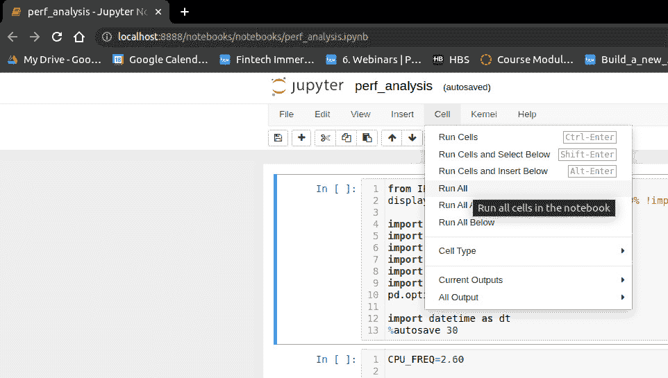

图 12.1 – perf_analysis.ipynb 笔记本的截图

由于我们不会讨论这个笔记本的细节，我们将简要描述其中执行的分析。这个笔记本按照以下顺序执行以下步骤：

1.  首先，它在当前工作目录中查找运行电子交易生态系统的日志文件。具体来说，它查找来自交易交易所的日志文件；在这个笔记本的情况下，我们查找`ClientId=1`的交易客户端的日志文件。

1.  它打开每个日志文件，并查找包含`RDTSC`和`TTT`标记的日志条目，以找到与我们在上一章中讨论并在前一小节中回顾的测量值相对应的日志条目。

1.  然后，它创建了两个`pandas` `DataFrame`实例，包含从日志文件中提取的每个测量值。

1.  对于对应于内部函数测量的测量条目，这些条目被标记为`RDTSC`令牌，我们生成了这些测量的散点图以及这些图的滚动平均值（以平滑整体延迟测量）。这里的一个关键点是，日志文件中的测量值代表`RDTSC`值的差异，即函数调用所经过的 CPU 周期数。在本笔记本中，我们使用 2.6 GHz 的常数因子将 CPU 周期转换为纳秒，这是针对我们系统的特定值，并且会根据您的硬件而有所不同；它需要调整。我们将在下一小节中查看这些图的一些示例。

1.  对于对应于我们电子交易生态系统关键位置的时间戳的测量条目，这些条目被标记为`TTT`令牌，我们也生成了散点图和滚动平均值图。这里的区别在于我们显示了从一个跳到另一个跳的传输时间。例如，我们将绘制从`T1_OrderServer_TCP_read`跳到`T2_OrderServer_LFQueue_write`跳的时间，从`T2_OrderServer_LFQueue_write`跳到`T3_MatchingEngine_LFQueue_read`跳，从`T3_MatchingEngine_LFQueue_read`跳到`T4_MatchingEngine_LFQueue_write`跳，等等。

这些在交易所侧的跨跳传输在以下图中展示。

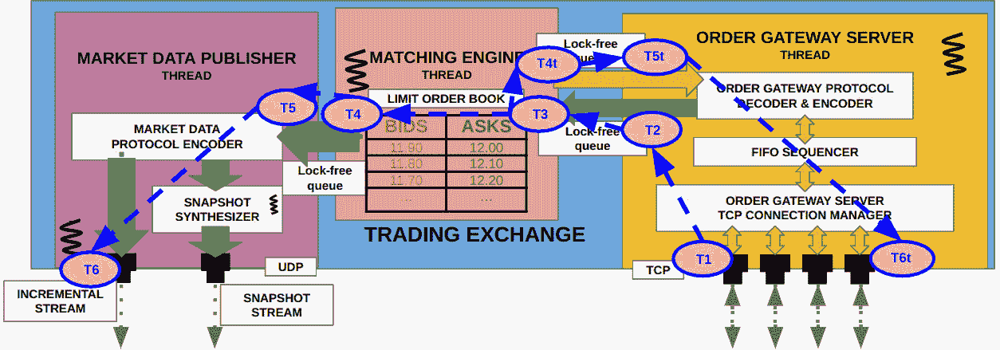

图 12.2 – 电子交易所不同跳之间的数据流

这些在交易客户端侧的跨跳传输在以下图中展示。

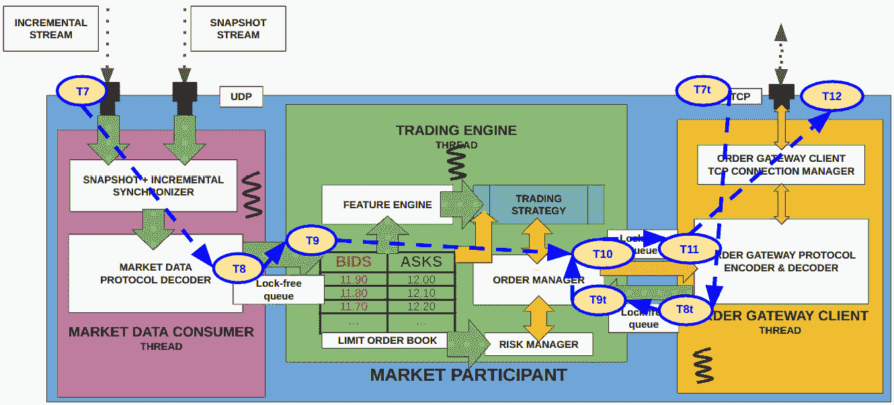

图 12.3 – 电子交易客户端不同跳之间的数据流

在下一小节中，我们将观察来自两组（`RDTSC`和`TTT`）的一些不同延迟指标的分布，并看看我们能从中学习到什么。

## 理解分析输出

在本节中，我们将展示我们在上一章中添加并使用上一小节中展示的笔记本分析的测量子集的延迟分布。我们的目标是深入了解我们生态系统中不同组件和子组件的性能。首先，我们将在下一小节中从内部函数调用的延迟的几个示例开始。需要注意的是，为了简洁起见，我们将展示和讨论本章 Python 笔记本中所有性能图的一个子集。另外，请注意，这些图没有按照任何特定的顺序排列；我们只是挑选了一些更有趣的图，并将所有可能的图都留在了笔记本中供您进一步检查。

### 观察内部函数调用的延迟

本章中我们首先展示的性能图表是在交易交易所内部匹配引擎中调用`Exchange::MEOrderBook::removeOrder()`方法的延迟分布。它呈现如下，但我们的关键结论是，这是一个表现非常好的函数；也就是说，最小和最大延迟在 0.4 到 3.5 微秒的紧密范围内，平均值相对稳定在 1 到 1.5 微秒的范围内。当然，有可能使其更快，但现在这似乎表现良好，并且具有低性能延迟；在尝试进一步优化之前，我们应该评估此方法是否是瓶颈。

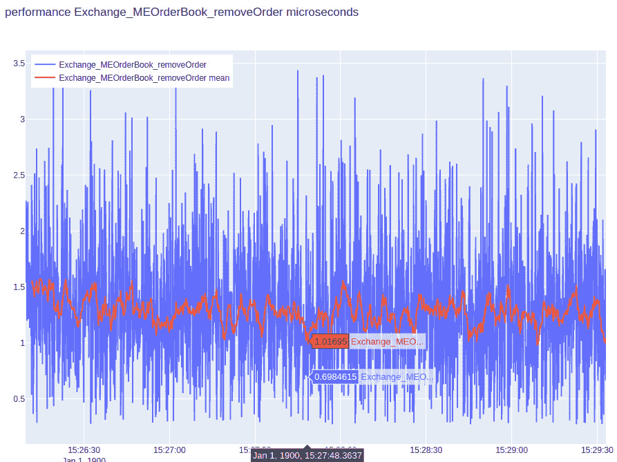

图 12.4 – MEOrderBook 中 removeOrder()方法在匹配引擎中的延迟分布

下一个图表展示了`Exchange::FIFOSequencer::sequenceAndPublish()`方法的延迟分布。这个实例更有趣，因为在这里我们看到，尽管这个方法在 90 微秒范围内具有较低的平均延迟，但它经历了许多延迟峰值，峰值达到 500 到 1,200 微秒。这种行为将导致`OrderServer`组件在处理客户端订单请求时的性能出现抖动，这是我们可能需要调查的问题。

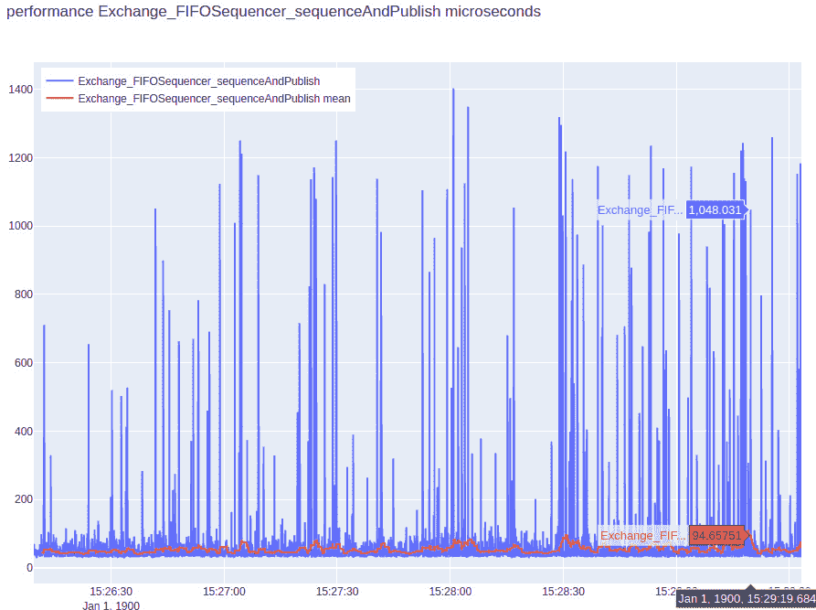

图 12.5 – FIFOSequencer 中 sequenceAndPublish()方法在匹配引擎中的延迟分布

下一个图表显示了`Trading::PositionKeeper::addFill()`方法的另一个有趣的延迟值分布。在这种情况下，平均性能延迟稳定在 50 微秒左右。然而，在**15:28:00**到**15:29:00**之间，有几个延迟峰值需要进一步观察。与*图 12.4*相比，这里的差异在于那里的峰值分布均匀，但在这个案例中，似乎有一个小的峰值区域。

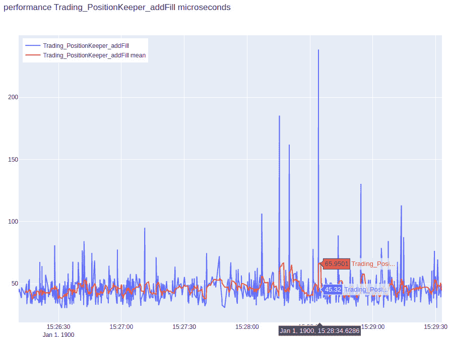

图 12.6 – PositionKeeper 中 addFill()方法在交易引擎中的延迟分布

我们通过展示另一个图表来结束本小节，这次是`Trading::PositionKeeper::updateBBO()`方法的图表，它更新了开放头寸的损益。这是一个表现良好的方法，平均性能延迟为 10 微秒，似乎有很多测量值接近 0 微秒，这与*图 12.3*略有不同，在那里最小延迟值从未显著接近 0。

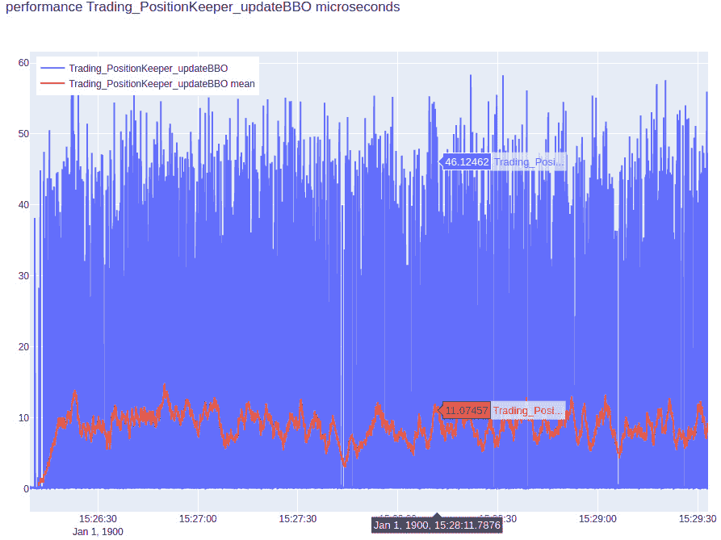

图 12.7 – 交易引擎 PositionKeeper 中 updateBBO()方法的延迟分布

在下一小节中，我们将查看一些类似的例子，但这次是关于我们生态系统中不同跳之间的延迟。

### 观察生态系统中跳之间的延迟

我们将要查看的第一个图表是交易客户端的`OrderGateway`组件将客户端请求写入 TCP 套接字（`T12`）到交易所的`OrderServer`组件从 TCP 套接字读取该客户端请求（`T1`）的时间差。这代表了 TCP 连接上从交易客户端到交易交易所的网络传输时间。在这种情况下，平均延迟大约在 15 到 20 微秒之间，分布是均匀的。

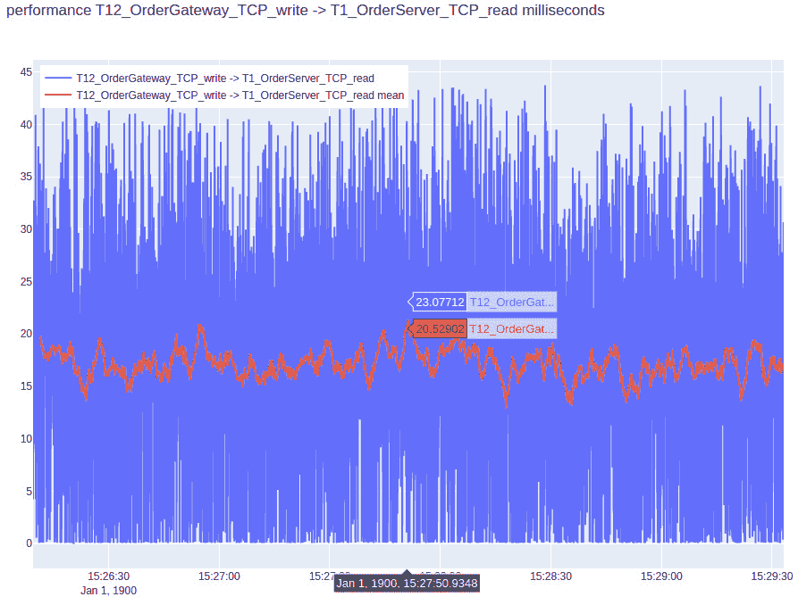

图 12.8 – T12_OrderGateway_TCP_write 和 T1_OrderServer_TCP_read 跳之间的延迟分布

下一个图表显示了市场数据更新的网络传输时间分布，从市场数据更新由`MarketDataPublisher`（`T6`）写入 UDP 套接字到由`MarketDataConsumer`（`T7`）从 UDP 套接字读取它们的时间。如图所示，这个测量的延迟似乎有很大的变化；然而，这个路径的整体延迟比 TCP 路径要低。

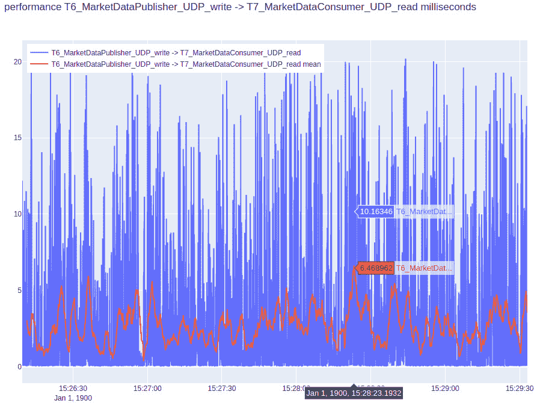

图 12.9 – T6_MarketDataPublisher_UDP_write 和 T7_MarketDataConsumer_UDP_read 跳之间的延迟分布

下一个图表显示了从`MarketDataConsumer`从 UDP 套接字（`T7`）读取市场更新到市场更新写入连接到`TradeEngine`的`LFQueue`（`T8`）的时间的延迟分布。与平均性能大约为 100 微秒相比，这个路径的延迟出现了巨大的峰值（高达 2,000 微秒），因此这是我们需要调查的。

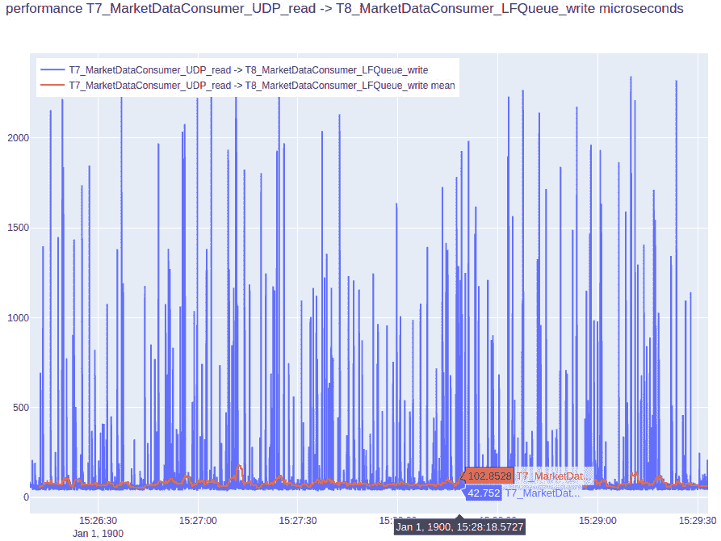

图 12.10 – T7_MarketDataConsumer_UDP_read 和 T8_MarketDataConsumer_LFQueue_write 跳之间的延迟分布

下一个图表显示了`MatchingEngine`从连接到`OrderServer`的`LFQueue`（`T3`）读取客户端请求到`MatchingEngine`处理它并将客户端响应写回`LFQueue`到`OrderServer`（`T4t`）之间的延迟分布。这个路径似乎也经历了大的延迟峰值，应该进行调查。

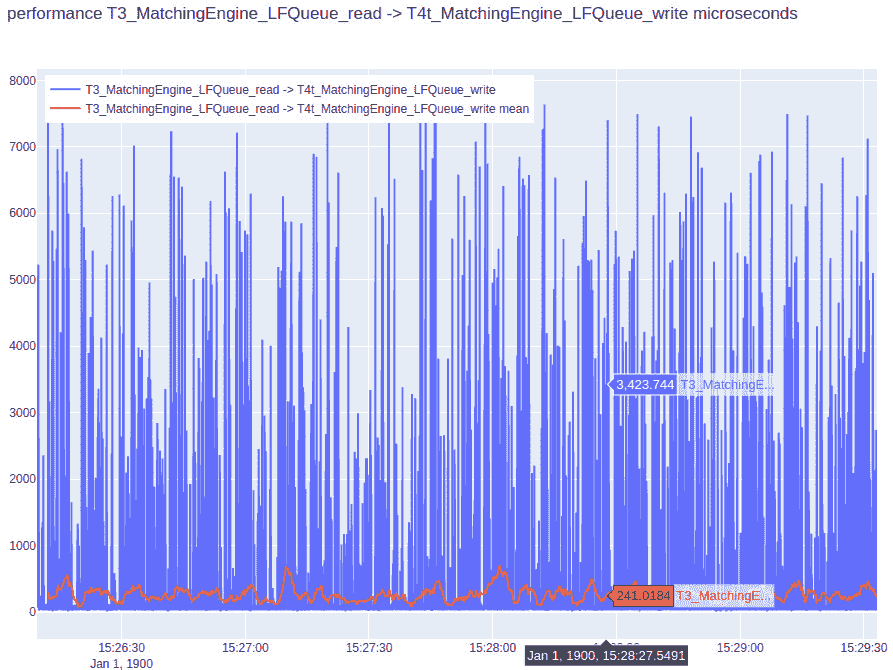

图 12.11 – T3_MatchingEngine_LFQueue_read 和 T4t_MatchingEngine_LFQueue_write 跳数之间的延迟分布

本节专门用于分析我们生态系统中的不同延迟测量。在下一节中，我们将讨论一些我们可以用来优化我们电子交易生态系统中不同组件的设计和实现的技巧和技术。

# 讨论优化我们的 C++交易系统的技巧和技术

在本节中，我们将展示一些我们可以优化我们的 C++交易生态系统的可能区域。请注意，这些只是一些示例，还有很多其他可能性，但我们将让您去衡量和发现这些低效之处，以及进一步改进它们。为了重申我们之前提到过几次的内容，您应该使用我们在上一章“添加仪表和测量性能”中学到的所有知识来衡量您系统各个部分的性能。您应该使用本章中讨论的方法来分析它们，并使用我们在“从低延迟应用程序的角度探索 C++概念”这一章节中讨论的 C++讨论来进一步改进它们。现在，让我们讨论一些改进的区域。我们试图将这些区域从最少到最多工作量进行排列。

## 优化发布构建

第一建议是尝试优化我们为系统运行的发布构建。我们可以在代码本身中做的简单事情是，从发布二进制文件中移除对`ASSERT()`的调用。背后的动机是移除这个宏在我们代码库中任何使用的地方引入的额外`if`条件。然而，这可能是危险的，因为我们可能会允许异常条件通过。最佳折衷方案是从安全的地方移除此宏在关键代码路径上的使用。

另一个建议是减少发布构建中的日志记录。我们已经付出了相当大的努力来使日志记录高效且低延迟。此外，完全消除日志记录是不明智的，因为它会使故障排除变得困难，甚至不可能。然而，日志记录不是免费的，因此我们应该尽可能减少发布构建中的关键路径上的日志记录。

如我们在此处所建议的，执行优化的最常见方法，仅适用于发布构建，是定义 NDEBUG（无调试）预处理器标志，并在我们的代码库中检查其存在。如果定义了此标志，我们将构建发布版本并跳过非必要代码，例如断言和日志记录。

这里展示了`MemoryPool::deallocate()`方法的示例：

```cpp
    auto deallocate(const T *elem) noexcept {
      const auto elem_index = (reinterpret_cast<const
         ObjectBlock *>(elem) - &store_[0]);
#if !defined(NDEBUG)
      ASSERT(elem_index >= 0 && static_cast<size_t>
       (elem_index) < store_.size(), "Element being
      deallocated does not belong to this Memory pool.");
      ASSERT(!store_[elem_index].is_free_, "Expected in-use
         ObjectBlock at index:" + std::
            to_string(elem_index));
#endif
      store_[elem_index].is_free_ = true;
    }
```

这里展示了`FIFOSequencer::sequenceAndPublish()`方法的另一个示例：

```cpp
    auto sequenceAndPublish() {
      ...
#if !defined(NDEBUG)
      logger_->log("%:% %() % Processing % requests.\n",
          __FILE__, __LINE__, __FUNCTION__, Common::
            getCurrentTimeStr(&time_str_), pending_size_);
#endif
      ...
      for (size_t i = 0; i < pending_size_; ++i) {
        const auto &client_request =
           pending_client_requests_.at(i);
#if !defined(NDEBUG)
        logger_->log("%:% %() % Writing RX:% Req:% to
         FIFO.\n", __FILE__, __LINE__, __FUNCTION__,
          Common::getCurrentTimeStr(&time_str_),
                     client_request.recv_time_,
                        client_request.request_.toString());
#endif
    ...
    }
```

另一个需要考虑的问题是，实际记录的条目是否可以以更优的方法输出。例如，`Common::getCurrentTimeStr()`，在当前代码库状态下的每条日志记录中都会被调用，它相当昂贵。这是因为它使用`sprintf()`执行字符串格式化操作，这就像大多数字符串格式化操作一样昂贵。在这里，我们有一个优化，在发布构建中，我们可以输出一个简单的整数来表示时间，而不是格式化的字符串，虽然更易读，但效率更低。

让我们继续探讨下一个可能的优化领域——管理线程亲和性。

## 正确设置线程亲和性

到目前为止，在创建和启动线程的所有实例中，我们都在调用`Common::createAndStartThread()`方法时传递了`core_id`参数为`-1`；也就是说，线程没有被固定在任何特定的核心上。这是故意为之，因为我们之前提到过，`exchange_main`应用程序实例创建并运行 10 个线程，而每个`trading_main`应用程序实例创建并运行 8 个线程。除非你在生产级交易服务器上执行这本书的源代码，否则不太可能有太多的 CPU 核心。例如，我们的系统只有四个核心。然而，在实践中，以下性能关键线程将各自分配一个 CPU 核心。我们接下来将展示一个核心分配的示例；然而，这会因服务器而异，也可能取决于 NUMA 架构——但这超出了本书的范围。请注意，这些名称指的是我们在`name`字符串参数中传递给方法的名称：

+   `core_id`=0 : `Exchange/MarketDataPublisher`

+   `core_id`=1 : `Exchange/MatchingEngine`

+   `core_id`=2 : `Exchange/OrderServer`

+   `core_id`=3 : `Trading/MarketDataConsumer`

+   `core_id`=4 : `Trading/OrderGateway`

+   `core_id`=5 : `Trading/TradeEngine`

+   任何额外的性能关键线程将以类似的方式分配剩余的核心 ID

剩余的非关键线程以及服务器上运行的任何 Linux 进程都将分配一组 CPU 核心来运行，而不进行任何亲和性设置。具体来说，在我们的系统中，它们将是以下非关键线程：

+   `core_id`=-1 : `Exchange/SnapshotSynthesizer`

+   `core_id`=-1 : `Common/Logger exchange_main.log`

+   `core_id`=-1 : `Common/Logger exchange_matching_engine.log`

+   `core_id`=-1 : `Common/Logger exchange_market_data_publisher.log`

+   `core_id`=-1 : `Common/Logger exchange_snapshot_synthesizer.log`

+   `core_id`=-1 : `Common/Logger exchange_order_server.log`

+   `core_id`=-1 : `Common/Logger trading_main_1.log`

+   `core_id`=-1 : `Common/Logger trading_engine_1.log`

+   `core_id`=-1 : `Common/Logger trading_order_gateway_1.log`

+   `core_id`=-1 : `Common/Logger trading_market_data_consumer_1.log`

+   任何其他非关键线程也会被分配核心 ID -1，即这些线程不会被固定在任何一个特定的 CPU 核心上

注意一个额外的细节：为了使此设置尽可能优化，我们需要确保 Linux 进程调度器不将任何操作系统进程分配给被关键线程使用的 CPU 核心。在 Linux 上，这是通过使用`isolcpus`内核参数实现的，我们在此不详细讨论。`isolcpus`参数告诉进程调度器在决定在哪里调度进程时忽略哪些核心。

## 优化字符串的 Logger

我们有机会优化`Logger`类以更好地处理`char*`类型的参数。记住，我们记录`char*`参数的实现是通过迭代地对每个字符调用`Logger::pushValue(const char value)`方法，如下所示：

```cpp
    auto pushValue(const char *value) noexcept {
      while (*value) {
        pushValue(*value);
        ++value;
      }
    }
```

这里的一个选择是向`LogType`枚举中引入一个新的枚举值。让我们称它为`STRING`，如下所示：

```cpp
  enum class LogType : int8_t {
    ...
    DOUBLE = 8,
    STRING = 9
  };
```

我们将更新`LogElement`类型，使其具有固定大小的`char*`数组，如下所示。我们故意对数组的尺寸保持模糊，因为这是伪代码，我们更关注设计和想法，而不是实现细节：

```cpp
  struct LogElement {
    LogType type_ = LogType::CHAR;
    union {
      ...
      double d;
      char str[SOME_SIZE];
    } u_;
  };
```

最后，更新`Logger::pushValue(const char *value)`和`Logger::flushQueue()`，以便以字符块的形式复制和写入字符串，而不是一次写入一个字符。

## 消除 std::function 实例的使用

在我们的代码库中，我们在几个地方使用了`std::function<>`函数包装器，如下所示：

+   `Common::McastSocket`:

    ```cpp
    std::function<void(McastSocket *s)> recv_callback_;
    ```

+   `Common::TCPServer`:

    ```cpp
    std::function<void(TCPSocket *s, Nanos rx_time)> recv_callback_;
    ```

    ```cpp
    std::function<void()> recv_finished_callback_;
    ```

+   `Common::TCPSocket`:

    ```cpp
    std::function<void(TCPSocket *s, Nanos rx_time)> recv_callback_;
    ```

+   `Trading::TradeEngine`:

    ```cpp
    std::function<void(TickerId ticker_id, Price price, Side side, MarketOrderBook *book)> algoOnOrderBookUpdate_;
    ```

    ```cpp
    std::function<void(const Exchange::MEMarketUpdate *market_update, MarketOrderBook *book)> algoOnTradeUpdate_;
    ```

    ```cpp
    std::function<void(const Exchange::MEClientResponse *client_response)> algoOnOrderUpdate_;
    ```

通过这些对象调用函数比直接调用函数慢，并且这些调用会带来与`virtual`函数相似的成本。使用`std::function<>`对象调用方法的这种机制可以用模板来替换。为了刷新您对间接调用函数的缺点，请重新阅读章节*从低延迟应用程序的角度探索 C++概念*，特别是*调用函数高效*部分的*避免函数指针*子部分。此外，请重新阅读同一章节中的*使用编译时多态*部分，回顾我们代码库中`std::function<>`实例的讨论，但我们鼓励有兴趣的人尝试进行这种改进。

## 检查这些优化的影响

我们无法详细调查每一个优化机会，但在完成本节之前，我们将讨论本节中提到的两个优化的细节。首先，让我们讨论对用于记录字符串的`Logger`类的优化实现及其影响。

### 基准测试 Logger 字符串优化

为了实现日志记录器的字符串优化，我们将改变之前讨论过的 `pushValue()` 方法，用于 `char*` 参数。为了简洁起见，我们不会查看完整的类，我们将在 `Chapter12/common/opt_logging.h` 源文件中实现的备用 `OptLogger` 类中查看。这里显示的是最重要的更改，但请参阅完整的源文件以查看其他一些小的更改：

```cpp
    auto pushValue(const char *value) noexcept {
      LogElement l{LogType::STRING, {.s = {}}};
      strncpy(l.u_.s, value, sizeof(l.u_.s) - 1);
      pushValue(l);
    }
```

为了对这个进行基准测试并与原始的 `Logger` 实现进行比较，我们将创建一个简单的独立二进制文件，称为 `logger_benchmark`。我们这样做是为了能够在受控环境中检查性能影响。请记住，运行完整的交易生态系统会引入许多变量，包括进程和线程的数量、网络活动、交易活动等，这可能会很难正确评估 `Logger` 优化的影响。这个基准测试应用程序的源代码可以在 `Chapter12/benchmarks/logger_benchmark.cpp` 源文件中找到。在查看结果之前，让我们快速查看这个源文件的实现。

首先，我们将包含与原始 `Logger` 和新 `OptLogger` 类对应的头文件：

```cpp
#include "common/logging.h"
#include "common/opt_logging.h"
```

接下来，我们将定义一个 `random_string()` 方法，它简单地生成指定长度的随机字符串。我们将使用这个方法来生成随机字符串，以便两个日志记录器进行记录，比较字符串方面的性能差异。这使用了 `charset()` lambda 方法，该方法返回一个随机的字母数字字符（0-9，a-z 或 A-Z）。然后，它使用 `std::generate_n()` 方法通过重复调用 `charset()` lambda 方法来生成一个长度由长度参数指定的 `std::string`：

```cpp
std::string random_string(size_t length) {
  auto randchar = []() -> char {
    const char charset[] =
        "0123456789"
        "ABCDEFGHIJKLMNOPQRSTUVWXYZ"
        "abcdefghijklmnopqrstuvwxyz";
    const size_t max_index = (sizeof(charset) - 1);
    return charset[rand() % max_index];
  };
  std::string str(length, 0);
  std::generate_n(str.begin(), length, randchar);
  return str;
}
```

接下来，我们将定义一个 `benchmarkLogging()` 方法，它接受一个模板参数 `T`，它期望它是一个我们在这里比较的两个日志记录器之一的实例。它运行一个循环 100,000 次，并使用我们之前构建的 `random_string()` 方法和日志记录器的 `log()` 方法来记录 100,000 个随机字符串。对于 `log()` 方法的每次调用，它使用我们在上一章中构建的 `Common::rdtsc()` 方法记录并累加时钟周期的差异。最后，它通过将每个 RDTSC 差异的和除以循环次数来返回平均时钟周期数：

```cpp
template<typename T>
size_t benchmarkLogging(T *logger) {
  constexpr size_t loop_count = 100000;
  size_t total_rdtsc = 0;
  for (size_t i = 0; i < loop_count; ++i) {
    const auto s = random_string(128);
    const auto start = Common::rdtsc();
    logger->log("%\n", s);
    total_rdtsc += (Common::rdtsc() - start);
  }
  return (total_rdtsc / loop_count);
}
```

现在，我们终于可以构建 `main()` 方法了，它相当简单。它创建了一个旧日志记录器的实例 – `Common::Logger()`，然后调用其上的 `benchmarkLogging()` 方法，并将平均时钟周期数输出到屏幕。然后，它再次执行完全相同的事情，只是这次它使用的是新的日志记录器 – `OptCommon::OptLogger()`：

```cpp
int main(int, char **) {
  using namespace std::literals::chrono_literals;
  {
    Common::Logger logger("logger_benchmark_original.log");
    const auto cycles = benchmarkLogging(&logger);
    std::cout << "ORIGINAL LOGGER " << cycles << " CLOCK
      CYCLES PER OPERATION." << std::endl;
    std::this_thread::sleep_for(10s);
  }
  {
    OptCommon::OptLogger opt_logger
      ("logger_benchmark_optimized.log");
    const auto cycles = benchmarkLogging(&opt_logger);
    std::cout << "OPTIMIZED LOGGER " << cycles << " CLOCK
      CYCLES PER OPERATION." << std::endl;
    std::this_thread::sleep_for(10s);
  }
  exit(EXIT_SUCCESS);
}
```

这个二进制文件可以使用之前的相同脚本构建，即从`Chapter12`根目录运行`scripts/build.sh`。要运行二进制文件，您可以直接从命令行调用它，如下所示，并且，在输出中，您将看到以下两行显示基准测试的结果：

```cpp
sghosh@sghosh-ThinkPad-X1-Carbon-3rd:~/Building-Low-Latency-Applications-with-CPP/Chapter12$ ./cmake-build-release/logger_benchmark
ORIGINAL LOGGER 25757 CLOCK CYCLES PER OPERATION.
OPTIMIZED LOGGER 466 CLOCK CYCLES PER OPERATION.
```

注意，每次运行的输出可能会有所不同，您得到的结果可能会因系统依赖性而不同，但优化所加快的速度应该与我们所展示的相似。在这种情况下，我们的优化努力似乎使字符串的`log()`方法加快了大约 50 倍。接下来，让我们看看我们之前讨论的优化技巧的另一个示例，即优化发布构建的二进制文件。

### 基准测试发布构建优化

为了基准测试从发布构建中省略非必要代码的示例，我们选择了`MemPool`类。请注意，这个原则适用于我们构建的所有组件，但我们随意选择了一个来限制我们讨论的范围。类似于我们对`Logger`类所做的那样，我们创建了一个新的类，称为`OptMemPool`，您可以在`Chapter12/common/opt_mem_pool.h`源文件中找到它。与`MemPool`类相比，这个文件的主要变化是，对`ASSERT()`的调用仅针对非发布构建进行编译。这通过检查`NDEBUG`预处理器标志来实现，如下面的两个示例所示。您可以在我们之前提到的文件中查看完整的源代码：

```cpp
    template<typename... Args>
    T *allocate(Args... args) noexcept {
      auto obj_block = &(store_[next_free_index_]);
#if !defined(NDEBUG)
      ASSERT(obj_block->is_free_, "Expected free
        ObjectBlock at index:" + std::to_string
          (next_free_index_));
#endif
      ...
    }
    auto deallocate(const T *elem) noexcept {
      const auto elem_index = (reinterpret_cast<const
        ObjectBlock *>(elem) - &store_[0]);
#if !defined(NDEBUG)
      ASSERT(elem_index >= 0 && static_cast
        <size_t>(elem_index) < store_.size(), "Element
          being deallocated does not belong to this Memory
            pool.");
      ASSERT(!store_[elem_index].is_free_, "Expected in-use
        ObjectBlock at index:" + std::to_string
          (elem_index));
#endif
      ...
    }
```

为了基准测试这个优化，我们将构建一个`release_benchmark`二进制文件，其代码可在`Chapter12/benchmarks/release_benchmark.cpp`源文件中找到。首先，让我们看看我们需要包含的头文件，最重要的是`mem_pool.h`和`opt_mem_pool.h`文件。由于内存池存储结构，我们将使用`Exchange::MDPMarketUpdate`作为示例，因此我们也包含`market_update.h`头文件：

```cpp
#include "common/mem_pool.h"
#include "common/opt_mem_pool.h"
#include "common/perf_utils.h"
#include "exchange/market_data/market_update.h"
```

类似于我们对`logger_benchmark.cpp`文件所做的那样，我们将创建一个`benchmarkMemPool()`方法，它接受一个模板参数`T`，并期望它是我们比较的两个内存池之一。在这个方法中，我们首先使用`allocate()`方法从内存池中分配并保存 256 个`MDPMarketUpdate`对象。然后，我们将使用`deallocate()`方法释放这些对象并将它们返回到内存池中。我们将运行这个循环 100,000 次，以在多次迭代中找到一个可靠的平均值。我们将测量并累加每次调用`allocate()`和`deallocate()`所花费的时钟周期，就像我们在日志基准测试中所做的那样。最后，我们将通过将时钟周期总和除以循环计数来返回平均时钟周期：

```cpp
template<typename T>
size_t benchmarkMemPool(T *mem_pool) {
  constexpr size_t loop_count = 100000;
  size_t total_rdtsc = 0;
  std::array<Exchange::MDPMarketUpdate*, 256>
    allocated_objs;
  for (size_t i = 0; i < loop_count; ++i) {
    for(size_t j = 0; j < allocated_objs.size(); ++j) {
      const auto start = Common::rdtsc();
      allocated_objs[j] = mem_pool->allocate();
      total_rdtsc += (Common::rdtsc() - start);
    }
    for(size_t j = 0; j < allocated_objs.size(); ++j) {
      const auto start = Common::rdtsc();
      mem_pool->deallocate(allocated_objs[j]);
      total_rdtsc += (Common::rdtsc() - start);
    }
  }
  return (total_rdtsc / (loop_count *
    allocated_objs.size()));
}
```

最后，我们构建了`main()`方法，这同样非常简单。它调用了两次`benchmarkMemPool()`方法，一次是用`Common::MemPool`类型的对象，另一次是用`OptCommon::OptMemPool`类型的对象，并输出了`allocate()`和`deallocate()`方法的平均时钟周期数：

```cpp
int main(int, char **) {
  {
    Common::MemPool<Exchange::MDPMarketUpdate>
      mem_pool(512);
    const auto cycles = benchmarkMemPool(&mem_pool);
    std::cout << "ORIGINAL MEMPOOL " << cycles << " CLOCK
      CYCLES PER OPERATION." << std::endl;
  }
  {
    OptCommon::OptMemPool<Exchange::MDPMarketUpdate>
      opt_mem_pool(512);
    const auto cycles = benchmarkMemPool(&opt_mem_pool);
    std::cout << "OPTIMIZED MEMPOOL " << cycles << " CLOCK
      CYCLES PER OPERATION." << std::endl;
  }
  exit(EXIT_SUCCESS);
}
```

构建这个基准二进制的过程保持不变，所以我们将不会重复它。运行二进制文件将产生类似于以下内容的结果：

```cpp
sghosh@sghosh-ThinkPad-X1-Carbon-3rd:~/Building-Low-Latency-Applications-with-CPP/Chapter12$ ./cmake-build-release/release_benchmark
ORIGINAL MEMPOOL 343 CLOCK CYCLES PER OPERATION.
OPTIMIZED MEMPOOL 44 CLOCK CYCLES PER OPERATION.
```

在这种情况下，我们的优化努力使得`allocate()`和`deallocate()`方法的速度提高了大约 7 到 8 倍。

在本节中，我们介绍并解释了我们电子交易生态系统中的优化领域/想法的一个子集。我们的目标是让你了解这些优化领域可能的样子，以及如何以优化性能为目标来处理它们。在下一节中，我们将讨论一些更多可以对我们电子交易生态系统进行的未来改进和增强。

# 思考我们交易生态系统的未来

在我们结束这一章节和这本书之前，我们将讨论一些可能的增强我们的电子交易生态系统的方案。在前一节中，我们讨论了一些可以优化的例子，对于那些希望最大化我们在这本书中构建的电子交易系统性能的人来说。在本节中，我们将讨论一些如何增强这个生态系统的例子，不一定是为了减少延迟，而是为了让系统更加功能丰富并增加功能。

## 动态增长容器

我们在这本书中构建并使用了一些容器，如下所示：

+   无锁队列 - `LFQueue` - 被用于多个组件，用于各种对象类型，例如`MEMarketUpdate`、`MDPMarketUpdate`、`MEClientRequest`和`MEClientResponse`

+   内存池 - `MemPool` - 被用于多种对象类型，例如`MEMarketUpdate`、`MEOrder`、`MEOrdersAtPrice`、`MarketOrder`和`MarketOrdersAtPrice`的实例

在所有这些情况下，我们都假设了一个安全的最大值。在实践中，这仍然使我们面临在某种情况下可能超过这些限制并陷入麻烦的可能性。我们可以对这个系统进行的一个增强是改进我们对这种不太可能边缘情况的处理。

一个选择是在遇到`LFQueue`已满或`MemPool`内存不足的场景时失败/退出。另一个选择是在这种不太可能的事件中回退到动态内存分配或一个次级低效的容器；也就是说，在我们耗尽内存或容器空间的情况下，我们将变得低效和缓慢，但我们将继续运行直到问题解决。另一个选择是使这些容器具有灵活性，在需要时可以扩展，尽管在需要时扩展这些容器的任务将非常缓慢，因为在实践中我们并不期望遇到那种情况。

## 增长和增强哈希映射

在本书中，我们假设一个安全的上限，在许多上下文中使用`std::array`作为哈希映射。例如，通过假设有效的`TickerId`值在 0 和`ME_MAX_TICKERS`之间，我们使用了大小为`ME_MAX_TICKERS`的`std::array`实例作为以`TickerId`为键的哈希映射。类似的设计也用于`TradeEngineCfgHashMap`、`OrderHashMap`、`ClientOrderHashMap`、`OrdersAtPriceHashMap`、`OrderBookHashMap`、`MarketOrderBookHashMap`和`OMOrderTickerSideHashMap`等容器。虽然在实际应用中，其中一些可以继续存在，也就是说，可以决定并使用有效的合理上限，但对于其中的一些，这种设计将无法优雅地扩展。

可用的哈希映射实现有多种——`std::unordered_map`、`absl::flat_hash_map`、`boost::`哈希映射、`emhash7::HashMap`、`folly::AtomicHashmap`、`robin_hood::unordered_map`、`tsl::hopscotch_map`以及更多。此外，通常会对这些容器进行优化和调整，以便在特定的使用场景下表现最佳。我们将把这个任务留给那些对此感兴趣的人，即探索这些实现并决定哪些可以替换我们系统中基于`std::array`的哈希映射。

为了演示一个例子，我们将替换掉匹配引擎构建和维护的基于`std::array`的订单簿中的哈希映射（`MEOrderBook`），用`std::unordered_map`哈希映射。然后我们将对这两种实现进行基准测试，看看有多大差别。按照我们在本章前面进行的基准测试所使用的相同模式，我们将引入一个新的`MEOrderBook`类，名为`UnorderedMapMEOrderBook`，其中唯一的区别是使用`std::unordered_map`容器而不是`std::array`容器。这个新类的所有源代码都可在`Chapter12/exchange/matcher/unordered_map_me_order_book.h`和`Chapter12/exchange/matcher/unordered_map_me_order_book.cpp`源文件中找到。为了简洁起见，我们不会在这里重复整个类的实现，但我们将讨论重要的更改。第一个重要且明显的变化是在`unordered_map_me_order_book.h`头文件中包含了`unordered_map`头文件：

```cpp
#include <unordered_map>
```

我们将`cid_oid_to_order_`数据成员更改为`std::unordered_map<ClientId, std::unordered_map<OrderId, MEOrder *>>`，而不是`ClientOrderHashMap`，它是`std::array<OrderHashMap, ME_MAX_NUM_CLIENTS>`的`typedef`。这个数据成员是一个从`ClientId`到`OrderId`再到`MEOrder`对象的哈希表。记住，`ClientOrderHashMap`实际上是一个哈希表的哈希表，即一个其元素也是`std::array`对象的`std::array`。我们更改的另一个数据成员是`price_orders_at_price_`成员，我们将其更改为`std::unordered_map<Price, MEOrdersAtPrice *>`，而不是`OrdersAtPriceHashMap`类型。这个数据成员是一个从`Price`到`MEOrdersAtPrice`对象的哈希表。如果你忘记了`MEOrder`和`MEOrdersAtPrice`是什么，请回顾章节“构建 C++撮合引擎”中的“定义撮合引擎中的操作和交互”部分的“设计交易所订单簿”子部分。以下是这些更改的示例：

```cpp
namespace Exchange {
  class UnorderedMapMEOrderBook final {
  private:
    ...
    std::unordered_map<ClientId, std::
      unordered_map<OrderId, MEOrder *>> cid_oid_to_order_;
    std::unordered_map<Price, MEOrdersAtPrice *>
      price_orders_at_price_;
    ...
  };
}
```

我们需要从析构函数中移除以下行，因为`fill()`方法不适用于`std::unordered_map`对象：

```cpp
  MEOrderBook::~MEOrderBook() {
    …
    for (auto &itr: cid_oid_to_order_) {
      itr.fill(nullptr);
    }
  }
```

在访问这些修改后的容器方面，我们将对`cid_oid_to_order_`和`price_orders_at_price_`的`std::array::at()`方法调用替换为`std::unordered_map::operator[]`方法。以下是`cid_oid_to_order_`的这些更改：

```cpp
    auto removeOrder(MEOrder *order) noexcept {
      ...
      cid_oid_to_order_[order->client_id_][order->
        client_order_id_] = nullptr;
      order_pool_.deallocate(order);
    }
    auto addOrder(MEOrder *order) noexcept {
      ...
      cid_oid_to_order_[order->client_id_][order->
        client_order_id_] = order;
    }
  auto UnorderedMapMEOrderBook::cancel(ClientId client_id,
    OrderId order_id, TickerId ticker_id) noexcept -> void {
    auto is_cancelable = (client_id <
      cid_oid_to_order_.size());
    MEOrder *exchange_order = nullptr;
    if (LIKELY(is_cancelable)) {
      auto &co_itr = cid_oid_to_order_[client_id];
      exchange_order = co_itr[order_id];
      is_cancelable = (exchange_order != nullptr);
    }
    ...
  }
```

我们需要在访问`price_orders_at_price_`容器的地方进行类似的更改，如下所示：

```cpp
    auto getOrdersAtPrice(Price price) const noexcept ->
      MEOrdersAtPrice * {
      if(price_orders_at_price_.find(priceToIndex(price))
        == price_orders_at_price_.end())
        return nullptr;
      return price_orders_at_price_
        .at(priceToIndex(price));
    }
    auto addOrdersAtPrice(MEOrdersAtPrice
      *new_orders_at_price) noexcept {
      price_orders_at_price_
        [priceToIndex(new_orders_at_price->price_)] =
          new_orders_at_price;
      ...
    }
    auto removeOrdersAtPrice(Side side, Price price)
      noexcept {
      ...
      price_orders_at_price_[priceToIndex(price)] =
        nullptr;
      orders_at_price_pool_.deallocate(orders_at_price);
    }
```

最后，我们展示了`hash_benchmark`二进制文件来衡量这些更改带来的性能差异。这个二进制文件的源代码可以在`Chapter12/benchmarks/hash_benchmark.cpp`源文件中找到。首先，我们包含以下头文件，并定义一个全局的`loop_count`变量，就像我们在之前的基准测试中所做的那样：

```cpp
#include "matcher/matching_engine.h"
#include "matcher/unordered_map_me_order_book.h"
static constexpr size_t loop_count = 100000;
```

如我们之前所做的那样，我们将定义一个`benchmarkHashMap()`方法，它接受一个模板参数`T`，以表示`MEOrderBook`或`UnorderedMapMEOrderBook`。它还接受一个`Exchange::MEClientRequest`消息的向量，这些消息将在基准测试中处理。实际的处理相当简单。它检查`MEClientRequest`的类型，然后对`ClientRequestType::NEW`调用`add()`方法，对`ClientRequestType::CANCEL`调用`cancel()`方法。我们使用`Common::rdtsc()`来测量并汇总每个这些调用所消耗的时钟周期，然后在方法结束时返回平均值：

```cpp
template<typename T>
size_t benchmarkHashMap(T *order_book, const
  std::vector<Exchange::MEClientRequest>& client_requests) {
  size_t total_rdtsc = 0;
  for (size_t i = 0; i < loop_count; ++i) {
    const auto& client_request = client_requests[i];
    switch (client_request.type_) {
      case Exchange::ClientRequestType::NEW: {
        const auto start = Common::rdtsc();
        order_book->add(client_request.client_id_,
          client_request.order_id_,
            client_request.ticker_id_,
                        client_request.side_,
                          client_request.price_,
                            client_request.qty_);
        total_rdtsc += (Common::rdtsc() - start);
      }
        break;
      case Exchange::ClientRequestType::CANCEL: {
        const auto start = Common::rdtsc();
        order_book->cancel(client_request.client_id_,
          client_request.order_id_,
            client_request.ticker_id_);
        total_rdtsc += (Common::rdtsc() - start);
      }
        break;
      default:
        break;
    }
  }
  return (total_rdtsc / (loop_count * 2));
}
```

现在，我们可以看看`main()`方法。我们需要`Logger`和`MatchingEngine`对象来创建`MEOrderBook`或`UnorderedMapMEOrderBook`对象，但为了创建`MatchingEngine`对象，我们需要三个无锁队列，正如我们在`exchange_main`二进制文件的实现中所看到的。因此，我们创建了这些对象，即使我们并没有测量这些组件的性能：

```cpp
int main(int, char **) {
  srand(0);
  Common::Logger logger("hash_benchmark.log");
  Exchange::ClientRequestLFQueue
    client_requests(ME_MAX_CLIENT_UPDATES);
  Exchange::ClientResponseLFQueue
    client_responses(ME_MAX_CLIENT_UPDATES);
  Exchange::MEMarketUpdateLFQueue
    market_updates(ME_MAX_MARKET_UPDATES);
  auto matching_engine = new Exchange::
    MatchingEngine(&client_requests, &client_responses,
      &market_updates);
```

接下来，我们将创建一个包含 100,000 个(`loop_count`) `MEClientRequest`对象的向量，这些对象将包括新订单请求以及取消这些订单的请求。我们在`trading_main`应用程序中已经看到了类似的代码，用于随机交易算法：

```cpp
  Common::OrderId order_id = 1000;
  std::vector<Exchange::MEClientRequest>
    client_requests_vec;
  Price base_price = (rand() % 100) + 100;
  while (client_requests_vec.size() < loop_count) {
    const Price price = base_price + (rand() % 10) + 1;
    const Qty qty = 1 + (rand() % 100) + 1;
    const Side side = (rand() % 2 ? Common::Side::BUY :
      Common::Side::SELL);
    Exchange::MEClientRequest new_request
      {Exchange::ClientRequestType::NEW, 0, 0, order_id++,
        side, price, qty};
    client_requests_vec.push_back(new_request);
    const auto cxl_index = rand() %
      client_requests_vec.size();
    auto cxl_request = client_requests_vec[cxl_index];
    cxl_request.type_ =
      Exchange::ClientRequestType::CANCEL;
    client_requests_vec.push_back(cxl_request);
  }
```

最后，我们通过调用`benchmarkHashMap()`方法两次来结束`main()`方法 – 一次使用`MEOrderBook`的实例，一次使用`UnorderedMapMEOrderBook`的实例，如下所示：

```cpp
  {
    auto me_order_book = new Exchange::MEOrderBook(0,
      &logger, matching_engine);
    const auto cycles = benchmarkHashMap(me_order_book,
      client_requests_vec);
    std::cout << "ARRAY HASHMAP " << cycles << " CLOCK
      CYCLES PER OPERATION." << std::endl;
  }
  {
    auto me_order_book = new Exchange::
      UnorderedMapMEOrderBook(0, &logger, matching_engine);
    const auto cycles = benchmarkHashMap(me_order_book,
      client_requests_vec);
    std::cout << "UNORDERED-MAP HASHMAP " << cycles << "
      CLOCK CYCLES PER OPERATION." << std::endl;
  }
  exit(EXIT_SUCCESS);
}
```

构建此应用程序的过程保持不变，即通过从`Chapter12`根目录调用`scripts/build.sh`脚本来完成。通过调用`hash_benchmark`二进制文件来运行应用程序，将产生类似于这里所示的结果，独立运行之间存在一些差异，并且取决于系统：

```cpp
sghosh@sghosh-ThinkPad-X1-Carbon-3rd:~/Building-Low-Latency-Applications-with-CPP/Chapter12$ ./cmake-build-release/hash_benchmark
Set core affinity for Common/Logger hash_benchmark.log 140327631447616 to -1
Set core affinity for Common/Logger exchange_matching_engine.log 140327461033536 to -1
ARRAY HASHMAP 142650 CLOCK CYCLES PER OPERATION.
UNORDERED-MAP HASHMAP 152457 CLOCK CYCLES PER OPERATION.
```

根据这次运行的输出，看起来从`std::array`哈希表实现切换到`std::unordered_map`哈希表实现，为`MEOrderBook`的`add()`和`cancel()`性能增加了大约 6 到 7%的额外开销。

## 优化快照消息

在我们为交易交易所的`MarketDataPublisher`组件设计的快照消息中，`START_SNAPSHOT`和`END_SNAPSHOT`消息之间的完整快照周期包含了所有交易工具的快照，如图所示（我们之前已经见过）。在我们的`SnapshotSynthesizer`中，所有交易工具的完整快照每 60 秒发布一次。这意味着，如果每个这些交易工具的订单簿有很多订单，那么每 60 秒，快照多播通道上的网络流量会有一个巨大的峰值，随后在剩余的 60 秒内保持沉默。

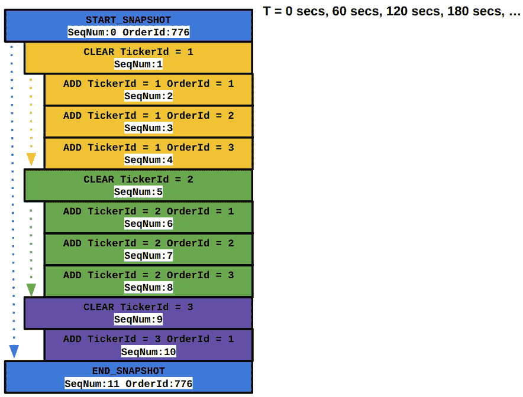

图 12.12 – 当前快照消息的组成

如果我们改变设计，使得这些快照更加均匀地分布，并且每个快照周期只包含对应于单个`TickerId`的快照消息，这将是一个改进。作为一个简单的例子，我们不是每 60 秒发送 6 个工具的快照消息周期，而是可以发送包含单个工具信息的 6 个快照，并且这些快照之间间隔 10 秒。这个假设性的建议在以下图中表示。

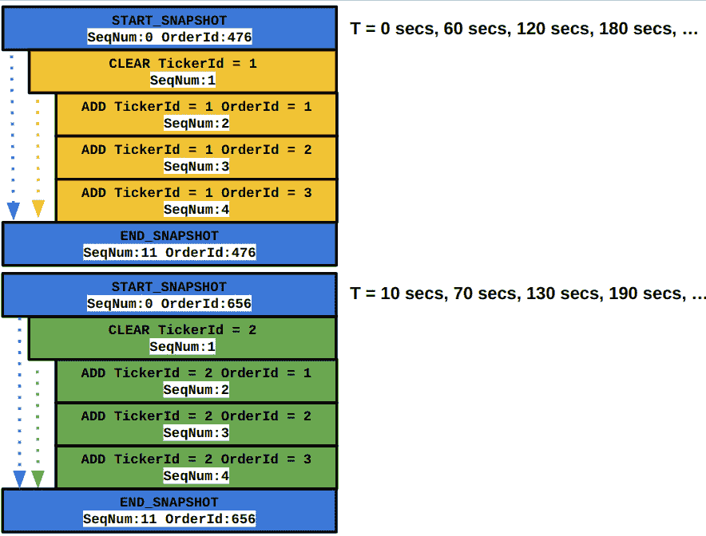

图 12.13 – 优化快照消息格式的建议

在这个新的提案中，正如我们提到的，由于完整快照是分时分布的，因此网络流量峰值较少。这导致在交易客户端系统的`MarketDataConsumer`组件的快照多播流中丢失数据包的可能性降低。这也使得客户端系统更快地同步或赶上每个交易工具的快照流，因为它不需要在标记某些工具为*恢复*之前等待所有交易工具的完整快照。

## 在订单协议中添加认证和拒绝消息

我们现在的电子交易交易所没有用户认证的概念，并且缺少很多错误检查和处理。这意味着它不会检查客户端是否使用正确的凭据登录并且是否有权交易他们试图交易的工具。此外，如果`ClientId`和`TCPSocket`实例不匹配，或者在客户端发送的`ClientRequest`消息中存在序列号差距，我们在`Exchange::OrderServer`中会静默忽略它。这在上面的代码块中显示，该代码块来自`exchange/order_server/order_server.h`源文件，我们已经详细讨论过：

```cpp
    auto recvCallback(TCPSocket *socket, Nanos rx_time)       noexcept {
      ...
      if (socket->next_rcv_valid_index_ >=         sizeof(OMClientRequest)) {
          ...
          if (cid_tcp_socket_[request->            me_client_request_.client_id_] != socket) {
            ...
            continue;
          }
          auto &next_exp_seq_num =             cid_next_exp_seq_num_[request->              me_client_request_.client_id_];
          if (request->seq_num_ != next_exp_seq_num) {
            ...
            continue;
          }
          ...
        }
        ...
      }
    }
```

静默忽略这些错误并不理想，因为客户端没有收到这些错误的通知。对此工作流程的改进是在`ClientResponse`消息协议中添加一个拒绝消息，`OrderServer`组件可以使用它来通知客户端这些错误。此增强是在我们建议改进订单协议以方便交易客户端认证之外进行的。

## 在订单协议中支持修改消息

我们当前对`ClientRequest`消息的订单协议仅支持`ClientRequestType::NEW`和`ClientRequestType::CANCEL`请求。对此协议的改进之一是添加一个`ClientRequestType::MODIFY`消息类型，以便客户端交易系统可以修改其订单的价格或数量属性。我们需要更新交易所侧的`OrderServer`、`MatchingEngine`、`MEOrderBook`和其他组件，以及交易客户端侧的`OrderGateway`、`OrderManager`、`MarketMaker`、`TradeEngine`和其他组件。

## 增强`trade engine`组件

交易引擎有几个可以改进和/或增强的组件。在本节中，我们为每个组件提供了简要的改进描述，以及可能的未来增强。

### 将风险指标添加到 RiskManager

在第*设计我们的交易生态系统*章的*理解风险管理系统*部分，我们描述了几种不同的风险指标。`RiskManager`仅使用这些风险指标的一小部分构建，可以通过添加额外的风险措施来增强，如该部分所述。

### 增强`OrderManager`

`OrderManager` 极其简单构建——它支持每侧最多一个活跃订单，也就是说，最多一个买入订单和一个卖出订单。显然，这是一个极其简化的版本，`OrderManager` 可以增强以支持更复杂的订单管理。

### 丰富 FeatureEngine

`FeatureEngine` 配置了两个硬编码的特征。它可以大量丰富以支持复杂特征配置、多种类型特征的库、这些特征之间的复杂交互等。

### 提升交易算法

本书中的 `LiquidityTaker` 和 `MarketMaker` 也是对现实交易策略的极其简单表示。这些可以在许多方面进行增强/改进——包括特征组合、订单管理、高效执行等方面的改进。

这结束了我们对电子交易生态系统未来增强可能性的讨论。

# 摘要

本章的第一部分专注于分析我们在上一章中添加到电子交易系统中的延迟指标。我们讨论了内部函数的几个延迟测量示例，以及系统关键跳转之间的几个延迟测量示例。目标是了解不同情况下延迟的分布，以便您了解如何识别和调查潜在问题或优化机会的区域。

在本章的第二部分，我们讨论了一些关于如何接近潜在性能优化可能性的技巧和技术。我们提供了一些可以改进的示例，并讨论了当前设计中的性能问题及其解决方案。

在结论部分，我们描述了本书中构建的电子交易生态系统的未来路线图。我们讨论了几个可以丰富以构建更成熟电子交易生态系统的不同组件、子组件和工作流程。

本书讨论的关于在 C++ 中开发的对延迟敏感的应用程序的方法和原则应指导您的旅程。我们构建的完整端到端电子交易生态系统是一个低延迟应用的典范，并希望提供了一个从零开始构建低延迟应用的优秀实践示例。希望这一章通过为您提供分析性能和迭代改进系统的工具，增加了您的经验。我们祝愿您在继续您的低延迟应用开发旅程中一切顺利！
