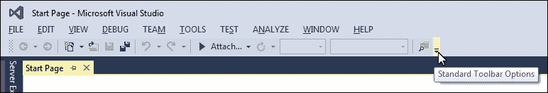
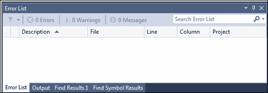
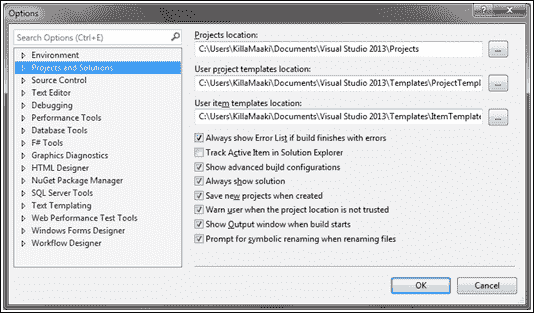
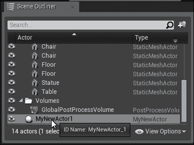
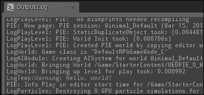
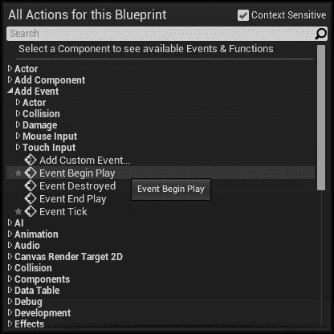
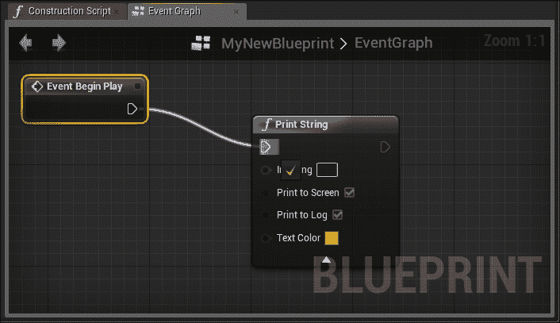
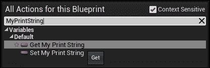
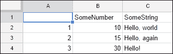
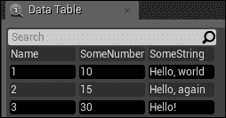

# 第二章。Unreal 中的脚本和数据

现在我们有了可以工作的设计，我们可以开始开发游戏了。

然而，在我们能够这样做之前，我们将探索各种方法，了解我们如何在 Unreal 游戏引擎中与游戏代码和游戏数据一起工作。

本章将指导您完成安装 Unreal 和 Visual Studio 以及创建新的 Unreal Engine 项目的步骤。此外，您还将学习如何创建新的 C++游戏代码，使用蓝图和蓝图图，以及使用自定义数据为您的游戏工作。在本章中，我们将涵盖以下主题：

+   下载 Unreal

+   为 Unreal 设置 Visual Studio

+   设置新的 Unreal 项目

+   创建新的 C++类

+   创建蓝图和蓝图图

+   使用数据表导入电子表格数据

# 下载 Unreal

在开始之前，请确保您的计算机上至少有 18 GB 的空闲磁盘空间。您需要这些磁盘空间来存储 Unreal 的开发环境和项目文件。

我们现在需要下载 Unreal。为此，请访问[`www.unrealengine.com`](https://www.unrealengine.com)并点击**GET UNREAL**按钮。

在您下载 Unreal 之前，您需要创建一个 Epic Games 账户。**GET UNREAL**按钮将带您到一个账户创建表单，所以填写并提交它。

登录后，您将看到**下载**按钮。这将下载 Epic Games Launcher 的安装程序（从这个启动器，您可以下载 Unreal 版本 4.12）。

# 下载 Visual Studio

我们很快就需要开始编程，所以如果您还没有，现在是下载 Visual Studio 的时候了，这是我们编写引擎和游戏逻辑框架所需的集成开发环境。幸运的是，Microsoft 免费提供了 Visual Studio Community。

要下载 Visual Studio Community，请访问[`www.visualstudio.com/`](https://www.visualstudio.com/)并下载 Community 2015。这将下载 Visual Studio 的安装程序。下载后，只需运行安装程序即可。请注意，Visual Studio Community 2015 默认不安装 C++，所以请确保在**功能**下安装 Visual C++、Visual C++ 2015 的通用工具和 C++的 Microsoft Foundation Classes。如果您没有安装 C++，您将无法在 Visual Studio 中编写或编译为 UE4 编写的代码，因为 UE4 是基于 C++构建的。

# 为 Unreal 设置 Visual Studio

安装 Visual Studio 后，您可以采取一些步骤来使在 Unreal 中使用 C++代码更容易。这些步骤并非绝对必要，可以安全地跳过。

## 添加“解决方案平台”下拉列表

工具栏的右侧有一个下拉箭头，如下面的截图所示：



点击此按钮，将鼠标悬停在**Add**或**Remove**按钮上，然后点击**Solution Platforms**以将菜单添加到工具栏。

**Solution Platforms**下拉列表允许你在目标平台之间切换项目（例如，Windows、Mac 等）。

## 禁用错误列表标签

Visual Studio 中的错误列表在你编译项目之前显示它检测到的错误。虽然这通常非常有用，但在 Unreal 中，它可能会频繁检测到假阳性，并且比有帮助还要令人烦恼。

要禁用错误列表，首先关闭**Error List**标签（你可以在下面的面板中找到，如下面的截图所示）：



然后，导航到**Tools** | **Options**，展开**Projects and Solutions**组，并取消选中**Always show Error List if build finishes with errors**选项：



# 设置新的 Unreal 项目

现在你已经下载并安装了 Unreal 和 Visual Studio，我们将为我们的游戏创建一个项目。

Unreal 提供了一系列你可以使用的入门套件，但为了我们的游戏，我们将从头开始编写所有脚本。

在登录 Epic Games Launcher 后，你首先想要下载 Unreal Engine。本书使用版本 4.12。你可以使用更高版本，但根据版本的不同，一些代码和引擎的导航可能会有所不同。创建新项目的步骤如下：

1.  首先，在**Unreal Engine**标签下，选择**Library**。然后，在**Engine Versions**下，点击**Add Versions**并选择你想要下载的版本。

1.  下载完引擎后，点击**Launch**按钮。

1.  一旦 Unreal Engine 启动，点击**New Project**标签。然后，点击**C++**标签并选择**Basic Code**。

1.  最后，选择你的项目位置并给它命名（在我的情况下，我给项目命名为`RPG`）。

在我的情况下，创建项目后，引擎会自动关闭并打开 Visual Studio。在这个时候，我发现最好关闭 Visual Studio，回到 Epic Games Launcher，并重新启动引擎。然后，从这里打开你的新项目。最后，在编辑器启动后，转到**File** | **Open Visual Studio**。

原因是，虽然你可以通过编译 Visual Studio 项目来启动编辑器，但在某些罕见情况下，你可能每次想要编译新的更改时都必须关闭编辑器。另一方面，如果你从编辑器（而不是反过来）启动 Visual Studio，你可以在 Visual Studio 中做出更改，然后从编辑器内部编译代码。

到目前为止，你已经有一个空白的 Unreal 项目和准备就绪的 Visual Studio。

# 创建新的 C++类

我们现在将按照以下步骤创建一个新的 C++类：

1.  要做到这一点，从 Unreal 编辑器中，点击 **文件** | **新建 C++ 类**。我们将创建一个演员类，因此选择 **Actor** 作为基类。演员是放置在场景中的对象（从网格到灯光，再到声音等等）。

1.  接下来，为你的新类输入一个名称，例如 `MyNewActor`。点击 **创建类**。在它将文件添加到项目后，在 Visual Studio 中打开 `MyNewActor.h` 文件。当你使用此界面创建新类时，它将为你的类生成一个头文件和一个源文件。

1.  让我们的演员在游戏开始时向输出日志打印一条消息。为此，我们将使用 `BeginPlay` 事件。`BeginPlay` 在游戏开始后调用（在多人游戏中，这可能在初始倒计时之后调用，但在我们的情况下，它将立即调用）。

1.  在此点应该已经打开的 `MyNewActor.h` 文件应该在 `GENERATED_BODY()` 行之后包含以下代码：

    ```cpp
    public:   virtual void BeginPlay();
    ```

1.  然后，在 `MyNewActor.cpp` 文件中，添加一个日志，在 `void AnyNewActor::BeginPlay()` 函数中打印 **Hello, world!**，该函数在游戏开始时运行：

    ```cpp
    void AnyNewActor::BeginPlay()
    {
        Super::BeginPlay();

        GEngine->AddOnScreenDebugMessage(-1, 15.0f, FColor::Yellow, TEXT("Hello World!"));
    }
    ```

1.  然后，切换回编辑器并点击主工具栏中的 **编译** 按钮。

1.  现在既然你的演员类已经编译，我们需要将其添加到场景中。为此，导航到屏幕底部的 **内容浏览器** 选项卡。搜索 `MyNewActor`（有一个搜索栏帮助你找到它），并将其拖入场景视图，即级别视口。它是不可见的，所以你看不到它或无法点击它。然而，如果你将右侧的 **场景/世界大纲** 窗格（在右侧）滚动到底部，你应该会看到 **MyNewActor1** 演员已经被添加到场景中：

1.  要测试你的新演员类，点击 **播放** 按钮。你应该在控制台看到一条黄色的 **Hello, world!** 消息，如下面的截图所示。这可以在屏幕底部的 **内容浏览器** 选项卡右侧的 **输出日志** 选项卡中看到：

恭喜你，你在 Unreal 中创建了第一个演员类。

# 蓝图

Unreal 中的蓝图是一种基于 C++ 的专有可视化脚本语言。蓝图将允许我们创建代码，而无需在 Visual Studio 等集成开发环境（IDE）中触摸任何一行文本。相反，蓝图允许我们通过拖放可视化节点来创建代码，并将它们连接起来以创建你想要的几乎所有功能。那些从 UDK 过来的人可能会在 Kismet 和蓝图之间发现一些相似之处，但与 Kismet 不同，蓝图允许你对函数和变量的创建和修改拥有完全控制权。它还会进行编译，这是 Kismet 所没有的功能。

蓝图可以继承自 C++ 类，或者从其他蓝图继承。例如，你可能有一个 `Enemy` 类。敌人可能有一个 **健康** 字段，一个 **速度** 字段，一个 **攻击** 字段和一个 **网格** 字段。然后，你可以通过创建继承自你的 `Enemy` 类的蓝图并更改每种敌人的健康、速度、攻击和网格来创建多个敌人模板。

你还可以将你的 C++ 代码的部分暴露给蓝图图，以便你的蓝图图和核心游戏代码可以相互通信并协同工作。例如，你的库存代码可能是在 C++ 中实现的，并且它可能向蓝图暴露函数，以便蓝图图可以给玩家提供物品。

## 创建新的蓝图

创建新蓝图的操作步骤如下：

1.  在 **内容浏览器** 面板中，通过点击 **添加新内容** 下拉列表并选择 **新建文件夹**，然后重命名文件夹为 `Blueprint`，来创建一个新的蓝图文件夹。在这个文件夹中，右键单击并选择 **蓝图** | **蓝图类**。将蓝图作为父类选择 **Actor**。

1.  接下来，给你的新蓝图命名，例如 `MyNewBlueprint`。要编辑这个蓝图，双击 **内容浏览器** 选项卡中它的图标。

1.  接下来，切换到 **事件图** 选项卡。

1.  如果 **事件开始播放** 节点还没有在那里，右键单击图并展开 **添加事件**；然后，点击 **事件开始播放**。如果你需要移动 **事件开始播放** 等节点，只需在节点上左键单击并拖动到图上你想要的位置。你还可以通过按住鼠标右键并拖动屏幕来在图中导航：

    这将在图中添加一个新的事件节点。

1.  接下来，右键单击并开始在搜索栏中输入 `print`。你应该会在列表中看到 **打印字符串** 选项。点击它以将一个新的 **打印字符串** 节点添加到你的图中。

1.  接下来，我们希望当 **事件开始播放** 节点被触发时，这个节点被触发。为此，从 **事件开始播放** 节点的输出箭头拖动到 **打印字符串** 节点的输入箭头：

1.  现在，**打印字符串** 节点将在游戏开始时被触发。但是，让我们更进一步，给我们的蓝图添加一个变量。

1.  在左侧的 **我的蓝图** 面板中，点击 **变量** 按钮。给你的变量命名（例如 `MyPrintString`）并将 **变量类型** 下拉列表更改为 **字符串**。

1.  要将这个变量的值输入到我们的 **打印字符串** 节点中，右键单击并搜索 `MyPrintString`。你应该会在列表中看到一个可用的 **获取我的打印字符串** 节点。点击它以将节点添加到你的图中：

1.  接下来，就像您将**事件开始播放**和**打印字符串**连接在一起一样，从**获取我的打印字符串**节点的输出箭头拖动到紧挨着**字符串输入**标签的**打印字符串**节点的输入引脚。

1.  最后，切换到**默认**选项卡。在最顶部，在**默认**部分下，应该有一个用于编辑`MyPrintString`变量值的文本字段。将您想要的任何文本输入到这个字段中。然后，要保存您的蓝图，首先在**蓝图**窗口中按**编译**按钮，然后点击旁边的**保存**按钮。

## 将蓝图添加到场景中

现在您已经创建了蓝图，只需将其从**内容浏览器**选项卡拖动到场景中。就像我们的自定义实体类一样，它将是不可见的，但如果您将**场景大纲**滚动到底部，您会在列表中看到**MyNewBlueprint**项。

要测试我们新的蓝图，请按**播放**按钮。您应该看到您输入的文本被短暂地打印到屏幕上（它也会出现在**输出日志**中，但可能难以在其他输出消息中找到）。

## 实体类蓝图

您可以为蓝图选择其他类进行继承。例如，让我们创建一个新的蓝图，从我们之前创建的定制`MyNewActor`类继承：

1.  要这样做，首先像之前一样创建一个新的蓝图。然后，在选择父类时，搜索`MyNewActor`。点击列表中的**MyNewActor**条目：

1.  您可以为这个实体命名任何您想要的名称。接下来，打开蓝图并点击**保存**。现在，将蓝图添加到您的场景中并运行游戏。您现在应该在控制台看到两条**Hello, world!**消息记录（一条来自我们放置的实体，另一条来自我们新的蓝图）。

# 使用数据表导入电子表格数据

在虚幻引擎中，**数据表**是导入和使用从电子表格应用程序导出的自定义游戏数据的方法。为此，您首先确保您的电子表格遵循一些格式指南；此外，您编写一个包含电子表格一行数据的 C++结构体。然后，您导出一个 CSV 文件，并将您的 C++结构体选择为该文件的数据类型。

## 电子表格格式

您的电子表格必须遵循一些简单的规则，才能正确导出到虚幻引擎。

非常第一个单元格必须保持空白。在此之后，第一行将包含字段的名称。这些将与您稍后 C++结构体中的变量名相同，因此不要使用空格或其他特殊字符。

第一列将包含每个条目的**查找键**。也就是说，如果这个电子表格中第一项的第一单元格是 1，那么在虚幻引擎中，您将使用 1 来查找该条目。这必须对每一行都是唯一的。

然后，以下列包含每个变量的值。

## 一个示例电子表格

让我们创建一个简单的工作表导入到 Unreal 中。它应该看起来像这样：



如前所述：

+   列**A**包含每行的查找键。第一个单元格是空的，后面的单元格包含每行的查找键。

+   列**B**包含`SomeNumber`字段的值。第一个单元格包含字段名称（`SomeNumber`），后面的单元格包含该字段的值。

+   列**C**包含`SomeString`字段的值。就像列**B**一样，第一个单元格包含字段名称（`SomeString`），后面的单元格包含该字段的值。

我使用 Google 表格——使用这个，你会点击**文件** | **另存为** | **逗号分隔值 (.csv, 当前工作表)**来导出为 CSV。大多数电子表格应用程序都有导出为 CSV 格式的功能。

到目前为止，你有一个可以导入 Unreal 的 CSV 文件。然而，现在不要导入它。在我们这样做之前，我们需要为它创建一个 C++结构体。

## 数据表结构体

正如您之前创建演员类一样，让我们创建一个新的类。选择`Actor`作为父类，并给它一个像`TestCustomData`这样的名字。我们的类实际上不会从`Actor`继承（并且，就这个而言，它不会是一个类），但这样做允许 Unreal 在后台为我们生成一些代码。

接下来，打开`TestCustomData.h`文件，并用以下代码替换整个文件：

```cpp
#pragma once

#include "TestCustomData.generated.h"

USTRUCT(BlueprintType)
struct FTestCustomData : public FTableRowBase
{
  GENERATED_USTRUCT_BODY()

  UPROPERTY( BlueprintReadOnly, Category = "TestCustomData" )
  int32 SomeNumber;

  UPROPERTY( BlueprintReadOnly, Category = "TestCustomData" )
  FString SomeString;
};
```

注意变量名与工作表中的表头单元格完全相同——这很重要，因为它显示了 Unreal 如何将工作表中的列与该结构体的字段匹配。

接下来，从`TestCustomData.cpp`文件中删除所有内容，除了`#include`语句。

现在，切换回编辑器并点击**编译**。它应该没有问题编译。

现在你已经创建了结构体，是时候导入你的自定义工作表了。

## 导入工作表

接下来，只需将你的 CSV 文件拖放到**内容浏览器**标签页中。这将弹出一个窗口，询问你想要如何导入数据以及数据的类型。将第一个下拉列表保留为**数据表**，展开第二个下拉列表以选择**TestCustomData**（你刚刚创建的结构体）。

点击**确定**，它将导入 CSV 文件。如果你在**内容浏览器**标签页中双击该资产，你会看到工作表中包含的项目列表：



## 查询工作表

你可以通过名称查询工作表以找到特定的行。

我们将把它添加到我们的自定义演员类`MyNewActor`中。首先，我们需要将一个字段暴露给蓝图，这样我们就可以为我们的演员分配一个数据表。

首先，在`GENERATED_BODY`行之后添加以下代码：

```cpp
public:
  UPROPERTY( BlueprintReadWrite, EditAnywhere, Category = "My New Actor")
  UDataTable* DataTable;
```

上述代码将数据表暴露给蓝图，并允许在蓝图内对其进行编辑。接下来，我们将获取第一行并记录其`SomeString`字段。在`MyNewActor.cpp`文件中，将以下代码添加到`BeginPlay`函数的末尾：

```cpp
if( DataTable != NULL )
{
  FTestCustomData* row = DataTable->FindRow<FTestCustomData>( TEXT( "2" ), TEXT(" LookupTestCustomData"  ) );
  FString someString = row->SomeString;
  UE_LOG( LogTemp, Warning, TEXT( "%s" ), *someString );
}
```

您还需要在`MyNewActor.cpp`文件的顶部添加`#include TestCustomData.h`，这样您就可以在其中看到数据表属性。

在编辑器中编译代码。接下来，打开您从 actor 类创建的蓝图。切换到**类默认值**选项卡，找到**My New Actor**组（这应该在最顶部）。这应该显示一个可以展开以选择您导入的 CSV 文件的**数据表**字段。

编译并保存蓝图，然后按**播放**。你应该能在控制台中看到条目`2`的`SomeString`值。

# 摘要

在本章中，我们设置了 Unreal 和 Visual Studio，并创建了一个新项目。此外，我们学习了如何在 C++中创建新的 actor 类，什么是蓝图，以及如何创建和使用蓝图图进行可视化脚本编写。最后，我们学习了如何从电子表格应用程序导入自定义数据，并在游戏代码中查询它们。

在下一章，我们将开始深入研究一些实际的游戏代码，并开始原型化我们的游戏。
