# 第四章：暂停菜单框架

到目前为止，我们已经为我们的游戏创建了一个基本的战斗引擎。现在我们可以深入到战斗外的操作，例如创建一个暂停菜单屏幕，在那里我们可以查看玩家统计数据和编辑库存。

在本章中，我们将创建菜单系统的第一部分，即设计和创建一个暂停菜单的框架。本章将涵盖以下主题：

+   UMG 暂停屏幕初始设置

+   UMG 背景颜色

+   UMG 文本

+   UMG 按钮

+   UMG 库存子菜单

+   UMG 设备子菜单

+   键绑定

+   按钮编程

# UMG 暂停屏幕初始设置

对于我们的暂停屏幕，我们需要考虑很多关于设计的问题。如前一章所述，暂停屏幕将允许玩家查看团队成员、装备和卸载装备、使用物品等。因此，我们必须在设计暂停屏幕时考虑到这种功能。

为了设计暂停屏幕，我们将使用 **Unreal Motion Graphics** (**UMG**)，这是 UE4 的一个独立部分，允许我们设计虚拟用户界面，而无需使用 Adobe Flash 等程序。UMG 非常直观，使用它不需要编程知识。

要开始设计，我们首先将导航到已经创建的 **蓝图** | **UI** 文件夹，并为暂停菜单创建一个 Widget 蓝图。为此，右键单击您的 **UI** 文件夹，然后导航到 **用户界面** | **Widget 蓝图**：

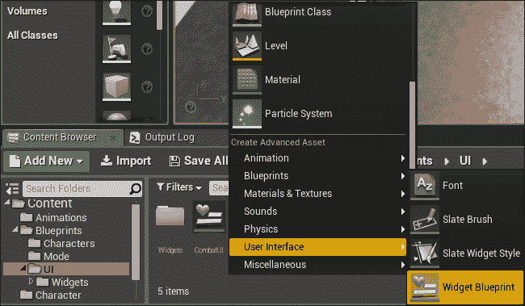

将 Widget 蓝图命名为 `Pause`：

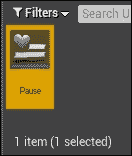

Widget 蓝图将允许您使用 UMG 设计任何用户界面；我们将使用此 Widget 为暂停菜单设计我们自己的 UI。

要开始设计暂停菜单，双击 **内容浏览器** 中的 **暂停** Widget 蓝图。您应该会看到类似于以下截图的 **设计师** 屏幕：

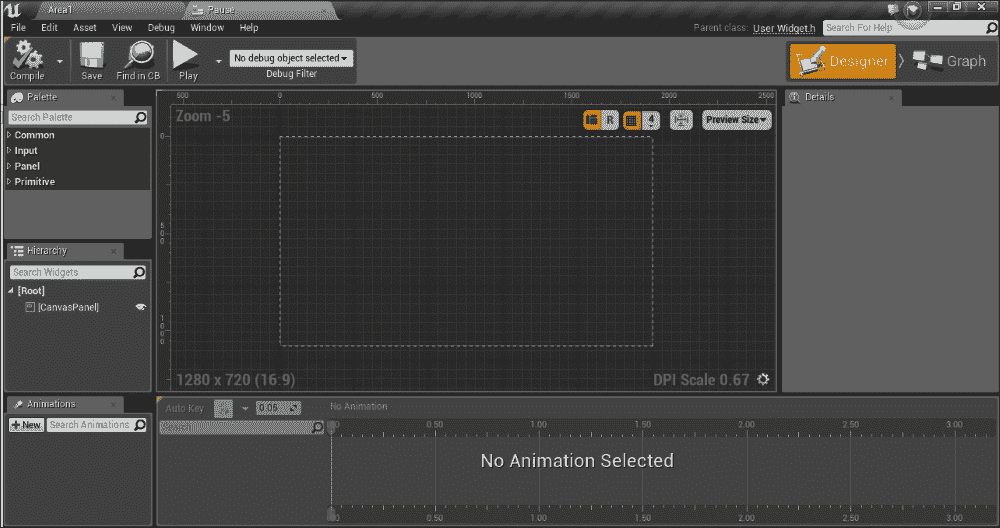

我们首先将创建一个区域，用于放置我们希望暂停菜单所在的第一个屏幕。我们首先将添加一个 Canvas Panel，它作为一个容器，允许在内部布局多个 Widget。这是一个很好的开始，因为我们需要展示几个导航点，我们将以按钮的形式在我们的暂停屏幕中设计它们。要添加 Canvas Panel，导航到 **调色板** | **面板** | **Canvas Panel**。然后，将 Canvas Panel 拖动到您的 **设计师** 视图中（注意，如果您在 **层次结构** 选项卡中默认已经有 Canvas Panel，您可以跳过此步骤）：

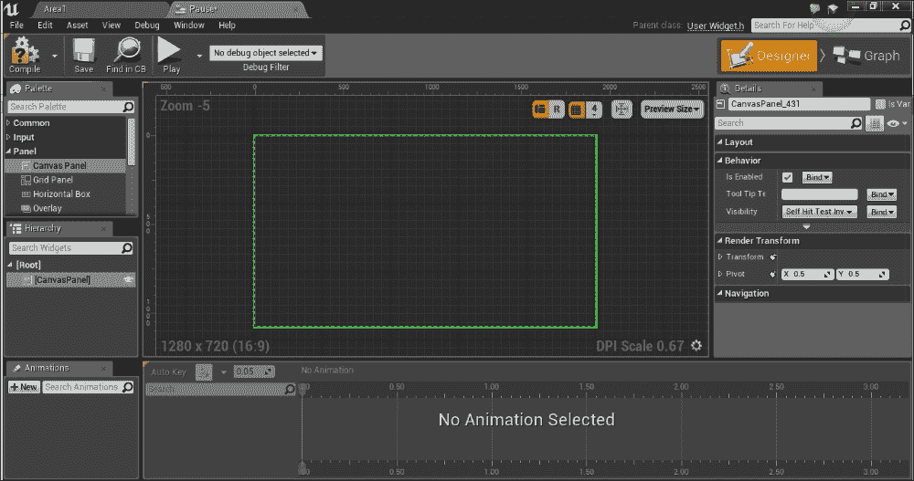

你应该在暂停菜单中看到一些新内容。首先，你会在**层次结构**选项卡下看到现在在**根**中有一个**CanvasPanel**。这意味着暂停屏幕的根目录是我们刚刚添加的 Canvas Panel。你也会注意到，当 Canvas Panel 被选中时，它包含可以在**详情**选项卡中看到的详细信息。**详情**选项卡将允许你编辑任何选中项的属性。我们将在开发过程中频繁使用 Widget Blueprint 的这些区域。

现在我们需要考虑当玩家按下暂停按钮时，屏幕上需要显示哪些导航点和信息。根据功能，以下是我们将在第一个屏幕上布局的项目：

+   角色及其统计数据（等级、HP、MP 和经验/下一级）

+   **物品栏**按钮

+   **装备**按钮

+   **退出**按钮

+   金色

# UMG 背景颜色

在我们开始为菜单创建文本和按钮之前，我们首先应该制作一个背景颜色，这个颜色将放置在暂停屏幕的文本和按钮后面。为此，导航到**调色板** | **常用** | **图像**。然后，将图像拖放到 Canvas Panel 上，使图像位于 Canvas Panel 内。从这里，在**详情** | **槽位**下找到**锚点**下拉菜单。选择创建四个角落锚点的**锚点**选项。

这是在**锚点**下拉菜单底部右侧的一个看起来像覆盖整个画布的大正方形的图标：

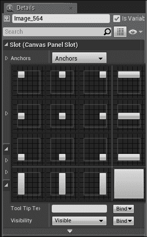

完成后，将**偏移右**和**偏移下**值设置为 0。这将确保，就像图像的左上角一样，图像的右下角也将从 0 开始，从而允许图像拉伸到我们画布四个角落的所有锚点：

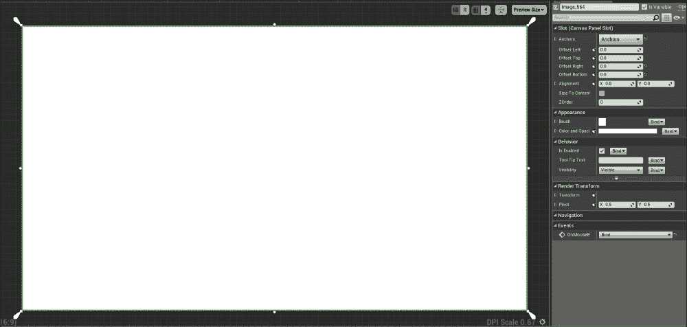

为了使背景图像对眼睛更友好，我们应该将其颜色调得暗一些。要调整颜色，导航到**详情** | **外观** | **颜色和透明度**，然后点击旁边的矩形框。这将打开一个**颜色选择器**框，我们可以从中选择任何颜色。在我们的例子中，我们将使用暗蓝色：

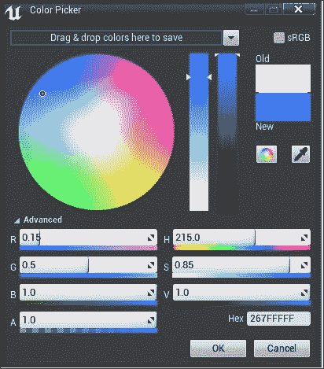

完成后按**确定**。你会注意到你的图像名称类似于**Image_###**；我们应该调整这个名字，使其更具描述性。要重命名图像，只需导航到**详情**并更改名称。我们将名称更改为**BG_Color**。最后，在**详情** | **槽位**中更改**ZOrder**值到**-1**。这将确保背景绘制在其他小部件之后：

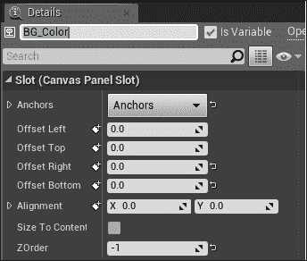

# UMG 文本

现在我们已经完成了菜单背景的创建，是时候布局我们的文本和导航了。我们将通过导航到**常用** | **文本**来添加文本。然后，我们将拖放文本到位于**层次结构**选项卡中的画布面板：

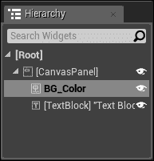

记下一些重要细节。首先，你会在**层次结构**选项卡中看到文本块位于画布面板内。这意味着画布面板正在充当文本的容器；因此，只有当玩家在画布面板中导航时才能看到它。你还会注意到**详细信息**选项卡已更改，以包含特定于文本的属性。这里列出了几个非常重要的细节，例如位置、大小、文本和锚点。最后，你应该会看到选定的文本以可移动和可调整大小的文本框的形式出现，这意味着我们可以根据需要放置和编辑它。现在，我们不会担心使暂停屏幕看起来很漂亮，我们只需要关注布局和功能。常见的布局将是导航从左到右和从上到下。由于我们是从角色开始的，所以我们将第一个文本设置为角色名称。此外，我们将它们从暂停菜单的左上角开始。

首先，我们将添加必要的文本以显示角色名称或类别。在选择文本时，导航到**详细信息** | **内容** | **文本**，并输入第一个类别的名称——`Soldier`。你会注意到你在**内容**选项卡中输入的文本现在已出现在**设计师**视图中的文本块中。然而，它很小，这使得文本难以看清。通过导航到**详细信息** | **外观** | **字体**来更改其大小。在这里，你可以将其大小更改为更大的数字，例如**48**：

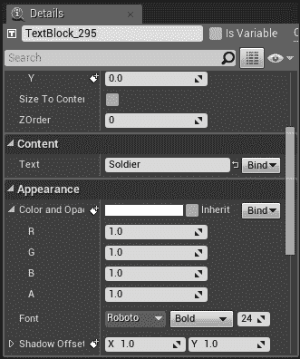

将文本定位到**详细信息** | **槽位**，然后移动文本使其位于左上角，但给它留一些填充空间。在我们的例子中，我们将**位置 X**设置为**100**，将**位置 Y**设置为**100**，这样**士兵**就有 100 像素的填充空间。最后，我们将文本重命名为**Header_Soldier**：

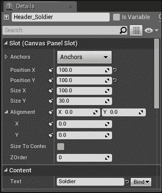

你会注意到字体大小没有变化，这是因为你必须按下窗口左上角的**编译**按钮。每次你在**设计**视图中进行此类技术更改时，都需要按下**编译**按钮。编译完成后，你应该会看到你的字体大小已调整。然而，文本对于文本块来说太大。你可以通过简单地勾选**大小适应内容**来修复这个问题，它位于**详细信息** | **槽位**：

现在我们已经为我们的第一个角色创建了标题，我们可以继续为其状态创建更多文本。我们将首先创建一个用于 HP 的字体。为此，你需要在画布上添加另一个文本块：

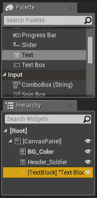

从这里，你可以调整你的文本块的位置，使其位于**Header_Soldier**文本的下方。在这个例子中，我们将将其放置在**Position X**值为**200**和**Position Y**值为**200**的位置：

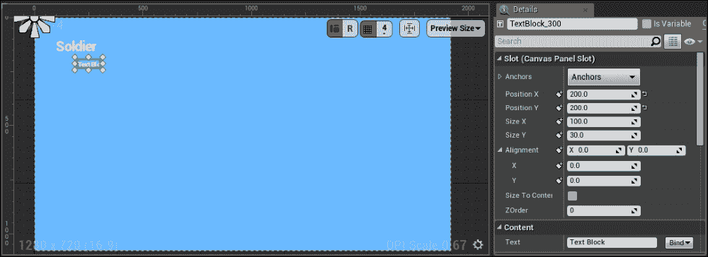

然后，我们将为文本编写内容；在这种情况下，内容将是**HP**。在这里，我们将文本的字体大小设置为**32**并编译它；然后，我们将勾选**Size to Content**：

最后，我们将这个小部件命名为**Menu_HP**：

如你所见，我们只是添加了在菜单中显示**HP**的文本；然而，你还需要在屏幕上显示的实际数字。现在，我们只是在 HP 文本的右侧创建一个空的文本块。在本章的后面部分，我们将将其与上一章中为角色 HP 创建的代码联系起来。所以现在，将一个文本块拖放到你的 Canvas 面板下：

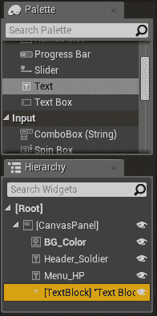

将其重命名为**Editable_Soldier_HP**。然后，将其放置在**Menu_HP**的右侧。在这种情况下，我们可以将**Position X**值设置为**300**，将**Position Y**值设置为**200**：

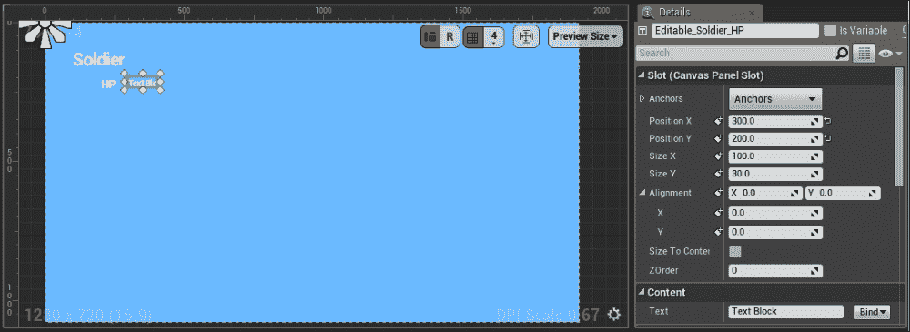

最后，我们可以将字体样式改为**Regular**，字体大小设置为**32**，勾选**Size to Content**，并编译：

现在你已经了解了布局的样子以及我们如何为角色及其属性创建文本块，你可以继续创建其他必要的属性，例如等级、魔法值（MP）和经验值/下一级。在你完成角色及其属性的布局后，你的最终结果应该看起来像以下这样：

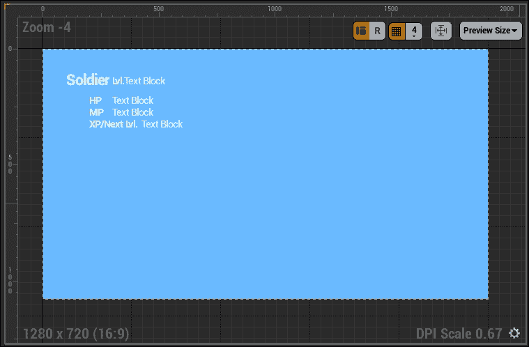

在这一点上，你也可以继续创建更多角色。例如，如果你想创建一个治疗者，你可以轻松地复制我们在暂停屏幕中为士兵创建的大部分内容和布局。你的暂停屏幕中可能有士兵和治疗者属性的占位符，可能看起来像以下这样：

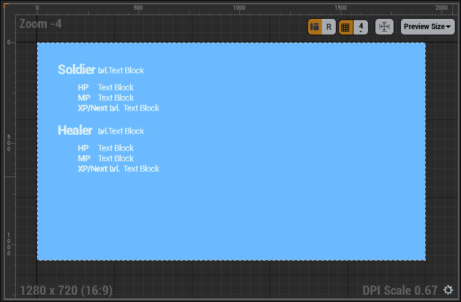

在这个屏幕上，我们还需要创建一个用于玩家收集的黄金的占位符。就像我们为团队属性所做的那样，创建一个文本块，并确保文本内容为**Gold**。将其放置在角色属性之外的地方，例如，在暂停屏幕的左下角。然后，将文本块重命名为**Menu_Gold**。最后，创建第二个文本块，将其放置在**Menu_Gold**的右侧，并命名为**Editable_Gold**：

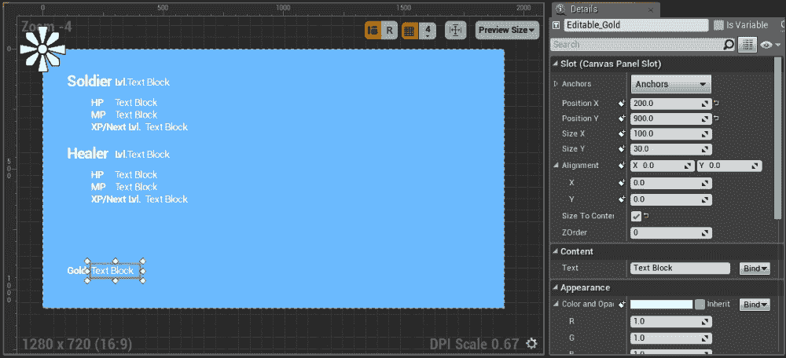

就像角色属性中的空白文本框一样，我们将**Editable_Gold**与游戏后期积累的黄金联系起来。

我们现在可以继续创建菜单的按钮，这些按钮最终将导航到子菜单。

# UMG 按钮

到目前为止，我们已经创建了暂停菜单的第一屏，其中包括所有角色以及他们统计数据和金币的占位符。接下来我们需要设计的是按钮，这将是第一屏的最后一部分。与其他软件包中的按钮类似，它们通常用于触发围绕鼠标点击构建的事件。程序员可以让按钮监听鼠标按钮的按下，并基于该按钮点击执行一系列动作。我们创建的按钮将被用作子菜单的导航，因为我们需要一种在物品栏和装备屏幕之间导航的方法。因此，在我们的主屏幕上，我们需要一个用于库存和装备的按钮。我们还需要一个按钮来进入暂停菜单并继续玩游戏。

让我们从创建第一个按钮开始。导航到**调色板** | **常用** | **按钮**，并在**层次**选项卡下的画布面板中放置它：

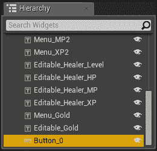

为了组织起见，我们将第一个按钮放置在菜单的右上角。所以最好的做法是导航到**详情** | **槽位** | **锚点**，并将按钮锚定在右上角。这将确保当屏幕或对象调整大小时，按钮会与右侧对齐：

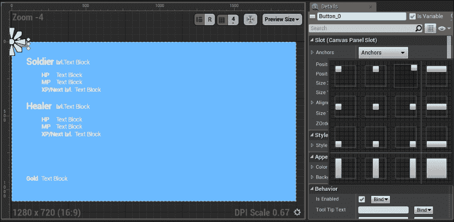

你应该会注意到屏幕上的锚点图标移动到了屏幕的右上角。你还会注意到**位置 X**的值变成了一个负数，这反映了屏幕的大小，因为按钮位置的原点被放置在屏幕的另一端；这个特定按钮的**位置 X**值现在被反转。这个概念一开始可能有些令人困惑，但从长远来看，它将使每个按钮的放置计算变得更容易：

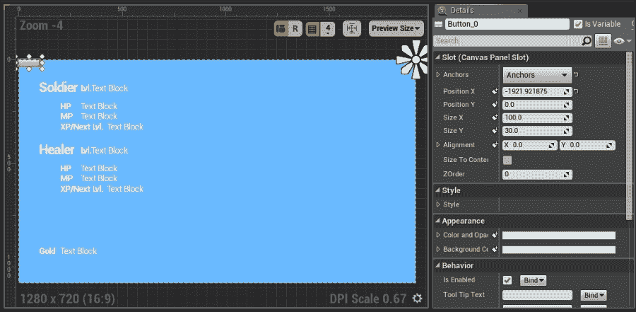

将**位置 X**值更改为**-200**（因为按钮的**位置 X**现在是**-1920**，以便从左侧定位，而**-100**用于定位到右侧，为了添加**100**像素的填充，应该是**-200**），并将**位置 Y**值更改为**100**。将此按钮命名为**Button_Inventory**：

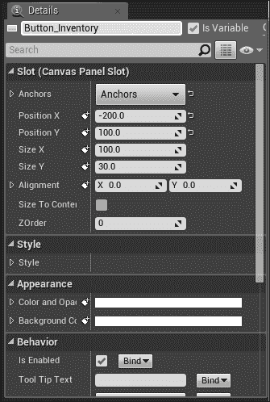

现在我们将向按钮添加文本。因此，在**调色板** | **常用** | **文本**下选择**文本**，并将其拖入按钮中。你会注意到文本在**层次**选项卡和**设计器**视图中都在按钮内：

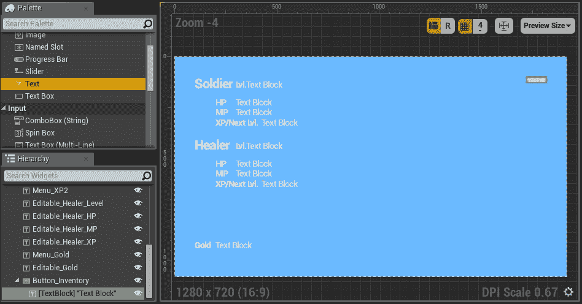

你可能还会注意到文本的大小并不符合我们的喜好，它也没有完全适应按钮。我们不必立即调整按钮的大小，而是先调整文本到我们喜欢的尺寸，然后再调整按钮以适应文本，这样文本才能被清晰地阅读。导航到**详情** | **外观** | **字体**，并将字体大小更改为**48**：

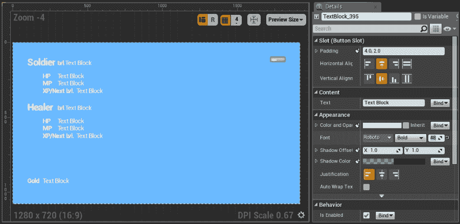

然后，在**详细信息** | **内容** | **文本**下，将文本更改为**库存**，并将文本小部件的名称更改为**Menu_Inventory**：

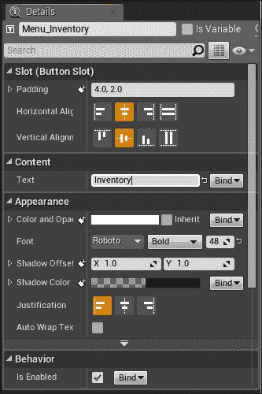

点击**按钮 _ 库存**。你可能认为在这里检查**大小到内容**是个好主意，但在这个情况下并不适用，因为你会创建多个按钮，每个按钮中都有不同的文本。因此，如果它们都根据内容（即按钮内的文本）来调整大小，所有按钮的大小都会不同，这看起来非常不吸引人。相反，你应该选择一个可以轻松容纳所有文本的按钮大小，即使是对于最长的文本。对于这个按钮，我们将将**大小 X**值更改为**350**，**大小 Y**值更改为**100**：

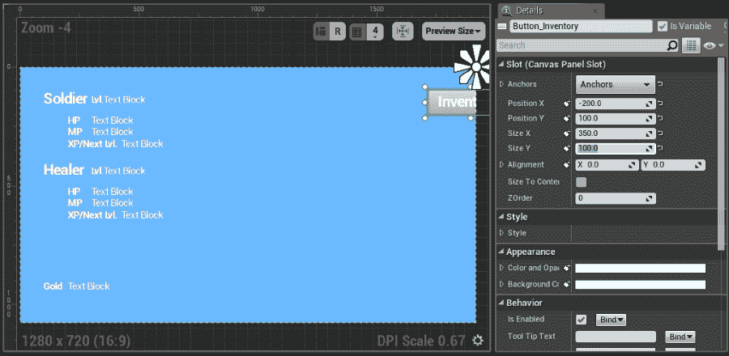

你会注意到按钮被绘制在屏幕之外，这是因为按钮，就像其他所有对象一样，仍然是从对象的左上角开始绘制的，所以我们需要再次调整我们的**位置 X**值；然而，由于我们锚定在右上角，数学运算很简单。我们只需要取按钮的水平尺寸，350，然后从按钮认为屏幕右边缘的位置减去它，由于锚定，这个位置是 0。所以这给出了*0 - 350 = -350*。然后，我们取-350 并减去我们想要的 100 像素的填充，这给出了*-350 - 100 = -450*，这就是我们应该更改**位置 X**的值：

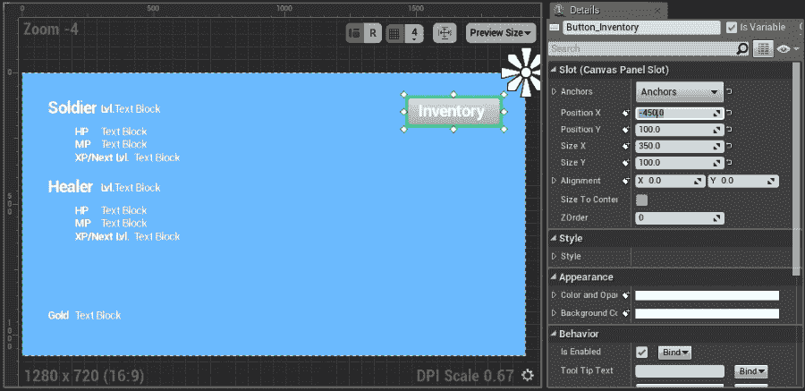

现在我们已经将按钮放置得恰到好处，我们可以放置更多按钮。我们将使用相同的步骤在**库存**按钮下方创建一个**装备**按钮。一旦你完成了**装备**按钮的创建，它就可以放置在**库存**按钮的正下方：

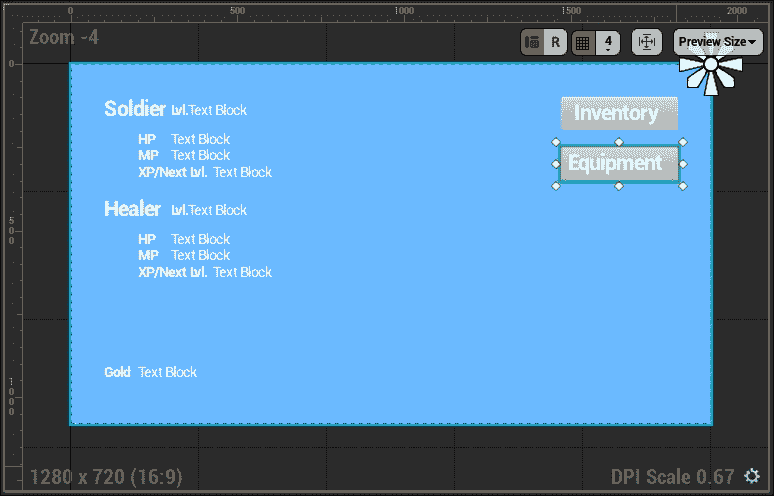

我们还可以创建一个**退出**按钮，我们将将其放置在屏幕的右下角：

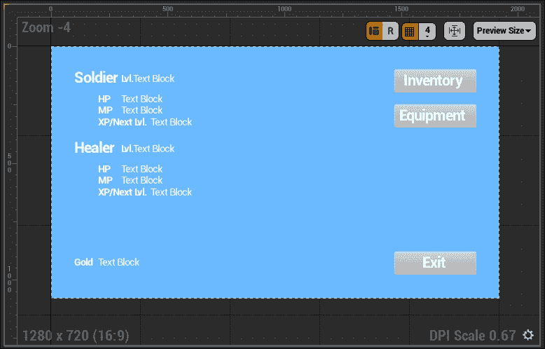

就这样——我们已经完成了暂停菜单的第一屏的设计。你会注意到我们还没有为按钮编写任何程序，这是因为我们还没有为按钮导航到屏幕，所以现在编写按钮程序还没有意义。下一步将是设计我们的子菜单。

# UMG 库存子菜单

如前所述，我们需要为按钮创建子菜单以便导航。使用 UMG，有几种创建子菜单的方法，但最直接的方法是为每个子菜单创建一个新的 Widget Blueprint，然后将 Widget Blueprints 绑定在一起。

由于我们将在子菜单中需要许多相同的物品，如角色名称和大部分统计数据，我们可以通过仔细复制我们的主暂停菜单、重命名它，然后编辑以适应我们需要的任何子菜单来节省大量时间。由于我们最初将主暂停菜单保存为**Pause**，我们可能想要首先将其重命名，使其更具描述性。因此，返回到您的**内容浏览器**，找到您保存暂停菜单的位置，通过右键单击暂停菜单小部件并选择**重命名**来重命名它。将此文件重命名为**Pause_Main**：

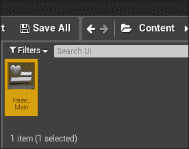

接下来，通过右键单击文件并选择**复制**来复制**Pause_Main**：

将其重命名为**Pause_Inventory**：

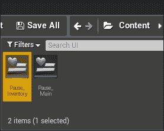

现在，我们将能够设计一个**库存**屏幕。打开您新创建的**Pause_Inventory** Widget Blueprint。您会注意到它是对**Pause_Main**的精确复制。从这里，我们可以编辑掉不需要的内容。首先，我们计划不包含任何影响经验值的物品，因此我们可以从角色中移除经验值文本块：

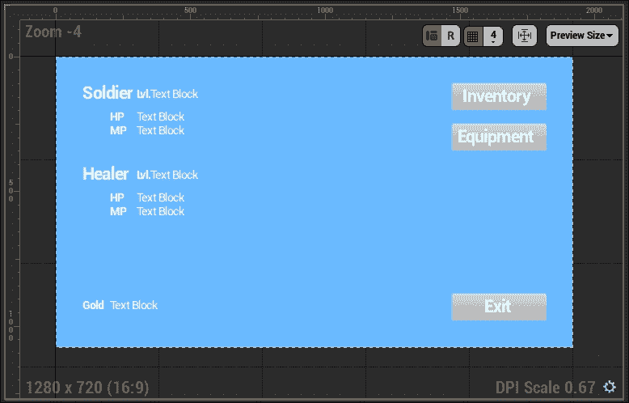

此外，我们也不需要在**库存**屏幕中跟踪金币。因此，我们可以移除金币。

为了便于创建，我们还将通过使用**Pause_Main**作为所有子菜单（如**Pause_Inventory**和**Pause_Equipment**）的中心枢纽，并将导航设置为“老式”方式，只允许玩家在退回到**Pause_Main**并从那里按下**装备**按钮时进入**装备**屏幕。基于这种设计背后的想法，我们可能还会从该屏幕中移除**库存**和**装备**按钮：

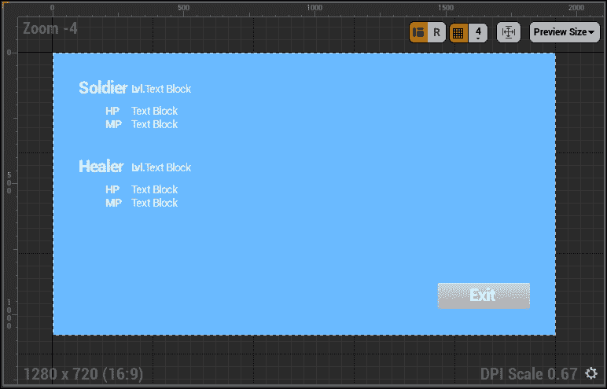

然而，我们可以保留**退出**按钮，但根据我们屏幕导航背后的想法，我们应该将此按钮及其文本块重命名为反映按下时退出屏幕并进入**Pause_Main**。因此，我们可以选择**Button_Exit**并将其重命名为**Button_Back**：

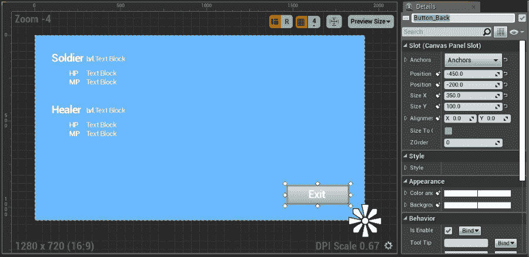

然后，选择**退出**按钮内的文本块，将其重命名为**Menu_Back**，并将文本更改为**返回**：

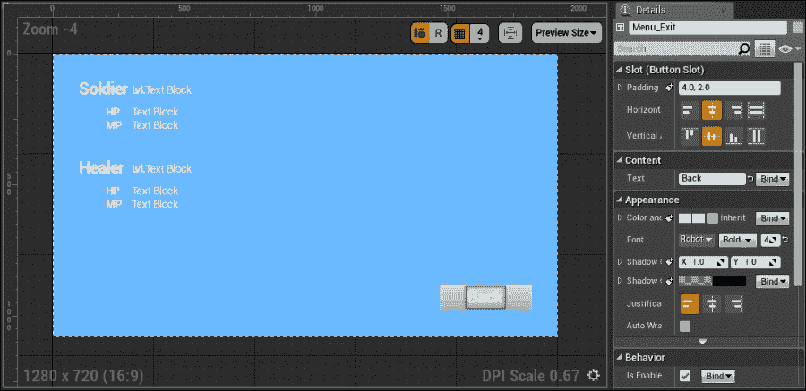

在上一章中，我们定义的统计数据不仅仅是 HP 和 MP；我们还定义了攻击力、防御力和幸运。虽然健康和魔法药水通常不会影响除了 HP 或 MP 之外的任何统计数据，但你可能稍后想要创建一些可使用并影响幸运、防御力或攻击力的物品。为此，我们将以创建 HP 和 MP 文本块相同的方式为每个角色创建这三个其他统计数据的占位符。我们将将这些统计数据定位在 HP 和 MP 统计数据下方。请注意，如果你为这些统计数据没有足够的空间，你可能需要调整间距。此外，记得用非常描述性的名称命名你创建的所有文本块，这样你就可以在需要引用它们的时候识别它们。

当你完成添加统计数据后，你的文本块应该看起来像以下截图：

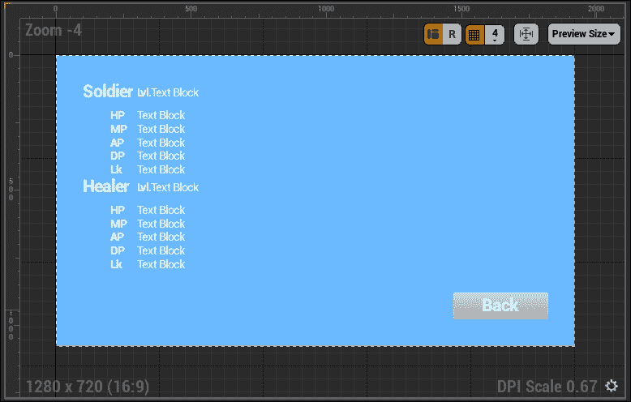

现在我们需要一个地方来填充我们的库存。由于我们不确定游戏中的玩家会携带多少物品，因此创建一个将填充我们库存的滚动框是最安全的。我们还想创建一个足够宽的滚动框，以防我们有一些非常长的物品名称。如果你设计的屏幕像我一样，你应该有足够的空间放置滚动框。要创建滚动框，导航到**调色板** | **面板** | **滚动框**：

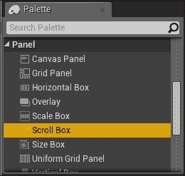

然后，将其拖动到**层次**选项卡下的 Canvas 面板中：

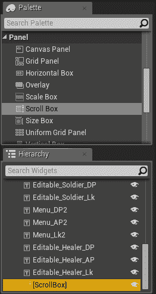

目前，将滚动框重命名为**ScrollBox_Inventory**。然后，调整位置使其位于屏幕中间，同时占据屏幕上的大量空间。我将我的**位置 X**值更改为**700**，**位置 Y**值更改为**200**，**大小 X**值更改为**600**，**大小 Y**值更改为**600**。完成时，你的滚动框应该看起来像以下截图：

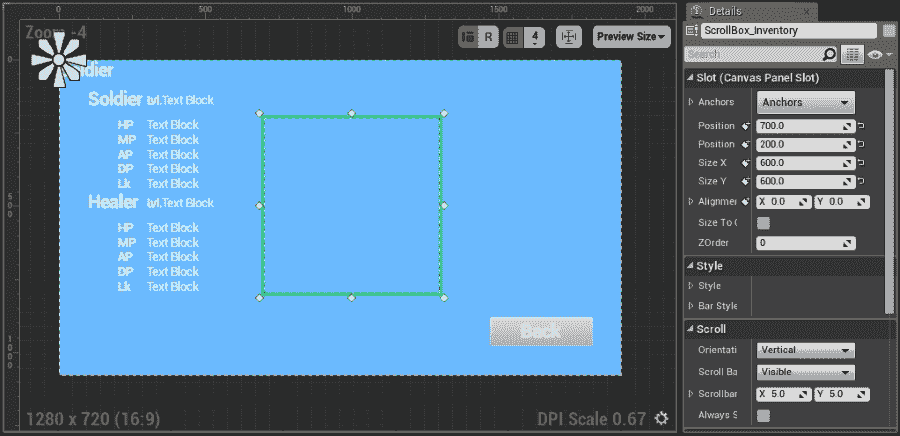

在下一章中，我们将动态地将物品插入滚动框，并创建将物品效果应用于每个角色的逻辑。

为了完成这个屏幕，你应该通知玩家他们目前正在查看哪个屏幕。因此创建另一个文本块，并将字体大小调整为 48 像素。为你的文本块选择一个中心顶部的锚点。这将使得你的文本块将 0 *X*位置识别为屏幕中间，将*0* Y 位置识别为屏幕顶部。因此，你现在可以将**0**作为**位置 X**值，并填充**位置 Y**值：

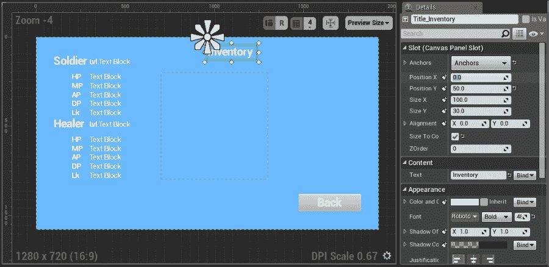

你会注意到库存并没有正好位于屏幕中间，因此调整**位置 X**值直到它居中。我将我的**位置 X**值调整为文本块大小的一半，结果是-135：

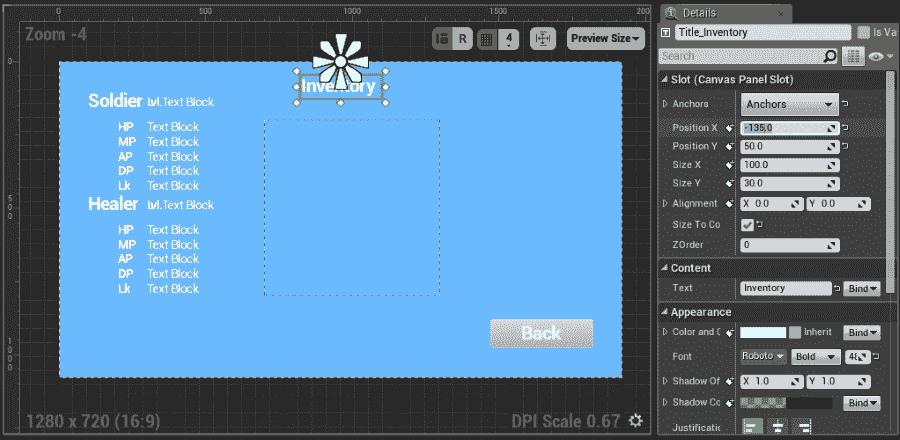

到目前为止，您可以保存并编译您的**库存**屏幕。我们现在就到这里。

# UMG 设备子菜单

我们需要设计的最后一个子菜单是设备子菜单。由于我们的设备子菜单将与库存子菜单非常相似，因此最简单的方法是返回到**内容浏览器**，复制**Pause_Inventory**，并将其重命名为**Pause_Equipment**，这样**Pause_Equipment**就成为了**Pause_Inventory**的直接副本。接下来，打开**Pause_Equipment**。

我们将以与**库存**屏幕类似的方式设计这个屏幕。我们仍然会使用滚动框来填充项目（在这种情况下，是装备）。我们将主要保持每个角色的相同属性；我们将继续使用 Back 按钮，最终将导航回暂停屏幕。让我们编辑差异。首先，将屏幕标题从**库存**更改为**装备**，并重新定位使其水平居中屏幕：

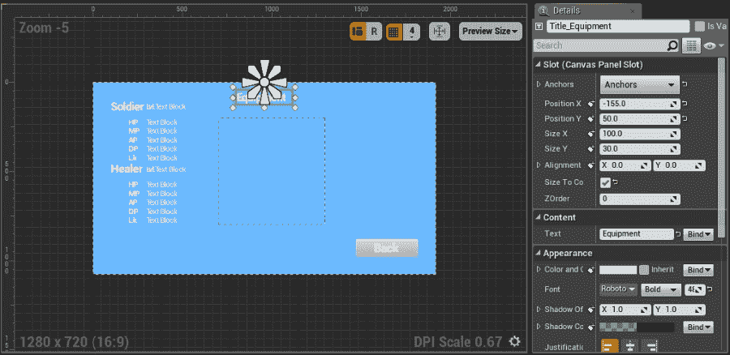

接下来，我们需要编辑角色属性。我们可能在这个游戏中有一些装备，当装备时，会改变 AP、DP 和 Lk 属性。然而，我们很可能不会有影响 HP 和 MP 的装备。我们还知道，我们需要为每个角色提供武器和盔甲。因此，我们可以轻松地将 HP 和 MP 的文本编辑为武器和盔甲（我将它们称为**Weap**和**Arm**以节省空间）。在细节方面，我将**Menu_HP**文本块的名称更改为**Menu_Weapon**，并将文本块的内容更改为**Weap**。我们将对**Menu_MP**做类似处理，将其更改为盔甲槽位：

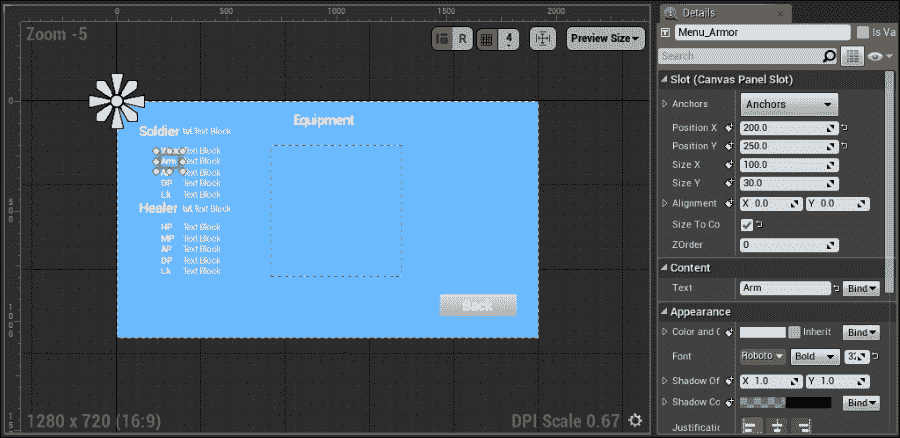

在替换任何其他角色的 HP 和 MP 值时，使用武器和盔甲占位符时，遵循类似的命名约定。当你完成时，你的屏幕应该看起来像下面的截图：

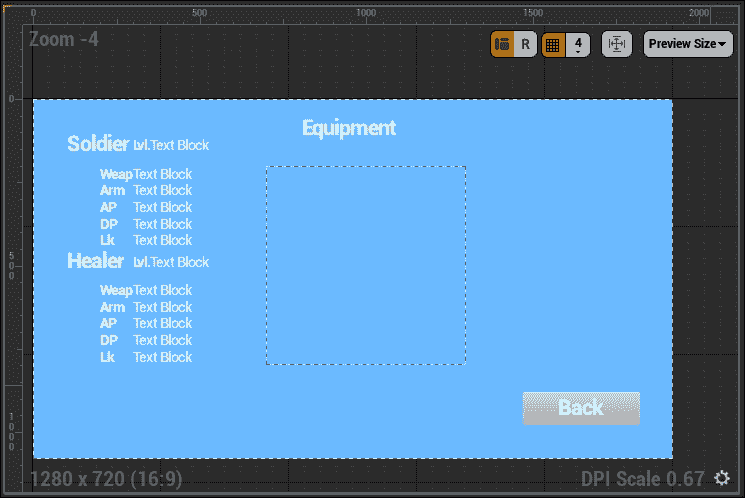

由于我们的角色将装备武器和盔甲，我们需要为这些槽位提供占位符。最终，我们将允许玩家选择他们想要装备的装备，装备将出现在适当的武器或盔甲槽位中。最合适的小部件类型是**Border**。这将包含一个文本块，当装备武器或盔甲时，文本块将发生变化。为此，从**调色板** | **常用** | **Border**中选择**Border**。将 Border 拖入画布面板：

然后，调整画布面板的位置，使其与放置在士兵**Menu_Weapon**右侧的文本块相同。此时，您可以删除**Menu_Weapon**右侧的文本块。它最初用作 HP 的文本，我们现在不再需要它：

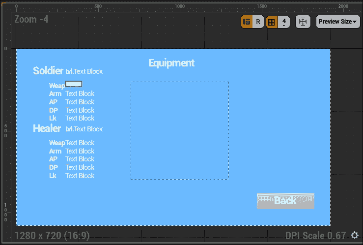

我们仍然需要在边框中添加文本，所以从**调色板** | **常用** | **文本**中拖拽文本到你的边框中：

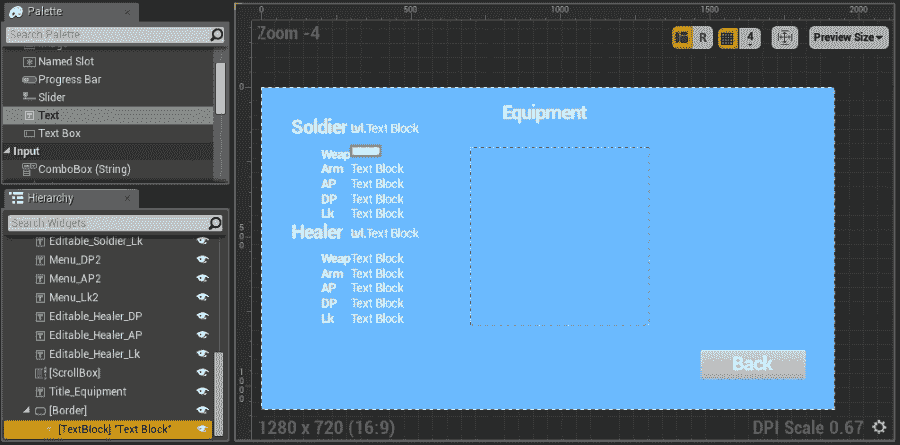

目前你可以保留文本块的默认设置，但你会注意到边框没有调整大小，一切仍然是白色。返回到你的边框，并检查**大小调整到内容**。在**外观** | **画笔颜色**下，将**A**值改为**0**。**A**值是透明度。当透明度为 0 时，颜色完全透明，当透明度为 1 时，颜色完全不透明；介于两者之间的颜色则只有轻微的透明度。我们并不关心看到块的颜色，我们希望它对玩家不可见：

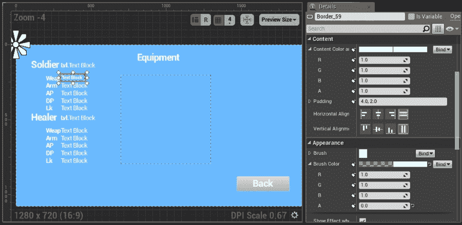

最后，将边框名称更改为描述性的名称，例如**Border_Weapon**：

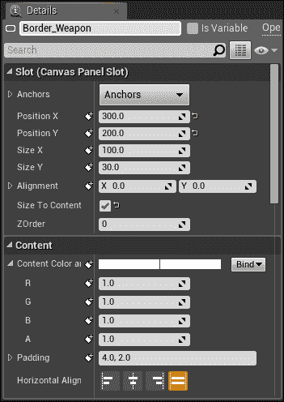

返回到边框内的文本块。将文本块命名为**Text_Weapon**，并将字体改为 32 像素的常规样式，以匹配其他文本块：

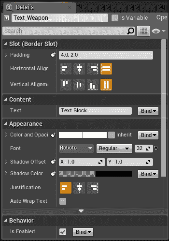

现在你已经知道了如何为士兵的武器设计边框和文本块，你还可以为士兵的盔甲以及任何其他角色的武器和盔甲设计边框和文本块。完成之后，你应该会有以下截图所示的内容：

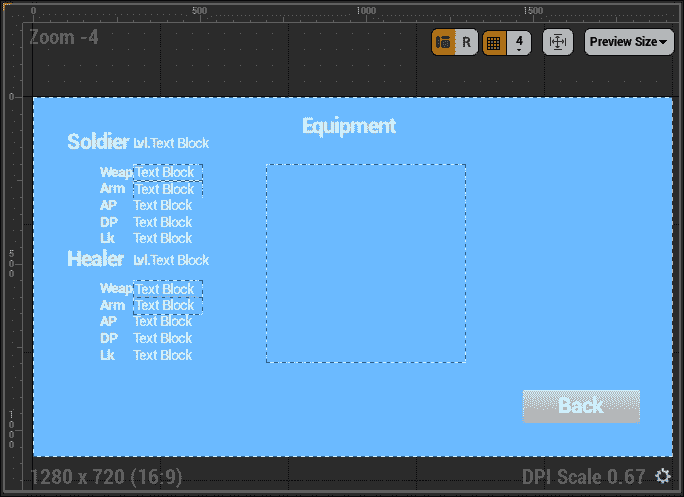

到目前为止，我们已经完成了所有当玩家按下暂停按钮时出现的屏幕的设计。下一步将是编写这些屏幕的功能程序。

# 按键绑定

我们现在将绑定一个键来打开暂停菜单，并且只有在玩家不在战斗中（换句话说，玩家在野外）时才允许这样做。由于我们已经在上一章中设置了**FieldPlayer**，我们可以在我们的**FieldPlayer**蓝图类中轻松创建控制暂停菜单的动作。首先，导航到**蓝图** | **打开蓝图类…** | **FieldPlayer**：

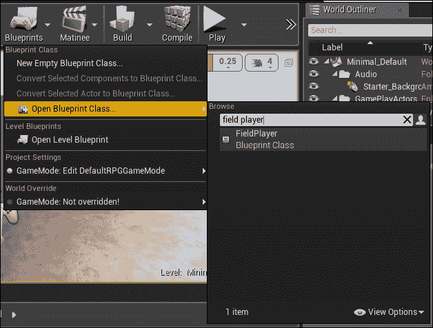

到目前为止，我们希望在玩家按下某个键时弹出暂停屏幕；在这种情况下，我们将使用*P*键来暂停。为此，我们首先需要创建一个按键事件，在按下特定键后触发我们选择的一系列动作。要开始这个按键事件，右键点击你的事件图，这将打开所有可以与这个蓝图关联的动作，然后导航到**输入** | **按键事件** | **P**：

完成后，这将创建一个针对*P*的按下和释放的关键事件。你会注意到，这个事件具有按下和释放的可执行文件，它们按描述工作，当玩家按下*P*或玩家释放*P*时可以执行动作。对于我们的暂停游戏和弹出暂停菜单的操作，我们将使用释放的可执行文件，因为只有当释放的可执行文件被调用时，这意味着玩家已经完成了按下和释放键的动作。对于玩家来说，像在棋盘上放下棋子一样按下按钮是一种常见的最佳实践。在我们弹出暂停菜单之前，让我们通过在事件图中右键单击并导航到**游戏** | **设置游戏暂停**来创建一个调用**设置游戏暂停**函数：

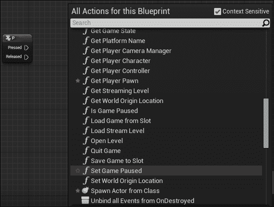

在**游戏暂停节点**中，检查**暂停**以确保它设置为 true，并将关键事件**P**的**释放**可执行链接到**设置游戏暂停**的输入端口。现在，当玩家按下并释放*P*键时，你的游戏应该会暂停：

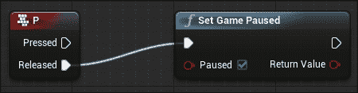

从这里，我们将弹出暂停菜单。为此，在游戏暂停时，我们将通过在事件图上右键单击并导航到**用户界面** | **创建小部件**来创建主暂停屏幕。这允许我们创建我们制作的任何小部件的实例。我们可以在**创建小部件**中创建**Pause_Main**，方法是按**选择类**下拉菜单，然后选择**Pause_Main**：

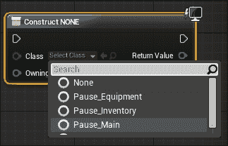

接下来，我们可以将**设置游戏暂停**的输出引脚链接到**创建 Pause_MainWidget**的输入引脚：

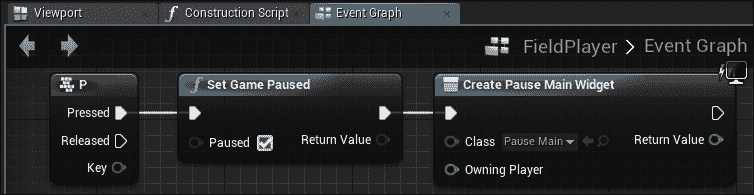

这样，在游戏暂停后，将创建**Pause_Main**。尽管我们正在创建**Pause_Main**，但它仍然不会在屏幕上弹出，直到我们告诉它绘制到屏幕上。为此，我们需要创建一个调用**添加到视口**函数的调用，该函数可以将任何图形添加到视口中。为此，在**创建 Pause_Main**小部件节点上左键单击并拖出**返回值**引脚，然后选择**用户界面** | **视口** | **添加到视口**。这将创建一个新的**添加到视口**节点：

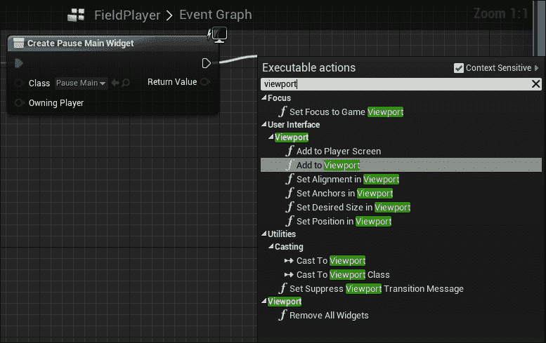

如果你测试这个，你会注意到游戏暂停，暂停菜单弹出，但缺少鼠标光标。为了添加鼠标光标，我们首先需要通过在事件图上右键单击并导航到**游戏** | **获取玩家控制器** | **获取玩家控制器**来获取玩家控制器：

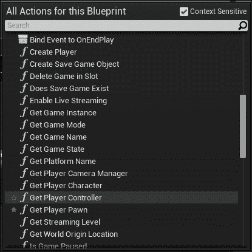

从这里，只需左键单击并拖出**Get Player Controller**节点的**返回值**引脚，然后选择**变量** | **鼠标界面** | **设置显示鼠标光标**：

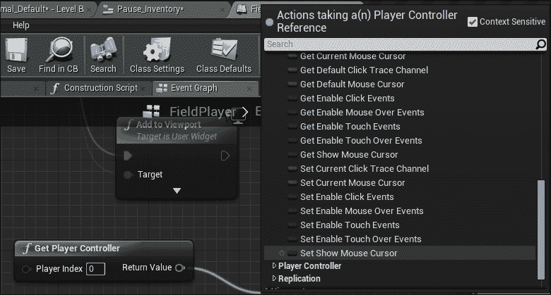

完成后，将**添加到视图**节点的输出引脚连接到**设置显示鼠标光标**的输入引脚。这将做的是在视图中显示暂停菜单后，将**显示鼠标光标**变量（这是一个布尔值）设置为 true 或 false。**设置显示鼠标光标**变量还需要获取玩家控制器，因为玩家控制器持有鼠标输入信息。

如果你现在进行测试，你会注意到鼠标光标仍然没有显示；这是因为**设置显示鼠标光标**中的**显示鼠标光标**未勾选，这意味着**显示鼠标光标**被设置为 false，所以每次你想显示鼠标光标时都要勾选复选框。

到目前为止，按下*P*键后，你的菜单应该会完美弹出，鼠标应该完全可见且可控制。你的关卡蓝图现在应该看起来像以下截图：

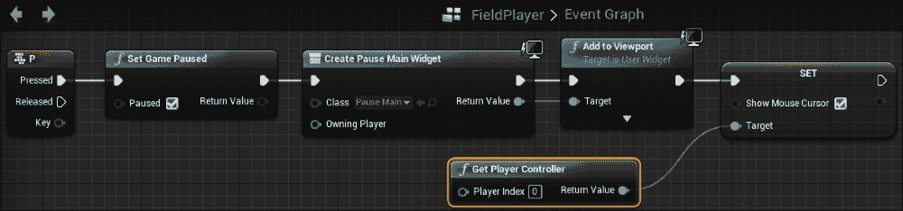

你会注意到实际菜单中的所有按钮都无法工作，因此我们无法退出暂停菜单或查看任何子菜单。这是因为我们还没有对任何菜单按钮进行编程。现在，我们将专注于编程这些按钮。

# 按钮编程

现在我们已经完成了玩家对暂停菜单的访问，接下来我们将专注于主暂停菜单及其子菜单内的导航。此时，返回到你的**Pause_Main**部件。让我们首先创建到**Pause_Inventory**的导航。为此，点击**库存**按钮：

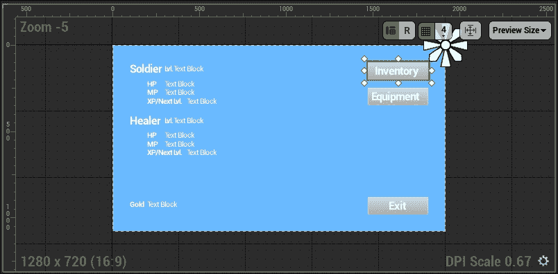

导航到**详情** | **事件** | **OnClicked**，然后按下**+**按钮：

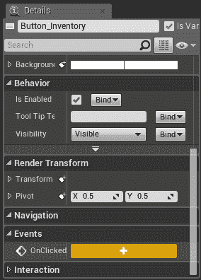

点击**+**按钮将自动打开**Pause_Main**的事件图，并创建一个**OnClicked**事件：

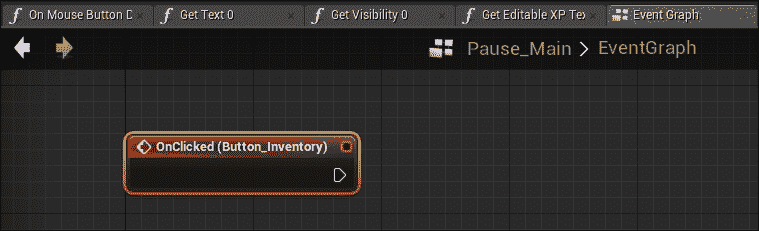

**OnClicked** 事件的工作方式将与我们在上一节中创建的键绑定相似，那里我们创建了一个允许我们按下一个键的东西，这个键可以触发一个事件，进而触发一系列动作。但这次，**OnClicked** 事件绑定到我们的**库存**按钮上，并且只有在用户左键点击了**库存**按钮时才会触发。我们想要做的是，当我们点击**库存**按钮时，创建一个**Pause_Inventory**小部件，并在屏幕上显示。这听起来非常熟悉，因为我们刚刚用**Pause_Main**做了类似的事情。所以首先，创建一个部件并将其附加到**OnClicked**事件。接下来，你会注意到部件中的**Class**引脚是空的，因此我们需要选择一个类。你会选择**Pause_Inventory**，因为我们希望在按钮被按下时创建库存小部件：

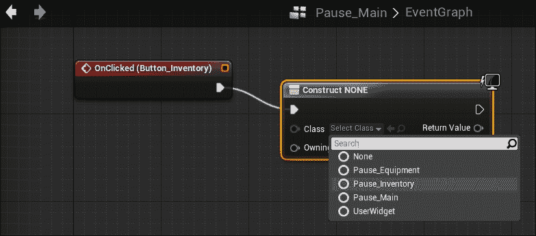

最后，只需将此部件添加到视图中，以便用户可以看到显示的库存。最终，你的蓝图应该看起来像以下截图：

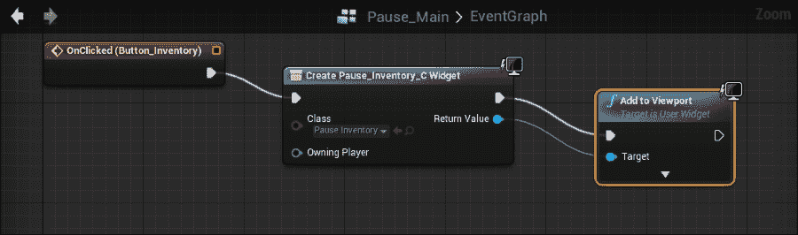

如果你现在测试你的暂停屏幕，你应该会注意到你可以导航到你的库存屏幕，但你不能导航回你的主暂停屏幕。这很容易修复。只需打开你的**Pause_Inventory**小部件，按下**Back**按钮，导航到**Details** | **Events** | **OnClicked**，然后按下**+**按钮：

就像我们上一个按钮一样，事件图将自动打开，并为我们的按钮创建一个**OnClicked**事件；只是这次，事件绑定到了我们的**Back**按钮上：

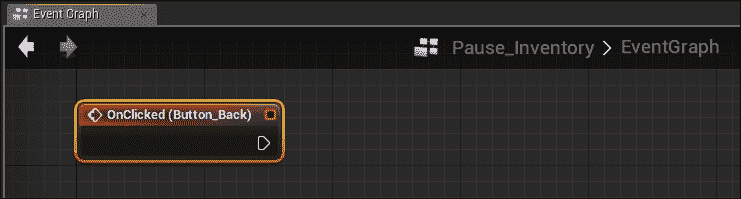

从这里，你将通过将**OnClicked**事件链接到**Remove from Parent**来设置屏幕移除自己。

当你完成创建**Back**按钮的蓝图后，它应该看起来像下面的截图：

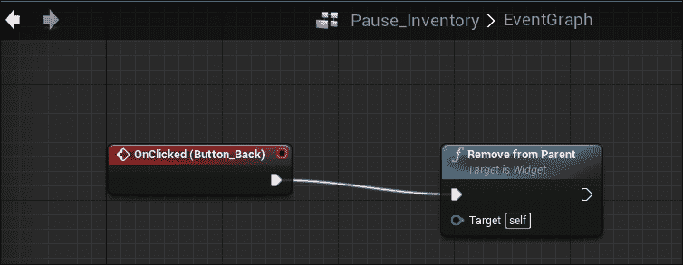

你现在可以通过确保当我们点击**Equipment**按钮时创建一个**Pause_Equipment**小部件并显示它；当我们点击**Pause_Equipment**中的**Back**按钮时，导航回**Pause_Main**并移除**Pause_Inventory**屏幕来为**Pause_Equipment**创建相同的导航设置。

下一步是允许玩家在点击**Exit**按钮时退出。为此，你必须在**Pause_Main**中的**Exit**按钮上创建一个**OnClicked**事件。再次，当你按下**Design**视图中的**OnClicked**的**+**按钮时，事件图中会创建一个**Exit**按钮的**OnClicked**按钮：

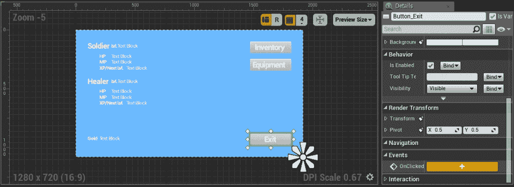

从这里，你将通过将**OnClicked**事件链接到**Remove from Parent**来设置屏幕移除自己：

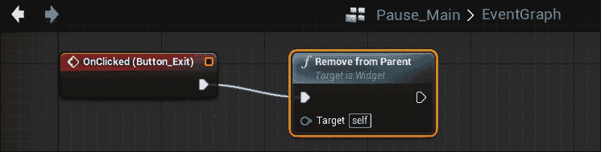

你的屏幕现在应该可以完美导航，但我们还没有完成。你最后会注意到，当退出暂停菜单时，游戏仍然是暂停状态。我们需要取消暂停游戏。这个修复非常简单。在**Pause_Main**蓝图内部，只需将**Set Game Paused**链接到**Remove from Parent**，这样当小部件被移除时，游戏就会取消暂停：

你可能会注意到，当你离开暂停菜单时，鼠标光标仍然存在。你可以通过创建一个**Set Show Mouse Cursor**节点并将其连接到你在取消暂停游戏后添加的**OnClicked Button_Exit**事件来移除鼠标光标，这与你最初添加鼠标光标的方式类似，这次确保**Set Show Mouse Cursor**节点内的复选框未勾选，意味着**Set Show Mouse Cursor**被设置为 false，并将其连接到一个**Get Player Controller**。

就这样。我们现在已经完成了暂停菜单及其子菜单的导航。

# 摘要

在本章中，我们完成了暂停菜单的占位符，用于游戏中的其他重要方面，例如**库存**和**装备**滚动框，这些框将保存我们在游戏中获得的库存/装备。在接下来的几章中，我们将继续扩展这个暂停菜单，涵盖统计数据、金币、物品和装备的跟踪。
