# 第八章。库存填充和物品使用

在上一章中，我们学习了如何添加一个商店，该商店持有物品。在本章中，我们将更进一步，允许用户从商店购买物品，并在他们的动态填充的库存屏幕中使用这些购买的物品。完成后，我们将使用类似的想法为将用于提高穿戴者统计数据的小组成员装备物品。

到本章结束时，我们将学习如何在**Shop**Widget 蓝图中的**Shop**Widget 蓝图创建逻辑，以填充库存滚动框中的按钮，这些按钮是通过**Item**Widget 蓝图中的**Item**数据表创建的。现在我们已经设置了逻辑，我们需要允许用户通过能够购买他们在商店中点击的任何物品来与按钮交互，只要他们有足够的钱。由于发行者与动态填充的按钮交互，当用户按下按钮时执行我们的逻辑非常重要，该按钮位于**Item**Widget 蓝图中。

如果你之前在你的**事件图**中创建了其他蓝图，你可以忽略它们，因为交互将允许我们使用不同的方法重新开始。

首先，我们必须注意，**Item**蓝图将包含在任何按钮从该蓝图被点击时应该发生的逻辑。因此，目前我们计划让按钮填充商店，但在玩家的库存中，逻辑需要根据我们在哪个屏幕上而有所不同。这意味着我们首先需要找出玩家在哪个屏幕上，然后根据他们所在的屏幕执行一系列动作。这可以通过**OnClicked**事件中的布尔值轻松完成，该事件将检查玩家在哪个菜单中，并根据当前菜单分支不同的逻辑。

由于我们关注的是**Pause_Inventory**屏幕上的按钮与**Shop**屏幕上的按钮行为之间的差异，我们必须首先创建一个布尔值，该布尔值将在角色的整个生命周期中保持活跃。在这种情况下，我们将使用 Field Player 来保存我们的重要物品变量。

在本章中，我们将涵盖以下主题：

+   创建 Field Player 布尔值

+   确定库存屏幕是开启还是关闭

+   库存和商店物品之间的逻辑差异

+   完成库存屏幕

+   使用物品

# 创建 FieldPlayer 布尔值

通过导航到**内容** | **蓝图** | **角色**，转到 Field Player。打开 Field Player 并导航到**事件图**：

在这里，我们通过导航到**+添加新** | **变量**在**蓝图**选项卡下创建一个新的变量。接下来，我们创建一个新的`inventoryScreen`布尔值。然后，我们需要使变量公开。这个布尔值将负责根据玩家是否在库存屏幕上保持 true 或 false 值。我们可能需要在图中使用更多这样的变量，但现在我们只使用这个变量：

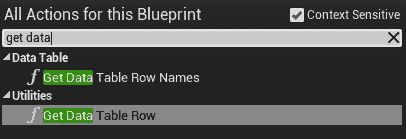

完成创建`inventoryScreen`变量后，编译蓝图。

# 确定库存屏幕是否开启或关闭

现在，我们将设置`inventoryScreen`变量到合适的位置。最好的地方是在库存菜单弹出时。因此，通过导航到**内容** | **蓝图** | **UI**，前往**Pause_Inventory**。在**Pause_Inventory**中，在事件图中定位**事件构造**（如果尚未存在，则创建一个），然后从这里，通过创建**获取所有类别的演员**来获取 Field Player 类中的每个演员，该功能位于**动作**菜单下的**实用工具**中：

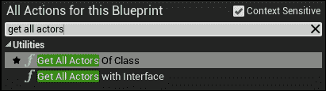

在**获取所有类别的演员**函数的**演员类别**下，将演员更改为**Field Player**：

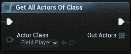

从**输出演员**引脚，在**获取所有类别的演员**函数中，你需要附加一个**GET**函数。这将获取你的 Field Player 类中所有演员的数组，并允许访问类中的单个成员：

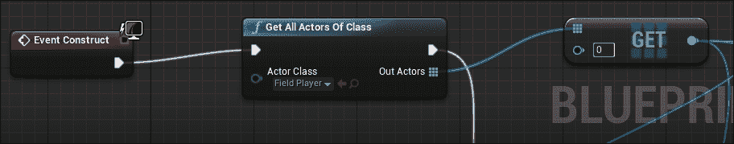

最后，打开所有可能的行为并取消**上下文相关**的勾选。通过导航到**类** | **Field Player**，前往**设置库存屏幕**：

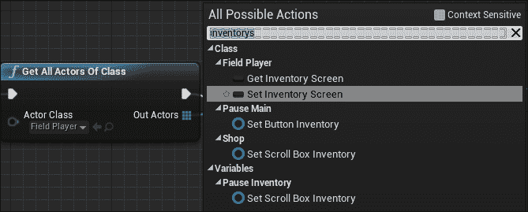

完成后，将你的**设置库存屏幕**的**目标**引脚连接到**GET**的右侧引脚。同时，确保**库存屏幕**被勾选，这意味着我们在这里将**库存屏幕**设置为 true。在这个时候，你还可以将**事件构造**链接到触发**获取所有类别的演员**，这将激活**设置库存屏幕**：

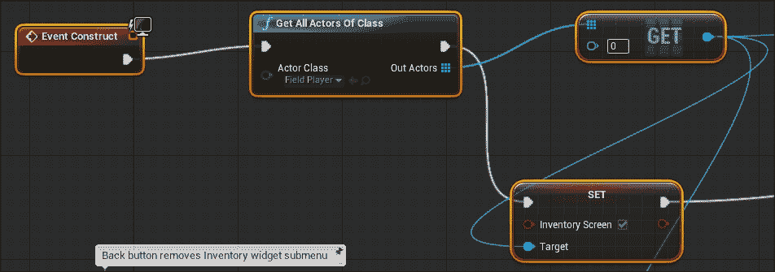

我们还需要确保当玩家离开库存屏幕时布尔值设置为 false，因此克隆另一个**设置库存屏幕**布尔值，并将其设置为 false。将**目标**引脚重新链接到**获取所有类别的演员**的**GET**，并在库存窗口关闭时激活它：

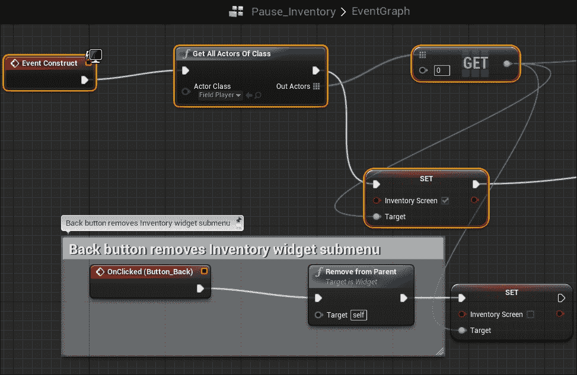

我们将在稍后回到**Pause_Inventory**以添加按钮填充逻辑，类似于前一章中的商店。然而，现在我们已经设置了布尔值，我们将能够判断玩家是查看库存还是正在导航商店（如果布尔值为假）。 

# 库存和商店物品之间的逻辑差异

现在，让我们通过导航到**内容** | **蓝图** | **UI**来打开**Item**小部件蓝图：

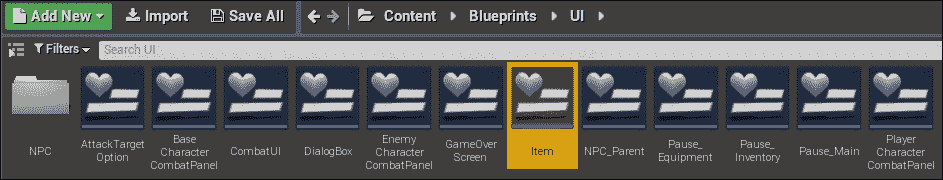

在这个阶段，我们不应该为按钮设置任何逻辑，这是必要的，因为它会告诉我们按钮与游戏结合时将执行哪些操作。要为按钮添加功能，请点击按钮，导航到**详情** | **事件** | **OnClicked**，然后点击**+**：

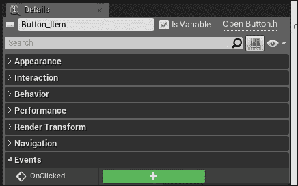

在这里，我们需要做几件事情。首先，我们知道这个蓝图将负责所有与商店和角色库存相关的按钮机制，由于角色从商店购买物品并使用库存中的物品，所以机制将不同。由于这些不同的游戏屏幕提供不同的操作，因此首先检查用户是在商店还是在他们的库存中会是一个明智的选择。为此，我们应该首先引入**获取所有类演员**函数，并获取来自**Field Player**类的所有演员。然后，我们需要将**输出演员**引脚连接到**GET**。最后，让**OnClicked**事件触发**获取所有类演员**：

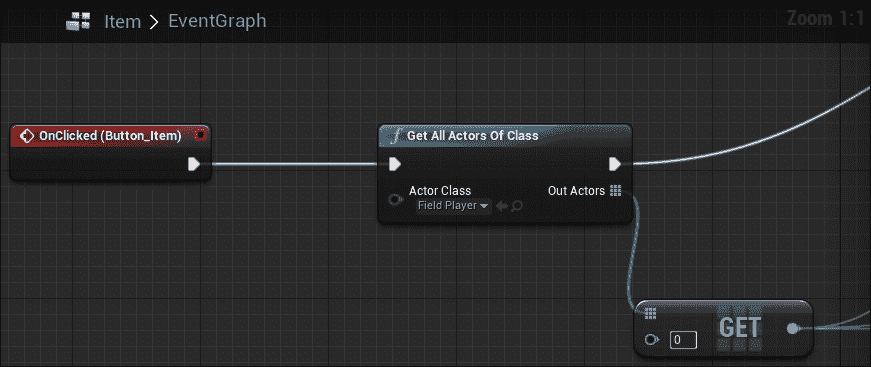

在这个阶段，我们可以打开我们的**动作**窗口，并通过导航到**类** | **Field Player**来访问**获取库存屏幕**。您需要取消选中**上下文相关**才能看到此选项：

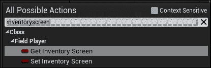

然后，您将把**库存屏幕**节点的**目标**引脚连接到蓝色的**GET**引脚。这将使我们能够从**Field Player**类访问**库存屏幕**布尔值：

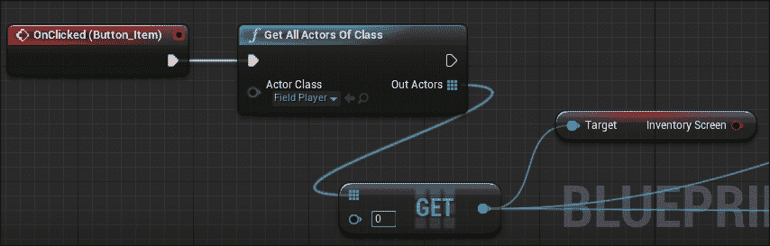

现在是时候创建一个分支系统，根据玩家是在购物还是在其库存中执行逻辑。我们将使用我们的**库存屏幕**布尔值来完成这个任务。让我们首先通过在**动作**菜单中导航到**实用工具** | **流程控制**来引入一个分支：

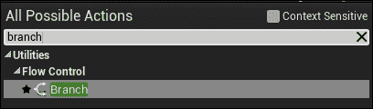

在这里，我们将分支的条件链接到**库存屏幕**条件。然后，让**获取所有类的动作**函数激活分支。此时，当玩家点击按钮时，我们将检查是否**库存屏幕**为真（或者玩家是否在库存屏幕上）。如果他们不在库存屏幕上，那么这意味着玩家在其他屏幕上；在我们的例子中，是商店：

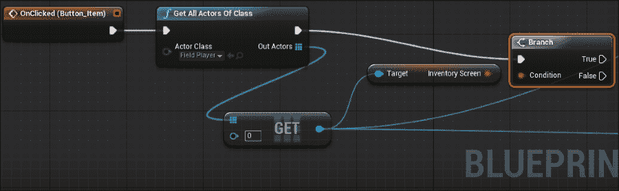

在我们继续处理**物品**按钮的其他逻辑之前，我们需要考虑我们的逻辑流程。如果用户在商店，并且用户点击要购买的项目，那么如果那个人有足够的钱购买该项目，该项目应该被放入某种收集或数组中，以便填充用户的库存屏幕。由于这个机制，我们需要寻找某种全局数组，它将能够容纳玩家购买的项目数组。为此，转到**FieldPlayer**事件图，并添加一个名为**arrayItem**的新文本数组。同时，确保这个变量设置为公共且可编辑：

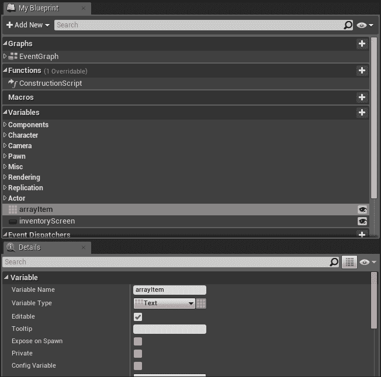

# 完成库存屏幕

导航到**Pause_Inventory**事件图。当**上下文敏感**关闭时，通过导航到**类**|**Field Player**在**动作**窗口中引入**获取数组项**：

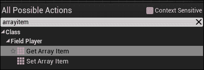

完成后，将**数组项**的**目标**引脚连接到**GET**，这样我们就可以在**物品**蓝图中将数组填充后获取发送到该数组的每个项目：

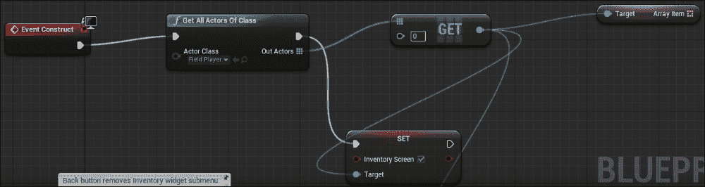

现在我们有了玩家库存中的项目数组，我们将遍历每个元素，并从数组中的每个元素创建一个项目。为此，通过导航到**实用工具**|**数组**创建一个**ForEachLoop**。然后，将您的**arrayItem**变量中的**数组项**链接到**ForEachLoop**的**数组**标签。然后，让**设置库存屏幕**激活**ForEachLoop**：

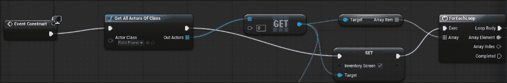

就像我们在填充商店按钮时所做的，我们希望这个`for`循环负责添加来自**物品**小部件蓝图中的按钮。因此，在`for`循环体中，我们需要通过首先在**动作**窗口中导航到**用户界面**|**创建小部件**来创建**Item**小部件：

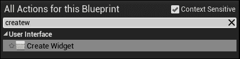

然后，我们需要将**类**下拉菜单更改为**Item**，并将其链接到**ForEachLoop**中的**循环体**：

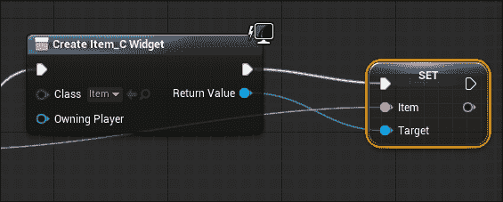

然后，您需要为数组中的每个元素设置文本。因此，打开**动作**窗口，关闭**上下文敏感**，通过导航到**类**|**Item**来引入**设置项目**：

将**Item**引脚链接到**ForEachLoop**的**Array Element**引脚。然后，将**Set Item**的**Target**引脚设置为**Create Item Widget**的**Return Value**，并让**Create Item Widget**激活**Set Item**：

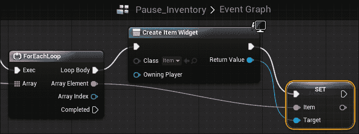

最后，我们需要将**Item**小部件添加到我们在**Pause_Inventory**中创建的滚动框中。只需创建一个位于**Widget**下**Panels**中的**Add Child**节点。然后，将你的变量中的**ScrollBox_Inventory**链接到**Add Child**的**Target**引脚（如果你看不到**ScrollBox_Inventory**作为默认变量，请确保你回到**Pause_Inventory**的设计视图，选择**ScrollBox_Inventory**，并检查**is variable**，然后让**Add Child**的**Content**引脚成为**Create Item Widget**的**Return Value**）。最后，让**Set Item**节点启动**Add Child**节点：

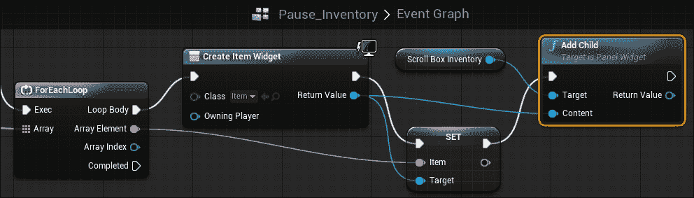

当你完成时，你的**Pause_Inventory**蓝图将看起来像这样：

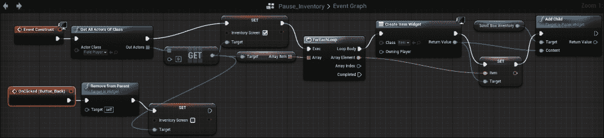

# 购买物品

回到**Item**蓝图。在我们之前停止的地方，我们允许在点击按钮时获取来自**Field Player**类的所有演员。在这里，我们设置了一个分支，检查**Inventory Screen**布尔值是真是假（这意味着我们检查玩家是否在库存屏幕上；如果他们不在库存屏幕上，我们将在我们的商店中执行购买逻辑）。

让我们先从**Actions**窗口中的**Utilities**下引入一个**Get Data Table Row**函数：

然后，将数据表设置为**Items_Shop**。这将使我们能够从**Items_Shop**数据表中获取每一行。然后，将我们创建的分支中的**False**引脚链接到**Get Data Table Row**的执行：

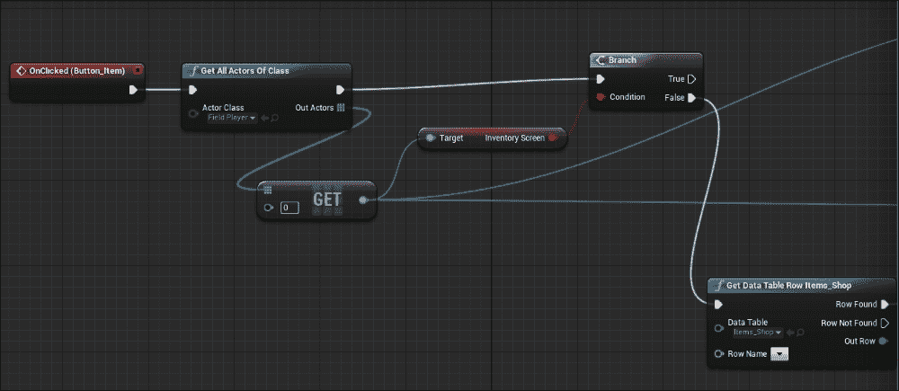

你可能已经注意到，我们可以从数据表中选择任何行名。在这种情况下，我们只需要获取当前选中物品的行名。为此，将上一章在本课程中创建的**Item**文本变量的**Get**引入，并将其链接到**Get Data Table Row**函数中的**Row Name**，但这些引脚不兼容。因此，你需要首先通过左键单击并拖动它从**Item**节点，然后导航到**Utilities** | **String** | **To String (Text)**将文本项转换为字符串。这将创建你需要的第一个转换：

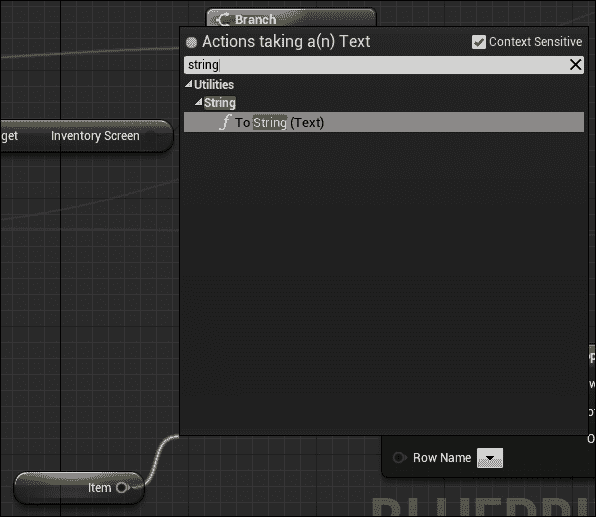

最后，你只需将这个转换后的字符串链接到**Get Data Table Row**函数中的**Row Name**引脚：

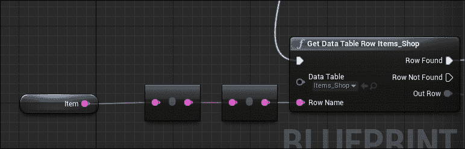

完成后，我们已经完成了在商店中选择特定物品的逻辑。现在，我们需要计算每个物品的*价值*的金币数量，并从我们的总金币中减去。为此，我们必须首先获取游戏实例，以便我们可以调用游戏金币。然而，由于我们将在本蓝图中的许多其他变量中需要此实例，我们可能希望将游戏实例称为构造函数的一部分。如果你还没有这样做，创建一个**事件构造**。接下来，将位于**实用工具**下的**转换**中的**Cast To RPGGameInstance**对象链接。然后，将位于**游戏**下的**动作**窗口中的**获取游戏实例**对象链接到**Cast To RPGGameInstance**对象：

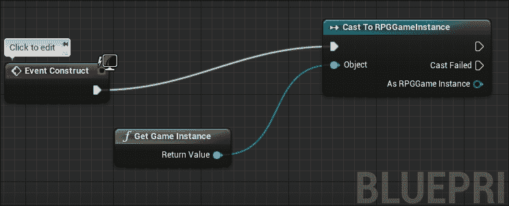

由于我们最终需要访问角色参数，例如 HP 和 MP，在将物品应用到玩家时，我们需要获取所有队伍成员，并设置一个类似于前几章中做的角色目标。为此，创建一个新的变量：

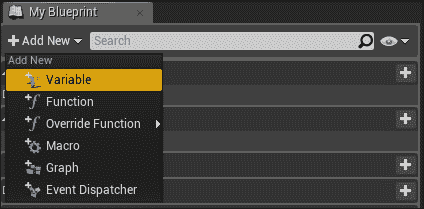

然后，转到**详细信息** | **变量**，调用**角色目标**变量，将其类型更改为**游戏角色**，这将引用我们队伍中的游戏角色：

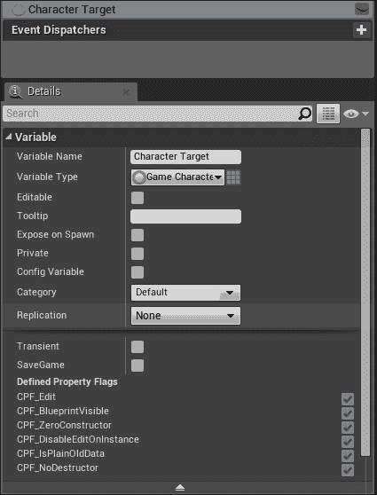

然后，从**As RPGGame Instance**引脚拖出一条线，并通过导航到**变量** | **游戏数据**选择**Get Party Members**变量：

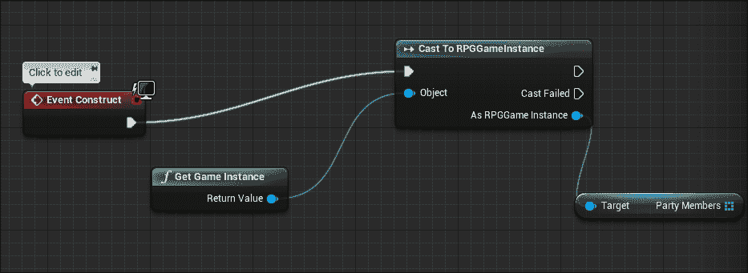

将一个**GET**函数链接到**队伍成员**数组。你需要将**GET**链接到角色目标。所以，引入你创建的新角色目标的**SET**版本，并将**GET**函数链接到**SET 角色目标**中的**角色目标**引脚。最后，让**转换为 RPGGameInstance**执行**SET 角色目标**。当你完成设置游戏实例和游戏角色的引用后，你的构造函数将看起来像这样：

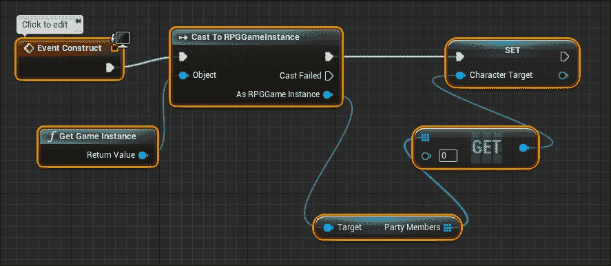

现在我们已经为当前游戏实例设置了引用，我们可以操作金币。接下来你需要做的是导航到你的**获取数据表行**函数。在这里，左键单击并拖动函数内的**输出行**引脚，这将给你一些有限的选择；其中之一是创建**Break ItemsData**。这将允许你访问每个物品的所有数据。一旦完成，你将看到一个显示我们在**Items_Shop**数据表中创建的所有数据的框：

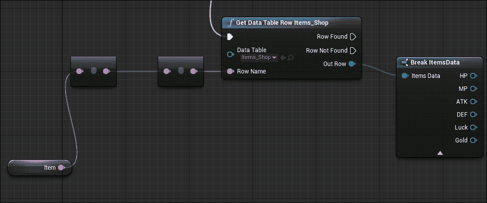

逻辑非常简单。基本上，如果用户有足够的钱，允许他们购买物品，并通过他们的游戏金币减去物品的成本。如果他们没有足够的钱，则不允许他们购买物品。

要这样做，我们将创建一个**获取游戏金币**引用。这可以通过导航到**类** | **RPGGame Instance**来实现，如果未勾选**上下文相关**：

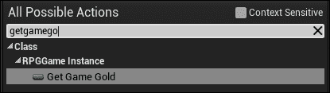

一旦创建，将引用链接到**投射到 RPG 游戏实例**中的**As RPGGame Instance**。您还可能注意到在下图中有一个将**HP**设置为**5**的**SET**引脚；您可以添加一个或让它保持原样。这将仅表示玩家开始时有 5 点 HP；这是在测试玩家消耗药水时进行的测试目的；如果您决定为了测试目的使用**Set HP**，请记住在完成游戏测试后将其删除：

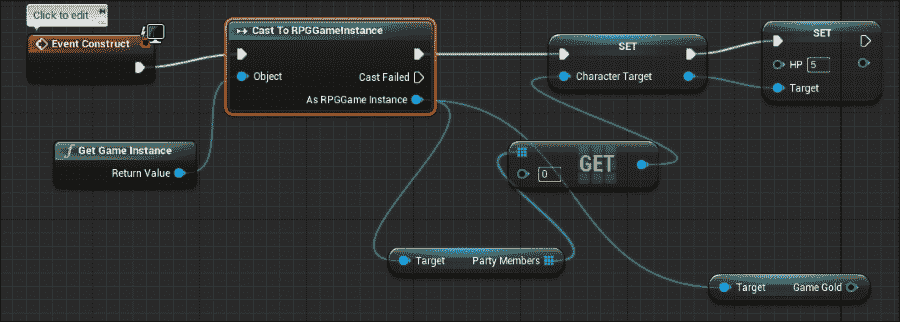

现在，我们将从购买物品的成本中减去游戏金币。因此，只需创建一个从整数减去整数的数学函数。您可以通过导航到**数学** | **整数**来找到此数学函数：

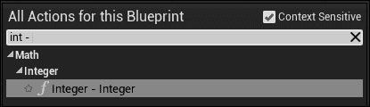

为了正确进行数学运算，我们需要将游戏金币链接到减法函数的顶部引脚，并将**ItemsData**中的金币链接到底部引脚。这将从物品的成本中减去我们的游戏金币：

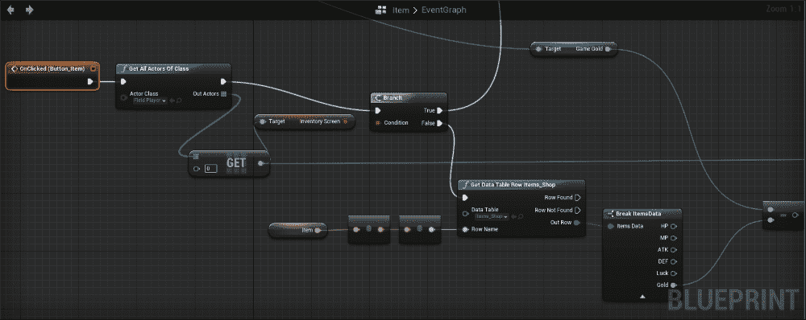

在这里，我们需要检查玩家是否有足够的钱购买物品。因此，我们将检查最终产品是否小于 0。如果是，则不允许玩家进行购买。为此检查，只需使用另一个名为**整数 < 整数**的数学函数，位于**数学**下的**整数**。然后，将减法最终产品与 0 进行比较，如下所示：

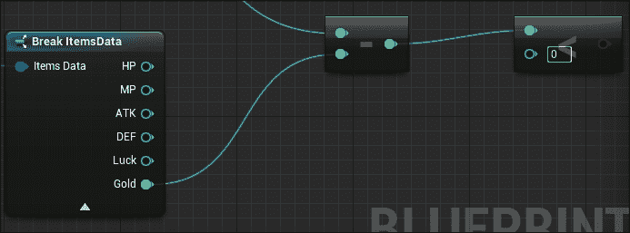

接下来，通过导航到**实用工具** | **流程控制**创建一个分支，并将条件链接到您刚刚创建的**整数 < 整数**函数的条件。然后，将**获取数据表行**的**行找到**引脚链接到执行分支，以便如果找到行，则可以进行数学运算：

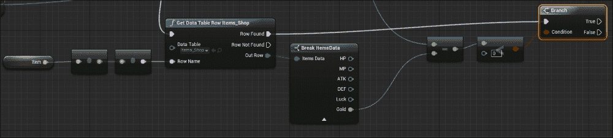

如果最终结果不小于 0，则需要将游戏金币设置为减法结果。为此，在**动作**窗口中，通过导航到**类** | **RPG 游戏实例**并关闭**上下文相关**，引入**SET 游戏金币**函数：

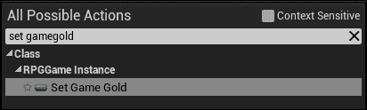

将**游戏金**的**目标**引脚连接到**作为 RPG 游戏实例**的引脚，从**投射到 RPG 游戏实例**功能开始。然后，将**游戏金币**引脚连接到减法操作的最终产品，以获取剩余的游戏金币：

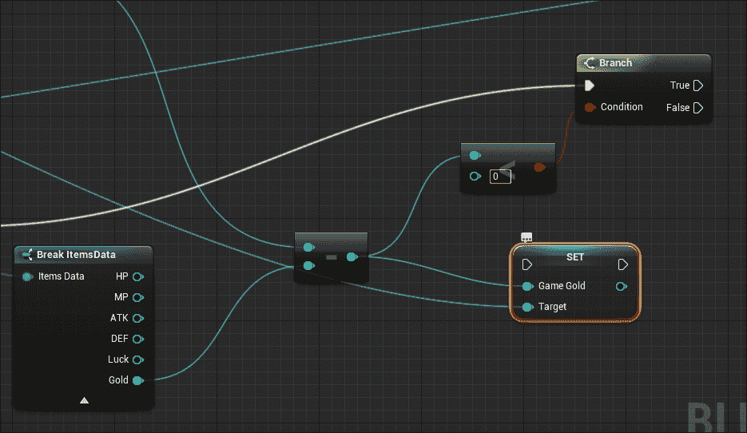

最后，我们需要正确地链接所有内容。剩余的链接来自分支；如果小于条件返回 false，则表示我们有足够的钱购买产品，并且可以更改游戏金币。因此，接下来，将分支的**False**引脚链接到执行**SET 游戏金币**：

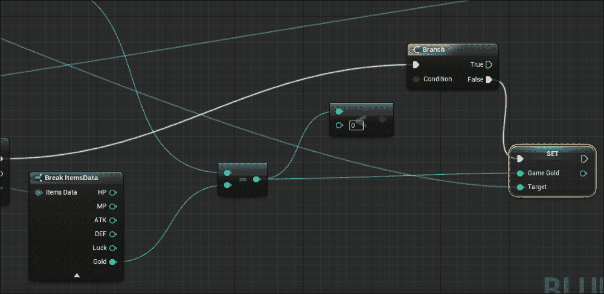

如果你现在测试这个程序，你会注意到物品可以从商店无缝购买。然而，问题是物品从未从商店填充到玩家的库存中。这是一个简单的修复。在本章的早期，我们已经设置了我们的库存屏幕，使其能够获取一个可以存储在**玩家字段**中的数组。我们将简单地使用这个数组来添加我们购买的物品到数组中，然后，在我们打开我们的库存时检索这些物品：

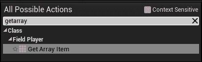

由于我们已经有了一种从**玩家字段**收集变量的方法，我们将通过导航到**类**|**玩家字段**来引入**获取数组项**变量。

我们将链接**数组项**的**目标**引脚到**获取所有类别的演员**函数的**GET**，以便我们能够完全访问`arrayItem`变量。然后，我们将在**动作**窗口中导航到**实用工具**|**数组**来引入一个**添加**函数：

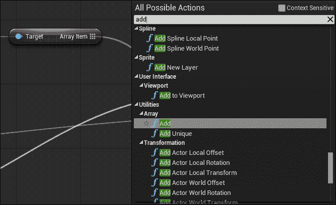

**添加**函数将允许你在动态增加其大小（例如列表）的同时向数组中添加元素。要使用此功能，你需要链接你想要填充的数组；在这种情况下，**数组项**。然后，你需要链接你想要添加到数组中的项目；在这种情况下，**项目**。最后，你需要执行**添加**操作。我们将在设置**黄金**值之后执行它。本质上，在玩家购买物品后，该物品将被添加到他们的库存中：

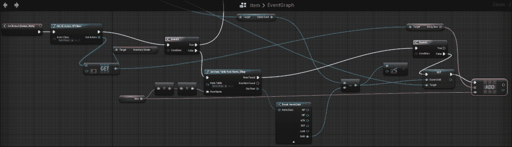

你的购买机制现在已经完成，你现在可以测试你的商店了。你会注意到物品可以被购买，并且这些购买的物品填充了你的库存。

# 使用物品

现在你已经允许物品填充库存，现在是时候让这些物品发挥作用了。此时，你应该仍然在你的物品的**onClicked**按钮的起始位置有一个分支。到目前为止，你的分支只是通过一个错误的程序，因为这个程序表示如果玩家在商店中，他们正在与按钮交互。现在是时候为当**库存屏幕**布尔值为真时创建一个程序，这意味着玩家正在库存屏幕上。

在我们创建**获取数据表行**函数并将其设置为**商店项目**数据表（该数据表接受项目行名称并将项目分解为项目数据）之间的初始步骤与我们的先前步骤相同。因此，我们可以简单地从我们的先前步骤中复制并粘贴这些部分到这个蓝图中的空白区域：

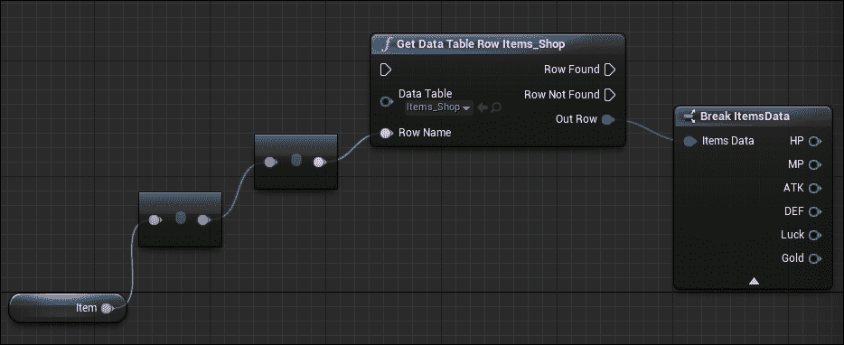

接下来，我们将从我们的初始分支（由**获取所有类别的演员**函数激活）链接**True**引脚以执行**获取数据表行**函数：

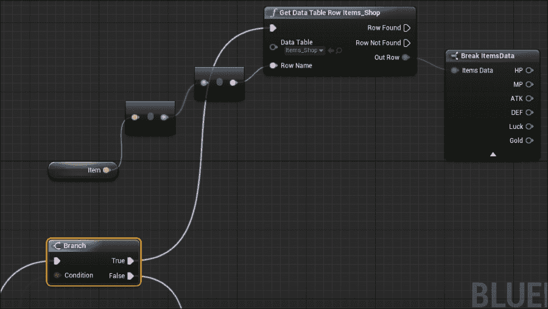

我们将实现与购买物品时实现的逻辑非常相似的逻辑；但这次，我们想确保用户在使用物品时得到正确的数量设置。让我们首先从药水开始。药水只使用 HP 数据。因此，我们需要做的是将药水的 HP 数据添加到角色的当前 HP 中。为此，我们首先需要一个角色目标变量。所以，从你的**变量**列表中引入一个**获取角色目标**函数：

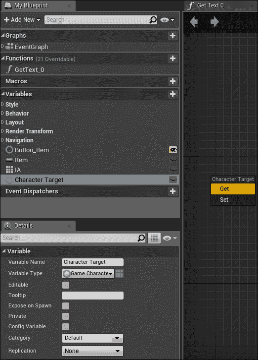

完成此操作后，将**角色目标**变量连接到**获取 HP**：

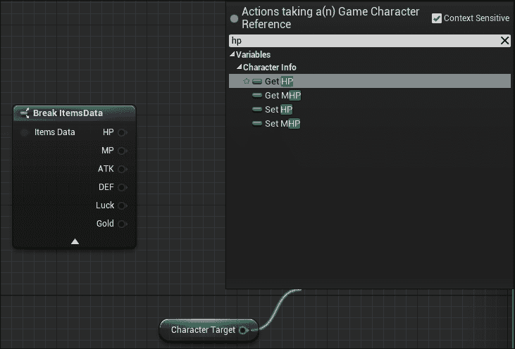

现在您已经可以访问当前玩家的 HP，可以通过导航到**数学** | **整数**引入**整数 + 整数**函数。只需将**Break ItemsData**节点中的**HP**引脚连接到**整数 + 整数**函数的顶部引脚，并将角色 HP 连接到**整数 + 整数**节点的底部引脚：

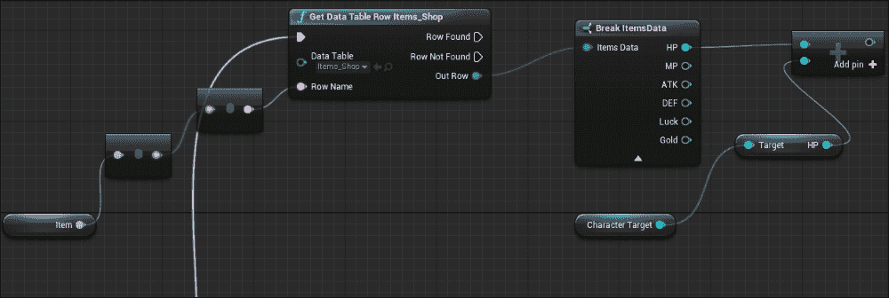

在这里，我们需要检查加法的结果是否小于角色的最大 HP。如果是，我们可以使用药水。如果不是，我们不能使用药水。所以，让我们首先从**角色目标**中引入**Get MHP**变量，它显示了角色的最大 HP 是什么样的：

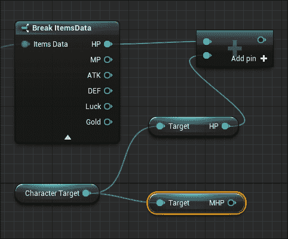

现在，我们需要引入一个检查一个整数是否小于另一个整数的条件。这可以在**动作**窗口中通过导航到**数学** | **整数**找到：

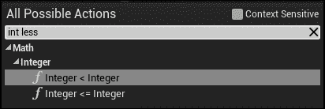

接下来，将最终加法结果连接到**整数 < 整数**条件的上部引脚，并将**MHP**连接到下部引脚：

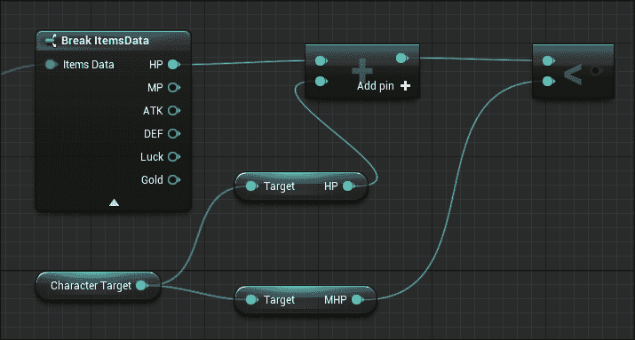

我们现在将创建一个检查我们条件的分支。这个分支应该只在找到行（或用户点击实际物品）时激活：

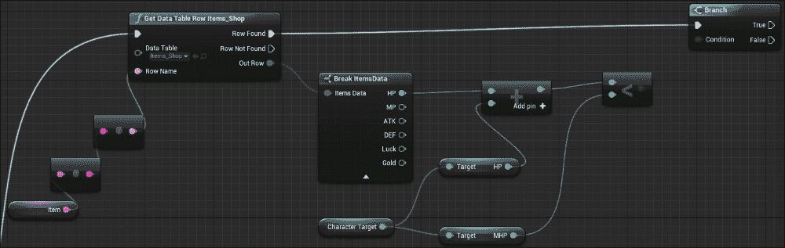

如果总 HP 小于最大 HP，那么这意味着条件为真，我们需要使用位于**小部件**下的**从父级移除**函数从库存中移除物品。然后，我们需要使用**SET HP**函数，通过导航到**类** | **游戏角色**并使其等于产品物品 HP 和角色 HP 的总和。我们还需要将**SET HP**函数的**目标**引脚连接到**角色目标**的引用：

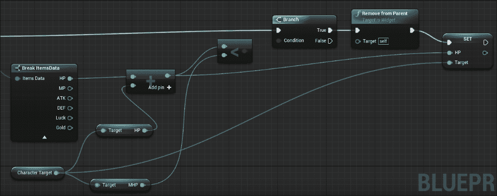

如果你现在测试这个，角色将能够使用药水，并且使用后药水会被移除，但用户无法完全恢复生命值，因为我们只是测试我们的添加是否超过了最大生命值，这仅适用于药水的治疗属性未完全使用的情况。因此，角色可能永远无法恢复到 100%。为了解决这个问题，我们将简单地创建一个用于**False**分支的例程，该例程将从父项中移除物品，然后自动将生命值设置为最大生命值。这将解决我们无法将角色恢复到最大健康值的问题：

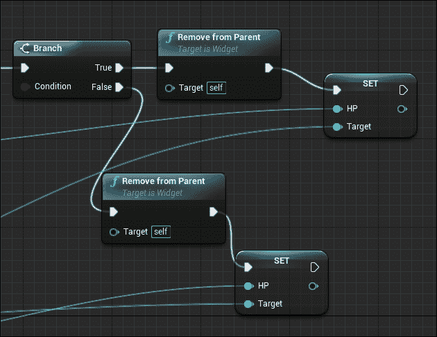

当你完成这个任务后，你的基于 HP 的物品蓝图将看起来像这样：

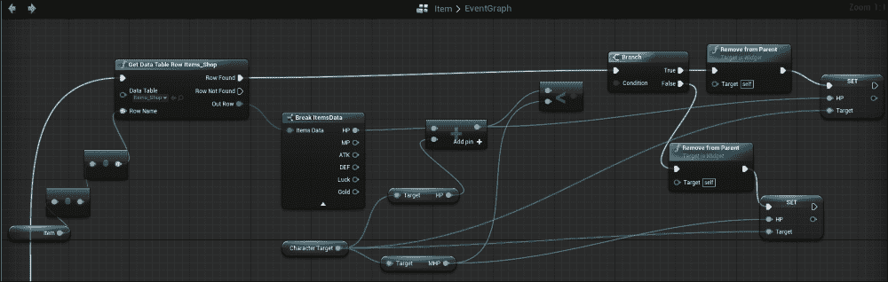

如果你现在测试这个，你会注意到你的所有药水在你的库存中工作得非常完美。我们未完成的最后一种药水是以太，但以太的逻辑与药水逻辑完全相同，尽管你检查的是 MP 的效果而不是 HP 的效果。请注意，这种逻辑并不特定于任何单个物品，它是动态的，任何影响这些属性的物品都会使用这种逻辑。所以，如果你以后有一个超级药水，你不需要重做任何逻辑或添加新逻辑，超级药水仍然被视为一个物品，并且会应用通过数据表给予的正确数量的 HP。

# 摘要

到目前为止，你现在有了与 NPC 交互的货币系统。你能够从 NPC 那里购买物品，并在你的库存中存放尽可能多的物品，然后正确地使用它们。利用这些知识，你应该能够轻松地在游戏中创建更多物品，使用我们在上一章中讨论的策略。

在下一章中，我们将更深入地探讨可使用物品，并处理装备武器和盔甲，这将暂时改变玩家的属性。
