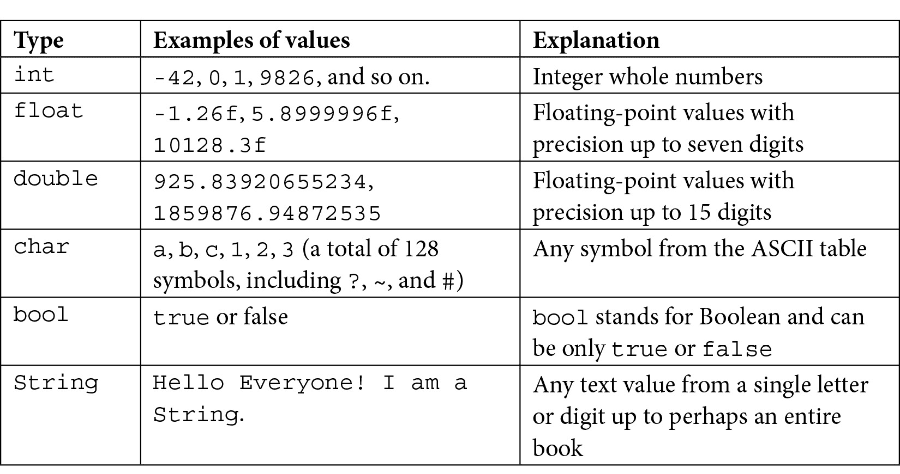
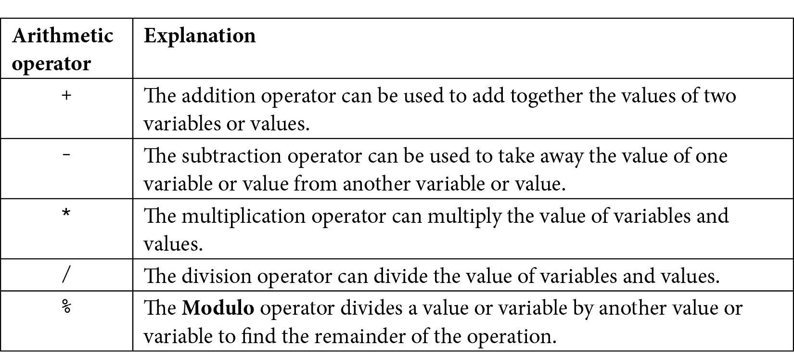
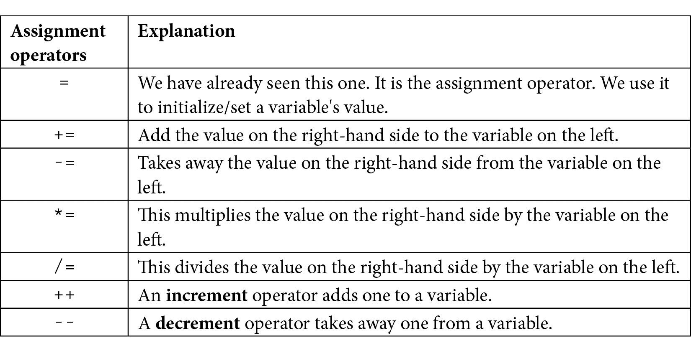
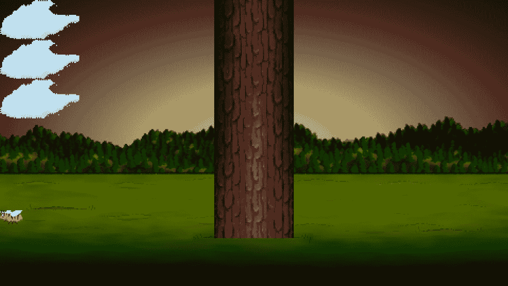
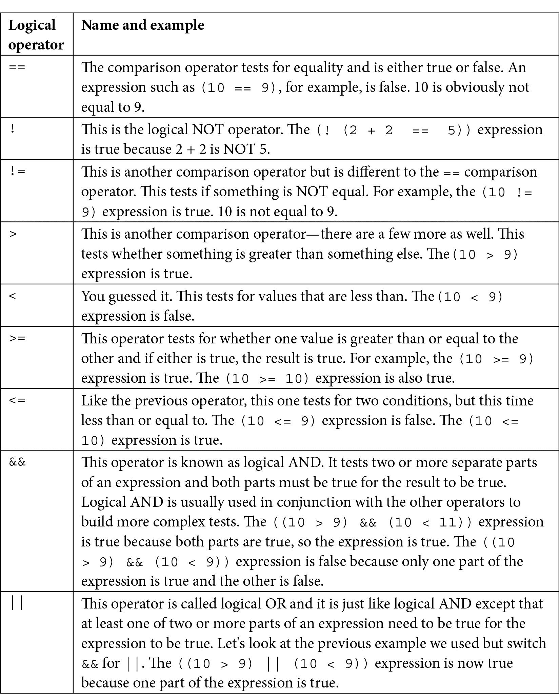
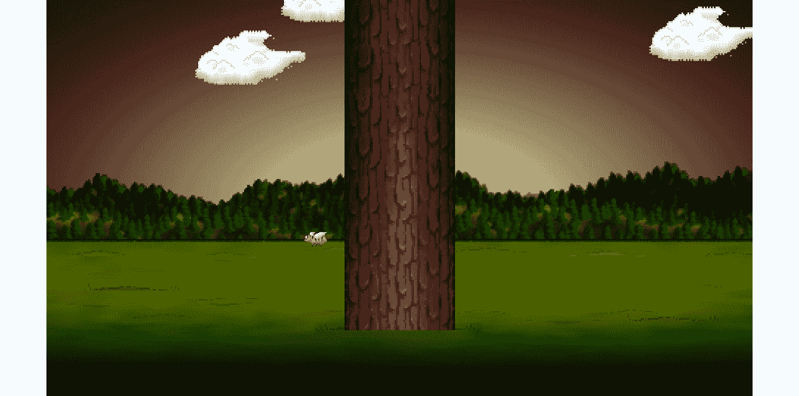

# *第二章*：变量、运算符和决策 – 动画精灵

在本章中，我们将在屏幕上进行更多的绘制，为了实现这一点，我们需要了解一些 C++的基础知识。我们将学习如何使用变量来记住和操作值，并开始向游戏中添加更多图形。随着本章的进展，我们将了解如何操作这些值来动画图形。这些值被称为变量。

这里是您将获得的内容：

+   学习有关 C++变量的所有内容

+   看看如何操作存储在变量中的值

+   添加一个静态树木图形，供玩家砍伐

+   绘制和动画一只蜜蜂和三个云朵

# C++变量

**变量**是我们 C++游戏存储和操作值/数据的方式。如果我们想知道玩家有多少生命值，我们需要一个变量。也许你想知道当前波次中剩余了多少僵尸。那也是一个变量。如果你需要记住获得高分玩家的名字，你猜对了——我们需要一个变量来存储那个信息。游戏结束了吗，还是仍在进行中？是的，那也是一个变量。

变量是 PC 内存中位置的命名标识符。PC 的内存是计算机程序在执行时存储的地方。因此，我们可以将一个变量命名为`numberOfZombies`，这个变量可以指向内存中的一个位置，该位置存储一个值，表示当前波次中剩余的僵尸数量。

计算机系统在内存中定位的方式很复杂。编程语言使用变量为我们提供了一种人性化的方式来管理该内存中的数据。

我们刚才提到的关于变量的少量信息暗示了必须存在不同类型的**变量**。

## 变量类型

C++变量类型繁多（请参阅几页后的关于变量的下一个提示）。很容易想象可以花整整一章来讨论它们。以下是一个表格，列出了本书中最常用的变量类型。然后，在下一节中，我们将探讨如何使用这些变量类型：



编译器必须被告知变量的类型，以便它可以为它分配正确的内存量。对于您使用的每个变量，使用最佳和最合适的类型是一种良好的实践。然而，在实践中，你通常会通过提升变量来解决问题。也许你需要一个只有五个有效数字的浮点数？如果你将其存储为`double`，编译器不会抱怨。然而，如果你试图将`float`或`double`存储在`int`中，它将变成`int`。随着我们通过这本书的进展，我会清楚地说明在每种情况下使用最佳变量类型是什么，我们甚至会看到一些我们故意在变量类型之间转换/转换的例子。

在前面的表中，有几个值得注意的额外细节包括所有 `float` 值旁边的 `f` 后缀。这个 `f` 后缀告诉编译器该值是 `float` 类型，而不是 `double`。没有 `f` 前缀的浮点值默认是 `double`。关于这一点，请参阅下一节关于变量的提示。

如我们之前提到的，还有许多其他类型。如果你想了解更多关于类型的信息，请参阅下一节关于变量的提示。

### 用户定义的类型

用户定义的类型比我们刚刚看到的类型要高级得多。当我们谈论 C++ 中的用户定义类型时，我们通常指的是类。我们在上一章中简要介绍了类及其相关对象。我们将代码写入单独的文件，有时是两个文件。然后我们能够声明、初始化和使用它们。我们将如何定义/创建我们自己的类型留到 *第六章**，面向对象编程 – 开始乒乓球游戏*。

## 声明和初始化变量

到目前为止，我们知道变量用于存储我们的游戏需要的数据/值，以便工作。例如，一个变量可以代表玩家拥有的生命值或玩家的名字。我们还知道，这些变量可以表示多种不同类型的值，例如 `int`、`float`、`bool` 等。当然，我们还没有看到的是我们如何实际使用变量。

创建和准备新变量有两个阶段。这些阶段被称为 **声明** 和 **初始化**。

### 声明变量

我们可以在 C++ 中这样声明变量：

```cpp
// What is the player's score?
int playerScore;
// What is the player's first initial
char playerInitial;
// What is the value of pi
float valuePi;
// Is the player alive or dead?
bool isAlive;
```

一旦我们编写了声明变量的代码，它就存在了，并准备好在我们的代码中使用。然而，我们通常会想要给变量赋予一个合适的值，这就是初始化的作用所在。

### 初始化变量

现在我们已经用有意义的名字声明了变量，我们可以用适当的值初始化这些变量，如下所示：

```cpp
playerScore = 0;
playerInitial = 'J';
valuePi = 3.141f;
isAlive = true;
```

到目前为止，变量已经存在并持有特定的值。很快，我们将看到如何更改、测试和响应这些值。接下来，我们将看到我们可以将声明和初始化合并为一步。

### 一步声明和初始化

当我们觉得合适时，我们可以将声明和初始化步骤合并为一步。有时，我们知道变量必须以什么值开始程序，在这种情况下，一步声明和初始化是合适的。通常情况下，我们不知道，我们首先声明变量，然后在程序的后面初始化它，如下所示：

```cpp
int playerScore = 0;
char playerInitial = 'J';
float valuePi = 3.141f;
bool isAlive = true;
```

变量提示

如承诺的那样，这里有一些关于变量的技巧。如果你想查看 C++类型的完整列表，请查看这个网页：[`www.tutorialspoint.com/cplusplus/cpp_data_types.htm`](http://www.tutorialspoint.com/cplusplus/cpp_data_types.htm)。如果你想对`float`、`double`和`f`后缀进行更深入的讨论，请阅读这个：[`www.cplusplus.com/forum/beginner/24483/`](http://www.cplusplus.com/forum/beginner/24483/)。最后，如果你想了解 ASCII 字符码的来龙去脉，这里有一些更多信息：[`www.cplusplus.com/doc/ascii/`](http://www.cplusplus.com/doc/ascii/)。请注意，这些链接是为那些好奇心旺盛的读者准备的，我们已经讨论了足够的内容以便继续前进。

### 常量

有时候，我们需要确保一个值永远不能被改变。为了实现这一点，我们可以声明并初始化一个`const`关键字：

```cpp
const float PI = 3.141f;
const int PLANETS_IN_SOLAR_SYSTEM = 8;
const int NUMBER_OF_ENEMIES = 2000;
```

声明常量的惯例是全部大写。前面常量的值永远不能改变。我们将在*第四章*“循环、数组、开关、枚举和函数 – 实现游戏机制”中看到一些常量的实际应用。

### 声明和初始化用户定义的类型

我们已经看到了如何声明和初始化一些 SFML 定义的类型的例子。正是因为我们可以如此灵活地创建/定义这些类型（类），所以它们的声明和初始化方式也是多种多样的。这里有一些关于从上一章声明和初始化用户定义类型的提醒。

创建一个名为`vm`的`VideoMode`类型的对象，并用两个`int`值`1920`和`1080`进行初始化：

```cpp
// Create a video mode object
VideoMode vm(1920, 1080);
```

创建一个名为`textureBackground`的`Texture`类型的对象，但不要进行任何初始化：

```cpp
// Create a texture to hold a graphic on the GPU
Texture textureBackground;
```

注意，即使我们没有建议用于初始化`textureBackground`的具体值，也可能（实际上，可能性非常大）在内部进行一些变量的设置。一个对象是否需要/有在这一点上提供初始化值的选项，完全取决于类的编码方式，几乎是无限灵活的。这进一步表明，当我们开始编写自己的类时，将有一些复杂性。幸运的是，这也意味着我们将拥有显著的能力来设计我们的类型/类，以满足我们制作游戏的需求！将这种巨大的灵活性添加到 SFML 设计类的力量中，我们游戏的可能性几乎是无限的。

在本章中，我们还将看到 SFML 提供的更多用户创建的类型/类，在整个书中还有更多。

我们已经看到，变量是计算机内存中的一个命名位置，变量可以是简单的整数，也可以是更强大的对象。既然我们知道我们可以初始化这些变量，我们将看看我们如何可以操作它们所持有的值。

# 变量的操作

到目前为止，我们确切地知道变量是什么，它们可以有哪些主要类型，以及如何声明和初始化它们。然而，我们仍然不能做很多。我们需要操作我们的变量；给它们加值；减去它们的值；以及乘以、除以和测试它们。

首先，我们将处理如何操作它们，然后我们将看看如何以及为什么我们要测试它们。

## C++算术和赋值运算符

为了操作变量，C++提供了一系列的**算术运算符**和**赋值运算符**。幸运的是，大多数算术和赋值运算符的使用非常直观，那些不太直观的也很容易解释。为了让我们开始，让我们先看看算术运算符的表格，然后是赋值运算符的表格，这些表格我们将在这本书的整个过程中经常使用：



现在来看看赋值运算符：



重要提示

技术上，除了`=`、`--`和`++`之外的所有这些运算符都被称为**复合赋值运算符**，因为它们由多个运算符组成。

现在我们已经看到了一系列的算术和赋值运算符，我们可以实际看看我们如何通过结合运算符、变量和值来形成**表达式**来操作我们的变量。

## 使用表达式完成任务

**表达式**是结合变量、运算符和值的结果。使用表达式，我们可以得到一个结果。此外，正如我们很快就会看到的，我们可以在测试中使用表达式。这些测试可以用来决定我们的代码下一步应该做什么。首先，让我们看看我们可能在游戏代码中看到的简单表达式。这里是一个简单表达式的例子：

```cpp
// Player gets a new high score
hiScore = score;
```

在前面的代码中，`score`变量所持有的值被用来改变`hiScore`变量的值。现在这两个变量持有相同的值，但请注意，它们仍然是独立的、不同的变量（内存中的位置）。当玩家打破高分时，这可能是我们需要的。这里还有一个例子：

```cpp
// Set the score to 100
score = 100;
```

让我们看看加法运算符，它与赋值运算符结合使用：

```cpp
// Add to the score when an alien is shot
score = aliensShot + wavesCleared;
```

在前面的代码中，`aliensShot`和`wavesCleared`所持有的值通过加法运算符相加，然后将加法的结果赋值给`score`变量。现在，让我们看看以下代码：

```cpp
// Add 100 to whatever the score currently is
score = score + 100;
```

注意，在运算符两侧使用相同的变量是完全可接受的。在前面代码中，100 被加到`score`变量所持有的值上，然后这个新值被重新赋值给`score`。

看看减法运算符与赋值运算符的结合。以下代码从减法运算符左侧的值中减去右侧的值。它通常与赋值运算符结合使用，可能如下所示：

```cpp
// Uh oh lost a life
lives = lives - 1;
```

它也可以这样使用：

```cpp
// How many aliens left at end of game
aliensRemaining = aliensTotal - aliensDestroyed;
```

接下来，我们将看到我们如何可能使用除法操作符。以下代码将左边的数字除以右边的数字。同样，它通常与赋值操作符一起使用，如下所示：

```cpp
// Make the remaining hit points lower based on swordLevel
hitPoints = hitPoints / swordLevel;
```

它也可以这样使用：

```cpp
// Give something, but not everything, back for recycling a block
recycledValueOfBlock = originalValue / .9f;
```

显然，在上一个例子中，`recycledValueOfBlock`变量需要是`float`类型，才能准确存储像那样的计算结果。

也许不出所料，我们可以像这样使用乘法操作符：

```cpp
// answer is equal to 100, of course
answer = 10 * 10;
```

它也可以这样使用：

```cpp
// biggerAnswer = 1000, of course
biggerAnswer = 10 * 10 * 10;
```

重要提示

作为旁白，你有没有想过 C++是如何得到它的名字的？C++是 C 语言的扩展。它的发明者**Bjarne Stroustrup**最初称它为“带类的 C”，但这个名字演变了。如果你感兴趣，你可以阅读 C++的故事[`www.cplusplus.com/info/history/`](http://www.cplusplus.com/info/history/)。

现在，让我们看看增量操作符的实际应用。这是一种巧妙的方法，可以给我们的游戏变量中的一个值加 1。

看看下面的代码：

```cpp
// Add one to myVariable
myVariable = myVariable + 1;
```

上述代码给出的结果与以下代码相同：

```cpp
// Much neater and quicker
myVariable ++;
```

减量操作符`--`，正如你所猜到的，是一种快速从某物中减去 1 的方法，如下所示：

```cpp
playerHealth = playerHealth -1;
```

这与以下操作相同：

```cpp
playerHealth --;
```

让我们看看几个操作符在实际中的应用，然后我们可以回到构建 Timber!!!游戏。加法、减法、乘法和除法操作符每个都有一个相关的操作符，它将它们的主要功能（加法、减法等）与赋值结合起来。这允许我们在想要执行操作符的主要功能后进行赋值时，使用更简洁的代码。看看下面的四个例子（每个操作符一个）：

```cpp
someVariable = 10;
// Multiply the variable by 10 and put the answer 
// back in the variable
someVariable *= 10;
// someVariable now equals 100
// Divide someVariable by 5 put the answer back 
// into the variable
someVariable /= 5;
// someVariable now equals 20
// Add 3 to someVariable and put the answer back 
// into the variable
someVariable += 3;
// someVariable now equals 23
// Take 25 from someVariable and put the answer back 
// into the variable
someVariable -= 25;
// someVariable now equals -2
```

在前面的四个例子中，我们可以看到`*=`、`/=`、`+=`和`-=`操作符可以用来缩短语法，当我们想要使用四个算术操作符之一后跟赋值时。我们将在整本书中这样做很多。

是时候给我们的游戏添加更多精灵了。

# 添加云、树和嗡嗡的蜜蜂

在本节中，我们将向 Timber!!!游戏添加云、树和嗡嗡的蜜蜂。首先，我们将添加一棵树。这将会很容易。原因是树不会移动。我们将使用我们在上一章中绘制背景时使用的相同程序。蜜蜂和云在它们的起始位置也很容易绘制，但我们需要将我们刚刚学到的关于操作变量的知识与新学的 C++主题结合起来，使它们移动。

## 准备树

让我们准备好绘制树！添加以下突出显示的代码。注意未突出显示的代码，这是我们已编写的代码。这应该有助于你识别新代码应该在设置背景位置之后、主游戏循环开始之前立即输入。我们将在添加新代码后提供关于新代码中发生的事情的回顾：

```cpp
int main()
{
    // Create a video mode object
    VideoMode vm(1920, 1080);
    // Create and open a window for the game
    RenderWindow window(vm, "Timber!!!", Style::Fullscreen);
    // Create a texture to hold a graphic on the GPU
    Texture textureBackground;
    // Load a graphic into the texture
    textureBackground.loadFromFile("graphics/background.png");
    // Create a sprite
    Sprite spriteBackground;
    // Attach the texture to the sprite
    spriteBackground.setTexture(textureBackground);
    // Set the spriteBackground to cover the screen
    spriteBackground.setPosition(0, 0);
    // Make a tree sprite
    Texture textureTree;
    textureTree.loadFromFile("graphics/tree.png");
    Sprite spriteTree;
    spriteTree.setTexture(textureTree);
    spriteTree.setPosition(810, 0);

    while (window.isOpen())
    {
```

以下五行代码（不包括注释）所做的是：

1.  首先，我们创建一个名为 `textureTree` 的 `Texture` 类型的对象。

1.  接下来，我们从 `tree.png` 图形文件中加载一个图形到纹理中。

1.  然后，我们声明一个名为 `spriteTree` 的 `Sprite` 类型的对象。

1.  之后，我们将 `textureTree` 与 `spriteTree` 关联。每次我们绘制 `spriteTree` 时，它都会显示 `textureTree` 纹理，这是一个整洁的树形图形。

1.  最后，我们使用 *x* 轴上的坐标 `810` 和 *y* 轴上的坐标 `0` 来设置树的位置。

树精灵准备就绪，可以绘制，以及树纹理。让我们继续到蜜蜂对象，它以几乎相同的方式处理。

## 准备蜜蜂

准备蜜蜂精灵的过程与准备树精灵的过程非常相似，但并不完全相同。以下代码与树代码之间的差异很小但很重要。由于蜜蜂需要移动，我们也声明了两个与蜜蜂相关的变量。添加以下突出显示的代码，看看我们如何可能使用 `beeActive` 和 `beeSpeed` 变量：

```cpp
// Make a tree sprite
Texture textureTree;
textureTree.loadFromFile("graphics/tree.png");
Sprite spriteTree;
spriteTree.setTexture(textureTree);
spriteTree.setPosition(810, 0);
// Prepare the bee
Texture textureBee;
textureBee.loadFromFile("graphics/bee.png");
Sprite spriteBee;
spriteBee.setTexture(textureBee);
spriteBee.setPosition(0, 800);
// Is the bee currently moving?
bool beeActive = false;
// How fast can the bee fly
float beeSpeed = 0.0f;
while (window.isOpen())
{
```

我们以创建背景和树相同的方式创建蜜蜂。我们使用 `Texture`、`Sprite` 并将它们关联起来。请注意，在之前的蜜蜂代码中，有一些我们之前没有见过的代码。有一个用于确定蜜蜂是否活跃的 `bool` 变量。请记住，`bool` 变量可以是 `true` 或 `false`。我们目前将 `beeActive` 初始化为 `false`。

接下来，我们声明一个名为 `beeSpeed` 的新 `float` 变量。这将存储蜜蜂在屏幕上飞行的像素每秒速度。

很快，我们将看到我们如何使用这两个新变量来移动蜜蜂。在我们这样做之前，让我们以几乎相同的方式设置一些云朵。

## 准备云朵

添加以下突出显示的代码。研究新代码，并尝试弄清楚它将做什么：

```cpp
// Prepare the bee
Texture textureBee;
textureBee.loadFromFile("graphics/bee.png");
Sprite spriteBee;
spriteBee.setTexture(textureBee);
spriteBee.setPosition(0, 800);
// Is the bee currently moving?
bool beeActive = false;
// How fast can the bee fly
float beeSpeed = 0.0f;
// make 3 cloud sprites from 1 texture
Texture textureCloud;
// Load 1 new texture
textureCloud.loadFromFile("graphics/cloud.png");
// 3 New sprites with the same texture
Sprite spriteCloud1;
Sprite spriteCloud2;
Sprite spriteCloud3;
spriteCloud1.setTexture(textureCloud);
spriteCloud2.setTexture(textureCloud);
spriteCloud3.setTexture(textureCloud);
// Position the clouds on the left of the screen
// at different heights
spriteCloud1.setPosition(0, 0);
spriteCloud2.setPosition(0, 250);
spriteCloud3.setPosition(0, 500);
// Are the clouds currently on screen?
bool cloud1Active = false;
bool cloud2Active = false;
bool cloud3Active = false;
// How fast is each cloud?
float cloud1Speed = 0.0f;
float cloud2Speed = 0.0f;
float cloud3Speed = 0.0f;
while (window.isOpen())
{
```

我们刚刚添加的代码中唯一可能显得有点奇怪的是，我们只有一个 `Texture` 类型的对象。对于多个 `Sprite` 对象共享纹理是完全正常的。一旦 `Texture` 存储在 GPU 内存中，它就可以非常快地与 `Sprite` 对象关联起来。只有 `loadFromFile` 代码中图形的初始加载是一个相对较慢的操作。当然，如果我们想要三个不同形状的云朵，那么我们需要三个纹理。

除了微小的纹理问题外，我们刚刚添加的代码与蜜蜂的代码相比没有什么新意。唯一的区别是，有三个云朵精灵，三个用于确定每个云朵是否活跃的 `bool` 变量，以及三个用于存储每个云朵速度的 `float` 变量。

在这个阶段，所有的精灵和变量都已经准备好了。我们现在可以继续绘制它们。

## 绘制树、蜜蜂和云朵

最后，我们可以在绘图部分添加以下突出显示的代码来将它们全部绘制到屏幕上：

```cpp
/*
****************************************
Draw the scene
****************************************
*/
// Clear everything from the last run frame
window.clear();
// Draw our game scene here
window.draw(spriteBackground);
// Draw the clouds
window.draw(spriteCloud1);
window.draw(spriteCloud2);
window.draw(spriteCloud3);
// Draw the tree
window.draw(spriteTree);
// Draw the insect
window.draw(spriteBee);
// Show everything we just drew
window.display();
```

以与绘制背景相同的方式绘制三个云朵、蜜蜂和树木。注意，然而，我们在屏幕上绘制不同对象的顺序。我们必须在背景之后绘制所有图形，否则它们将被覆盖，我们必须在树木之前绘制云朵，否则它们在树木前飘动会显得有些奇怪。蜜蜂在树木前或后看起来都很好。我选择在树木前绘制蜜蜂，这样它就可以试图分散伐木工的注意力，就像一只真正的蜜蜂可能会做的那样。

运行 Timber!!! 并敬畏地凝视那棵树、三个云朵和一只……什么也不做的蜜蜂。它们看起来像是在排队参加比赛；一场蜜蜂必须倒退着走的比赛：



使用我们对运算符的了解，我们可以尝试移动我们刚刚添加的图形，但有一个问题。问题是真正的云朵和蜜蜂以非均匀的方式移动。它们没有固定的速度或位置，这些元素由风速或蜜蜂可能有多急等因素决定。对于普通观察者来说，它们的路径和速度看起来是 **随机** 的。

# 随机数

**随机数** 在游戏中有很多用途——比如确定玩家被发什么牌，或者从敌人健康值中减去一定范围内的伤害。现在我们将学习如何生成随机数以确定蜜蜂和云朵的起始位置和速度。

## 在 C++ 中生成随机数

为了生成随机数，我们需要使用一些更多的 C++ 函数——确切地说，两个。现在不要向游戏中添加任何代码。让我们看看一些假设代码的语法和所需的步骤。

计算机不能真正地选择随机数。它们只能使用 **算法**/**计算** 来选择一个看起来是随机的数字。为了使这个算法不会不断返回相同的值，我们必须 **初始化** 随机数生成器。种子可以是任何整数，尽管每次需要不同的随机数时，它必须是一个不同的种子。看看以下代码，它初始化了随机数生成器：

```cpp
// Seed the random number generator with the time
srand((int)time(0));
```

上一段代码使用 `time` 函数从 PC 获取时间，即 `time(0)`。对 `time` 函数的调用被包含为要发送给 `srand` 函数的值。结果是使用当前时间作为种子。

上一段代码看起来稍微复杂一些，因为 `(int)` 语法看起来有些不寻常。这样做是将 `time` 返回的值转换为 `int`。在这种情况下，这是 `srand` 函数所必需的。

重要提示

描述从一种类型到另一种类型的转换所使用的术语是 **cast**。

因此，总结一下，上一行代码执行以下操作：

+   使用 `time` 获取时间

+   将其转换为 `int`

+   将此结果值发送到 `srand`，以初始化随机数生成器

时间当然总是在变化的。这使得`time`函数成为随机数生成器的一个很好的种子方式。然而，想想如果我们多次并且快速地种子随机数生成器，而`time`返回相同的值会发生什么。当我们动画化我们的云时，我们将看到并解决这个问题。

在这个阶段，我们可以创建一个随机数，在某个范围内，并将其保存到变量中供以后使用，如下所示：

```cpp
// Get the random number & save it to a variable called number
int number = (rand() % 100);
```

注意我们给`number`赋值的方式看起来很奇怪。通过使用模运算符（`%`）和`100`的值，我们是在询问从`rand`返回的数字除以 100 后的余数。当你除以 100 时，你作为余数的最大可能值是 99。可能的最小值是 0。因此，之前的代码将生成一个介于 0 到 99（包括 0 和 99）之间的数字。这个知识将对我们生成蜜蜂和云的随机速度和起始位置很有用。

但在我们能够实现我们的随机蜜蜂和云之前，我们需要学习如何在 C++中做出决策。

# 使用 if 和 else 进行决策

在上一章中，当我们在每一帧检测玩家是否按下了*Esc*键时，C++的`if`运算符的实际应用：

```cpp
if (Keyboard::isKeyPressed(Keyboard::Escape))
{
    window.close();
}
```

到目前为止，我们已经看到我们可以如何使用算术和赋值运算符来创建表达式。现在，我们将看看一些新的运算符。

## 逻辑运算符

**逻辑运算符**将帮助我们通过构建可以测试为真或假的值的表达式来做出决策。一开始，这可能会显得选择很有限，不足以满足高级 PC 游戏中可能需要的决策。一旦我们深入研究，我们将看到我们只需要几个逻辑运算符就可以做出所有需要的决策。

这里是一个最有用的逻辑运算符表。看看它们和相关的例子，然后我们将看看我们如何使用它们：



让我们看看 C++的`if`和`else`关键字，这将使我们能够充分利用这些逻辑运算符。

## C++的 if 和 else

让我们把之前的例子变得更具体一些。认识一下 C++的`if`运算符和一些运算符，以及一个小故事来展示它们的使用。接下来是一个虚构的军事情况，希望它比之前的例子更具体。

## 如果他们过桥，就射击他们！

舰长正在死去，并且知道他剩下的下属经验不足，他决定编写一个 C++程序来传达他死后最后的命令。部队必须守住桥梁的一侧，等待增援。

舰长想要确保他的部队理解的第一条命令是：

"如果他们过桥，就射击他们！"

那么，我们如何在 C++中模拟这种情况？我们需要一个`bool`变量`isComingOverBridge`。以下代码片段假设`isComingOverBridge`变量已经被声明并初始化为`true`或`false`。

我们可以像这样使用`if`：

```cpp
if(isComingOverBridge)
{
    // Shoot them
}
```

如果`isComingOverBridge`变量等于`true`，则在大括号`{...}`内的代码将运行。如果不等于，则程序在`if`块之后继续执行，而不运行其中的代码。

## 射击他们……或者做这个代替

指挥官还希望告诉他的士兵，如果敌人没有越过桥梁，他们应该原地待命。

现在，我们可以引入另一个 C++关键字，如果`if`为`true`，我们可以使用`else`。

例如，如果敌人没有越过桥梁，我们可以编写以下代码来告诉士兵们原地待命：

```cpp
if(isComingOverBridge)
{
    // Shoot them
}
else
{
    // Hold position
}
```

然后，指挥官意识到问题并不像他最初想的那么简单。如果敌军越过桥梁，但人数过多怎么办？他的小队会被围攻并屠杀。因此，他想出了以下代码（这次我们也会使用一些变量）：

```cpp
bool isComingOverBridge;
int enemyTroops;
int friendlyTroops;
// Initialize the previous variables, one way or another
// Now the if
if(isComingOverBridge && friendlyTroops > enemyTroops)
{
    // shoot them
}
else if(isComingOverBridge && friendlyTroops < enemyTroops) 
{
    // blow the bridge
}
else
{
    // Hold position
}
```

前面的代码有三个可能的执行路径。首先，如果敌军越过桥梁且友军数量更多：

```cpp
if(isComingOverBridge && friendlyTroops > enemyTroops)
```

第二种情况是敌军越过桥梁，但数量超过友军：

```cpp
else if(isComingOveBridge && friendlyTroops < enemyTroops)
```

然后，第三种也是最后一种可能的输出，如果没有其他任何一个是`true`，则由最后的`else`捕获，而不需要`if`条件。

## 读者挑战

你能否发现前面代码中的缺陷？一个可能会让一群缺乏经验的士兵陷入混乱的缺陷？没有明确处理敌军和友军数量完全相等的情况，因此这种情况将由最后的`else`处理。最后的`else`是为了处理没有敌军的情况。我想任何有自尊的指挥官都会期望他的士兵在这种情况下战斗。他可以将第一个`if`语句改为适应这种情况，如下所示：

```cpp
if(isComingOverBridge && friendlyTroops >=  enemyTroops)
```

最后，指挥官最后的担忧是，如果敌军挥舞着白旗投降并迅速被屠杀，那么他的士兵最终会成为战争罪犯。所需的 C++代码很明显。使用`wavingWhiteFlag`布尔变量，他编写了以下测试：

```cpp
if (wavingWhiteFlag)
{
    // Take prisoners
}
```

但将这段代码放在哪里并不那么清楚。最后，指挥官选择了以下嵌套解决方案，并将`wavingWhiteFlag`的测试改为逻辑非，如下所示：

```cpp
if (!wavingWhiteFlag)
{
    // not surrendering so check everything else	
    if(isComingOverTheBridge && friendlyTroops >= enemyTroops)
    {
        // shoot them
    }

    else if(isComingOverTheBridge && friendlyTroops < enemyTroops) 
    {
        // blow the bridge
    }
}
else
{
    // this is the else for our first if
    // Take prisoners
}
// Holding position
```

这证明了我们可以将`if`和`else`语句嵌套在一起，以创建相当深入和详细的决策。

我们可以用`if`和`else`继续做出越来越复杂的决策，但我们所看到的已经足够作为入门了。也许值得指出的是，通常，解决问题有不止一种方法。*正确*的方法通常是以最清晰、最简单的方式解决问题的方法。

我们越来越接近拥有所有必要的 C++ 知识来动画化我们的云和蜜蜂。我们还有一个最后的动画问题要讨论，然后我们可以回到游戏。

# 时间控制

在我们移动蜜蜂和云之前，我们需要考虑时间控制。正如我们已经知道的，主游戏循环会重复执行，直到玩家按下 *Escape* 键。

我们还了解到 C++ 和 SFML 非常快。事实上，我那台老化的笔记本电脑以大约每秒五千次的速度执行一个简单的游戏循环（就像当前的循环）。

## 帧率问题

让我们考虑蜜蜂的速度。为了讨论的目的，我们可以假装我们将以每秒 200 像素的速度移动它。在一个宽度为 1,920 像素的屏幕上，它将非常近似地需要 10 秒才能穿越整个宽度，因为 10 乘以 200 等于 2,000（接近 1,920）。

此外，我们知道我们可以使用 `setPosition(...,...)` 来定位任何我们的精灵。我们只需要将 x 和 y 坐标放入括号中。

除了设置精灵的位置外，我们还可以获取精灵的当前位置。例如，要获取蜜蜂的水平 x 坐标，我们会使用以下代码：

```cpp
int currentPosition = spriteBee.getPosition().x;
```

蜜蜂当前的 x 坐标现在存储在 `currentPosition` 中。要将蜜蜂向右移动，我们需要将 200（我们期望的速度）除以 5,000（在我的笔记本电脑上大约每秒的帧数）的适当分数加到 `currentPosition` 上，如下所示：

```cpp
currentPosition += 200/5000;
```

现在，我们将使用 `setPosition` 来移动我们的蜜蜂。它将以每帧 200 除以 5,000 像素的速度平滑地从左向右移动。但这种方法有两个大问题。

帧率是每秒我们游戏循环处理的次数。也就是说，我们处理玩家输入、更新游戏对象并将它们绘制到屏幕上的次数。我们现在将扩展并讨论帧率的问题，并在整本书的其余部分进行讨论。

我的笔记本电脑上的帧率可能并不总是恒定的。蜜蜂可能看起来像是在屏幕上间歇性地“加速”。

当然，我们希望我们的游戏比我的笔记本电脑拥有更广泛的受众！每台 PC 的帧率都会有所不同，至少有一点不同。如果你有一台旧电脑，蜜蜂看起来就像是被铅压得沉重，而如果你有最新的游戏装备，它可能更像是一个模糊的涡轮蜜蜂。

幸运的是，这个问题对每个游戏都是一样的，SFML 已经提供了一个解决方案。理解这个解决方案的最简单方法就是实现它。

## SFML 帧率解决方案

现在，我们将测量并使用帧率来控制我们的游戏。为了开始实现这一点，在主游戏循环之前添加以下代码：

```cpp
// How fast is each cloud?
float cloud1Speed = 0;
float cloud2Speed = 0;
float cloud3Speed = 0;

// Variables to control time itself
Clock clock;
while (window.isOpen())
{
```

在之前的代码中，我们声明了一个`Clock`类型的对象，并将其命名为`clock`。类名以大写字母开头，而对象名（我们实际会使用）以小写字母开头。对象名是任意的，但`clock`似乎是一个合适的名字，因为，嗯，它是时钟。我们很快还会添加一些更多与时间相关的变量。

现在，在我们的游戏代码的更新部分，添加以下突出显示的代码：

```cpp
/*
****************************************
Update the scene
****************************************
*/
// Measure time
Time dt = clock.restart();
/*
****************************************
Draw the scene
****************************************
*/
```

如你所预期的那样，`clock.restart()`函数重新启动时钟。我们希望每帧都重新启动时钟，这样我们就可以测量每一帧和每一帧的持续时间。此外，它还返回自上次我们重新启动时钟以来经过的时间量。

因此，在之前的代码中，我们声明了一个名为`dt`的`Time`类型对象，并使用它来存储`clock.restart()`函数返回的值。

现在，我们有一个名为`dt`的`Time`对象，它包含了自上次我们更新场景和重新启动时钟以来经过的时间量。也许你能看到这会走向何方？我们将使用每一帧的经过时间来控制蜜蜂和云朵移动的距离。

让我们在游戏中添加更多代码，并使用我们迄今为止学到的关于操作变量、生成随机数、`if`关键字和`else`关键字的一切。然后，我们将看到如何使用`Clock`对象和`dt`克服帧率问题。

重要提示

`dt`代表**delta time**，即两次更新之间的时间。

# 移动云朵和蜜蜂

让我们使用上一帧以来的经过时间来为蜜蜂和云朵注入生命。这将解决在不同 PC 上保持一致帧率的问题。

## 为蜜蜂注入生命

我们首先想做的事情是设置蜜蜂在某个高度和某个速度。我们只想在蜜蜂不活跃时这样做。因此，我们将以下代码包裹在一个`if`块中。检查并添加以下突出显示的代码，然后我们将讨论它：

```cpp
/*
****************************************
Update the scene
****************************************
*/
// Measure time
Time dt = clock.restart();
// Setup the bee
if (!beeActive)
{
    // How fast is the bee
    srand((int)time(0));
    beeSpeed = (rand() % 200) + 200;
    // How high is the bee
    srand((int)time(0) * 10);
    float height = (rand() % 500) + 500;
    spriteBee.setPosition(2000, height);
    beeActive = true;
}
/*
****************************************
Draw the scene
****************************************
*/
```

现在，如果蜜蜂不活跃，就像游戏一开始时不会那样，`if(!beeActive)`将是`true`，前面的代码将按以下顺序执行以下操作：

+   初始化随机数生成器。

+   获取一个介于 200 和 399 之间的随机数，并将结果分配给`beeSpeed`。

+   再次初始化随机数生成器。

+   获取一个介于 500 和 999 之间的随机数，并将结果分配给一个新的名为`height`的`float`变量。

+   将蜜蜂的位置设置在 x 轴上的`2000`（刚好在屏幕右侧之外）以及 y 轴上的任意`height`。

+   将`beeActive`设置为 true。

    重要提示

    注意，`height` 变量是我们第一次在游戏循环内部声明的变量。此外，因为它是在 `if` 块内部声明的，所以实际上在 `if` 块外部是“不可见”的。这对我们的使用来说是可以的，因为一旦我们设置了蜜蜂的高度，我们就不再需要它了。这种现象影响变量的是称为 **作用域** 的现象。我们将在 *第四章* 中更全面地探讨这个问题，循环、数组、开关、枚举和函数 – 实现游戏机制。

如果我们运行游戏，蜜蜂目前不会有任何变化，但现在蜜蜂是活跃的，我们可以编写一些在 `beeActive` 为 `true` 时运行的代码。

添加以下突出显示的代码，如您所见，当 `beeActive` 为 `true` 时执行。这是因为它在 `if(!beeActive)` 块之后跟着 `else`：

```cpp
// Set up the bee
if (!beeActive)
{
    // How fast is the bee
    srand((int)time(0) );
    beeSpeed = (rand() % 200) + 200;
    // How high is the bee
    srand((int)time(0) * 10);
    float height = (rand() % 1350) + 500;
    spriteBee.setPosition(2000, height);
    beeActive = true;
}
else
// Move the bee
{
    spriteBee.setPosition(
spriteBee.getPosition().x - 
         (beeSpeed * dt.asSeconds()),
        spriteBee.getPosition().y);
    // Has the bee reached the left-hand edge of the screen?
    if (spriteBee.getPosition().x < -100)
    {
        // Set it up ready to be a whole new bee next frame
        beeActive = false;
    }
}
/*
****************************************
Draw the scene
****************************************
*/
```

在 `else` 块中，以下事情会发生。

蜜蜂的位置是通过以下标准改变的。`setPosition` 函数使用 `getPosition` 函数获取蜜蜂当前的横向坐标。然后从这个坐标中减去 `beeSpeed * dt.asSeconds()`。

`beeSpeed` 变量的值是每秒许多像素，并在之前的 `if` 块中随机分配。`dt.asSeconds()` 的值将是一个代表上一帧动画持续时间的 1 的分数。

假设蜜蜂当前的横向坐标是 `dt.asSeconds`，如果将 `beeSpeed` 设置为最大值，`setPosition` 用于横向坐标的计算方式如下：

```cpp
1000 - 0.0002 x 399
```

因此，蜜蜂在水平轴上的新位置将是 999.9202。我们可以看到蜜蜂非常、非常平滑地向左漂移，每帧不到一个像素。如果帧率波动，则公式将产生一个新值以适应。如果我们在一个每秒只能达到 100 帧的 PC 上运行相同的代码，或者在一个每秒可以达到一百万帧的 PC 上运行，蜜蜂将以相同的速度移动。

`setPosition` 函数使用 `getPosition().y` 来确保蜜蜂在整个活跃周期内保持完全相同的垂直坐标。

我们刚刚添加的 `else` 块中的代码的最后部分如下：

```cpp
// Has the bee reached the right hand edge of the screen?
if (spriteBee.getPosition().x < -100)
{
    // Set it up ready to be a whole new bee next frame
    beeActive = false;
}
```

此代码在每个帧（当 `beeActive` 为 `true` 时）测试蜜蜂是否已经从屏幕的左侧消失。如果 `getPosition` 函数返回值小于 -100，它肯定会超出玩家的视野。当这种情况发生时，`beeActive` 被设置为 `false`，在下一帧，将设置一个“新”的蜜蜂以新的随机高度和新的随机速度飞行。

尝试运行游戏并观察我们的蜜蜂尽职尽责地从右向左飞行，然后在新的高度和速度下再次回到右侧。几乎每次都像是一只新蜜蜂。

小贴士

当然，一只真正的蜜蜂会长时间围绕你转，在你试图集中精力砍树时打扰你。我们将在后续的项目中制作一些更智能的游戏角色。

现在，我们将以非常相似的方式使云彩移动。

## 吹散云彩

我们首先想要做的是将第一朵云设置在特定的高度和速度。我们只想在云彩不活跃时这样做。因此，我们将接下来的代码包裹在 `if` 块中。检查并添加以下突出显示的代码，就在我们为蜜蜂添加的代码之后，然后我们将讨论它。它与我们在蜜蜂上使用的代码几乎相同：

```cpp
else
// Move the bee
{
    spriteBee.setPosition(
        spriteBee.getPosition().x - 
         (beeSpeed * dt.asSeconds()),
        spriteBee.getPosition().y);
    // Has the bee reached the right hand edge of the screen?
    if (spriteBee.getPosition().x < -100)
    {
        // Set it up ready to be a whole new bee next frame
        beeActive = false;
    }
}
// Manage the clouds
// Cloud 1
if (!cloud1Active)
{
    // How fast is the cloud
    srand((int)time(0) * 10);
    cloud1Speed = (rand() % 200);
    // How high is the cloud
    srand((int)time(0) * 10);
    float height = (rand() % 150);
    spriteCloud1.setPosition(-200, height);
    cloud1Active = true;
}
/*
****************************************
Draw the scene
****************************************
*/
```

我们刚刚添加的代码与与蜜蜂相关的代码之间的唯一区别是我们处理不同的精灵，并使用不同的随机数范围。此外，我们将 `time(0)` 返回的结果乘以十 (`* 10` )，以确保每个云彩都能得到不同的种子。当我们编写其他云彩移动时，你会看到我们分别使用 `* 20` 和 `* 30`。

现在，当云彩活跃时，我们可以采取行动。我们将在 `else` 块中这样做。与 `if` 块一样，代码与与蜜蜂相关的代码相同，只是所有代码都针对云彩而不是蜜蜂：

```cpp
// Manage the clouds
if (!cloud1Active)
{
    // How fast is the cloud
    srand((int)time(0) * 10);
    cloud1Speed = (rand() % 200);
    // How high is the cloud
    srand((int)time(0) * 10);
    float height = (rand() % 150);
    spriteCloud1.setPosition(-200, height);
    cloud1Active = true;
}
else
{
    spriteCloud1.setPosition(
spriteCloud1.getPosition().x + 
        (cloud1Speed * dt.asSeconds()),
        spriteCloud1.getPosition().y);
    // Has the cloud reached the right hand edge of the screen?
    if (spriteCloud1.getPosition().x > 1920)
    {
        // Set it up ready to be a whole new cloud next frame
        cloud1Active = false;
    }
}
/*
****************************************
Draw the scene
****************************************
*/
```

现在我们知道了该怎么做，我们可以为第二和第三朵云复制相同的代码。在第一朵云的代码之后立即添加以下突出显示的代码，以处理第二和第三朵云：

```cpp
...
// Cloud 2
if (!cloud2Active)
{
    // How fast is the cloud
    srand((int)time(0) * 20);
    cloud2Speed = (rand() % 200);
    // How high is the cloud
    srand((int)time(0) * 20);
    float height = (rand() % 300) - 150;
    spriteCloud2.setPosition(-200, height);
    cloud2Active = true;
}
else
{
    spriteCloud2.setPosition(
spriteCloud2.getPosition().x + 
         (cloud2Speed * dt.asSeconds()),
        spriteCloud2.getPosition().y);
    // Has the cloud reached the right hand edge of the screen?
    if (spriteCloud2.getPosition().x > 1920)
    {
        // Set it up ready to be a whole new cloud next frame
        cloud2Active = false;
    }
}
if (!cloud3Active)
{
    // How fast is the cloud
    srand((int)time(0) * 30);
    cloud3Speed = (rand() % 200);
    // How high is the cloud
    srand((int)time(0) * 30);
    float height = (rand() % 450) - 150;
    spriteCloud3.setPosition(-200, height);
    cloud3Active = true;
}
else
{
    spriteCloud3.setPosition(
spriteCloud3.getPosition().x + 
        (cloud3Speed * dt.asSeconds()),
        spriteCloud3.getPosition().y);
    // Has the cloud reached the right hand edge of the screen?
    if (spriteCloud3.getPosition().x > 1920)
    {
        // Set it up ready to be a whole new cloud next frame
        cloud3Active = false;
    }
}
/*
****************************************
Draw the scene
****************************************
*/
```

现在，你可以运行游戏，云彩将随机且连续地在屏幕上飘动。蜜蜂也会在重生之前从右向左嗡嗡作响。以下截图显示了本章我们所取得的成果：



小贴士

所有这些云彩和蜜蜂的处理看起来有点重复吗？我们将看到如何节省大量输入并使我们的代码更易于阅读，因为在 C++ 中，有处理相同类型变量或对象多个实例的方法。其中一种方法称为 **数组**，我们将在 *第四章* 中学习它们，即循环、数组、开关、枚举和函数 – 实现游戏机制。在这个项目的最后，一旦我们学习了数组，我们将讨论如何改进我们的云彩代码。

查看与本章主题相关的一些常见问题。

# 摘要

在本章中，我们了解到变量是内存中的一个命名存储位置，我们可以在这里存储特定类型的值。这些类型包括 `int`、`float`、`double`、`bool`、`String` 和 `char`。

我们可以声明和初始化所有存储游戏数据的变量。一旦我们有了这些变量，我们可以使用算术和赋值运算符来操作它们，并在逻辑运算符的测试中使用它们。与 `if` 和 `else` 关键字结合使用，我们可以根据游戏中的当前情况分支我们的代码。

利用所有这些新的知识，我们制作了一些云朵和一只蜜蜂的动画。在下一章中，我们将运用这些技能来添加**抬头显示**（**HUD**）和为玩家添加更多输入选项，以及使用时间条来直观地表示时间。

# FAQ

Q) 为什么当蜜蜂到达-100 时我们将其设置为非活动状态？为什么不直接设置为 0，因为 0 是窗口的左侧？

A) 蜜蜂图形的宽度是 60 像素，其原点位于左上角的像素。因此，当蜜蜂以其原点在 x 等于零的位置被绘制时，整个蜜蜂图形仍然在屏幕上，玩家可以看到。通过等待它到达-100，我们可以确保它已经超出了玩家的视野。

Q) 我如何知道我的游戏循环运行得多快？

A) 如果你有一张现代的 NVIDIA 显卡，你可能已经可以通过配置你的 GeForce Experience 叠加层来显示帧率。然而，要使用我们自己的代码明确地测量这个值，我们还需要了解一些其他的事情。我们将在*第五章**，碰撞、声音和结束条件 – 使游戏可玩*中添加测量和显示当前帧率的功能。
