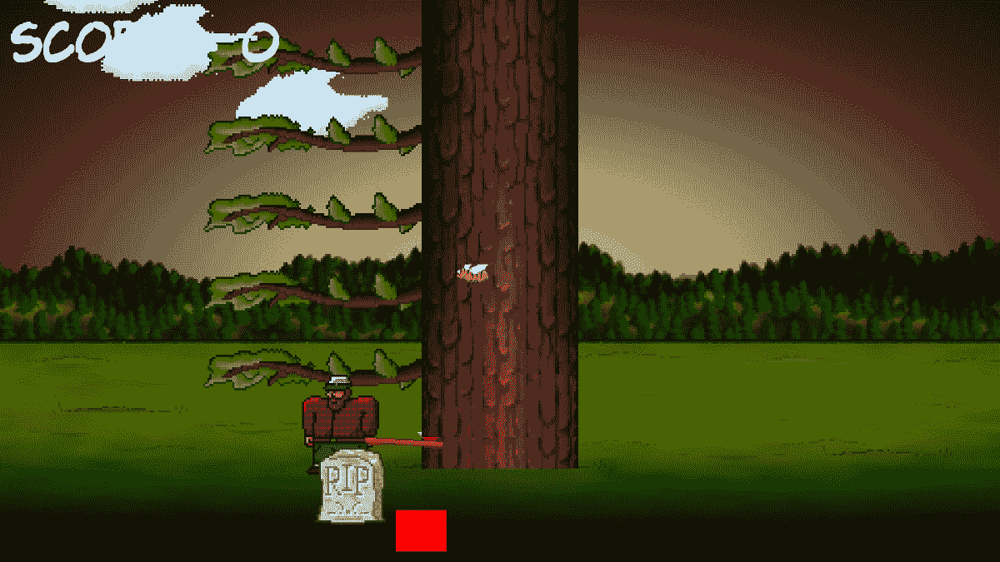
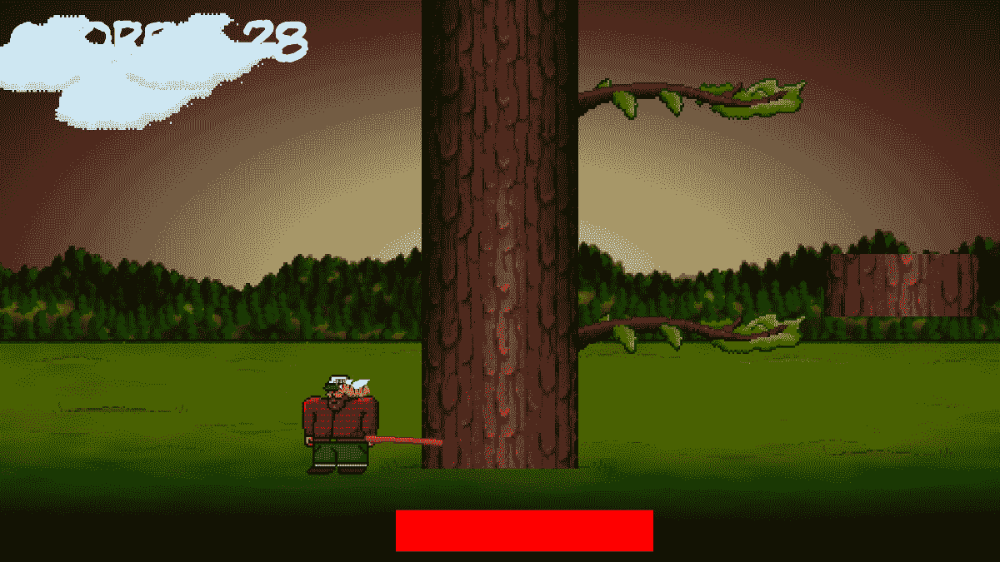
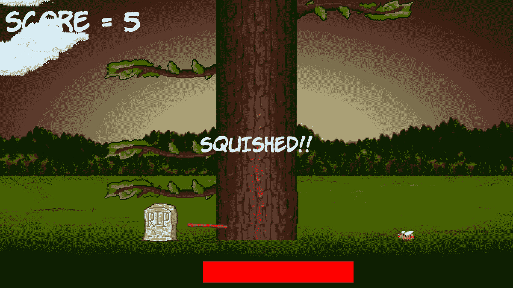
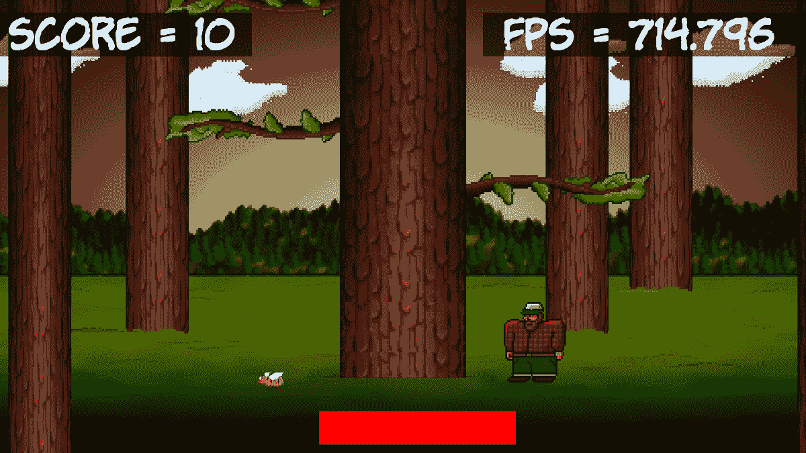

# 第六章：*第五章*：碰撞、音效和结束条件 – 使游戏可玩

这是第一个项目的最后阶段。到本章结束时，你将拥有你的第一个完成的游戏。一旦你让 Timber!!! 运行起来，务必阅读本章的最后部分，因为它将建议如何使游戏变得更好。

在本章中，我们将涵盖以下主题：

+   添加其余的精灵

+   处理玩家输入

+   动画飞行的木材

+   处理死亡

+   添加音效

+   添加功能和改进 Timber!!!

# 准备玩家（和其他精灵）

让我们同时添加玩家精灵以及一些更多精灵和纹理的代码。以下相当大的代码块还添加了一个用于玩家被压扁时的墓碑精灵，一个用于砍伐的斧头精灵，以及一个每次玩家砍伐时都会飞走的木材精灵。

注意，在 `spritePlayer` 对象之后，我们声明了一个 `side` 变量，`playerSide`，以跟踪玩家当前站立的位置。此外，我们还为 `spriteLog` 对象添加了一些额外的变量，包括 `logSpeedX`、`logSpeedY` 和 `logActive`，以存储木材的移动速度以及它是否正在移动。`spriteAxe` 还有两个相关的 `float` 常量变量，用于记住左右两侧理想的像素位置。

在 `while(window.isOpen())` 代码之前添加以下代码块，就像我们之前经常做的那样。请注意，以下代码块中的所有代码都是新的，而不仅仅是突出显示的代码。我没有为这个代码块提供任何额外的上下文，因为 `while(window.isOpen())` 应该很容易识别。突出显示的代码是我们刚刚讨论过的代码。

在 `while(window.isOpen())` 行之前添加以下代码的全部内容，并在心中记住我们简要讨论过的突出显示的行。这将使本章其余的代码更容易理解：

```cpp
// Prepare the player
Texture texturePlayer;
texturePlayer.loadFromFile("graphics/player.png");
Sprite spritePlayer;
spritePlayer.setTexture(texturePlayer);
spritePlayer.setPosition(580, 720);
// The player starts on the left
side playerSide = side::LEFT;
// Prepare the gravestone
Texture textureRIP;
textureRIP.loadFromFile("graphics/rip.png");
Sprite spriteRIP;
spriteRIP.setTexture(textureRIP);
spriteRIP.setPosition(600, 860);
// Prepare the axe
Texture textureAxe;
textureAxe.loadFromFile("graphics/axe.png");
Sprite spriteAxe;
spriteAxe.setTexture(textureAxe);
spriteAxe.setPosition(700, 830);
// Line the axe up with the tree
const float AXE_POSITION_LEFT = 700;
const float AXE_POSITION_RIGHT = 1075;
// Prepare the flying log
Texture textureLog;
textureLog.loadFromFile("graphics/log.png");
Sprite spriteLog;
spriteLog.setTexture(textureLog);
spriteLog.setPosition(810, 720);
// Some other useful log related variables
bool logActive = false;
float logSpeedX = 1000;
float logSpeedY = -1500;
```

在前面的代码中，我们添加了许多新的变量。在真正使用它们之前，很难完全解释它们，但这里简要概述一下它们将用于什么。有一个名为 `playerSide` 的 `side` 枚举类型变量，初始化为 `left`。这将跟踪玩家位于树的哪一侧。

有两个 `const float` 类型的值用于确定斧头将被绘制在水平位置，这取决于玩家是否位于树的左侧或右侧。

除了帮助控制被砍伐并飞离树木的木材外，还有三个变量，`bool` 类型的 `logActive` 用于确定木材是否在运动，以及两个 `float` 类型的值用于存储木材的水平速度和垂直速度。

现在，我们可以绘制所有新的精灵。

# 绘制玩家和其他精灵

在我们添加移动玩家和使用所有新精灵的代码之前，让我们先绘制它们。我们这样做是为了当我们添加代码来更新/更改/移动它们时，我们能够看到正在发生的事情。

添加以下突出显示的代码以绘制四个新的精灵：

```cpp
// Draw the tree
window.draw(spriteTree);
// Draw the player
window.draw(spritePlayer);
// Draw the axe
window.draw(spriteAxe);
// Draw the flying log
window.draw(spriteLog);
// Draw the gravestone
window.draw(spriteRIP);
// Draw the bee
window.draw(spriteBee);
```

上述代码将四个新精灵依次传递给`draw`函数。

运行游戏，你将看到场景中的新精灵：



我们现在离一个可工作的游戏非常近了。下一个任务是编写一些代码，让玩家能够控制发生的事情。

# 处理玩家的输入

玩家的移动会影响几个不同的事情，如下所示：

+   何时显示斧头

+   何时开始动画木头

+   何时移动所有树枝向下

因此，为正在砍伐的玩家设置键盘处理是有意义的。一旦完成这项工作，我们就可以将我们刚才提到的所有功能放入代码的同一部分。

让我们暂时思考一下我们是如何检测键盘按键的。每一帧，我们都会测试是否有特定的键盘键被按下。如果是，我们就采取行动。如果*Esc*键被按下，我们就退出游戏，如果*Enter*键被按下，我们就重新开始游戏。到目前为止，这已经足够满足我们的需求了。

然而，当我们尝试处理树木的砍伐时，这种方法存在一个问题。这个问题一直存在；只是直到现在才变得重要。根据你的 PC 性能如何，游戏循环每秒可能执行数千次。每次通过游戏循环，只要按键被按下，就会检测到，并执行相关代码。

所以，实际上，每次你按下*Enter*键重新开始游戏，你很可能已经重新开始了一百多次以上。这是因为即使是最短暂的按键也会持续一秒钟的很大一部分。你可以通过运行游戏并按住*Enter*键来验证这一点。请注意，时间条不会移动。这是因为游戏正在一次又一次地重新开始，每秒数百次甚至数千次。

如果我们不使用不同的方法来处理玩家的砍伐，那么仅仅一次尝试砍伐就会在短短的一瞬间将整棵树砍倒。我们需要更加复杂一些。我们将允许玩家砍伐，然后当玩家这样做时，禁用检测按键的代码。然后我们将检测玩家何时从按键上移开手指，然后重新启用按键检测。以下是将这些步骤清晰地列出的步骤：

1.  等待玩家使用左右箭头键砍伐一根木头。

1.  当玩家砍伐时，禁用按键检测。

1.  等待玩家从按键上移开手指。

1.  重新启用砍伐检测。

1.  从步骤 1 重复。

这可能听起来很复杂，但有了 SFML 的帮助，这将变得简单直接。让我们现在一步一步地实现它。

添加以下突出显示的代码行，它声明了一个名为`acceptInput`的`bool`变量，该变量将用于确定何时监听砍伐，何时忽略它们：

```cpp
float logSpeedX = 1000;
float logSpeedY = -1500;
// Control the player input
bool acceptInput = false;
while (window.isOpen())
{
```

现在我们已经设置了布尔值，我们可以继续下一步。

## 处理设置新游戏

为了准备好处理砍伐，将以下突出显示的代码添加到开始新游戏的`if`块中：

```cpp
/*
****************************************
Handle the players input
****************************************
*/
if (Keyboard::isKeyPressed(Keyboard::Escape))
{
    window.close();
}
// Start the game
if (Keyboard::isKeyPressed(Keyboard::Return))
{
    paused = false;
    // Reset the time and the score
    score = 0;
    timeRemaining = 6;
    // Make all the branches disappear -
    // starting in the second position
    for (int i = 1; i < NUM_BRANCHES; i++)
    {
        branchPositions[i] = side::NONE;
    }
    // Make sure the gravestone is hidden
    spriteRIP.setPosition(675, 2000);
    // Move the player into position
    spritePlayer.setPosition(580, 720);
    acceptInput = true;
}
/*
****************************************
Update the scene
****************************************
*/
```

在之前的代码中，我们使用一个`for`循环来准备没有分支的树。这对玩家是公平的，因为如果游戏从他们头顶上方的一个分支开始，那将被视为不公平。然后，我们简单地将墓碑移出屏幕，并将玩家移动到左侧的起始位置。前述代码所做的最后一件事是将`acceptInput`设置为`true`。

我们现在准备好接收砍伐按键。

## 检测玩家砍伐

现在，我们可以处理左右光标键的按下。添加以下简单的`if`块，它仅在`acceptInput`为`true`时执行：

```cpp
// Start the game
if (Keyboard::isKeyPressed(Keyboard::Return))
{
    paused = false;
    // Reset the time and the score
    score = 0;
    timeRemaining = 5;
    // Make all the branches disappear
    for (int i = 1; i < NUM_BRANCHES; i++)
    {
        branchPositions[i] = side::NONE;
    }
    // Make sure the gravestone is hidden
    spriteRIP.setPosition(675, 2000);
    // Move the player into position
    spritePlayer.setPosition(675, 660);
    acceptInput = true;
}
// Wrap the player controls to
// Make sure we are accepting input
if (acceptInput)
{
    // More code here next...
}
/*
****************************************
Update the scene
****************************************
*/
```

现在，在刚刚编写的`if`块内部，添加以下突出显示的代码来处理当玩家按下键盘上的右光标键时会发生什么：

```cpp
// Wrap the player controls to
// Make sure we are accepting input
if (acceptInput)
{
    // More code here next...

    // First handle pressing the right cursor key
    if (Keyboard::isKeyPressed(Keyboard::Right))
    {
        // Make sure the player is on the right
        playerSide = side::RIGHT;

        score ++;
        // Add to the amount of time remaining
        timeRemaining += (2 / score) + .15;
        spriteAxe.setPosition(AXE_POSITION_RIGHT,
            spriteAxe.getPosition().y);
        spritePlayer.setPosition(1200, 720);
        // Update the branches
        updateBranches(score);

        // Set the log flying to the left
        spriteLog.setPosition(810, 720);
        logSpeedX = -5000;
        logActive = true;
        acceptInput = false;
    }
    // Handle the left cursor key
}
```

在前述代码中发生了很多事情，让我们逐一分析：

+   首先，我们检测玩家是否在树的右侧进行了砍伐。如果是，则将`playerSide`设置为`side::RIGHT`。我们将在代码的后续部分响应`playerSide`的值。然后，使用`score ++`给分数加一分。

+   下一行代码有点神秘，但所发生的一切只是我们在剩余时间上增加。我们在奖励玩家采取行动。然而，对玩家来说，分数越高，额外增加的时间就越少。你可以调整这个公式来使游戏更容易或更难。

+   然后，使用`spriteAxe.setPosition`将斧头移动到其右侧位置，并将玩家精灵也移动到其右侧位置。

+   接下来，我们调用`updateBranches`来将所有分支向下移动一个位置，并在树的顶部生成一个新的随机分支（或空间）。

+   然后，将`spriteLog`移动到其起始位置，使其与树木融为一体，并将其`speedX`变量设置为负数，以便它向左飞驰。同时，将`logActive`设置为`true`，以便我们即将编写的移动木头的代码在每一帧中动画化木头。

+   最后，将`acceptInput`设置为`false`。此时，玩家不能再进行砍伐。我们已经解决了按键检测过于频繁的问题，我们很快将看到如何重新启用砍伐。

现在，仍然在刚刚编写的`if(acceptInput)`块内部，添加以下突出显示的代码来处理当玩家按下键盘上的左光标键时会发生什么：

```cpp
    // Handle the left cursor key
    if (Keyboard::isKeyPressed(Keyboard::Left))
    {
        // Make sure the player is on the left
        playerSide = side::LEFT;
        score++;
        // Add to the amount of time remaining
        timeRemaining += (2 / score) + .15;
        spriteAxe.setPosition(AXE_POSITION_LEFT,
            spriteAxe.getPosition().y);
        spritePlayer.setPosition(580, 720);
        // update the branches
        updateBranches(score);
        // set the log flying
        spriteLog.setPosition(810, 720);
        logSpeedX = 5000;
        logActive = true;
        acceptInput = false;
    }
}
```

之前的代码与处理右侧切割的代码相同，只是精灵的位置不同，并且将`logSpeedX`变量设置为正值，这样木材就会向右飞去。

现在，我们可以编写当键盘按键释放时发生的事情的代码。

## 检测按键释放

要使前面的代码在第一次切割之后仍然有效，我们需要检测玩家何时释放按键，然后将`acceptInput`重置为`true`。

这与之前我们看到的关键字处理方式略有不同。SFML 有两种不同的方式来检测玩家的键盘输入。我们已经在前处理*Enter*键时看到了第一种方式，它是动态的和即时的，这正是我们立即对按键做出响应所需要的。

以下代码使用检测按键释放的方法。在`Handle the players input`部分的顶部输入以下高亮代码，然后我们将对其进行讲解：

```cpp
/*
****************************************
Handle the players input
****************************************
*/
Event event;
while (window.pollEvent(event))
{
    if (event.type == Event::KeyReleased && !paused)
    {
        // Listen for key presses again
        acceptInput = true;
        // hide the axe
        spriteAxe.setPosition(2000,
            spriteAxe.getPosition().y);
    }
}
if (Keyboard::isKeyPressed(Keyboard::Escape))
{
    window.close();
}
```

在前面的代码中，我们声明了一个名为`event`的`Event`类型对象。然后，我们调用`window.pollEvent`函数，传入我们新创建的对象`event`。`pollEvent`函数将描述操作系统事件的 数据放入`event`对象中。这可能是按键、按键释放、鼠标移动、鼠标点击、游戏控制器动作，或者是窗口本身发生的事情（如大小调整、移动等）。

我们将代码包裹在`while`循环中的原因是因为队列中可能存储了多个事件。`window.pollEvent`函数会逐个将它们加载到`event`中。随着每次循环的进行，我们会检查是否对当前事件感兴趣，并在感兴趣时做出响应。当`window.pollEvent`返回`false`时，这意味着队列中没有更多事件，`while`循环将退出。

当一个键被释放且游戏未暂停时，执行此`if`条件`(event.type == Event::KeyReleased && !paused)`。

在`if`块内部，我们将`acceptInput`重置为`true`，并将斧头精灵隐藏到屏幕之外。

你现在可以运行游戏，并敬畏地注视着移动的树木、挥舞的斧头和动画化的玩家。然而，它不会压扁玩家，而且当切割时，木材还没有移动。

让我们继续制作日志移动效果。

## 动画切割的木材和斧头

当玩家切割时，`logActive`被设置为`true`，因此我们可以将一些代码包裹在一个只有当`logActive`为`true`时才执行的代码块中。此外，每次切割都会将`logSpeedX`设置为正数或负数，这样木材就可以在正确的方向上开始从树木飞离。

在更新分支精灵之后，添加以下高亮代码：

```cpp
    // update the branch sprites
    for (int i = 0; i < NUM_BRANCHES; i++)
    {
        float height = i * 150;
        if (branchPositions[i] == side::LEFT)
        {
            // Move the sprite to the left side
            branches[i].setPosition(610, height);
            // Flip the sprite round the other way
            branches[i].setRotation(180);
        }
        else if (branchPositions[i] == side::RIGHT)
        {
            // Move the sprite to the right side
            branches[i].setPosition(1330, height);
            // Flip the sprite round the other way
            branches[i].setRotation(0);
        }
        else
        {
            // Hide the branch
            branches[i].setPosition(3000, height);
        }
    }
    // Handle a flying log
    if (logActive)
    {
        spriteLog.setPosition(
spriteLog.getPosition().x + 
            (logSpeedX * dt.asSeconds()),

spriteLog.getPosition().y + 
            (logSpeedY * dt.asSeconds()));
        // Has the log reached the right hand edge?
        if (spriteLog.getPosition().x < -100 ||
            spriteLog.getPosition().x > 2000)
        {
            // Set it up ready to be a whole new log next frame
            logActive = false;
            spriteLog.setPosition(810, 720);
        }
    }
} // End if(!paused)
/*
****************************************
Draw the scene
****************************************
*/
```

代码通过使用`getPosition`获取精灵的当前水平和垂直位置，然后分别使用`logSpeedX`和`logSpeedY`以及`dt.asSeconds`的乘积来添加，从而设置精灵的位置。

在每个帧移动日志精灵之后，代码使用一个`if`块来检查精灵是否已经从左侧或右侧消失在视野之外。如果是这样，日志就会移回到起始点，为下一次切割做好准备。

如果你现在运行游戏，你将能够看到日志飞向屏幕的适当一侧：



现在，让我们转向一个更敏感的话题。

# 处理死亡

每个游戏都必须以糟糕的方式结束，要么是玩家用完时间（这我们已经处理过了），要么是被树枝压扁。

检测玩家被压扁非常简单。我们只想知道：`branchPositions`数组中的最后一个树枝位置是否等于`playerSide`？如果是，玩家就死了。

添加以下高亮代码，用于检测和执行玩家被树枝压扁的情况。我们稍后会讨论它：

```cpp
    // Handle a flying log
    if (logActive)
    {
        spriteLog.setPosition(
            spriteLog.getPosition().x + 
                (logSpeedX * dt.asSeconds()),

        spriteLog.getPosition().y + 
            (logSpeedY * dt.asSeconds()));
        // Has the log reached the right-hand edge?
        if (spriteLog.getPosition().x < -100 ||
            spriteLog.getPosition().x > 2000)
        {
            // Set it up ready to be a whole new cloud next frame
            logActive = false;
            spriteLog.setPosition(800, 600);
        }
    }
    // has the player been squished by a branch?
    if (branchPositions[5] == playerSide)
    {
        // death
        paused = true;
        acceptInput = false;

        // Draw the gravestone
        spriteRIP.setPosition(525, 760);
        // hide the player
        spritePlayer.setPosition(2000, 660);
        // Change the text of the message
        messageText.setString("SQUISHED!!");
        // Center it on the screen
        FloatRect textRect = messageText.getLocalBounds();
        messageText.setOrigin(textRect.left +
            textRect.width / 2.0f,
            textRect.top + textRect.height / 2.0f);
        messageText.setPosition(1920 / 2.0f,
            1080 / 2.0f);
    }
} // End if(!paused)
/*
****************************************
Draw the scene
****************************************
*/
```

在玩家死亡之后，前面的代码首先将`paused`设置为`true`。现在，循环将完成这一帧，并且不会再次运行循环的更新部分，直到玩家开始新的一局。

然后，我们将墓碑移动到位置，靠近玩家曾经站立的地方，并将玩家精灵隐藏在屏幕之外。

我们将`messageText`字符串设置为`"Squished!!"`，然后使用常规技术将其居中显示在屏幕上。

你现在可以运行游戏并真正地玩一玩。以下截图显示了玩家的最终得分和他们的墓碑，以及**SQUISHED**信息：



只有一个问题需要解决。是我一个人这样觉得吗，还是它有点安静？

# 简单的声音效果

在本节中，我们将添加三个声音。每个声音将在特定的游戏事件上播放，即玩家每次切割时发出简单的砰砰声，玩家用完时间时发出忧郁的失败声，以及玩家被压扁至死时的复古压碎声。

## SFML 声音是如何工作的

SFML 使用两个不同的类来播放声音效果。第一个类是`SoundBuffer`类。这是一个包含实际音频数据的类，它负责将`.wav`文件加载到 PC 的 RAM 中，以可以播放的格式，无需进一步解码工作。

当我们编写下一分钟的声音效果代码时，我们会看到，一旦我们有一个存储了声音的`SoundBuffer`对象，我们就会创建另一个`Sound`类型的对象。然后，我们可以将这个`Sound`对象与`SoundBuffer`对象关联起来。然后，在代码的适当时刻，我们将能够调用相应`Sound`对象的`play`函数。

## 何时播放声音

正如我们很快就会看到的，加载和播放声音的 C++代码非常简单。然而，我们需要考虑的是*何时*调用`play`函数，在哪里放置`play`函数的调用？让我们看看：

+   切割声音可以通过左右光标键的按键来调用。

+   可以从检测到树木弄伤玩家的 `if` 块中播放死亡声音。

+   可以从检测 `timeRemaining` 小于零的 `if` 块中播放超时声音。

现在，我们可以编写我们的声音代码了。

## 添加声音代码

首先，我们将添加另一个 `#include` 指令，以便使 SFML 声音相关类可用。添加以下突出显示的代码：

```cpp
#include <sstream>
#include <SFML/Graphics.hpp>
#include <SFML/Audio.hpp>
using namespace sf;
```

现在，我们将声明三个不同的 `SoundBuffer` 对象，将三个不同的声音文件加载到它们中，并将三个不同的 `Sound` 类型的对象与相关的 `SoundBuffer` 类型的对象关联起来。添加以下突出显示的代码：

```cpp
// Control the player input
bool acceptInput = false;
// Prepare the sounds
// The player chopping sound
SoundBuffer chopBuffer;
chopBuffer.loadFromFile("sound/chop.wav");
Sound chop;
chop.setBuffer(chopBuffer);
// The player has met his end under a branch
SoundBuffer deathBuffer;
deathBuffer.loadFromFile("sound/death.wav");
Sound death;
death.setBuffer(deathBuffer);
// Out of time
SoundBuffer ootBuffer;
ootBuffer.loadFromFile("sound/out_of_time.wav");
Sound outOfTime;
outOfTime.setBuffer(ootBuffer);
while (window.isOpen())
{
```

现在，我们可以播放第一个音效了。将以下单行代码添加到检测玩家按下右光标键的 `if` 块中：

```cpp
// Wrap the player controls to
// Make sure we are accepting input
if (acceptInput)
{
    // More code here next...

    // First handle pressing the right cursor key
    if (Keyboard::isKeyPressed(Keyboard::Right))
    {
        // Make sure the player is on the right
        playerSide = side::RIGHT;

        score++;
        timeRemaining += (2 / score) + .15;
        spriteAxe.setPosition(AXE_POSITION_RIGHT,
            spriteAxe.getPosition().y);
        spritePlayer.setPosition(1120, 660);
        // update the branches
        updateBranches(score);

        // set the log flying to the left
        spriteLog.setPosition(800, 600);
        logSpeedX = -5000;
        logActive = true;
        acceptInput = false;
        // Play a chop sound
        chop.play();
    }
```

小贴士

在以 `if (Keyboard::isKeyPressed(Keyboard::Left))` 开头的下一块代码的末尾添加完全相同的代码，以便当玩家在树的左侧砍伐时发出砍伐声。

找到处理玩家耗尽时间的代码，并将以下突出显示的代码添加到播放超时相关声音效果的代码中：

```cpp
if (timeRemaining <= 0.f) {
    // Pause the game
    paused = true;
    // Change the message shown to the player
    messageText.setString("Out of time!!");
    //Reposition the text based on its new size
    FloatRect textRect = messageText.getLocalBounds();
    messageText.setOrigin(textRect.left +
        textRect.width / 2.0f,
        textRect.top +
        textRect.height / 2.0f);
    messageText.setPosition(1920 / 2.0f, 1080 / 2.0f);
    // Play the out of time sound
    outOfTime.play();
}
```

最后，当玩家被挤压时播放死亡声音，将以下突出显示的代码添加到执行时底部树枝与玩家在同一侧的 `if` 块中：

```cpp
// has the player been squished by a branch?
if (branchPositions[5] == playerSide)
{
    // death
    paused = true;
    acceptInput = false;

    // Draw the gravestone
    spriteRIP.setPosition(675, 660);
    // hide the player
    spritePlayer.setPosition(2000, 660);
    messageText.setString("SQUISHED!!");
    FloatRect textRect = messageText.getLocalBounds();
    messageText.setOrigin(textRect.left +
        textRect.width / 2.0f,
        textRect.top + textRect.height / 2.0f);
    messageText.setPosition(1920 / 2.0f, 1080 / 2.0f);
    // Play the death sound
    death.play();
}
```

就这样！我们完成了第一个游戏。在我们继续进行第二个项目之前，让我们讨论一些可能的改进。

# 改进游戏和代码

查看这些针对 Timber!!! 项目的建议增强功能。你可以在下载包的 `Runnable` 文件夹中看到这些增强功能的效果：

+   在仅偶尔执行的代码块中的 `sstream` 代码。毕竟，我们不需要每秒更新分数数千次！

+   **调试控制台：** 让我们添加一些文本，以便我们可以看到当前的帧率。就像分数一样，我们不需要太频繁地更新它。每百帧更新一次即可。

+   **在背景中添加更多树木：** 简单地添加一些更多的树木精灵，并将它们绘制在看起来好的位置（一些靠近相机，一些远离）。

+   在分数和 FPS 计数器后面的 `RectangleShape` 对象。黑色带有一点透明度看起来相当不错。

+   **使云代码更高效：** 正如我们之前多次提到的，我们可以利用我们对数组的了解来使云代码变得更短。

查看带有额外树木、云彩和透明背景文本的游戏动作：



要查看这些增强功能的代码，请查看下载包的 `Timber Enhanced Version` 文件夹。

# 摘要

在本章中，我们为 Timber!!! 游戏添加了最后的修饰和图形。如果你在本书之前从未编写过任何 C++ 代码，那么你可以给自己一个大大的掌声。仅仅五章，你就从零知识到了一个可工作的游戏。

然而，我们不会因此而过于自满，因为在下一章中，我们将直接进入一些稍微更复杂的 C++ 内容。虽然下一款游戏，一个简单的乒乓球游戏，在某些方面比 Timber!! 简单，但了解如何编写自己的类将为我们构建更复杂和功能更齐全的游戏做好准备。

# 常见问题解答

Q) 我承认对于云的数组解决方案更有效率。但我们真的需要三个独立的数组——一个用于 `active`，一个用于速度，以及一个用于精灵本身吗？

A) 如果我们观察各种对象所具有的属性/变量，例如，`Sprite` 对象，我们会发现它们有很多。精灵具有位置、颜色、大小、旋转等属性。但如果它们有 `active`、`speed` 以及可能的一些其他属性那就更完美了。问题是 SFML 的编码者不可能预测到我们会以所有可能的方式使用他们的 `Sprite` 类。幸运的是，我们可以创建自己的类。我们可以创建一个名为 `Cloud` 的类，它有一个布尔值用于 `active` 和一个整型用于速度。我们甚至可以给我们的 `Cloud` 类一个 SFML `Sprite` 对象。这样我们甚至可以进一步简化我们的云代码。我们将在下一章中探讨如何设计自己的类。
