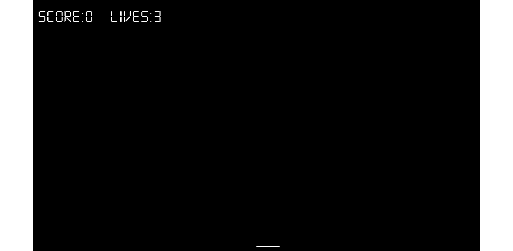

# *第六章*：面向对象编程 – 开始 Pong 游戏

在本章中，有相当多的理论，但理论将为我们提供我们开始使用**面向对象编程**（**OOP**）所需的专业知识。此外，我们不会浪费时间将理论付诸实践，因为我们将在编写下一个项目，即 Pong 游戏时使用它。我们将深入了解如何通过编写类来创建我们可以用作对象的新类型。首先，我们将查看一个简化的 Pong 场景，以便了解一些类的基本知识，然后我们将重新开始，并使用我们学到的原则编写一个真正的 Pong 游戏。

在本章中，我们将涵盖以下主题：

+   通过一个假设的`Bat`类来了解面向对象编程和类

+   开始制作 Pong 游戏，并编写一个代表玩家球拍的真正类

# 面向对象编程

面向对象编程是一种编程范式，我们可以将其视为几乎标准的编程方式。确实存在非面向对象编程的方式，甚至还有一些非面向对象的游戏编程语言/库。然而，由于我们是从头开始的，没有理由以任何其他方式做事。

面向对象编程将做到以下几件事：

+   使我们的代码更容易管理、更改或更新

+   使我们的代码编写更快、更可靠

+   使其他人的代码（如我们使用 SFML）易于使用

我们已经看到了第三个好处。让我们讨论一下面向对象编程的确切含义。

面向对象编程是一种编程方式，它涉及将我们的需求分解成比整体更易于管理的块。每个块都是自包含的，并且可以被其他程序潜在地重用，同时与其他块作为一个整体一起工作。这些块就是我们所说的对象。

当我们计划和编写一个对象时，我们使用**类**来这样做。

小贴士

一个类可以被看作是对象的蓝图。

我们实现了一个类的**对象**。这被称为类的**实例**。想想房子的蓝图。你不能住在里面，但你可以用它来建造房子。你建造了一个房子的实例。通常，当我们为游戏设计类时，我们会编写它们来代表现实世界中的**事物**。在下一个项目中，我们将编写代表玩家控制的蝙蝠和玩家可以用球拍在屏幕上弹跳的球的类。然而，面向对象编程不仅仅是这些。

小贴士

面向对象编程（OOP）是一种做事的方式，一种定义最佳实践的方法论。

面向对象编程的三个核心原则是**封装**、**多态**和**继承**。这听起来可能很复杂，但一步一步来，这实际上是相当直接的。

## 封装

**封装**意味着保护你的代码的内部工作不被使用它的代码干扰。你可以通过只允许你选择的变量和函数被访问来实现这一点。这意味着你的代码总是可以更新、扩展或改进，而不会影响使用它的程序，前提是暴露的部分仍然以相同的方式被访问。

例如，如果 SFML 团队需要更新他们的`Sprite`类的工作方式，只要函数签名保持不变，他们就不必担心内部发生了什么。我们在更新之前编写的代码在更新后仍然可以工作。

## 多态性

**多态性**允许我们编写不那么依赖于我们试图操作的*类型*的代码。这将使我们的代码更清晰、更高效。多态性意味着*不同的形式*。如果我们编写的对象可以是多种类型，那么我们可以利用这一点。在这个阶段，多态性可能听起来有点像黑魔法。我们将在第四个项目中使用多态性，该项目将在*第十四章*“抽象和代码管理——更好地利用面向对象编程”中开始，一切都将变得清晰。

## 继承

正如其名所示，**继承**意味着我们可以利用其他人的类的所有功能和好处，包括封装和多态，同时进一步改进它们的代码以适应我们的特定情况。我们将首次在同时使用多态性时使用继承。

## 为什么使用面向对象编程（OOP）？

当正确编写时，面向对象编程（OOP）允许你添加新功能而不必担心它们如何与现有功能交互。当你确实需要更改一个类时，它自包含（封装）的特性意味着对程序的其他部分的影响更小或甚至为零。

你可以使用别人的代码（如 SFML 类），而不必知道或者甚至关心它是如何工作的。

面向对象编程（OOP）以及 SFML，允许你编写使用复杂概念的游戏，如多个摄像头、多人游戏、OpenGL、方向性声音等——所有这些都不需要费太多力气。

通过使用继承，你可以创建多个类似但不同的类的版本，而无需从头开始创建类。

由于多态性，你仍然可以使用为原始类型的对象设计的函数来使用你的新对象。

所有这些确实很有道理。正如我们所知，C++从一开始就是为了实现所有这些面向对象编程（OOP）而设计的。

小贴士

在面向对象编程和制作游戏（或任何其他类型的应用程序）中取得成功的最终关键，除了成功的决心之外，是规划和设计。这不仅仅是“知道”所有 C++、SFML 和面向对象编程主题将帮助你编写优秀的代码，而是将所有这些知识应用于编写结构良好/设计良好的代码。本书中的代码以适合在游戏环境中学习各种 C++主题的顺序和方式呈现。结构代码的艺术和科学被称为**设计模式**。随着代码变得越来越长和复杂，有效使用设计模式将变得更加重要。好消息是，我们不需要自己发明这些设计模式。随着项目的复杂化，我们需要学习它们。随着项目的复杂化，我们的设计模式也会发展。

在这个项目中，我们将学习并使用基本的类和封装。随着本书的深入，我们将变得更加大胆，并使用继承、多态和其他与面向对象编程相关的 C++特性。

## 究竟什么是类？

类是一组代码，可以包含函数、变量、循环以及我们已经学习过的所有其他 C++语法。每个新的类都将声明在其自己的`.h`代码文件中，文件名与类名相同，而其函数将在它们自己的`.cpp`文件中定义。

一旦我们编写了一个类，我们就可以用它来创建尽可能多的对象。记住，类是蓝图，我们根据蓝图来创建对象。房子不是蓝图，就像对象不是类一样。它是由类*制作*的对象。

小贴士

你可以把一个对象想象成一个变量，把类想象成一个类型。

当然，在所有关于面向对象编程和类的讨论中，我们实际上还没有看到任何代码。现在让我们来解决这个问题。

# Pong 蝙蝠的理论

接下来是对如何使用面向对象编程来通过编写蝙蝠类开始 Pong 项目的假设性讨论。现在请不要向项目中添加任何代码，因为以下内容过于简化，只是为了解释理论。在本章的后面部分，我们将真正编写它。当我们真正编写类时，它实际上会非常不同，但在这里我们将学习的原则将为我们成功做好准备。

我们将首先从类的一部分开始探索变量和函数。

## 类变量和函数声明

一个能够反弹球的蝙蝠是一个作为类的绝佳候选者。

小贴士

如果你不知道什么是 Pong，那么请查看这个链接：[`en.wikipedia.org/wiki/Pong`](https://en.wikipedia.org/wiki/Pong)。

让我们看看一个假设的`Bat.h`文件：

```cpp
class Bat
{
    private:
        // Length of the pong bat
        int m_Length = 100;
        // Height of the pong bat
        int m_Height = 10;
        // Location on x axis
        int m_XPosition;      
        // Location on y axis
        int m_YPosition;      
    public:
        void moveRight();
        void moveLeft();
};
```

乍一看，代码可能看起来有点复杂，但当我们解释它时，我们会看到我们还没有覆盖的非常少的概念。

首先，要注意的是，使用 `class` 关键字声明一个新的类，后跟类名，整个声明被大括号包围，最后以分号结尾：

```cpp
class Bat
{
    …
    …
};
```

现在，让我们来看看变量声明及其名称：

```cpp
// Length of the pong bat
int m_Length = 100; 
// Height of the pong bat
int m_Height = 10;
// Location on x axis
int m_XPosition;      
// Location on y axis
int m_YPosition;
```

所有名称都以前缀 `m_` 开头。这个 `m_` 前缀不是强制性的，但这是一个好的约定。作为类一部分声明的变量被称为 `m_`，这使得当我们处理成员变量时非常明确。当我们为我们的类编写函数时，我们还将开始看到局部（非成员）变量和参数。`m_` 约定将证明其有用性。

此外，请注意，所有变量都位于以 `private:` 关键字开头的代码部分中。扫描一下之前的代码，并注意类代码的主体被分为两个部分：

```cpp
private:
    // more code here
public:
    // More code here
```

`public` 和 `private` 关键字控制了我们类的封装。任何私有内容都不能直接由类的实例/对象的用户访问。如果你正在为他人设计一个类，你不想让他们随意更改任何内容。请注意，成员变量不必是私有的，但通过尽可能使它们私有，我们可以实现良好的封装。

这意味着我们的四个成员变量（`m_Length`、`m_Height`、`m_XPosition` 和 `m_YPosition`）不能直接从 `main` 函数中由我们的游戏引擎访问。它们只能通过类的代码间接访问。这就是封装的作用。对于 `m_Length` 和 `m_Height` 变量来说，只要我们不需要改变球拍的大小，这很容易接受。然而，对于 `m_XPosition` 和 `m_YPosition` 成员变量，它们需要被访问，否则我们如何移动球拍呢？

这个问题在代码的 `public:` 部分得到解决，如下所示：

```cpp
void moveRight();
void moveLeft();
```

类提供了两个公共函数，可以用 `Bat` 类型的对象使用。当我们查看这些函数的定义时，我们将看到这些函数是如何精确地操作私有变量的。

总结来说，我们有一系列不可访问（私有）的变量，不能从 `main` 函数中使用。这是好的，因为封装使我们的代码更少出错，更易于维护。然后我们通过提供两个公共函数来间接访问 `m_XPosition` 和 `m_YPosition` 变量，从而解决了移动球拍的问题。

`main` 函数中的代码可以使用类的实例调用这些函数，但函数内部的代码控制着变量的具体使用方式。

让我们来看看函数的定义。

## 类函数定义

我们将在本书中编写的函数定义都将放在与类和函数声明分开的文件中。我们将使用与类同名的文件，并具有`.cpp`文件扩展名。例如，以下代码将放在名为`Bat.cpp`的文件中。看看以下代码，它只有一个新概念：

```cpp
#include "Bat.h"
void Bat::moveRight()
{
    // Move the bat a pixel to the right
    xPosition ++;
}
void Bat::moveLeft()
{
    // Move the bat a pixel to the left
    xPosition --;
}
```

首先要注意的是，我们必须使用包含指令来包含`Bat.h`文件中的类和函数声明。

我们在这里可以看到的新概念是使用`::`。由于函数属于一个类，我们必须通过在函数名前加上类名以及`::`来编写签名部分。例如，`void Bat::moveLeft()`和`void Bat::moveRight`。

重要提示

实际上，我们之前已经简要地见过作用域解析运算符，即每次我们声明一个类的对象，并且我们没有之前使用`using namespace..`。

注意，我们可以将函数定义和声明放在一个文件中，如下所示：

```cpp
class Bat
{
    private:
        // Length of the pong bat
        int m_Length = 100; 
        // Length of the pong bat
        int m_Height = 10;
        // Location on x axis
        int m_XPosition;      
        // Location on y axis
        int m_YPosition;      
    public:
        void Bat::moveRight()
        {
            // Move the bat a pixel to the right
            xPosition ++;
        }
        void Bat::moveLeft()
        {
            // Move the bat a pixel to the left
            xPosition --;
        }
};
```

然而，当我们的类变得更长（就像我们的第一个 Zombie Arena 类那样），将函数定义分离到它们自己的文件中会更加有序。此外，头文件被认为是“公共的”，如果其他人将使用我们编写的代码，它们通常用于文档目的。

但一旦我们编写了类，我们该如何使用它呢？

## 使用类的实例

尽管我们已经看到了与类相关的所有代码，但我们实际上并没有使用类。我们已经知道如何做到这一点，因为我们已经多次使用了 SFML 类。

首先，我们会创建一个`Bat`类的实例，如下所示：

```cpp
Bat bat;
```

`bat`对象拥有我们在`Bat.h`中声明的所有变量。我们无法直接访问它们。然而，我们可以通过其公共函数移动我们的蝙蝠，如下所示：

```cpp
bat.moveLeft();
```

或者我们可以这样移动它：

```cpp
bat.moveRight();
```

记住`bat`是一个`Bat`，因此它具有所有成员变量，并且可以使用所有可用的函数。

之后，我们可能会决定将我们的 Pong 游戏改为多人游戏。在`main`函数中，我们可以更改代码，使游戏有两个蝙蝠，可能如下所示：

```cpp
Bat bat;
Bat bat2;
```

重要的是要认识到，这些`Bat`实例中的每一个都是独立的对象，拥有它们自己的变量集。初始化一个类实例的方法有很多种，当我们真正为`Bat`类编写代码时，我们会看到这个例子。

现在，我们可以真正开始项目了。

# 创建 Pong 项目

由于设置项目是一个繁琐的过程，我们将一步一步地进行，就像我们在 Timber!!!项目中做的那样。我不会展示与 Timber!!!项目相同的截图，但过程是相同的，所以如果你想提醒各种项目属性的地点，请翻回*第一章*，*C++，SFML，Visual Studio 和开始第一个游戏*：

1.  启动 Visual Studio 并点击**创建新项目**按钮。或者，如果你仍然打开了 Timber!!!项目，你可以选择**文件** | **新项目**。

1.  在随后显示的窗口中，选择**控制台应用程序**并点击**下一步**按钮。然后你会看到**配置你的新项目**窗口。

1.  在**项目名称**字段中的`Pong`。请注意，这会导致 Visual Studio 自动配置**解决方案名称**字段，使其具有相同的名称。

1.  在我们在第一章中创建的`VS Projects`文件夹中。就像 Timber!!!项目一样，这将是所有项目文件存放的位置。

1.  选择**将解决方案和项目放在同一目录下**的选项。

1.  完成这些步骤后，点击`main.cpp`文件，就像之前做的那样。

1.  现在，我们将配置项目以使用我们放在`SFML`文件夹中的 SFML 文件。从主菜单中选择**项目** | **Pong 属性…**。在这个阶段，你应该已经打开了**Pong 属性页**窗口。

1.  在**Pong 属性页**窗口中，从**配置：**下拉菜单中选择**所有配置**。

1.  现在，从左侧菜单中选择**C/C++**然后选择**常规**。

1.  然后，定位到`\SFML\include`。如果你将`SFML`文件夹放在 D 驱动器上，需要输入的完整路径是`D:\SFML\include`。如果你在另一个驱动器上安装了 SFML，请更改路径。

1.  再次点击**应用**以保存到目前为止的配置。

1.  现在，仍然在这个窗口中，执行以下步骤。从左侧菜单中选择**链接器**然后选择**常规**。

1.  现在，找到`SFML`文件夹的位置，然后是`\SFML\lib`。所以，如果你将`SFML`文件夹放在 D 驱动器上，需要输入的完整路径是`D:\SFML\lib`。如果你在另一个驱动器上安装了 SFML，请更改路径。

1.  点击**应用**以保存到目前为止的配置。

1.  接下来，仍然在这个窗口中，执行以下步骤。将**配置：**下拉菜单切换到**调试**，因为我们将在调试模式下运行和测试 Pong。

1.  选择**链接器**然后选择**输入**。

1.  找到`sfml-graphics-d.lib;sfml-window-d.lib;sfml-system-d.lib;sfml-network-d.lib;sfml-audio-d.lib;`。请格外小心地将光标放在编辑框当前内容的起始位置，以免覆盖任何已经存在的文本。

1.  点击**确定**。

1.  点击**应用**然后**确定**。

1.  现在，我们需要将 SFML `.dll`文件复制到主项目目录中。我的主项目目录是`D:\VS Projects\Pong`。这是在之前的步骤中由 Visual Studio 创建的。如果你将`VS Projects`文件夹放在了其他位置，那么请在此处执行此步骤。我们需要复制到项目文件夹中的文件位于我们的`SFML\bin`文件夹中。为这两个位置打开一个窗口，并突出显示`SFML\bin`文件夹中的所有文件。

1.  现在，将突出显示的文件复制并粘贴到项目文件夹中，即`D:\VS Projects\Pong`。

我们现在已经配置好了项目属性，并准备就绪。

在这个游戏中，我们将显示一些文本用于 HUD（抬头显示），以显示玩家的得分和剩余生命。为此，我们需要一个字体。

重要提示

从 [`www.dafont.com/theme.php?cat=302`](http://www.dafont.com/theme.php?cat=302) 下载这个免费个人使用的字体并解压下载。或者你也可以自由选择你喜欢的字体。在我们加载字体时，你只需要对代码做一些小的修改。

在 `VS Projects\Pong` 文件夹中创建一个名为 `fonts` 的新文件夹，并将 `DS-DIGIT.ttf` 文件添加到 `VS Projects\Pong\fonts` 文件夹中。

现在我们准备好编写我们的第一个 C++ 类。

# 编写 Bat 类

简单的 Pong 球棒示例是介绍类的基本原理的好方法。类可以很简单且简短，就像前面的 `Bat` 类一样，但它们也可以更长更复杂，并包含由其他类创建的其他对象。

当涉及到制作游戏时，假设的 `Bat` 类缺少一些至关重要的东西。对于所有这些私有成员变量和公共函数来说可能没问题，但我们如何绘制任何东西呢？我们的 Pong 球棒需要一个精灵，在某些游戏中，它们还需要一个纹理。此外，我们需要一种方法来控制所有游戏对象的动画速率，就像我们在上一个项目中处理蜜蜂和云朵时做的那样。我们可以以与我们在 `main.cpp` 文件中包含它们完全相同的方式在我们的类中包含其他对象。让我们真正编写我们的 `Bat` 类，以便我们可以看到如何解决所有这些问题。

## Coding Bat.h

要开始，我们将编写头文件。右键点击 `Bat.h`。点击 **添加** 按钮。我们现在准备好编写文件了。

将以下代码添加到 `Bat.h` 中：

```cpp
#pragma once
#include <SFML/Graphics.hpp>
using namespace sf;
class Bat
{
private:
    Vector2f m_Position;
    // A RectangleShape object
    RectangleShape m_Shape;
    float m_Speed = 1000.0f;
    bool m_MovingRight = false;
    bool m_MovingLeft = false;
public:
    Bat(float startX, float startY);
    FloatRect getPosition();
    RectangleShape getShape();
    void moveLeft();
    void moveRight();
    void stopLeft();
    void stopRight();
    void update(Time dt);
};
```

首先，注意文件顶部的 `#pragma once` 声明。这可以防止文件被编译器多次处理。随着我们的游戏变得越来越复杂，可能有几十个类，这将加快编译时间。

注意成员变量的名称和函数的参数以及返回类型。我们有一个名为 `m_Position` 的 `Vector2f`，它将保存玩家球棒的水平和垂直位置。我们还有一个 SFML 的 `RectangleShape`，它将是实际出现在屏幕上的球棒。

有两个布尔成员变量将跟踪球棒当前正在移动的方向（如果有的话），我们还有一个名为 `m_Speed` 的 `float`，它告诉我们当玩家决定将球棒向左或向右移动时，球棒每秒可以移动多少像素。

代码的下一部分需要一些解释，因为我们有一个名为 `Bat` 的函数；这个名字与类的名字完全相同。这被称为构造函数。

## 构造函数

当一个类被编写时，编译器会创建一个特殊函数。我们在代码中看不到这个函数，但它确实存在。它被称为构造函数。如果使用了假设的 `Bat` 类示例，这将是一个会被调用的函数。

当我们需要编写一些代码来准备一个对象以供使用时，通常一个好的地方是在构造函数中做这件事。当我们想让构造函数执行除了简单地创建实例之外的其他操作时，我们必须替换编译器提供的默认（未看到的）构造函数。这就是我们将要做的`Bat`构造函数。

注意，`Bat`构造函数接受两个`float`参数。这非常适合在第一次创建`Bat`对象时初始化屏幕上的位置。另外，请注意构造函数没有返回类型，甚至不是`void`。

我们很快将使用构造函数`Bat`将这个游戏对象放置到起始位置。记住，这个函数是在声明`Bat`类型的对象时调用的。

## 继续解释 Bat.h

接下来是`getPosition`函数，它返回一个`FloatRect`，定义矩形的四个点。然后，我们有`getShape`，它返回一个`RectangleShape`。这将用于返回到主游戏循环`m_Shape`，以便它可以被绘制。

我们还有`moveLeft`、`moveRight`、`stopLeft`和`stopRight`函数，这些函数用于控制蝙蝠何时以及朝哪个方向移动。

最后，我们有`update`函数，它接受一个`Time`参数。这个函数将用于计算每一帧如何移动蝙蝠。由于蝙蝠和球将彼此移动得相当不同，因此将移动代码封装在类中是有意义的。我们将从`main`函数中每帧调用一次`update`函数。

小贴士

你可能能猜到`Ball`类也将有一个`update`函数。

现在，我们可以编写`Bat.cpp`，它将实现所有定义并使用成员变量。

## 编写 Bat.cpp

让我们创建文件，然后我们可以开始讨论代码。在**名称**字段中右键点击`Bat.cpp`。点击**添加**按钮，我们的新文件就会为我们创建。

我们将把这个文件的代码分成两部分，以便更容易讨论。

首先，编写`Bat`构造函数，如下所示：

```cpp
#include "Bat.h"

// This the constructor and it is called when we create an object
Bat::Bat(float startX, float startY)
{
    m_Position.x = startX;
    m_Position.y = startY;

    m_Shape.setSize(sf::Vector2f(50, 5));
    m_Shape.setPosition(m_Position);
}
```

在前面的代码中，我们可以看到我们包含了`bat.h`文件。这使得之前在`bat.h`中声明的所有函数和变量都对我们可用。

我们实现构造函数是因为我们需要做一些工作来设置实例，而编译器提供的默认未看到的空构造函数是不够的。记住，构造函数是在我们初始化`Bat`实例时运行的代码。

注意，我们使用`Bat::Bat`语法作为函数名，以使其清楚我们正在使用`Bat`类中的`Bat`函数。

此构造函数接收两个 `float` 值，`startX` 和 `startY`。接下来发生的事情是我们将这些值分配给 `m_Position.x` 和 `m_Position.y`。名为 `m_Position` 的 `Vector2f` 现在持有传递的值，因为 `m_Position` 是成员变量，所以这些值在整个类中都是可访问的。然而，请注意，`m_Position` 被声明为 `private`，因此在我们的 `main` 函数文件中不可访问——至少不是直接访问。我们很快就会看到如何解决这个问题。

最后，在构造函数中，我们通过设置其大小和位置来初始化名为 `m_Shape` 的 `RectangleShape`。这与我们在 *《乒乓球拍理论》* 部分中编写的假设 `Bat` 类的方式不同。SFML 的 `Sprite` 类提供了方便的大小和位置变量，我们可以使用 `setSize` 和 `setPosition` 函数来访问它们，因此我们不再需要假设的 `m_Length` 和 `m_Height`。

此外，请注意，我们需要调整初始化 `Bat` 类的方式（与假设的 `Bat` 类相比），以适应我们的自定义构造函数。

我们需要实现 `Bat` 类剩余的五个函数。在我们刚刚讨论的构造函数之后，将以下代码添加到 `Bat.cpp` 中：

```cpp
FloatRect Bat::getPosition()
{
    return m_Shape.getGlobalBounds();
}
RectangleShape Bat::getShape()
{
    return m_Shape;
}
void Bat::moveLeft()
{
     m_MovingLeft = true;
}
void Bat::moveRight()
{
    m_MovingRight = true;
}
void Bat::stopLeft()
{
    m_MovingLeft = false;
}
void Bat::stopRight()
{
    m_MovingRight = false;
}
void Bat::update(Time dt)
{
    if (m_MovingLeft) {
        m_Position.x -= m_Speed * dt.asSeconds();
    }
    if (m_MovingRight) {
        m_Position.x += m_Speed * dt.asSeconds();
    }
    m_Shape.setPosition(m_Position);
}
```

让我们来看看我们刚刚添加的代码。

首先，我们有 `getPosition` 函数。它所做的只是返回一个 `FloatRect` 给调用它的代码。代码行 `m_Shape.getGlobalBounds` 返回一个 `FloatRect`，该 `FloatRect` 使用 `RectangleShape`（即 `m_Shape`）四个角坐标进行初始化。当我们确定球是否击中球拍时，我们将从这个函数中调用 `main` 函数。

接下来，我们有 `getShape` 函数。这个函数所做的只是将 `m_Shape` 的副本传递给调用代码。这是必要的，这样我们就可以在 `main` 函数中绘制球拍。当我们编写一个仅用于从类中返回私有数据的公共函数时，我们称之为 getter 函数。

现在，我们可以看看 `moveLeft`、`moveRight`、`stopLeft` 和 `stopRight` 函数。它们所做的只是适当地设置 `m_MovingLeft` 和 `m_MovingRight` 布尔变量，以便跟踪玩家的当前意图。然而，请注意，它们对确定位置的 `RectangleShape` 实例或 `FloatRect` 实例没有任何操作。这正是我们所需要的。

`Bat`类中的最后一个函数是`update`。我们将每帧调用这个函数一次。随着我们的游戏项目变得更加复杂，`update`函数的复杂度将增加。目前，我们只需要根据玩家是否向左或向右移动来调整`m_Position`。请注意，用于此调整的公式与我们用于 Timber!!!项目中更新蜜蜂和云的公式相同。代码将速度乘以 delta 时间，然后从位置中添加或减去它，这使得蝙蝠相对于帧更新所需的时间移动。接下来，代码使用`m_Position`中保存的最新值设置`m_Shape`的位置。

在我们的`Bat`类中有一个`update`函数，而不是在`main`函数中，这是一种封装。我们不像在 Timber!!!项目中那样在`main`函数中更新所有游戏对象的位置，每个对象将负责更新自己。然而，接下来我们将从`main`函数中调用这个`update`函数。

# 使用`Bat`类和编写主函数

切换到当我们创建项目时自动生成的`main.cpp`文件。删除所有自动生成的代码，并添加以下代码。

按照以下方式编写`Pong.cpp`文件：

```cpp
#include "Bat.h"
#include <sstream>
#include <cstdlib>
#include <SFML/Graphics.hpp>
int main()
{
    // Create a video mode object
    VideoMode vm(1920, 1080);
    // Create and open a window for the game
    RenderWindow window(vm, "Pong", Style::Fullscreen);
    int score = 0;
    int lives = 3;

    // Create a bat at the bottom center of the screen
    Bat bat(1920 / 2, 1080 - 20);
    // We will add a ball in the next chapter
    // Create a Text object called HUD
    Text hud;
    // A cool retro-style font
    Font font;
    font.loadFromFile("fonts/DS-DIGI.ttf");
    // Set the font to our retro-style
    hud.setFont(font);
    // Make it nice and big
    hud.setCharacterSize(75);
    // Choose a color
    hud.setFillColor(Color::White);
    hud.setPosition(20, 20);
    // Here is our clock for timing everything
    Clock clock;
    while (window.isOpen())
    {
        /*
        Handle the player input
        ****************************
        ****************************
        ****************************
        */
        /*
        Update the bat, the ball and the HUD
        *****************************
        *****************************
        *****************************
        */

        /*
        Draw the bat, the ball and the HUD
        *****************************
        *****************************
        *****************************
        */

    }
    return 0;
}
```

在前面的代码中，结构与我们用于 Timber!!!项目的结构相似。然而，第一个例外是我们创建`Bat`类的实例时：

```cpp
// Create a bat
Bat bat(1920 / 2, 1080 - 20);
```

前面的代码调用构造函数来创建`Bat`类的新实例。代码传递所需的参数并允许`Bat`类将其位置初始化在屏幕中央靠近底部。这是我们球拍开始的最佳位置。

还要注意，我已经使用注释来指示其余代码最终将被放置的位置。所有这些都在游戏循环中，就像在 Timber!!!项目中一样。以下是将放置其余代码的位置，仅供参考：

```cpp
      /*
        Handle the player input
        …
        /*
        Update the bat, the ball and the HUD
        …

        /*
        Draw the bat, the ball and the HUD
        …
```

接下来，将以下代码添加到`处理玩家输入`部分：

```cpp
Event event;
while (window.pollEvent(event))
{
    if (event.type == Event::Closed)
        // Quit the game when the window is closed
        window.close();
}
// Handle the player quitting
if (Keyboard::isKeyPressed(Keyboard::Escape))
{
    window.close();
}
// Handle the pressing and releasing of the arrow keys
if (Keyboard::isKeyPressed(Keyboard::Left))
{
    bat.moveLeft();
}
else
{
    bat.stopLeft();
}
if (Keyboard::isKeyPressed(Keyboard::Right))
{
    bat.moveRight();
}
else
{
    bat.stopRight();
}
```

前面的代码通过按下*Escape*键处理玩家退出游戏的情况，这与 Timber!!!项目中的做法完全一样。接下来，有两个`if` – `else`结构来处理玩家移动球拍。让我们分析这两个结构中的第一个：

```cpp
if (Keyboard::isKeyPressed(Keyboard::Left))
{
    bat.moveLeft();
}
else
{
    bat.stopLeft();
}
```

前面的代码将检测玩家是否按下了键盘上的左箭头光标键。如果是，则对`Bat`实例调用`moveLeft`函数。当这个函数被调用时，`true`值被设置为`m_MovingLeft`私有布尔变量。如果左箭头键没有被按下，则调用`stopLeft`函数并将`m_MovingLeft`设置为`false`。

然后在下一个`if` – `else`代码块中重复上述过程来处理玩家按下（或未按下）右箭头键。

接下来，将以下代码添加到“更新蝙蝠、球和 HUD”部分，如下所示：

```cpp
// Update the delta time
Time dt = clock.restart();
bat.update(dt);
// Update the HUD text
std::stringstream ss;
ss << "Score:" << score << "  Lives:" << lives;
hud.setString(ss.str());
```

在前面的代码中，我们使用了与 Timber!!!项目相同的精确计时技术，但这次我们在`Bat`实例上调用`update`并传入 delta 时间。记住，当`Bat`类接收到 delta 时间时，它将使用该值根据之前从玩家接收到的移动指令和蝙蝠的期望速度来移动蝙蝠。

接下来，将以下代码添加到“绘制蝙蝠、球和 HUD”部分，如下所示：

```cpp
window.clear();
window.draw(hud);
window.draw(bat.getShape());
window.display();
```

在前面的代码中，我们清空了屏幕，绘制了 HUD 的文本，并使用`bat.getShape`函数从`Bat`实例中获取`RectangleShape`实例并将其绘制到屏幕上。最后，我们调用`window.display`，就像我们在上一个项目中做的那样，以在当前位置绘制蝙蝠。

在这个阶段，你可以运行游戏，你会看到 HUD 和一只蝙蝠。你可以使用箭头/光标键平滑地左右移动蝙蝠：



恭喜！这是第一个类，已经全部编写并部署。

# 摘要

在本章中，我们发现了 OOP 的基础知识，例如如何编码和使用类，包括利用封装来控制外部代码如何访问我们的成员变量，但仅限于我们希望的方式和程度。这就像 SFML 类一样，允许我们创建和使用`Sprite`和`Text`实例，但只能按照它们设计的方式使用。

如果关于 OOP 和类的一些细节不是很清楚，请不要过于担心。我之所以这么说，是因为我们将在这本书的剩余部分编写类，并且我们使用得越多，它们就会变得越清晰。

此外，我们有一个正在工作的蝙蝠和我们的 Pong 游戏的 HUD。

在下一章中，我们将编写`Ball`类并使其在屏幕上弹跳。然后我们可以添加碰撞检测并完成游戏。

# 常见问题解答

Q) 我已经学习了其他语言，并且感觉 C++中的 OOP 要简单得多。这种评估是正确的吗？

A) 这是对 OOP 及其基本原理的介绍。这只是一个开始。在这本书中，我们将学习更多关于 OOP 的概念和细节。
