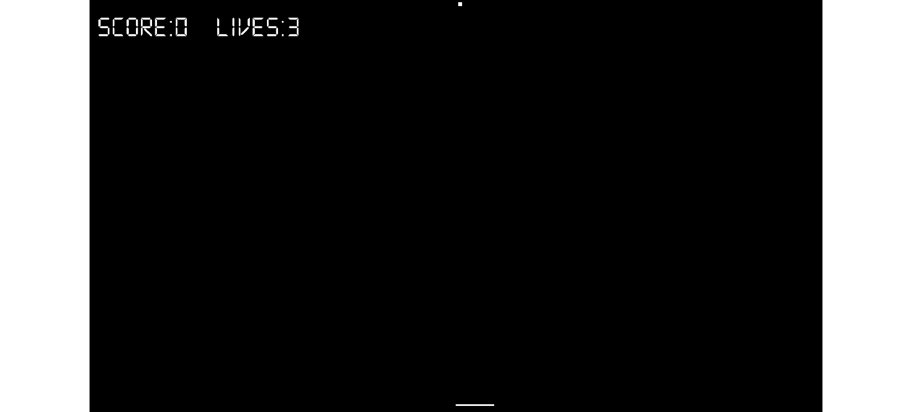

# 第八章：*第七章*：动态碰撞检测和物理——完成 Pong 游戏

在本章中，我们将编写我们的第二个类。我们将看到，尽管球显然与棒子有很大的不同，但我们将使用完全相同的技巧在`Ball`类中封装球的形状和功能，就像我们对棒子和`Bat`类所做的那样。然后，我们将通过编写一些动态碰撞检测和计分功能来完善 Pong 游戏。这听起来可能很复杂，但正如我们所期待的，SFML 将使事情比其他方式更容易。

本章我们将涵盖以下主题：

+   编写`Ball`类

+   使用`Ball`类

+   碰撞检测和计分

+   运行游戏

我们将首先编写代表球的类。

# 编写`Ball`类

要开始，我们将编写头文件。在`Ball.h`上右键单击。点击**添加**按钮。现在，我们准备好编写文件。

将以下代码添加到`Ball.h`中：

```cpp
#pragma once
#include <SFML/Graphics.hpp>
using namespace sf;
class Ball
{
private:
    Vector2f m_Position;    
    RectangleShape m_Shape;
    float m_Speed = 300.0f;
    float m_DirectionX = .2f;
    float m_DirectionY = .2f;
public:
    Ball(float startX, float startY);
    FloatRect getPosition();
    RectangleShape getShape();
    float getXVelocity();
    void reboundSides();
    void reboundBatOrTop();
    void reboundBottom();
    void update(Time dt);
};
```

你首先会注意到与`Bat`类相比成员变量的相似性。有一个用于位置的成员变量，外观和速度，就像玩家的棒子一样，它们的类型相同（`Vector2f`、`RectangleShape`和`float`分别）。它们甚至有相同的名称（`m_Position`、`m_Shape`和`m_Speed`分别）。这个类成员变量之间的区别在于，方向由两个`float`变量处理，这些变量将跟踪水平和垂直移动。这些是`m_DirectionX`和`m_DirectionY`。

注意，我们需要编写八个函数来使球变得生动。有一个与类名相同的构造函数，我们将使用它来初始化一个`Ball`实例。有三个与`Bat`类相同名称和用途的函数。它们是`getPosition`、`getShape`和`update`。`getPosition`和`getShape`函数将与`main`函数共享球的位置和外观，而`update`函数将从`main`函数中调用，以允许`Ball`类在每一帧更新其位置。

剩余的函数控制球将移动的方向。当检测到与屏幕任一侧的碰撞时，`reboundSides`函数将从`main`中调用，当球击中玩家的棒子或屏幕顶部时，将调用`reboundBatOrTop`函数，当球击中屏幕底部时，将调用`reboundBottom`函数。

当然，这些只是声明，所以让我们在`Ball.cpp`文件中编写实际工作的 C++代码。

让我们创建文件，然后我们可以开始讨论代码。在**名称**字段中右键单击`Ball.cpp`。点击**添加**按钮，我们的新文件将为我们创建。

将以下代码添加到`Ball.cpp`中：

```cpp
#include "Ball.h"
// This the constructor function
Ball::Ball(float startX, float startY)
{
    m_Position.x = startX;
    m_Position.y = startY;
    m_Shape.setSize(sf::Vector2f(10, 10));
    m_Shape.setPosition(m_Position);
}
```

在前面的代码中，我们已添加了`Ball`类头文件的必需`include`指令。与类名相同的构造函数接收两个`float`参数，用于初始化`m_Position`成员的`Vector2f`实例。然后使用`setSize`函数设置`RectangleShape`实例的大小，并使用`setPosition`函数定位。使用的大小是 10 像素宽和 10 像素高；这是任意的，但效果很好。使用的位置当然是从`m_Position Vector2f`实例中获取的。

在`Ball.cpp`函数的构造函数下方添加以下代码：

```cpp
FloatRect Ball::getPosition()
{
    return m_Shape.getGlobalBounds();
}
RectangleShape Ball::getShape()
{
    return m_Shape;
}
float Ball::getXVelocity()
{
    return m_DirectionX;
}
```

在前面的代码中，我们正在编写`Ball`类的三个 getter 函数。它们各自向`main`函数返回一些内容。第一个是`getPosition`，它使用`m_Shape`上的`getGlobalBounds`函数返回一个`FloatRect`实例。这将用于碰撞检测。

`getShape`函数返回`m_Shape`，以便在游戏循环的每一帧中绘制。`getXVelocity`函数告诉`main`函数球体正在移动的方向，我们很快就会看到这如何对我们有用。由于我们永远不需要获取垂直速度，因此没有相应的`getYVelocity`函数，但如果我们需要，添加一个也很简单。

在我们刚刚添加的代码下方添加以下函数：

```cpp
void Ball::reboundSides()
{
    m_DirectionX = -m_DirectionX;
}
void Ball::reboundBatOrTop()
{
    m_DirectionY = -m_DirectionY;
}
void Ball::reboundBottom()
{
    m_Position.y = 0;
    m_Position.x = 500;
    m_DirectionY = -m_DirectionY;
}
```

在前面的代码中，以`rebound...`开头的三个函数处理球体与各种位置的碰撞情况。在`reboundSides`函数中，`m_DirectionX`的值被反转，这将使正值变为负值，负值变为正值，从而反转（水平）球体移动的方向。`reboundBatOrTop`函数与`reboundSides`函数完全相同，但作用于`m_DirectionY`，这将反转球体垂直移动的方向。`reboundBottom`函数将球体重新定位到屏幕顶部中央，并将其向下发送。这就是玩家错过球体并击中屏幕底部后我们想要的。

最后，为`Ball`类添加更新函数，如下所示：

```cpp
void Ball::update(Time dt)
{
    // Update the ball's position
    m_Position.y += m_DirectionY * m_Speed * dt.asSeconds();
    m_Position.x += m_DirectionX * m_Speed * dt.asSeconds();
    // Move the ball 
    m_Shape.setPosition(m_Position);
}
```

在前面的代码中，`m_Position.y`和`m_Position.x`使用适当的方向速度、速度和当前帧完成所需的时间进行更新。然后使用新更新的`m_Position`值来更改`m_Shape RectangleShape`实例的位置。

`Ball`类已完成，现在让我们将其投入使用。

# 使用`Ball`类

要使`Ball`类在`main`函数中可用，请将以下代码添加到使球体生效的部分：

```cpp
#include "Ball.h"
```

添加以下高亮显示的代码行，使用我们刚刚编写的构造函数声明并初始化`Ball`类的一个实例：

```cpp
// Create a bat
Bat bat(1920 / 2, 1080 - 20);
// Create a ball
Ball ball(1920 / 2, 0);
// Create a Text object called HUD
Text hud;
```

将以下代码添加到高亮显示的位置：

```cpp
/*
Update the bat, the ball and the HUD
****************************************************
****************************************************
****************************************************
*/
// Update the delta time
Time dt = clock.restart();
bat.update(dt);
ball.update(dt);
// Update the HUD text
std::stringstream ss;
ss << "Score:" << score << "    Lives:" << lives;
hud.setString(ss.str());
```

在前面的代码中，我们只是对`ball`实例调用`update`。球将相应地重新定位。

将以下高亮代码添加到游戏循环的每一帧上绘制球：

```cpp
/*
Draw the bat, the ball and the HUD
*********************************************
*********************************************
*********************************************
*/
window.clear();
window.draw(hud);
window.draw(bat.getShape());
window.draw(ball.getShape());
window.display();
```

在这个阶段，你可以运行游戏，球会在屏幕顶部生成并开始向屏幕底部下降。然而，球会从屏幕底部消失，因为我们还没有检测到任何碰撞。现在让我们解决这个问题。

# 碰撞检测和得分

与 Timber!!!游戏不同，我们当时只是检查最低位置的树枝是否与玩家的角色在同一个侧面，在这个游戏中，我们需要通过数学方法检查球与球拍或球与屏幕四边的交点。

让我们看看一些假设的代码，以便我们理解我们在做什么。然后，我们将转向 SFML 来为我们解决这个问题。

测试两个矩形相交的代码可能看起来像这样。不要使用以下代码。它仅用于演示目的：

```cpp
if(objectA.getPosition().right > objectB.getPosition().left
    && objectA.getPosition().left < objectB.getPosition().right )
{    
    // objectA is intersecting objectB on x axis    
    // But they could be at different heights    

    if(objectA.getPosition().top < objectB.getPosition().bottom         
        && objectA.getPosition().bottom > objectB.getPosition().top )
        {       
            // objectA is intersecting objectB on y axis as well 
            // Collision detected  
        } 
}
```

我们不需要编写此代码；然而，我们将使用 SFML 的`intersects`函数，该函数作用于`FloatRect`对象。回想或查看`Bat`和`Ball`类；它们都有`getPosition`函数，该函数返回对象的当前位置的`FloatRect`。我们将看到如何使用`getPosition`和`intersects`来完成所有的碰撞检测。

在主函数的更新部分末尾添加以下高亮代码：

```cpp
/*
Update the bat, the ball and the HUD
**************************************
**************************************
**************************************
*/
// Update the delta time
Time dt = clock.restart();
bat.update(dt);
ball.update(dt);
// Update the HUD text
std::stringstream ss;
ss << "Score:" << score << "    Lives:" << lives;
hud.setString(ss.str());
// Handle ball hitting the bottom
if (ball.getPosition().top > window.getSize().y)
{
    // reverse the ball direction
    ball.reboundBottom();
    // Remove a life
    lives--;
    // Check for zero lives
    if (lives < 1) {
        // reset the score
        score = 0;
        // reset the lives
        lives = 3;
    }
}
```

在前面的代码中，第一个`if`条件检查球是否触碰到屏幕底部：

```cpp
if (ball.getPosition().top > window.getSize().y)
```

如果球的上部位置高于窗口的高度，那么球已经从玩家的视图中消失。作为回应，调用`ball.reboundBottom`函数。记住，在这个函数中，球被重新定位到屏幕顶部。此时，玩家失去了一条生命，因此`lives`变量被递减。

第二个`if`条件检查玩家是否用完了生命（`lives < 1`）。如果是这种情况，分数重置为 0，生命值重置为 3，游戏重新开始。在下一个项目中，我们将学习如何保存和显示玩家的最高分。

在前面的代码下方添加以下代码：

```cpp
// Handle ball hitting top
if (ball.getPosition().top < 0)
{
    ball.reboundBatOrTop();
    // Add a point to the players score
    score++;
}
```

在前面的代码中，我们检测到球的上部触碰到屏幕的上部。当这种情况发生时，玩家获得一分，并调用`ball.reboundBatOrTop`，这将反转球的垂直运动方向，并将球送回屏幕底部。

在前面的代码下方添加以下代码：

```cpp
// Handle ball hitting sides
if (ball.getPosition().left < 0 || 
    ball.getPosition().left + ball.getPosition().width> window.getSize().x)
{
    ball.reboundSides();
}
```

在前面的代码中，`if`条件检测到球与屏幕左侧的碰撞或球右侧（左+10）与屏幕右侧的碰撞。在任何一种情况下，都会调用`ball.reboundSides`函数，并反转水平移动的方向。

添加以下代码：

```cpp
// Has the ball hit the bat?
if (ball.getPosition().intersects(bat.getPosition()))
{
    // Hit detected so reverse the ball and score a point
    ball.reboundBatOrTop();
}
```

在前面的代码中，`intersects`函数用于确定球是否击中了球拍。当发生这种情况时，我们使用与屏幕顶部碰撞相同的函数来反转球垂直移动的方向。

# 运行游戏

你现在可以运行游戏，让球在屏幕上弹跳。当你用球拍击中球时，分数会增加，当你错过它时，生命值会减少。当`lives`达到 0 时，分数将重置，`lives`将回到 3，如下所示：



# 摘要

恭喜你；这是第二个完成的游戏！我们本可以给那个游戏添加更多功能，比如合作游戏、高分、音效等等，但我只是想用最简单的例子来介绍类和动态碰撞检测。现在我们有了这些主题在我们的游戏开发者工具箱中，我们可以继续到一个更加激动人心的项目，以及更多游戏开发主题。

在下一章中，我们将规划僵尸竞技场游戏，了解 SFML 的`View`类，它作为进入我们游戏世界的虚拟摄像头，并编写一些更多的类。

# 常见问题解答

Q) 这款游戏是不是有点安静？

A) 我没有给这个游戏添加音效，因为我想要保持代码尽可能短，同时使用我们的第一个类，并学习如何使用时间来平滑地动画化所有游戏对象。如果你想添加音效，你只需要将.wav 文件添加到项目中，使用 SFML 加载声音，并在每个碰撞事件中播放一个音效。我们将在下一个项目中这样做。

Q) 游戏太简单了！我怎样才能让球的速度稍微快一点？

A) 有很多方法可以使游戏更具挑战性。一种简单的方法是在`Ball`类的`reboundBatOrTop`函数中添加一行代码来增加速度。例如，以下代码会在每次函数被调用时将球的速度增加 10%：

```cpp
// Speed up a little bit on each hit
m_Speed = m_Speed * 1.1f;
```

球会很快变得非常快。当玩家失去所有生命时，你需要想出一个方法将速度重置回`300.0f`。你可以在`Ball`类中创建一个新的函数，可能叫做`resetSpeed`，并在代码检测到玩家失去最后一条生命时从`main`中调用它。
