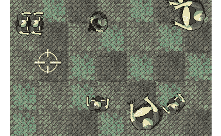
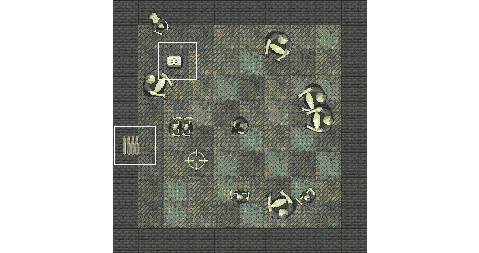
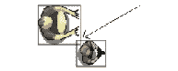

# 第十二章：*第十一章*: 碰撞检测、拾取物和子弹

到目前为止，我们已经实现了游戏的主要视觉方面。我们有一个可控的角色在满是僵尸的竞技场中奔跑，僵尸会追逐他们。问题是它们之间没有互动。一个僵尸可以毫无阻碍地穿过玩家而不会留下任何痕迹。我们需要检测僵尸和玩家之间的碰撞。

如果僵尸能够伤害玩家并最终将其杀死，那么给玩家一些子弹来应对枪支是公平的。然后我们需要确保子弹能够击中并杀死僵尸。

同时，如果我们正在编写子弹、僵尸和玩家的碰撞检测代码，那么添加一个用于健康和弹药拾取物的类也是一个好时机。

在本章中，我们将执行以下操作，并按以下顺序介绍内容：

+   射击子弹

+   添加准星并隐藏鼠标指针

+   生成拾取物

+   检测碰撞

让我们从`Bullet`类开始。

# 编写子弹类

我们将使用 SFML 的`RectangleShape`类来在视觉上表示子弹。我们将编写一个具有`RectangleShape`成员以及其他成员数据和函数的`Bullet`类。然后，我们将按照以下步骤将子弹添加到游戏中：

1.  首先，我们将编写`Bullet.h`文件。这将揭示成员数据的所有细节和函数的原型。

1.  接下来，我们将编写`Bullet.cpp`文件，它当然将包含`Bullet`类的所有函数的定义。随着我们的逐步介绍，我将解释`Bullet`类型的对象将如何工作以及如何控制。

1.  最后，我们将在`main`函数中声明一个子弹数组。我们还将实现射击控制方案、管理玩家的剩余弹药和重新装弹。

让我们从第一步开始。

## 编写子弹头文件

要创建新的头文件，右键单击`Bullet.h`。

将以下私有成员变量，以及`Bullet`类声明，添加到`Bullet.h`文件中。然后我们可以逐一解释它们的作用：

```cpp
#pragma once
#include <SFML/Graphics.hpp>
using namespace sf;
class Bullet
{
private:
    // Where is the bullet?
    Vector2f m_Position;
    // What each bullet looks like
    RectangleShape m_BulletShape;
    // Is this bullet currently whizzing through the air
    bool m_InFlight = false;
    // How fast does a bullet travel?
    float m_BulletSpeed = 1000;
    // What fraction of 1 pixel does the bullet travel, 
    // Horizontally and vertically each frame?
    // These values will be derived from m_BulletSpeed
    float m_BulletDistanceX;
    float m_BulletDistanceY;

    // Some boundaries so the bullet doesn't fly forever
    float m_MaxX;
    float m_MinX;
    float m_MaxY;
    float m_MinY;
// Public function prototypes go here
};
```

在之前的代码中，第一个成员是一个名为`m_Position`的`Vector2f`，它将保存子弹在游戏世界中的位置。

接下来，我们声明一个名为`m_BulletShape`的`RectangleShape`，因为我们为每个子弹使用了一个简单的非纹理图形，就像我们在 Timber 中为时间条所做的那样!!!。

代码随后声明了一个`Boolean`类型的`m_InFlight`，它将跟踪子弹是否正在空中飞驰。这将允许我们决定是否需要在每一帧调用其`update`函数，以及是否需要运行碰撞检测检查。

`float`类型的变量`m_BulletSpeed`将（你可能可以猜到）保存子弹将以每秒多少像素的速度移动。它被初始化为`1000`，这是一个有点任意的选择，但效果不错。

接下来，我们还有两个更多的 `float` 变量，`m_BulletDistanceX` 和 `m_BulletDistanceY`。由于移动子弹的计算比移动僵尸或玩家要复杂一些，我们将从这两个变量中受益，我们将对它们进行计算。它们将用于决定子弹在每个帧中的水平和垂直位置变化。

最后，我们还有四个 `float` 变量（`m_MaxX`、`m_MinX`、`m_MaxY` 和 `m_MinY`），稍后它们将被初始化以保存子弹的最大和最小水平以及垂直位置。

很可能，这些变量中的一些需求并不立即明显，但当我们看到它们在 `Bullet.cpp` 文件中的实际应用时，一切将变得清晰起来。

现在，将所有公共函数原型添加到 `Bullet.h` 文件中：

```cpp
// Public function prototypes go here
public:
    // The constructor
    Bullet();
    // Stop the bullet
    void stop();
    // Returns the value of m_InFlight
    bool isInFlight();
    // Launch a new bullet
    void shoot(float startX, float startY,
        float xTarget, float yTarget);
    // Tell the calling code where the bullet is in the world
    FloatRect getPosition();
    // Return the actual shape (for drawing)
    RectangleShape getShape();
    // Update the bullet each frame
    void update(float elapsedTime);
};
```

让我们依次运行每个函数，然后我们可以继续编写它们的定义。

首先，我们有 `Bullet` 函数，当然是构造函数。在这个函数中，我们将设置每个 `Bullet` 实例，使其准备就绪。

当子弹已经执行但需要停止时，将调用 `stop` 函数。

`isInFlight` 函数返回一个布尔值，将用于测试子弹是否当前正在飞行。

`shoot` 函数的功能从其名称中可以看出，但其工作原理值得讨论。现在，只需注意它有四个 `float` 参数将被传入。这四个值代表子弹的起始（玩家所在位置）水平和垂直位置，以及垂直和水平目标位置（准星所在位置）。

`getPosition` 函数返回一个表示子弹位置的 `FloatRect`。此函数将用于检测与僵尸的碰撞。你可能还记得在 *第十章*，*指针、标准模板库和纹理管理* 中，僵尸也有一个 `getPosition` 函数。

接下来，我们有 `getShape` 函数，它返回一个 `RectangleShape` 类型的对象。正如我们讨论过的，每个子弹都通过一个 `RectangleShape` 对象来表示。因此，`getShape` 函数将用于获取 `RectangleShape` 当前状态的副本以便绘制。

最后，并且希望如预期的那样，是 `update` 函数，它有一个 `float` 参数，表示自上次调用 `update` 以来经过的秒数的一部分。`update` 方法将改变子弹在每个帧中的位置。

让我们查看并编写函数定义。

## 编写 Bullet 源文件

现在，我们可以创建一个新的 `.cpp` 文件，该文件将包含函数定义。右键点击 `Bullet.cpp`。最后，点击 **添加** 按钮。我们现在可以开始编写类的代码了。

添加以下代码，这是用于包含指令和构造函数的。我们知道它是一个构造函数，因为函数的名称与类相同：

```cpp
#include "bullet.h"
// The constructor
Bullet::Bullet()
{
    m_BulletShape.setSize(sf::Vector2f(2, 2));
}
```

`Bullet` 构造函数需要做的唯一事情是设置 `m_BulletShape` 的大小，这是一个 `RectangleShape` 对象。代码将大小设置为两个像素乘以两个像素。

接下来，我们将编写更复杂的 `shoot` 函数。将以下代码添加到 `Bullet.cpp` 文件中，并研究它，然后我们可以讨论它：

```cpp
void Bullet::shoot(float startX, float startY,
    float targetX, float targetY)
{
    // Keep track of the bullet
    m_InFlight = true;
    m_Position.x = startX;
    m_Position.y = startY;
    // Calculate the gradient of the flight path
    float gradient = (startX - targetX) / (startY - targetY);
    // Any gradient less than 1 needs to be negative
    if (gradient < 0)
    {
        gradient *= -1;
    }
    // Calculate the ratio between x and y
    float ratioXY = m_BulletSpeed / (1 + gradient);
    // Set the "speed" horizontally and vertically
    m_BulletDistanceY = ratioXY;
    m_BulletDistanceX = ratioXY * gradient;

    // Point the bullet in the right direction
    if (targetX < startX)
    {
        m_BulletDistanceX *= -1;
    }
    if (targetY < startY)
    {
        m_BulletDistanceY *= -1;
    }

    // Set a max range of 1000 pixels
    float range = 1000;
    m_MinX = startX - range;
    m_MaxX = startX + range;
    m_MinY = startY - range;
    m_MaxY = startY + range;

    // Position the bullet ready to be drawn
    m_BulletShape.setPosition(m_Position);
}
```

为了揭开 `shoot` 函数的神秘面纱，我们将将其拆分，并分块讨论我们刚刚添加的代码。

首先，让我们回顾一下签名。`shoot` 函数接收子弹的起始和目标水平及垂直位置。调用代码将根据玩家精灵的位置和准星的位置提供这些信息。这里再次说明：

```cpp
void Bullet::shoot(float startX, float startY,
    float targetX, float targetY)
```

在 `shoot` 函数内部，我们将 `m_InFlight` 设置为 `true`，并使用 `startX` 和 `startY` 参数定位子弹。这是那段代码的再次说明：

```cpp
// Keep track of the bullet
m_InFlight = true;
m_Position.x = startX;
m_Position.y = startY;
```

现在，我们使用一点三角学来确定子弹的移动斜率。子弹在水平和垂直方向上的进度必须根据从子弹的起始和目标之间绘制的线的斜率而变化。变化率不能相同或非常陡峭，否则斜射会先到达水平位置，然后是垂直位置，反之亦然。

下面的代码根据直线的方程推导出斜率。然后，它检查斜率是否小于零，如果是，则将其乘以 -1。这是因为传入的起始和目标坐标可以是负数或正数，而我们总是希望每一帧的进度量是正数。乘以 -1 简单地将负数转换为它的正数等价物，因为负数乘以负数得到正数。实际的运动方向将在 `update` 函数中通过添加或减去在这个函数中得到的正数值来处理。

接下来，我们通过将子弹的速度 (`m_BulletSpeed`) 除以 1 加上斜率来计算水平到垂直距离的比率。这将允许我们根据子弹所朝向的目标，在每一帧正确地改变子弹的水平位置和垂直位置。

最后，在这段代码中，我们将值分配给 `m_BulletDistanceY` 和 `m_BulletDistanceX`：

```cpp
// Calculate the gradient of the flight path
float gradient = (startX - targetX) / (startY - targetY);
// Any gradient less than zero needs to be negative
if (gradient < 0)
{
    gradient *= -1;
}
// Calculate the ratio between x and y
float ratioXY = m_BulletSpeed / (1 + gradient);
// Set the "speed" horizontally and vertically
m_BulletDistanceY = ratioXY;
m_BulletDistanceX = ratioXY * gradient;
```

以下代码更加直接。我们只是设置子弹可以达到的最大水平和垂直位置。我们不想让子弹永远飞行。在更新函数中，我们将看到子弹是否已经通过了其最大或最小位置：

```cpp
// Set a max range of 1000 pixels in any direction
float range = 1000;
m_MinX = startX - range;
m_MaxX = startX + range;
m_MinY = startY - range;
m_MaxY = startY + range;
```

以下代码将代表子弹的精灵移动到其起始位置。我们使用 `Sprite` 的 `setPosition` 函数，就像我们之前经常做的那样：

```cpp
// Position the bullet ready to be drawn
m_BulletShape.setPosition(m_Position);
```

接下来，我们有四个简单的函数。让我们添加 `stop`、`isInFlight`、`getPosition` 和 `getShape` 函数：

```cpp
void Bullet::stop()
{
    m_InFlight = false;
}
bool Bullet::isInFlight()
{
    return m_InFlight;
}
FloatRect Bullet::getPosition()
{
    return m_BulletShape.getGlobalBounds();
}
RectangleShape Bullet::getShape()
{
    return m_BulletShape;
}
```

`stop` 函数只是将 `m_InFlight` 变量设置为 `false`。`isInFlight` 函数返回该变量当前值。因此，我们可以看到 `shoot` 使子弹开始移动，`stop` 使其停止，而 `isInFlight` 通知我们当前状态。

`getPosition` 函数返回一个 `FloatRect`。我们很快就会看到如何使用每个游戏对象的 `FloatRect` 来检测碰撞。

最后，对于之前的代码，`getShape` 返回一个 `RectangleShape`，这样我们就可以在每一帧中绘制子弹。

在我们可以开始使用 `Bullet` 对象之前，我们需要实现最后一个函数 `update`。添加以下代码，研究它，然后我们可以讨论它：

```cpp
void Bullet::update(float elapsedTime)
{
    // Update the bullet position variables
    m_Position.x += m_BulletDistanceX * elapsedTime;
    m_Position.y += m_BulletDistanceY * elapsedTime;
    // Move the bullet
    m_BulletShape.setPosition(m_Position);
    // Has the bullet gone out of range?
    if (m_Position.x < m_MinX || m_Position.x > m_MaxX ||
        m_Position.y < m_MinY || m_Position.y > m_MaxY)
    {
        m_InFlight = false;
    }
}
```

在 `update` 函数中，我们使用 `m_BulletDistanceX` 和 `m_BulletDistanceY`，乘以上一帧以来的时间来移动子弹。记住，这两个变量的值是在 `shoot` 函数中计算的，代表移动子弹所需的角度的梯度（彼此之间的比率）。然后，我们使用 `setPosition` 函数实际移动 `RectangleShape`。

在 `update` 函数中我们做的最后一件事是测试子弹是否已经移动到其最大射程之外。稍微复杂的 `if` 语句检查 `m_Position.x` 和 `m_Position.y` 是否与在 `shoot` 函数中计算出的最大和最小值相符。这些最大和最小值存储在 `m_MinX`、`m_MaxX`、`m_MinY` 和 `m_MaxY` 中。如果测试结果为真，则将 `m_InFlight` 设置为 `false`。

`Bullet` 类已完成。现在，我们将看看如何在 `main` 函数中射击一些子弹。

# 使子弹飞行

我们将通过以下六个步骤使子弹可用：

1.  为 `Bullet` 类添加必要的包含指令。

1.  添加一些控制变量和一个数组来存储一些 `Bullet` 实例。

1.  处理玩家按下 *R* 键来重新装填。

1.  处理玩家按下左鼠标按钮来发射子弹。

1.  在每一帧中更新所有正在飞行的子弹。

1.  在每一帧中绘制正在飞行的子弹。

## 包含 Bullet 类

添加包含指令以使 Bullet 类可用：

```cpp
#include <SFML/Graphics.hpp>
#include "ZombieArena.h"
#include "Player.h"
#include "TextureHolder.h"
#include "Bullet.h"
using namespace sf;
```

让我们继续下一步。

## 控制变量和子弹数组

这里有一些变量用于跟踪弹夹大小、备用子弹、子弹、弹夹中剩余的子弹、当前射速（从每秒一发开始）以及上次发射子弹的时间。

添加以下突出显示的代码。然后，我们可以继续前进，并看到本节其余部分的所有这些变量在行动中的表现：

```cpp
// Prepare for a horde of zombies
int numZombies;
int numZombiesAlive;
Zombie* zombies = NULL;
// 100 bullets should do
Bullet bullets[100];
int currentBullet = 0;
int bulletsSpare = 24;
int bulletsInClip = 6;
int clipSize = 6;
float fireRate = 1;
// When was the fire button last pressed?
Time lastPressed;
// The main game loop
while (window.isOpen())
```

接下来，让我们处理玩家按下 *R* 键时发生的情况，该键用于重新装填弹夹。

## 重新装填枪支

现在，我们将处理与射击子弹相关的玩家输入。首先，我们将处理按下 *R* 键来重新装填枪支。我们将使用 SFML 事件来完成此操作。

添加以下高亮显示的代码。它展示了大量的上下文，以确保代码放在正确的位置。研究完代码后，我们再讨论它：

```cpp
// Handle events
Event event;
while (window.pollEvent(event))
{
    if (event.type == Event::KeyPressed)
    {
        // Pause a game while playing
        if (event.key.code == Keyboard::Return &&
            state == State::PLAYING)
        {
            state = State::PAUSED;
        }
        // Restart while paused
        else if (event.key.code == Keyboard::Return &&
            state == State::PAUSED)
        {
            state = State::PLAYING;
            // Reset the clock so there isn't a frame jump
            clock.restart();
        }
        // Start a new game while in GAME_OVER state
        else if (event.key.code == Keyboard::Return &&
            state == State::GAME_OVER)
        {
            state = State::LEVELING_UP;
        }
        if (state == State::PLAYING)
        {
            // Reloading
            if (event.key.code == Keyboard::R)
            {
                if (bulletsSpare >= clipSize)
                {
                    // Plenty of bullets. Reload.
                    bulletsInClip = clipSize;
                    bulletsSpare -= clipSize;                            
                }
                else if (bulletsSpare > 0)
                {
                    // Only few bullets left
                    bulletsInClip = bulletsSpare;
                    bulletsSpare = 0;                            
                }
                else
                {
                    // More here soon?!
                }
            }
        }
    }
}// End event polling
```

之前的代码嵌套在游戏循环的事件处理部分（`while(window.pollEvent)`）中，在仅当游戏实际正在播放时执行的代码块内（`if(state == State::Playing)`）。很明显，我们不希望玩家在游戏结束时或暂停时重新装弹，所以我们按照描述的方式包裹新代码，以此实现这一目的。

在新代码本身中，我们首先使用 `if (event.key.code == Keyboard::R)` 测试是否按下了 *R* 键。一旦我们检测到按下了 *R* 键，剩余的代码就会被执行。以下是 `if`、`else if` 和 `else` 块的结构：

```cpp
if(bulletsSpare >= clipSize)
    ...
else if(bulletsSpare > 0)
    ...
else
    ...
```

之前的结构允许我们处理三种可能的场景，如下所示：

+   玩家按下了 `R` 键，并且他们还有比弹夹能装的更多的备用子弹。在这种情况下，弹夹被重新装填，备用子弹的数量减少。

+   玩家有一些备用子弹，但不足以完全填满弹夹。在这种情况下，弹夹被填满至玩家拥有的备用子弹数量，备用子弹的数量被设置为零。

+   玩家按下了 *R* 键，但他们完全没有备用子弹。对于这种情况，我们实际上不需要改变变量。然而，当我们在 *第十三章* 中实现声音效果时，*声音效果、文件输入/输出和完成游戏*，我们将在那里播放一个声音效果，所以我们将保留空的 `else` 块以备后用。

现在，让我们射击一颗子弹。

## 射击子弹

在这里，我们将处理左鼠标按钮被点击以发射子弹的情况。添加以下高亮显示的代码并仔细研究它：

```cpp
    if (Keyboard::isKeyPressed(Keyboard::D))
    {
        player.moveRight();
    }
    else
    {
        player.stopRight();
    }
    // Fire a bullet
    if (Mouse::isButtonPressed(sf::Mouse::Left))
    {
        if (gameTimeTotal.asMilliseconds()
            - lastPressed.asMilliseconds()
            > 1000 / fireRate && bulletsInClip > 0)
        {
// Pass the centre of the player 
            // and the centre of the cross-hair
            // to the shoot function
            bullets[currentBullet].shoot(
                player.getCenter().x, player.getCenter().y,
                mouseWorldPosition.x, mouseWorldPosition.y);
            currentBullet++;
            if (currentBullet > 99)
            {
                currentBullet = 0;
            }
            lastPressed = gameTimeTotal;
            bulletsInClip--;
        }
    }// End fire a bullet
}// End WASD while playing
```

所有之前的代码都被包裹在一个 `if` 语句中，该语句在左鼠标按钮被按下时执行，即 `if (Mouse::isButtonPressed(sf::Mouse::Left))`。请注意，即使玩家只是按住按钮，代码也会重复执行。我们现在要讲解的代码控制了射击速率。

在前面的代码中，我们检查游戏已过去的时间（`gameTimeTotal`）减去玩家上次射击子弹的时间（`lastPressed`）是否大于 1,000，除以当前射击速率，并且玩家至少有一个子弹在弹夹中。我们使用 1,000 因为这是秒中的毫秒数。

如果这个测试成功，将执行实际发射子弹的代码。射击子弹很简单，因为我们已经在 `Bullet` 类中完成了所有艰苦的工作。我们只需在 `bullets` 数组中的当前子弹上调用 `shoot`。我们传入玩家和准星当前的水平位置和垂直位置。子弹将通过 `Bullet` 类的 `shoot` 函数中的代码进行配置并设置为飞行状态。

我们必须做的只是跟踪子弹数组。我们递增了`currentBullet`变量。然后，我们需要检查是否用`if (currentBullet > 99)`语句发射了最后一个子弹（99 号）。如果是最后一个子弹，我们将`currentBullet`设置为零。如果不是最后一个子弹，那么在射击速率允许且玩家按下左鼠标按钮时，下一发子弹就可以发射。

最后，在先前的代码中，我们将子弹发射的时间存储到`lastPressed`中，并将`bulletsInClip`递减。

现在，我们可以每帧更新每个子弹。

## 每帧更新子弹

添加以下高亮代码以遍历子弹数组，检查子弹是否在飞行中，如果是，则调用其更新函数：

```cpp
    // Loop through each Zombie and update them
    for (int i = 0; i < numZombies; i++)
    {
        if (zombies[i].isAlive())
        {
            zombies[i].update(dt.asSeconds(), playerPosition);
        }
    }
    // Update any bullets that are in-flight
    for (int i = 0; i < 100; i++)
    {
        if (bullets[i].isInFlight())
        {
            bullets[i].update(dtAsSeconds);
        }
    }
}// End updating the scene
```

最后，我们将绘制所有子弹。

## 每帧绘制子弹

添加以下高亮代码以遍历`bullets`数组，检查子弹是否在飞行中，如果是，则绘制它：

```cpp
/*
 **************
 Draw the scene
 **************
 */
if (state == State::PLAYING)
{
    window.clear();
    // set the mainView to be displayed in the window
    // And draw everything related to it
    window.setView(mainView);
    // Draw the background
    window.draw(background, &textureBackground);
    // Draw the zombies
    for (int i = 0; i < numZombies; i++)
    {
        window.draw(zombies[i].getSprite());
    }
    for (int i = 0; i < 100; i++)
    {
        if (bullets[i].isInFlight())
        {
            window.draw(bullets[i].getShape());
        }
    }
    // Draw the player
    window.draw(player.getSprite());
}
```

运行游戏以测试子弹。注意，在你需要按*R*键重新装填之前，你可以发射六发子弹。显然缺少的是一些视觉指示器，显示弹夹中的子弹数量和备用子弹数量。另一个问题是玩家可能会非常快地用完子弹，尤其是由于子弹完全没有停止力，它们会直接穿过僵尸。再加上玩家被期望瞄准鼠标指针而不是精确的准星，很明显我们还有很多工作要做。

在下一章中，我们将通过 HUD 提供视觉反馈。我们将用准星替换鼠标光标，然后在那之后生成一些拾取物来补充子弹和生命值。最后，在这一章中，我们将处理碰撞检测，使子弹和僵尸造成伤害，并使玩家能够真正地拾取物品。

# 给玩家一个准星

添加准星很简单，只需要一个新概念。添加以下高亮代码，然后我们可以运行它：

```cpp
// 100 bullets should do
Bullet bullets[100];
int currentBullet = 0;
int bulletsSpare = 24;
int bulletsInClip = 6;
int clipSize = 6;
float fireRate = 1;
// When was the fire button last pressed?
Time lastPressed;
// Hide the mouse pointer and replace it with crosshair
window.setMouseCursorVisible(true);
Sprite spriteCrosshair;
Texture textureCrosshair = TextureHolder::GetTexture("graphics/crosshair.png");
spriteCrosshair.setTexture(textureCrosshair);
spriteCrosshair.setOrigin(25, 25);
// The main game loop
while (window.isOpen())
```

首先，我们在`window`对象上调用`setMouseCursorVisible`函数。然后我们加载一个`Texture`并声明一个`Sprite`实例，并以通常的方式初始化它。此外，我们将精灵的原点设置为它的中心，使其更方便，也更简单地将子弹飞向中间，正如你所期望的那样。

现在，我们需要每帧更新准星，使用鼠标的全球坐标。添加以下高亮代码行，它使用`mouseWorldPosition`向量设置准星的每帧位置：

```cpp
/*
 ****************
 UPDATE THE FRAME
 ****************
 */
if (state == State::PLAYING)
{
    // Update the delta time
    Time dt = clock.restart();
    // Update the total game time
    gameTimeTotal += dt;
    // Make a decimal fraction of 1 from the delta time
    float dtAsSeconds = dt.asSeconds();
    // Where is the mouse pointer
    mouseScreenPosition = Mouse::getPosition();
    // Convert mouse position to world coordinates of mainView
    mouseWorldPosition = window.mapPixelToCoords(
        Mouse::getPosition(), mainView);
    // Set the crosshair to the mouse world location
    spriteCrosshair.setPosition(mouseWorldPosition);
    // Update the player
    player.update(dtAsSeconds, Mouse::getPosition());
```

接下来，正如你可能已经预料到的，我们可以在每一帧绘制准星。在所示位置添加以下高亮代码行。这一行代码无需解释，但它在所有其他游戏对象之后的定位很重要，因此它被绘制在最上面：

```cpp
/*
 **************
 Draw the scene
 **************
 */
if (state == State::PLAYING)
{
    window.clear();
    // set the mainView to be displayed in the window
    // And draw everything related to it
    window.setView(mainView);
    // Draw the background
    window.draw(background, &textureBackground);
    // Draw the zombies
    for (int i = 0; i < numZombies; i++)
    {
        window.draw(zombies[i].getSprite());
    }
    for (int i = 0; i < 100; i++)
    {
        if (bullets[i].isInFlight())
        {
            window.draw(bullets[i].getShape());
        }
    }
    // Draw the player
    window.draw(player.getSprite());
    //Draw the crosshair
    window.draw(spriteCrosshair);
}
```

现在，你可以运行游戏，将看到一个酷炫的准星而不是鼠标光标：



注意子弹是如何干净利落地穿过准星中心的。射击机制的工作方式类似于允许玩家选择从腰间射击还是瞄准射击。如果玩家将准星保持在中心附近，他们可以快速射击和转身，但必须仔细判断远处僵尸的位置。

或者，玩家可以将准星直接悬停在远处僵尸的头上，从而获得精确命中；然而，如果僵尸从另一个方向攻击，他们需要将准星移动得更远。

游戏的一个有趣改进是向每次射击添加一小部分随机不准确度。这种不准确度可能可以通过波次之间的升级来减轻。

# 编写拾取类

在本节中，我们将编写一个具有`Sprite`成员以及其他成员数据和函数的`Pickup`类。我们将在几个步骤中将拾取物添加到游戏中：

1.  首先，我们将编写`Pickup.h`文件。这将揭示成员数据和函数原型的所有细节。

1.  然后，我们将编写`Pickup.cpp`文件，当然，它将包含`Pickup`类所有函数的定义。随着我们逐步分析，我将详细解释`Pickup`类型对象的工作方式和控制方式。

1.  最后，我们将在`main`函数中使用`Pickup`类来生成、更新和绘制它们。

让我们从第一步开始。

## 编写拾取头文件

要创建新的头文件，右键点击`Pickup.h`。

将以下代码添加并研究到`Pickup.h`文件中，然后我们可以逐一分析：

```cpp
#pragma once
#include <SFML/Graphics.hpp>
using namespace sf;
class Pickup
{
private:
    //Start value for health pickups
    const int HEALTH_START_VALUE = 50;
    const int AMMO_START_VALUE = 12;
    const int START_WAIT_TIME = 10;
    const int START_SECONDS_TO_LIVE = 5;

    // The sprite that represents this pickup
    Sprite m_Sprite;
    // The arena it exists in
    IntRect m_Arena;
    // How much is this pickup worth?
    int m_Value;

    // What type of pickup is this? 
    // 1 = health, 2 = ammo
    int m_Type;
    // Handle spawning and disappearing
    bool m_Spawned;
    float m_SecondsSinceSpawn;
    float m_SecondsSinceDeSpawn;
    float m_SecondsToLive;
    float m_SecondsToWait;    
// Public prototypes go here
};
```

之前的代码声明了`Pickup`类的所有私有变量。尽管名称应该相当直观，但可能并不明显为什么需要其中许多变量。让我们从顶部开始逐一了解：

+   `const int HEALTH_START_VALUE = 50`：这个常量变量用于设置所有健康拾取物的起始值。该值将用于初始化`m_Value`变量，该变量需要在游戏过程中进行操作。

+   `const int AMMO_START_VALUE = 12`：这个常量变量用于设置所有弹药拾取物的起始值。该值将用于初始化`m_Value`变量，该变量需要在游戏过程中进行操作。

+   `const int START_WAIT_TIME = 10`：这个变量决定了拾取物消失后重生前的等待时间。它将用于初始化`m_SecondsToWait`变量，该变量可以在游戏过程中进行操作。

+   `const int START_SECONDS_TO_LIVE = 5`：这个变量决定了拾取物在生成和消失之间的持续时间。像前三个常量一样，它有一个与之关联的非常量，可以在游戏过程中进行操作。它用来初始化的是`m_SecondsToLive`。

+   `Sprite m_Sprite`：这是用于视觉表示对象的精灵。

+   `IntRect m_Arena`：这将保存当前竞技场的尺寸，以帮助拾取在合理的位置生成。

+   `int m_Value`：这个拾取值代表多少生命值或弹药？当玩家升级生命值或弹药拾取的值时，将使用此值。

+   `int m_Type`：这将分别为生命值或弹药是 1 或 2。我们本可以使用枚举类，但似乎对于只有两个选项来说有点过度了。

+   `bool m_Spawned`：拾取当前是否已生成？

+   `float m_SecondsSinceSpawn`：拾取被生成以来有多长时间了？

+   `float m_SecondsSinceDeSpawn`：拾取被销毁（消失）以来有多长时间了？

+   `float m_SecondsToLive`：这个拾取在销毁前应该保持生成多久？

+   `float m_SecondsToWait`：这个拾取在重新生成前应该保持销毁多久？

    小贴士

    注意，这个类的复杂性的大部分是由于变量生成时间和其可升级的特性。如果拾取在收集后重新生成并且具有固定值，这将是一个非常简单的类。我们需要我们的拾取是可升级的，这样玩家就必须制定策略才能通过波次。

接下来，将以下公共函数原型添加到`Pickup.h`文件中。请确保您熟悉新代码，这样我们才能一起审查：

```cpp
// Public prototypes go here
public:
    Pickup::Pickup(int type);
    // Prepare a new pickup
    void setArena(IntRect arena);
    void spawn();
    // Check the position of a pickup
    FloatRect getPosition();
    // Get the sprite for drawing
    Sprite getSprite();
    // Let the pickup update itself each frame
    void update(float elapsedTime);
    // Is this pickup currently spawned?
    bool isSpawned();
    // Get the goodness from the pickup
    int gotIt();
    // Upgrade the value of each pickup
    void upgrade();
};
```

让我们简要地讨论一下每个函数定义。

+   第一个函数是构造函数，其名称与类名相同。请注意，它接受一个单个的`int`参数。这将用于初始化它将是什么类型的拾取（生命值或弹药）。

+   `setArena`函数接收一个`IntRect`。这个函数将在每一波的开始时为每个`Pickup`实例调用。然后，`Pickup`对象将“知道”它们可以生成的区域。

+   当然，`spawn`函数将处理拾取的生成。

+   `getPosition`函数，就像在`Player`、`Zombie`和`Bullet`类中一样，将返回一个`FloatRect`实例，表示对象在游戏世界中的当前位置。

+   `getSprite`函数返回一个`Sprite`对象，允许拾取在每一帧被绘制。

+   `update`函数接收上一帧所花费的时间。它使用这个值来更新其私有变量，并做出何时生成和销毁的决定。

+   `isSpawned`函数返回一个布尔值，这将让调用代码知道拾取是否当前已生成。

+   当检测到与玩家的碰撞时，将调用`gotIt`函数。然后，`Pickup`类的代码可以准备在适当的时间重新生成。请注意，它返回一个`int`值，以便调用代码知道拾取在生命值或弹药中的“价值”。

+   当玩家在游戏的升级阶段选择升级拾取属性时，将调用`upgrade`函数。

现在我们已经了解了成员变量和函数原型，在编写函数定义时应该相当容易跟随。

## 编写 Pickup 类函数定义

现在，我们可以创建一个新的 `.cpp` 文件，该文件将包含函数定义。右键单击 `Pickup.cpp`。最后，点击 **添加** 按钮。我们现在准备好编写类代码。

将以下代码添加到 `Pickup.cpp` 文件中。请务必审查代码，以便我们可以讨论它：

```cpp
#include "Pickup.h"
#include "TextureHolder.h"
Pickup::Pickup(int type)
{
    // Store the type of this pickup
    m_Type = type;
    // Associate the texture with the sprite
    if (m_Type == 1)
    {
        m_Sprite = Sprite(TextureHolder::GetTexture(
            "graphics/health_pickup.png"));
        // How much is pickup worth
        m_Value = HEALTH_START_VALUE;
    }
    else
    {
        m_Sprite = Sprite(TextureHolder::GetTexture(
            "graphics/ammo_pickup.png"));
        // How much is pickup worth
        m_Value = AMMO_START_VALUE;
    }
    m_Sprite.setOrigin(25, 25);
    m_SecondsToLive = START_SECONDS_TO_LIVE;
    m_SecondsToWait = START_WAIT_TIME;
}
```

在之前的代码中，我们添加了熟悉的包含指令。然后，我们添加了 `Pickup` 构造函数。我们知道它是构造函数，因为它与类的名称相同。

构造函数接收一个名为 `type` 的 `int`，代码首先将 `type` 接收的值分配给 `m_Type`。之后，有一个 `if else` 块检查 `m_Type` 是否等于 1。如果是，则将 `m_Sprite` 与健康拾取纹理关联，并将 `m_Value` 设置为 `HEALTH_START_VALUE`。

如果 `m_Type` 不等于 1，则 `else` 块将弹药拾取纹理与 `m_Sprite` 关联，并将 `AMMO_START_VALUE` 的值分配给 `m_Value`。

在 `if` `else` 块之后，代码使用 `setOrigin` 函数将 `m_Sprite` 的原点设置为中心，并将 `START_SECONDS_TO_LIVE` 和 `START_WAIT_TIME` 分别分配给 `m_SecondsToLive` 和 `m_SecondsToWait`。

构造函数已成功准备了一个 `Pickup` 对象，该对象已准备好使用。

现在，我们将添加 `setArena` 函数。在添加时检查代码：

```cpp
void Pickup::setArena(IntRect arena)
{
    // Copy the details of the arena to the pickup's m_Arena
    m_Arena.left = arena.left + 50;
    m_Arena.width = arena.width - 50;
    m_Arena.top = arena.top + 50;
    m_Arena.height = arena.height - 50;
    spawn();
}
```

我们刚刚编写的 `setArena` 函数简单地复制了传入的 `arena` 对象中的值，但在左侧和顶部增加了 `+ 50`，在右侧和底部减少了 `- 50`。现在 `Pickup` 对象已经知道它可以生成的区域。然后 `setArena` 函数调用它自己的 `spawn` 函数，以便为每一帧的绘制和更新做好最后的准备。

接下来是 `spawn` 函数。在 `setArena` 函数之后添加以下代码：

```cpp
void Pickup::spawn()
{
    // Spawn at a random location
    srand((int)time(0) / m_Type);
    int x = (rand() % m_Arena.width);
    srand((int)time(0) * m_Type);
    int y = (rand() % m_Arena.height);
    m_SecondsSinceSpawn = 0;
    m_Spawned = true;
    m_Sprite.setPosition(x, y);
}
```

`spawn` 函数执行了准备拾取所需的所有必要操作。首先，它初始化随机数生成器，并为对象的水平和垂直位置获取一个随机数。请注意，它使用 `m_Arena.width` 和 `m_Arena.height` 变量作为可能水平和垂直位置的范围。

`m_SecondsSinceSpawn` 变量被设置为零，以便在它被销毁之前允许的时间长度重置。`m_Spawned` 变量被设置为 `true`，这样当我们从 `main` 中调用 `isSpawned` 时，我们将得到一个积极的响应。最后，使用 `setPosition` 将 `m_Sprite` 移动到位置，准备绘制到屏幕上。

在下面的代码块中，我们有三个简单的获取函数。`getPosition` 函数返回 `m_Sprite` 当前位置的 `FloatRect`，`getSprite` 返回 `m_Sprite` 本身的副本，而 `isSpawned` 根据对象当前是否生成返回 `true` 或 `false`。

添加并检查我们刚刚讨论的代码：

```cpp
FloatRect Pickup::getPosition()
{
    return m_Sprite.getGlobalBounds();
}
Sprite Pickup::getSprite()
{
    return m_Sprite;
}
bool Pickup::isSpawned()
{
    return m_Spawned;
}
```

接下来，我们将编写 `gotIt` 函数。当玩家触摸/碰撞（获取）拾取物品时，将从 `main` 中调用此函数。在 `isSpawned` 函数之后添加 `gotIt` 函数：

```cpp
int Pickup::gotIt()
{
    m_Spawned = false;
    m_SecondsSinceDeSpawn = 0;
    return m_Value;
}
```

`gotIt` 函数将 `m_Spawned` 设置为 `false`，这样我们就知道不再绘制和检查碰撞。`m_SecondsSinceDespawn` 被设置为零，以便从零开始重新开始生成倒计时。然后，`m_Value` 返回到调用代码，以便调用代码可以处理添加额外的弹药或健康，根据情况而定。

接下来，我们需要编写 `update` 函数，该函数将我们迄今为止看到的许多变量和函数结合起来。添加并熟悉 `update` 函数，然后我们可以讨论它：

```cpp
void Pickup::update(float elapsedTime)
{
    if (m_Spawned)
    {
        m_SecondsSinceSpawn += elapsedTime;
    }
    else
    {
        m_SecondsSinceDeSpawn += elapsedTime;
    }
    // Do we need to hide a pickup?
    if (m_SecondsSinceSpawn > m_SecondsToLive && m_Spawned)
    {
        // Remove the pickup and put it somewhere else
        m_Spawned = false;
        m_SecondsSinceDeSpawn = 0;
    }
    // Do we need to spawn a pickup
    if (m_SecondsSinceDeSpawn > m_SecondsToWait && !m_Spawned)
    {
        // spawn the pickup and reset the timer
        spawn();
    }
}
```

`update` 函数被分为四个块，每个块在每个帧都会考虑执行：

1.  如果 `m_Spawned` 为真，则执行 `if` 块：`if (m_Spawned)`. 这段代码将当前帧的时间添加到 `m_SecondsSinceSpawned` 中，该变量用于跟踪拾取物品被生成的时间。

1.  如果 `m_Spawned` 为假，则执行相应的 `else` 块。此块将当前帧所花费的时间添加到 `m_SecondsSinceDeSpawn` 中，该变量用于跟踪拾取物品上次被销毁（隐藏）后等待了多长时间。

1.  另一个 `if` 块在拾取物品生成时间超过预期时执行：`if (m_SecondsSinceSpawn > m_SecondsToLive && m_Spawned)`。此块将 `m_Spawned` 设置为 `false` 并将 `m_SecondsSinceDeSpawn` 重置为零。现在，块 2 将执行，直到再次生成它。

1.  当从生成到销毁的等待时间超过必要的等待时间，并且拾取物品当前未生成时，执行一个最终的 `if` 块：`if (m_SecondsSinceDeSpawn > m_SecondsToWait && !m_Spawned)`. 当此块执行时，是时候再次生成拾取物品了，并调用 `spawn` 函数。

这四个测试控制着拾取物品的隐藏和显示。

最后，添加 `upgrade` 函数的定义：

```cpp
void Pickup::upgrade()
{
    if (m_Type == 1)
    {
        m_Value += (HEALTH_START_VALUE * .5);
    }
    else
    {
        m_Value += (AMMO_START_VALUE * .5);
    }
    // Make them more frequent and last longer
    m_SecondsToLive += (START_SECONDS_TO_LIVE / 10);
    m_SecondsToWait -= (START_WAIT_TIME / 10);
}
```

`upgrade` 函数检查拾取物品的类型，无论是健康还是弹药，然后将（适当的）起始值的 50% 添加到 `m_Value`。在 `if` `else` 块之后的下两行增加了拾取物品将保持生成的时长，并减少了玩家在生成之间必须等待的时间。

当玩家在 `LEVELING_UP` 状态下选择提升拾取物品时，会调用此函数。

我们的 `Pickup` 类已准备好使用。

# 使用拾取类

在实现 `Pickup` 类的所有艰苦工作之后，我们现在可以继续在游戏引擎中编写代码，将一些拾取物放入游戏中。

我们首先需要在 `ZombieArena.cpp` 文件中添加一个包含指令：

```cpp
#include <SFML/Graphics.hpp>
#include "ZombieArena.h"
#include "Player.h"
#include "TextureHolder.h"
#include "Bullet.h"
#include "Pickup.h"
using namespace sf;
```

在以下代码中，我们添加了两个 `Pickup` 实例：一个称为 `healthPickup`，另一个称为 `ammoPickup`。我们分别将值 1 和 2 传递给构造函数，以便它们初始化为正确的拾取物类型。添加我们刚刚讨论的突出显示的代码：

```cpp
// Hide the mouse pointer and replace it with crosshair
window.setMouseCursorVisible(true);
Sprite spriteCrosshair;
Texture textureCrosshair = TextureHolder::GetTexture(
         "graphics/crosshair.png");
spriteCrosshair.setTexture(textureCrosshair);
spriteCrosshair.setOrigin(25, 25);
// Create a couple of pickups
Pickup healthPickup(1);
Pickup ammoPickup(2);
// The main game loop
while (window.isOpen())
```

在键盘处理的 `LEVELING_UP` 状态中，在嵌套的 `PLAYING` 代码块内添加以下突出显示的行：

```cpp
if (state == State::PLAYING)
{
    // Prepare the level
    // We will modify the next two lines later
    arena.width = 500;
    arena.height = 500;
    arena.left = 0;
    arena.top = 0;
    // Pass the vertex array by reference 
    // to the createBackground function
    int tileSize = createBackground(background, arena);
    // Spawn the player in the middle of the arena
    player.spawn(arena, resolution, tileSize);
    // Configure the pick-ups
    healthPickup.setArena(arena);
    ammoPickup.setArena(arena);
    // Create a horde of zombies
    numZombies = 10;
    // Delete the previously allocated memory (if it exists)
    delete[] zombies;
    zombies = createHorde(numZombies, arena);
    numZombiesAlive = numZombies;
    // Reset the clock so there isn't a frame jump
    clock.restart();
}
```

上述代码只是将 `arena` 传递给每个拾取物的 `setArena` 函数。现在拾取物知道它们可以在哪里生成。此代码在每一波新出现时执行，因此，随着竞技场大小的增长，`Pickup` 对象将得到更新。

以下代码简单地调用每个帧上每个 `Pickup` 对象的 `update` 函数：

```cpp
// Loop through each Zombie and update them
    for (int i = 0; i < numZombies; i++)
    {
        if (zombies[i].isAlive())
        {
            zombies[i].update(dt.asSeconds(), playerPosition);
        }
    }
    // Update any bullets that are in-flight
    for (int i = 0; i < 100; i++)
    {
        if (bullets[i].isInFlight())
        {
            bullets[i].update(dtAsSeconds);
        }
    }
    // Update the pickups
    healthPickup.update(dtAsSeconds);
    ammoPickup.update(dtAsSeconds);
}// End updating the scene
```

以下代码在游戏循环的绘制部分检查拾取物是否当前已生成，如果是，则绘制它。让我们添加它：

```cpp
    // Draw the player
    window.draw(player.getSprite());
    // Draw the pick-ups, if currently spawned
    if (ammoPickup.isSpawned())
    {
        window.draw(ammoPickup.getSprite());
    }

    if (healthPickup.isSpawned())
    {
        window.draw(healthPickup.getSprite());
    }
    //Draw the crosshair
    window.draw(spriteCrosshair);
}
```

现在，你可以运行游戏并看到拾取物生成和消失。然而，你实际上还不能捡起它们：



现在我们已经拥有了游戏中的所有对象，现在是时候让它们相互交互（碰撞）了。

# 检测碰撞

我们只需要知道游戏中的某些对象何时触摸到其他对象。然后我们可以适当地响应该事件。在我们的类中，我们已经添加了当我们的对象碰撞时将被调用的函数。它们如下所示：

+   `Player` 类有一个 `hit` 函数。当僵尸与玩家碰撞时，我们将调用它。

+   `Zombie` 类有一个 `hit` 函数。当子弹与僵尸碰撞时，我们将调用它。

+   `Pickup` 类有一个 `gotIt` 函数。当玩家与拾取物碰撞时，我们将调用它。

如果需要，回顾一下每个函数是如何工作的，以刷新你的记忆。我们现在需要做的是检测碰撞并调用适当的函数。

我们将使用 **矩形交集** 来检测碰撞。这种碰撞检测方法简单（特别是在 SFML 中）。我们将使用我们在 Pong 游戏中使用的相同技术。以下图像显示了矩形如何合理准确地表示僵尸和玩家：



我们将在三个代码部分中处理这个问题，这些部分将依次进行。它们都将放在我们游戏引擎的更新部分的末尾。

对于每一帧，我们需要知道以下三个问题的答案：

1.  僵尸是否被射击？

1.  玩家是否被僵尸触碰过？

1.  玩家是否触碰了拾取物？

首先，让我们为 `score` 和 `hiscore` 添加一些额外的变量。然后，当僵尸被杀死时，我们可以更改它们。添加以下代码：

```cpp
// Create a couple of pickups
Pickup healthPickup(1);
Pickup ammoPickup(2);
// About the game
int score = 0;
int hiScore = 0;
// The main game loop
while (window.isOpen())
```

现在，让我们首先检测僵尸是否与子弹发生碰撞。

## 僵尸是否被射击了？

以下代码可能看起来很复杂，但当我们逐步执行它时，我们会看到它并没有什么我们没有见过的。在调用更新拾取物后的代码中添加以下代码：

```cpp
// Update the pickups
healthPickup.update(dtAsSeconds);
ammoPickup.update(dtAsSeconds);
// Collision detection
// Have any zombies been shot?
for (int i = 0; i < 100; i++)
{
    for (int j = 0; j < numZombies; j++)
    {
if (bullets[i].isInFlight() && 
            zombies[j].isAlive())
        {
            if (bullets[i].getPosition().intersects
                (zombies[j].getPosition()))
            {
                // Stop the bullet
                bullets[i].stop();
                // Register the hit and see if it was a kill
if (zombies[j].hit()) 
                {
                    // Not just a hit but a kill too
                    score += 10;
                    if (score >= hiScore)
                    {
                        hiScore = score;
                    }
                    numZombiesAlive--;
                    // When all the zombies are dead (again)
                    if (numZombiesAlive == 0) {
                        state = State::LEVELING_UP;
                    }
                }    

            }
        }
    }
}// End zombie being shot
```

在下一节中，我们将再次看到所有僵尸和子弹碰撞检测的代码。我们将分步骤进行，以便进行讨论。首先，注意前面代码中嵌套的`for`循环的结构（部分代码已被删除），如下所示：

```cpp
// Collision detection
// Have any zombies been shot?
for (int i = 0; i < 100; i++)
{
    for (int j = 0; j < numZombies; j++)
    {
        ...
        ...
        ...
    }
}
```

代码对每个僵尸（从 0 到`numZombies`）的每个子弹（从 0 到 99）进行循环。

在嵌套的`for`循环中，我们执行以下操作。

我们使用以下代码检查当前子弹是否在飞行，以及当前僵尸是否仍然存活：

```cpp
if (bullets[i].isInFlight() && zombies[j].isAlive())
```

假设僵尸存活且子弹在飞行，我们使用以下代码测试矩形交集：

```cpp
if (bullets[i].getPosition().intersects(zombies[j].getPosition()))
```

如果当前子弹和僵尸发生碰撞，那么我们将采取一系列步骤，具体如下。

使用以下代码停止子弹：

```cpp
// Stop the bullet
bullets[i].stop();
```

通过调用当前僵尸的`hit`函数来记录与当前僵尸的碰撞。请注意，`hit`函数返回一个布尔值，让调用代码知道僵尸是否已经死亡。这在上面的代码行中显示：

```cpp
// Register the hit and see if it was a kill
if (zombies[j].hit()) {
```

在检测僵尸死亡且未刚刚伤害我们的`if`块内部，执行以下操作：

+   将`score`加十。

+   如果玩家获得的分数超过了（击败了）`score`，则需要更改`hiScore`。

+   将`numZombiesAlive`减一。

+   使用`(numZombiesAlive == 0)`检查所有僵尸是否都已死亡，如果是，则将`state`更改为`LEVELING_UP`。

这是我们在`if(zombies[j].hit())`中讨论的代码块：

```cpp
// Not just a hit but a kill too
score += 10;
if (score >= hiScore)
{
    hiScore = score;
}
numZombiesAlive--;
// When all the zombies are dead (again)
if (numZombiesAlive == 0) 
{
    state = State::LEVELING_UP;
}
```

这样，僵尸和子弹的问题就解决了。你现在可以运行游戏并看到血液。当然，除非我们在下一章实现 HUD，否则你不会看到分数。

## 玩家是否被僵尸触碰了？

这段代码比僵尸和子弹碰撞检测代码要短得多，简单得多。在之前编写的代码之后添加以下突出显示的代码：

```cpp
}// End zombie being shot
// Have any zombies touched the player            
for (int i = 0; i < numZombies; i++)
{
    if (player.getPosition().intersects
        (zombies[i].getPosition()) && zombies[i].isAlive())
    {
        if (player.hit(gameTimeTotal))
        {
            // More here later
        }
        if (player.getHealth() <= 0)
        {
            state = State::GAME_OVER;            
        }
    }
}// End player touched
```

在这里，我们使用一个`for`循环遍历所有僵尸来检测僵尸是否与玩家发生碰撞。对于每个存活的僵尸，代码使用`intersects`函数来测试与玩家的碰撞。当发生碰撞时，我们调用`player.hit`。然后，我们通过调用`player.getHealth`来检查玩家是否死亡。如果玩家的健康值等于或小于零，则将`state`更改为`GAME_OVER`。

你可以运行游戏，并且会检测到碰撞。然而，由于目前还没有 HUD 或音效，不清楚这是否正在发生。此外，我们需要做一些额外的工作来重置玩家死亡时的游戏，并开始新游戏。所以，尽管游戏可以运行，但现在的结果并不特别令人满意。我们将在接下来的两章中改进这一点。

## 玩家是否触摸了拾取物？

玩家和每个拾取物之间的碰撞检测代码如下。在之前添加的代码之后添加以下突出显示的代码：

```cpp
    }// End player touched
    // Has the player touched health pickup
    if (player.getPosition().intersects
        (healthPickup.getPosition()) && healthPickup.isSpawned())
    {
        player.increaseHealthLevel(healthPickup.gotIt());

    }
    // Has the player touched ammo pickup
    if (player.getPosition().intersects
        (ammoPickup.getPosition()) && ammoPickup.isSpawned())
    {
        bulletsSpare += ammoPickup.gotIt();

    }
}// End updating the scene
```

上一段代码使用了两个简单的`if`语句来检查玩家是否触摸了`healthPickup`或`ammoPickup`。

如果收集了生命拾取物，则`player.increaseHealthLevel`函数使用`healthPickup.gotIt`函数返回的值来增加玩家的生命值。

如果已经收集了弹药拾取物，则`bulletsSpare`会增加`ammoPickup.gotIt`返回的值。

重要提示

你现在可以运行游戏，杀死僵尸，并收集拾取物！注意，当你的生命值等于零时，游戏将进入`GAME_OVER`状态并暂停。要重新开始，你需要按下`Enter`键，然后输入一个介于 1 到 6 之间的数字。当我们实现 HUD、主屏幕和升级屏幕时，这些步骤对玩家来说将直观且简单。我们将在下一章中这样做。

# 摘要

这是一章忙碌的章节，但我们取得了很大的成就。我们不仅通过两个新类添加了子弹和拾取物到游戏中，而且还通过检测它们相互碰撞时，使所有对象都按预期进行交互。

尽管取得了这些成就，我们还需要做更多的工作来设置每场新游戏，并通过 HUD 给玩家提供反馈。在下一章中，我们将构建 HUD。

# 常见问题解答

这里有一些可能出现在你脑海中的问题：

Q) 有没有更好的碰撞检测方法？

A) 是的。有更多方法可以进行碰撞检测，包括但不限于以下方法。

+   你可以将对象分成多个矩形，这些矩形更适合精灵的形状。对于 C++来说，每帧检查数千个矩形是完全可行的。这尤其适用于你使用邻居检查等技术来减少每帧必要的测试数量时。

+   对于圆形对象，你可以使用半径重叠方法。

+   对于不规则多边形，你可以使用通过数算法。

如果你愿意，可以通过查看以下链接来回顾所有这些技术：

+   邻居检查：[`gamecodeschool.com/essentials/collision-detection-neighbor-checking/`](http://gamecodeschool.com/essentials/collision-detection-neighbor-checking/)

+   半径重叠方法：[`gamecodeschool.com/essentials/collision-detection-radius-overlap/`](http://gamecodeschool.com/essentials/collision-detection-radius-overlap/)

+   跨越数算法：[`gamecodeschool.com/essentials/collision-detection-crossing-number/`](http://gamecodeschool.com/essentials/collision-detection-crossing-number/)
