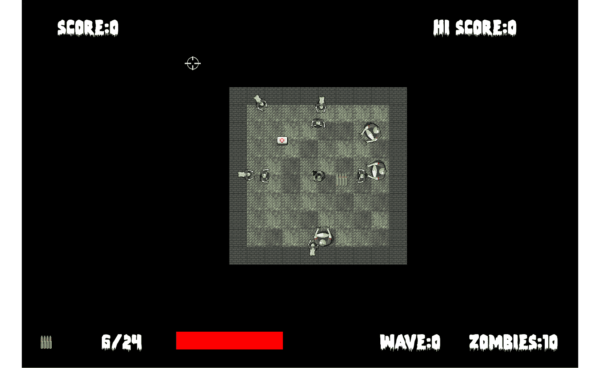
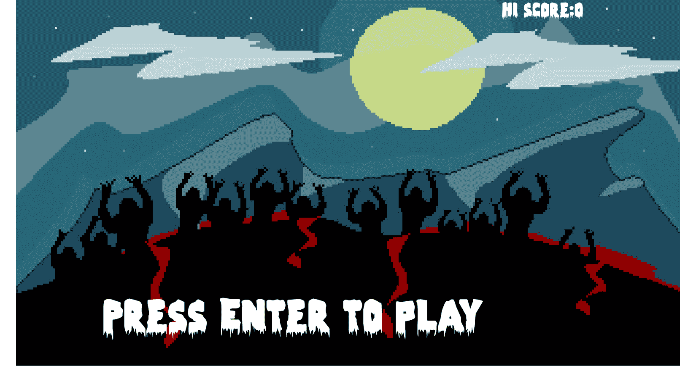
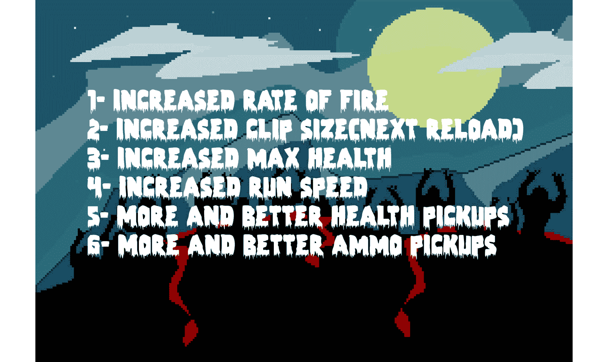
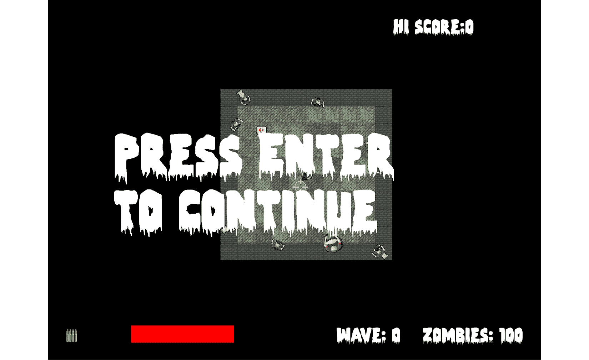
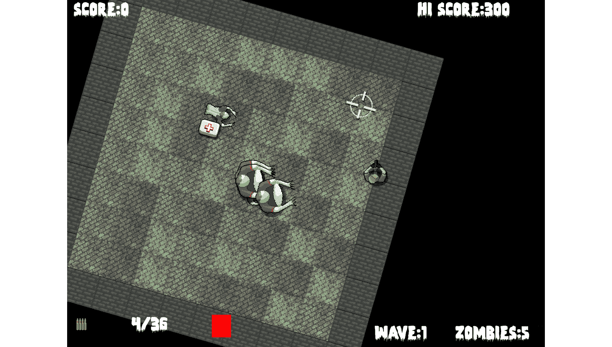

# 第十三章：*第十二章*：分层视图和实现 HUD

在本章中，我们将看到 SFML 视图的真正价值。我们将添加一大堆 SFML `Text`对象，并像在 Timber!!!项目和 Pong 项目中之前做的那样操作它们。新的地方在于，我们将使用第二个视图实例来绘制 HUD。这样，HUD 将整齐地定位在主游戏动作的顶部，无论背景、玩家、僵尸和其他游戏对象在做什么。

在本章中，我们将做以下事情：

+   为主/游戏结束屏幕添加文本和背景

+   为等级提升屏幕添加文本

+   创建第二个视图

+   添加一个 HUD

# 添加所有文本和 HUD 对象

在本章中，我们将操作一些字符串。我们这样做是为了用必要的文本格式化 HUD 和等级提升屏幕。

在以下代码中添加额外的`include`指令，以便我们可以创建一些`sstream`对象来实现这一点：

```cpp
#include <sstream>
#include <SFML/Graphics.hpp>
#include "ZombieArena.h"
#include "Player.h"
#include "TextureHolder.h"
#include "Bullet.h"
#include "Pickup.h"
using namespace sf;
```

接下来，添加这段相当长但容易解释的代码。为了帮助识别你应该在哪里添加代码，新的代码被突出显示，而现有的代码没有被突出显示：

```cpp
int score = 0;
int hiScore = 0;
// For the home/game over screen
Sprite spriteGameOver;
Texture textureGameOver = TextureHolder::GetTexture("graphics/background.png");
spriteGameOver.setTexture(textureGameOver);
spriteGameOver.setPosition(0, 0);
// Create a view for the HUD
View hudView(sf::FloatRect(0, 0, resolution.x, resolution.y));
// Create a sprite for the ammo icon
Sprite spriteAmmoIcon;
Texture textureAmmoIcon = TextureHolder::GetTexture(
           "graphics/ammo_icon.png");
spriteAmmoIcon.setTexture(textureAmmoIcon);
spriteAmmoIcon.setPosition(20, 980);
// Load the font
Font font;
font.loadFromFile("fonts/zombiecontrol.ttf");
// Paused
Text pausedText;
pausedText.setFont(font);
pausedText.setCharacterSize(155);
pausedText.setFillColor(Color::White);
pausedText.setPosition(400, 400);
pausedText.setString("Press Enter \nto continue");
// Game Over
Text gameOverText;
gameOverText.setFont(font);
gameOverText.setCharacterSize(125);
gameOverText.setFillColor(Color::White);
gameOverText.setPosition(250, 850);
gameOverText.setString("Press Enter to play");
// LEVELING up
Text levelUpText;
levelUpText.setFont(font);
levelUpText.setCharacterSize(80);
levelUpText.setFillColor(Color::White);
levelUpText.setPosition(150, 250);
std::stringstream levelUpStream;
levelUpStream <<
    "1- Increased rate of fire" <<
    "\n2- Increased clip size(next reload)" <<
    "\n3- Increased max health" <<
    "\n4- Increased run speed" <<
    "\n5- More and better health pickups" <<
    "\n6- More and better ammo pickups";
levelUpText.setString(levelUpStream.str());
// Ammo
Text ammoText;
ammoText.setFont(font);
ammoText.setCharacterSize(55);
ammoText.setFillColor(Color::White);
ammoText.setPosition(200, 980);
// Score
Text scoreText;
scoreText.setFont(font);
scoreText.setCharacterSize(55);
scoreText.setFillColor(Color::White);
scoreText.setPosition(20, 0);
// Hi Score
Text hiScoreText;
hiScoreText.setFont(font);
hiScoreText.setCharacterSize(55);
hiScoreText.setFillColor(Color::White);
hiScoreText.setPosition(1400, 0);
std::stringstream s;
s << "Hi Score:" << hiScore;
hiScoreText.setString(s.str());
// Zombies remaining
Text zombiesRemainingText;
zombiesRemainingText.setFont(font);
zombiesRemainingText.setCharacterSize(55);
zombiesRemainingText.setFillColor(Color::White);
zombiesRemainingText.setPosition(1500, 980);
zombiesRemainingText.setString("Zombies: 100");
// Wave number
int wave = 0;
Text waveNumberText;
waveNumberText.setFont(font);
waveNumberText.setCharacterSize(55);
waveNumberText.setFillColor(Color::White);
waveNumberText.setPosition(1250, 980);
waveNumberText.setString("Wave: 0");
// Health bar
RectangleShape healthBar;
healthBar.setFillColor(Color::Red);
healthBar.setPosition(450, 980);
// The main game loop
while (window.isOpen())
```

之前的代码非常简单，没有什么新意。它基本上创建了一大堆 SFML `Text`对象。它为它们分配颜色和大小，然后使用我们之前见过的函数来格式化它们的位置。

最重要的是要注意，我们创建了一个名为`hudView`的另一个`View`对象，并将其初始化以适应屏幕分辨率。

正如我们所见，主要的`View`对象会随着玩家的移动而滚动。相比之下，我们永远不会移动`hudView`。结果是，如果我们在我们绘制 HUD 元素之前切换到这个视图，我们将产生一种效果，即允许游戏世界在玩家 HUD 保持静止的情况下在其下方滚动。

小贴士

作为类比，你可以想象在电视屏幕上放置一张带有文字的透明塑料薄片。电视会继续播放移动的画面，而塑料薄片上的文字将保持在同一位置，无论下面发生什么。在下一个项目中，我们将进一步扩展这个概念，当时我们将分割屏幕并分离游戏世界的移动视图。

然而，接下来要注意的是，高分并没有以任何有意义的方式设置。我们需要等到下一章，当我们研究文件 I/O 时，才能保存和检索高分。

另一个值得注意的点是，我们声明并初始化了一个名为`healthBar`的`RectangleShape`，它将表示玩家剩余的生命值。这几乎与 Timber!!!项目中的时间条以相同的方式工作，除了它将代表生命值而不是时间。

在之前的代码中，有一个新的`Sprite`实例称为`ammoIcon`，它为我们将要绘制在屏幕左下角的子弹和弹夹统计信息提供了上下文。

虽然我们添加的大量代码没有新的或技术性的内容，但请务必熟悉细节——特别是变量名称——以便使本章的其余部分更容易理解。

# 更新 HUD

如您所预期的那样，我们将在代码的更新部分更新 HUD 变量。然而，我们不会在每一帧都这样做。这样做的原因是不必要的，而且还会减慢我们的游戏循环。

例如，考虑玩家杀死僵尸并获得更多分数的场景。无论包含分数的`Text`对象是在千分之一、百分之一甚至十分之一秒内更新，玩家都不会察觉到任何区别。这意味着没有必要在每一帧重建我们为`Text`对象设置的字符串。

因此，我们可以记录何时以及多久更新一次 HUD。添加以下高亮变量：

```cpp
// Debug HUD
Text debugText;
debugText.setFont(font);
debugText.setCharacterSize(25);
debugText.setFillColor(Color::White);
debugText.setPosition(20, 220);
std::ostringstream ss;
// When did we last update the HUD?
int framesSinceLastHUDUpdate = 0;
// How often (in frames) should we update the HUD
int fpsMeasurementFrameInterval = 1000;
// The main game loop
while (window.isOpen())
```

在前面的代码中，我们有变量来跟踪自上次更新 HUD 以来经过的帧数，以及我们希望在 HUD 更新之间等待的帧间隔。

现在，我们可以使用这些新变量并在每一帧更新 HUD。然而，直到我们在下一章开始操作最终变量，例如`wave`，我们才不会看到所有 HUD 元素的变化。

在游戏循环的更新部分添加以下高亮代码，如下所示：

```cpp
    // Has the player touched ammo pickup
    if (player.getPosition().intersects
        (ammoPickup.getPosition()) && ammoPickup.isSpawned())
    {
        bulletsSpare += ammoPickup.gotIt();

    }
    // size up the health bar
    healthBar.setSize(Vector2f(player.getHealth() * 3, 50));
    // Increment the number of frames since the previous update
    framesSinceLastHUDUpdate++;
    // re-calculate every fpsMeasurementFrameInterval frames
    if (framesSinceLastHUDUpdate > fpsMeasurementFrameInterval)
    {
        // Update game HUD text
        std::stringstream ssAmmo;
        std::stringstream ssScore;
        std::stringstream ssHiScore;
        std::stringstream ssWave;
        std::stringstream ssZombiesAlive;
        // Update the ammo text
        ssAmmo << bulletsInClip << "/" << bulletsSpare;
        ammoText.setString(ssAmmo.str());
        // Update the score text
        ssScore << "Score:" << score;
        scoreText.setString(ssScore.str());
        // Update the high score text
        ssHiScore << "Hi Score:" << hiScore;
        hiScoreText.setString(ssHiScore.str());
        // Update the wave
        ssWave << "Wave:" << wave;
        waveNumberText.setString(ssWave.str());
        // Update the high score text
        ssZombiesAlive << "Zombies:" << numZombiesAlive;
        zombiesRemainingText.setString(ssZombiesAlive.str());
        framesSinceLastHUDUpdate = 0;
    }// End HUD update
}// End updating the scene
```

在新代码中，我们更新了`healthBar`精灵的大小，然后增加`framesSinceLastHUDUpdate`变量。

接下来，我们开始一个`if`块，测试`framesSinceLastHUDUpdate`是否大于我们存储在`fpsMeasurementFrameInterval`中的首选间隔。

在这个`if`块内部发生所有操作。首先，我们为需要设置到`Text`对象的每个字符串声明一个`stringstream`对象。

然后，我们依次使用这些`stringstream`对象，并使用`setString`函数将结果设置到适当的`Text`对象中。

最后，在退出`if`块之前，将`framesSinceLastHUDUpdate`重置为零，以便计数可以重新开始。

现在，当我们重新绘制场景时，新的值将出现在玩家的 HUD 中。

# 绘制 HUD、主界面和升级屏幕

以下三个代码块中的所有代码都放在我们的游戏循环的绘制阶段。我们所需做的只是在主游戏循环的绘制部分绘制适当的`Text`对象。

在`PLAYING`状态中，添加以下高亮代码：

```cpp
    //Draw the crosshair
    window.draw(spriteCrosshair);
    // Switch to the HUD view
    window.setView(hudView);
    // Draw all the HUD elements
    window.draw(spriteAmmoIcon);
    window.draw(ammoText);
    window.draw(scoreText);
    window.draw(hiScoreText);
    window.draw(healthBar);
    window.draw(waveNumberText);
    window.draw(zombiesRemainingText);
}
if (state == State::LEVELING_UP)
{
}
```

在前面的代码块中需要注意的重要一点是我们切换到 HUD 视图。这导致所有元素都绘制在我们在每个 HUD 元素中给出的精确屏幕位置。它们永远不会移动。

在`LEVELING_UP`状态中，添加以下高亮代码：

```cpp
if (state == State::LEVELING_UP)
{
    window.draw(spriteGameOver);
    window.draw(levelUpText);
}
```

在`PAUSED`状态中，添加以下高亮代码：

```cpp
if (state == State::PAUSED)
{
    window.draw(pausedText);
}
```

在`GAME_OVER`状态中，添加以下高亮代码：

```cpp
if (state == State::GAME_OVER)
{
    window.draw(spriteGameOver);
    window.draw(gameOverText);
    window.draw(scoreText);
    window.draw(hiScoreText);
}
```

现在，我们可以运行游戏并看到我们的 HUD 在游戏过程中更新：



以下截图显示了主/游戏结束屏幕上的高分和得分：



接下来，我们看到文本告诉玩家他们的升级选项是什么，尽管这些选项目前还没有任何作用：



这里，我们可以看到暂停屏幕上的一个有用的消息：



小贴士

SFML 的`View`类比这个简单的 HUD 展示的功能更强大。要了解 SFML `View`类的潜力以及它们的使用有多简单，请查看 SFML 网站上的`View`教程，链接为[`www.sfml-dev.org/tutorials/2.5/graphics-view.php`](https://www.sfml-dev.org/tutorials/2.5/graphics-view.php)。

# 摘要

这是一章快速而简单的章节。我们学习了如何使用`sstream`显示不同类型变量所持有的值，然后学习了如何使用第二个 SFML `View`对象在主游戏动作上方绘制它们。

现在僵尸竞技场几乎完成了。本章中所有的截图都显示了一个小竞技场，没有充分利用整个显示器。

在下一章，也就是这个项目的最后一章，我们将添加一些收尾工作，比如升级、音效和保存高分。竞技场的大小可以扩展到与显示器相同，甚至更大。

# 常见问题解答

这里有一个可能出现在你脑海中的问题：

Q) 我在哪里可以看到`View`类更多实际应用的力量？

A) 在下载包中查看《僵尸竞技场》游戏的增强版。您可以使用光标键盘键来旋转和缩放游戏。警告！旋转场景会使控制变得笨拙，但您可以看到使用`View`类可以完成的一些事情：



缩放和旋转功能仅通过在主游戏循环的输入处理部分编写几行代码就实现了。您可以在下载包的`Zombie Arena Enhanced Version`文件夹中查看代码，或者从`Runnable Games/Zombie Arena`文件夹中运行增强版。
