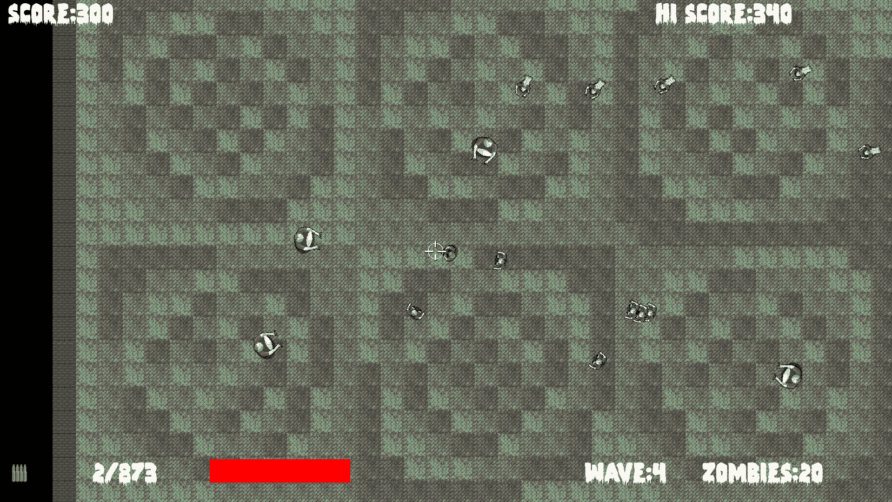

# *第十三章*：音效、文件 I/O 和完成游戏

我们即将完成。这一简短的章节将展示我们如何使用 C++ 标准库轻松地操作硬盘上存储的文件，我们还将添加音效。当然，我们知道如何添加音效，但我们将讨论代码中 `play` 函数调用的确切位置。我们还将解决一些悬而未决的问题，以使游戏完整。

在本章中，我们将涵盖以下主题：

+   使用文件输入和文件输出保存和加载最高分

+   添加音效

+   允许玩家升级

+   创建多个永无止境的波次

# 保存和加载最高分

文件 `fstream`。

首先，我们以与包含 `sstream` 相同的方式包含 `fstream`：

```cpp
#include <sstream>
#include <fstream>
#include <SFML/Graphics.hpp>
#include "ZombieArena.h"
#include "Player.h"
#include "TextureHolder.h"
#include "Bullet.h"
#include "Pickup.h"
using namespace sf;
```

现在，在 `ZombieArena` 文件夹中添加一个新的文件夹，命名为 `gamedata`。然后，在此文件夹中右键单击并创建一个名为 `scores.txt` 的新文件。我们将在这个文件中保存玩家的最高分。你可以轻松地打开文件并添加分数。如果你这样做，请确保分数相当低，这样我们就可以轻松地测试击败这个分数是否会添加新的分数。完成操作后，务必关闭文件，否则游戏将无法访问它。

在下面的代码中，我们将创建一个名为 `inputFile` 的 `ifstream` 对象，并将我们刚刚创建的文件夹和文件作为参数传递给其构造函数。

`if(inputFile.is_open())` 检查文件是否存在且准备好读取。然后我们将文件内容放入 `hiScore` 并关闭文件。添加以下突出显示的代码：

```cpp
// Score
Text scoreText;
scoreText.setFont(font);
scoreText.setCharacterSize(55);
scoreText.setColor(Color::White);
scoreText.setPosition(20, 0);
// Load the high score from a text file
std::ifstream inputFile("gamedata/scores.txt");
if (inputFile.is_open())
{
    // >> Reads the data
    inputFile >> hiScore;
    inputFile.close();
}
// Hi Score
Text hiScoreText;
hiScoreText.setFont(font);
hiScoreText.setCharacterSize(55);
hiScoreText.setColor(Color::White);
hiScoreText.setPosition(1400, 0);
std::stringstream s;
s << "Hi Score:" << hiScore;
hiScoreText.setString(s.str());
```

现在，我们可以处理保存可能的新最高分。在处理玩家健康值小于或等于零的代码块中，我们需要创建一个名为 `outputFile` 的 `ofstream` 对象，将 `hiScore` 的值写入文本文件，然后关闭文件，如下所示：

```cpp
// Have any zombies touched the player            
for (int i = 0; i < numZombies; i++)
{
    if (player.getPosition().intersects
        (zombies[i].getPosition()) && zombies[i].isAlive())
    {
        if (player.hit(gameTimeTotal))
        {
            // More here later
        }
        if (player.getHealth() <= 0)
        {
            state = State::GAME_OVER;
            std::ofstream outputFile("gamedata/scores.txt");
            // << writes the data
            outputFile << hiScore;
            outputFile.close();

        }
    }
}// End player touched
```

你可以玩游戏，你的最高分将被保存。退出游戏后，如果你再次玩游戏，会发现你的最高分仍然在那里。

让我们制造一些噪音。

# 准备音效

在本节中，我们将创建所有需要的 `SoundBuffer` 和 `Sound` 对象，以便为游戏添加一系列音效。

首先，添加所需的 SFML `#include` 语句：

```cpp
#include <sstream>
#include <fstream>
#include <SFML/Graphics.hpp>
#include <SFML/Audio.hpp>
#include "ZombieArena.h"
#include "Player.h"
#include "TextureHolder.h"
#include "Bullet.h"
#include "Pickup.h"
```

现在，继续添加七个 `SoundBuffer` 和 `Sound` 对象，这些对象将加载和准备我们在 *第八章**，SFML 视图 – 开始僵尸射击游戏* 中准备的七个音效文件：

```cpp
// When did we last update the HUD?
int framesSinceLastHUDUpdate = 0;
// What time was the last update
Time timeSinceLastUpdate;
// How often (in frames) should we update the HUD
int fpsMeasurementFrameInterval = 1000;
// Prepare the hit sound
SoundBuffer hitBuffer;
hitBuffer.loadFromFile("sound/hit.wav");
Sound hit;
hit.setBuffer(hitBuffer);
// Prepare the splat sound
SoundBuffer splatBuffer;
splatBuffer.loadFromFile("sound/splat.wav");
Sound splat;
splat.setBuffer(splatBuffer);
// Prepare the shoot sound
SoundBuffer shootBuffer;
shootBuffer.loadFromFile("sound/shoot.wav");
Sound shoot;
shoot.setBuffer(shootBuffer);
// Prepare the reload sound
SoundBuffer reloadBuffer;
reloadBuffer.loadFromFile("sound/reload.wav");
Sound reload;
reload.setBuffer(reloadBuffer);
// Prepare the failed sound
SoundBuffer reloadFailedBuffer;
reloadFailedBuffer.loadFromFile("sound/reload_failed.wav");
Sound reloadFailed;
reloadFailed.setBuffer(reloadFailedBuffer);
// Prepare the powerup sound
SoundBuffer powerupBuffer;
powerupBuffer.loadFromFile("sound/powerup.wav");
Sound powerup;
powerup.setBuffer(powerupBuffer);
// Prepare the pickup sound
SoundBuffer pickupBuffer;
pickupBuffer.loadFromFile("sound/pickup.wav");
Sound pickup;
pickup.setBuffer(pickupBuffer);
// The main game loop
while (window.isOpen())
```

现在，七个音效已经准备好播放。我们只需要确定代码中每个 `play` 函数调用的确切位置。

# 升级

我们将要添加的代码允许玩家在波次之间升级。正是因为我们已经完成的工作，所以这很容易实现。

将以下突出显示的代码添加到处理玩家输入的 `LEVELING_UP` 状态中：

```cpp
// Handle the LEVELING up state
if (state == State::LEVELING_UP)
{
    // Handle the player LEVELING up
    if (event.key.code == Keyboard::Num1)
    {
        // Increase fire rate
        fireRate++;
        state = State::PLAYING;
    }
    if (event.key.code == Keyboard::Num2)
    {
        // Increase clip size
        clipSize += clipSize;
        state = State::PLAYING;
    }
    if (event.key.code == Keyboard::Num3)
    {
        // Increase health
        player.upgradeHealth();
        state = State::PLAYING;
    }
    if (event.key.code == Keyboard::Num4)
    {
        // Increase speed
        player.upgradeSpeed();
        state = State::PLAYING;
    }
    if (event.key.code == Keyboard::Num5)
    {
        // Upgrade pickup
        healthPickup.upgrade();
        state = State::PLAYING;
    }
    if (event.key.code == Keyboard::Num6)
    {
        // Upgrade pickup
        ammoPickup.upgrade();
        state = State::PLAYING;
    }
    if (state == State::PLAYING)
    {
```

每当玩家清空一波僵尸时，他们都可以升级。然而，我们目前还不能增加僵尸的数量或升级的大小。

在我们刚刚添加的代码之后，在`LEVELING_UP`状态的下一部分，修改当状态从`LEVELING_UP`变为`PLAYING`时运行的代码。

这里是完整的代码。我已经突出显示了新添加或略有修改的行。

添加或修改以下突出显示的代码：

```cpp
    if (event.key.code == Keyboard::Num6)
    {
        ammoPickup.upgrade();
        state = State::PLAYING;
    }
    if (state == State::PLAYING)
    {
        // Increase the wave number
        wave++;
        // Prepare the level
        // We will modify the next two lines later
        arena.width = 500 * wave;
        arena.height = 500 * wave;
        arena.left = 0;
        arena.top = 0;
        // Pass the vertex array by reference 
        // to the createBackground function
        int tileSize = createBackground(background, arena);
        // Spawn the player in the middle of the arena
        player.spawn(arena, resolution, tileSize);
        // Configure the pick-ups
        healthPickup.setArena(arena);
        ammoPickup.setArena(arena);
        // Create a horde of zombies
        numZombies = 5 * wave;
        // Delete the previously allocated memory (if it exists)
        delete[] zombies;
        zombies = createHorde(numZombies, arena);
        numZombiesAlive = numZombies;
        // Play the powerup sound
        powerup.play();
        // Reset the clock so there isn't a frame jump
        clock.restart();
    }
}// End LEVELING up
```

之前的代码首先增加`wave`变量。然后，代码被修改以使僵尸的数量和竞技场的大小与`wave`的新值成比例。最后，我们添加对`powerup.play()`的调用以播放升级音效。

# 重新开始游戏

我们已经通过`wave`变量的值确定了竞技场的大小和僵尸的数量。我们还必须重置弹药和枪相关的变量，以及在每场新游戏开始时将`wave`和`score`设置为零。在游戏循环的事件处理部分找到以下代码，并添加以下突出显示的代码：

```cpp
// Start a new game while in GAME_OVER state
else if (event.key.code == Keyboard::Return &&
    state == State::GAME_OVER)
{
    state = State::LEVELING_UP;
    wave = 0;
    score = 0;
    // Prepare the gun and ammo for next game
    currentBullet = 0;
    bulletsSpare = 24;
    bulletsInClip = 6;
    clipSize = 6;
    fireRate = 1;
    // Reset the player's stats
    player.resetPlayerStats();
}
```

现在，我们可以玩游戏了，玩家可以变得更加强大，僵尸将在不断扩大的竞技场中越来越多——直到它们死亡。然后，游戏重新开始。

# 播放其余的声音

现在，我们将把其余的调用添加到`play`函数中。我们将逐个处理它们，因为精确地确定它们的位置对于在正确的时间播放它们至关重要。

## 在玩家装弹时添加音效

在以下三个地方添加以下突出显示的代码，以便在玩家按下*R*键尝试装弹时播放适当的`reload`或`reloadFailed`声音：

```cpp
if (state == State::PLAYING)
{
    // Reloading
    if (event.key.code == Keyboard::R)
    {
        if (bulletsSpare >= clipSize)
        {
            // Plenty of bullets. Reload.
            bulletsInClip = clipSize;
            bulletsSpare -= clipSize;        
            reload.play();
        }
        else if (bulletsSpare > 0)
        {
            // Only few bullets left
            bulletsInClip = bulletsSpare;
            bulletsSpare = 0;                
            reload.play();
        }
        else
        {
            // More here soon?!
            reloadFailed.play();
        }
    }
}
```

现在当玩家装弹或尝试装弹时，他们会得到一个可听见的响应。让我们继续播放射击声音。

## 制作射击声音

在处理玩家点击左鼠标按钮的代码的末尾添加以下突出显示的`shoot.play()`调用：

```cpp
// Fire a bullet
if (sf::Mouse::isButtonPressed(sf::Mouse::Left))
{
    if (gameTimeTotal.asMilliseconds()
        - lastPressed.asMilliseconds()
        > 1000 / fireRate && bulletsInClip > 0)
    {
        // Pass the centre of the player and crosshair
        // to the shoot function
        bullets[currentBullet].shoot(
            player.getCenter().x, player.getCenter().y,
            mouseWorldPosition.x, mouseWorldPosition.y);
        currentBullet++;
        if (currentBullet > 99)
        {
            currentBullet = 0;
        }
        lastPressed = gameTimeTotal;
        shoot.play();
        bulletsInClip--;
    }
}// End fire a bullet
```

游戏现在将播放令人满意的射击声音。接下来，我们将播放玩家被僵尸击中的声音。

## 当玩家被击中时播放声音

在以下代码中，我们将`hit.play`调用包裹在一个测试中，以查看`player.hit`函数是否返回 true。请记住，`player.hit`函数检查前 100 毫秒内是否有击中记录。这将产生快速重复的咚咚声，但不会快到声音模糊成一个噪音。

添加以下代码中突出显示的`hit.play`调用：

```cpp
// Have any zombies touched the player            
for (int i = 0; i < numZombies; i++)
{
    if (player.getPosition().intersects
        (zombies[i].getPosition()) && zombies[i].isAlive())
    {
        if (player.hit(gameTimeTotal))
        {
            // More here later
            hit.play();
        }
        if (player.getHealth() <= 0)
        {
            state = State::GAME_OVER;
            std::ofstream OutputFile("gamedata/scores.txt");
            OutputFile << hiScore;
            OutputFile.close();

        }
    }
}// End player touched
```

当僵尸接触到玩家时，玩家会听到一个不祥的咚咚声，如果僵尸继续接触玩家，这个声音每秒会重复大约五次。这个逻辑包含在`Player`类的`hit`函数中。

## 在拾取物品时播放声音

当玩家拾取生命恢复物品时，我们将播放常规拾取声音。然而，当玩家拾取弹药时，我们将播放装弹声音效。

在适当的碰撞检测代码中添加播放声音的两个调用：

```cpp
// Has the player touched health pickup
if (player.getPosition().intersects
    (healthPickup.getPosition()) && healthPickup.isSpawned())
{
    player.increaseHealthLevel(healthPickup.gotIt());
    // Play a sound
    pickup.play();

}
// Has the player touched ammo pickup
if (player.getPosition().intersects
    (ammoPickup.getPosition()) && ammoPickup.isSpawned())
{
    bulletsSpare += ammoPickup.gotIt();
    // Play a sound
    reload.play();

}
```

## 当僵尸被击中时发出噗嗤声

在检测子弹与僵尸碰撞的代码段末尾添加对 `splat.play` 的调用：

```cpp
// Have any zombies been shot?
for (int i = 0; i < 100; i++)
{
    for (int j = 0; j < numZombies; j++)
    {
        if (bullets[i].isInFlight() && 
            zombies[j].isAlive())
        {
            if (bullets[i].getPosition().intersects
                (zombies[j].getPosition()))
            {
                // Stop the bullet
                bullets[i].stop();
                // Register the hit and see if it was a kill
                if (zombies[j].hit()) {
                    // Not just a hit but a kill too
                    score += 10;
                    if (score >= hiScore)
                    {
                        hiScore = score;
                    }
                    numZombiesAlive--;
                    // When all the zombies are dead (again)
                    if (numZombiesAlive == 0) {
                        state = State::LEVELING_UP;
                    }
                }    
                // Make a splat sound
                splat.play();

            }
        }
    }
}// End zombie being shot
```

你现在可以播放完成的游戏，并观察每一波僵尸和竞技场数量的增加。仔细选择你的等级提升：



恭喜！

# 摘要

我们已经完成了僵尸竞技场游戏。这是一段相当漫长的旅程。我们学习了许多 C++ 基础知识，例如引用、指针、面向对象编程和类。此外，我们还使用了 SFML 来管理摄像机（视图）、顶点数组和碰撞检测。我们学习了如何使用精灵图来减少对 `window.draw` 的调用次数并提高帧率。使用 C++ 指针、STL 和一点面向对象编程，我们构建了一个单例类来管理我们的纹理。在下一个项目中，我们将扩展这个想法来管理我们游戏的所有资产。

在本书的倒数第二个项目中，我们将发现粒子效果、方向性声音和分屏合作游戏。在 C++ 中，我们将遇到继承、多态以及一些新的概念。

# 常见问题解答

这里有一些可能出现在你脑海中的问题：

Q) 尽管使用了类，但我发现代码变得越来越长且难以管理。

A) 最大的问题之一是我们代码的结构。随着我们学习更多的 C++，我们也会学习如何使代码更易于管理，并且通常更短。我们将在下一个项目和最终项目中这样做。到本书结束时，你将了解一些你可以用来管理你代码的策略。

Q) 声音效果听起来有点平淡和不真实。如何改进它们？

A) 一种显著提高玩家从声音中获得的感觉的方法是使声音具有方向性，并根据声音源与玩家角色的距离改变音量。我们将在下一个项目中使用 SFML 的高级声音功能。
