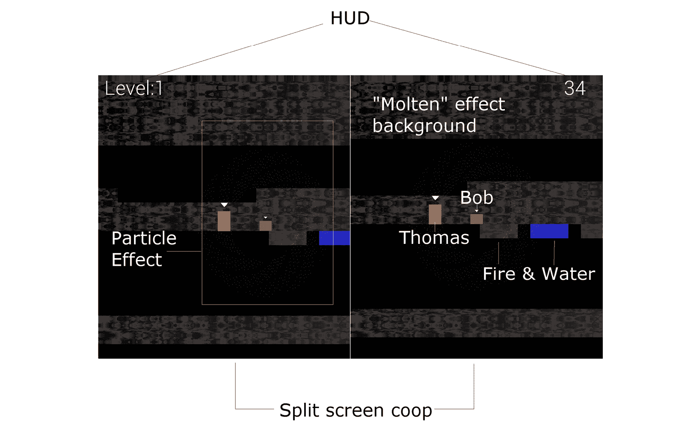
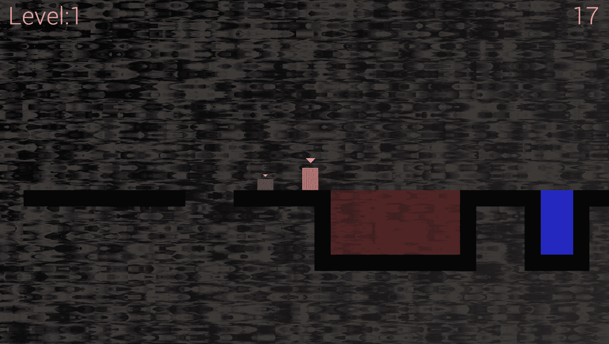
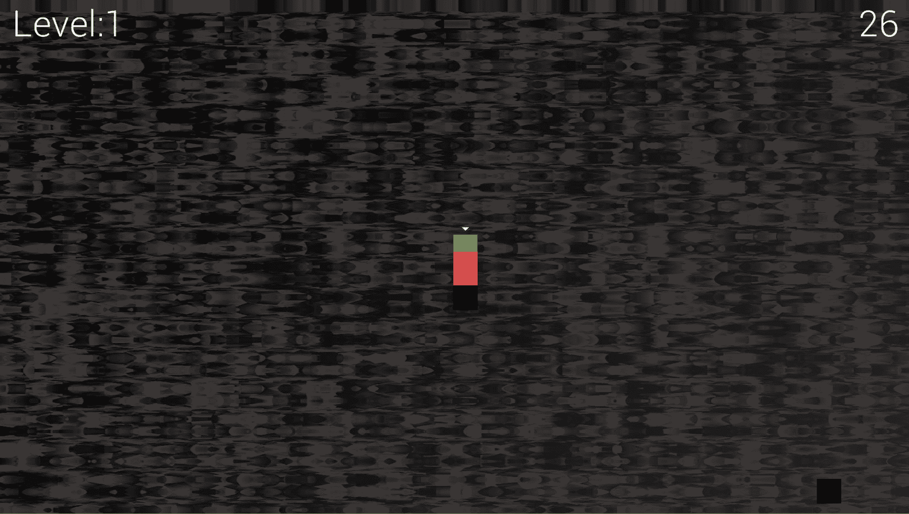
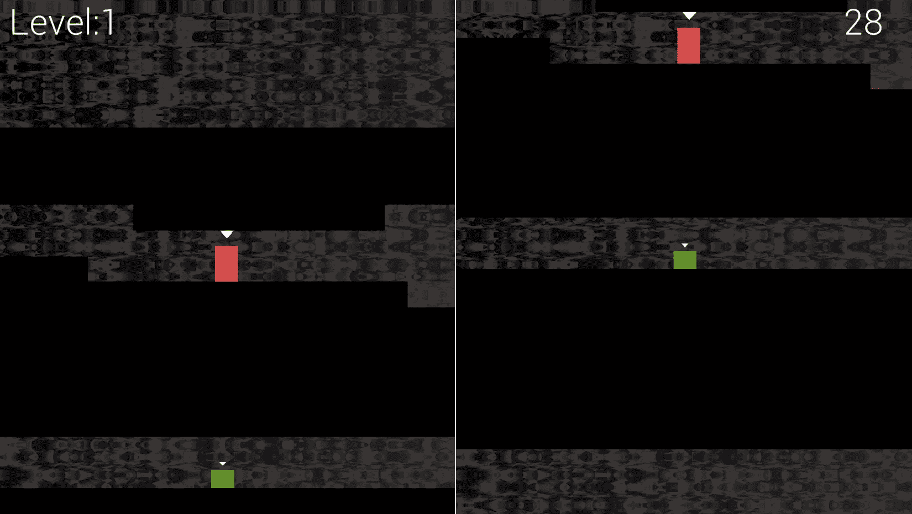
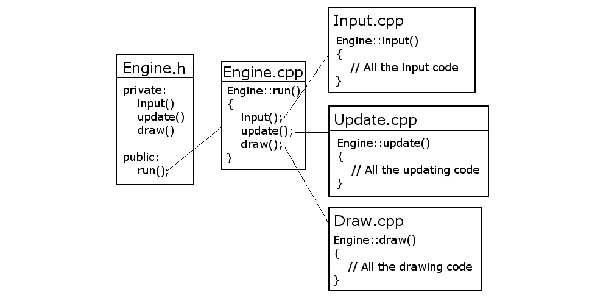
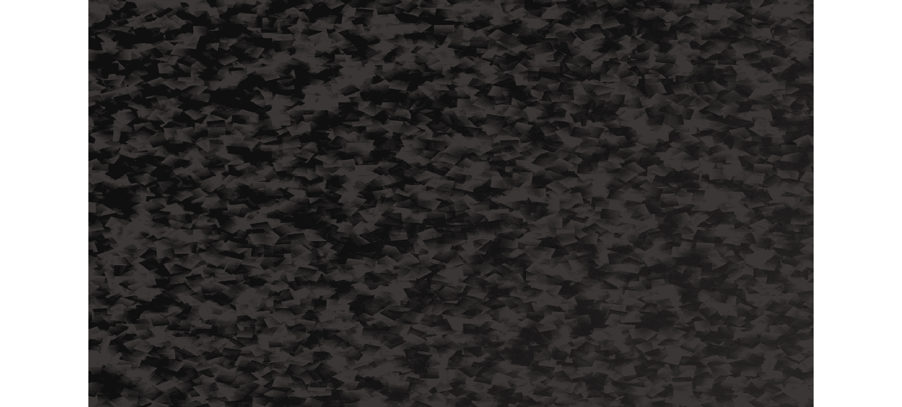
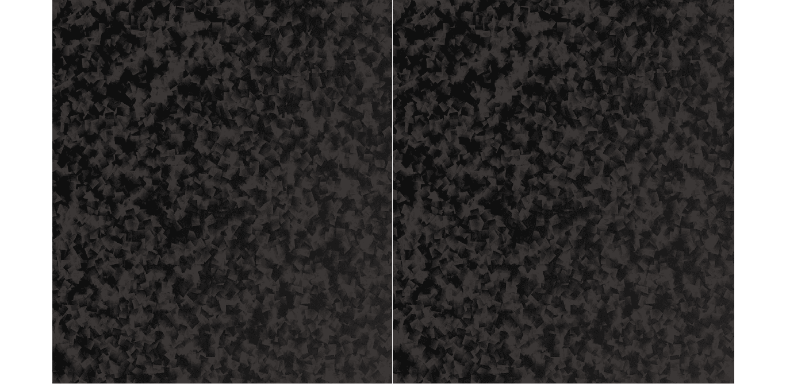

# 第十五章：*第十四章*：抽象和代码管理 – 更好地利用面向对象编程

在本章中，我们将首次查看本书的最后一项项目。我们将构建的项目将使用诸如方向性声音等高级功能，这些声音似乎与玩家的位置相关。它还将具有分屏合作游戏。此外，该项目还将引入**着色器**的概念，这些着色器是用另一种语言编写的程序，可以直接在图形卡上运行。到*第十八章*，“粒子系统和着色器”结束时，你将拥有一个完全功能的多玩家平台游戏，其风格模仿了热门经典游戏*托马斯·瓦瑟德*。

本章的重点将是启动项目并探讨如何构建代码以更好地利用面向对象编程。以下是本章将涵盖的主题细节：

+   介绍最终项目，**托马斯·瓦瑟德迟到**，包括游戏玩法功能和项目资源

+   与之前项目相比，我们将如何改进代码结构的详细讨论

+   编写托马斯·瓦瑟德迟到游戏引擎的代码

+   实现分屏功能

# 托马斯·瓦瑟德迟到游戏

小贴士

在这一点上，如果你还没有的话，我建议你去看一下托马斯·瓦瑟德独自一人的视频，[`store.steampowered.com/app/220780/`](http://store.steampowered.com/app/220780/)。

注意到简单但美观的图形。视频还展示了各种游戏挑战，例如使用角色的不同属性（高度、跳跃、力量等）。为了保持我们的游戏简单而不失去挑战性，我们将比托马斯·瓦瑟德更少的谜题功能，但将增加需要两名玩家合作游戏的额外挑战。为了确保游戏不会太简单，我们还将让玩家必须赶时间打败时钟，这就是为什么我们的游戏名字叫托马斯·瓦瑟德迟到。

## 托马斯·瓦瑟德迟到游戏的特点

我们的游戏将不会像我们试图模仿的杰作那样先进，但它将拥有丰富的令人兴奋的游戏玩法特点，例如以下内容：

+   一个从适合该级别挑战的时间开始倒计时的时钟。

+   火坑会根据玩家的位置发出咆哮声，如果玩家掉入其中，则会在起点重生。水坑有相同的效果，但没有方向性音效。

+   合作游戏。两名玩家必须在规定时间内将他们的角色带到终点。他们需要经常合作，因为跳得较矮、跳跃能力较低的鲍勃需要站在他的朋友（托马斯）的头上。

+   玩家可以选择在全屏和分屏之间切换，以便他们可以自己尝试控制两个角色。

+   每个关卡都将设计并从文本文件中加载。这将使得设计多样化和大量的关卡变得容易。

看一下以下注释的截图，看看游戏中的某些功能是如何运作的，以及构成游戏的游戏组件/资产：



让我们来看看这些功能中的每一个，并描述一些更多：

+   前面的截图显示了一个简单的 HUD，其中详细说明了关卡编号以及玩家（们）失败并必须重新开始关卡之前剩余的秒数。

+   你还可以清楚地看到分屏合作模式的效果。记住，这是可选的。单个玩家可以全屏玩游戏，同时切换摄像头焦点在托马斯和鲍勃之间。

+   在前面的截图（尤其是在印刷品中）中并不非常清晰，但当角色死亡时，它们将以星爆/烟花般的粒子效果爆炸。

+   水和火砖可以被战略性地放置，使关卡有趣，同时也迫使角色之间进行合作。关于这一点，将在*第十六章*中详细说明，*构建可玩关卡和碰撞检测*。

+   接下来，注意托马斯和鲍勃。他们不仅身高不同，而且跳跃能力差异很大。这意味着鲍勃在跳跃时依赖于托马斯，关卡可以设计成迫使托马斯走一条特定的路线以避免他“撞头”。

+   此外，火砖会发出咆哮声。这些声音将与托马斯的位置相关。它们不仅会根据方向从左或右扬声器发出，而且当托马斯靠近或远离声音源时，声音也会变得更大或更小。

+   最后，在前面的注释截图中，你可以看到背景。为什么不比较一下它与`background.png`文件（本章后面将展示）的外观？你会发现它们相当不同。我们将在*第十八章*中，*粒子系统和着色器*，使用 OpenGL 着色器效果来实现背景中移动的、几乎像冒泡的效果。

所有这些功能都值得展示更多截图，这样我们可以在编写 C++代码时记住最终产品。

下面的截图显示了托马斯和鲍勃到达一个火坑，鲍勃没有帮助就无法跳过去：



下面的截图显示了鲍勃和托马斯合作清除一个危险的跳跃：


下面的截图展示了我们如何设计需要“信仰跳跃”才能达到目标的谜题：



下面的截图展示了我们如何设计几乎任何大小的压抑洞穴系统。我们还可以设计鲍勃和托马斯被迫分开走不同路线的关卡：



## 创建项目

创建 Thomas Was Late 项目将遵循我们在前三个项目中使用的相同程序。由于创建项目是一个稍微有些繁琐的过程，所以我将再次详细说明所有步骤。对于更多细节和图片，请参考*第一章*中设置 Timber!!! 项目的步骤，*C++、SFML、Visual Studio 和开始第一个游戏*：

1.  启动 Visual Studio 并点击**创建新项目**按钮。如果你已经打开了另一个项目，你可以选择**文件** | **新建项目**。

1.  在随后显示的窗口中，选择**控制台应用程序**并点击**下一步**按钮。然后你会看到**配置你的新项目**窗口。

1.  在**项目名称**字段中的**TWL**。

1.  在`VS Projects`文件夹中。

1.  选择**将解决方案和项目放在同一目录下**的选项。

1.  完成这些步骤后，点击**创建**。

1.  我们现在将配置项目以使用我们放在`SFML`文件夹中的 SFML 文件。从主菜单中选择**项目** | **TWL 属性…**。在这个阶段，你应该已经打开了**TWL 属性页**窗口。

1.  在**TWL 属性页**窗口中，执行以下步骤。从**配置：**下拉菜单中选择**所有配置**。

1.  现在，从左侧菜单中选择**C/C++**然后**常规**。

1.  现在，定位到`\SFML\include`。如果你将`SFML`文件夹安装在 D 驱动器上，需要输入的完整路径是`D:\SFML\include`。如果你的 SFML 安装在不同的驱动器上，请相应地更改路径。

1.  点击**应用**以保存到目前为止的配置。

1.  现在，仍然在这个窗口中，执行以下步骤。从左侧菜单中选择**链接器**然后**常规**。

1.  现在，找到`SFML`文件夹的位置，然后是`\SFML\lib`。所以，如果你将`SFML`文件夹安装在 D 驱动器上，需要输入的完整路径是`D:\SFML\lib`。如果你的 SFML 安装在不同的驱动器上，请相应地更改路径。

1.  点击**应用**以保存到目前为止的配置。

1.  接下来，仍然在这个窗口中，执行以下步骤。将**配置：**下拉菜单切换到**调试**，因为我们将在调试模式下运行和测试 Pong。

1.  选择**链接器**然后**输入**。

1.  找到`sfml-graphics-d.lib;sfml-window-d.lib;sfml-system-d.lib;sfml-network-d.lib;sfml-audio-d.lib;`。请格外小心地将光标放在编辑框当前内容的起始位置，以免覆盖任何已经存在的文本。

1.  点击**确定**。

1.  点击**应用**然后**确定**。

那么项目属性已经配置好，准备就绪。现在，我们需要按照以下步骤将 SFML `.dll` 文件复制到主项目目录中：

1.  我的主要项目目录是`D:\VS Projects\TWL`。这个文件夹是在之前的步骤中由 Visual Studio 创建的。如果你将你的`Projects`文件夹放在其他地方，请在这里执行此步骤。我们需要复制到项目文件夹中的文件位于我们的`SFML\bin`文件夹中。为这两个位置打开一个窗口，并突出显示所有的`.dll`文件。

1.  现在，将高亮显示的文件复制并粘贴到项目中。

项目现在已经设置好，准备启动。

## 项目的资源

这个项目中的资源比 Zombie Arena 游戏更加众多和多样化。通常，资源包括屏幕上的文字字体、跳跃、达到目标或远处火的声音等不同动作的声音效果，以及当然，托马斯和鲍勃的图形以及所有背景瓦片的精灵图集。

游戏所需的全部资源都包含在下载包中。它们可以在`Chapter 14/graphics`和`Chapter 14/sound`文件夹中找到。

除了我们已知的图形、声音和字体之外，这个游戏还有两种新的资源类型。它们是关卡设计文件和 GLSL 着色器程序。让我们了解它们各自的详情。

### 游戏关卡设计

级别都是在一个文本文件中创建的。通过使用数字 0 到 3，我们可以构建挑战玩家的关卡设计。所有的关卡设计都在与其它资源相同的目录下的`levels`文件夹中。现在你可以随意查看其中一个，但我们将在第十八章*粒子系统和着色器*中详细探讨它们。

除了这些关卡设计资源之外，我们还有一种特殊的图形资源类型，称为**着色器**。

### GLSL 着色器

下载包中的`Chapter 14/shaders`文件夹。

### 图形资源概览

图形资源构成了我们游戏场景的各个部分。如果你查看图形资源，应该很清楚它们在我们游戏中将被用于何处：


如果`tiles_sheet`图形中的瓦片看起来与游戏截图略有不同，这是因为它们部分透明，背景透过会改变它们的样子。如果背景图形看起来与游戏截图中的实际背景完全不同，那是因为我们将编写的着色器程序将操纵每个像素，每一帧，以创建一种“熔化”效果。

### 声音资源概览

声音文件都是`.wav`格式。这些文件包含我们在游戏中的某些事件中播放的声音效果。它们如下所示：

+   `fallinfire.wav`：当玩家的头部进入火中且玩家没有逃脱机会时播放的声音。

+   `fallinwater.wav`：水有与火相同的效果：死亡。这个声音效果会通知玩家他们需要从关卡开始处重新开始。

+   `fire1.wav`：这个声音效果是单声道的。它将在玩家距离火瓦片的不同距离处播放不同音量的声音，并且根据玩家是否位于火瓦片的左侧或右侧，通过不同的扬声器播放。显然，我们需要学习更多技巧来实现这一功能。

+   `jump.wav`：当玩家跳跃时，一个令人愉悦（略带可预测性）的欢呼声。

+   `reachgoal.wav`：当玩家（们）将托马斯和鲍勃两个角色都带到目标方块时，发出的令人愉悦的胜利声音。

音效非常直接，你可以轻松地创建自己的。如果你打算替换`fire1.wav`文件，请确保以单声道（不是立体声）格式保存你的声音。原因将在*第十七章*中解释，*声音空间化和 HUD*。

### 将资源添加到项目中

一旦你决定使用哪些资源，就是时候将它们添加到项目中了。以下说明将假设你使用的是本书下载包中提供的所有资源。

如果你使用的是自己的资源，只需用你自己的相应声音或图形文件替换，使用完全相同的文件名。让我们开始吧：

1.  浏览到`D:\VS Projects\TWL`文件夹。

1.  在此文件夹内创建五个新的文件夹，分别命名为`graphics`、`sound`、`fonts`、`shaders`和`levels`。

1.  从下载包中，将`Chapter 14/graphics`目录下的全部内容复制到`D:\VS Projects\TWL\graphics`文件夹。

1.  从下载包中，将`Chapter 14/sound`目录下的全部内容复制到`D:\VS Projects\TWL\sound`文件夹。

1.  现在，在您的网络浏览器中访问[`www.dafont.com/roboto.font`](http://www.dafont.com/roboto.font)并下载**Roboto Light**字体。

1.  解压下载内容，并将`Roboto-Light.ttf`文件添加到`D:\VS Projects\TWL\fonts`文件夹。

1.  从下载包中，将`Chapter 12/levels`目录下的全部内容复制到`D:\VS Projects\TWL\levels`文件夹。

1.  从下载包中，将`Chapter 12/shaders`目录下的全部内容复制到`D:\VS Projects\TWL\shaders`文件夹。

现在我们有一个新的项目，以及整个项目所需的所有资源，我们可以谈谈我们将如何构建游戏引擎代码。

# 构建托马斯迟到的代码结构

尽管我们已经采取措施来减少问题，但项目与项目之间的问题却越来越严重，其中一个问题是代码变得越来越长且难以管理。**面向对象编程**（**OOP**）允许我们将项目分解成逻辑上和可管理的块，称为类。

通过引入`Engine`类，我们将大幅提高本项目代码的可管理性。除了其他功能外，`Engine`类将包含三个私有函数。这些是`input`、`update`和`draw`。这些听起来应该非常熟悉。每个这些函数都将包含之前在`main`函数中的一部分代码。每个这些函数都将位于自己的代码文件中，即`Input.cpp`、`Update.cpp`和`Draw.cpp`，分别。

`Engine`类还将有一个公共函数，可以通过`Engine`实例调用。这个函数是`run`，它将负责在每一帧游戏中分别调用`input`、`update`和`draw`：



此外，因为我们已经将游戏引擎的主要部分抽象到了`Engine`类中，我们还可以将许多变量从`main`移动到`Engine`中，使其成为成员。要启动我们的游戏引擎，我们只需要创建一个`Engine`实例并调用它的`run`函数。以下是一个超级简单的`main`函数的预览：

```cpp
int main()
{
    // Declare an instance of Engine
    Engine engine;
    // Start the engine
    engine.run();
    // Quit in the usual way when the engine is stopped
    return 0;
}
```

小贴士

还不要添加之前的代码。

为了使我们的代码更加易于管理和阅读，我们还将把加载关卡和碰撞检测等大型任务的责任抽象到单独的函数（在单独的代码文件中）。这两个函数是`loadLevel`和`detectCollisions`。我们还将编写其他函数来处理托马斯迟到项目的一些新功能。我们将详细讨论它们，在它们出现时。

为了进一步利用面向对象编程，我们将把游戏的一些区域的责任完全委托给新的类。你可能还记得，在之前的项目中，声音和 HUD 代码相当长。我们将构建一个`SoundManager`和`HUD`类来以更整洁的方式处理这些方面。它们是如何工作的，我们将在实现它们时进行深入探讨。

游戏关卡本身也比之前的游戏更加深入，因此我们也将编写一个`LevelManager`类。

如你所预期，可玩角色也将通过类来创建。然而，对于这个项目，我们将学习更多 C++知识，并实现一个包含托马斯和鲍勃所有常见功能的`PlayableCharacter`类。然后，`Thomas`和`Bob`类将继承这些常见功能，同时实现它们自己的独特功能和能力。这种技术，也许不出所料，被称为**继承**。我将在下一章中详细介绍继承：*第十五章*，*高级面向对象编程 – 继承和多态*。

我们还将实现几个其他类来执行特定的责任。例如，我们将使用粒子系统制作一些漂亮的爆炸效果。你可能已经猜到，为了做到这一点，我们将编写一个`Particle`类和一个`ParticleSystem`类。所有这些类都将有作为`Engine`类成员的实例。这样做将使游戏的所有功能都可通过游戏引擎访问，但将细节封装到适当的类中。

小贴士

注意，尽管我们采用了这些新技术来分离代码的不同方面，但到这个项目的最后，我们仍然会有些不太容易管理的类。本书的最终项目，虽然是一个更简单的射击游戏，将探索一种组织代码的新方法，使其易于管理。

在我们继续查看将创建`Engine`类的实际代码之前，最后要提到的是，我们将完全不加修改地重用我们为僵尸竞技场游戏讨论和编写的`TextureHolder`类。

# 构建游戏引擎

正如我们在上一节中建议的，我们将编写一个名为`Engine`的类，该类将控制并绑定《托马斯迟到了》游戏的不同部分。

我们首先要做的是将上一个项目中的`TextureHolder`类应用到这个项目中。

## 重新使用 TextureHolder 类

我们在《僵尸竞技场》游戏中讨论并编写的`TextureHolder`类也将在这个项目中很有用。虽然我们可以直接从上一个项目中添加文件（`TextureHolder.h`和`TextureHolder.cpp`），而不需要重新编码或重新创建文件，但我不想假设你直接跳到了这个项目。以下是非常简短的说明，以及我们需要创建`TextureHolder`类所需的完整代码列表。如果你想了解该类或代码的解释，请参阅*第十章*，*指针、标准模板库和纹理管理*。

小贴士

如果你完成了上一个项目，并且确实想添加《僵尸竞技场》项目中的类，请按照以下步骤操作。在上一项目的`TextureHolder.h`中右键点击并选择它。在上一项目的`TextureHolder.cpp`中右键点击并选择它。你现在可以在本项目中使用`TextureHolder`类。请注意，这些文件在项目之间是共享的，任何更改都将影响两个项目。

要从头创建`TextureHolder`类，右键点击`TextureHolder.h`。最后，点击**添加**按钮。

将以下代码添加到`TextureHolder.h`中：

```cpp
#pragma once
#ifndef TEXTURE_HOLDER_H
#define TEXTURE_HOLDER_H
#include <SFML/Graphics.hpp>
#include <map>
class TextureHolder
{
private:
    // A map container from the STL,
    // that holds related pairs of String and Texture
    std::map<std::string, sf::Texture> m_Textures;
    // A pointer of the same type as the class itself
    // the one and only instance
    static TextureHolder* m_s_Instance;
public:
    TextureHolder();
    static sf::Texture& GetTexture(std::string const& filename);
};
#endif
```

右键点击`TextureHolder.cpp`。最后，点击**添加**按钮。

将以下代码添加到`TextureHolder.cpp`中：

```cpp
#include "TextureHolder.h"
#include <assert.h>
using namespace sf;
using namespace std;
TextureHolder* TextureHolder::m_s_Instance = nullptr;
TextureHolder::TextureHolder()
{
    assert(m_s_Instance == nullptr);
    m_s_Instance = this;
}
sf::Texture& TextureHolder::GetTexture(std::string const& filename)
{
    // Get a reference to m_Textures using m_S_Instance
    auto& m = m_s_Instance->m_Textures;
    // auto is the equivalent of map<string, Texture>
    // Create an iterator to hold a key-value-pair (kvp)
    // and search for the required kvp
    // using the passed in file name
    auto keyValuePair = m.find(filename);
    // auto is equivalent of map<string, Texture>::iterator
    // Did we find a match?
    if (keyValuePair != m.end())
    {
        // Yes
        // Return the texture,
        // the second part of the kvp, the texture
        return keyValuePair->second;
    }
    else
    {
        // File name not found
        // Create a new key value pair using the filename
        auto& texture = m[filename];
        // Load the texture from file in the usual way
        texture.loadFromFile(filename);
        // Return the texture to the calling code
        return texture;
    }
}
```

现在，我们可以继续我们的新`Engine`类。

## Coding Engine.h

和往常一样，我们将从头文件开始，它包含函数声明和成员变量。请注意，我们将在整个项目中重新访问此文件以添加更多函数和成员变量。在这个阶段，我们将只添加必要的代码。

右键点击`Engine.h`。最后，点击`Engine`类。

添加以下成员变量以及函数声明。其中许多我们在其他项目中已经见过，一些在*《托马斯迟到了》代码结构*部分中讨论过。请注意函数和变量名，以及它们是私有还是公共的。将以下代码添加到`Engine.h`文件中，然后我们将讨论它：

```cpp
#pragma once
#include <SFML/Graphics.hpp>
#include "TextureHolder.h"
using namespace sf;
class Engine
{
private:
    // The texture holder
    TextureHolder th;
    const int TILE_SIZE = 50;
    const int VERTS_IN_QUAD = 4;
    // The force pushing the characters down
    const int GRAVITY = 300;
    // A regular RenderWindow
    RenderWindow m_Window;
    // The main Views
    View m_MainView;
    View m_LeftView;
    View m_RightView;
    // Three views for the background
    View m_BGMainView;
    View m_BGLeftView;
    View m_BGRightView;
    View m_HudView;
    // Declare a sprite and a Texture 
    // for the background
    Sprite m_BackgroundSprite;
    Texture m_BackgroundTexture;
    // Is the game currently playing?
    bool m_Playing = false;
    // Is character 1 or 2 the current focus?
    bool m_Character1 = true;
    // Start in full screen (not split) mode
    bool m_SplitScreen = false;
    // Time left in the current level (seconds)
    float m_TimeRemaining = 10;
    Time m_GameTimeTotal;
    // Is it time for a new/first level?
    bool m_NewLevelRequired = true;

    // Private functions for internal use only
    void input();
    void update(float dtAsSeconds);
    void draw();

public:
    // The Engine constructor
    Engine();
    // Run will call all the private functions
    void run();
};
```

下面是所有私有变量和函数的完整列表。在适当的地方，我会花更多的时间来解释：

+   `TextureHolder th`：`TextureHolder`类的唯一实例。

+   `TILE_SIZE`：一个有用的常量，提醒我们精灵图集中的每个图块宽度为 50 像素，高度为 50 像素。

+   `VERTS_IN_QUAD`：一个有用的常量，可以使我们对`VertexArray`的操作更不容易出错。实际上，一个四边形有四个顶点。现在，我们不要忘记它。

+   `GRAVITY`：一个表示游戏角色每秒将被向下推多少像素的常量整数值。一旦游戏完成，这是一个很有趣的值来玩。我们在这里将其初始化为 300，因为这对我们的初始关卡设计来说效果很好。

+   `m_Window`：我们所有项目中都有的常规 `RenderWindow` 对象。

+   SFML `View` 对象，`m_MainView`、`m_LeftView`、`m_RightView`、`m_BGMainView`：`m_BGLeftView`、`m_BGRightView` 和 `m_HudView`：前三个 `View` 对象用于全屏视图以及游戏的左右和分割屏幕视图。我们还有一个单独的 SFML `View` 对象用于这三个视图，它将绘制背景。最后一个 `View` 对象，`m_HudView`，将绘制在其他六个视图的适当组合之上，以显示得分、剩余时间和对玩家的任何消息。拥有七个不同的 `View` 对象可能意味着复杂性，但当你看到随着章节的进展我们如何处理它们时，你会发现它们相当简单。我们将在本章结束时解决整个分割屏幕/全屏的难题。

+   `Sprite m_BackgroundSprite` 和 `Texture m_BackgroundTexture`：有些可以预见，这个 SFML Sprite 和 Texture 的组合将用于显示和保存来自图形资源文件夹的背景图形。

+   `m_Playing`：这个布尔值将让游戏引擎知道关卡是否已经开始（通过按下 *Enter* 键）。一旦开始，玩家没有暂停游戏的选择。

+   `m_Character1`：当屏幕全屏时，应该以托马斯（`m_Character1` `= true`）为中心，还是以鲍勃（`m_Character1 = false`）为中心？最初，它被初始化为 true，以托马斯为中心。

+   `m_SplitScreen`：这个变量用于确定当前正在玩的游戏是否处于分割屏幕模式。我们将使用这个变量来决定如何确切地使用我们之前声明过的所有视图对象。

+   `m_TimeRemaining` 变量：这个 `float` 变量保存了到达当前关卡目标剩余的时间（以秒为单位）。在之前的代码中，它被设置为 10 用于测试，直到我们为每个关卡设置一个特定的时间。

+   `m_GameTimeTotal` 变量：这个变量是一个 SFML `Time` 对象。它记录了游戏已经进行了多长时间。

+   `m_NewLevelRequired` 布尔变量：这个变量关注玩家是否刚刚完成或失败了某个关卡。然后我们可以使用它来触发加载下一个关卡或重新开始当前关卡。

+   `input` 函数：这个函数将处理所有玩家的输入，在这个游戏中，输入完全来自键盘。乍一看，它似乎直接处理所有键盘输入。然而，在这个游戏中，我们将处理直接影响托马斯或鲍勃的键盘输入，这些输入在`Thomas`和`Bob`类中。此函数还将处理退出、切换到分屏和其他键盘输入等操作。

+   `update` 函数：这个函数将执行我们之前在`main`函数更新部分所做的所有工作。我们还将从`update`函数中调用其他一些函数，以保持代码的整洁。如果你回顾一下代码，你会看到它接收一个`float`参数，该参数将保存自上一帧以来经过的秒数的分数。这当然正是我们更新所有游戏对象所需要的。

+   `draw` 函数：这个函数将包含之前项目中主函数绘图部分的所有代码。然而，当我们查看使用 SFML 绘图的其他方法时，我们将有一些绘图代码不会保留在这个函数中。我们将在学习*第十八章*“粒子系统和着色器”时看到这段新代码。

现在，让我们运行所有公共函数：

+   `Engine` 构造函数：正如我们所期待的，当我们首次声明`Engine`实例时，这个函数将被调用。它将执行类的所有设置和初始化。我们将在稍后编写`Engine.cpp`文件时看到具体内容。

+   `run` 函数：这是我们唯一需要调用的公共函数。它将触发`input`、`update`和`draw`的执行，并为我们完成所有工作。

接下来，我们将看到所有这些函数的定义和一些变量的实际应用。

## 编写 Engine.cpp

在我们之前的所有类中，我们都将所有函数定义放入以类名命名的`.cpp`文件中。由于我们这个项目的目标是使代码更易于管理，所以我们采取了一些不同的做法。

在`Engine.cpp`文件中，我们将放置构造函数（`Engine`）和公共的`run`函数。其余的函数将放在它们自己的`.cpp`文件中，文件名将清楚地表明哪个函数放在哪里。如果我们向包含`Engine`类函数定义的所有文件顶部添加适当的包含指令（`#include "Engine.h"`），这不会成为编译器的问题。

让我们从编写`Engine`类代码并运行`Engine.cpp`文件开始。右键单击`Engine.cpp`。最后，单击`Engine`类的`.cpp`文件。

### 编写 Engine 类构造函数定义

这个函数的代码将放在我们最近创建的`Engine.cpp`文件中。

添加以下代码后，我们就可以讨论它了：

```cpp
#include "Engine.h"
Engine::Engine()
{
    // Get the screen resolution 
    // and create an SFML window and View
    Vector2f resolution;
    resolution.x = VideoMode::getDesktopMode().width;
    resolution.y = VideoMode::getDesktopMode().height;
    m_Window.create(VideoMode(resolution.x, resolution.y),
        "Thomas was late",
        Style::Fullscreen);
    // Initialize the full screen view
    m_MainView.setSize(resolution);
    m_HudView.reset(
        FloatRect(0, 0, resolution.x, resolution.y));
    // Initialize the split-screen Views
    m_LeftView.setViewport(
        FloatRect(0.001f, 0.001f, 0.498f, 0.998f));
    m_RightView.setViewport(
        FloatRect(0.5f, 0.001f, 0.499f, 0.998f));
    m_BGLeftView.setViewport(
        FloatRect(0.001f, 0.001f, 0.498f, 0.998f));
    m_BGRightView.setViewport(
        FloatRect(0.5f, 0.001f, 0.499f, 0.998f));

    m_BackgroundTexture = TextureHolder::GetTexture(
        "graphics/background.png");
    // Associate the sprite with the texture
    m_BackgroundSprite.setTexture(m_BackgroundTexture);
}
```

我们之前已经看到过很多这样的代码。例如，有获取屏幕分辨率以及创建 `RenderWindow` 的常规代码行。在之前的代码末尾，我们使用现在熟悉的代码来加载一个纹理并将其分配给 Sprite。在这种情况下，我们正在加载 `background.png` 纹理并将其分配给 `m_BackgroundSprite`。

需要解释的是在四次调用 `setViewport` 函数之间的代码。`setViewport` 函数将屏幕的一部分分配给一个 SFML `View` 对象。然而，它不使用像素坐标，而是使用比例。在这里，“1”代表整个屏幕（宽度或高度）。每次调用 `setViewport` 的前两个值是起始位置（水平然后垂直），而最后两个是结束位置。

注意到 `m_LeftView` 和 `m_BGLeftView` 放置在完全相同的位置，即从屏幕的虚拟最左侧（0.001）开始，延伸到中心的两千分之一（0.498）。

`m_RightView` 和 `m_BGRightView` 也位于彼此的完全相同的位置，从之前的两个 `View` 对象的右侧（0.5）开始，延伸到几乎最右侧（0.998）。

此外，所有视图在屏幕顶部和底部都留有一小段间隙。当我们将这些 `View` 对象绘制到屏幕上，在白色背景之上时，它将在屏幕两侧之间产生一条细白线，以及边缘的细白边框。

我尝试在以下图中表示这个效果：


理解它的最好方法是完成这一章，运行代码，并看到它的实际效果。

### 编写 `run` 函数定义的代码

这个函数的代码将放入我们最近创建的 `Engine.cpp` 文件中。

在之前的构造函数代码之后立即添加以下代码：

```cpp
void Engine::run()
{
    // Timing     
    Clock clock;
    while (m_Window.isOpen())
    {
        Time dt = clock.restart();
        // Update the total game time
        m_GameTimeTotal += dt;
        // Make a decimal fraction from the delta time
        float dtAsSeconds = dt.asSeconds();
        // Call each part of the game loop in turn
        input();
        update(dtAsSeconds);
        draw();
    }
}
```

`run` 函数是我们引擎的中心；它启动所有其他部分。首先，我们声明一个 `Clock` 对象。接下来，我们有熟悉的 `while(window.isOpen())` 循环，它创建游戏循环。在这个 while 循环内部，我们执行以下操作：

1.  重新启动 `clock` 并将前一个循环所花费的时间保存到 `dt` 中。

1.  在 `m_GameTimeTotal` 中跟踪已过总时间。

1.  声明并初始化一个 `float` 来表示上一帧经过的秒数的一部分。

1.  调用 `input`。

1.  调用 `update`，传入经过的时间（`dtAsSeconds`）。

1.  调用 `draw`。

所有这些看起来应该非常熟悉。新的地方是它被包裹在 `run` 函数中。

### 编写 `input` 函数定义的代码

正如我们之前解释的那样，`input` 函数的代码将放入它自己的文件中，因为它比构造函数或 `run` 函数更复杂。我们将使用 `#include "Engine.h"` 并在函数签名前加上 `Engine::` 前缀，以确保编译器了解我们的意图。

右键点击 `Input.cpp`。最后，点击 `input` 函数。

添加以下代码：

```cpp
void Engine::input()
{
    Event event;
    while (m_Window.pollEvent(event))
    {
        if (event.type == Event::KeyPressed)
        {            
            // Handle the player quitting
            if (Keyboard::isKeyPressed(Keyboard::Escape))
            {
                m_Window.close();
            }
            // Handle the player starting the game
            if (Keyboard::isKeyPressed(Keyboard::Return))
            {
                m_Playing = true;
            }
            // Switch between Thomas and Bob
            if (Keyboard::isKeyPressed(Keyboard::Q))
            {
                m_Character1 = !m_Character1;
            }
            // Switch between full and split-screen
            if (Keyboard::isKeyPressed(Keyboard::E))
            {
                m_SplitScreen = !m_SplitScreen;
            }
        }
    }    
}
```

如同之前的几个项目，我们每帧都会检查 `RenderWindow` 事件队列。同样，我们也像之前做的那样，使用 `if (Keyboard::isKeyPressed...` 检测特定的键盘键。我们刚刚添加的代码中最相关的信息是这些键的功能：

+   如同往常，*Esc* 键会关闭窗口，并且游戏将退出。

+   *Enter* 键将 `m_Playing` 设置为 true，最终这将导致开始关卡。

+   *Q* 键在 `m_Character1` 的值之间交替切换为 true 和 false。此键仅在全屏模式下有效。它将在托马斯和鲍勃之间切换为主 `View` 的中心。

+   *E* 键盘键在 `m_SplitScreen` 之间切换为 true 和 false。这将导致在全屏和分割屏幕视图之间切换。

到本章结束时，大部分键盘功能将完全可用。我们越来越接近能够运行我们的游戏引擎。接下来，让我们编写 `update` 函数。

### 编写 `update` 函数定义

正如我们之前解释的，这个函数的代码将放在它自己的文件中，因为它比构造函数或 `run` 函数更复杂。我们将使用 `#include "Engine.h"` 并在函数签名前加上 `Engine::` 前缀，以确保编译器了解我们的意图。

右键点击 `Update.cpp`。最后，点击 `update` 函数。

将以下代码添加到 `Update.cpp` 文件中以实现 `update` 函数：

```cpp
#include "Engine.h"
#include <SFML/Graphics.hpp>
#include <sstream>
using namespace sf;
void Engine::update(float dtAsSeconds)
{
    if (m_Playing)
    {
        // Count down the time the player has left
        m_TimeRemaining -= dtAsSeconds;
        // Have Thomas and Bob run out of time?
        if (m_TimeRemaining <= 0)
        {
            m_NewLevelRequired = true;
        }
    }// End if playing

}
```

首先，注意 `update` 函数接收前一个帧所花费的时间作为参数。这当然对于 `update` 函数履行其角色至关重要。

在这个阶段，之前的代码没有实现任何可见的功能。它确实为我们未来章节所需的结构奠定了基础。它从 `m_TimeRemaining` 中减去前一个帧所花费的时间，并检查时间是否已用完。如果时间已用完，它将 `m_NewLevelRequired` 设置为 `true`。所有这些代码都包含在一个只有当 `m_Playing` 为 `true` 时才执行的 `if` 语句中。这样做的原因是，如同之前的几个项目，我们不希望在游戏未开始时时间前进和对象更新。

随着项目的继续，我们将在此基础上构建代码。

### 编写 `draw` 函数定义

正如我们之前解释的，这个函数的代码将放在它自己的文件中，因为它比构造函数或 `run` 函数更复杂。我们将使用 `#include "Engine.h"` 并在函数签名前加上 `Engine::` 前缀，以确保编译器了解我们的意图。

右键点击 `Draw.cpp`。最后点击 `draw` 函数。

将以下代码添加到 `Draw.cpp` 文件中以实现 `draw` 函数：

```cpp
#include "Engine.h"
void Engine::draw()
{
    // Rub out the last frame
    m_Window.clear(Color::White);
    if (!m_SplitScreen)
    {
        // Switch to background view
        m_Window.setView(m_BGMainView);
        // Draw the background
        m_Window.draw(m_BackgroundSprite);
        // Switch to m_MainView
        m_Window.setView(m_MainView);        
    }
    else
    {
        // Split-screen view is active
        // First draw Thomas' side of the screen
        // Switch to background view
        m_Window.setView(m_BGLeftView);
        // Draw the background
        m_Window.draw(m_BackgroundSprite);
        // Switch to m_LeftView
        m_Window.setView(m_LeftView);

        // Now draw Bob's side of the screen
        // Switch to background view
        m_Window.setView(m_BGRightView);
        // Draw the background
        m_Window.draw(m_BackgroundSprite);
        // Switch to m_RightView
        m_Window.setView(m_RightView);

    }
    // Draw the HUD
    // Switch to m_HudView
    m_Window.setView(m_HudView);

    // Show everything we have just drawn
    m_Window.display();
}
```

在前面的代码中，没有我们之前没有见过的内容。代码像往常一样从清除屏幕开始。在这个项目中，我们使用白色清除屏幕。新的地方在于不同的绘图选项是通过检查屏幕是否当前分割的条件来分隔的：

```cpp
if (!m_SplitScreen)
{
}
else
{
}
```

如果屏幕没有分割，我们在背景`View`（`m_BGView`）中绘制背景精灵，然后切换到主全屏`View`（`m_MainView`）。请注意，目前我们并没有在`m_MainView`中进行任何绘制。

另一方面，如果屏幕分割，则执行`else`块中的代码，我们使用屏幕左侧的背景精灵绘制`m_BGLeftView`，然后切换到`m_LeftView`。

然后，仍然在`else`块中，我们在屏幕右侧使用背景精灵绘制`m_BGRightView`，然后切换到`m_RightView`。

在我们刚才描述的`if` `else`结构之外，我们切换到`m_HUDView`。在这个阶段，我们实际上并没有在`m_HUDView`中绘制任何东西。

就像其他两个（`input`、`update`）三个最重要的函数一样，我们经常会回到`draw`函数。我们将为游戏添加需要绘制的新元素。你会注意到，每次我们这样做时，我们都会在主、左手和右手部分添加代码。

让我们快速回顾一下`Engine`类，然后我们可以启动它。

## 到目前为止的`Engine`类

我们所做的是将原来在`main`函数中的所有代码抽象到`input`、`update`和`draw`函数中。这些函数的连续循环以及计时由`run`函数处理。

考虑在 Visual Studio 中保留**Input.cpp**、**Update.cpp**和**Draw.cpp**标签页打开，可能按照以下截图所示进行组织：


我们将在整个项目过程中回顾每个这些函数，并添加更多代码。现在，我们已经有了`Engine`类的基本结构和功能，我们可以在`main`函数中创建它的实例，并看到它的实际效果。

# 编写主函数

让我们将项目创建时自动生成的`TFL.cpp`文件重命名为`Main.cpp`。在`Main.cpp`中右键点击`TFL`文件。这将是我们包含`main`函数和实例化`Engine`类代码的文件。

将以下代码添加到`Main.cpp`中：

```cpp
#include "Engine.h"
int main()
{
    // Declare an instance of Engine
    Engine engine;
    // Start the engine VRRrrrrmmm
    engine.run();
    // Quit in the usual way when the engine is stopped
    return 0;
}
```

我们所做的一切只是为`Engine`类添加一个`include`指令，声明一个`Engine`实例，然后调用它的`run`函数。直到玩家退出，执行返回到`main`和`return 0`语句之前，一切都将由`Engine`类处理。

这很简单。现在，我们可以运行游戏并看到空白的背景，无论是全屏还是分屏，最终将包含所有动作。

这是到目前为止的全屏模式下的游戏，只显示背景：



现在，按一下*E*键。你将能够看到屏幕整洁地分成两半，准备进行分屏合作游戏：



# 摘要

在本章中，我们介绍了《托马斯迟到了》游戏，并为理解以及整个项目的代码结构奠定了基础。当然，在解决方案资源管理器中确实有很多文件，但如果我们理解了每个文件的目的，我们会发现整个项目的其余部分实现起来相当容易。

在下一章中，我们将学习两个更基础的 C++主题，继承和多态。我们还将通过构建三个类来代表两个可玩角色，开始将它们应用到实践中。

# 常见问题解答

这里有一个可能出现在你脑海中的问题：

Q) 我不完全理解代码文件的结构。我该怎么做？

A) 确实，抽象可能会使我们的代码结构变得不那么清晰，但实际的代码本身会变得容易得多。与我们在之前的项目中一样，将所有内容都塞进`main`函数中，我们将代码拆分为`Input.cpp`、`Update.cpp`和`Draw.cpp`。此外，随着我们的进行，我们将使用更多的类来将相关的代码分组在一起。再次研究《托马斯迟到了代码结构》部分，特别是那些图表。
