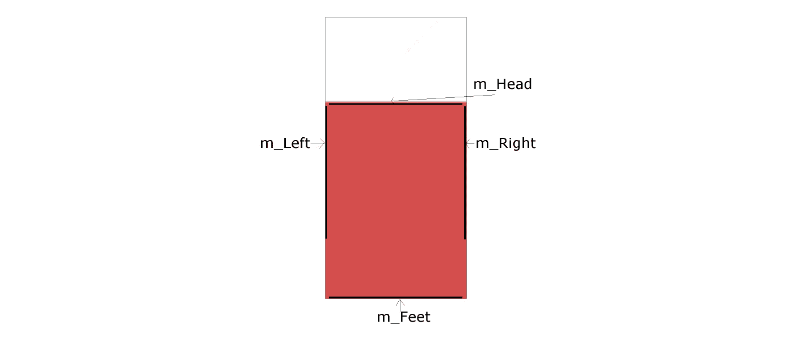
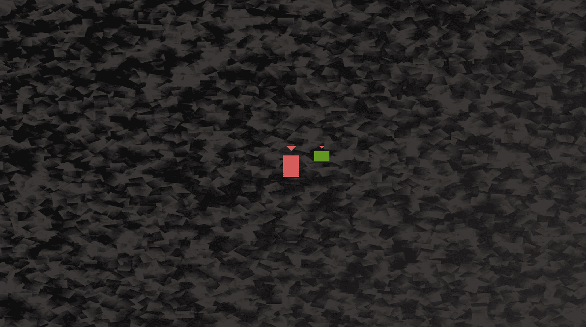
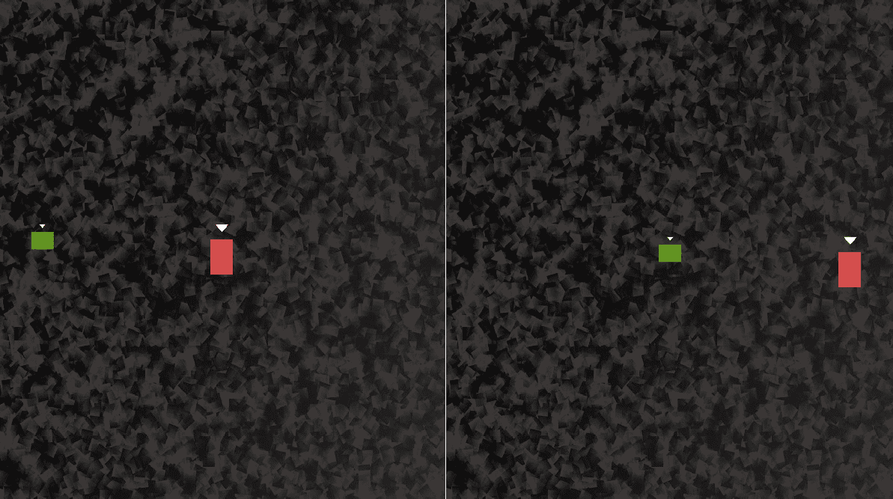
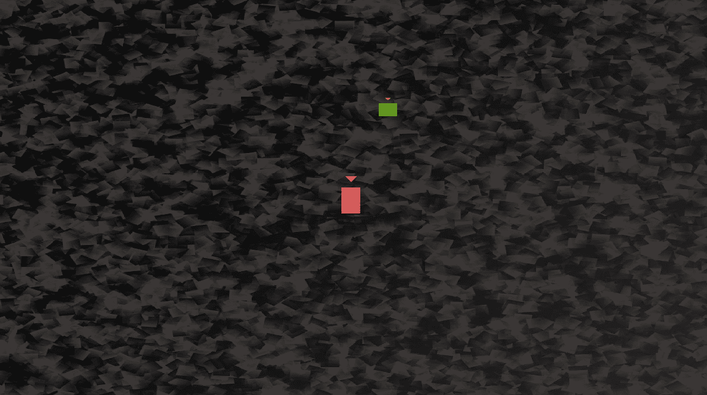

# *第十五章*：高级 OOP – 继承和多态

在本章中，我们将通过查看稍微高级一些的概念**继承**和**多态**来进一步扩展我们对面向对象编程（OOP）的知识。然后我们将能够使用这些新知识来实现游戏中的星级角色，托马斯和鲍勃。以下是本章我们将涵盖的内容：

+   学习如何使用继承扩展和修改一个类

+   通过使用多态，将一个类的对象视为多种类型的类

+   了解抽象类以及设计永远不会实例化的类实际上是有用的

+   构建一个抽象的`PlayableCharacter`类

+   使用`Thomas`和`Bob`类实现继承

+   将托马斯和鲍勃添加到游戏项目中

# 继承

我们已经看到，我们可以通过从 SFML 库的类中实例化对象来利用他人的辛勤工作。但这个面向对象编程（OOP）的事情甚至比这还要深入。

如果有一个类中包含大量有用的功能，但并不完全符合我们的需求，那会怎样？在这种情况下，我们可以从其他类中**继承**。正如其名，**继承**意味着我们可以利用其他人的类的所有功能和好处，包括封装，同时进一步细化或扩展代码以适应我们的特定情况。在这个项目中，我们将从 SFML 类中继承和扩展；我们也将使用我们自己的类这样做。

让我们看看一些使用继承的代码。

## 扩展一个类

考虑到所有这些，让我们看看一个示例类，看看我们如何扩展它，只是为了看看语法，作为第一步。

首先，我们定义一个要继承的类。这与我们创建其他任何类的方式没有区别。看看这个假设的`Soldier`类声明：

```cpp
class Soldier
{
    private:
        // How much damage can the soldier take
        int m_Health;
        int m_Armour;
        int m_Range;
        int m_ShotPower;

    Public:
        void setHealth(int h);
        void setArmour(int a);    
        void setRange(int r);
        void setShotPower(int p);
};
```

在之前的代码中，我们定义了一个`Soldier`类。它有四个私有变量：`m_Health`、`m_Armour`、`m_Range`和`m_ShotPower`。它还有四个公共函数：`setHealth`、`setArmour`、`setRange`和`setShotPower`。我们不需要看到这些函数的定义；它们将简单地初始化它们名称所暗示的适当变量。

我们也可以想象，一个完全实现的`Soldier`类会比这个更深入。它可能包含诸如`shoot`、`goProne`等函数。如果我们在一个 SFML 项目中实现`Soldier`类，它可能有一个`Sprite`对象，以及`update`和`getPostion`函数。

我们在这里提出的简单场景，如果我们想了解继承，是合适的。现在，让我们看看一些新的内容：从`Soldier`类继承。看看下面的代码，特别是高亮部分：

```cpp
class Sniper : public Soldier
{
public:
    // A constructor specific to Sniper
    Sniper::Sniper();
};
```

通过在`Sniper`类声明中添加`: public Soldier`，`Sniper`从`Soldier`继承。但这究竟意味着什么呢？`Sniper` `Soldier`。它拥有`Soldier`的所有变量和函数。然而，继承不仅仅是这样。

还要注意，在之前的代码中，我们声明了一个 `Sniper` 构造函数。这个构造函数是 `Sniper` 独有的。我们不仅继承了 `Soldier`，我们还拥有 `Soldier`。`Soldier` 类的所有功能（定义）将由 `Soldier` 类处理，但 `Sniper` 构造函数的定义必须由 `Sniper` 类处理。

这里是假设的 `Sniper` 构造函数定义可能的样子：

```cpp
// In Sniper.cpp
Sniper::Sniper()
{
    setHealth(10);
    setArmour(10);    
    setRange(1000);
    setShotPower(100);
}
```

我们可以继续编写其他一些扩展 `Soldier` 类的类，比如 `Commando` 和 `Infantryman`。每个类都会有完全相同的变量和函数，但每个类也可以有一个独特的构造函数，初始化那些适合特定类型 `Soldier` 的变量。`Commando` 可能具有非常高的 `m_Health` 和 `m_ShotPower`，但 `m_Range` 非常小。`Infantryman` 可能介于 `Commando` 和 `Sniper` 之间，每个变量的值都处于中等水平。

就像面向对象编程（OOP）本身已经足够有用一样，我们现在可以模拟现实世界中的对象，包括它们的层次结构。我们可以通过子类化/扩展/从其他类继承来实现这一点。

我们可能想在这里学习的一个术语是，从其扩展的类是 **super-class**，从超级类继承的类是 **sub-class**。我们也可以说 **parent** 和 **child** 类。

小贴士

你可能会对继承提出这个问题：为什么？原因可能如下：我们可以一次编写通用的代码；在父类中，我们可以更新这些通用代码，并且从它继承的所有类也会得到更新。此外，子类只能使用公共和 **protected** 实例变量和函数。所以，如果设计得当，这也增强了封装的目标。

你说的是 `protected` 吗？是的。有一个用于类变量和函数的访问修饰符叫做 `protected` 修饰符：

+   `Public` 变量和函数可以被任何拥有该类实例的人访问和使用。

+   `Private` 变量和函数只能由类的内部代码访问/使用，不能直接从实例中访问。这对于封装和当我们需要访问/更改私有变量时是有好处的，因为我们可以提供公共的获取器和设置器函数（例如 `getSprite`）。如果我们扩展一个具有 `private` 变量和函数的类，那么这个子类**不能**直接访问其父类的私有数据。

+   `Protected` 变量和函数几乎与私有相同。它们不能被类的实例直接访问/使用。然而，它们**可以**被声明在其中的任何扩展类的实例直接使用。所以，它们就像私有一样，除了对子类。

要完全理解 `protected` 变量和函数是什么以及它们如何有用，我们先看看另一个话题。然后，我们将看到它们在实际中的应用。

# 多态

**多态性**使我们能够编写不那么依赖于我们试图操作的类型的代码。这可以使我们的代码更清晰、更高效。多态性意味着多种形式。如果我们编写的对象可以代表多种类型的事物，那么我们可以利用这一点。

重要提示

但多态性对我们来说意味着什么？简化到最简单的定义，多态性意味着以下内容：任何子类都可以作为使用超类的代码的一部分。这意味着我们可以编写更简单、更容易理解、也更容易修改或更改的代码。此外，我们可以为超类编写代码，并依赖于这样一个事实：无论它被子类化多少次，在一定的参数范围内，代码仍然可以工作。

让我们讨论一个例子。

假设我们想使用多态性来帮助编写一个动物园管理游戏，在这个游戏中我们必须喂养和照顾动物的需求。我们可能需要一个像`feed`这样的函数。我们也可能想将待喂养的动物的实例传递给`feed`函数。

当然，动物园有很多动物，比如狮子、大象和三趾树懒。根据我们对 C++继承的新知识，编写一个`Animal`类并让所有不同类型的动物从它继承下来是有意义的。

如果我们想编写一个函数（`feed`），我们可以将`Lion`、`Elephant`和`ThreeToedSloth`作为参数传递，这似乎意味着我们需要为每种`Animal`类型编写一个`feed`函数。然而，我们可以编写具有多态返回类型和参数的多态函数。看看以下假设的`feed`函数的定义：

```cpp
void feed(Animal& a)
{
    a.decreaseHunger();
}
```

前面的函数有一个`Animal`引用作为参数，这意味着任何从扩展`Animal`的类中构建的对象都可以传递给它。

这意味着你今天可以编写代码，然后在下周、下个月或下一年创建另一个子类，而相同的函数和数据结构仍然可以工作。此外，我们可以在子类上强制实施一套规则，关于它们可以做什么以及如何做，以及它们如何实现。因此，一个阶段的好设计可以在其他阶段产生影响。

但我们真的会想要实例化一个实际的 Animal 吗？

# 抽象类 - 虚函数和纯虚函数

一个**抽象类**是一个不能实例化的类，因此不能被制作成对象。

小贴士

我们可能想在这里了解的一些术语是*具体*类。一个**具体类**是任何非抽象类。换句话说，我们迄今为止编写的所有类都一直是具体类，并且可以被实例化为可用的对象。

那这是代码永远不会被使用吗？但那就像支付建筑师设计你的房子然后从不建造它一样！

如果我们，或者一个类的设计者，想要强制用户在使用他们的类之前继承它，他们可以使一个类成为**抽象类**。如果这样做了，我们就不能从这个类中创建一个对象；因此，我们必须首先从它继承，然后从子类创建一个对象。

要做到这一点，我们可以定义一个**纯虚函数**而不提供任何定义。然后，这个函数必须在继承自它的任何类中被**重写**（**重新定义**）。

让我们看看一个例子；它会有所帮助。我们可以通过添加一个纯虚函数，例如抽象的`Animal`类，它只能执行通用的`makeNoise`动作，来使一个类成为抽象类：

```cpp
Class Animal
    private:
        // Private stuff here
    public:
        void virtual makeNoise() = 0;
        // More public stuff here
};
```

正如你所见，我们在函数声明之前添加了 C++关键字`virtual`，并在其后添加了`= 0`。现在，任何扩展/继承自`Animal`的类都必须重写`makeNoise`函数。这可能是合理的，因为不同类型的动物会发出非常不同的声音。我们可能假设扩展`Animal`类的任何人足够聪明，会注意到`Animal`类不能发出声音，并且他们将需要处理它，但如果没有注意到怎么办？重点是，通过定义一个纯虚函数，我们确保他们会，因为他们必须。

抽象类也很有用，因为有时我们想要一个可以作为多态类型的类，但我们又需要保证它永远不能作为一个对象使用。例如，`Animal`本身并没有什么意义。我们不谈论动物；我们谈论动物的种类。我们不说，“哇，看那只可爱、蓬松、白色的动物！”或者，“昨天我们去宠物店买了一只动物和一张动物床。”这太抽象了。

因此，一个抽象类就像一个`Worker`类，例如，我们可以扩展它来创建`Miner`、`Steelworker`、`OfficeWorker`，当然还有`Programmer`。但一个普通的`Worker`到底做什么呢？我们为什么想要实例化一个呢？

答案是我们可能不想实例化一个，但我们可能想将其用作多态类型，这样我们就可以在函数之间传递多个`Worker`子类，并且有可以存储所有类型工人的数据结构。

所有纯虚函数都必须由包含纯虚函数的父类扩展的任何类重写。这意味着抽象类可以提供一些在所有子类中都可用的公共功能。例如，`Worker`类可能有`m_AnnualSalary`、`m_Productivity`和`m_Age`成员变量。它也可能有一个`getPayCheck`函数，这不是纯虚函数，在所有子类中都是相同的，但有一个`doWork`函数，这是纯虚函数，必须被重写，因为所有不同类型的`Worker`将会有不同的`doWork`方式。

重要提示

顺便说一下，`= 0`一直到最后。在当前的游戏项目中，我们将使用纯虚函数。

如果任何关于虚拟、纯虚或抽象的内容不清楚，使用它们可能是理解它们最好的方式。

# 构建 PlayableCharacter 类

现在我们已经了解了继承、多态和纯虚函数的基础，我们将把它们应用到实践中。我们将构建一个具有我们游戏中任何角色所需的大部分功能的 `PlayableCharacter` 类。它将有一个纯虚函数，称为 `handleInput`。`handleInput` 函数在子类中需要相当不同，所以这样做是有意义的。

由于 `PlayableCharacter` 将有一个纯虚函数，它将是一个抽象类，并且不可能有它的对象。然后我们将构建 `Thomas` 和 `Bob` 类，这些类将继承自 `PlayableCharacter`，实现纯虚函数的定义，并允许我们在游戏中实例化 `Bob` 和 `Thomas` 对象。不可能直接实例化一个 `PlayableCharacter` 实例，但我们不希望这样做，因为无论如何它都太抽象了。

## 编写 PlayableCharacter.h

正如创建类时的常规做法，我们将从包含成员变量和函数声明的头文件开始。新的地方在于，在这个类中，我们将声明一些 **protected** 成员变量。记住，受保护的变量可以在继承自具有受保护变量的类的类中使用，就像它们是公共的。

右键点击 `PlayableCharacter.h`。最后，点击 `PlayableCharacter` 类。

我们将在三个部分中添加和讨论 `PlayableCharacter.h` 文件的内容。首先是 `protected` 部分，然后是 `private`，最后是 `public`。

将以下代码添加到 `PlayableCharacter.h` 文件中：

```cpp
#pragma once
#include <SFML/Graphics.hpp>
using namespace sf;
class PlayableCharacter
{
protected:
    // Of course we will need a sprite
    Sprite m_Sprite;
    // How long does a jump last
    float m_JumpDuration;
    // Is character currently jumping or falling
    bool m_IsJumping;
    bool m_IsFalling;
    // Which directions is the character currently moving in
    bool m_LeftPressed;
    bool m_RightPressed;
    // How long has this jump lasted so far
    float m_TimeThisJump;
    // Has the player just initiated a jump
    bool m_JustJumped = false;
    // Private variables and functions come next
```

在我们刚刚编写的代码中，首先要注意的是所有变量都是 `protected`。这意味着当我们从该类继承时，我们刚刚编写的所有变量都将对扩展它的那些类可访问。我们将使用 `Thomas` 和 `Bob` 类来扩展这个类。

小贴士

在本书的大多数上下文中，术语 *继承自* 和 *扩展* 几乎是同义的。然而，有时一个似乎比另一个更合适。

除了 `protected` 访问指定之外，之前的代码没有什么是新的或复杂的。然而，值得注意一些细节。如果我们这样做，随着我们前进，将很容易理解类的工作方式。所以，让我们逐个查看这些 `protected` 变量。

我们有我们相对可预测的 `Sprite`，`m_Sprite`。我们有一个名为 `m_JumpDuration` 的 `float` 变量，它将保存一个表示角色能够跳跃的时间的值。该值越大，角色能够跳得越远/越高。

接下来，我们有一个布尔值 `m_IsJumping`，当角色在跳跃时为 `true`，否则为 `false`。这将确保角色在空中时不能跳跃。

`m_IsFalling` 变量与 `m_IsJumping` 有类似的作用。它将用来知道角色何时在坠落。

接下来，我们有两个布尔值，如果角色的左右键盘按钮当前被按下，它们将是 `true`。这些相对依赖于角色（托马斯的 *A* 和 *D*，鲍勃的 *Left* 和 *Right* 光标键）。我们将如何响应这些布尔值将在 `Thomas` 和 `Bob` 类中看到。

`m_TimeThisJump` 浮点变量在 `m_IsJumping` 为 `true` 的每帧更新。然后我们可以找出何时达到 `m_JumpDuration`。

最后一个 `protected` 变量是 `m_JustJumped` 布尔值。如果当前帧中启动了跳跃，它将是 `true`。它将被用来知道何时播放跳跃音效。

接下来，将以下 `private` 变量添加到 `PlayableCharacter.h` 文件中：

```cpp
private:
    // What is the gravity
    float m_Gravity;
    // How fast is the character
    float m_Speed = 400;
    // Where is the player
    Vector2f m_Position;
    // Where are the characters various body parts?
    FloatRect m_Feet;
    FloatRect m_Head;
    FloatRect m_Right;
    FloatRect m_Left;
    // And a texture
    Texture m_Texture;
    // All our public functions will come next
```

在之前的代码中，我们有一些有趣的 `private` 变量。请记住，这些变量将只直接对 `PlayableCharacter` 类中的代码可访问。`Thomas` 和 `Bob` 类将无法直接访问它们。

`m_Gravity` 变量将保存角色每秒下落的像素数。`m_Speed` 变量将保存角色每秒可以向左或向右移动的像素数。

`Vector2f`，`m_Position` 变量是世界中（而非屏幕上）角色中心的位置。

接下来的四个 `FloatRect` 对象非常重要，需要讨论。在我们进行 *Zombie Arena* 游戏中的碰撞检测时，我们只是简单地检查两个 `FloatRect` 对象是否相交。每个 `FloatRect` 对象代表一个完整的角色、一个拾取物或一颗子弹。对于非矩形形状的对象（僵尸和玩家），这有点不准确。

在这个游戏中，我们需要更加精确。`m_Feet`、`m_Head`、`m_Right`、`m_Left` 和 `FloatRect` 对象将保存角色身体不同部分的坐标。这些坐标将每帧更新。

通过这些坐标，我们能够精确地判断一个角色何时落在平台上，在跳跃中撞到头，或者与旁边的砖块摩擦肩膀。

最后，我们有一个 `Texture`。`Texture` 是 `private` 的，因为它不是由 `Thomas` 或 `Bob` 类直接使用的。然而，正如我们所见，`Sprite` 是 `protected` 的，因为它被直接使用。

现在，将所有 `public` 函数添加到 `PlayableCharacter.h` 文件中。然后，我们将讨论它们：

```cpp
public:
    void spawn(Vector2f startPosition, float gravity);
    // This is a pure virtual function
    bool virtual handleInput() = 0;
    // This class is now abstract and cannot be instantiated
    // Where is the player
    FloatRect getPosition();
    // A rectangle representing the position 
    // of different parts of the sprite
    FloatRect getFeet();
    FloatRect getHead();
    FloatRect getRight();
    FloatRect getLeft();
    // Send a copy of the sprite to main
    Sprite getSprite();
    // Make the character stand firm
    void stopFalling(float position);
    void stopRight(float position);
    void stopLeft(float position);
    void stopJump();
    // Where is the center of the character
    Vector2f getCenter();
    // We will call this function once every frame
    void update(float elapsedTime);

};// End of the class
```

让我们讨论一下我们刚刚添加的每个函数声明。这将使编写它们的定义更容易理解：

+   `spawn` 函数接收一个名为 `startPosition` 的 `Vector2f` 和一个名为 `gravity` 的 `float` 值。正如其名称所暗示的，`startPosition` 将是角色在关卡中开始的位置坐标，而 `gravity` 将是角色下落的每秒像素数。

+   `bool virtual handleInput() = 0`当然是我们纯虚函数。由于`PlayableCharacter`有这个函数，任何扩展它的类，如果我们想实例化它，都必须为这个函数提供定义。因此，当我们在一分钟内编写`PlayableCharacter`的所有函数定义时，我们不会为`handleInput`提供定义。`Thomas`和`Bob`类中都需要有定义。

+   `getPosition`函数返回一个`FloatRect`对象，表示整个角色的位置。

+   `getFeet`函数，以及`getHead`、`getRight`和`getLeft`，返回一个`FloatRect`对象，表示角色身体特定部分的位置。这正是我们进行详细碰撞检测所需要的。

+   `getSprite`函数像往常一样，返回`m_Sprite`的副本给调用代码。

+   `stopFalling`、`stopRight`、`stopLeft`和`stopJump`函数接收一个单个的`float`值，该值将被函数用来重新定位角色并停止它穿过固体地砖行走或跳跃。

+   `getCenter`函数返回一个`Vector2f`对象给调用代码，让它知道角色的确切中心位置。这个值存储在`m_Position`中。正如我们稍后将会看到的，它被`Engine`类用来围绕适当的角色中心化适当的`View`。

+   我们之前已经多次看到`update`函数，并且像往常一样，它接受一个`float`参数，即当前帧所花费的秒数的分数。然而，这个`update`函数需要比我们其他项目中的`update`函数（from our other projects）做更多的工作。它需要处理跳跃以及更新表示角色头部、脚部和左右手的`FloatRect`对象。

现在，我们可以编写所有函数的定义，当然，除了`handleInput`函数。

## 编写`PlayableCharacter.cpp`

右键点击`PlayableCharacter.cpp`。最后，点击`PlayableCharacter`类的`.cpp`文件。

我们将把代码分成几个部分来讨论。首先，添加包含指令和`spawn`函数的定义：

```cpp
#include "PlayableCharacter.h"
void PlayableCharacter::spawn(
        Vector2f startPosition, float gravity)
{
    // Place the player at the starting point
    m_Position.x = startPosition.x;
    m_Position.y = startPosition.y;
    // Initialize the gravity
    m_Gravity = gravity;
    // Move the sprite in to position
    m_Sprite.setPosition(m_Position);
}
```

`spawn`函数使用传入的位置初始化`m_Position`，并初始化`m_Gravity`。代码的最后一行将`m_Sprite`移动到其起始位置。

接下来，在之前的代码之后立即添加`update`函数的定义：

```cpp
void PlayableCharacter::update(float elapsedTime)
{
    if (m_RightPressed)
    {
        m_Position.x += m_Speed * elapsedTime;
    }
    if (m_LeftPressed)
    {
        m_Position.x -= m_Speed * elapsedTime;
    }
    // Handle Jumping
    if (m_IsJumping)
    {
        // Update how long the jump has been going
        m_TimeThisJump += elapsedTime;
        // Is the jump going upwards
        if (m_TimeThisJump < m_JumpDuration)
        {
            // Move up at twice gravity
            m_Position.y -= m_Gravity * 2 * elapsedTime;
        }
        else
        {
            m_IsJumping = false;
            m_IsFalling = true;
        }
    }
    // Apply gravity
    if (m_IsFalling)
    {
        m_Position.y += m_Gravity * elapsedTime;
    }
    // Update the rect for all body parts
    FloatRect r = getPosition();

    // Feet
    m_Feet.left = r.left + 3;
    m_Feet.top = r.top + r.height - 1;
    m_Feet.width = r.width - 6;
    m_Feet.height = 1;
    // Head
    m_Head.left = r.left;
    m_Head.top = r.top + (r.height * .3);
    m_Head.width = r.width;
    m_Head.height = 1;
    // Right
    m_Right.left = r.left + r.width - 2;
    m_Right.top = r.top + r.height * .35;
    m_Right.width = 1;
    m_Right.height = r.height * .3;
    // Left
    m_Left.left = r.left;
    m_Left.top = r.top + r.height * .5;
    m_Left.width = 1;
    m_Left.height = r.height * .3;
    // Move the sprite into position
    m_Sprite.setPosition(m_Position);
}
```

代码的前两部分检查`m_RightPressed`或`m_LeftPressed`是否为`true`。如果其中任何一个为真，则使用与上一个项目相同的公式（经过时间乘以速度）更改`m_Position`。

接下来，我们看到角色是否正在执行跳跃。我们可以从`if(m_IsJumping)`中知道这一点。如果这个`if`语句为真，代码将采取以下步骤：

1.  使用`elapsedTime`更新`m_TimeThisJump`。

1.  检查 `m_TimeThisJump` 是否仍然小于 `m_JumpDuration`。如果是，它将 `m_Position` 的 y 坐标通过 2 倍重力乘以经过的时间来改变。

1.  当 `m_TimeThisJump` 不低于 `m_JumpDuration` 时，`else` 子句会执行，将 `m_Falling` 设置为 `true`。这样做的影响将在下面看到。同时，`m_Jumping` 被设置为 `false`。这防止了我们刚刚讨论的代码执行，因为 `if(m_IsJumping)` 现在是 `false`。

`if(m_IsFalling)` 块在每一帧将 `m_Position` 向下移动。它是使用当前的 `m_Gravity` 值和经过的时间来移动的。

接下来的代码（剩余的大部分代码）更新角色的“身体部分”，相对于整个精灵的当前位置。请查看以下图表，以了解代码如何计算角色的虚拟头部、脚部和左右两侧的位置：



最后一行代码使用 `setPosition` 函数在所有 `update` 函数的可能性之后将精灵移动到其正确的位置。

现在，在之前的代码之后立即添加 `getPosition`、`getCenter`、`getFeet`、`getHead`、`getLeft`、`getRight` 和 `getSprite` 函数的定义：

```cpp
FloatRect PlayableCharacter::getPosition()
{
    return m_Sprite.getGlobalBounds();
}
Vector2f PlayableCharacter::getCenter()
{
    return Vector2f(
        m_Position.x + m_Sprite.getGlobalBounds().width / 2,
        m_Position.y + m_Sprite.getGlobalBounds().height / 2
        );
}
FloatRect PlayableCharacter::getFeet()
{
    return m_Feet;
}
FloatRect PlayableCharacter::getHead()
{
    return m_Head;
}
FloatRect PlayableCharacter::getLeft()
{
    return m_Left;
}
FloatRect PlayableCharacter::getRight()
{
    return m_Right;
}
Sprite PlayableCharacter::getSprite()
{
    return m_Sprite;
}
```

`getPosition` 函数返回一个包裹整个精灵的 `FloatRect`，而 `getCenter` 返回一个包含精灵中心的 `Vector2f`。请注意，我们通过将精灵的高度和宽度除以 2 来动态地得到这个结果。这是因为托马斯和鲍勃的身高会有所不同。

`getFeet`、`getHead`、`getLeft` 和 `getRight` 函数返回代表我们在 `update` 函数中每帧更新的角色身体部分的 `FloatRect` 对象。我们将在下一章编写使用这些函数的碰撞检测代码。

`getSprite` 函数，像往常一样，返回 `m_Sprite` 的副本。

最后，对于 `PlayableCharacter` 类，在之前的代码之后立即添加 `stopFalling`、`stopRight`、`stopLeft` 和 `stopJump` 函数的定义。这样做：

```cpp
void PlayableCharacter::stopFalling(float position)
{
    m_Position.y = position - getPosition().height;
    m_Sprite.setPosition(m_Position);
    m_IsFalling = false;
}
void PlayableCharacter::stopRight(float position)
{

    m_Position.x = position - m_Sprite.getGlobalBounds().width;
    m_Sprite.setPosition(m_Position);
}
void PlayableCharacter::stopLeft(float position)
{
    m_Position.x = position + m_Sprite.getGlobalBounds().width;
    m_Sprite.setPosition(m_Position);
}
void PlayableCharacter::stopJump()
{
    // Stop a jump early 
    m_IsJumping = false;
    m_IsFalling = true;
}
```

之前每个函数都接收一个作为参数的值，用于重新定位精灵的顶部、底部、左侧或右侧。这些值具体是什么以及如何获得将是下一章的内容。之前每个函数也会重新定位精灵。

最后一个函数是 `stopJump` 函数，它也将用于碰撞检测。它设置必要的 `m_IsJumping` 和 `m_IsFalling` 值以结束跳跃。

# 构建托马斯和鲍勃类

现在，我们真正开始使用继承。我们将为托马斯和鲍勃各创建一个类。它们都将从我们刚刚编写的`PlayableCharacter`类继承。它们将拥有`PlayableCharacter`类的所有功能，包括直接访问其`protected`变量。我们还将添加纯虚函数`handleInput`的定义。你会注意到，`Thomas`和`Bob`的`handleInput`函数将是不同的。

## 编写`Thomas.h`

右键点击`Thomas.h`。最后，点击`Thomas`类。

将以下代码添加到`Thomas.h`类中：

```cpp
#pragma once
#include "PlayableCharacter.h"
class Thomas : public PlayableCharacter
{
public:
    // A constructor specific to Thomas
    Thomas::Thomas();
    // The overridden input handler for Thomas
    bool virtual handleInput();
};
```

之前的代码非常简短且清晰。我们可以看到我们有一个构造函数，并且将要实现纯虚函数`handleInput`。所以，我们现在就来做这件事。

## 编写`Thomas.cpp`

右键点击`Thomas.cpp`。最后，点击`Thomas`类的`.cpp`文件。

将`Thomas`构造函数添加到`Thomas.cpp`文件中，如下所示：

```cpp
#include "Thomas.h"
#include "TextureHolder.h"
Thomas::Thomas()
{
    // Associate a texture with the sprite
    m_Sprite = Sprite(TextureHolder::GetTexture(
        "graphics/thomas.png"));
    m_JumpDuration = .45;
}
```

我们需要做的只是加载`thomas.png`图形，并将跳跃的持续时间(`m_JumpDuration`)设置为`.45`（几乎半秒）。

按如下定义`handleInput`函数：

```cpp
// A virtual function
bool Thomas::handleInput()
{
    m_JustJumped = false;
    if (Keyboard::isKeyPressed(Keyboard::W))
    {
        // Start a jump if not already jumping
        // but only if standing on a block (not falling)
        if (!m_IsJumping && !m_IsFalling)
        {
            m_IsJumping = true;
            m_TimeThisJump = 0;
            m_JustJumped = true;
        }
    }
    else
    {
        m_IsJumping = false;
        m_IsFalling = true;
    }
    if (Keyboard::isKeyPressed(Keyboard::A))
    {
        m_LeftPressed = true;
    }
    else
    {
        m_LeftPressed = false;
    }
    if (Keyboard::isKeyPressed(Keyboard::D))
    {
        m_RightPressed = true;
    }
    else
    {
        m_RightPressed = false;
    }
    return m_JustJumped;
}
```

这段代码对你来说应该很熟悉。我们正在使用 SFML 的`isKeyPressed`函数来检查*W*、*A*或*D*键是否被按下。

当按下*W*键时，玩家正在尝试跳跃。然后代码使用`if(!m_IsJumping && !m_IsFalling)`来检查角色是否尚未跳跃，并且也没有在掉落。当这两个测试都为真时，`m_IsJumping`被设置为`true`，`m_TimeThisJump`被设置为 0，`m_JustJumped`也被设置为`true`。

当前两个测试不评估为`true`时，执行`else`子句，并将`m_Jumping`设置为`false`，将`m_IsFalling`设置为`true`。

处理*A*和*D*键的按下就像设置`m_LeftPressed`和/或`m_RightPressed`为`true`或`false`一样简单。`update`函数现在将能够处理角色的移动。

函数中的最后一行代码返回`m_JustJumped`的值。这将让调用代码知道是否需要播放跳跃音效。

我们现在将编写`Bob`类。它与`Thomas`类几乎相同，除了它有不同的跳跃能力和不同的`Texture`，并且使用不同的键盘键。

## 编写`Bob.h`

`Bob`类在结构上与`Thomas`类相同。它从`PlayableCharacter`继承，有一个构造函数，并提供了`handleInput`函数的定义。与`Thomas`相比的不同之处在于我们以不同的方式初始化 Bob 的一些成员变量，并且在`handleInput`函数中处理输入的方式也不同。让我们编写这个类并查看细节。

右键点击`Bob.h`。最后，点击`Bob`类。

将以下代码添加到`Bob.h`文件中：

```cpp
#pragma once
#include "PlayableCharacter.h"
class Bob : public PlayableCharacter
{
public:
    // A constructor specific to Bob
    Bob::Bob();
    // The overriden input handler for Bob
    bool virtual handleInput();
};
```

之前的代码与`Thomas.h`文件相同，除了类名和因此构造函数名不同。

## 编写`Bob.cpp`

右键点击`Bob.cpp`。最后，点击`Bob`类的`.cpp`文件。

将以下代码添加到`Bob.cpp`文件的`Bob`构造函数中。注意纹理是不同的（`bob.png`），并且`m_JumpDuration`被初始化为一个显著较小的值。现在 Bob 是他自己的独特个体：

```cpp
#include "Bob.h"
#include "TextureHolder.h"
Bob::Bob()
{
    // Associate a texture with the sprite
    m_Sprite = Sprite(TextureHolder::GetTexture(
        "graphics/bob.png"));
    m_JumpDuration = .25;
}
```

在`Bob`构造函数之后立即添加`handleInput`代码：

```cpp
bool Bob::handleInput()
{
    m_JustJumped = false;
    if (Keyboard::isKeyPressed(Keyboard::Up))
    {
        // Start a jump if not already jumping
        // but only if standing on a block (not falling)
        if (!m_IsJumping && !m_IsFalling)
        {
            m_IsJumping = true;
            m_TimeThisJump = 0;
            m_JustJumped = true;
        }
    }
    else
    {
        m_IsJumping = false;
        m_IsFalling = true;
    }
    if (Keyboard::isKeyPressed(Keyboard::Left))
    {
        m_LeftPressed = true;
    }
    else
    {
        m_LeftPressed = false;
    }
    if (Keyboard::isKeyPressed(Keyboard::Right))
    {
        m_RightPressed = true;;
    }
    else
    {
        m_RightPressed = false;
    }
    return m_JustJumped;
}
```

注意，代码几乎与`Thomas`类中的`handleInput`函数中的代码相同。唯一的区别是我们响应不同的键（分别用*左*箭头键和*右*箭头键来控制左右移动，以及用*上*箭头键来进行跳跃）。

现在我们有一个`PlayableCharacter`类，它被`Bob`和`Thomas`类扩展，我们可以向游戏中添加一个`Bob`和`Thomas`实例。

# 将游戏引擎更新为使用 Thomas 和 Bob

为了能够运行游戏并看到我们新的角色，我们必须声明它们的实例，调用它们的`spawn`函数，每帧更新它们，并每帧绘制它们。现在让我们这样做。

## 更新 Engine.h 以添加 Bob 和 Thomas 的实例

打开`Engine.h`文件并添加以下高亮显示的代码行：

```cpp
#pragma once
#include <SFML/Graphics.hpp>
#include "TextureHolder.h"
#include "Thomas.h"
#include "Bob.h"
using namespace sf;
class Engine
{
private:
    // The texture holder
    TextureHolder th;
    // Thomas and his friend, Bob
    Thomas m_Thomas;
    Bob m_Bob;
    const int TILE_SIZE = 50;
    const int VERTS_IN_QUAD = 4;
    ...
    ...
```

现在，我们有了`Thomas`和`Bob`的实例，它们都是`PlayableCharacter`的派生类。

## 更新输入函数以控制 Thomas 和 Bob

现在，我们将添加控制两个角色的能力。这段代码将放在代码的输入部分。当然，对于这个项目，我们有一个专门的`input`函数。打开`Input.cpp`并添加以下高亮显示的代码：

```cpp
void Engine::input()
{
    Event event;
    while (m_Window.pollEvent(event))
    {
        if (event.type == Event::KeyPressed)
        {
            // Handle the player quitting
            if (Keyboard::isKeyPressed(Keyboard::Escape))
            {
                m_Window.close();
            }
            // Handle the player starting the game
            if (Keyboard::isKeyPressed(Keyboard::Return))
            {
                m_Playing = true;
            }
            // Switch between Thomas and Bob
            if (Keyboard::isKeyPressed(Keyboard::Q))
            {
                m_Character1 = !m_Character1;
            }
            // Switch between full and split-screen
            if (Keyboard::isKeyPressed(Keyboard::E))
            {
                m_SplitScreen = !m_SplitScreen;
            }
        }
    }
    // Handle input specific to Thomas
    if(m_Thomas.handleInput())
    {
        // Play a jump sound
    }
    // Handle input specific to Bob
    if(m_Bob.handleInput())
    {
        // Play a jump sound
    }
}
```

注意前面的代码是多么简单：所有功能都包含在`Thomas`和`Bob`类中。所有代码必须做的只是为每个`Thomas`和`Bob`类添加一个包含指令。然后，在`input`函数中，代码只是调用`m_Thomas`和`m_Bob`上的纯虚`handleInput`函数。我们之所以在每个调用中包裹一个`if`语句，是因为它们根据是否刚刚成功启动了一个新的跳跃而返回`true`或`false`。我们将在*第十七章*中处理播放跳跃音效，*声音空间化和 HUD*。

## 更新更新函数以生成和更新可玩角色实例

这分为两个部分。首先，我们需要在新关卡开始时生成 Bob 和 Thomas，其次，我们需要每帧更新它们（通过调用它们的`update`函数）。

### 生成 Thomas 和 Bob

随着项目的进展，我们需要在几个不同的地方调用我们的`Thomas`和`Bob`对象的`spawn`函数。最明显的是，当新关卡开始时，我们需要生成两个角色。在下一章中，随着我们需要在关卡开始时执行的任务数量增加，我们将编写一个`loadLevel`函数。现在，让我们在`update`函数中调用`m_Thomas`和`m_Bob`的`spawn`，如以下代码所示。添加以下代码，但请注意，它最终将被删除并替换：

```cpp
void Engine::update(float dtAsSeconds)
{
    if (m_NewLevelRequired)
    {
        // These calls to spawn will be moved to a new
        // loadLevel() function soon
        // Spawn Thomas and Bob
        m_Thomas.spawn(Vector2f(0,0), GRAVITY);
        m_Bob.spawn(Vector2f(100, 0), GRAVITY);
        // Make sure spawn is called only once
        m_TimeRemaining = 10;
        m_NewLevelRequired = false;
    }
    if (m_Playing)
    {
        // Count down the time the player has left
        m_TimeRemaining -= dtAsSeconds;
        // Have Thomas and Bob run out of time?
        if (m_TimeRemaining <= 0)
        {
            m_NewLevelRequired = true;
        }
    }// End if playing

}
```

之前的代码简单地调用`spawn`并传入游戏世界中的一个位置，以及重力。代码被包裹在一个`if`语句中，该语句检查是否需要新的关卡。生成代码将被移动到一个专门的`loadLevel`函数中，但`if`条件将是最终项目的一部分。此外，`m_TimeRemaining`目前被设置为任意 10 秒。

现在，我们可以更新游戏循环中每一帧的实例。

### 每帧更新托马斯和鲍勃

接下来，我们将更新托马斯和鲍勃。我们只需要调用它们的`update`函数，并传入这一帧所花费的时间。

添加以下高亮代码：

```cpp
void Engine::update(float dtAsSeconds)
{
    if (m_NewLevelRequired)
    {
        // These calls to spawn will be moved to a new
        // LoadLevel function soon
        // Spawn Thomas and Bob
        m_Thomas.spawn(Vector2f(0,0), GRAVITY);
        m_Bob.spawn(Vector2f(100, 0), GRAVITY);
        // Make sure spawn is called only once
        m_NewLevelRequired = false;
    }
    if (m_Playing)
    {
        // Update Thomas
        m_Thomas.update(dtAsSeconds);
        // Update Bob
        m_Bob.update(dtAsSeconds);
        // Count down the time the player has left
        m_TimeRemaining -= dtAsSeconds;
        // Have Thomas and Bob run out of time?
        if (m_TimeRemaining <= 0)
        {
            m_NewLevelRequired = true;
        }
    }// End if playing

}
```

现在角色可以移动了，我们需要更新适当的`View`对象，使它们围绕角色中心，并成为关注的焦点。当然，在我们游戏世界中没有一些对象之前，实际的移动感是无法实现的。

添加以下高亮代码：

```cpp
void Engine::update(float dtAsSeconds)
{
    if (m_NewLevelRequired)
    {
        // These calls to spawn will be moved to a new
        // LoadLevel function soon
        // Spawn Thomas and Bob
        m_Thomas.spawn(Vector2f(0,0), GRAVITY);
        m_Bob.spawn(Vector2f(100, 0), GRAVITY);
        // Make sure spawn is called only once
        m_NewLevelRequired = false;
    }
    if (m_Playing)
    {
        // Update Thomas
        m_Thomas.update(dtAsSeconds);
        // Update Bob
        m_Bob.update(dtAsSeconds);
        // Count down the time the player has left
        m_TimeRemaining -= dtAsSeconds;
        // Have Thomas and Bob run out of time?
        if (m_TimeRemaining <= 0)
        {
            m_NewLevelRequired = true;
        }
    }// End if playing

    // Set the appropriate view around the appropriate character
    if (m_SplitScreen)
    {
        m_LeftView.setCenter(m_Thomas.getCenter());
        m_RightView.setCenter(m_Bob.getCenter());
    }
    else
    {
        // Centre full screen around appropriate character
        if (m_Character1)
        {
            m_MainView.setCenter(m_Thomas.getCenter());
        }
        else
        {
            m_MainView.setCenter(m_Bob.getCenter());
        }
    }
}
```

之前的代码处理了两种可能的情况。首先，`if(mSplitScreen)`条件将左侧视图定位在`m_Thomas`周围，右侧视图定位在`m_Bob`周围。当游戏处于全屏模式时，执行的`else`子句检查`m_Character1`是否为`true`。如果是，则全屏视图(`m_MainView`)将围绕托马斯居中，否则将围绕鲍勃居中。你可能记得，玩家可以使用*E*键切换分屏模式，使用*Q*键在全屏模式下在鲍勃和托马斯之间切换。我们在`Engine`类的`input`函数中实现了这一点，在*第十二章*中，*分层视图和实现 HUD*。

现在，我们可以将托马斯和鲍勃的图形绘制到屏幕上。

## 绘制鲍勃和托马斯

确保打开`Draw.cpp`文件并添加以下高亮代码：

```cpp
void Engine::draw()
{
    // Rub out the last frame
    m_Window.clear(Color::White);
    if (!m_SplitScreen)
    {
        // Switch to background view
        m_Window.setView(m_BGMainView);
        // Draw the background
        m_Window.draw(m_BackgroundSprite);
        // Switch to m_MainView
        m_Window.setView(m_MainView);        
        // Draw thomas
        m_Window.draw(m_Thomas.getSprite());
        // Draw bob
        m_Window.draw(m_Bob.getSprite());
    }
    else
    {
        // Split-screen view is active
        // First draw Thomas' side of the screen
        // Switch to background view
        m_Window.setView(m_BGLeftView);
        // Draw the background
        m_Window.draw(m_BackgroundSprite);
        // Switch to m_LeftView
        m_Window.setView(m_LeftView);
        // Draw bob
        m_Window.draw(m_Bob.getSprite());

        // Draw thomas
        m_Window.draw(m_Thomas.getSprite());

        // Now draw Bob's side of the screen
        // Switch to background view
        m_Window.setView(m_BGRightView);
        // Draw the background
        m_Window.draw(m_BackgroundSprite);
        // Switch to m_RightView
        m_Window.setView(m_RightView);
        // Draw thomas
        m_Window.draw(m_Thomas.getSprite());
        // Draw bob
        m_Window.draw(m_Bob.getSprite());

    }
    // Draw the HUD
    // Switch to m_HudView
    m_Window.setView(m_HudView);

    // Show everything we have just drawn
    m_Window.display();
}
```

注意，我们以全屏、左侧和右侧的方式绘制托马斯和鲍勃。还要注意我们在分屏模式下绘制角色的细微差别。当绘制屏幕的左侧时，我们改变绘制角色的顺序，并在鲍勃之后绘制托马斯。因此，托马斯将始终在左侧“位于上方”，鲍勃将始终在右侧“位于上方”。这是因为控制托马斯的玩家在左侧，而鲍勃在右侧。我们可能在`Engine`类的`input`函数中编码了这一点，在*第十二章*中，*分层视图和实现 HUD*。

现在，你可以运行游戏，看到托马斯和鲍勃位于屏幕中心，如下所示：



如果你按下*Q*键将焦点从托马斯切换到鲍勃，你会看到`视图`进行轻微调整。如果你将任意一个角色向左或向右移动（托马斯使用*A*和*D*键，鲍勃使用箭头键），你会看到它们相对于彼此移动。

尝试按下*E*键在全屏和分屏之间切换。然后，再次尝试移动两个角色以查看效果。在下面的屏幕截图，你可以看到托马斯始终位于左侧窗口的中心，鲍勃始终位于右侧窗口的中心：



如果你让游戏运行足够长的时间，角色将在每 10 秒后在其原始位置重生。这是我们为完成的游戏所需功能的开端。这种行为是由`m_TimeRemaining`低于 0 然后设置`m_NewLevelRequired`变量为`true`引起的。

还要注意，直到我们绘制出关卡细节，我们才能看到移动的完整效果。实际上，尽管看不见，两个角色都以每秒 300 像素的速度持续下落。由于摄像机每帧都围绕它们居中，且游戏世界中没有其他对象，所以我们看不到这种向下移动。

如果你想亲自看看，只需将`m_Bob.spawn`的调用更改如下：

```cpp
m_Bob.spawn(Vector2f(0,0), 0);
```

现在，鲍勃没有重力影响，托马斯将明显从他身边落下。这在上面的屏幕截图中显示：



在下一章中，我们将添加一些可玩关卡以供交互。

# 摘要

在本章中，我们学习了关于 C++的一些新概念，例如继承，这允许我们扩展一个类并获取其所有功能。我们还了解到我们可以声明变量为受保护的，这将使子类能够访问它们，但它们仍然对所有其他代码隐藏（封装）。我们还使用了纯虚函数，这使得类成为抽象的，意味着该类不能被实例化，因此必须从它继承或扩展。我们还介绍了多态的概念，但需要等到下一章才能在我们的游戏中使用它。

在下一章中，我们将向游戏中添加一些主要功能。到下一章结束时，托马斯和鲍勃将能够行走、跳跃和下落。他们甚至能够跳到彼此的头上，以及探索从文本文件中加载的一些关卡设计。

# 常见问题解答

Q) 我们学习了多态，但为什么我没有在游戏代码中注意到任何多态的东西呢？

A) 在下一章中，当我们编写一个以`PlayerCharacter`为参数的函数时，我们将看到多态的实际应用。我们将看到如何将鲍勃和托马斯传递给这个新函数。对两者都适用。
