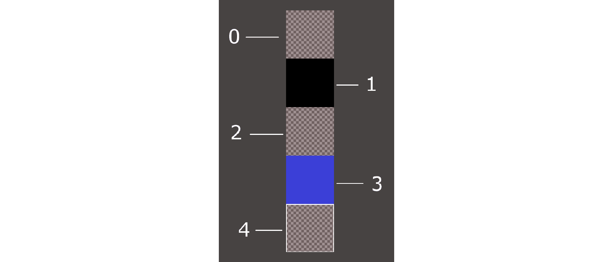
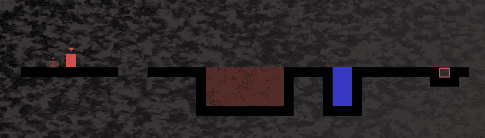
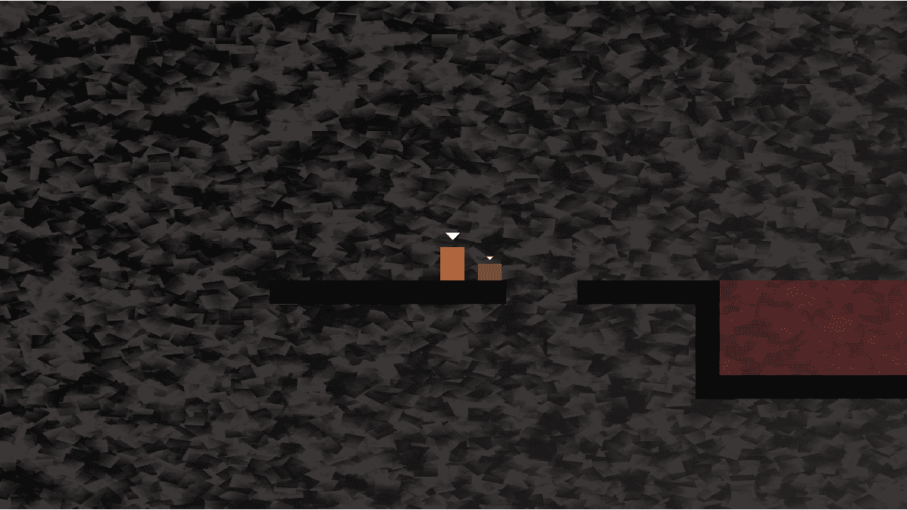
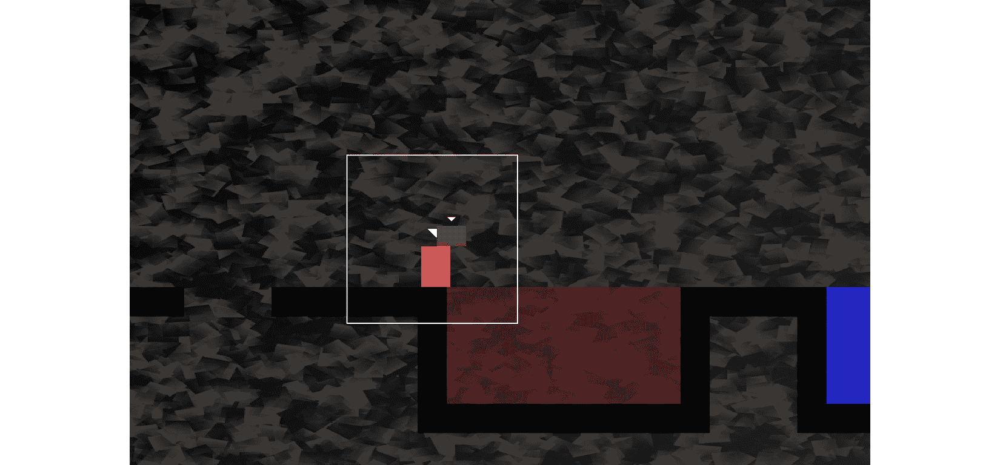
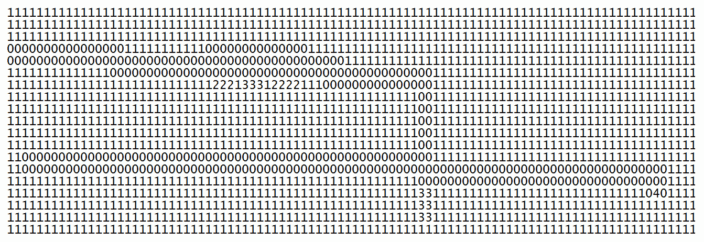
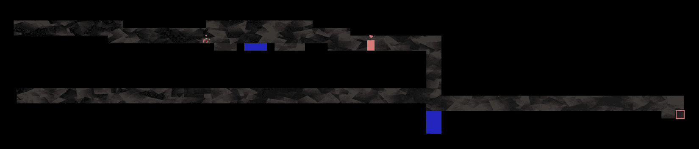
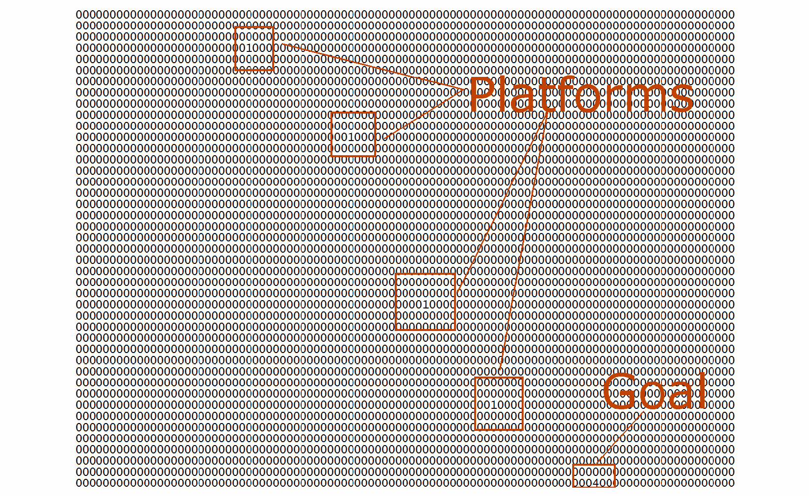
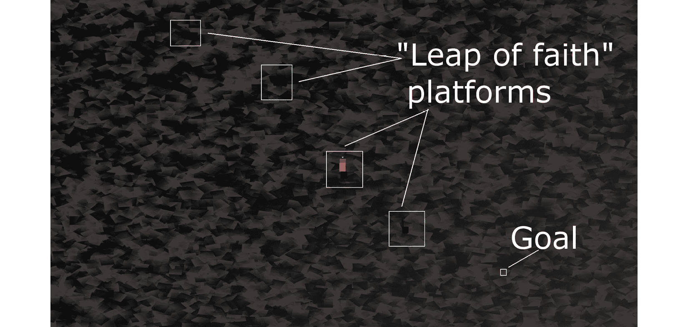

# *第十六章*：构建可玩关卡和碰撞检测

这可能是这个项目中最有满足感的一章。原因是，到本章结束时，我们将有一个可玩的游戏。尽管仍有一些功能需要实现（声音、粒子效果、HUD 和着色器效果），但鲍勃和托马斯将能够跑步、跳跃和探索世界。此外，你只需在文本文件中创建平台和障碍物，就可以创建任何大小或复杂性的自己的关卡设计。

我们将通过以下主题来实现所有这些：

+   探索如何在文本文件中设计关卡

+   构建一个`LevelManager`类，它将从文本文件中加载关卡，将它们转换为游戏可以使用的数据，并跟踪关卡细节，如出生位置、当前关卡和允许的时间限制

+   更新游戏引擎以使用`LevelManager`

+   编写一个多态函数来处理鲍勃和托马斯的碰撞检测

# 设计一些关卡

记得我们在*第十四章*中介绍的精灵图集，*抽象和代码管理 – 更好地利用面向对象编程*？这里它又出现了，用数字标注了我们将构建所有关卡的地块：



图片被放置在灰色背景上，这样我们可以更好地看到精灵图集的不同细节。棋盘格背景代表透明度级别。因此，除了编号 1 之外的所有地块都将至少透露出它们背后的背景。现在让我们来看看它们：

+   地块 0 是完全透明的，将用于填充没有其他地块的空隙。

+   地块 1 是托马斯和鲍勃将行走的平台。

+   地块 2 用于火焰地块，3 用于水域地块。

+   关于地块 4，你可能需要非常仔细地看才能看到它。它有一个白色的方块轮廓。这是关卡的目标，托马斯和鲍勃必须一起到达的地方。

在我们讨论设计关卡时，请记住这张图片。

我们将把这些地块编号的组合输入到文本文件中，以设计布局。以下是一个例子：

```cpp
0000000000000000000000000000000000000000000000
0000000000000000000000000000000000000000000000
0000000000000000000000000000000000000000000000
0000000000000000000000000000000000000000000000
0000000000000000000000000000000000000000000000
0000000000000000000000000000000000000000000000
1111111111000111111222222221111133111111111411
0000000000000000001222222221000133100000001110
0000000000000000001222222221000133100000000000
0000000000000000001222222221000133100000000000
0000000000000000001111111111000111100000000000
```

之前的代码转换为以下关卡布局：



注意，为了获取之前的截图，我不得不缩小`视图`，并且图片已经被裁剪。实际的关卡开始看起来如下：



这些截图展示了两个要点。首先，你可以看到如何使用简单的免费文本编辑器，如 Windows 记事本或 Notepad ++，快速构建关卡设计。只需确保你使用等宽字体，这样所有的数字都是相同的大小。这使得设计关卡变得容易得多。

其次，这些截图展示了设计的游戏玩法方面。在关卡中从左到右，托马斯和鲍勃需要跳过一个小的洞，否则他们会掉入死亡（重生）。然后，他们需要穿越一大片火海。鲍勃无法跳过这么多方块。玩家需要合作找到解决方案。鲍勃清除火方块的唯一方法就是站在托马斯的头上并从那里跳起，如下面的截图所示：



然后，达到目标并进入下一级就相当简单了。

小贴士

我强烈建议你完成这一章，然后花些时间设计你自己的关卡。

我已经包含了一些关卡设计以供我们开始。它们位于我们在*第十四章*中添加到项目中的`levels`文件夹中，*抽象和代码管理 – 更好地利用面向对象编程*。

那里有游戏的缩略视图，以及关卡设计的代码截图。代码截图可能比重现文本内容更有用。如果需要检查代码，只需打开`levels`文件夹中的文件。

这就是代码的样子：



这是前述代码将生成的关卡布局：



这个关卡就是我*第十四章*中提到的“信仰跳跃”关卡：



以下是对游戏平台代码的突出显示，因为它们在接下来的缩略图中不是很清晰：



提供的设计很简单。游戏引擎能够处理非常大的设计，但我们有自由发挥想象力和构建一些长而具有挑战性的关卡。

当然，这些设计在没有学习如何加载它们并将文本转换为可玩关卡之前不会做任何事情。此外，在没有实现碰撞检测的情况下，玩家无法站在任何平台上。

首先，让我们处理加载关卡设计。

# 构建 LevelManager 类

要使我们的关卡设计工作，需要经过几个阶段的编码。

我们首先将编写`LevelManager`头文件。这将使我们能够查看并讨论`LevelManager`类中将包含的成员变量和函数。

接下来，我们将编写`LevelManager.cpp`文件，其中将包含所有的函数定义。由于这是一个很长的文件，我们将将其分成几个部分进行编码和讨论。

一旦 `LevelManager` 类完成，我们将将其实例添加到游戏引擎（`Engine` 类）中。我们还将向 `Engine` 类添加一个新函数，`loadLevel`，我们可以在需要新级别时从 `update` 函数中调用它。`loadLevel` 函数不仅将使用 `LevelManager` 实例加载适当的级别，还将处理诸如生成玩家角色和准备时钟等方面。

现在，让我们通过编写 `LevelManager.h` 文件来对 `LevelManager` 进行概述。

## 编写 LevelManager.h

右键点击 `LevelManager.h`。最后，点击 `LevelManager` 类。

添加以下包含指令和私有变量，然后我们将讨论它们：

```cpp
#pragma once
#include <SFML/Graphics.hpp>
using namespace sf;
using namespace std;
class LevelManager
{
private:
    Vector2i m_LevelSize;
    Vector2f m_StartPosition;
    float m_TimeModifier = 1;
    float m_BaseTimeLimit = 0;
    int m_CurrentLevel = 0;
    const int NUM_LEVELS = 4;
// public declarations go here
```

上述代码声明了一个 `Vector2i`，`m_LevelSize`，用于存储两个整数值，这两个值将包含当前地图包含的水平方向和垂直方向的瓦片数量。`Vector2f`，`m_StartPosition` 包含 Bob 和 Thomas 应该在世界坐标中生成的坐标。请注意，这并不是与 `m_LevelSize` 单位相关的瓦片位置，而是在级别中的水平和垂直像素位置。

`m_TimeModifier` 成员变量是一个浮点类型变量，它将被用来乘以当前级别中可用的游戏时间。我们想要这样做的原因是，我们可以改变（减少）这个值，以便每次玩家尝试相同的级别时，都可以缩短可用的游戏时间。例如，如果玩家第一次尝试第 1 级时得到 60 秒，那么当然，60 乘以 1 就是 60。当玩家完成所有级别并第二次回到第 1 级时，`m_TimeModifier` 将减少了 10%。然后，当可用时间乘以 0.9 时，玩家可用的游戏时间将是 54 秒。这比原来少了 10%。游戏将逐渐变得更具挑战性。

`m_BaseTimeLimit` 浮点变量持有我们刚刚讨论的原始、未修改的时间限制。

我们可能可以猜测 `m_CurrentLevel` 将存储正在播放的当前级别编号。

`int` 和 `NUM_LEVELS` 常量将用于标记何时适宜再次回到第 1 级并减少 `m_TimeModifier` 的值。

现在，在之前添加的代码之后添加以下公共变量和函数声明：

```cpp
public:
    const int TILE_SIZE = 50;
    const int VERTS_IN_QUAD = 4;
    float getTimeLimit();
    Vector2f getStartPosition();
    int** nextLevel(VertexArray& rVaLevel);
    Vector2i getLevelSize();
    int getCurrentLevel();
};
```

在之前的代码中，有两个 `int` 类型的常量成员。`TILE_SIZE` 是一个有用的常量，提醒我们精灵图中每个瓦片的宽度为五十像素，高度为五十像素。`VERTS_IN_QUAD` 是一个有用的常量，可以使我们对 `VertexArray` 的操作更不容易出错。实际上，一个四边形有四个顶点。现在，我们不要忘记这一点。

`getTimeLimit`、`getStartPosition`、`getLevelSize` 和 `getCurrentLevel` 函数是简单的获取函数，它们返回我们在之前代码块中声明的私有成员变量的当前值。

值得更多讨论的函数是 `nextLevel`。该函数接收一个 `VertexArray` 引用，就像我们在僵尸竞技场游戏中使用的那样。然后该函数可以操作 `VertexArray` 引用，所有更改都将反映在调用代码的 `VertexArray` 引用中。

`nextLevel` 函数返回一个指向指针，这意味着我们可以返回一个二维 `int` 值数组的第一个元素的地址。我们将构建一个二维 `int` 值数组，它将表示每个级别的布局。当然，这些 `int` 值将从级别设计文本文件中读取。

## 编写 LevelManager.cpp 文件

右键点击 `LevelManager.cpp`。最后，点击 `LevelManager` 类的 `.cpp` 文件。

由于这是一个相当长的类，我们将将其分成六个部分来讨论。前五个将涵盖 `nextLevel` 函数，而第六个将涵盖其余的函数。

添加以下包含指令和 `nextLevel` 函数的第一个（五个中的第一个）部分：

```cpp
#include <SFML/Graphics.hpp>
#include <SFML/Audio.hpp>
#include "TextureHolder.h"
#include <sstream>
#include <fstream>
#include "LevelManager.h"
using namespace sf;
using namespace std;
int** LevelManager::nextLevel(VertexArray& rVaLevel)
{
    m_LevelSize.x = 0;
    m_LevelSize.y = 0;
    // Get the next level
    m_CurrentLevel++;
    if (m_CurrentLevel > NUM_LEVELS)
    {
        m_CurrentLevel = 1;
        m_TimeModifier -= .1f;
    }
    // Load the appropriate level from a text file
    string levelToLoad;
    switch (m_CurrentLevel)
    {
    case 1:
        levelToLoad = "levels/level1.txt";
        m_StartPosition.x = 100;
        m_StartPosition.y = 100;
        m_BaseTimeLimit = 30.0f;
        break;
    case 2:
        levelToLoad = "levels/level2.txt";
        m_StartPosition.x = 100;
        m_StartPosition.y = 3600;
        m_BaseTimeLimit = 100.0f;
        break;
    case 3:
        levelToLoad = "levels/level3.txt";
        m_StartPosition.x = 1250;
        m_StartPosition.y = 0;
        m_BaseTimeLimit = 30.0f;
        break;
    case 4:
        levelToLoad = "levels/level4.txt";
        m_StartPosition.x = 50;
        m_StartPosition.y = 200;
        m_BaseTimeLimit = 50.0f;
        break;
    }// End switch
```

在包含指令之后，代码将 `m_LevelSize.x` 和 `m_LevelSize.y` 变量初始化为零。

接下来，`m_CurrentLevel` 增加。随后的 `if` 语句检查 `m_CurrentLevel` 是否大于 `NUM_LEVELS`。如果是，则将 `m_CurrentLevel` 设置回 `1`，并将 `m_TimeModifier` 减少 `0.1` 以缩短所有级别的允许时间。

代码随后根据 `m_CurrentLevel` 保存的值进行切换。每个 `case` 语句初始化包含级别设计的文本文件名、托马斯和鲍勃的起始位置，以及 `m_BaseTimeLimit`，这是所讨论级别的未修改时间限制。

小贴士

如果你设计自己的级别，请在此处添加一个 `case` 语句及其相应的值。还要编辑 `LevelManager.h` 文件中的 `NUM_LEVELS` 常量。

现在，添加 `nextLevel` 函数的第二部分，如下所示。将此代码立即添加到前面的代码之后。在我们添加代码的同时研究代码，这样我们就可以讨论它：

```cpp
    ifstream inputFile(levelToLoad);
    string s;
    // Count the number of rows in the file
    while (getline(inputFile, s))
    {
        ++m_LevelSize.y;
    }
    // Store the length of the rows
    m_LevelSize.x = s.length();
```

在前面的（第二部分）代码中，我们声明了一个名为 `inputFile` 的 `ifstream` 对象，该对象打开到 `levelToLoad` 中包含的文件名的流。

代码通过 `getLine` 函数遍历文件的每一行，但并不记录其内容。它所做的只是通过增加 `m_LevelSize.y` 来计数行数。在 `for` 循环之后，使用 `s.length` 函数将级别的宽度保存到 `m_LevelSize.x` 中。这表明所有行的长度必须相同，否则我们会遇到麻烦。

在这个阶段，我们已经知道并保存了当前级别的长度和宽度在 `m_LevelSize` 中。

现在，添加 `nextLevel` 函数的第三部分，如下所示代码。将代码立即添加到前面的代码之下。在我们添加代码的同时研究代码，这样我们就可以讨论它：

```cpp
    // Go back to the start of the file
    inputFile.clear();
    inputFile.seekg(0, ios::beg);
    // Prepare the 2D array to hold the int values from the file
    int** arrayLevel = new int*[m_LevelSize.y];
    for (int i = 0; i < m_LevelSize.y; ++i)
    {
        // Add a new array into each array element
        arrayLevel[i] = new int[m_LevelSize.x];
    }
```

首先，我们使用其`clear`函数清除`inputFile`。`seekg`函数，使用`0, ios::beg`参数调用，将文件光标的位置（下一个读取字符的位置）移动到文件开头。

接下来，我们声明一个指向指针的指针`arrayLevel`。注意，这是使用`new`关键字在自由存储/堆上完成的。一旦我们初始化了这个二维数组，我们就能将其地址返回给调用代码，并且它将一直持续到我们删除它或游戏关闭。

`for`循环从 0 循环到`m_LevelSize.y -1`。在循环的每次迭代中，它向堆中添加一个`int`值的新数组，以匹配`m_LevelSize.x`的值。现在我们有一个完美配置的（对于当前级别）二维数组。唯一的问题是它里面还没有任何内容。

现在，添加`nextLevel`函数的第四部分，如下所示代码。立即在之前的代码之后添加此代码。在我们添加代码的同时研究代码，这样我们就可以讨论它：

```cpp
    // Loop through the file and store all 
   // the values in the 2d array
    string row;
    int y = 0;
    while (inputFile >> row)
    {
        for (int x = 0; x < row.length(); x++) {
            const char val = row[x];
            arrayLevel[y][x] = atoi(&val);
        }
        y++;
    }
    // Close the file
    inputFile.close();
```

首先，代码初始化一个名为`row`的`string`，它将一次只保存一层设计的一行。我们还声明并初始化一个名为`y`的`int`，它将帮助我们计数行数。

`while`循环会重复执行，直到`inputFile`超过最后一行。在`while`循环内部，有一个`for`循环，它会遍历当前行的每个字符，并将其存储在二维数组`arrayLevel`中。注意，我们使用`arrayLevel[y][x]=`访问二维数组的右侧元素。`atoi`函数将`char val`转换为`int`。这是必需的，因为我们有一个用于`int`的二维数组，而不是用于`char`的。

现在，让我们添加`nextLevel`函数的第五部分，如下所示。立即在之前的代码之后添加此代码。在我们添加代码的同时研究代码，这样我们就可以讨论它：

```cpp
    // What type of primitive are we using?
    rVaLevel.setPrimitiveType(Quads);
    // Set the size of the vertex array
    rVaLevel.resize(m_LevelSize.x * 
      m_LevelSize.y * VERTS_IN_QUAD);
    // Start at the beginning of the vertex array
    int currentVertex = 0;
    for (int x = 0; x < m_LevelSize.x; x++)
    {
        for (int y = 0; y < m_LevelSize.y; y++)
        {
            // Position each vertex in the current quad
            rVaLevel[currentVertex + 0].position = 
                Vector2f(x * TILE_SIZE, 
                y * TILE_SIZE);
            rVaLevel[currentVertex + 1].position = 
                Vector2f((x * TILE_SIZE) + TILE_SIZE, 
                y * TILE_SIZE);
            rVaLevel[currentVertex + 2].position = 
                Vector2f((x * TILE_SIZE) + TILE_SIZE, 
                (y * TILE_SIZE) + TILE_SIZE);
            rVaLevel[currentVertex + 3].position = 
                Vector2f((x * TILE_SIZE), 
                (y * TILE_SIZE) + TILE_SIZE);
            // Which tile from the sprite sheet should we use
            int verticalOffset = arrayLevel[y][x] * TILE_SIZE;
            rVaLevel[currentVertex + 0].texCoords = 
                Vector2f(0, 0 + verticalOffset);
            rVaLevel[currentVertex + 1].texCoords = 
                Vector2f(TILE_SIZE, 0 + verticalOffset);
            rVaLevel[currentVertex + 2].texCoords = 
                Vector2f(TILE_SIZE, TILE_SIZE + verticalOffset);
            rVaLevel[currentVertex + 3].texCoords = 
                Vector2f(0, TILE_SIZE + verticalOffset);
            // Position ready for the next four vertices
            currentVertex = currentVertex + VERTS_IN_QUAD;
        }
    }
    return arrayLevel;
} // End of nextLevel function
```

虽然这是五个部分中最长的代码段（我们将`nextLevel`分成了两部分），但它也是最直接的。这是因为我们在 Zombie Arena 项目中看到了非常相似的代码。

上述代码的过程是，嵌套的`for`循环从零开始循环到当前层的宽度和高度。对于数组中的每个位置，将四个顶点放入`VertexArray`，并从精灵图中分配四个纹理坐标。顶点和纹理坐标的位置是使用`currentVertex`变量、`TILE SIZE`和`VERTS_IN_QUAD`常量计算得出的。在内层`for`循环的每次循环结束时，`currentVertex`增加`VERTS_IN_QUAD`，从而顺利移动到下一个瓦片。

重要提示

关于`VertexArray`需要记住的重要一点是，它是通过引用传递给`nextLevel`的。因此，`VertexArray`将在调用代码中可用。我们将从`Engine`类中的代码调用`nextLevel`。

一旦调用此函数，`Engine` 类将有一个 `VertexArray` 来图形化表示关卡，以及一个二维 `int` 值数组，作为关卡中所有平台和障碍物的数值表示。

`LevelManager` 类的其余函数都是简单的获取函数，但请花时间熟悉每个函数返回哪个私有值。添加 `LevelManager` 类的其余函数，如下所示：

```cpp
Vector2i LevelManager::getLevelSize()
{
    return m_LevelSize;
}
int LevelManager::getCurrentLevel()
{
    return m_CurrentLevel;
}
float LevelManager::getTimeLimit()
{
    return m_BaseTimeLimit * m_TimeModifier;
}
Vector2f LevelManager::getStartPosition()
{
    return m_StartPosition;
}
```

现在 `LevelManager` 类已经完成，我们可以继续使用它。我们将在 `Engine` 类中编写另一个函数来实现这一点。

# 编写 loadLevel 函数

为了清晰起见，此函数是 `Engine` 类的一部分，尽管它将大部分工作委托给其他函数，包括我们刚刚构建的 `LevelManager` 类的函数。

首先，让我们将新函数的声明以及一些其他新代码添加到 `Engine.h` 文件中。打开 `Engine.h` 文件，并添加 `Engine.h` 文件缩略快照中显示的突出显示的代码行，如下所示：

```cpp
#pragma once
#include <SFML/Graphics.hpp>
#include "TextureHolder.h"
#include "Thomas.h"
#include "Bob.h"
#include "LevelManager.h"
using namespace sf;
class Engine
{
private:
    // The texture holder
    TextureHolder th;
    // Thomas and his friend, Bob
    Thomas m_Thomas;
    Bob m_Bob;
    // A class to manage all the levels
    LevelManager m_LM;
    const int TILE_SIZE = 50;
    const int VERTS_IN_QUAD = 4;
    // The force pushing the characters down
    const int GRAVITY = 300;
    // A regular RenderWindow
    RenderWindow m_Window;
    // The main Views
    View m_MainView;
    View m_LeftView;
    View m_RightView;
    // Three views for the background
    View m_BGMainView;
    View m_BGLeftView;
    View m_BGRightView;
    View m_HudView;
    // Declare a sprite and a Texture for the background
    Sprite m_BackgroundSprite;
    Texture m_BackgroundTexture;
    // Is the game currently playing?
    bool m_Playing = false;
    // Is character 1 or 2 the current focus?
    bool m_Character1 = true;
    // Start in full screen mode
    bool m_SplitScreen = false;
    // How much time is left in the current level
    float m_TimeRemaining = 10;
    Time m_GameTimeTotal;
    // Is it time for a new/first level?
    bool m_NewLevelRequired = true;
    // The vertex array for the level tiles
    VertexArray m_VALevel;
    // The 2d array with the map for the level
    // A pointer to a pointer
    int** m_ArrayLevel = NULL;
    // Texture for the level tiles
    Texture m_TextureTiles;

    // Private functions for internal use only
    void input();
    void update(float dtAsSeconds);
    void draw();    
    // Load a new level
    void loadLevel();

public:
    // The Engine constructor
    Engine();
    ...
    ...        
    ...
```

这就是我们可以在前面的代码中看到的内容：

+   我们包含了 `LevelManager.h` 文件。

+   我们添加了一个名为 `m_LM` 的 `LevelManager` 实例。

+   我们添加了一个名为 `m_VALevel` 的 `VertexArray`。

+   我们添加了一个指向指向整数的指针，它将持有从 `nextLevel` 返回的二维数组。

+   我们为精灵图集添加了一个新的 `Texture` 对象。

+   我们添加了我们将要编写的 `loadLevel` 函数的声明。

右键单击 `LoadLevel.cpp`。最后，单击 `loadLevel` 函数。

将 `loadLevel` 函数的代码添加到 `LoadLevel.cpp` 文件中。然后，我们可以讨论它：

```cpp
#include "Engine.h"
void Engine::loadLevel()
{
    m_Playing = false;
    // Delete the previously allocated memory
    for (int i = 0; i < m_LM.getLevelSize().y; ++i)
    {
        delete[] m_ArrayLevel[i];
    }
    delete[] m_ArrayLevel;
    // Load the next 2d array with the map for the level
    // And repopulate the vertex array as well
    m_ArrayLevel = m_LM.nextLevel(m_VALevel);
    // How long is this new time limit
    m_TimeRemaining = m_LM.getTimeLimit();
    // Spawn Thomas and Bob
    m_Thomas.spawn(m_LM.getStartPosition(), GRAVITY);
    m_Bob.spawn(m_LM.getStartPosition(), GRAVITY);
    // Make sure this code isn't run again
    m_NewLevelRequired = false;
}
```

首先，我们将 `m_Playing` 设置为 `false` 以停止 `update` 函数的部分执行。接下来，我们遍历 `m_ArrayLevel` 中的所有水平数组并将它们删除。在 `for` 循环之后，我们删除 `m_ArrayLevel` 本身。

`m_ArrayLevel = m_LM.nextLevel(m_VALevel)` 调用 `nextLevel` 并准备 `VertexArray` `m_VALevel` 以及称为 `m_ArrayLevel` 的二维数组。关卡已设置并准备就绪。

通过调用 `getTimeLimit` 初始化 `m_TimeRemaining`，并使用 `spawn` 函数生成 Thomas 和 Bob，同时使用 `getStartPosition` 返回的值。

最后，将 `m_NewLevelRequired` 设置为 `false`。正如我们将在几页后看到的那样，将 `m_NewLevelRequired` 设置为 `true` 会导致调用 `loadLevel`。我们只想运行这个函数一次。

# 更新引擎

打开 `Engine.cpp` 文件，并在 Engine 构造函数的末尾添加以下突出显示的代码来加载精灵图集纹理：

```cpp
Engine::Engine()
{
    // Get the screen resolution and create an SFML window and View
    Vector2f resolution;
    resolution.x = VideoMode::getDesktopMode().width;
    resolution.y = VideoMode::getDesktopMode().height;
    m_Window.create(VideoMode(resolution.x, resolution.y),
        "Thomas was late",
        Style::Fullscreen);
    // Initialize the full screen view
    m_MainView.setSize(resolution);
    m_HudView.reset(
        FloatRect(0, 0, resolution.x, resolution.y));
    // Initialize the split-screen Views
    m_LeftView.setViewport(
        FloatRect(0.001f, 0.001f, 0.498f, 0.998f));
    m_RightView.setViewport(
        FloatRect(0.5f, 0.001f, 0.499f, 0.998f));
    m_BGLeftView.setViewport(
        FloatRect(0.001f, 0.001f, 0.498f, 0.998f));
    m_BGRightView.setViewport(
        FloatRect(0.5f, 0.001f, 0.499f, 0.998f));
    // Can this graphics card use shaders?
    if (!sf::Shader::isAvailable())
    {
        // Time to get a new PC
        m_Window.close();
    }
    m_BackgroundTexture = TextureHolder::GetTexture(
        "graphics/background.png");
    // Associate the sprite with the texture
    m_BackgroundSprite.setTexture(m_BackgroundTexture);
    // Load the texture for the background vertex array
    m_TextureTiles = TextureHolder::GetTexture(
        "graphics/tiles_sheet.png");
}
```

在前面的代码中，我们只是将精灵图集加载到 `m_TextureTiles`。

打开 `Update.cpp` 文件，进行以下突出显示的更改和添加：

```cpp
void Engine::update(float dtAsSeconds)
{
    if (m_NewLevelRequired)
    {
        // These calls to spawn will be moved to a new
        // loadLevel function soon
        // Spawn Thomas and Bob
        //m_Thomas.spawn(Vector2f(0,0), GRAVITY);
        //m_Bob.spawn(Vector2f(100, 0), GRAVITY);
        // Make sure spawn is called only once
        //m_TimeRemaining = 10;
        //m_NewLevelRequired = false;
        // Load a level
        loadLevel();

    }
```

实际上，我们应该删除而不是注释掉我们不再使用的行。我之所以这样展示，是为了使更改清晰。在之前的`if`语句中，应该只有调用`loadLevel`的代码。

最后，在我们能够看到本章到目前为止所做工作的结果之前，打开`Draw.cpp`文件，并添加以下突出显示的修改以绘制表示一个级别的顶点数组：

```cpp
void Engine::draw()
{
    // Rub out the last frame
    m_Window.clear(Color::White);
    if (!m_SplitScreen)
    {
        // Switch to background view
        m_Window.setView(m_BGMainView);
        // Draw the background
        m_Window.draw(m_BackgroundSprite);
        // Switch to m_MainView
        m_Window.setView(m_MainView);        
        // Draw the Level
        m_Window.draw(m_VALevel, &m_TextureTiles);
        // Draw thomas
        m_Window.draw(m_Thomas.getSprite());
        // Draw bob
        m_Window.draw(m_Bob.getSprite());
    }
    else
    {
        // Split-screen view is active
        // First draw Thomas' side of the screen
        // Switch to background view
        m_Window.setView(m_BGLeftView);
        // Draw the background
        m_Window.draw(m_BackgroundSprite);
        // Switch to m_LeftView
        m_Window.setView(m_LeftView);
        // Draw the Level
        m_Window.draw(m_VALevel, &m_TextureTiles);

        // Draw bob
        m_Window.draw(m_Bob.getSprite());
        // Draw thomas
        m_Window.draw(m_Thomas.getSprite());

        // Now draw Bob's side of the screen
        // Switch to background view
        m_Window.setView(m_BGRightView);
        // Draw the background
        m_Window.draw(m_BackgroundSprite);
        // Switch to m_RightView
        m_Window.setView(m_RightView);
        // Draw the Level
        m_Window.draw(m_VALevel, &m_TextureTiles);
        // Draw thomas
        m_Window.draw(m_Thomas.getSprite());
        // Draw bob
        m_Window.draw(m_Bob.getSprite());

    }
    // Draw the HUD
    // Switch to m_HudView
    m_Window.setView(m_HudView);

    // Show everything we have just drawn
    m_Window.display();
}
```

注意，我们需要为所有屏幕选项（全屏、左屏和右屏）绘制`VertexArray`。

现在，你可以运行游戏了。然而，不幸的是，Thomas 和 Bob 会直接穿过我们精心设计的所有平台。因此，我们无法尝试通过关卡并击败时钟。

# 碰撞检测

我们将使用矩形交集和 SFML 的`intersects`函数来处理碰撞检测。在这个项目中，我们将把碰撞检测代码抽象成一个单独的函数。正如我们已经看到的，Thomas 和 Bob 有多个矩形（`m_Head`、`m_Feet`、`m_Left`和`m_Right`），我们需要检查这些矩形是否发生碰撞。

## 编写`detectCollisions`函数

为了清晰起见，这个函数是`Engine`类的一部分。打开`Engine.h`文件，并添加一个名为`detectCollisions`的函数声明。以下代码片段中已突出显示：

```cpp
    // Private functions for internal use only
    void input();
    void update(float dtAsSeconds);
    void draw();
    // Load a new level
    void loadLevel();
    bool detectCollisions(PlayableCharacter& character);

public:
    // The Engine constructor
    Engine();
```

注意，从签名中可以看出，`detectCollision`函数接受一个作为`PlayerCharacter`对象的泛型参数。正如我们所知，`PlayerCharacter`是抽象的，永远不能实例化。然而，我们确实通过`Thomas`和`Bob`类从它继承。我们将能够将`m_Thomas`或`m_Bob`传递给`detectCollisions`。

右键点击`DetectCollisions.cpp`。最后，点击`detectCollisions`函数。

将以下代码添加到`DetectCollisions.cpp`中。请注意，这仅仅是这个函数的第一部分：

```cpp
#include "Engine.h"
bool Engine::detectCollisions(PlayableCharacter& character)
{
    bool reachedGoal = false;
    // Make a rect for all his parts
    FloatRect detectionZone = character.getPosition();
    // Make a FloatRect to test each block
    FloatRect block;
    block.width = TILE_SIZE;
    block.height = TILE_SIZE;
    // Build a zone around thomas to detect collisions
    int startX = (int)(detectionZone.left / TILE_SIZE) - 1;
    int startY = (int)(detectionZone.top / TILE_SIZE) - 1;
    int endX = (int)(detectionZone.left / TILE_SIZE) + 2;
    // Thomas is quite tall so check a few tiles vertically
    int endY = (int)(detectionZone.top / TILE_SIZE) + 3;
    // Make sure we don't test positions lower than zero
    // Or higher than the end of the array
    if (startX < 0)startX = 0;
    if (startY < 0)startY = 0;
    if (endX >= m_LM.getLevelSize().x)
        endX = m_LM.getLevelSize().x;
    if (endY >= m_LM.getLevelSize().y)
        endY = m_LM.getLevelSize().y;
```

我们首先声明一个名为`reachedGoal`的布尔值。这是`detectCollisions`函数返回给调用代码的值。它被初始化为`false`。

接下来，我们声明一个名为`detectionZone`的`FloatRect`对象，并用代表整个角色精灵矩形相同的矩形初始化它。请注意，我们实际上不会与这个矩形进行交集测试。之后，我们声明另一个名为`block`的`FloatRect`。我们将`block`初始化为一个 50x50 的游戏单位矩形。我们很快就会看到`block`的使用。

接下来，我们将看看如何使用`detectionZone`。我们通过在`detectionZone`周围扩展几个方块的区域来初始化四个`int`变量，`startX`、`startY`、`endX`和`endY`。在接下来的四个`if`语句中，我们检查不可能尝试在不存在的小块上进行碰撞检测。我们将通过确保我们永远不会检查小于零或大于`getLevelSize().x`或`.y`返回值的坐标位置来实现这一点。

所有之前的代码所做的是创建一个用于碰撞检测的区域。在距离角色数百或数千像素的方块上进行碰撞检测是没有意义的。此外，如果我们尝试在数组位置不存在的地方（小于零或大于`getLevelSize()...`）进行碰撞检测，游戏将会崩溃。

接下来，添加以下代码，用于处理玩家从关卡中掉落的情况：

```cpp
    // Has the character fallen out of the map?
    FloatRect level(0, 0, 
        m_LM.getLevelSize().x * TILE_SIZE, 
        m_LM.getLevelSize().y * TILE_SIZE);

    if (!character.getPosition().intersects(level))
    {
        // respawn the character
        character.spawn(m_LM.getStartPosition(), GRAVITY);
    }
```

为了使角色停止下落，它必须与平台发生碰撞。因此，如果玩家移动出地图（那里没有平台），他们将会持续下落。之前的代码检查角色是否没有与`FloatRect`、`level`相交。如果没有，那么它已经掉出关卡，`spawn`函数将其送回起点。

添加以下相当长的代码块，然后我们将解释它的功能：

```cpp
    // Loop through all the local blocks
    for (int x = startX; x < endX; x++)
    {
        for (int y = startY; y < endY; y++)
        {
            // Initialize the starting position of the current block
            block.left = x * TILE_SIZE;
            block.top = y * TILE_SIZE;
            // Has character been burnt or drowned?
            // Use head as this allows him to sink a bit
            if (m_ArrayLevel[y][x] == 2 || m_ArrayLevel[y][x] == 3)
            {
                if (character.getHead().intersects(block))
                {
                    character.spawn(m_LM.getStartPosition(), GRAVITY);
                    // Which sound should be played?
                    if (m_ArrayLevel[y][x] == 2)// Fire, ouch!
                    {
                        // Play a sound
                    }
                    else // Water
                    {
                        // Play a sound
                    }
                }
            }

            // Is character colliding with a regular block
            if (m_ArrayLevel[y][x] == 1)
            {
                if (character.getRight().intersects(block))
                {
                    character.stopRight(block.left);
                }
                else if (character.getLeft().intersects(block))
                {
                    character.stopLeft(block.left);
                }
                if (character.getFeet().intersects(block))
                {
                    character.stopFalling(block.top);
                }
                else if (character.getHead().intersects(block))
                {
                    character.stopJump();
                }
            }

            // More collision detection here once we have 
            // learned about particle effects
            // Has the character reached the goal?
            if (m_ArrayLevel[y][x] == 4)
            {
                // Character has reached the goal
                reachedGoal = true;
            }
        }
    }
```

之前的代码使用相同的技巧做了三件事。它遍历`startX`、`endX`和`startY`、`endY`之间的所有值。对于每次遍历，它都会检查并执行以下操作：

+   角色是否被烧伤或淹死？`if (m_ArrayLevel[y][x] == 2 || m_ArrayLevel[y][x] == 3)`确定当前检查的位置是否是火或水方块。如果角色的头部与这些方块之一相交，玩家将被重生。我们还编写了一个空的`if`/`else`块，为下一章添加声音做准备。

+   角色是否触碰到普通方块？`code if (m_ArrayLevel[y][x] == 1)`确定当前检查的位置是否持有普通方块。如果它与代表角色各个身体部位的矩形之一相交，则调用相关函数（`stopRight`、`stopLeft`、`stopFalling`或`stopJump`）。传递给每个函数的值以及函数如何使用这些值来重新定位角色相当微妙。虽然理解代码不需要仔细检查这些值，但我们可能想查看传递的值，然后参考上一章中`PlayableCharacter`类的适当函数。这将帮助你真正理解正在发生的事情。

+   角色是否触碰到目标方块？这是通过`if (m_ArrayLevel[y][x] == 4)`来确定的。我们只需要将`reachedGoal`设置为`true`。`Engine`类的`update`函数将跟踪两个角色（托马斯和鲍勃）是否同时达到目标。我们将在下一分钟内将此代码写入`update`函数。

将以下行代码添加到`detectCollisions`函数中：

```cpp
    // All done, return, whether or 
   // not a new level might be required
    return reachedGoal;
}
```

上一行代码返回`reachedGoal`布尔值，以便调用代码可以跟踪并适当地响应，如果两个角色同时达到目标。

我们现在需要做的只是对每个字符、每帧调用一次`detectCollision`函数。在`Update.cpp`文件中`if(m_Playing)`代码块内添加以下高亮代码：

```cpp
if (m_Playing)
{
    // Update Thomas
    m_Thomas.update(dtAsSeconds);
    // Update Bob
    m_Bob.update(dtAsSeconds);
// Detect collisions and see if characters 
    // have reached the goal tile
    // The second part of the if condition is only executed
    // when thomas is touching the home tile
    if (detectCollisions(m_Thomas) && detectCollisions(m_Bob))
    {
        // New level required
        m_NewLevelRequired = true;
        // Play the reach goal sound    
    }
    else
    {
        // Run bobs collision detection
        detectCollisions(m_Bob);
    }
    // Count down the time the player has left
    m_TimeRemaining -= dtAsSeconds;
    // Have Thomas and Bob run out of time?
    if (m_TimeRemaining <= 0)
    {
        m_NewLevelRequired = true;
    }
}// End if playing
```

之前的代码调用了`detectCollision`函数，并检查鲍勃和托马斯是否同时达到目标。如果他们做到了，那么下一级将通过将`m_NewLevelRequired`设置为`true`来准备。

你可以运行游戏并在平台上行走。你可以达到目标并开始新的一级。此外，对于第一次，跳跃按钮（*W*或*向上箭头*）将生效。

如果你达到目标，则将加载下一级。如果你达到最后一关的目标，则第一级将以 10%减少的时间限制加载。当然，由于我们还没有构建 HUD，所以没有时间或当前级别的视觉反馈。我们将在下一章中这样做。

然而，许多关卡需要托马斯和鲍勃作为团队一起工作。更具体地说，托马斯和鲍勃需要能够爬到彼此的头上。

## 更多碰撞检测

在`Update.cpp`文件中添加了之前的代码之后，在`if (m_Playing)`部分之后添加以下代码：

```cpp
if (m_Playing)
{
    // Update Thomas
    m_Thomas.update(dtAsSeconds);
    // Update Bob
    m_Bob.update(dtAsSeconds);
    // Detect collisions and see if characters 
    // have reached the goal tile
    // The second part of the if condition is only executed
    // when thomas is touching the home tile
    if (detectCollisions(m_Thomas) && detectCollisions(m_Bob))
    {
        // New level required
        m_NewLevelRequired = true;
        // Play the reach goal sound
    }
    else
    {
        // Run bobs collision detection
        detectCollisions(m_Bob);
    }
    // Let bob and thomas jump on each others heads
    if (m_Bob.getFeet().intersects(m_Thomas.getHead()))
    {
        m_Bob.stopFalling(m_Thomas.getHead().top);
    }
    else if (m_Thomas.getFeet().intersects(m_Bob.getHead()))
    {
        m_Thomas.stopFalling(m_Bob.getHead().top);
    }
    // Count down the time the player has left
    m_TimeRemaining -= dtAsSeconds;
    // Have Thomas and Bob run out of time?
    if (m_TimeRemaining <= 0)
    {
        m_NewLevelRequired = true;
    }
}// End if playing
```

你可以再次运行游戏并站在托马斯和鲍勃的头上，以到达之前无法到达的难以到达的地方：


# 摘要

本章中有很多代码。我们学习了如何从文件中读取并将文本字符串转换为`char`值，然后转换为 int`值`。一旦我们有了`int`值的二维数组，我们就能填充一个`VertexArray`实例来在屏幕上显示关卡。然后我们使用相同的`int`值的二维数组来实现碰撞检测。我们使用了矩形交集，就像我们在 Zombie Arena 项目中做的那样，不过这次，为了提高精度，我们给每个角色分配了四个碰撞区域——分别代表他们的头部、脚部、左侧和右侧。

现在游戏已经完全可玩，我们需要在屏幕上表示游戏状态（得分和时间）。在下一章中，我们将实现 HUD，以及一些比我们迄今为止使用的更高级的声音效果。
