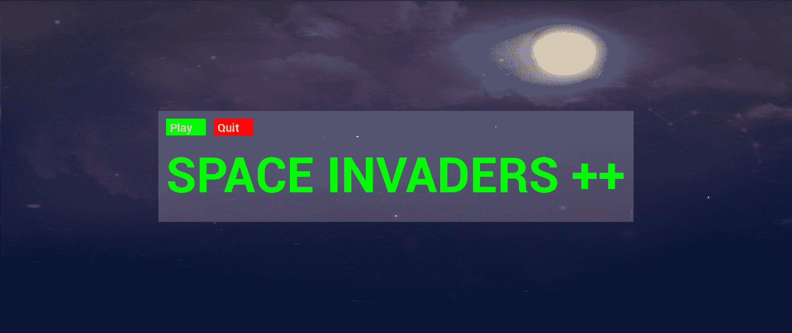
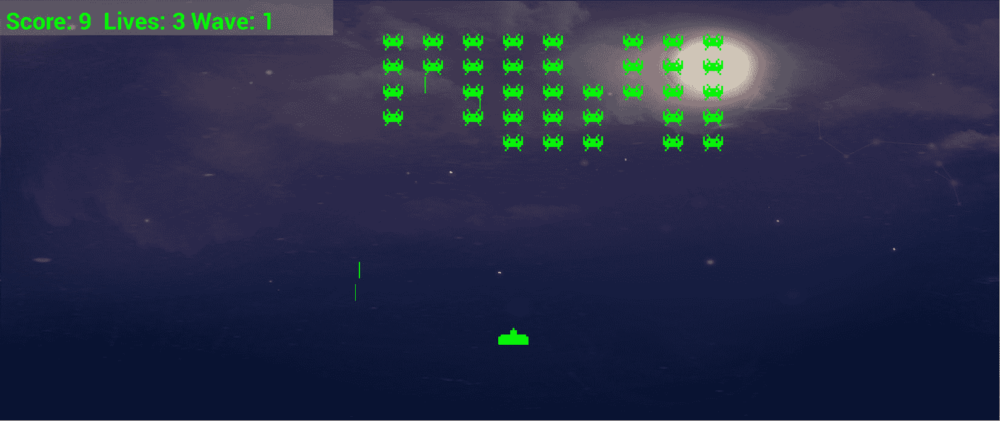
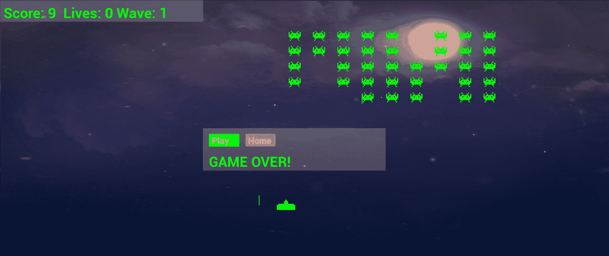
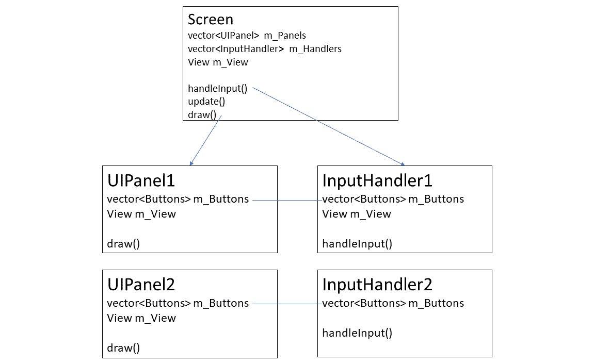
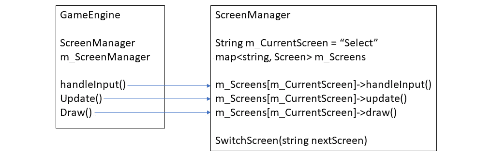
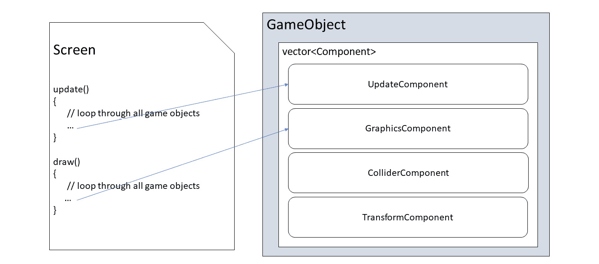
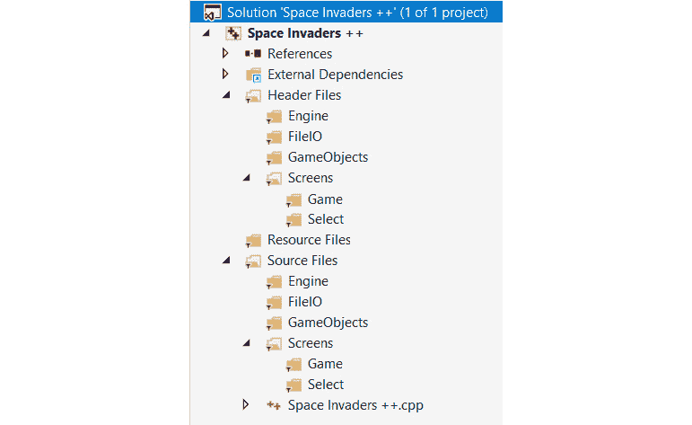
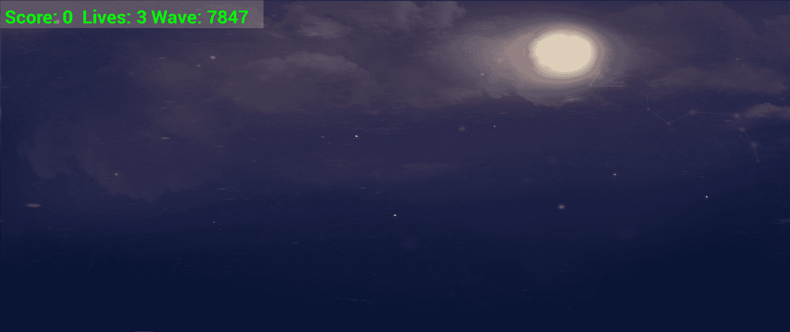
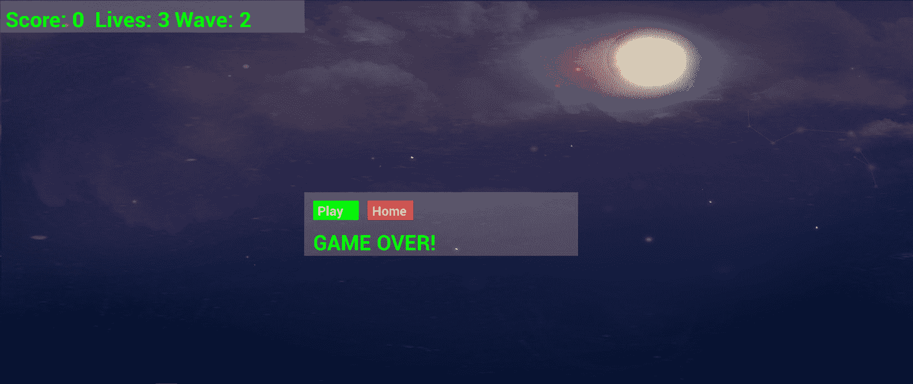

# *第十九章*：游戏编程设计模式 – 开始 Space Invaders ++ 游戏

欢迎来到最终项目。正如你现在所期待的，这个项目将在学习新的 C++ 技巧方面迈出重要的一步。接下来的四章将探讨诸如 **智能指针**、C++ **断言**、使用游戏手柄控制器、使用 Visual Studio 进行调试、**类型转换**基类指针到特定派生类指针、调试以及设计模式的第一瞥等主题。

我猜测，如果你打算用 C++ 制作深度、大规模的游戏，那么设计模式将是你未来几个月和几年学习计划中的重要部分。为了介绍这个至关重要的主题，我选择了一个相对简单但有趣的游戏作为例子。在本章中，我们将更深入地了解 Space Invaders ++ 游戏，然后我们可以继续讨论设计模式及其必要性。

在这一章中，我们将涵盖以下主题：

+   了解 Space Invaders ++ 以及为什么我们选择它作为最终项目。

+   了解什么是设计模式以及为什么它们对游戏开发者很重要。

+   研究在接下来的四章中将在 Space Invaders ++ 项目中使用的各种设计模式。

+   我们将开始 Space Invaders ++ 项目。

+   编写多个类以开始充实游戏。

让我们谈谈游戏本身。

# Space Invaders ++

看看以下三个截图，它们从视觉上解释了我们关于 Space Invaders ++ 需要知道的大部分内容。如果你还不知道，Space Invaders 是最早的街机游戏之一，于 1978 年发布。如果你对历史感兴趣，你可以在这里阅读维基百科上的 Space Invaders 游戏页面：[`en.wikipedia.org/wiki/Space_Invaders`](https://en.wikipedia.org/wiki/Space_Invaders)。

这第一张截图显示了游戏简单的起始屏幕。为了讨论屏幕，我们将在下一部分进行讨论，我们将称这个屏幕为 **选择屏幕**。玩家有两个选择：退出或开始游戏。然而，在本章结束时，你将知道如何添加和切换你喜欢的任意多个屏幕：



如你所见，在前面的截图中有我们之前没有实现的新功能：可点击的按钮。我们将在稍后更多地讨论按钮及其对应物，如 UI 面板和屏幕。

以下截图显示了游戏的实际运行情况。游戏玩法相当简单。为了讨论屏幕，我们将在下一部分进行讨论，我们将称以下截图为 **游戏屏幕**。入侵者从左向右移动，并向玩家射击子弹。当他们到达屏幕边缘时，他们会稍微下降，加速，然后返回左侧：



玩家可以左右移动，也可以上下移动，但垂直移动仅限于屏幕的下半部分。

重要提示

原始的 Space Invaders 游戏只允许水平移动。

以下截图显示了玩家在失去三次生命时可以选择的选项。他们可以选择再次玩游戏或退出并返回选择屏幕：



虽然 Space Invaders ++ 允许我们介绍许多我在章节介绍中已经提到的新的 C++主题，以及一些与游戏相关的主题，例如使用游戏手柄控制器，但确实，与之前的项目相比，在复杂性方面并没有真正的提升。那么，为什么选择这个作为最终项目呢？

重要提示

在这个项目中，有很多代码。其中大部分我们在之前已经见过，无论是在相同的环境中还是在不同的环境中。不可能解释每一行代码，因为这需要一本全新的书来做到。我已经非常仔细地选择了要完整解释的代码、只需提及的代码以及我猜测您自己能够解决的代码。我建议您在进步的过程中学习这本书和下载包中的所有代码。然而，我将会详细解释代码的结构，因为这确实是这个项目的真正学习目标。此外，本书中展示了所有的 C++代码，所以没有遗漏，尽管只展示了`level1.txt`文件的概述。

## 为什么选择 Space Invaders ++？

为了开始这次讨论，请考虑我为本书设定的两个目标：

1.  本书第一个目标是向您介绍使用视频游戏学习材料进行 C++编程。我已经在多个场合和多个主题上承认，这只是一个入门。C++和游戏开发太大，无法仅凭这本书来涵盖。

1.  本书第二个目标是让您在继续学习的同时，仍然可以使用游戏作为学习材料。

问题在于，正如我们所看到的，每次我们构建一个比上一个游戏功能更多的游戏，我们最终都会得到一个更复杂的代码结构，代码文件也越来越长。在整个书中，我们学习了新的方法来改进我们的代码结构，在每一个阶段我们都取得了成功，但游戏的日益复杂性似乎总是超过了我们学到的代码改进。

这个项目旨在解决这个复杂性问题，并重新控制我们的源代码。尽管这个游戏比之前的项目深度要低，但需要处理的类将远更多。

这显然意味着一个非常复杂的结构。然而，一旦您掌握了这个结构，您将能够为更复杂的游戏重用它，而无需任何代码文件超过几百行代码。

这个项目旨在让您能够提出自己的游戏想法，即使是复杂的想法，并立即开始使用我们在下一节中将要讨论的设计模式。

小贴士

然而，我绝对不是在暗示这里我们将学习到的代码结构（设计模式）是解决你游戏开发未来的终极方案；实际上，它们离这个目标还远着呢。你将学到的是一些解决方案，这些解决方案将帮助你开始你的梦想项目，而不会因为复杂性而停滞不前。你仍然需要在过程中学习更多关于设计模式、C++和游戏开发的知识。

那么，什么是设计模式呢？

# 设计模式

**设计模式**是一种可重用的编码问题解决方案。实际上，大多数游戏（包括这个游戏）都会使用多个设计模式。关于设计模式的关键点在于：它们已经被证明能够为常见问题提供良好的解决方案。我们不会发明任何设计模式——我们只是将使用一些已经存在的设计模式来解决我们不断增长的代码中的问题。

许多设计模式相当复杂，如果你想要开始学习它们，就需要在本书的水平之上进行进一步的学习。以下是对一些关键游戏开发相关模式的简化，这将有助于实现本书的第二个目标。我们鼓励你继续学习，以便更全面地实现它们，并使用比这里讨论的更多的模式。

让我们看看在 Space Invaders ++项目中使用的设计模式。

## 屏幕、输入处理器、UI 面板和按钮

这个项目将比其他任何项目都进一步抽象化一些概念。Space Invaders ++将引入**屏幕**的概念。屏幕的概念可以通过一些例子来最容易地理解。一个游戏可以有一个菜单屏幕、设置屏幕、高分屏幕和游戏屏幕。**屏幕**是游戏各部分的逻辑划分。每个屏幕都与所有其他屏幕有一些共同点，但每个屏幕也需要其独特的功能。例如，菜单屏幕可能有一些按钮，允许玩家切换到另一个屏幕，以及一个整洁的图形图像，甚至是一个动态场景。高分屏幕当然会有一份所有高分列表，也许还有一个按钮可以返回到菜单屏幕。每个屏幕将具有不同的布局、不同的按钮可以点击，以及对不同键盘按键的不同响应，但它们都需要以 60 FPS 的速度绘制，并以相同的方式与游戏引擎交互。

在之前的项目中，我们将屏幕的概念压缩到了一个地方。这意味着我们有了处理更新、绘制和响应用户交互的长长的`if`、`else`和`else if`代码块。我们的代码已经变得很难处理了。如果我们打算构建更复杂的游戏，我们需要改进这一点。屏幕的概念意味着我们可以创建一个处理每个屏幕发生的所有事情（如更新、绘制和用户交互）的类，然后为每种类型的屏幕创建一个派生类，即菜单、游戏、高分等，这些类处理特定屏幕需要更新的、绘制的和响应用户的独特方式。

在《太空侵略者++》中，我们将有一个`Screen`类。然后我们将从`Screen`类继承以处理两个屏幕，即`SelectScreen`和`GameScreen`。此外，我们还将有一个知道如何显示按钮的`Button`类，一个知道如何绘制文本的`UIPanel`类，以及`Button`实例以及一个知道如何检测键盘和游戏手柄交互的`InputHandler`类。这样我们就能从`UIPanel`和`InputHandler`继承，让所有不同的`Screen`实例都能按照要求精确地表现，而无需多次编写屏幕、UI 面板、输入处理程序或按钮的基础代码。你的游戏越大，屏幕越多，这种方式的益处就越大。这也意味着每个屏幕的具体细节不会像我们之前所做的那样被塞进长长的`if`、`else`和`else if`结构中。

这有点像我们编写`PlayableCharacter`类并从中派生出`Thomas`和`Bob`的方式。然而，正如我们将看到的，这次我们的抽象程度要高得多。看看下面的图表，它展示了这个想法的表示，并且只显示了一个屏幕：



在前面的图表中，我们可以看到屏幕有一个或多个它可以选择性显示的`UIPanel`实例，并且`UIPanel`实例可以有零个或多个`Button`实例。每个`UIPanel`都将有一个相关的`InputHandler`，因为每个`UIPanel`将具有不同的按钮组合和布局。按钮通过指针在`UIPanel`和`InputHandler`实例之间共享。

如果你想知道哪个类处理游戏循环的更新阶段，答案是`Screen`类。然而，一旦你理解了这种模式的工作原理，添加让`UIPanel`实例在更新阶段也能行动的能力将会变得简单。如果，比如说，面板需要移动或者可能显示一个加载进度条，这将是有用的。

一个屏幕将决定哪些 `UIPanel`（因此，`InputHandler`）实例当前可见并响应。然而，一次只有一个屏幕对玩家可见。我们将编写一个 `ScreenManager` 类，这将成为游戏引擎的基本部分，用于调用适当（当前）屏幕的关键功能。`ScreenManager` 类还将提供一种方式，让 `InputHandler` 实例在需要屏幕切换时通知我们，例如，当玩家在选择屏幕上点击 **Play** 按钮以进入游戏屏幕。

`ScreenManager` 将保存每个屏幕的实例，记住玩家当前所在的屏幕，并在正确的屏幕上调用 `update`、`draw` 和 `handleInput`，以及在需要时切换屏幕。以下图表可能会帮助你可视化这个概念，我们也将很快进行编码：



注意，图表和解释是对我们将要编写的解决方案的简化，但它们提供了一个很好的概述。

如果你想在现有屏幕上添加高分屏幕或另一个 `UIPanel` 实例，你将在结束 *第二十二章*，*使用游戏对象和构建游戏* 时知道如何这样做。当然，你很可能会想开始你自己的游戏。你将能够将你的下一款游戏划分为你需要的大量屏幕，每个屏幕都有其专门的布局和输入处理。

## 实体-组件模式

现在，我们将花五分钟沉浸在看似无法解决的混乱中。然后，我们将看到实体-组件模式如何拯救我们。

### 为什么大量多样的对象类型难以管理

在之前的项目中，我们为每个对象编写了一个类。我们有像 Bat、Ball、Crawler 和 Thomas 这样的类。然后在 `update` 函数中，我们会更新它们，在 `draw` 函数中，我们会绘制它们。每个对象决定如何进行更新和绘制。

我们可以开始使用相同的结构来为 Space Invaders ++ 编码。它会工作，但我们正在尝试学习更易于管理的知识，以便我们的游戏可以增加复杂性。

这种方法的一个问题是，我们无法利用继承。例如，所有入侵者、子弹和玩家都以相同的方式绘制自己，但除非我们改变做事的方式，否则我们最终会得到三个几乎相同的 `draw` 函数。如果我们更改调用 `draw` 函数的方式或处理图形的方式，我们需要更新所有三个类。

必须有更好的方法。

### 使用通用的 GameObject 来优化代码结构

如果每个对象、玩家、外星人和所有子弹都是一种通用类型，那么我们可以将它们打包到一个 `vector` 实例中，并遍历它们的每个 `update` 函数，然后是每个 `draw` 函数。

我们已经知道一种做这件事的方法——继承。乍一看，继承可能看起来是一个完美的解决方案。我们可以创建一个抽象的`GameObject`类，然后通过`Player`、`Invader`和`Bullet`类来扩展它。

在所有三个类中相同的`draw`函数可以保留在父类中，我们也不会有那么多浪费的重复代码问题。太好了！

这种方法的问题在于游戏对象在某种程度上是多么多样化。多样性不是一种优势；它只是多样化。例如，所有对象类型移动方式不同。子弹向上或向下移动，入侵者左右移动并偶尔下降，玩家的飞船对输入做出反应。

我们如何将这种多样性融入到`update`中，以便它能控制这种运动？也许我们可以使用类似的东西：

```cpp
update(){
   switch(objectType){
          case 1:
                // All the player's logic
                break;
          case 2:
                // All the invader's logic here
                Break;
          case 3:
                // All the bullet's logic here
                break;
   }
}
```

单独的`update`函数就会比整个`GameEngine`类还要大！

如您从*第十五章*中可能记得，*高级面向对象编程——继承和多态*，当我们从一个类继承时，我们也可以覆盖特定的函数。这意味着我们可以为每种对象类型拥有不同的`update`函数版本。然而，不幸的是，这种方法也存在问题。

`GameEngine`引擎必须“知道”它正在更新哪种类型的对象，或者至少能够查询它正在更新的`GameObject`实例，以便调用正确的`update`函数版本。真正需要的是`GameObject`以某种方式内部选择所需的更新`函数`版本。

不幸的是，即使是看起来似乎可行的解决方案，在仔细检查时也会分崩离析。我说过，`draw`函数中的代码对所有三个对象都是相同的，因此`draw`函数可以是父类的一部分，并由所有子类使用，而不是我们必须编写三个单独的`draw`函数。那么，当我们引入一个需要以不同方式绘制的新的对象时，比如一个飞越屏幕顶部的动画不明飞行物（UFO）时，会发生什么呢？在这种情况下，绘制解决方案也会崩溃。

现在我们已经看到了当对象彼此不同但又渴望属于同一个父类时出现的问题，是时候看看我们在 Space Invaders ++项目中将要使用的解决方案了。

我们需要的是一种新的思考方式来构建我们所有的游戏对象。

## 优先考虑组合而非继承

优先考虑组合而非继承指的是用其他对象组合对象的想法。

重要提示

这个概念最初是在以下出版物中提出的：

*《设计模式：可复用面向对象软件元素》*

由 Erich Gamma, Richard Helm 等人所著。

如果我们能够编写一个处理对象绘制方式的类（而不是函数），那么对于所有以相同方式绘制的类，我们可以在`GameObject`内部实例化这些特殊的绘制类，而任何需要以不同方式绘制的对象都可以拥有不同的绘制对象。然后，当`GameObject`执行不同的操作时，我们只需将其与不同的绘制或更新相关类组合即可。我们所有对象的所有相似之处都可以通过使用相同的代码来受益，而所有差异则不仅可以被封装，还可以被抽象（从基类中提取）。

注意，本节的标题是组合优于继承，而不是组合代替继承。组合并不取代继承，你在*第十五章*，“高级面向对象编程 – 继承和多态”中学到的所有内容仍然适用。然而，在可能的情况下，应使用组合而不是继承。

`GameObject`类是实体，而它将组合的执行诸如更新位置和绘制到屏幕上的操作的类是组件，这就是为什么我们称之为实体-组件模式。

请看以下图表，它表示了我们将在本项目中所实现的实体-组件模式：



在前面的图表中，我们可以看到`GameObject`实例由多个`Component`实例组成。将会有多个从`Component`类派生的不同类，包括`UpdateComponent`和`GraphicsComponent`。此外，还可以从它们进一步派生出更具体的类。例如，`BulletUpdateComponent`和`InvaderUpdateComponent`类将从`UpdateComponent`类派生。这些类将处理子弹和入侵者（分别）在游戏每一帧如何更新自己。这对于封装来说非常好，因为我们不需要大型的`switch`块来区分不同的对象。

当我们使用组合优于继承来创建一组表示行为/算法的类，正如我们在这里所做的那样，这被称为**策略模式**。你可以使用在这里学到的所有内容，并将其称为策略模式。实体-组件是一种不太为人所知但更具体的实现，这就是我们这样称呼它的原因。这种区别是学术性的，但如果你想要进一步探索，请随时查阅谷歌。在*第二十三章*，“在出发前…”，我会向你展示一些这类详细研究的优质资源。

实体-组件模式，以及相对于继承更倾向于使用组合，乍一看听起来很棒，但它也带来了一些自己的问题。这意味着我们的新 `GameObject` 类将需要了解所有不同类型的组件以及游戏中每一种单独的对象。它将如何为自己添加所有正确的组件？

让我们看看解决方案。

## 工厂模式

诚然，如果我们想要这样一个通用的 `GameObject` 类，它可以成为我们想要的任何东西，无论是子弹、玩家、入侵者还是其他任何东西，那么我们就必须编写一些“知道”如何构建这些超级灵活的 `GameObject` 实例，并用正确的组件来组合它们的逻辑。但将所有这些代码添加到类中会使它变得异常难以管理，并且违背了最初使用实体-组件模式的原因。

我们需要一个构造器，它能够执行类似于这个假设的 `GameObject` 代码：

```cpp
class GameObject
{
   UpdateComponent* m_UpdateComponent;
   GraphicsComponent* m_GraphicsComponent;
   // More components
   // The constructor
   GameObject(string type){
      if(type == "invader")
      {
            m_UpdateComp = new InvaderUpdateComponent();   
            m_GraphicsComponent = new StdGraphicsComponent();
      }
      else if(type =="ufo")
       {
              m_UpdateComponent = new 
                   UFOUpdateComponentComponent();
              m_GraphicsComponent = new AnimGraphicsComponent();
       }
      // etc.
      …
   }
};
```

`GameObject` 类不仅需要知道哪些组件与哪个 `GameObject` 实例相关联，还需要知道哪些组件不需要，例如控制玩家的输入相关组件。对于 Space Invaders ++ 项目，我们可以这样做并且勉强应对复杂性，但勉强应对并不是目标；我们想要完全控制。

`GameObject` 类还需要理解所有这些逻辑。使用实体-组件模式中组合而非继承所获得的任何好处或效率都将主要丧失。

此外，如果我们决定我们想要一种新的入侵者类型，比如一个“隐形者”外星人，它靠近玩家，开一枪，然后再次隐形离开？编写一个新的 `GraphicsComponent` 类，比如一个“隐形 GraphicsComponent”类，它“知道”何时可见和不可见，以及一个新的 `UpdateComponent`，比如一个“隐形更新组件”，它通过传送而不是传统方式移动，是可以的，但不好的一点是我们将不得不在 `GameObject` 类构造器中添加一大堆新的 `if` 语句。

实际上，情况比这还要糟糕。如果我们决定常规入侵者现在可以隐形呢？入侵者现在不仅需要一个不同类型的 `GraphicsComponent` 类。我们还得回到 `GameObject` 类中去再次编辑所有那些 `if` 语句。

实际上，还有更多可以想象的情况，它们最终都会导致 `GameObject` 类越来越大。与实体-组件模式完美匹配的 `GameObject` 类相关的问题。

重要提示

这种工厂模式的实现是一个更容易开始学习工厂模式的方法。完成这个项目后，为什么不进行一次网络搜索，看看工厂模式如何得到改进？

游戏设计师将为游戏中的每种类型的对象提供规范，程序员将提供一个工厂类，该类根据游戏设计师的规范构建`GameObject`实例。当游戏设计师提出关于实体的新想法时，我们只需要请求一个新的规范。有时，这可能意味着在工厂中添加一个新的生产线，该生产线使用现有的组件，有时则意味着编写新的组件或更新现有组件。关键是，无论游戏设计师多么有创意，`GameObject`和`GameEngine`类都不会改变。

在工厂代码中，当前的对象类型会被检查，并添加适当的组件（类）到其中。子弹、玩家和入侵者具有相同的图形组件，但所有这些都有不同的更新组件。

当我们使用组合时，可能不太清楚哪个类负责内存。是创建它的类，使用它的类，还是其他某个类？让我们学习更多的 C++知识，以便更简单地管理内存。

# C++智能指针

**智能指针**是我们可以使用来获得与常规指针相同功能但具有额外功能的类——这个额外功能就是它们会负责自己的删除。在我们迄今为止有限地使用指针的方式中，我们删除自己的内存并没有问题，但随着你的代码变得更加复杂，当你在一个类中分配新内存但在另一个类中使用它时，就变得不太清楚哪个类负责在完成使用后删除内存。一个类或函数如何知道另一个类或函数是否已经完成了对一些已分配内存的使用？

解决方案是智能指针。有几种类型的智能指针；在这里，我们将查看两种最常用的类型。使用智能指针成功的关键是使用正确的类型。

我们首先考虑的是**共享指针**。

## 共享指针

共享指针可以安全地删除它所指向的内存的方式是记录对内存区域的不同引用的数量。如果你将指针传递给一个函数，计数会增加一个。如果你将指针放入一个向量中，计数会增加一个。如果函数返回，计数会减少一个。如果向量超出作用域或对其调用`clear`函数，智能指针会将引用计数减少一个。当引用计数为零时，不再有任何东西指向该内存区域，智能指针类会调用`delete`。所有智能指针类都是在幕后使用常规指针实现的。我们只是得到了不必担心在哪里或何时调用`delete`的好处。让我们看看使用共享智能指针的代码。

以下代码创建了一个名为`myPointer`的新共享智能指针，它将指向`MyClass`的一个实例：

```cpp
shared_ptr<MyClass> myPointer;
```

`shared_ptr<MyClass>`是类型，而`myPointer`是它的名称。以下代码是初始化`myPointer`的方式：

```cpp
 myPointer = make_shared<MyClass>();
```

`make_shared`的调用在内部调用`new`来分配内存。括号`()`是构造函数括号。例如，如果`MyClass`类的构造函数接受一个`int`参数，前面的代码可能看起来像这样：

```cpp
myPointer = make_shared<MyClass>(3);
```

代码中前面的`3`是一个任意示例。

当然，如果需要，你可以在一行代码中声明和初始化你的共享智能指针，如下面的代码所示：

```cpp
shared_ptr<MyClass> myPointer = make_shared<MyClass>();
```

正因为`myPointer`是一个`shared_ptr`，它有一个内部引用计数，用于跟踪指向它创建的内存区域的引用数量。如果我们复制指针，引用计数会增加。

复制指针包括将指针传递给另一个函数，将其放入`vector`、`map`或其他结构中，或者简单地复制它。

我们可以使用与常规指针相同的语法使用智能指针。有时很容易忘记它不是一个常规指针。以下代码在`myPointer`上调用`myFunction`函数：

```cpp
myPointer->myFunction();
```

通过使用共享智能指针，会有一些性能和内存**开销**。这里的开销是指我们的代码运行得更慢，并且使用更多的内存。毕竟，智能指针需要一个变量来跟踪引用计数，并且每次引用超出作用域时都必须检查引用计数的值。然而，这种开销非常小，只有在最极端的情况下才是一个问题，因为大部分开销发生在智能指针创建的过程中。通常，我们会在游戏循环之外创建智能指针。在智能指针上调用函数与在常规指针上调用函数一样高效。

有时候，我们知道我们只想对智能指针有一个引用，在这种情况下，**唯一**指针是最好的选择。

## 唯一指针

当我们知道我们只想有一个对内存区域的引用时，我们可以使用唯一智能指针。唯一指针失去了我之前提到的共享指针的大部分开销。此外，如果你尝试复制一个唯一指针，编译器会警告我们，代码可能无法编译，或者会崩溃，给出一个清晰的错误。这是一个非常有用的功能，可以防止我们意外复制一个不应该复制的指针。你可能想知道，如果没有复制规则，我们是否永远不能将其传递给函数，甚至将其放入`vector`等数据结构中。为了找出答案，让我们看看唯一智能指针的代码，并探索它们是如何工作的。

以下代码创建了一个名为`myPointer`的唯一智能指针，它指向`MyClass`的一个实例：

```cpp
unique_ptr<MyClass> myPointer = make_unique<MyClass>();
```

现在，假设我们想向`vector`中添加一个`unique_ptr`。首先要注意的是，`vector`必须是正确的类型。以下代码声明了一个包含`MyClass`实例的唯一指针的`vector`：

```cpp
vector<unique_ptr<MyClass>> myVector;
```

`vector`被命名为`myVector`，你放入其中的任何东西都必须是`MyClass`的唯一指针类型。但我说过唯一指针不能复制吗？当我们知道我们只想有一个内存区域的引用时，我们应该使用`unique_ptr`。但这并不意味着引用不能移动。以下是一个例子：

```cpp
// Use move() because otherwise 
// the vector has a COPY which is not allowed
mVector.push_back(move(myPointer));
// mVector.push_back(myPointer); // Won't compile!
```

在前面的代码中，我们可以看到`move`函数可以用来将唯一智能指针放入`vector`中。请注意，当你使用`move`函数时，你并不是在给编译器许可去打破规则并复制一个唯一指针——你是在将责任从`myPointer`变量移动到`myVector`实例。如果你在此之后尝试使用`myPointer`变量，代码将执行，游戏将崩溃，给你一个**空指针访问违规错误**。以下代码将导致崩溃：

```cpp
unique_ptr<MyClass> myPointer = make_unique<MyClass>();
vector<unique_ptr<MyClass>> myVector;
// Use move() because otherwise 
// the vector has a COPY which is not allowed
mVector.push_back(move(myPointer));
// mVector.push_back(myPointer); // Won't compile!
myPointer->myFunction();// CRASH!!
```

当将唯一指针传递给函数时，也适用相同的规则；使用`move`函数传递责任。当我们到达几页后的项目时，我们将再次查看所有这些场景，以及一些其他的场景。

# 类型转换智能指针

我们经常希望将派生类的智能指针打包到基类的数据结构或函数参数中，例如所有不同的派生`Component`类。这是多态的本质。智能指针可以通过类型转换来实现这一点。但是，当我们后来需要访问派生类的功能或数据时会发生什么呢？

一个很好的例子是，当我们处理游戏对象内部的组件时，这将是经常必要的。将会有一个抽象的`Component`类，从该类派生出的将会有`GraphicsComponent`、`UpdateComponent`等。

例如，我们希望在游戏循环的每一帧调用所有`UpdateComponent`实例的`update`函数。但如果所有组件都存储为基类`Component`实例，那么这似乎是不可能的。从基类到派生类的类型转换解决了这个问题。

以下代码将`myComponent`，一个基类`Component`实例转换为`UpdateComponent`类实例，然后我们可以调用`update`函数：

```cpp
shared_ptr<UpdateComponent> myUpdateComponent =
                static_pointer_cast<UpdateComponent>(MyComponent);
```

在等号之前，声明了一个指向`UpdateComponent`实例的新`shared_ptr`。在等号之后，`static_pointer_cast`函数指定了在尖括号中要转换到的类型`<UpdateComponent>`，以及要转换的实例在括号中`(MyComponent)`。

现在，我们可以使用`UpdateComponent`类的所有功能，在我们的项目中包括`update`函数。我们可以这样调用`update`函数：

```cpp
myUpdateComponent->update(fps);
```

我们可以将一个类的智能指针转换为另一个类的智能指针的两种方式。一种是通过使用 `static_pointer_cast`，正如我们刚才看到的，另一种是使用 `dynamic_pointer_cast`。区别在于，如果你不确定转换是否可行，可以使用 `dynamic_pointer_cast`。当你使用 `dynamic_pointer_cast` 时，你可以通过检查结果是否为空指针来查看它是否成功。当你确定结果是你想要转换的类型时，使用 `static_pointer_class`。在整个《太空侵略者 ++》项目中，我们将使用 `static_pointer_cast`。

我们将经常将 `Component` 实例强制转换为不同的派生类型。当我们随着项目的进展进行转换时，我们将如何确保转换到的类型是正确的类型将变得明显。

# C++ 断言

在这个项目中，我们将使用 C++ **断言**。像往常一样，这个话题比我们在这里讨论的要多，但我们仍然可以通过简单的介绍做一些有用的事情。

我们可以在类中使用 `#define` 预处理器语句来为整个项目定义一个值。我们使用以下代码这样做：

```cpp
#define debuggingOnConsole
```

此代码将写在头文件的最顶部。现在，在整个项目中，我们可以编写如下代码：

```cpp
#ifdef debuggingOnConsole
    // C++ code goes here
#endif
```

`#ifdef debuggingOnConsole` 语句检查是否存在 `#define` `debuggingOnConsole` 语句。如果存在，则从 `#ifdef` 语句到 `#endif` 语句之间的任何 C++ 代码都将包含在游戏中。然后我们可以选择取消注释 `#define` 语句来打开或关闭调试代码。

通常，我们将在 `#ifdef` 块中包含如下代码：

```cpp
#ifdef debuggingOnConsole         
        cout << 
            "Problem x occurred and caused a crash!" 
            << endl;
#endif
```

前面的代码使用 `cout` 语句将调试信息打印到控制台窗口。

这些断言实际上是一种从开发期间的游戏中获得反馈的方法，然后通过在 `#define` 语句前加上一个快速 `//`，在我们完成时从游戏中移除所有调试代码。

# 创建《太空侵略者 ++》项目

你可以在本章末尾的 `Space Invaders ++` 文件夹中找到表示项目的可运行代码。它需要完成第 20、21 和 22 章的内容，才能使项目再次可运行。在 `Space Invaders ++ 2` 文件夹中可以找到表示项目末尾的、可运行的、完成代码，即 *第二十二章*（[B14278_22_Final_AG_ePub.xhtml#_idTextAnchor445]）*使用游戏对象和构建游戏*。

在 Visual Studio 中创建一个新的项目，使用与之前四个项目相同的设置。将新项目命名为 `Space Invaders ++`。

在 `Space Invaders ++` 文件夹内，从下载包中复制并粘贴 `fonts`、`graphics` 和 `sound` 文件夹及其内容。正如你所期望的，这些文件夹包含我们将用于本游戏的字体、图形和音频资源。

此外，您还需要从[`opengameart.org/content/background-night`](https://opengameart.org/content/background-night)下载背景文件。

重要提示

这幅图是[`opengameart.org/users/alekei`](https://opengameart.org/users/alekei)的作品。

您可以从[`opengameart.org/content/background-night`](https://opengameart.org/content/background-night)下载此文件。

您可以在[`creativecommons.org/licenses/by/3.0/`](https://creativecommons.org/licenses/by/3.0/)找到许可证。

将你刚刚下载的文件重命名为`background.png`，并将其放置在项目中的`graphics`文件夹中。

现在，添加`world`文件夹，包括`level1.txt`文件。此文件包含所有游戏对象的布局，我们将在*第二十一章*中进一步讨论，*文件 I/O 和游戏对象工厂*。

## 使用过滤器组织代码文件

接下来，我们将做一些新的事情。由于这个项目中的类文件比我们以前的项目多，我们将在 Visual Studio 中更加有组织。我们将创建一系列**过滤器**。这些是我们用来创建文件结构的逻辑组织者。这将使我们能够以更有组织的方式查看所有头文件和源文件。

右键单击`Engine`。我们将把所有核心头文件添加到这个过滤器中。

右键单击`FileIO`。我们将添加所有读取`level1.txt`的文件，以及一些支持类。

在`GameObjects`中创建另一个新的过滤器。所有与所有游戏对象相关的文件，包括`GameObject`类和所有与`Component`类相关的头文件，都将放在这里。

添加另一个名为`Screens`的过滤器。右键单击`Select`。现在，在`Game`中创建另一个过滤器。我们将所有`Screen`、`InputHandler`和`UIPanel`的派生版本放置在**Game**或**Select**（根据需要）中，并将所有基类放置在**Screens**中。

现在，重复创建过滤器的前几步，以在**源文件**文件夹中创建完全相同的结构。你现在应该有一个如下所示的解决方案资源管理器布局：



注意，前面的布局只是为了我们的组织利益；它对代码或最终游戏没有影响。实际上，如果你使用操作系统的文件浏览器查看`Space Invaders ++`文件夹，你会看到没有额外的文件夹。随着我们在这个项目中前进并添加新的类，我们将它们添加到特定的过滤器中，以使它们更有组织和更整洁。

## 添加一个 DevelopState 文件

为了将调试数据输出到控制台，我们将创建`DevelopState`类，它除了定义`debuggingOnConsole`之外不做任何事情。

在`Header Files/Engine`过滤器中创建`DevelopState.h`文件，并添加以下代码：

```cpp
#pragma once
#define debuggingOnConsole
class DevelopState {};
```

当游戏运行正常时，我们可以取消注释 `#define debuggingOnConsole`，当我们遇到无法解释的崩溃时，我们可以重新注释它。如果我们然后在代码的各个部分添加断言，我们就可以看到这些部分是否导致游戏崩溃。

## 编写 SpaceInvaders ++.cpp

接下来，将我们在创建项目时自动生成的 `SpaceInvaders ++.cpp` 文件拖放到 `Source Files/Engine` 过滤器中。这不是必需的——只是为了保持整洁。此文件是游戏的入口点，因此是一个核心文件，尽管它非常短。

编辑 `SpaceInvaders ++.cpp`，使其只包含以下代码：

```cpp
#include "GameEngine.h"
int main()
{
    GameEngine m_GameEngine;
    m_GameEngine.run();
    return 0;
}
```

前面的代码创建了一个 `GameEngine` 实例并调用其 `run` 函数。直到我们编写 `GameEngine` 类之前，都会出现错误。我们将在下一部分完成这项工作。注意，在整个项目中，通常会有一个、更多甚至许多错误。这是由于类之间的相互依赖性。我通常会提到错误以及何时处理它们，但可能不会提到每一个。在本章结束时，我们将有一个没有错误、可执行的项目，但之后，它将需要直到 *第二十二章*，*使用游戏对象和构建游戏*，直到项目再次没有错误且可执行。

## 编写 GameEngine 类

在 `Header Files/Engine` 过滤器中创建一个新的头文件，命名为 `GameEngine.h`，并添加以下代码：

```cpp
#pragma once
#include <SFML/Graphics.hpp>
#include "ScreenManager.h"
#include "SoundEngine.h"
using namespace sf;
class GameEngine {
private:
    Clock m_Clock;
    Time m_DT;
    RenderWindow m_Window;
    unique_ptr<ScreenManager> m_ScreenManager;
    float m_FPS = 0;
    Vector2f m_Resolution;
    void handleInput();
    void update();
    void draw();
public:
    SoundEngine m_SoundEngine;
    GameEngine();
    void run();
};
```

研究前面的代码以熟悉它。新的是我们第一次看到智能指针的实际应用。我们有一个 `ScreenManager` 类型的唯一指针。这意味着这个指针不会被传递给其他任何类，但如果它被传递，则所有权也会传递。

除了智能指针之外，我们之前都没有见过。有一个 `Clock` 实例，一个 `Time` 实例，一个 `RenderWindow` 实例，以及用于跟踪帧率和屏幕分辨率的变量。此外，我们还有处理输入、更新和绘制每一帧的函数。这也不是什么新东西。然而，我们在这些函数中所做的工作将是新的。我们还有一个 `SoundEngine` 实例，它将几乎与我们处理其他项目中的声音的方式相同。我们还有一个公开的 `run` 函数，它将启动所有私有函数。

出现错误是因为我们需要实现 `ScreenManager` 和 `SoundEngine` 类。我们很快就会实现它们。

在 `Source Files/Engine` 过滤器中创建一个新的源文件，命名为 `GameEngine.cpp`，并添加以下代码：

```cpp
#include "GameEngine.h"
GameEngine::GameEngine()
{
    m_Resolution.x = VideoMode::getDesktopMode().width;
    m_Resolution.y = VideoMode::getDesktopMode().height;
    m_Window.create(VideoMode(m_Resolution.x, m_Resolution.y),
        "Space Invaders++", Style::Fullscreen);
    m_ScreenManager = unique_ptr<ScreenManager>(new ScreenManager(
        Vector2i(m_Resolution.x, m_Resolution.y)));
}
void GameEngine::run()
{
    while (m_Window.isOpen())
    {
        m_DT = m_Clock.restart();
        m_FPS = m_DT.asSeconds();
        handleInput();
        update();
        draw();
    }
}
void GameEngine::handleInput()
{
    m_ScreenManager->handleInput(m_Window);
}
void GameEngine::update()
{
    m_ScreenManager->update(m_FPS);
}
void GameEngine::draw()
{
    m_Window.clear(Color::Black);
    m_ScreenManager->draw(m_Window);
    m_Window.display();
}
```

在 `GameEngine` 构造函数中，使用 `new` 初始化 `RenderWindow` 实例，并使用 `new` 初始化指向 `ScreenManager` 实例的唯一智能指针，将分辨率传递给 `ScreenManager` 构造函数。

重要提示

这是一种调用 `make_unique` 函数的替代方法。

`run` 函数看起来应该非常熟悉；它重新启动时钟并存储时间，就像我们迄今为止在每一个项目中做的那样。然后调用 `handleInput`、`update` 和 `draw` 函数。

在 `handleInput` 函数中，调用的是 `ScreenManager` 实例的 `handleInput` 函数。在 `update` 函数中，调用的是 `ScreenManger` 实例的 `update` 函数。最后，在 `draw` 函数中，清除 `RenderWindow`，调用 `ScreenManager` 实例的 `draw` 函数，并显示 `RenderWindow` 实例的内容。

我们已经成功地将处理输入、更新和绘制每一帧的完全责任交给了 `ScreenManager` 类。正如我们将在 *编码 ScreenManager* 部分看到的那样，`ScreenManager` 类将进一步将这些任务的责任委托给从 `Screen` 类派生出的适当类。

与相关的 `GameEngine.h` 头文件一样，存在错误，因为我们需要实现 `ScreenManager` 和 `SoundEngine` 类。

## 编码 SoundEngine 类

在 `Header Files/Engine` 过滤器中创建一个新的头文件，命名为 `SoundEngine.h`，并添加以下代码：

```cpp
#pragma once
#ifndef SOUND_ENGINE_H
#define SOUND_ENGINE_H
#include <SFML/Audio.hpp>
using namespace sf;
class SoundEngine
{
private:
    SoundBuffer m_ShootBuffer;
    SoundBuffer m_PlayerExplodeBuffer;
    SoundBuffer m_InvaderExplodeBuffer;
    SoundBuffer m_ClickBuffer;
    Sound m_ShootSound;
    Sound m_PlayerExplodeSound;
    Sound m_InvaderExplodeSound;
    Sound m_UhSound;
    Sound m_OhSound;
    Sound m_ClickSound;
public:
    SoundEngine();
    static void playShoot();
    static void playPlayerExplode();
    static void playInvaderExplode();
    static void playClick();
    static SoundEngine* m_s_Instance;
};
#endif
```

在 `Source Files/Engine` 过滤器中创建一个新的源文件，命名为 `SoundEngine.cpp`，并添加以下代码：

```cpp
#include <SFML/Audio.hpp>
#include <assert.h>
#include "SoundEngine.h"
using namespace std;
using namespace sf;
SoundEngine* SoundEngine::m_s_Instance = nullptr;
SoundEngine::SoundEngine()
{
    assert(m_s_Instance == nullptr);
    m_s_Instance = this;
    // Load the sound into the buffers
    m_ShootBuffer.loadFromFile("sound/shoot.ogg");
    m_PlayerExplodeBuffer.loadFromFile("sound/playerexplode.ogg");
    m_InvaderExplodeBuffer.loadFromFile("sound/invaderexplode.ogg");
    m_ClickBuffer.loadFromFile("sound/click.ogg");
    // Associate the sounds with the buffers
    m_ShootSound.setBuffer(m_ShootBuffer);
    m_PlayerExplodeSound.setBuffer(m_PlayerExplodeBuffer);
    m_InvaderExplodeSound.setBuffer(m_InvaderExplodeBuffer);
    m_ClickSound.setBuffer(m_ClickBuffer);
}
void SoundEngine::playShoot()
{
    m_s_Instance->m_ShootSound.play();
}
void SoundEngine::playPlayerExplode()
{
    m_s_Instance->m_PlayerExplodeSound.play();
}
void SoundEngine::playInvaderExplode()
{
    m_s_Instance->m_InvaderExplodeSound.play();
}
void SoundEngine::playClick()
{
    m_s_Instance->m_ClickSound.play();
}
```

`SoundEngine` 类使用与之前项目中 `SoundManager` 类完全相同的策略。事实上，`SoundEngine` 比较简单，因为我们没有使用空间化功能。要了解 `SoundEngine` 类的工作原理，请参阅 *第十七章*，*声音空间化和 HUD*。

现在，我们可以继续编写 `ScreenManager` 类。

## 编码 ScreenManager 类

在 `Header Files/Engine` 过滤器中创建一个新的头文件，命名为 `ScreenManager.h`，并添加以下代码：

```cpp
#pragma once
#include <SFML/Graphics.hpp>
#include <map>
#include "GameScreen.h"
#include "ScreenManagerRemoteControl.h"
#include "SelectScreen.h"
//#include "LevelManager.h"
#include "BitmapStore.h"
#include <iostream>
using namespace sf;
using namespace std;
class ScreenManager : public ScreenManagerRemoteControl {
private:
    map <string, unique_ptr<Screen>> m_Screens;
    //LevelManager m_LevelManager;
protected:
    string m_CurrentScreen = "Select";
public:
    BitmapStore m_BS;
    ScreenManager(Vector2i res);
    void update(float fps);
    void draw(RenderWindow& window);
    void handleInput(RenderWindow& window);
    /****************************************************
    *****************************************************
    From ScreenManagerRemoteControl interface
    *****************************************************
    *****************************************************/
    void ScreenManagerRemoteControl::
        SwitchScreens(string screenToSwitchTo)
    {
        m_CurrentScreen = "" + screenToSwitchTo;
        m_Screens[m_CurrentScreen]->initialise();
    }
    void ScreenManagerRemoteControl::
        loadLevelInPlayMode(string screenToLoad)
    {
        //m_LevelManager.getGameObjects().clear();
        //m_LevelManager.
            //loadGameObjectsForPlayMode(screenToLoad);
        SwitchScreens("Game");
    }
    //vector<GameObject>& 
        //ScreenManagerRemoteControl::getGameObjects()
    //{
        //return m_LevelManager.getGameObjects();
    //}
    //GameObjectSharer& shareGameObjectSharer()
    //{
        //return m_LevelManager;
    //}
};
```

在之前的代码中，有一些 `#include` 语句和一些被注释掉的函数。这是因为我们将在 *第二十一章*，*文件 I/O 和游戏对象工厂* 中编写 `LevelManager` 类。

下一个需要注意的事情是，`ScreenManager` 继承自 `ScreenManagerRemoteControl`。关于这个类，我们稍后会详细介绍。

我们已经编写了一个 `map`，其键值对为 `string` 和指向 `Screen` 的唯一指针。这将允许我们通过使用相应的 `string` 来获取特定 `Screen` 实例的功能。接下来，我们声明一个名为 `m_CurrentScreen` 的 `string` 并将其初始化为 `Select`。

接下来，我们声明一个名为 `m_BS` 的 `BitmapStore` 实例。这将是我们之前在两个项目中看到的 `TextureHolder` 类的略微修改版本。我们将在下一个项目中编写 `BitmapStore` 类。

注意到 `ScreenManager` 的构造函数接受一个 `Vector2i` 实例，这是我们初始化 `GameEngine` 类中的 `ScreenManager` 实例时所期望的。

接下来是`update`、`draw`和`handleInput`函数原型，这些函数由`GameEngine`类调用。

接下来的两个函数是最有趣的。注意，它们来自`ScreenManagerRemoteControl`类，`ScreenManager`类继承自该类。这些是`ScreenManagerRemoteControl`中的纯虚函数，我们这样做是为了能够与其他类共享`ScreenManager`类的一些功能。我们将在几个部分中编写`ScreenManagerRemoteControl`类。记住，当你从具有纯虚函数的类继承时，如果你想创建一个实例，你必须实现这些函数。此外，实现应该包含在类声明的同一文件中。有四个函数，其中两个目前已被注释掉。两个感兴趣的函数是`SwitchScreens`和`loadLevelInPlayMode`。

`SwitchScreen`函数更改`m_CurrentScreen`的值，而`loadLevelInPlayMode`函数有一些暂时注释掉的代码和一行活动代码，该代码调用`SwitchScreens`并传递`Game`的值。

让我们继续查看`ScreenManager.cpp`文件，以便我们可以查看所有函数定义。

在`Source Files/Engine`筛选器中创建一个名为`ScreenManager.cpp`的新源文件，并添加以下代码：

```cpp
#include "ScreenManager.h"
ScreenManager::ScreenManager(Vector2i res)
{
    m_Screens["Game"] = unique_ptr<GameScreen>(
        new GameScreen(this, res));
    m_Screens["Select"] = unique_ptr<SelectScreen>(
        new SelectScreen(this, res));
}
void ScreenManager::handleInput(RenderWindow& window)
{
    m_Screens[m_CurrentScreen]->handleInput(window);
}
void ScreenManager::update(float fps)
{
    m_Screens[m_CurrentScreen]->update(fps);
}
void ScreenManager::draw(RenderWindow& window)
{
    m_Screens[m_CurrentScreen]->draw(window);
}
```

在前面的代码中，构造函数向`map`实例添加了两个`Screen`实例 - 首先，一个键为`"Game"`的`GameScreen`实例，然后是一个键为`"Select"`的`SelectScreen`实例。三个函数`handleInput`、`update`和`draw`使用当前屏幕，使用相应的`Screen`实例，并调用其`handleInput`、`update`和`draw`函数。

当游戏第一次执行时，将调用`SelectScreen`中的这些函数版本，但如果调用了`ChangeScreen`或`loadLevelInPlayMode`函数，则可以在`map`上调用`GameScreen`实例的`handleInput`、`update`和`draw`。你可以将尽可能多的不同类型的`Screen`实例添加到`map`中。然而，我建议你在开始进行自定义或开始自己的游戏之前，先完成 Space Invaders ++项目。

## 编写`BitmapStore`类

在`Header Files/Engine`筛选器中创建一个名为`BitmapStore.h`的新头文件，并添加以下代码：

```cpp
#pragma once
#ifndef BITMAP_STORE_H
#define BITMAP_STORE_H
#include <SFML/Graphics.hpp>
#include <map>
class BitmapStore
{
private:
    std::map<std::string, sf::Texture> m_BitmapsMap;
    static BitmapStore* m_s_Instance;
public:
    BitmapStore();
    static sf::Texture& getBitmap(std::string const& filename);
    static void addBitmap(std::string const& filename);
};
#endif
```

在`Source Files/Engine`筛选器中创建一个名为`BitmapStore.cpp`的新源文件，并添加以下代码：

```cpp
#include "BitmapStore.h"
#include <assert.h>
using namespace sf;
using namespace std;
BitmapStore* BitmapStore::m_s_Instance = nullptr;
BitmapStore::BitmapStore()
{
    assert(m_s_Instance == nullptr);
    m_s_Instance = this;
}
void BitmapStore::addBitmap(std::string const& filename)
{
    // Get a reference to m_Textures using m_S_Instance
    auto& bitmapsMap = m_s_Instance->m_BitmapsMap;
    // auto is the equivalent of map<string, Texture>
    // Create an iterator to hold a key-value-pair (kvp)
    // and search for the required kvp
    // using the passed in file name
    auto keyValuePair = bitmapsMap.find(filename);
    // auto is equivalent of map<string, Texture>::iterator
    // No match found so save the texture in the map
    if (keyValuePair == bitmapsMap.end())
    {
        // Create a new key value pair using the filename
        auto& texture = bitmapsMap[filename];
        // Load the texture from file in the usual way
        texture.loadFromFile(filename);
    }
}
sf::Texture& BitmapStore::getBitmap(std::string const& filename)
{
    // Get a reference to m_Textures using m_S_Instance
    auto& m = m_s_Instance->m_BitmapsMap;
    // auto is the equivalent of map<string, Texture>
    // Create an iterator to hold a key-value-pair (kvp)
    // and search for the required kvp
    // using the passed in file name
    auto keyValuePair = m.find(filename);
    // auto is equivalent of map<string, Texture>::iterator    
    // Did we find a match?
    if (keyValuePair != m.end())
    {
        return keyValuePair->second;
    }
    else
    {
#ifdef debuggingOnConsole         
        cout << 
            "BitmapStore::getBitmap()Texture not found Crrrashh!" 
            << endl;
#endif
        return keyValuePair->second;
    }
}
```

前面的代码几乎是从前两个项目中的`BitmapStore`类复制粘贴过来的，除了最后的`else`块。在最后的`else`块中，我们第一次使用 C++断言将请求的纹理名称输出到控制台，如果找不到纹理。这仅在`debuggingOnConsole`被定义时发生。请注意，这也可能导致游戏崩溃。

## 编写 ScreenManagerRemoteControl 类的代码

在 `Header Files/Screens` 过滤器中创建一个新的头文件，命名为 `ScreenManagerRemoteControl.h`，并添加以下代码：

```cpp
#pragma once
#include <string>
#include <vector>
//#include "GameObject.h"
//#include "GameObjectSharer.h"
using namespace std;
class ScreenManagerRemoteControl
{
public:
    virtual void SwitchScreens(string screenToSwitchTo) = 0;
    virtual void loadLevelInPlayMode(string screenToLoad) = 0;
    //virtual vector<GameObject>& getGameObjects() = 0;
    //virtual GameObjectSharer& shareGameObjectSharer() = 0;
};
```

注意在之前的代码中，有一些 `#include` 语句和一些被注释掉的函数。这是因为我们直到下一章才不会编写 `GameObject` 和 `GameObjectSharer` 类。

剩余的代码是为与我们在 `ScreenManager.h` 文件中之前看到的定义相匹配的原型设计的。正如你所期待的，所有函数都是纯虚函数，因此我们必须为任何我们希望有实例的类实现这些函数。

在 `Source Files/Screens` 过滤器中创建一个新的源文件，命名为 `ScreenManagerRemoteControl.cpp`，并添加以下代码：

```cpp
/*********************************
******THIS IS AN INTERFACE********
*********************************/
```

这个代码文件是空的，因为所有代码都在 `.h` 文件中。实际上，你不需要创建这个文件，但我总是觉得这是一个方便的提醒，以防我忘记所有类的函数都是纯虚函数，从而浪费时间寻找不存在的 `.cpp` 文件。

# 我们现在在哪里？

到目前为止，代码中唯一剩余的错误是关于 `SelectScreen` 类和 `GameScreen` 类的错误。要消除这些错误并得到一个可运行的程序，需要相当多的工作。原因在于 `SelectScreen` 和 `GameScreen` 都是从 `Screen` 派生的，而 `Screen` 类本身也依赖于 `InputHandler`、`UIPanel` 和 `Button`。我们将在下一部分处理它们。

# 编写 Screen 类及其依赖项的代码

我们现在要做的就是编写所有与屏幕相关的类。此外，我们游戏中的每个屏幕都将有这些类的特定实现。

接下来，我们将编写所有基类；`Screen`、`InputHandler`、`UIPanel` 和 `Button`。随后，我们将实现这些类的 `SelectScreen` 派生类的完整实现和 `GameScreen` 派生类的部分实现。到这时，我们就能运行游戏并看到我们的屏幕、UI 面板和按钮的实际效果，同时也能在屏幕之间切换。在下一章中，我们将正确处理游戏并实现 `GameObject` 和 `LevelManager`。在 *第二十二章*，*使用游戏对象和构建游戏*，我们将看到我们如何在 `GameScreen` 类中使用它们。

## 编写 Button 类

在 `Header Files/Screens` 过滤器中创建一个新的头文件，命名为 `Button.h`，并添加以下代码：

```cpp
#pragma once
#include <SFML/Graphics.hpp>
using namespace sf;
class Button
{
private:
    RectangleShape m_Button;
    Text m_ButtonText;
    Font m_Font;
public:
    std::string m_Text;
    FloatRect m_Collider;
    Button(Vector2f position, 
        float width, float height, 
        int red, int green, int blue, 
        std::string text);
    void draw(RenderWindow& window);
};
```

如您从前面的代码中看到的，按钮将通过 SFML 的`RectangleShape`实例和`Text`实例来视觉表示。还要注意，有一个名为`m_Collider`的`FloatRect`实例，它将用于检测按钮上的鼠标点击。构造函数将接收参数来配置按钮的位置、大小、颜色和文本。按钮将在游戏循环的每一帧中绘制自己，并且有一个`draw`函数，它接收一个`RenderWindow`引用来实现这一点。

在`Source Files/Screens`过滤器中创建一个新的源文件，命名为`Button.cpp`，并添加以下代码：

```cpp
#include "Button.h"
Button::Button(Vector2f position, 
    float width, float height, 
    int red, int green, int blue, 
    std::string text)
{
    m_Button.setPosition(position);
    m_Button.setFillColor(sf::Color(red, green, blue));
    m_Button.setSize(Vector2f(width, height));
    m_Text = "" + text;
    float textPaddingX = width /10;
    float textPaddingY= height / 10;
    m_ButtonText.setCharacterSize(height * .7f);
    m_ButtonText.setString(text);
    m_Font.loadFromFile("fonts/Roboto-Bold.ttf");
    m_ButtonText.setFont(m_Font);
    m_ButtonText.setPosition(Vector2f((position.x + textPaddingX),
        (position.y + textPaddingY)));
    m_Collider = FloatRect(position, Vector2f(width, height));
}
void Button::draw(RenderWindow& window)
{
    window.draw(m_Button);
    window.draw(m_ButtonText);
}
```

大部分操作都在构造函数中完成，而且我们在所有其他项目中已经多次见过类似的操作。按钮被准备用来绘制，使用构造函数传入的所有值。

`draw`函数使用`RenderWindow`引用在之前配置的`RectangleShape`实例上绘制之前配置的`Text`实例。

## 编写 UIPanel 类

在`Header Files/Screens`过滤器中创建一个新的头文件，命名为`UIPanel.h`，并添加以下代码：

```cpp
#pragma once
#include <SFML/Graphics.hpp>
#include "Button.h"
using namespace std;
class UIPanel {
private:
    RectangleShape m_UIPanel;
    bool m_Hidden = false;
    vector<shared_ptr<Button>> m_Buttons;
protected:
    float m_ButtonWidth = 0;
    float m_ButtonHeight = 0;
    float m_ButtonPadding = 0;
    Font m_Font;
    Text m_Text;
    void addButton(float x, float y, int width, int height,
        int red, int green, int blue,
        string label);

public:
    View m_View;
    UIPanel(Vector2i res, int x, int y, 
        float width, float height, 
        int alpha, int red, int green, int blue);
    vector<shared_ptr<Button>> getButtons();
    virtual void draw(RenderWindow& window);
    void show();
    void hide();
};
```

`UIPanel`类的`private`部分包括一个将视觉上表示面板背景的`RectangleShape`，一个布尔值来跟踪面板是否当前对玩家可见，以及一个智能指针`vector`来持有此面板的所有`Button`实例。请注意，这些智能指针是共享类型的，这样我们就可以传递它们，并让`shared_pointer`类负责计数引用并在必要时删除内存。

在`protected`部分，有用于记住按钮大小和间距的成员变量，以及用于在面板上绘制文本的`Text`和`Font`实例。本项目中的所有面板都只有一个`Text`实例，但具体的派生类可以根据需要添加额外的成员。例如，`HighScoreUIPanel`类可能需要一个充满`Text`实例的`vector`来绘制最高分数列表。

此外还有一个`addButton`函数，这个函数将调用`Button`类构造函数并将实例添加到`vector`中。

在`public`部分，我们可以看到每个`UIPanel`实例都将有自己的`View`实例。这使得每个面板和屏幕都可以按自己的方式配置其`View`。所有的`View`实例都将被绘制并添加到`RenderWindow`中，形成层。

`UIPanel`构造函数接收所有必要的尺寸和颜色来配置其`RectangleShape`。`getButtons`函数共享`Button`实例的`vector`，以便其他类可以与按钮交互。例如，`InputHandler`类将需要按钮来检测鼠标点击。这就是为什么我们使用了共享智能指针。

当然，`draw` 函数在游戏循环的每一帧都会被调用一次，并且是 `virtual` 的，因此它可以被派生类选择性地覆盖和定制。`show` 和 `hide` 函数将切换 `m_Hidden` 的值，以跟踪这个面板当前是否对玩家可见。

在 `Source Files/Screens` 过滤器中创建一个新的源文件，命名为 `UIPanel.cpp`，并添加以下代码：

```cpp
#include "UIPanel.h"
UIPanel::UIPanel(Vector2i res, int x, int y, 
    float width, float height, 
    int alpha, int red, int green, int blue)
{
    m_UIPanel.setFillColor(sf::Color(red, green, blue, alpha));
    // How big in pixels is the UI panel
    m_UIPanel.setSize(Vector2f(width, height));
    // How big in pixels is the view
    m_View.setSize(Vector2f(width, height));

    // Where in pixels does the center of the view focus
    // This is most relevant when drawing a portion 
   // of the game world
    // width/2, height/2 ensures it is exactly centered around the
    // RectangleShape, mUIPanel
    m_View.setCenter(width / 2, height / 2);
    // Where in the window is the view positioned?
    float viewportStartX = 1.f / (res.x / x);
    float viewportStartY = 1.f / (res.y / y);
    float viewportSizeX = 1.f / (res.x / width);
    float viewportSizeY = 1.f / (res.y / height);
    // Params from left to right
    // StartX as a fraction of 1, startY as a fraction of 1 
    // SizeX as a fraction of 1
    // SizeY as a fraction of 1
    m_View.setViewport(FloatRect(viewportStartX, viewportStartY, 
        viewportSizeX, viewportSizeY));
}
vector<shared_ptr<Button>> UIPanel::getButtons()
{
    return m_Buttons;
}
void UIPanel::addButton(float x, float y, 
    int width, int height,
    int red, int green, int blue,
    string label)
{
    m_Buttons.push_back(make_shared<Button>(Vector2f(x, y), 
        width, height,
        red, green, blue, 
        label));
}
void UIPanel::draw(RenderWindow & window)
{
    window.setView(m_View);
    if (!m_Hidden) {
        window.draw(m_UIPanel);
        for (auto it = m_Buttons.begin(); 
            it != m_Buttons.end(); ++it)
        {
            (*it)->draw(window);
        }
    }
}
void UIPanel::show()
{
    m_Hidden = false;
}
void UIPanel::hide()
{
    m_Hidden = true;
}
```

在构造函数中，`RectangleShape` 实例被缩放、着色和定位。`View` 实例也被缩放到面板的大小。`View` 类的 `setViewport` 函数与一些额外的计算一起使用，以确保 `View` 占据屏幕的正确比例，因此在不同分辨率的屏幕上看起来大致相同。

`getButtons` 函数简单地返回按钮的 `vector` 给调用代码。`addButtons` 函数使用 `make_shared` 函数在堆上分配新的 `Button` 实例，并将它们放入 `vector` 中。

`draw` 函数使用 `setView` 函数来使这个面板的特定 `View` 实例成为被绘制的对象。接下来是 `RectangleShape`，它表示这个面板被绘制。然后，`vector` 中的每个按钮都会被循环遍历并绘制在 `RectangleShape` 上。所有这些绘制只有在 `m_Hidden` 为假时才会发生。

`show` 和 `hide` 函数允许类的用户切换 `m_Hidden`。

## 编写 InputHandler 类

在 `Header Files/Screens` 过滤器中创建一个新的头文件，命名为 `InputHandler.h`，并添加以下代码：

```cpp
#pragma once
#include <SFML/Graphics.hpp>
#include <vector>
#include "Button.h"
#include "Screen.h"
#include "ScreenManagerRemoteControl.h"
using namespace sf;
using namespace std;
class Screen;
class InputHandler
{
private:
    Screen* m_ParentScreen;
    vector<shared_ptr<Button>> m_Buttons;
    View* m_PointerToUIPanelView;
    ScreenManagerRemoteControl* m_ScreenManagerRemoteControl;
public:
    void initialiseInputHandler(
        ScreenManagerRemoteControl* sw, 
        vector<shared_ptr<Button>>,
        View* pointerToUIView, 
        Screen* parentScreen);
    void handleInput(RenderWindow& window, Event& event);
    virtual void handleGamepad();
    virtual void handleKeyPressed(Event& event, 
        RenderWindow& window);
    virtual void handleKeyReleased(Event& event, 
        RenderWindow& window);
    virtual void handleLeftClick(string& buttonInteractedWith, 
        RenderWindow& window);
    View* getPointerToUIView();
    ScreenManagerRemoteControl* 
        getPointerToScreenManagerRemoteControl();
    Screen* getmParentScreen();
};
```

这个文件中有一个错误，因为 `Screen` 类还不存在。

首先，研究这个头文件中的 `private` 部分。每个 `InputHandler` 实例都将持有指向包含它的屏幕的指针。在项目继续进行的过程中，我们将遇到一些情况，这将是有用的。还有一个指向 `Button` 实例的 `vector` 的共享智能指针。这些是我们在刚刚编写的 `UIPanel` 中的相同的 `Button` 实例。每个派生的 `UIPanel` 都将有一个匹配的派生 `InputHandler`，它与它共享一个按钮的 `vector`。

`InputHandler` 类还持有 `UIPanel` 中的 `View` 实例的指针。当我们编写 `InputHandler.cpp` 中的函数定义时，我们将看到如何获取这个指针以及它如何有用。

还有一个指向 `ScreenManagerRemoteControl` 的指针。记得从 `ScreenManager` 类中，我们已经实现了 `ScreenManagerRemoteControl` 的一些函数。这将使我们能够访问 `SwitchScreen` 等函数。当考虑到 `InputHandler` 是我们将检测按钮点击的类时，这非常有用。当然，我们需要看看我们如何初始化这个指针，使其可使用。我们将在 `InputHandler.cpp` 文件中很快看到。

在 `public` 部分，有一个 `initialiseInputHandler` 函数。这就是我们刚才提到的私有成员将被准备用于使用的位置。看看参数；它们与私有成员的类型完全匹配。

接下来是 `handleInput` 函数。请记住，这个函数由 `GameEngine` 类每帧调用一次；`ScreenManager` 在当前屏幕上调用它，而 `Screen` 类（稍后编码），依次调用它所持有的所有 `InputHandler` 实例。它接收一个 `RenderWindow` 和一个 `Event` 实例。

接下来，有四个 `virtual` 函数，每个派生自 `InputHandler` 类，如果需要，它可以选择重写。它们如下所示：

+   `handleGamepad`

+   `handleKeyPressed`

+   `handleKeyReleased`

+   `handleLeftClick`

如我们很快将看到的，在 `InputHandler.cpp` 文件中，`handleInput` 函数将循环遍历 `Event` 中的数据，就像我们之前经常做的那样。但是，然后，它不会像我们过去那样直接处理所有事件，而是将响应委托给四个虚拟函数之一。派生类将只接收它们决定要处理的事件和数据。在 `InputHandler.cpp` 文件中提供了四个虚拟函数的默认和空定义。

`getPointerToUIView` 函数将返回指向这个 `InputHandler` 实例持有的面板 `View` 的指针。我们很快就会看到，我们需要 `View` 来在按钮上执行鼠标点击碰撞检测。

`getPointerToScreenManagerRemoteControl` 和 `getmParentScreen` 返回指向由函数名称建议的成员变量的指针。

重要提示

注意，如果你将私有数据设置为 `protected`，那么派生的 `InputHandler` 类可以不通过我们刚才讨论的函数访问数据。当项目完成后，你可以随意回顾这一部分，并根据需要更改它。

现在，我们可以编写所有函数的定义。

在 `Source Files/Screens` 过滤器中创建一个新的源文件，命名为 `InputHandler.cpp`，并添加以下代码：

```cpp
#include <sstream>
#include "InputHandler.h"
using namespace sf;
using namespace std;
void InputHandler::initialiseInputHandler(
    ScreenManagerRemoteControl* sw, 
    vector<shared_ptr<Button>> buttons,
    View* pointerToUIView, 
    Screen* parentScreen)
{
    m_ScreenManagerRemoteControl = sw;
    m_Buttons = buttons;
    m_PointerToUIPanelView = pointerToUIView;
    m_ParentScreen = parentScreen;
}
void InputHandler::handleInput(RenderWindow& window, 
    Event& event)
{
    // Handle any key presses
    if (event.type == Event::KeyPressed)
    {
        handleKeyPressed(event, window);
    }
    if (event.type == Event::KeyReleased)
    {
        handleKeyReleased(event, window);
    }
    // Handle any left mouse click released
    if (event.type == Event::MouseButtonReleased)
    {
        auto end = m_Buttons.end();
        for (auto i = m_Buttons.begin();
            i != end;
            ++i) {
            if ((*i)->m_Collider.contains(
                window.mapPixelToCoords(Mouse::getPosition(), 
                (*getPointerToUIView()))))
            {
                // Capture the text of the button that was interacted 
                // with and pass it to the specialised version 
                // of this class if implemented
                handleLeftClick((*i)->m_Text, window);
                break;
            }
        }
    }
    handleGamepad();    
}
void InputHandler::handleGamepad()
{}// Do nothing unless handled by a derived class
void InputHandler::handleKeyPressed(Event& event, 
    RenderWindow& window)
{}// Do nothing unless handled by a derived class
void InputHandler::handleKeyReleased(Event& event, 
    RenderWindow& window)
{}// Do nothing unless handled by a derived class
void InputHandler::handleLeftClick(std::
    string& buttonInteractedWith, 
    RenderWindow& window)
{}// Do nothing unless handled by a derived class
View* InputHandler::getPointerToUIView()
{
    return m_PointerToUIPanelView;
}
ScreenManagerRemoteControl* 
    InputHandler::getPointerToScreenManagerRemoteControl()
{
    return m_ScreenManagerRemoteControl;
}
Screen* InputHandler::getmParentScreen() {
    return m_ParentScreen;
}
```

`initialiseInputHandler` 函数初始化私有数据，正如我们之前讨论的那样，四个 `virtual` 函数是空的，正如预期的那样，并且获取函数返回指向私有成员的指针，就像我们说的那样。

有趣的是 `handleInput` 函数的定义，让我们来详细看看它。

这里有一系列 `if` 语句，这些语句应该与之前的项目的代码看起来很熟悉。每个 `if` 语句测试不同类型的事件，例如按键按下或按键释放。然而，不是处理事件，而是调用适当的 `virtual` 函数。如果派生的 `InputHandler` 类重写了 `virtual` 函数，它将接收数据并处理事件。如果没有，则调用空的默认函数定义，什么也不会发生。

当`MouseButtonReleased`事件发生时，`vector`中的每个`Button`实例都会被测试，以查看点击是否发生在按钮内。这是通过在每个按钮的碰撞器上使用`contains`函数并传入鼠标点击的位置来实现的。请注意，按钮坐标是相对于面板的`View`而不是屏幕坐标。因此，使用`mapPixelToCoords`函数将鼠标点击的屏幕坐标转换为`View`的对应坐标。

当检测到碰撞时，会调用`handleLeftClick virtual`函数，并将按钮上的文本传递进去。派生的`InputHandler`类将根据按钮上的文本处理按钮点击发生的情况。

`handleInput`函数中的最后一行代码调用了最后的`virtual`函数`handleGamepad`。任何实现此函数的派生`InputHandler`类都将有机会通过游戏手柄对玩家的动作做出响应。在这个项目中，只有`GameInputHandler`会关注游戏手柄的行为。如果你想，你可以修改项目以允许玩家使用游戏手柄导航其他屏幕的菜单。

## 编写`Screen`类代码

在`Header Files/Screens`过滤器中创建一个新的头文件，命名为`Screen.h`，并添加以下代码：

```cpp
#pragma once
#include <SFML/Graphics.hpp>
#include <vector>
#include "InputHandler.h"
#include "UIPanel.h"
#include "ScreenManagerRemoteControl.h"
class InputHandler;
class Screen {
private:
    vector<shared_ptr<InputHandler>> m_InputHandlers;
    vector<unique_ptr<UIPanel>> m_Panels;
protected:
    void addPanel(unique_ptr<UIPanel> p, 
        ScreenManagerRemoteControl* smrc, 
        shared_ptr<InputHandler> ih);

public:
    virtual void initialise();
    void virtual update(float fps);
    void virtual draw(RenderWindow& window);
    void handleInput(RenderWindow& window);
    View m_View;
};
```

在前面代码的`private`部分，有一个指向`InputHandler`实例的共享智能指针向量。这就是我们将存储所有派生`InputHandler`实例的地方。`SelectScreen`实际上只有一个`InputHandler`，而`GameScreen`将有两个，但你喜欢有多少就可以有多少。考虑一下，例如一个假设的设置屏幕，你可能会有图形、声音、控制器、游戏玩法等选项。每个选项都可以点击以显示一个相关的`UIPanel`实例和`InputHandler`。因此，我们本可以避免在这个项目中使用`vector`，但任何重大的项目最终几乎肯定都需要使用`vector`。智能指针是共享类型的，这表明我们将在某个时候通过函数传递内容。

下一个成员是一个指向`UIPanel`实例的唯一智能指针向量。这就是所有派生的`UIPanel`实例将去的地方。唯一指针的类型表明我们不会共享指针；如果我们共享，我们将不得不转移责任。

在受保护的区域是`addPanel`函数，这是`Screen`传递所有新`UIPanel`实例的详细信息的地方，包括其相关的`InputHandler`。注意接收`ScreenManagerRemoteControl`指针的参数；记住这是传递给`InputHandler`所必需的。

也有一个 `initialise` 函数，我们很快就会看到它的用途。最后的三个函数是 `virtual` 函数，即 `update`、`draw` 和 `handleInput`，派生的 `Screen` 类可以根据需要覆盖这些函数。

最后，注意一下 `View` 实例。每个 `Screen` 实例也将有自己的 `View` 实例来绘制，就像每个 `UIPanel` 一样。

让我们来看看我们刚刚讨论过的函数的实现。

在 `Source Files/Screens` 过滤器中创建一个新的源文件，命名为 `Screen.cpp`，并添加以下代码：

```cpp
#include "Screen.h"
void Screen::initialise(){}
void Screen::addPanel(unique_ptr<UIPanel> uip, 
    ScreenManagerRemoteControl* smrc, 
    shared_ptr<InputHandler> ih)
{
    ih->initialiseInputHandler(smrc, 
        uip->getButtons(), &uip->m_View, this);
    // Use move() because otherwise 
    // the vector has a COPY which is not allowed
    m_Panels.push_back(move(uip));        
    m_InputHandlers.push_back(ih);
}
void Screen::handleInput(RenderWindow& window)
{
    Event event;
    auto itr = m_InputHandlers.begin();
    auto end = m_InputHandlers.end();
    while (window.pollEvent(event))
    {
        for (itr;
            itr != end;
            ++itr)
        {
            (*itr)->handleInput(window, event);
        }
    }
}
void Screen::update(float fps){}
void Screen::draw(RenderWindow& window)
{    
    auto itr = m_Panels.begin();
    auto end = m_Panels.end();
    for (itr;
        itr != end;
        ++itr)
    {
        (*itr)->draw(window);
    }    
}
```

`initialise` 函数是空的。它被设计成可以被覆盖。

`addPanel` 函数，正如我们已知的，存储传递给它的 `InputHandler` 和 `UIPanel` 实例。当一个 `InputHandler` 被传递进来时，`initialiseInputHandler` 函数被调用，并传递了三样东西。首先是 `Button` 实例的 `vector`，接下来是相关 `UIPanel` 实例的 `View` 实例，第三是 `this` 参数。在当前上下文中，`this` 是指向 `Screen` 实例本身的指针。为什么不参考 `InputHandler` 类来验证这些参数是否正确以及它们会发生什么？

接下来，将面板和输入处理器添加到适当的 `vector` 中。然而，如果你仔细观察，会发生一些有趣的事情。再次看看添加名为 `uip` 的 `UIPanel` 实例到 `m_Panels` 向量的那行代码：

```cpp
m_Panels.push_back(move(uip));
```

传递给 `push_back` 的参数被包裹在一个对 `move` 的调用中。这把对 `UIPanel` 在 `vector` 中的唯一指针的责任转移给了 `UIPanel`。从这一点开始，任何尝试使用 `uip` 的操作都将导致读取访问违规，因为 `uip` 现在是一个空指针。然而，`m_Panels` 中的指针是有效的。你可能认为这比使用常规指针并确定删除位置要简单。

`handleInput` 函数遍历每个事件，依次将它们传递给每个 `InputHandler`。

`update` 函数在基类中没有功能，是空的。

`draw` 函数遍历每个 `UIPanel` 实例，并调用它们的 `draw` 函数。

现在，我们已经准备好编写所有派生类了。我们将从选择屏幕（`SelectScreen`）开始，然后继续到游戏屏幕（`GameScreen`）。不过，我们首先会添加一个额外的快速类。

# 添加 WorldState.h 文件

在 `Header Files/Engine` 过滤器中创建一个新的头文件，命名为 `WorldState.h`，并添加以下代码：

```cpp
#pragma once
class WorldState
{
public:
    static const int WORLD_WIDTH = 100;
    static int WORLD_HEIGHT;
    static int SCORE;
    static int LIVES;
    static int NUM_INVADERS_AT_START;
    static int NUM_INVADERS;
    static int WAVE_NUMBER;
};
```

这些变量是公共的和静态的。因此，它们将在整个项目中都是可访问的，并且保证只有一个实例。

# 编写选择屏幕的派生类

到目前为止，我们已经编写了代表用户界面以及将我们的游戏划分为屏幕的基本类。接下来，我们将编写它们的特定实现。记住，Space Invaders ++ 将有两个屏幕：选择屏幕和游戏屏幕。选择屏幕将由`SelectScreen`类表示，并将有一个单独的`UIPanel`实例、一个单独的`InputHandler`实例和两个按钮。游戏屏幕将由`GameScreen`类表示，它将有两个`UIPanel`实例。一个被称为`GameUIPanel`，将显示分数、生命值和入侵者波次。另一个被称为`GameOverUIPanel`，将显示两个按钮，给玩家提供返回选择屏幕或再次游戏的选择。由于`GameScreen`类由两个`UIPanel`实例组成，它也将由两个`InputHandler`实例组成。

## 编写`SelectScreen`类

在`Header Files/Screens/Select`过滤器中创建一个新的头文件，命名为`SelectScreen.h`，并添加以下代码：

```cpp
#pragma once
#include "Screen.h"
class SelectScreen : public Screen
{
private:
    ScreenManagerRemoteControl* m_ScreenManagerRemoteControl;
    Texture m_BackgroundTexture;
    Sprite m_BackgroundSprite;
public:
    SelectScreen(ScreenManagerRemoteControl* smrc, Vector2i res);
    void virtual draw(RenderWindow& window);
};
```

`SelectScreen`类从`Screen`类继承。在前面的代码的`private`部分中，有一个用于切换屏幕的`ScreenManagerRemoteControl`指针，以及用于绘制背景的`Texture`实例和`Sprite`实例。

在`public`部分，我们可以看到构造函数和覆盖了`draw`函数的原型。`SelectScreen`类不需要覆盖`update`函数。

在`Source Files/Screens/Select`过滤器中创建一个新的源文件，命名为`SelectScreen.cpp`，并添加以下代码：

```cpp
#include "SelectScreen.h"
#include "SelectUIPanel.h"
#include "SelectInputHandler.h"
SelectScreen::SelectScreen(
    ScreenManagerRemoteControl* smrc, Vector2i res)
{
    auto suip = make_unique<SelectUIPanel>(res);
    auto sih = make_shared<SelectInputHandler>();
    addPanel(move(suip), smrc, sih);
    m_ScreenManagerRemoteControl = smrc;
    m_BackgroundTexture.loadFromFile("graphics/background.png");
    m_BackgroundSprite.setTexture(m_BackgroundTexture);
    auto textureSize = m_BackgroundSprite.
        getTexture()->getSize();

    m_BackgroundSprite.setScale(float(
        m_View.getSize().x) / textureSize.x,        
        float(m_View.getSize().y) / textureSize.y);
}
void SelectScreen::draw(RenderWindow& window)
{
    // Change to this screen's view to draw
    window.setView(m_View);
    window.draw(m_BackgroundSprite);
    // Draw the UIPanel view(s)
    Screen::draw(window);
}
```

在构造函数中，到目前为止所有编码的目的开始汇聚。使用`make_unique`函数创建了一个指向`SelectUIPanel`实例的唯一智能指针。我们将在接下来的几个部分中编写`SelectUIPanel`。接下来，使用`make_shared`函数创建了一个指向`SelectInputHandler`实例的共享智能指针。我们将在下一个部分编写`SelectInputHandler`类。现在我们已经有了适当的`UIPanel`和`InputHandler`，我们可以调用`addPanel`函数并将它们都传递进去。注意，在调用`addPanel`时，`suip`被包裹在一个调用`move`的函数中。从这一点开始，任何对`suip`的使用都可能导致程序崩溃，因为它现在是一个空指针，因为所有权已经移动到函数参数。记住，在`Screen`类的`addPanel`函数内部，当将`UIPanel`的唯一指针存储在`UIPanel`实例的`vector`中时，所有权再次转移。

在此之后，`ScreenManagerRemoteControl`指针被初始化，现在可以在需要时切换到另一个屏幕。

构造函数中的最后几行代码创建并缩放了一个使用`background.png`图像的`Sprite`实例，该实例将填充整个屏幕。

在`draw`函数中，对`setView`函数的调用使这个面板的`View`实例成为绘制的目标，然后`Sprite`实例被绘制到`RenderWindow`实例上。

最后，在基类`Screen`上调用`draw`函数，它绘制所有面板及其相关按钮。在这个特定情况下，它只绘制一个面板，即`SelectUIPanel`，我们将在编写完`SelectInputHandler`之后立即编写它。

## 编写`SelectInputHandler`类

在`Header Files/Screens/Select`过滤器中创建一个新的头文件，命名为`SelectInputHandler.h`，并添加以下代码：

```cpp
#pragma once
#include "InputHandler.h"
class SelectInputHandler : public InputHandler
{
public:
    void handleKeyPressed(Event& event, 
        RenderWindow& window) override;
    void handleLeftClick(std::string& buttonInteractedWith, 
        RenderWindow& window) override;
};
```

`SelectInputHandler`类继承自`InputHandler`并重写了`handleKeyPressed`和`handleLeftClick`函数。让我们看看这些函数是如何实现的。

在`Source Files/Screens/Select`过滤器中创建一个新的源文件，命名为`SelectInputHandler.cpp`，并添加以下代码：

```cpp
#include "SelectInputHandler.h"
#include "SoundEngine.h"
#include "WorldState.h"
#include <iostream>
int WorldState::WAVE_NUMBER;
void SelectInputHandler::handleKeyPressed(
    Event& event, RenderWindow& window)
{
    // Quit the game
    if (Keyboard::isKeyPressed(Keyboard::Escape))
    {
        window.close();
    }
}
void SelectInputHandler::handleLeftClick(
    std::string& buttonInteractedWith, RenderWindow& window)
{
    if (buttonInteractedWith == "Play") {
        SoundEngine::playClick();
        WorldState::WAVE_NUMBER = 0;
        getPointerToScreenManagerRemoteControl()
            ->loadLevelInPlayMode("level1");
    }
    if (buttonInteractedWith == "Quit") {
        SoundEngine::playClick();
        window.close();
    }
}
```

`handleKeyPressed`函数仅与一个键盘键交互。当按下*Esc*键时，游戏退出。

在`handleLeftClick`函数中，有两个`if`语句。记住，`InputHandler`类的`handleInputFunction`传递了被点击按钮的文本以及`RenderWindow`的引用。如果`WAVE_NUMBER`变量设置为零，并且`ScreenManagerRemoteControl`指针调用`loadLevelInPlayMode`函数。`loadLevelInPlayMode`函数的定义在`ScreenManagerClass`中。最终，这个函数确实会从传入的文件名中加载一个关卡，但现在，它只是将屏幕切换到游戏屏幕。

如果点击了**退出**按钮，则游戏退出。

重要提示

在这个阶段，尽管包含了`WorldState.h`，但在使用`WorldState::WaveNumber`时可能会出现错误。这是正常的；这是由于 Visual Studio 解析类时的顺序造成的。当我们添加所有使用`WorldState.h`的游戏屏幕相关类时，这个文件在解析之前，错误就会消失。

让我们编写`SelectUIPanel`。然后，我们可以继续编写`GameScreen`类。

## 编写`SelectUIPanel`类

在`Header Files/Screens/Select`过滤器中创建一个新的头文件，命名为`SelectUIPanel.h`，并添加以下代码：

```cpp
#pragma once
#include "UIPanel.h"
class SelectUIPanel : public UIPanel
{
private:
    void initialiseButtons();
public:
    SelectUIPanel(Vector2i res);
    void virtual draw(RenderWindow& window);
};
```

`SelectUIPanel`类继承自`UIPanel`并重写了`draw`函数。在上面的头文件中，你还可以看到一个名为`initialiseButtons`的函数，以及一个构造函数。让我们编写这些定义。

在源文件`Files/Screens/Select`过滤器中创建一个新的源文件，命名为`SelectUIPanel.cpp`，并添加以下代码：

```cpp
#include "SelectUIPanel.h"
#include <iostream>
SelectUIPanel::SelectUIPanel(Vector2i res) :
    // Create a new UIPanel  
    // by calling the super-class constructor
    UIPanel(res,
        (res.x / 10) * 2, // Start 2/10 across
        res.y / 3, // 1/3 of the resolution from the top
        (res.x / 10) * 6, // as wide as 6/10 of the resolution
        res.y / 3, // and as tall as 1/3 of the resolution
        50, 255, 255, 255) // a, r, g, b
{
    m_ButtonWidth = res.x / 20;
    m_ButtonHeight = res.y / 20;
    m_ButtonPadding = res.x / 100;
    m_Text.setFillColor(sf::Color(0, 255, 0, 255));
    m_Text.setString("SPACE INVADERS ++");
    //https://www.dafont.com/roboto.font
    m_Font.loadFromFile("fonts/Roboto-Bold.ttf");
    m_Text.setFont(m_Font);
    m_Text.setPosition(Vector2f(m_ButtonPadding,
        m_ButtonHeight + (m_ButtonPadding * 2)));
    m_Text.setCharacterSize(160);
    initialiseButtons();
}
void SelectUIPanel::initialiseButtons()
{
    // Buttons are positioned relative to the top left 
    // corner of the UI panel(m_View in UIPanel)
    addButton(m_ButtonPadding,
        m_ButtonPadding,
        m_ButtonWidth,
        m_ButtonHeight,
        0, 255, 0,
        "Play");
    addButton(m_ButtonWidth + (m_ButtonPadding * 2),
        m_ButtonPadding,
        m_ButtonWidth,
        m_ButtonHeight,
        255, 0, 0,
        "Quit");
}
void SelectUIPanel::draw(RenderWindow& window)
{    
        show();
        UIPanel::draw(window);
        window.draw(m_Text);        
}
```

构造函数接收屏幕分辨率，并立即使用该数据调用超类构造函数。通过使用存储在`res`中的值进行计算，计算了面板的起始位置和大小。重要的是这个计算在这里进行，而不是在`UIPanel`类中进行，因为每个`UIPanel`的大小和位置都不同。如果你对每个特定计算的效果感兴趣，请查看前面代码中的注释。颜色也通过 alpha、红色、绿色和蓝色值传递。

接下来，初始化了基类中的成员变量，这些变量决定了按钮的大小和间距。`20`这个值只是一个任意值，它有效，但重要的是所有值都是基于屏幕分辨率的，因此它们将在不同的屏幕分辨率上很好地缩放。

接下来的几行代码准备了一个`Text`实例，以便在绘制函数中显示。最后，在构造函数中调用了`initialiseButtons`函数。

在`initialiseButtons`函数中，调用了`addButton`函数两次，创建了一个上面写着“Play”的绿色按钮和一个上面写着“Quit”的红色按钮。

由于使用了`WorldState.h`文件，可能会有一些错误。这些错误可以忽略，因为随着我们继续编写接下来的几个类，它们会自行纠正。

现在，我们可以编写所有与游戏界面相关的类。

# 为游戏界面编写派生类

所有这些类的结构都与选择界面相关的类相同。我一定会指出它们的不同之处。大多数重大差异将在接下来的三章中讨论，因为那时我们将编写所有游戏对象和组件，并将它们用于`GameScreen`类。

第一个区别是`GameScreen`类有两个`UIPanel`实例和两个`InputHandler`实例。

## 编写`GameScreen`类

在`Header Files/Screens/Game`筛选器中创建一个新的头文件，名为`GameScreen.h`，并添加以下代码：

```cpp
#pragma once
#include "Screen.h"
#include "GameInputHandler.h"
#include "GameOverInputHandler.h"
class GameScreen : public Screen
{
private:
    ScreenManagerRemoteControl* m_ScreenManagerRemoteControl;
    shared_ptr<GameInputHandler> m_GIH;
    Texture m_BackgroundTexture;
    Sprite m_BackgroundSprite;
public:
    static bool m_GameOver;
    GameScreen(ScreenManagerRemoteControl* smrc, Vector2i res);
    void initialise() override;
    void virtual update(float fps);
    void virtual draw(RenderWindow& window);    
};
```

注意，这还不是最终的代码——我们将在下一章中向此文件添加更多功能。这只是一些代码，足以让我们运行游戏，并在本章末尾看到一些基本功能。

代码与`SelectScreen`类相似。我们还重写了`initialise`和`update`函数。此外，我们添加了一个布尔值`m_GameOver`，它将跟踪游戏是否正在播放。

让我们继续到函数实现。

在`Source Files/Screens/Game`筛选器中创建一个新的源文件，名为`GameScreen.cpp`，并添加以下代码：

```cpp
#include "GameScreen.h"
#include "GameUIPanel.h"
#include "GameInputHandler.h"
#include "GameOverUIPanel.h"
#include "WorldState.h"
int WorldState::WORLD_HEIGHT;
int WorldState::NUM_INVADERS;
int WorldState::NUM_INVADERS_AT_START;
GameScreen::GameScreen(ScreenManagerRemoteControl* smrc,
    Vector2i res)
{
    m_GIH = make_shared<GameInputHandler>();
    auto guip = make_unique<GameUIPanel>(res);
    addPanel(move(guip), smrc, m_GIH);
    auto m_GOIH = make_shared<GameOverInputHandler>();
    auto gouip = make_unique<GameOverUIPanel>(res);
    addPanel(move(gouip), smrc, m_GOIH);
    m_ScreenManagerRemoteControl = smrc;
    float screenRatio = VideoMode::getDesktopMode().width /
        VideoMode::getDesktopMode().height;
    WorldState::WORLD_HEIGHT = WorldState::WORLD_WIDTH /
        screenRatio;
    m_View.setSize(
        WorldState::WORLD_WIDTH, WorldState::WORLD_HEIGHT);
    m_View.setCenter(Vector2f(WorldState::WORLD_WIDTH /
        2, WorldState::WORLD_HEIGHT / 2));

    m_BackgroundTexture.loadFromFile("graphics/background.png");
    m_BackgroundSprite.setTexture(m_BackgroundTexture);
    auto textureSize = m_BackgroundSprite.getTexture()->getSize();
    m_BackgroundSprite.setScale(float(m_View.getSize().x) / 
      textureSize.x,
        float(m_View.getSize().y) / textureSize.y);
}
void GameScreen::initialise()
{
    m_GIH->initialize();
    WorldState::NUM_INVADERS = 0;
    m_GameOver = false;
    if (WorldState::WAVE_NUMBER == 0)
    {
        WorldState::NUM_INVADERS_AT_START = 
            WorldState::NUM_INVADERS;

        WorldState::WAVE_NUMBER = 1;
        WorldState::LIVES = 3;
        WorldState::SCORE = 0;
    }
}
void GameScreen::update(float fps)
{
    Screen::update(fps);
    if (!m_GameOver)
    {
        if (WorldState::NUM_INVADERS <= 0)
        {
            WorldState::WAVE_NUMBER++;
            m_ScreenManagerRemoteControl->
                loadLevelInPlayMode("level1");
        }
        if (WorldState::LIVES <= 0)
        {
            m_GameOver = true;
        }
    }
}
void GameScreen::draw(RenderWindow& window)
{
    // Change to this screen's view to draw
    window.setView(m_View);
    window.draw(m_BackgroundSprite);
    // Draw the UIPanel view(s)
    Screen::draw(window);
}
```

在`SelectScreen`类中发生的一切在这里也会发生，但有两个`UIPanel`实例和两个`InputHandler`实例。下一个区别是`GameScreen`类实现了`update`函数。这是游戏中的每个游戏对象都会在每个帧更新的地方。

下一个不同之处在于，我们在`initialise`和`update`函数中添加了一些基本的游戏逻辑。

重要提示

对于`initialise`和`initialize`函数拼写不一致，我表示歉意。在当前的生产阶段更改它们更有可能将错误引入书中，而不是帮助您。

在`initialize`函数中，代码调用了我们将要编写的`GameInputHandler`类的`initialize`函数。将`NUM_INVADERS`变量设置为零，同时将`m_GameOver`设置为 false。接下来，测试`WAVE_NUMBER`变量，如果它等于零，则`WorldState`类的静态变量被初始化，为新的游戏做好准备。

在`update`函数中，使用`m_GameOver`变量来确定游戏是否正在运行，如果是，则进行两个额外的测试。第一个测试是否所有入侵者都被摧毁了。在当前的开发阶段，因为没有入侵者，这会导致波数不断递增。

第二个测试检查玩家是否用完了生命，如果是，则将`m_GameOver`设置为 true。

## 编写 GameInputHandler 类

在`Header Files/Screens/Game`筛选器中创建一个新的头文件，命名为`GameInputHandler.h`，并添加以下代码：

```cpp
#pragma once
#include "InputHandler.h"
class GameScreen;
class GameInputHandler : public InputHandler
{
public:
    void initialize();
    void handleGamepad() override;
    void handleKeyPressed(Event& event,
        RenderWindow& window) override;
    void handleKeyReleased(Event& event,
        RenderWindow& window) override;
};
```

这个类的工作方式与`SelectInputHandler`相同，但我们需要覆盖更多的函数。我们将在`initialize`、`handleGamepad`、`handleKeyPressed`和`handleKeyReleased`函数中添加代码。

这还不是最终的代码——我们将在下一章中向这个文件添加更多功能。这只是一些代码，以便我们可以在章节末尾运行游戏并看到一些基本功能。

在`Source Files/Screens/Game`筛选器中创建一个新的源文件，命名为`GameInputHandler.cpp`，并添加以下代码：

```cpp
#include "GameInputHandler.h"
#include "SoundEngine.h"
#include "GameScreen.h"
void GameInputHandler::initialize() {
}
void GameInputHandler::handleGamepad()
{
}
void GameInputHandler::handleKeyPressed(
    Event& event, RenderWindow& window)
{
    // Handle key presses
    if (event.key.code == Keyboard::Escape)
    {
        SoundEngine::playClick();
        getPointerToScreenManagerRemoteControl()->
            SwitchScreens("Select");
    }    
}
void GameInputHandler::handleKeyReleased(
    Event& event, RenderWindow& window)
{
}
```

目前，我们只想向`handleKeyPressed`函数添加代码，但为什么不添加前面代码中显示的其他空函数呢？当玩家按下*Escape*键时，`ScreenMangerRemoteControl`指针调用`SwitchScreen`函数返回到选择屏幕。

这还不是最终的代码——我们将在下一章中向这个文件添加更多功能。这只是一些代码，以便我们可以在章节末尾运行游戏并看到一些基本功能。

## 编写 GameUIPanel 类

在`Header Files/Screens/Game`筛选器中创建一个新的头文件，命名为`GameUIPanel.h`，并添加以下代码：

```cpp
#pragma once
#include "UIPanel.h"
class GameUIPanel : public UIPanel
{
public:
    GameUIPanel(Vector2i res);
    void draw(RenderWindow& window) override;
};
```

与之前的`UIPanel`子类一样，我们将覆盖`draw`函数并实现构造函数。现在让我们编写这些函数。

在`Source Files/Screens/Game`筛选器中创建一个新的源文件，命名为`GameUIPanel.cpp`，并添加以下代码：

```cpp
#include "GameUIPanel.h"
#include <sstream>
#include "WorldState.h"
int WorldState::SCORE;
int WorldState::LIVES;
GameUIPanel::GameUIPanel(Vector2i res) :
    UIPanel(res,
        1, // The left
        1, // The top
        res.x / 3, // 1/3 width screen
        res.y / 12, 
        50, 255, 255, 255) // a, r, g, b 
{
    m_Text.setFillColor(sf::Color(0, 255, 0, 255));
    m_Text.setString("Score: 0 Lives: 3 Wave: 1");
    m_Font.loadFromFile("fonts/Roboto-Bold.ttf");
    m_Text.setFont(m_Font);
    m_Text.setPosition(Vector2f(15,15));
    m_Text.setCharacterSize(60);    
}
void GameUIPanel::draw(RenderWindow& window)
{
    UIPanel::draw(window);
    std::stringstream ss;
    ss << "Score: " << WorldState::SCORE << "  Lives: " 
        << WorldState::LIVES << " Wave: " 
        << WorldState::WAVE_NUMBER;
    m_Text.setString(ss.str());
    window.draw(m_Text);
}
```

构造函数，就像`SelectUIPanel`类一样，调用基类构造函数来配置面板的位置、大小和颜色。此外，在构造函数中，准备了一个`Text`实例以在屏幕上绘制。

在`draw`函数中，使用`stringstream`实例来连接一个字符串，该字符串显示玩家的得分、剩余生命和清除的波数。然后`RenderWindow`实例将`Text`实例传递给其`draw`函数。

## 编写 GameOverInputHandler 类

记住游戏屏幕将有两个面板和两个输入处理类。当玩家失去最后一条生命时，游戏结束面板将显示出来。这是我们接下来要编写的代码。

在`Header Files/Screens/Game`筛选器中创建一个新的头文件，命名为`GameOverInputHandler.h`，并添加以下代码：

```cpp
#pragma once
#include "InputHandler.h"
class GameOverInputHandler :
    public InputHandler
{
public:
    void handleKeyPressed(Event& event, 
        RenderWindow& window) override;
    void handleLeftClick(std::string& 
        buttonInteractedWith, RenderWindow& window) override;
};
```

与前两个`InputHandler`派生类的头文件相比，前面的代码没有不同。

在`Source Files/Screens/Game`筛选器中创建一个新的源文件，命名为`GameOverInputHandler.cpp`，并添加以下代码：

```cpp
#include "GameOverInputHandler.h"
#include "SoundEngine.h"
#include "WorldState.h"
#include <iostream>
void GameOverInputHandler::handleKeyPressed(Event& event, 
    RenderWindow& window)
{
    if (event.key.code == Keyboard::Escape)
    {
        SoundEngine::playClick();
        getPointerToScreenManagerRemoteControl()->
            SwitchScreens("Select");
    }
}
void GameOverInputHandler::handleLeftClick(
    std::string& buttonInteractedWith, RenderWindow& window)
{
    if (buttonInteractedWith == "Play") {
        SoundEngine::playClick();
        WorldState::WAVE_NUMBER = 0;
        getPointerToScreenManagerRemoteControl()->
            loadLevelInPlayMode("level1");
    }
    else if (buttonInteractedWith == "Home") {
        SoundEngine::playClick();
        getPointerToScreenManagerRemoteControl()->
            SwitchScreens("Select");
    }
}
```

前面的代码处理了两种类型的事件。首先，如果按下*Esc*键盘键，游戏将切换到选择屏幕。

在`handleLeftClick`函数中，处理了两个不同的按钮。如果点击了`loadLevelInPlayMode`，则，如果点击了**主页**按钮，则将显示选择屏幕。

## 编写 GameOverUIPanel 类

在`Header Files/Screens/Game`筛选器中创建一个新的头文件，命名为`GameOverUIPanel.h`，并添加以下代码：

```cpp
#pragma once
#include "UIPanel.h"
class GameOverUIPanel :
    public UIPanel
{
private:    
    void initialiseButtons();
public:
    GameOverUIPanel(Vector2i res);
    void virtual draw(RenderWindow& window);
};
```

在前面的头文件中没有新内容，所以让我们看看函数实现。

在`Source Files/Screens/Game`筛选器中创建一个新的源文件，命名为`GameOverUIPanel.cpp`，并添加以下代码：

```cpp
#include "GameOverUIPanel.h"
#include "GameScreen.h"
bool GameScreen::m_GameOver;
GameOverUIPanel::GameOverUIPanel(Vector2i res) :
    UIPanel(res,
        (res.x / 10) * 3, 
        res.y / 2, // 50% of the resolution from the top
        (res.x / 10) * 3, // as wide as 1/3 of the resolution
        res.y / 6, // and as tall as 1/6 of the resolution
        50, 255, 255, 255) // a, r, g, b    
{
    m_ButtonWidth = res.x / 20;
    m_ButtonHeight = res.y / 20;
    m_ButtonPadding = res.x / 100;
    m_Text.setFillColor(sf::Color(0, 255, 0, 255));// Green
    m_Text.setString("GAME OVER!");
    m_Font.loadFromFile("fonts/Roboto-Bold.ttf");
    m_Text.setFont(m_Font);
    m_Text.setPosition(Vector2f(m_ButtonPadding, 
        (m_ButtonPadding * 2)+ m_ButtonHeight));
    m_Text.setCharacterSize(60);
    initialiseButtons();
}
void GameOverUIPanel::initialiseButtons()
{
    addButton(m_ButtonPadding,
        m_ButtonPadding,
        m_ButtonWidth,
        m_ButtonHeight,
        0, 255, 0,
        "Play");
    addButton(m_ButtonWidth + (m_ButtonPadding * 2),
        m_ButtonPadding,
        m_ButtonWidth,
        m_ButtonHeight,
        255, 0, 0,
        "Home");
}
void GameOverUIPanel::draw(RenderWindow& window) 
{
    if (GameScreen::m_GameOver)
    {
        show();
        UIPanel::draw(window);
        window.draw(m_Text);
    }
    else
    {
        hide();
    }
}
```

前面的代码在屏幕中间配置了一个面板，上面有**游戏结束**的文本和两个按钮，允许玩家重新开始游戏或退出，并返回到起始屏幕（主页/选择）。

# 运行游戏

如果你运行游戏，你将看到选择屏幕，如下面的截图所示：


按**播放**键切换到游戏屏幕：



按**Esc**键退出，并返回到选择屏幕。

退出游戏，并在`GameScreen`类中找到以下代码行：

```cpp
if (WorldState::LIVES <= 0)
```

更改为以下内容：

```cpp
if (true)
```

现在，再次运行游戏并选择**播放**按钮。游戏结束面板将显示出来，可以与之交互：



现在，将`GameScreen`类中的`if (true)`改回`if (WorldState::LIVES <= 0)`。

让我们休息一下；这是一章很长的内容。

# 摘要

你在本章中取得了很大的成就。你已经为 Space Invaders ++游戏建立了坚实的基础，并且你还编写了一个可重用的系统，该系统可以用于几乎任何被划分为不同“屏幕”的游戏。

我们现在已经建立了一个输入处理系统，它可以检测键盘按键和鼠标点击，并将处理这些输入的责任路由到特定屏幕的一部分特定面板。此外，屏幕概念的抽象化使我们能够设置尽可能多的不同游戏循环。`GameScreen`类将是处理这个游戏逻辑的主要类，但在接下来的几章中，你将看到如何轻松地编写另一个屏幕来玩一个完全不同的游戏。当然，你最有可能会从自己的想法开始着手。

在下一章中，我们将编写游戏对象和组件，它们是我们实体-组件模式实现的基础。
