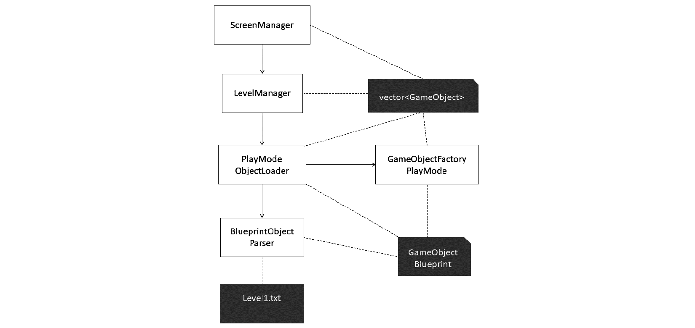

# *第二十一章*：文件输入/输出和游戏对象工厂

本章处理 `GameObject` 如何进入游戏中使用的 `m_GameObjects vector`。我们将探讨如何在文本文件中描述单个对象和整个关卡。我们将编写代码来解释文本，然后将值加载到一个将成为游戏对象蓝图的类中。我们还将编写一个名为 `LevelManager` 的类，它监督整个流程，从 `InputHandler` 通过 `ScreenManager` 发送的初始加载关卡请求开始，一直到工厂模式类从组件组装游戏对象并将其交付给 `LevelManager`，最后将其整齐地打包到 `m_GameObjects vector` 中。

本章我们将经历的步骤如下：

+   检查我们如何在文本文件中描述游戏对象及其组件

+   编写 `GameObjectBlueprint` 类，其中将临时存储来自文本文件的数据

+   编写 `ObjectTags` 类以帮助一致且无错误地描述游戏对象

+   代码 `BluePrintObjectParser` 负责从文本文件中的游戏对象描述中加载数据到 `GameObjectBlueprint` 实例

+   代码 `PlayModeObjectLoader`，它将打开文本文件，并从 `BlueprintObjectParser` 逐个接收 `GameObjectBlueprint` 实例

+   编写 `GameObjectFactoryPlayMode` 类，它将从 `GameObjectBlueprint` 实例构建 `GameObject` 实例

+   编写 `LevelManager` 类，它在接收到 `ScreenManager` 类的指令后监督整个流程

+   将代码添加到 `ScreenManager` 类中，以便我们可以开始使用本章我们将编写的新的系统

让我们先来具体看看如何在文本文件中描述一个游戏对象，比如一个太空侵略者或子弹，更不用说一整波的它们了。

# 文件输入/输出和工厂类的结构

请看以下图表，它概述了本章我们将编写的类以及 `GameObject` 实例的 `vector` 将如何与我们在 *第十九章* 中编写的 `ScreenManager` 类共享，*游戏编程设计模式 – 开始太空侵略者 ++ 游戏*：



前面的图示显示，存在一个`GameObject`实例的`vector`，它在四个类之间共享。这是通过在类的函数之间通过引用传递`vector`来实现的。每个类都可以使用`vector`及其内容来执行其角色。当需要将新级别加载到`vector`中时，`ScreenManager`类将触发`LevelManager`类。正如我们在*第十九章*，“游戏编程设计模式 - 开始 Space Invaders ++ 游戏”中看到的，单个`Screen`类及其由`InputHandler`派生的类可以通过`ScreenManagerRemoteControl`访问`ScreenManager`。

`LevelManager`类最终负责创建和共享这个`vector`。`PlayModeObjectLoader`将使用`BlueprintObjectParser`来创建`GameObjectBlueprint`实例。

`GameObjectFactoryPlayMode`类将使用这些`GameObjectBlueprint`实例完成`GameObject`的创建过程，并在`PlayModeObjectLoader`提示时将这些`GameObject`实例打包到`vector`中。

那么，每个`GameObject`实例的不同组件、位置、大小和外观配置是从哪里来的？

我们还可以看到，有三个类可以访问一个`GameObjectBlueprint`实例。这个实例由`LevelManager`类创建并通过引用传递。`BlueprintObjectParser`将读取`level1.txt`文件，该文件包含每个游戏对象的详细信息。它将初始化`GameObjectBlueprint`类的所有变量。然后`PlayModeObjectLoader`将传递一个`GameObject`实例的`vector`的引用，并将一个完全配置的`GameObjectBlueprint`实例的引用传递给`GameObjectFactoryPlayMode`类。这个过程会重复，直到所有的`GameObject`实例都被打包到`vector`中。

你可能想知道为什么我使用了像`GameObjectFactoryPlayMode`和`PlayModeObjectLoader`这样稍微有些繁琐的类名。原因是，一旦你看到这个系统有多方便，你可能就会想构建工具，允许你通过拖放所需的位置来以可视化的方式设计你的级别，然后自动生成文本文件而不是手动输入。这并不特别复杂，但我不得不在某一点停止添加游戏功能。因此，你可能会最终拥有一个`GameObjectFactoryDesignMode`和一个`DesignModeObjectLoader`。

# 描述世界中的对象

我们已经在*第十九章*，“游戏编程设计模式 - 开始 Space Invaders ++ 游戏”中添加了`world`文件夹中的`level1.txt`文件。让我们讨论它的用途、未来预期用途及其内容。

首先，我想指出，射击游戏并不是演示如何在文本文件中描述游戏世界的最佳方式。原因在于游戏中只有几种类型的游戏物体，最常见的入侵者都像列队行进的士兵一样整齐排列。实际上，它们可能更有效地通过编程描述，比如在一个嵌套的`for`循环中。然而，这个项目的目的是展示这些想法，而不是学习如何制作太空入侵者克隆。

看看以下文本，这是来自`world`文件夹中`level1.txt`文件的样本：

```cpp
[START OBJECT]
[NAME]invader[-NAME]
[COMPONENT]Standard Graphics[-COMPONENT]
[COMPONENT]Invader Update[-COMPONENT]
[COMPONENT]Transform[-COMPONENT]
[LOCATION X]0[-LOCATION X]
[LOCATION Y]0[-LOCATION Y]
[WIDTH]2[-WIDTH]
[HEIGHT]2[-HEIGHT]
[BITMAP NAME]invader1[-BITMAP NAME]
[ENCOMPASSING RECT COLLIDER]invader[-ENCOMPASSING_RECT COLLIDER]
[END OBJECT]
```

前面的文本描述了游戏中的一个单个物体；在这种情况下，是一个入侵者。该物体以以下文本开始：

```cpp
[START OBJECT]
```

这将通知我们即将编写的代码，正在描述一个新的物体。在文本的下一部分，我们可以看到以下内容：

```cpp
[NAME]invader[-NAME]
```

这通知代码该物体的类型是一个入侵者。这最终将被设置为`ColliderComponent`类的`m_Tag`。入侵者将能被识别出其身份。接下来的文本如下：

```cpp
[COMPONENT]Standard Graphics[-COMPONENT]
[COMPONENT]Invader Update[-COMPONENT]
[COMPONENT]Transform[-COMPONENT]
```

这告诉我们系统，此物体将添加三个组件：一个`StandardGraphicsComponent`实例、一个`InvaderUpdateComponent`实例和一个`TransformComponent`实例。这意味着物体将以标准方式绘制，并按照我们为入侵者编写的规则进行行为。这也意味着它在游戏世界中有一个位置和大小。可能存在没有任何组件或组件较少的物体。一个不采取任何行动且不移动的物体不需要更新组件，一个不可见的物体不需要图形组件（可能只是一个不可见的碰撞器，可以触发某些动作），以及一个在世界上没有位置的物体（可能是一个调试对象）不需要变换组件。

物体的位置和大小由以下四行文本确定：

```cpp
[LOCATION X]0[-LOCATION X]
[LOCATION Y]0[-LOCATION Y]
[WIDTH]2[-WIDTH]
[HEIGHT]2[-HEIGHT]
```

以下行文本决定了将用于此物体纹理的图形文件：

```cpp
[BITMAP NAME]invader1[-BITMAP NAME]
```

以下行意味着该物体可以发生碰撞。一个装饰性物体，比如漂浮的云（或一只蜜蜂），可能不需要碰撞器：

```cpp
[ENCOMPASSING RECT COLLIDER]invader[-ENCOMPASSING_RECT COLLIDER]
```

文本的最后一行将通知我们的系统，物体已经完成了自我描述：

```cpp
[END OBJECT]
```

现在，让我们看看我们是如何描述一个子弹物体的：

```cpp
[START OBJECT]
[NAME]bullet[-NAME]
[COMPONENT]Standard Graphics[-COMPONENT]
[COMPONENT]Transform[-COMPONENT]
[COMPONENT]Bullet Update[-COMPONENT]
[LOCATION X]-1[-LOCATION X]
[LOCATION Y]-1[-LOCATION Y]
[WIDTH]0.1[-WIDTH]
[HEIGHT]2.0[-HEIGHT]
[BITMAP NAME]bullet[-BITMAP NAME]
[ENCOMPASSING RECT COLLIDER]bullet[-ENCOMPASSING_RECT COLLIDER]
[SPEED]75.0[-SPEED]
[END OBJECT]
```

这与入侵者非常相似，但又不完全相同。子弹对象有额外的数据，例如设置速度。入侵者的速度是在 `InvaderUpdateComponent` 类的逻辑中设置的。我们也可以为子弹的速度做同样的事情，但这表明你可以根据特定的游戏设计要求，以尽可能多或尽可能少的细节来描述对象。同样，正如我们所期望的，子弹有一个 `BulletUpdateComponent` 和 `[BITMAP NAME]` 元素的不同值。请注意，子弹的位置被设置为 -1, -1。这意味着子弹在游戏开始时位于可玩区域之外。在下一章中，我们将看到入侵者或玩家如何在需要时将它们激活。

现在，学习以下文本，它描述了玩家的飞船：

```cpp
[START OBJECT]
[NAME]Player[-NAME]
[COMPONENT]Standard Graphics[-COMPONENT]
[COMPONENT]Transform[-COMPONENT]
[COMPONENT]Player Update[-COMPONENT]
[LOCATION X]50[-LOCATION X]
[LOCATION Y]40[-LOCATION Y]
[WIDTH]3.0[-WIDTH]
[HEIGHT]2.0[-HEIGHT]
[BITMAP NAME]playership[-BITMAP NAME]
[ENCOMPASSING RECT COLLIDER]player[-ENCOMPASSING_RECT COLLIDER]
[SPEED]10.0[-SPEED]
[END OBJECT]
```

根据我们之前的讨论，前面的文本可能相当可预测。现在我们已经通过了这一部分，我们可以开始编码系统，该系统将解释这些对象描述并将它们转换为可用的 `GameObject` 实例。

# 编码 GameObjectBlueprint 类

在 `Header Files/FileIO` 过滤器中创建一个新的头文件，命名为 `GameObjectBlueprint.h`，并添加以下代码：

```cpp
#pragma once
#include<vector>
#include<string>
#include<map>
using namespace std;
class GameObjectBlueprint {
private:
    string m_Name = "";
    vector<string> m_ComponentList;
    string m_BitmapName = "";
    float m_Width;
    float m_Height;
    float m_LocationX;
    float m_LocationY;
    float m_Speed;
    bool m_EncompassingRectCollider = false;
    string m_EncompassingRectColliderLabel = "";    
public:
    float getWidth();
    void setWidth(float width);
    float getHeight();
    void setHeight(float height);
    float getLocationX();
    void setLocationX(float locationX);
    float getLocationY();
    void setLocationY(float locationY);
    void setName(string name);
    string getName();
    vector<string>& getComponentList();
    void addToComponentList(string newComponent);
    string getBitmapName();
    void setBitmapName(string bitmapName);    
    string getEncompassingRectColliderLabel();
    bool getEncompassingRectCollider();
    void setEncompassingRectCollider(string label);
};
```

`GameObjectBlueprint` 为可能放入游戏对象中的每个属性都有一个成员变量。请注意，它并没有按组件对属性进行分类。例如，它只有宽度、高度和位置等变量的变量，它不费心将这些识别为变换组件的一部分。这些细节在工厂中处理。它还提供了获取器和设置器，以便 `BlueprintObjectParser` 类可以将 `level1.txt` 文件中的所有值打包起来，而 `GameObjectFactoryPlayMode` 类可以提取所有值，实例化适当的组件，并将它们添加到 `GameObject` 的实例中。

在 `Source Files/FileIO` 过滤器中创建一个新的源文件，命名为 `GameObjectBlueprint.cpp`，并添加以下代码，这是为我们刚刚声明的函数的定义：

```cpp
#include "GameObjectBlueprint.h"
float GameObjectBlueprint::getWidth() 
{
    return m_Width;
}
void GameObjectBlueprint::setWidth(float width) 
{
    m_Width = width;
}
float GameObjectBlueprint::getHeight() 
{
    return m_Height;
}
void GameObjectBlueprint::setHeight(float height) 
{
    m_Height = height;
}
float GameObjectBlueprint::getLocationX() 
{
    return m_LocationX;
}
void GameObjectBlueprint::setLocationX(float locationX) 
{
    m_LocationX = locationX;
}
float GameObjectBlueprint::getLocationY() 
{
    return m_LocationY;
}
void GameObjectBlueprint::setLocationY(float locationY) 
{
    m_LocationY = locationY;
}
void GameObjectBlueprint::setName(string name)
{
    m_Name = "" + name;
}
string GameObjectBlueprint::getName()
{
    return m_Name;
}
vector<string>& GameObjectBlueprint::getComponentList()
{
    return m_ComponentList;
}
void GameObjectBlueprint::addToComponentList(string newComponent)
{
    m_ComponentList.push_back(newComponent);
}
string GameObjectBlueprint::getBitmapName()
{
    return m_BitmapName;
}
void GameObjectBlueprint::setBitmapName(string bitmapName)
{
    m_BitmapName = "" + bitmapName;
}
string GameObjectBlueprint::getEncompassingRectColliderLabel() 
{
    return m_EncompassingRectColliderLabel;
}
bool GameObjectBlueprint::getEncompassingRectCollider() 
{
    return m_EncompassingRectCollider;
}
void GameObjectBlueprint::setEncompassingRectCollider(
    string label) 
{
    m_EncompassingRectCollider = true;
    m_EncompassingRectColliderLabel = "" + label;
}
```

虽然这是一个很长的类别，但这里没有我们之前没有见过的内容。设置函数接收值，这些值被复制到一个向量或变量中，而获取器允许访问这些值。

# 编码 ObjectTags 类

在 `level1.txt` 文件中描述游戏对象的方式必须精确，因为我们在本类之后将要编写的 `BlueprintObjectParser` 类将读取文件中的文本并寻找匹配项。例如，`[START OBJECT]` 标签将触发新对象的开始。如果该标签被误拼为，例如 `[START OBJECR]`，那么整个系统就会崩溃，并且会出现各种错误，甚至在我们运行游戏时发生崩溃。为了避免这种情况发生，我们将为所有需要描述游戏对象的标签定义常量（程序不可更改的）`string` 变量。我们可以使用这些 `string` 变量而不是键入 `[START OBJECT]`，从而大大减少出错的机会。

在 `Header Files/FileIO` 过滤器中创建一个新的头文件，命名为 `ObjectTags.h`，并添加以下代码：

```cpp
#pragma once
#include <string>
using namespace std;
static class ObjectTags {
public:
    static const string START_OF_OBJECT;
    static const string END_OF_OBJECT;
    static const string COMPONENT;
    static const string COMPONENT_END;
    static const string NAME;
    static const string NAME_END;
    static const string WIDTH;
    static const string WIDTH_END;
    static const string HEIGHT;
    static const string HEIGHT_END;
    static const string LOCATION_X;
    static const string LOCATION_X_END;
    static const string LOCATION_Y;
    static const string LOCATION_Y_END;
    static const string BITMAP_NAME;
    static const string BITMAP_NAME_END;
    static const string ENCOMPASSING_RECT_COLLIDER;
    static const string ENCOMPASSING_RECT_COLLIDER_END;
};
```

我们为将要用于描述游戏对象的每个标签都声明了一个 `const string`。现在，我们可以初始化它们。

在 `Source Files/FileIO` 过滤器中创建一个新的源文件，命名为 `ObjectTags.cpp`，并添加以下代码：

```cpp
#include "DevelopState.h"
#include "objectTags.h"
const string ObjectTags::START_OF_OBJECT = "[START OBJECT]";
const string ObjectTags::END_OF_OBJECT = "[END OBJECT]";
const string ObjectTags::COMPONENT = "[COMPONENT]";
const string ObjectTags::COMPONENT_END = "[-COMPONENT]";
const string ObjectTags::NAME = "[NAME]";
const string ObjectTags::NAME_END = "[-NAME]";
const string ObjectTags::WIDTH = "[WIDTH]";
const string ObjectTags::WIDTH_END = "[-WIDTH]";
const string ObjectTags::HEIGHT = "[HEIGHT]";
const string ObjectTags::HEIGHT_END = "[-HEIGHT]";
const string ObjectTags::LOCATION_X = "[LOCATION X]";
const string ObjectTags::LOCATION_X_END = "[-LOCATION X]";
const string ObjectTags::LOCATION_Y = "[LOCATION Y]";
const string ObjectTags::LOCATION_Y_END = "[-LOCATION Y]";
const string ObjectTags::BITMAP_NAME = "[BITMAP NAME]";
const string ObjectTags::BITMAP_NAME_END = "[-BITMAP NAME]";
const string ObjectTags::ENCOMPASSING_RECT_COLLIDER = 
    "[ENCOMPASSING RECT COLLIDER]";

const string ObjectTags::ENCOMPASSING_RECT_COLLIDER_END 
    = "[-ENCOMPASSING_RECT COLLIDER]";
```

所有 `string` 变量都已初始化。现在我们可以将它们用于下一个类，并确保我们一致地描述游戏对象。

# 编写 BlueprintObjectParser 类

这个类将包含实际从 `level1.txt` 文件中读取文本的代码。它将一次解析一个对象，就像我们之前看到的起始和结束标签所标识的那样。

在 `Header Files/FileIO` 过滤器中创建一个新的头文件，命名为 `BlueprintObjectParser.h`，并添加以下代码：

```cpp
#pragma once
#include "GameObjectBlueprint.h"
#include <string>
using namespace std;
class BlueprintObjectParser {
private:
    string extractStringBetweenTags(
        string stringToSearch, string startTag, string endTag);
public:
    void parseNextObjectForBlueprint(
        ifstream& reader, GameObjectBlueprint& bp);
};
```

`extractStringBetweenTags` 私有函数将捕获两个标签之间的内容。参数是三个 `string` 实例。第一个 `string` 是来自 `level1.txt` 的完整文本行，而第二个和第三个是起始和结束标签，需要被丢弃。然后，两个标签之间的文本被返回给调用代码。

`parseNextObjectForBlueprint` 函数接收一个 `ifstream` 读取器，就像我们在僵尸射击游戏和托马斯迟到的游戏中使用的那样。它用于从文件中读取。第二个参数是 `GameObjectBlueprint` 实例的引用。该函数将使用从 `level1.txt` 文件中读取的值填充 `GameObjectBlueprint` 实例，这些值随后可以在调用代码中用于创建实际的 `GameObject`。我们将在编写 `PlayModeObjectLoader` 类时看到这个过程，之后是 `GameObjectFactoryPlayMode` 类。

让我们编写我们刚刚讨论的定义。

在 `Source Files/FileIO` 过滤器中创建一个新的源文件，命名为 `BlueprintObjectParser.cpp`，并添加以下代码：

```cpp
#include "BlueprintObjectParser.h"
#include "ObjectTags.h"
#include <iostream>
#include <fstream>
void BlueprintObjectParser::parseNextObjectForBlueprint(
    ifstream& reader, GameObjectBlueprint& bp)
{
    string lineFromFile;
    string value = "";
    while (getline(reader, lineFromFile)) 
    {
        if (lineFromFile.find(ObjectTags::COMPONENT) 
            != string::npos) 
          {
            value = extractStringBetweenTags(lineFromFile, 
                ObjectTags::COMPONENT, 
                ObjectTags::COMPONENT_END);
            bp.addToComponentList(value);
        }
        else if (lineFromFile.find(ObjectTags::NAME) 
            != string::npos) 
          {
            value = extractStringBetweenTags(lineFromFile, 
                ObjectTags::NAME, ObjectTags::NAME_END);
            bp.setName(value);
        }
        else if (lineFromFile.find(ObjectTags::WIDTH) 
            != string::npos) 
          {
            value = extractStringBetweenTags(lineFromFile, 
                ObjectTags::WIDTH, ObjectTags::WIDTH_END);
            bp.setWidth(stof(value));
        }
        else if (lineFromFile.find(ObjectTags::HEIGHT) 
            != string::npos) 
          {
            value = extractStringBetweenTags(lineFromFile, 
                ObjectTags::HEIGHT, ObjectTags::HEIGHT_END);
            bp.setHeight(stof(value));
        }
        else if (lineFromFile.find(ObjectTags::LOCATION_X) 
            != string::npos) 
          {
            value = extractStringBetweenTags(lineFromFile, 
                ObjectTags::LOCATION_X, 
                ObjectTags::LOCATION_X_END);
            bp.setLocationX(stof(value));
        }
        else if (lineFromFile.find(ObjectTags::LOCATION_Y) 
            != string::npos) 
          {
            value = extractStringBetweenTags(
                      lineFromFile, 
                      ObjectTags::LOCATION_Y, 
                      ObjectTags::LOCATION_Y_END);
            bp.setLocationY(stof(value));
        }
        else if (lineFromFile.find(ObjectTags::BITMAP_NAME) 
            != string::npos) 
          {
            value = extractStringBetweenTags(lineFromFile, 
             ObjectTags::BITMAP_NAME, 
             ObjectTags::BITMAP_NAME_END);
            bp.setBitmapName(value);
        }

        else if (lineFromFile.find(
            ObjectTags::ENCOMPASSING_RECT_COLLIDER) 
            != string::npos) 
          {
            value = extractStringBetweenTags(lineFromFile, 
                ObjectTags::ENCOMPASSING_RECT_COLLIDER, 
                ObjectTags::ENCOMPASSING_RECT_COLLIDER_END);
            bp.setEncompassingRectCollider(value);
        }

        else if (lineFromFile.find(ObjectTags::END_OF_OBJECT) 
            != string::npos) 
        {
            return;
        }
    }
}
string BlueprintObjectParser::extractStringBetweenTags(
    string stringToSearch, string startTag, string endTag)
{
    int start = startTag.length();
    int count = stringToSearch.length() - startTag.length() 
        - endTag.length();
    string stringBetweenTags = stringToSearch.substr(
        start, count);
    return stringBetweenTags;
}
```

`parseNextObjectForBlueprint` 中的代码虽然长，但很直接。一系列的 `if` 语句识别文本行开头的起始标签，然后将该文本行传递给 `extractStringBetweenTags` 函数，该函数返回的值随后被加载到 `GameObjectBlueprint` 引用适当的位置。请注意，当 `GameObjectBlueprint` 已加载所有数据时，函数会退出。这一点可以通过找到 `ObjectTags::END_OF_OBJECT` 来识别。

# 编写 `PlayModeObjectLoader` 类

这是将 `GameObjectBlueprint` 实例传递给 `BlueprintObjectParser` 的类。当它收到完整的蓝图后，它将它们传递给 `GameObjectFactoryPlayMode` 类，该类将构建 `GameObject` 实例并将其打包到 `vector` 实例中。一旦所有 `GameObject` 实例都构建并存储，责任将转交给 `LevelManager` 类，该类将控制对游戏引擎其他部分的向量访问。这是一个非常小的类，只有一个函数，但它将许多其他类连接在一起。请参考本章开头的图解以获得澄清。

在 `Header Files/FileIO` 过滤器中创建一个新的头文件，命名为 `PlayModeObjectLoader.h`，并添加以下代码：

```cpp
#pragma once
#include <vector>
#include <string>
#include "GameObject.h"
#include "BlueprintObjectParser.h"
#include "GameObjectFactoryPlayMode.h"
using namespace std;
class PlayModeObjectLoader {
private:
    BlueprintObjectParser m_BOP;
    GameObjectFactoryPlayMode m_GameObjectFactoryPlayMode;
public:
    void loadGameObjectsForPlayMode(
        string pathToFile, vector<GameObject>& mGameObjects);
};
```

`PlayModeObjectLoader` 类包含我们之前编写的类的实例，即 `BluePrintObjectParser` 类。它还包含我们将要编写的类的实例，即 `GameObjectFactoryPlayMode` 类。它有一个单独的公共函数，该函数接收一个指向包含 `GameObject` 实例的 `vector` 的引用。

现在，我们将编写 `loadGameObjectsForPlayMode` 函数的定义。在 `Source Files/FileIO` 过滤器中创建一个新的源文件，命名为 `PlayModeObjectLoader.cpp`，并添加以下代码：

```cpp
#include "PlayModeObjectLoader.h"
#include "ObjectTags.h"
#include <iostream>
#include <fstream>
void PlayModeObjectLoader::
    loadGameObjectsForPlayMode(
        string pathToFile, vector<GameObject>& gameObjects)
{
    ifstream reader(pathToFile);
    string lineFromFile;
    float x = 0, y = 0, width = 0, height = 0;
    string value = "";
    while (getline(reader, lineFromFile)) {
        if (lineFromFile.find(
            ObjectTags::START_OF_OBJECT) != string::npos) {
            GameObjectBlueprint bp;
            m_BOP.parseNextObjectForBlueprint(reader, bp);
            m_GameObjectFactoryPlayMode.buildGameObject(
                bp, gameObjects);
        }
    }       
}
```

函数接收一个 `string`，这是需要加载的文件的路径。这个游戏只有一个这样的文件，但如果你愿意，可以添加更多具有不同布局、不同数量的入侵者或完全不同的游戏对象的文件。

使用 `ifstream` 实例逐行读取文件。在 `while` 循环中，使用 `ObjectTags::START_OF_OBJECT` 识别起始标签，并调用 `BlueprintObjectParser` 的 `parseNextObjectForBlueprint` 函数。你可能还记得，从 `BlueprintObjectParser` 类中，当达到 `ObjectTags::END_OF_OBJECT` 时，会返回完整的蓝图。

下一条代码调用 `GameObjectFactoryPlayMode` 类的 `buildGameObject` 方法，并传入 `GameObjectBlueprint` 实例。我们现在将编写 `GameObjectFactory` 类。

# 编写 `GameObjectFactoryPlayMode` 类

现在，我们将编写我们的工厂代码，该工厂将从`GameObject`类以及我们在上一章中编写的所有相关组件类构建工作游戏对象。我们将大量使用智能指针，这样我们就不必担心在完成使用后删除内存。

在`Header Files/FileIO`过滤器中创建一个新的头文件，命名为`GameObjectFactoryPlayMode.h`，并添加以下代码：

```cpp
#pragma once
#include "GameObjectBlueprint.h"
#include "GameObject.h"
#include <vector>
class GameObjectFactoryPlayMode {
public:
    void buildGameObject(GameObjectBlueprint& bp, 
        std::vector <GameObject>& gameObjects);
};
```

工厂类只有一个函数，即`buildGameObject`。我们已经在之前为`PlayModeObjectLoader`类编写的代码中看到了调用此函数的代码。该函数接收蓝图引用以及`GameObject`实例的`vector`引用。

在`Source Files/FileIO`过滤器中创建一个新的源文件，命名为`GameObjectFactoryPlayMode.cpp`，并添加以下代码：

```cpp
#include "GameObjectFactoryPlayMode.h"
#include <iostream>
#include "TransformComponent.h"
#include "StandardGraphicsComponent.h"
#include "PlayerUpdateComponent.h"
#include "RectColliderComponent.h"
#include "InvaderUpdateComponent.h"
#include "BulletUpdateComponent.h"
void GameObjectFactoryPlayMode::buildGameObject(
    GameObjectBlueprint& bp, 
    std::vector<GameObject>& gameObjects)
{
    GameObject gameObject;
    gameObject.setTag(bp.getName());
    auto it = bp.getComponentList().begin();
    auto end = bp.getComponentList().end();
    for (it;
        it != end;
        ++it)
    {
        if (*it == "Transform")
        {
            gameObject.addComponent(
                make_shared<TransformComponent>(
                bp.getWidth(),
                bp.getHeight(),
                Vector2f(bp.getLocationX(),
                 bp.getLocationY())));
        }
        else if (*it == "Player Update")
        {
            gameObject.addComponent(make_shared
                <PlayerUpdateComponent>());
        }
        else if (*it == "Invader Update")
        {
            gameObject.addComponent(make_shared
                <InvaderUpdateComponent>());
        }
        else if (*it == "Bullet Update")
        {
            gameObject.addComponent(make_shared
                <BulletUpdateComponent>());
        }
        else if (*it == "Standard Graphics")
        {
            shared_ptr<StandardGraphicsComponent> sgp =
                make_shared<StandardGraphicsComponent>();
            gameObject.addComponent(sgp);
            sgp->initializeGraphics(
                bp.getBitmapName(),
                Vector2f(bp.getWidth(), 
                    bp.getHeight()));
        }        
    }
    if (bp.getEncompassingRectCollider()) {
        shared_ptr<RectColliderComponent> rcc = 
            make_shared<RectColliderComponent>(
            bp.getEncompassingRectColliderLabel());
        gameObject.addComponent(rcc);
        rcc->setOrMoveCollider(bp.getLocationX(),
            bp.getLocationY(),
            bp.getWidth(),
            bp.getHeight());
    }   

    gameObjects.push_back(gameObject);
}
```

在`buildGameObject`函数中发生的第一件事是创建一个新的`GameObject`实例，并使用`GameObject`类的`setTag`函数传入正在构建的当前对象名称：

```cpp
GameObject gameObject;
gameObject.setTag(bp.getName());
```

接下来，一个`for`循环遍历`m_Components`向量中的所有组件。对于找到的每个组件，一个不同的`if`语句创建相应类型的组件。每个组件的创建方式各不相同，正如您所预期的，因为它们的编码方式各不相同。

以下代码创建了一个指向`TransformComponent`实例的共享指针。您可以看到传递给构造函数的必要参数，即宽度、高度和位置。创建指向`TransformComponent`实例的新共享指针的结果传递给了`GameObject`类的`addComponent`函数。现在，`GameObject`实例具有其大小和在世界中的位置：

```cpp
if (*it == "Transform")
{
    gameObject.addComponent(make_shared<TransformComponent>(
        bp.getWidth(),
        bp.getHeight(),
        Vector2f(bp.getLocationX(), bp.getLocationY())));
}
```

以下代码在需要`PlayerUpdateComponent`时执行。同样，代码创建了一个指向适当类的新的共享指针，并将其传递给`GameObject`实例的`addComponent`函数：

```cpp
else if (*it == "Player Update")
{
    gameObject.addComponent(make_shared
        <PlayerUpdateComponent>());
}
```

以下三段代码使用完全相同的技术添加`InvaderUpdateComponent`、`BulletUpdateComponent`或`StandardGraphicsComponent`实例。注意在添加`StandardGraphicsComponent`实例后添加的额外代码行，该代码行调用`initialize`函数，该函数将`Texture`实例（如果需要）添加到`BitmapStore`单例，并准备组件以便绘制：

```cpp
else if (*it == "Invader Update")
{
    gameObject.addComponent(make_shared
        <InvaderUpdateComponent>());
}
else if (*it == "Bullet Update")
{
    gameObject.addComponent(make_shared
        <BulletUpdateComponent>());
}
else if (*it == "Standard Graphics")
{
    shared_ptr<StandardGraphicsComponent> sgp =
        make_shared<StandardGraphicsComponent>();
    gameObject.addComponent(sgp);
    sgp->initializeGraphics(
        bp.getBitmapName(),
        Vector2f(bp.getWidth(), 
            bp.getHeight()));
}
```

以下代码所示的最后一个`if`块处理添加`RectColliderComponent`实例。第一行代码创建共享指针，第二行代码调用`addComponent`函数将实例添加到`GameObject`实例。第三行代码调用`setOrMoveCollider`并传入对象的位置和大小。在这个阶段，对象准备好进行碰撞。显然，我们仍然需要编写测试碰撞的代码。我们将在下一章中这样做：

```cpp
if (bp.getEncompassingRectCollider()) {
        shared_ptr<RectColliderComponent> rcc = 
            make_shared<RectColliderComponent>(
            bp.getEncompassingRectColliderLabel());
        gameObject.addComponent(rcc);
        rcc->setOrMoveCollider(bp.getLocationX(),
            bp.getLocationY(),
            bp.getWidth(),
            bp.getHeight());
}
```

类中的以下代码行将刚刚构建的`GameObject`实例添加到将与`GameScreen`类共享的`vector`中，并用于使游戏变得生动：

```cpp
gameObjects.push_back(gameObject);
```

我们将要编写的下一个类使得在项目的各个类之间共享我们刚刚用`GameObject`实例填充的`vector`变得容易。

# 编写 GameObjectSharer 类

此类将有两个共享`GameObject`实例的纯虚函数。

在`Header Files/FileIO`筛选器中创建一个新的头文件，命名为`GameObjectSharer.h`，并添加以下代码：

```cpp
#pragma once
#include<vector>
#include<string>
class GameObject;
class GameObjectSharer {
public:
    virtual std::vector<GameObject>& getGameObjectsWithGOS() = 0;
    virtual GameObject& findFirstObjectWithTag(
             std::string tag) = 0;
};
```

`getGameObjectsWithGOS`函数返回整个`GameObject`实例`vector`的引用。`findFirstObjectWithTag`函数返回单个`GameObject`引用。当我们编写`LevelManager`类时，我们将看到如何实现这些函数。

简而言之，在`LevelManager`类之前，在`Source Files/FileIO`筛选器中创建一个新的源文件，命名为`GameObjectSharer.cpp`，并添加以下代码：

```cpp
/*********************************
******THIS IS AN INTERFACE********
*********************************/
```

再次强调，这只是一个占位符文件，完整的功能将包含在从`GameObjectSharer`继承的任何类中；在这种情况下，是`LevelManager`类。

# 编写 LevelManager 类

`LevelManager`类是我们编写的*第十九章*，*游戏编程设计模式 – 开始 Space Invaders ++ 游戏*，以及本章中我们编写的所有代码之间的连接。`ScreenManager`类将包含`LevelManager`类的实例，`LevelManager`类将启动加载关卡（使用我们刚刚编写的所有类）并与需要它们的任何类共享`GameObject`实例。

在`Header Files/Engine`筛选器中创建一个新的头文件，命名为`LevelManager.h`，并添加以下代码：

```cpp
#pragma once
#include "GameObject.h"
#include <vector>
#include <string>
#include "GameObjectSharer.h"
using namespace std;
class LevelManager : public GameObjectSharer {
private:
    vector<GameObject> m_GameObjects;
    const std::string WORLD_FOLDER = "world";
    const std::string SLASH = "/";
    void runStartPhase();
    void activateAllGameObjects();
public:
    vector<GameObject>& getGameObjects();
    void loadGameObjectsForPlayMode(string screenToLoad);
    /****************************************************
    *****************************************************
    From GameObjectSharer interface
    *****************************************************
    *****************************************************/
    vector<GameObject>& GameObjectSharer::getGameObjectsWithGOS()
    {
        return m_GameObjects;
    }
    GameObject& GameObjectSharer::findFirstObjectWithTag(
         string tag)
    {
        auto it = m_GameObjects.begin();
        auto end = m_GameObjects.end();
        for (it;
            it != end;
            ++it)
        {
            if ((*it).getTag() == tag)
            {
                return (*it);
            }
        }

#ifdef debuggingErrors        
    cout << 
        "LevelManager.h findFirstGameObjectWithTag() " 
        << "- TAG NOT FOUND ERROR!" 
        << endl;
#endif    
        return m_GameObjects[0];
    }
};
```

此类提供了两种获取充满游戏对象`vector`的不同方式。一种是通过简单的调用`getGameObjects`，另一种是通过`getGameObjectsWithGOS`函数。后者是`GameObjectSharer`类中纯虚函数的实现，它将成为一种传递访问每个游戏对象的方式，以便它能够访问所有其他游戏对象。您可能还记得从*第二十章*，*游戏对象和组件*，在`GameObject`类的`start`函数调用期间传递了`GameObjectSharer`实例。正是在这个函数中，除了其他事情之外，入侵者能够获取到玩家的位置。

此外，还有两个私有函数：`runStartPhase`，它遍历所有`GameObject`实例调用`start`，以及`activateAllGameObjects`，它遍历并将所有`GameObject`实例设置为活动状态。

此外，`LevelManager` 类的一部分是 `loadGameObjectsForPlayMode` 函数，它将触发本章描述的整个游戏对象创建过程。

`LevelManger.h` 文件中的最后一个函数是实现其他 `GameObjectSharer` 纯虚函数 `findFirstObjectWithTag` 的代码。这允许任何具有 `GameObjectSharer` 实例的类通过其标签追踪特定的游戏对象。代码遍历 `vector` 中的所有 `GameObject` 实例，并返回第一个匹配项。注意，如果没有找到匹配项，将返回一个空指针并导致游戏崩溃。我们使用 `#ifdef` 语句向控制台输出一些文本，告诉我们导致崩溃的原因，这样我们就不必为几个小时找不到不存在的标签而抓耳挠腮。

我们现在可以编写函数的实现代码了。

在 `Source Files/Engine` 过滤器中创建一个新的源文件，命名为 `LevelManager.cpp`，并添加以下代码：

```cpp
#include "LevelManager.h"
#include "PlayModeObjectLoader.h"
#include <iostream>
void LevelManager::
    loadGameObjectsForPlayMode(string screenToLoad)
{
    m_GameObjects.clear();
    string levelToLoad = "" 
        + WORLD_FOLDER + SLASH + screenToLoad;
    PlayModeObjectLoader pmol;
    pmol.loadGameObjectsForPlayMode(
        levelToLoad, m_GameObjects);
    runStartPhase();
}
vector<GameObject>& LevelManager::getGameObjects()
{
    return m_GameObjects;
}
void LevelManager::runStartPhase()
{
    auto it = m_GameObjects.begin();
    auto end = m_GameObjects.end();
    for (it;
        it != end;
        ++it)
    {
        (*it).start(this);
    }
    activateAllGameObjects();
}
void LevelManager::activateAllGameObjects()
{
    auto it = m_GameObjects.begin();
    auto end = m_GameObjects.end();
    for (it;
        it != end;
        ++it)
    {
        (*it).setActive();
    }
}
```

`loadLevelForPlayMode` 函数清空了 `vector`，实例化了一个执行所有文件读取的 `PlayModeObjectLoader` 实例，并将 `GameObject` 实例打包到 `vector` 中。最后，调用 `runStartPhase` 函数。在 `runStartPhase` 函数中，所有 `GameObject` 实例都传递了一个 `GameObjectSharer` (`this`)，并有机会为自己设置好，以便可以播放。记住，在 `GameObject` 类的 `start` 函数内部，每个派生 `Component` 实例都被赋予了访问 `GameObjectSharer` 的权限。参考*第二十章*，*游戏对象和组件*，以了解我们在编写 `Component` 类时如何使用它。

`runStartPhase` 函数通过调用 `activateAllGameObjects` 来结束，该函数遍历 `vector`，对每个 `GameObject` 实例调用 `setActive`。

`getGameObjects` 函数传递了 `GameObject` 实例的 `vector` 引用。

现在我们已经编写了 `LevelManager` 类，我们可以更新实现此接口的 `ScreenManager` 和 `ScreenManagerRemoteControl` 类。

# 更新 `ScreenManager` 和 `ScreenManagerRemoteControl` 类

打开 `ScreenManagerRemoteControl.h` 文件，取消注释所有内容，以便代码与以下内容相同。我已经突出显示了取消注释的行：

```cpp
#pragma once
#include <string>
#include <vector>
#include "GameObject.h"
#include "GameObjectSharer.h"
using namespace std;
class ScreenManagerRemoteControl
{
public:
    virtual void SwitchScreens(string screenToSwitchTo) = 0;
    virtual void loadLevelInPlayMode(string screenToLoad) = 0;
    virtual vector<GameObject>& getGameObjects() = 0;
    virtual GameObjectSharer& shareGameObjectSharer() = 0;
};
```

接下来，打开 `ScreenManager.h`，它实现了此接口并取消注释所有已注释的代码。相关的代码被缩写并突出显示如下：

```cpp
...
#include "SelectScreen.h"
//#include "LevelManager.h"
#include "BitmapStore.h"
...
...
private:
    map <string, unique_ptr<Screen>> m_Screens;
    //LevelManager m_LevelManager;
protected:
    ...
    ...
/****************************************************
*****************************************************
From ScreenManagerRemoteControl interface
*****************************************************
*****************************************************/
    ...
    ...
//vector<GameObject>& 
        //ScreenManagerRemoteControl::getGameObjects()
    //{
        //return m_LevelManager.getGameObjects();
    //}
    //GameObjectSharer& shareGameObjectSharer()
    //{
        //return m_LevelManager;
    //}
    ...
    ...
```

一定要取消注释包含指令、`m_LevelManager` 实例以及两个函数。

`ScreenManager` 和 `ScreenManagerRemoteControl` 类现在完全功能正常，`getGameObjects` 和 `shareGameObjectSharer` 函数可以被任何具有 `ScreenManager` 类引用的类使用。

# 我们现在在哪里？

到目前为止，我们 `GameObject` 类中的所有错误，以及所有与组件相关的类中的错误都已经消失。我们正在取得良好的进展。

此外，我们可以重新访问 `ScreenManager.h` 文件，取消所有注释掉的代码。

打开 `ScreenManager.h` 文件，取消 `#include` 指令的注释，如下所示：

```cpp
//#include "LevelManager.h"
```

改成这样：

```cpp
#include "LevelManager.h"
```

对于在 `ScreenManager.h` 中实现的 `ScreenManagerRemoteControl` 接口中的函数，也进行相同的操作。它们看起来如下所示：

```cpp
void ScreenManagerRemoteControl::
        loadLevelInPlayMode(string screenToLoad)
    {
        //m_LevelManager.getGameObjects().clear();
        //m_LevelManager.
            //loadGameObjectsForPlayMode(screenToLoad);
        SwitchScreens("Game");
    }
//vector<GameObject>& 
    //ScreenManagerRemoteControl::getGameObjects()
//{
    //return m_LevelManager.getGameObjects();
//}
```

按照以下方式修改它们：

```cpp
void ScreenManagerRemoteControl::
    loadLevelInPlayMode(string screenToLoad)
{
    m_LevelManager.getGameObjects().clear();
    m_LevelManager.
        loadGameObjectsForPlayMode(screenToLoad);
    SwitchScreens("Game");
}
vector<GameObject>& 
    ScreenManagerRemoteControl::getGameObjects()
{
    return m_LevelManager.getGameObjects();
}
```

然而，我们还没有准备好运行游戏，因为代码中仍然缺少一些类，例如 `InvaderUpdateComponent` 类中的 `BulletSpawner`。

# 摘要

在本章中，我们建立了一种描述游戏关卡的方法，以及一个解释描述并构建可用的 `GameObject` 实例的系统。工厂模式在许多类型的编程中都有应用，而不仅仅是游戏开发。我们所使用的实现是最简单的实现，我鼓励您将工厂模式添加到您要研究和进一步开发的模式列表中。如果您希望构建一些深入和有趣的游戏，我们所使用的实现应该会很好地为您服务。

在下一章中，我们将通过添加碰撞检测、子弹生成和游戏本身的逻辑，最终让游戏变得生动起来。
