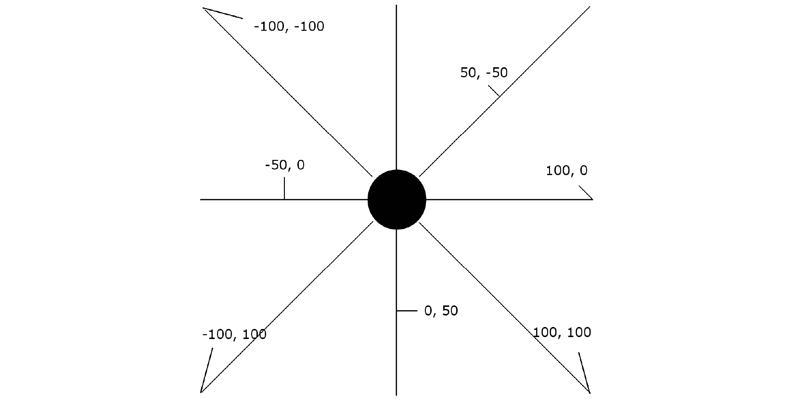
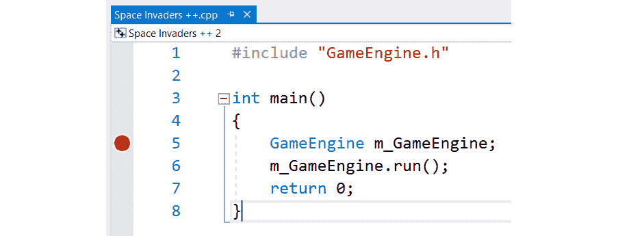
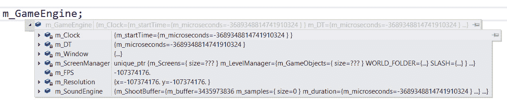

# 第二十三章：*第二十二章*：使用游戏对象和构建游戏

本章是 Space Invaders ++ 项目的最终阶段。我们将学习如何使用 SFML 从游戏手柄接收输入以完成所有困难的工作，我们还将编写一个类，该类将处理入侵者与 `GameScreen` 类以及玩家与 `GameScreen` 类之间的通信。该类将允许玩家和入侵者生成子弹，但同样的技术也可以用于你游戏中不同部分之间所需的任何类型的通信，因此了解它是很有用的。游戏的最后一部分（就像往常一样）将是碰撞检测和游戏本身的逻辑。一旦 Space Invaders ++ 运行起来，我们将学习如何使用 Visual Studio 调试器，这在设计你自己的逻辑时将非常有价值，因为它允许你逐行执行代码并查看变量的值。它也是研究我们在整个项目过程中构建的模式执行流程的有用工具。

在本章中，我们将做以下事情：

+   编写生成子弹的解决方案

+   处理玩家的输入，包括使用游戏手柄

+   检测所有必要对象之间的碰撞

+   编写游戏的主要逻辑

+   了解调试并理解执行流程

让我们先从生成子弹开始。

# 生成子弹

我们需要一种方法，从玩家和每个入侵者那里生成子弹。这两个解决方案非常相似，但并不完全相同。我们需要一种方法，允许 `GameInputHandler` 在按下键盘键或游戏手柄按钮时生成子弹，并且我们需要 `InvaderUpdateComponent` 使用其现有的逻辑来生成子弹。

`GameScreen` 类有一个 `vector`，其中包含所有 `GameObject` 实例，因此 `GameScreen` 是将子弹移动到位置并设置其向上或向下移动屏幕的理想候选者，这取决于谁或什么触发了射击。我们需要一种方法，让 `GameInputHandler` 类和 `InvaderUpdateComponenet` 与 `GameScreen` 类通信，但我们还需要将通信限制在仅生成子弹；我们不希望它们能够控制 `GameScreen` 类的任何其他部分。

让我们编写一个抽象类，`GameScreen` 可以从中继承。

## 编写 BulletSpawner 类

在 `Header Files/GameObjects` 过滤器中创建一个新的头文件，命名为 `BulletSpawner.h`，并添加以下代码：

```cpp
#include <SFML/Graphics.hpp>
class BulletSpawner
{
public:
    virtual void spawnBullet(
        sf::Vector2f spawnLocation, bool forPlayer) = 0;
};
```

上述代码创建了一个名为 `BulletSpawner` 的新类，它有一个名为 `spawnBullet` 的单一纯虚函数。`spawnBullet` 函数有两个参数。第一个参数是一个 `Vector2f` 实例，它将确定生成位置。实际上，正如我们很快将看到的，当子弹生成时，这个位置将根据子弹是向上屏幕移动（作为玩家子弹）还是向下屏幕移动（作为入侵者子弹）而略有调整。第二个参数是一个布尔值，如果子弹属于玩家则为真，如果属于入侵者则为假。

在 `Source Files/GameObjects` 过滤器中创建一个新的源文件，名为 `BulletSpawner.cpp`，并添加以下代码：

```cpp
/*********************************
******THIS IS AN INTERFACE********
*********************************/
```

小贴士

如同往常，这个 `.cpp` 文件是可选的。我只是想平衡一下源代码。

现在，前往 `GameScreen.h` 文件，因为这里是我们将实现这个类功能的地方。

## 更新 GameScreen.h

首先，更新以下代码中的包含指令和类声明，以使 `GameScreen` 类继承自 `BulletSpawner`：

```cpp
#pragma once
#include "Screen.h"
#include "GameInputHandler.h"
#include "GameOverInputHandler.h"
#include "BulletSpawner.h"
class GameScreen : public Screen, public BulletSpawner
{
   …
   …
```

接下来，添加一些额外的函数和变量声明，如以下代码所示，到 `GameScreen.h` 中：

```cpp
private:
    ScreenManagerRemoteControl* m_ScreenManagerRemoteControl;
    shared_ptr<GameInputHandler> m_GIH;
    int m_NumberInvadersInWorldFile = 0;
    vector<int> m_BulletObjectLocations;
    int m_NextBullet = 0;
    bool m_WaitingToSpawnBulletForPlayer = false;
    bool m_WaitingToSpawnBulletForInvader = false;
    Vector2f m_PlayerBulletSpawnLocation;
    Vector2f m_InvaderBulletSpawnLocation;
    Clock m_BulletClock;
    Texture m_BackgroundTexture;
    Sprite m_BackgroundSprite;
public:
    static bool m_GameOver;
    GameScreen(ScreenManagerRemoteControl* smrc, Vector2i res);
    void initialise() override;
    void virtual update(float fps);
    void virtual draw(RenderWindow& window);
    BulletSpawner* getBulletSpawner();
```

新变量包括一个 `int` 值的 `vector`，它将保存所有子弹的位置，这些子弹位于包含所有游戏对象的 `vector` 中。它还有一些控制变量，以便我们可以跟踪下一个要使用的子弹，子弹是针对玩家还是入侵者，以及生成子弹的位置。我们还声明了一个新的 `sf::Clock` 实例，因为我们想限制玩家的射击速率。最后，我们有 `getBulletSpawner` 函数，它将以 `BulletSpawner` 的形式返回对这个类的指针。这将使接收者能够访问 `spawnBullet` 函数，但无法访问其他内容。

现在，我们可以添加 `spawnBullet` 函数的实现。将以下代码添加到 `GameScreen.h` 文件的末尾，所有其他代码之后，但位于 `GameScreen` 类的闭合花括号内：

```cpp
/****************************************************
*****************************************************
From BulletSpawner interface
*****************************************************
*****************************************************/
void BulletSpawner::spawnBullet(Vector2f spawnLocation, 
    bool forPlayer)
{
    if (forPlayer)
    {
        Time elapsedTime = m_BulletClock.getElapsedTime();
        if (elapsedTime.asMilliseconds() > 500) {
            m_PlayerBulletSpawnLocation.x = spawnLocation.x;
            m_PlayerBulletSpawnLocation.y = spawnLocation.y;
            m_WaitingToSpawnBulletForPlayer = true;
            m_BulletClock.restart();
        }
    }
    else
    {
        m_InvaderBulletSpawnLocation.x = spawnLocation.x;
        m_InvaderBulletSpawnLocation.y = spawnLocation.y;
        m_WaitingToSpawnBulletForInvader = true;
    }
}
```

`spawnBullet` 函数的实现是一个简单的 `if` – `else` 结构。如果请求为玩家生成子弹，则执行 `if` 块；如果请求为入侵者生成子弹，则执行 `else` 块。

`if` 块检查自上次请求子弹以来是否至少过去了半秒钟，如果是，则将 `m_WaitingToSpawnBulletForPlayer` 变量设置为 `true`，复制生成子弹的位置，并重新启动时钟，准备测试玩家的下一个请求。

`else` 块记录了入侵者子弹的生成位置，并将 `m_WaitingToSpawnBulletForInvader` 设置为 `true`。不需要与 `Clock` 实例交互，因为入侵者的射击速率在 `InvaderUpdateComponent` 类中控制。

在实际生成子弹之前，`BulletSpawner` 问题的最后一部分是向 `GameScreen.cpp` 的末尾添加 `getBulletSpawner` 的定义。以下是需要添加的代码：

```cpp
BulletSpawner* GameScreen::getBulletSpawner()
{
    return this;
}
```

这将返回一个指向 `GameScreen` 的指针，它使我们能够访问 `spawnBullet` 函数。

# 处理玩家的输入

向 `GameInputHandler.h` 文件中添加更多声明，以便您的代码与以下内容匹配。我已经高亮显示需要添加的新代码：

```cpp
#pragma once
#include "InputHandler.h"
#include "PlayerUpdateComponent.h"
#include "TransformComponent.h"
class GameScreen;
class GameInputHandler : public InputHandler
{
private:
    shared_ptr<PlayerUpdateComponent> m_PUC;
    shared_ptr<TransformComponent> m_PTC;
    bool mBButtonPressed = false;
public:
    void initialize();
    void handleGamepad() override;
    void handleKeyPressed(Event& event, 
        RenderWindow& window) override;
    void handleKeyReleased(Event& event, 
        RenderWindow& window) override;    
};
```

`GameInputHandler` 类现在可以访问玩家的更新组件和玩家的变换组件。这非常有用，因为它意味着我们可以告诉 `PlayerUpdateComponent` 实例和玩家的 `TransformComponent` 实例玩家正在操作哪些键盘键和游戏手柄控制。我们还没有看到这两个共享指针是如何初始化的——毕竟，`GameObject` 实例及其所有组件不都是打包在 `vector` 中吗？你可能猜到解决方案与 `GameObjectSharer` 有关。让我们继续编码以了解更多信息。

在 `GameInputHanldler.cpp` 文件中，在包含指令之后但在初始化函数之前添加 `BulletSpawner` 类的前向声明，如下代码所示：

```cpp
#include "GameInputHandler.h"
#include "SoundEngine.h"
#include "GameScreen.h"
class BulletSpawner;
void GameInputHandler::initialize() {
…
```

在 `GameInputHandler.cpp` 文件中，将以下高亮代码添加到 `handleKeyPressed` 函数中：

```cpp
void GameInputHandler::handleKeyPressed(
    Event& event, RenderWindow& window)
{
    // Handle key presses
    if (event.key.code == Keyboard::Escape)
    {
        SoundEngine::playClick();
        getPointerToScreenManagerRemoteControl()->
            SwitchScreens("Select");
    }

if (event.key.code == Keyboard::Left)
    {
        m_PUC->moveLeft();
    }
    if (event.key.code == Keyboard::Right)
    {
        m_PUC->moveRight();
    }
    if (event.key.code == Keyboard::Up)
    {
        m_PUC->moveUp();
    }
    if (event.key.code == Keyboard::Down)
    {
        m_PUC->moveDown();
    }
}
```

注意，我们正在响应键盘按键，就像我们在本书中一直做的那样。然而，在这里，我们正在调用我们在 *第二十章* 中编写的 `PlayerUpdateComponent` 类中的函数，*游戏对象和组件*，以执行所需的操作。

在 `GameInputHandler.cpp` 文件中，将以下高亮代码添加到 `handleKeyReleased` 函数中：

```cpp
void GameInputHandler::handleKeyReleased(
    Event& event, RenderWindow& window)
{
    if (event.key.code == Keyboard::Left)
    {
        m_PUC->stopLeft();
    }
    else if (event.key.code == Keyboard::Right)
    {
        m_PUC->stopRight();
    }
    else if (event.key.code == Keyboard::Up)
    {
        m_PUC->stopUp();
    }
    else if (event.key.code == Keyboard::Down)
    {
        m_PUC->stopDown();
    }
    else if (event.key.code == Keyboard::Space)
    {
        // Shoot a bullet
        SoundEngine::playShoot();
        Vector2f spawnLocation;
spawnLocation.x = m_PTC->getLocation().x + 
            m_PTC->getSize().x / 2;
        spawnLocation.y = m_PTC->getLocation().y;
        static_cast<GameScreen*>(getmParentScreen())->
            spawnBullet(spawnLocation, true);
    }
}
```

上述代码还依赖于调用 `PlayerUpdateComponent` 类中的函数来处理玩家释放键盘键时发生的情况。`PlayerUpdateComponent` 类可以停止适当的移动方向，具体取决于刚刚释放的哪个键盘键。当 *空格* 键释放时，`getParentScreen` 函数与 `spawnBullet` 函数链接起来以触发子弹的生成。请注意，生成坐标（`spawnLocation`）是使用指向 `PlayerTransformComponent` 实例的共享指针计算的。

让我们了解 SFML 如何帮助我们与游戏手柄交互，然后我们可以回到 `PlayerInputHandler` 类以添加更多功能。

## 使用游戏手柄

SFML 使处理游戏手柄输入变得异常简单。游戏手柄（或操纵杆）输入由 `sf::Joystick` 类处理。SFML 可以处理多达八个游戏手柄的输入，但本教程将仅关注一个。

你可以将摇杆/操纵杆的位置想象成一个以左上角-100, -100 开始，右下角 100, 100 结束的 2D 图。因此，摇杆的位置可以用一个 2D 坐标来表示。以下图表通过几个示例坐标说明了这一点：



我们需要做的只是获取值，并在游戏循环的每一帧报告给`PlayerUpdateComponent`类。捕获位置就像以下两行代码一样简单：

```cpp
float x  = Joystick::getAxisPosition(0, sf::Joystick::X);
float y = Joystick::getAxisPosition(0, sf::Joystick::Y);
```

零参数请求主要游戏手柄的数据。您可以使用 0 到 7 之间的值从八个游戏手柄获取输入。

我们还需要考虑其他一些因素。大多数游戏手柄，尤其是摇杆，在机械上并不完美，即使没有被触摸，也会注册到小的数值。如果我们将这些数值发送到`PlayerUpdateComponent`类，那么飞船就会在屏幕上无目的地漂移。因此，我们将创建一个`getAxisPosition`函数，如果任何一个轴上的值在-10 到 10 之间，我们将忽略它们。

要从游戏手柄的 B 按钮获取输入，我们使用以下行代码：

// 玩家是否按下了 B 按钮？

```cpp
if (Joystick::isButtonPressed(0, 1))
{
    // Take action here
}
```

上述代码检测当 Xbox One 游戏手柄上的 B 按钮被按下时。其他控制器会有所不同。0, 1 参数指的是主要游戏手柄和按钮编号 1。为了检测按钮何时被释放，我们需要编写一些自己的逻辑。因为我们希望在释放时而不是按下时射击子弹，我们将使用一个简单的布尔值来跟踪这个状态。让我们编写`GameInputHandler`类的其余部分，看看我们如何将刚刚学到的知识付诸实践。

在`GameInputHandler.cpp`文件中，将以下高亮代码添加到`handleGamepad`函数中：

```cpp
void GameInputHandler::handleGamepad()
{
    float deadZone = 10.0f;
    float x  = Joystick::getAxisPosition(0, sf::Joystick::X);
    float y = Joystick::getAxisPosition(0, sf::Joystick::Y);    

    if (x < deadZone && x > -deadZone)
    {
        x = 0;
    }
    if (y < deadZone && y > -deadZone)
    {
        y = 0;
    }
    m_PUC->updateShipTravelWithController(x, y);    
    // Has the player pressed the B button?
    if (Joystick::isButtonPressed(0, 1))
    {
        mBButtonPressed = true;
    }
    // Has player just released the B button?
    if (!Joystick::isButtonPressed(0, 1) && mBButtonPressed)
    {
        mBButtonPressed = false;
        // Shoot a bullet
        SoundEngine::playShoot();
        Vector2f spawnLocation;
spawnLocation.x = m_PTC->getLocation().x + 
            m_PTC->getSize().x / 2;
        spawnLocation.y = m_PTC->getLocation().y;

        static_cast<GameScreen*>(getmParentScreen())->
            getBulletSpawner()->spawnBullet(
               spawnLocation, true);
    }
}
```

我们首先定义一个死区为 10，然后继续捕捉摇杆的位置。接下来的两个`if`块检查摇杆位置是否在死区内。如果是，则将适当的值设置为 0 以避免飞船漂移。然后，我们可以在`PlayerUpdateComponent`实例上调用`updateShipTravelWithController`函数。这就是处理过的摇杆。

下一个`if`语句将布尔值设置为`true`，如果游戏手柄上的 B 按钮被按下。下一个`if`语句检测 B 按钮未被按下，并且布尔值被设置为`true`。这表明 B 按钮刚刚被释放。

在`if`块内部，我们将布尔值设置为`false`，准备处理下一个按钮释放，播放射击声音，获取生成子弹的位置，并通过链式调用`getmParentScreen`和`getBulletSpawner`函数来调用`spawnBullet`函数。

# 编写 PhysicsEnginePlayMode 类

这是一个将执行所有碰撞检测的类。在这个游戏中，我们有几个碰撞事件需要关注：

+   入侵者是否到达了屏幕的左侧或右侧？如果是这样，所有入侵者都需要向下移动一行，并朝相反方向前进。

+   入侵者是否与玩家相撞？随着入侵者向下移动，我们希望它们能够撞到玩家并导致玩家失去一条生命。

+   是否有入侵者的子弹击中了玩家？每次入侵者的子弹击中玩家时，我们需要隐藏子弹，准备重新使用，并从玩家那里扣除一条生命。

+   玩家的子弹是否击中了入侵者？每次玩家击中入侵者时，入侵者应该被摧毁，子弹隐藏（准备重新使用），并且玩家的分数增加。

这个类将有一个`initialize`函数，`GameScreen`类将调用它来准备检测碰撞，一个`detectCollisions`函数，`GameScreen`类将在所有游戏对象更新后对每个帧调用一次，以及三个更多函数，这些函数将从`detectCollisions`函数中调用，以分离出检测不同碰撞的工作。

这三个函数是`detectInvaderCollisions`、`detectPlayerCollisionsAndInvaderDirection`和`handleInvaderDirection`。希望这些函数的名称能清楚地说明每个函数将发生什么。

在`Header Files/Engine`筛选器中创建一个新的源文件，命名为`PhysicsEnginePlayMode.h`，并添加以下代码：

```cpp
#pragma once
#include "GameObjectSharer.h"
#include "PlayerUpdateComponent.h"
class PhysicsEnginePlayMode
{
private:
    shared_ptr<PlayerUpdateComponent> m_PUC;
    GameObject* m_Player;
    bool m_InvaderHitWallThisFrame = false;
    bool m_InvaderHitWallPreviousFrame = false;
    bool m_NeedToDropDownAndReverse = false;
    bool m_CompletedDropDownAndReverse = false;
    void detectInvaderCollisions(
        vector<GameObject>& objects,
        const vector<int>& bulletPositions);
    void detectPlayerCollisionsAndInvaderDirection(
        vector<GameObject>& objects,
        const vector<int>& bulletPositions);
    void handleInvaderDirection();
public:
    void initilize(GameObjectSharer& gos);
    void detectCollisions(
        vector<GameObject>& objects,
        const vector<int>& bulletPositions);
};
```

研究前面的代码，注意传递给每个函数的参数。还要注意在整个类中使用的四个成员布尔变量。此外，请注意声明了一个指向`GameObject`类型的指针，这将是一个指向玩家飞船的永久引用，因此我们不需要在游戏循环的每一帧都找到代表玩家的`GameObject`。

在`Source Files/Engine`筛选器中创建一个新的源文件，命名为`PhysicsEnginePlayMode.cpp`，并添加以下包含指令和`detectInvaderCollisions`函数。研究代码，然后我们将讨论它：

```cpp
#include "DevelopState.h"
#include "PhysicsEnginePlayMode.h"
#include <iostream>
#include "SoundEngine.h"
#include "WorldState.h"
#include "InvaderUpdateComponent.h"
#include "BulletUpdateComponent.h"
void PhysicsEnginePlayMode::
detectInvaderCollisions(
    vector<GameObject>& objects, 
    const vector<int>& bulletPositions)
{
Vector2f offScreen(-1, -1);
auto invaderIt = objects.begin();
auto invaderEnd = objects.end();
for (invaderIt;
    invaderIt != invaderEnd;
    ++invaderIt)
{
    if ((*invaderIt).isActive()
        && (*invaderIt).getTag() == "invader")
    {
        auto bulletIt = objects.begin();
        // Jump to the first bullet
        advance(bulletIt, bulletPositions[0]);
        auto bulletEnd = objects.end();
        for (bulletIt;
            bulletIt != bulletEnd;
            ++bulletIt)
        {
            if ((*invaderIt).getEncompassingRectCollider()
                .intersects((*bulletIt)
                    .getEncompassingRectCollider())
                && (*bulletIt).getTag() == "bullet"
                && static_pointer_cast<
                      BulletUpdateComponent>(
                (*bulletIt).getFirstUpdateComponent())
                ->m_BelongsToPlayer)
            {
                SoundEngine::playInvaderExplode();
                (*invaderIt).getTransformComponent()
                    ->getLocation() = offScreen;
                (*bulletIt).getTransformComponent()
                    ->getLocation() = offScreen;
                WorldState::SCORE++;
                WorldState::NUM_INVADERS--;
                (*invaderIt).setInactive();
            }
        }
    }
}
}
```

前面的代码遍历了所有游戏对象。第一个`if`语句检查当前游戏对象是否既活跃又是入侵者：

```cpp
if ((*invaderIt).isActive()
        && (*invaderIt).getTag() == "invader")
```

如果是活跃的入侵者，则进入另一个循环，遍历代表子弹的每个游戏对象：

```cpp
auto bulletIt = objects.begin();
// Jump to the first bullet
advance(bulletIt, bulletPositions[0]);
auto bulletEnd = objects.end();
for (bulletIt;
    bulletIt != bulletEnd;
    ++bulletIt)
```

下一个`if`语句检查当前入侵者是否与当前子弹相撞，以及该子弹是否是由玩家发射的（我们不希望入侵者射击自己）：

```cpp
if ((*invaderIt).getEncompassingRectCollider()
        .intersects((*bulletIt)
        .getEncompassingRectCollider())
        && (*bulletIt).getTag() == "bullet"
        && static_pointer_cast<BulletUpdateComponent>(
        (*bulletIt).getFirstUpdateComponent())
        ->m_BelongsToPlayer)
```

当这个测试为真时，会播放声音，子弹被移出屏幕，入侵者数量减少，玩家的分数增加，入侵者被设置为非活动状态。

现在，我们将检测玩家碰撞和入侵者的移动方向。

添加`detectPlayerCollisionsAndInvaderDirection`函数，如下所示：

```cpp
void PhysicsEnginePlayMode::
detectPlayerCollisionsAndInvaderDirection(
    vector<GameObject>& objects, 
    const vector<int>& bulletPositions)
{
Vector2f offScreen(-1, -1);
FloatRect playerCollider = 
    m_Player->getEncompassingRectCollider();
shared_ptr<TransformComponent> playerTransform = 
    m_Player->getTransformComponent();
Vector2f playerLocation = 
    playerTransform->getLocation();
auto it3 = objects.begin();
auto end3 = objects.end();
for (it3;
    it3 != end3;
    ++it3)
{
    if ((*it3).isActive() &&
        (*it3).hasCollider() &&
        (*it3).getTag() != "Player")
    {
        // Get a reference to all the parts of 
        // the current game object we might need
        FloatRect currentCollider = (*it3)
            .getEncompassingRectCollider();
        // Detect collisions between objects 
        // with the player
        if (currentCollider.intersects(playerCollider))
        {
            if ((*it3).getTag() == "bullet")
            {
                SoundEngine::playPlayerExplode();
                WorldState::LIVES--;
                (*it3).getTransformComponent()->
                    getLocation() = offScreen;
            }
            if ((*it3).getTag() == "invader")
            {
                SoundEngine::playPlayerExplode();
                SoundEngine::playInvaderExplode();
                WorldState::LIVES--;
                (*it3).getTransformComponent()->
                    getLocation() = offScreen;
                WorldState::SCORE++;
                (*it3).setInactive();
            }
        }
        shared_ptr<TransformComponent> 
            currentTransform =
            (*it3).getTransformComponent();
        Vector2f currentLocation = 
            currentTransform->getLocation();
        string currentTag = (*it3).getTag();
        Vector2f currentSize = 
            currentTransform->getSize();
        // Handle the direction and descent 
        // of the invaders
        if (currentTag == "invader")
        {
            // This is an invader
            if (!m_NeedToDropDownAndReverse && 
                !m_InvaderHitWallThisFrame)
            {
                // Currently no need to dropdown 
                // and reverse from previous frame 
                // or any hits this frame
                if (currentLocation.x >= 
                    WorldState::WORLD_WIDTH – 
                            currentSize.x)
                {
                    // The invader is passed its 
                    // furthest right position
                    if (static_pointer_cast
                        <InvaderUpdateComponent>((*it3)
                        .getFirstUpdateComponent())->
                        isMovingRight())
                    {
                        // The invader is travelling 
                        // right so set a flag that
                        // an invader has collided

                        m_InvaderHitWallThisFrame 
                                         = true;
                    }
                }
                else if (currentLocation.x < 0)
                {
                    // The invader is past its furthest 
                    // left position
                    if (!static_pointer_cast
                        <InvaderUpdateComponent>(        
                            (*it3).getFirstUpdateComponent())
                        ->isMovingRight())
                    {
                        // The invader is travelling 
                        // left so set a flag that an
                        // invader has collided 
                        m_InvaderHitWallThisFrame 
                                         = true;
                    }
                }
            }
            else if (m_NeedToDropDownAndReverse 
                && !m_InvaderHitWallPreviousFrame)
            {
                // Drop down and reverse has been set
                if ((*it3).hasUpdateComponent())
                {
                    // Drop down and reverse
                    static_pointer_cast<
                            InvaderUpdateComponent>(            
                            (*it3).getFirstUpdateComponent())
                    ->dropDownAndReverse();
                }
            }
        }
    }
}
}
```

上述代码比之前的函数更长，因为我们正在检查更多的条件。在代码遍历所有游戏对象之前，它获取所有相关玩家数据的引用。这样做是为了我们不必为每个检查都这样做：

```cpp
FloatRect playerCollider = 
    m_Player->getEncompassingRectCollider();
shared_ptr<TransformComponent> playerTransform = 
    m_Player->getTransformComponent();
Vector2f playerLocation = 
    playerTransform->getLocation();
```

接下来，循环遍历每个游戏对象。第一个`if`测试检查当前对象是否处于活动状态，具有碰撞器，并且不是玩家。我们不希望测试玩家与自己碰撞：

```cpp
if ((*it3).isActive() &&
    (*it3).hasCollider() &&
    (*it3).getTag() != "Player")
```

下一个`if`测试执行实际的碰撞检测，以查看当前游戏对象是否与玩家相交：

```cpp
if (currentCollider.intersects(playerCollider))
```

接下来，有两个嵌套的`if`语句：一个处理与属于入侵者的子弹的碰撞，另一个处理与入侵者的碰撞。

接下来，代码检查每个游戏对象，看它是否击中了屏幕的左侧或右侧。请注意，使用`m_NeedToDropDownAndReverse`和`m_InvaderHitWallLastFrame`布尔变量，因为并不总是向量中的第一个入侵者会击中屏幕的侧面。因此，检测碰撞并触发下落和反转是在连续的帧中处理的，以确保所有入侵者都会下落并反转，无论哪个触发它。

最后，当两个条件都为`true`时，调用`handleInvaderDirection`。

添加`handleInvaderDirection`函数，如下所示：

```cpp
void PhysicsEnginePlayMode::handleInvaderDirection()
{
    if (m_InvaderHitWallThisFrame) {
        m_NeedToDropDownAndReverse = true;
        m_InvaderHitWallThisFrame = false;
    }
    else {
        m_NeedToDropDownAndReverse = false;
    }
}
```

此函数只是相应地设置和取消设置布尔值，以便在`detectPlayerCollisionAndDirection`函数的下一次遍历中实际上使入侵者下落并改变方向。

将`initialize`函数添加到准备类以进行操作：

```cpp
void PhysicsEnginePlayMode::initilize(GameObjectSharer& gos) {
    m_PUC = static_pointer_cast<PlayerUpdateComponent>(
        gos.findFirstObjectWithTag("Player")
        .getComponentByTypeAndSpecificType("update", "player"));
    m_Player = &gos.findFirstObjectWithTag("Player");
}
```

在上述代码中，初始化了`PlayerUpdateComponent`的指针，以及玩家`GameObject`的指针。这将避免在游戏循环中调用这些相对较慢的函数。

添加`detectCollisions`函数，该函数将在`GameScreen`类中每帧调用一次：

```cpp
void PhysicsEnginePlayMode::detectCollisions(
    vector<GameObject>& objects,
    const vector<int>& bulletPositions)
{
    detectInvaderCollisions(objects, bulletPositions);
    detectPlayerCollisionsAndInvaderDirection(
        objects, bulletPositions);
    handleInvaderDirection();    
}
```

`detectCollisions`函数调用处理碰撞检测不同阶段的三个函数。您可以将所有代码合并到这个单一函数中，但这会使代码相当难以管理。或者，您可以将这三个大函数分离到它们自己的`.cpp`文件中，就像我们在《托马斯迟到了》游戏中处理`update`和`draw`函数一样。

在下一节中，我们将创建`PhysicsEngineGameMode`类的实例，并在`GameScreen`类中使用它，以使游戏变得生动起来。

# 制作游戏

到本节结束时，我们将有一个可玩的游戏。在本节中，我们将向`GameScreen`类添加代码，以整合我们在过去三章中编写的所有代码。要开始，通过添加一个额外的包含指令，将`PhysicsEngineGameMode`的实例添加到`GameScreen.h`中，如下所示：

```cpp
#include "PhysicsEnginePlayMode.h"
```

然后，声明一个实例，如下面的代码所示：

```cpp
private:
    ScreenManagerRemoteControl* m_ScreenManagerRemoteControl;
    shared_ptr<GameInputHandler> m_GIH;
    PhysicsEnginePlayMode m_PhysicsEnginePlayMode;
…
…
```

现在，打开`GameScreen.cpp`文件，添加一些额外的包含指令，并提前声明`BulletSpawner`类，如下面的代码所示：

```cpp
#include "GameScreen.h"
#include "GameUIPanel.h"
#include "GameInputHandler.h"
#include "GameOverUIPanel.h"
#include "GameObject.h"
#include "WorldState.h"
#include "BulletUpdateComponent.h"
#include "InvaderUpdateComponent.h"
class BulletSpawner;
int WorldState::WORLD_HEIGHT;
int WorldState::NUM_INVADERS;
int WorldState::NUM_INVADERS_AT_START;
```

接下来，在`GameScreen.cpp`文件中，通过在现有代码中添加以下突出显示的代码来更新`initialize`函数：

```cpp
void GameScreen::initialise()
{
    m_GIH->initialize();
    m_PhysicsEnginePlayMode.initilize(
        m_ScreenManagerRemoteControl->
        shareGameObjectSharer());
    WorldState::NUM_INVADERS = 0;
    // Store all the bullet locations and
    // Initialize all the BulletSpawners in the invaders
    // Count the number of invaders
    int i = 0;
    auto it = m_ScreenManagerRemoteControl->
        getGameObjects().begin();
    auto end = m_ScreenManagerRemoteControl->
        getGameObjects().end();
    for (it;
        it != end;
        ++it)
    {
        if ((*it).getTag() == "bullet")
        {
            m_BulletObjectLocations.push_back(i);
        }
        if ((*it).getTag() == "invader")
        {
            static_pointer_cast<InvaderUpdateComponent>(
                (*it).getFirstUpdateComponent())->
                initializeBulletSpawner(
                    getBulletSpawner(), i);
            WorldState::NUM_INVADERS++;
        }
        ++i;
    }
    m_GameOver = false;
    if (WorldState::WAVE_NUMBER == 0)
    {
        WorldState::NUM_INVADERS_AT_START = 
            WorldState::NUM_INVADERS;

        WorldState::WAVE_NUMBER = 1;
        WorldState::LIVES = 3;
        WorldState::SCORE = 0;
    }
}
```

在`initialize`函数中的前一段代码初始化了将处理所有碰撞检测的物理引擎。接下来，它遍历所有游戏对象并执行两个任务：每个`if`块中一个任务。

第一个`if`块测试当前游戏对象是否是子弹。如果是，则将其在游戏对象向量中的整数位置存储在`m_BulletObjectLocations`向量中。记得在我们编写物理引擎时，这个`vector`在碰撞检测时很有用。这个向量也将在这个类中使用，以跟踪玩家或入侵者想要射击时下一次使用的子弹。

第二个`if`块检测当前游戏对象是否是入侵者，如果是，则在它的更新组件上调用`initializeBulletSpawner`函数，并通过调用`getBulletSpawner`函数传递一个指向`BulletSpawner`的指针。现在，入侵者能够生成子弹了。

现在，我们需要向`update`函数中添加一些代码来处理游戏更新阶段每帧发生的事情。以下代码中突出显示了这一点。所有新代码都放在已经存在的`if(!m_GameOver)`块内：

```cpp
void GameScreen::update(float fps)
{
    Screen::update(fps);
    if (!m_GameOver)
    {
        if (m_WaitingToSpawnBulletForPlayer)
        {
            static_pointer_cast<BulletUpdateComponent>(
                m_ScreenManagerRemoteControl->
                getGameObjects()
                [m_BulletObjectLocations[m_NextBullet]].
                getFirstUpdateComponent())->
                spawnForPlayer(
                      m_PlayerBulletSpawnLocation);

            m_WaitingToSpawnBulletForPlayer = false;
            m_NextBullet++;
            if (m_NextBullet == m_BulletObjectLocations
                      .size())
            {
                m_NextBullet = 0;
            }
        }
        if (m_WaitingToSpawnBulletForInvader)
        {
            static_pointer_cast<BulletUpdateComponent>(
                m_ScreenManagerRemoteControl->
                getGameObjects()
                [m_BulletObjectLocations[m_NextBullet]].
                getFirstUpdateComponent())->
                spawnForInvader(
                      m_InvaderBulletSpawnLocation);

            m_WaitingToSpawnBulletForInvader = false;
            m_NextBullet++;
if (m_NextBullet == 
                      m_BulletObjectLocations.size())
            {
                m_NextBullet = 0;
            }
        }
        auto it = m_ScreenManagerRemoteControl->
            getGameObjects().begin();
        auto end = m_ScreenManagerRemoteControl->
            getGameObjects().end();
        for (it;
            it != end;
            ++it)
        {
            (*it).update(fps);
        }

        m_PhysicsEnginePlayMode.detectCollisions(
m_ScreenManagerRemoteControl->getGameObjects(), 
            m_BulletObjectLocations);
        if (WorldState::NUM_INVADERS <= 0)
        {
            WorldState::WAVE_NUMBER++;
            m_ScreenManagerRemoteControl->
                loadLevelInPlayMode("level1");
        }

        if (WorldState::LIVES <= 0)
        {
            m_GameOver = true;            
        }
    }
}
```

在前面新代码中，第一个`if`块检查是否需要为玩家生成新的子弹。如果是下一个可用的子弹，则调用`GameObject`实例的`BulletUpdateComponent`实例的`spawnForPlayer`函数。使用`m_NextBulletObject`变量和`m_BulletObjectLocations`向量来识别要使用的特定`GameObject`实例。第一个`if`块中的剩余代码为下一次发射子弹做准备。

如果入侵者正在等待发射子弹，第二个`if`块将执行。激活子弹的技术完全相同，只是使用`spawnForInvader`函数，将其设置为向下移动。

接下来，有一个循环，遍历每个游戏对象。这是关键，因为在循环内部，对每个`GameObject`实例调用`update`函数。

在前面新代码的最后一行，调用`detectCollisions`函数以查看是否有任何`GameObject`实例（在其刚刚更新的位置）发生了碰撞。

最后，我们将向`GameScreen.cpp`中的`draw`函数添加一些代码。以下列表中突出显示了现有代码中的新代码：

```cpp
void GameScreen::draw(RenderWindow & window)
{    
    // Change to this screen's view to draw
    window.setView(m_View);
    window.draw(m_BackgroundSprite);
    // Draw the GameObject instances
    auto it = m_ScreenManagerRemoteControl->
        getGameObjects().begin();
    auto end = m_ScreenManagerRemoteControl->
        getGameObjects().end();
    for (it;
        it != end;
        ++it)
    {
        (*it).draw(window);
    }
    // Draw the UIPanel view(s)
    Screen::draw(window);
}
```

在前面的代码中，简单地依次调用每个`GameObject`实例上的`draw`函数。现在，你已经完成了 Space Invaders ++项目，可以运行游戏了。恭喜你！

# 理解执行流程和调试

上一章的大部分内容都是关于代码结构。你仍然可能对哪个类实例化了哪个实例或各种函数调用的顺序有疑问和不确定性。如果有一种方法可以执行项目并从`int main()`跟踪到`Space Invaders ++.cpp`文件中的`return 0;`的执行路径，那岂不是很有用？实际上我们可以，以下是如何做到这一点的方法。

我们现在将在探索 Visual Studio 的调试功能的同时，试图理解项目的结构。

打开`Space Invaders ++.cpp`文件，找到第一行代码，如下所示：

```cpp
GameEngine m_GameEngine;
```

上述代码是首先执行的代码行。它声明了`GameEngine`类的一个实例，并启动了我们所有的努力。

右键单击前面的代码行并选择**断点**|**插入断点**。以下应该是屏幕的样子：



注意到代码行旁边有一个红色圆圈。这是一个断点。当你运行代码时，执行将在这一点暂停，我们将有一些有趣的选择可供选择。

以通常的方式运行游戏。当执行暂停时，一个箭头指示当前执行的行，如下所示：


如果你将鼠标悬停在`m_GameEngine`文本上，然后点击箭头（以下截图的左上角），你将看到`m_GameEngine`实例中所有成员变量及其值的预览：



让我们逐步通过代码。在主菜单中，寻找以下图标组：


如果你点击之前截图中的高亮箭头图标，它将移动到下一行代码。这个箭头图标是`GameEngine`构造函数。你可以继续点击**进入**按钮，并在任何阶段检查任何变量的值。

如果你点击`m_Resolution`的初始化，那么你会看到代码跳转到由 SFML 提供的`Vector2i`类。继续点击以查看代码流通过构成我们游戏的全部步骤。

如果你想要跳到下一个函数，你可以点击以下截图所示的**跳出**按钮：


随着你的兴趣跟踪执行流。当你完成时，只需点击以下截图所示的**停止**按钮：


或者，如果你想在不逐行执行代码的情况下运行游戏，你可以点击以下截图所示的**继续**按钮。然而，请注意，如果断点放置在循环内部，它将在每次执行流达到断点时停止：


如果你想要从不同的起点检查代码的流程，而又不想从第一行或第一个函数开始逐行或逐个函数地点击，那么你只需要设置一个不同的断点。

你可以通过停止调试（使用**停止**按钮），右键单击红色圆圈，并选择**删除断点**来删除断点。

你可以通过在`GameEngine.cpp`的`update`函数的第一行代码处设置断点来开始逐步执行游戏循环。你可以将断点设置在任何地方，所以请随意探索单个组件或任何其他地方的执行流程。值得检查的关键代码部分之一是`GameScreen`类的`update`函数中的执行流程。为什么不试试看呢？

虽然我们刚刚探索的内容是有用且富有教育意义的，但 Visual Studio 提供的这些设施的真实目的是为了调试我们的游戏。每当你的行为不符合预期时，只需在可能引起问题的任何可能行处添加断点，逐步执行，并观察变量值。

# 重用代码制作不同的游戏和构建设计模式

在几次场合中，我们已经讨论了这种可能性，即我们编写的这个系统可以被重用来制作一个完全不同的游戏。我只是觉得这个事实值得充分听取。

制作不同游戏的方法如下。我已经提到，你可以将游戏对象的外观编码到从`GraphicsComponent`类派生的新的组件中，你还可以将新的行为编码到从`UpdateComponent`类派生的类中。

假设你想要一组具有重叠行为的游戏对象；考虑可能是一个 2D 游戏，其中敌人追捕玩家，然后在一定距离处射击玩家。

可能你可以有一个敌人类型，它会接近玩家并向玩家开枪，还有一个敌人类型会像狙击手一样从远处射击玩家。

你可以编写一个`EnemyShooterUpdateComponent`类和一个`EnemySniperUpdateComponent`类。你可以在`start`函数期间获取玩家变换组件的共享指针，并编写一个抽象类（例如`BulletSpawner`）来触发向玩家发射子弹，这样你就完成了。

然而，考虑到这两个游戏对象都会有射击和靠近玩家的代码。然后考虑，在某个阶段，你可能想要一个“格斗”敌人，它会尝试击打玩家。

当前系统也可以有多个更新组件。这样，你可以拥有一个`ChasePlayerUpdateComponent`类，它会靠近玩家，以及独立的更新组件来打击、射击或狙击玩家。打击/射击/狙击组件将对追逐组件施加一些值，关于何时停止和开始追逐，然后更具体的组件（打击、射击或狙击）会在提示时间合适时攻击玩家。

正如我们已经提到的，在代码中已经内置了在多个不同的更新组件上调用`update`函数的能力，尽管它从未被测试过。如果你查看`GameObject.cpp`中的`update`函数，你会看到以下代码：

```cpp
    for (int i = m_FirstUpdateComponentLocation; i < 
        m_FirstUpdateComponentLocation + 
        m_NumberUpdateComponents; i++) 
    {
   …
}
```

在前面的代码中，`update`函数将在所有存在的更新组件上被调用。你只需要编写它们并将它们添加到`level1.txt`文件中的特定游戏对象中。使用这个系统，一个游戏对象可以有它需要的任何数量的更新组件，允许你封装非常具体的行为，并在需要时在所需的游戏对象周围共享它们。

当你想创建一个对象池，就像我们在 Space Invaders ++项目中为入侵者和子弹所做的那样，你可以比我们更有效率。为了展示如何在游戏世界中定位对象，我们为所有入侵者和子弹单独添加了它们。在一个真实的项目中，你只需设计一个代表子弹池的类型，可能是一个子弹杂志，如下所示：

```cpp
[NAME]magazine of bullets[-NAME]
```

你可以为一群入侵者做同样的事情：

```cpp
[NAME]fleet of invaders[-NAME]
```

然后，你会编写工厂来处理一个杂志或一个舰队，可能使用一个`for`循环，并且那个稍微繁琐的文本文件将得到改进。当然，你可以在多个文本文件中设计不同数量的不同关卡，这些文本文件更有可能被命名为`beach_level.txt`或`urban_level.txt`。

你可能对一些类的名称感到好奇，比如`PhysicsEnginePlayMode`或`GameObjectFactoryPlayMode`。这表明`…PlayMode`只是这些类的一个选项。

我在这里提出的建议是，即使你在关卡设计文件中使用舰队/杂志策略，随着它们的增长，它们也可能变得繁琐和难以控制。如果你能够在屏幕上查看和编辑关卡，然后将更改保存回文件，那就更好了。

你当然需要新的物理引擎规则（检测对象的点击和拖动），一个新的屏幕类型（它不会在每一帧更新），以及可能需要新的类来解释和从文本文件中构建对象。然而，重点是，实体-组件/屏幕/UI 面板/输入处理系统可以保持不变。

甚至没有任何东西阻止你设计一些全新的组件类型，例如，一个可以检测玩家移动方向的滚动背景对象，或者一个可以检测玩家站在其上并接受上下移动输入的交互式电梯对象。我们甚至可以有一个可以开关的门，或者一个当玩家触摸时检测输入并从另一个文本文件加载新级别的传送对象。这里的重点是，这些都是可以轻松集成到同一系统中的游戏机制。

我可以继续讨论这些可能性很长时间，但你可能更愿意自己制作游戏。

# 摘要

在本章中，我们终于完成了 Space Invaders ++ 游戏。我们编写了一种让游戏对象请求生成子弹的方法，学习了如何从游戏手柄接收输入，并且我们加入了游戏的最终逻辑，使其变得生动起来。

然而，从这个章节中汲取的最重要的一点可能是，前四章的辛勤工作将帮助你开始你的下一个项目。

在这本略显厚重的书中，还有一个最后的章节，它简短而简单，我保证。
