# 1

# 设置工具

在嵌入式系统领域，制作高效的固件始于对可用工具的清晰理解。本章将指导你建立一个强大的开发环境，确保你拥有全面的固件开发体验所需的所有工具。

我们讨论的核心是数据表的概念。将这些视为任何微控制器的详细蓝图，包括其功能、规格和复杂细节。然而，挑战往往不仅仅是理解数据表，还包括找到适合您特定微控制器的正确数据表。为了解决这个问题，我将帮助您确定和理解对我们所选微控制器重要的数据表和用户手册。

随着我们不断深入，我们将探讨设置我们的**集成开发环境**（**IDE**）的复杂性，并认识到它在开发生命周期中的关键作用。此外，你将了解如何配置 GNU Arm 嵌入式工具链和 OpenOCD。这些工具将使我们能够制作固件，从而完全无需 IDE。

在本章中，我们将探讨以下主要主题：

+   微控制器必备的开发工具

+   开发板

+   数据表和手册 – 揭示细节

+   导航 STM32CubeIDE

# 技术要求

本章的先决条件如下：

+   STM32CubeIDE: [`www.st.com/en/development-tools/stm32cubeide.html`](https://www.st.com/en/development-tools/stm32cubeide.html)

+   GNU Arm 嵌入式工具链 (`gcc-arm-none-eabi-10.3-2021.10-win32.exe`): [`developer.arm.com/downloads/-/gnu-rm`](https://developer.arm.com/downloads/-/gnu-rm)

+   OpenOCD: [`github.com/xpack-dev-tools/openocd-xpack/releases`](https://github.com/xpack-dev-tools/openocd-xpack/releases)

+   Notepad++: [`notepad-plus-plus.org/downloads/v8.5.8/`](https://notepad-plus-plus.org/downloads/v8.5.8/)

+   STM32F11 参考手册: [`www.st.com/resource/en/reference_manual/rm0383-stm32f411xce-advanced-armbased-32bit-mcus-stmicroelectronics.pdf`](https://www.st.com/resource/en/reference_manual/rm0383-stm32f411xce-advanced-armbased-32bit-mcus-stmicroelectronics.pdf)

+   STM32F411 数据手册: [`www.st.com/resource/en/reference_manual/rm0383-stm32f411xce-advanced-armbased-32bit-mcus-stmicroelectronics.pdf`](https://www.st.com/resource/en/reference_manual/rm0383-stm32f411xce-advanced-armbased-32bit-mcus-stmicroelectronics.pdf)

+   NUCLEO-F411 用户手册: [`www.st.com/resource/en/user_manual/um1724-stm32-nucleo64-boards-mb1136-stmicroelectronics.pdf`](https://www.st.com/resource/en/user_manual/um1724-stm32-nucleo64-boards-mb1136-stmicroelectronics.pdf)

+   Cortex-M4 通用用户指南: [`developer.arm.com/documentation/dui0553/latest/`](https://developer.arm.com/documentation/dui0553/latest/)

# 微控制器必备的开发工具

在本节中，我们将探讨构成我们开发过程骨干的基本工具。了解这些工具很重要，因为它们将是我们将想法转化为功能固件时的伴侣。

在选择固件开发工具时，我们有两个主要选项。

+   IDEs：IDE 是一个提供定制**图形用户界面**（**GUI**）的统一软件应用程序，用于制作软件——在我们的上下文中，是固件。用于微控制器固件开发的流行 IDE 包括以下内容：

+   **Keil uVision（也称为 Keil MDK）**：由 ARM Holdings 开发

+   **STM32CubeIDE**：由意法半导体公司开发

+   **IAR 嵌入式工作台**：由 IAR Systems 开发

    这些 IDE 以 GUI 为中心的设计，使用户能够方便地创建新文件、构建、编译和交互式地逐行执行代码。在本书的演示和练习中，我们将使用 STM32CubeIDE。它具有所有必需的功能，并且免费提供，没有任何代码大小限制。

+   `汇编`、`编译`和`链接`经常被使用。在本书中，我们将使用开源的 GNU Arm 嵌入式工具链。它基于著名的开源**GNU 编译器集合**（**GCC**），集成了针对 ARM 的 GCC 编译器、**GNU 调试器**（**GDB**）调试器和几个其他非常有价值的实用工具。

在下一节中，我们将仔细介绍设置我们首选 IDE——STM32CubeIDE 的过程。

## 设置 STM32CubeIDE

在本书中，我们将使用 STM32CubeIDE 和 GNU Arm 嵌入式工具链来开发我们的固件。利用像 STM32CubeIDE 这样的 IDE，我们可以轻松地分析和比较 IDE 自动生成的链接脚本和启动文件，以及我们将从头构建的文件。

让我们从下载和安装 STM32CubeIDE 开始：

1.  打开您的网络浏览器并导航到[st.com](http://st.com)。

1.  点击**STM32 开发者区**，然后选择**STM32CubeIDE**。

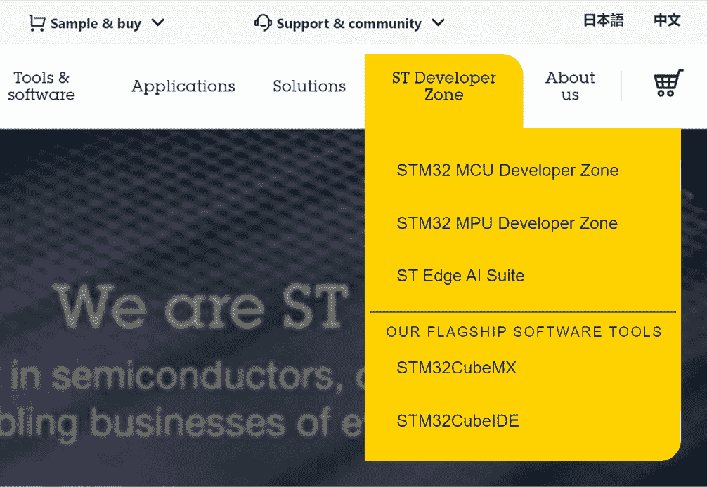

图 1.1：st.com 的首页

1.  滚动到页面上的**所有软件版本**部分并点击**下载软件**。在继续下载之前，您需要登录您的 ST 账户。

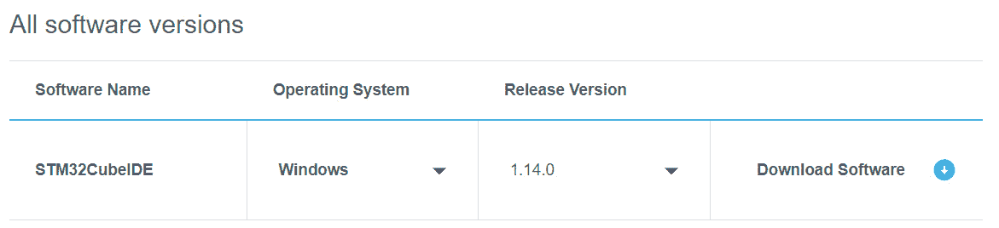

图 1.2：stm32cubeide 页面上的所有软件版本部分

1.  如果您没有账户，请点击**登录/注册**进行注册。如果您已经有了账户，只需登录即可。

1.  使用您的名字、姓氏和电子邮件地址完成注册表单。

1.  点击将`.zip`文件下载到您的`下载`文件夹。

让我们安装 STM32CubeIDE：

1.  解压下载的包。

1.  双击`st-stm32cubeide`文件以启动安装程序。

1.  在整个设置过程中点击**下一步**以保留默认设置。

1.  在 **选择组件** 页面上，确保已选中 **SEGGER J-Link 驱动程序** 和 **ST-LINK 驱动程序**。然后，点击 **安装**。

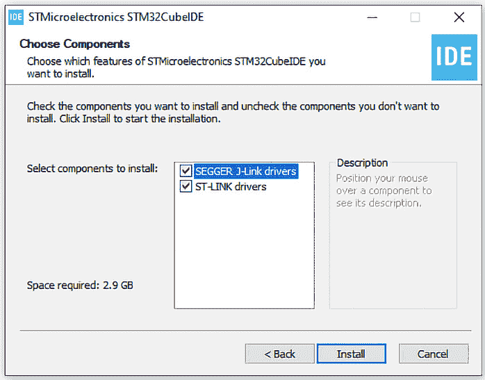

图 1.3：显示选择组件页面的安装程序

在我们的计算机上成功安装 STM32CubeIDE 后，我们现在将配置我们的备用开发工具，即 GNU Arm 嵌入式工具链。

## 设置 GNU Arm 嵌入式工具链

在本节中，我们将介绍设置 GNU Arm 嵌入式工具链的过程——这是开发基于 ARM 微控制器固件的重要工具：

1.  打开您的网络浏览器并导航到 [`developer.arm.com/downloads/-/gnu-rm`](https://developer.arm.com/downloads/-/gnu-rm)。

1.  滚动页面以找到适合您操作系统的下载链接。对于像我一样使用 Windows 的用户，选择 `.exe` 版本。对于 Linux 或 macOS 用户，选择适用于您操作系统的相应 `.tar` 文件。

1.  下载完成后，双击安装程序以开始安装过程。

1.  阅读许可协议。然后，通过点击 **安装** 选择在默认文件夹位置安装。

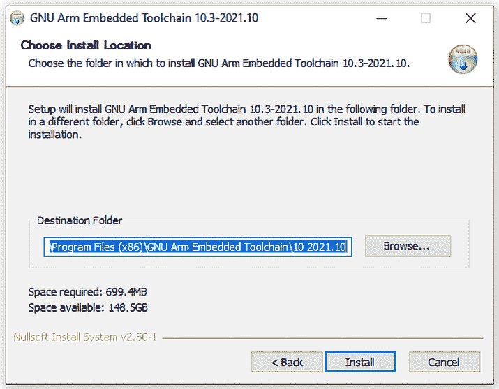

图 1.4：GNU Arm 嵌入式工具链安装程序

1.  安装完成后，请确保您检查了 **添加路径到环境变量** 选项。

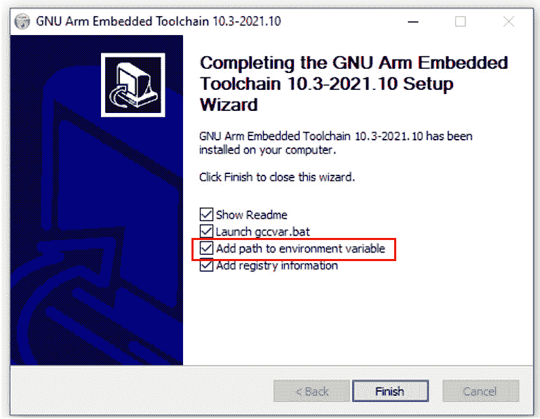

图 1.5：显示添加环境变量路径选项的安装程序

1.  点击 **完成** 以完成设置。

## 设置 OpenOCD

对于使用 GNU Arm 工具链进行固件开发，OpenOCD 扮演着至关重要的角色，它既可以帮助我们将固件下载到我们的微控制器中，也可以实时调试代码。

让我们设置 OpenOCD：

1.  打开您的网络浏览器并导航到 [`openocd.org/pages/getting-openocd.html`](https://openocd.org/pages/getting-openocd.html)。

1.  滚动到标题为 **非官方二进制软件包** 的部分。

1.  点击链接下载多平台二进制文件。

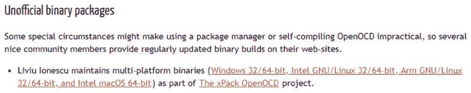

图 1.6：非官方二进制软件包部分

1.  确定与您的操作系统兼容的最新版本。要获取完整列表，请点击 **显示所有 14 个资源**。

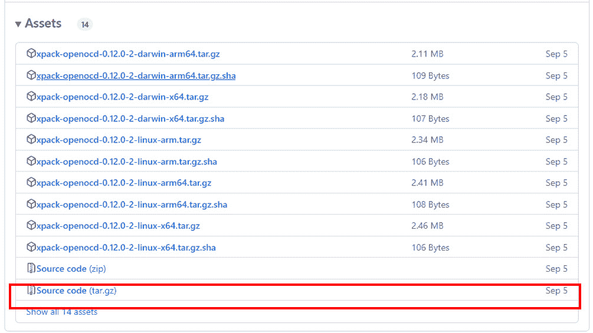

图 1.7：OpenOCD 软件包

1.  对于 Windows 用户，下载 `win32-x64.zip` 版本。对于 Linux 或 macOS 用户，下载适用于您操作系统的相应 `.tar` 文件。

1.  下载完成后，解压软件包。

1.  导航到解压后的文件夹，然后进入 `bin` 子文件夹。在这里，您可以找到 `openocd.exe` 应用程序。这是我们将在命令提示符中调用以与所选微控制器的特定脚本一起调试或下载代码到微控制器中的应用程序。

在 `xpack-openocd-0.12.0-2` | `openocd` | `scripts` 目录结构中，您可以找到针对各种微控制器和开发板的定制脚本。

接下来，我们需要将 OpenOCD 添加到我们的环境变量中：

1.  首先将整个 `openocd` 文件夹移动到您的 `程序` `文件` 目录。

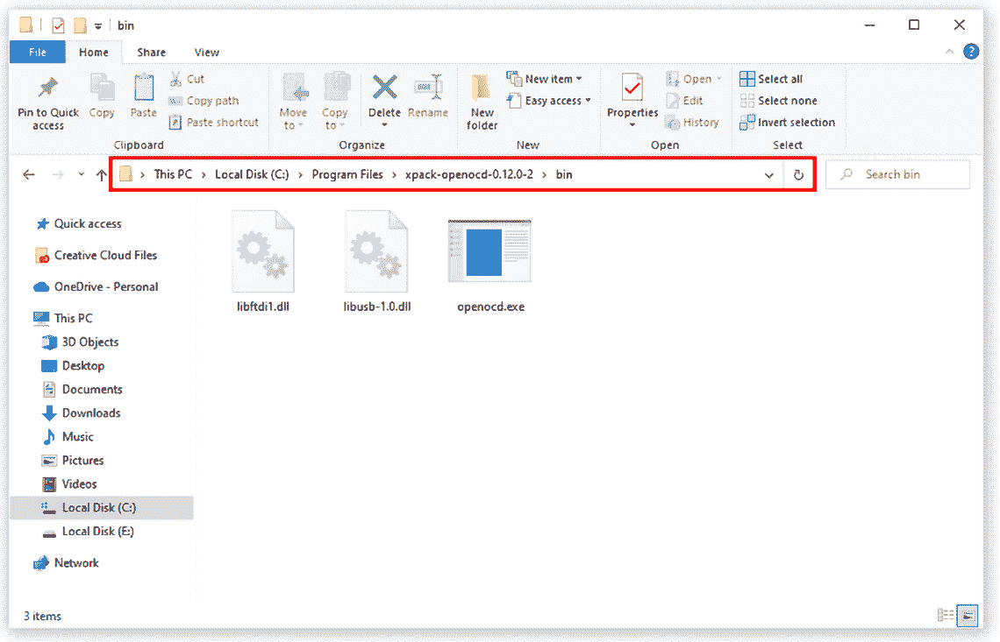

图 1.8：OpenOCD 移动到程序文件，显示 bin 文件夹的路径

1.  复制 `openocd` `bin` 文件夹的路径。

1.  右键点击 **此电脑**，然后选择 **属性**。

1.  搜索并选择 **编辑系统** **环境变量**。

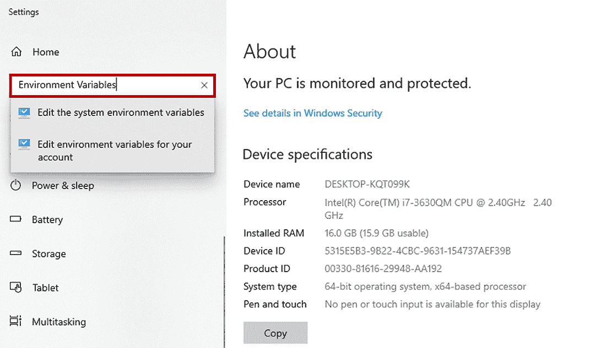

图 1.9：此电脑属性页面

1.  在 **系统属性** 弹出窗口中点击 **环境变量** 按钮。

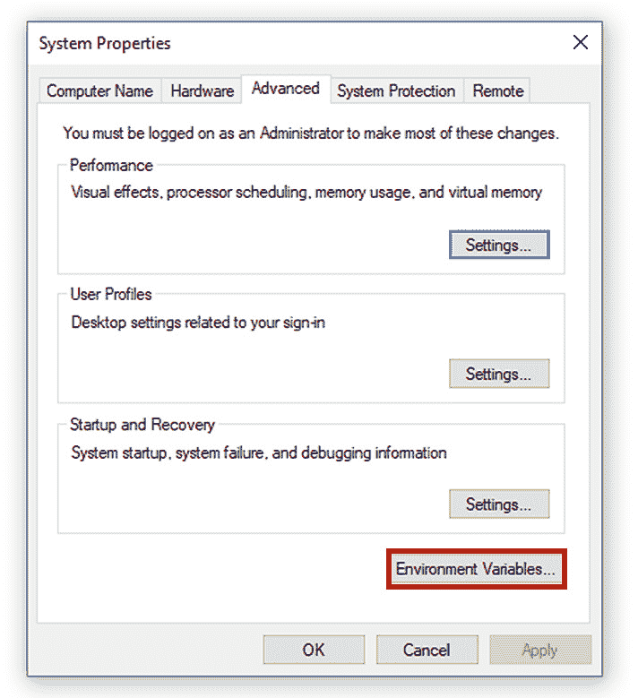

图 1.10：系统属性弹出窗口

1.  在 **环境变量** 弹出窗口的 **用户变量** 部分，双击 **路径** 项。

图 1.11：环境变量弹出

1.  在 **编辑环境变量** 弹出窗口中，点击 **新建** 以创建一个新路径项的行。

1.  将之前复制的 OpenOCD 路径粘贴到这个新行中。

1.  通过在各个弹出窗口中点击 **确定** 来确认您的更改。

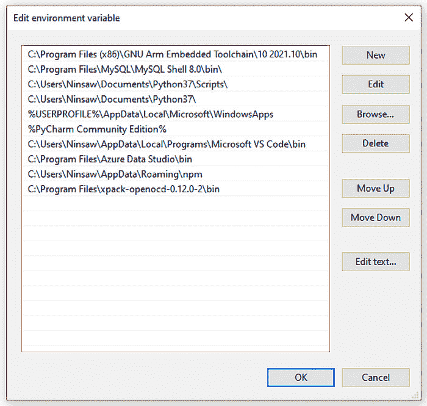

图 1.12：编辑环境变量弹出

最后，我们已经成功完成了设置过程。我们已配置了两个用于开发 STM32 微控制器固件的必要独立工具——STM32CubeIDE 用于 IDE，以及 GNU Arm Embedded Toolchain，辅以 OpenOCD，以便在没有 IDE 的情况下开发和调试我们的固件。

接下来，我们将把注意力转向我们的开发板。

# 开发板

在本章的这一部分，我们将深入探讨本书所选开发板的规格和特性。

## 理解开发板的作用

首先，让我们明确开发板的概念。重要的是要注意，开发板并不等同于微控制器。虽然开发板的名字可能部分来源于其上安装的微控制器，但将板本身称为微控制器是不准确的。开发板允许我们在最终产品中部署的确切微控制器变体上验证我们的固件。因此，在开发板上测试的固件确保在最终产品的微控制器上以相同的方式运行。这就是为什么像 STMicroelectronics 这样的公司提供各种开发板，针对他们产品组合中的每个微控制器进行定制。

同样重要的是要将开发板的作用与原型板，如 Arduino，进行对比。虽然原型板（可能不包含最终产品中打算使用的微控制器）作为初步测试平台，但开发板提升了这一过程。它们使我们能够在为大量产品制造指定的微控制器上严格测试概念和固件的性能评估。本书的目的将专注于 NUCLEO-F411 开发板。

## NUCLEO-F411 开发板概述

NUCLEO-F411 开发板配备了一个 STM32F411RE 微控制器，其峰值工作频率可达 100MHz。它拥有丰富的 512 Kbytes 闪存和 128 Kbytes SRAM。此外，该板还配备了多列 berg 引脚，使我们能够轻松地使用跳线连接到各种模块和组件，从传感器和电机到 LED。为了快速简便地进行输入/输出固件测试，该板还内置了用户按钮和 LED，消除了对外部组件的即时需求。

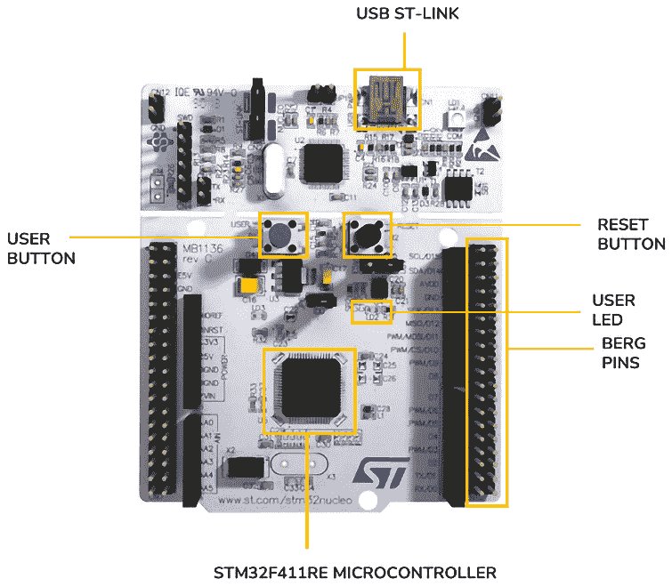

图 1.13：NUCLEO-F411 开发板

现在我们已经熟悉了开发板，让我们深入了解对开发板的全面理解和编程所必需的各种文档。

# 数据表和手册 – 揭示细节

本书的主要目标是编写与我们的微控制器寄存器直接交互的固件代码。这意味着我们的代码与目标微控制器之间没有抽象或中间库。为了实现这一点，了解微控制器的内部架构、理解我们交互的每个寄存器的地址以及了解那些寄存器中相关位的函数至关重要。这正是数据表和手册的作用所在。制造商提供这些文档，让用户了解他们的产品，在我们的情况下，指的是微控制器核心架构、微控制器和开发板。

两个不同的公司在我们的开发板制作中扮演着角色。第一个是 ARM Holdings，它向半导体制造公司如意法半导体、德州仪器和瑞萨等授权处理器和微控制器核心架构设计。这些制造商然后基于从 ARM 授权的设计生产物理微控制器或处理器，通常还会添加自己的定制功能。这就是为什么来自不同制造商的两个不同的微控制器可能共享相同的微控制器核心。例如，德州仪器的 TM4C123 和意法半导体的 STM32F4 都是基于 ARM Cortex-M4 核心。

由于我们选择的发展板，即意法半导体的 NUCLEO-F411，是基于 ARM Cortex-M4 微控制器核心，在接下来的章节中，我们将深入研究该板、其集成微控制器和底层核心的文档。

## 理解意法半导体的文档

STM32 微控制器之所以受欢迎，一个重要原因是意法半导体（STMicroelectronics）持续致力于提供全面的支持。这包括组织良好的文档和各种固件开发资源。

意法半导体有一系列文档，每个都遵循特定的命名约定。让我们讨论与我们工作相关的那些：

+   `RM`后跟一个数字。例如，我们微控制器的 RM 是`RM0383`。这份文档详细说明了我们微控制器中的每个寄存器，解释了每个位的角色，并提供了关于寄存器配置的见解。

+   `STM32F411`。本文件提供了微控制器的功能概述、完整的内存映射、展示微控制器外设和连接总线的框图，以及微控制器的引脚排列和电气特性。

+   `UM`后跟一个数字，例如，我们 NUCLEO-F411 的`UM1724`，这份文档专注于开发板。它描述了我们板上的组件，如 LED 和按钮，是如何连接到微控制器的特定端口和引脚的。

## ARM 的通用用户指南

ARM 为它们设计的每个微控制器和处理器核心提供文档。对我们讨论重要的是我们微控制器核心的通用用户指南。由于我们使用的是基于 ARM Cortex-M4 核心的 STM32F411，我们将参考 Cortex-M4 通用用户指南。

这意味着如果我们使用的是基于 ARM Cortex-M7 核心的 STM32F7 微控制器，那么我们就需要获取 Cortex-M7 通用用户指南。这份文档的命名约定只是微控制器核心的名称加上短语`通用``用户指南`。

如其名所示，本文件提供了关于特定微控制器核心的通用信息。这意味着在 Cortex-M4 通用用户指南中提供的信息适用于所有基于 Cortex-M4 核心的微控制器，无论这些微控制器的制造商是谁。相比之下，STMicroelectronics 文档中提供的信息仅适用于 STMicroelectronics 的微控制器。

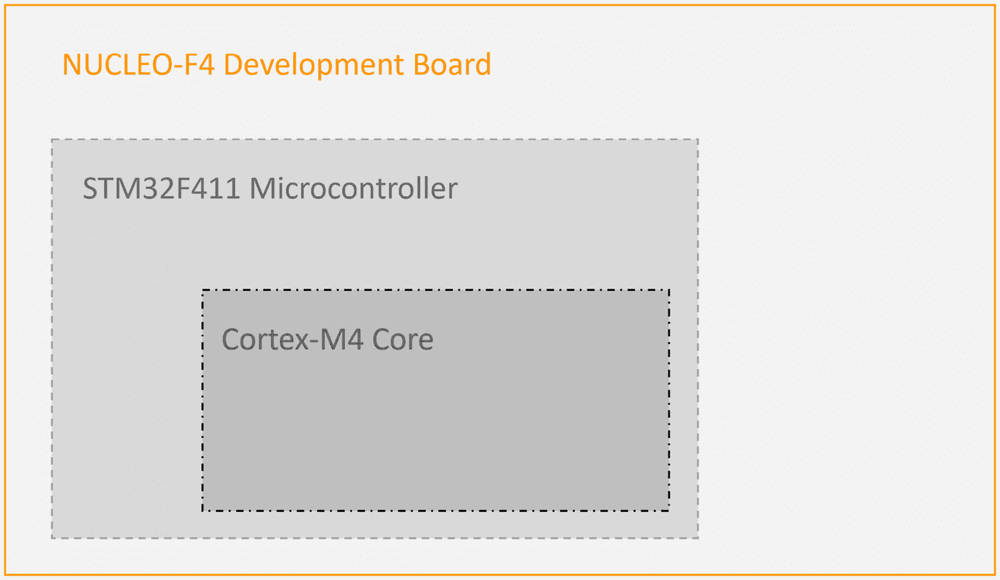

图 1.14：开发板、微控制器和微控制器核心之间的关系

*为什么我们需要通用用户指南？*

通用用户指南提供了关于处理器核心核心外设的信息。正如其名称所暗示的，这些核心外设在基于特定核心的所有微控制器中是一致的。Cortex-M4 核心有五个核心外设——系统定时器、浮点单元、系统控制块、内存保护单元和嵌套向量中断控制器。当为这些外设开发裸机驱动程序时，通用用户指南是获取必要细节的权威来源。

此外，本指南还提供了关于微控制器核心指令集、程序员模型、异常模型、故障处理和电源管理的信息。

## 获取文档

要获取上述文档，您可以在 Google 上使用以下搜索词：

+   `STM32F11 参考手册` 或 `RM0383`.

+   `STM32F411 数据手册`.

+   `Nucleo-F11 用户手册` 或 `UM1724`.

+   `Cortex-M4 通用` `用户指南`

这些文档的直接链接也在此章的 *技术要求* 部分提供。

在分析编程我们的开发板的关键区域的各种文档之前，让我们首先更仔细地看看我们之前安装的 STM32CubeIDE。在下一节中，我们将熟悉其功能和特性。

# 导航 STM32CubeIDE

当您首次启动 STM32CubeIDE 时，您将看到 **信息中心**。此中心提供了快速访问许多对 STM32 固件开发有价值的资源。

要退出信息中心，只需在其选项卡上单击 **X**。如果您稍后想再次访问它，只需导航到 **帮助** | **信息中心**。

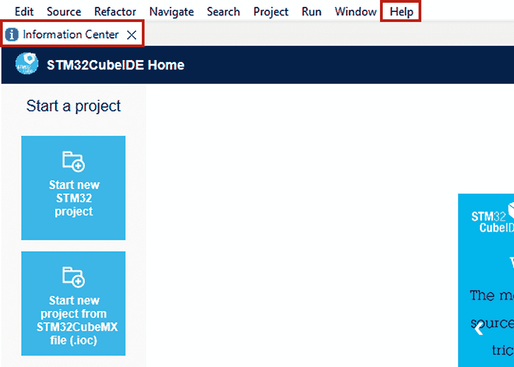

图 1.15：信息中心

STM32CubeIDE 基于 Eclipse 框架，因此其布局和元素与其他基于 Eclipse 的 IDE 类似。

让我们通过创建新项目的流程来了解一下：

1.  您可以在空白的 **项目资源管理器** 窗格中单击 **创建一个新的 STM32 项目**，或者选择 **文件** | **新建** | **STM32 项目**。

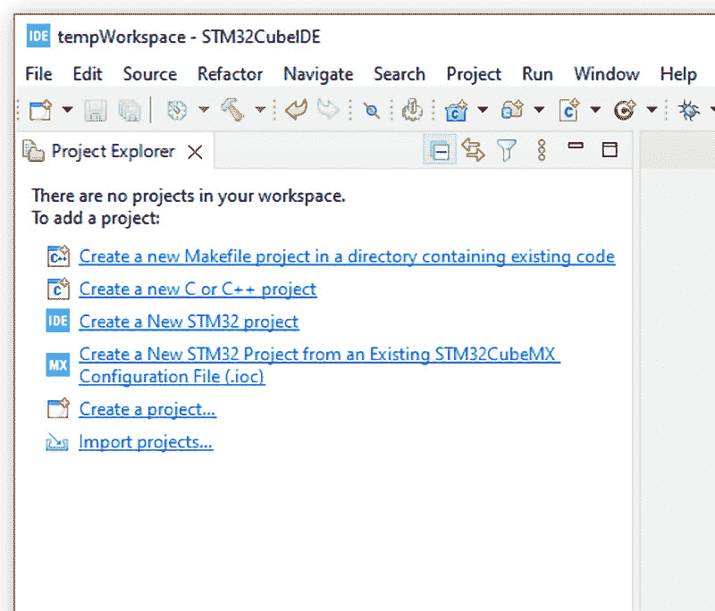

图 1.16：显示空项目资源管理器的工位图

1.  您将看到一个 **目标选择** 窗口，用于选择项目所需的微控制器或开发板。

1.  点击 **板** **选择** 选项卡。

1.  在 **商业零件** **编号** 字段中输入 `NUCLEO-F411`。

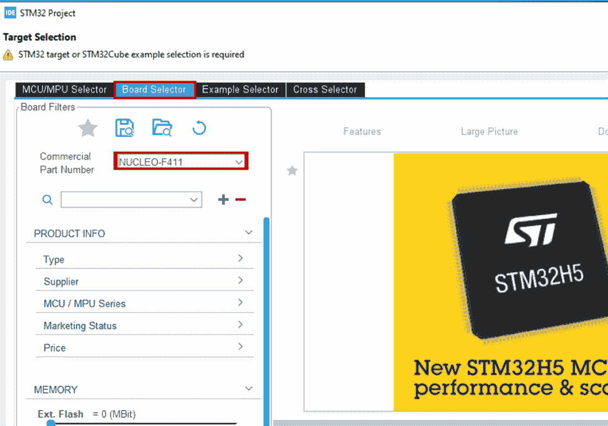

图 1.17：目标选择窗口

1.  从显示的板列表中选择 **NUCLEO-F11RE**，然后点击 **下一步**。

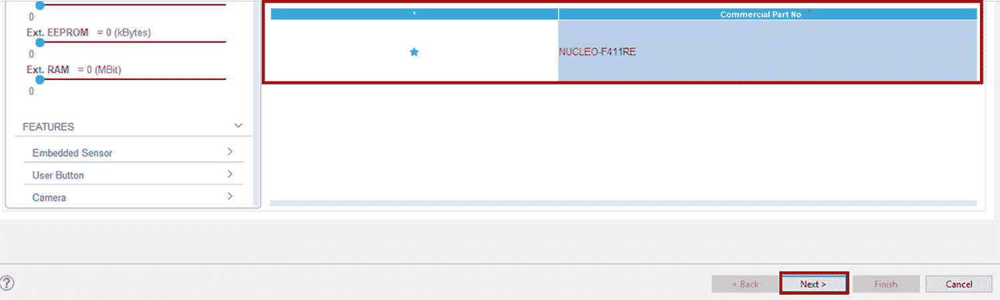

图 1.18：选择 NUCLEO-F411 的板列表

1.  给项目起一个名字。

1.  对于 **目标项目类型**，选择 **空**。

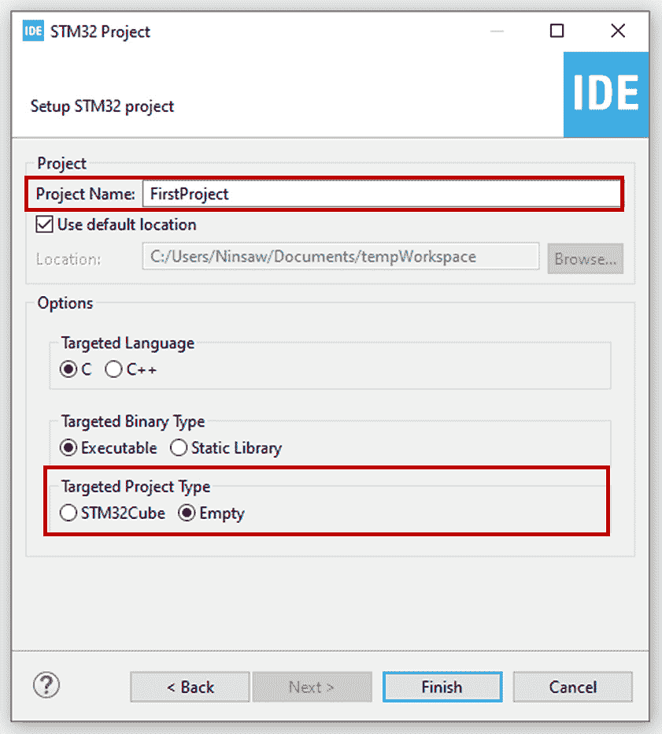

图 1.19：STM32 项目设置窗口

1.  点击 **完成** 按钮创建项目。

您将在 **项目** **资源管理器** 窗格中看到包含所有必要启动文件和链接脚本的新项目。

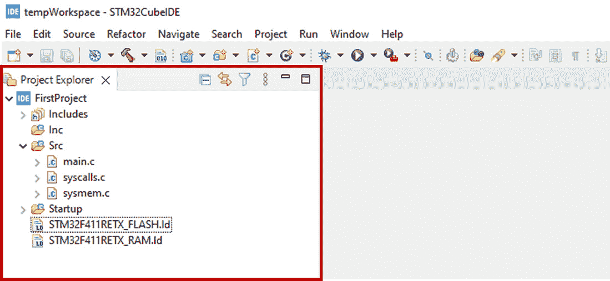

图 1.20：显示新项目的项目资源管理器窗格

# 理解控制图标

最常用的控制图标是 **新建**、**构建** 和 **调试** 图标。

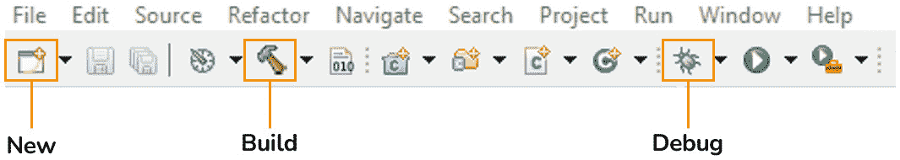

图 1.21：控制图标

让我们仔细看看这些图标的功能：

+   **新建图标**：此图标允许我们创建各种文件，包括源代码、头文件、项目、库等。此功能也可以通过 **文件** | **新建** 访问。

+   **构建图标**：用于构建项目。此功能也可以通过在项目上右键单击并选择 **构建项目** 来访问。

+   **调试图标**：此图标启动调试配置，以方便项目调试。此功能也可以通过在项目上右键单击并选择 **调试项目** 来访问。

这些控制图标提供了快速访问基本功能的途径，显著提高了生产力和简化了开发过程。

# 摘要

在本章中，我们旨在为嵌入式固件开发创建一个健壮的环境，重点关注基本工具的精心选择和设置。我们选择的每个工具都在微控制器固件的高效开发中扮演着关键角色。我们探讨了 STM32CubeIDE、GNU Arm Embedded Toolchain 和 OpenOCD 的安装过程，为我们的发展活动奠定了坚实的基础。

我们随后介绍了配备 STM32F411RE 微控制器的 NUCLEO-F411 开发板，作为我们的实验平台，并花费时间识别了板上的某些组件。

我们还强调了了解不同类型的数据表和参考手册的重要性，使我们能够快速获取有关微控制器架构和功能性的详细信息。

接下来，我们将进入下一章，我们将着手开发我们的第一个裸机固件，仅使用我们已编译的文档作为我们的指南。
