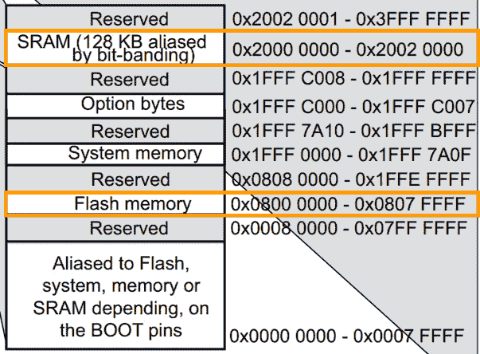
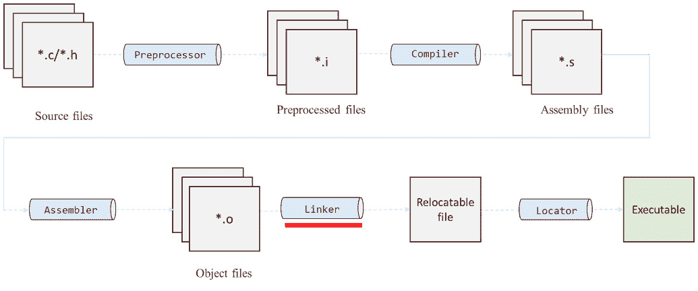
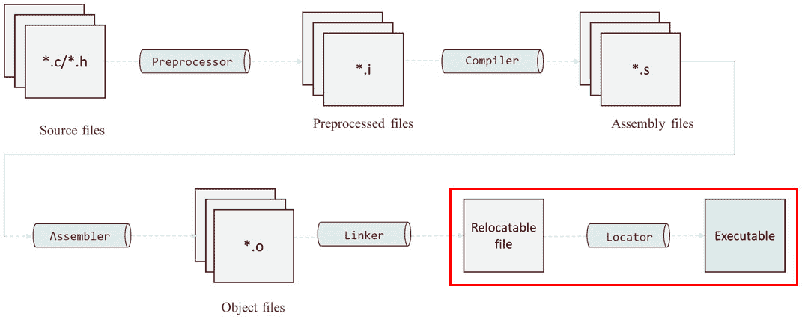
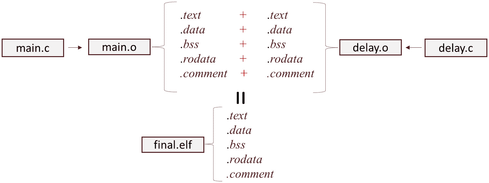
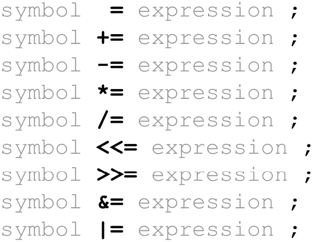
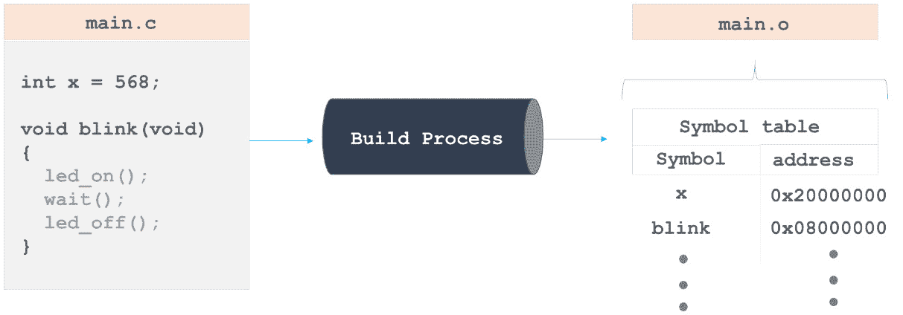
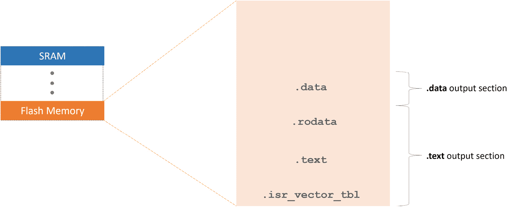

# 4

# 开发链接脚本和启动文件

在本章中，我们深入探讨了嵌入式**裸机编程**的核心组件，重点关注三个关键领域：微控制器内存模型、链接脚本的编写和启动文件。

首先，我们将探讨微控制器内存模型，以了解内存是如何组织和使用的。这些知识对于在微控制器内存中准确分配程序代码和数据部分非常重要。接下来，我们将深入了解编写链接脚本的技术细节。这些脚本对于正确地将我们的程序映射到微控制器内存的适当部分至关重要，确保可执行程序按预期运行。

最后，我们将学习启动文件，然后编写我们自己的启动文件，重点关注初始化向量表和配置`Reset_Handler`。

在本章中，我们将涵盖以下主要内容：

+   理解内存模型

+   链接脚本

+   编写链接脚本和启动文件

# 技术要求

本章的所有代码示例都可以在 GitHub 上找到：[`github.com/PacktPublishing/Bare-Metal-Embedded-C-Programming`](https://github.com/PacktPublishing/Bare-Metal-Embedded-C-Programming)。

# 理解 STM32 内存模型

虽然 STM32 内存映射包括多个内存区域，但我们在开发链接脚本和启动文件时的主要焦点是两个关键区域：**闪存**和**静态随机存取存储器**（**SRAM**）。这些区域至关重要，因为它们直接参与程序存储。在本节的开头部分，我们将了解这些内存区域的特点以及它们所扮演的独特角色。

*图 4**.1*显示了 stm32f411 内存映射的一部分，突出显示了闪存和 SRAM。



图 4.1：STM32F11 内存映射的一部分，突出显示闪存和 SRAM 区域

让我们从闪存内存开始。

## 闪存内存

闪存内存的一个主要优点是其非易失性。这意味着即使断开电源，存储在闪存内存中的数据也会保持完整。在 STM32 微控制器（以及其他微控制器）中，闪存内存通常是存储可执行代码的地方，在正常操作期间是只读的。闪存内存从`0x08000000`地址开始。然而，其大小取决于具体的 STM32 微控制器型号。

STM32 微控制器有多种系列和型号，提供不同密度的闪存内存，以满足不同的应用需求。

什么是内存密度？

**内存密度**指的是在给定的物理空间或组件内存储内存的集中度。内存密度通常以每单位物理面积存储的位数或字节来表示，例如每平方毫米的位数或每平方厘米的字节。它衡量了数据在该空间内可以存储的密集程度或紧凑程度。更高的内存密度意味着我们可以在较小的物理空间内存储更多的数据。

另一方面，内存大小指的是给定存储设备中可用的总内存（存储容量）。它通常以字节、**千字节（KB**）、**兆字节（MB**）、**吉字节（GB**）等单位来衡量。

现在，让我们来谈谈闪存的某些操作细节。

闪存，包括 STM32 闪存，具有有限的程序和擦除周期。每次我们写入（编程）或擦除时，都会消耗这些周期中的一个。在设计频繁写入或从闪存中擦除数据的应用程序时，考虑这些限制非常重要。

STM32 微控制器以其低功耗而闻名，这种特性也扩展到了它们的闪存操作。高效的电源管理确保微控制器在读取或写入闪存时能够以最小的功耗运行，这使得 STM32 设备非常适合电池供电的应用。

为了确保数据完整性，STM32 闪存通常包括内置的错误纠正机制。这些机制有助于识别和纠正数据存储和检索过程中可能发生的错误，从而提高了存储固件的可靠性。

以下是一些 STM32 闪存的关键属性：

+   **只读特性**：主要用于存储程序代码

+   `0x08000000`

+   **变量大小**：取决于具体的 STM32 微控制器型号

+   `0x08000004`

让我们来看看与编写链接脚本和启动文件相关的其他主要内存区域。

## SRAM

**SRAM**是一种易失性内存，意味着当电源断开时，它会丢失其内容。在 STM32 微控制器中，SRAM 用于程序执行期间的临时数据存储。与用于长期存储程序代码的闪存不同，SRAM 旨在实现高速访问和低延迟，使其非常适合存储变量、中间数据和运行时管理堆栈。

与闪存一样，STM32 微控制器具有不同大小的 SRAM，以满足不同应用的需求。SRAM 的大小决定了可以处理的运行时数据量，并影响微控制器在处理复杂任务或多任务处理时的整体性能。STM32 微控制器中的 SRAM 从`0x20000000`地址开始。与闪存一样，其大小取决于具体的 STM32 微控制器型号。

以下是一些 STM32 SRAM 的关键属性：

+   **读写**：变量和堆栈存储在这里

+   `0x20000000`

+   **变量大小**：取决于特定的 STM32 微控制器型号

在介绍链接脚本之前，让我们简要提及一个与链接脚本不相关，但对我们理解微控制器内存布局仍有意义的内存区域。

## 外围内存

**外围内存**专门用于管理和与微控制器板载外围设备接口。这些外围设备包括定时器、通信接口（UART、SPI、I2C）和**模数转换器**（**ADCs**）。外围内存由用于配置和管理这些外围设备的寄存器组成。

微控制器架构的一个重要方面是使用**内存映射输入/输出**（**I/O**）。内存映射 I/O 是一种技术，其中外围寄存器被分配到系统内存空间中的特定地址。这种方法允许固件通过从或向这些内存地址读取或写入来与硬件外围设备交互，就像它与常规内存交互一样。STM32 内存映射的外围内存区域是外围寄存器的内存映射区域。

现在我们已经熟悉了主要内存区域，我们准备学习链接脚本。

# 链接脚本

链接脚本在构建过程中扮演着重要的角色，尤其是在定义内存布局和分配固件使用的各种内存部分。它们指定固件的各个部分，如代码、数据和未初始化数据，应在微控制器内存中的位置。

虽然链接脚本设置了这些部分的架构和边界，但重要的是要注意，它们并不填充这些部分的数据。实际使用特定值初始化数据的处理由启动代码负责，该代码在微控制器启动时运行。我们向链接器提供这些链接脚本，以有效地指导链接阶段的内存组织。



图 4.2：带有链接器高亮的构建过程

## 理解链接过程

在构建过程中，链接对象文件是一个重要的步骤，它将单个代码片段转换为功能固件。汇编器从源代码生成对象文件，每个对象文件都包含固件所需的代码和数据部分。然而，这些对象文件通常包含对变量和函数的未解决内部引用，使它们本身不完整。例如，一个对象文件可能包含对定义在其他地方的`adc_value`变量的引用。链接器的任务是合并这些对象文件，系统地解决所有这些未解决符号，以创建一个统一的输出文件。要完全欣赏链接器的细致工作，我们必须了解链接器为每个部分分配的属性。

### 部分属性及其影响

对象文件中的每个部分都通过一个唯一的名称和大小来识别，具有特定的属性，这些属性规定了应该如何处理它们：

+   **可加载部分**：这些部分包含在运行时必须加载到内存中的内容。它们对于程序的执行至关重要，包括可执行代码和初始化数据。

+   **可分配部分**：这些部分本身不携带内容。相反，它们指示应该保留内存的某个区域，通常是为在运行时定义的未初始化数据。

+   **不可加载、不可分配的部分**：通常，既不可加载也不可分配的部分包含调试信息或元数据，这些信息有助于开发过程，但不是程序执行所必需的。

链接过程的一个关键方面是为每个可分配和可加载的输出部分确定两种类型的地址：**虚拟内存地址**（**VMA**）和**加载内存地址**（**LMA**）。

这些是这两个地址的作用：

+   **VMA**：此地址表示在输出文件执行期间部分将在内存中的位置。它是系统用于访问部分数据或指令的运行时地址。

+   **LMA**：相反，LMA 是部分在内存中物理加载的地址。

在大多数情况下，VMA 和 LMA 是相同的

当数据部分最初被加载到闪存中，但在启动时被复制到 SRAM 时，会出现一个显著的例外。

为了更清晰地全面理解构建过程的后期阶段，深入探讨我们讨论的另一个基本方面是至关重要的：定位器在构建过程中的具体职责和贡献。

### 地址重定位和定位器

链接器生成的输出文件并不立即适用于目标微控制器。这是因为链接过程中分配给不同部分的地址不一定与目标设备的实际内存布局相对应。因此，这些地址必须重新定位以准确匹配目标内存空间。这就是定位器的工作。



图 4.3：构建过程，突出可重定位文件、定位器和最终可执行输出之间的关系

在 GNU 工具链中，定位器功能集成到链接器中，简化了地址重定位的过程。这种能力确保最终的可执行文件正确映射到微控制器的内存中，使其准备好执行。

在本节中，我们考察了构建过程。从这一点来看，我们观察到嵌入式系统开发中链接对象文件的过程涉及对代码和数据部分的细致组织、符号解析和地址重定位。

在下一节中，我们将详细探讨链接脚本的关键组件。这次探索将提供额外的见解，并加深我们对本节讨论的核心元素的理解。

## 链接脚本的关键组件

链接脚本的关键组件包括**内存布局**、**部分定义**、**选项**和**符号**，每个都在确保固件正确放置和执行在微控制器内存中发挥独特的作用。

### 内存布局

这部分链接脚本指定了微控制器中可用的各种内存类型，例如闪存和 SRAM。它包括它们的起始地址和大小，例如闪存从`0x08000000`开始或 SRAM 从`0x20000000`开始。

### 部分定义

链接脚本的一个关键方面是定义如何以及在哪里放置程序的不同部分。包含程序代码的`.text`部分通常位于闪存的开始处。随后，`.bss`和`.data`部分在 SRAM 中分配。链接脚本还确保这些部分的正确对齐，以实现高效的内存访问和程序执行：

+   `.text`:

    +   `.text`部分包含我们程序的执行指令。这是处理器实际执行的代码所在的位置。

    +   `.text`部分的大小取决于你的程序中的代码量。在 STM32 微控制器中，它通常从一个预定义的内存地址开始，通常在闪存的较低区域。例如，`0x00000000`然后重定位到`0x08000000`。

+   `.bss`:

    +   `.bss`部分用于未初始化的全局和静态变量。当程序启动时，这部分变量没有初始值。

    +   `0`.

+   `.data`:

    +   `.data`部分包含初始化的全局和静态变量。与`.bss`中的变量不同，这些变量在我们的代码中指定了初始值。

    +   `.data`部分通常从闪存复制到 SRAM，以允许更快的访问和修改。

    +   **管理**：将这些值从闪存复制到 SRAM 的过程由启动代码处理，该代码在我们程序的 main 函数之前执行。

+   `.rodata`: 这个部分用于常量数据，例如字符串字面量和常量数组。它是只读的，通常存储在闪存中。

+   `.heap`和`.stack`是用于动态内存分配（`malloc`、`free`）和函数调用栈的部分。它们是 SRAM 的一部分，对于运行时内存管理至关重要。

下表总结了关键部分及其在内存中的位置。

| **部分** | **目的** | **放置在** |
| --- | --- | --- |
| `.text` | 包含可执行程序指令。 | `FLASH` |
| `.bss` | 存储未初始化的全局/静态变量。 | `SRAM` |
| `.data` | 存储带有初始值的初始化全局/静态变量。 | `FLASH` (`SRAM` 在运行时） |
| `.rodata` | 存储常量数据（字符串字面量、常量数组）。 | `FLASH` |

表 4.1：链接脚本节区和它们在内存中的位置

理解这些节区的特性对于确保可执行文件正常工作非常重要。

### 选项和符号

**选项**在链接脚本中是影响链接器行为的命令或指令。一个典型的链接脚本包括设置程序入口点和定义内存布局的指令。

链接脚本中的符号是作为占位符或对微控制器内存空间中特定内存位置、值或地址的引用的标识符。符号可以用来表示内存节区的起始或结束地址或程序中的特定变量。例如，可以定义一个符号来表示闪存开始或 SRAM 区域的起始。我们还可以使用符号来定义在整个固件（如源代码文件）中使用的 重要常量或值。这些可能包括硬件地址、配置值或大小限制。通过使用符号，代码变得更加可读和可维护，因为这些值可以在一个地方（链接脚本）更改，而不是在代码的多个位置更改。

现在我们已经熟悉了链接脚本的关键组件，我们将继续学习这些脚本中的一些基本指令。链接脚本中的每个指令都指导链接器如何处理和组织输入目标文件到最终的可执行文件中。

## 链接脚本指令

在本节中，我们将学习链接脚本的基本指令。这些指令决定了内存布局以及各种节区（代码、数据等）如何在目标微控制器的内存中分配。我们将探讨关键指令、它们的功能以及它们如何影响编译固件的总体结构和效率。让我们从 `MEMORY` 指令开始。

### 内存指令（MEMORY）

`MEMORY` 指令界定了微控制器的内存区域。`MEMORY` 节区中定义的每个块代表一个独立的内存区域，其特征在于其名称、起始地址和大小。此指令允许我们定义目标设备的内存布局，指定不同的内存区域及其属性。它在指导链接器如何将程序的节区（代码、数据等）分配到微控制器的物理内存中起着重要作用。

#### 使用模板

`MEMORY` 指令的一般语法如下：

```cpp
MEMORY
{
  name (attributes) : ORIGIN = origin, LENGTH = length
}
```

+   `name`: 我们赋予内存区域的标识符

+   `attributes`: 这指定了区域的访问权限，例如读、写和执行权限

+   `ORIGIN`: 这定义了内存区域的起始地址

+   `LENGTH`: 这指定内存区域的大小

#### 使用示例

考虑一个微控制器，它使用闪存来存储可执行代码，使用 SRAM 来存储数据。链接脚本可能如下定义这些内存区域：

```cpp
MEMORY
{
  FLASH (rx) : ORIGIN = 0x08000000, LENGTH = 256K
  SRAM (rwx) : ORIGIN = 0x20000000, LENGTH = 64K
}
```

在此示例中，定义了两个内存区域：`FLASH` 和 `SRAM`：

+   `FLASH` 被标记为读取（`r`）和执行（`x`）权限（`rx`），表示此区域可以存储可执行代码，但在程序执行期间不可写。它从 `0x08000000` 地址开始，扩展 `256K` 字节。

+   `SRAM` 被授予读取（`r`）、写入（`w`）和执行（`x`）权限（`rwx`），允许它在运行时存储和修改数据和可执行代码。它从 `0x20000000` 地址开始，扩展 `64K` 字节。

`MEMORY` 指令，通过其综合定义内存区域和属性，为固件开发中的高效和有效内存管理奠定了基础。在继续到下一个指令之前，让我们检查所有可以指定的属性，以详细说明内存部分的特性和权限：

+   `r`: 此属性允许读取内存。这对于包含程序在执行期间需要读取的可执行代码或常量的内存部分非常重要。

+   `w`: 此属性允许将数据写入内存。这对于程序在执行期间动态存储数据的内存区域非常重要。

+   `x`: 此属性允许从指定的内存区域执行代码。它通常分配给包含程序代码的闪存。

+   `rw`: 这是读取和写入权限的组合，允许在指定的内存区域进行这两种操作。它通常用于如 SRAM 这样的部分，其中存储和修改临时数据和变量。

+   `rx`: 这表示读取和执行权限的组合。它通常用于闪存，以指示该区域包含处理器可以读取和执行的执行代码。

+   `rwx`: 此属性组合了所有三种权限，使内存区域完全可读、可写和可执行。这由于安全和系统稳定性考虑而较少使用，但在某些开发或调试场景中可能适用。

+   `empty`: 如果没有指定属性，则默认情况下内存区域不授予任何访问权限。这可能在权限由固件中的其他方式控制或修改的特殊情况下使用。

现在，让我们检查 `ENTRY` 指令。

### 入口指令（ENTRY）

此指令指定程序的入口点，即复位后首先执行的代码片段。

这里是使用模板：

```cpp
ENTRY(SymbolName)
```

这里是一个使用示例：

```cpp
ENTRY(Reset_Handler)
```

在本例中，`Reset_Handler`被指定为程序的入口点，这意味着第一个要执行的功能。在固件开发中，`Reset_Handler`负责初始化系统并跳转到主程序。

接下来，我们介绍`SECTIONS`指令。

### 部分指令（SECTIONS）

这个指令定义了从输入文件到输出文件的映射和排序。

#### 使用示例

让我们看看它的模板：

```cpp
SECTIONS
{
  .output_section_name address :
  {
    input_section_information
  } >memory_region [AT>load_address] [ALIGN(expression)] [:phdr_
    expression] [=fill_expression]
}
```

参数如下：

+   `output_section_name`：这是为定义的输出部分给出的名称。常见的名称包括`.text`用于可执行代码，`.data`用于初始化数据，以及`.bss`用于未初始化数据。

+   `address`：这是可选的，并指定了部分在内存中的起始地址。这通常留给链接器根据脚本中定义的部分和内存区域的顺序来确定。

+   `input_section_information`：这决定了哪些输入部分（来自编译后的目标文件）应该包含在这个输出部分中。可以使用通配符，如`*(.text)`，来包含所有输入文件中的`.text`部分。

+   `>memory_region`：这会将部分分配给在链接脚本`MEMORY`块中定义的特定内存区域。我们使用这个指令来告诉链接器这个部分应该在目标内存映射中的哪个位置，例如`FLASH`或`SRAM`。

+   `[AT>load_address]`：这是可选的，并指定了部分加载地址。这在执行地址与加载地址不同的场景中使用。

+   `[ALIGN(expression)]`：这是可选的，并将部分的开头对齐到由`expression`指定的值的倍数地址。这对于确保部分从满足特定对齐要求的地址开始特别有用，这可以提高访问速度和兼容性。

+   `[:phdr_expression]`：这是可选的，并将部分与程序头关联。程序头是**可执行和链接格式**（**ELF**）文件结构的一部分；它们为系统加载器提供有关如何加载和运行程序不同段的信息。

+   `[=fill_expression]`：这是可选的，并指定一个字节值来填充部分之间的间隙或填充到部分末尾以达到一定的对齐。这可以用于初始化内存区域到已知状态。

#### 使用示例

让我们看看`SECTIONS`指令的实际应用示例：

```cpp
SECTIONS
{
  .text 0x08000000 :
  {
    *(.text)
  } >FLASH
}
```

在本例中，我们有以下内容：

+   `SECTIONS`：这个关键字标志着链接脚本中定义输出部分的开始。输出部分是内存区域，用于存放被链接的输入文件的代码和数据。

+   `.text 0x08000000`：这一行定义了一个名为`.text`的输出部分，并将其起始地址设置为`0x08000000`。`.text`部分通常包含可执行代码。

+   `{ *(.text) }`：这一行指定了要放入`.text`输出部分的内容。`*(.text)`语法意味着所有输入文件中的`.text`部分。

+   `>FLASH`：此指令告诉链接器将`.text`部分放置在名为`FLASH`的内存区域中。`FLASH`区域将在`MEMORY`指令块中定义。

要理解`*(.text)`语法的意义，让我们检查合并部分的过程。

### 部分合并

如我们之前所学的，汇编器为每个源文件生成一个目标文件，每个文件都包含其`.text`、`.data`、`.bss`和其他部分。然后，链接器将这些部分合并到最终可执行文件的统一`.text`、`.data`和`.bss`部分中。

考虑一个包含两个源文件（`main.c`和`delay.c`）的固件项目。汇编过程产生`main.o`和`delay.o`，每个都有自己的部分。链接器的任务是将这些部分合并成最终可执行文件的单一代码集合。

下图展示了这一过程。请注意，合并不是通过加法过程完成的；这只是一个视觉辅助工具，以增强你的理解。



图 4.4：涉及两个源文件（main.c 和 delay.c）的合并过程，结果生成最终的可执行文件 final.elf

现在，让我们探讨`AT >`指令的目的。为了做到这一点，我们必须重新审视 LMA 和 VMA 的概念。

### 仔细观察 LMA 和 VMA

如我们之前所学的，二进制输出文件中的每个可分配和可加载输出部分都与两种类型的地址相关联：LMA（加载地址）和 VMA（虚拟地址）。这些地址对于定义在系统启动及其后续运行操作期间如何以及在哪里处理二进制文件的某个部分至关重要：

+   **LMA**：这是在程序执行开始之前，该部分在二进制映像中的物理地址。它决定了系统在程序启动时将从哪里将部分加载到内存中。

+   **VMA**：相反，VMA 是程序执行期间该部分打算被访问的地址。这是系统在引用该部分中的数据或指令时使用的“运行时”地址。对于不使用**内存管理单元**（MMU）的系统，尤其是微控制器，VMA 通常直接匹配该部分的物理内存地址。

### 为什么 LMA 和 VMA 很重要？

LMA 和 VMA 之间的区别允许采用灵活的内存管理方法，其中数据可以存储在一个位置（如闪存），但运行在另一个位置（如 SRAM）。例如，初始化的全局和静态变量（通常放置在`.data`部分）可以存储在闪存中，但需要复制到 SRAM 以实现更快的访问并允许在运行时进行修改。

为了完全理解这一点，让我们考虑以下由 STM32CubeIDE 生成的链接脚本片段：

```cpp
  .data :
  {
    . = ALIGN(4);
    _sdata = .;  /* create a global symbol at data start */
    *(.data)           /* .data sections */
    *(.data*)          /* .data* sections */
    *(.RamFunc)        /* .RamFunc sections */
    *(.RamFunc*)       /* .RamFunc* sections */
    . = ALIGN(4);
    _edata = .;  /* define a global symbol at data end */
  } >SRAM AT> FLASH
```

在这个脚本中，最后一行 `>SRAM AT> FLASH` 包含了两个重要的指令：

+   `>SRAM` 表示在程序执行期间（VMA），输出 `.data` 部分被放置在内存的 `SRAM` 区域。

+   `AT> FLASH` 指定尽管在执行时部分位于 SRAM 中，但它应该最初被加载到内存中（`FLASH`）。这对于初始化数据很常见，这些数据存储在闪存中，然后在微控制器初始化代码启动时被复制到 SRAM。

这种对内存地址的详细管理突出了 LMA 和 VMA 在最大化资源受限微控制器效率中的关键作用。通过有效使用 LMA 和 VMA，我们可以确保即使在有限的内存资源下，我们的微控制器也能可靠高效地运行，优化存储和执行效率。

在探索链接器脚本的其他功能之前，让我们熟悉一些其他常用的指令。

### 其他常用指令

一些其他常用的指令包括 `KEEP`、`ALIGN`、`PROVIDE`、`>region` 和 `AT` 指令。让我们来检查它们。

#### `KEEP` 指令

`KEEP` 指令确保在优化过程中，指定的部分或符号不会被链接器删除，即使它们看起来没有被使用。这对于必须存在于最终二进制文件中的中断向量表和初始化函数至关重要。

这里是使用模板：

```cpp
KEEP(section)
```

这里是一个使用示例：

```cpp
KEEP(*(.isr_vector))
```

在这个示例中，我们正在保留中断向量部分。接下来，让我们看看区域放置指令。

#### `>region` 指令

`(>region)` 区域放置指令告诉链接器将特定的部分放置在特定的内存区域中。可用的内存区域必须在链接器脚本中的 `MEMORY` 指令块中定义。

这里是使用模板：

```cpp
section >region
```

这里是一个使用示例：

```cpp
.data :
{
  *(.data)
} >SRAM
```

在这个示例中，我们将 `.data` 部分放置在 `SRAM` 内存区域。

#### `ALIGN` 指令

`ALIGN` 指令在链接器脚本中起着至关重要的作用，通过调整位置计数器以与指定的内存边界对齐。**位置计数器**跟踪链接器在链接过程中为放置部分或输出文件的某部分分配的当前内存地址。

`.`) 在链接器脚本中。

链接器在处理脚本时，根据脚本中的指令为代码和数据部分分配内存地址，同时位置计数器监控进度。为了确保高效的内存访问并遵守硬件架构要求，部分和变量通常需要对齐到特定的边界。`ALIGN` 指令通过将位置计数器向上舍入到最接近的符合指定对齐的地址来实现这一点，该对齐必须是 2 的幂。

这里是使用模板：

```cpp
. = ALIGN(expression);
```

这里是一个使用示例：

```cpp
. = ALIGN(4);
```

在这个示例中，我们将当前位置对齐到 `4` 字节边界。

接下来，让我们看看 `PROVIDE` 指令。

#### PROVIDE 指令

`PROVIDE` 指令允许我们定义符号，如果它们尚未定义，链接器将包括这些符号在输出文件中。这可以用来设置可能被其他模块可选覆盖的符号的默认值。

这里是使用模板：

```cpp
PROVIDE(symbol = expression);
```

这里是一个使用示例：

```cpp
PROVIDE(_stack_end = ORIGIN(RAM) + LENGTH(RAM));
```

在这个例子中，我们正在 *提供* 一个默认的栈结束地址。

接下来，我们有 `AT` 指令。

#### AT 指令

当需要将一个段的 LMA 与其 VMA 区分开来时，`AT` 指令指定了该段的 LMA。这通常用于需要在初始化期间加载到不同内存区域，然后再移动到其运行时位置的段。

这里是使用模板：

```cpp
section AT> lma_region
```

这里是一个使用示例：

```cpp
.data : AT> FLASH
{
  *(.data)
} >SRAM
```

在这个例子中，`.data` 段在程序执行期间应驻留在 SRAM 中。然而，它最初是从 `FLASH` 加载的，如 `AT> FLASH` 所示。

在下一节中，我们将探讨链接脚本的关键方面：数值常量的表达。

## 理解链接脚本中的常量

在编写我们的链接脚本时，我们必须牢记链接器对数值前缀和后缀的解释。

首先，让我们澄清链接器如何识别具有特定前缀的整数。以 `0` 开头的整数被链接器读取为八进制数。另一方面，以 `0x` 开头的整数被识别为十六进制值。这种区别对于准确定义内存地址和大小很重要。

使用 `K` 和 `M` 后缀引入了另一层便利性，允许我们简洁地表示大数字。`K` 后缀将前面的数字乘以 `1024`，而 `M` 将数字扩展为 1,024 的平方。因此，`4K` 等于 4 乘以 1024，而 `4M` 扩展为 4 乘以 1,024 的平方。

为了将这些原则付诸实践，让我们探索一个示例，展示这些符号的多样性。想象你需要指定 4K 的内存大小。你可以直接使用 `4K`，或者选择其十进制等价物，`4096`，这是通过将 1,024 乘以 4 得到的。或者，这个数量可以用十六进制形式表示为 `0x1000`。

*表 4.2* 总结了在使用链接脚本中的常量时需要记住的关键点。它突出了修改基本值的前缀和后缀，这为在链接脚本中有效地解释和使用这些符号提供了清晰的参考。

| **符号** | **含义** | **示例** | **等效** **十进制** | **十六进制** **符号** |
| --- | --- | --- | --- | --- |
| `0` | 八进制前缀 | `010` | 8 | - |
| `0x` | 十六进制前缀 | `0x10` | 16 | - |
| `K` | 乘以 1,024 | `4K` | 4096 | `0x1000` |
| `M` | 乘以 1,024 两次（平方） | `4M` | 4194304 | `0x400000` |

表 4.2：链接脚本数值前缀和后缀的示例

在下一节中，我们将学习关于链接脚本符号的内容，进一步加深我们对链接脚本的理解。

## 链接脚本符号

链接符号，也简称为**符号**，是将源代码转换为可执行程序过程中的基本元素。在核心上，一个链接符号包含两个基本组件：一个名称和一个值。这些符号被分配整数值，代表变量、函数或其他程序元素在微控制器内存中的存储地址。

之前，我们了解到在汇编阶段之后，源代码被转换成目标文件。这些目标文件包含机器代码以及变量和函数的未解决引用。链接器的主要任务是合并这些目标文件，解决这些未解决符号，并生成一个准备执行的可执行文件。

在链接符号的上下文中，分配给符号的值代表相应的变量或函数所在的内存地址。

例如：X = 3500 表示 X 的内存地址是 3500

一个名为 `X` 的符号可能被分配一个值为 `3500`，表示其内存地址。重要的是要注意，与源代码中变量的值不同，`X` 链接符号代表其内存地址。

| **名称** | **类型** | **值（内存地址**） | **描述** |
| --- | --- | --- | --- |
| `X` | 符号 | `3500` | 表示存储 `X` 变量的内存地址。 |
| `Y` | 符号 | `0x3000` | 表示存储 `Y` 变量的内存地址。 |
| `foo()` | 符号 | `0x4000` | 表示 `foo()` 函数所在的内存地址。 |
| `bar()` | 符号 | `0x5000` | 表示 `bar()` 函数所在的内存地址。 |
| `x` | 变量 | `3500` | 表示名为 `x` 的 C 变量的值。 |
| `y` | 变量 | `4500` | 表示名为 `y` 的 C 变量的值。 |

表 4.3：链接符号与 C 源代码变量赋值的比较

链接符号可以执行各种操作，例如我们在 C 赋值中使用的那些操作。这些操作包括简单的赋值（`=`）、加法（`+=`）和减法（`-=`）等。



图 4.5：链接符号操作示例

在链接过程中，会创建一个符号表，将每个符号映射到内存中的相应地址。这个表作为链接器解决符号引用和确保程序组件正确链接的关键参考。

让我们考虑一个场景，我们有一个 `main.c` 文件，在这个文件的顶部声明了一个名为 `X` 的变量，并给它分配了一个值为 `568`。此外，在这个文件中，有一个名为 `blink` 的函数。在 `blink` 函数内部，有操作来打开 LED，等待，然后关闭它。这如图 *4.6* 所示。

现在，让我们将这个 `main.c` 文件通过构建过程传递，以生成 `main.o` 目标文件。在这个过程中，会生成一个符号表。表中的每个符号都与一个地址相关联。

例如，`X` 符号会被分配地址 `0x20000000`，同样，`blink` 函数也会被分配其地址。在下面的图中，`blink` 函数被分配地址 `0x08000000`。

实质上，就像在 C 编程语言中一样，每个变量都有自己的值。在目标文件中，每个符号都有自己的值，这本质上代表了 C 中相应变量或函数的地址。

因此，当在目标文件中引用 `X` 时，它不会给出 `568`，而是会提供 `X` 的地址。这个过程将值分配给符号并将它们与地址关联起来，从而构建符号表。



图 4.6：源文件中的函数和变量在输出目标文件符号表中的表示

在本节中，我们深入探讨了链接脚本，强调了关键组件和指令。我们仔细探讨了每个指令，提供了实际使用示例。此外，我们还区分了 LMA 和 VMA，并强调了它们在指导链接器如何放置部分中的重要作用。在下一节中，我们将学习如何从头开始编写自己的链接脚本和启动文件，为您在裸机固件开发中提供另一项重要技能。

# 编写链接脚本和启动文件

既然我们已经很好地理解了链接脚本及其基本组件，我们就准备编写自己的脚本。然而，在深入编写脚本之前，重新审视微控制器的内存映射并深入了解对象文件中各个部分的 `positions` 加载内存是非常重要的。

## 理解不同部分的加载内存

如本章前面所述，输出目标文件被结构化为如 `.data`、`.rodata`、`.text` 和 `.bss` 等部分。除了汇编器创建的部分外，我们还必须定义自己的部分来容纳 `.isr_vector_tbl` 的向量表。

这些部分中的每一个都在组织微控制器的内存布局中发挥着重要作用，有助于最终可执行文件的功能性和效率。

*图* *4**.7* 展示了闪存区域的放大视图，显示了在闪存内存中放置不同部分的所需顺序。每个部分代表所有输入文件中相同部分的组合。例如，图中描述的 `.text` 部分是一个统一的 `.text` 部分，由合并所有输入文件中的 `.text` 部分形成。

该图表明，放置必须从闪存开始的`.isr_vector_tbl`部分开始。随后，我们必须放置`.text`部分，然后是`.rodata`部分，最后是`.data`部分。该图没有显示`.bss`部分的放置，因为我们将在 SRAM 中直接放置`.bss`部分。此外，在启动代码实现过程中，我们必须将`.data`部分的内容从闪存复制到 SRAM。



图 4.7：显示各部分放置顺序的闪存区域

在我们继续之前，让我们先了解中断和中断向量表的概念。

## 中断和中断向量表

中断是计算中的基本概念。它们作为管理计算机或微控制器如何处理任务以及如何响应外部和内部事件的一种强大机制。

在本质上，**中断**是硬件设备或内部软件条件向处理器发出的信号，该信号暂时中止当前操作。此信号表明需要立即关注。当处理器收到中断时，它会暂停当前任务，保存其状态，并执行一个称为 ISR（中断服务例程）的功能来处理中断。完成 ISR 后，处理器恢复其先前任务，确保关键信号得到及时和有效的处理。

*中断有哪些类型*？

我们可以将中断大致分为两类：硬件中断和软件中断：

+   **硬件中断**：这些中断来源于外部设备，例如开关、网络适配器或任何需要与处理器通信的外围设备。例如，按下按钮可能会触发一个硬件中断，通知处理器启动电机。

+   **软件中断**：与硬件中断不同，软件中断是由软件指令触发的。这些中断被程序用来中断当前进程流程并执行特定的例程。

*中断向量表的作用是什么*？

中断向量表作为一个基本查找表，指导处理器找到每个中断的正确 ISR。ISR 只是一个设计用来处理和管理由中断触发的特定需求的函数。该表本身**组织为一个指针数组**，每个指针将系统指向给定中断的指定 ISR。当发生中断时，系统引用此表以定位处理中断所需的 ISR 的确切内存地址。这种高效机制使系统能够迅速响应各种事件，例如外部输入、计时器超时和内部状态的变化。

考虑到这一点，我们终于准备好编写链接脚本了。

## 编写链接脚本

在我们的工作区文件夹中，让我们创建一个名为 `3_LinkerscriptAndStartup` 的新文件夹。在这个文件夹中，创建一个名为 `stm32_ls.ld` 的文件，并确保其扩展名为 `.ld`。如果你使用的是 Windows，并且它询问你是否真的想要更改文件扩展名，请点击 **是**。然后，右键单击文件，使用基本文本编辑器（如 Notepad++）打开它。

我们使用链接脚本的目标可以总结如下：

+   指定固件的入口点

+   详细说明可用内存

+   指定必要的堆和栈大小

+   定义输出部分

这是我们的完整链接脚本，`stm32_ls.ld` 文件的内容：

```cpp
/*Specifying the firmware's entry point*/
ENTRY(Reset_Handler)
/*Detailing the available memory*/
MEMORY
{
    FLASH(rx):ORIGIN =0x08000000,LENGTH =512K
    SRAM(rwx):ORIGIN =0x20000000,LENGTH =128K
}
_estack = ORIGIN(SRAM)+LENGTH(SRAM);
/*Specifying the necessary heap and stack sizes*/
__max_heap_size = 0x200;
__max_stack_size = 0x400;
/*Defining output sections*/
SECTIONS
{
    .text :
    {
     . = ALIGN(4);
      *(.isr_vector_tbl)
      *(.text)
      *(.rodata)
      . = ALIGN(4);
     _etext = .;
    }>FLASH
    .data :
    {
     . = ALIGN(4);
    _sdata = .;
      *(.data)
     . = ALIGN(4);
    _edata = .;
    } > SRAM AT> FLASH  /*>(vma) AT> (lma)*/
        .bss :
    {
     . = ALIGN(4);
    _sbss = .;
    *(.bss)
     . = ALIGN(4);
    _ebss = .;
    }> SRAM
}
```

让我们将其分解。

### 指定固件的入口点

```cpp
ENTRY(Reset_Handler)
```

如我们之前所学的，`ENTRY` 指令指定了固件的入口点，这是当固件启动时首先执行的代码片段。在这种情况下，入口点是名为 `Reset_Handler` 的函数。我们将在启动文件中实现此函数。

### 详细说明可用内存

```cpp
MEMORY
{
    FLASH(rx):ORIGIN =0x08000000,LENGTH =512K
    SRAM(rwx):ORIGIN =0x20000000,LENGTH =128K
}
```

我们的脚本指定了两个内存区域：`FLASH` 和 `SRAM`。具有读和执行权限 (`rx`) 的 `FLASH` 内存从 `0x08000000` 地址开始，长度为 `512K`。具有读、写和执行权限 (`rwx`) 的 `SRAM` 内存从 `0x20000000` 地址开始，长度为 `128K`。

### 符号创建

```cpp
_estack = ORIGIN(SRAM)+LENGTH(SRAM);
```

在这里，我们创建一个名为 `_estack` 的符号，并将其设置为 `SRAM` 内存区域的末尾。我们将使用此符号来初始化栈指针。

`SRAM` 确保它从最大可用地址开始，有效地利用 `SRAM` 空间进行栈操作。

我们链接脚本中的下一行代码指定了堆和栈的大小。

### 指定必要的堆和栈大小

```cpp
__max_heap_size = 0x200;
__max_stack_size = 0x400;
```

这些行定义了堆的最大大小（`0x200` 字节）和栈的大小（`0x400` 字节）。这些大小对于动态内存分配和函数调用管理分别很重要。

下一个部分定义了输出部分。

### 定义输出部分

在本节中，我们将介绍输出部分。

#### `.text` 输出部分

我们链接脚本中的这一部分显示了 `.text` 输出部分：

```cpp
.text :
{
  . = ALIGN(4);
  *(.isr_vector_tbl)  /*merge all .isr_vector_tbl sections of input 
  files*/
  *(.text)   /*merge all .text sections of input files*/
  *(.rodata) /*merge all .rodata sections of input files*/
  . = ALIGN(4);
 _etext = .;  /*Create a global symbol to hold end of text section*/
}>FLASH
```

让我们将其分解：

+   `. =` `ALIGN(4);`:

    此指令将 `.text` 部分的起始位置对齐到 `4` 字节边界。这提高了内存访问效率，这对于以字大小块获取指令的处理器来说是一个关键考虑因素。

+   `*(.``isr_vector_tbl)` :

    此指令将输入文件中所有名为 `.isr_vector_tbl` 的部分拉入当前 `.text` 部分的当前位置。

+   `*(.``text)`:

    此指令将输入文件中所有名为 `.text` 的部分拉入当前 `.text` 部分的当前位置。

+   `*(.``rodata)`:

    此指令将输入文件中所有名为 `.rodata` 的部分拉入当前 `.text` 部分的当前位置。

+   `. =` `ALIGN(4);`:

    再次，这行代码确保了段的末尾对齐到 `4` 字节边界。在这里，我们使用它来对齐段的末尾，确保下一个段从对齐的边界开始。

+   `_etext = .;`:

    在这里，我们在当前位置定义了一个名为 `_etext` 的符号。这个符号标记了 `.text` 段的结束。我们将在启动文件中将此符号用作 `.text` 段结束的指针。

+   `}>``FLASH`:

    这个指令指定 `.text` 段应放置在之前在链接脚本的 `MEMORY` 块中定义的 `FLASH` 内存段中。

这个部分显示了 `.data` 输出段：

```cpp
    .data :
    {
     . = ALIGN(4);
    _sdata = .;   /*Create a global symbol to hold start of data 
    section*/
      *(.data)
     . = ALIGN(4);
    _edata = .;   /*Create a global symbol to hold end of data 
    section*/
    } > SRAM AT> FLASH  /*>(VMA) AT> (LMA)*/
```

让我们分解一下：

+   `=` `ALIGN(4);`:

    这个指令将 `.data` 段的开始对齐到 `4` 字节边界。

+   `_sdata = .;`:

    在这里，我们创建一个名为 `_sdata` 的符号来表示 `.data` 段的开始，通过将其设置为当前位置计数器。我们将在启动文件中将此符号用作 `.data` 段开始的指针。

+   `*(.``data)`:

    这个指令将所有名为 `.data` 的段从输入文件中拉入当前 `.data` 段的位置。

+   `. =` `ALIGN(4);`:

    这行代码确保了段的末尾对齐到 `4` 字节边界。

+   `_edata= .;`:

    与我们之前所做的一样，我们创建一个名为 `_edata` 的符号来表示 `.data` 段的末尾，通过将其设置为当前位置计数器。我们将在启动文件中使用此符号。

+   `> SRAM` `AT> FLASH`:

    这个指令指定 `.data` 段的 LMA 和 VMA。

    `> SRAM` 表示该段应位于 SRAM 中，允许在运行时进行读写访问。

    `AT> FLASH` 告诉链接器，尽管该段放置在 `SRAM` 中以执行，但其初始值应存储在 `FLASH` 中。

这个部分显示了 `.bss` 输出段：

```cpp
.bss :
{
 . = ALIGN(4);
_sbss = .;
*(.bss)
 . = ALIGN(4);
_ebss = .;
}> SRAM
```

这是我们的链接脚本的最终输出段。

如我们之前所学的，`.bss` 段包含未初始化的全局和静态变量，这些变量将在我们的启动文件中初始化为零。这种零初始化确保了本节中所有变量都以已知状态开始，有助于提高我们固件的稳定性和可预测性。

与其他段类似，我们首先将段对齐到 `4` 字节边界以提高内存访问效率，然后定义 `_sbss` 和 `_ebss` 符号分别标记段的开始和结束。这些符号有助于计算段的大小及其初始化过程。最后，我们将段放置在 SRAM 中，强调虽然它不会在磁盘上的二进制文件中占用空间，但在运行时需要内存分配。

在我们的链接脚本最终确定后，我们将继续实现启动文件。这将是下一节的重点。

## 编写启动文件

启动文件对于初始化固件至关重要，它执行了几个关键任务以确保系统从上电的那一刻起就能正确运行。

这些任务包括以下内容：

+   **实现向量表**：这涉及到定义将中断映射到其处理程序的向量表，确保系统可以高效地响应各种事件。

+   **创建中断处理程序**：对于向量表中列出的每个中断，必须实现一个中断处理程序来定义系统如何响应该特定事件。

+   `Reset_Handler`，如链接脚本中指定的，作为固件的初始入口点。这个函数在复位后立即执行，并负责为主应用程序设置环境。

+   将`.data`部分从`FLASH`复制到`SRAM`。

+   将`.bss`部分清零，确保所有未初始化的全局和静态变量都以已知状态开始，以保证可靠的运行。

在包含链接脚本的当前文件夹中，创建一个名为`stm32f411_startup.c`的文件，并确保其扩展名为`.c`。如果您使用 Windows 并且它询问您是否真的想要更改文件扩展名，请点击**是**。然后，右键单击文件，使用基本文本编辑器（如 Notepad++）打开它。

让我们分析完整的启动代码。

以下是我们用 C 语言编写的完整启动代码，`stm32f411_startup.c`文件的内容。在以下代码片段中，我们没有显示向量表中所有中断的所有函数原型。完整的源代码可以在本书的资源中找到：

```cpp
extern uint32_t _estack;
extern uint32_t _etext;
extern uint32_t _sdata;
extern uint32_t _edata;
extern uint32_t _sbss;
extern uint32_t _ebss;
void Reset_Handler(void);
int main(void);
void NMI_Handler(void)__attribute__((weak,
alias("Default_Handler")));
void HardFault_Handler (void) __attribute__ ((weak, alias("Default_Handler")));
void MemManage_Handler (void) __attribute__ ((weak, alias("Default_Handler")));
.
.
.
uint32_t vector_tbl[] __attribute__((section(".isr_vector_tbl"))) = {
    (uint32_t)&_estack,
    (uint32_t)&Reset_Handler,
    (uint32_t)&NMI_Handler,
    (uint32_t)&HardFault_Handler,
    (uint32_t)&MemManage_Handler,
.
.
.
};
void Default_Handler(void) {
    while(1) {
    }
}
void Reset_Handler(void)
{
    // Calculate the sizes of the .data and .bss sections
    uint32_t data_mem_size =  (uint32_t)&_edata - (uint32_t)&_sdata;
    uint32_t bss_mem_size  =   (uint32_t)&_ebss - (uint32_t)&_sbss;
    // Initialize pointers to the source and destination of the .data 
    // section
    uint32_t *p_src_mem =  (uint32_t *)&_etext;
    uint32_t *p_dest_mem = (uint32_t *)&_sdata;
    /*Copy .data section from FLASH to SRAM*/
    for(uint32_t i = 0; i < data_mem_size; i++  )
    {
         *p_dest_mem++ = *p_src_mem++;
    }
    // Initialize the .bss section to zero in SRAM
    p_dest_mem =  (uint32_t *)&_sbss;
    for(uint32_t i = 0; i < bss_mem_size; i++)
    {
         /*Set bss section to zero*/
        *p_dest_mem++ = 0;
    }
        // Call the application's main function.
    main();
}
```

让我们将其分解。

我们首先声明外部符号。

### 外部符号声明

```cpp
extern uint32_t _estack;
extern uint32_t _etext;
extern uint32_t _sdata;
extern uint32_t _edata;
extern uint32_t _sbss;
extern uint32_t _ebss;
```

这些行声明了我们在链接脚本中定义的外部符号。每个符号代表在启动过程中使用的具有重要内存地址：

+   `_estack`：这是堆栈的初始顶部。这个值在启动过程中早期被加载到主堆栈指针寄存器中。

+   `_etext`：这标志着可执行代码部分的结束和存储在闪存中的数据部分的开始。我们使用这个作为从`FLASH`到`SRAM`复制初始化数据的参考点。

+   `_sdata`和`_edata`分别代表 SRAM 中初始化数据段的起始和结束地址。我们使用它们来确定从`FLASH`到`RAM`的数据复制的尺寸和目的地。

+   `_sbss`和`_ebss`标记 SRAM 中未初始化数据段（BSS 段）的起始和结束。我们使用这些符号来清除此部分，将其设置为零。

在我们的代码片段中接下来，我们有函数原型及其属性。

### 函数原型和属性

```cpp
void Reset_Handler(void);
int main(void);
void NMI_Handler(void)__attribute__((weak,
alias("Default_Handler")));
void HardFault_Handler (void) __attribute__ ((weak, alias("Default_Handler")));
void MemManage_Handler (void) __attribute__ ((weak, alias("Default_Handler")));
.
.
.
```

在启动文件的这部分，我们声明了`Reset_Handler`函数的原型、应用程序的`main`函数以及具有特定属性的几个中断处理程序：

`__attribute__((weak, alias("Default_Handler"))):` 这个属性使得每个处理程序具有弱链接，并将其别名为名为 `Default_Handler` 的函数。它允许这些处理程序被显式定义的其他地方具有相同名称的处理程序覆盖。

让我们进一步分解这个语句以了解其重要性：

+   `__attribute__`:

    我们使用这个关键字来告诉编译器，它应用到的声明具有某些属性，这些属性会影响链接器以及可能运行时对其的处理。属性可以用来控制优化、代码生成、对齐，以及与我们讨论相关，链接特性。

+   `weak`:

    将函数或变量声明为 `weak` 意味着它不会阻止链接器使用具有相同名称的具有更强链接的另一个符号。我们使用此来指定可以覆盖的默认实现。

    在我们的中断处理程序上下文中，将它们标记为 `weak` 允许我们在启动文件中定义默认处理程序，而应用特定的处理程序可以在不修改启动文件的情况下覆盖这些默认处理程序。

+   `alias("Default_Handler")`:

    这部分属性为另一个符号创建了一个别名，在本例中为 `Default_Handler`。这意味着符号（例如，`NMI_Handler`）不仅具有弱链接，而且它也是 `Default_Handler` 函数的别名。

    这意味着当发生中断，并且没有在其他地方（例如，`NMI_Handler`）定义具有更强链接（非弱链接）的特定处理程序时，程序将使用 `Default_Handler` 来代替。这确保了所有中断都有一个处理程序，防止系统因未处理的事件而崩溃。

接下来，我们有向量表数组。

### 向量表定义

```cpp
uint32_t vector_tbl[] __attribute__((section(".isr_vector_tbl"))) = {
    (uint32_t)&_estack,
    (uint32_t)&Reset_Handler,
    (uint32_t)&NMI_Handler,
    (uint32_t)&HardFault_Handler,
    (uint32_t)&MemManage_Handler,
…
};
```

这个数组定义了微控制器的中断向量表，放置在我们定义在链接脚本中的 `.isr_vector_tbl` 部分。

我们将 `_estack` 符号设置为向量表的第一个元素，以定义内存中堆栈的初始顶部。在 ARM Cortex 微控制器中，例如我们的 STM32F411，向量表的第一字（32 位）必须包含 **主堆栈指针**（**MSP**）的初始值。在复位时，处理器将此值加载到 MSP 寄存器中，以便在执行任何代码之前正确设置堆栈指针。

然后，我们指定 `Reset_Handler` 的地址，然后我们继续按顺序列出 `NMI_Handler` 和其他后续中断处理程序的地址。这些处理程序的精确放置至关重要，因为每个处理程序都必须位于特定的内存位置，以确保正确功能。这种安排在 RM0383 文档的第 *201* 页上有详细说明。在我们的 `stm32f411_startup.c` 文件中定义的完整向量表中，您会注意到在中断处理程序地址之间有策略地放置了零。这些零作为不支持我们特定微控制器变体（STM32F411）的中断位置的占位符。ARM Cortex-M 内核架构旨在支持一套全面的中断，但并非所有中断都在每个微控制器变体中实现。通过在向量表中插入这些不支持的中断的零，我们保持与架构规范的必要对齐，确保系统正确运行。

让我们更仔细地看看数组声明：

```cpp
uint32_t vector_tbl[] __attribute__((section(".isr_vector_tbl")))={…}
```

+   `uint32_t vector_tbl[]`：

    这指定了 `vector_tbl` 数组的每个元素都是一个无符号 32 位整数。我们选择此类型是因为 ARM Cortex-M 微控制器的地址长度为 32 位，而向量表由指向 ISR 处理程序起始地址的内存地址组成。

+   `__attribute__((section(".isr_vector_tbl")))`：

    此属性指示链接器将 `vector_tbl` 数组放置在名为 `.isr_vector_tbl` 的输出文件特定部分。

接下来，我们有我们的默认处理程序函数。

### 默认处理程序

```cpp
void Default_Handler(void) {
    while(1) {
        // Infinite loop
    }
}
```

此函数作为任何未实现特定处理程序的中断请求的通用回退。在无限循环中操作实际上防止了程序在发生此类事件后进入未定义状态。

它链接到所有标记为 `weak` 的中断处理程序，并在应用程序中别名 `Default_Handler`。此策略确保系统对任何缺乏专用处理程序的中断请求做出统一和安全的响应，从而维护系统稳定性和完整性。

最后，我们有我们的 `Reset_Handler` 函数。

### 重置处理程序实现

```cpp
void Reset_Handler(void) {
    uint32_t data_mem_size =  (uint32_t)&_edata - (uint32_t)&_sdata;
    uint32_t bss_mem_size  =   (uint32_t)&_ebss - (uint32_t)&_sbss;
    uint32_t *p_src_mem =  (uint32_t *)&_etext;
    uint32_t *p_dest_mem = (uint32_t *)&_sdata;
    for(uint32_t i = 0; i < data_mem_size; i++  ) {
        *p_dest_mem++ = *p_src_mem++;
    }
    p_dest_mem =  (uint32_t *)&_sbss;
    for(uint32_t i = 0; i < bss_mem_size; i++) {
        *p_dest_mem++ = 0;
    }
    main();
}
```

`Reset_Handler` 的任务是准备系统，以便执行主应用程序。

在函数中，我们首先计算 `.data` 和 `.bss` 部分的大小：

```cpp
    uint32_t data_mem_size =  (uint32_t)&_edata - (uint32_t)&_sdata;
    uint32_t bss_mem_size  =   (uint32_t)&_ebss - (uint32_t)&_sbss;
```

这里是分解：

+   通过从 `.data` 部分的起始地址 (`_sdata`) 减去结束地址 (`_edata`) 来计算 `.data` 部分的大小。此大小用于将初始化数据从 `FLASH` 复制到 `SRAM`。

+   以类似的方式计算 `.bss` 部分的大小，使用起始地址 (`_sbss`) 和结束地址 (`_ebss`)。此大小用于在 SRAM 中清除 `.bss` 部分。

    接下来，在函数中，我们初始化指针以复制 `.data` 部分：

    ```cpp
        uint32_t *p_src_mem =  (uint32_t *)&_etext;
        uint32_t *p_dest_mem = (uint32_t *)&_sdata;
    ```

这里是分解：

+   将源指针 (`p_src_mem`) 初始化为存储在闪存中初始化数据的地址，标记为 `_etext`。

+   将目标指针 (`p_dest_mem`) 初始化为 SRAM 中 `.data` 部分的开始 (`_sdata`)。

    然后，我们复制 `FLASH` 中的 `.data` 部分到 `SRAM`：

    ```cpp
        for(uint32_t i = 0; i < data_mem_size; i++  ) {
            *p_dest_mem++ = *p_src_mem++;
        }
    ```

分解：

+   通过字（32 位）将 `.data` 部分从 `FLASH` 复制到 `SRAM`。对于每次迭代，`p_src_mem` 指向的内容被复制到 `p_dest_mem` 指向的位置，然后两个指针都增加到下一个字。

接下来，我们初始化 `.bss` 部分的指针为零：

```cpp
    p_dest_mem =  (uint32_t *)&_sbss;
```

我们简单地重置目标指针 (`p_dest_mem`) 到 SRAM 中 `.bss` 部分的开始 (`_sbss`），为清零做准备。

我们随后将 `.bss` 部分清零：

```cpp
    for(uint32_t i = 0; i < bss_mem_size; i++) {
        *p_dest_mem++ = 0;
    }
```

此块逐字将 `.bss` 部分在 `SRAM` 中清零。对于每次迭代，`p_dest_mem` 指向的位置被设置为 `0`，然后 `p_dest_mem` 增加到下一个字。

最后，我们调用位于源代码 `main.c` 文件中的 `main()` 函数：

```cpp
    main();
```

在初始化 `.data` 和 `.bss` 部分后，此行调用 `main` 函数，将控制权转移到主应用程序代码。这标志着系统初始化过程的结束和应用程序执行的开始。

现在我们已经完成了我们的链接脚本和启动文件，是时候通过仅使用我们的 `main.c` 源文件、`stm32_ls.ld` 链接脚本和 `stm32f411_startup.c` 启动文件来构建固件，以测试我们的实现了。

## 测试我们的链接脚本和启动文件

在深入命令行之前，确保我们的链接脚本和启动文件放置正确非常重要。让我们设置我们的项目目录并对我们的 `main.c` 文件进行一些修改：

1.  在你的工作空间中找到 `3_LinkerAndStartup`。

1.  从上一个项目（`2_RegisterManipulation`）的 `main.c` 文件，其中包含基础应用程序代码。

1.  此外，找到 `stm32_ls.ld`（链接脚本）和 `stm32f411_startup.c`（启动文件）。

1.  将这些文件（`stm32_ls.ld`、`stm32f411_startup.c` 和 `main.c`）复制粘贴到 `3_LinkerAndStartup` 文件夹中。

1.  从快到慢地查看 `main.c` 文件：

    +   在 `3_LinkerAndStartup` 文件夹中找到 `main.c` 文件并选择使用简单的文本编辑器，如 Notepad++ 打开它。

    +   （LED_PIN）。调整此部分中的延迟间隔以改变 LED 的闪烁速率，从当前的快速速度变为较慢的速度。当前的一个应该看起来像这样：

        ```cpp
                //  22: Toggle PA5(LED_PIN)
                GPIOA_OD_R ^= LED_PIN;
            for(int i = 0; i < 100000; i++){}
        ```

    将当前代码替换为以下片段以以较慢的速度切换 PA5 的状态：

    ```cpp
            //  22: Toggle PA5(LED_PIN)
            GPIOA_OD_R ^= LED_PIN;
        for(int i = 0; i < main.c file.
    ```

现在，让我们通过我们学到的步骤使用命令提示符访问我们的新文件夹*第三章*。Windows 用户最喜欢的方 法是上下文菜单方法：

在 Windows 资源管理器中导航到 `3_LinkerAndStartup` 文件夹。一旦到达那里，按住 *Shift* 键，在文件夹内的空白处 *右键单击*，然后选择 `3_LinkerAndStartup` 文件夹。

在命令提示符中，我们首先编译 `main.c` 文件，我们通过执行以下命令来完成：

```cpp
arm-none-eabi-gcc -c -mcpu=cortex-m4 -mthumb -std=gnu11 main.c -o main.o
```

然后，我们执行启动文件：

```cpp
arm-none-eabi-gcc -c -mcpu=cortex-m4 -mthumb -std=gnu11 stm32f411_startup.c -o stm32f411_startup.o
```

一旦我们的 `main.o` 和 `stm32f411_startup.o` 对象文件准备就绪，我们就使用我们的链接脚本链接所有对象文件 (`*.o`)：

```cpp
arm-none-eabi-gcc -nostdlib -T stm32_ls.ld *.o -o 3_LinkerAndStartup.elf.elf
```

此过程生成了 `3_LinkerAndStartup.elf` 可执行文件。

接下来，我们启动 `openocd` 以开始上传过程：

```cpp
openocd -f board/st_nucleo_f4.cfg
```

随着 OpenOCD 的运行，下一步涉及使用 **GNU 调试器** (**GDB**) 将固件上传到微控制器。让我们打开另一个命令提示符窗口（因为 OpenOCD 应该在第一个窗口中继续运行）并输入以下命令以启动 GDB：

```cpp
arm-none-eabi-gdb
```

一旦 GDB 打开，我们通过运行以下命令来与我们的微控制器建立连接：

```cpp
target remote localhost:3333
```

让我们使用以下命令重置和初始化板子，就像我们在 *第三章* 中学习的那样：

```cpp
monitor reset init
```

接下来，我们使用以下命令将固件加载到微控制器上：

```cpp
monitor flash write_image erase 3_LinkerAndStartup.elf
```

成功加载固件后，我们再次使用相同的复位命令来重置板子：

```cpp
monitor reset init
```

最后，我们使用以下命令在微控制器上恢复固件的执行：

```cpp
monitor resume
```

就这样；你应该会看到 LED 以较慢的速度闪烁，这表明新固件的成功上传和执行。

# 摘要

在本章中，我们深入探讨了嵌入式裸机编程的核心组件，重点关注微控制器的内存模型、编写链接脚本和启动文件。我们首先探索了 STM32 微控制器的内存布局，强调了闪存和 SRAM 在存储可执行代码和运行时数据方面的重要性。

我们在章节中投入了相当大的篇幅来构建和理解链接脚本。通过这个过程，我们理解了这些脚本在固件构建过程中的关键作用，通过将编译后的固件部分映射到微控制器的特定内存区域，以确保可执行程序正确运行。我们学习了链接脚本中的各种指令，例如 `MEMORY` 和 `SECTIONS`。这些指令对于定义内存布局和指定程序部分在内存中的放置位置和方式至关重要。

我们关于链接脚本的讨论扩展到了定义内存区域、对齐部分和管理部分属性以实现最佳内存利用的实际问题。我们特别关注 LMA 和 VMA，这对于高效的程序加载和执行至关重要。

转到启动文件部分，我们详细阐述了启动文件的作用，包括初始化向量表、设置`Reset_Handler`以及为主应用程序的执行准备系统。我们学习了将`.data`部分从`FLASH`复制到`SRAM`以及清零`.bss`部分的步骤，确保我们的固件有一个可预测的启动。

在下一章中，我们将探讨构建系统，突出`Make`工具的至关重要作用。这一知识将使我们能够通过自动化构建过程来简化我们的构建流程，而不是手动在命令行中输入每个命令。
