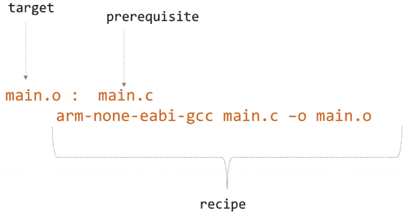
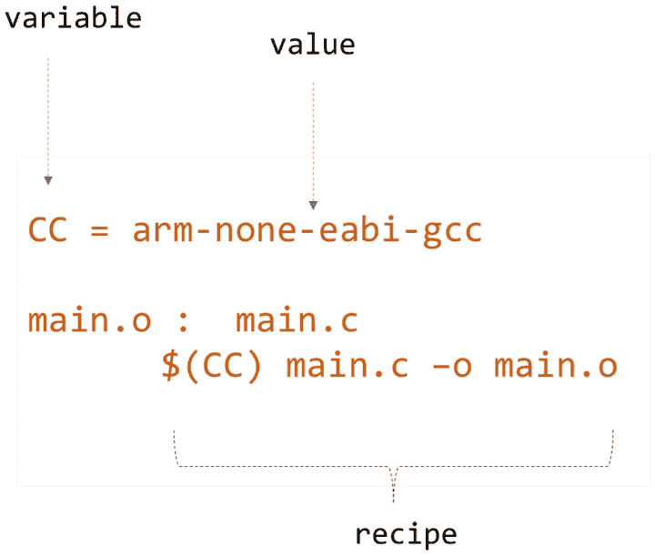
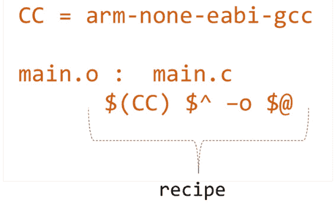

# “Make”构建系统

在本章中，我们将学习如何使用构建系统自动化我们的整个构建过程，特别是关注**make**构建系统——在软件开发中自动化编译和链接过程的不可或缺的工具。我们首先定义什么是构建系统，然后探讨其基本目的，这主要涉及自动将源代码转换为可部署的软件，如可执行文件或库。

在本章中，我们将系统地揭示`make`构建系统的组成部分，从**Makefile**的基本元素开始，包括*目标*、*依赖项*和*配方*。在章节的后半部分，我将提供编写 Makefile 的逐步指南，强调执行构建所需的有效语法和结构。

在本章中，我们将涵盖以下主要主题：

+   构建系统的简介

+   Make 构建系统

+   为固件项目编写 Makefile

在本章结束时，你将牢固地理解如何利用`make`构建系统来简化你的开发过程，提高构建时间，并减少在构建和部署固件时的手动错误。

# 技术要求

本章的所有代码示例都可以在 GitHub 上找到，链接为[`github.com/PacktPublishing/Bare-Metal-Embedded-C-Programming`](https://github.com/PacktPublishing/Bare-Metal-Embedded-C-Programming)。

# 构建系统的简介

在软件开发的世界里，构建系统是关键的工具，它能够将源代码转换为可执行程序或其他可用的软件格式。这些系统自动化了编译和链接代码、管理依赖项以及确保软件构建可重复和高效的过程。简单来说，构建系统是指一组工具，它们自动化了将源代码编译成二进制代码、将二进制代码与库链接以及将结果打包成可部署软件单元的过程。这些系统旨在通过跟踪软件项目中哪些部分需要重新编译来处理复杂的依赖链，从而优化构建过程。构建系统负责一系列任务，包括以下内容：

+   **依赖管理**：这涉及到识别和解决软件所需的各个组件或库之间的相互依赖关系。

+   **代码编译**：将源代码（无论是用 C、C++还是其他编程语言编写的）转换为机器可读的对象代码。

+   **链接**：这个过程将编译后的对象文件和必要的库集成到一个统一的可执行文件或库文件中。

+   **打包**：这一步为软件的部署做准备，可能包括创建安装程序包或将软件压缩成可分发存档。

+   **测试和验证**：在软件发布前执行自动化测试，以确认软件符合预定义的质量基准。

+   **文档生成**：构建系统还可以自动化文档的创建。这是通过集成工具如 C/C++ 的 Doxygen、Java 的 Javadoc 或 Python 的 Sphinx 来实现的，这些工具从源代码中提取注释和元数据以生成结构化文档。这种自动化确保了文档与源代码的变化保持同步，从而保持一致性并减少人工错误。

通过整合这些多样化的功能，构建系统显著提高了软件开发过程的效率和可靠性。现代软件项目通常涉及复杂的配置，包括数千个源文件和广泛的外部依赖。构建系统提供了一个关键框架来有效地管理这些复杂性。它们自动化重复性任务，最小化人为错误的可能性，并确保在不同环境中构建的一致性。这种简化不仅提高了生产力，还支持持续集成和持续交付实践的采用，这对于及时和有效地交付软件至关重要。

选择构建系统取决于各种因素，包括项目使用的编程语言、所需的平台兼容性以及开发团队对工具的熟悉程度。一些常用的构建系统包括 `make` 和 `maven`。

## Make

Make 是最古老且最基础的构建系统之一。它主要用于 C 和 C++ 项目。Make 使用 Makefiles 来指定如何编译和链接源文件。它的主要优势在于其简单性和在不同平台上的广泛支持。

其关键特性包括以下内容：

+   **灵活性**：Make 允许我们定义如何编译和链接文件的明确规则。

+   `make` 可以与各种编译器和编程语言一起使用。在 Windows 上，`make` 可以在 **Minimalist GNU for Windows**（MinGW）或 Cygwin 等环境中使用。

接下来，让我们看看 Maven。

## Maven

`Maven` 主要用于 Java 项目。它旨在提供一个全面和标准的框架来构建项目、处理文档、报告、依赖项、**源代码管理（SCM**）系统、发布和分发。其关键特性包括以下内容：

+   **约定优于配置**：Maven 使用标准的目录布局和默认的构建生命周期，以减少在项目配置上花费的时间

+   **依赖管理**：它可以自动从仓库下载库和插件，并将它们纳入构建过程

+   **项目管理信息**：Maven 可以从项目的元数据生成项目文档、报告和其他信息

+   **构建和发布管理**：Maven 支持整个构建生命周期，从编译、打包和测试到部署和发布管理。

+   **可扩展性**：Maven 的基于插件的架构允许它通过自定义插件进行扩展，以支持额外的任务。

其他值得注意的构建系统包括基于 Java 的 `Apache Ant` 和支持多种编程语言的 `Gradle`，但 `Gradle` 在 Java 生态系统中特别受欢迎。

在探索 `make` 构建系统的具体细节之前，熟悉构建系统的基本组件非常重要。这些组件构成了构建过程的基础，包括以下内容：

+   **源代码**：用 C、Java、Python 等编程语言编写的原始、可读代码。

+   `javac` 用于 Java。

+   **链接器**：将目标文件组合成单个可执行文件或库文件的工具。

+   **构建脚本**：描述构建过程的脚本。它们定义了需要运行的命令及其顺序。

+   **依赖项**：在构建过程中需要集成到项目中的外部代码库或工具。

+   **工件**：构建系统的输出，可以包括可执行文件、库或其他格式的软件部署或运行所需的文件。

在接下来的章节中，我们将探讨 `make` 构建系统的基本原理，并学习如何编写 Makefile 以自动化固件项目的构建过程。

# Make 构建系统

在本节中，我们将探讨 Make 构建系统，从其基本概念到在固件开发中的实际应用。

## Make 的基础知识

`make` 构建系统的核心组件是 Makefile，它包含一组由工具使用的指令，用于生成 *目标*。在核心上，Makefile 由 **规则** 组成。每个规则以 *目标* 开头，然后是 *先决条件*，最后是 *配方*：

+   `main.o` 或 `app.exe`。目标也可以是执行的动作名称。

+   `main.c` 和 `adc.c`）。

+   `make` 执行以构建目标。

以下图示说明了简单的 make 规则：



图 5.1：一个 Make 规则，以 main.o 作为目标文件，由先决条件 main.c 生成，使用 arm-none-eabi-gcc main.c –o main.o 脚本。

注意

配方的行必须以制表符开头。

Makefile 还允许我们使用变量来简化和管理复杂的构建命令和配置。例如，我们可以定义一个变量名 `CC` 来表示 `编译器` 命令，如图 *图 5.2* 所示：



图 5.2：一个 Make 规则，其中 main.o 是目标文件，由先决条件 main.c 生成，其中配方中的编译器命令被一个变量替换

Makefile 中的变量允许我们存储可以在整个文件中重用的文本字符串。定义变量的最基本方法是简单的赋值（`=`）：

```cpp
CC = arm-none-eabi-gcc
```

这行设置 `CC` 变量为 `arm-none-eabi-gcc` 交叉编译器。

一旦定义，变量就可以在整个 Makefile 中使用，以简化命令和定义。要使用变量，请将其名称用 `$(...)` 或 `${...}` 括起来：

```cpp
$(CC) main.c –o main.o
```

配方使用 `$(CC)` 变量来引用之前设置的编译器（`arm-none-eabi-gcc`）。

除了用户定义的变量外，还有与目标和先决条件相关的特殊变量，在编写 Makefile 时非常有用。

在 `make` 中，与目标相关的特殊变量有助于简化指定文件名和文件路径的过程，使 Makefile 中的规则更加通用和可重用。最常用的目标相关特殊变量之一是 `'$@' - 目标名称`。这个变量代表规则的目标名称。当目标名称在规则中多次重复时，它特别有用，这在链接和编译命令中很常见。

让我们看一个例子：

```cpp
main.o :  main.c
     arm-none-eabi-gcc main.c –o $@
```

在这个例子中，`$@` 被替换为 `main.o`，这是规则的目標。

Make 还提供了特殊变量来引用先决条件。最常用的一个变量是 `$^`。这个变量列出了目标的所有先决条件，它们之间用空格分隔（如果有多个）。让我们看一个例子：

```cpp
main.o :  main.c
     arm-none-eabi-gcc $^ –o main.o
```

当执行前面的 Makefile 片段时，`$^` 被替换为 `main.c`，实际上运行了 `arm-none-eabi-gcc main.c –o main.o` 命令。

Makefile 中的特殊变量在定义构建规则时提高效率和灵活性非常有用。通过有效地使用这些变量，我们可以创建更健壮和可维护的构建系统。

我们将用 *图 5**.3* 来结束本节。这个图展示了 *图 5**.2* 中的修订规则，现在包括了我们的用户定义变量以及与目标和先决条件相关的特殊变量。



图 5.3：使用用户定义变量和两个特殊变量的 Make 规则

在下一节中，我将指导您在您的开发计算机上设置 `make` 构建系统。

## 安装和配置 Make

在本节中，我们将介绍在 Windows 环境中下载、安装和配置 `make` 构建系统的过程。让我们开始：

1.  **下载 make**：我们首先导航到适当的网站下载适用于 Windows 的 GNU Make。在这个例子中，我们将使用 SourceForge，这是一个流行的开源项目存储库。请访问 [`gnuwin32.sourceforge.net/packages/make.htm`](https://gnuwin32.sourceforge.net/packages/make.htm)。

    在**完整包，除源代码**选项描述下，点击**下载**列下的**设置**以开始下载。

1.  计算机上的`make`。当你达到标题为`C:\Program` `Files (x86)\GnuWin32`的步骤时。

1.  从任何命令行或脚本中运行`make`，我们需要将其可执行文件添加到我们的系统环境变量中，遵循我们在*第一章*中添加 OpenOCD 到环境变量的相同过程。

    我们通过导航到`make`安装的`bin`文件夹（`C:\Program Files (x86)\GnuWin32\bin`）并复制路径来完成这项操作。

    然后，我们执行以下操作：

    1.  右键单击`make`路径到这个新行。

    1.  通过在各个弹出窗口中点击**确定**来确认您的更改。

为了确认`make`已正确设置，打开命令提示符并简单地输入`make`，如图所示：

```cpp
make
```

它应该返回以下内容：

```cpp
make: *** No targets specified and no makefile found.  Stop.
```

这确认了 Windows 机器上的`make`构建系统已正确配置。

在许多 Linux 发行版中，`make`可以通过发行版的包管理器轻松获得。例如，在 Ubuntu 和其他基于 Debian 的发行版中，我们可以通过运行以下命令来安装`make`（以及其他构建基本工具，如 GCC 编译器）：

```cpp
 sudo apt install build-essential
```

在 macOS 上，`make`是 Xcode 的一部分，这是苹果的开发工具套件。这意味着如果你已经安装了 Xcode，那么你已经有`make`了。我们还可以通过在终端运行以下命令来安装独立的命令行工具包：

```cpp
xcode-select –-install
```

在本节中，我们在我们的开发机器上成功设置了`make`构建系统。在下一节中，我们将应用本章中介绍的概念来编写我们自己的 Makefile。

# 为固件项目编写 Makefile

本节的重点是编写一个 Makefile 并成功测试它。让我们开始吧。

在我们的工作区文件夹中，让我们创建一个名为`4_Makefiles`的新文件夹。在这个文件夹中，创建一个名为`Makefile`的文件。这个文件必须以大写**M**开头，并且应该没有**扩展名**。

如果你使用的是 Windows，并且它询问你是否真的想要更改文件扩展名，请点击**是**。然后，右键单击文件，使用基本文本编辑器（如 Notepad++）打开它。

我们对 Makefile 的目标可以总结如下：

1.  （`main.c`和`stm32f411_startup.c`）到目标文件（`main.o`和`stm32f411_startup.o`）。

1.  （`stm32_ls.ld`）来创建最终的可执行文件（`4_makefile_project.elf`）。

1.  （`*.o`，`*.elf.`，和`*.map`），允许在没有遗留之前构建的任何残留物的情况下从头开始。

这是我们完整的 Makefile：

```cpp
final : 4_makefile_project.elf
main.o : main.c
    arm-none-eabi-gcc -c -mcpu=cortex-m4 -mthumb -std=gnu11 main.c -o 
    main.o
stm32f411_startup.o : stm32f411_startup.c
    arm-none-eabi-gcc -c -mcpu=cortex-m4 -mthumb -std=gnu11 stm32f411_
    startup.c -o stm32f411_startup.o
4_makefile_project.elf : main.o stm32f411_startup.o
    arm-none-eabi-gcc -nostdlib -T stm32_ls.ld *.o -o 4_makefile_
    project.elf -Wl,-Map=4_makefile_project.map
load :
    openocd -f board/st_nucleo_f4.cfg
clean:
del    -f *.o *.elf *.map
```

让我们将其分解：

1.  `final :` `4_makefile_project.elf`

    这一行处理的是最终目标的创建。

    当我们执行`make final`时，`make`将检查`4_makefile_project.elf`目标是否需要更新，然后再执行它。这是一个依赖关系，其中`final`纯粹作为一个聚合点来调用所有导致`4_makefile_project.elf`的构建过程。

1.  `main.o :` `main.c`

    `arm-none-eabi-gcc -c -mcpu=cortex-m4 -mthumb -std=gnu11 main.c -``o` `main.o`

    `make`规则将`main.c`源文件编译成名为`main.o`的对象文件。仔细检查后，你可以看到这里使用的命令与我们之前在命令提示符下手动编译`main.c`时使用的命令相同。

1.  `stm32f411_startup.o :` `stm32f411_startup.c`

    `arm-none-eabi-gcc -c -mcpu=cortex-m4 -mthumb -std=gnu11 stm32f411_startup.c -``o` `stm32f411_startup.o`

    此命令将`stm32f411_startup.c`源文件编译成名为`stm32f411_startup.o`的对象文件。

1.  `4_makefile_project.elf :` `main.o` `stm32f411_startup.o`

    `arm-none-eabi-gcc -nostdlib -T stm32_ls.ld *.o -o` `4_makefile_project.elf -Wl,-Map=4_makefile_project.map`

    此规则将`main.o`和`stm32f411_startup.o`目标文件链接起来生成最终的可执行文件`4_makefile_project.elf`。此外，它还生成一个名为`4_makefile_project.map`的映射文件，该文件显示了代码和数据中的每个部分在内存中的加载位置，这对于调试非常有用。

1.  `load:`

    `openocd -``f` `board/st_nucleo_f4.cfg`

    此规则启动 OpenOCD，开始将最终可执行文件加载到目标硬件上的过程。它执行 OpenOCD，使用针对 STM32 Nucleo F4 板定制的配置文件，具体为`st_nucleo_f4.cfg`。

1.  `clean:`

    `del` `-f *.o *.elf *.map`

    此命令通过删除所有生成的文件来清理构建目录，确保为后续构建提供一个干净的环境。`del -f`命令强制删除文件，防止出现要求删除确认的提示。`*.o`、`*.elf`和`*.map`模式分别指定应删除所有对象文件、ELF 可执行文件和映射文件。

当 Makefile 准备就绪时，是时候对其进行测试了。

## 测试我们的 Makefile

在进入命令行之前，让我们确保链接脚本、启动文件以及所有源文件都已放置在正确的目录中。此外，我们将稍微更新`main.c`文件，这将使我们能够验证固件最新版本的执行是否正确：

1.  来自上一个项目（`3_LinkerscriptAndStartup`）的`main.c`文件，其中包含基础应用程序代码。

1.  此外，找到`stm32_ls.ld`（链接脚本）和`stm32f411_startup.c`（启动文件）。

1.  将这些文件（`stm32_ls.ld`、`stm32f411_startup.c`和`main.c`）复制粘贴到`4_Makefiles`文件夹中。

+   `main.c`文件从慢到快：

    1.  在`4_ Makefiles`文件夹中找到`main.c`文件，并选择使用简单的文本编辑器，如 Notepad++打开它的选项。

    1.  `LED_PIN`）。调整此部分中的延迟间隔以改变 LED 的闪烁速率，从当前的较慢速度变为快速。当前的应该看起来像这样：

    ```cpp
            //  22: Toggle PA5(LED_PIN)
            GPIOA_OD_R ^= LED_PIN;
        for(int i = 0; i < 5000000; i++){}
    ```

    将当前代码替换为以下片段以将 PA5 的状态切换到更快的速率：

    ```cpp
            //  22: Toggle PA5(LED_PIN)
            GPIOA_OD_R ^= LED_PIN;
    for(int i = 0; i < main.c file.
    ```

现在，让我们通过命令提示符访问我们的新文件夹，按照我们在上一章中使用的步骤进行。

在命令提示符中，只需执行以下命令：

```cpp
make final
```

这将创建我们的最终可执行文件，`4_makefile_project.elf`。

接下来，我们将通过执行以下命令开始将最终的可执行文件上传到我们的微控制器：

```cpp
make load
```

这将启动 OpenOCD。下一步涉及使用**GNU 调试器**（**GDB**）将固件上传到微控制器，就像我们在上一章中做的那样。让我们打开另一个命令提示符窗口（因为 OpenOCD 应该在第一个窗口中继续运行）并输入以下命令以启动 GDB：

```cpp
arm-none-eabi-gdb
```

一旦 GDB 打开，我们通过运行以下命令与我们的微控制器建立连接：

```cpp
target remote localhost:3333
```

让我们重置并初始化板子，就像我们在*第三章*中学到的那样，使用以下命令：

```cpp
monitor reset init
```

接下来，我们使用以下命令将固件加载到微控制器上：

```cpp
monitor flash write_image erase 4_makefile_project.elf
```

在成功加载固件后，我们再次使用相同的重置命令重置板子：

```cpp
monitor reset init
```

最后，我们使用以下命令恢复微控制器上固件的执行：

```cpp
monitor resume
```

你应该看到 LED 以快速闪烁，这表明我们的新固件上传和执行成功。

我们可以通过执行以下命令停止 GDB：

```cpp
quit
```

然后，当我们被问及是否真的要退出时，我们执行以下命令：

```cpp
y
```

为了清理我们的构建目录，我们将打开构建目录中的命令提示符并执行以下命令：

```cpp
make clean
```

这将删除构建目录中的所有`.o`、`.elf`和`.map`文件。

在结束本章之前，让我们探索一下当我们引入特殊和用户定义变量时，我们的 Makefile 看起来是什么样的。

## 应用特殊和用户定义变量

让我们将特殊变量和用户定义变量应用到我们的 makefile 中：

```cpp
CC = arm-none-eabi-gcc
CFLAGS = -c -mcpu=cortex-m4 -mthumb -std=gnu11
LDFLAGS = -nostdlib -T stm32_ls.ld -Wl,-Map= 5_makefile_project_v2.map
final : 5_makefile_project_v2.elf
main.o : main.c
    $(CC) $(CFLAGS) $^ -o $@
stm32f411_startup.o : stm32f411_startup.c
    $(CC) $(CFLAGS) $^ -o $@
5_makefile_project_v2.elf : main.o stm32f411_startup.o
    $(CC) $(LDFLAGS) $^ -o $@
load :
    openocd -f board/st_nucleo_f4.cfg
clean:
    del    -f *.o *.elf *.map
```

在这个版本中，我们已定义了三个基本变量以简化我们的 Makefile：

+   `CC`：这个变量代表用于编译源文件的编译器。它通过集中定义编译器来简化 Makefile，使得在需要时更新或更改变得更加容易。

+   `CFLAGS`：这个变量包含构建源文件所需的编译标志。

+   `LDFLAGS`：这个变量包含控制如何从目标文件链接可执行文件的链接器标志。

此外，我们已使用特殊变量（`$@`）和依赖项列表（`$^`）来替换`make`食谱中这些组件的明确提及，从而进一步简化了 Makefile 结构。

将你的当前 makefile 更新到这个新版本，并将名为`5_makefile_project_v2.elf`的新可执行文件上传到你的微控制器。这个更新版本应该像上一个版本一样无缝运行。

# 摘要

在本章中，我们开始探索`make`构建系统，这是软件开发中自动化构建过程的一个基石工具。这次旅程从介绍构建系统是什么以及它们在将源代码转换为可部署软件（如可执行文件和库）中的关键作用开始。

然后，我们深入探讨了`make`构建系统的具体机制，从 Makefile 的基础元素开始，包括*目标*、*依赖项*和*配方*。这些组件被彻底讨论，以提供对它们如何在`make`中交互以管理和简化软件项目的编译和链接的清晰理解。

本章以编写 Makefile 的实际演示结束，有效地巩固了之前讨论的理论概念。这种动手经验确保您能够将这些策略应用到自己的固件项目中。

在下一章中，我们将过渡到固件开发的关键方面之一——外设驱动程序的开发，从**通用输入/输出**（**GPI/O**）驱动程序开始。这一转变将向您介绍与硬件组件交互的基础知识，这是嵌入式系统开发中的一个关键技能。
