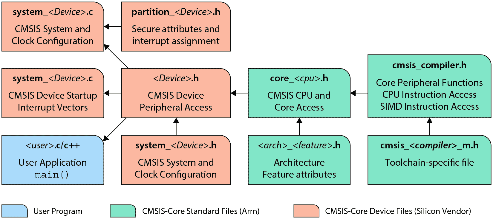
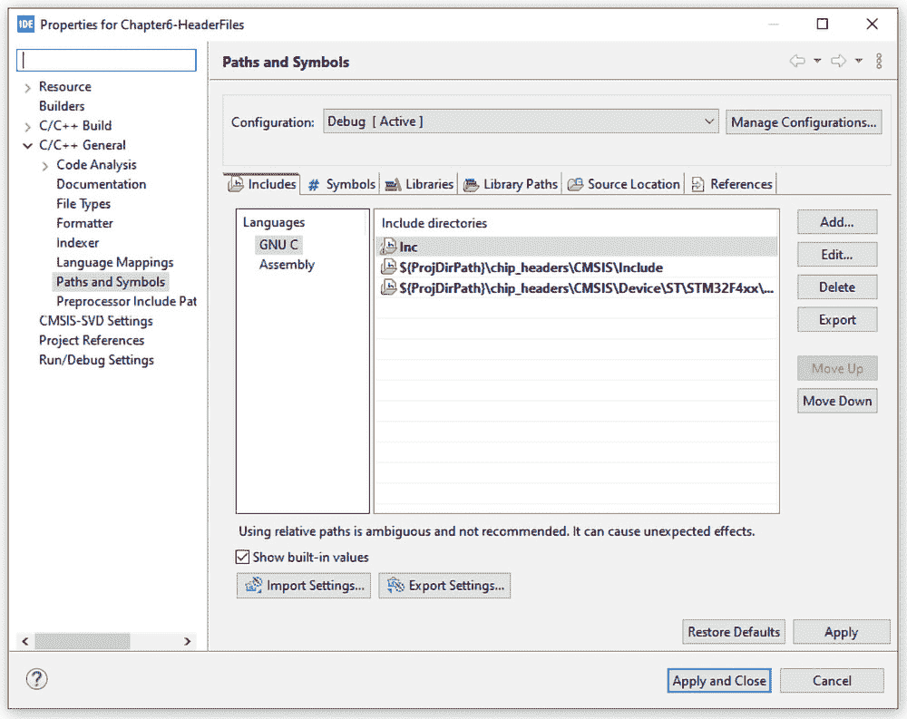
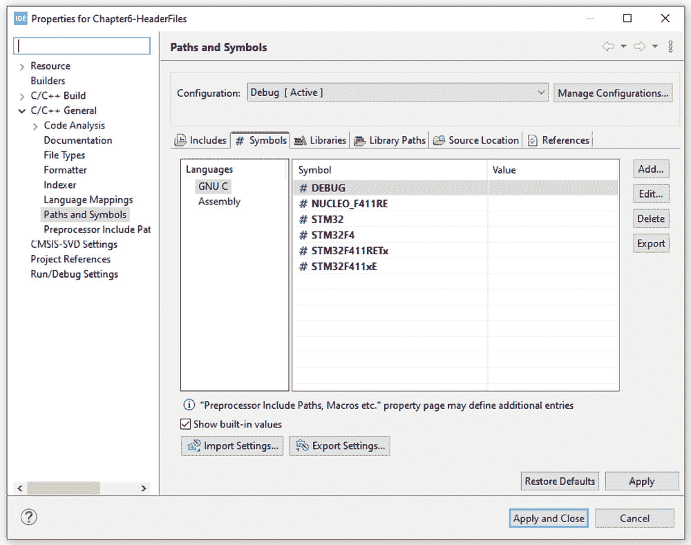

# 6

# 通用微控制器软件接口标准（CMSIS）

在本章中，我们将深入研究**通用微控制器软件接口标准**（**CMSIS**），这是 Cortex-M 和某些 Cortex-A 处理器的关键框架。我们将从学习如何使用 C 结构定义硬件寄存器开始。这种基础知识将使我们能够阅读和理解微控制器制造商提供的 CMSIS 兼容的头文件。

接下来，我们将探讨 CMSIS 本身，讨论其组件以及它是如何促进高效软件开发的。最后，我们将设置从我们的硅制造商处获取的必要头文件，展示 CMSIS 合规性如何简化生产和提高代码可移植性。

在本章中，我们将涵盖以下主要主题：

+   使用 C 结构定义外设寄存器

+   理解 CMSIS

+   设置所需的 CMSIS 文件

到本章结束时，你将具备对 CMSIS 的扎实理解，以及如何使用它来增强你的 Arm Cortex-M 项目的代码可移植性。

# 技术要求

本章的所有代码示例都可以在 GitHub 上找到，链接为[`github.com/PacktPublishing/Bare-Metal-Embedded-C-Programming`](https://github.com/PacktPublishing/Bare-Metal-Embedded-C-Programming)。

# 使用 C 结构定义外设寄存器

在嵌入式系统开发中，使用 C 结构定义硬件寄存器是一种基本技术，它可以提高代码的可读性和可维护性。在本节中，我们将探讨如何使用 C 结构来表示外设及其寄存器，通过实际示例和类比来简化概念。

在前面的章节中，我们配置了一个**通用输入/输出**（**GPIO**）引脚（PA5），通过手动定义每个所需寄存器的地址来点亮一个 LED。我们学习了如何从文档中找到正确的地址，定义寄存器和定义寄存器位。虽然这种方法有效，但随着项目的复杂性增加，可能会变得繁琐。

为了简化这个过程，我们可以使用 C 结构来表示外设及其寄存器。这种方法将相关的寄存器组合成一个统一的单元，以匹配我们的微控制器的硬件架构和内存映射，使代码更加直观。

让我们创建一个结构体来表示 GPIO 外设及其相关的寄存器。

为了实现这一点，我们需要获取每个 GPIO 端口的基址以及这些端口内每个寄存器的偏移量。在这里，偏移量指的是寄存器地址相对于外设基址的相对位置。

在深入创建结构体的细节之前，了解如何获取必要的基址和偏移量是很重要的。

## 获取寄存器的基址和偏移量

在 *第二章*中，我们学习了如何在数据手册中定位外设的基址。具体来说，我们查看了 STM32F411 数据手册的第 54 至 56 页，列出了微控制器外设的基址。以下是 GPIO 和 **复位和时钟控制**（**RCC**）外设的提取基址：

| **外设** | **基址** |
| --- | --- |
| **GPIOA** | 0x4002 0000 |
| **GPIOB** | 0x4002 0400 |
| **GPIOC** | 0x4002 0800 |
| **GPIOD** | 0x4002 0C00 |
| **GPIOE** | 0x4002 1000 |
| **GPIOH** | 0x4002 1C00 |
| **RCC** | 0x4002 3800 |

表 6.1：GPIO 和 RCC 的基址

此外，在*第二章*中，我们介绍了如何从参考手册（**RM383**）中提取寄存器偏移量。以下是所有 GPIO 寄存器的提取偏移量：

| **寄存器** | **偏移量** |
| --- | --- |
| **GPIOx_MODER** | 0x00 |
| **GPIOx_OTYPER** | 0x04 |
| **GPIOx_OSPEEDR** | 0x08 |
| **GPIOx_PUPDR** | 0x0C |
| **GPIOx_IDR** | 0x10 |
| **GPIOx_ODR** | 0x14 |
| **GPIOx_BSRR** | 0x18 |
| **GPIOx_LCKR** | 0x1C |
| **GPIOx_AFRL** | 0x20 |
| **GPIOx_AFRH** | 0x24 |

表 6.2：GPIO 寄存器偏移量

*表 6.1* 显示了我们 STM32F411 微控制器的所有 GPIO 寄存器及其偏移量，按照它们在内存中出现的顺序排列。我们微控制器中的几乎所有寄存器都是 32 位（4 字节）大小。如 *表 6.1* 所示，每个寄存器相对于前一个寄存器偏移 4 字节。例如，`GPIOx_OTYPER` 寄存器位于 `0x04`，距离 `GPIOx_MODER` 寄存器位于 `0x00`（0x04 - 0x00 = 4）有 4 字节。同样，`GPIOx_PUPDR` 寄存器位于 `0x0C`，距离 `GPIOx_OSPEEDR` 寄存器位于 `0x08` 有 4 字节。

这告诉我们，寄存器在该内存区域中是连续排列的，因为我们知道每个寄存器的大小为 4 字节。

然而，这种连续排列的情况并不总是如此。在某些情况下，外设内部的寄存器之间会留下几个字节的间隙。

*现在，偏移量和基址之间有什么关系呢？*

想象你的微控制器就像一个大型公寓楼。每个公寓代表一个外设，例如 GPIO 或 RCC，每个公寓的入口就是外设的基址。在每间公寓内部，有几个房间，这些房间代表寄存器。每个房间都有特定的用途，并且位于入口的一定距离处，称为**偏移量**。

例如，当你进入 GPIO 公寓（外设）时，客厅可能是位于入口处（偏移量 0x00）的 `GPIOx_MODER` 寄存器。厨房可能是位于走廊稍远处的 `GPIOx_OTYPER` 寄存器（偏移量 0x04）。卧室可能是位于走廊更远处的 `GPIOx_OSPEEDR` 寄存器（偏移量 0x08），等等。

这种排列表明每个房间（寄存器）都放置在入口（基址）的固定距离（偏移量）处。在我们的情况下，由于每个房间的大小是 4 字节，所以每个后续房间都距离前一个房间 4 字节。然而，在某些公寓（外设）中，房间之间可能会有额外的空间，表明寄存器的非连续放置。这类似于房间之间有一个小走廊，当你检查参考手册中的 RCC 外设等外设时，你会注意到这一点。

现在，让我们继续使用我们迄今为止所学的内容来实现外设结构体。

## 实现外设结构体

以下是我们`GPIO_TypeDef`结构体，代表 GPIO 外设：

```cpp
typedef struct
{
  volatile uint32_t MODER;    /*offset: 0x00      */
  volatile uint32_t OTYPER;   /*offset: 0x04      */
  volatile uint32_t OSPEEDR;  /*offset: 0x08      */
  volatile uint32_t PUPDR;    /*offset: 0x0C      */
  volatile uint32_t IDR;      /*offset: 0x10      */
  volatile uint32_t ODR;      /*offset: 0x14      */
  volatile uint32_t BSRR;     /*offset: 0x18      */
  volatile uint32_t LCKR;     /*offset: 0x1C      */
  volatile uint32_t AFRL;     /*offset: 0x20     */
  volatile uint32_t AFRH;     /*offset: 0x24      */
} GPIO_TypeDef;
```

让我们分解一下语法：

行 `typedef struct` 开始了一个新结构类型的定义。`typedef` 用于为结构体创建一个别名，允许我们在代码的后续部分使用 `GPIO_TypeDef` 作为类型名。

结构体中的每个成员都被声明为`volatile uint32_t`。以下是分解：

+   `volatile`：这个关键字表示变量的值可以在任何时候改变，通常是由于硬件变化引起的。编译器不应优化对这个变量的访问。

+   `uint32_t`: 这表示结构体中的每个成员都是一个 32 位（4 字节）的无符号整数。这很重要，因为我们正在处理的寄存器大小也是 32 位。为了确保结构体成员能够准确代表这些寄存器，它们必须匹配这个大小。这种对齐保证了每个成员在内存映射中正确对应其各自的寄存器。

还要注意，结构体成员的排列顺序和大小与参考手册中指定的寄存器相同。

现在，正如我们在*第二章*中讨论的那样，要使用微控制器中的任何外设，我们首先需要启用对该外设的时钟访问。这是通过 RCC 外设完成的。让我们为 RCC 外设创建一个结构体。

这是我们的 RCC 结构体：

```cpp
typedef struct
{
  volatile uint32_t DUMMY[12];
  volatile uint32_t AHB1ENR;       /*offset: 0x30*/
} RCC_TypeDef;
```

STM32F411 微控制器的 RCC 外设大约有 24 个寄存器，这些寄存器不是连续的，在内存区域中留下空隙。我们感兴趣的寄存器是为了 GPIO 外设的`AHB1ENR`寄存器，其偏移量为 0x30。

在我们的`RCC_TypeDef`中，我们添加了足够的`uint32_t`（4 字节）项目填充到结构体中，以达到偏移量 0x30。在这种情况下，是 12 个项目。这是因为在 4 字节乘以 12 等于 48 字节，这对应于*十六进制表示法中的*0x30。

在这一点上，我们已经定义了两个重要的结构（`GPIO_TypeDef` 和 `RCC_TypeDef`），这些结构是配置和控制我们的 GPIO 引脚所必需的。下一步涉及到使用这些结构创建 GPIO 和 RCC 外设的基地址指针。这使我们能够以结构化和可读的方式访问和操作外设寄存器。以下是完成此任务的代码片段：

```cpp
#define     RCC_BASE     0x40023800
#define     GPIOA_BASE  0x40020000
#define     RCC         ((RCC_TypeDef*) RCC_BASE)
#define    GPIOA         ((GPIO_TypeDef*)GPIOA_BASE)
```

让我们分解一下：

+   `#define` `RCC_BASE 0x40023800`

    这一行定义了 RCC 外设的基地址。地址值取自 *表 6.1*。

+   `#define` `GPIOA_BASE 0x40020000`

    这一行定义了 GPIOA 外设的基地址。

+   `#define RCC ((RCC_TypeDef*) RCC_BASE)`

    这一行定义了一个宏，`RCC`，它将 `RCC_BASE` 基地址转换为 `RCC_TypeDef*` 类型的指针。

    通过这样做，`RCC` 成为一个指向 RCC 外设的指针，允许我们通过 `RCC_TypeDef` 结构访问其寄存器。

+   `#define GPIOA ((GPIO_TypeDef*) GPIOA_BASE)`

    同样，这一行定义了一个宏，`GPIOA`，它将 `GPIOA_BASE` 基地址转换为 `GPIO_TypeDef*` 类型的指针。

    这使得 `GPIOA` 成为一个指向 GPIOA 外设的指针，使我们能够通过 `GPIO_TypeDef` 结构访问其寄存器。

完成这些后，我们现在可以测试我们的实现了。让我们在下一节中这样做。

## 评估基于结构的寄存器访问方法

让我们更新我们之前的工程以使用基于结构的寄存器访问方法：

```cpp
// 0: Include standard integer types header for fixed-width //integer types
#include <stdint.h>
// 1: GPIO_TypeDef structure definition
typedef struct
{
  volatile uint32_t MODER;    /*offset: 0x00      */
  volatile uint32_t OTYPER;   /*offset: 0x04      */
  volatile uint32_t OSPEEDR;  /*offset: 0x08      */
  volatile uint32_t PUPDR;    /*offset: 0x0C      */
  volatile uint32_t IDR;      /*offset: 0x10      */
  volatile uint32_t ODR;      /*offset: 0x14      */
  volatile uint32_t BSRR;     /*offset: 0x18      */
  volatile uint32_t LCKR;     /*offset: 0x1C      */
  volatile uint32_t AFRL;     /*offset: 0x20     */
  volatile uint32_t AFRH;     /*offset: 0x24      */
} GPIO_TypeDef;
// 2: RCC_TypeDef structure definition
typedef struct
{
  volatile uint32_t DUMMY[12];
  volatile uint32_t AHB1ENR;       /*offset: 0x30*/
} RCC_TypeDef;
// 3: Base address definitions
#define     RCC_BASE     0x40023800
#define     GPIOA_BASE   0x40020000
// 4: Peripheral pointer definitions
#define RCC            ((RCC_TypeDef*) RCC_BASE)
#define GPIOA        ((GPIO_TypeDef*)GPIOA_BASE)
//5: Bit mask for enabling GPIOA (bit 0)
#define GPIOAEN       (1U<<0)
//6: Bit mask for GPIOA pin 5
#define PIN5          (1U<<5)
//7: Alias for PIN5 representing LED pin
#define LED_PIN       PIN5
//  8: Start of main function
int main(void)
{
    //  9: Enable clock access to GPIOA
     RCC->AHB1ENR |=  GPIOAEN;
     GPIOA->MODER |= (1U<<10);  //  10: Set bit 10 to 1
     GPIOA->MODER &= ~(1U<<11); //  11: Set bit 11 to 0
    //  21: Start of infinite loop
    while(1)
    {
        //  12: Set PA5(LED_PIN) high
        GPIOA->ODR^= LED_PIN;
        // 13: Simple delay
                for(int i=0;i<100000;i++){}
    }
}
```

在这个新的实现中，我们使用 C 结构指针运算符（`->`）来访问所需的寄存器。以下是 `RCC->AHB1ENR` 的分解：

+   `RCC`: 这是一个指向类型为 `RCC_TypeDef` 的结构的指针。这个指针允许我们通过结构成员访问 RCC 寄存器。

+   `->`: 这是 C 中的结构指针运算符。它用于通过指针访问结构的一个成员。

+   `AHB1ENR`: 这是 `RCC_TypeDef` 结构的一个成员。

同样，我们使用相同的方法来访问 GPIOA 寄存器。

下面是 `GPIOA->MODER` 和 `GPIOA->ODR` 的分解：

+   `GPIOA`: 这是一个指向类型为 `GPIO_TypeDef` 的结构的指针，允许访问 GPIOA 寄存器

+   `MODER`: `GPIO_TypeDef` 结构的一个成员，代表 GPIO 端口模式寄存器

+   `ODR`: `GPIO_TypeDef` 结构的另一个成员，代表 GPIO 端口输出数据寄存器

构建项目并在您的开发板上运行它。它应该与上一个项目以相同的方式工作。

在本节中，我们学习了如何使用 C 结构定义硬件寄存器。这项技术是理解 CMSIS 兼容代码的重要步骤，将在下一节中介绍。

# 理解 CMSIS

在本节中，我们将探讨 CMSIS，这是一个为 Arm Cortex-M 和某些 Cortex-A 处理器设计的框架。**CMSIS**是一个供应商无关的硬件抽象层，它标准化了各种基于 Arm Cortex 的微控制器平台之间的软件接口，促进了软件的可移植性和可重用性。让我们首先了解 CMSIS 及其关键优势。

## 什么是 CMSIS？

CMSIS，发音为*See-M-Sys*，是由 Arm 开发的标准，旨在提供一种一致且高效的方式与基于 Cortex 的微控制器进行接口。它包括一套全面的 API、软件组件、工具和工作流程，旨在简化并优化嵌入式系统的开发过程。

它的关键优势包括以下内容：

+   **标准化**：CMSIS 对所有基于 Cortex 的微控制器接口进行标准化，这使得您可以在不重新学习或重新配置代码库的情况下轻松地在不同微控制器和工具之间切换

+   **便携性**：通过提供一致的 API，CMSIS 允许为某一微控制器开发的软件轻松移植到另一个微控制器，增强代码重用并减少开发时间

+   **效率**：CMSIS 包括优化的库和函数，如**数字信号处理**（**DSP**）和神经网络内核，这些可以提升性能并减少内存占用

CMSIS 有几个组件。让我们探索一些常用的组件。

## CMSIS 的关键组件

CMSIS 由几个组件组成，每个组件都服务于独特的目的：

+   **CMSIS-Core (M)**：此组件是为所有 Cortex-M 和 SecurCore 处理器设计的。它提供了配置 Cortex-M 处理器核心和外设的标准 API。它还标准化了设备外设寄存器的命名，有助于在切换不同微控制器时减少学习曲线。

+   **CMSIS-Driver**：这为中间件提供了通用的外设驱动接口，促进了微控制器外设与中间件（如通信堆栈、文件系统或图形用户界面）之间的连接。

+   **CMSIS-DSP**：此组件提供了一套超过 60 个针对各种数据类型的函数库，针对 Cortex-M4、M7、M33 和 M35P 处理器上可用的**单指令多数据**（**SIMD**）指令集进行了优化。

+   **CMSIS-NN**：这代表**神经网络**。它包括一系列针对 Cortex-M 处理器核心进行优化的高效神经网络内核，旨在最大化性能并最小化内存占用。

+   **CMSIS-RTOS**：有两个版本，RTOS v1 和 RTOS v2。RTOS v1 支持 Cortex-M0、M0+、M3、M4 和 M7 处理器，为实时操作系统提供公共 API。RTOS v2 扩展了对 Cortex-A5、A7 和 A9 处理器的支持，包括动态对象创建和多核系统支持等功能。

+   **CMSIS-Pack**: Pack 描述了一个软件组件、设备参数和评估板支持的交付系统。它简化了软件重用并促进了有效的产品生命周期管理。

+   **CMSIS-SVD**: **SVD** 代表 **System Viewer Description**。它定义了由硅供应商维护的设备描述文件，包含对微控制器外设和寄存器的全面描述，格式为 XML。开发工具导入这些文件以自动构建外设调试窗口。

CMSIS 的另一个关键方面是其编码标准。让我们更详细地了解一下这些指南。

## CMSIS 编码规则

这里是 CMSIS 中使用的必要编码规则和约定：

+   **符合 ANSI C (C99) 和 C++ (C++03)**: 这确保了与广泛接受的编程标准的兼容性。

+   `<stdint.h>`，确保数据表示的一致性。

+   **完整数据类型**: 变量和参数使用完整数据类型定义，避免了歧义。

+   **MISRA 2012 符合性**: 虽然 CMSIS 符合 MISRA 2012 指南，但它并不声称完全符合 MISRA。任何违规规则都会被记录下来以确保透明度。

此外，CMSIS 还使用特定的限定符：

+   `__I` 用于只读变量（相当于 ANSI C 中的 **volatile const**）

+   `__O` 用于只写变量

+   `__IO` 用于读写变量（相当于 ANSI C 中的 **volatile**）

这些限定符在 CMSIS 中提供了一种方便的方式来指定变量的预期访问模式，特别是对于内存映射外设寄存器。

在具备这些背景知识的基础上，让我们继续学习如何在嵌入式项目中使用 CMSIS。

## CMSIS-Core 文件

CMSIS-Core 文件分为两个主要组，每个组在开发过程中都发挥着特定的作用。这些组是 CMSIS-Core 标准文件和 CMSIS-Core 设备文件。*图 6**.1* 提供了 CMSIS-Core 文件结构的全面概述，说明了不同类型文件及其在项目中的作用。



图 6.1：CMSIS-Core 文件

让我们分析一下这个图。

文件分为三个类别：**CMSIS-Core 标准文件**、**CMSIS-Core 设备文件**和**用户** **程序文件**。

**CMSIS-Core 标准文件**类别由 Arm 提供，通常不需要修改。它们包括以下内容：

+   `core_<cpu>.h`: 该文件提供了对 CPU 和核心特定功能的访问

+   `cmsis_compiler.h`: 该文件包含核心外设函数、CPU 指令访问和 SIMD 指令访问

+   `<arch>_<feature>.h`: 该文件定义了特定于架构的属性和功能

+   `cmsis_<compiler>_m.h`: 这是一个针对工具链的特定文件，有助于提高编译器的兼容性和优化

下一类是**CMSIS-Core 设备文件**。这些文件由硅供应商（如 STMicroelectronics）提供，可能需要针对特定应用进行修改。它们包括以下内容：

+   `system_<Device>.c`：此文件处理系统和时钟配置

+   `partition_<Device>.h`：此文件管理安全属性和中断分配

+   `startup_<Device>.c`：此文件包含设备启动中断向量

+   `<Device>.h`：此文件提供对 CMSIS 设备外设功能的访问

+   `system_<Device>.h`：此文件协助进行系统和时钟配置

第三类是**用户程序文件**。这些是我们开发者创建的，包括主应用程序代码以及其他对于项目运行至关重要的用户定义功能。

理解 CMSIS 对于在各个基于 Arm Cortex 的微控制器平台上进行高效和标准化的开发是基本的。在本节中，我们探讨了其关键组件、CMSIS 编码标准和对于嵌入式项目开发至关重要的 CMSIS-Core 文件。在下一节中，我们将学习如何将所需的 CMSIS 文件包含到我们的项目中，使我们能够充分利用这个强大的框架来开发嵌入式系统。

# 设置所需的 CMSIS 文件

在本节中，我们将通过将 CMSIS 文件集成到我们的项目中的过程。这些文件还包含了所有寄存器和它们各自的位定义，这使得在没有手动定义每个寄存器的情况下管理和配置外设变得更加容易。

## 获取正确的头文件

首先，从 STMicroelectronics 网站下载我们微控制器的软件包：

1.  打开你的浏览器并访问[`www.st.com/content/st_com/en.html`](https://www.st.com/content/st_com/en.html)。

1.  搜索`STM32CubeF4`以定位 STM32F4 微控制器系列的软件包。

1.  接下来，下载 STM32CubeF4 软件包：

    1.  定位 STM32CubeF4 软件包并下载最新版本。请确保不要下载补丁版本。

    1.  下载完成后，解压软件包。你将找到几个子文件夹，包括`Drivers`文件夹。

我们接下来的步骤是组织文件：

1.  在你的项目工作区中，创建一个名为`chip_headers`的新文件夹。

1.  在`chip_headers`文件夹内，创建另一个名为`CMSIS`的文件夹。

1.  在解压的软件包中导航到`Drivers/CMSIS`。

1.  将`Drivers/CMSIS`中的整个`Include`文件夹复制到`chip_headers/CMSIS`。

1.  然后，将`Drivers/CMSIS`中的`Device`文件夹复制到`chip_headers/CMSIS`。

最后，我们清理`Device`文件夹：

1.  导航到`chip_headers/CMSIS/Device/ST/STM32F4xx`。

1.  删除所有文件和文件夹，*除了 Include 文件夹*。这确保你只保留特定微控制器的必要头文件。

今后，我们将持续在项目目录中包含`chip_headers`文件夹。这种做法确保了在另一台计算机上运行我们的项目的人不会因为缺少头文件而遇到错误。

在下一节中，我们将在 STM32CubeIDE 中创建一个新的项目。设置项目后，我们将复制`chip_headers`文件夹并将其粘贴到项目目录中。随后，我们将添加`chip_headers`内的子文件夹到项目的`include`路径中，确保必要 CMSIS 文件的顺利集成。

## 与 CMSIS 文件一起工作

在本节中，我们将通过将相关文件夹添加到项目的`include`路径中来将 CMSIS 文件集成到我们的项目中。然后，我们将通过更新我们的`main.c`文件以使用这些 CMSIS 文件而不是我们手动定义的外设结构来测试我们的设置。

让我们按照*第一章*中概述的步骤创建一个新的项目。我将把我的项目命名为`header_files`。一旦项目创建完成，我将复制并粘贴`chip_headers`文件夹到项目文件夹中。

我们接下来的任务是将`chip_headers`文件夹内子文件夹的路径添加到项目的`include`路径中：

1.  打开 STM32CubeIDE，右键单击您的项目，并选择**属性**。

1.  一旦**属性**窗口打开，展开**C/C++** **通用**选项。

1.  选择**路径**和**符号**。

1.  在**包含**选项卡下，点击**添加**以添加新的目录。

1.  输入`${ProjDirPath}\chip_headers\CMSIS\Include`以添加位于我们`CMSIS`文件夹中的`Include`文件夹，然后点击**确定**保存。

1.  再次点击**添加**以添加另一个目录。

1.  输入`${ProjDirPath}\chip_headers\CMSIS\Device\ST\STM32F4xx\Include`以添加位于`STM32F4xx`子目录中的`Include`文件夹，然后点击**确定**保存。

*图 6**.2*展示了在将这两个目录添加到项目的`include`路径后，项目属性窗口的示意图。



图 6.2：项目属性窗口中的包含选项卡

让我们分析我们刚刚添加的两行：

+   `${ProjDirPath}\chip_headers\CMSIS\Include`：

    +   `${ProjDirPath}`：这是 STM32CubeIDE 中的一个宏，代表您当前项目的根目录。它是一个占位符，动态指向您的项目所在目录。

    +   `\chip_headers\CMSIS\Include`：这指定了相对于项目根目录的路径。它指向`chip_headers`文件夹内`CMSIS`目录中的`Include`文件夹。此文件夹包含通用的 CMSIS 包含文件，为 Cortex-M 处理器提供核心功能和定义。

+   `${ProjDirPath}\chip_headers\CMSIS\Device\ST\STM32F4xx\Include`：

    +   `${ProjDirPath}`：如前所述，此宏代表您当前项目的根目录。

    +   `\chip_headers\CMSIS\Device\ST\STM32F4xx\Include`：这指定了相对于项目根目录的另一个路径。它指向位于`CMSIS`文件夹中的`chip_headers`文件夹内的`Device`目录下的`STM32F4xx`子目录中的`Include`文件夹。这个文件夹包含 STM32F4xx 系列微控制器的设备特定包含文件，提供针对这个微控制器系列的特定定义和配置。

在关闭项目属性对话框之前，我们需要指定我们正在使用的 STM32F4 微控制器的确切版本。这确保了在我们的项目中启用了针对我们特定微控制器的适当头文件。正如我们所见，`STM32F4xx\Include`子文件夹包含 STM32F4 系列中各种微控制器的头文件。NUCLEO-F411 开发板配备了 STM32F411 微控制器。

要为 STM32F411 微控制器配置我们的项目：

1.  点击**#** **符号**选项卡。

1.  点击**添加…**以添加一个新的符号。

1.  在**名称**字段中输入`STM32F411xE`，然后点击**确定**。

1.  点击**应用并关闭**以保存所有更改并关闭项目属性窗口。

*图 6**.3*展示了`STM32F411xE`符号。



图 6.3：项目属性窗口中的符号选项卡

要测试我们的设置，请按照以下步骤操作：

1.  从我们之前使用基于结构访问方法的项目中复制`main.c`文件的整个内容。

1.  打开当前项目中`main.c`文件。

1.  删除`main.c`文件中的所有现有内容。

1.  将复制的内

1.  在`main.c`文件中，删除所有与手动定义的地址和结构相关的代码，因为我们现在将使用在头文件中提供的寄存器定义。

1.  在你的项目中包含`stm32f4xx.h`头文件以访问这些定义。

1.  在 IDE 中构建项目并在开发板上运行它。

下面的代码片段显示了更新的`main.c`文件：

```cpp
//1: Include the stm32f4 header file
#include "stm32f4xx.h"
//2: Bit mask for enabling GPIOA (bit 0)
#define GPIOAEN       (1U<<0)
//3: Bit mask for GPIOA pin 5
#define PIN5          (1U<<5)
//4: Alias for PIN5 representing LED pin
#define LED_PIN       PIN5
int main(void)
{
     //  5: Enable clock access to GPIOA
     RCC->AHB1ENR |=  GPIOAEN;
     //  6: Set PA5 to output mode
     GPIOA->MODER |= (1U<<10);
     GPIOA->MODER &= ~(1U<<11);
    while(1)
    {
        //  7: Set PA5(LED_PIN) high
        GPIOA->ODR^= LED_PIN;
        // 8: Simple delay
        for(int i=0;i<100000;i++){}
    }
}
```

你会观察到这个项目在构建时没有任何错误，并且与我们的上一个项目以相同的方式工作。这个实现访问了在`chip_headers/CMSIS/Device/ST/STM32F4xx/Include/stm32f411xe.h`中定义的微控制器寄存器。

检查此文件后，你会发现它包含一个针对我们微控制器每个外设的`typedef`结构，类似于我们之前手动创建的那个。这意味着从现在开始，我们不需要从文档中手动提取基址和寄存器偏移量。相反，我们只需在我们的项目中包含`stm32f4xx.h`头文件。这个头文件反过来会包含`stm32f411xe.h`文件，因为我们已经在项目属性窗口的**符号**选项卡中指定了我们正在使用*STM32F411xE*微控制器。

设置所需的头文件显著简化了在 STM32 微控制器上配置和使用外设的过程。这种方法使我们能够利用预定义的寄存器地址和位定义，使我们的代码更易于阅读和维护，同时也能减少开发时间。

# 摘要

在本章中，我们探讨了 CMSIS，这是 Cortex-M 和某些 Cortex-A 处理器的关键框架。本章为我们提供了增强 Arm Cortex-M 项目代码可移植性和效率的基础知识。

我们首先学习了如何使用 C 结构定义硬件寄存器，这是一种提高代码可读性和可维护性的基本技术。这种知识使我们能够理解微控制器制造商提供的 CMSIS 兼容头文件是如何让我们访问寄存器定义的。

接着，我们探讨了 CMSIS 本身，讨论了其组件以及它是如何促进高效软件开发的。我们考察了 CMSIS 的关键优势，如标准化、可移植性和效率，并介绍了其主要组件，包括 CMSIS-Core、CMSIS-Driver、CMSIS-DSP、CMSIS-NN、CMSIS-RTOS、CMSIS-Pack 和 CMSIS-SVD。

然后，我们转向设置来自我们的硅制造商的必要 CMSIS 文件。这个过程涉及下载相关包、组织文件并将它们集成到我们的项目中。

最后，我们通过将我们的先前项目更新为使用 CMSIS 文件而不是我们手动定义的外设结构来测试我们的设置。这个实际应用展示了 CMSIS 如何简化访问微控制器寄存器，使代码更易于阅读、维护和高效。

在下一章中，我们将学习 GPIO 外设。本章将全面介绍如何在嵌入式系统中配置和使用 GPIO 进行输入/输出应用。
