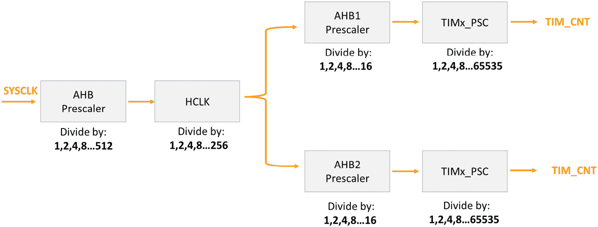
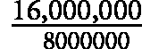

# 通用定时器（TIM）

在本章中，我们将深入探讨 STM32F411 微控制器中发现的**通用定时器**（**TIM**）。与 SysTick 定时器不同，这些定时器外设是 STM32 微控制器独有的，并提供了各种应用所需的基本功能。

我们将首先讨论定时器的常见用途，为理解它们在嵌入式系统中的重要性打下基础。随后，我们将探讨 STM32 微控制器上定时器的特定特性。这包括理解定时器时钟源、预分频的机制以及详细查看常用的定时器寄存器。

在本章的后半部分，我们将通过开发定时器驱动程序并将所学知识应用于创建功能性和高效的代码来将理论付诸实践。

在本章中，我们将涵盖以下主要内容：

+   定时器和它们的应用简介

+   定时器的常见用例

+   STM32 定时器

+   定时器驱动程序的开发

到本章结束时，您将很好地理解 STM32 定时器及其驱动程序的开发，这将增强您在项目中有效利用这些外设的能力。

# 技术要求

本章的所有代码示例都可以在 GitHub 上找到：[`github.com/PacktPublishing/Bare-Metal-Embedded-C-Programming`](https://github.com/PacktPublishing/Bare-Metal-Embedded-C-Programming)。

# 定时器和它们的应用简介

定时器是嵌入式系统中的关键组件，在广泛的领域中发挥着基本功能。在本节中，我们将探讨定时器的概念、类型及其各种应用。

问题是，**定时器是什么**？

定时器是微控制器中发现的硬件外设，用于**计数时钟脉冲**。**这些脉冲可以用来测量时间间隔、生成精确的延迟或在特定间隔触发事件**。定时器可以以多种模式运行，包括**向上计数**、**向下计数**和生成**脉冲宽度调制**（**PWM**）信号。

在 STM32 微控制器上使用 SysTick 定时器与通用定时器之间的选择取决于您对定时需求的复杂性和精度。虽然 SysTick 定时器非常适合简单的系统定时任务，例如生成周期性中断或创建延迟，但它灵活性有限，功能也有限，因为它通常被用于**实时操作系统**（**RTOS**）的滴答。另一方面，正如我们刚才讨论的，通用定时器提供了更多的多功能性，能够处理如 PWM 生成、输入捕获和输出比较等复杂任务。它们还支持多个通道以并发处理定时事件，并提供如精确频率测量和低功耗操作等高级功能。

让我们通过一些典型用例来探讨定时器的重要性。

# 定时器的常见用例

让我们从计时器开始，用于时间间隔测量。

## 时间间隔测量

计时器的一个常见用途是在超声波传感器中进行距离测量，广泛应用于机器人、汽车停车系统和障碍物检测。

计时器在这些传感器的操作中起着至关重要的作用。以下是它们的工作原理：

1.  微控制器向超声波传感器发送触发信号，使其发出超声波脉冲。

1.  传感器等待脉冲在撞击物体后返回的回声。

1.  计时器在发出脉冲时开始计数，在接收到回声时停止计数。

1.  计时器测量的时间间隔用于根据声速计算到物体的距离。

通过精确测量发送脉冲和接收回声之间的时间间隔，系统可以确定到物体的距离，从而实现精确导航和避障。

计时器对于生成精确的延迟也非常重要，例如在**发光二极管（LED**）矩阵显示屏的刷新机制中。

## 延迟生成

在嵌入式系统中，LED 矩阵显示屏用于各种应用，包括数字标牌、计分板和简单的图形显示。为了显示图像或文本，微控制器需要以精确的速率刷新显示，以确保平滑的视觉效果。

在这里，发生以下情况：

+   微控制器驱动一个 LED 矩阵显示屏，需要依次刷新显示行。

+   计时器生成精确的延迟来控制每一行激活的时间，以便移动到下一行。

    例如，计时器可能被设置为在切换行之间生成 1 毫秒的延迟。

    这确保了每一行都能以一致的时间显示，保持稳定且无闪烁的图像。

现在，让我们看看计时器在嵌入式系统中触发事件的一个示例。

## 事件触发

从传感器进行周期性数据采样对于环境监测和**工业过程控制（IPC**）等应用非常重要。计时器可以用来在特定间隔触发**模数转换器（ADC**），以确保一致的数据采样。

在这里，发生以下情况：

+   微控制器连接到一个环境传感器（例如，温度或湿度传感器），该传感器输出模拟信号

+   通用计时器被配置为定期触发 ADC 转换（例如，每 100 毫秒一次）

+   ADC 被设置为使用计时器触发选项，在每次计时器事件自动开始转换。

+   微控制器的主循环定期检查完成的 ADC 转换并处理数据。

在下一节中，我们将重点关注 STM32 计时器的特性和特点。

# STM32 计时器

STM32 微控制器中的计时器分为两大类：**通用计时器**和**高级计时器**。

## 通用计时器和高级计时器简介

通用定时器非常通用，可用于各种应用，而高级定时器比通用定时器提供更复杂的功能，使其适合高精度和复杂的定时任务。

在 STM32F411 微控制器中，定时器**TIM2**、**TIM3**、**TIM4**、**TIM5**、**TIM9**、**TIM10**和**TIM11**是通用定时器，而**TIM1**是高级定时器。

通用定时器的主要特性包括以下内容：

+   **计数器大小**：它们具有 TIM3 和 TIM4 的 16 位计数器以及 TIM2 和 TIM5 的 32 位计数器，能够以向上、向下或上/下自动重载模式运行

+   **预分频器**：它们配备了一个 16 位可编程预分频器，允许我们将计数器时钟频率除以从 1 到 65,536 的任何因子

+   **通道**：它们提供多达四个独立通道

+   **同步**：定时器可以与外部信号同步，并与多个定时器互连，增强了在复杂应用中的灵活性和协调性

+   **中断/直接内存访问（DMA）生成**：定时器可以根据各种事件生成中断或 DMA 请求，包括计数器溢出/下溢、计数器初始化、触发事件、输入捕获和输出比较

+   **编码器支持**：这些定时器还支持增量（正交）编码器和霍尔传感器电路，使其适用于精确定位应用

高级定时器 TIM1 具有 16 位计数器大小。除了计数器大小的差异外，它还具备通用定时器的所有功能，并具有以下附加功能：

+   **互补输出**：支持具有可编程死区插入的互补输出

+   **重复计数器**：允许在特定的计数周期数之后才更新定时器寄存器

+   **断开输入**：它能够在激活时将定时器的输出信号置于复位或已知状态

在我们开始分析参考手册中提供的一些关键寄存器之前，让我们首先了解 STM32 定时器的工作原理。

## 如何使用 STM32 定时器

定时器的核心是 16 位/32 位计数器和其相关的自动重载寄存器。计数器可以向上或向下计数，其时钟可以被预分频器除以。即使在计数器运行时，我们也可以从计数器、自动重载寄存器和预分频寄存器中读取和写入。

时基单元包括以下寄存器：

+   `TIMx_CNT`

+   `TIMx_PSC`

+   `TIMx_ARR`

预分频寄存器（`TIMx_PSC`）将定时器的输入时钟频率除以 1 到 65,536 之间的可编程值。这允许以较慢的计数速率来适应更长的定时间隔。

自动重载寄存器（`TIMx_ARR`）定义了计数器在向上计数模式下重置为零或在下计数模式下重置到自动重载值的值。我们使用它来设置定时器的周期。

除了时基单元中的寄存器外，定时器外设还包括控制寄存器（`TIMx_CR1`、`TIMx_CR2`等），用于配置各种操作参数，例如启用计数器、设置计数方向以及配置`TIMx_SR`）表示定时器的状态，例如是否发生了 UEV 以及其他用于控制定时器的辅助寄存器，等等。

如我们之前提到的，定时器有两种计数模式：向上计数模式和向下计数模式。让我们来分解它们：

+   `TIMx_ARR`）并在溢出时生成 UEV

+   **向下计数模式**：

    计数器从自动重载值向下计数到 0，并在下溢时生成 UEV

接下来出现的问题是：*UEV 究竟是什么？*

让我们分解一下：

+   简而言之，这是超时应该发生的时候

+   当计数器达到自动重载值或 0（根据计数模式）时，发生 UEV

+   这个事件可以触发中断或 DMA 请求并设置`TIMx_SR`）

+   UEV 也可以通过设置`TIMx_EGR`）手动生成

现在我们知道了 UEV 是什么，让我们了解定时器时钟预分频是如何实现的；这将使我们能够准确地计算 UEV 的定时。

### 定时器时钟预分频

我们使用预分频将高频系统时钟降低到适合驱动定时器的较低频率。*图 9**.1* 展示了我们的 STM32 微控制器中定时器时钟预分频的过程，显示了系统时钟（`SYSCLK`）如何通过一系列预分频器分频以驱动定时器计数器（`TIMx_CNT`）：



图 9.1：定时器时钟预分频

让我们解释这个过程中涉及的每个组件和步骤：

+   **系统时钟（SYSCLK**）

    这是驱动微控制器的主系统时钟。它作为所有后续操作的初始时钟源。

+   `SYSCLK`频率以 1、2、4、8、16、64、128、256 或 512 的因子分频。得到的时钟信号被称为**HCLK**（AHB 时钟）。

+   **高性能总线时钟（HCLK**）

    这是经过 AHB 预分频器生成的时钟信号。它用于驱动核心和系统总线。

+   **高级外设总线（APB）预分频器**

    +   **APB1 预分频器**：这进一步将 HCLK 分频以生成 APB1 外设总线的时钟。可用的分频因子是 1、2、4、8 和 16。

    +   **APB2 预分频器**：类似于 APB1 预分频器，但用于 APB2 外设总线。它也以 1、2、4、8 和 16 的因子分频 HCLK。

+   **定时器预分频器（TIMx_PSC**）

    每个定时器都有自己的预分频寄存器，可以将 APB1 或 APB2 时钟进一步分频，分频值在 1 到 65,535 之间。这种灵活性允许对定时器的计数速率进行精确控制。

+   `TIMx_PSC`。这个计数器增加或减少的速率取决于之前预分频器的组合分频效果。

预分频器直接影响定时器计数器（`TIMx_CNT`）增加或减少的速率。虽然其他预分频器（AHB 和 APB）在相同总线上共享所有外设，但`TIMx_PSC`预分频器，我们可以精确控制特定定时器的分辨率和周期，而不会影响其他外设。

现在，让我们学习如何计算 UEV。

### 计算 UEV

当定时器计数器在向上计数模式下达到自动重载寄存器（`TIMx_ARR`）中设置的值时，就会发生 UEV。计算此事件对于确定定时器的周期并确保其以期望的频率运行至关重要。

我们可以使用以下公式推导 UEV 的频率：

更新事件频率 = 

这里，我们有以下内容：

+   在使用默认时钟配置（裸机设置）的 NUCLEO-F411 开发板上，`SYSCLK`。

+   `TIMx_PSC`寄存器。

+   `TIMx_ARR`寄存器。

让我们看看一个例子。假设我们有以下参数：

+   **定时器时钟（APB1 时钟）**：16 MHz

+   **预分频器（TIMx_PSC** **值**）：15999

+   **周期（TIMx_ARR** **值）**：499

这意味着我们有以下值：

+   定时器时钟为 16,000,000 Hz

+   `TIMx_PSC`寄存器设置为 15999，但由于预分频器将时钟除以值加一，我们使用 15999 + 1 = 16000

+   `TIMx_ARR`寄存器设置为 499，但由于周期计数到值加一，我们使用 499 + 1 = 500

将这些值代入我们的公式，我们得到以下结果：

更新事件频率 =



= 2Hz

这意味着 UEV 以**2 Hz 的频率发生，或每秒两次**。本节到此结束。在下一节中，我们将开发我们的定时器驱动程序。

# 开发定时器驱动程序

在本节中，我们将应用关于 TIM 外设的知识来开发一个生成延迟的驱动程序。

首先，在您的 IDE 中创建您之前项目的副本，按照前面章节中概述的步骤进行。将此复制的项目重命名为`GTIM`。接下来，在`Src`文件夹中创建一个名为`tim.c`的新文件，并在`Inc`文件夹中创建一个名为`tim.h`的新文件。

我们的目标是开发一个驱动程序，初始化 TIM2 以生成 1 Hz 的超时。在`tim.c`文件中填充以下代码：

```cpp
#include "tim.h"
#define TIM2EN        (1U<<0)
#define CR1_CEN        (1U<<0)
void tim2_1hz_init(void)
{
    /*Enable clock access to tim2*/
    RCC->APB1ENR |=TIM2EN;
    /*Set prescaler value*/
    TIM2->PSC =  1600 - 1 ;
    /*Set auto-reload value*/
    TIM2->ARR =  10000 - 1;
    /*Clear counter*/
    TIM2->CNT = 0;
    /*Enable timer*/
    TIM2->CR1 = CR1_CEN;
}
```

让我们分解一下：

```cpp
#define TIM2EN    (1U<<0)
#define CR1_CEN   (1U<<0)
```

`TIM2EN`实例定义为`(1U<<0)`，这设置了位 0。这用于启用 TIM2 的时钟。

`CR1_CEN`实例定义为`(1U<<0)`，这也设置了位 0。这用于在 TIM2 控制寄存器 1（`CR1`）中启用计数器：

```cpp
    /* Enable clock access to TIM2 */
    RCC->APB1ENR |= TIM2EN;
```

这行代码通过在 APB1 外设时钟使能寄存器（`RCC->APB1ENR`）中设置适当的位来启用 TIM2 的时钟：

```cpp
    /* Set prescaler value */
    TIM2->PSC = 1600 - 1;  // 16,000,000 / 1,600 = 10,000
```

预分频器值设置为 1599。预分频器将输入时钟频率（16 MHz）除以（1599 + 1），结果为 10,000 Hz（10 kHz）的定时器时钟：

```cpp
    /* Set auto-reload value */
    TIM2->ARR = 10000 - 1;
```

自动重载值设置为 9999。这意味着定时器将从 0 计数到 9999，形成一个 10,000 次的周期。由于定时器时钟为 10 kHz，计数 10,000 次将产生 1 秒（10,000 / 10,000 Hz = 1 s）：

```cpp
    /* Clear counter */
    TIM2->CNT = 0;
```

这行代码将定时器计数器重置为 0。它确保定时器启用时计数从 0 开始：

```cpp
    /* Enable timer */
    TIM2->CR1 = CR1_CEN;
```

这行代码通过在 TIM2 控制寄存器 1（`CR1`）中设置`CEN`（计数器使能）位来启用定时器。这启动了定时器，并开始根据配置的预分频器和自动重载值进行计数。

总结来说，我们的代码实现了以下功能：

1.  启用 TIM2 的时钟。

1.  设置一个预分频器值，将输入时钟除以 10 kHz。

1.  设置一个自动重载值，使定时器计数到 10,000，形成一个 1 秒的周期。

1.  清除定时器计数器。

1.  启用定时器。

我们接下来的任务是填充`tim.h`文件。

这里是代码：

```cpp
#include "stm32f4xx.h"
#ifndef TIM_H_
#define TIM_H_
#define SR_UIF  (1U<<0)
void tim2_1hz_init(void);
#endif
```

以下行定义了一个`SR_UIF`宏，将第 0 位（最低有效位）设置为 1：

```cpp
#define SR_UIF  (1U << 0)
```

此位代表定时器状态寄存器（`SR`）中的 UIF。当定时器溢出或达到自动重载值时，此标志被设置，表示 UEV。我们将在`main.c`文件中访问此位。

我们现在已准备好在`main.c`中进行测试。

按照以下所示更新您的`main.c`文件：

```cpp
#include "gpio.h"
#include "tim.h"
int main(void)
{
    /*Initialize LED*/
    led_init();
    /*Initialize timer*/
    tim2_1hz_init();
    while(1)
    {
           led_toggle();
            /*Wait for UIF */
           while(!(TIM2->SR & SR_UIF)){}
           /*Clear UIF*/
           TIM2->SR &=~SR_UIF;
    }
}
```

在此代码中，我们初始化 LED 和 TIM2，以 1 Hz 的频率切换 LED。代码通过等待定时器的 UIF 被设置，表示已过去 1 秒，然后切换 LED 并清除 UIF 以重复此过程。此循环在主循环中无限期地继续，导致 LED 每秒切换一次。

# 摘要

在本章中，我们探讨了 STM32F411 微控制器中的通用定时器（TIM），它们与 SysTick 定时器不同，为嵌入式系统应用提供了各种关键功能。我们首先讨论了定时器的基本用途，强调了它们在时间间隔测量、延迟生成和事件触发等任务中的重要性。

我们随后了解了 STM32 定时器的具体细节，详细说明了它们分为通用定时器和高级定时器。

接下来，我们检查了 STM32 计时器的运作原理，重点关注计数器寄存器（`TIMx_CNT`）、预分频器寄存器（`TIMx_PSC`）和自动重载寄存器（`TIMx_ARR`）。我们解释了计时器的时钟预分频机制如何将系统时钟降低到适合计时器的频率，以及这如何影响计时器的操作。

我们还提供了一个计算 UEV 频率的实际示例，展示了如何根据预分频器和自动重载值计算计时器的周期和频率。

最后，我们通过为 TIM2 开发计时器驱动程序来应用理论知识，以生成 1 Hz 的超时。在下一章中，我们将学习另一个有用的外围设备。
