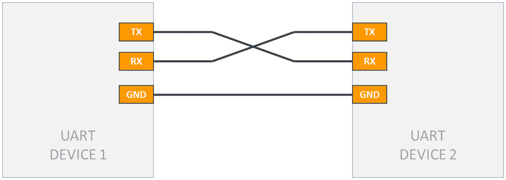
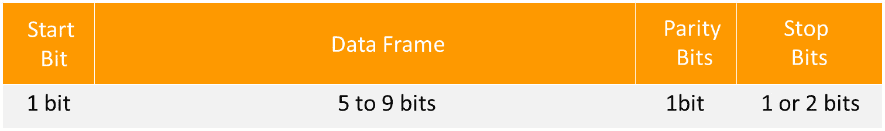
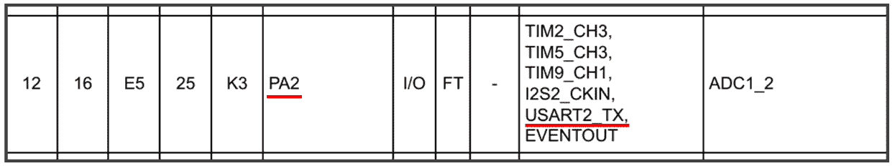
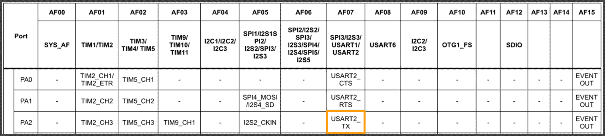
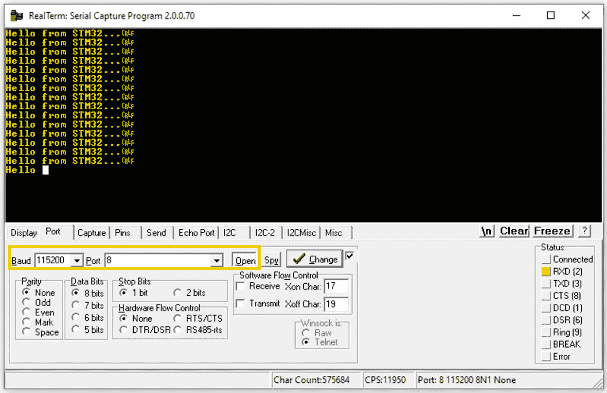

# 10

# 通用异步收发器协议

在本章中，我们将学习**通用异步收发器（UART**）协议，这是一种在嵌入式系统中广泛使用的通信方法。UART 对于实现微控制器和各种外设之间的通信至关重要，使其成为嵌入式系统开发中的基本组件。

我们将首先讨论通信协议在嵌入式系统中的重要性，并强调 UART 与其他协议（如 SPI 和 I2C）一起的常见用例。在此之后，我们将全面概述 UART 协议，详细说明其操作原理和特性。接下来，我们将从 STM32 参考手册中提取并检查 UART 的相关寄存器，为驱动器开发提供必要的知识基础。最后，我们将应用这些知识来开发裸机 UART 驱动器，展示通过 UART 初始化和传输数据的实际方面。

在本章中，我们将涵盖以下主要内容：

+   通信协议简介

+   UART 协议概述

+   STM32F4 UART 外设

+   开发 UART 驱动器

到本章结束时，你将很好地理解 UART 协议以及开发 UART 通信的裸机驱动器所需的技术。

# 技术要求

本章的所有代码示例都可以在 GitHub 上找到，网址为[`github.com/PacktPublishing/Bare-Metal-Embedded-C-Programming`](https://github.com/PacktPublishing/Bare-Metal-Embedded-C-Programming)。

# 通信协议简介

在嵌入式系统领域，通信协议是使微控制器和外设设备能够无缝通信的关键通道。把它们想象成不同设备用来理解和交换信息的语言，确保从你的智能手机到你的智能家居设备都能顺畅工作。

让我们深入了解通信协议是什么，它们是如何分组的，它们的独特特性和优势，并探索一些常见用例来观察这些协议的实际应用。

## 什么是通信协议？

通信协议是一套规则和约定，允许电子设备相互通信。这些协议定义了数据是如何格式化、传输和接收的，确保设备可以准确可靠地交换信息。没有这些协议，就像试图与说完全不同语言的人交谈一样——通信将会混乱且充满错误。

在嵌入式系统中，这些协议至关重要，因为它们促进了微控制器与传感器、执行器、显示器和其他微控制器等外围设备之间的交互。无论是从传感器向微控制器发送简单的温度读数，还是从摄像头模块流式传输视频数据，通信协议都使其成为可能。

让我们分析通信协议的分类，从宏观的角度开始：可以将通信协议广泛地归类为——**串行**和**并行**通信。

### 串行与并行通信

让我们从串行通信开始。

#### 串行通信

在这个类别中，通信协议可以进一步细分为异步和同步协议：

+   **异步**：这种类型的通信一次发送一个比特，没有时钟信号来同步发送者和接收者。想象一下像通过邮件发送信件一样，没有预定投递时间。一个常见的例子是 UART，它对于许多应用来说简单且高效。

+   **同步**：与异步通信不同，这种通信形式使用时钟信号来协调比特的传输。这就像有一个鼓点来确保每个人都步调一致。例子包括 **串行外设接口** (**SPI**) 和 **集成电路间接口** (**I2C**)。这些协议确保数据完整性和时序，使它们适合更复杂的任务。

#### 并行通信

这种类型涉及在多个通道上同时传输多个比特。想象一下发送一整队汽车而不是一辆——这更快，但需要更多的车道（或引脚，在我们的情况下）。虽然并行通信更快，但由于引脚数量更多，在嵌入式系统中不太常见。此外，它容易受到串扰和信号完整性问题的影响，尤其是在更长的距离上。

我们还可以根据它们的架构对通信协议进行分类。在这个分类体系中，我们有点对点通信和多设备通信。

### 点对点与多设备通信

让我们看看它们之间的区别。

#### 点对点

这是两个设备之间直接的通信线路。**UART** 是一个经典的例子，其中数据直接在微控制器和外围设备之间流动。它简单、可靠，非常适合许多嵌入式系统。

#### 多设备（总线）通信

在这里，多个设备共享相同的通信线路，这些线路可以是以下之一：

+   **多主设备**：多个设备可以控制通信总线。**I2C** 是一个很好的例子，因为它允许同一总线上有多个主设备和从设备。这就像一群朋友轮流在对话中交谈。

+   **主从模式**：一个主设备控制通信，将流量导向多个从设备。**SPI**就是这样操作的，一个主设备通过专用线路与多个从设备通信。**I2C**也可以这样操作。这就像是一位老师（主设备）依次叫学生发言。

最后，通信协议可以根据其数据流能力进行分类。

### 全双工与半双工对比

让我们看看全双工和半双工之间的区别：

+   **全双工**：这允许双向同时通信。想象一下一条双车道道路，汽车可以同时双向行驶。**UART**和**SPI**支持全双工通信，这使得它们在实时数据交换中非常高效。

+   **半双工**：在这里，通信可以双向进行，但不能同时进行——就像一条单车道道路，汽车必须轮流行驶。**I2C**通常以半双工模式运行，这对于其预期应用来说效果很好，但在高速数据场景中可能是一个限制。

现在，让我们仔细比较现代嵌入式系统中使用的三种常见通信协议。

## 比较 UART、SPI 和 I2C

让我们从串行异步接收/发送（UART）开始。

### UART

这里是 UART 的一些关键特性：

+   **异步通信**：UART 不需要时钟信号。相反，它使用起始位和停止位来同步数据传输。

+   **全双工**：UART 可以同时发送和接收数据，这对于许多需要实时通信的应用程序来说非常理想。

+   **简单且成本低**：UART 的硬件要求最小，易于实现且成本低。

以下是一些其优点：

+   **易用性**：设置 UART 通信非常简单，这使得它成为初学者和简单应用的流行选择。

+   **广泛支持**：UART 被大多数微控制器和外设设备普遍支持。

+   **低开销**：没有时钟信号意味着使用的引脚更少，减少了复杂性。

然而，它也有一些缺点：

+   **速度限制**：与 SPI 和 I2C 相比，UART 通常较慢，这使得它不太适合高速数据传输。

+   **距离限制**：在长距离上对噪声的敏感性可能会限制可靠通信的范围。

+   **点对点通信**：UART 是为直接、点对点通信设计的，如果多个设备需要通信，这可能是一个限制。

接下来，我们有串行外设接口（SPI）。

### SPI

这里是 SPI 的一些关键特性：

+   **同步通信**：SPI 使用时钟信号和数据线，确保同步数据传输。

+   **全双工**：它允许数据同时发送和接收。

+   **主从架构**：一个主设备控制多个从设备，每个设备都有专用线路。

以下是一些其优点：

+   **高速**：SPI 支持高速数据传输，这使得它非常适合需要快速通信的应用程序。

+   **多功能性**：SPI 可以连接具有不同配置的多个设备，为设计提供灵活性

然而，它也有一些缺点：

+   **需要更多引脚**：每个从设备需要一个单独的选择线，这可能会显著增加引脚数

+   **没有标准化的确认机制**：与 I2C 不同，SPI 没有内置的确认机制，这可能会使错误检测更具挑战性

+   **有限的多个主能力**：SPI 不是为多主系统设计的，这在某些情况下可能是一个限制

我们将要介绍的最后一个通信协议是 I2C。

### I2C

下面是 I2C 的一些关键特性：

+   **同步通信**：I2C 使用时钟信号进行同步数据传输

+   **多主能力**：多个主设备可以共享同一总线，这在更复杂的系统中很有用

+   **双线接口**：I2C 只需要两条线（SDA 和 SCL）进行通信，最小化了引脚数

以下是一些其优势：

+   **布线简单**：双线接口减少了复杂性和所需的引脚数

+   **多设备支持**：I2C 可以轻松连接同一总线上具有唯一地址的多个设备

+   **内置寻址**：I2C 具有内置的寻址机制，使得与多个设备的通信变得简单

然而，它也有一些缺点：

+   **较慢的速度**：I2C 通常比 SPI 慢，这可能会成为高速应用的限制

+   **复杂的协议**：该协议比 UART 和 SPI 更复杂，需要更复杂的数据传输和寻址处理

+   **易受噪声影响**：与 UART 类似，I2C 在较长距离上可能会易受噪声影响，这可能会影响通信可靠性

选择合适的通信协议取决于您的具体应用需求。如果您需要简单、直接的通信并且可以容忍较慢的速度，**UART**是一个不错的选择。对于需要全双工通信的高速应用，**SPI**是理想的，尤其是如果您能够管理更高的引脚数。当您需要用最少的线缆连接多个设备并且拥有复杂的通信设置时，**I2C**是您的首选协议。为了帮助您更好地理解何时选择哪种协议，让我们探讨一些常见的用例。

## UART、SPI 和 I2C 协议的常见用例

在设计嵌入式系统时，选择合适的通信协议对于确保高效和可靠的数据交换至关重要。UART、SPI 和 I2C 各自具有独特的优势，使它们适用于不同的应用。让我们探讨每个协议的实际用例和引人入胜的案例研究，突出其专业性和现实世界的相关性。

### UART

让我们看看 UART 协议的一些常见用例：

+   **与 PC 的串行通信**：UART 常用于微控制器和计算机之间的串行通信，尤其是用于调试、固件更新和数据记录。

+   **GPS 模块**：UART 可用于将 GPS 模块的位置数据传输到微控制器。

+   **蓝牙模块**：UART 通过蓝牙使设备能够进行无线通信。

这些用例代表了 UART 最常见的应用之一，但该协议非常灵活，可以用于许多其他需要简单串行通信的场景。

案例研究 - 自主无人机 GPS 模块集成

想象你正在开发一个需要精确导航以执行测绘和制图等任务的自主无人机。使用 UART 集成 GPS 模块可以提供导航所需的实时位置数据。

**设置**：将 GPS 模块的发送（TX）引脚连接到微控制器的接收（RX）引脚，反之亦然。配置波特率，使其与 GPS 模块的输出相匹配。

**操作**：GPS 模块持续发送包含位置数据的 NMEA 句子（文本字符串）。微控制器通过 UART 读取这些字符串，解析它们，并使用位置信息来精确导航无人机。

**优势**：UART 的简单性和广泛支持使得集成 GPS 模块变得简单，提供可靠且连续的数据流，无需复杂的设置。

接下来，我们将探讨 SPI。

### SPI

以下是一些 SPI 协议的常见用例：

+   **高速数据传输**：它非常适合内存卡、**模数转换器**（ADCs）、**数模转换器**（DACs）和显示器等应用。

+   **显示模块**：SPI 可用于与需要快速刷新率的高分辨率显示器通信。

+   **传感器和执行器**：SPI 可以处理来自各种传感器的高频数据输出。

与 UART 类似，这些示例突出了 SPI 的一些典型用途，但该协议的高速能力使其适用于需要快速数据传输的广泛其他应用。

案例研究 - 工业设备的 SD 卡数据记录

考虑一个工业监控系统，它将来自各种传感器的数据记录到 SD 卡中，以进行长期分析。SPI 是这种高速数据传输的完美协议。

**设置**：使用 SPI 引脚（MISO、MOSI、SCLK 和 CS）将微控制器连接到 SD 卡。初始化 SPI 总线并配置 SD 卡。

**操作**：微控制器从传感器（例如，温度、压力和振动）收集数据，并将这些数据实时写入 SD 卡。

**优势**：SPI 的高速数据传输确保大量数据快速高效地记录，防止数据丢失并确保准确监控。

在这种情况下使用 SPI 允许工业系统精确记录关键参数，这对于预测性维护和运营效率至关重要。

最后，我们有 I2C。

### I2C

让我们考虑两个与 I2C 相关的常见用例：

+   **多传感器集成系统**：这涉及到在同一 I2C 总线上连接具有不同地址的多个传感器

+   **外围扩展**：这涉及到使用 I2C 扩展器向微控制器添加更多 GPIO 引脚

这些用例只是 I2C 应用的两个例子。它能够在单总线上支持多个设备的能力，使其成为许多其他场景下的优秀选择，在这些场景中，可扩展性很重要。

案例研究 - 智能农业的环境监控系统

假设你正在开发一个使用多个传感器（温度、湿度和土壤湿度）以优化农业条件的智能农业系统。I2C 是这种多传感器集成的理想协议。

**设置**：将所有传感器连接到 I2C 总线（SDA 和 SCL 线）。为每个传感器分配一个唯一的地址。

**操作**：微控制器按顺序查询每个传感器，收集数据，并对其进行处理以提供见解和控制灌溉、通风和照明系统。

**优势**：I2C 能够在同一总线上仅用两条线支持多个设备，简化了布线，降低了成本，并节省了 GPIO 引脚，使其成为复杂传感器网络的效率解决方案。

从下一节开始，我们将专注于 UART 协议。在接下来的章节中，我们将介绍 I2C 和 SPI 协议。

# UART 协议概述

最基本且最广泛使用的协议之一是 UART。无论你是调试硬件还是使微控制器与外围设备之间进行通信，理解 UART 都是至关重要的。让我们深入了解这个协议的工作原理。

## 什么是 UART？

UART 是一种硬件通信协议，它使用异步串行通信进行操作，允许调整数据传输速度。"异步"的 UART 特性意味着它不需要时钟信号来对齐发送器和接收器之间位传输的对齐。相反，两个设备必须就特定的波特率达成一致，这决定了数据交换的速度。让我们看看接口。

## 接口

UART 接口使用两条线进行通信：TX 和 RX。为了在两个设备之间建立连接，我们只需将第一个设备的 TX 引脚连接到第二个设备的 RX 引脚，并将第一个设备的 RX 引脚连接到第二个设备的 TX 引脚。此外，连接两个设备的接地引脚以确保共同的电气参考至关重要。*图 10.1*显示了两个 UART 设备之间的连接：



图 10.1：UART 接口

## UART 是如何工作的

UART 中的数据以包含**起始位**、**数据位**、可选的**奇偶校验位**和**停止位**的帧形式传输：



图 10.2：UART 数据包

下面是这个过程的一步一步分解：

1.  **起始位**：传输线路通常保持高电平。为了开始数据传输，发送的 UART 将线路拉低一个时钟周期。这表示新数据帧的开始。

1.  **数据帧**：在起始位之后，数据帧通常由 5 到 9 位组成，并从**最低有效位**（**LSB**）到**最高有效位**（**MSB**）发送。

1.  **奇偶校验位**：这是可选的，用于错误检查。它确保数据中设置的位（1s）的数量是偶数或奇数。

1.  **停止位**：这是一位或两位，表示数据包的结束。在停止位期间，线路被驱动到高电平。

让我们更详细地看看起始位、停止位和奇偶校验位。

### 起始位、停止位和奇偶校验位

这些位构成了 UART 协议的骨架，允许设备同步并验证传输数据的完整性。

#### 起始位

起始位是 UART 通信中标记数据帧开始的初始信号。当发送设备处于空闲状态时，数据线保持在高电压水平（逻辑 1）。为了表示传输的开始，UART 发送器将线路拉低到低电压水平（逻辑 0），持续 1 位时间。这种从高到低的转换通知接收设备有新的数据包到来，允许它同步并准备接收数据。

#### 停止位

在数据位和可选的奇偶校验位传输之后，停止位表示数据帧的结束。发送器将数据线驱动回高电压水平（逻辑 1），持续 1 或 2 位时间，具体取决于配置。停止位确保接收器有足够的时间处理最后一个数据位并为下一个起始位做准备。本质上，停止位充当缓冲区，在连续的数据帧之间提供清晰的分隔，并帮助保持通信设备之间的同步。

#### 奇偶校验位

奇偶校验位是 UART 通信中用于基本错误检查的可选功能。它提供了一种简单的方法来检测在数据传输过程中可能发生的错误。奇偶校验位可以配置为偶校验或奇校验：

+   **偶校验**：如果数据帧中 1 的数量是偶数，则奇偶校验位设置为 0；如果 1 的数量是奇数，则设置为 1。这确保了包括奇偶校验位在内的 1 的总数是偶数。

+   **奇校验**：如果数据帧中 1 的数量是奇数，则奇偶校验位设置为 0；如果 1 的数量是偶数，则设置为 1。这确保了包括奇偶校验位在内的 1 的总数是奇数。

当接收方接收到数据帧时，它会将奇偶校验位与接收到的数据比特进行比较。如果存在不匹配，则表明在传输过程中发生了错误。虽然奇偶校验不能纠正错误，但它有助于识别错误，并在必要时提示重新传输。

开始位、停止位和奇偶校验位是 UART 通信的基本组成部分，每个部分都在确保数据完整性和同步方面发挥着关键作用。开始位表示传输的开始，停止位标记传输的结束，奇偶校验位提供基本的错误检查机制。它们共同构成了一个可靠且高效的设备间串行通信框架。

在结束本节之前，让我们花一点时间来了解在 UART 通信中使用的速度单位。

### 理解波特率——嵌入式系统中通信的速度

在嵌入式系统领域，**波特率**是一个你经常会遇到的术语。无论你是调试微控制器、设置串行通信链路还是处理各种外围设备，理解波特率都是至关重要的。但波特率究竟是什么，为什么它如此重要呢？让我们来分析一下。

#### 波特率是什么？

波特率本质上是指数据在通信信道上传输的速度。它以每秒比特数（**bps**）来衡量。把它想象成高速公路上的限速：波特率越高，在给定时间内沿通信路径传输的数据就越多。

例如，波特率为 *9,600* 意味着每 *秒* 传输 *9,600 比特* 的数据。换句话说，它设定了数据包发送和接收的速度。

然而，区分波特率和比特率非常重要。波特率指的是每秒信号变化的次数，而比特率是每秒传输的比特数。在简单的系统中，*每次信号变化可以代表一个比特*，这使得波特率和比特率相同。在更复杂的系统中，每次信号变化可以代表多个比特，从而导致比特率高于波特率。

#### 为什么波特率很重要？

想象一下试图与一个说话速度与你截然不同的人交谈。这将令人困惑且效率低下，对吧？同样的原则也适用于电子设备之间的通信。发送和接收设备需要就一个共同的波特率达成一致，以便正确理解对方。如果它们不一致，数据可能会丢失或混乱，从而导致通信错误。

为了成功通信，发送方和接收方必须具有相同的波特率以正确同步。如果一个设备设置为 9,600 bps，而另一个设置为 115,200 bps，通信将失败，就像一个人说话太快或太慢以至于对方无法理解时，对话会失败一样。

在串行通信中，有一些标准波特率被广泛使用。以下是一些示例：

+   **300 bps**: 非常慢，常用于带宽受限的长距离通信

+   **9,600 bps**: 许多设备，包括微控制器广泛使用的默认速率

+   **19,200 bps**: 更快，常用于数据密集型应用

+   **115,200 bps**: 高速通信，常见于需要快速数据传输的应用

这就结束了我们对 UART 协议的概述。在下一节中，我们将探讨 STM32F4 微控制器中的 UART 外设。

## STM32F4 UART 外设

STM32 微控制器通常包含多个 UART 外设，但具体数量取决于具体型号。STM32F411 微控制器有三个 UART 外设：

+   USART1

+   USART2

+   USART6

USART 与 UART 的比较

我们的 STM32 文档将 UART 外设称为 **USART**，因为它代表通用 **同步/异步** 接收/发送器。这个名字反映了外设的双重功能：

**异步模式** (**UART**): 在此模式下，USART 作为传统的 UART 运行。它不需要时钟信号即可发送和接收数据，这是标准串行通信的典型特征。

**同步模式** (**USART**): 在此模式下，USART 也可以使用同步时钟信号进行操作，允许它与除了数据线外还需要时钟线的设备进行通信。

让我们分析此外设的关键寄存器，从 USART 状态寄存器开始。

### USART 状态寄存器 (USART_SR)

`USART_SR` 寄存器是用于监控 UART 外设状态的主要寄存器之一。它提供了关于各种操作标志和错误的实时信息。

让我们考虑此寄存器中的关键位：

+   **发送数据寄存器空** (**TXE**): 当数据寄存器为空且准备好写入新数据时，该位被设置。这表示发送器可以发送更多数据。

+   **读取数据寄存器非空** (**RXNE**): 该位指示数据寄存器包含尚未读取的数据。它表示有要处理的数据传入。

+   **传输完成** (**TC**): 当最后一个传输完成，包括所有停止位时，该位被设置。它表示数据已完全发送。

+   **溢出错误** (**ORE**): 该位指示数据丢失，因为数据寄存器在新数据到达之前没有被读取。它表示一个错误条件。

您可以在 *STM32F4 参考手册 (RM0383)* 的 *第 547 页* 找到关于此寄存器的详细信息。接下来，我们有 `USART_DR`)。

### USART 数据寄存器 (USART_DR)

`USART_DR` 寄存器用于发送和接收数据。它作为通过 UART 外设进行数据交换的主要接口。

此寄存器中的关键功能如下：

+   `USART_DR` 通过 TX 线发送数据。UART 外设以串行方式处理转换和传输。

+   `USART_DR` 从 RX 线上检索接收到的数据。这应该立即完成，以避免数据溢出。

接下来，我们有 `USART_BRR`)。

### USART 波特率寄存器 (USART_BRR)

`USART_BRR` 寄存器用于设置 UART 通信的波特率，这对于同步设备之间的数据传输速度至关重要。

此寄存器有两个字段：

+   **尾数**：设置波特率的分频因子的整数部分

+   **分数**：分频因子的分数部分，用于微调波特率

我们将要检查的最后一个寄存器是 `USART_CR1`）。

### USART 控制寄存器 1 (USART_CR1)

`USART_CR1` 寄存器是一个综合控制寄存器，它启用了各种 UART 功能和配置。

让我们考虑此寄存器中的关键位：

+   **USART 使能** (**UE**)：此位启用或禁用 UART 外设。它必须设置为激活 UART 通信。

+   **字长度** (**M**)：此位配置字长度，允许 8 位或 9 位数据帧。

+   **奇偶校验控制使能** (**PCE**)：此位启用奇偶校验以检测错误。

+   **奇偶校验选择** (**PS**)：此位选择偶校验或奇校验。

+   **发送器使能** (**TE**)：此位启用发送器，允许发送数据。

+   **接收器使能** (**RE**)：此位启用接收器，允许接收数据。

在考虑了这些寄存器之后，我们现在可以开始开发 UART 驱动程序。我们将在下一节中深入探讨。

# 开发 UART 驱动程序

在本节中，我们将应用我们关于 UART 外设所学的所有知识，开发一个使用 `USART2` 外设发送数据的驱动程序。

让我们先识别连接到 UART2 外设的 GPIO 引脚。为此，请参考 STM32F411RE 数据表第 39 页的表格。此表列出了微控制器的所有 GPIO 引脚，以及它们的描述和附加功能。如图 10**.3** 所示，此表的一部分显示 PA1 有一个标记为 `USART2_TX` 的交替功能：



图 10.3：USART2_TX 引脚

要将 PA2 作为 `USART2_TX` 线使用，我们需要在 `GPIOA_MODER` 寄存器中将 `PA2` 配置为交替功能引脚，然后在 `GPIOA_AFRL` 寄存器中指定 `USART2_TX` 的交替功能编号。STM32F4 微控制器允许我们从 16 个不同的交替功能中选择，编号从 `AF00` 到 `AF15`。数据表中的交替功能映射表（您可以在数据表的第 47 页找到），概述了这些功能和它们对应的编号。如图 10**.4** 所示，该图来自数据表，配置 `PA2` 为 `AF07` 将将其设置为作为 `USART2_TX` 线的功能：



图 10.4：PA2 交替功能

我们现在有了开发 UART2 发送器驱动程序所需的所有信息。

创建你之前项目的副本，并将其重命名为 `UART`。接下来，在 `Src` 文件夹中创建一个名为 `uart.c` 的新文件，并在 `Inc` 文件夹中创建一个名为 `uart.h` 的新文件。用以下代码填充你的 `uart.c` 文件：

```cpp
#include <stdint.h>
#include "uart.h"
#define GPIOAEN        (1U<<0)
#define UART2EN        (1U<<17)
#define DBG_UART_BAUDRATE        115200
#define SYS_FREQ                16000000
#define APB1_CLK                SYS_FREQ
#define CR1_TE                (1U<<3)
#define CR1_UE                (1U<<13)
#define SR_TXE                (1U<<7)
static void uart_set_baudrate(uint32_t periph_clk,uint32_t baudrate);
static void uart_write(int ch);
int __io_putchar(int ch)
{
    uart_write(ch);
    return ch;
}
void uart_init(void)
{
    /*Enable clock access to GPIOA*/
    RCC->AHB1ENR |= GPIOAEN;
    /*Set the mode of PA2 to alternate function mode*/
    GPIOA->MODER &=~(1U<<4);
    GPIOA->MODER |=(1U<<5);
    /*Set alternate function type to AF7(UART2_TX)*/
    GPIOA->AFR[0] |=(1U<<8);
    GPIOA->AFR[0] |=(1U<<9);
    GPIOA->AFR[0] |=(1U<<10);
    GPIOA->AFR[0] &=~(1U<<11);
    /*Enable clock access to UART2*/
     RCC->APB1ENR |=    UART2EN;
    /*Configure uart baudrate*/
      uart_set_baudrate(APB1_CLK,DBG_UART_BAUDRATE);
    /*Configure transfer direction*/
     USART2->CR1 = CR1_TE;
    /*Enable UART Module*/
     USART2->CR1 |= CR1_UE;
}
static void uart_write(int ch)
{
    /*Make sure transmit data register is empty*/
    while(!(USART2->SR & SR_TXE)){}
    /*Write to transmit data register*/
    USART2->DR =(ch & 0xFF);
}
static uint16_t compute_uart_bd(uint32_t periph_clk,uint32_t baudrate)
{
    return((periph_clk + (baudrate/2U))/baudrate);
}
static void uart_set_baudrate(uint32_t periph_clk,uint32_t baudrate)
{
    USART2->BRR = compute_uart_bd(periph_clk,baudrate);
}
```

让我们将其分解。

首先，我们有必要的包含和宏定义。

```cpp
#include <stdint.h>
#include "uart.h"
#define GPIOAEN (1U<<0)
#define UART2EN (1U<<17)
#define DBG_UART_BAUDRATE 115200
#define SYS_FREQ 16000000
#define APB1_CLK SYS_FREQ
#define CR1_TE (1U<<3)
#define CR1_UE (1U<<13)
#define SR_TXE (1U<<7)
```

这里是宏的使用方法：

+   `GPIOAEN`：此宏通过在 `AHB1ENR` 寄存器中设置位 0 来启用 GPIOA 的时钟。

+   `UART2EN`：此宏通过在 `APB1ENR` 寄存器中设置位 17 来启用 UART2 的时钟。

+   `DBG_UART_BAUDRATE`：此宏定义 UART 通信的波特率，设置为 `115200` bps。

+   `SYS_FREQ`：此宏定义系统频率，设置为 16 MHz，并且是 NUCLEO 开发板上 STM32F411 微控制器的默认频率。

+   `APB1_CLK`：此宏将 APB1 外设时钟频率设置为系统频率（16 MHz）。

+   `CR1_TE`：此宏通过在 `USART_CR1` 寄存器中设置位 3 来启用发射器。

+   `CR1_UE`：此宏通过在 `USART_CR1` 寄存器中设置位 13 来启用 UART 模块。

+   `SR_TXE`：此宏代表 `USART_SR` 寄存器中的 TXE 位。

接下来，我们有计算和设置波特率的辅助函数：

```cpp
static uint16_t compute_uart_bd(uint32_t periph_clk, uint32_t baudrate)
{
    return ((periph_clk + (baudrate / 2U)) / baudrate);
}
```

此辅助函数计算波特率除数。它使用外设时钟和所需的波特率来计算要设置在 **波特率** **寄存器**（**BRR**）中的值：

```cpp
static void uart_set_baudrate(uint32_t periph_clk, uint32_t baudrate)
{
    USART2->BRR = compute_uart_bd(periph_clk, baudrate);
}
```

此函数通过将计算出的除数写入 BRR 来设置 UART2 的波特率。让我们将注意力转向初始化函数：

```cpp
RCC->AHB1ENR |= GPIOAEN;
```

通过在 AHB1 外设时钟使能寄存器中设置适当的位，此行启用了 GPIOA 的时钟：

```cpp
GPIOA->MODER &= ~(1U << 4);
GPIOA->MODER |= (1U << 5);
```

这些行将引脚 PA2 配置为在备用功能模式下操作，这对于 UART 功能是必要的：

```cpp
GPIOA->AFR[0] |= (1U << 8);
GPIOA->AFR[0] |= (1U << 9);
GPIOA->AFR[0] |= (1U << 10);
GPIOA->AFR[0] &= ~(1U << 11);
```

这些行将 PA2 配置为备用功能（`AF7`），对应于 `UART2_TX`：

```cpp
 RCC->APB1ENR |= UART2EN;
```

通过在 APB1 外设时钟使能寄存器中设置适当的位，此行启用了 UART2 的时钟：

```cpp
uart_set_baudrate(APB1_CLK, DBG_UART_BAUDRATE);
```

此函数调用使用 `uart_set_baudrate()` 函数设置 UART2 的波特率：

```cpp
USART2->CR1 = CR1_TE;
```

通过在控制寄存器中设置发射使能位，此配置将 UART2 配置为传输模式：

```cpp
USART2->CR1 |= CR1_UE;
```

通过在控制寄存器中设置 UART 使能位，此操作启用了 UART2 模块。

接下来，我们有写入 UART 的函数：

```cpp
static void uart_write(int ch)
{
    /* Make sure transmit data register is empty */
    while (!(USART2->SR & SR_TXE)) {}
    /* Write to transmit data register */
    USART2->DR = (ch & 0xFF);
}
```

让我们将其分解：

```cpp
while (!(USART2->SR & SR_TXE)) {}
```

此循环确保在写入新数据之前，传输数据寄存器是空的：

```cpp
USART2->DR = (ch & 0xFF);
```

此行将字符写入数据寄存器以进行传输。

最后，我们有一个有用的函数，允许我们将 `printf` 输出重定向到我们的 UART 发送器：

```cpp
int __io_putchar(int ch)
{
    uart_write(ch);
    return ch;
}
```

它调用 `uart_write()` 发送字符，然后返回字符。

发送字符后，`__io_putchar` 返回相同的字符，`ch`。

返回字符是一种标准做法，允许函数符合典型的 `putchar` 函数签名，该签名返回作为 `int` 变量的写入字符。

我们接下来的任务是填充`uart.h`文件。以下是代码：

```cpp
#ifndef __UART_H__
#define __UART_H__
#include "stm32f4xx.h"
void uart_init(void);
uart.c, making it callable from other files. We are now ready to test our driver in main.c. Update your main.c file, like so:

```

#include <stdio.h>

#include "uart.h"

int main(void)

{

/*初始化调试串口*/

uart_init();

while(1)

{

printf("来自 STM32 的问候...\r\n");

}

}

```cpp

			This main function simply initializes the UART2 peripheral and then continuously prints the sentence `Hello` `from STM32…`.
			Let’s test the project. To do so, we’ll need to install a program on our computer that can display the data that’s received through the computer’s serial port. In this setup, our development board acts as the transmitter, while the computer is the receiver.

				1.  **Install a serial** **terminal program**:
    *   Choose a serial terminal program that’s appropriate for your operating system. Options include *Realterm*, *Tera Term*, *Hercules*, and *Cool Term*.
    *   If you’re using Windows, I recommend Realterm. You can download it from SourceForge: [`sourceforge.net/projects/realterm/`](https://sourceforge.net/projects/realterm/).
    *   Follow the installation wizard to complete the setup.
				2.  **Prepare to identify your development board’s** **serial port**:
    1.  Disconnect your development board from your computer.
    2.  Open Realterm and navigate to the **Port** tab.
    3.  Click on the **Port** drop-down menu; you’ll see a list of available ports. Since your development board is currently disconnected, its port won’t appear in the list. **Take note** of the listed ports.
				3.  **Identify the development** **board’s port**:
    1.  Close Realterm and connect your development board to the computer.
    2.  Reopen Realterm and go back to the **Port** drop-down menu. You should now see a new port in the list, which corresponds to your development board.
    3.  Select this newly added port.
				4.  **Set the** **baud rate**:

    Click the **Baud** drop-down menu and select **115200**. This is the baud rate we configured in our driver.

				5.  **Build and run** **the project**:

    Return to your IDE, build the project, and run the firmware on your microcontroller.

				6.  `Hello from STM32…` continuously being printed in the Terminal window.

			*Figure 1**0**.5* shows the settings described for Realterm:
			

			Figure 10.5: Realterm settings
			Summary
			In this chapter, we learned about the UART protocol, a fundamental communication method that’s widely used in embedded systems. We began by discussing the importance of communication protocols in embedded systems, emphasizing how UART, alongside SPI and I2C, facilitates seamless communication between microcontrollers and peripheral devices.
			Next, we provided a detailed overview of the UART protocol while covering its operational principles, including how data is transmitted asynchronously using start and stop bits, and the role of parity in error checking. We also discussed how the baud rate, a critical aspect of UART communication, is configured to ensure synchronized data transfer between devices.
			Then, we delved into the specifics of the STM32 UART peripheral, examining key registers such as the Status Register (`USART_SR`), Data Register (`USART_DR`), Baud Rate Register (`USART_BRR`), and Control Register 1 (`USART_CR1`). Understanding these registers is essential for configuring UART for effective communication in STM32 microcontrollers.
			Finally, we applied our theoretical understanding by developing a bare-metal UART driver for the STM32F4 microcontroller. This involved initializing the UART peripheral, setting the baud rate, and implementing functions for transmitting data. We also demonstrated how to redirect `printf` output to the UART, enabling easy debugging and data logging through a serial terminal.
			In the next chapter, we will learn about the **analog-to-digital** **converter** (**ADC**).

```
