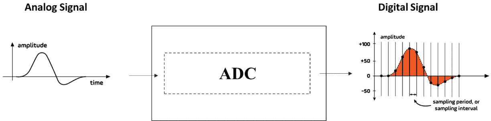
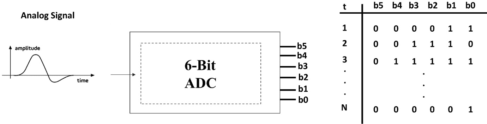
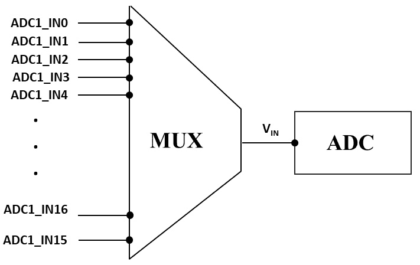
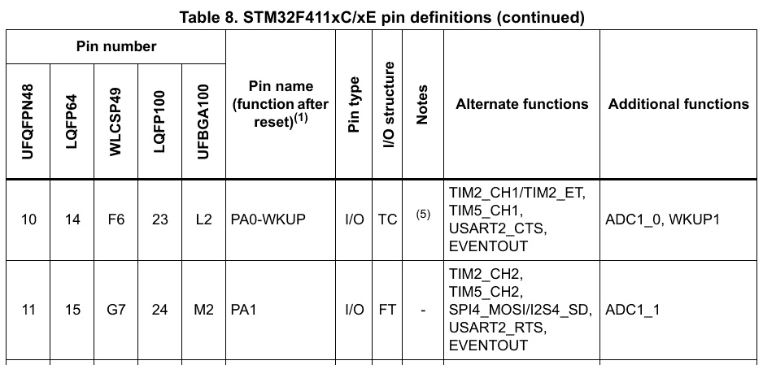
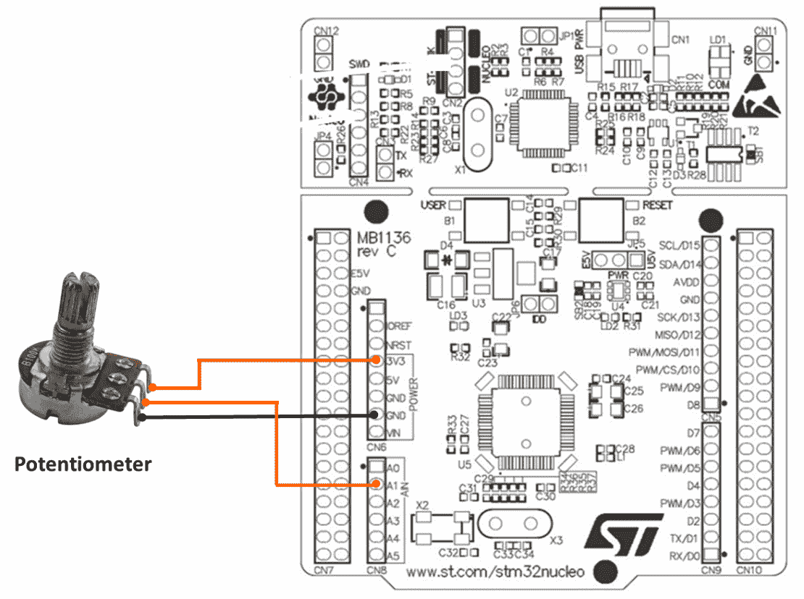

# 模拟到数字转换器（ADC）

在本章中，我们将学习**模拟到数字转换器**（**ADC**），这是嵌入式系统中一个重要的外围设备，它使微控制器能够与模拟世界进行接口。我们将首先概述模拟到数字转换过程、ADC 的重要性及其关键规格。

在此之后，我们将从 STM32F411 参考手册中提取和分析 ADC 操作所需的有关寄存器。最后，我们将开发一个裸机 ADC 驱动程序，以展示我们讨论的理论概念的实际应用。

在本章中，我们将涵盖以下主要主题：

+   模拟到数字转换概述

+   STM32F4 ADC 外围设备

+   关键 ADC 寄存器和标志

+   开发 ADC 驱动程序

到本章结束时，您将全面了解 STM32 ADC 外围设备及其开发高效驱动程序所需的技能，这将使您能够有效地将模拟到数字转换功能集成到您的嵌入式系统项目中。

# 技术要求

本章的所有代码示例都可以在 GitHub 上找到：[`github.com/PacktPublishing/Bare-Metal-Embedded-C-Programming`](https://github.com/PacktPublishing/Bare-Metal-Embedded-C-Programming)。

# 模拟到数字转换概述

ADC 是嵌入式系统中的一个关键过程，它允许我们的微控制器解释和处理现实世界的模拟信号。在本节中，我们将逐步介绍这个过程，解释将模拟信号转换为数字值所涉及的每个步骤。

## 什么是模拟到数字转换？

模拟到数字转换是将连续的模拟信号转换为离散数字表示的过程。模拟信号可以在一定范围内具有任何值，而数字信号具有特定的、量化的级别。这种转换是必不可少的，因为微控制器和数字系统只能处理数字数据。

转换过程通常涉及几个关键步骤：采样、量化和编码。让我们从采样开始分解这些步骤。

### 采样

**采样**涉及在定期的时间间隔内测量模拟信号的幅度，这些时间间隔称为**采样间隔**。结果是近似原始模拟信号的一系列离散值。*图 11.1*展示了这个过程：



图 11.1：采样过程

模拟信号采样的速率被称为**采样率**或**采样频率**。这通常以每秒的样本数（Hz）来衡量。根据**奈奎斯特定理**，采样率必须至少是模拟信号中最高频率的两倍，才能准确重建原始信号。

过程的下一步是量化。

### 量化

**量化**是将采样模拟值映射到数字域中可用的最近离散级别的过程。每个离散级别对应一个唯一的数字码。

可用于量化的离散级别数量由模拟到数字转换器的分辨率决定。例如，一个 *8 位 ADC* 有 256 个级别（2⁸），而一个 *12 位 ADC* 有 4096 个级别（2¹²）。

量化过程固有的引入了一个误差，称为**量化误差**或**量化噪声**，因为精确的模拟值被近似到最近的数字级别。我们可以通过增加 ADC 的分辨率来最小化这个误差。例如，如果一个模拟信号的范围是 *从 0 到 3.3V*，并且使用了一个 *8 位 ADC*，那么量化步长大约是 *12.9 mV (3.3V / 256)*。一个 *1.5V* 的模拟输入可能被量化到最接近的数字级别，这可能会略高于或低于 *1.5V*。

过程的最终步骤是编码。

### 编码

**编码**是最终步骤，是将量化级别转换为数字系统能够处理的二进制码。每个量化级别由一个唯一的二进制值表示。

ADC 中使用的位数决定了二进制码的长度。例如，一个 *10 位* ADC 将为每个采样值生成一个 *10 位* 二进制数。继续我们之前的例子，如果 *1.5V* 的量化级别被确定为 *116* 级别，对于 *8 位* ADC，其二进制表示将是 *01110100*。

*图 11.2* 显示了 *6 位模数转换器（ADC）* 的编码过程。表中的列显示了 6 位二进制表示的量化级别。对于 6 位 ADC，数字输出范围从最低量化级别 `000000` 到最高量化级别 `111111`。每个二进制值对应一个特定的量化级别：



图 11.2：编码过程

总结来说，模拟到数字转换过程始于一个模拟输入信号，该信号随时间连续变化。这个信号可能是一个温度传感器的电压、音频信号或任何其他模拟信号。模数转换器通常包括一个采样保持电路，在每个采样间隔捕获并保持模拟信号。这确保信号在转换过程中保持恒定。ADC 的核心执行量化和编码。它将保持的模拟值与一组参考电压进行比较，以确定最接近的匹配数字级别。结果数字码从 ADC 输出，可以被我们的微控制器或数字系统读取以进行进一步处理。

在下一节中，我们将解释本节中使用的一些关键术语，包括分辨率和**参考电压**（**VREF**）。

## ADC 的关键规格 – 分辨率、步长和 VREF

为了有效地使用 ADC，了解它们的关键规格非常重要，这些规格定义了它们在各种应用中的性能。让我们从分辨率开始。

### 分辨率

ADC 的分辨率决定了它可以产生的不同输出级别的数量，对应于输入电压范围被分成的间隔数量。它通常以比特为单位表示。更高的分辨率允许我们更精确地表示模拟输入信号，减少量化误差并提高测量的准确性。

对于一个*N 位* ADC，离散输出级别的数量是*2N*。例如，一个*8 位* ADC 有*256(2⁸)*个级别，而一个*12 位* ADC 有*4,096*个级别。

*表 11.1* 展示了常见的 ADC 分辨率及其对应的离散级别数量。以下表格突出了随着分辨率的增加，离散级别数量呈指数增长，从而在模拟输入信号的数字表示中提供更细的粒度：

| **ADC** **分辨率（比特）** | **离散** **级别数量（2^N）** |
| --- | --- |
| 8 | 256 |
| 10 | 1,024 |
| 12 | 4,096 |
| 14 | 16,384 |
| 16 | 65,536 |
| 18 | 262,144 |
| 20 | 1,048,576 |
| 24 | 16,777,216 |

表 11.1：常见的 ADC 分辨率

下一个关键规格是**VREF**。

### VREF

VREF 是我们 ADC 可以转换的最大电压。模拟输入电压与这个 VREF 进行比较，以产生一个数字值。VREF 的稳定性和精度直接影响 ADC 的准确性，因为 VREF 的任何波动都可能导致数字输出中的相应误差。

我们可以选择从微控制器中提取 VREF，或者为更精确的应用提供外部 VREF。内部参考方便，但可能具有更高的可变性，而外部参考可以提供更好的稳定性和精度。VREF 的选择取决于我们应用的精度要求和被测量的模拟信号的特性。

例如，如果 VREF 是 5V，ADC 可以准确地转换 0V 到 5V 范围内的任何模拟输入信号。

我们将要检查的最后一个是步长。

### 步长

步长是 ADC 可以区分的最小模拟输入变化。它由 VRED 和分辨率决定，并决定了 ADC 输出的粒度。较小的步长表示更细的分辨率，允许 ADC 检测输入信号中的更小变化。

步长是通过将 VREF 除以 2 的 ADC 分辨率次幂（位数）来计算的：


在这里，*VREF*是参考电压，*N*是分辨率位数。

例如，对于一个 VREF = 3.3V 的 10 位 ADC：


这意味着量化数字输出的每次增加对应于模拟输入中*3.22mV*的变化。*表 11.2*列出了常见的 ADC 分辨率、相应的步数和步长，使用 3.3V 的 VREF：

| **ADC** **分辨率（位）** | **步数（2^N）** | **步长（mV）** |
| --- | --- | --- |
| 8 | 256 | 12.9 |
| 10 | 1,024 | 3.22 |
| 12 | 4,096 | 0.805 |
| 14 | 16,384 | 0.201 |
| 16 | 65,536 | 0.0504 |
| 18 | 262,144 | 0.0126 |
| 20 | 1,048,576 | 0.0032 |
| 24 | 16,777,216 | 0.000197 |

表 11.2：3.3V VREF 下的 ADC 分辨率和步长

此表清晰地展示了随着分辨率的增加，步长如何减小，从而允许在模拟输入的数字表示中具有更细的粒度。

这就结束了我们对模拟-数字转换过程的概述。在下一节中，我们将检查我们的 STM32 微控制器的 ADC 外设。

# STM32F4 ADC 外设

我们的 STM32F411 微控制器配备了一个 12 位 ADC，能够测量多达*19 个多路复用通道*的信号。ADC 可以在各种模式下运行，如单次、连续、扫描或不连续，结果存储在*一个 16 位数据寄存器*中。此外，ADC 还具有模拟看门狗功能，允许系统检测输入电压是否超过预定义的阈值。

在我们解释各种 ADC 模式之前，让我们先了解我们所说的 ADC 通道是什么意思。

## ADC 通道

**ADC 通道**是一个专用路径，通过该路径将模拟信号输入到 ADC 中，以便将其转换为数字值。每个 ADC 通道对应一个配置为模拟模式的特定 GPIO 引脚。

传感器，产生代表物理现象（如温度、光或压力）的模拟信号，通过这些 GPIO 引脚与我们的微控制器接口。通过将 GPIO 引脚配置为模拟输入，微控制器可以在相应的 ADC 通道上接收传感器的模拟输出信号。然后 ADC 将这个连续的模拟信号转换为微控制器可以处理、分析和用于我们嵌入式系统应用中进一步决策任务的离散数字表示。

你可能会想，19 个通道是否意味着我们有 19 个独立的 ADC 模块？这正是多路复用发挥作用的地方。

### 多路复用 ADC 通道

**多路复用**允许 ADC 在不同的输入信号之间切换，依次采样每个信号。这是通过 ADC 外围中的模拟多路复用器（MUX）实现的。正如我们之前所学的，每个 ADC 通道都连接到一个配置为模拟输入的特定 GPIO 引脚。模拟 MUX 选择哪个模拟输入信号（来自 GPIO 引脚或内部源）连接到 ADC 的采样电路，在任何给定时间。这种选择由 ADC 的配置寄存器控制。

*图 11.3*显示了 ADC 通道与 ADC 外围块内模拟多路复用器的连接：



图 11.3：ADC 通道多路复用

现在，让我们来检查可用的 ADC 模式。

### ADC 模式

在我们的 STM32F411 微控制器中，ADC 可以在几种模式下运行，每种模式都针对特定的应用需求进行了定制。主要的工作模式包括单次转换模式、连续转换模式、扫描模式、不连续模式和注入转换模式。

让我们逐一分析：

+   `ADC_CR2`寄存器中的`0`。

    *示例用例*：在特定间隔读取温度传感器的值。

+   `ADC_CR2`寄存器中的`1`。

    *示例用例*：持续监测电位计以实时跟踪其位置。

+   通过设置`ADC_CR1`寄存器并配置`ADC_SQRx`寄存器中的通道序列，然后通过设置`ADC_CR2`寄存器或通过外部触发来启动转换。如果`ADC_CR2`，则在最后一个通道转换后，序列将重新开始。

    *示例用例*：在数据采集系统中采样多个传感器输入。

+   首先通过设置`ADC_CR1`寄存器来定义每个组中要转换的通道数量。

    *示例用例*：在多通道系统中降低部分通道的采样率。

+   通过设置`ADC_JSQR`寄存器，然后通过设置`ADC_CR2`寄存器或通过外部触发来启动转换。

    *示例用例*：在快速充电或放电期间，优先测量**电池管理系统（BMS**）中的关键电池单元电压。

在探索常见的 ADC 寄存器之前，让我们先了解 STM32F411 微控制器中可用的两种通道类型。

## 理解 STM32F411 ADC 中的常规通道与注入通道

在 STM32F411 微控制器中，ADC 通过两种主要类型的通道（常规通道和注入通道）提供了一种灵活的方法来处理多个模拟输入。常规通道用于常规的、顺序的转换，非常适合从传感器进行周期性数据采集，其中时间不是极其关键。这些通道遵循由`ADC_SQRx`寄存器设置的预定义序列，并且可以由软件或外部事件触发。

相比之下，注入通道，如配置在注入转换模式中的通道，是为**高优先级**、**时间敏感**的任务设计的，当满足特定条件时，会中断常规序列以执行即时转换。这使得注入通道非常适合捕获具有精确时间的关键测量，例如在控制应用中的电机电流感应。此外，ADC 还包括一个**模拟看门狗功能**，可以监控常规和注入通道的值，如果超出预定义的阈值，将生成中断以处理越界条件。这种双通道能力与模拟看门狗相结合，为各种应用提供了一个强大的框架，从常规的环境监测到关键实时数据处理和安全监控。

在下一节中，我们将检查 ADC 外围的关键寄存器以及与 ADC 操作相关的某些标志。

# 关键的 ADC 寄存器和标志

在本节中，我们将探讨 ADC 外围中一些关键寄存器的特性和功能。

让我们从 ADC 控制寄存器 1（`ADC_CR1`）开始。

## ADC 控制寄存器 1（ADC_CR1）

这是用于配置 ADC 操作设置的几个主要控制寄存器之一。它提供了各种配置选项，例如分辨率、扫描模式、断续模式和中断使能。

以下是该寄存器中的关键位：

+   **RES[1:0]**（**分辨率位**）：这些位设置 ADC 的分辨率（12 位、10 位、8 位或 6 位）

+   **SCAN**（**扫描模式**）：设置此位启用扫描模式，允许 ADC 按顺序转换多个通道

+   **DISCEN**（**断续模式**）：当设置时，此位在常规通道上启用断续模式

+   **AWDEN**（**模拟看门狗使能**）：此位使能所有常规通道上的模拟看门狗

+   **EOCIE**（**转换结束中断使能**）：当设置时，此位允许在 EOC 标志设置时生成中断

你可以在 STM32F411 参考手册的第 229 页找到关于此寄存器的详细信息（RM0383）。

接下来，我们有 ADC 控制寄存器 2（`ADC_CR2`）。

## ADC 控制寄存器 2（ADC_CR2）

这是另一个处理 ADC 操作不同方面的关键控制寄存器，包括转换开始、数据对齐和外部触发。

下面是该寄存器中的关键位：

+   **ADON**（**ADC 开启**）：此位控制 ADC 的开启或关闭

+   **CONT**（**连续转换**）：设置此位启用连续转换模式

+   **SWSTART**（**启动常规通道转换**）：设置此位开始常规通道的转换

+   **ALIGN**（**数据对齐**）：此位设置转换数据的对齐方式（右对齐或左对齐）

+   **EXTEN[1:0]**：这是一个外部触发器，用于为常规通道选择极性

关于此寄存器的更多信息可以在参考手册的第 231 页找到。

让我们继续到 ADC 常规序列寄存器 (`ADC_SQRx`).

## ADC 常规序列寄存器 (ADC_SQRx)

`ADC_SQRx` 寄存器定义了 ADC 转换通道的顺序。有多个 SQR 寄存器来处理多达 16 个常规通道的序列。

这里是这个寄存器中的关键位：

+   **L[3:0]**：常规通道序列长度。这些位设置常规序列中的转换总数。

+   **SQ1-SQ16**：常规通道序列。这些位指定要转换的通道的顺序。

你可以在参考资料的 235 页上了解更多关于此寄存器的信息。下一个关键的寄存器是 ADC 数据寄存器 (`ADC_DR`)

## ADC 数据寄存器 (ADC_DR)

`ADC_DR` 寄存器保存转换的结果。这是在转换完成后存储模拟输入数字表示的地方。该寄存器是只读的，数据存储在寄存器的低 16 位中。

我们将要检查的最后一个寄存器是 ADC 状态寄存器 (`ADC_SR`)。

## ADC 状态寄存器 (ADC_SR)

此寄存器包含各种状态标志，指示 ADC 的状态。这些标志对于监控 ADC 的操作和处理中断至关重要。我们将在下一节中检查这些标志。

## 关键 ADC 标志

ADC 标志是状态指示器，它们通知系统关于 ADC 操作的状态。这些标志对于监控 ADC 的进度、处理中断和管理错误至关重要。

STM32F411 中的关键 ADC 标志如下：

+   `ADC_SR` 寄存器位于位位置 1 (EOC) 并由硬件在常规转换完成后设置。

    如果 `ADC_CR1` 寄存器被设置，EOC 标志可以触发中断。在这种情况下，可以触发一个中断服务例程来处理转换后的数据。

+   `ADC_SR` 寄存器位于位位置 2 (`ADC_CR1` 寄存器).

+   `ADC_SR` 寄存器位于位位置 0 (`ADC_CR1` 寄存器).

+   `ADC_SR` 寄存器位于位位置 5 (`ADC_CR1` 寄存器).

+   **开始转换 (STRT) 标志**：**STRT** 标志表示 ADC 转换已经开始。我们可以使用这个标志来验证 ADC 是否已启动转换过程。

理解并有效地使用 ADC 标志对于管理我们 STM32 微控制器中的 ADC 操作至关重要。如 EOC、JEOC、AWD、OVR 和 STRT 等标志提供了关于转换状态、数据完整性和阈值监控的基本信息。通过利用这些标志，我们可以增强我们 ADC 实现的可靠性和功能性，确保在嵌入式系统项目中准确及时地获取和处理数据。

在下一节中，我们将应用我们所学到的信息来开发一个用于读取模拟传感器值的 ADC 驱动程序。

# 开发 ADC 驱动程序

在本节中，我们将应用我们关于 ADC 外设所学的所有知识来开发一个用于从连接到 ADC 通道之一的传感器读取传感器值的驱动程序。

### 识别 ADC 的 GPIO 引脚

让我们先识别连接到 ADC 通道的 GPIO 引脚。为此，请参考 *STM32F411RE 数据手册* 的 *第 39 页* 中的表格。该表格列出了微控制器的所有 GPIO 引脚，以及它们的描述和附加功能。如图 *图 11**.4 所示，该表格的一部分揭示了 `ADC1_IN1`。这表明 **PA1** 连接到 ADC1，**通道 1**：



图 11.4：引脚定义

让我们配置 **PA1** 以使其作为 ADC 引脚工作。

首先，在你的 IDE 中创建你之前项目的副本，按照前面章节中概述的步骤进行。将这个复制的项目重命名为 `ADC`。接下来，在 `Src` 文件夹中创建一个名为 `adc.c` 的新文件，并在 `Inc` 文件夹中创建一个名为 `adc.h` 的新文件。

在你的 `adc.c` 文件中添加以下代码：

```cpp
#include "adc.h"
#define GPIOAEN        (1U<<0)
#define ADC1EN        (1U<<8)
#define ADC_CH1        (1U<<0)
#define ADC_SEQ_LEN_1  0x00
#define CR2_ADCON    (1U<<0)
#define CR2_CONT          (1U<<1)
#define CR2_SWSTART     (1U<<30)
#define SR_EOC         (1U<<1)
void pa1_adc_init(void)
{
    /****Configure the ADC GPIO Pin**/
    /*Enable clock access to GPIOA*/
    RCC->AHB1ENR |= GPIOAEN;
    /*Set PA1 mode to analog mode*/
    GPIOA->MODER |=(1U<<2);
    GPIOA->MODER |=(1U<<3);
    /****Configure the ADC Module**/
    /*Enable clock access to the ADC module*/
    RCC->APB2ENR |=ADC1EN;
    /*Set conversion sequence start*/
    ADC1->SQR3 = ADC_CH1;
    /*Set conversion sequence length*/
    ADC1->SQR1 = ADC_SEQ_LEN_1;
    /*Enable ADC module*/
    ADC1->CR2 |=CR2_ADCON;
}
void start_conversion(void)
{
    /*Enable continuous conversion*/
    ADC1->CR2 |=CR2_CONT;
    /*Start ADC conversion*/
    ADC1->CR2 |=CR2_SWSTART;
}
uint32_t adc_read(void)
{
    /*Wait for conversion to be complete*/
    while(!(ADC1->SR & SR_EOC)){}
    /*Read converted value*/
    return (ADC1->DR);
}
```

让我们分解源代码，从宏定义开始：

```cpp
#define GPIOAEN        (1U<<0)
#define ADC1EN        (1U<<8)
#define ADC_CH1        (1U<<0)
#define ADC_SEQ_LEN_1  0x00
#define CR2_ADCON     (1U<<0)
#define CR2_CONT     (1U<<1)
#define CR2_SWSTART      (1U<<30)
#define SR_EOC          (1U<<1)
```

让我们分解这些宏：

+   `GPIOAEN`：这个宏通过在 `AHB1ENR` 寄存器中设置第 0 位来启用 GPIOA 的时钟

+   `ADC1EN`：通过在 `APB2ENR` 寄存器中设置第 8 位来启用 ADC1 的时钟

+   `ADC_CH1`：在 `SQR3` 寄存器中为 ADC 转换选择通道 1

+   `ADC_SEQ_LEN_1`：在 `SQR1` 寄存器中将转换序列长度设置为 1

+   `CR2_ADCON`：通过在 `CR2` 寄存器中设置第 0 位来启用 ADC 模块

+   `CR2_CONT`：通过在 `CR2` 寄存器中设置第 1 位来启用连续转换模式

+   `CR2_SWSTART`：通过在 `CR2` 寄存器中设置第 30 位来启动 ADC 转换

+   `SR_EOC`：这个宏通过读取 **状态** **寄存器**（**SR**）中的第 1 位来等待转换结束

接下来，我们必须分析用于 ADC 功能的 GPIO 引脚的配置序列：

```cpp
/* Enable clock access to GPIOA */
 RCC->AHB1ENR |= GPIOAEN;
```

这行代码通过在 `AHB1ENR` 寄存器中设置适当的位来启用 `GPIOA` 的时钟，使用 **GPIOAEN** 宏：

```cpp
/* Set PA1 mode to analog mode */
    GPIOA->MODER |= (1U<<2);
    GPIOA->MODER |= (1U<<3);
```

这些行配置 `GPIOA_MODER` 寄存器。

让我们继续到配置 ADC 参数的代码部分：

```cpp
/* Enable clock access to the ADC module */
RCC->APB2ENR |= ADC1EN;
```

这行代码通过在 `APB2ENR` 寄存器中设置适当的位来启用 ADC1 的时钟，使用 **ADC1EN** 宏。

```cpp
/* Set conversion sequence start */
 ADC1->SQR3 = ADC_CH1;
```

这行代码使用 **ADC_CH1** 宏在 `ADC_SQR3` 寄存器中将通道 1 设置为转换序列的开始：

```cpp
/* Set conversion sequence length */
ADC1->SQR1 = ADC_SEQ_LEN_1;
```

这行代码使用 **ADC_SEQ_LEN_1** 宏在 `ADC_SQR1` 寄存器中将序列长度设置为 1，这意味着只有一个通道将被转换：

```cpp
/* Enable ADC module */
ADC1->CR2 |= CR2_ADCON;
```

这行代码通过设置 `ADC_CR2` 寄存器来启用 ADC 模块。

接下来，我们可以开始转换：

```cpp
/* Enable continuous conversion */
ADC1->CR2 |= CR2_CONT;
```

这行代码通过使用 **CR2_CONT** 宏设置 `ADC_CR2` 寄存器来启用连续转换模式：

```cpp
/* Start ADC conversion */
 ADC1->CR2 |= CR2_SWSTART;
```

这行代码通过使用 **CR2_SWSTART** 宏设置 `ADC_CR2` 寄存器来启动 ADC 转换：

接下来，我们必须等待结果准备好：

```cpp
/* Wait for conversion to be complete */
while (!(ADC1->SR & SR_EOC)) {}
```

这行代码通过检查 `ADC_SR` 寄存器来等待转换完成：

```cpp
/* Read converted value */
return (ADC1->DR);
```

这行代码从 `ADC_DR` 寄存器读取转换后的数字值。

总结来说，我们的代码执行以下操作：

1.  **初始化 ADC** **GPIO 引脚**:

    +   启用 GPIOA 的时钟

    +   将 PA1 设置为模拟模式

1.  **配置 ADC 模块**:

    +   启用 ADC1 的时钟

    +   将通道 1 设置为转换序列的起始

    +   将转换序列的长度设置为 1

    +   启用 ADC 模块

1.  **开始 ADC** **转换过程**:

    +   启用连续转换模式

    +   开始 ADC 转换过程

1.  **读取 ADC** **值**:

    +   等待转换完成

    +   从 ADC 数据寄存器读取转换后的值

我们接下来的任务是填充`adc.h`文件。以下是代码：

```cpp
#ifndef ADC_H__
#define ADC_H__
#include <stdint.h>
#include "stm32f4xx.h"
void pa1_adc_init(void);
void start_conversion(void);
uint32_t adc_read(void);
adc.c, making them callable from other files.
			Let’s move on to the `main.c` file. Update your `main.c` file, like so:

```

#include <stdio.h>

#include "adc.h"

#include "uart.h"

int sensor_value;

int main(void)

{

/* 初始化调试串口 */

uart_init();

/* 初始化 ADC */

pa1_adc_init();

/* 开始转换 */

start_conversion();

while(1)

{

sensor_value = adc_read();

printf("传感器值: %d\r\n",sensor_value);

}

}

```cpp

			Let’s break it down:

				*   **Including** **header files**:

    ```

    #include <stdio.h>

    #include "adc.h"

    #include "uart.h"

    ```cpp

    Let’s take a closer look:

    *   `#include <stdio.h>`: This includes the standard input/output library, which provides the `printf()` function for printing the sensor values
    *   `#include "adc.h"`: This includes the header file for the ADC functions, ensuring that the `pa1_adc_init`, `start_conversion`, and `adc_read` functions from our `adc.c` file are available
    *   `#include "uart.h"`: This includes the header file for the UART functions we developed in the previous chapter, ensuring that the `uart_init` function is available				*   **Global** **variable declaration**:

    ```

    int sensor_value;

    ```cpp

    This declares a global variable to store the ADC value that’s read from the sensor.

    				*   **Main function**:

    ```

    /* 初始化调试串口 */

    uart_init();

    ```cpp

    This line initializes the UART peripheral, allowing us to print the sensor value:

    ```

    /* 初始化 ADC */

    pa1_adc_init();

    ```cpp

    This line initializes the ADC:

    ```

    /* 开始转换 */

    start_conversion();

    ```cpp

    This line starts the ADC conversion process.

    				*   **Infinite loop**:

    ```

    sensor_value = adc_read();

    printf("传感器值: %d\r\n", sensor_value);

    ```cpp

    This line prints the sensor value to the terminal or console using the UART. The `\r\n` part at the end of the string ensures that the printed value starts on a new line each time.

			We are now ready to test the project.
			Testing the project
			To test your project, you must connect your sensor or a potentiometer to the development board. Follow these steps:

				1.  **Connect** **a sensor**:
    *   **Signal pin**: Connect the signal pin of your sensor to **PA1**.
    *   **GND pin**: Connect the GND pin of the sensor to one of the GND pins on the development board.
    *   **VCC pin**: Connect the VCC pin to either the 3.3V or 5V pin on the development board. Ensure you verify the required voltage from your sensor’s documentation as different sensors may need either 3.3V or 5V.
				2.  **Use** **a potentiometer**:
    *   If a sensor is not available, you can use a potentiometer instead. A potentiometer is an adjustable resistor that’s used to vary the voltage. It has three terminals: two fixed and one variable (wiper).
    *   **Middle terminal**: Connect the middle terminal (wiper) of the potentiometer to PA1.
    *   **Left terminal**: Connect the left terminal to 3.3V.
    *   **Right terminal**: Connect the right terminal to GND.

    See *Figure 11**.4* for the connection diagram:

			

			Figure 11.5: Potentiometer connection
			As you turn the knob of the potentiometer, the resistance between the middle terminal and the fixed terminals (3.3V and GND) will change, which, in turn, changes the voltage output at the middle terminal. This varying voltage will be measured by the ADC.

				1.  **Run** **the project**:
    *   Build and run the project on the development board.
    *   Open **RealTerm** or another serial terminal program and select the appropriate port and baud rate.
    *   You should see the sensor values being printed in real time on the terminal. As you turn the potentiometer knob, the displayed value should change, reflecting the varying output voltage.

			Summary
			In this chapter, we explored the ADC, a vital peripheral in embedded systems that enables microcontrollers to interface with the analog world. We started with an overview of the analog-to-digital conversion process, highlighting its importance and discussing key specifications such as resolution, step size, and VREF.
			Then, we delved into the STM32F411 microcontroller’s ADC peripheral, examining its capabilities and the relevant registers required for ADC operations. This included an overview of key ADC registers, such as `ADC_CR1`, `ADC_CR2`, `ADC_SQRx`, `ADC_SR`, and `ADC_DR`, as well as important ADC flags, such as EOC, JEOC, AWD, OVR, and STRT.
			This chapter also explained the different ADC modes, including single conversion mode, continuous conversion mode, scan mode, discontinuous mode, and injected conversion mode. Each mode was explained with practical use cases to illustrate their applications.
			Next, we examined how multiplexing allows the ADC to switch between multiple input signals, enabling the microcontroller to handle multiple analog inputs efficiently.
			Finally, we applied the theoretical concepts by developing a bare-metal ADC driver. This involved configuring a GPIO pin for ADC input, configuring the ADC module, starting conversions, and reading the ADC values.
			In the next chapter, we will focus on the **Serial Peripheral Interface** (**SPI**), another commonly used communication protocol known for its speed and efficiency in embedded systems.

```
