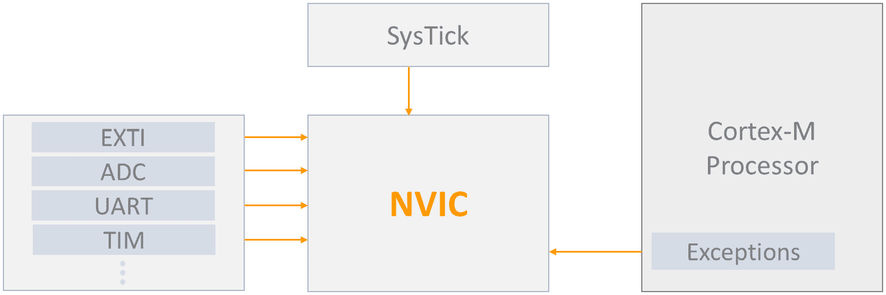

# 外部中断和事件（EXTI）

在本章中，我们将学习关于中断及其在嵌入式系统开发中的关键作用。中断对于创建响应迅速且高效的固件至关重要，它允许微控制器有效地处理实时事件。通过理解中断，你可以开发出能够迅速对外部刺激做出反应的系统，使你的嵌入式应用更加健壮和多功能。

我们将首先探讨中断在固件中的基本作用，通过与异常进行对比来突出它们独特的目的和处理机制。随后，我们将深入研究**中断服务例程**（**ISR**）、**中断向量表**（**IVT**）和**嵌套向量中断控制器**（**NVIC**）的细节，这些共同构成了 Arm Cortex-M 微控制器中断处理的核心。

接下来，我们将专注于 STM32 **外部中断**（**EXTI**）控制器，这是在 STM32 微控制器中管理外部中断的一个基本外围设备。我们将检查 EXTI 控制器的关键特性和寄存器，学习如何配置和利用它来满足各种应用需求。

最后，我们将通过开发 EXTI 驱动程序来应用这些知识，为你提供实现中断驱动固件的实践经验。这种动手方法将巩固你的理解，并使你能够创建响应迅速、基于中断的系统。

在本章中，我们将涵盖以下主要内容：

+   中断及其在固件中的作用

+   STM32 EXTI 控制器

+   开发 EXTI 驱动程序

到本章结束时，你将全面理解中断以及如何为 STM32 微控制器开发裸机 EXTI 驱动程序，这将使你能够创建响应迅速且高效的嵌入式系统。

# 技术要求

本章的所有代码示例都可以在以下 GitHub 链接中找到：

[`github.com/PacktPublishing/Bare-Metal-Embedded-C-Programming`](https://github.com/PacktPublishing/Bare-Metal-Embedded-C-Programming)

# 中断及其在固件中的作用

中断是嵌入式系统中最重要的机制之一，它允许微控制器有效地对实时事件做出反应。要充分理解它们在固件中的作用，了解中断是什么、它们如何工作以及它们在哪些场景中证明是不可或缺的至关重要。因此，让我们深入探索中断的迷人世界，它们的操作以及它们的实际应用。

## 什么是中断？

想象你正全神贯注地读书，但这时门铃响了。你暂时停止阅读，接待访客，然后回到你的书。微控制器中的中断工作方式类似。它们是暂时停止程序当前执行的信号，以便运行一个称为 ISR 的特殊例程。一旦 ISR 完成，微控制器就会从上次中断的地方恢复其之前的任务。

中断可以由硬件事件触发，例如定时器溢出、按键或通信接口上的数据接收。它们也可以由软件生成，提供了一种灵活的方式来管理外部和内部事件。现在，让我们看看它们是如何工作的。

## 中断是如何工作的？

中断处理的核心是上下文切换的概念。当中断发生时，微控制器保存其当前状态——本质上，是所有重要信息的快照，例如程序计数器和 CPU 寄存器。这允许微控制器暂停当前任务，执行中断服务例程（ISR），然后恢复保存的状态以继续之前中断的地方。这个过程通常遵循以下步骤：

1.  **中断请求**：一个事件触发一个**中断** **请求**（**IRQ**）。

1.  **确认并优先处理**：中断控制器确认请求并根据预定义的级别对其进行优先级排序。

1.  **保存上下文**：CPU 保存其当前的执行上下文。

1.  **向量检索**：CPU 从中断向量表（IVT）中检索 ISR 的地址。

1.  **ISR 执行**：ISR 运行以处理中断。

1.  **恢复上下文**：在 ISR 完成后，CPU 恢复保存的上下文。

1.  **恢复执行**：CPU 恢复中断的任务。

你可能会想知道为什么中断很重要。让我们来了解一下。

## 中断在固件中的重要性

中断对于创建高效和响应灵敏的嵌入式系统至关重要。以下是它们之所以如此重要的几个关键原因：

+   **实时响应**：中断允许微控制器对关键事件做出几乎瞬时的反应。例如，在电机控制系统中，一个中断可以立即处理一个表示电机已达到期望位置的传感器信号。

+   **资源优化**：而不是不断轮询事件（这浪费了 CPU 周期和电力），中断允许 CPU 保持低功耗状态或专注于其他任务，直到事件发生。这种优化对于可穿戴设备或远程传感器等电池供电设备至关重要。

+   **优先级和抢占**：中断可以被优先级排序，允许更关键的任务抢占不那么关键的任务。这确保了像工业机械中的紧急停止信号这样的高优先级任务能够立即得到处理。

当讨论中断时，我们经常遇到另一个关键术语：异常。尽管它们有相似之处，但在嵌入式系统中它们有不同的用途。让我们来探讨中断和异常之间的区别。

## 中断与异常的比较

中断是硬件或软件发出的信号，指示需要立即关注的事件。例如，定时器溢出、GPIO 引脚变化和外设数据接收。

如我们之前所学的，中断使嵌入式系统能够处理实时事件，对于响应和高效的系统行为至关重要。当中断发生时，CPU 停止执行主程序，跳转到一个预定义的地址来执行 ISR。

异常是中断正常执行流程的事件，通常是由于除以零操作或访问无效内存地址等错误引起的。虽然与中断类似，但异常通常处理错误条件和系统级事件。

### 中断与异常的区别

下面是两者之间的一些区别：

+   **来源**：中断通常来自外部硬件设备或微控制器内的其他外设，而异常通常是内部 CPU 操作的结果

+   **目的**：中断管理实时事件，而异常处理错误条件和系统异常

+   **处理**：两者都使用 ISR，但异常通常涉及更复杂的错误处理和恢复机制

要正确理解中断的处理方式，我们需要检查涉及到的三个关键组件：NVIC、ISR 和 IVT。

### NVIC、ISR 和 IVT

在 Arm Cortex-M 微控制器（如 STM32 系列）中，NVIC 在管理中断方面发挥着关键作用。让我们来探讨 NVIC 是什么，它是如何工作的，以及为什么它对嵌入式开发如此重要。

#### NVIC

NVIC 是集成到 Arm Cortex-M 微控制器（如 STM32 系列）中的硬件模块，它负责管理中断的优先级和处理。它使微控制器能够快速有效地响应中断，同时允许嵌套中断，其中高优先级的中断可以抢占低优先级的中断。这种能力对于需要及时响应事件的实时应用至关重要。

它的关键特性包括以下内容：

+   **中断优先级**：NVIC 支持多个优先级，允许我们为不同的中断分配不同的优先级。这确保了更关键的任务首先得到处理。

+   **嵌套中断**：NVIC 允许高优先级的中断中断低优先级的中断。这一特性对于保持实时应用中的系统响应性至关重要。

+   **动态优先级调整**：我们可以在运行时动态调整中断的优先级，以适应不断变化的情况。

    *图 14.1* 中的图表说明了 NVIC 及其与微控制器内各种组件的连接。



图 14.1：NVIC

接下来，我们来看 ISR。

#### ISR

在嵌入式系统中处理中断时，ISR（中断服务例程）是谜题的关键部分。ISR 是一个专门的功能，CPU 在响应中断时执行。每个中断都有自己的 ISR。当中断发生时，CPU 暂时停止其当前任务，保存其状态，并跳转到 ISR 预定义的地址（函数）以执行必要的代码。

最后一个关键组件是 IVT（中断向量表）。

#### IVT

当发生中断时，IVT 就像是 CPU 的路线图。它是一个包含所有 ISR 地址的数据结构。每个中断源在这个表中都有一个特定的条目，将其映射到相应的 ISR。当中断被触发时，CPU 会咨询 IVT 以找到与该中断相关联的 ISR 的地址。这种查找确保 CPU 可以快速有效地跳转到正确的代码片段来处理事件。

它的关键特性包括以下内容：

+   `0x00000000`。

+   **ISR 地址**：IVT 中的每个条目都包含一个 ISR 的地址。当中断发生时，CPU 使用 IVT 快速定位并跳转到适当的 ISR。

+   `0`可能用于复位中断，向量号`1`用于**不可屏蔽中断**（NMI），等等。

+   **可配置性**：在许多系统中，IVT 可以在系统初始化期间配置，以指向你的固件中定义的 ISR。

## 比较分析—中断驱动解决方案与基于轮询的解决方案

但当我们不使用中断时会发生什么？让我们通过一些真实的案例研究来探讨使用中断和依赖于轮询的解决方案之间的差异。

### 案例研究 1—按钮去抖动

在嵌入式系统中，处理用户输入，如按钮按下，是一项常见任务。然而，这些输入的管理方式可以显著影响系统的效率和响应性。一个特别的问题是处理“抖动”问题，由于机械按钮的物理特性，它会产生多个快速信号。如果不妥善管理，这可能导致错误的读取和不规则的行为。在本案例研究中，我们将探讨两种处理按钮去抖动的方法：一种不使用中断，另一种使用中断。

我们将从不使用中断的方法开始。

想象一下，你有一个简单的用户界面，其中有一个按钮，当按下时，会切换 LED 的状态。在没有中断的情况下，最直接的方法是在主循环中持续检查（或“轮询”）按钮的状态。这涉及到反复读取按钮的输入引脚，以查看它是否从高电平变为低电平，指示按下。问题在于，机械按钮由于物理抖动可能会产生虚假信号，导致对单个按下的多次检测。为了处理这个问题，你需要在检测到按下后添加一个延迟，有效地忽略一段时间的进一步信号。

存在一些缺点：

+   **低效**：CPU 不断忙于检查按钮状态，浪费了本可以用于其他任务的有价值的处理时间。

+   **延迟响应**：添加延迟以处理去抖动意味着系统可能在等待按钮稳定时错过其他重要任务。

让我们看看使用中断的方法。

使用中断，您可以将按钮引脚配置为在下降沿（按钮被按下时）产生中断。当按钮被按下时，ISR 会立即触发，处理去抖动逻辑。主循环保持空闲，可以执行其他任务，无需不断轮询按钮。

有几个好处：

+   **效率**：CPU 可以专注于其他任务，并在必要时才响应按钮按下。

+   **即时响应**：ISR 立即对按钮按下做出响应，使系统更具响应性。

### 案例研究 2—传感器数据获取

在嵌入式系统中，另一个常见任务是获取传感器数据，特别是在气象站等应用中，多个传感器持续监控环境条件。处理传感器数据获取的方法可以极大地影响系统的复杂性和效率。让我们比较两种方法：一种不使用中断，另一种利用中断来优化过程。

我们将从不使用中断的方法开始。

考虑一个气象站，它定期从各种传感器（如温度、湿度和压力）读取数据。如果没有使用中断，主循环将包括定期从每个传感器读取数据的代码。这可以通过定时器来实现，在读取之间创建延迟，确保数据在正确的间隔内获取。

有几个缺点：

+   **复杂性**：使用轮询管理多个传感器并精确计时可能导致主循环复杂化。

+   **低效**：主循环可能会花费大量时间等待定时器到期——再次，浪费 CPU 资源。

让我们看看使用中断的方法。

使用中断，每个传感器可以在新数据可用时触发中断。每个传感器的 ISR 读取数据并将其存储在缓冲区中，供主循环稍后处理。这种方法将数据获取与主循环解耦，允许它专注于数据处理和其他任务。

有几个好处：

+   **简化代码**：主循环更简洁，更容易管理，因为它不需要直接处理定时和传感器轮询。

+   **资源效率**：CPU 花费更少的时间等待，更多的时间处理，从而更有效地利用资源。

### 案例研究 3—通信协议

现在，让我们看看中断如何改善通信。在许多嵌入式系统中，微控制器与外部设备之间的有效通信至关重要，无论您是处理传感器、显示器还是其他外围设备。您采取的数据传输和接收管理方法会对您的系统性能产生重大影响，尤其是在 CPU 负载和延迟方面。让我们分析两种处理通过 **通用异步收发器/传输器**（**UART**）通信的方法：一种不使用中断，另一种利用中断来优化过程。

我们将从不使用中断的方法开始。

让我们看看这样一个场景：一个微控制器通过 UART 与另一个设备通信。如果没有中断，固件将不断检查 UART 状态寄存器，以查看是否有新数据到达或发送器是否准备好发送数据。这种轮询方法确保不会错过任何数据，但它可能会非常占用 CPU 资源。

有几个缺点：

+   **资源效率**：连续轮询使 CPU 忙碌，留给其他任务的处理器资源更少

+   **延迟**：数据到达和处理之间的时间取决于 UART 状态检查的频率

让我们看看使用中断的方法。

启用 UART 中断允许微控制器自动处理数据接收和传输事件。当新数据到达时，会触发一个中断，ISR 读取数据并处理它。同样，当发送器准备好时，另一个中断可以处理发送数据。

有几个好处：

+   **低 CPU 负载**：CPU 可以执行其他任务，仅在必要时处理 UART 事件

+   **实时处理**：数据到达后立即处理，减少延迟并提高通信效率

中断为嵌入式系统中实时事件的处理提供了一种强大而高效的方法。与轮询方法相比，中断在响应性、效率和代码简单性方面提供了显著的好处。通过理解和利用中断，您可以开发出更健壮、更高效的固件，能够处理各种实时应用。无论是管理用户输入、获取传感器数据、处理通信协议还是保持精确的时间控制，中断都是不可或缺的工具。

在下一节中，我们将探讨 STM32 EXTI 控制器外设。

# STM32 EXTI 控制器

STM32 微控制器中的 EXTI 模块旨在管理外部中断线。这些线可以被 GPIO 引脚上的信号触发，使您的微控制器能够快速有效地对外部环境的变化做出反应。

EXTI 控制器配备了一系列功能，增强了其在嵌入式系统中的灵活性和实用性。让我们详细探讨这些功能，并了解它们的实际应用。

## EXTI 的关键特性

这里是 EXTI 模块的关键特性，使其成为 STM32 微控制器中管理外部和内部事件的灵活且强大的工具：

+   提供多达 23 个独立的中断/事件线，其中最多 16 个来自 GPIO 引脚，其余来自内部信号

+   每条线都可以独立配置为中断或事件

+   每条线的边缘检测选项：上升沿、下降沿或两者都检测

+   每条线都有专用的状态标志来指示挂起的中断/事件

+   生成软件中断/事件的能力

事件寄存器通过设置对应的状态标志位来表示发生了某些事件，但不触发中断或执行任何代码（ISR）。

例如，事件可以用来在没有执行 ISR 的情况下唤醒系统。

要使用 EXTI 生成中断，我们需要正确配置和启用中断线。这涉及到编程触发寄存器以检测所需的边缘（上升沿、下降沿或两者），并通过在中断屏蔽寄存器中设置适当的位来启用 IRQ。当检测到外部中断线上指定的边缘时，将生成一个 IRQ，并设置相应的挂起位。必须通过在挂起寄存器中写入*1*来清除此挂起位。

要生成事件，我们只需通过设置适当的触发寄存器和在事件屏蔽寄存器中启用相应的位来配置事件线。

我们还可以通过写入*1*到软件中断/事件寄存器（EXTI_SWIER）来通过软件生成中断/事件。

将线路配置为中断源涉及三个步骤：

1.  **配置屏蔽位**：使用**中断屏蔽寄存器**（**EXTI_IMR**）设置 23 个中断线的屏蔽位。

1.  **配置触发选择位**：使用**上升沿触发选择寄存器**（**EXTI_RTSR**）和**下降沿触发选择寄存器**（**EXTI_FTSR**）来设置中断线的期望触发条件。

1.  **启用 NVIC 中断通道**：在这里，我们只需配置控制映射到 EXTI 的 NVIC 中断通道的**启用**和**屏蔽**位。

在我们开发 EXTI 驱动程序之前，让我们首先了解 EXTI 线是如何映射到 GPIO 引脚上的。

## 外部中断/事件线映射

EXTI 控制器可以将多达 81 个 GPIO（在 STM32F411xC/E 系列中）连接到 16 个外部中断/事件线上。GPIO 引脚通过 SYSCFG_EXTICR 寄存器映射到 EXTI 线上。

### GPIO 引脚和 EXTI 线

STM32 微控制器上的每个 GPIO 引脚都可以连接到 EXTI 线，允许它生成外部中断。这种灵活性意味着您可以启用任何 GPIO 引脚的中断，但有一个限制：多个引脚共享相同的 EXTI 线。这种共享基于引脚号，而不是端口。

下面是如何连接引脚的分解：

+   每个端口的第 0 个引脚连接到 EXTI0_IRQ

+   每个端口的第 1 个引脚连接到 EXTI1_IRQ

+   每个端口的第 2 个引脚连接到 EXTI2_IRQ

+   每个端口的第 3 个引脚连接到 EXTI3_IRQ

+   等等...

这种映射意味着不同端口的相同编号引脚共享相同的 EXTI 线。例如，PA0、PB0、PC0、PD0、PE0 和 PH0 都连接到 EXTI0。

重要提示

**共享 EXTI 线**：由于多个引脚共享相同的 EXTI 线，因此您不能同时在不同端口的相同编号的引脚上启用中断。例如，如果您在 PB0 上启用中断，则不能同时也在 PA0 上启用中断，因为这两个引脚都共享 EXTI0。

**在 SYSCFG_EXTICR 中的配置**：SYSCFG 外部中断配置寄存器（EXTICRs）用于选择哪个端口的引脚将连接到特定的 EXTI 线。这种选择确保了只有一个端口的引脚可以作为给定 EXTI 线的源。

# 开发 EXTI 驱动程序

STM32 EXTI 模块依赖于几个关键寄存器来配置其操作。这些寄存器允许您设置触发条件、启用中断和管理挂起的中断请求。理解这些寄存器对于在嵌入式项目中有效地使用 EXTI 模块至关重要。

## EXTI_IMR

我们使用 EXTI_IMR 来启用或禁用每个 EXTI 线上的中断。

该寄存器中的位命名为 `x` = `0` 到 `22`)。将位设置为 `1` 解除中断线的屏蔽，允许它生成中断请求。相反，将其设置为 `0` 屏蔽线，防止它生成中断。

## EXTI_RTSR

EXTI_RTSR 配置每个 EXTI 线的上升沿触发。当检测到配置在此寄存器中的线上有上升沿时，它可以生成中断或事件。

该寄存器中的位命名为 `x` = `0` 到 `22`)。将位设置为 `1` 配置线在上升沿触发。

## EXTI_FTSR

EXTI_FTSR 用于配置每个 EXTI 线的下降沿触发。当检测到设置在此寄存器中的线上有下降沿时，它可以生成中断或事件。

该寄存器中的位命名为 `x` = `0` 到 `22`)。将位设置为 `1` 配置线在下降沿触发。

## 待处理寄存器 (EXTI_PR)

EXTI_PR 指示哪些 EXTI 线有挂起的中断请求。此寄存器还用于通过向适当的位写入 `1` 来清除挂起的中断。

该寄存器中的位命名为 `x` = `0` 到 `22`)。设置为 `1` 的位表示挂起的中断请求。向该位写入 `1` 清除挂起请求。

让我们配置 PC13 为 EXTI 引脚。

## EXTI 驱动程序

在您的 IDE 中创建您之前项目的副本，并将此复制的项目重命名为 `EXTI`。接下来，在 `Src` 文件夹中创建一个名为 `gpio_exti.c` 的新文件，并在 `Inc` 文件夹中创建一个名为 `gpio_exti.h` 的新文件。

用以下代码填充 `gpio_exti.c`：

```cpp
#include "gpio_exti.h"
#define GPIOCEN            (1U<<2)
#define SYSCFGEN        (1U<<14)
void pc13_exti_init(void)
{
    /*Disable global interrupts*/
    __disable_irq();
    /*Enable clock access for GPIOC*/
    RCC->AHB1ENR |=GPIOCEN;
    /*Set PC13 as input*/
    GPIOC->MODER &=~(1U<<26);
    GPIOC->MODER &=~(1U<<27);
    /*Enable clock access to SYSCFG*/
    RCC->APB2ENR |=SYSCFGEN;
    /*Select PORTC for EXTI13*/
    SYSCFG->EXTICR[3] |=(1U<<5);
    /*Unmask EXTI13*/
    EXTI->IMR |=(1U<<13);
    /*Select falling edge trigger*/
    EXTI->FTSR |=(1U<<13);
    /*Enable EXTI13 line in NVIC*/
    NVIC_EnableIRQ(EXTI15_10_IRQn);
    /*Enable global interrupts*/
    __enable_irq();
}
```

让我们分解 `pc13_exti_init` 函数中的每个步骤：

```cpp
__disable_irq();
```

这行代码禁用全局中断以确保配置过程不被中断，这对于保持一致性并避免竞争条件至关重要。

```cpp
RCC->AHB1ENR |= GPIOCEN;
```

这行代码通过在`AHB1`外设时钟使能寄存器（`AHB1ENR`）中设置适当的位来启用 GPIOC 的时钟。

```cpp
GPIOC->MODER &= ~(1U<<26);
GPIOC->MODER &= ~(1U<<27);
```

这几行代码通过清除 GPIO 模式寄存器（`MODER`）中适当的位来配置引脚`PC13`为输入。

```cpp
RCC->APB2ENR |= SYSCFGEN;
```

这行代码通过在`APB2`外设时钟使能寄存器（`APB2ENR`）中设置适当的位来启用`SYSCFG`的时钟。`SYSCFG`对于配置 EXTI 线映射到适当的 GPIO 引脚是必需的。

```cpp
SYSCFG->EXTICR[3] |= (1U<<5);
```

这行代码配置`SYSCFG`外部中断配置寄存器，将 EXTI 线 13 映射到`PORTC`。`EXTICR[3]`寄存器控制 EXTI 线 12 到 15，设置正确的位确保`EXTI13`连接到`PC13`。

```cpp
EXTI->IMR |= (1U<<13);
```

这行代码通过在中断屏蔽寄存器（`IMR`）中设置适当的位取消屏蔽 EXTI 线 13。取消屏蔽该线允许它生成中断请求。

```cpp
EXTI->FTSR |= (1U<<13);
```

这行代码通过在 FTSR 中设置适当的位将 EXTI 线 13 设置为下降沿触发。这种配置对于检测信号从高到低的转换至关重要。

```cpp
NVIC_EnableIRQ(EXTI15_10_IRQn);
```

这行代码在 NVIC 中启用`EXTI15_10`中断线。EXTI 线 10 到 15 在 NVIC 中共享一个 IRQ，启用它允许微控制器处理这些线的中断。

```cpp
__enable_irq();
```

这行代码在配置完成后重新启用全局中断，允许微控制器响应中断。

我们接下来的任务是填充`gpio_exti.h`文件。

这里是代码：

```cpp
#ifndef  GPIO_EXTI_H__
#define GPIO_EXTI_H__
#include <stdint.h>
#include "stm32f4xx.h"
#define   LINE13        (1U<<13)
void pc13_exti_init(void);
main.c file:

```

#include <stdio.h>

#include "adc.h"

#include "uart.h"

#include "gpio.h"

#include "gpio_exti.h"

uint8_t g_btn_press;

int main(void)

{

/*初始化调试 UART*/

uart_init();

/*初始化 LED*/

led_init();

/*初始化 EXTI*/

pc13_exti_init();

while(1)

{

}

}

static void exti_callback(void)

{

printf("BTN Pressed...\n\r");

led_toggle();

}

void EXTI15_10_IRQHandler(void) {

if((EXTI->PR & LINE13)!=0)

{

/*清除 PR 标志*/

EXTI->PR |=LINE13;

//执行某些操作...

exti_callback();

}

}

```cpp

			Let’s break down the code:

				*   The main function initializes the system components and then enters an infinite loop.
				*   The `exti_callback` function is called when the external interrupt occurs.
				*   `EXTI15_10_IRQHandler` handles interrupts for EXTI lines 10 to 15, including line 13 (`PC13`)

```

if((EXTI->PR & LINE13) != 0)

```cpp

			The preceding line checks whether the pending bit for EXTI line 13 is set, indicating an interrupt has occurred.

```

EXTI->PR |= LINE13;

```cpp

			The preceding line clears the pending bit by writing a `1` to it, acknowledging the interrupt, and allowing it to be processed again.

```

exti_callback();

```cpp

			This calls the `exti_callback` function to handle the interrupt, which, in our case, prints a message and toggles the LED.
			To test on the microcontroller, simply build the project and run it. To generate the EXTI interrupt, press the blue push button.
			Open RealTerm and configure the appropriate port and baud rate to view the printed message that confirms the EXTI interrupts occur when the blue push button is pressed.
			Summary
			In this chapter, we learned about the important role of interrupts in embedded systems development. Interrupts are essential for creating responsive and efficient firmware, allowing microcontrollers to handle real-time events effectively. By mastering the concepts of interrupts, you can develop systems that react promptly to external stimuli, enhancing the robustness and versatility of your embedded applications.
			We started by exploring the fundamental role of interrupts in firmware, comparing them with exceptions to highlight their unique purposes and handling mechanisms. We then examined the specifics of the ISR, the IVT, and the NVIC, which together form the backbone of interrupt handling in Arm Cortex-M microcontrollers.
			Next, we focused on the STM32 EXTI controller, a vital peripheral for managing external interrupts in STM32 microcontrollers. We discussed the key features and registers of the EXTI, and how to configure and utilize it for various applications.
			Finally, we applied this knowledge by developing an EXTI driver, providing practical experience in implementing interrupt-driven firmware.
			In the next chapter, we will learn about the **Realtime Clock** (**RTC**) peripheral.

```
