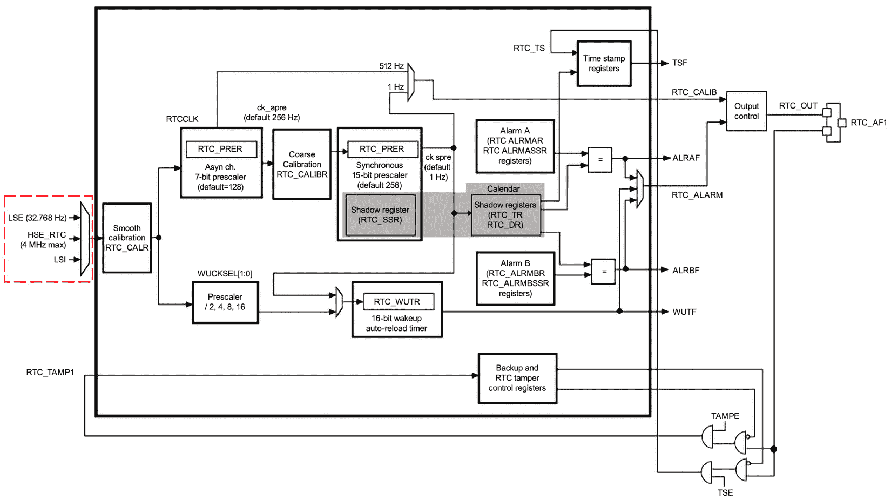
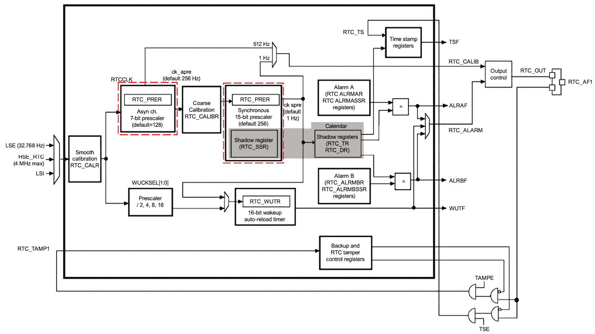
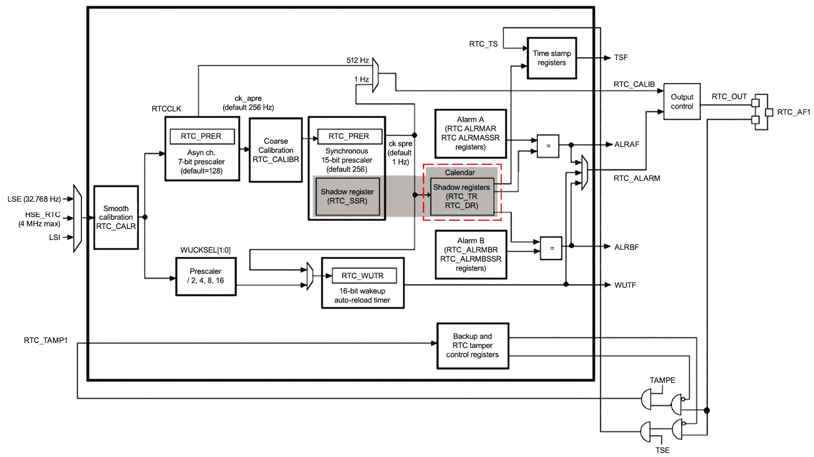
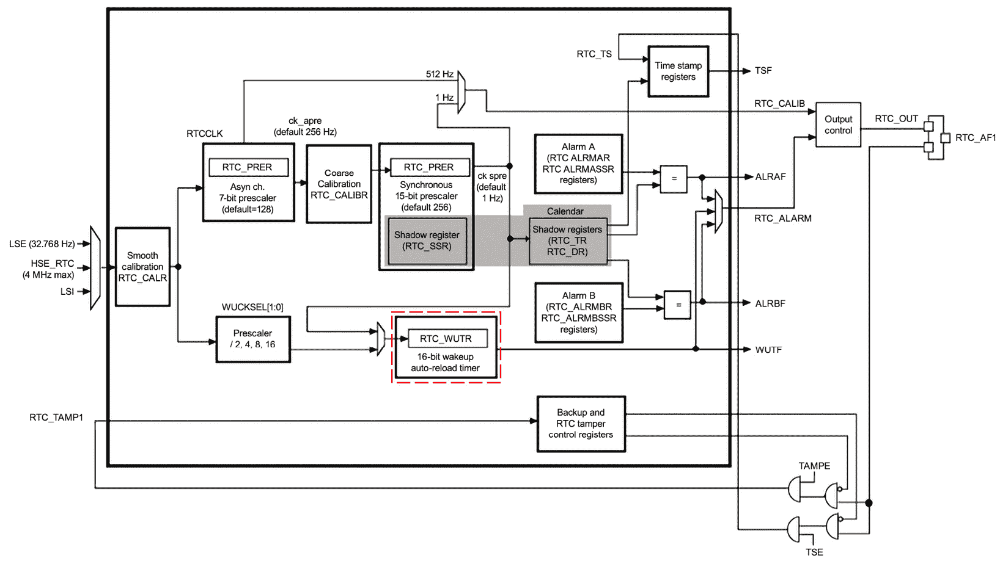
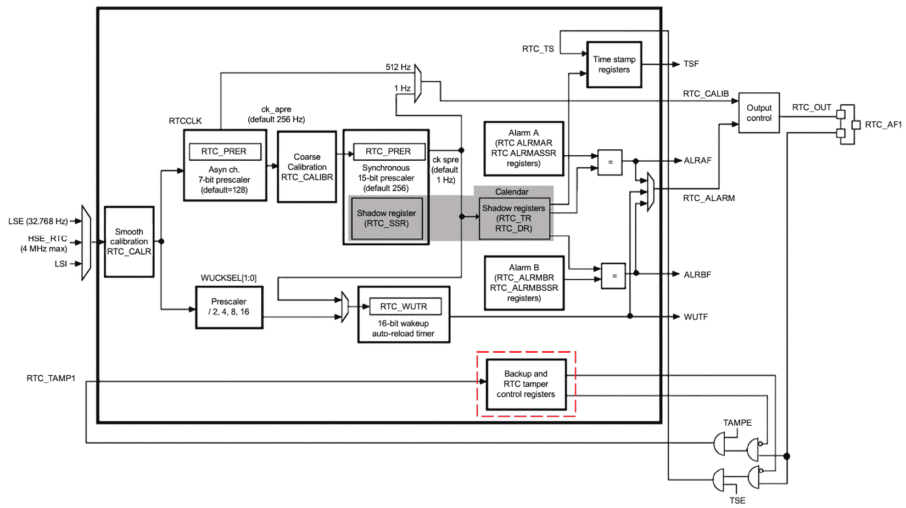
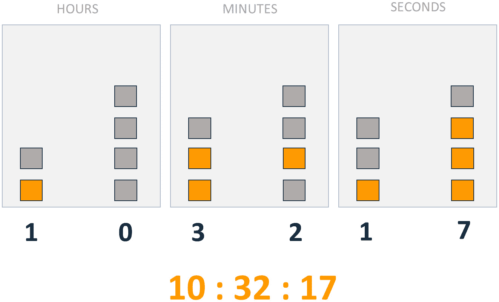
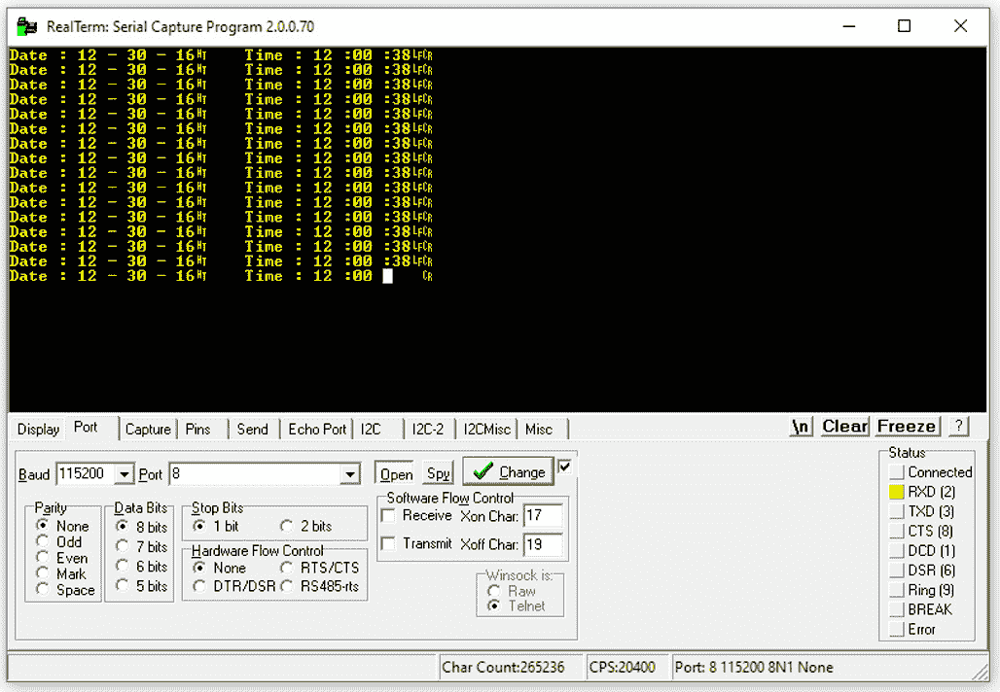

# 实时时钟（RTC）

在本章中，我们将探讨实时时钟（RTC）外设，这是嵌入式系统中时间维护的关键组件。这个外设在需要精确时间和日期维护的应用中至关重要，对于广泛的嵌入式应用来说是基本的。

我们将首先介绍 RTC 及其工作原理。随后，我们将深入研究 STM32 RTC 模块，检查其特性和功能。接下来，我们将分析 STM32 参考手册中的相关寄存器，提供对 RTC 配置和操作的详细理解。最后，我们将应用这些知识来开发 RTC 驱动程序，使您能够在嵌入式项目中实现精确的时间维护。

在本章中，我们将涵盖以下主要内容：

+   理解 RTC

+   STM32 RTC 模块

+   一些关键的 RTC 寄存器

+   开发 RTC 驱动程序

到本章结束时，您将对 RTC 的工作原理有一个扎实的理解，并具备开发裸机 RTC 驱动程序的能力，这将使您能够在嵌入式系统项目中实现精确的时间维护。

# 技术要求

本章的所有代码示例都可以在 GitHub 上找到，网址为[`github.com/PacktPublishing/Bare-Metal-Embedded-C-Programming`](https://github.com/PacktPublishing/Bare-Metal-Embedded-C-Programming)。

# 理解 RTC

在本节中，我们将进入 RTC 的世界，了解它们是什么以及它们是如何工作的，然后通过几个有趣的案例研究来探索常见的用例。让我们开始吧！

RTC 是许多微控制器和嵌入式系统中发现的专用硬件设备。它们的主要功能是在主电源关闭时跟踪当前的时间和日期。想象一下，它们就像是数字世界中的小时间守护者，确保时钟无论发生什么都不会停止滴答。 

RTCs 在需要精确时间维护的应用中至关重要。这包括从简单的闹钟到复杂的数据记录系统，在这些系统中，精确的时间戳是必要的。当主系统断电时，RTC 会继续在小型电池上运行，保持准确的时间和日期信息。让我们看看它们是如何工作的。

## RTC 是如何工作的？

RTC 的核心是一个晶振，它提供稳定的时钟信号。这个振荡器通常运行在**32.768 kHz**，这个频率之所以被选择，是因为它很容易被 2 的幂次整除，这使得它对二进制计数非常方便。

下面是一个简化的 RTC 工作原理分解：

+   **晶振**：RTC 包含一个晶振，它产生精确的时钟信号。

+   **计数器**：这个时钟信号驱动一个计数器。计数器以振荡器频率确定的速率递增。

+   **时间和日期寄存器**：计数器的值用于更新时间和日期寄存器，这些寄存器存储当前时间（小时、分钟、秒）和日期（日、月、年）。

+   **电池备份**：为确保连续运行，RTCs 通常具有电池备份。即使在主电源关闭时，这也使振荡器保持运行，计数器保持活跃。

让我们考虑一些 RTC 的常见用途。

## RTCs 的常见用途

RTCs 非常灵活，被广泛应用于各种应用。让我们通过几个案例研究来探索一些常见的用途。

#### 案例研究 1 – 数据记录

RTCs 最常见的一种应用是在数据记录中。想象一下，你正在设计一个收集温度、湿度和压力数据的气象站。准确的时间戳对于分析随时间变化趋势和模式至关重要。以下是 RTCs 在这个场景中发挥关键作用的方式：

+   **初始化**：RTCs 被初始化并设置为当前时间和日期

+   **数据收集**：每次读取传感器数据时，RTCs 都提供时间戳

+   **存储**：传感器数据以及时间戳存储在内存中

+   **分析**：当数据被检索用于分析时，时间戳确保每个读数可以准确地放置在时间线上

在这种情况下，RTCs 确保每条数据都准确标记了时间戳，这使得可以精确跟踪变化和趋势。

#### 案例研究 2 – 闹钟

实时时钟（RTCs）在设计闹钟时也非常基本。无论是简单的床头闹钟还是复杂的调度系统，RTCs 都提供了在正确时刻触发事件所需的精确计时功能。让我们看看一个典型的闹钟场景：

+   **计时**：RTCs 跟踪当前时间，持续更新时间寄存器。

+   **闹钟设置**：用户为特定时间设置闹钟。此信息存储在 RTCs 的闹钟寄存器中。

+   **闹钟触发**：当 RTCs 的时间与闹钟时间匹配时，会触发中断，激活闹钟机制（如发出蜂鸣声或打开灯光）。

在这种情况下，RTCs 确保闹钟在用户设置的精确时间响起，使其成为可靠基于时间的警报的必要组件。此时，你可能会问，“*RTCs 有什么特别之处吗？*”

### 为什么 RTCs 很重要？

你可能想知道为什么我们不能仅仅使用系统时钟或通用定时器进行计时。答案在于 RTCs 即使在主系统断电时也能保持准确的时间，以下是 RTC 不可或缺的一些关键原因：

+   **准确性**：RTCs 使用晶振振荡器，提供高度准确的时间计时

+   **低功耗**：RTCs 设计为在非常低的功耗下运行，通常可以在小型电池上运行数年

+   **电池备份**：由于电池备份，RTCs 即使在主电源关闭时也能继续计时

+   **独立于主系统**：RTCs 独立于主微控制器运行，确保连续计时

通过了解 RTC 的工作原理及其常见用例，我们可以欣赏它们的重要性，并有效地将它们纳入我们的嵌入式项目中。无论您是在构建一个简单的闹钟还是一个复杂的数据记录系统，RTC 都是一个重要的组件，确保您的系统始终知道正确的时间。在下一节中，我们将探讨 STM32F4 微控制器中的 RTC 外设。

# STM32 RTC 模块

在本节中，我们将探讨 STM32F4 微控制器系列中的 RTC 模块。让我们首先看看它的功能。

## STM32F4 RTC 模块的主要功能

STM32F4 RTC 模块就像计时领域的瑞士军刀，提供了一组丰富的功能，旨在满足众多应用的需求。以下是一些突出的功能：

+   **带有秒级的日历**：RTC 模块不仅跟踪小时、分钟和秒，还保持秒级精度。这对于需要精确时间测量的应用特别有用。

+   **闹钟功能**：想象一下，您在微控制器内部有两个闹钟。STM32F4 RTC 模块提供了两个可编程的闹钟，**闹钟 A**和**闹钟 B**，可以在特定时间触发事件。这对于需要定期执行或在一天中的特定时间执行的任务来说非常完美。

+   **低功耗**：RTC 模块最大的优点之一是其低功耗。这使得它非常适合电池供电的设备，在这些设备中，节省电力至关重要。

+   **备份域**：RTC 可以通过备用电池独立于主电源运行。这意味着即使您的设备断电，RTC 也会继续运行，保持准确的时间。

+   **夏令时**：使用 RTC 模块，您可以自动编程夏令时的调整。不再需要每年手动重置两次！

+   **自动唤醒**：RTC 可以生成周期性唤醒信号，在预设间隔将您的系统从低功耗模式唤醒。对于需要定期检查或更新的应用，这个特性非常有价值。

+   **篡改检测**：对于许多应用来说，安全性是一个关键方面，RTC 模块通过篡改检测为您提供了保障。它可以记录篡改事件，为您的系统提供额外的安全层。

+   **数字校准**：在计时方面，精度是王道。RTC 模块包括数字校准功能，以补偿晶振频率的偏差，确保您的计时保持精确无误。

+   **与外部时钟同步**：为了提高精度，RTC 可以与外部时钟源同步。这对于需要长时间内保持非常高精度的应用来说非常棒。

现在，让我们分析 STM32F4 RTC 模块的一些关键组件。

## STM32F4 RTC 模块的关键组件

让我们更详细地看看 STM32F4 微控制器系列中 RTC 模块的关键组件。我们将逐个分析每个部分，了解它们如何协同工作以提供准确的时间保持和多功能性，从时钟源开始。

### 时钟源

RTC 模块的驱动器是其时钟源。*图 15*.*1*展示了 RTC 模块的详细框图，突出了 RTC 时钟源。此图来自参考手册，提供了 RTC 模块中各种组件及其相互作用的清晰视觉表示：



图 15.1：RTC 模块框图，突出显示时钟源

STM32F4 RTC 可以使用多个时钟源：

+   **低速外部（LSE）**：一个 32.768 kHz 的晶体振荡器，以其稳定性和低功耗而闻名。这通常是用于精确时间保持的首选时钟源。

+   **低速内部（LSI）**：一个内部 RC 振荡器，当外部晶体不可用时提供一种不太精确但方便的选项。

+   **高速外部（HSI）**：一个高速时钟源，虽然可以使用，但由于其较高的功耗，在 RTC 应用中不太常见。

选定的时钟源输入到 RTC 的预分频器，预分频器负责将时钟频率分频到适合时间保持的合适水平：



图 15.2：RTC 模块框图 – 异步和同步预分频器

### 预分频器

RTC 模块采用两种类型的预分频器：

+   **异步预分频器**：此预分频器通常设置为除以**128**，降低时钟频率到一个较低的水平，可以被同步预分频器管理。它有助于平衡功耗和精度。

+   **同步预分频器**：通常配置为除以**256**，此预分频器进一步降低时钟频率以生成精确的**1 Hz 时钟**，这对于准确更新时间和日期寄存器至关重要。

这些预分频器确保 RTC 可以高效运行，提供必要的时间保持精度同时节省功耗。接下来，我们有时间和日期寄存器。

### 时间和日期寄存器

*图 15*.*3*突出了 RTC 模块的时间和日期寄存器：



图 15.3：RTC 模块框图 – 时间和日期寄存器

RTC 的核心功能在于时间和日期寄存器：

+   **时间寄存器（RTC_TR）**：此寄存器以二进制编码十进制（BCD）格式存储当前的小时、分钟和秒。它由预分频器的 1 Hz 时钟每秒更新。

+   **日期寄存器（RTC_DR）**：此寄存器维护当前的日期，包括年、月和日，也以 BCD 格式存储。

这些寄存器对于维护准确的时间和日期信息至关重要，可以根据需要读取和调整。下一个关键组件是 RTC 报警。

### 报警

RTC 模块具有两个可编程报警，报警 A 和报警 B。这些报警可以设置为在特定时间触发，为任务调度提供强大的工具：

+   `RTC_ALRMAR`和`RTC_ALRMBR`用于存储报警时间和日期。

+   **中断**：当报警被触发时，它可以生成中断，从低功耗状态唤醒微控制器或启动特定功能。

报警模块在以下图中表示：


图 15.4：RTC 模块框图 – 报警

接下来，我们讨论唤醒定时器。

### 唤醒定时器

RTC 模块的另一个关键特性是唤醒定时器，它由`RTC_WUTR`寄存器管理：



图 15.5：RTC 模块框图 – 唤醒定时器

这个**16 位**自动重载定时器可以生成周期性唤醒事件，定期将系统从低功耗模式唤醒。它非常适合传感器读取或系统检查等任务，确保高效节能。

还有篡改检测模块。让我们看看。

### 篡改检测

安全性是许多应用的一个关键方面，RTC 模块包括篡改检测功能。当检测到篡改尝试时，篡改检测电路可以使用时间戳寄存器记录确切的时间和日期，从而增加一个额外的安全层，特别是在需要可靠的时间记录和事件记录的应用中。接下来，我们讨论校准寄存器功能。

### 校准和同步

为了保持高精度，RTC 模块包括校准功能：

+   `RTC_CALR`寄存器允许对时钟频率进行精细调整，以补偿晶振的任何偏差

+   **外部时钟同步**：RTC 可以与外部时钟源同步，通过定期调整内部时钟以匹配外部参考来提高精度

这些功能确保 RTC 即使在不同的环境条件下也能保持精确的时间记录。我们还有备份和控制寄存器模块。

### 备份和控制寄存器

RTC 模块包括几个备份和控制寄存器：

+   **备份寄存器**：这些寄存器存储必须保留的关键数据，即使在主电源关闭时也是如此

+   `RTC_CR`寄存器用于管理 RTC 的配置和操作，包括启用时钟、设置报警和配置唤醒事件

备份和控制寄存器模块在以下图中表示：



图 15.6：RTC 模块框图 – 备份和控制寄存器

最后，是输出控制块。

### 输出控制

RTC 模块可以通过 `RTC_AF1` 引脚输出特定信号，例如校准时钟或闹钟输出。这使得 RTC 模块能够与其他组件或系统交互，提供同步信号或触发外部事件。

在下一节中，我们将分析一些配置 RTC 外设的关键寄存器。

# 一些关键的 RTC 寄存器

在本节中，我们将探讨 RTC 模块中一些重要寄存器的特性和功能。这些寄存器是构建块，使我们能够有效地配置、控制和利用 RTC 的功能。让我们从 `RTC_TR`）开始。

## RTC 时间寄存器 (RTC_TR)

`RTC_TR` 寄存器负责跟踪当前时间。它以 BCD 格式维护小时、分钟和秒，确保时间易于阅读和操作。以下是该寄存器中的一些关键字段：

+   **小时十位 (HT) 和小时个位 (HU)**：这些位分别代表小时的十位和个位。它们可以处理 **24 小时** 和 **12 小时** 格式。

+   **分钟十位 (MNT) 和分钟个位 (MNU)**：这些位代表分钟的十位和个位。

+   **秒十位 (ST) 和秒个位 (SU)**：这些位代表秒的十位和个位。

+   **PM**：此位在 **12 小时** 格式下指示 **AM/PM** 标记。

关于此寄存器的更多信息可以在 *参考手册* 的 *第 450 页* 找到。让我们继续到 `RTC_DR`）。

## RTC 日期寄存器 (RTC_DR)

`RTC_DR` 寄存器负责维护当前日期。它跟踪年份、月份、月份中的日期和星期几，所有这些都在 BCD 格式下。

以下是该寄存器中的关键字段：

+   **年份十位 (YT) 和年份个位 YU)**：这些位代表年份的十位和个位

+   **月份十位 (MT) 和月份个位 (MU)**：这些位代表月份的十位和个位

+   **日期十位 (DT) 和日期个位 (DU)**：这些位代表月份中的日期的十位和个位

+   **星期几个位 (WDU)**：此位代表星期几（1 到 7）

你可以在 *参考手册* 的 *第 451 页* 上了解更多关于此寄存器的信息。下一个关键寄存器是 `RTC_CR`）。

## RTC 控制寄存器 (RTC_CR)

`RTC_CR` 寄存器是我们控制 RTC 的各种操作模式和功能的地方。此寄存器允许我们启用 RTC、配置闹钟和设置唤醒定时器。

让我们考虑这个寄存器中的关键位：

+   **WUTE**：启用唤醒定时器。此位启用 RTC 唤醒定时器。

+   **TSE**：启用时间戳事件。此位启用事件的标记。

+   **ALRAE 和 ALRBE**：启用闹钟 A 和闹钟 B。这些位启用相应的闹钟。

+   **DCE**：启用数字校准。此位启用 RTC 时钟的数字校准。

+   **FMT**：小时格式。此位将小时格式设置为 24 小时或 12 小时（AM/PM）。

更多关于此寄存器的详细信息可以在 *参考手册的第 453 页* 上找到。接下来，我们有 `RTC_ISR`)。

## 实时时钟初始化和状态寄存器 (RTC_ISR)

`RTC_ISR` 寄存器在初始化实时时钟和监控其状态方面发挥着双重作用。在设置过程中以及检查实时时钟当前状态时，此寄存器至关重要。以下是此寄存器中的关键位：

+   **INIT**：初始化模式。设置此位将实时时钟置于初始化模式。

+   **RSF**：寄存器同步标志。此位指示日历寄存器已同步。

+   **INITS**：初始化状态标志。此位指示实时时钟日历是否已初始化。

+   **ALRAF 和 ALRBF**：报警 A 和报警 B 标志。这些位指示是否已触发报警。

接下来，我们有 `RTC_PRER`)。

## 实时时钟预分频器寄存器 (RTC_PRER)

`RTC_PRER` 寄存器管理预分频器，这些预分频器将实时时钟时钟源分频以产生用于精确时间保持的 1 Hz 时钟。此寄存器中有两个关键字段：

+   **PREDIV_A**：异步预分频器。此字段设置异步预分频器的值。

+   **PREDIV_S**：同步预分频器。此字段设置同步预分频器的值。

正确配置 `RTC_PRER` 寄存器对于保持实时时钟的准确性至关重要。

接下来，我们将查看实时时钟报警寄存器，`RTC_ALRMAR` 和 `RTC_ALRMBR`。

## 实时时钟报警寄存器 (RTC_ALRMAR 和 RTC_ALRMBR)

这些寄存器处理报警 A 和 B 的配置。它们允许我们设置报警应触发的特定时间。以下是这些寄存器中的关键字段：

+   **ALRMASK**：报警掩码位。这些位允许您掩码报警时间的某些部分，从而在如何以及何时触发报警方面提供灵活性。

+   **ALRH, ALRMN, 和 ALRS**：小时、分钟和秒字段。这些字段设置报警的具体时间。

`RTC_ALRMAR` 和 `RTC_ALRMBR` 寄存器对于需要可靠基于时间的触发事件的应用至关重要。最后，让我们来探讨 `RTC_WUTR`)。

## 实时时钟唤醒定时器寄存器 (RTC_WUTR)

`RTC_WUTR` 寄存器配置唤醒定时器，使实时时钟能够定期从低功耗模式唤醒系统。此寄存器中的关键字段是 **唤醒自动重载值**（**WUT**）。此字段设置唤醒定时器的间隔。

在下一节中，我们将应用本节学到的所有知识来开发实时时钟外设的驱动程序。

# 开发实时时钟驱动程序

在本节中，我们将开发实时时钟日历驱动程序，以便我们可以配置和跟踪时间和日期。

如往常一样，我们将遵循前面章节中概述的步骤创建我们之前项目的副本。我们将此复制的项目重命名为`RTC_Calendar`。接下来，在`Src`文件夹中创建一个名为`rtc.c`的新文件，并在`Inc`文件夹中创建一个名为`rtc.h`的新文件。RTC 配置可能相当复杂，因此我们将创建几个辅助函数来模块化初始化过程。

## RTC 实现文件

让我们从填充`rtc.c`文件开始，首先是初始化函数所需的辅助函数。以下是我们在 RTC 配置中将要使用的宏定义：

```cpp
#include "rtc.h"
#define PWREN        (1U << 28)
#define CR_DBP       (1U << 8)
#define CSR_LSION    (1U << 0)
#define CSR_LSIRDY   (1U << 1)
#define BDCR_BDRST   (1U << 16)
#define BDCR_RTCEN   (1U << 15)
#define RTC_WRITE_PROTECTION_KEY_1 ((uint8_t)0xCAU)
#define RTC_WRITE_PROTECTION_KEY_2 ((uint8_t)0x53U)
#define RTC_INIT_MASK               0xFFFFFFFFU
#define ISR_INITF                   (1U << 6)
#define WEEKDAY_FRIDAY              ((uint8_t)0x05U)
#define MONTH_DECEMBER              ((uint8_t)0x12U)
#define TIME_FORMAT_PM              (1U << 22)
#define CR_FMT                      (1U << 6)
#define ISR_RSF                     (1U << 5)
#define RTC_ASYNCH_PREDIV           ((uint32_t)0x7F)
#define RTC_SYNCH_PREDIV            ((uint32_t)0x00F9)
```

让我们逐一分析：

+   `PWREN` (`1U << 28`): 此宏通过在 APB1 外设时钟使能寄存器中设置位 28 来启用 PWR 模块的时钟。

+   `CR_DBP` (`1U << 8`): 此函数通过在 PWR 寄存器中设置位 8 来启用对备份域的访问。

+   `CSR_LSION` (`1U << 0`): 此宏通过在时钟控制与状态寄存器中设置位 0 来启用 LSI 振荡器。

+   `CSR_LSIRDY` (`1U << 1`): 此宏用于读取`LSI`寄存器的状态。当`LSI`稳定且准备好使用时，LSIRDY 位被设置为 1。

+   `BDCR_BDRST` (`1U << 16`): 此宏通过在备份域控制寄存器中设置位 16 来强制重置备份域。

+   `BDCR_RTCEN` (`1U << 15`): 通过在备份域控制寄存器中设置位 15 来启用 RTC。

+   `RTC_WRITE_PROTECTION_KEY_1` (`(uint8_t)0xCAU`): 此密钥用于禁用 RTC 寄存器的写保护。

+   `RTC_WRITE_PROTECTION_KEY_2` (`(uint8_t)0x53U`): 这是禁用 RTC 寄存器写保护所需的第二个密钥。

+   `RTC_INIT_MASK` (`0xFFFFFFFFU`): 此掩码用于将 RTC 外设进入初始化模式。

+   `ISR_INITF` (`1U << 6`): `ISR`寄存器中的此位指示 RTC 外设处于初始化模式。

+   `WEEKDAY_FRIDAY` (`(uint8_t)0x05U`): 此宏用于配置日历的星期为星期五。

+   `MONTH_DECEMBER` (`(uint8_t)0x12U`): 此宏用于配置日历的月份为十二月。

+   `TIME_FORMAT_PM` (`1U << 22`): 此宏将 12 小时制中的时间格式设置为下午。

+   `CR_FMT` (`1U << 6`): 此宏在 RTC 控制寄存器（`RTC->CR`）中将小时格式设置为 24 小时格式。

+   `ISR_RSF` (`1U << 5`): `ISR`寄存器中的此位指示 RTC 寄存器已同步。

+   `RTC_ASYNCH_PREDIV` (`(uint32_t)0x7F`): 此值设置 RTC 外设的异步预分频，并用于分频时钟频率。

+   `RTC_SYNCH_PREDIV` (`(uint32_t)0x00F9`): 此值设置 RTC 外设的同步预分频，并用于进一步分频时钟频率以提高时间保持精度。

让我们检查负责设置 RTC 外设预分频值的两个函数。

首先，我们有`rtc_set_asynch_prescaler`：

```cpp
static void rtc_set_asynch_prescaler(uint32_t AsynchPrescaler)
{
  MODIFY_REG(RTC->PRER, RTC_PRER_PREDIV_A, AsynchPrescaler << RTC_
  PRER_PREDIV_A_Pos);
}
```

此函数设置 RTC 外设的异步预分频值。让我们逐一分析：

+   `MODIFY_REG`：此宏修改寄存器中的特定位。它在`stm32f4xx.h`头文件中定义。

+   `RTC->PRER`：RTC 的`PRER`寄存器。

+   `RTC_PRER_PREDIV_A`：`PRER`寄存器中异步预分频器位的掩码。

+   `AsynchPrescaler << RTC_PRER_PREDIV_A_Pos`：此片段将`AsynchPrescaler`值移位到`PRER`寄存器中的正确位置。

简而言之，此函数通过更新`PRER`寄存器中的适当位来配置异步预分频器。接下来，我们有设置同步预分频器的函数——即`rtc_set_synch_prescaler`：

```cpp
static void rtc_set_synch_prescaler(uint32_t SynchPrescaler)
{
  MODIFY_REG(RTC->PRER, RTC_PRER_PREDIV_S, SynchPrescaler);
}
```

此函数通过更新`PRER`寄存器中的适当位来配置同步预分频器：

+   `RTC->PRER`：RTC 的`PRER`寄存器

+   `RTC_PRER_PREDIV_S`：这是`PRER`寄存器中同步预分频器位的掩码

+   `SynchPrescaler`：此直接在`PRER`寄存器中设置同步预分频器值

接下来，我们必须分析其他 RTC 初始化辅助函数，以了解它们如何协同工作来配置和同步 RTC 外设。

首先，我们有`_rtc_enable_init_mode`函数：

```cpp
void _rtc_enable_init_mode(void)
{
    RTC->ISR = RTC_INIT_MASK;
}
```

简而言之，此函数通过将初始化掩码写入`ISR`寄存器来将 RTC 外设设置为初始化模式：

+   `RTC->ISR`：这是 RTC 的`RTC_ISR`寄存器

+   `RTC_INIT_MASK`：此掩码用于进入初始化模式

接下来，我们有`_rtc_disable_init_mode`：

```cpp
void _rtc_disable_init_mode(void)
{
    RTC->ISR = ~RTC_INIT_MASK;
}
```

此函数通过清除 ISR 寄存器中的初始化掩码来禁用初始化模式。在这里，`~RTC_INIT_MASK`清除初始化掩码，退出初始化模式。

下一个辅助函数是`_rtc_isActiveflag_init`：

```cpp
uint8_t _rtc_isActiveflag_init(void)
{
    return ((RTC->ISR & ISR_INITF) == ISR_INITF);
}
```

此函数通过检查`ISR_INITF`位来返回 1，该位指示 RTC 外设处于初始化模式。

接下来，我们有`_rtc_isActiveflag_rs`：

```cpp
uint8_t _rtc_isActiveflag_rs(void)
{
    return ((RTC->ISR & ISR_RSF) == ISR_RSF);
}
```

此函数通过检查`ISR_RSF`位来返回 1，该位指示 RTC 寄存器已同步。

此外，还有`rtc_init_seq`函数：

```cpp
static uint8_t rtc_init_seq(void)
{
    /* Start init mode */
    _rtc_enable_init_mode();
    /* Wait till we are in init mode */
    while (_rtc_isActiveflag_init() != 1) {}
    return 1;
}
```

此函数通过启用初始化模式并等待 RTC 外设进入初始化模式来启动 RTC 初始化：

+   `_rtc_enable_init_mode`：此行将 RTC 外设置于初始化模式

+   `_rtc_isActiveflag_init`：此行等待直到 RTC 外设处于初始化模式

接下来，我们有`wait_for_synchro`函数：

```cpp
static uint8_t wait_for_synchro(void)
{
    /* Clear RSF */
    RTC->ISR &= ~ISR_RSF;
    /* Wait for registers to synchronize */
    while (_rtc_isActiveflag_rs() != 1) {}
    return 1;
}
```

此函数清除同步标志并等待直到 RTC 寄存器同步。

我们还有`exit_init_seq`函数：

```cpp
static uint8_t exit_init_seq(void)
{
    /* Stop init mode */
    _rtc_disable_init_mode();
    /* Wait for registers to synchronize */
    return (wait_for_synchro());
}
```

此函数退出 RTC 初始化模式，并等待寄存器同步，以确保一切设置正确。现在，让我们看看配置日期和时间的函数。

首先，我们有`rtc_date_config`：

```cpp
static void rtc_date_config(uint32_t WeekDay, uint32_t Day, uint32_t Month, uint32_t Year)
{
  register uint32_t temp = 0U;
  temp = (WeekDay << RTC_DR_WDU_Pos) |\
         (((Year & 0xF0U) << (RTC_DR_YT_Pos - 4U)) | 
         ((Year & 0x0FU) << RTC_DR_YU_Pos)) |\
         (((Month & 0xF0U) << (RTC_DR_MT_Pos - 4U)) | 
         ((Month & 0x0FU) << RTC_DR_MU_Pos)) |\
         (((Day & 0xF0U) << (RTC_DR_DT_Pos - 4U)) | 
         ((Day & 0x0FU) << RTC_DR_DU_Pos));
  MODIFY_REG(RTC->DR, (RTC_DR_WDU | RTC_DR_MT | RTC_DR_MU | RTC_DR_DT 
  | RTC_DR_DU | RTC_DR_YT | RTC_DR_YU), temp);
}
```

此函数设置 RTC 外设的日期。

我们首先创建一个名为 `temp` 的临时变量来保存日期值。这个变量通过将星期几、日、月和年移位并组合到 RTC 日期寄存器的适当位置来仔细构建。然后使用 `MODIFY_REG` 宏更新 RTC 的日期寄存器，使用这个新值。在这里，我们可以有以下值：

+   `WeekDay`：表示星期几

+   `Day`：表示月份中的日

+   `Month`：表示年份中的月

+   `Year`：表示年份

从本质上讲，`rtc_date_config` 将日期组件组合成一个单一值，并将其写入 RTC 的日期寄存器，确保 RTC 外设准确跟踪当前日期。

我们有 `rtc_time_config` 函数用于配置时间：

```cpp
static void rtc_time_config(uint32_t Format12_24, uint32_t Hours, uint32_t Minutes, uint32_t Seconds)
{
  register uint32_t temp = 0U;
  temp = Format12_24 |\
         (((Hours & 0xF0U) << (RTC_TR_HT_Pos - 4U)) | 
         ((Hours & 0x0FU) << RTC_TR_HU_Pos)) |\
         (((Minutes & 0xF0U) << (RTC_TR_MNT_Pos - 4U)) | 
         ((Minutes & 0x0FU) << RTC_TR_MNU_Pos)) |\
         (((Seconds & 0xF0U) << (RTC_TR_ST_Pos - 4U)) | 
         ((Seconds & 0x0FU) << RTC_TR_SU_Pos));
  MODIFY_REG(RTC->TR, (RTC_TR_PM | RTC_TR_HT | RTC_TR_HU | RTC_TR_MNT 
  | RTC_TR_MNU | RTC_TR_ST | RTC_TR_SU), temp);
}
```

这个函数设置 RTC 外设中的时间。与日期配置类似，`rtc_time_config` 首先初始化一个临时变量 `temp` 来保存时间值。然后将时间组件——格式、小时、分钟和秒——组合到这个变量中。`MODIFY_REG` 宏更新 RTC 的时间寄存器，使用新构造的时间值。在这里，我们还有以下额外的值：

+   `Format12_24`：这决定了时间是在 12 小时还是 24 小时格式

+   `Hours`：表示小时值

+   `Minutes`：表示分钟值

+   `Seconds`：表示秒值

现在我们已经实现了初始化所需的全部辅助函数，让我们继续实现 `rtc_init()` 函数：

```cpp
void rtc_init(void)
{
    /* Enable clock access to PWR */
    RCC->APB1ENR |= PWREN;
    /* Enable Backup access to config RTC */
    PWR->CR |= CR_DBP;
    /* Enable Low Speed Internal (LSI) */
    RCC->CSR |= CSR_LSION;
    /* Wait for LSI to be ready */
    while((RCC->CSR & CSR_LSIRDY) != CSR_LSIRDY) {}
    /* Force backup domain reset */
    RCC->BDCR |= BDCR_BDRST;
    /* Release backup domain reset */
    RCC->BDCR &= ~BDCR_BDRST;
    /* Set RTC clock source to LSI */
    RCC->BDCR &= ~(1U << 8);
    RCC->BDCR |= (1U << 9);
    /* Enable the RTC */
    RCC->BDCR |= BDCR_RTCEN;
    /* Disable RTC registers write protection */
    RTC->WPR = RTC_WRITE_PROTECTION_KEY_1;
    RTC->WPR = RTC_WRITE_PROTECTION_KEY_2;
    /* Enter the initialization mode */
    if(rtc_init_seq() != 1)
    {
        // Handle initialization failure
    }
    /* Set desired date: Friday, December 29th, 2016 */
    rtc_date_config(WEEKDAY_FRIDAY, 0x29, MONTH_DECEMBER, 0x16);
    /* Set desired time: 11:59:55 PM */
    rtc_time_config(TIME_FORMAT_PM, 0x11, 0x59, 0x55);
    /* Set hour format */
    RTC->CR |= CR_FMT;
    /* Set Asynchronous prescaler */
    rtc_set_asynch_prescaler(RTC_ASYNCH_PREDIV);
    /* Set Synchronous prescaler */
    rtc_set_synch_prescaler(RTC_SYNCH_PREDIV);
    /* Exit the initialization mode */
    exit_init_seq();
    /* Enable RTC registers write protection */
    RTC->WPR = 0xFF;
}
```

让我们分解一下：

```cpp
RCC->APB1ENR |= PWREN;
```

我们首先启用 PWR 模块的时钟。这一点至关重要，因为它允许我们访问和配置 RTC 外设：

```cpp
PWR->CR |= CR_DBP;
```

接下来，我们必须启用对备份域的访问。这一步是必要的，以便更改 RTC 配置：

```cpp
RCC->CSR |= CSR_LSION;
```

然后，我们启用 LSI 振荡器，它作为 RTC 外设的时钟源：

```cpp
while((RCC->CSR & CSR_LSIRDY) != CSR_LSIRDY) {}
```

我们必须等待直到 LSI 振荡器稳定并准备好使用：

```cpp
RCC->BDCR |= BDCR_BDRST;
```

为了确保配置干净，我们必须强制备份域复位：

```cpp
RCC->BDCR &= ~BDCR_BDRST;
```

然后，我们必须释放复位，允许备份域正常工作：

```cpp
RCC->BDCR &= ~(1U << 8);
RCC->BDCR |= (1U << 9);
```

然后，我们必须配置 RTC 外设，使其使用 LSI 振荡器作为其时钟源：

```cpp
RCC->BDCR |= BDCR_RTCEN;
```

然后，我们必须通过设置备份域控制寄存器中的适当位来启用 RTC 外设：

```cpp
RTC->WPR = RTC_WRITE_PROTECTION_KEY_1;
RTC->WPR = RTC_WRITE_PROTECTION_KEY_2;
```

要允许更改 RTC 寄存器，我们必须禁用写保护：

```cpp
if(rtc_init_seq() != 1)
{
    // Handle initialization failure
}
```

我们可以使用我们的 `rtc_init_seq()` 辅助函数进入初始化模式。如果它失败，我们必须适当地处理错误：

```cpp
rtc_date_config(WEEKDAY_FRIDAY, 0x29, MONTH_DECEMBER, 0x16);
```

在这一点上，我们必须使用我们的另一个辅助函数将 RTC 外设配置为所需的日期。在这个例子中，我们将日期设置为 *2016 年 12 月 29 日星期五*：

```cpp
rtc_time_config(TIME_FORMAT_PM, 0x11, 0x59, 0x55);
```

然后，我们必须将 RTC 外设设置为所需的日期。在这种情况下，我们将时间设置为 *晚上 11:59:55*：

```cpp
RTC->CR |= CR_FMT;
```

接下来，我们必须配置 RTC 外设，使其使用 24 小时格式：

```cpp
rtc_set_asynch_prescaler(RTC_ASYNCH_PREDIV);
rtc_set_synch_prescaler(RTC_SYNCH_PREDIV);
```

然后，我们必须设置异步和同步预分频器的值：

```cpp
exit_init_seq();
```

在这一点上，我们可以使用我们之前创建的 `exit_init_seq()` 辅助函数退出初始化模式：

```cpp
RTC->WPR = 0xFF;
```

最后，我们必须重新启用 RTC 寄存器的写保护，以防止意外更改。

这个 `rtc_init` 函数仔细地通过启用必要的时钟、配置备份域、设置 RTC 时钟源和初始化日期和时间来设置 RTC 外设。

在继续到 `main.c` 文件之前，让我们实现一些辅助函数，这些函数对于处理各种 RTC 任务至关重要，例如转换值和获取当前日期和时间。

让我们从 `rtc_convert_dec2bcd` 函数开始：

```cpp
uint8_t rtc_convert_dec2bcd(uint8_t value)
{
    return (uint8_t)((((value) / 10U) << 4U) | ((value) % 10U));
}
```

此函数接受一个十进制值并返回其等效的 BCD 格式，这对于设置 RTC 值很有用。

让我们更仔细地看看十进制到 BCD 的转换：

+   首先，`((value) / 10U) << 4U` 将十位数字左移 4 位

+   然后，`((value) % 10U)` 获取个位数字

+   `OR` 操作将这两个值组合起来形成 BCD 值

在继续之前，让我们更仔细地看看 BCD 格式和转换过程。

## 理解 BCD 格式

BCD 是一种以二进制形式表示十进制数字的方法。但这里有一个转折：不是将整个数字转换成一个单一的二进制值，而是每个十进制数字都由其自己的二进制序列表示。

### BCD 是如何工作的？

在 BCD 中，十进制数字的每一位都是单独编码为 4 位二进制数的。让我们用一个例子来详细说明。

假设你有一个十进制数字 *42*。在 BCD 中，这将如下表示：

+   十进制中的 *4* 是二进制中的 *0100*

+   十进制中的 *2* 是二进制中的 *0010*

因此，42 在 BCD 中是 *0100 0010*。注意每个十进制数字是如何转换为 4 位二进制形式，然后组合起来表示整个数字的。

### 为什么使用 BCD？

你可能想知道，为什么不直接使用常规的二进制？嗯，BCD 有其优点，尤其是在需要显示数字或与人类可读格式接口的数字系统中：

+   **转换简单**：在 BCD 和十进制之间进行转换很简单。每个 4 位组直接对应一个十进制数字，这使得读取和转换变得容易。

+   **显示兼容性**：像数字时钟、计算器和其他数字显示设备这样的设备通常使用 BCD，因为它简化了将二进制值转换为屏幕上易于显示的格式的过程。

现在，让我们看看这与 RTC 有什么关系。

### RTC 配置中的 BCD

当与 RTC 一起工作时，BCD 特别有用。RTC 硬件通常使用 BCD 来存储时间和日期值，因为它简化了这些值的显示和操作方式。例如，将时间设置为 BCD 的 *12:34:56* 意味着我们有以下表示：

+   *12* 是 *0001 0010*

+   *34* 是 *0011 0100*

+   *56* 是 *0101 0110*

这些每一对都很容易解释，并可以轻松转换回十进制以进行显示或进一步处理。

BCD 格式是一种在二进制系统中编码十进制数字的巧妙方法。通过单独处理每个十进制数字，BCD 简化了许多操作，尤其是在与可读性强的显示或需要精确十进制表示的系统接口时。*图 15**.6*展示了 BCD 值如何轻松映射到数字显示上：



图 15.7：BCD 格式的显示

现在，让我们分析`rtc_convert_bcd2dec`函数：

```cpp
uint8_t rtc_convert_bcd2dec(uint8_t value)
{
    return (uint8_t)(((uint8_t)((value) & (uint8_t)0xF0U) >> 
    (uint8_t)0x4U) * 10U + ((value) & (uint8_t)0x0FU));
}
```

这个函数接收一个 BCD 值并返回其十进制等效值，使得在十进制格式下处理 RTC 数据更加容易。

这是 BCD 到十进制的转换：

+   首先，`((value) & (uint8_t)0xF0U) >> (uint8_t)0x4U` 提取十位数字

+   然后，`((value) & (uint8_t)0x0FU)` 提取个位数字

+   乘法和加法将这些值组合成二进制值

接下来，我们有一个用于获取日期的辅助函数——即`rtc_date_get_day`：

```cpp
uint32_t rtc_date_get_day(void)
{
    return (uint32_t)((READ_BIT(RTC->DR, (RTC_DR_DT | RTC_DR_DU))) >> 
    RTC_DR_DU_Pos);
}
```

这个函数读取 RTC 日期寄存器并返回当前月份。

我们可以通过使用`READ_BIT(RTC->DR, (RTC_DR_DT | RTC_DR_DU))`来读取日期，它读取日期的十位和个位比特。

将结果右移将值放置在正确的位置。

我们还有一个用于年份的函数——即`rtc_date_get_year`：

```cpp
uint32_t rtc_date_get_year(void)
{
    return (uint32_t)((READ_BIT(RTC->DR, (RTC_DR_YT | RTC_DR_YU))) >> 
    RTC_DR_YU_Pos);
}
```

这个函数读取 RTC 日期寄存器并返回当前年份。

这里，`READ_BIT(RTC->DR, (RTC_DR_YT | RTC_DR_YU))`读取年份的十位和个位比特。

我们还有用于获取月份、秒、分钟和小时的函数，所有这些函数都是使用与其他获取函数相同的方法实现的：

+   首先，我们有`rtc_date_get_month`：

    ```cpp
    uint32_t rtc_date_get_month(void)
    {
        return (uint32_t)((READ_BIT(RTC->DR, (RTC_DR_MT | RTC_DR_
        MU))) >> RTC_DR_MU_Pos);
    }
    ```

+   然后，我们有`rtc_time_get_second`：

    ```cpp
    uint32_t rtc_time_get_second(void)
    {
        return (uint32_t)(READ_BIT(RTC->TR, (RTC_TR_ST | RTC_TR_SU)) 
        >> RTC_TR_SU_Pos);
    }
    ```

+   接下来，是`rtc_time_get_minute`：

    ```cpp
    uint32_t rtc_time_get_minute(void)
    {
        return (uint32_t)(READ_BIT(RTC->TR, (RTC_TR_MNT | RTC_TR_
        MNU)) >> RTC_TR_MNU_Pos);
    }
    ```

+   最后，是`rtc_time_get_hour`：

    ```cpp
    uint32_t rtc_time_get_hour(void)
    {
        return (uint32_t)((READ_BIT(RTC->TR, (RTC_TR_HT | RTC_TR_
        HU))) >> RTC_TR_HU_Pos);
    }
    ```

在实现了所有这些函数之后，我们的`rtc.c`文件就完成了。我们的下一个任务是填充`rtc.h`文件。

## 头文件

这是代码：

```cpp
#ifndef RTC_H__
#define RTC_H__
#include <stdint.h>
#include "stm32f4xx.h"
void rtc_init(void);
uint8_t rtc_convert_bcd2dec(uint8_t value);
uint32_t rtc_date_get_day(void);
uint32_t rtc_date_get_year(void);
uint32_t rtc_date_get_month(void);
uint32_t rtc_time_get_second(void);
uint32_t rtc_time_get_minute(void);
uint32_t rtc_time_get_hour(void);
#endif
```

在这里，我们只是公开了在`rtc.c`中实现的函数，使它们可以从其他文件中调用。让我们继续测试我们的驱动程序的`main.c`文件。

## 主文件

让我们更新`main.c`文件，使其看起来像这样：

```cpp
#include <stdio.h>
#include "rtc.h"
#include "uart.h"
#define BUFF_LEN        20
uint8_t time_buff[BUFF_LEN] = {0};
uint8_t date_buff[BUFF_LEN] = {0};
static void display_rtc_calendar(void);
int main(void)
{
    /*Initialize debug UART*/
    uart_init();
    /*Initialize rtc*/
    rtc_init();
    while(1)
    {
        display_rtc_calendar();
    }
}
static void display_rtc_calendar(void)
{
    /*Display format :  hh : mm : ss*/
    sprintf((char *)time_buff,"%.2d :%.2d :%.2d",rtc_convert_
    bcd2dec(rtc_time_get_hour()),
            rtc_convert_bcd2dec(rtc_time_get_minute()),
            rtc_convert_bcd2dec(rtc_time_get_second()));
    printf("Time : %.2d :%.2d :%.2d\n\r",rtc_convert_bcd2dec(rtc_time_
    get_hour()),
            rtc_convert_bcd2dec(rtc_time_get_minute()),
            rtc_convert_bcd2dec(rtc_time_get_second()));
    /*Display format :  mm : dd : yy*/
    sprintf((char *)date_buff,"%.2d - %.2d - %.2d",rtc_convert_
    bcd2dec(rtc_date_get_month()),
            rtc_convert_bcd2dec(rtc_date_get_day()),
            rtc_convert_bcd2dec(rtc_date_get_year()));
    printf("Date : %.2d - %.2d - %.2d    ",rtc_convert_bcd2dec(rtc_
    date_get_month()),
            rtc_convert_bcd2dec(rtc_date_get_day()),
            rtc_convert_bcd2dec(rtc_date_get_year()));
}
```

让我们分析代码的独特之处，从`display_rtc_calendar`函数开始。这个函数从 RTC 外设获取当前时间和日期，格式化这些值，打印它们，并将它们存储在缓冲区以供进一步处理。

以下是我们的缓冲区定义：

```cpp
#define BUFF_LEN 20
uint8_t time_buff[BUFF_LEN] = {0};
uint8_t date_buff[BUFF_LEN] = {0};
```

这里，我们可以看到以下内容：

+   `BUFF_LEN`：这定义了存储时间和日期字符串的缓冲区长度

+   `time_buff`：这是一个数组，用于存储格式化的时间字符串

+   `date_buff`：这是一个数组，用于存储格式化的日期字符串

让我们更详细地看看时间格式化和显示块：

```cpp
sprintf((char *)time_buff, "%.2d :%.2d :%.2d",
        rtc_convert_bcd2dec(rtc_time_get_hour()),
        rtc_convert_bcd2dec(rtc_time_get_minute()),
        rtc_convert_bcd2dec(rtc_time_get_second()));
printf("Time : %.2d :%.2d :%.2d\n\r",rtc_convert_bcd2dec(rtc_time_get_hour()),
            rtc_convert_bcd2dec(rtc_time_get_minute()),
            rtc_convert_bcd2dec(rtc_time_get_second()));
```

在这里，我们可以看到以下内容：

+   `sprintf`：用于将时间字符串格式化到`time_buff`

+   `rtc_convert_bcd2dec`：这个函数将 RTC 中的 BCD 值转换为十进制

+   `rtc_time_get_hour`、`rtc_time_get_minute` 和 `rtc_time_get_second`：这些函数分别从 RTC 外设检索当前小时、分钟和秒

+   `printf`：此函数用于将格式化输出打印到串行端口

+   `%.2d`：此格式说明符表示整数将以至少 2 位打印，如果需要则用前导零填充

现在，我们准备在微控制器上测试我们的 RTC 日历驱动程序。我们可以通过以下步骤测试项目：

1.  编译并将项目上传到您的微控制器。

1.  启动 RealTerm 或您首选的串行终端程序。

1.  配置适当的端口和波特率。

1.  您应该看到时间和日期值实时打印并更新，如图 *图 15**.7* 所示：



图 15.8：预期结果

# 摘要

在本章中，我们探讨了 RTC 外设，这是嵌入式系统中用于计时的组件。该外设对于需要精确时间和日期维护的应用至关重要，因此对于广泛的嵌入式应用来说是基本的。

我们首先介绍了 RTC 并理解其功能。这包括深入了解 RTC 的工作原理，涉及关注晶振振荡器、计数器、时间和日期寄存器以及电池备份的重要性。我们通过案例研究说明了这些概念，展示了 RTC 在数据记录、闹钟、时间戳交易和日历功能中的实际应用。

此后，我们检查了 STM32 RTC 模块，强调了其关键特性和功能。我们讨论了以亚秒精度为标准的日历，双可编程闹钟，低功耗，备份域，夏令时调整，自动唤醒，篡改检测，数字校准以及与外部时钟的同步。每个特性都进行了详细说明，以展示其在保持精确计时中的应用和重要性。

接下来，我们分析了 STM32 参考手册中的相关寄存器，提供了对 RTC 配置和操作的详细理解。我们涵盖了 `RTC_TR`、`RTC_DR`、`RTC_CR`、`RTC_ISR`、`RTC_PRER`、`RTC_ALRMAR`、`RTC_ALRMBR` 和 `RTC_WUTR` 寄存器。每个寄存器的角色和关键字段都得到了解释，以确保您全面了解它们如何有助于 RTC 的功能。

最后，我们将这些知识应用于开发 RTC 驱动程序。我们介绍了创建和配置 RTC 驱动程序的步骤，从初始化序列开始，涵盖了设置日期和时间的函数。我们还实现了在十进制和 BCD 格式之间转换值的辅助函数，以及从 RTC 外设检索当前时间和日期值。

在下一章中，我们将深入了解另一个有用的外设，扩展我们的嵌入式系统开发知识和工具集。
