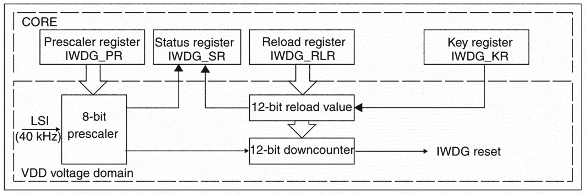

# 16

# 独立看门狗（IWDG）

在本章中，我们将学习关于**独立看门狗定时器（IWDG**）的内容，这是一个用于增强嵌入式系统可靠性的独特组件。IWDG 对于监控系统操作和确保系统能够从意外故障或故障中恢复至关重要。

我们将首先探讨看门狗定时器（WDT）的一般概念及其在嵌入式系统中的重要性。在此之后，我们将检查 WDT 的工作原理和 IWDG 的独特功能。接下来，我们将专门关注 STM32 的 IWDG 实现，查看其关键寄存器和配置。最后，我们将应用这些知识来开发裸机 IWDG 驱动程序，提供实际代码示例以巩固我们的理解。

在本章中，我们将涵盖以下主要主题：

+   理解看门狗定时器

+   看门狗定时器（WDT）的类型

+   STM32 IWDG

+   开发独立看门狗（IWDG）驱动程序

到本章结束时，您将全面了解 IWDG 定时器及其在嵌入式系统中的关键作用。您还将获得开发 STM32 微控制器 IWDG 驱动程序和实施 IWDG 驱动程序所需的技能，以确保您的系统可以保持稳健和可靠。

# 技术要求

本章的所有代码示例都可以在以下 GitHub 链接中找到：

[`github.com/PacktPublishing/Bare-Metal-Embedded-C-Programming`](https://github.com/PacktPublishing/Bare-Metal-Embedded-C-Programming)

# 理解看门狗定时器

看门狗定时器（WDT）是嵌入式系统中的无名英雄之一。它们默默地监控系统的健康状况，确保系统可以从意外中断中优雅地恢复。想象它们是警惕的守卫，始终在寻找系统故障，如果出现问题，它们会重置微控制器。在本节中，我们将探讨看门狗定时器是什么以及它们如何工作，并深入一些常见用例以说明它们的重要性。

## 看门狗定时器是什么？

看门狗定时器（WDT）是您的微控制器的守护者。想象一下，您正在使用一个设备，然后出了问题——开发者代码中的错误导致无限循环，或者硬件故障使系统冻结。如果没有看门狗，您的设备就会卡住，可能会造成重大问题，尤其是在医疗设备或汽车系统等关键应用中。

看门狗定时器（WDT）是一种硬件或软件计时器，如果主程序在计时器到期之前未能重置计时器，它将重置系统。这是一个简单但强大的机制，确保您的系统可以从意外问题中恢复。让我们看看它们是如何工作的。

## 看门狗定时器的工作原理

将看门狗定时器想象成一个需要定期翻转以防止沙子耗尽的沙漏。以下是它如何工作的逐步分解：

1.  **初始化**：当您的系统启动时，您将使用特定的超时周期初始化看门狗定时器（WDT）。这个周期是您的系统可以在不重置计时器的情况下运行的最大时间。

1.  **倒计时**：WDT 从设定的超时值开始倒计时。如果它达到零，它假定出了问题，并触发系统重置。

1.  **重置定时器**：在定时器达到零之前，主程序需要定期重置 WDT。这一行为通常被称为**喂狗**或**踢狗**。如果程序运行正确，它将继续重置定时器，防止系统重置。

1.  **系统重置**：如果你的程序未能及时重置 WDT——可能是因为它卡在一个无限循环中或遇到了一个关键错误——WDT 将到期并重置系统，将其恢复到一个已知状态。

现在我们已经了解了基础知识，让我们看看一些 WDT 在现实世界中扮演关键角色的应用实例。

## 常见用例

以下是一些实际应用的列表。

### 工业自动化

在工业自动化中，可靠性至关重要。机器和流程需要连续且无故障地运行。WDT 确保如果可编程逻辑控制器（PLC）或其他控制系统挂起或崩溃，它们可以快速恢复。

*示例*：想象一个制造工厂中的传送带系统。控制传送带的 PLC 设置了一个 1 秒的 WDT。如果 PLC 软件由于软件错误或外部干扰在 1 秒内未能重置看门狗，WDT 将重置 PLC。这次重置确保传送带可以以最短的中断时间恢复运行，防止潜在的生产损失。

### 汽车系统

现代车辆在执行各种功能时，如引擎控制和信息娱乐系统，严重依赖嵌入式系统。看门狗定时器（WDTs）在确保这些系统可靠运行方面至关重要。

*示例*：考虑一辆汽车中的**发动机控制单元**（ECU）。ECU 监控和控制关键发动机参数。ECU 中的 WDT 可能被设置为 500 毫秒。如果 ECU 软件由于故障未能重置看门狗，WDT 将重置 ECU。这次重置可以防止发动机异常行为，确保车辆安全运行。

### 医疗设备

在医疗设备中，WDT 可以救命。如起搏器、输液泵和患者监护仪等设备必须无故障运行。

*示例*：以一个监测生命体征（如心率血压）的患者监护仪为例。监护仪的软件中设置了一个 2 秒的 WDT。如果软件遇到问题，未能重置看门狗，设备将重置。这次重置确保监护仪可以快速恢复并继续提供准确、实时的数据，这对于患者护理至关重要。

### 消费电子产品

即使在消费电子产品中，WDT 也有助于维护系统可靠性和提升用户体验。想想智能手机、智能家居设备和游戏机。

*示例*: 在一个智能恒温器中，软件管理温度设置和连接性。一个看门狗定时器确保如果软件冻结，系统将重置并继续运行。这种功能可以防止用户经历长时间的中断，保持家庭舒适和便利。

这些示例说明了看门狗定时器在现代系统中的关键作用。在实现看门狗定时器时，考虑几个关键因素以确保其有效性是至关重要的。让我们看看这些因素中的一些。

### 实际考虑因素

在实现看门狗定时器时，你必须考虑以下因素：

+   **超时周期**: 根据应用需求选择适当的超时周期。太短，可能会造成不必要的重置；太长，可能无法从故障中快速恢复。

+   **复位机制**: 确保在代码中定期重置看门狗定时器（喂狗）的部分表明系统正在正确运行。

+   **恢复策略**: 计划系统在看门狗定时器重置后的恢复方式。确保关键数据得到保留，系统返回到安全状态。

+   **测试**: 仔细测试你的看门狗定时器实现，以确保在各种故障条件下它按预期工作。

接下来，让我们看看可用的看门狗定时器类型。

## 看门狗定时器类型

根据其功能和集成，看门狗定时器可以根据几种类型进行分类。让我们探索最常见的类型。

### 内部看门狗定时器

内部看门狗定时器是集成在微控制器中的。这是一个方便的选项，因为它不需要额外的外部组件。这些定时器直接集成到微控制器的架构中，可以通过软件进行配置。

它们具有以下特性：

+   **集成**: 无需外部电路

+   **配置**: 通常使用微控制器的寄存器进行配置

+   **功率**: 它们可以在低功耗模式下继续运行，这使得它们非常适合电池供电的应用

*示例用例*: 在一个小型物联网设备中，一个内部看门狗定时器可以监控微控制器的操作，而无需添加额外的硬件，确保设备在遇到错误时可以自行重置。

### 外部看门狗定时器

外部看门狗定时器是连接到微控制器的独立组件。这些定时器提供了额外的灵活性，可以在内部看门狗定时器不足或需要冗余时使用。

下面是他们的一些特性列表：

+   **灵活性**: 可以根据具体要求选择（例如，更长的超时周期）

+   **冗余**: 添加外部看门狗提供额外的安全层

+   **独立性**: 独立于微控制器的时钟和电源运行

*示例用例*: 在一个关键汽车系统中，一个外部看门狗定时器可以提供额外的安全保护，确保即使内部定时器失败，系统也能重置。

### 窗口看门狗定时器

**窗口看门狗定时器**（**WWDT**）通过引入一个*窗口*周期来增加额外的控制层。系统必须在特定的窗口周期内重置计时器；太早或太晚的重置会导致系统复位。这防止了软件陷入循环，频繁地重置看门狗（这可能会掩盖故障）。

它们的特性包括以下内容：

+   **精度**：需要计时器在特定的时窗内重置

+   **故障检测**：可以检测早期和晚期的看门狗复位，提供改进的故障检测

+   **安全性**：通过确保计时器在适当的间隔内重置来增强系统安全性

*示例用例*：在医疗设备中，一个 WWDT 确保控制软件在定义的时间间隔内正确运行，增加了一个额外的可靠性层。

### IWDGs

IWDGs 被设计成鲁棒且可靠。它们从一个独立的时钟源运行，通常是一个**低速内部**（**LSI**）时钟，并且独立于主系统时钟运行。这种独立性确保即使在主时钟失败的情况下，它们也能继续工作。

它们的特性包括以下内容：

+   **独立性**：从一个独立的时钟源运行

+   **鲁棒性**：即使在主系统时钟失败的情况下也能继续工作

+   **最小配置**：通常简单易配置和使用

*示例用例*：在**工业控制系统**（**ICS**）中，一个 IWDG 确保系统可以从故障中恢复，即使主时钟源被中断。

选择合适的 WDT 取决于多个因素，包括应用的紧迫性、电源限制和所需的可靠性。

### 选择正确的 WDT

这里有一个快速指南，帮助您选择正确的 WDT：

+   **对于低功耗应用**：由于集成度和低功耗，考虑使用内部 WDT

+   **对于高可靠性系统**：使用外部 WDT 进行冗余

+   **对于需要精确时序的应用**：WWDT 提供了增强的故障检测

+   **对于需要鲁棒操作的系统**：IWDGs 即使在主时钟失败的情况下也能保持功能

理解不同类型的看门狗定时器（WDT）及其特性，使我们能够为我们的应用选择合适的型号。无论是为了简单性而使用的内部 WDT，还是为了冗余性而使用的外部 WDT，或者是用于精确控制的 WWDT，亦或是用于鲁棒性的 IWDG，总有一个 WDT 适合每一个需求。

在下一节中，我们将深入探讨 STM32F411 微控制器内部的 IWDG，检查其特性和如何利用它来提高系统可靠性。

# STM32 IWDG

在本节中，我们将分析 STM32 IWDG 模块，探讨其主要特性和其他相关信息，以帮助您了解如何在嵌入式应用中利用这一强大功能。

STM32 微控制器具有两种类型的 WDT：IWDG 和**窗口看门狗**（**WWDG**）。两者都是通过启动系统复位来检测和纠正软件故障，但它们各自具有独特的特性和应用。

IWDG 使用专用的 LSI 时钟运行，确保即使主系统时钟失败，它也能继续工作。这使得它在需要持续监控的应用中非常可靠，无论主时钟的状态如何。相比之下，WWDG 从 APB1 时钟中获取时钟，并具有可配置的时间窗口。系统必须在时间窗口内刷新 WWDG；如果过早或过晚，将触发系统复位。

IWDG（独立看门狗定时器）最适合需要独立看门狗进程且对时间精度要求较低的应用，而 WWDG（窗口看门狗定时器）则适用于需要精确时间窗口的应用。让我们看看 IWDG 的一些关键特性。

## IWDG 的关键特性

STM32 微控制器中的 IWDG 具有几个关键特性：

+   **自由运行倒计时器**：IWDG 作为一个自由运行的倒计时器运行，从预设值开始连续倒计时。

+   **独立时钟源**：它使用独立的**电阻-电容**（**RC**）振荡器，允许它在低功耗模式（如待机模式）下工作。

+   **超时系统复位**：如果 WDT 被激活，倒计时器达到零（0x000），将触发系统复位。

+   **写入访问保护**：要修改关键寄存器，需要特定的操作序列，以确保防止意外或恶意的修改。

让我们看看它是如何工作的。

## IWDG 的工作原理

IWDG 模块作为微控制器的独立保护措施运行，确保系统可以从软件故障中恢复。*图 16.1*展示了 IWDG 的模块框图，来源于参考手册：



图 16.1：IWDG 模块框图

让我们分解其功能模块及其工作方式：

+   将`0xCCCC`写入键寄存器（`IWDG_KR`）。这一操作启动了倒计时器，它从`0xFFF`的复位值开始倒计时。

+   将`0xAAAA`写入`IWDG_KR`寄存器，这会将计数器重新加载为从重载寄存器（`IWDG_RLR`）中读取的值，并防止复位。

+   **硬件看门狗特性**：如果启用，IWDG 在电源开启时自动激活。在此模式下，如果计数器达到零之前没有用适当的值写入键寄存器，WDT 将生成复位。

+   `IWDG_PR`（预分频寄存器）和重载`IWDG_RLR`寄存器，我们必须暂时禁用写入访问保护，通过将代码`0x5555`写入`IWDG_KR`寄存器来实现。完成此操作后，必须立即对这些寄存器进行更改；否则，访问保护将重新启用。

在心中有了 IWDG 模块的总体概述后，让我们逐一分析关键寄存器。

## IWDG 寄存器

在本节中，我们将探讨 IWDG 外设中一些关键寄存器的特性和功能。

让我们从 `IWDG_KR` 开始。

### IWDG 密钥寄存器 (IWDG_KR)

`IWDG_KR` 寄存器是一个用于控制 IWDG 操作的关键寄存器，包括启动看门狗、重载计数器和禁用对其他寄存器的写访问。此寄存器在管理 IWDG 功能方面至关重要。

此寄存器中的关键操作包括以下内容：

+   `0xCCCC`: 启动 IWDG。将此值写入 `IWDG_KR` 将启动 IWDG 定时器。

+   `0xAAAA`: 重载计数器。写入此值将重载 IWDG 计数器，防止其达到零并触发系统复位。

+   `0x5555`: 禁用写保护。此值允许修改预分频器和重载寄存器。

接下来，让我们讨论 `IWDG_PR`。

### IWDG 预分频器寄存器 (IWDG_PR)

`IWDG_PR` 寄存器用于设置预分频器值，该值通过除以 LSI 时钟来确定 IWDG 时钟的频率。调整此寄存器有助于配置 WDT 的倒计时速度。

此寄存器中的关键位是 `PR[2:0]`：预分频器值。这些位可以设置为将 LSI 时钟除以 4、8、16、32、64、128 或 256，从而在设置 WDT 间隔时提供灵活性。

接下来，我们转向 `IWDG_RLR`。

### IWDG 重载寄存器 (IWDG_RLR)

`IWDG_RLR` 寄存器定义了 IWDG 计数器的重载值。此值确定在未及时重载的情况下，看门狗触发系统重置的超时时间。

此寄存器中的关键字段是 `RL[11:0]`；这意味着重载值。它是一个 12 位值，用于设置计数器的重载值，其范围从 0x000 到 0xFFF。

最后，我们检查 `IWDG_SR`。

### IWDG 状态寄存器 (IWDG_SR)

`IWDG_SR` 寄存器提供了关于 IWDG 的状态信息，指示是否正在更新预分频器或重载寄存器。

此寄存器中的关键位包括以下内容：

+   `PVU`：**预分频器值更新**（**PVU**）。此位指示预分频器值正在更新。

+   `RVU`：**重载值更新**（**RVU**）。此位指示重载值正在更新。

在对 IWDG 的功能和其寄存器有清晰理解的基础上，我们现在可以继续到下一节，我们将开发 IWDG 驱动程序。

# 开发 IWDG 驱动程序

在本节中，我们将使用本章学到的知识来开发 IWDG 驱动程序。

让我们从设置项目开始。

按照前面章节中概述的步骤，在你的 IDE 中创建你之前项目的副本。将此复制的项目重命名为 `IWDG`。接下来，在 `Src` 文件夹中创建一个名为 `iwdg.c` 的新文件，并在 `Inc` 文件夹中创建一个名为 `iwdg.h` 的新文件。

## IWDG 实现文件

在你的 `iwdg.c` 文件中添加以下代码：

```cpp
#include "iwdg.h"
#define IWDG_KEY_ENABLE                 0x0000CCCCU
#define IWDG_KEY_WR_ACCESS_ENABLE       0x00005555U
#define IWDG_PRESCALER_4              0x00000000U
#define IWDG_RELOAD_VAL              0xFFF
static uint8_t isIwdg_ready(void);
void iwdg_init(void)
{
    /*Enable the IWDG by writing 0x0000CCCC in the IWDG_KR register*/
    IWDG->KR = IWDG_KEY_ENABLE;
    /*Enable register access by writing 0x0000 5555 in the IWDG_KR 
    register*/
    IWDG->KR = IWDG_KEY_WR_ACCESS_ENABLE;
    /*Set the IWDG Prescaler*/
    IWDG->PR =  IWDG_PRESCALER_4;
    /*Set the reload register (IWDG_RLR) to the largest value 0xFFF*/
    IWDG->RLR = IWDG_RELOAD_VAL;
    /*Wait for the registers to be updated (IWDG_SR = 0x0000 0000)*/
    while(isIwdg_ready() != 1){}
    /*Refresh the counter value with IWDG_KR (IWDG_KR = 0x0000 AAAA)*/
    IWDG->KR = IWDG_KEY_RELOAD;
}
static uint8_t isIwdg_ready(void)
{
 return ((READ_BIT(IWDG->SR, IWDG_SR_PVU | IWDG_SR_RVU) == 0U) ? 1UL : 
 0UL);
}
```

让我们分解一下。首先让我们看看 **宏定义**：

```cpp
#include "iwdg.h"
#define IWDG_KEY_ENABLE                 0x0000CCCCU
#define IWDG_KEY_WR_ACCESS_ENABLE       0x00005555U
#define IWDG_PRESCALER_4                0x00000000U
#define IWDG_RELOAD_VAL                 0xFFF
```

+   `IWDG_KEY_ENABLE`：此宏定义了启用 IWDG 的密钥

+   `IWDG_KEY_WR_ACCESS_ENABLE`: 这个宏定义了用于启用对 IWDG 寄存器写访问的密钥

+   `IWDG_PRESCALER_4`: 这个宏定义了 IWDG 的预分频器值

+   `IWDG_RELOAD_VAL`: 这个宏将重载值设置为最大值，0xFFF，提供最长的超时周期

接下来，我们有 `iwdg_init()` 函数。

```cpp
IWDG->KR = IWDG_KEY_ENABLE;
```

这行代码将`0x0000CCCC`写入 IWDG **密钥寄存器**（**KR**）以启用 IWDG。

```cpp
IWDG->KR = IWDG_KEY_WR_ACCESS_ENABLE;
```

这行代码将 `0x00005555` 写入 IWDG 密钥寄存器以启用对预分频器和重载寄存器的写访问。

```cpp
IWDG->PR = IWDG_PRESCALER_4;
```

这行代码将预分频器寄存器设置为按 `IWDG_PRESCALER_4` 定义的除以 4，以定义预分频器。

```cpp
IWDG->RLR = IWDG_RELOAD_VAL;
```

这将重载寄存器设置为最大值 0xFFF 以获得最长的超时周期。

```cpp
while (isIwdg_ready() != 1) {}
```

这将等待直到 IWDG **状态寄存器**（**SR**）指示预分频器和重载寄存器已更新并准备好。

```cpp
IWDG->KR = IWDG_KEY_RELOAD;
```

这将 `0x0000AAAA` 写入 IWDG 密钥寄存器以重载计数器并防止 IWDG 重置系统。

`isIwdg_ready()` 函数检查状态寄存器以查看 `PVU` 和 `RVU` 位是否清除。如果两个位都清除，则返回 1，表示 IWDG 已准备好，否则返回 0。

我们现在已准备好在 `main.c` 中进行测试。

## 主文件

按照以下所示更新你的 `main.c` 文件：

```cpp
#include <stdio.h>
#include "adc.h"
#include "uart.h"
#include "gpio.h"
#include "iwdg.h"
#include "gpio_exti.h"
uint8_t g_btn_press;
static void check_reset_source(void);
int main(void)
{
    /*Initialize debug UART*/
    uart_init();
    /*Initialize LED*/
    led_init();
    /*Initialize EXTI*/
    pc13_exti_init();
    /*Find reset source*/
    check_reset_source();
    /*Initialize IWDG*/
    iwdg_init();
    while(1)
    {
        if( g_btn_press != 1)
         {
              /*Refresh IWDG down-counter to default value*/
             IWDG->KR = IWDG_KEY_RELOAD;
             led_toggle();
             for(int i = 0; i < 90000; i++){}
         }
    }
}
```

`main` 函数首先在连接到蓝色按钮的引脚 `PC13` 上设置 `EXTI`，然后调用 `check_reset_source` 以确定上一次重置是否由 IWDG 引起。之后，它初始化 IWDG 本身，确保系统可以从软件故障中恢复。`main` 循环持续检查 `g_btn_press` 的状态；如果按钮未被按下，它刷新 IWDG 以防止系统重置，并切换 LED，提供系统活动的视觉指示。

让我们看看代码的下一部分：

```cpp
static void check_reset_source(void)
{
if ((RCC->CSR & RCC_CSR_IWDGRSTF) == (RCC_CSR_IWDGRSTF))
      {
          /*Clear IWDG Reset flag*/
          RCC->CSR = RCC_CSR_RMVF;
          /*Turn LED On*/
          led_on();
          printf("RESET was caused by IWDG.....\n\r");
          while( g_btn_press != 1)
          {
          }
          g_btn_press =  0;
      }
}
```

`check_reset_source` 函数确定最近的系统重置是否由 IWDG 触发。它首先检查 `CSR` 寄存器中的 IWDG 重置标志（`RCC_CSR_IWDGRSTF`）。如果此标志被设置，则确认看门狗触发了重置。然后，通过写入 `RCC_CSR_RMVF` 位清除此标志，确保标志被重置以供未来检测。作为 IWDG 触发的重置的视觉指示，LED 被点亮，并通过 UART 打印一条消息。函数进入一个循环，等待用户按下按钮（通过 `g_btn_press` 变量检测）在清除按钮按下状态并退出之前。

然后，有一个回调：

```cpp
static void exti_callback(void)
{
    g_btn_press = 1;
}
```

接着是中断处理程序：

```cpp
void EXTI15_10_IRQHandler(void) {
    if((EXTI->PR & LINE13)!=0)
    {
        /*Clear PR flag*/
        EXTI->PR |=LINE13;
        //Do something...
        exti_callback();
    }
}
```

`exti_callback`函数是我们中断处理机制的一个简单但至关重要的部分。它的唯一目的是将`g_btn_press`标志设置为`1`，表示检测到了按钮按下。这个标志随后在主循环中用于控制程序流程。`EXTI15_10_IRQHandler`函数是 10 到 15 行外部中断的中断处理程序。当在*第 13 行*触发中断时，此处理程序首先检查挂起寄存器（`PR`）以确认中断源。一旦验证，它通过写入`PR`寄存器来清除挂起标志。清除中断后，处理程序调用`exti_callback`来更新`g_btn_press`标志。

## 测试项目

要在微控制器上测试项目，请按照以下步骤操作：

1.  **构建和运行项目**：编译代码并将其上传到你的微控制器。一旦运行，你应该观察到绿色 LED 闪烁，这表明系统正在正常工作。

1.  **监控串行输出**：打开 RealTerm 或其他串行终端应用程序。使用适当的端口和波特率进行配置，以查看调试信息。这将允许你确认系统因 IWDG 而重新启动。 

1.  **触发看门狗复位**：按下蓝色按钮以停止刷新 IWDG 计时器。在 IWDG 超时期间，系统将重置，你应该在串行终端中看到相应的消息。

# 概述

在本章中，我们探讨了 IWDG 计时器，这是增强嵌入式系统可靠性的重要组件。我们首先讨论了看门狗（WDT）的一般概念，强调了它们在确保系统可以从意外故障或故障中恢复的作用。我们探讨了 WDT 的工作原理，并突出了 IWDG 的独特特性。

接下来，我们专注于 STM32 对 IWDG 的实现，检查了其关键寄存器和配置选项。我们详细介绍了诸如密钥寄存器（`IWDG_KR`）、预分频寄存器（`IWDG_PR`）、重载寄存器（`IWDG_RLR`）和状态寄存器（`IWDG_SR`）等基本寄存器的目的和用法。这为我们提供了如何配置和控制 IWDG 以实现稳健系统操作的综合理解。

我们还提供了实际示例来巩固我们的理解，包括裸机 IWDG 驱动程序的开发。这包括初始化 IWDG、配置其预分频和重载值，并实现必要的函数以确保系统可以从软件故障中恢复。

在下一章中，我们将学习**直接内存访问**（**DMA**）模块，这是用于数据传输的高级功能。
