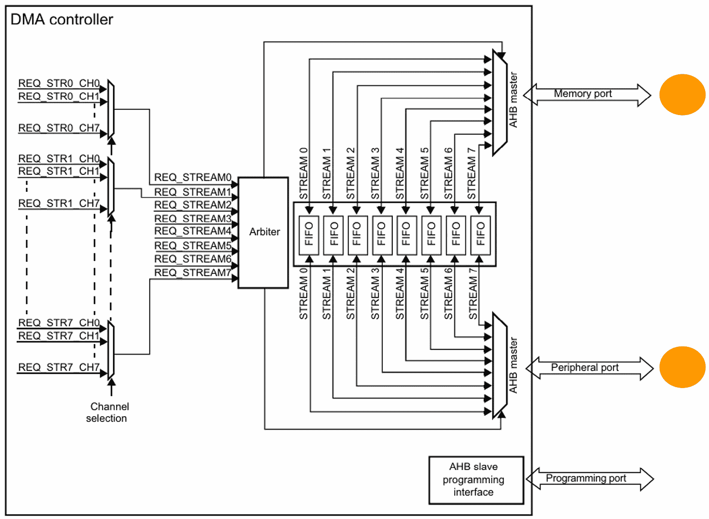
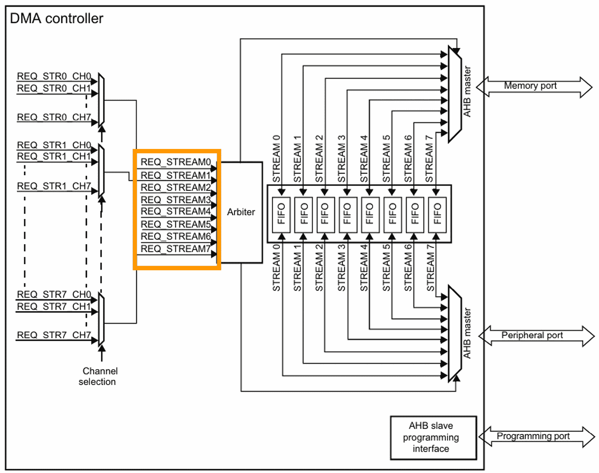
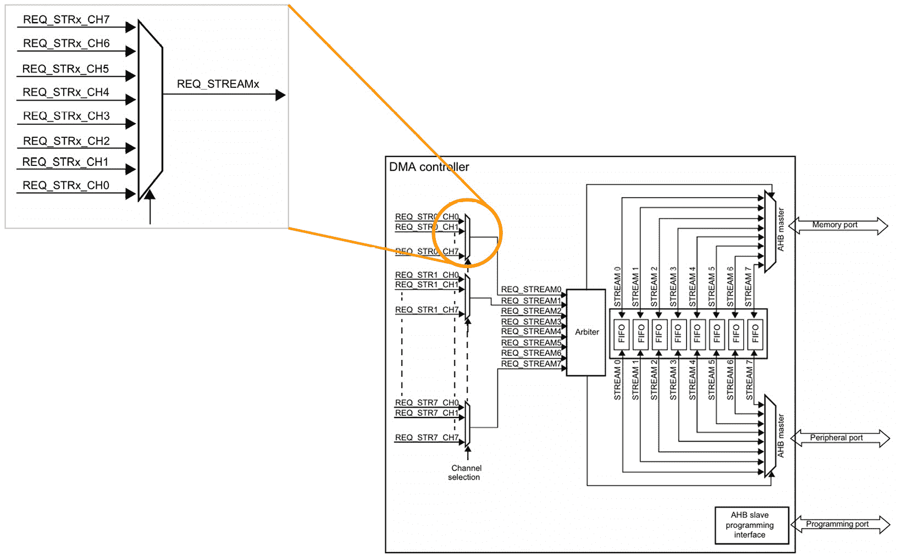

# 直接内存访问（DMA）

在本章中，我们将探讨 **直接内存访问**（**DMA**），这是微控制器中的一个强大功能，允许外设在不涉及 CPU 的情况下在内存之间传输数据。这种功能对于提高数据吞吐量和释放 CPU 以处理其他任务至关重要，对于高性能嵌入式系统开发是基础。

我们将首先了解 DMA 的基本原理及其在嵌入式系统中的重要性。然后，我们将深入研究 STM32F4 微控制器中 DMA 控制器的具体细节，检查其结构和功能以及它如何管理数据传输。随后，我们将应用这些理论知识来开发针对各种用例的实用 DMA 驱动程序，包括内存到内存传输、**模拟数字转换器**（**ADC**）数据传输和**通用异步收发传输器**（**UART**）通信。

在本章中，我们将涵盖以下主要内容：

+   DMA 概述

+   STM32F4 DMA

+   开发 DMA ADC 驱动程序

+   开发 DMA UART 驱动程序

+   开发 DMA 内存到内存驱动程序

到本章结束时，您将全面了解 DMA 的工作原理以及如何在项目中实现它。您将能够开发高效的 DMA 驱动程序来处理各种场景下的数据传输，显著提升嵌入式系统的性能和响应速度。

# 技术要求

本章的所有代码示例都可以在 GitHub 上找到：[`github.com/PacktPublishing/Bare-Metal-Embedded-C-Programming`](https://github.com/PacktPublishing/Bare-Metal-Embedded-C-Programming)。

# 理解直接内存访问（DMA）

DMA 是一个可以显著提升您嵌入式系统性能的功能。如果您在微控制器项目中处理过数据传输，您就知道这对 CPU 来说是一项多么繁重的任务，需要处理所有这些数据移动。这就是 DMA 走进来成为游戏改变者的地方，它将数据传输任务从 CPU 中卸载，使其能够专注于更关键的功能。让我们看看它是如何工作的。

## DMA 的工作原理

那么，DMA 究竟是什么，它是如何工作的呢？简单来说，DMA 是一种允许微控制器内的外设直接在内存之间传输数据的方法，无需持续 CPU 干预。想象一下，它就像一个专门的助手，接管了移动盒子（数据）的繁琐任务，让您（CPU）可以专注于更重要的工作，比如解决复杂问题或管理其他外设。

微控制器中的典型 DMA 控制器具有多个通道，每个通道都能够处理特定的数据传输操作。每个通道都可以独立配置，以管理各种外设和内存之间的传输。

下面我们将一步一步地看看 DMA 通常是如何操作的：

1.  **初始化**: 配置 DMA 控制器和通道。此设置包括指定源地址和目标地址、数据传输方向以及要传输的数据单元数量。

1.  **触发器**: 数据传输由触发器启动，这可以是一个事件，例如外围设备表示它已准备好发送或接收数据，或者是一个软件命令。

1.  **数据传输**: 一旦触发，DMA 控制器接管，从源地址读取数据并将其写入目标地址。这个过程一直持续到指定的数据单元数量传输完毕。

1.  **完成**: 在传输完成后，DMA 控制器可以生成一个中断来通知 CPU 传输已完成，从而使系统能够执行任何必要的传输后处理。

接下来，让我们看看 DMA 控制器的关键特性。

## 关键特性

DMA 控制器集成了许多特性，使它们变得多功能且强大。让我们分解一些你经常遇到的 key specifications：

+   **通道和流**: DMA 控制器通常具有多个通道和流，每个都能处理不同的传输。例如，STM32F4 微控制器在其 DMA 控制器中最多有 16 个流。

+   **优先级**: 通道可以分配不同的优先级，确保更关键传输的优先级高于不那么关键的传输。

+   **传输类型**: DMA 可以处理各种类型的传输，包括内存到内存、外设到内存和内存到外设。

+   **FIFO**: 一些 DMA 控制器配备了 **先进先出**（**FIFO**）缓冲区，这有助于管理数据流并提高效率，尤其是在突发传输中。

+   **循环模式**: 此模式允许 DMA 在循环中连续传输数据，这对于需要持续数据流的设备特别有用，例如音频或视频流。

+   **中断**: DMA 控制器可以在传输完成、半传输完成和传输错误时生成中断，使 CPU 能够对传输的不同阶段做出适当的反应。

要了解 DMA 的真正威力，让我们看看一些 DMA 发挥作用的常见用例。

## 常见用例

这里有一些 DMA 的常见用例：

+   **音频流传输**: DMA 在需要连续数据流的应用程序中被大量使用，这对于音频应用至关重要。例如，在数字音频播放器中，音频样本必须连续发送到 **数字到模拟转换器**（**DAC**）。使用 DMA，音频数据可以从内存流到 DAC，而无需 CPU 干预，确保流畅播放并释放 CPU 来管理用户界面和其他任务。

+   **传感器数据采集**：在环境监测或工业自动化等应用中，传感器通常需要以精确的间隔采样数据。例如，ADC 可以配置为连续采样温度数据，DMA 将采样数据直接传输到内存。这种设置确保 CPU 不会被处理每个单独样本所拖累，从而保持高效及时的数据收集。

+   **通信接口**：在处理高速通信协议（如 UART、SPI 或 I2C）时，DMA 是救命稻草。考虑这样一个场景，嵌入式系统需要将通过 UART 接收到的数据记录到 SD 卡。如果没有 DMA，CPU 需要处理每个数据字节，对其进行处理，然后将其写入 SD 卡，这可以非常低效。使用 DMA，通过 UART 接收到的数据可以直接写入内存，另一个 DMA 通道可以将其传输到 SD 卡，所有这些操作都只需要最小的 CPU 干预。

+   **图形处理**：DMA 在涉及图形的应用程序中也至关重要，例如更新显示缓冲区。在一个需要不断刷新显示的系统中，DMA 可以处理从内存到显示控制器的图像数据传输。这确保了平滑且无闪烁的图形渲染，同时 CPU 可以专注于生成下一帧或管理用户输入。

考虑到这一点，让我们比较一些 DMA 解决方案和非 DMA 解决方案。

### 案例研究 1 – 音频流

**场景**：你正在开发一个音频播放系统，该系统从微控制器流式传输数字音频数据到 DAC。

**不使用 DMA**：CPU 负责从内存中检索每个音频样本并发送到 DAC。鉴于音频应用所需的高采样率（例如，CD 音质音频的 44.1 kHz），CPU 必须每秒处理数万个中断，仅为了保持音频流。这种持续的负载显著限制了 CPU 执行其他任务的能力，可能导致音频故障和系统响应速度降低。

**使用 DMA**：DMA 控制器被配置为直接从内存传输音频数据到 DAC。CPU 设置 DMA 传输并处理更高级别的任务，仅偶尔检查传输状态。这种设置确保了平滑且不间断的音频播放，同时释放 CPU 来管理系统的其他方面，例如用户界面和控制逻辑。

### 案例研究 2 – 高速数据采集

**场景**：你正在开发一个数据采集系统，该系统通过 ADC 连续从多个传感器采样数据，并将数据存储以供后续分析。

**不使用 DMA**：CPU 必须处理每个 ADC 转换，读取数据并将其存储在内存中。如果采样率很高，CPU 可能会过载，导致样本丢失和数据收集不可靠。这种方法也可能使实时数据处理和分析复杂化，因为 CPU 被数据流管理所困扰。

**使用 DMA**：ADC 被配置为生成 DMA 请求。每次转换完成后，DMA 控制器将数据从 ADC 传输到内存，无需 CPU 干预。CPU 可以随后批量处理收集到的数据，确保没有样本丢失，并实现实时数据分析和决策。

### 案例研究 3 – LCD 显示刷新

**场景**：您正在开发一个图形应用程序，该程序持续更新 LCD 显示屏上的新数据。

**不使用 DMA**：CPU 必须通过直接将每个像素或数据行发送到 LCD 控制器来更新显示。这个过程可能非常占用 CPU 资源，特别是对于高分辨率显示器，会导致性能下降和用户界面响应性降低。

**使用 DMA**：DMA 控制器被配置为从内存传输显示数据到 LCD 控制器。CPU 设置 DMA 传输然后专注于生成新的图形数据或处理用户输入。DMA 控制器确保显示平滑高效地更新。

在每个案例研究中，我们都看到了使用 DMA 如何改变系统的能力，释放 CPU 来处理更关键的任务，并确保数据传输高效可靠。在您的项目中理解和实现 DMA 可以导致更健壮、响应更快、性能更高的嵌入式系统。

在下一节中，我们将深入了解 STM32F4 DMA 控制器的具体细节，探讨其架构、关键寄存器和实际实现技术。

# STM32F4 微控制器的 DMA 模块

每个 STM32F4 微控制器配备**两个 DMA 控制器**，每个控制器支持多达**8 个流**。每个流可以管理多个请求，总共提供**16 个流**来处理各种数据传输任务。**流**是一个单向路径，它促进了源和目的地之间的数据传输。该架构包括一个**仲裁器**来优先处理这些 DMA 请求，确保高优先级传输得到及时处理。

让我们看看 STM32F4 DMA 控制器的一些关键特性。

## STM32F4 DMA 控制器的关键特性

以下 STM32F4 DMA 控制器的关键特性：

+   **独立 FIFO**：每个流包含一个**四字 FIFO 缓冲区**，可以以直接模式或 FIFO 模式运行。在直接模式下，数据传输在请求后立即发生，而 FIFO 模式允许**阈值级缓冲**，提高突发数据传输的效率。

+   **灵活配置**：每个流可以配置为处理以下内容：

    +   外设到内存

    +   内存到外设

    +   内存到内存传输

此外，可以设置流进行常规或双缓冲传输，后者通过自动交换内存缓冲区实现无缝的数据处理：

+   **优先级和仲裁**：DMA 流请求通过软件以四个级别进行优先级排序——**非常高**、**高**、**中**和**低**。如果两个流的优先级相同，基于流号的硬件优先级确保有序的数据传输。

+   **增量和非增量传输**：DMA 控制器支持源和目标地址的增量和非增量寻址。它可以管理**4、8 或 16 次打击**的突发传输，优化带宽使用。术语**打击**指的是在单个 DMA 事务中传输的数据的单独单元。

+   **中断和错误处理**：每个流支持多个事件标志，如传输完成、半传输、传输错误、FIFO 错误和直接模式错误。这些标志可以触发中断，提供强大的错误处理和状态监控。

要充分利用 STM32F DMA 控制器，了解 DMA 事务和通道选择非常重要。让我们分解这些概念。

+   使用`DMA_SxNDTR`寄存器跟踪剩余数据项的数量

+   `DMA_SxCR`寄存器中的`CHSEL`位。这种灵活性允许各种外设有效地启动 DMA 请求。

之前我们讨论了 STM32F4 DMA 控制器支持三种不同的传输模式。现在，让我们探索每种模式的特性。

## 传输模式

有三种传输模式：

+   `DMA_SxCR`寄存器中的`EN`位。如果启用，该位使用 FIFO 缓冲区将数据从外设传输到内存。

+   **内存到外设模式**：这与外设到内存类似，但传输方向相反。数据从内存加载并发送到外设。

+   **内存到内存模式**：这种模式是独特的，因为它不需要外设请求。DMA 流在两个内存位置之间传输数据，如果启用，则使用 FIFO 缓冲区。这对于内存内部的大数据传输特别有用。

DMA 控制器可以自动增加源和目标指针，从而在不同内存区域之间实现高效的数据传输。这可以通过`DMA_SxCR`寄存器中的`PINC`和`MINC`位进行配置。

STM32F4 DMA 控制器还提供了数据模式选项。

## DMA 数据模式

此数据模式选项包括以下内容：

+   `DMA_SxNDTR`寄存器。这对于需要连续记录数据的应用程序（如 ADC 采样）特别有用。

+   **双缓冲模式**：双缓冲模式通过允许 DMA 控制器自动在两个内存缓冲区之间交换，从而提高效率。这确保了连续的数据处理。当 CPU 处理一个缓冲区时，DMA 可以将下一组数据加载到另一个缓冲区中。

在下一节中，我们将从参考手册中检查 STM32F4 DMA 模块框图。这将帮助我们更好地理解 DMA 控制器的关键特性和功能。

## STM32F4 DMA 模块框图

DMA 有两个数据传输端口——一个外围端口和一个内存端口，如*图 17.1*所示。



图 17.1：DMA 模块，指示数据传输端口

两个 DMA 模块各有**八个不同的流**，每个流都专门用于处理来自各种外围设备的内存访问请求。



图 17.2：DMA 模块，指示流

每个流可以容纳最多**八个可选通道**，这些通道可以通过软件配置来启用多个外围设备发起 DMA 请求。然而，在任何给定的流中，一次只能有一个通道处于活动状态。



图 17.3：DMA 模块，放大显示通道

要查找 DMA 通道和流与微控制器各种外围设备的映射，请参阅参考手册的*第 170 页*（**RM0383**）。

在我们开始开发 DMA 驱动程序之前，最后一部分是熟悉关键的 DMA 寄存器。

## 关键 STM32 DMA 寄存器

在本节中，我们将探讨 DMA 外围中一些关键寄存器的特性和功能，从 DMA 流配置寄存器开始。

### DMA 流配置寄存器（DMA_SxCR）

DMA 流配置寄存器（`DMA_SxCR`）是用于配置 DMA 流操作设置的初级寄存器之一。此寄存器允许我们设置各种参数，例如**数据方向**、数据项的**大小**和流的**优先级**级别。此寄存器中的关键位包括以下内容：

+   **EN**：流使能。设置此位激活流。

+   **CHSEL[2:0]**：通道选择。这些位选择流的 DMA 通道。

+   **DIR[1:0]**：数据传输方向。这些位指定数据传输的方向（外围到内存、内存到外围或内存到内存）。

+   **CIRC**：循环模式。设置此位启用循环模式，允许连续的数据传输。

+   **PINC**：外围增量模式。当设置时，此位在每个数据传输后增加外围地址。

+   **MINC**：内存增量模式。当设置时，此位在每个数据传输后增加内存地址。

+   **PSIZE[1:0]**：外围数据大小。这些位指定从外围读取或写入的数据项的大小（8 位、16 位或 32 位）。

+   **MSIZE[1:0]**：内存数据大小。这些位指定从内存读取或写入的数据项的大小。

+   **PL[1:0]**: 优先级。这些位设置流的优先级（低、中、高或非常高）。

你可以在 STM32F411 参考手册的第 *190* 页找到关于此寄存器的详细信息（RM0383）。接下来，我们有 DMA 流数据数量寄存器 (`DMA_SxNDTR`)。

### DMA 流数据数量寄存器 (DMA_SxNDTR)

DMA 流数据数量寄存器 (`DMA_SxNDTR`) 指定了 DMA 流要传输的数据项数量。此寄存器对于控制数据传输的长度至关重要。

此寄存器中只有一个字段是 **NDT[15:0]**。这代表数据项的数量。此字段指定要传输的数据项总数。每次传输后，此寄存器中的值会递减，直到为零。

关于此寄存器的更多信息可以在参考手册的第 *193* 页找到。让我们继续到 DMA 流外围地址寄存器 (`DMA_SxPAR`)。

### DMA 流外围地址寄存器 (DMA_SxPAR)

DMA 流外围地址寄存器 (`DMA_SxPAR`) 存储了将要从中读取或写入数据的外围数据寄存器的地址。

此寄存器中只有一个字段是 **PA[31:0]**。这代表 **外围地址**。此字段包含涉及数据传输的外围数据寄存器的地址。

更多关于此寄存器的详细信息可以在参考手册的第 *194* 页找到。最后，我们有 DMA 流内存地址寄存器 (`DMA_SxM0AR` 和 `DMA_SxM1AR`)。

### DMA 流内存地址寄存器 (DMA_SxM0AR 和 DMA_SxM1AR)

这些寄存器存储用于数据传输的内存位置的地址。`DMA_SxM0AR` 寄存器用于单缓冲区模式，而 `DMA_SxM0AR` 和 `DMA_SxM1AR` 都用于双缓冲区模式。

这些寄存器中只有一个字段是 **MA[31:0]**。这代表 **内存地址**。此字段包含涉及数据传输的内存位置的地址。有关详细信息，请参阅参考手册的第 *194* 页。

# 开发 ADC DMA 驱动程序

在本节中，我们将开发三个不同的 DMA 驱动程序 – 一个用于传输 ADC 数据，另一个用于 UART 数据，第三个用于在内存位置之间传输数据。让我们从 ADC DMA 驱动程序开始。

## ADC DMA 驱动程序

在你的 IDE 中创建你之前项目的副本，按照前面章节中概述的步骤进行。将此复制的项目重命名为 `ADC_DMA`。接下来，在 `Src` 文件夹中创建一个名为 `adc_dma.c` 的新文件，并在 `Inc` 文件夹中创建一个名为 `adc_dma.h` 的新文件。

在你的 `adc_dma.c` 文件中添加以下代码：

```cpp
#include "adc_dma.h"
#define GPIOAEN            (1U<<0)
#define ADC1EN            (1U<<8)
#define CR1_SCAN        (1U<<8)
#define CR2_DMA            (1U<<8)
#define CR2_DDS            (1U<<9)
#define CR2_CONT        (1U<<1)
#define CR2_ADCON        (1U<<0)
#define CR2_SWSTART        (1U<<30)
#define DMA2EN                (1U<<22)
#define DMA_SCR_EN          (1U<<0)
#define DMA_SCR_MINC        (1U<<10)
#define DMA_SCR_PINC        (1U<<9)
#define DMA_SCR_CIRC        (1U<<8)
#define DMA_SCR_TCIE        (1U<<4)
#define DMA_SCR_TEIE        (1U<<2)
#define DMA_SFCR_DMDIS        (1U<<2)
uint16_t adc_raw_data[NUM_OF_CHANNELS];
void adc_dma_init(void)
{
    /************GPIO Configuration**********/
    /*Enable clock access to ADC GPIO Pin's Port*/
    RCC->AHB1ENR |= GPIOAEN;
    /*Set PA0 and PA1 mode to analog mode*/
    GPIOA->MODER |= (1U<<0);
    GPIOA->MODER |= (1U<<1);
    GPIOA->MODER |= (1U<<2);
    GPIOA->MODER |= (1U<<3);
    /************ADC Configuration**********/
    /*Enable clock access to ADC*/
    RCC->APB2ENR |= ADC1EN;
    /*Set sequence length*/
    ADC1->SQR1 |= (1U<<20);
    ADC1->SQR1 &= ~(1U<<21);
    ADC1->SQR1 &= ~(1U<<22);
    ADC1->SQR1 &= ~(1U<<23);
    /*Set sequence*/
    ADC1->SQR3 = (0U<<0) | (1U<<5);
    /*Enable scan mode*/
    ADC1->CR1 = CR1_SCAN;
    /*Select to use DMA*/
    ADC1->CR2 |=CR2_CONT |CR2_DMA|CR2_DDS;
    /************DMA Configuration**********/
    /*Enable clock access to DMA*/
    RCC->AHB1ENR |=DMA2EN;
    /*Disable DMA stream*/
    DMA2_Stream0->CR &=~DMA_SCR_EN;
    /*Wait till DMA is disabled*/
    while((DMA2_Stream0->CR & DMA_SCR_EN)){}
    /*Enable Circular mode*/
    DMA2_Stream0->CR |=DMA_SCR_CIRC;
    /*Set MSIZE i.e Memory data size to half-word*/
    DMA2_Stream0->CR |= (1U<<13);
    DMA2_Stream0->CR &= ~(1U<<14);
    /*Set PSIZE i.e Peripheral data size to half-word*/
    DMA2_Stream0->CR |= (1U<<11);
    DMA2_Stream0->CR &= ~(1U<<12);
    /*Enable memory addr increment*/
    DMA2_Stream0->CR |=DMA_SCR_MINC;
    /*Set periph address*/
    DMA2_Stream0->PAR = (uint32_t)(&(ADC1->DR));
    /*Set mem address*/
    DMA2_Stream0->M0AR = (uint32_t)(&adc_raw_data);
    /*Set number of transfer*/
    DMA2_Stream0->NDTR = (uint16_t)NUM_OF_CHANNELS;
    /*Enable DMA stream*/
    DMA2_Stream0->CR |= DMA_SCR_EN;
    /************ADC Configuration**********/
    /*Enable ADC*/
    ADC1->CR2 |=CR2_ADCON;
    /*Start ADC*/
    ADC1->CR2 |=CR2_SWSTART;
}
```

让我们一步一步地通过代码的每个部分来了解其目的和功能。

1.  `adc_dma.h` 头文件，它调用 `stm32f4xx.h` 文件并包含我们 DMA 驱动器通道数的宏。然后我们使用 `#define` 语句定义了几个常量。这些常量代表各种寄存器和控制标志的位掩码，使代码更易于阅读和维护。

1.  `adc_raw_data`，用于存储原始 ADC 数据。该数组的大小由预定义的常量 `NUM_OF_CHANNELS` 确定。

1.  `adc_dma_init` 函数，我们首先启用 GPIOA 的时钟，这对于配置 ADC 所使用的 GPIO 引脚是必要的。然后我们将 `PA0` 和 `PA1` 引脚的模式设置为模拟，因为它们连接到 ADC 通道。

1.  接下来，我们启用 ADC1 的时钟，并配置 ADC 序列长度和通道序列。我们将 ADC 设置为扫描模式，允许其顺序转换多个通道。此外，我们为 ADC 启用 DMA 和连续转换模式。

1.  `DMA2` 并确保在配置任何配置之前禁用 DMA 流。我们配置 DMA 流为循环模式，允许连续数据传输。我们将内存和外围数据大小设置为半字（16 位）。我们启用内存地址递增，以正确地遍历 `adc_raw_data` 数组，并将外围地址设置为 ADC 数据寄存器。我们指定要传输的数据项数量，最后启用 DMA 流。

1.  **启用并启动 ADC**：在最后几步中，我们只需启用 ADC 并通过设置适当的控制位来启动转换过程。

我们接下来的任务是填充 `adc_dma.h` 文件。以下是代码：

```cpp
#ifndef ADC_DMA_H__
#define ADC_DMA_H__
#include <stdint.h>
#include "stm32f4xx.h"
void adc_dma_init(void);
#define NUM_OF_CHANNELS        2
main.c file. Update your main.c file, as shown here:

```

#include <stdio.h>

#include "uart.h"

#include "adc_dma.h"

extern uint16_t adc_raw_data[NUM_OF_CHANNELS];

int main(void)

{

/* 初始化调试 UART */

uart_init();

/* 初始化 ADC DMA */

adc_dma_init();

while(1)

{

printf("传感器一的数据值 : %d \n\r ",adc_raw_data[0]);

printf("传感器二的数据值 : %d \n\r ",adc_raw_data[1]);

for( int i = 0; i < 90000; i++){}

}

}

```cpp

			This code initializes the UART for debugging, and it sets up the ADC with DMA to continuously read sensor data from ADC channels connected to GPIO pins. In the main function, we start by initializing the UART for communication, and then we call the `adc_dma_init` function to configure the ADC and DMA for data transfers. In the infinite loop, we repeatedly print the values from two sensors stored in the `adc_raw_data` array to the console.
			To test the project, follow the steps we outlined in *Chapter 11*. Let’s proceed by developing the UART DMA driver.
			Developing the UART DMA driver
			Create a copy of your previous project in your IDE. Rename this copied project `UART_DMA`. Next, create a new file named `uart_dma.c` in the `Src` folder and another file named `uart_dma.h` in the `Inc` folder. Update your `uart_dma.c` file, as shown here:

```

#include "uart_dma.h"

#define UART2EN            (1U<<17)

#define GPIOAEN            (1U<<0)

#define CR1_TE            (1U<<3)

#define CR1_RE            (1U<<2)

#define CR1_UE            (1U<<13)

#define SR_TXE            (1U<<7)

#define CR3_DMAT        (1U<<7)

#define CR3_DMAR        (1U<<6)

#define SR_TC            (1U<<6)

#define CR1_TCIE        (1U<<6)

#define UART_BAUDRATE    115200

#define CLK                16000000

#define DMA1EN                (1U<<21)

#define DMA_SCR_EN          (1U<<0)

#define DMA_SCR_MINC        (1U<<10)

#define DMA_SCR_PINC        (1U<<9)

#define DMA_SCR_CIRC        (1U<<8)

#define DMA_SCR_TCIE        (1U<<4)

#define DMA_SCR_TEIE        (1U<<2)

#define DMA_SFCR_DMDIS        (1U<<2)

#define HIFCR_CDMEIF5        (1U<<8)

#define HIFCR_CTEIF5        (1U<<9)

#define HIFCR_CTCIF5        (1U<<11)

#define HIFCR_CDMEIF6        (1U<<18)

#define HIFCR_CTEIF6        (1U<<19)

#define HIFCR_CTCIF6        (1U<<21)

#define HIFSR_TCIF5        (1U<<11)

#define HIFSR_TCIF6        (1U<<21)

static uint16_t compute_uart_bd(uint32_t periph_clk, uint32_t baudrate);

static void uart_set_baudrate(uint32_t periph_clk, uint32_t baudrate);

char uart_data_buffer[UART_DATA_BUFF_SIZE];

uint8_t g_rx_cmplt;

uint8_t g_tx_cmplt;

uint8_t g_uart_cmplt;

void uart2_rx_tx_init(void)

{

/*************配置 UART GPIO 引脚********************/

/*1. 启用 GPIOA 时钟访问*/

RCC->AHB1ENR |= GPIOAEN;

/*2. 将 PA2 设置为复用功能模式*/

GPIOA->MODER &= ~(1U<<4);

GPIOA->MODER |= (1U<<5);

/*3. 将 PA3 设置为复用功能模式*/

GPIOA->MODER &= ~(1U<<6);

GPIOA->MODER |= (1U<<7);

/*4. 将 PA2 的复用功能类型设置为 AF7(UART2_TX)*/

GPIOA->AFR[0] |= (1U<<8);

GPIOA->AFR[0] |= (1U<<9);

GPIOA->AFR[0] |= (1U<<10);

GPIOA->AFR[0] &= ~(1U<<11);

/*5. 将 PA3 的复用功能类型设置为 AF7(UART2_TX)*/

GPIOA->AFR[0] |= (1U<<12);

GPIOA->AFR[0] |= (1U<<13);

GPIOA->AFR[0] |= (1U<<14);

GPIOA->AFR[0] &= ~(1U<<15);

/*************配置 UART 模块********************/

/*6. 启用 UART2 时钟访问*/

RCC->APB1ENR |= UART2EN;

/*7. 设置波特率*/

uart_set_baudrate(CLK,UART_BAUDRATE);

/*8. 选择使用 DMA 进行 TX 和 RX*/

USART2->CR3 = CR3_DMAT |CR3_DMAR;

/*9. 设置传输方向*/

USART2->CR1 = CR1_TE |CR1_RE;

/*10. 清除 TC 标志*/

USART2->SR &=~SR_TC;

/*11. 启用 TCIE*/

USART2->CR1 |=CR1_TCIE;

/*12. 启用 UART 模块*/

USART2->CR1 |= CR1_UE;

/*13. 在 NVIC 中启用 USART2 中断*/

NVIC_EnableIRQ(USART2_IRQn);

}

```cpp

			Next, we have the initialization function:

```

void dma1_init(void)

{

/*启用 DMA 时钟访问*/

RCC->AHB1ENR |=DMA1EN;

/*在 NVIC 中启用 DMA Stream6 中断*/

NVIC_EnableIRQ(DMA1_Stream6_IRQn);

}

```cpp

			And then, the function for configuring the `rx` stream:

```

void dma1_stream5_uart_rx_config(void)

{

/*禁用 DMA 流*/

DMA1_Stream5->CR &=~DMA_SCR_EN;

/*等待 DMA 流禁用*/

while((DMA1_Stream5->CR & DMA_SCR_EN)){}

/*清除流 5 的中断标志*/

DMA1->HIFCR = HIFCR_CDMEIF5 |HIFCR_CTEIF5|HIFCR_CTCIF5;

/*设置外设地址*/

DMA1_Stream5->PAR = (uint32_t)(&(USART2->DR));

/*设置内存地址*/

DMA1_Stream5->M0AR = (uint32_t)(&uart_data_buffer);

/*设置传输数量*/

DMA1_Stream5->NDTR = (uint16_t)UART_DATA_BUFF_SIZE;

/*选择通道 4*/

DMA1_Stream5->CR &= ~(1u<<25);

DMA1_Stream5->CR &= ~(1u<<26);

DMA1_Stream5->CR |= (1u<<27);

/*启用内存地址递增*/

DMA1_Stream5->CR |=DMA_SCR_MINC;

/*启用传输完成中断*/

DMA1_Stream5->CR |= DMA_SCR_TCIE;

/*启用循环模式*/

DMA1_Stream5->CR |=DMA_SCR_CIRC;

/*设置传输方向：外设到内存*/

DMA1_Stream5->CR &=~(1U<<6);

DMA1_Stream5->CR &=~(1U<<7);

/*启用 DMA 流*/

DMA1_Stream5->CR |= DMA_SCR_EN;

/*在 NVIC 中启用 DMA Stream5 中断*/

NVIC_EnableIRQ(DMA1_Stream5_IRQn);

}

```cpp

			And then, the one for the `tx` stream

```

void dma1_stream6_uart_tx_config(uint32_t msg_to_snd, uint32_t msg_len)

{

/*禁用 DMA 流*/

DMA1_Stream6->CR &=~DMA_SCR_EN;

/*等待 DMA 流禁用*/

while((DMA1_Stream6->CR & DMA_SCR_EN)){}

/*清除流 6 的中断标志*/

DMA1->HIFCR = HIFCR_CDMEIF6 |HIFCR_CTEIF6|HIFCR_CTCIF6;

/*设置外设地址*/

DMA1_Stream6->PAR = (uint32_t)(&(USART2->DR));

/*设置内存地址*/

DMA1_Stream6->M0AR = msg_to_snd;

/*设置传输数量*/

DMA1_Stream6->NDTR = msg_len;

/*选择通道 4*/

DMA1_Stream6->CR &= ~(1u<<25);

DMA1_Stream6->CR &= ~(1u<<26);

DMA1_Stream6->CR |= (1u<<27);

/*启用内存地址递增*/

DMA1_Stream6->CR |=DMA_SCR_MINC;

/*设置传输方向：内存到外设*/

DMA1_Stream6->CR |=(1U<<6);

DMA1_Stream6->CR &=~(1U<<7);

/*设置传输完成中断*/

DMA1_Stream6->CR |= DMA_SCR_TCIE;

/*启用 DMA 流*/

DMA1_Stream6->CR |= DMA_SCR_EN;

}

```cpp

			Next, the function for computing the baudrate value for the UART:

```

static uint16_t compute_uart_bd(uint32_t periph_clk, uint32_t baudrate)

{

return ((periph_clk +( baudrate/2U ))/baudrate);

}

```cpp

			And then, the function for writing the baudrate value to the baudrate register:

```

static void uart_set_baudrate(uint32_t periph_clk, uint32_t baudrate)

{

USART2->BRR  = compute_uart_bd(periph_clk,baudrate);

}

```cpp

			Next, we have the interrupt handler for `Stream6`:

```

void DMA1_Stream6_IRQHandler(void)

{

if((DMA1->HISR) & HIFSR_TCIF6)

{

//执行某些操作

g_tx_cmplt = 1;

/*清除标志位*/

DMA1->HIFCR |= HIFCR_CTCIF6;

}

}

```cpp

			And then, the interrupt handler for `Stream5`:

```

void DMA1_Stream5_IRQHandler(void)

{

if((DMA1->HISR) & HIFSR_TCIF5)

{

g_rx_cmplt = 1;

/*清除标志位*/

DMA1->HIFCR |= HIFCR_CTCIF5;

}

}

void USART2_IRQHandler(void)

{

g_uart_cmplt  = 1;

/*清除 TC 中断标志*/

USART2->SR &=~SR_TC;

}

```cpp

			Let’s go through each part of the code step by step.
			UART initialization
			In the `uart2_rx_tx_init` function, we start by configuring the GPIO pins for UART2 communication. We enable the clock for GPIOA, ensuring that the `PA2` and `PA3` pins can be used. Setting PA2 and PA3 to alternate function mode allows them to serve as `UART2_TX` and `UART2_RX`, respectively. We further specify the alternate function type to `AF7`, which is the type for UART2 operations.
			With the GPIO configuration complete, we proceed to enable the clock for UART2\. We set the baud rate using the `uart_set_baudrate` function. By enabling DMA for both transmission and reception, we offload data handling from the CPU, allowing for more efficient data transfers. We set the transfer direction to both transmit and receive, clear any pending transmission complete flags, and enable the transmission complete interrupt. Finally, we enable the UART module and configure the NVIC to handle UART2 interrupts, ensuring that the system can respond to UART events promptly.
			DMA initialization
			Here, we start by enabling the clock for `DMA1`, ensuring that the DMA controller is powered and ready for configuration. Additionally, we enable the **DMA Stream6** interrupt in the NVIC, preparing the system to handle DMA-related interrupts efficiently.
			DMA configuration for UART reception
			In `dma1_stream5_uart_rx_config`, we configure `USART2-DR`) and the memory address to our `uart_data_buffer`, where incoming data will be stored.
			We specify the number of data items to transfer and select the appropriate DMA channel. Enabling memory address increment mode ensures that the data buffer is filled sequentially. Circular mode is enabled to allow continuous data reception, and the transfer direction is set **from peripheral to memory**. We enable the DMA stream and configure the NVIC to handle Stream5 interrupts, ensuring that the system is prepared for DMA events.
			DMA configuration for UART transmission
			The `dma1_stream6_uart_tx_config` function configures DMA1 Stream6 to transmit data via UART2\. Similar to the reception configuration, we start by disabling the DMA stream and clearing any existing interrupt flags. We set the peripheral address to the UART2 data register and the memory address to the data buffer that will be transmitted.
			We specify the number of data items to transfer and select the appropriate DMA channel. Memory address increment mode is enabled to ensure that data is transmitted sequentially from the buffer. We set the transfer direction **from memory to peripheral** and enable the transfer complete interrupt. Finally, we enable the DMA stream to start the data transmission process.
			Helper functions
			The `compute_uart_bd` function calculates the UART baud rate setting based on the peripheral clock and desired baud rate. The `uart_set_baudrate` function uses this computed value to set the baud rate in the UART’s `BRR` register, ensuring that UART communication occurs at the correct speed.
			Interrupt handlers
			Let’s break down the interrupt handlers:

				*   `DMA1_Stream6_IRQHandler`: This handler responds to DMA Stream6 interrupts. When a transfer completes, it sets the `g_tx_cmplt` flag and clears the interrupt flag, ensuring that the system is aware that the transmission is complete.
				*   `DMA1_Stream5_IRQHandler`: This handler responds to DMA Stream5 interrupts. When a transfer completes, it sets the `g_rx_cmplt` flag and clears the interrupt flag, indicating that new data has been received.
				*   `USART2_IRQHandler`: This handler manages UART2 interrupts. It sets the `g_uart_cmplt` flag when a UART event occurs and clears the transmission complete flag, maintaining the proper flow of UART communication.

			Next, we populate the `uart_dma.h` file. Here is the code:

```

#ifndef UART_DMA_H__

#define UART_DMA_H__

#include <stdint.h>

#include "stm32f4xx.h"

#define UART_DATA_BUFF_SIZE        5

void uart2_rx_tx_init(void);

void dma1_init(void);

void dma1_stream5_uart_rx_config(void);

void dma1_stream6_uart_tx_config(uint32_t msg_to_snd, uint32_t msg_len);

main.c 文件：

```cpp
#include <stdio.h>
#include <string.h>
#include "uart.h"
#include "uart_dma.h"
extern uint8_t g_rx_cmplt;
extern uint8_t g_uart_cmplt;
extern uint8_t g_tx_cmplt;
extern char uart_data_buffer[UART_DATA_BUFF_SIZE];
char msg_buff[150] ={'\0'};
int main(void)
{
    uart2_rx_tx_init();
    dma1_init();
    dma1_stream5_uart_rx_config();
    sprintf(msg_buff,"Initialization...cmplt\n\r");
    dma1_stream6_uart_tx_config((uint32_t)msg_buff,strlen(msg_buff));
    while(!g_tx_cmplt){}
    while(1)
    {
        if(g_rx_cmplt)
        {
            sprintf(msg_buff, "Message received : %s \r\n",uart_data_
            buffer);
            g_rx_cmplt = 0;
            g_tx_cmplt = 0;
            g_uart_cmplt = 0;
            dma1_stream6_uart_tx_config((uint32_t)msg_buff,strlen(msg_
            buff));
            while(!g_tx_cmplt){}
        }
    }
}
```

            在`main`函数中，我们首先初始化 UART 和 DMA，然后配置 DMA1 Stream5 用于 UART 接收和 DMA1 Stream6 用于 UART 传输。我们准备一个表示初始化完成的消息，并通过 DMA 启动其传输。主循环持续检查是否有 UART 消息被接收。当接收到消息时，它将接收到的数据格式化为响应消息，重置完成标志，并使用 DMA 传输响应。

            测试项目

            为了测试项目，编译代码并将其上传到微控制器。打开 RealTerm 或任何其他串行终端应用程序，然后配置适当的端口和波特率以查看调试消息。按下开发板上的黑色按钮以重置微控制器。通过单击它确保 RealTerm 的输出区域处于活动状态。然后，在键盘上输入任何五个键。你应该在 RealTerm 的输出区域看到这些键。微控制器通过`dma1_stream5_uart_rx_config`函数接收输入的键，将它们存储在`msg_buff`中，并通过`dma1_stream6_uart_tx_config`函数将它们传输到主机的串行端口。最后接收到的数据保留在`msg_buff`中，以便需要时进一步处理。我们输入五个字符，因为`UART_DATA_BUFF_SIZE`在`uart_dma.h`文件中设置为`5`。

            在下一节中，我们将开发我们的最终 DMA 驱动程序——DMA 内存到内存驱动程序。

            开发 DMA 内存到内存驱动程序

            在您的 IDE 中创建您之前项目的副本，并将其重命名为`DMA_MemToMem`。接下来，在`Src`文件夹中创建一个名为`dma.c`的新文件，在`Inc`文件夹中创建一个名为`dma.h`的新文件。更新您的`dma.c`文件，如下所示：

```cpp
#include "dma.h"
#define DMA2EN                (1U<<22)
#define DMA_SCR_EN          (1U<<0)
#define DMA_SCR_MINC        (1U<<10)
#define DMA_SCR_PINC        (1U<<9)
#define DMA_SCR_TCIE        (1U<<4)
#define DMA_SCR_TEIE        (1U<<2)
#define DMA_SFCR_DMDIS        (1U<<2)
void dma2_mem2mem_config(void)
{
    /*Enable clock access to the dma module*/
    RCC->AHB1ENR |= DMA2EN;
    /*Disable dma stream*/
    DMA2_Stream0->CR = 0;
    /*Wait until stream is disabled*/
    while((DMA2_Stream0->CR & DMA_SCR_EN)){}
    /*Configure dma parameters*/
    /*Set MSIZE i.e Memory data size to half-word*/
    DMA2_Stream0->CR |= (1U<<13);
    DMA2_Stream0->CR &= ~(1U<<14);
    /*Set PSIZE i.e Peripheral data size to half-word*/
    DMA2_Stream0->CR |= (1U<<11);
    DMA2_Stream0->CR &= ~(1U<<12);
    /*Enable memory addr increment*/
    DMA2_Stream0->CR |=DMA_SCR_MINC;
    /*Enable peripheral addr increment*/
    DMA2_Stream0->CR |=DMA_SCR_PINC;
    /*Select mem-to-mem transfer*/
    DMA2_Stream0->CR &= ~(1U<<6);
    DMA2_Stream0->CR |= (1U<<7);
    /*Enable transfer complete interrupt*/
    DMA2_Stream0->CR |= DMA_SCR_TCIE;
    /*Enable transfer error interrupt*/
    DMA2_Stream0->CR |= DMA_SCR_TEIE;
    /*Disable direct mode*/
    DMA2_Stream0->FCR |=DMA_SFCR_DMDIS;
    /*Set DMA FIFO threshold*/
    DMA2_Stream0->FCR |=(1U<<0);
    DMA2_Stream0->FCR |=(1U<<1);
    /*Enable DMA interrupt in NVIC*/
    NVIC_EnableIRQ(DMA2_Stream0_IRQn);
}
```

            此函数设置`DMA2`控制器以进行内存到内存的数据传输。它首先启用 DMA2 模块的时钟，并在进行任何配置更改之前确保 DMA 流被禁用。函数将内存和外围的数据大小配置为`half-word`（16 位）并启用内存和外围地址的自动递增。它将传输方向设置为`内存到内存`并启用传输完成和传输错误的中断，以确保健壮的错误处理和高效的操作。禁用直接模式以使用`FIFO 模式`，并将 FIFO 阈值设置为`full`。最后，函数启用 DMA 流并配置 NVIC 以处理 DMA 中断，确保系统可以适当地响应 DMA 事件。我们还有`dma_transfer_start`函数：

```cpp
void dma_transfer_start(uint32_t src_buff, uint32_t dest_buff, uint32_t len)
{
    /*Set peripheral address*/
    DMA2_Stream0->PAR = src_buff;
    /*Set memory address*/
    DMA2_Stream0->M0AR = dest_buff;
    /*Set transfer length*/
    DMA2_Stream0->NDTR = len;
    /*Enable dma stream*/
    DMA2_Stream0->CR |= DMA_SCR_EN;
}
```

            此函数通过配置源地址和目标地址以及数据传输的长度来初始化 DMA 传输。它首先设置`src_buff`传入值的外围地址和`dest_buff`传入值的内存地址。然后通过将`NDTR`寄存器设置为`len`来指定传输长度，这表示要传输的数据项数量。最后，通过在`CR`寄存器中设置`EN`位来启用 DMA 流，从而从源到目标开始数据传输。这是`dma.h`文件：

```cpp
#ifndef DMA_H__
#define DMA_H__
#include <stdint.h>
#include "stm32f4xx.h"
#define LISR_TCIF0        (1U<<5)
#define LIFCR_CTCIF0        (1U<<5)
#define LISR_TEIF0        (1U<<3)
#define LIFCR_CTEIF0        (1U<<3)
void dma2_mem2mem_config(void);
void dma_transfer_start(uint32_t src_buff, uint32_t dest_buff, uint32_t len);
main.c file:

```

#include <stdio.h>

#include <string.h>

#include "uart.h"

#include "dma.h"

#include "uart.h"

#define BUFFER_SIZE        5

uint16_t sensor_data_arr[BUFFER_SIZE] = {892,731,1234,90,23};

uint16_t temp_data_arr[BUFFER_SIZE];

volatile uint8_t g_transfer_cmplt;

int main(void)

{

g_transfer_cmplt = 0;

uart_init();

dma2_mem2mem_config();

dma_transfer_start((uint32_t)sensor_data_arr,(uint32_t) temp_data_

arr, BUFFER_SIZE);

/*Wait until transfer complete*/

while(!g_transfer_cmplt){}

for( int i = 0; i < BUFFER_SIZE; i++)

{

printf("Temp buffer[%d]: %d\r\n",i,temp_data_arr[i]);

}

g_transfer_cmplt = 0;

while(1)

{

}

}

```cpp

			The `main` function sets up and initiates a memory-to-memory DMA transfer, transferring data from the globally declared and initialized `sensor_data_arr` to the uninitialized `temp_data_arr`. It starts by initializing the transfer complete flag, `g_transfer_cmplt`, to `0`, ensuring that we can monitor the transfer status. The function then initializes UART for debugging purposes and configures the DMA using `dma2_mem2mem_config`. The DMA transfer is started by calling `dma_transfer_start`, specifying the source (`sensor_data_arr`), destination (`temp_data_arr`), and the length of the transfer (`BUFFER_SIZE`). The function then enters a loop, waiting until the transfer is complete, indicated by `g_transfer_cmplt` being set to `1`. Once the transfer is complete, it prints the contents of the `temp_data_arr` to the console, confirming that the data has been successfully transferred.
			Our `main.c` file also contains the DMA stream’s IRQHandler:

```

void DMA2_Stream0_IRQHandler(void)

{

/*Check if transfer complete interrupt occurred*/

if((DMA2->LISR) & LISR_TCIF0)

{

g_transfer_cmplt = 1;

/*Clear flag*/

DMA2->LIFCR |=LIFCR_CTCIF0;

}

/*Check if transfer error occurred*/

if((DMA2->LISR) & LISR_TEIF0)

{

/*Do something...*/

/*Clear flag*/

DMA2->LIFCR |= LIFCR_CTEIF0;

}

}

```cpp

			The handler manages both transfer completion and error events. The function first checks whether the transfer complete interrupt flag (`TCIF0`) is set in the low interrupt status register (`LISR`). If this flag is set, it indicates that the DMA transfer has successfully finished. The function then sets the `g_transfer_cmplt` flag to `1` to signal to the main function that the transfer is complete, and it clears the interrupt flag by writing to the low interrupt flag clear register (`LIFCR`). Additionally, the function checks for a transfer error interrupt (`TEIF0`). If a transfer error is detected, it performs any necessary error handling and clears the error flag in `LIFCR`. This interrupt handler ensures smooth operation by promptly handling the completion of data transfers and addressing any errors that might occur during the process.
			Now, it’s time to test the project. To test the project, compile the code and upload it to your microcontroller. Open RealTerm or another serial terminal application, and then configure it with the appropriate port and baud rate to view the debug messages. Press the black push button on the development board to reset the microcontroller. You should see the sensor values printed, indicating that the values have been successfully copied from `sensor_data_arr` to `temp_data_arr`, as our code only prints the contents of `temp_data_arr`.
			Summary
			In this chapter, we learned about DMA, an important feature in microcontrollers for enhancing data throughput and offloading the CPU from routine data transfer tasks. We began by discussing the basic principles of DMA, emphasizing its role in high-performance embedded systems. We explored how DMA works and its significance in improving system efficiency, by allowing peripherals to transfer data directly to and from memory without continuous CPU intervention.
			Then, we focused on the STM32F4 implementation of the DMA controller, examining its key features and configuration options. We detailed the structure of the DMA controller, including its channels, streams, and key registers, such as the Stream Configuration Register (`DMA_SxCR`), Stream Number of Data Register (`DMA_SxNDTR`), Stream Peripheral Address Register (`DMA_SxPAR`), and Stream Memory Address Registers (`DMA_SxM0AR` and `DMA_SxM1AR`). This provided a comprehensive understanding of how to configure and control DMA for various data transfer operations.
			We provided practical examples to solidify our understanding, including the development of DMA drivers for different use cases, such as ADC data transfers, UART communications, and memory-to-memory transfers. These examples involved initializing DMA, setting up the necessary parameters, and implementing functions to handle data transfers efficiently.
			In the next chapter, we will learn about power management energy efficiency techniques in embedded systems.

```

```cpp

```
