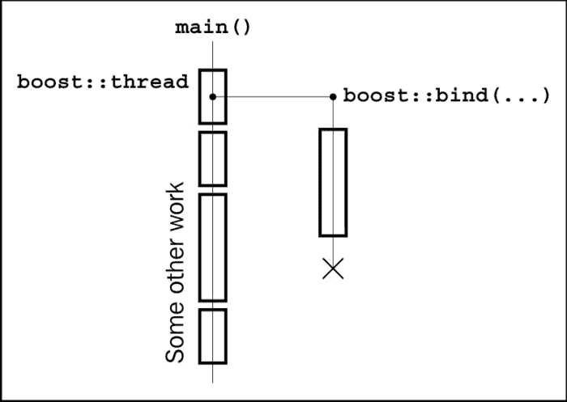
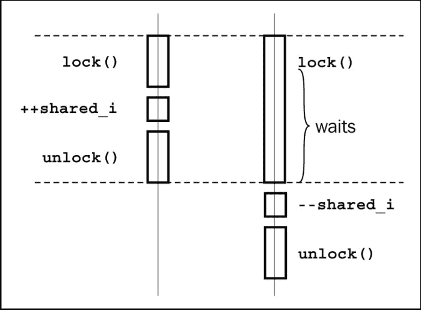
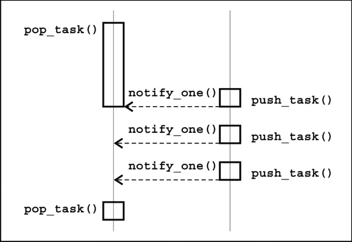

# 第五章 多线程

在本章中，我们将涵盖：

+   创建执行线程

+   同步访问公共资源

+   使用原子操作快速访问公共资源

+   创建工作队列类

+   多读单写锁

+   创建每个线程唯一的变量

+   中断线程

+   操作线程组

# 简介

在本章中，我们将处理线程及其相关内容。鼓励读者具备基本的多线程知识。

**多线程**意味着在单个进程中存在多个执行线程。线程可以共享进程资源并拥有自己的资源。这些执行线程可以在不同的 CPU 上独立运行，从而实现更快和更响应的程序。

`Boost.Thread` 库为操作系统接口提供了跨平台的统一性，用于处理线程。它不是一个仅包含头文件的库，因此本章中的所有示例都需要链接到 `libboost_thread` 和 `libboost_system` 库。

# 创建执行线程

在现代多核编译器上，为了实现最大性能（或仅仅提供良好的用户体验），程序通常必须使用多个执行线程。以下是一个激励示例，其中我们需要在绘制用户界面的线程中创建和填充一个大文件：

```cpp
#include <algorithm>
#include <fstream>
#include <iterator>

void set_not_first_run();
bool is_first_run();

// Function, that executes for a long time
void fill_file_with_data(char fill_char, std::size_t size, const char* filename){
  std::ofstream ofs(filename);
  std::fill_n(std::ostreambuf_iterator<char>(ofs), size, fill_char);
  set_not_first_run();
}

// ...
// Somewhere in thread that draws a user interface
if (is_first_run()) {
  // This will be executing for a long time during which
  // users interface will freeze..
  fill_file_with_data(0, 8 * 1024 * 1024, "save_file.txt");
}
```

## 准备工作

此配方需要了解 `boost::bind` 库。

## 如何做到这一点...

启动执行线程从未如此简单：

```cpp
#include <boost/thread.hpp>

// ...
// Somewhere in thread that draws a user interface
if (is_first_run()) {
  boost::thread(boost::bind(
      &fill_file_with_data,
      0,
      8 * 1024 * 1024,
      "save_file.txt"
  )).detach();
}
```

## 如何工作...

`boost::thread` 变量接受一个可以无参数调用的函数对象（我们使用 `boost::bind` 提供了一个），并创建一个单独的执行线程。该函数对象将被复制到构建的执行线程中并在那里运行。



### 注意

在所有使用 `Boost.Thread` 库的配方中，我们将默认使用线程的版本 4（定义 `BOOST_THREAD_VERSION` 为 4）并指出 `Boost.Thread` 版本之间的一些重要差异。

之后，我们调用 `detach()` 函数，它将执行以下操作：

+   执行线程将从 `boost::thread` 变量中分离，但将继续其执行

+   `boost::thread` 变量将保持 `Not-A-Thread` 状态

注意，如果没有调用 `detach()`，`boost::thread` 的析构函数会注意到它仍然持有线程，并将调用 `std::terminate`，这将终止我们的程序。

默认构造的线程也将具有 `Not-A-Thread` 状态，并且它们不会创建单独的执行线程。

## 更多...

如果我们想在执行其他工作之前确保文件已被创建并写入，我们需要使用以下方法连接线程：

```cpp
// ...
// Somewhere in thread that draws a user interface
if (is_first_run()) {
  boost::thread t(boost::bind(
      &fill_file_with_data,
      0,
      8 * 1024 * 1024,
      "save_file.txt"
  ));
  // Do some work
  // ...
  // Waiting for thread to finish
  t.join();
}
```

在线程连接后，`boost::thread` 变量将保持 `Not-A-Thread` 状态，其析构函数不会调用 `std::terminate`。

### 注意

记住，在调用析构函数之前，线程必须被连接或分离。否则，你的程序将终止！

注意，当任何非`boost::thread_interrupted`类型的异常离开功能对象的边界并传递给`boost::thread`构造函数时，会调用`std::terminate()`。

`boost::thread`类被接受为 C++11 标准的一部分，你可以在`std::`命名空间中的`<thread>`头文件中找到它。默认情况下，当`BOOST_THREAD_VERSION=2`时，`boost::thread`的析构函数将调用`detach()`，这不会导致`std::terminate`。但是这样做会破坏与`std::thread`的兼容性，而且有一天，当你的项目转移到 C++标准库线程或者当`BOOST_THREAD_VERSION=2`不再被支持时，这会给你带来很多惊喜。`Boost.Thread`的版本 4 更加明确和强大，这在 C++语言中通常是首选的。

有一个非常有用的包装器，它作为线程的 RAII 包装器工作，允许你模拟`BOOST_THREAD_VERSION=2`的行为；它被称为`boost::scoped_thread<T>`，其中`T`可以是以下类之一：

+   `boost::interrupt_and_join_if_joinable`: 在析构时中断并连接线程

+   `boost::join_if_joinable`: 在析构时连接一个线程

+   `boost::detach`: 在析构时分离一个线程

这里有一个小例子：

```cpp
#include <boost/thread/scoped_thread.hpp>
void some_func();
void example_with_raii() {
  boost::scoped_thread<boost::join_if_joinable> t(
    (boost::thread(&some_func))
  );
  // 't' will be joined at scope exit
}
```

### 注意

我们在`(boost::thread(&some_func))`周围添加了额外的括号，这样编译器就不会将其解释为函数声明而不是变量构造。

`Boost`和 C++11 STL 版本的`thread`类之间没有太大区别；然而，`boost::thread`在 C++03 编译器上可用，因此它的使用更加灵活。

## 参见

+   本章中的所有配方都将使用`Boost.Thread`；你可以继续阅读以获取更多关于它们的信息

+   官方文档列出了`boost::thread`的所有方法和关于它们在 C++11 STL 实现中可用性的说明；它可以在[`www.boost.org/doc/libs/1_53_0/doc/html/thread.html`](http://www.boost.org/doc/libs/1_53_0/doc/html/thread.html)找到。

+   “中断线程”的配方将给你一个关于`boost::interrupt_and_join_if_joinable`类所做事情的概念。

# 同步访问公共资源

现在我们知道了如何启动执行线程，我们希望从不同的线程访问一些公共资源：

```cpp
#include <cassert>
#include <cstddef>

// In previous recipe we included
// <boost/thread.hpp>, which includes all
// the classes of Boost.Thread
#include <boost/thread/thread.hpp>

int shared_i = 0;

void do_inc() {
  for (std::size_t i = 0; i < 30000; ++i) {
    // do some work
    // ...

    const int i_snapshot = ++ shared_i;

    // do some work with i_snapshot
    // ...
  }
}

void do_dec() {
  for (std::size_t i = 0; i < 30000; ++i) {
    // do some work
    // ...

    const int i_snapshot = -- shared_i;

    // do some work with i_snapshot
    // ...
  }
}

void run() {
  boost::thread t1(&do_inc);
  boost::thread t2(&do_dec);

  t1.join();
  t2.join();

  // assert(shared_i == 0); // Oops!
  std::cout << "shared_i == " << shared_i;
}
```

这个`'Oops!'`并不是无意中写上去的。对某些人来说，这可能是个惊喜，但有很大可能性`shared_i`不会等于 0：

```cpp
shared_i == 19567
```

### 注意

现代编译器和处理器有大量不同且复杂的优化，这些优化可能会破坏前面的代码。我们在这里不会讨论它们，但在“参见”部分有一个有用的链接，指向一个简要描述它们的文档。

而在公共资源包含一些非平凡类的情况下，情况会更糟；可能会（并且将会）发生段错误和内存泄漏。

我们需要修改代码，使得只有一个线程在某一时刻修改 `shared_i` 变量，并且绕过所有影响多线程代码的处理器和编译器优化。

## 准备工作

建议对线程有基本了解才能理解这个食谱。

## 如何做到这一点...

让我们看看如何修复前面的示例，并使 `shared_i` 在运行结束时相等：

1.  首先，我们需要创建一个互斥锁：

    ```cpp
    #include <boost/thread/mutex.hpp>
    #include <boost/thread/locks.hpp>

    int shared_i = 0;
    boost::mutex i_mutex;
    ```

1.  将修改或从 `shared_i` 变量获取数据的所有操作放在以下内容之间：

    ```cpp
    { // Critical section begin
      boost::lock_guard<boost::mutex> lock(i_mutex);
    ```

    以及以下内容：

    ```cpp
    } // Critical section end
    ```

它看起来是这样的：

```cpp
void do_inc() {
  for (std::size_t i = 0; i < 30000; ++i) {

    // do some work
    // …

    int i_snapshot;
    { // Critical section begin
      boost::lock_guard<boost::mutex> lock(i_mutex);
      i_snapshot = ++ shared_i;
    } // Critical section end

    // do some work with i_snapshot
    // ...
  }
}

void do_dec() {
  for (std::size_t i = 0; i < 30000; ++i) {
    // do some work
    // ...

    int i_snapshot;
    { // Critical section begin
      boost::lock_guard<boost::mutex> lock(i_mutex);
      i_snapshot = -- shared_i;
    } // Critical section end

    // do some work with i_snapshot
    // ...
  }
}
```

## 工作原理...

`boost::mutex` 类负责处理所有的同步问题。当一个线程尝试通过 `boost::lock_guard<boost::mutex>` 变量来锁定它，并且没有其他线程持有锁时，它将成功获取对代码段的独占访问权，直到锁被解锁或销毁。如果其他线程已经持有锁，尝试获取锁的线程将等待直到另一个线程解锁。所有的锁定/解锁操作都隐含了特定的指令，以确保在**临界区**中做出的更改对所有线程都是可见的。此外，你也不再需要**确保修改后的资源值对所有核心都是可见的，并且不仅仅是在处理器的寄存器中修改**，以及**强制处理器和编译器不重新排序指令**。

`boost::lock_guard` 类是一个非常简单的 RAII 类，它存储对互斥锁的引用，并在单参数构造函数中调用 `lock()`，在析构函数中调用 `unlock()`。注意前面示例中的花括号使用；`lock` 变量是在其中构造的，这样当达到 `critical section` 结束括号时，`lock` 变量的析构函数将被调用，互斥锁将被解锁。即使临界区中发生异常，互斥锁也会被正确解锁。



### 注意

如果你有一些资源被不同的线程使用，通常所有使用它们的代码都必须被视为临界区，并由互斥锁来保护。

## 还有更多...

锁定互斥锁可能是一个非常慢的操作，这可能会导致你的代码长时间停止，直到其他线程释放锁。尽量使临界区尽可能小，并尽量减少代码中的临界区数量。

让我们看看一些操作系统（OS）如何在多核 CPU 上处理锁定。当 `thread #1` 在 CPU1 上运行并尝试锁定另一个线程已锁定的互斥量时，`thread #1` 会被操作系统停止，直到锁被释放。被停止的线程不会**消耗**处理器资源，因此操作系统仍然会在 CPU1 上执行其他线程。现在我们在 CPU1 上有一些线程正在运行；其他某个线程释放了锁，现在操作系统必须恢复 `thread #1` 的执行。所以它将在当前空闲的 CPU 上恢复执行，例如，CPU2。这将导致 CPU 缓存未命中，并且在互斥量释放后代码将运行得略慢。这是减少关键区数量另一个原因。然而，事情并不那么糟糕，因为一个好的操作系统会尝试在之前使用的相同 CPU 上恢复线程。

不要尝试在同一个线程中两次锁定一个 `boost::mutex` 变量；这将导致**死锁**。如果需要从单个线程多次锁定互斥量，请使用 `boost::recursive_mutex` 而不是 `<boost/thread/recursive_mutex.hpp>` 头文件。多次锁定它不会导致死锁。`boost::recursive_mutex` 只在每次 `lock()` 调用后对每个 `unlock()` 调用释放锁。避免使用 `boost::recursive_mutex`；它比 `boost::mutex` 慢，通常表示代码流程设计不佳。

`boost::mutex`、`boost::recursive_mutex` 和 `boost::lock_guard` 类被纳入 C++11 标准，你可以在 `std::` 命名空间中的 `<mutex>` 头文件中找到它们。Boost 和 STL 版本之间没有太大区别；Boost 版本可能有一些扩展（这些扩展在官方文档中被标记为 *EXTENSION*），并且提供更好的可移植性，因为它们甚至可以在 C++03 编译器上使用。

## 另请参阅

+   下一个示例将给你一些想法，如何使这个例子更快（更短）。

+   阅读本章的第一个示例以获取更多关于 `boost::thread` 类的信息。`Boost.Thread` 的官方文档也可能有所帮助；它可以在 [`www.boost.org/doc/libs/1_53_0/doc/html/thread.html`](http://www.boost.org/doc/libs/1_53_0/doc/html/thread.html) 找到。

+   更多关于第一个示例为何会失败以及多处理器如何与公共资源协同工作的信息，请参阅 *《Memory Barriers: a Hardware View for Software Hackers》*，可在 [`www.rdrop.com/users/paulmck/scalability/paper/whymb.2010.07.23a.pdf`](http://www.rdrop.com/users/paulmck/scalability/paper/whymb.2010.07.23a.pdf) 查看。

# 使用原子操作快速访问公共资源

在前面的示例中，我们看到了如何从不同的线程安全地访问一个公共资源。但在那个示例中，我们只是为了从一个整数中获取值，就做了两次系统调用（在锁定和解锁互斥量时）：

```cpp
{ // Critical section begin
  boost::lock_guard<boost::mutex> lock(i_mutex);
  i_snapshot = ++ shared_i;
} // Critical section end
```

这看起来很糟糕！而且很慢！我们能否使前面示例中的代码更好？

## 准备工作

阅读第一个食谱就是开始这个的起点。或者，只需要一些关于多线程的基本知识。

## 如何做到这一点...

让我们看看如何改进我们之前的示例：

1.  我们将需要不同的头文件：

    ```cpp
    #include <cassert>
    #include <cstddef>

    #include <boost/thread/thread.hpp>
    #include <boost/atomic.hpp>
    ```

1.  需要更改`shared_i`的类型（因为它在互斥锁中不再需要）：

    ```cpp
    boost::atomic<int> shared_i(0);
    ```

1.  移除所有的`boost::lock_guard`变量：

    ```cpp
    void do_inc() {
      for (std::size_t i = 0; i < 30000; ++i) {
        // do some work
        // ...
        const int i_snapshot = ++ shared_i;
        // do some work with i_snapshot
        // ...
      }
    }

    void do_dec() {
      for (std::size_t i = 0; i < 30000; ++i) {
        // do some work
        // ...
        const int i_snapshot = -- shared_i;
        // do some work with i_snapshot
        // ...
      }
    }
    ```

    就这样！现在它工作了。

    ```cpp
    int main() {
      boost::thread t1(&do_inc);
      boost::thread t2(&do_dec);
      t1.join();
      t2.join();
      assert(shared_i == 0);
      std::cout << "shared_i == " << shared_i << std::endl;
    }
    ```

## 如何工作...

处理器提供特定的原子操作，这些操作不会被其他处理器或处理器核心干扰。对于系统来说，这些操作似乎瞬间发生。`Boost.Atomic`提供围绕系统特定原子操作的类，并提供一个统一且可移植的接口来与之交互。

换句话说，可以安全地在不同的线程中同时使用`boost::atomic<>`变量。对原子变量的每次操作都会被系统视为一个单独的事务。对原子变量的操作序列将被系统视为一系列事务：

```cpp
-- shared_i; // Transaction #1
// Some other thread may work here with shared_i and change its value
++shared_i; // Transaction #2
```


## 还有更多...

`Boost.Atomic`库只能与 POD 类型一起工作；否则，其行为是未定义的。一些平台/处理器可能不提供某些类型的原子操作，因此`Boost.Atomic`将使用`boost::mutex`来模拟原子行为。如果类型特定的宏设置为`2`，则原子类型不会使用`boost::mutex`：

```cpp
#include <boost/static_assert.hpp>
BOOST_STATIC_ASSERT(BOOST_ATOMIC_INT_LOCK_FREE == 2);
```

`boost::atomic<T>::is_lock_free`成员函数依赖于运行时，因此它不适合编译时检查，但在运行时检查足够的情况下，它可能提供更易读的语法：

```cpp
assert(shared_i.is_lock_free());
```

原子操作比互斥锁快得多。如果我们比较使用互斥锁的食谱的执行时间（0:00.08 秒）和这个食谱中前一个示例的执行时间（0:00.02 秒），我们会看到差异（在 3,00,000 次迭代中进行了测试）。

C++11 编译器应该在`std::`命名空间中的`<atomic>`头文件中包含所有的原子类、typedefs 和宏。如果编译器正确支持 C++11 内存模型，并且原子操作不再是编译器的障碍，那么特定编译器的`std::atomic`实现可能比 Boost 版本运行得更快。

## 参见

+   官方文档可能会给你提供更多关于这个主题的示例和一些理论信息；它可以在[`www.boost.org/doc/libs/1_53_0/doc/html/atomic.html`](http://www.boost.org/doc/libs/1_53_0/doc/html/atomic.html)找到

+   关于原子操作如何工作的更多信息，请参阅[`www.rdrop.com/users/paulmck/scalability/paper/whymb.2010.07.23a.pdf`](http://www.rdrop.com/users/paulmck/scalability/paper/whymb.2010.07.23a.pdf)上的*Memory Barriers: a Hardware View for Software Hackers*

# 创建一个`work_queue`类

让我们称这个不接受任何参数的功能对象（简称为任务）。

```cpp
typedef boost::function<void()> task_t;
```

现在，想象一下我们有两种类型的线程：一种是发布任务的线程，另一种是执行已发布任务的线程。我们需要设计一个可以被这两种类型的线程安全使用的类。这个类必须具有获取任务（或阻塞并等待任务，直到另一个线程发布它）的方法，检查和获取任务（如果没有任务剩余，则返回空任务），以及发布任务的方法。

## 准备工作

确保你对`boost::thread`或`std::thread`感到舒适，并且了解互斥锁的一些基础知识。

## 如何做到这一点...

我们将要实现的类在功能上将与`std::queue<task_t>`相似，并且也将具有线程同步。让我们开始：

1.  我们需要以下头文件和成员：

    ```cpp
    #include <deque>
    #include <boost/function.hpp>
    #include <boost/thread/mutex.hpp>
    #include <boost/thread/locks.hpp>
    #include <boost/thread/condition_variable.hpp>

    class work_queue {
    public:
      typedef boost::function<void()> task_type;

    private:
      std::deque<task_type>   tasks_;
      boost::mutex            tasks_mutex_;
      boost::condition_variable cond_;
    ```

1.  将任务放入队列的函数看起来像这样：

    ```cpp
    public:
      void push_task(const task_type& task) {
        boost::unique_lock<boost::mutex> lock(tasks_mutex_);
        tasks_.push_back(task);
        lock.unlock();
        cond_.notify_one();
      }
    ```

1.  用于获取已推送任务或空任务（如果没有任务剩余）的非阻塞函数：

    ```cpp
      task_type try_pop_task() {
        task_type ret;
        boost::lock_guard<boost::mutex> lock(tasks_mutex_);
        if (!tasks_.empty()) {
          ret = tasks_.front();
          tasks_.pop_front();
        }
        return ret;
      }
    ```

1.  用于获取已推送任务或阻塞直到另一个线程推送任务的阻塞函数：

    ```cpp
      task_type pop_task() {
        boost::unique_lock<boost::mutex> lock(tasks_mutex_);
        while (tasks_.empty()) {
          cond_.wait(lock);
        }
        task_type ret = tasks_.front();
        tasks_.pop_front();
        return ret;
      }
    };
    ```

    这就是`work_queue`类可能的使用方式：

    ```cpp
    #include <boost/thread/thread.hpp>

    work_queue g_queue;

    void do_nothing(){}

    const std::size_t tests_tasks_count = 3000;

    void pusher() {
      for (std::size_t i = 0; i < tests_tasks_count; ++i) {
        // Adding task to do nothing
        g_queue.push_task(&do_nothing);
      }
    }

    void popper_sync() {
      for (std::size_t i = 0; i < tests_tasks_count; ++i) {
        g_queue.pop_task() // Getting task
        (); // Executing task
      }
    }

    int main() {
      boost::thread pop_sync1(&popper_sync);
      boost::thread pop_sync2(&popper_sync);
      boost::thread pop_sync3(&popper_sync);

      boost::thread push1(&pusher);
      boost::thread push2(&pusher);
      boost::thread push3(&pusher);

      // Waiting for all the tasks to pop
      pop_sync1.join();
      pop_sync2.join();
      pop_sync3.join();

      push1.join();
      push2.join();
      push3.join();

      // Asserting that no tasks remained,
      // and falling though without blocking
      assert(!g_queue.try_pop_task());

      g_queue.push_task(&do_nothing);
      // Asserting that there is a task,
      // and falling though without blocking
      assert(g_queue.try_pop_task());
    }
    ```

## 工作原理...

在这个例子中，我们将看到一个新的 RAII 类`boost::unique_lock`。它只是具有附加功能的`boost::lock_guard`类；例如，它具有显式解锁和锁定互斥锁的方法。

回到我们的`work_queue`类，让我们从`pop_task()`函数开始。一开始，我们获取一个锁并检查是否有可用的任务。如果有任务，我们返回它；否则，调用`cond_.wait(lock)`。此方法将解锁锁并暂停执行线程，直到其他线程通知当前线程。

现在，让我们看看`push_task`方法。在其中，我们也获取了一个锁，将任务推送到`tasks_.queue`，解锁锁，并调用`cond_notify_one()`，这将唤醒在`cond_wait(lock)`中等待的线程（如果有）。所以，在那之后，如果某个线程在`pop_task()`方法中等待一个条件变量，该线程将继续执行，在`cond_wait(lock)`深处调用`lock.lock()`，并在 while 循环中检查`tasks_empty()`。因为我们刚刚在`tasks_`中添加了一个任务，所以我们将退出`while`循环，解锁互斥锁（`lock`变量将超出作用域），并返回一个任务。



### 注意

强烈建议你在循环中检查条件，而不仅仅是`if`语句。如果`thread #1`在`thread #2`推送任务之后弹出任务，但`thread #3`在它（`thread #3`）开始等待之前被`thread #2`通知，那么`if`语句将导致错误。

## 还有更多...

注意，我们在调用`notify_one()`之前明确解锁了互斥锁。如果没有解锁，我们的示例仍然可以工作。

但是，在这种情况下，唤醒的线程可能在尝试在`cond_wait(lock)`深处调用`lock.lock()`时再次被阻塞，这会导致更多的上下文切换和更差的表现。

当将 `tests_tasks_count` 设置为 `3000000` 且没有明确解锁时，此示例运行时间为 7 秒：

```cpp
$time -f E ./work_queue

0:07.38

```

使用显式解锁，此示例运行时间为 5 秒：

```cpp
$ time -f E ./work_queue 

0:05.39

```

你也可以使用 `cond_notify_all()` 通知等待特定条件变量的所有线程。

C++11 标准在 `<condition_variable>` 头文件中声明了 `std::condition_variable`，在 `<mutex>` 头文件中声明了 `std::unique_lock`。如果你需要可移植的行为，使用 Boost 版本，使用 C++03 编译器，或者只是使用一些 Boost 的扩展。

## 参见

+   本章的前三个食谱提供了关于 `Boost.Thread` 的许多有用信息

+   官方文档可能会给你提供更多示例以及一些关于该主题的理论信息；它可以在 [`www.boost.org/doc/libs/1_53_0/doc/html/thread.html`](http://www.boost.org/doc/libs/1_53_0/doc/html/thread.html) 找到

# 多读单写锁

想象一下我们正在开发一些在线服务。我们有一个注册用户的映射，每个用户有一些属性。这个集合被许多线程访问，但它很少被修改。所有对以下集合的操作都是以线程安全的方式完成的：

```cpp
#include <map>
#include <boost/thread/mutex.hpp>
#include <boost/thread/locks.hpp>

struct user_info {
  std::string address;
  unsigned short age;

  // Other parameters
  // ...
};

class users_online {
  typedef boost::mutex                      mutex_t;
  mutable mutex_t                           users_mutex_;
  std::map<std::string, user_info>          users_;

public:
  bool is_online(const std::string& username) const {
    boost::lock_guard<mutex_t> lock(mutex_);
    return users_.find(username) != users_.end();
  }

  unsigned short get_age(const std::string& username) const {
    boost::lock_guard<mutex_t> lock(mutex_);
    return users_.at(username).age;
  }

  void set_online(const std::string& username, const user_info& data) {
    boost::lock_guard<mutex_t> lock(mutex_);
    users_.insert(std::make_pair(username, data));
  }

  // Other methods
  // ...
};
```

但任何操作都会在 `mutex_` 变量上获取唯一锁，因此即使获取资源也会导致在锁定互斥锁上等待；因此，这个类很快就会成为瓶颈。

我们能修复它吗？

## 如何做到这一点...

对于不修改数据的方法，将 `boost::unique_locks` 替换为 `boost::shared_lock`：

```cpp
#include <boost/thread/shared_mutex.hpp>

class users_online {
  typedef boost::shared_mutex         mutex_t;
  mutable mutex_t                     users_mutex_;
  std::map<std::string, user_info>    users_;

public:
  bool is_online(const std::string& username) const {
    boost::shared_lock<mutex_t> lock(users_mutex_);
    return users_.find(username) != users_.end();
  }

  unsigned short get_age(const std::string& username) const {
    boost::shared_lock<mutex_t> lock(users_mutex_);
    return users_.at(username).age;
  }

  void set_online(const std::string& username, const user_info& data) {
    boost::lock_guard<mutex_t> lock(users_mutex_);
    users_.insert(std::make_pair(username, data));
  }

  // Other methods
  // ...
};
```

## 它是如何工作的...

如果那些线程不修改数据，我们可以允许从多个线程同时获取数据。只有当我们打算修改其中的数据时，我们才需要唯一拥有互斥锁；在其他所有情况下，允许同时访问它。这正是 `boost::shared_mutex` 被设计出来的原因。它允许共享锁定（读取锁定），这允许对资源的多个同时访问。

当我们尝试对共享锁定的资源进行唯一锁定时，操作将被阻塞，直到没有剩余的读取锁，并且只有在那个资源被唯一锁定之后，才允许新的共享锁等待直到唯一锁被释放。

一些读者可能第一次看到可变关键字。此关键字可以应用于非静态和非常量类成员。可变数据成员可以在常量成员函数中修改。

## 还有更多...

当你只需要唯一锁时，不要使用 `boost::shared_mutex`，因为它比普通的 `boost::mutex` 类稍微慢一些。然而，在其他情况下，它可能会带来很大的性能提升。例如，对于四个读取线程，共享互斥锁将比 `boost::mutex` 快近四倍。

不幸的是，共享互斥锁不是 C++11 标准的一部分。

## 参见

+   此外，还有一个 `boost::upgrade_mutex` 类，在需要将共享锁提升为独占锁的情况下可能很有用。有关更多信息，请参阅 `Boost.Thread` 文档 [`www.boost.org/doc/libs/1_53_0/doc/html/thread.html`](http://www.boost.org/doc/libs/1_53_0/doc/html/thread.html)。

+   更多关于 `mutable` 关键字的信息，请参阅 [`herbsutter.com/2013/01/01/video-you-dont-know-const-and-mutable/`](http://herbsutter.com/2013/01/01/video-you-dont-know-const-and-mutable/)。

# 创建每个线程唯一的变量

让我们快速看一下 *创建一个* *工作队列类* 的配方。那里的每个任务都可以在许多线程中的一个上执行，我们不知道是哪一个。想象一下，我们想要使用某个连接发送已执行任务的成果。

```cpp
#include <boost/noncopyable.hpp>

class connection: boost::noncopyable {
public:
  // Opening a connection is a slow operation
  void open();

  void send_result(int result);

  // Other methods
  // ...
};
```

我们有以下解决方案：

+   当我们需要发送数据时打开一个新的连接（这很慢）

+   为所有线程提供一个单一的连接，并将它们包装在互斥锁中（这也很慢）

+   拥有一个连接池，以线程安全的方式从中获取一个连接并使用它（需要大量的编码，但这个解决方案速度快）

+   每个线程有一个单一的连接（快速且易于实现）

那么，我们如何实现最后的解决方案呢？

## 准备工作

需要基本了解线程知识。

## 如何做...

是时候创建一个线程局部变量了：

```cpp
// In header file
#include <boost/thread/tss.hpp>

connection& get_connection();

// In source file
boost::thread_specific_ptr<connection> connection_ptr;

connection& get_connection() {
  connection* p = connection_ptr.get();
  if (!p) {
    connection_ptr.reset(new connection);
    p = connection_ptr.get();
    p->open();
  }
  return *p;
}
```

使用线程特定的资源从未如此简单：

```cpp
void task() {
  int result;
  // Some computations go there
  // ...

  // Sending result
  get_connection().send_result(result);
}
```

## 它是如何工作的...

`boost::thread_specific_ptr` 变量为每个线程持有单独的指针。最初，这个指针等于 `NULL`；这就是为什么我们检查 `!p` 并在它是 `NULL` 时打开一个连接。

因此，当我们从已经初始化指针的线程进入 `get_connection()` 时，`!p` 将返回 `false` 的值，我们将返回已经打开的连接。当线程退出时，将调用 `delete` 指针，所以我们不需要担心内存泄漏。

## 还有更多...

您可以提供一个自己的清理函数，该函数将在线程退出时调用而不是 `delete`。清理函数必须具有 `void (*cleanup_function)(T*)` 签名，并在 `boost::thread_specific_ptr` 构造期间传递。

C++11 有一个特殊的关键字，`thread_local`，用于声明具有线程局部存储持续时间的变量。C++11 没有提供 `thread_specific_ptr` 类，但您可以使用 `thread_local boost::scoped_ptr<T>` 或 `thread_local std::unique_ptr<T>` 在支持 `thread_local` 的编译器上实现相同的行为。

## 参见

+   `Boost.Thread` 文档提供了大量关于不同情况的好例子；它可以在 [`www.boost.org/doc/libs/1_53_0/doc/html/thread.html`](http://www.boost.org/doc/libs/1_53_0/doc/html/thread.html) 找到。

+   阅读这个主题[`stackoverflow.com/questions/13106049/c11-gcc-4-8-thread-local-performance-penalty.html`](http://stackoverflow.com/questions/13106049/c11-gcc-4-8-thread-local-performance-penalty.html)以及关于`GCC__thread`关键字的[`gcc.gnu.org/onlinedocs/gcc-3.3.1/gcc/Thread-Local.html`](http://gcc.gnu.org/onlinedocs/gcc-3.3.1/gcc/Thread-Local.html)可能会给你一些关于编译器中`thread_local`是如何实现的以及它的速度如何的想法

# 中断线程

有时候，我们需要终止消耗过多资源或执行时间过长的线程。例如，某些解析器在一个线程中工作（并积极使用`Boost.Thread`），但我们已经从它那里获得了所需的数据量，因此解析可以停止。我们只需要：

```cpp
boost::thread parser_thread(&do_parse);
  // Some code goes here
  // ...
  if (stop_parsing) {
    // no more parsing required
    // TODO: stop parser
  }
```

我们如何做到这一点？

## 准备工作

对于这个配方，几乎不需要什么。你只需要至少具备基本线程知识。

## 如何做到这一点...

我们可以通过中断来停止线程：

```cpp
if (stop_parsing) {
  // no more parsing required
  parser_thread.interrupt();
}
```

## 它是如何工作的...

`Boost.Thread`提供了一些预定义的中断点，在这些中断点中，线程通过`interrupt()`调用被检查是否被中断。如果线程被中断，将抛出异常`boost::thread_interrupted`。

`boost::thread_interrupted`不是从`std::exception`派生的！

## 还有更多...

如我们从第一个配方所知，如果一个传递给线程的函数不会捕获异常，并且异常将离开函数边界，应用程序将终止。`boost::thread_interrupted`是这一规则的唯一例外；它可以离开函数边界，并且不会`std::terminate()`应用程序；相反，它停止执行线程。

我们也可以在任何地方添加中断点。我们只需要调用`boost::this_thread::interruption_point()`：

```cpp
void do_parse() {
  while (not_end_of_parsing) {
    boost::this_thread::interruption_point();
    // Some parsing goes here
  }
}
```

如果项目不需要中断，定义`BOOST_THREAD_DONT_PROVIDE_INTERRUPTIONS`可以提供一些性能提升，并完全禁用线程中断。

C++11 没有线程中断，但你可以使用原子操作部分模拟它们：

+   创建一个原子布尔变量

+   检查线程中的原子变量，如果它已更改则抛出一些异常

+   不要忘记在传递给线程的函数中捕获那个异常（否则你的应用程序将终止）

然而，如果代码在条件变量或睡眠方法中的某个地方等待，这不会对你有所帮助。

## 参见

+   `Boost.Thread`的官方文档提供了预定义的中断点的列表，请参阅[`www.boost.org/doc/libs/1_53_0/doc/html/thread/thread_management.html#thread.thread_management.tutorial.interruption.html`](http://www.boost.org/doc/libs/1_53_0/doc/html/thread/thread_management.html#thread.thread_management.tutorial.interruption.html)

+   作为练习，查看本章的其他配方，并思考在哪些地方添加额外的中断点可以改进代码

+   阅读其他部分的`Boost.Thread`文档可能很有用；请访问[`www.boost.org/doc/libs/1_53_0/doc/html/thread.html`](http://www.boost.org/doc/libs/1_53_0/doc/html/thread.html)

# 操作线程组

那些试图自己重复所有示例的读者，或者那些在实验线程的读者，可能已经对编写以下代码来启动线程感到厌烦了：

```cpp
boost::thread t1(&some_function);
boost::thread t2(&some_function);
boost::thread t3(&some_function);
// ...
t1.join();
t2.join();
t3.join();
```

可能还有更好的方法来做这件事？

## 准备工作

对于这个配方，对线程的基本知识将绰绰有余。

## 如何操作...

我们可以使用`boost::thread_group`类来操作一组线程。

1.  构建一个`boost::thread_group`变量：

    ```cpp
    boost::thread_group threads;
    ```

1.  将线程创建到前面的变量中：

    ```cpp
    // Launching 10 threads
    for (unsigned i = 0; i < 10; ++i) {
      threads.create_thread(&some_function);
    }
    ```

1.  现在你可以调用`boost::thread_group`内部的所有线程的函数：

    ```cpp
    // Joining all threads
    threads.join_all();

    // We can also interrupt all of them
    // by calling threads.interrupt_all();
    ```

## 它是如何工作的...

`boost::thread_group`变量仅保存构建或移动到其中的所有线程，并可能向所有线程发送一些调用。

## 还有更多...

C++11 没有`thread_group`类；这是 Boost 特有的。

## 参见

+   `Boost.Thread`的官方文档可能会让你惊讶于本章未描述的许多其他有用的类；请访问[`www.boost.org/doc/libs/1_53_0/doc/html/thread.html`](http://www.boost.org/doc/libs/1_53_0/doc/html/thread.html)
