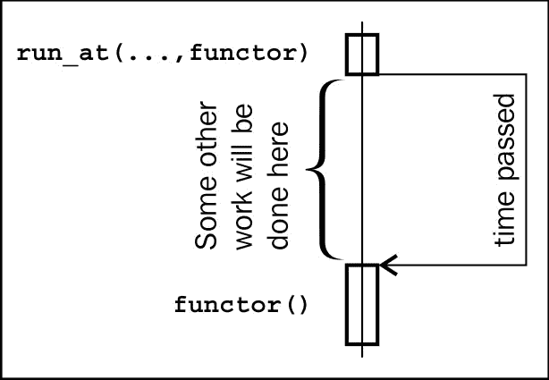
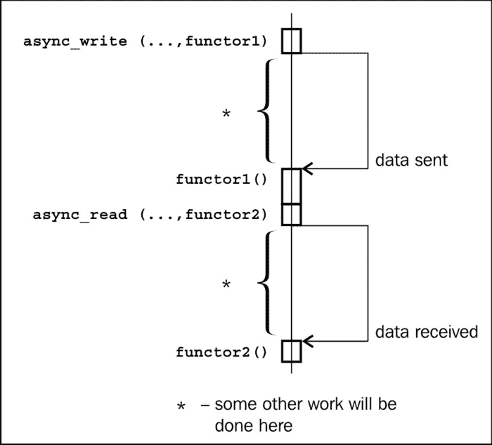
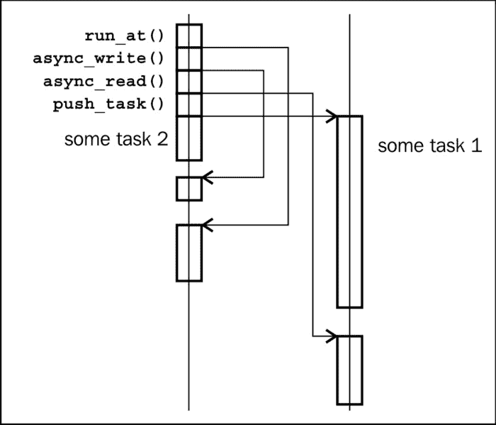
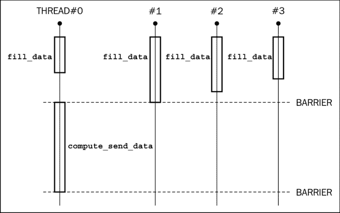
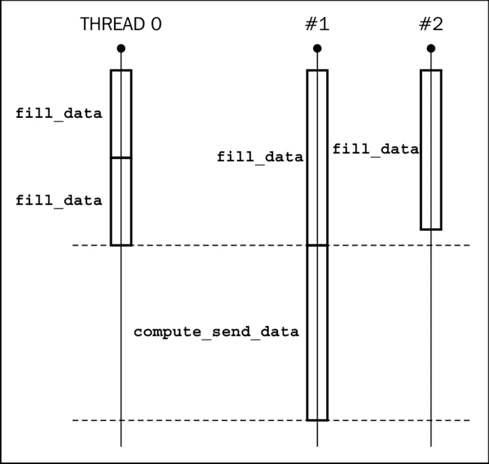

# 第六章 操作任务

在本章中，我们将介绍：

+   注册一个任务以处理任意数据类型

+   创建计时器并将计时器事件作为任务处理

+   网络通信作为任务

+   接受传入的连接

+   并行执行不同的任务

+   传送带任务处理

+   创建一个非阻塞屏障

+   存储异常并从它创建任务

+   将获取和处理系统信号作为任务

# 简介

本章全部关于任务。我们将调用功能对象为任务（因为它更短，更好地反映了它应该做什么）。本章的主要思想是我们可以将所有处理、计算和交互分解为 **functors**（任务），并几乎独立地处理每个任务。此外，我们可能不会在某些慢操作（如从套接字接收数据或等待超时）上阻塞，而是提供一个回调任务并继续与其他任务一起工作。一旦操作系统完成慢操作，我们的回调将被执行。

## 在开始之前

本章至少需要了解第一、第三和第五章。

# 注册一个任务以处理任意数据类型

首先，让我们关注将持有所有任务并提供执行方法类的结构。我们已经在 *创建 work_queue 类* 的配方中做了类似的事情，但以下一些问题尚未解决：

+   一个任务可能会抛出一个异常，导致调用 `std::terminate`

+   一个被中断的线程可能不会注意到中断，但会完成其任务，并在下一个任务期间中断（这不是我们想要的；我们想要中断上一个任务）

+   我们的 `work_queue` 类只存储和返回任务，但我们需要添加执行现有任务的方法

+   我们需要一种停止处理任务的方法

## 准备就绪

这个配方需要链接到 `libboost_system` 库。还需要了解 `Boost.Bind` 以及对 `Boost.Thread` 的基本了解。

## 如何做到...

我们将使用 `boost::io_service` 而不是上一章中的 `work_queue`。这样做有原因，我们将在接下来的配方中看到。

1.  让我们从围绕用户任务的包装结构开始：

    ```cpp
    #include <boost/thread/thread.hpp>

    namespace detail {

      template <class T>
      struct task_wrapped {
      private:
        T task_unwrapped_;

      public:
        explicit task_wrapped(const T& task_unwrapped)
          : task_unwrapped_(task_unwrapped)
        {}

        void operator()() const {
          // resetting interruption
          try {
            boost::this_thread::interruption_point();
          } catch(const boost::thread_interrupted&){}

          try {
            // Executing task
            task_unwrapped_();
          } catch (const std::exception& e) {
            std::cerr<< "Exception: " << e.what() << '\n';
          } catch (const boost::thread_interrupted&) {
            std::cerr<< "Thread interrupted\n";
          } catch (...) {
            std::cerr<< "Unknown exception\n";
          }
        }
      };
    ```

1.  为了便于使用，我们将创建一个函数，从用户的函数对象生成 `task_wrapped`：

    ```cpp
      template <class T>
      task_wrapped<T> make_task_wrapped(const T& task_unwrapped)
      {
        return task_wrapped<T>(task_unwrapped);
      }

    } // namespace detail
    ```

1.  现在我们已经准备好编写 `tasks_processor` 类：

    ```cpp
    #include <boost/asio/io_service.hpp>
    class tasks_processor: private boost::noncopyable {
      boost::asio::io_service         ios_;
      boost::asio::io_service::work   work_;
      tasks_processor()
        : ios_()
        , work_(ios_)
      {}
    public:
      static tasks_processor& get();
    ```

1.  现在我们将添加 `push_task` 方法：

    ```cpp
      template <class T>
      inline void push_task(const T& task_unwrapped) {
        ios_.post(detail::make_task_wrapped(task_unwrapped));
      }
    ```

1.  让我们通过添加启动和停止任务执行循环的成员函数来完成这个类：

    ```cpp
      void start() {
        ios_.run();
      }
      void stop() {
        ios_.stop();
      }
    }; // tasks_processor
    ```

    是时候测试我们的类了。为此，我们将创建一个测试函数：

    ```cpp
    int g_val = 0;
    void func_test() {
      ++ g_val;
      if (g_val == 3) {
        throw std::logic_error("Just checking");
      }

      boost::this_thread::interruption_point();
      if (g_val == 10) {
        // Emulation of thread interruption.
        // Will be caught and won't stop execution.
        throw boost::thread_interrupted();
      }
      if (g_val == 90) {
        tasks_processor::get().stop();
      }
    }
    ```

    `main` 函数可能看起来像这样：

    ```cpp
    int main () {
      static const std::size_t tasks_count = 100;
      // stop() is called at 90
      BOOST_STATIC_ASSERT(tasks_count > 90);
      for (std::size_t i =0; i < tasks_count; ++i) {
        tasks_processor::get().push_task(&func_test);
      }

      // We can also use result of boost::bind call
      // as a task
      tasks_processor::get().push_task(
        boost::bind(std::plus<int>(), 2, 2) // counting 2 + 2
      );

      // Processing was not started.
      assert(g_val == 0);

      // Will not throw, but blocks till
      // one of the tasks it is owning
      // calls stop().
      tasks_processor::get().start();
      assert(g_val== 90);
    }
    ```

## 它是如何工作的...

`boost::io_service`变量可以存储和执行发送给它的任务。但我们可能不能直接将用户的任务发送给它，因为它们可能会抛出或接收针对其他任务的干扰。这就是为什么我们用`detail::task_wrapped`结构包装用户的任务。它通过调用以下方式重置所有之前的干扰：

```cpp
    try {
      boost::this_thread::interruption_point();
    } catch(const boost::thread_interrupted&){}
```

并且在`try{}catch()`块中执行任务，确保没有异常会离开`operator()`的作用域。

`boost::io_service::run()`方法将从队列中获取准备好的任务并逐个执行。这个循环通过调用`boost::io_service::stop()`来停止。如果没有更多任务，`boost::io_service`类将从`run()`函数返回，因此我们使用`boost::asio::io_service::work`的一个实例强制它继续执行。

### 注意

`iostream`类以及如`std::cerr`和`std::cout`这样的变量不是线程安全的。在实际项目中，必须使用额外的同步来获取可读的输出。为了简单起见，我们这里没有这样做。

## 还有更多...

C++11 STL 库没有`io_service`；然而，它（以及`Boost.Asio`库的大部分内容）被提议作为**技术报告**（**TR**）作为 C++的补充。

## 参考以下内容

+   以下菜谱将展示我们为什么选择`boost::io_service`而不是我们手写的代码。

+   你可以考虑阅读`Boost.Asio`文档，以获取一些示例、教程和类参考，请访问[`www.boost.org/doc/libs/1_53_0/doc/html/boost_asio.html`](http://www.boost.org/doc/libs/1_53_0/doc/html/boost_asio.html)。

+   你也可以阅读《Boost.Asio C++网络编程》这本书，它对`Boost.Asio`提供了一个更平滑的介绍，并涵盖了本书未涉及的一些细节。

# 将计时器和处理计时器事件作为任务

检查指定间隔内的某些内容是一个常见任务；例如，我们每 5 秒钟需要检查一些会话的活动。对此类问题有两种流行的解决方案：创建一个线程或睡眠 5 秒钟。这是一个非常糟糕的解决方案，它会消耗大量的系统资源，并且扩展性很差。我们可以使用特定于系统的 API 来异步操作计时器，这是一个更好的解决方案，但它需要大量的工作，并且不太便携（直到你为不同的平台编写了许多包装器）。它还让你与那些并不总是很友好的操作系统 API 打交道。

## 准备工作

你必须知道如何使用`Boost.Bind`和`Boost.SmartPtr`。参见本章的第一道菜谱，以获取有关`boost::asio::io_service`和`task_queue`类的信息。将此菜谱与`libboost_system`库链接。

这个菜谱有点棘手，所以请做好准备！

## 如何做到这一点...

此菜谱基于前一道菜谱中的代码。我们只是通过添加新方法来修改`tasks_processor`类，以便在指定时间运行任务。

1.  让我们在`tasks_processor`类中添加一个方法，以便在某个时间运行一个任务：

    ```cpp
      typedef boost::asio::deadline_timer::time_type time_type;

      template <class Functor>
      void run_at(time_type time, const Functor& f) {
        detail::make_timer_task(ios_, time, f)
          .push_task();
      }
    ```

1.  我们为 `task_queue` 类添加了一个方法，用于在所需的时间间隔过后运行一个任务：

    ```cpp
      typedef boost::asio::deadline_timer::duration_type 
        duration_type;

      template <class Functor>
      void run_after(duration_type duration, const Functor& f) {
        detail::make_timer_task(ios_, duration, f)
          .push_task();
      }
    ```

1.  是时候照顾 `detail::make_timer_task` 函数了：

    ```cpp
    namespace detail {
      template <class Time, class Functor>
      inline timer_task<Functor> make_timer_task(
        boost::asio::io_service& ios,
        const Time& duration_or_time,
        const Functor& task_unwrapped)
      {
        return timer_task<Functor>(ios, duration_or_time,
          task_unwrapped);
      }
    }
    ```

1.  最后一步将是编写一个 `timer_task` 结构：

    ```cpp
    #include <boost/asio/io_service.hpp>
    #include <boost/asio/deadline_timer.hpp>
    #include <boost/system/error_code.hpp>
    #include <boost/make_shared.hpp>
    #include <iostream>

    namespace detail {

      typedef boost::asio::deadline_timer::duration_type duration_type;

      template <class Functor>
      struct timer_task: public task_wrapped<Functor> {
      private:
        typedef task_wrapped<Functor> base_t;
        boost::shared_ptr<boost::asio::deadline_timer> timer_;

      public:
        template <class Time>
        explicit timer_task(
          boost::asio::io_service& ios,
          const Time& duration_or_time,
          const Functor& task_unwrapped)
            : base_t(task_unwrapped)
            , timer_(boost::make_shared<boost::asio::deadline_timer>(
              boost::ref(ios), duration_or_time
          ))
        {}

        void push_task() const {
          timer_->async_wait(*this);
        }

        void operator()(const boost::system::error_code& error) const {
          if (!error) {
            base_t::operator()();
          } else {
            std::cerr << error << '\n';
          }
        }
      };
    } // namespace detail
    ```

## 工作原理...

这就是所有工作的原理；用户向 `run_after` 函数提供超时和一个函数对象。在其中，构建了一个 `detail::timer_task` 对象，该对象存储了一个用户提供的函数对象并创建了一个指向 `boost::asio::deadline_timer` 的共享指针。构建的 `detail::timer_task` 对象被推送到一个函数对象，该函数对象必须在定时器触发时被调用。`detail::timer_task::operator()` 方法接受 `boost::system::error_code`，它将包含等待过程中发生的任何错误的描述。如果没有发生错误，我们调用被包裹的用户函数对象来捕获异常（我们重用第一道菜谱中的 `detail::task_wrapped` 结构）。以下图表说明了这一点：



注意，我们将 `boost::asio::deadline_timer` 包裹在 `boost::shared_ptr` 中，并将整个 `timer_task` 函数对象（包括 `shared_ptr`）传递给 `timer_->async_wait(*this)`。这样做是因为 `boost::asio::deadline_timer` 必须在触发之前不被销毁，将 `timer_task` 函数对象存储在 `io_service` 中可以保证这一点。

### 注意

简而言之，当指定的时间经过后，`boost::asio::deadline_timer` 将将用户的任务推送到 `boost::asio::io_service` 队列类以执行。

## 还有更多...

一些平台没有提供良好的定时器 API，因此 `Boost.Asio` 库通过为每个 `io_service` 创建一个额外的执行线程来模拟异步定时器的行为。无论如何，`Boost.Asio` 是处理定时器的最便携和最有效的库之一。

## 参见

+   阅读本章的第一道菜谱将教会你 `boost::asio::io_service` 的基础知识。接下来的菜谱将为你提供更多 `io_service` 用法的示例，并展示如何使用 `Boost.Asio` 处理网络通信、信号和其他功能。

+   你可以考虑查看 `Boost.Asio` 文档以获取一些示例、教程和类参考，请访问 [`www.boost.org/doc/libs/1_53_0/doc/htm`](http://www.boost.org/doc/libs/1_53_0/doc/htm)[l/boost_asio.html](http://l/boost_asio.html)。

# 网络通信作为一个任务

通过网络接收或发送数据是一个缓慢的操作。当机器接收数据包，操作系统验证它们并将数据复制到用户指定的缓冲区时，可能需要几秒钟的时间。而我们可能能够做很多工作而不是等待。让我们修改我们的`tasks_processor`类，使其能够以异步方式发送和接收数据。用非技术术语来说，我们要求它“从远程主机接收至少 N 个字节，然后完成这个操作后，调用我们的函数。顺便说一下，不要在这个调用上阻塞”。那些了解`libev`、`libevent`或`Node.js`的读者会发现这个配方中有许多熟悉的东西。

## 准备工作

为了更容易地采用这一材料，需要了解`boost::bind`、`boost::shared_ptr`和占位符。还需要了解如何将此配方与`libboost_system`库链接的信息。

## 如何操作...

让我们通过添加创建连接的方法来扩展前面配方中的代码。一个连接将由`tcp_connection_ptr`类表示，它必须仅使用`tasks_processor`来构造（作为一个类比，`tasks_processor`是构造此类连接的工厂）。

1.  我们需要在`tasks_processor`中添加一个方法来创建端点（我们将称它们为连接）的套接字：

    ```cpp
    tcp_connection_ptr create_connection(const char* addr, 
      unsigned short port_num) 
    {
      return tcp_connection_ptr(
        ios_, 
        boost::asio::ip::tcp::endpoint(
          boost::asio::ip::address_v4::from_string(addr), port_num
        )
      );
    }
    ```

1.  我们需要包含以下许多头文件：

    ```cpp
    #include <boost/asio/ip/tcp.hpp>
    #include <boost/asio/placeholders.hpp>
    #include <boost/asio/write.hpp>
    #include <boost/asio/read.hpp>
    #include <boost/shared_ptr.hpp>
    #include <boost/function.hpp>
    #include <boost/enable_shared_from_this.hpp>
    ```

1.  `tcp_connection_ptr`类需要管理连接。它拥有套接字并管理其生命周期。它只是`boost::shared_ptr<boost::asio::ip::tcp::socket>`的一个薄包装器，它隐藏了`Boost.Asio`对用户。

    ```cpp
    class tcp_connection_ptr {
      boost::shared_ptr<boost::asio::ip::tcp::socket> socket_;

    public:
      explicit tcp_connection_ptr(
        boost::shared_ptr<boost::asio::ip::tcp::socket> socket)
        : socket_(socket) 
      {}

      explicit tcp_connection_ptr(
        boost::asio::io_service& ios, 
        const boost::asio::ip::tcp::endpoint& endpoint)
        : socket_(boost::make_shared<boost::asio::ip::tcp::socket>(
          boost::ref(ios)
        ))
      {
        socket_->connect(endpoint);
      }
    ```

1.  `tcp_connection_ptr`类将需要读取数据的方法：

    ```cpp
      template <class Functor>
      void async_read(
        const boost::asio::mutable_buffers_1& buf, 
        const Functor& f, 
        std::size_t at_least_bytes) const 
      {
        boost::asio::async_read(
          *socket_, buf, boost::asio::transfer_at_least(
            at_least_bytes
          ), f
        );
      }
    ```

1.  还需要编写数据的方法：

    ```cpp
      template <class Functor>
      void async_write(
        const boost::asio::const_buffers_1& buf, const Functor& f) const 
      {
        boost::asio::async_write(*socket_, buf, f);
      }

      template <class Functor>
      void async_write(
        const boost::asio::mutable_buffers_1& buf, const Functor& f) const 
      {
        boost::asio::async_write(*socket_, buf, f);
      }
    ```

1.  我们还将添加一个关闭连接的方法：

    ```cpp
      void shutdown() const {
        socket_->shutdown(boost::asio::ip::tcp::socket::shutdown_both);
        socket_->close();
      }
    };
    ```

    现在，图书馆用户可以使用前面的类这样发送数据：

    ```cpp
    const unsigned short g_port_num = 65001;

    void send_auth_task() {
      tcp_connection_ptr soc = tasks_processor::get().create_connection("127.0.0.1", g_port_num);

      boost::shared_ptr<std::string> data = boost::make_shared<std::string>("auth_name");

      soc.async_write( 
        boost::asio::buffer(*data),
        boost::bind(
          &recieve_auth_task, 
          boost::asio::placeholders::error,
          soc, 
          data
        )
      );
    }
    ```

    用户也可以这样使用它来接收数据：

    ```cpp
    void recieve_auth_task(
        const boost::system::error_code& err, 
        const tcp_connection_ptr& soc, 
        const boost::shared_ptr<std::string>& data) 
    {
        if (err) {
          std::cerr << "recieve_auth_task: Client error on recieve: " 
                    << err.message() << '\n';
          assert(false);
        }

      soc.async_read( 
        boost::asio::buffer(&(*data)[0], data->size()),
        boost::bind(
          &finsh_socket_auth_task, 
          boost::asio::placeholders::error,
          boost::asio::placeholders::bytes_transferred,
          soc, 
          data
        ),
        1
      );
    }
    ```

    这就是图书馆用户可能处理接收到的数据的方式：

    ```cpp
    bool g_authed = false;

    void finsh_socket_auth_task(
        const boost::system::error_code& err, 
        std::size_t bytes_transfered, 
        const tcp_connection_ptr& soc, 
        const boost::shared_ptr<std::string>& data) 
    {
      if (err && err != boost::asio::error::eof) {
        std::cerr << "finsh_socket_auth_task: Client error "
                  << "on recieve: " << err.message() << '\n';
        assert(false);
      }

      if (bytes_transfered != 2) {
        std::cerr << "finsh_socket_auth_task: wrong bytes count\n";
        assert(false);
      }

      data->resize(bytes_transfered);
      if (*data != "OK") {
        std::cerr << "finsh_socket_auth_task: wrong response: " << *data << '\n';
        assert(false);
      }

      g_authed = true;
      soc.shutdown();
      tasks_processor::get().stop();
    }
    ```

## 如何工作...

所有有趣的事情都发生在`async_*`函数的调用中。就像定时器的情况一样，异步调用会立即返回而不执行函数。它们只告诉`boost::asio::io_service`类在某个操作（例如从套接字读取数据）完成后执行回调任务。`io_service`将在调用`io_service::run()`方法的线程之一中执行我们的函数。

以下图表说明了这一点：



现在，让我们一步一步地检查这个步骤。

`tcp_connection_ptr`类持有对`boost::asio::ip::tcp::socket`的共享指针，它是围绕本地套接字的`Boost.Asio`包装器。我们不希望用户能够直接使用这个包装器，因为它有同步方法，我们正在试图避免使用这些方法。

第一个构造函数接受套接字的指针（并将用于我们的下一个配方）。这个构造函数不会由用户使用，因为 `boost::asio::ip::tcp::socket` 构造函数需要一个对 `boost::asio::io_service` 的引用，它隐藏在 `tasks_processor` 中。

### 注意

当然，我们库的一些用户可能足够聪明，能够创建一个 `boost::asio::io_service` 的实例，初始化套接字，并将任务推送到该实例。将 `Boost.Asio` 库的内容移动到源文件并实现 **Pimpl 习语**可以帮助你保护用户免受自己伤害，但为了简单起见，我们不会在这里实现它。另一种做事的方式是将 `tasks_processor` 类声明为 `tcp_connection_ptr` 的朋友，并使 `tcp_connection_ptr` 构造函数私有。

第二个构造函数接受一个远程端点和 `io_service` 的引用。在那里，你可以看到如何使用 `socket_->connect(endpoint)` 方法将套接字连接到端点。此外，这个构造函数不应该由用户使用；用户应该使用 `tasks_processor::create_connection` 代替。

在使用 `async_write` 和 `async_read` 函数时应该格外小心。套接字和缓冲区必须在异步操作完成之前不能被销毁；这就是为什么在调用 `async_*` 函数时我们将 `shared_ptr` 绑定到功能对象：

```cpp
tcp_connection_ptr soc = tasks_processor::get()
    .create_connection("127.0.0.1", g_port_num);

boost::shared_ptr<std::string> data 
    = boost::make_shared<std::string>("auth_name");

soc.async_write( 
  boost::asio::buffer(*data),
  boost::bind(
    &recieve_auth_task, 
    boost::asio::placeholders::error,
    soc, 
    data
  )
);
```

将共享指针绑定到将在异步操作结束时调用的功能对象，确保至少存在一个 `boost::shared_ptr` 的连接和数据实例。这意味着连接和数据将不会在功能对象析构函数被调用之前被销毁。

### 注意

`Boost.Asio` 可能会复制函数对象，这就是为什么我们使用 `boost::shared_ptr<std::string>` 类而不是按值传递 `std::string` 类（这将使 `boost::asio::buffer(*data)` 无效并导致段错误）。

## 还有更多...

仔细看看 `finsh_socket_auth_task` 函数。它检查 `err != boost::asio::error::eof`。这样做是因为数据输入的末尾被视为一个错误；然而，这也可能意味着端点主机关闭了套接字，这并不总是坏事（在我们的例子中，我们将其视为非错误行为）。

`Boost.Asio` 并不是 C++11 的一部分，但它被提议包含在 C++ 中，我们可能会在下一个 TR 中看到它（或者至少它的某些部分）被包含。

## 参见

+   请参阅[`www.boost.org/doc/libs/1_53_0/doc/html/boost_asio.html`](http://www.boost.org/doc/libs/1_53_0/doc/html/boost_asio.html)的官方文档，了解更多关于`Boost.Asio`的示例、教程和完整参考，以及如何使用 UDP 和 ICMP 协议的示例。对于熟悉 BSD 套接字 API 的读者，[`www.boost.org/doc/libs/1_53_0/doc/html/boost_asio/overview/networking/bsd_sockets.html`](http://www.boost.org/doc/libs/1_53_0/doc/html/boost_asio/overview/networking/bsd_sockets.html)页面提供了关于在`Boost.Asio`中 BSD 调用看起来像什么的信息。

+   有关`Boost.Bind`的更多信息，请阅读第一章中的*记录函数参数*和*将值绑定为函数参数*菜谱，*开始编写您的应用程序*。第三章管理资源中的*跨方法使用类指针的引用计数*菜谱将为您提供更多关于`boost::shared_ptr`类所做工作的信息。

+   您还可以阅读《Boost.Asio C++网络编程》这本书，*Packt Publishing*，它更详细地描述了`Boost.Asio`。

# 接受传入的连接

与网络一起工作的服务器通常看起来像这样一个序列：我们首先获取数据，然后处理它，最后发送结果。想象一下，我们正在创建一种授权服务器，它每秒将处理大量的请求。在这种情况下，我们需要异步接收和发送数据，并在多个线程中处理任务。

在这个菜谱中，我们将看到如何扩展我们的`tasks_processor`类以接受和处理传入的连接，在下一个菜谱中，我们将看到如何使其多线程化。

## 准备工作

这个菜谱需要您对`boost::asio::io_service`基础知识有很好的了解，这些知识在本书的第一和第三道菜谱中有描述。一些关于网络通信的知识将有助于您。了解`boost::bind, boost::function`, `boost::shared_ptr`以及至少前两道菜谱中的信息也是必需的。别忘了将此示例与`libboost_system`链接。

## 如何做到这一点...

就像在前面的菜谱中一样，我们将向我们的`tasks_processor`类添加新方法。

1.  首先，我们需要添加一个在指定端口上开始监听的函数：

    ```cpp
      template <class Functor>
      void add_listener(unsigned short port_num, const Functor& f) {
        listeners_map_t::const_iterator it = listeners_.find(port_num);
        if (it != listeners_.end()) {
          throw std::logic_error(
            "Such listener for port '" 
            + boost::lexical_cast<std::string>(port_num) 
            + "' already created"
          );
        }

      listeners_[port_num] 
        = boost::make_shared<detail::tcp_listener>(
            boost::ref(ios_), port_num, f
        );
        listeners_[port_num]->push_task(); // Start accepting
      }
    ```

1.  我们还将添加一个`std::map`变量来保存所有监听器：

    ```cpp
      typedef std::map<
        unsigned short,
        boost::shared_ptr<detail::tcp_listener>
      > listeners_map_t;

      listeners_map_t listeners_;
    ```

1.  以及一个用于停止监听器的函数：

    ```cpp
      void remove_listener(unsigned short port_num) {
        listeners_map_t::iterator it = listeners_.find(port_num);
        if (it == listeners_.end()) {
          throw std::logic_error(
            "No listener for port '" 
            + boost::lexical_cast<std::string>(port_num) 
            + "' created"
          );
        }

        (*it).second->stop();
        listeners_.erase(it);
      }
    ```

1.  现在我们需要关注`detail::tcp_listener`类本身。它必须有一个接受者：

    ```cpp
    namespace detail {
      class tcp_listener
        : public boost::enable_shared_from_this<tcp_listener> 
      {
        typedef boost::asio::ip::tcp::acceptor acceptor_t;
        acceptor_t acceptor_;
    ```

1.  以及一个在成功接受时将被调用的函数：

    ```cpp
        boost::function<void(tcp_connection_ptr)> func_;
      public:
        template <class Functor>
        tcp_listener(
          boost::asio::io_service& io_service,
          unsigned short port,
          const Functor& task_unwrapped)
        : acceptor_(io_service,boost::asio::ip::tcp::endpoint(
          boost::asio::ip::tcp::v4(), port
        ))
        , func_(task_unwrapped)
        {}
    ```

1.  这是一个用于启动接受的函数的样子：

    ```cpp
        void push_task() {
          if (!acceptor_.is_open()) {
        return;
          }

          typedef boost::asio::ip::tcp::socket socket_t;
          boost::shared_ptr<socket_t> socket 
            = boost::make_shared<socket_t>(
              boost::ref(acceptor_.get_io_service())
            );

          acceptor_.async_accept(*socket, boost::bind(
            &tcp_listener::handle_accept,
            this->shared_from_this(),
            tcp_connection_ptr(socket),
            boost::asio::placeholders::error
          ));
        }
    ```

1.  停止接受的函数编写如下：

    ```cpp
        void stop() {
          acceptor_.close();
        }
    ```

1.  这是我们将在成功接受时调用的包装函数：

    ```cpp
      private:
        void handle_accept(
          const tcp_connection_ptr& new_connection,
          const boost::system::error_code& error)
        {
          push_task();

          if (!error) {
            make_task_wrapped(boost::bind(func_, new_connection))
            (); // Run the task
          } else {
            std::cerr << error << '\n';
          }
        }
      }; // class tcp_listener
    } // namespace detail
    ```

## 它是如何工作的...

`add_listener`函数只是检查我们是否已经在指定的端口上没有监听器，构造一个新的`detail::tcp_listener`，并将其添加到`listeners_`列表中。

当我们构造`boost::asio::ip::tcp::acceptor`并指定端点（见步骤 5）时，它将在指定的地址上打开一个套接字。

对`boost::asio::ip::tcp::acceptor`的`async_accept(socket, handler)`调用，当接受传入连接时将调用我们的处理程序。当有新的连接进入时，`acceptor_`将此连接绑定到一个套接字，并将准备好的任务推送到`task_queue`（在`boost::asio::io_service`中）以执行处理程序。正如我们从先前的配方中理解的那样，所有的`async_*`调用都会立即返回，`async_accept`不是一个特殊情况，因此它不会直接调用处理程序。让我们更仔细地看看我们的处理程序：

```cpp
    boost::bind(
      &tcp_listener::handle_accept,
      this->shared_from_this(),
      tcp_connection_ptr(socket),
      boost::asio::placeholders::error
    )
```

当发生接受操作时，我们需要当前类的实例保持活跃，因此我们为`boost::bind`提供了一个`boost::shared_ptr`变量作为第二个参数（我们通过`this->shared_from_this()`调用来实现）。我们还需要保持套接字活跃，因此将其作为第三个参数提供。最后一个参数是一个占位符（例如`_1`和`_2`对于`boost::bind`），它说明了`async_accept`函数应该将`error`变量放在你的方法中的位置。

现在让我们更仔细地看看我们的`handle_accept`方法。调用`push_task()`方法是必需的，以便重新启动`acceptor_`的接受。之后，我们将检查错误，如果没有错误，我们将用户提供的处理程序绑定到`tcp_connection_ptr`，从它创建一个`task_wrapped`实例（这对于正确处理异常和中断点是有必要的），并执行它。

现在让我们看看`remove_listener()`方法。在调用时，它将在列表中找到一个监听器并对其调用`stop()`。在`stop()`内部，我们将对接受器调用`close()`，然后返回到`remove_listener`方法，并从监听器映射中删除指向`tcp_listener`的共享指针。之后，指向`tcp_listener`的共享指针仅剩在一个接受任务中。

当我们为接受器调用`stop()`时，它所有的异步操作都将被取消，并且将调用处理程序。如果我们查看上一步中的`handle_accept`方法，我们会看到在发生错误（或停止的接受器）的情况下，不会添加更多的接受任务。

在所有处理程序被调用之后，没有接受器的共享指针将保留，并且将调用`tcp_connection`的析构函数。

## 还有更多...

我们没有使用`boost::asio::ip::tcp::acceptor`类的所有功能。如果我们提供一个特定的`boost::asio::ip::tcp::endpoint`，它可以绑定到特定的 IPv6 或 IPv4 地址。你也可以通过`native_handle()`方法获取本地套接字，并使用一些特定于操作系统的调用来调整行为。你可以通过调用`set_option`为`acceptor_`设置一些选项。例如，这是如何强制接受器重用地址的：

```cpp
boost::asio::socket_base::reuse_address option(true);
acceptor_.set_option(option);
```

### 注意

重新使用地址提供了一种在服务器正确关闭后快速重新启动服务器的功能。服务器终止后，套接字可能打开一段时间，如果没有 `reuse_address` 选项，你将无法在相同的地址上启动服务器。

## 参见

+   从本章的开始部分开始，这是一个获取更多关于 `Boost.Asio` 信息的不错主意。

+   参见 `Boost.Asio` 的官方文档，了解更多示例、教程和完整的参考信息，请访问 [`www.boost.org/doc/libs/1_53_0/doc/html/boost_asio.html`](http://www.boost.org/doc/libs/1_53_0/doc/html/boost_asio.html)。

+   读取 第一章 中关于 *重新排序函数参数* 和 *将值绑定为函数参数* 的食谱，以获取更多关于 `Boost.Bind` 的信息。

+   第三章 中关于 *跨方法使用类指针的引用计数* 的食谱将为你提供更多关于 `boost::shared_ptr` 做了什么的信息。

# 并行执行不同的任务

现在是时候让我们的 `tasks_queue` 在多个线程中处理任务了。这能有多难？

## 准备工作

你需要阅读本章的第一篇食谱。还需要了解一些多线程知识，特别是阅读 第五章 中关于 *操纵一组线程* 的食谱。

## 如何操作...

我们需要做的只是将 `start_multiple` 方法添加到我们的 `tasks_queue` 类中：

```cpp
#include <boost/thread/thread.hpp>

// Default value will attempt to guess optimal count of threads
void start_multiple(std::size_t threads_count = 0) {
  if (!threads_count) {
    threads_count = (std::max)(static_cast<int>(
      boost::thread::hardware_concurrency()), 1
    );
  }

  // one thread is the current thread
  -- threads_count;
  boost::thread_group tg;
  for (std::size_t i = 0; i < threads_count; ++i) {
    tg.create_thread(boost::bind(
      &boost::asio::io_service::run, boost::ref(ios_)
    ));
  }

  ios_.run();
  tg.join_all();
}
```

现在我们可以做更多的工作，如下面的图示所示：



## 它是如何工作的...

`boost::asio::io_service::run` 方法是线程安全的。几乎所有的 `Boost.Asio` 方法都是线程安全的，所以我们只需要从不同的线程中运行 `boost::asio::io_service::run` 方法。

### 注意

如果你正在执行修改公共资源的任务，你将需要在那个资源周围添加互斥锁。

看到对 `boost::thread::hardware_concurrency()` 的调用吗？它返回可以同时运行的线程数。但它只是一个提示，有时可能会返回一个 `0` 值，这就是为什么我们调用 `std::max` 函数的原因。这确保了 `threads_count` 至少存储了 `1` 的值。

### 注意

我们将 `std::max` 放在括号中，因为一些流行的编译器定义了 `min()` 和 `max()` 宏，所以我们需要额外的技巧来解决这个问题。

## 还有更多...

`boost::thread::hardware_concurrency()` 函数是 C++11 的一部分；你将在 `std::` 命名空间中的 `<thread>` 头文件中找到它。然而，并不是所有的 `boost::asio` 类都是 C++11 的一部分（但它们被提议包含在内，所以我们可能会在下一个技术报告（TR）中看到它们）。

## 参见

+   请参阅[`www.boost.org/doc/libs/1_53_0/doc/html/boost_asio.html`](http://www.boost.org/doc/libs/1_53_0/doc/html/boost_asio.html)上的`Boost.Asio`文档，获取更多示例和有关不同类的信息。

+   请参阅[`www.boost.org/doc/libs/1_53_0/doc/html/thread.html`](http://www.boost.org/doc/libs/1_53_0/doc/html/thread.html)上的`Boost.Thread`文档，了解有关`boost::thread_group`和`boost::threads`的信息。

+   第五章中的食谱（特别是最后一个名为“操作线程组”的食谱）将为您提供有关`Boost.Thread`使用的更多信息。

+   “将值绑定为函数参数”的食谱将帮助您更好地理解`boost::bind`函数。

# 传送带任务处理

有时需要在一个指定的时间间隔内处理任务。与之前尝试按任务在队列中出现的顺序处理任务的食谱相比，这是一个很大的不同。

考虑一个例子，我们正在编写一个程序，该程序连接两个子系统，其中一个生成数据包，另一个将修改后的数据写入磁盘（这种类型的东西可以在视频摄像头、录音机和其它设备中看到）。我们需要逐个处理数据包，以最小的抖动平滑处理，并在多个线程中处理。

我们之前的`tasks_queue`在按指定顺序处理任务方面做得不好：

```cpp
// global variables
tasks_queue queue; 
subsystem1 subs1;
subsystem2 subs2;

tasks_queue& operator<< (tasks_queue&, data_packet& data) {
  decoded_data d_decoded = decode_data(data);
  compressed_data c_data = compress_data(d_decoded);
  subs2.send_data(c_data);
}

void start_data_accepting() {
  while (!subs1.is_stopped()) {
    queue << subs1.get_data();
  }
}

#include <boost/thread/thread.hpp>
int main() {
  // Getting data packets from first device
  // and putting them to queue
  boost::thread t(&start_data_accepting);
  // Which data packet will be processed first in
  // multi-threaded environment?
  // packet #2 may be processed before packet #1,
  // no guarantee that packets will be processed in
  // order of their appearance
  queue.run_multiple();
  t.join();
}
```

那我们该如何解决这个问题呢？

## 准备工作

对于这个食谱，需要了解`boost::asio::io_service`的基本知识；至少阅读本章的第一个食谱。为了理解这个例子，需要了解第五章中“创建一个工作队列类”的食谱。代码必须链接到`boost_thread`库。

## 如何做到这一点...

这个食谱基于第五章中“创建一个工作队列类”食谱的`work_queue`类的代码。我们将进行一些修改，并使用该类的一些实例。

1.  让我们先为数据解码、数据压缩和数据发送创建单独的队列：

    ```cpp
    workqueue decoding_queue, compressing_queue, sending_queue;
    ```

1.  现在是重构操作符`<<`并将其拆分为多个函数的时候了：

    ```cpp
    #include <boost/bind.hpp>

    void do_decode(const data_packet& packet);
    void start_data_accepting() {
      while (!subs1.is_stopped()) {
        decoding_queue.push_task(boost::bind(
          &do_decode, subs1.get_data()
        ));
      }
    }

    void do_compress(const decoded_data& packet);
    void do_decode(const data_packet& packet) {
      compressing_queue.push_task(boost::bind(
        &do_compress, decode_data(packet)
      ));
    }

    void do_compress(const decoded_data& packet) {
      sending_queue.push_task(boost::bind(
        &subsystem2::send_data,
        boost::ref(subs2),
        compress_data(packet)
      ));
    }
    ```

1.  我们在第五章第五章。多线程中的`work_queue`类没有`stop()`函数。让我们添加它：

    ```cpp
    // class work_queue from chapter 5
    #include <deque>
    #include <boost/function.hpp>
    #include <boost/thread/mutex.hpp>
    #include <boost/thread/locks.hpp>
    #include <boost/thread/condition_variable.hpp>

    class work_queue {
    public:
      typedef boost::function<void()> task_type;

    private:
      std::deque<task_type>   tasks_;
      boost::mutex            mutex_;
      boost::condition_variable cond_;
      bool                    is_stopped_;

    public:
      work_queue() 
        : is_stopped_(false)
      {}

      void stop() {
        boost::unique_lock<boost::mutex> lock(mutex_);
        is_stopped_ = true;
        lock.unlock();
        cond_.notify_all();
      }

      void push_task(const task_type& task) {
        boost::unique_lock<boost::mutex> lock(mutex_);
        if (is_stopped_) {
          return;
        }
        tasks_.push_back(task);
        lock.unlock();
        cond_.notify_one();
      }

      task_type pop_task() {
        boost::unique_lock<boost::mutex> lock(mutex_);
        while (tasks_.empty()) {
          if (is_stopped_) {
            return task_type();
          }
          cond_.wait(lock);
        }

        task_type ret = tasks_.front();
        tasks_.pop_front();
        return ret;
      }
    };
    ```

    现在可以停止`work_queue`类。如果`work_queue`被停止且`tasks_`变量中没有更多的任务，`pop_task()`方法将返回空的任务。

1.  在完成第 3 步中显示的所有操作后，我们可以编写如下代码：

    ```cpp
    void run_while_not_stopped(work_queue& queue) {
      work_queue::task_type task;
      while (task = queue.pop_task()) {
        task();
      }
    }
    ```

1.  那就是全部了！现在我们只需要启动传送带：

    ```cpp
    #include <boost/thread/thread.hpp>
    int main() {
      // Getting data packets from first device and putting them
      // to queue
      boost::thread t_data_accepting(&start_data_accepting);

      boost::thread t_data_decoding(boost::bind(
        &run_while_not_stopped, boost::ref(decoding_queue)
      ));

      boost::thread t_data_compressing(boost::bind(
        &run_while_not_stopped, boost::ref(compressing_queue)
      ));

      boost::thread t_data_sending(boost::bind(
        &run_while_not_stopped, boost::ref(sending_queue)
      ));
    ```

1.  可以这样停止传送带：

    ```cpp
      t_data_accepting.join();
      decoding_queue.stop();
      t_data_decoding.join();
      compressing_queue.stop();
      t_data_compressing.join();
      sending_queue.stop();
      t_data_sending.join();
    ```

## 它是如何工作的...

诀窍是将单个数据包的处理分解成一些同样小的子任务，并在不同的`work_queues`中逐个处理它们。在本例中，我们可以将数据处理分解为数据解码、数据压缩和数据发送。

理想情况下，处理六个数据包的过程将看起来像这样：

| 时间 | 接收 | 解码 | 压缩 | 发送 |
| --- | --- | --- | --- | --- |
| `Tick 1:` | `数据包 #1` |   |   |   |
| `Tick 2:` | `数据包 #2` | `数据包 #1` |   |   |
| `Tick 3:` | `数据包 #3` | `数据包 #2` | `数据包 #1` |   |
| `Tick 4:` | `数据包 #4` | `数据包 #3` | `数据包 #2` | `数据包 #1` |
| `Tick 5:` | `数据包 #5` | `数据包 #4` | `数据包 #3` | `数据包 #2` |
| `Tick 6:` | `数据包 #6` | `数据包 #5` | `数据包 #4` | `数据包 #3` |
| `Tick 7:` |   | `数据包 #6` | `数据包 #5` | `数据包 #4` |
| `Tick 8:` |   |   | `数据包 #6` | `数据包 #5` |
| `Tick 9:` |   |   |   | `数据包 #6` |

然而，我们的世界并不完美，所以一些任务可能比其他任务完成得更快。例如，接收可能比解码快，在这种情况下，解码队列将保留一组待完成的任务。我们没有在我们的示例中使用`io_service`，因为它不能保证按任务提交的顺序执行已提交的任务。

## 还有更多...

在本例中创建传送带所使用的所有工具都可在 C++11 中找到，因此没有任何东西会阻止你在 C++11 兼容的编译器上创建相同的东西而不使用 Boost。然而，Boost 会使你的代码更易于移植，并且可以在 C++03 编译器上使用。

## 参见

+   这种技术广为人知，并被处理器开发者所使用。参见[指令流水线](http://en.wikipedia.org/wiki/Instruction_pipeline)。在这里，你可以找到关于传送带所有特性的简要描述。

+   从第五章的*创建工作队列* *类*配方和第一章的*将值绑定为函数参数*配方中，*开始编写您的应用程序*，将为您提供有关在此配方中使用的方法的更多信息。

# 制作非阻塞屏障

在多线程编程中，有一个称为**屏障**的抽象。它阻止到达它的执行线程，直到请求的线程数不是阻塞在它上面。之后，所有线程都会被释放，并继续执行。考虑以下示例，看看它可以用在哪里。

我们希望在不同线程中处理数据的不同部分，然后发送数据：

```cpp
#include <cstddef>
static const std::size_t data_length = 10000;

#include <boost/array.hpp>
struct vector_type : public boost::array<std::size_t, data_length> {
  void* alignment;
};

typedef boost::array<vector_type, 4> data_t;
void fill_data(vector_type& data);
void compute_send_data(data_t& data);

#include <boost/thread/barrier.hpp>
void runner(std::size_t thread_index, boost::barrier& data_barrier, data_t& data) {
  for (std::size_t i = 0; i < 1000; ++ i) {
    fill_data(data.at(thread_index));
    data_barrier.wait();
    if (!thread_index) {
      compute_send_data(data);
    }
    data_barrier.wait();
  }
}

#include <boost/thread/thread.hpp>
int main() {
  // Initing barriers
  boost::barrier data_barrier(data_t::static_size);

  // Initing data
  data_t data;

  // Run on 4 threads
  boost::thread_group tg;
  for (std::size_t i = 0; i < data_t::static_size; ++i) {
    tg.create_thread(boost::bind(
      &runner, 
      i, 
      boost::ref(data_barrier),
      boost::ref(data)
    ));
  }

  tg.join_all();
}
```

`data_barrier.wait()`方法会阻塞，直到所有线程填充数据。之后，所有线程都会被释放；索引为`0`的线程将使用`compute_send_data(data)`计算要发送的数据，而其他线程则再次在屏障处等待，如下面的图所示：



看起来很笨拙，不是吗？

## 准备中

这个配方需要了解本章的第一个配方。还需要了解`Boost.Bind`和`Boost.Thread`。本配方的代码需要链接到`boost_thread`和`boost_system`库。

## 如何做...

我们根本不需要阻塞！让我们更仔细地看看这个例子。我们只需要发布四个`fill_data`任务，并让最后一个完成的任务调用`compute_send_data(data)`。

1.  我们需要从第一个配方中获取`tasks_processor`类；不需要对其进行任何更改。

1.  而不是使用屏障，我们将使用原子变量：

    ```cpp
    #include <boost/atomic.hpp>
    typedef boost::atomic<unsigned int> atomic_count_t;
    ```

1.  我们的新运行函数将看起来像这样：

    ```cpp
    void clever_runner(
      std::size_t thread_index, 
      std::size_t iteration, 
      atomic_count_t& counter, 
      data_t& data) 
    {
      fill_data(data.at(thread_index));

      if (++counter == data_t::static_size) {
        compute_send_data(data);
        ++ iteration;

        if (iteration == 1000) {
          // exiting, because 1000 iterations are done
          tasks_processor::get().stop();
          return;
        }

        counter = 0;
        for (std::size_t i = 0; i < data_t::static_size; ++ i) {
          tasks_processor::get().push_task(boost::bind(
            clever_runner, 
            i,
            iteration, 
            boost::ref(counter), 
            boost::ref(data)
          ));
        }

      }
    }
    ```

1.  只有主函数会略有变化，如下所示：

    ```cpp
    // Initing counter
    atomic_count_t counter(0);

    // Initing data
    data_t data;

    // Run on 4 threads
    tasks_processor& tp = tasks_processor::get();
    for (std::size_t i = 0; i < data_t::static_size; ++i) {
      tp.push_task(boost::bind(
        &clever_runner, 
        i, 
        0, // first run
        boost::ref(counter),
        boost::ref(data)
      ));
    }

    tp.start();
    ```

## 它是如何工作的...

我们不会阻塞，因为没有线程会等待资源。而不是阻塞，我们通过`counter atomic`变量来计算完成填充数据的任务数。最后一个剩余的任务将有一个`counter`变量等于`data_t::static_size`。它只需要计算并发送数据。

之后，我们检查退出条件（已完成 1000 次迭代），并通过向队列中填充任务来发布新数据。

## 还有更多...

这个解决方案更好吗？首先，它的可扩展性更好：



这种方法对于程序执行大量不同工作的情况也可能更有效。因为没有线程在屏障中等待，空闲线程可以在其中一个线程计算和发送数据的同时执行其他工作。

用于此示例的所有工具都可在 C++11 中找到（您只需将`tasks_processor`中的`io_service`替换为第五章中的`work_queue`即可）。

## 参见

+   `Boost.Asio`的官方文档可能为您提供有关`io_service`使用的更多信息，请参阅[`www.boost.org/doc/libs/1_53_0/doc/html/boost_asio.html`](http://www.boost.org/doc/libs/1_53_0/doc/html/boost_asio.html)

+   参见第三章中所有与`Boost.Function`相关的配方，*管理资源*，以及官方文档[`www.boost.org/doc/libs/1_53_0/doc/html/function.html`](http://www.boost.org/doc/libs/1_53_0/doc/html/function.html)，以了解任务是如何工作的

+   参见第一章中与`Boost.Bind`相关的配方，*开始编写您的应用程序*，以获取有关`boost::bind`函数更多信息，或者查看官方文档[`www.boost.org/doc/libs/1_53_0/libs/bind/bind.html`](http://www.boost.org/doc/libs/1_53_0/libs/bind/bind.html)

# 存储异常并从它创建任务

处理异常并不总是简单的，可能需要花费很多时间。考虑这种情况，异常必须被序列化并通过网络发送。这可能需要毫秒级和几千行代码。在捕获异常后并不总是处理它的最佳时间和地点。

那么，我们能否存储异常并延迟它们的处理？

## 准备工作

这个配方需要了解 `boost::asio::io_service`，这在本章的第一个配方中已经描述过。还需要了解 `Boost.Bind`。

## 如何实现...

我们所需要的只是能够像普通变量一样存储异常并在线程之间传递它们。

1.  让我们从处理异常的函数开始。在我们的例子中，它只会将异常信息输出到控制台：

    ```cpp
    #include <boost/exception_ptr.hpp>
    #include <boost/lexical_cast.hpp>
    void func_test2(); // Forward declaration

    void process_exception(const boost::exception_ptr& exc) {
      try {
        boost::rethrow_exception(exc);
      } catch (const boost::bad_lexical_cast& /*e*/) {
        std::cout << "Lexical cast exception detected\n" << std::endl;

        // Pushing another task to execute
        tasks_processor::get().push_task(&func_test2);
      } catch (...) {
        std::cout << "Can not handle such exceptions:\n" 
          << boost::current_exception_diagnostic_information() 
          << std::endl;

        // Stopping
        tasks_processor::get().stop();
      }
    }
    ```

1.  现在，我们将编写一些函数来演示异常是如何工作的：

    ```cpp
    void func_test1() {
      try {
        boost::lexical_cast<int>("oops!");
      } catch (...) {
        tasks_processor::get().push_task(boost::bind(
          &process_exception, boost::current_exception()
        ));
      }
    }

    #include <stdexcept>
    void func_test2() {
      try {
        // Some code goes here
        BOOST_THROW_EXCEPTION(std::logic_error(
          "Some fatal logic error"
        ));
        // Some code goes here
      } catch (...) {
        tasks_processor::get().push_task(boost::bind(
          &process_exception, boost::current_exception()
        ));
      }
    }
    ```

1.  现在，如果我们像这样运行示例：

    ```cpp
      tasks_processor::get().push_task(&func_test1);
      tasks_processor::get().start();
    ```

    我们将得到以下输出：

    ```cpp
    Lexical cast exception detected

    Can not handle such exceptions:
    ../../../BoostBook/Chapter6/exception_ptr/main.cpp(109): Throw in function void func_test2()
    Dynamic exception type: boost::exception_detail::clone_impl<boost::exception_detail::error_info_injector<std::logic_error> >
    std::exception::what: Some fatal logic error
    ```

## 它是如何工作的...

`Boost.Exception` 库提供了一种存储和重新抛出异常的能力。必须从 `catch()` 块内部调用 `boost::current_exception()` 方法，它返回一个 `boost::exception_ptr` 类型的对象。因此，在 `func_test1()` 中，将抛出 `boost::bad_lexical_cast` 异常，它将由 `boost::current_exception()` 返回，并从该异常和 `process_exception` 函数的指针创建一个任务（一个函数对象）。

`process_exception` 函数将重新抛出异常（从 `boost::exception_ptr` 恢复异常类型的方法是通过使用 `boost::rethrow_exception(exc)` 重新抛出它，然后通过指定异常类型来捕获它）。

在 `func_test2` 中，我们使用 `BOOST_THROW_EXCEPTION` 宏抛出一个 `std::logic_error` 异常。这个宏做了很多有用的工作：它检查我们的异常是否从 `std::exception` 派生，并添加有关异常来源的文件名、函数名和抛出异常的代码行号的信息。因此，当异常被重新抛出并由 `catch(...)` 捕获时，通过 `boost::current_exception_diagnostic_information()`，我们将能够输出更多关于它的信息。

## 还有更多...

通常，`exception_ptr` 用于在线程之间传递异常。例如：

```cpp
void run_throw(boost::exception_ptr& ptr) {
  try {
    // A lot of code goes here
  } catch (...) {
    ptr = boost::current_exception();
  }
}

int main () {
  boost::exception_ptr ptr;
  // Do some work in parallel
  boost::thread t(boost::bind(
    &run_throw, 
    boost::ref(ptr)
  ));

  // Some code goes here
  // …

  t.join();

  // Checking for exception
  if (ptr) {
    // Exception occured in thread
    boost::rethrow_exception(ptr);
  }
}
```

`boost::exception_ptr` 类可能会通过堆多次分配内存，使用原子操作，并通过重新抛出和捕获异常来实现一些操作。尽量在没有实际需要的情况下不要使用它。

C++11 已经采用了 `boost::current_exception`、`boost::rethrow_exception` 和 `boost::exception_ptr`。你将在 `std::` 命名空间中的 `<exception>` 头文件中找到它们。然而，`BOOST_THROW_EXCEPTION` 和 `boost::current_exception_diagnostic_information()` 方法不在 C++11 中，所以你需要自己实现它们（或者只需使用 Boost 版本）。

## 参见

+   `Boost.Exception`的官方文档包含了关于实现和限制的许多有用信息，请参阅[`www.boost.org/doc/libs/1_53_0/libs/exception/doc/boost-exception.html`](http://www.boost.org/doc/libs/1_53_0/libs/exception/doc/boost-exception.html)。您也可能找到一些本食谱中没有涵盖的信息（例如，如何向已抛出的异常添加附加信息）。

+   本章的第一个食谱将为您提供有关`tasks_processor`类的信息。来自第一章的*将值绑定为函数参数*食谱，来自第二章的*转换字符串为数字*食谱将帮助您使用`Boost.Bind`和`Boost.LexicalCast`。

# 将获取和处理系统信号作为任务

在编写某些服务器应用程序（特别是针对 Linux 操作系统）时，需要捕获和处理信号。通常，所有信号处理程序都在服务器启动时设置，并且在应用程序执行期间不会改变。

本食谱的目标是使我们的`tasks_processor`类能够处理信号。

## 准备工作

我们将需要本章第一个食谱中的代码。对`Boost.Bind`和`Boost.Function`有良好的了解也是必需的。

## 如何操作...

本食谱与之前的食谱类似；我们有一些信号处理程序、注册它们的函数和一些支持代码。

1.  让我们从包含以下头文件开始：

    ```cpp
    #include <boost/asio/signal_set.hpp>
    #include <boost/function.hpp>
    ```

1.  现在我们向`tasks_processor`类添加一个用于信号处理的成员：

    ```cpp
    private:
        boost::asio::signal_set signals_;
        boost::function<void(int)>   users_signal_handler_;
    ```

1.  在信号捕获时将被调用的函数如下：

    ```cpp
        // private
        void handle_signals(
                const boost::system::error_code& error,
                int signal_number)
        {
          if (error) {
            std::cerr << "Error in signal handling: " 
              << error << '\n';
          } else {
             // If signals occurs while there is no 
             // waiting handlers, signal notification
             // is queued, so it won't be missed
             // while we are running 
             // the users_signal_handler_
             detail::make_task_wrapped(boost::bind(
               boost::ref(users_signal_handler_), 
               signal_number
             ))(); // make and run task_wrapped
          }

            signals_.async_wait(boost::bind(
                &tasks_processor::handle_signals, this, _1, _2
            ));
        }
    ```

1.  不要忘记在`tasks_processor`构造函数中初始化`signals_`成员：

    ```cpp
        tasks_processor()
            : ios_()
            , work_(ios_)
            , signals_(ios_)
        {}
    ```

1.  现在我们需要一个用于注册信号处理程序的函数：

    ```cpp
        // This function is not threads safe!
        // Must be called before all the 'start()' calls
        // Function can be called only once
        template <class Func>
        void register_signals_handler(
                const Func& f,
                const std::vector<int>& signals_to_wait)
        {
            // Making sure that this is the first call
            assert(!users_signal_handler_); 

            users_signal_handler_ = f;
            std::for_each(
                signals_to_wait.begin(),
                signals_to_wait.end(),
                boost::bind(
                    &boost::asio::signal_set::add, &signals_, _1
                )
            );

            signals_.async_wait(boost::bind(
                &tasks_processor::handle_signals, this, _1, _2
            ));
        }
    ```

    就这些。现在我们已准备好处理信号。以下是一个测试程序：

    ```cpp
    void accept_3_signals_and_stop(int signal) {
        static int signals_count = 0;
        assert(signal == SIGINT);
        ++ signals_count;
        std::cout << "Captured " << signals_count << " SIGINT\n"; 
        if (signals_count == 3) {
            tasks_processor::get().stop();
        }
    }

    int main () {
        tasks_processor::get().register_signals_handler(
            &accept_3_signals_and_stop,
            std::vector<int>(1, SIGINT) // vector containing 1 element
        );

        tasks_processor::get().start();
    }
    ```

    这将产生以下输出：

    ```cpp
    Captured 1 SIGINT
    Captured 2 SIGINT
    Captured 3 SIGINT
    Press any key to continue . . .
    ```

## 它是如何工作的...

这里没有什么是困难的（与本章的一些先前食谱相比）。`register_signals_handler`函数添加将被处理的信号编号。这是通过调用`boost::asio::signal_set::add`函数对`signals_to_wait`向量的每个元素进行操作来完成的（我们使用`std::for_each`和`boost::bind`的一些魔法来完成）。

接下来，指令使`signals_ 成员`等待信号，并在信号捕获时调用`tasks_processor::handle_signals`成员函数。`tasks_processor::handle_signals`函数检查错误，如果没有错误，它通过引用`users_signal_handler_`和信号编号创建一个功能对象。这个功能对象将被包裹在`task_wrapped`结构中（该结构处理所有异常）并执行。

之后，我们再次使`signals_ 成员`等待信号。

## 还有更多...

当需要线程安全的动态添加和删除信号时，我们可以修改这个示例，使其看起来像本章的*制作定时器和处理定时事件作为任务*配方中的`detail::timer_task`。当多个`boost::asio::signal_set`对象注册为等待同一信号时，每个`signal_set`的处理程序将在单个信号上被调用。

C++长期以来一直能够使用`<csignal>`头文件中的`signal`函数处理信号。然而，它无法使用功能性对象（这是一个巨大的缺点）。

## 参见

+   来自第一章的*将值绑定为函数参数*和*重新排序函数参数*配方，提供了关于`boost::bind`的大量信息。官方文档也可能有所帮助：[`www.boost.org/doc/libs/1_53_0/libs/bind/bind.html`](http://www.boost.org/doc/libs/1_53_0/libs/bind/bind.html)

+   来自第三章的*将任何功能性对象存储在变量中*配方（关于`Boost.Function`），提供了关于`boost::function`的信息。

+   查看[官方`Boost.Asio`文档](http://www.boost.org/doc/libs/1_53_0/doc/html/boost_asio.html)以获取更多关于`boost::asio::signal_set`和其他该伟大库特性的信息和示例。
