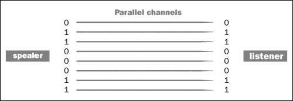
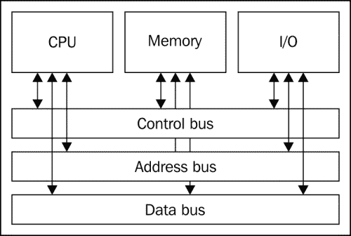
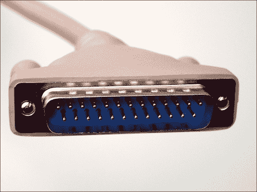
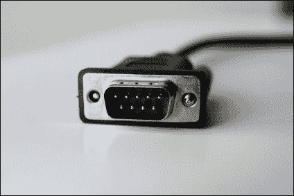
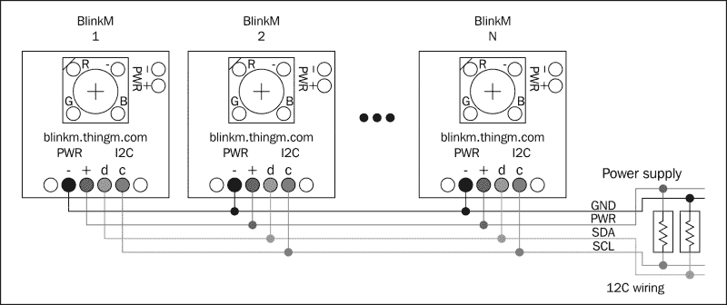
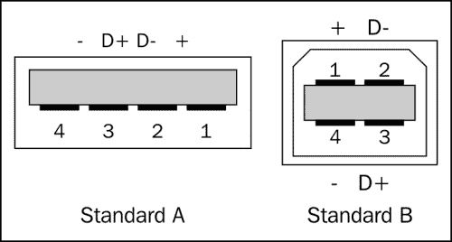

# 第七章. 通过串行通信

我们已经看到，使用 Arduino 就是关于通信和共享信号。确实，从 Arduino 最基本的部分，通过改变其环境来响应一些物理世界的值，并将这种变化作为基本消息传播给其邻居，到现在的经典串行通信，电子实体之间以及与我们之间都在进行通信。

就像这本书中的许多概念一样，我们已经在几个地方使用了串行通信及其底层串行协议作为一个黑盒工具，也就是说，我介绍了一个工具但没有解释它。

我们将在本章中深入探讨这个问题。我们将发现，串行通信不仅用于人机通信，还用于机器内部的“组件到组件”的讨论。在这里，我所说的组件是指小型系统，我可以用外设这个词来描述它们。

# 串行通信

在计算机科学和电信中，串行通信通常是一种通信方式，其中数据逐位通过通信总线发送。

现在，我们到处都能看到串行通信，而且我们往往甚至没有意识到这一点。**USB**缩写中的“S”代表串行（USB 是**通用串行总线**），代表了每个更高协议使用的底层串行通信总线。

让我们立刻深入探讨这个问题。

## 串行和并行通信

串行通信通常通过其相反的通信形式，即**并行通信**来定义，在这种通信中，多个数据位同时通过由多个并行通道组成的链路发送。看看下面的图：

发言者和听众之间基本、单向的串行通信

现在让我们来比较一下并行的情况：

发言者和听众之间基本、单向的并行通信

在这两个图中，一个扬声器正在发送以下数据字节：`0 1 1 0 0 0 1 1`。在这些情况下，当使用串行通信时，这八个数据位是按顺序通过一个通道发送的，而当使用并行通信时，则是同时通过八个不同的通道发送。

从短距离到长距离通信，尽管从表面上看并行方法似乎更快，因为在时钟周期内同时发送多个数据位，但串行通信在逐渐超越其他通信形式。

这种情况下的第一个原因是涉及的线缆数量。例如，在我们的小例子中使用的并行方法需要八个通道来同时驱动我们的八个数据位，而串行通信只需要一个。我们很快就会讨论什么是通道，但如果我们使用串行通信，仅一根线缆的 1:8 比例就能节省我们很多钱。

第二个主要原因是，我们最终实现了使串行通信非常快速。这是由于以下原因：

+   首先，**传播时间**在较少的线缆中更容易处理

+   其次，**串扰**在通道较少的情况下比在通道密度较高的并行链路中要少

+   第三，由于涉及的线缆较少，我们可以节省空间（和金钱），并且经常利用这些节省的空间来更好地屏蔽我们的线缆

现在，串行通信的带宽从每秒几兆比特到超过 1 太比特（即 1,000 千兆比特），可以使用多种媒体，从有线光纤到无线，从铜缆到光纤。正如你可能猜到的，有许多串行协议被使用。

## 串行通信的类型和特性

无论是对称性、双工模式、总线还是对等，串行通信都可以有不同的定义，我们必须深入探讨这一点。

### 同步或异步

串行通信可以是同步的，也可以不是。

**同步**通信涉及一个时钟，我们可以称之为主时钟，为通信的所有参与者保持参考时间。第一个想到的例子是电话通信。

**异步**通信不需要时钟数据通过串行通道（s）发送；这使得通信更容易，但有时可能导致一些理解上的问题。邮寄和短信是异步通信类型。

### 双工模式

双工模式是通信通道的一个特定特性。它可以：

+   **单工**：单向（数据只在两个点之间单向传递）

+   **半双工**：双向，但同一时间只能在一个方向上

+   **全双工**：双向同时

半双工显然比单工更有用，但它必须运行碰撞检测和重传过程。确实，当你和朋友交谈时，你也在共享相同的媒体（房间和房间内的空气，它携带从你的嘴到他的耳朵的振动），如果你同时说话，通常一个人会检查这一点，然后停下来告诉另一个人重复。

全双工需要更多的通道。这样就不会发生碰撞，并且可以取消所有碰撞检测和重传过程。其他错误的检测和修复仍然涉及，但通常要容易得多。

### 对等和总线

在**对等**系统中，说话者通过物理或逻辑方式连接到听众。没有主控，这类接口通常是异步的。

在**总线**中，它们最终会在某个物理位置连接起来，并且会发生一些逻辑交换。

一个多总线系统的例子

#### 主从总线

在主/从总线上，一个设备是主设备，其他的是从设备，这通常涉及到同步，其中主参与者生成定时时钟。

串行通信的主要困难是避免冲突和误解。

有很多解决方案可以实施来解决这些问题，例如使用多种物理链路类型和特定的现有通信协议。让我们检查一些这些，特别是那些我们可以与 Arduino 一起使用的。

### 数据编码

当我们使用串行协议进行通信时，需要定义的最重要的事情如下：

+   字长（以比特为单位）

+   是否存在停止位（定义了时间上的空白时刻）

+   是否存在奇偶校验位（定义了最简单、基于错误检测的代码解决方案）

事实上，特别是在异步通信中，没有这些属性，一个听者如何知道一个字开始或结束在哪里呢？通常，我们会在参与者的脑海中硬编码这种行为，以确保我们有有效的通信协议。

在本章的第一幅图中，我通过该通道发送了 8 位数据。这等于 1 字节。

我们通常将串行通信的类型写成 `<word length><parity><stop>`。例如，8 位无奇偶校验但一个停止位的写法为 `8N1`。

我不会完全描述奇偶校验位，但你应该知道它基本上是一个校验和。使用这个概念，我们发送一个字和一个校验和，然后我们验证接收到的字中所有位的二进制和。这样，听者可以非常容易地检查接收到的字的完整性，但方式非常原始。可能会发生错误，但这是最便宜的方法；它可以避免许多错误，并且从统计上来说是正确的。

使用 `8N1` 类型串行通信的全局数据帧包含 10 位：

+   一个起始位

+   每个字符 8 位

+   一个停止位

事实上，发送的数据中只有 80%是真实的有效负载。我们一直在尝试减少发送的流量控制数据的数量，因为这可以节省带宽并最终节省时间。

# 多个串行接口

我不会描述所有的串行协议，但我想要谈谈一些重要的，并将它们分类。

## 强大的摩尔斯电码电报祖先

我给你介绍一种最古老的串行协议：摩尔斯电码电报协议。电信运营商自 19 世纪下半叶以来一直在使用这个协议。

我必须说，Samuel F. B. Morse 不仅是一位发明家，而且是一位技艺高超的艺术家和画家。在这里提到这一点很重要，因为我真的相信艺术和技术最终是同一件事，我们曾经用两种不同的观点来看待。我可以引用更多的艺术家/发明家，但我猜这会有些离题。

通过发送长脉冲和短脉冲，并在空白处分隔，莫尔斯电码的操作员可以发送单词、句子和信息。这可以通过多种类型的媒体发生，例如：

+   电缆（电脉冲）

+   空气（电磁波载体、光、声音）

它可以被分类为对等、半双工和异步通信系统。

关于脉冲持续时间有一些规则，从长到短再到空白，但这仍然是异步的，因为双方之间并没有真正共享的时钟。

### 著名的 RS-232

RS-232 是一种常见的接口，你将在所有个人计算机上找到它。它定义了一个完整的电气到物理（以及电气到机械）特性的标准，例如连接硬件、引脚和信号名称。RS-232 于 1962 年推出，至今仍被广泛使用。这种点对点接口可以在适中的距离上驱动高达 20 Kbps（每秒千比特=每秒 20,000 比特）的数据。尽管标准中没有规定，但通常我们会在短而屏蔽的电缆上找到速度超过 115.2 Kbps 的实例。

我自己使用 20 米长的电缆，传感器通过串行传输数据到 Arduino，用于不同的安装。有些朋友使用 50 米长的电缆，但我没有这么做，更倾向于其他解决方案，如以太网。

#### 从 25 根线到 3 根

如果标准定义了 25 针连接器和链路，我们可以将所需的多个硬件流控制、错误检测等大量电线/信号减少到只有三根：

+   传输数据（通常写作 TX）

+   接收数据（通常写作 RX）

+   地线

有 25 个引脚/线的连接器被称为 DB25，并且被广泛用于打印机等外围设备。还有一种名为 DB9 的连接器，只有 9 个引脚/线。这是比 DB25 省去更多线的变体。这种 DB9 被广泛用于连接鼠标设备。

但我们如何省去大量电线/信号，同时保持串行通信良好工作？基本上，就像许多标准一样，它已经被设计来适应许多用例。例如，在 DB25 的全版本中，有 8 号和 22 号引脚是专门用于电话线的：第一个是**数据载波检测**，第二个是**振铃指示器**。通过 4 号和 5 号引脚发送的信号用于参与者之间的握手。

在本标准中，引脚 7 是公共地，2 和 3 分别代表 TX 和 RX。仅使用这三个引脚，我们就可以正确地进行串行异步通信。

DB25 连接器

DB9 连接器

我们宝贵的 Arduino 提供了这种三线串行替代方案。当然，每种类型的板子提供的串行接口数量并不相同，但原理是一样的：基于三线的串行接口是可用的。

Arduino Uno 和 Leonardo 提供了 TX、RX 和地三个引脚，而新发布的 Arduino Mega 2560 和 Arduino Due ([`arduino.cc/en/Main/ArduinoBoardDue`](http://arduino.cc/en/Main/ArduinoBoardDue))则提供了从 RX0 和 TX0 到 RX3 和 TX3 的四个不同的串行通信接口名称。

我们将描述另一种串行接口标准，然后我们将回到使用 FTDI 制造的著名集成电路的 RS-232，它提供了一种非常有效的方法将 RS-232 转换为 USB。

### 优雅的 I2C

由 Philips 设计的 I2C 多主串行单端计算机总线需要任何硬件实现都获得许可。

其中的一个优点是它只使用两根线：**SDA**（**串行数据线**）具有 7 位寻址系统和**SCL**（**串行时钟线**）。

考虑到其寻址系统，这个接口真的很不错。为了使用它，我们必须从 Arduino 构建两个基于引脚的总线，在这里 Arduino 是主设备。

将 BlinkM 模块作为 I2C 总线连接到 Arduino Uno R3

为了知道每个 Arduino 板需要使用哪些引脚，你可以直接查看[`www.arduino.cc/en/Reference/Wire`](http://www.arduino.cc/en/Reference/Wire)上的信息。

**BlinkM**模块([`thingm.com/products/blinkm`](http://thingm.com/products/blinkm))是具有小型尺寸的 RGB LED 模块，在 I2C 总线上操作起来相当简单。我也用它大量控制大型的 LCD 屏幕，使用 Arduino。

这也是 Arduino 的`Wire`库页面。如今，这个库已经包含在 Arduino 核心中。考虑到标准的复杂性，当总线上有大量元素时，成本会增加。由于其两根引脚和数据完整性的精度，这仍然是在同一盒子内进行短距离和间歇性通信的一种优雅解决方案。**双线接口**（**TWI**）原则上与 I2C 相同标准。当 I2C 的专利仍在运行时，它以另一个名称为人所知。

I2C 已经成为许多其他接口协议的基础，如 VESA DDC（屏幕和图形卡之间的数字连接）、Intel 的 SMBus 以及一些其他协议。

### 同步 SPI

**SPI**代表**串行外围接口**，由 Motorola 开发。它使用以下四根线：

+   **SCLK**：这是由主设备驱动的串行时钟

+   **MOSI**：这是由主设备驱动的主输出/从输入

+   **MISO**：这是由主设备驱动的主输入/从输出

+   **SS**：这是从机选择线

在点对点通信中，即使我们在 SPI 总线上发现许多具有多个从机的应用，这种用法仍然非常有用，其中只有一个主设备和一个从设备。

由于 SPI 是一种基于模式的全双工接口，我们可以实现比 I2C 更高的数据传输速率。它通常用于编码器/解码器和数字信号处理器之间的通信；这种通信包括同时发送和接收样本。SPI 缺少设备寻址也是一个巨大的优势，因为它使得系统更加轻量级，因此在不需要此功能的情况下，速度更快。确实，I2C 和 SPI 根据您想要实现的目标，彼此之间是非常互补的。

在 Arduino 板上有关 SPI 的信息可在网上找到([`arduino.cc/en/Reference/SPI`](http://arduino.cc/en/Reference/SPI))，但您必须知道我们可以轻松地将任何数字引脚用作 SPI 中包含的四根线之一。

我个人在涉及大量移位寄存器的项目中经常使用它，这些寄存器都通过 Arduino Uno 和甚至 Arduino Mega 串联起来，后者提供了更多的原生输出和输入。

在下一章中，我将向您介绍如何使用移位寄存器，届时我会向您展示如何通过 SPI 轻松地使用一些智能且最终非常简单的集成电路来复用输出，这些集成电路通过 SPI 连接到 Arduino。

### 普及的 USB

USB 是通用串行总线标准。这可能是您使用得最多的一个。

该标准的主要优势是 USB 设备的即插即用功能。您可以在不重新启动计算机的情况下插入和拔出设备。

USB 被设计成标准化连接各种计算机外围设备，包括以下设备：

+   音频（扬声器，麦克风，声卡，MIDI）

+   通信（调制解调器，Wi-Fi 和以太网）

+   人类界面设备（HID，键盘，鼠标，游戏手柄）

+   图像和视频（网络摄像头、扫描仪）

+   打印机

+   大容量存储（闪存驱动器，存储卡，驱动器）

+   无线（红外）

还有许多其他类型。该标准实际上是 3.0 版本。USB 总线可以包含多达 127 个外围设备，并为通用设备提供最大 500 到 900 毫安的电流。

#### USB 系统设计

USB 的架构是不对称拓扑，由一个主机和多个下游 USB 端口以及多个以分层星状拓扑连接的外围设备组成。

USB 集线器可以包含在层级中，允许分支到五级。这导致树状拓扑。这就是为什么您可以在集线器上堆叠集线器。

设备类别提供了一种方式，即具有适应性和设备无关的主机来支持新设备。主机可以识别的 ID 定义了每个类别。您可以在官方 USB 标准网站上找到所有批准的类别[`www.usb.org/developers/devclass`](http://www.usb.org/developers/devclass)。

#### USB 连接器和电缆

一个 USB 标准插头包含四根线([`en.wikipedia.org/wiki/Universal_Serial_Bus`](http://en.wikipedia.org/wiki/Universal_Serial_Bus))：

+   Vcc (+5 V)

+   数据-

+   数据+

+   地线

    USB 标准 A 型和 B 型插头

电缆是屏蔽的；它们的通常最大长度在两到五米左右。我已经使用了一根 12 米的电缆连接 USB 端口。使用我自己在一个电磁安全环境中焊接的电缆，也就是说，在一个我的电缆独自位于墙后且没有与其他许多电缆混合的地方，特别是那些供电的电缆，它完全正常工作。

有一些其他类型的插头稍微大一些，但至少需要四根线的需求保持不变。

#### FTDI IC 将 RS-232 转换为 USB

除了某些版本，如 Arduino Pro Mini 之外，Arduino 板提供 USB 连接器，正如你所知并已使用的那样。

这为计算机或连接到计算机的集线器提供了基本的电源功能，同时也用于通信。

FTDI 集成电路 EEPROM 名为 FT232，提供了一种将 USB 转换为 RS-232 接口的方法。这就是为什么我们可以在 USB 上使用 Arduino 板的串行通信功能，而无需从与串行通信相关的 Arduino 引脚（即 TX 和 RX）的外部串行端口接口。新板包括一个提供串行通信功能的 Atmega16U2。

的确，当你将 Arduino 板连接到计算机时，你将有一个可用的串行通信功能。我们已经在以下情况下使用过它：

+   Arduino IDE（串行监视器）

+   Processing（带有串行库）

+   最大 6（带有串行对象）

我想你也记得，当我们使用 Max 6 的串行对象轮询功能时，我们无法使用串行监视器。

你现在明白为什么了吗？在电线和计算机的虚拟世界中，同一时间只能有一个点对点链接是活跃的。物理链接也是如此。我警告过你，当你需要使用 Arduino 板进行串行通信时，不要使用数字引脚 0 和 1，尤其是 Diecimilla 版本。这些引脚直接连接到 FTDI USB 到 TTL 串行芯片的相应 RX 和 TX 引脚。

### 注意

如果你使用 USB 功能进行串行通信，你必须避免使用数字引脚 0 和 1。

# 摘要

在本章中，我们讨论了串行通信。这是电子设备内部和之间非常常见的一种通信方式。本章也是对其他通用通信协议的良好介绍，我相信你现在已经准备好理解更高级的功能。

在下一章中，我们将使用这里介绍的一些不同类型的串行协议。特别是，我们将讨论 Arduino 输出；这意味着我们不仅能够为我们的 Arduino 板添加反馈和反应，考虑到行为模式设计，如刺激和响应的确定性方式，我们还将看到更多混沌的行为，例如包括受限制的随机性等。
