# 第八章 设计视觉输出反馈

交互是关于控制和反馈的一切。你通过对其执行操作来控制一个系统。你甚至可以修改它。系统通过提供有关其修改后所做事情的有用信息来给你反馈。

在上一章中，我们更多地学习了如何控制 Arduino，而不是 Arduino 给我们反馈。例如，我们使用了按钮和旋钮向 Arduino 发送数据，使其为我们工作。当然，有很多观点，我们很容易考虑控制 LED 并向 Arduino 提供反馈。但通常，当我们想要对系统向我们返回的信息进行定性时，我们谈论反馈。

阿尔卡卢格·拉马普拉萨德，伊利诺伊大学芝加哥分校商学院信息与决策科学系教授，将反馈定义为如下：

> “关于系统参数实际水平与参考水平之间差距的信息，该参数用于以某种方式改变该差距。”

我们已经在第五章*数字输入检测*中讨论了一些视觉输出，当时我们试图可视化按钮点击事件的结果。这种由我们的点击事件产生的视觉渲染是反馈。

现在，我们将讨论基于 Arduino 板驱动的 LED 的视觉反馈系统的设计。LED 是提供视觉反馈的最简单的系统之一。

我们将要学习以下内容：

+   如何使用基本单色 LED

+   如何制作 LED 矩阵以及如何多路复用 LED

+   如何使用 RGB LED

我们将通过介绍液晶显示器设备来结束本章。

# 使用 LED

LED 可以是单色的或多色的。实际上，有许多类型的 LED。在通过一些示例之前，让我们发现一些这些 LED 类型。

## 不同类型的 LED

通常，LED 既用于阻止来自线路的电流流向其阴极引脚，也用于当电流流入其阳极时提供光反馈：


我们可以找到的不同型号如下：

+   基本 LED

+   **OLED**（**有机 LED**通过层叠有机半导体部分制成）

+   **AMOLED**（**有源矩阵 OLED**提供大尺寸屏幕的高像素密度）

+   **FOLED**（**柔性****OLED**）

我们在这里只讨论基本 LED。通过“基本”一词，我指的是像前面图像中那样的具有离散组件的 LED。

封装可能从顶部带有注塑环氧树脂状透镜的两脚组件，到提供许多连接器的表面组件不等，如下面的截图所示：

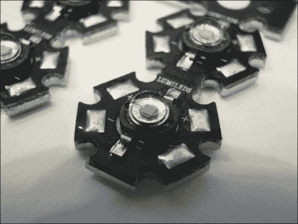

我们还可以根据它们的光的颜色特性对它们进行分类：

+   单色 LED

+   多色 LED

在每种情况下，LED 的可见颜色由注塑环氧树脂盖的颜色决定；LED 本身发射相同的波长。

### 单色 LED

单色 LED 只发出一种颜色。

最常见的单色 LED 在每个电压下都会发出恒定的颜色。

### 彩色 LED

彩色 LED 可以根据几个参数发出多种颜色，例如电压，也可以根据多脚 LED 中提供电流的脚来决定。

这里最重要的特性是可控性。彩色 LED 必须易于控制。这意味着我们应该能够通过打开或关闭来控制每种颜色。

下面是一个经典的共阴极 RGB LED，有三个不同的阳极：

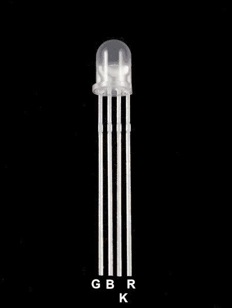

这种 LED 是我们 Arduino 设备的首选。考虑到我们可以轻松控制它们并使用它们产生非常广泛的颜色，它们并不昂贵（大约每 100 个 LED 1.2 欧元）。

在接下来的几页中，我们将了解如何处理多个 LED，以及彩色 RGB LED。

## 记住 Hello LED 示例

在 Hello LED 中，我们使 LED 在每 1000 毫秒中闪烁 250 毫秒。让我们再次看看其电路图，以保持阅读的连贯性：

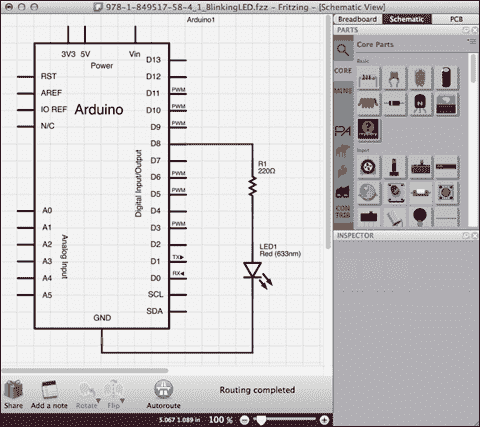

Hello LED 的代码如下：

```cpp
// Pin 8 is the one connected to our pretty LED
int ledPin = 8;                // ledPin is an integer variable initialized at 8

void setup() {                
  pinMode(ledPin, OUTPUT);     // initialize the digital pin as an output
}

// --------- the loop routine runs forever
void loop() {
  digitalWrite(ledPin, HIGH);   // turn the LED on
  delay(250);                   // wait for 250ms in the current state
  digitalWrite(ledPin, LOW);    // turn the LED off
  delay(1000);                  // wait for 1s in the current state
}
```

直观地，在接下来的示例中，我们将尝试使用多个 LED，同时玩单色和彩色 LED。

## 多个单色 LED

由于我们在这里讨论的是反馈，而不仅仅是纯输出，我们将构建一个小示例来向您展示如何处理多个按钮和多个 LED。如果您现在完全无法理解，请不要担心；只需继续阅读。

### 两个按钮和两个 LED

我们已经在第五章中讨论了玩多个按钮，*使用数字输入进行感应*。现在让我们构建一个新的电路。

下面是电路图：


继续绘制与每个电路图相关的电原理图是更好的选择。

基本上，这是来自第五章的多个按钮示例，*使用数字输入进行感应*；然而，我们移除了一个按钮，并添加了两个 LED。

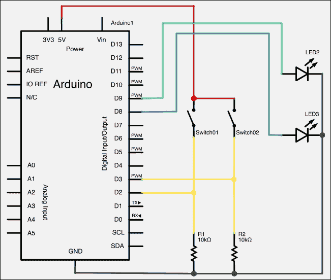

如您所知，Arduino 的数字引脚可以用作输入或输出。我们可以看到，两个开关连接到一侧的 5V Arduino 引脚，另一侧连接到数字引脚 2 和 3，每个后者引脚都有一个相关的下拉电阻，将电流吸收到 Arduino 的地线引脚。

我们还可以看到，一个 LED 连接到一侧的数字引脚 8 和 9；它们都连接到 Arduino 的地线引脚。

这并没有什么真正令人难以置信的。

在您设计专用固件之前，您需要简要介绍一些非常重要的事情：耦合。对于任何接口设计来说，这是必须知道的；更广泛地说，对于交互设计。

### 交互设计中的控制和反馈耦合

这一节被视为子章节有两个主要原因：

+   首先，它听起来很棒，并且是保持动机流畅的关键。

+   其次，这部分是您未来所有人机界面设计的关键。

如您所知，Arduino（得益于其固件）连接了控制和反馈两侧。这一点非常重要，需要牢记在心。

无论外部系统的类型如何，从 Arduino 的角度来看，它通常被视为人类。一旦您想要设计一个交互系统，您就必须处理这一点。

我们可以用一个非常简单的示意图来总结这个概念，以便在脑海中固定下来。

事实上，您必须理解，我们即将设计的固件将创建一个控制-反馈耦合。

**控制/反馈耦合**是一组规则，定义了系统在接收到我们的命令时如何表现，以及它如何通过给我们（或不给我们）反馈来做出反应。

这组硬编码的规则非常重要，需要理解。

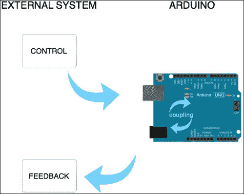

但是，想象一下，您想用 Arduino 控制另一个系统。在这种情况下，您可能希望将耦合放在 Arduino 本身之外。

看第二个图**外部系统 2**，我把耦合放在 Arduino 之外。通常，**外部系统 1**是我们，**外部系统 2**是计算机：

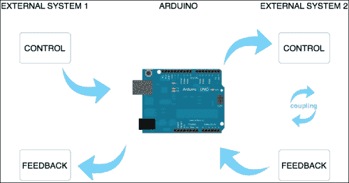

现在，我们可以引用一个现实生活中的例子。就像许多界面和遥控器的用户一样，我喜欢并且需要用简约的硬件设备控制我电脑上的复杂软件。

我喜欢由 Brian Crabtree 设计的简约且开源的**Monome 界面**([`monome.org`](http://monome.org))。我经常使用它，有时还在使用。它基本上是一个 LED 和按钮的矩阵。令人惊叹的技巧是，在内部没有任何耦合。

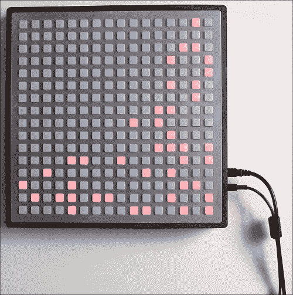

上一张图片是 Brian Crabtree 设计的 Monome 256 及其非常精美的木质外壳。

如果所有文档中都没有直接这样写，我希望能够这样定义给我的朋友和学生：“Monome 概念是您需要的最简约的界面，因为它只提供控制 LEDs 的方式；除此之外，您有很多按钮，但按钮和 LEDs 之间没有逻辑或物理连接。”

如果 Monome 不提供按钮和 LEDs 之间的真实、现成的耦合，那是因为这将非常限制性，甚至可能消除所有创造力！

由于有一个非常原始且高效的协议设计（[`monome.org/data/monome256_protocol.txt`](http://monome.org/data/monome256_protocol.txt)），专门用于控制 LED 和读取按钮的按下，我们能够自己创建和设计我们的耦合。Monome 还提供了**Monome Serial Router**，这是一个非常小的应用程序，基本上将原始协议转换为**OSC**（[`archive.cnmat.berkeley.edu/OpenSoundControl/`](http://archive.cnmat.berkeley.edu/OpenSoundControl/)）或**MIDI**（[`www.midi.org/`](http://www.midi.org/)）。我们将在本章的后续部分讨论它们。这些在多媒体交互设计中非常常见；OSC 可以在网络上传输，而 MIDI 非常适合连接音乐相关设备，如序列器和合成器。

如果不附上关于 Monome 的另一个原理图，这次简短的离题就不会完整。

检查一下，然后我们再深入了解：

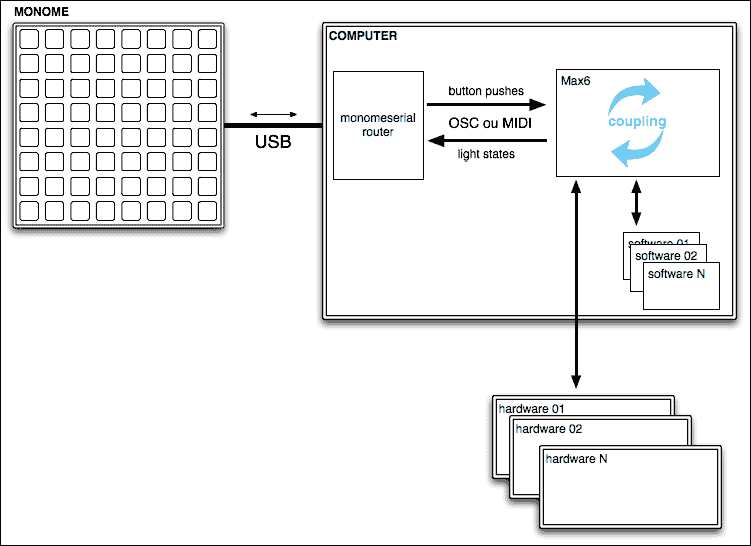

智能简约的 Monome 界面在其通常的基于计算机的设置中

这里是 Monome 64 界面的原理图，在通常的基于计算机的设置中，耦合就在其中发生。这是我多次在音乐表演中使用过的实际设置（[`vimeo.com/20110773`](https://vimeo.com/20110773)）。

我在 Max 6 中设计了一个特定的耦合，将特定的消息从/到 Monome 本身，以及从/到软件转换，特别是 Ableton Live（[`www.ableton.com`](https://www.ableton.com)）。

这是一个非常强大的系统，它可以控制事物并提供反馈，你可以基本上从头开始构建你的耦合，并将你的原始简约界面转变为你需要的样子。

这只是关于交互设计的一个更广泛独白的一部分。

让我们现在构建这个耦合固件，看看我们如何可以将控制和反馈耦合到基本的示例代码中。

### 耦合固件

这里，我们只使用了 Arduino 的开关和 LED，实际上没有使用电脑。

让我们设计一个基本的固件，包括耦合，基于这个伪代码：

+   如果我按下开关 1，LED 1 将被打开，如果我释放它，LED 1 将被关闭

+   如果我按下开关 2，LED 2 将被打开，如果我释放它，LED 2 将被关闭

为了操作新的元素和想法，我们将使用一个名为`Bounce`的库。它提供了一个简单的方法来去抖动数字引脚输入。我们已经在第五章的*理解去抖概念*部分中讨论过去抖动，*感应数字输入*。提醒一下：如果你按下按钮时没有按钮完全吸收抖动，我们可以通过软件平滑事物并过滤掉不希望的非理想值跳跃。

你可以在[`arduino.cc/playground/Code/Bounce`](http://arduino.cc/playground/Code/Bounce)找到关于`Bounce`库的说明。

让我们检查一下这段代码：

```cpp
#include <Bounce.h>   // include the (magic) Bounce library

#define BUTTON01 2    // pin of the button #1
#define BUTTON02 3    // pin of the button #2

#define LED01 8       // pin of the button #1
#define LED02 9       // pin of the button #2

// let's instantiate the 2 debouncers with a debounce time of 7 ms
Bounce bouncer_button01 = Bounce (BUTTON01, 7);
Bounce bouncer_button02 = Bounce (BUTTON02, 7);

void setup() {

  pinMode(BUTTON01, INPUT); // the switch pin 2 is setup as an input
  pinMode(BUTTON02, INPUT); // the switch pin 3 is setup as an input

  pinMode(LED01, OUTPUT);   // the switch pin 8 is setup as an output
  pinMode(LED02, OUTPUT);   // the switch pin 9 is setup as an output
}

void loop(){

  // let's update the two debouncers
  bouncer_button01.update();
  bouncer_button02.update();

  // let's read each button state, debounced!
  int button01_state = bouncer_button01.read();
  int button02_state = bouncer_button02.read();

  // let's test each button state and switch leds on or off
  if ( button01_state == HIGH ) digitalWrite(LED01, HIGH);
  else digitalWrite(LED01, LOW);

  if ( button02_state == HIGH ) digitalWrite(LED02, HIGH);
  else digitalWrite(LED02, LOW);
}
```

你可以在`Chapter08/feedbacks_2x2/`文件夹中找到它。

此代码在开头包含了 Bounce 头文件，即 Bounce 库。

然后，我根据数字输入和输出引脚定义了四个常量，其中我们在电路中放置开关和 LED。

Bounce 库要求实例化每个去抖动器，如下所示：

```cpp
Bounce bouncer_button01 = Bounce (BUTTON01, 7);
Bounce bouncer_button02 = Bounce (BUTTON02, 7);
```

我选择了 7 毫秒的去抖动时间。这意味着，如果你记得正确的话，在小于 7 毫秒的时间间隔内发生的两次值变化（自愿或非自愿）不会被系统考虑，从而避免了奇怪和不寻常的抖动结果。

`setup()`块并不复杂，它只定义了数字引脚作为按钮的输入和 LED 的输出（请记住，数字引脚可以是输入也可以是输出，你必须在某个时候做出选择）。

`loop()`函数首先更新两个去抖动器，之后我们读取每个去抖动按钮状态值。

最后，我们处理 LED 控制，这取决于按钮状态。耦合发生在哪里？当然是在这个最后的步骤。我们在该固件中将我们的控制（按钮按下）与我们的反馈（LED 灯）耦合起来。让我们上传并测试它。

### 更多 LED？

我们基本上只是看到了如何将多个 LED 连接到我们的 Arduino 上。当然，我们也可以用相同的方式连接超过两个 LED。你可以在`Chapter05/feedbacks_6x6/`文件夹中找到处理六个 LED 和六个开关的代码。

但是，我有一个问题要问你：你将如何用 Arduino Uno 处理更多的 LED？请不要回答说“我会买一个 Arduino MEGA”，因为那样我会问你如何处理超过 50 个 LED。

正确的答案是**多路复用**。让我们看看我们如何处理大量的 LED。

# 多路复用 LED

多路复用的概念既有趣又高效。它是将许多外围设备连接到我们的 Arduino 板的关键。

多路复用提供了一种方法，在板上使用很少的 I/O 引脚，同时使用大量的外部组件。Arduino 与这些外部组件之间的连接是通过使用多路复用器/解复用器（也简称为 mux/demux）来实现的。

我们在第六章中讨论了输入多路复用，*使用模拟输入进行游戏*。

我们将在这里使用 74HC595 组件。其数据表可以在[`www.nxp.com/documents/data_sheet/74HC_HCT595.pdf`](http://www.nxp.com/documents/data_sheet/74HC_HCT595.pdf)找到。

此组件是一个 8 位串行输入/串行或并行输出。这意味着它通过串行接口控制，基本上使用 Arduino 的三个引脚，并且可以用其八个引脚驱动。

我将向您展示如何使用 Arduino 的仅三个引脚来控制八个 LED。由于 Arduino Uno 包含 12 个可用的数字引脚（我通常不使用 0 和 1），我们可以轻松地想象使用 4 x 75HC595 来控制 4 x 8 = 32 个单色 LED。我还会提供相应的代码。

## 将 75HC595 连接到 Arduino 和 LED

正如我们与 CD4051 和模拟输入多路复用一起学习的那样，我们将芯片连接到 75HC595 移位寄存器，以便多路复用/解复用八个数字输出引脚。让我们检查接线：

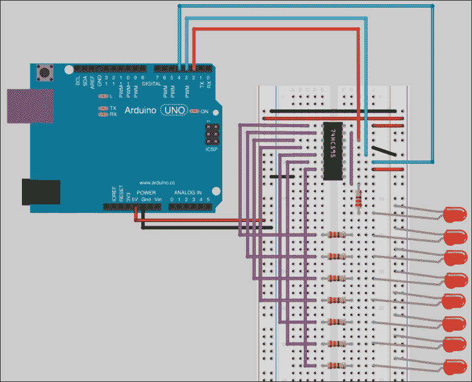

我们让 Arduino 为面包板供电。每个电阻提供 220 欧姆的电阻。

75HC595 从 GND 和 5V 电位获取其自身的电源和配置。

基本上，74HC595 需要通过引脚 11、12 和 14 连接，以便通过 Arduino 处理的串行协议进行控制。

让我们来检查 74HC595 本身：

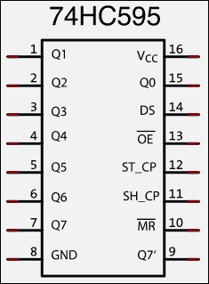

+   引脚 8 和 16 用于内部电源。

+   引脚 10 被命名为**主复位**，为了激活它，你必须将这个引脚连接到地。这就是为什么在正常工作状态下，我们将其驱动到 5V 的原因。

+   引脚 13 是输出使能输入引脚，必须保持激活状态才能使整个设备输出电流。将其连接到地即可实现这一点。

+   引脚 11 是移位寄存器时钟输入。

+   引脚 12 是存储寄存器时钟输入，也称为**锁存**。

+   引脚 14 是串行数据输入。

+   引脚 15 和引脚 1 到 7 是输出引脚。

我们的小型且经济的串行链路连接到 Arduino，由引脚 11、12 和 14 处理，提供了一种简单的方法来控制和基本将八个位加载到设备中。我们可以循环遍历八个位，并将它们以串行方式发送到存储它们的寄存器的设备。

这些类型的设备通常被称为**移位寄存器**，我们在加载它们的同时从 0 到 7 移动位。

然后，每个状态都从 Q0 到 Q7 正确输出，将之前通过串行传输的状态转换。

这是我们在上一章中提到的串行到并行转换的直接说明。我们有一个数据流按顺序流动，直到寄存器全局加载，然后将其推送到许多输出引脚。

现在，让我们可视化接线图：

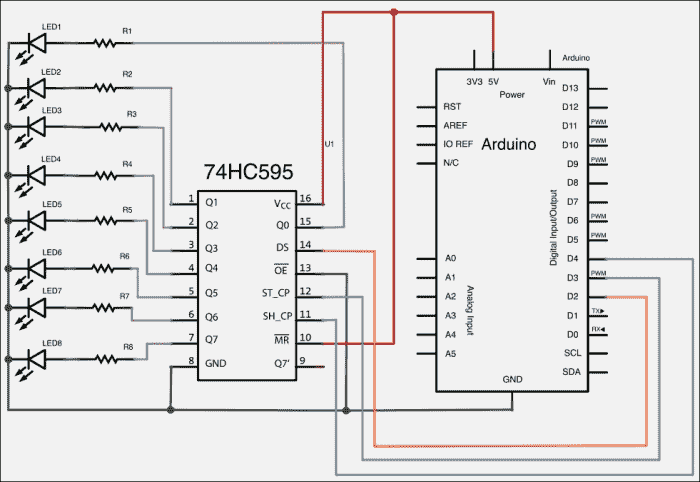

一个带有电阻连接到 74HC595 移位寄存器的 8 个 LED 阵列

## 串行寄存器处理固件

我们将学习如何设计专门用于这类移位寄存器的固件。这个固件基本上是为 595 设计的，但与其他集成电路一起使用时不需要太多修改。你特别需要注意三个串行引脚，即锁存、时钟和数据。

因为我想每次都教给你比每个章节标题所激发的精确内容更多一点，所以我为你创造了一台非常便宜且小巧的随机凹槽机。它的目的是生成随机字节。然后，这些字节将被发送到移位寄存器，以便为每个 LED 供电或不供电。这样，你将得到一个整洁的随机 LED 图案。

你可以在`Chapter08/Multiplexing_8Leds/`文件夹中找到这个代码。

让我们检查一下：

```cpp
// 595 clock pin connecting to pin 4
int CLOCK_595 = 4;

// 595 latch pin connecting to pin 3
int LATCH_595 = 3;

// 595 serial data input pin connecting to pin 2
int DATA_595 = 2;

// random groove machine variables
int counter = 0;
byte LED_states = B00000000 ;

void setup() {

  // Let's set all serial related pins as outputs
  pinMode(LATCH_595, OUTPUT);
  pinMode(CLOCK_595, OUTPUT);
  pinMode(DATA_595, OUTPUT);

  // use a seed coming from the electronic noise of the ADC 
  randomSeed(analogRead(0));
}

void loop(){

  // generate a random byte
  for (int i = 0 ; i < 8 ; i++)
  {
    bitWrite(LED_states, i, random(2));
  }

  // Put latch pin to LOW (ground) while transmitting data to 595
  digitalWrite(LATCH_595, LOW);

  // Shifting Out bits i.e. using the random byte for LEDs states
  shiftOut(DATA_595, CLOCK_595, MSBFIRST, LED_states);

  // Put latch pin to HIGH (5V) & all data are pushed to outputs
  digitalWrite(LATCH_595, HIGH);

  // each 5000 loop() execution, grab a new seed for the random function
  if (counter < 5000) counter++;
  else 
  {
    randomSeed(analogRead(0));    // read a new value from analog pin 0
    counter = 0;                  // reset the counter
  }

  // make a short pause before changing LEDs states
  delay(45);
}
```

### 全局移位寄存器编程模式

首先，让我们检查全局结构。

我首先定义了 595 移位寄存器的 3 个引脚。然后，我在`setup()`块中将它们每个都设置为输出。

然后，我有一个看起来类似的模式：

```cpp
digitalWrite(latch-pin, LOW)
shiftOut(data-pin, clock-pin, MSBFIRST, my_states)
digitalWrite(latch-pin, HIGH)
```

这通常是移位寄存器操作的常规模式。正如之前所解释的，“锁存引脚”是提供给我们一种方式来通知集成电路我们想要将其加载数据，然后我们希望它将这些数据应用到其输出。

这有点像说：

+   锁存引脚低电平 = “嗨，让我们存储我即将发送给你的内容。”

+   锁存引脚高电平 = “好的，现在使用我刚刚发送的数据来转换到你的输出或不输出。”

然后，我们有这个`shiftOut()`函数。这个函数提供了一个简单的方法，通过特定的时钟/速率速度，将整个字节数据包发送到特定的引脚（数据引脚），并且给定一个传输顺序（MSBFIRST 或 LSBFIRST）。

尽管我们在这里不会描述底层的细节，但你必须理解 MSB 和 LSB 的概念。

让我们考虑一个字节：`1 0 1 0 0 1 1 0`。

**MSB**是**最高有效位**的缩写。这个位位于最左侧位置（具有最大值的位）。在这里，它的值是`1`。

**LSB**代表**最低有效位**。这个位位于最右侧位置（最小值的位）。它是位于最右侧的位（具有最小值的位）。在这里，它的值是`0`。

通过在`shiftOut()`函数中固定这个参数，我们提供了有关传输方向的特殊信息。实际上，我们可以通过发送这些位来发送前一个字节：`1`然后，`0`，然后`1 0 0 1 1 0`（MSBFIRST），或者通过发送这些位：`0 1 1 0 0 1 0 1`（LSBFIRST）。

### 玩转机会和随机种子

我想要提供一个关于我个人编程方式的例子。在这里，我将描述一个便宜且小巧的系统，它可以生成随机字节。然后，这些字节将被发送到 595，我们的 8 个 LED 数组将处于一个非常随机的状态。

在计算机中，随机并不是真正的随机。实际上，`random()`函数是一个伪随机数生成器。它也可以被称为**确定性随机比特生成器**（**DRBG**）。确实，序列是由一组小的初始值（包括种子）完全确定的。

对于特定的种子，伪随机数生成器每次都会生成相同的数字序列。

但是，你可以在这里使用一个技巧来稍微增加一些确定性。

想象一下你有时让种子变化。你还可以将外部随机因素引入你的系统。正如我们在本书之前解释的那样，即使没有连接到模拟输入，ADC 也会有电子噪声。你可以通过读取模拟输入 0 来使用这种外部/物理噪声。

如我们所知，模拟`analogRead()`提供了从 0 到 1023 的数字。这对于我们的目的来说是一个巨大的分辨率。

这就是我放在固件中的内容。

我定义了一个计数器变量和一个字节。我在`setup()`函数中首先读取来自模拟引脚 0 的 ADC 值。然后，我使用`for()`循环和`bitWrite()`函数生成随机字节。

我正在使用由`random(2)`数字函数生成的数字来编写字节`LED_states`的每个位，该函数随机地给出 0 或 1。然后，我将使用伪随机生成的字节到之前描述的结构中。

我通过读取模拟引脚 0 的 ADC 来重新定义每次 5000 次`loop()`执行的种子。

### 注意

如果您想在计算机上使用`random()`函数，包括 Arduino 和嵌入式系统，请获取一些物理和外部噪声。

现在，让我们继续前进。

我们可以使用许多 74HC595 移位寄存器来处理 LED，但想象一下你需要保留更多的数字引脚。好吧，我们已经看到我们可以通过移位寄存器节省很多。一个移位寄存器需要三个数字引脚并驱动八个 LED。这意味着我们通过每个移位寄存器节省了五个引脚，考虑到我们布线了八个 LED。

如果你需要更多呢？如果你需要为开关处理等保留所有其他引脚怎么办？

让我们现在进行菊花链连接！

## 菊花链多个 74HC595 移位寄存器

**菊花链**是一种布线方案，用于按顺序或甚至环形连接多个设备。

事实上，因为我们已经对移位寄存器的工作原理有了更多的了解，我们可以考虑将其扩展到一起布线的多个移位寄存器，不是吗？

我将通过使用 Juan Hernandez 的**ShiftOutX**库来向您展示如何做到这一点。我在版本 1.0 中得到了非常好的结果，并建议您使用这个版本。

您可以在此处下载：[`arduino.cc/playground/Main/ShiftOutX`](http://arduino.cc/playground/Main/ShiftOutX)。您可以通过附录中解释的程序进行安装。

### 连接多个移位寄存器

每个移位寄存器需要了解什么？

串行时钟、锁存和数据是必须在整个设备链中传输的信息点。让我们检查一下原理图：

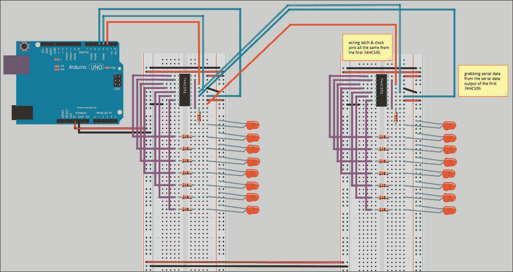

使用 Arduino 上的三个数字引脚驱动 16 个单色 LED 的串联移位寄存器

我使用了与之前电路相同的颜色来表示时钟（蓝色）、锁存器（绿色）和串行数据（橙色）。

串行时钟和锁存器在移位寄存器之间共享。来自 Arduino 的命令/指令必须与时钟同步，并告诉移位寄存器存储或应用接收到的数据到它们的输出，这必须是一致的。

来自 Arduino 的串行数据首先进入第一个移位寄存器，然后将其串行数据发送到第二个。这是级联概念的核心。

让我们检查电路图来记住这一点：


驱动 16 个单色 LED 的两个级联移位寄存器的电路图

### 处理两个移位寄存器和 16 个 LED 的固件

固件包括之前提到的`ShiftOutX`库 ShiftOutX。它为移位寄存器的级联提供了非常简单和流畅的处理。

这里是固件的代码。

你可以在`Chapter08/Multiplexing_WithDaisyChain/`文件夹中找到它：

```cpp
#include <ShiftOutX.h>
#include <ShiftPinNo.h>

int CLOCK_595 = 4;    // first 595 clock pin connecting to pin 4
int LATCH_595 = 3;    // first 595 latch pin connecting to pin 3
int DATA_595 = 2;     // first 595 serial data input pin connecting to pin 2

int SR_Number = 2;    // number of shift registers in the chain

// instantiate and enabling the shiftOutX library with our circuit parameters
shiftOutX regGroupOne(LATCH_595, DATA_595, CLOCK_595, MSBFIRST, SR_Number);

// random groove machine variables
int counter = 0;
byte LED0to7_states = B00000000 ;
byte LED8to15_states = B00000000 ;

void setup() {

  // NO MORE setup for each digital pin of the Arduino
  // EVERYTHING is made by the library :-)

  // use a seed coming from the electronic noise of the ADC 
  randomSeed(analogRead(0));
}

void loop(){ 

  // generate a 2 random bytes
  for (int i = 0 ; i < 8 ; i++)
  {
    bitWrite(LED0to7_states, i, random(2));
    bitWrite(LED8to15_states, i, random(2));
  }

  unsigned long int data; // declaring the data container as a very local variable
  data = LED0to7_states | (LED8to15_states << 8); // aggregating the 2 random bytes
  shiftOut_16(DATA_595, CLOCK_595, MSBFIRST, data);  // pushing the whole data to SRs

  // each 5000 loop() execution, grab a new seed for the random function
  if (counter < 5000) counter++;
  else 
  {
    randomSeed(analogRead(0));    // read a new value from analog pin 0
    counter = 0;                  // reset the counter
  }

  // make a short pause before changing LEDs states
  delay(45);
}
```

ShiftOutX 库可以用多种方式使用。我们在这里使用它的方式与`ShiftOut`相同，它是核心库的一部分，适用于仅使用一个移位寄存器。

首先，我们必须使用**草图 | 导入库 | ShiftOutX**来包含库。

它在开头包含两个头文件，即`ShiftOutX.h`和`ShiftPinNo.h`。

然后，我们定义一个新的变量来存储链中的移位寄存器数量。

最后，我们使用以下代码实例化 ShiftOutX 库：

```cpp
shiftOutX regGroupOne(LATCH_595, DATA_595, CLOCK_595, MSBFIRST, SR_Number);
```

`setup()`中的代码有所改变。实际上，不再有数字引脚的设置语句。这部分由库处理，这看起来可能有些奇怪，但却是非常常见的。实际上，在你实例化库之前，你传递了三个 Arduino 引脚作为参数，而这个语句实际上也设置了引脚为输出。

`loop()`块几乎和之前一样。实际上，我又加入了带有模拟读取技巧的小随机槽道机。但这次我创建了两个随机字节。确实，这是因为我需要 16 个值，并且我想使用`shiftOut_16`函数在同一个语句中发送所有我的数据。生成字节然后通过位运算符将它们聚合到`unsigned short int`数据类型中是非常简单和常见的。

让我们详细说明这个操作。

当我们生成随机字节时，我们有两个 8 位的序列。让我们看以下例子：

```cpp
0 1 1 1 0 1 0 0
1 1 0 1 0 0 0 1
```

如果我们想将它们存储在一个地方，我们能做什么呢？我们可以先移位一个，然后将移位后的结果加到另一个上，不是吗？

```cpp
0 1 1 1 0 1 0 0 << 8 = 0 1 1 1 0 1 0 0 0 0 0 0 0 0 0 0
```

然后，如果我们使用位运算符（`|`）添加一个字节，我们得到：

```cpp
0 1 1 1 0 1 0 0 0 0 0 0 0 0 0 0
       |                             1 1 0 1 0 0 0 1
       =    0 1 1 1 0 1 0 0 1 1 0 1 0 0 0 1
```

结果似乎是将所有位连接在一起。

这就是我们在这部分代码中所做的事情。然后我们使用`shiftOut_16()`将所有数据发送到两个移位寄存器。嘿，我们应该如何处理这四个移位寄存器呢？以同样的方式，同样地处理！

可能我们不得不使用 `<< 32`、`<< 16` 和再次 `<< 8` 来移位，以便将所有字节存储到一个变量中，我们可以使用 `shiftOut_32()` 函数发送这个变量。

通过使用这个库，你可以有两个组，每个组包含八个移位寄存器。

这意味着什么？

这意味着你可以使用仅四个引脚（两个锁存器，但共用串行时钟和数据）来驱动 2 x 8 x 8 = 128 个输出。这听起来很疯狂，不是吗？

在现实生活中，完全可能只使用一个 Arduino 来构建这种架构，但我们必须注意一个非常重要的事情，那就是电流量。在这个 128 个 LED 的特定情况下，我们应该想象最坏的情况，即所有 LED 都被打开。驱动的电流量甚至可能烧毁 Arduino 板，它有时会通过复位来保护自己。但就我个人而言，我甚至不会尝试。

### 当前简要考虑

Arduino 板，使用 USB 电源供电，不能驱动超过 500 mA。所有组合引脚不能驱动超过 200 mA，且没有任何引脚可以驱动超过 40 mA。这些可能因板型而异，但这些是真实、绝对的最大额定值。

我们没有进行这些考虑和以下计算，因为在我们的例子中，我们只使用了少数设备和组件，但有时你可能会被诱惑去构建一个巨大的设备，比如我有时做的，例如，使用 Protodeck 控制器。

让我们通过一个例子来更仔细地看看一些电流计算。

想象一下，你有一个 LED，它需要大约 10 mA 才能正确地发亮（第二次闪烁时不会烧毁！！）

这意味着如果你要同时打开所有 LED，一个包含八个 LED 的数组将会有 8 x 10 mA，由一个 595 移位寄存器驱动。

80 mA 将是来自 Arduino Vcc 源的一个 595 移位寄存器驱动的全局电流。

如果你有多于 595 移位寄存器，电流的幅度会增加。你必须知道所有集成电路也会消耗电流。它们的消耗通常不被考虑，因为非常小。例如，595 移位寄存器电路本身只消耗大约 80 微安培，这意味着 0.008 mA。与我们的 LED 相比，这是微不足道的。电阻器也会消耗电流，尽管它们经常被用来保护 LED，但它们非常有用。

无论如何，我们即将学习另一个非常巧妙且实用的技巧，它可以用于单色或 RGB LED。

让我们进入一个充满色彩的世界。

# 使用 RGB LED

RGB 代表红色、绿色和蓝色，正如你可能猜到的。

我不谈论那些可以根据你施加的电压改变颜色的 LED。这种类型的 LED 存在，但据我所实验，这些并不是学习步骤时的最佳选择，尤其是在学习初期。

我在谈论共阴极和共阳极 RGB LED。

## 一些控制概念

你需要什么来控制一个 LED？

你需要能够向其引脚施加电流。更准确地说，你需要能够在其引脚之间产生电位差。

这个原理的直接应用就是我们已经在本章的第一部分测试过的，这让我们想起了我们如何开关一个 LED：你需要使用 Arduino 的数字输出引脚来控制电流，知道你想要控制的 LED 的节点连接到输出引脚，其阴极连接到地，线上还有一个电阻。

我们可以讨论不同的控制方式，你将会通过下一张图片很快理解这一点。

为了使数字输出能够提供电流，我们需要使用`digitalWrite`写入一个`HIGH`值。在这种情况下，所考虑的数字输出将内部连接到 5V 电池，并产生 5V 电压。这意味着连接到它和地之间的 LED 将通过电流供电。

在另一种情况下，如果我们给 LED 施加 5V 电压，并且想要将其开启，我们需要将一个`LOW`值写入与之相连的数字引脚。在这种情况下，数字引脚将内部连接到地，并吸收电流。

这是控制电流的两种方式。

检查以下图示：


## 不同类型的 RGB LED

让我们检查两种常见的 RGB LED：

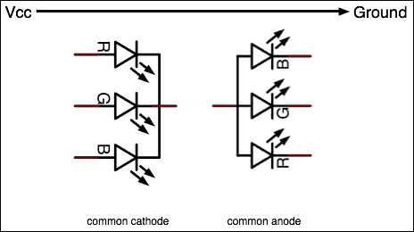

基本上，一个封装中包含三个 LED，内部有不同的接线方式。这个封装的制作方式并不是关于内部的接线，但在这里我不会争论这一点。

如果你正确地跟随我，你可能已经猜到我们需要更多的数字输出来连接 RGB LED。确实，上一节讨论了节省数字引脚。我想你明白为什么节省引脚和仔细规划电路架构可能很重要。

## 点亮 RGB LED

检查这个基本电路：

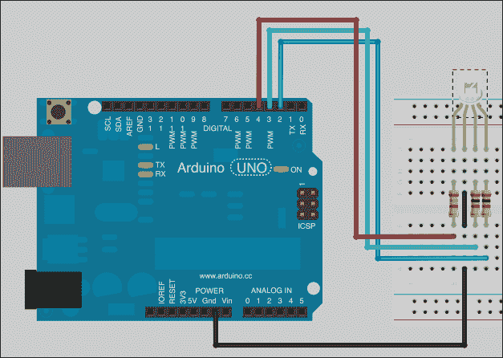

将 RGB LED 连接到 Arduino

现在检查一下代码。你可以在`Chapter08/One_RGB_LED/`文件夹中找到它。

```cpp
int pinR = 4; // pin related to Red of RGB LED
int pinG = 3; // pin related to Green of RGB LED
int pinB = 2; // pin related to Blue of RGB LED

void setup() {

  pinMode(pinR, OUTPUT);
  pinMode(pinG, OUTPUT);
  pinMode(pinB, OUTPUT);
}

void loop() {

  for (int r = 0 ; r < 2 ; r++)
  {
    for (int g = 0 ; g < 2 ; g++)
    {
      for (int b = 0 ; b < 2 ; b++)
      {
        digitalWrite(pinR,r); // turning red pin to value r
        digitalWrite(pinG,g); // turning green pin to value g
        digitalWrite(pinB,b); // turning blue pin to value b

        delay(150); // pausing a bit
      }
    }
  }

}
```

再次，代码中包含了一些提示。

### 红色、绿色和蓝色光组件和颜色

首先，这里的关键点是什么？我想让 RGB LED 循环通过所有可能的状态。一些数学可以帮助列出所有状态。

我们有一个包含三个元素的有序列表，每个元素可以是开启或关闭。因此，总共有 2³ 个状态，即总共 8 个状态：

| R | G | B | 结果颜色 |
| --- | --- | --- | --- |
| 关闭 | 关闭 | 关闭 | 关闭 |
| 关闭 | 关闭 | 开启 | 蓝色 |
| 关闭 | 开启 | 关闭 | 绿色 |
| 关闭 | 开启 | 开启 | 青色 |
| 开启 | 关闭 | 关闭 | 红色 |
| 开启 | 关闭 | 开启 | 紫色 |
| 开启 | 开启 | 关闭 | 橙色 |
| 开启 | 开启 | 开启 | 白色 |

只有通过开关每个颜色组件的开启或关闭，我们才能改变全局 RGB LED 的状态。

不要忘记，系统的工作方式与我们通过 Arduino 的三个数字输出控制三个单色 LED 完全一样。

首先，我们定义了三个变量来存储不同颜色的 LED 连接器。

然后，在`setup()`中，我们将这三个引脚设置为输出。

### 多重嵌套的 for()循环

最后，`loop()`块包含三重嵌套的`for()`循环。这是什么？这是一个很好的高效方法，可以确保匹配所有可能的情况。这也是循环每个可能数字的简单方法。让我们检查第一步，以便更好地理解嵌套循环的概念：

+   第 1 步：**r = 0, g = 0, 和 b = 0**表示所有东西都是关闭的，然后在那个状态下暂停 150ms

+   第 2 步：**r = 0, g = 0, 和 b = 1**表示只有蓝色被打开，然后在那个状态下暂停 150ms

+   第 3 步：**r = 0, g = 1, 和 b = 0**表示只有绿色被打开，然后在那个状态下暂停 150ms

最内层的循环总是执行次数最多的。

这可以吗？当然可以！

你也可能已经注意到我没有将`HIGH`或`LOW`作为`digitalWrite()`函数的参数。事实上，`HIGH`和`LOW`是在 Arduino 核心库中定义的常量，并且分别替换 1 和 0 的值。

为了证明这一点，特别是为了第一次向您展示 Arduino 核心文件的位置，这里要检查的重要文件是`Arduino.h`。

在 Windows 系统上，它可以在 IDE 版本的一些子目录中的`Arduino`文件夹中找到。

在 OS X 上，它位于`Arduino.app/Contents/Resources/Java/hardware/arduino/cores/arduino/Arduino.h`。我们可以通过右键单击包本身来查看应用程序包的内容。

在这个文件中，我们可以读取一大串常量，以及其他许多定义。

最后，我们可以检索以下内容：

```cpp
#define HIGH 0x1
#define LOW  0x0
```

是的，`HIGH`和`LOW`关键字只是 1 和 0 的常量。

这就是我为什么直接通过嵌套循环将`digitalWrite()`的`0`和`1`传递给`digitalWrite()`的原因，循环遍历每个 LED 的所有可能状态，从而遍历 RGB LED 的所有状态。

使用这个概念，我们将进一步挖掘，通过制作一个 LED 数组。

# 构建 LED 数组

LED 数组基本上是将 LED 作为矩阵连接起来的。

我们将一起构建一个 3x3 的 LED 矩阵。这并不难，我们将以一个非常棒、整洁和智能的概念来处理这个任务，这个概念可以真正优化您的硬件设计。

让我们检查这本书中最简单的电路图：


当电流通过 LED 时，当电压施加到其引脚上时，LED 可以闪烁

为了关闭前一张截图显示的 LED，我们可以停止在该节点创建 5V 电流。没有电压意味着没有电流供应。我们也可以切断电路本身来关闭 LED。最后，我们可以通过添加一个 5V 源电流来改变接地。

这意味着一旦电位差被消除，LED 就会关闭。

LED 数组基于这些可能的双重控制。

我们将在这里介绍一个新的组件，晶体管。

## 一个新朋友，晶体管

**晶体管**是我们在这本书的第一部分稍微介绍过的一种特殊组件。

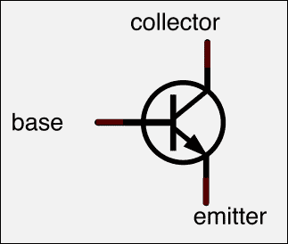

带有三条腿的普通 NPN 晶体管

此组件通常在以下三种主要情况下使用：

+   作为逻辑电路中的数字开关

+   作为信号放大器

+   作为与其他组件结合的电压稳定器

晶体管是世界上最广泛使用的组件。它们不仅用作离散组件（独立的），而且还与其他许多组件结合成一个高密度系统，例如在处理器中。

## 达尔林顿晶体管阵列，ULN2003

我们将在这里使用晶体管，因为它包含在一个名为 ULN2003 的集成电路中。多么漂亮的名字！一个更明确的名称是**高电流****达尔林顿晶体管阵列**。好吧，我知道这没有帮助！

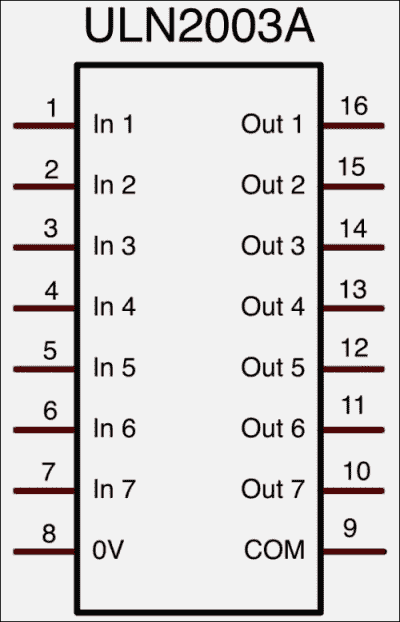

其数据表可以在以下位置找到

[`www.ti.com/lit/ds/symlink/uln2003a.pdf`](http://www.ti.com/lit/ds/symlink/uln2003a.pdf).

它包含七个输入引脚和七个输出引脚。我们还可以看到 0 V 引脚（编号 8）和 COM 引脚 9。

原理简单而神奇：

+   必须将 0 V 连接到地

+   如果你对输入*n*施加 5 V，输出*n*将转换到地

如果你将 0 V 施加到输入*n*，输出*n*将断开连接。

这可以很容易地用作开关的电流吸收阵列。

与 74HC595 结合，我们现在将驱动我们的 3 x 3 LED 矩阵：

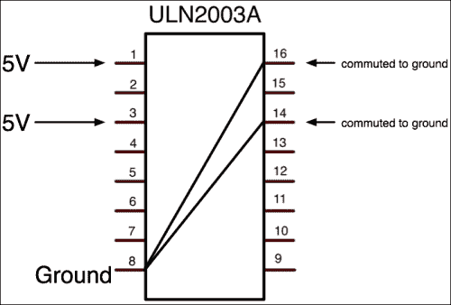

一种情况是输入 1 和 2 被供电，导致输出 1 和 2（引脚 16 和 14）的转换

## LED 矩阵

让我们看看我们如何布线我们的矩阵，记住我们必须能够独立控制每个 LED，当然。

这种设计非常常见。你可以很容易地找到这种方式的现成 LED 矩阵，它们以带有与行和列相关的连接器的包装形式出售。

LED 矩阵基本上是一个数组，其中：

+   每行都突出一个与该行所有阳极相关的连接器

+   每列都突出一个与该列所有阴极相关的连接器

这不是法律，我发现有些矩阵完全相反地布线，有时相当奇怪。所以，小心并检查数据表。在这里，我们将研究一个非常基本的 LED 矩阵，以便深入了解这个概念：

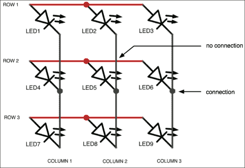

一个基本的 3 x 3 LED 矩阵

让我们看看 LED 矩阵架构的概念。

我们如何控制它？在这里，我指的是将好的 LED 指向好的行为，从开启或关闭。

让我们想象一下，如果我们想点亮**LED 2**，我们必须：

+   将**行 1**连接到 5 V

+   将**列 2**连接到地

太好了！我们可以点亮那个**LED 2**。

让我们进一步。让我们想象一下，如果我们想点亮**LED 2**和**LED 4**，我们必须：

+   将**ROW 1**连接到 5 V

+   将**COLUMN 2**连接到地

+   将**ROW 2**连接到 5 V

+   将**COLUMN 1**连接到地

你注意到什么了吗？

如果你仔细遵循步骤，你应该在你的矩阵上看到一些奇怪的东西：

**LED 1**、**LED 2**、**LED 4**和**LED 5**将被点亮

出现了问题：如果我们给**ROW 1**接上 5 V，如何区分**COLUMN 1**和**COLUMN 2**？

我们将看到这并不难，而且这只是一个与我们视觉持久性相关的小技巧。

## 自行车和视角

我们可以通过快速循环我们的矩阵来处理上一节遇到的问题。

诀窍是每次只打开一列。当然，也可以通过每次只打开一行来实现。

让我们回顾一下之前的问题：如果我们想点亮**LED 2**和**LED 4**，我们必须：

+   将**ROW 1**连接到 5 V 和**COLUMN 1**仅连接到 5 V

+   然后，将**ROW 2**连接到 5 V，仅将**COLUMN 2**连接到 5 V

如果我们非常快地这样做，我们的眼睛不会看到每次只有一个 LED 被点亮。

伪代码将是：

```cpp
For each column
	Switch On the column
		For each row
			Switch on the row if the corresponding LED has to be switched On

```

## 电路

首先，电路必须被设计。它看起来是这样的：

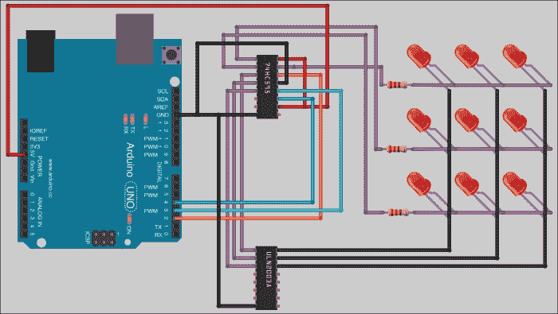

将 Arduino 连接到 595 移位寄存器，通过 ULN2003 驱动每一行和每一列

现在我们来检查电路图：

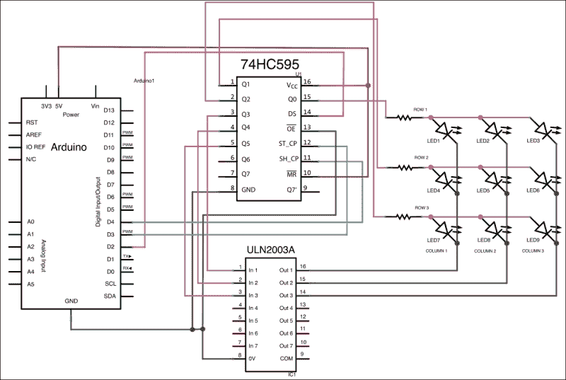

显示矩阵行和列处理的电路图

我们现在已知的是 74HC595 移位寄存器。

这个是连接到 ULN2003 移位寄存器和矩阵的行，ULN2003 连接到矩阵的列。

那是什么设计模式？

移位寄存器从 Arduino 通过其数字引脚 2 发送的基于串行协议的消息中获取数据。正如我们之前测试的那样，移位寄存器被时钟到 Arduino，一旦其锁存引脚连接到高电平（等于 5 V），它就会根据 Arduino 发送给它的数据驱动输出到 5V 或不驱动。因此，我们可以通过发送到移位寄存器的数据来控制矩阵的每一行，通过是否提供 5V 来控制它们。

为了点亮 LED，我们必须关闭它们所插的电路，即电线路。我们可以给**ROW 1**提供 5V 电流，但如果我们不将这个或那个列接地，电路就不会闭合，并且没有 LED 会被点亮。对吧？

ULN2003 正是为了地面换流而制造的，正如我们之前看到的。如果我们给其一个输入提供 5V，它就会将相应的输出*n*引脚换流到地。因此，通过我们的 595 移位寄存器，我们可以控制行的 5V 换流和列的接地换流。我们现在完全控制了我们的矩阵。

尤其是我们将检查代码，包括之前解释的列的电源周期。

## 3 x 3 LED 矩阵代码

你可以在`Chapter08/LedMatrix3x3/`文件夹中找到以下 3x3 LED 矩阵代码：

```cpp
int CLOCK_595 = 4;    // first 595 clock pin connecting to pin 4
int LATCH_595 = 3;    // first 595 latch pin connecting to pin 3
int DATA_595 = 2;     // first 595 serial data pin connecting to pin 2

// random groove machine variables
int counter = 0;
boolean LED_states[9] ;

void setup() {

  pinMode(LATCH_595, OUTPUT);
  pinMode(CLOCK_595, OUTPUT);
  pinMode(DATA_595, OUTPUT);

  // use a seed coming from the electronic noise of the ADC 
  randomSeed(analogRead(0));
}

void loop() {

  // generate random state for each 9 LEDs
  for (int i = 0 ; i < 9 ; i++)
  {
    LED_states[i] = random(2) ;
  }

  // initialize data at each loop()
  byte data = 0;
  byte dataRow = 0;
  byte dataColumn = 0;
  int currentLed = 0;

  // cycling columns
  for (int c = 0 ; c < 3 ; c++)
  {
    // write the 1 at the correct bit place (= current column)
    dataColumn = 1 << (4 - c); 

    // cycling rows
    for (int r = 0 ; r < 3 ; r++)
    {
      // IF that LED has to be up, according to LED_states array
      // write the 1 at the correct bit place (= current row)
      if (LED_states[currentLed]) dataRow = 1 << (4 - c);

      // sum the two half-bytes results in the data to be sent
      data = dataRow | dataColumn;

      // Put latch pin to LOW (ground) while transmitting data to 595
      digitalWrite(LATCH_595, LOW);

      // Shifting Out bits 
      shiftOut(DATA_595, CLOCK_595, MSBFIRST, data);

      // Put latch pin to HIGH (5V) & all data are pushed to outputs
      digitalWrite(LATCH_595, HIGH);

      dataRow = 0; // resetting row bits for next turn
      currentLed++;// incrementing to next LED to process
    }

    dataColumn = 0;// resetting column bits for next turn
  }

  // each 5000 loop() execution, grab a new seed for the random function
  if (counter < 5000) counter++;
  else 
  {
    randomSeed(analogRead(0));    // read a new value from analog pin 0
    counter = 0;                  // reset the counter
  }

  // pause a bit to provide a cuter fx
  delay(150);
}
```

这段代码带有注释，相当自解释，但让我们更详细地检查一下。

全局结构让人联想到 Multiplexing_8Leds 中的结构。

我们有一个名为 LED_states 的整数数组。我们在其中存储每个 LED 状态的值。`setup()`块相当简单，定义用于与 595 移位寄存器通信的每个数字引脚，然后从 ADC 获取一个随机种子。`loop()`函数稍微复杂一些。首先，我们生成九个随机值并将它们存储在 LED_states 数组中。然后，我们初始化/定义一些值：

+   `data` 是发送到移位寄存器的字节。

+   `dataRow` 是处理行状态的字节部分（是否转换为 5V）。

+   `dataColumn` 是处理列状态的字节部分（是否转换为地）。

+   `currentLed` 保留当前由 LED 处理的跟踪。

然后，那些嵌套的循环发生。

对于每一列（第一个 for()循环），我们通过使用一个小巧、便宜且快速的位运算符来激活循环：

```cpp
dataColumn = 1 << (4 – c);
```

`(4 – c)` 从`4`到`2`，在整个第一个`loop()`函数中；然后，`dataColumn`从`0 0 0 1 0 0 0 0`变为`0 0 0 0 1 0 0 0`，最后变为`0 0 0 0 0 1 0 0`。

这里发生了什么？一切都是关于编码。

前三位（从左边开始，最高位 MSB）处理矩阵的行。确实，三行连接到 595 移位寄存器的`Q0`、`Q1`和`Q2`引脚。

第二个三位组处理 ULN2003，它本身处理列。

通过从 595 的`Q0`、`Q1`和`Q2`提供 5V，我们处理行。通过从 595 的`Q3`、`Q4`和`Q5`提供 5V，我们通过 ULN2003 处理列。

好的！

我们仍然有两个未使用的位在这里，最后两个。

让我们再次看看我们的代码。

在 for()循环的每次列转换中，我们将对应于列的位向右移动，将每个列循环性地转换为地。

然后，对于每一列，我们以相同的模式循环行，测试我们必须要推送到 595 的相应 LED 的状态。如果 LED 需要打开，我们使用相同的位运算技巧将相应的位存储在`dataRow`变量中。

然后，我们将这两部分相加，得到数据变量。

例如，如果我们处于第二行和第二列，并且需要打开 LED，那么存储的数据将是：

`0 1 0 0 1 0 0 0`。

如果我们处于（1,3），那么存储的数据将是：

`1 0 0 0 0 1 0 0`.

然后，我们有一个模式，将锁存器设置为低电平，将存储在数据中的位移出到移位寄存器，然后通过将锁存器设置为高电平将数据提交到 Q0 到 Q7 输出，为电路中的正确元素提供能量。

在处理完每一行后，我们重置对应于前三个行的三位，并增加`currentLed`变量。

在处理完每一列的末尾，我们重置与下一列对应的三个位。

这种全局嵌套结构确保我们一次只能有一个 LED 开启。

电流消耗会有什么后果？

我们只有一个 LED 供电，这意味着我们的最大功耗可能被九等分。是的，听起来很棒！

然后，我们有模式抓取，每次 5000 次 loop()循环抓取一个新的种子。

我们刚刚学会了如何轻松地处理 LED 矩阵，同时减少功耗。

但是，我不满意。通常，创造者和艺术家通常永远不会完全满意，但在这里，请相信我，情况不同；我们可以做得比仅仅开关 LED 更好。我们还可以调节亮度，从非常低的强度切换到非常高的强度，产生不同的光色。

# 使用 PWM 模拟模拟输出

如我们所知，开关 LED 是没问题的，而且正如我们将在下一章中看到的，使用 Arduino 的数字引脚作为输出开关许多东西也是可以的。

我们也知道如何从设置为输入的数字引脚读取状态，甚至从 ADC 中的模拟输入读取 0 到 1023 的值。

就我们所知，Arduino 上没有模拟输出。

模拟输出会添加什么？它会提供一种写入除了只有 0 和 1 之外的其他值的方法，我的意思是 0V 和 5V。这会很棒，但需要昂贵的 DAC。

事实上，Arduino 板上没有 DAC。

## 脉宽调制概念

**脉宽调制**是一种非常常见的用于模拟输出行为的模拟技术。

让我们换一种说法。

我们的数字输出只能处于 0V 或 5V。但在特定的时间间隔内，如果我们快速开关它们，那么我们可以根据在 0V 或 5V 下经过的时间计算平均值。这个平均值可以很容易地用作一个值。

查看以下电路图以了解更多关于占空比的概念：

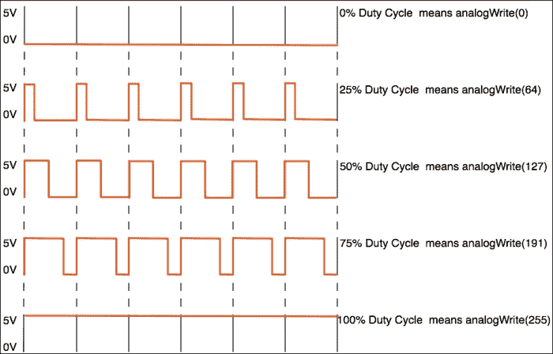

占空比和 PWM 的概念

在 5V 下花费的平均时间定义了占空比。这个值是引脚在 5V 时的平均时间，并以百分比给出。

`analogWrite()`是一个特殊函数，可以在特定的占空比下生成稳定的方波，直到下一次调用。

根据 Arduino 核心文档，PWM 信号以 490Hz 的频率脉冲。我还没有（现在）验证这一点，但使用示波器等工具才能真正实现。

### 备注

注意：不是你板上的每个引脚都支持 PWM！

例如，Arduino Uno 和 Leonardo 在数字引脚 3、5、6、9、10 和 11 上提供 PWM。

在尝试任何操作之前，你必须知道这一点。

## 调暗 LED

让我们检查一个基本电路来测试 PWM：


让我们看看电路图，即使它很明显：


我们将使用 David A. Mellis 的 Fading 示例，并由 Tom Igoe 修改。在**文件** | **示例** | **03.模拟** | **Fading**中检查它。我们将把`ledPin`值从`9`改为`11`以适应我们的电路。

这里是修改后的样子：

```cpp
int ledPin = 11;    // LED connected to digital pin 11 (!!)

void setup()  { 
  // nothing happens in setup 
} 

void loop()  { 
  // fade in from min to max in increments of 5 points:
  for(int fadeValue = 0 ; fadeValue <= 255; fadeValue +=5) { 
    // sets the value (range from 0 to 255):
    analogWrite(ledPin, fadeValue);         
    // wait for 30 milliseconds to see the dimming effect    
    delay(30);                            
  } 

  // fade out from max to min in increments of 5 points:
  for(int fadeValue = 255 ; fadeValue >= 0; fadeValue -=5) { 
    // sets the value (range from 0 to 255):
    analogWrite(ledPin, fadeValue);         
    // wait for 30 milliseconds to see the dimming effect    
    delay(30);                            
  } 
}
```

上传它，测试它，并爱上它！

### 更高分辨率的 PWM 驱动组件

当然，有提供更高 PWM 分辨率的组件。在这里，使用原生的 Arduino 板，我们有 8 位分辨率（256 个值）。我想指出的是德州仪器的 TLC5940。您可以在以下位置找到其数据表：[`www.ti.com/lit/ds/symlink/tlc5940.pdf`](http://www.ti.com/lit/ds/symlink/tlc5940.pdf)。

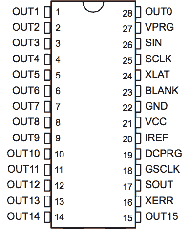

TLC5950，一个提供 PWM 控制的 16 通道 LED 驱动器

小心，它是一个恒流源驱动器。这意味着它会吸收电流而不是提供电流。例如，您需要将 LED 的阴极连接到`OUT0`和`OUT15`引脚，而不是阳极。如果您想使用这样的特定驱动器，当然不会使用`analogWrite()`。为什么？因为这个驱动器作为一个移位寄存器，通过串行连接与我们的 Arduino 相连。

我建议使用一个名为 tlc5940arduino 的库，它可在 Google 代码上找到

[`code.google.com/p/tlc5940arduino/`](http://code.google.com/p/tlc5940arduino/)

在本书的第三部分，我们将看到如何在 LED 矩阵上写消息。但是，也有一种使用最高分辨率显示器的不错方法：LCD。

# LCD 快速入门

**LCD**代表**液晶显示器**。我们在日常生活中使用 LCD 技术，如手表、数字码显示等。环顾四周，检查这些小或大的 LCD。

存在两种主要的 LCD 显示器系列：

+   字符 LCD 基于字符矩阵（列 x 行）

+   图形 LCD，基于像素矩阵

现在可以以便宜的价格找到许多包含 LCD 和连接器，用于将它们与 Arduino 和其他系统接口的印刷电路板。

现在 Arduino 核心中包含了一个库，使用起来非常简单。它的名字是**LiquidCrystal**，它与所有兼容 Hitachi HD44780 驱动器的 LCD 显示器一起工作。这个驱动器非常常见。

日立将其开发为一个非常专用的驱动器，它本身包含一个微控制器，专门用于驱动字符 LCD 并轻松连接到外部世界，这可以通过一个特定的链接完成，通常使用 16 个连接器，包括为外部电路本身和背光供电：


16 x 2 字符 LCD

我们将对其进行布线并在其上显示一些消息。

## 兼容 HD44780 的 LCD 显示电路

这里是 HD44780 兼容 LCD 显示电路的基本电路：


一个连接到 Arduino 和电位器的 16 x 2 字符 LCD，用于控制其对比度

对应的电路图如下：

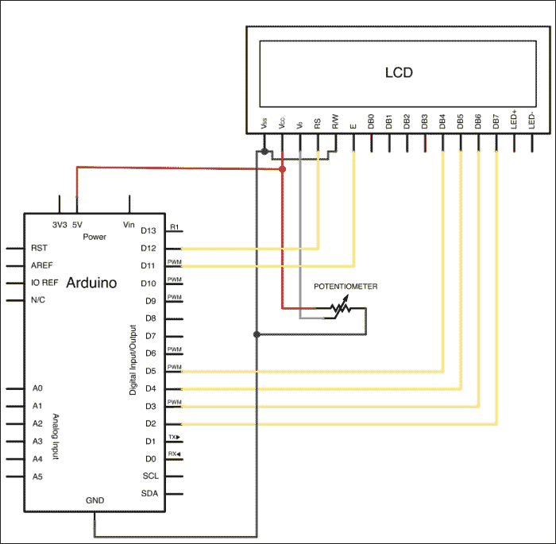

字符 LCD、电位器和 Arduino 板电路图

如果你已经有足够的光线，LED+和 LED-不是必需的。使用电位器，你还可以设置 LCD 的对比度，以便有足够的可读性。

顺便说一句，LED+和 LED-分别是内部 LED 的背光阳极和背光阴极。你可以从 Arduino 驱动这些，但这可能会导致更多的功耗。请仔细阅读 LCD 说明和数据表。

## 显示一些随机消息

这里有一些整洁的固件。你可以在`Chapter08/basicLCD/`文件夹中找到它：

```cpp
#include <LiquidCrystal.h>

String manyMessages[4];
int counter = 0;

// Initialize the library with pins number of the circuit
// 4-bit mode here without RW
LiquidCrystal lcd(12, 11, 5, 4, 3, 2);

void setup() {

  // set up the number of column and row of the LCD
  lcd.begin(16, 2);

  manyMessages[0] = "I am the Arduino";
  manyMessages[1] = "I can talk";
  manyMessages[2] = "I can feel";
  manyMessages[3] = "I can react";

  // shaking the dice!
  randomSeed(analogRead(0);
}

void loop() {

  // set the cursor to column 0 and row 0
  lcd.setCursor(0, 0);

  // each 5s
  if (millis() - counter > 5000)
  {
    lcd.clear(); // clear the whole LCD
    lcd.print(manyMessages[random(4)]); // display a random message
    counter = millis();  // store the current time
  }

  // set the cursor to column 0 and row 1
  lcd.setCursor(0, 1);
  // print the value of millis() at each loop() execution
  lcd.print("up since: " + millis() + "ms");
}
```

首先，我们必须包含`LiquidCrystal`库。然后，我们定义两个变量：

+   `manyMessages`是一个用于存储消息的 String 数组

+   `counter`是一个用于时间追踪的变量

然后，我们通过向其构造函数传递一些变量来初始化`LiquidCrystal`库，这些变量对应于连接 LCD 到 Arduino 所使用的每个引脚。当然，引脚的顺序很重要。它是：`rs`、`enable`、`d4`、`d5`、`d6`和`d7`。

在`setup()`中，我们根据硬件定义 LCD 的大小，这里将是 16 列和两行。

然后，我们在 String 数组的每个元素中静态存储一些消息。

在`loop()`块中，我们首先将光标放置在 LCD 的第一位置。

我们测试表达式`(millis() – counter > 5000)`，如果为真，则清除整个 LCD。然后，我打印一个随机定义的消息。实际上，`random(4)`生成一个介于 0 和 3 之间的伪随机数，由于索引是随机的，我们在`setup()`中定义的四个消息之一随机打印到 LCD 的第一行。

然后，我们存储当前时间，以便能够测量自上次显示随机消息以来经过的时间。

然后，我们将光标置于第二行的第一列，然后打印一个由常数和变量部分组成的 String，显示自 Arduino 板上次重置以来的毫秒数。

# 摘要

在这个漫长的章节中，我们学习了如何处理许多事情，包括单色 LED 到 RGB LED，使用移位寄存器和晶体管阵列，甚至介绍了 LCD 显示。我们深入研究了在不使用电脑的情况下从 Arduino 显示视觉反馈。

在许多实际设计案例中，我们可以找到完全独立使用 Arduino 板的项目，无需电脑。通过使用特殊库和特定组件，我们现在知道我们可以让我们的 Arduino 感觉、表达和反应。

在下一章中，我们将解释并深入研究一些其他概念，例如让 Arduino 移动，最终生成声音。
