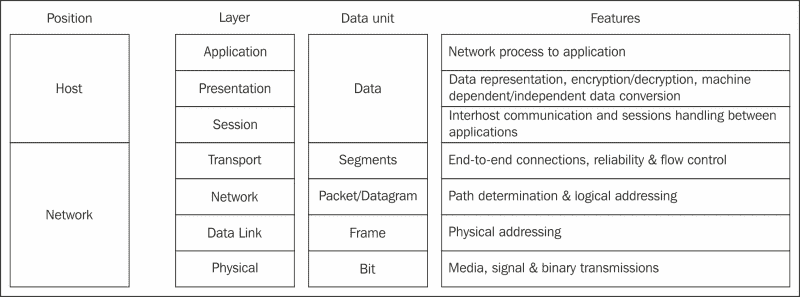
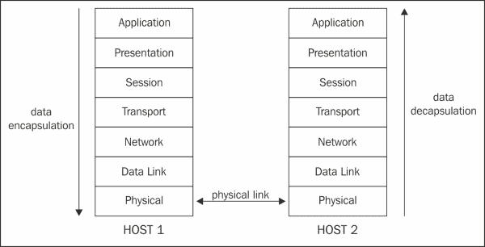
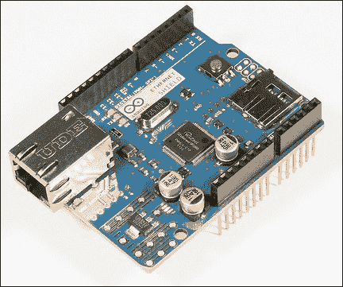
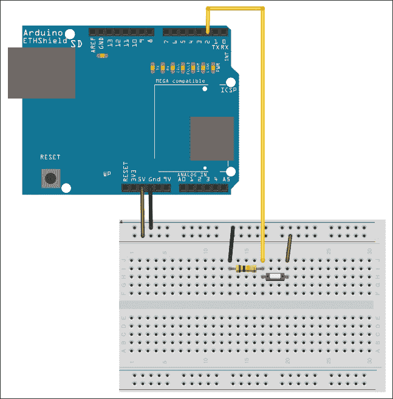
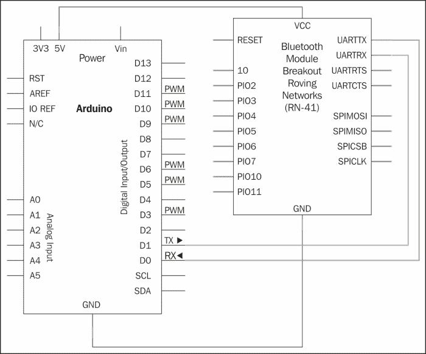
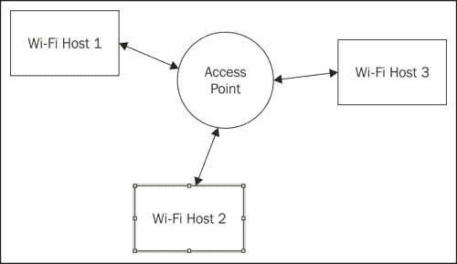
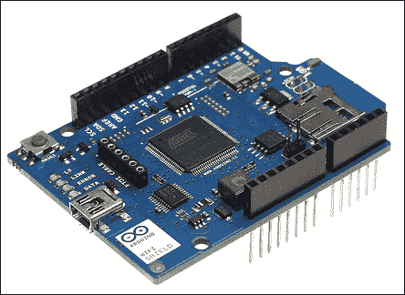

# 第十一章：网络通信

在本章中，我们将讨论通过创建通信网络来连接对象并使它们通过通信进行交流。我们将学习如何通过网络链路和协议使多个 Arduino 和计算机进行通信。

在定义了什么是网络（特别是数据网络）之后，我们将描述如何在 Arduino 和计算机之间使用有线以太网链路。这将使 Arduino 世界通向互联网。然后，我们将探讨如何创建蓝牙通信。

我们将学习如何使用以太网 Wi-Fi 将 Arduino 连接到计算机或其他 Arduino，而无需被网络电缆所束缚。

最后，我们将研究几个例子，从向微博服务 Twitter 发送消息的例子，到解析和响应从互联网接收到的数据的例子。

我们还将介绍广泛用于与交互设计、音乐和多媒体相关的一切的 OSC 交换协议。

# 网络概述

网络是由相互连接的元素组成的系统。我们周围有许多网络，如公路系统、电网和数据网络。数据网络包围着我们。它们与视频服务网络、电话和全球电信网络、计算机网络等相关。我们将通过讨论如何通过不同类型的媒体（如传输电脉冲的电线或促进无线通信的电磁波）共享数据来关注这些类型的网络。

在我们深入 Arduino 板网络实现细节之前，我们将描述一个名为 OSI 模型（开放系统互连模型）的模型。这是一个非常有用的表示，说明了数据网络是什么以及它涉及的内容。

## OSI 模型概述

**开放** **系统** **互连**模型（**OSI**模型）于 1977 年由国际标准化组织发起，旨在定义关于通信系统功能的抽象层的规定和要求。

基本上，这是一个基于层的模型，描述了设计通信系统所需的功能。以下是具有七层的 OSI 模型：



描述通信系统要求的七层抽象的 OSI 模型

## 协议和通信

通信协议是一组消息格式和规则，提供了一种至少两个参与者之间通信的方式。在每一层中，一个或多个实体实现其功能，每个实体直接且仅与下一层交互，同时为上层提供使用设施。协议使一个主机中的一个实体能够与另一个主机中同一层的相应实体进行交互。这可以通过以下图表表示：


协议帮助主机层之间进行通信

## 数据封装和解封装

如果一个主机的应用程序需要将数据发送到另一个主机的应用程序，有效数据，也称为有效载荷，将直接传递到其下的一层。为了使应用程序能够检索其数据，根据每一层使用的协议，将添加头部和尾部到这些数据。这被称为**封装**，并且一直发生到最低层，即物理层。在这一点，一个比特流被调制到介质上以供接收器使用。

接收器必须使数据逐步爬升层堆栈，将数据从一层传递到更高一层，并使用之前添加的头部和尾部将其地址指向每一层的正确实体。这些头部和尾部在整个路径上都被移除；这被称为**解封装**。

在旅程结束时，接收器的应用程序接收其数据并可以处理它。整个过程可以用以下图表表示：



在层堆栈中沿层进行封装和解封装

我们也可以将这些过程表示如下图所示。小灰色矩形是层 N+1 的数据有效载荷。


根据使用的协议添加和移除特定的头部和尾部

在每一级，两个主机使用传输的协议进行交互，我们称之为**协议数据单元**或**PDU**。我们还将从一层传递到下一层且尚未封装的特定数据单元称为**服务数据单元**或**SDU**。

每一层都将接收到的数据视为自己的数据，并根据所使用的协议添加/移除头部和尾部。

我们现在将通过示例来阐述每一层和协议。

## 每一层的角色

我们将在这里描述每一层的用途和角色。

### 物理层

物理层定义了通信所需的电气和物理规范。

引脚布局、电压和线路阻抗、信号时序、网络适配器或主机总线适配器在此层定义。基本上，这一层执行三个主要功能/服务：

+   初始化和终止与通信介质的连接

+   参与共享资源控制过程

+   通信数据与携带它们的电气信号之间的转换

我们可以引用一些已知的标准，它们位于这一物理层：

+   ADSL 和 ISDN（网络和模拟服务提供商）

+   蓝牙

+   IEEE 1394（FireWire）

+   USB

+   IrDA（通过红外链路的数据传输）

+   SONET、SDH（由提供商运营的广域光纤网络）

### 数据链路层

这一层由两个子层组成：

+   逻辑链路控制 (LLC)

+   媒体访问控制 (MAC)

它们都负责在网络实体之间传输数据，并检测物理层可能发生的错误，最终修复它们。基本上，这一层提供以下功能/服务：

+   封装

+   物理寻址

+   流控制

+   错误控制

+   访问控制

+   媒体访问控制

我们可以引用该数据链路层的一些已知标准：

+   以太网

+   Wi-Fi

+   PPP

+   I2C

我们必须记住，第二层也是局域网的领域，只有物理地址。它可以通过局域网交换机进行联邦。

顺便说一下，我们经常需要分段网络并更广泛地通信，因此我们需要另一个寻址概念；这引入了网络层。

### 网络层

这一层提供了在不同网络中的主机之间传输数据序列的方法。它提供以下功能/服务：

+   路由

+   分片和重组

+   报告交付错误

路由提供了一种使不同网络上的主机能够通过使用网络寻址系统进行通信的方法。

分片和重组也发生在这一级。这些提供了一种将数据流切割成片段并在传输后重新组装部分的方法。我们可以引用这一层的一些已知标准：

+   ARP（解析和将物理 MAC 地址转换为网络地址）

+   BOOTP（为主机通过网络启动提供一种方式）

+   BGP、OSPF、RIP 和其他路由协议

+   IPv4 和 IPv6（互联网协议）

路由器通常是路由发生的地方。它们连接到多个网络，使数据从一个网络传输到另一个网络。这也是我们可以放置一些访问列表以根据 IP 地址控制访问的地方。

### 传输层

这一层负责在终端用户之间进行数据传输，位于网络层和应用层的交汇处。这一层提供以下功能/服务：

+   流控制以确保链路的可靠性

+   数据单元的分割/解分割

+   错误控制

通常，我们将协议分为两类：

+   面向状态

+   面向连接

这意味着这一层可以跟踪发出的段，并在之前传输失败的情况下最终重新传输它们。

在这一层，我们可以引用 IP 套件的两个著名标准：

+   TCP

+   UDP

TCP 是面向连接的。它通过在每个传输或每个 x 个传输的段中检查许多元素来保持通信的可靠性。

UDP 更简单且无状态。它不提供通信状态控制，因此更轻量。它更适合于面向事务的查询/响应协议，如 DNS（域名系统）或 NTP（网络时间协议）。如果有问题，例如一个分段没有很好地传输，上面的层必须负责重新发送请求，例如。

### 应用/主机层

我将最高三层归类为应用和主机。

事实上，它们不被视为网络层，但它们是 OSI 模型的一部分，因为它们通常是任何网络通信的最终目的。

我们在那里发现了许多客户端/服务器应用程序：

+   FTP 用于基本和轻量级文件传输

+   POP3、IMAP 和 SMTP 用于邮件服务

+   SSH 用于安全的远程 shell 通信

+   HTTP 用于网页浏览和下载（以及如今更多）

我们还发现了许多与加密和安全相关的标准，例如 TLS（传输层安全性）。我们的固件，一个正在执行的 Processing 代码，Max 6 运行补丁都在这一层。

如果我们想让它们通过广泛的网络进行通信，我们需要一些 OSI 栈。我的意思是，我们需要一个传输和网络协议以及一个传输数据的中介。

如果我们的现代计算机拥有整个网络栈并准备好使用，那么如果我们想让它们能够与世界通信，我们就必须在 Arduino 的固件中稍后构建这个功能。这就是我们在下一小节将要做的。

## 一些关于 IP 地址和端口的方面

我们每天倾向于使用的协议栈之一是 TCP/IP。TCP 是第 4 层传输协议，IP 是第 3 层网络。

这是世界上使用最广泛的网络协议，无论是对于终端用户还是对于公司。

我们将更详细地解释 IP 寻址系统、子网掩码和通信端口。我不会描述一个完整的网络课程。

### IP 地址

IP 地址是任何想要通过 IP 网络通信的设备引用的数值地址。IP 目前使用 2 个版本：IPv4 和 IPv6。在这里我们考虑 IPv4，因为它目前是终端用户唯一使用的版本。IPv4 地址由 32 位编码。它们通常被写成由点分隔的 4 个字节的易读集合。192.168.1.222 是我的计算机当前的 IP 地址。有 2³²个可能的唯一地址，并且并不是所有都可以在互联网上路由。一些被保留用于私有用途。一些公司分配可路由互联网地址。实际上，我们不能使用这两个地址，因为这是由全球组织处理的。每个国家都有为自身目的分配的地址集合。

### 子网

子网是一种将我们的网络分割成多个更小网络的方法。设备网络的配置通常包含地址、子网掩码和网关。

地址和子网掩码定义了网络范围。了解发送器是否可以直接与接收器通信是必要的。实际上，如果后者在同一网络内，通信可以直接发生；如果它在另一个网络中，发送器必须将其数据发送到网关，网关将数据路由到正确的下一个节点，以便尽可能到达接收器。

网关了解它所连接的网络。它可以跨不同网络路由数据，并最终根据某些规则过滤一些数据。

通常，子网掩码也以人类可读的 4 字节集合的形式编写。显然，有一个位表示法，对于那些不习惯于操作数字的人来说更难。

我的计算机的子网掩码是 255.255.255.0。这些信息和我的 IP 地址定义了我的家庭网络从 192.168.1.0（这是基本网络地址）开始，到 192.168.1.255（这是广播地址）结束。我不能使用这些地址为我的设备分配，而只能使用从 192.168.1.1 到 192.168.1.254 的地址。

### 通信端口

通信端口是定义并相关于第 4 层，即传输层的某个东西。

假设你想向特定应用的主机发送一条消息。接收者必须处于监听模式，以便接收他想要接收的消息。

这意味着它必须为连接打开并保留一个特定的套接字，这就是通信端口。通常，应用程序为它们自己的目的打开特定的端口，一旦一个端口被一个应用程序打开并保留，在第一个应用程序打开期间，它就不能被另一个应用程序使用。

这提供了一种强大的数据交换系统。实际上，如果我们想向一个主机发送超过一个应用的数据，我们可以将我们的消息特别指向这个主机上的不同端口，以到达不同的应用。

当然，为了全球通信，必须定义标准。

TCP 端口 80 用于与 Web 服务器数据交换相关的 HTTP 协议。

UDP 端口 53 用于与 DNS 相关的任何事物。

如果你好奇，你可以阅读以下包含所有声明和保留端口及其相关服务的巨大官方文本文件：[`www.ietf.org/assignments/service-names-port-numbers/service-names-port-numbers.txt`](http://www.ietf.org/assignments/service-names-port-numbers/service-names-port-numbers.txt)。

这些是惯例。有人可以很容易地在非 80 端口的端口上运行 Web 服务器。然后，这个 Web 服务器的特定客户端必须知道使用的端口。这就是为什么惯例和标准是有用的。

# 将 Arduino 连接到有线以太网

以太网是现在最常用的局域网。

常规的 Arduino 板不提供以太网功能。有一个名为 Arduino Ethernet 的板提供了本地的以太网和网络功能。顺便说一下，它不提供任何 USB 原生功能。

你可以在这里找到参考页面：[`arduino.cc/en/Main/ArduinoBoardEthernet`](http://arduino.cc/en/Main/ArduinoBoardEthernet)。


带有以太网连接器的 Arduino 以太网板

我们将使用 Arduino 以太网盾和一根 100BASE-T 电缆与 Arduino UNO R3 连接。它保留了 USB 功能，并增加了以太网网络连接性，通过比 USB 更长的电缆，为我们提供了一个将计算机与 Arduino 连接的便捷方式。



Arduino 以太网盾

如果你寻找 Arduino 以太网模块，你必须知道它们是带 PoE 模块或不带 PoE 模块销售的。

**PoE**代表**以太网供电**，是一种通过以太网连接为设备供电的方式。这需要两个部分：

+   设备上必须供电的模块

+   一台能够提供 PoE 支持的网路设备

在我们这里，我们不会使用 PoE。

## 通过以太网使 Processing 和 Arduino 通信

让我们设计一个基本系统，展示如何设置 Arduino 板和 processing 小程序之间的以太网通信。

这里，我们将使用一个通过以太网连接到我们电脑的 Arduino 板。我们按下一个按钮，触发 Arduino 通过 UDP 向电脑上的 Processing 小程序发送消息。小程序通过绘制某些内容并发送回消息给 Arduino，Arduino 内置的 LED 灯就会亮起。

### 基本接线

这里，我们连接一个开关并使用内置的 LED 板。我们必须使用以太网线将我们的 Arduino 板连接到电脑。

这种接线与第五章中 MonoSwitch 项目的接线非常相似，除了我们在这里使用的是 Arduino 以太网屏蔽板而不是 Arduino 板本身。



连接到 Arduino 以太网屏蔽板的开关和下拉电阻

对应的电路图如下：


连接到 Arduino 以太网屏蔽板的开关和下拉电阻

### 在 Arduino 中编码网络连接实现

正如我们描述的，如果我们想让我们的 Arduino 能够通过以太网线（更普遍地说，通过以太网网络）进行通信，我们必须在固件中实现所需的标准。

有一个名为`Ethernet`的库可以提供大量的功能。

如同往常，我们必须包含这个本地库本身。你可以通过导航到**草图** **|** **导入库**来选择这样做，这几乎包含了你需要的一切。

然而，由于 Arduino 版本 0018 中 SPI 的实现，以及 Arduino 以太网屏蔽板通过 SPI 与 Arduino 板通信，我们必须包含一些额外的内容。请注意这一点。

对于这个代码，你需要：

```cpp
#include <SPI.h>         
#include <Ethernet.h>
#include <EthernetUdp.h>
```

这是一段 Arduino 代码的示例，后面将进行解释。

你可以在`Chapter11/WiredEthernet`找到完整的 Arduino 代码。

```cpp
#include <SPI.h>
#include <Ethernet.h>
#include <EthernetUdp.h>

// Switch & LED stuff
const int switchPin = 2;     // switch pin
const int ledPin =  13;      // built-in LED pin
int switchState = 0;         // storage variable for current switch state
int lastSwitchState = LOW;
long lastDebounceTime = 0;
long debounceDelay = 50;

// Network related stuff

// a MAC address, an IP address and a port for the Arduino
byte mac[] = { 
  0xDE, 0xAD, 0xBE, 0xEF, 0xFE, 0xED };
IPAddress ipArduino(192, 168, 1, 123);
unsigned int ArduinoPort = 9999;

// an IP address and a UDP port for the Computer
// modify these according to your configuration
IPAddress ipComputer(192, 168, 1, 222);
unsigned int ComputerPort = 10000;

// Send/receive buffer
char packetBuffer[UDP_TX_PACKET_MAX_SIZE]; //buffer for incoming packets

// Instantiate EthernetUDP instance to send/receive packets over UDP
EthernetUDP Udp;

void setup() {
  pinMode(ledPin, OUTPUT);   // the led pin is setup as an output
  pinMode(switchPin, INPUT); // the switch pin is setup as an input

  // start Ethernet and UDP:
  Ethernet.begin(mac,ipArduino);
  Udp.begin(ArduinoPort);
}

void loop(){

  // if a packet has been received read a packet into packetBufffer
  if (Udp.parsePacket()) Udp.read(packetBuffer,UDP_TX_PACKET_MAX_SIZE);
  if (packetBuffer == "Light") digitalWrite(ledPin, HIGH);
  else if (packetBuffer == "Dark") digitalWrite(ledPin, LOW);

  // read the state of the digital pin
  int readInput = digitalRead(switchPin);
  if (readInput != lastSwitchState)
  {
    lastDebounceTime = millis(); 
  }

  if ( (millis() - lastDebounceTime) > debounceDelay )
  { 
    switchState = readInput; 
  }

  lastSwitchState = readInput;
  if (switchState == HIGH)
  {
    // If switch is pushed, a packet is sent to Processing
    Udp.beginPacket(ipComputer, ComputerPort);
    Udp.write('Pushed');
    Udp.endPacket();
  }
  else
  {
    // If switch is pushed, a packet is sent to Processing
    Udp.beginPacket(ipComputer, ComputerPort);
    Udp.write('Released');
    Udp.endPacket();
  }

  delay(10);
}
```

在之前的代码块中，首先我们包含`Ethernet`库。然后我们声明与开关去抖动和 LED 处理相关的完整变量集。在这些语句之后，我们定义了一些与网络功能相关的变量。

首先，我们必须设置与我们自己的屏蔽板相关的 MAC 地址。这个唯一的标识符通常标示在你的以太网屏蔽板上的标签上。请务必在代码中放入你的 MAC 地址。

然后，我们设置 Arduino 的 IP 地址。只要它遵守 IP 地址方案，并且我们的计算机可以访问，我们就可以使用任何地址。这意味着在同一网络或另一网络，但两者之间有一个路由器。然而，请注意，您选择的 IP 地址必须在本地网络段中是唯一的。

我们还为我们的通信选择一个 UDP 端口。我们使用与我们的计算机相关的网络参数相同的定义，这是通信中的第二组参与者。

我们声明一个缓冲区来存储每次接收到的当前消息。注意常量`UDP_TX_PACKET_MAX_SIZE`。它在 Ethernet 库中定义。基本上，它被定义为 24 字节，以节省内存。我们可以更改它。然后，我们实例化`EthernetUDP`对象，以便通过 UDP 接收和发送数据报。`setup()`函数块包含开关和 LED 的语句，然后是 Ethernet 本身的语句。

我们使用 MAC 和 IP 地址开始以太网通信。然后我们打开并监听定义中指定的 UDP 端口，在我们的例子中是 9999。`loop()`函数看起来有点复杂，但我们可以将其分为两部分。

在第一部分，我们检查 Arduino 是否已收到数据包。如果收到了，它将通过调用 Ethernet 库的`parsePacket()`函数并检查它是否返回一个非零的数据包大小来检查。我们读取数据并将其存储在`packetBuffer`变量中。

然后我们检查这个变量是否等于`Light`或`Dark`，并相应地通过在 Arduino 板上打开或关闭 LED 来采取行动。

在第二部分，我们可以看到与我们在第五章中看到的相同的防抖结构。在这一部分的末尾，我们检查开关是否被按下或释放，并根据状态向计算机发送 UDP 消息。

现在我们来检查 Processing/计算机部分。

### 编写一个通过以太网通信的 Processing Applet

让我们检查`Chapter11/WiredEthernetProcessing`中的代码。

我们需要超媒体库。我们可以在[`ubaa.net/shared/processing/udp`](http://ubaa.net/shared/processing/udp)找到它。

```cpp
import hypermedia.net.*;

UDP udp;  // define the UDP object
String currentMessage;

String ip       = "192.168.1.123"; // the Arduino IP address
int port        = 9999;        // the Arduino UDP port

void setup() {
  size(700, 700);
  noStroke();
  fill(0);

  udp = new UDP( this, 10000 );  // create UDP socket
  udp.listen( true );           // wait for incoming message
}

void draw()
{
  ellipse(width/2, height/2, 230, 230);
}

void receive( byte[] data ) {

  // if the message could be "Pushed" or "Released"
  if ( data.length == 6 || data.length == 8 ) 
  {
    for (int i=0; i < data.length; i++) 
    { 
      currentMessage += data[i];
    }

    // if the message is really Pushed
    // then answer back by sending "Light"
    if (currentMessage == "Pushed")
    {
      udp.send("Light", ip, port );
      fill(255);
    }
    else if (currentMessage == "Released")
    {
      udp.send("Dark", ip, port );
      fill(0);
    }
  }
}
```

我们首先导入库。然后我们定义 UDP 对象和用于当前接收消息的 String 变量。

在这里，我们也必须定义远程参与者，即 Arduino 的 IP 地址。我们还要定义在 Arduino 侧打开并可用于通信的端口，这里为 9999。

当然，这必须与在 Arduino 固件中定义的相匹配。在`setup()`函数中，我们定义了一些绘图参数，然后实例化 UDP 端口 10000 上的 UDP 套接字，并将其设置为监听模式，等待传入的消息。

在`draw()`函数中，我们画一个圆。`receive()`函数是代码在接收到数据包时调用的回调函数。我们测试数据包的字节数长度，因为我们只想对两种不同的消息做出反应（`Pushed`或`Released`），所以我们检查长度是否为 6 或 8 字节。所有其他数据包都不会被处理。我们可以实现一个更好的检查机制，但这个方法已经足够好。

一旦这些长度中的任何一个匹配，我们就将每个字节连接到 String 变量`currentMessage`中。这提供了一种方便的方法来比较内容与任何其他字符串。

然后，我们将它与`Pushed`和`Released`进行比较，并相应地通过向 Arduino 发送消息`Light`来填充我们绘制的圆圈为白色，或者通过向 Arduino 发送消息`Dark`来填充我们绘制的圆圈为黑色。

我们刚刚使用以太网和 UDP 设计了我们第一个基本的通信协议。

## 关于 TCP 的一些话

在我的设计中，我经常使用 UDP 在系统之间进行通信。它比 TCP 轻得多，并且对我们的目的来说已经足够。

在某些情况下，你可能需要 TCP 提供的流控制。我们刚刚使用的以太网库也提供了 TCP 功能。你可以在[`arduino.cc/en/Reference/Ethernet`](http://arduino.cc/en/Reference/Ethernet)找到参考页面。

`Server`和`Client`类可以特别用于此目的，实现功能测试，例如检查是否已打开连接，是否仍然有效等。

在本章的结尾，我们将学习如何将我们的 Arduino 连接到互联网上的某个实时服务器。

# 蓝牙通信

蓝牙是一种无线技术标准。它提供了一种使用 2,400 到 2,480 MHz 频段内的短波无线电传输在短距离内交换数据的方法。

它允许创建具有“正确”安全级别的 PANs（个人区域网络）。它被应用于各种类型的设备上，例如计算机、智能手机、音响系统等，这些设备可以从远程源读取数字音频。

Arduino BT 板原生实现了这项技术。它现在配备了 ATmega328 和 Bluegiga WT11 蓝牙模块。参考页面是`http://www.arduino.cc/en/Main/ArduinoBoardBluetooth`。

在我看来，在许多项目中，最好的做法是将通用板放在设计的核心，并通过添加外部模块仅添加我们需要的功能。因此，我们将在这里使用 Arduino UNO R3 和一个外部蓝牙模块。

我们将再次使用 Processing 制作一个小项目。你可以在 Processing 画布上点击某个位置，Processing 应用程序将通过蓝牙向 Arduino 发送消息，Arduino 会通过切换其内置 LED 的开或关来做出反应。

## 连接蓝牙模块

检查以下图示：


RN41 蓝牙模块通过串行链路连接到 Arduino

对应的电路图如下：



将 Roving Networks RN41 模块连接到 Arduino 板

有一个 Roving Networks RN41 蓝牙模块连接到 Arduino 板。

您可以在[`www.sparkfun.com/products/10559`](https://www.sparkfun.com/products/10559)找到它。

这里我们使用 Arduino 本身和蓝牙模块之间的基本串行链路通信。

我们假设我们的计算机具有蓝牙功能，并且这些功能已被激活。

## 编写固件和 Processing 小程序

固件如下。您可以在`Chapter11/Bluetooth`中找到它。

```cpp
// LED stuff
const int ledPin =  13;      // pin of the board built-in LED

void setup() {
  pinMode(ledPin, OUTPUT);   // the led pin is setup as an output

  Serial.begin(9600);       // start serial communication at 9600bps
}

void loop()
{
  if (Serial.available() > 0) {

    incomingByte = Serial.read();

    if (incomingByte == 1) digitalWrite(ledPin, HIGH);
    else if (incomingByte == 0) digitalWrite(ledPin, LOW);
  }
}
```

我们基本上使用蓝牙模块实例化`Serial`通信，然后检查是否有任何字节从其中可用并解析它们。如果有一个消息可用并且等于 1，我们打开 LED；如果它等于 0，我们关闭 LED。

处理代码如下：

```cpp
import processing.serial.*;
Serial port;

int bgcolor, fgcolor;

void setup() {
  size(700, 700);
  background(0);
  stroke(255);
  bgcolor = 0;
  fgcolor = 255;

  println(Serial.list()); 
  port = new Serial(this, Serial.list()[2], 9600);

}
void draw() {
  background(bgcolor);
  stroke(fgcolor);
  fill(fgcolor);
  rect(100, 100, 500, 500);
}

void mousePressed() {
  if (mouseX > 100 && mouseX < 600 && mouseY > 100 && mouseY < 600)
  {
      bgcolor = 255;
      fgcolor = 0;
      port.write('1');
  }
}

void mouseReleased() {

      bgcolor = 0;
      fgcolor = 255;
      port.write('0');
}
```

我们首先包含串行库。在`setup()`函数中，我们定义了一些绘图位，然后我们将串行设备列表打印到 Processing 日志区域。这显示了一个列表，我们必须找到我们计算机的正确蓝牙模块。在我的情况下，这是第三个，我使用这个在`setup()`函数的最后一条语句中实例化`Serial`通信：

```cpp
port = new Serial(this, Serial.list()[2], 9600);
```

`draw()`函数只设置：

+   背景颜色根据变量`bgcolor`

+   轮廓颜色根据变量`fgcolor`

+   填充颜色根据变量`fgcolor`

然后我们画一个正方形。

`mousePressed()`和`mouseReleased()`函数是 Processing 回调函数，分别在鼠标事件发生时调用，当你按下鼠标按钮并释放它时。

当鼠标按下时，我们检查按下时的光标位置。在我的情况下，我定义了正方形内的区域。

如果我们按下正方形中的按钮，会出现视觉反馈，以告诉我们已收到命令，但当然最重要的是`digitalWrite('1')`函数。

我们将值 1 写入蓝牙模块。

同样，当我们释放鼠标按钮时，一个“0”被写入计算机的蓝牙模块。当然，这些消息被发送到 Arduino，后者打开或关闭 LED。

我们刚刚检查了一个外部模块提供无线蓝牙通信功能的 Arduino 的示例。

正如我们所注意到的，我们不需要为此目的使用特定的库，因为模块本身只有当我们向它发送串行数据时，才能自行连接和发送/接收数据。确实，Arduino 和模块之间的通信是一种基本的串行通信。

让我们通过以太网 Wi-Fi 改进我们的空中数据通信。

# 玩转 Wi-Fi

我们之前学习了如何使用以太网库。然后，我们测试了蓝牙进行短距离网络通信。现在，让我们测试 Wi-Fi 进行中等距离通信，仍然没有任何线缆。

## 什么是 Wi-Fi？

Wi-Fi 是一套由 IEEE 802.11 标准驱动的无线通信协议。这些标准描述了无线局域网（WLAN）的特性。

基本上，拥有 Wi-Fi 模块的多个主机可以通过它们的 IP 堆栈无线通信。Wi-Fi 使用了多种网络模式。

### 基础设施模式

在这种模式下，Wi-Fi 主机可以通过接入点相互通信。

这个接入点和主机必须使用相同的**服务集标识符**（SSID），这是一个用作参考的网络名称。

这种模式很有趣，因为它通过每个主机必须通过接入点才能访问全局网络的事实来提供安全性。我们可以配置一些访问列表来控制哪些主机可以连接，哪些不能。



在基础设施模式下通过接入点交换数据的宿主

### 临时模式

在这种模式下，每个主机可以直接连接到另一个主机，而不需要接入点。这对于快速连接两个主机以共享文档和交换数据非常有用。


在临时模式下直接连接的两个主机

### 其他模式

还有两种其他模式。**桥接模式**是一种连接多个接入点的方式。我们可以想象一个分散在两座建筑中的工作组；我们可以使用两个不同的接入点，并通过桥接模式将它们连接起来。

还有一个名为 **范围扩展模式** 的简单模式。它用于重复信号，并在两个主机、两个接入点或主机和接入点之间提供连接，当它们距离太远时。

## Arduino Wi-Fi 扩展板

这个扩展板为 Arduino 板增加了无线网络功能。官方扩展板还包含一个 SD 卡槽，提供存储功能。它提供：

+   通过 802.11b/g 网络进行连接

+   使用 WEP 或 WPA2 个人加密

+   用于扩展板本身串行调试的 FTDI 连接

+   Mini-USB 用于更新 Wi-Fi 扩展板的固件



Arduino Wi-Fi 扩展板

它基于 HDG104 无线局域网 802.11b/g 系统封装。适当的 Atmega 32 UC3 提供了网络 IP 堆栈。

一个名为 **WiFi 库** 的专用本地库提供了我们将板子无线连接到任何网络所需的所有功能。参考信息可在[`arduino.cc/en/Reference/WiFi`](http://arduino.cc/en/Reference/WiFi)找到。

这个扩展板可以从许多分销商以及 Arduino 商店购买：[`store.arduino.cc/ww/index.php?main_page=product_info&cPath=11_5&products_id=237`](http://store.arduino.cc/ww/index.php?main_page=product_info&cPath=11_5&products_id=237)。

让我们尝试将我们的 Arduino 连接到 Wi-Fi 网络。

## 无加密的基本 Wi-Fi 连接

这里，我们不需要绘制任何原理图。基本上，我们将盾牌连接到 Arduino 并上传我们的代码。我们首先将测试一个不进行加密的基本连接。

接受点必须提供 DHCP 服务器；后者将为我们的基于 Arduino 的系统提供一个 IP 地址。

让我们检查`WiFi`库提供的示例`ConnectNoEncryption`。

```cpp
#include <WiFi.h>

char ssid[] = "yourNetwork";     // the name of your network
int status = WL_IDLE_STATUS;     // the Wifi radio's status

void setup() {
  //Initialize serial and wait for port to open:
  Serial.begin(9600); 

  // check for the presence of the shield:
  if (WiFi.status() == WL_NO_SHIELD) {
    Serial.println("WiFi shield not present"); 
    // don't continue:
    while(true)
delay(30) ;
  } 

  // attempt to connect to Wifi network:
  while ( status != WL_CONNECTED) { 
    Serial.print("Attempting to connect to open SSID: ");
    Serial.println(ssid);
    status = WiFi.begin(ssid);

    // wait 10 seconds for connection:
    delay(10000);
  }

  // you're connected now, so print out the data:
  Serial.print("You're connected to the network");
  printCurrentNet();
  printWifiData();
}

void loop() {
  // check the network connection once every 10 seconds:
  delay(10000);
  printCurrentNet();
}

void printWifiData() {
  // print your WiFi shield's IP address:
  IPAddress ip = WiFi.localIP();
  Serial.print("IP Address: ");
  Serial.println(ip);
  Serial.println(ip);

  // print your MAC address:
  byte mac[6];  
  WiFi.macAddress(mac);
  Serial.print("MAC address: ");
  Serial.print(mac[5],HEX);
  Serial.print(":");
  Serial.print(mac[4],HEX);
  Serial.print(":");
  Serial.print(mac[3],HEX);
  Serial.print(":");
  Serial.print(mac[2],HEX);
  Serial.print(":");
  Serial.print(mac[1],HEX);
  Serial.print(":");
  Serial.println(mac[0],HEX);

  // print your subnet mask:
  IPAddress subnet = WiFi.subnetMask();
  Serial.print("NetMask: ");
  Serial.println(subnet);

  // print your gateway address:
  IPAddress gateway = WiFi.gatewayIP();
  Serial.print("Gateway: ");
  Serial.println(gateway);
}

void printCurrentNet() {
  // print the SSID of the network you're attached to:
  Serial.print("SSID: ");
  Serial.println(WiFi.SSID());

  // print the MAC address of the router you're attached to:
  byte bssid[6];
  WiFi.BSSID(bssid);    
  Serial.print("BSSID: ");
  Serial.print(bssid[5],HEX);
  Serial.print(":");
  Serial.print(bssid[4],HEX);
  Serial.print(":");
  Serial.print(bssid[3],HEX);
  Serial.print(":");
  Serial.print(bssid[2],HEX);
  Serial.print(":");
  Serial.print(bssid[1],HEX);
  Serial.print(":");
  Serial.println(bssid[0],HEX);

  // print the received signal strength:
  long rssi = WiFi.RSSI();
  Serial.print("signal strength (RSSI):");
  Serial.println(rssi);

  // print the encryption type:
  byte encryption = WiFi.encryptionType();
  Serial.print("Encryption Type:");
  Serial.println(encryption,HEX);
}
```

首先，我们包含`WiFi`库。然后，我们设置我们网络的名称，即 SSID。请务必将其更改为您自己的 SSID。

在`setup()`函数中，我们实例化`Serial`连接。然后，我们通过调用函数`WiFi.status()`来检查盾牌的存在。

如果后者返回的值是`WL_NO_SHIELD`（这是在 WiFi 库内部定义的一个常量），这意味着没有盾牌。在这种情况下，将执行一个无限循环，使用`while(true)`语句而没有`break`关键字。

如果它返回的值不同于`WL_CONNECTED`，那么我们将打印一条语句来通知它正在尝试连接。然后，`WiFi.begin()`尝试连接。这是一个常见的结构，提供了一种在不连接时不断尝试连接的方法，并且每 10 秒调用一次`delay()`函数。

然后，如果连接成功，状态变为`WL_CONNECTED`，我们退出`while`循环并继续。

同时也会在串行中打印一些信息，表示板子已经达到连接状态。

我们还调用了两个函数。这些函数会打印与网络参数和状态相关的许多元素。我将让您通过之前引用的[`arduino.cc/en/Reference/WiFi`](http://arduino.cc/en/Reference/WiFi)参考来发现每个函数。

在此连接之后，我们可以开始交换数据。正如您可能知道的，使用 Wi-Fi（尤其是没有安全措施的情况下）可能会导致问题。事实上，从未受保护的 Wi-Fi 网络捕获数据包非常容易。

让我们使用更安全的`WiFi`库。

## 使用 WEP 或 WPA2 的 Arduino Wi-Fi 连接

如果您打开`ConnectWithWEP`和`ConnectWithWPA`这两个代码，与前面的例子相比只有一些细微的差别。

### 使用 WiFi 库中的 WEP

如果我们使用 40 位 WEP，我们需要一个包含 10 个字符的密钥，这些字符必须是十六进制的。如果我们使用 128 位 WEP，我们需要一个包含 26 个字符的密钥，这些字符也必须是十六进制的。这个密钥必须在代码中指定。

我们用两个与 WEP 加密相关的新参数替换了只带一个参数的`WiFi.begin()`调用。这是唯一的区别。

由于许多我们在这里不会讨论的原因，WEP 在安全性方面被认为太弱，因此大多数人和组织已经转向更安全的 WPA2 替代方案。

### 使用 WiFi 库中的 WPA2

按照相同的方案，这里我们只需要一个密码。然后，我们用两个参数调用`WiFi.begin()`：SSID 和密码。

在我们检查的两种情况下，我们只需要在`WiFi.begin()`中传递一些额外的参数，以便使事情更加安全。

## Arduino 有一个（轻量级）网络服务器

在这里，我们使用库中提供的`WifiWebServer`代码。

在这个例子中，Arduino 在连接到 WEP 或 WPA Wi-Fi 网络后充当一个网络服务器。

```cpp
#include <WiFi.h>

char ssid[] = "yourNetwork";      //  your network SSID (name) 
char pass[] = "secretPassword";   // your network password
int keyIndex = 0;                 // your network key Index number (needed only for WEP)

int status = WL_IDLE_STATUS;

WiFiServer server(80);

void setup() {
  //Initialize serial and wait for port to open:
  Serial.begin(9600); 
  while (!Serial) {
    ; // wait for serial port to connect. Needed for Leonardo only
  }

  // check for the presence of the shield:
  if (WiFi.status() == WL_NO_SHIELD) {
    Serial.println("WiFi shield not present"); 
    // don't continue:
    while(true);
  } 

  // attempt to connect to Wifi network:
  while ( status != WL_CONNECTED) { 
    Serial.print("Attempting to connect to SSID: ");
    Serial.println(ssid);
    // Connect to WPA/WPA2 network. Change this line if using open or WEP network:    
    status = WiFi.begin(ssid, pass);

    // wait 10 seconds for connection:
    delay(10000);
  } 
  server.begin();
  // you're connected now, so print out the status:
  printWifiStatus();
}

void loop() {
  // listen for incoming clients
  WiFiClient client = server.available();
  if (client) {
    Serial.println("new client");
    // an http request ends with a blank line
    boolean currentLineIsBlank = true;
    while (client.connected()) {
      if (client.available()) {
        char c = client.read();
        Serial.write(c);
        // if you've gotten to the end of the line (received a newline
        // character) and the line is blank, the http request has ended,
        // so you can send a reply
        if (c == '\n' && currentLineIsBlank) {
          // send a standard http response header
          client.println("HTTP/1.1 200 OK");
          client.println("Content-Type: text/html");
          client.println("Connnection: close");
          client.println();
          client.println("<!DOCTYPE HTML>");
          client.println("<html>");
          // add a meta refresh tag, so the browser pulls again every 5 seconds:
          client.println("<meta http-equiv=\"refresh\" content=\"5\">");
          // output the value of each analog input pin
          for (int analogChannel = 0; analogChannel < 6; analogChannel++) {
            int sensorReading = analogRead(analogChannel);
            client.print("analog input ");
            client.print(analogChannel);
            client.print(" is ");
            client.print(sensorReading);
            client.println("<br />");       
          }
          client.println("</html>");
           break;
        }
        if (c == '\n') {
          // you're starting a new line
          currentLineIsBlank = true;
        } 
        else if (c != '\r') {
          // you've gotten a character on the current line
          currentLineIsBlank = false;
        }
      }
    }
    // give the web browser time to receive the data
    delay(1);
      // close the connection:
      client.stop();
      Serial.println("client disonnected");
  }
}

void printWifiStatus() {
  // print the SSID of the network you're attached to:
  Serial.print("SSID: ");
  Serial.println(WiFi.SSID());

  // print your WiFi shield's IP address:
  IPAddress ip = WiFi.localIP();
  Serial.print("IP Address: ");
  Serial.println(ip);

  // print the received signal strength:
  long rssi = WiFi.RSSI();
  Serial.print("signal strength (RSSI):");
  Serial.print(rssi);
  Serial.println(" dBm");
}
```

让我们解释这些语句背后的概念。

我们只解释代码的新部分，而不是自动连接和加密语句，因为我们之前已经做过这些。

`WiFiServer server(80)`语句在特定端口上实例化一个服务器。在这里，选择的 TCP 端口是 80，这是标准的 HTTP 服务器 TCP 端口。

在`setup()`函数中，我们自动将 Arduino 连接到 Wi-Fi 网络，然后启动服务器。基本上，它会在 TCP 端口 80 上打开一个套接字并开始监听该端口。

在`loop()`函数中，我们检查是否有客户端连接到 Arduino 上嵌入的网络服务器。这是通过`WiFiClient client = server.available();`来完成的。

然后，我们对客户端实例有一个条件。如果没有客户端，我们基本上什么都不做，并再次执行循环，直到我们有客户端。

一旦我们有了连接，我们就将其打印到串行端口以提供反馈。然后，我们检查客户端是否真正连接，以及读取缓冲区中是否有数据。如果有数据，我们就将其打印出来，并通过发送标准的 HTTP 响应头来回答客户端。这基本上是通过将字节打印到客户端实例本身来完成的。

代码包括一些动态特性，并发送一些从板上读取的值，如来自每个模拟输入的 ADC 值。

我们可以尝试连接一些传感器，并通过 Arduino 直接处理的一个网页直接提供它们的值。我会让你检查代码的其他部分。这部分处理标准的 HTTP 消息。

# 通过按开关来发推文

将 Arduino 连接到网络显然让人联想到互联网。我们可以尝试创建一个可以发送互联网消息的小系统。我选择使用微博服务 Twitter，因为它提供了一个很好的通信 API。

我们将使用与“将 Arduino 连接到以太网”部分相同的电路，但在这里我们使用的是与一些内存约束相关的 Arduino MEGA，板子更小。

## API 概述

**API**代表**应用程序** **编程** **接口**。基本上，它定义了与考虑的系统交换数据的方式。我们可以在我们的系统中定义 API，以便它们可以与其他系统通信。

例如，我们可以在我们的 Arduino 固件中定义一个 API，说明如何以及发送什么数据来使板上的 LED 开关。我们不会描述整个固件，但我们会向世界提供一个基本文档，精确地说明从互联网发送的格式和数据，例如，用于远程使用。那将是一个 API。

## Twitter 的 API

Twitter，就像互联网上许多其他与社交网络相关的系统一样，提供了一个 API。其他程序员可以使用它来获取数据，也可以发送数据。与 Twitter API 相关的所有数据规范都可以在[`dev.twitter.com`](https://dev.twitter.com)找到。

为了使用 API，我们必须在 Twitter 开发者网站上创建一个应用程序。有一些特殊的设置安全参数，我们必须同意一些使用规则，这些规则尊重数据请求速率和其他技术规范。

我们可以通过访问[`dev.twitter.com/apps/new`](https://dev.twitter.com/apps/new)来创建一个应用程序。

这将为我们提供一些凭证信息，特别是访问令牌和令牌密钥。这些是必须按照某些协议使用才能访问 API 的字符字符串。

## 使用具有 OAuth 支持的 Twitter 库

*马克库·罗西*创建了一个非常强大且可靠的库，它嵌入 OAuth 支持，并旨在直接从 Arduino 发送推文。官方库网站是[`www.markkurossi.com/ArduinoTwitter`](http://www.markkurossi.com/ArduinoTwitter)。

这个库需要与具有比通常更多内存的板子一起使用。Arduino MEGA 可以完美运行它。

OAuth 是一种开放协议，允许以简单和标准的方法从 Web、移动和桌面应用程序进行安全授权。这定义在[`oauth.net`](http://oauth.net)。

基本上，这是一种使第三方应用程序能够获得对 HTTP 服务的有限访问的方法。通过发送一些特定的字符字符串，我们可以授予对主机的访问权限，并使其与 API 通信。

这就是我们将要一起作为一个很好的示例来做的，你可以将其用于 Web 上的其他 API。

### 从 Twitter 获取凭证

马克库的库实现了 OAuth 请求签名，但没有实现 OAuth 访问令牌检索流程。我们可以通过使用我们在创建应用程序的 Twitter 网站上提供的此指南来检索我们的令牌：[`dev.twitter.com/docs/auth/tokens-devtwittercom`](https://dev.twitter.com/docs/auth/tokens-devtwittercom)。

你需要随身携带访问令牌和访问令牌密钥，因为我们将它们包含在我们的固件中。

### 编写连接到 Twitter 的固件

马克库的库易于使用。以下是将 Arduino 连接到你的以太网网络以便直接发送推文的可能代码。

你可以在`Chapter11/tweetingButton/`中找到它。

```cpp
#include <SPI.h>
#include <Ethernet.h>
#include <sha1.h>
#include <Time.h>
#include <EEPROM.h>
#include <Twitter.h>

// Switch 
const int switchPin = 2;     
int switchState = 0;        
int lastSwitchState = LOW;
long lastDebounceTime = 0;
long debounceDelay = 50;

// Local network configuration
uint8_t mac[6] =     {
  0xc4, 0x2c, 0x03, 0x0a, 0x3b, 0xb5};    // USE YOUR MAC ADDRESS
IPAddress ip(192, 168, 1, 43);            // USE IP ON YOUR NETWORK
IPAddress gateway(192, 168, 1, 1);        // USE YOUR GATWEWAY IP ADDRESS
IPAddress subnet(255, 255, 255, 0);       // USE YOUR SUBNET MASK

// IP address to Twitter
IPAddress twitter_ip(199, 59, 149, 232);
uint16_t twitter_port = 80;

unsigned long last_tweet = 0;
#define TWEET_DELTA (60L * 60L)

// Store the credentials
const static char consumer_key[] PROGMEM = "xxxxxxxxxxxxx";
const static char consumer_secret[] PROGMEM
= "yyyyyyyyyyyyy";

#DEFINE ALREADY_TOKENS 0 ; // Change it at 1 when you put your tokens

char buffer[512];
Twitter twitter(buffer, sizeof(buffer));

void setup() {
  Serial.begin(9600);
  Serial.println("Arduino Twitter demo");

  // the switch pin is setup as an input
  pinMode(switchPin, INPUT); 

  // start the network connection
  Ethernet.begin(mac, ip, dns, gateway, subnet);

  // define twitter entry point
  twitter.set_twitter_endpoint(PSTR("api.twitter.com"),
  PSTR("/1/statuses/update.json"),
  twitter_ip, twitter_port, false);
  twitter.set_client_id(consumer_key, consumer_secret);

  // Store or read credentials in EEPROM part of the board
#if ALREADY_TOKENS
  /* Read OAuth account identification from EEPROM. */
  twitter.set_account_id(256, 384);
#else
  /* Set OAuth account identification from program memory. */
  twitter.set_account_id(PSTR("*** set account access token here ***"),
  PSTR("*** set account token secret here ***"));
#endif

  delay(500);
}

void loop() {
  if (twitter.is_ready()) // if the twitter connection is okay
  {
    unsigned long now = twitter.get_time();
    if (last_tweet == 0) last_tweet = now - TWEET_DELTA + 15L;

    // read the state of the digital pin
    int readInput = digitalRead(switchPin);
    if (readInput != lastSwitchState)
    {
      lastDebounceTime = millis(); 
    }

    if ( (millis() - lastDebounceTime) > debounceDelay )
    { 
      switchState = readInput; 
    }

    lastSwitchState = readInput;
    if (switchState == HIGH)  // if you push the button
    {
      if (now > last_tweet + TWEET_DELTA) // if you didn't tweet for a while
      {

        char msg[32];
        sprintf(msg, "Tweeting from #arduino by pushing a button is cool, thanks to @julienbayle");

        // feedback to serial monitor
        Serial.print("Posting to Twitter: ");
        Serial.println(msg);

        last_tweet = now;

        if (twitter.post_status(msg))
          Serial.println("Status updated");
        else
          Serial.println("Update failed");
      }
      else Serial.println("Wait a bit before pushing it again!");
    }
  }
  delay(5000); // waiting a bit, just in case
}
```

让我们在这里解释一下。请注意，这是一个包含我们已共同发现和学习的许多内容的代码：

+   带有去抖动系统的按钮按下

+   使用 Arduino 以太网盾片的以太网连接

+   Twitter 库示例

我们首先包含大量的库头文件：

+   用于网络连接的 SPI 和以太网

+   Sha1 用于凭证加密

+   Twitter 库中用于时间和日期特定功能的时间

+   使用 EEPROM 在板子的 EEPROM 中存储凭证

+   Twitter 库本身

然后，我们包括与按钮本身和防抖系统相关的变量。

我们配置网络参数。请注意，您必须根据您的网络和以太网屏蔽器在此处放置自己的元素。然后，我们定义 Twitter 的 IP 地址。

我们定义 `TWEET_DELTA` 常量以供以后使用，考虑到 Twitter API 使用禁止我们一次性发送过多推文。然后，我们存储我们的凭据。请使用与您在 Twitter 网站上创建的应用程序相关的凭据。最后，我们创建对象 twitter。

在 `setup()` 函数中，我们启动 `Serial` 连接以便向我们发送一些反馈。我们配置开关的数字引脚并启动以太网连接。然后，我们有了关于 Twitter 的所有魔法。我们首先选择由 Twitter API 文档本身定义的入口点。我们还需要在这里放置我们的访问令牌和令牌密钥。然后，我们有一个编译条件：`#if TOKEN_IN_MEMORY`。

`TOKEN_IN_MEMORY` 之前定义为 0 或 1。根据其值，编译以某种方式或另一种方式进行。

为了将凭据存储到板的 EEPROM 中，我们首先必须将值设置为 0。我们编译它并在板上运行。固件运行并将令牌写入内存。然后，我们将值更改为 1（因为令牌现在在内存中），我们编译它并在板上运行。从现在起，固件将读取 EEPROM 中的凭据。

然后，考虑到我们之前学到的内容，`loop()` 函数相当简单。

我们首先测试与 API 的 Twitter 连接是否正常。如果一切正常，我们将时间和最后一条推文的最后时间存储在一个初始值中。我们读取数字输入的防抖值。

如果我们按下按钮，我们会测试是否在 `TWEET_DELTA` 时间内完成。如果是这样，我们就符合 Twitter API 规则，可以发推文。

最后，我们在字符数组 `msg` 中存储一条消息。我们通过使用 `twitter.post_status()` 函数来发推文。在使用它时，我们还测试它返回的内容。如果它返回 `1`，这意味着推文已成功。通过串行监视器向用户提供此信息。

所有 API 提供商都以相同的方式工作。在这里，我们得到了我们使用的 Twitter 库的很大帮助，但还有其他库也适用于互联网上的其他服务。每个服务都提供了使用其 API 的完整文档。Facebook API 资源在此处可用：[`developers.facebook.com/`](https://developers.facebook.com/)。Google+ API 资源在此处可用：[`developers.google.com/+/api/`](https://developers.google.com/+/api/)。Instagram API 资源在此处可用：[`instagram.com/developer`](http://instagram.com/developer)。我们还可以找到很多其他资源。

# 摘要

在本章中，我们学习了如何扩展我们的 Arduino 板通信范围。我们以前习惯于进行非常局部的连接；现在我们能够将我们的板连接到互联网，并且有可能与整个地球进行通信。

我们描述了有线以太网、Wi-Fi、蓝牙连接，以及如何使用 Twitter 的 API。

我们本可以描述使用无线电频率的 Xbee 板，但我更倾向于描述与 IP 相关的内容，因为我认为这是传输数据最安全的方式。当然，Xbee 的屏蔽解决方案也是一个非常好的选择，我自己在许多项目中都使用过它。

在下一章中，我们将描述并深入研究 Max 6 框架。这是一个非常强大的编程工具，可以生成和解析数据，我们将解释如何将其与 Arduino 结合使用。
