# 第十二章. 玩转 Max 6 框架

本章将教会我们一些可以在 Max 6 图形编程框架和 Arduino 板上使用的技巧和技术。

我们在第六章中介绍了这个令人惊叹的框架，当我们学习 Arduino 模拟输入处理时。阅读上一章是更好地理解和学习本章中开发的技术的要求。我甚至建议你再次阅读 Max 6 简介部分。

在本章中，我们将学习如何从 Max 6 向 Arduino 发送数据。我们还将描述如何处理和解析从 Arduino 接收到的数据。

Arduino 为你的 Max 6 程序添加了许多功能。实际上，它提供了一种将 Max 6 插入真实物理世界的方法。通过两个示例，我们将了解一种与 Arduino、计算机和最先进的编程框架一起工作的好方法。

让我们开始吧。

# 与 Max 6 轻松通信 – `[serial]`对象

正如我们在第六章中已经讨论过的，*感知世界 – 使用模拟输入感受*，在运行 Max 6 补丁的计算机和 Arduino 板之间交换数据的最简单方法是使用串行端口。我们的 Arduino 板上的 USB 连接器包括 FTDI 集成电路 EEPROM FT-232，它将 RS-232 标准串行转换为 USB。

我们将再次使用 Arduino 和我们的计算机之间的基本 USB 连接来在此处交换数据。

## `[serial]`对象

我们必须记住`[serial]`对象的特点。它提供了一种从串行端口发送和接收数据的方式。为此，有一个包括基本模块的基本补丁。我们将在这个子章节中逐步改进它。

`[serial]`对象就像一个我们需要频繁轮询的缓冲区。如果从 Arduino 向计算机的串行端口发送消息，我们必须要求`[serial]`对象将它们弹出。我们将在接下来的页面中这样做。

![The [serial] object](img/7584_12_001.jpg)

你可以在`Chapter12`文件夹中找到它；补丁文件名为`serialObject.maxpat`。

当然，本章也是我向您提供一些我在 Max 6 本身的一些技巧和窍门的序言。接受并使用它们；它们会让你的补丁生活变得更轻松。

## 选择正确的串行端口

在第六章中，*感知世界 – 使用模拟输入感受*，我们使用发送到`[serial]`的消息`(print)`来列出计算机上可用的所有串行端口。然后我们检查了 Max 窗口。这并不是最聪明的解决方案。在这里，我们将设计一个更好的方案。

我们必须记住 `[loadbang]` 对象。它在补丁加载时触发一个撞击，即一个 `(print)` 消息发送到后续对象。这有助于设置和初始化一些值，就像我们在 Arduino 板的固件中的 `setup()` 块内做的那样。

这里，我们这样做是为了填充串行端口选择菜单。当 `[serial]` 对象接收到 `(print)` 消息时，它会从其右侧出口弹出计算机上所有可用的串行端口列表，并在前面加上单词 `port`。然后我们通过使用 `[route port]` 处理结果，该对象只解析以单词 `port` 开头的列表。

`[t]` 对象是 `[trigger]` 的缩写。根据文档所述，如果假设使用以下参数：

+   `b` 表示撞击

+   `f` 表示浮点数

+   `i` 表示整数

+   `s` 表示符号

+   `l` 表示列表（即至少有一个元素）

我们也可以使用常量作为参数，一旦接收到输入，常量就会以原样发送。

最后，以特定顺序输出 `[trigger]` 的消息：从最右侧出口到最左侧出口。

因此，我们取从 `[route]` 对象接收到的串行端口列表；我们将 `clear` 消息发送到 `[umenu]` 对象（左侧的列表菜单），以清除整个列表。然后，将串行端口列表作为列表（由于第一个参数）发送到 `[iter]`。`[iter]` 将列表分割成其各个元素。

`[prepend]` 在传入的输入消息前添加一个消息。

这意味着全局过程将消息发送到 `[umenu]` 对象，类似于以下内容：

+   添加 `xxxxxx`

+   添加 `yyyyyy`

这里 `xxxxxx` 和 `yyyyyy` 是可用的串行端口。

这通过填充串行端口的名称来创建串行端口选择菜单。这是在补丁中使用 UI 元素创建一些辅助工具（在这种情况下是菜单）的典型方法之一。

一旦加载此补丁，菜单就会填充，你只需选择你想要使用的正确串行端口。一旦在菜单中选择了一个元素，列表中该元素的编号就会触发到其最左侧出口。我们在这个数字前加上 `port` 并将其发送到 `[serial]`，将其设置为右侧的串行端口。

## 轮询系统

Max 6 中最常使用的对象之一 `[metro]` 用于发送定期的撞击以触发事物或计时。

我们至少需要使用一个参数；这是两个撞击之间的时间间隔（以毫秒为单位）。

撞击 `[serial]` 对象使其弹出其缓冲区中的值。

如果我们想从 Arduino 连续发送数据并使用 Max 6 处理它们，则需要激活 `[metro]` 对象。然后我们发送一个定期的撞击，并可以在 Max 6 补丁中更新所有由 Arduino 读取的输入。

选择 15 ms 到 150 ms 之间的值是好的，但取决于你的需求。

让我们看看我们如何读取、解析和选择从 Arduino 接收的有用数据。

# 解析和选择来自 Arduino 的数据

首先，我想向您介绍一个辅助固件，它灵感来源于 Arduino 网站上的 *Arduino2Max* 页面，但经过我的更新和优化。它提供了一种读取 Arduino 上所有输入的方法，打包读取的所有数据，并通过 `[serial]` 对象将它们发送到我们的 Max 6 补丁。

## ReadAll 固件

以下代码是固件。您可以在 `Chapter12/ReadAll` 中找到它：

```cpp
int val = 0;

void setup()
{
  Serial.begin(9600);
  pinMode(13,INPUT);
}

void loop()
{ 
  // Check serial buffer for characters incoming
  if (Serial.available() > 0){         

    // If an 'r' is received then read all the pins
    if (Serial.read() == 'r') {       

      // Read and send analog pins 0-5 values
      for (int pin= 0; pin<=5; pin++){      
        val = analogRead(pin);
        sendValue (val);
      }

      // Read and send digital pins 2-13 values
      for (int pin= 2; pin<=13; pin++){     
        val = digitalRead(pin);
        sendValue (val);
      }

      Serial.println();// Carriage return to mark end of data flow. 
      delay (5);     // prevent buffer overload

    }

  }
}

void sendValue (int val){
  Serial.print(val);
  Serial.write(32);  // add a space character after each value sent
}
```

首先，我们在 `setup()` 块中以 9600 波特率开始串行通信。

与处理串行通信一样，我们首先使用 `Serial.available()` 函数检查 Arduino 的串行缓冲区中是否有内容。如果有内容，我们检查它是否是字符 `r`。当然，我们可以使用任何其他字符。这里的 `r` 代表读取，这是基本的。如果收到一个 `r`，它将触发读取模拟和数字端口。每个值（`val` 变量）都传递给 `sendValue()` 函数；这基本上将值打印到串行端口，并添加一个空格字符以提供一些格式化，以便 Max 6 更容易解析。我们可以轻松地修改此代码以只读取一些输入而不是所有输入。我们还可以删除 `sendValue()` 函数并找到另一种打包数据的方法。

最后，我们使用 `Serial.println()` 将回车符推送到串行端口。这会在发送的每个数据包之间创建分隔符。

现在，让我们改进我们的 Max 6 补丁，以处理从 Arduino 接收到的数据包。

## ReadAll Max 6 补丁

以下截图是 `ReadAll` Max 补丁，它提供了一种与我们的 Arduino 通信的方法：

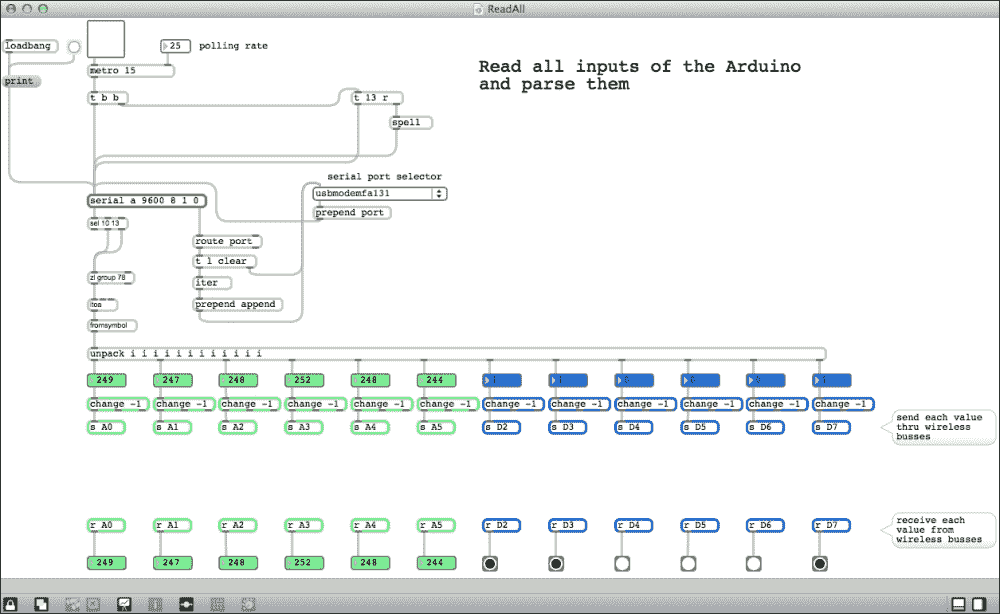

您可以在 `Chapter12` 文件夹中找到此补丁。它命名为 `ReadAll.maxpat`。

我们在之前的补丁中添加了一些基本构建块。

### 从 Arduino 请求数据

首先，我们将看到一个 `[t b b]` 对象。它也是一个触发器，由 `[metro]` 对象提供的 bang 信号。每个接收到的 bang 信号都会触发另一个 bang 信号发送到另一个 `[trigger]` 对象，然后发送到 `[serial]` 对象本身。

`[t 13 r]` 对象可能看起来有些复杂。它只是触发一个字符 `r` 然后整数 `13`。字符 `r` 被发送到 `[spell]`，它将其转换为 ASCII 码，然后将结果发送到 `[serial]`。`13` 是回车符的 ASCII 码。

这种结构提供了一种将字符 `r` 发送到 `[serial]` 对象的方法，这意味着每次 `metro` 发出信号时，都会发送给 Arduino。正如我们在固件中已经看到的，它触发 Arduino 读取所有输入，然后打包数据，最后将数据包发送到 Max 6 补丁的串行端口。

为了总结 `metro` 在每个 bang 信号时触发的操作，我们可以写出以下序列：

1.  将字符 `r` 发送到 Arduino。

1.  向 Arduino 发送回车符。

1.  触发 `[serial]` 对象。

这会触发 Arduino 将所有数据发送回 Max 补丁。

### 解析接收到的数据

在 `[serial]` 对象下，我们可以看到一个以 `[sel 10 13]` 对象开始的新结构。这是 `[select]` 对象的缩写。此对象选择一个传入的消息，并在消息等于对应输出位置的参数时向特定输出发送一个 bang 信号。基本上，这里我们选择了 `10` 或 `13`。最后一个输出如果传入的消息不等于任何参数，就会弹出该消息。

在这里，我们不希望考虑新的换行符（ASCII 代码 `10`）。这就是为什么我们将其作为参数，但如果选中的是这个，我们就不做任何事情。这是一个很好的技巧，可以避免这个消息触发任何事情，甚至从 `[select]` 的右侧输出中消除它。

在这里，我们将从 Arduino 收到的所有消息（除了 `10` 或 `13`）发送到 `[zl group 78]` 对象。后者是一个强大的列表，用于处理许多功能。`group` 参数使得将接收到的消息分组到列表中变得容易。最后一个参数是为了确保列表中元素的数量不会太多。一旦 `[zl group]` 被一个 bang 信号或列表长度达到长度参数值触发，它就会从其左侧出口弹出整个列表。

在这里，我们“累积”从 Arduino 收到的所有消息，一旦发送了回车符（记住我们在固件 `loop()` 块的最后几行中做这件事），就会发送一个 bang 信号，并将所有数据传递到下一个对象。

我们目前有一个包含所有数据的列表，每个值之间由一个空格字符（我们在固件中添加的著名的 ASCII 代码 32）分隔。

这个列表被传递到 `[itoa]` 对象。**itoa** 代表 *整数到 ASCII*。此对象将整数转换为 ASCII 字符。

`[fromsymbol]` 对象将符号转换为消息列表。

最后，在这个 `[fromsymbol]` 对象之后，我们得到了一个由空格分隔的、完全可读的大值列表。

然后，我们必须解包列表。`[unpack]` 是一个非常有用的对象，它提供了一种将消息列表切割成单个消息的方法。我们可以注意到，在这里，我们在 Arduino 固件中实现了与打包每个值到一个大消息相反的过程。

`[unpack]` 可以接受我们想要的任意数量的参数。它需要知道发送给它的列表中确切元素的数量。这里我们发送了来自 Arduino 的 12 个值，所以我们放置了 12 个 `i` 参数。`i` 代表 *整数*。如果我们发送一个浮点数，`[unpack]` 会将其转换为整数。了解这一点很重要。太多学生在这个问题上卡住了，特别是当他们在调试时。

我们在这里只处理整数。实际上，Arduino 的 ADC 提供从 0 到 1023 的数据，而数字输入只提供 0 或 1。

我们将数字框连接到 `[unpack]` 对象的每个输出，以便显示每个值。

然后，我们使用了 `[change]` 对象。这个对象很棒。当它接收到一个值时，只有当它与之前接收到的值不同时，它才会将其传递到其输出。它提供了一种有效的方法，以避免在不需要时每次都发送相同的值。

在这里，我选择了参数 `-1`，因为这不是 Arduino 固件发送的值，并且我确信发送的第一个元素将被解析。

因此，我们现在可以访问所有我们的值。我们可以用它们来完成不同的任务。

但是，我建议使用一种更智能的方法，这也会引入一个新概念。

### 分发接收到的数据和其它技巧

让我们在这里介绍一些其他技巧来改进我们的补丁风格。

#### 无线技巧

我们经常需要在我们的补丁中使用一些数据。相同的数据需要为多个对象提供。

避免到处都是电线和电缆的杂乱无章的好方法是用 `[send]` 和 `[receive]` 对象。这些对象可以用 `[s]` 和 `[r]` 简写，并且它们生成通信总线，为我们提供在补丁内部无线通信的方式。

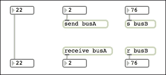

这三个结构是等价的。

第一个是基本的线缆。一旦我们从上面的数字框发送数据，它就会传输到线缆另一端。

第二个生成一个名为 `busA` 的数据总线。一旦你将数据发送到 `[send busA]`，你的补丁中每个 `[receive busA]` 对象都会弹出该数据。

第三个例子与第二个例子相同，但它生成另一个名为 `busB` 的总线。

这是一种分发数据的好方法。

我经常用它来作为我的主时钟，例如。我有一个且仅有一个主时钟在 `[send masterClock]` 上敲击时钟，无论我需要在哪里有那个时钟，我都使用 `[receive masterClock]`，它为我提供所需的数据。

如果你检查全局补丁，你可以看到我们将数据分发到补丁底部的结构。但这些结构也可以位于其他地方。实际上，任何视觉编程框架（如 Max 6）的一个优势是，你可以在补丁器中直观地组织代码的每一部分，就像你想要的那样。请尽可能这样做。这将帮助你支持并维护你的补丁，在整个开发过程中。


检查前面的截图。我本可以将左上角的 `[r A1]` 对象直接链接到 `[p process03]` 对象。但也许如果我将处理链保持分离，这将更容易阅读。我经常以这种方式使用 Max 6。

这是我 Max 6 课程中教授的多个技巧之一。当然，我也介绍了 `[p]` 对象，它是 `[patcher]` 的缩写。

在我们继续一些涉及 Max 6 和 Arduino 的好例子之前，让我们检查一些小贴士。

#### 封装和子补丁

当你打开 Max 6 并转到 **文件** | **新建补丁器** 时，它会打开一个空白补丁器。如果你还记得，那里是你放置所有对象的地方。还有一个名为 **子补丁** 的优秀功能。使用这个功能，你可以在补丁器内部创建新的补丁器，也可以在补丁器内部嵌入补丁器。

包含在其他补丁器内部的补丁器也被称为子补丁器。

让我们看看名为 `ReadAllCutest.maxpat` 的补丁是如何工作的。

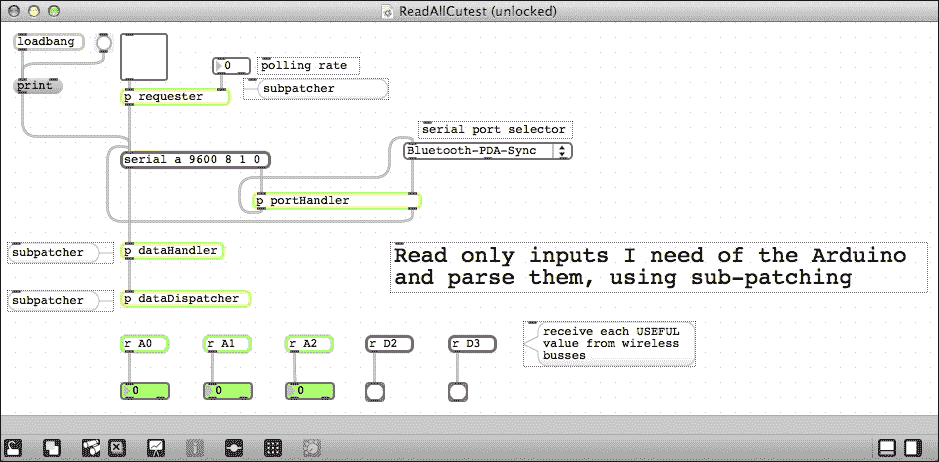

有四个新的对象取代了我们之前设计的整个结构。

这些对象是子补丁器。如果你在 **补丁锁定模式** 中双击它们，或者如果你按住 *命令* 键（或 Windows 中的 *Ctrl*），在 **补丁编辑模式** 中双击它们，你就可以打开它们。让我们看看里面有什么。

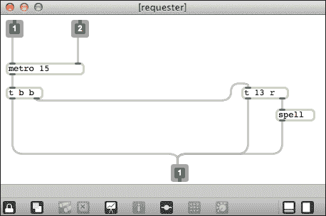

`[requester]` 子补丁器包含我们之前设计的相同架构，但你可以看到棕色 **1** 和 **2** 对象以及另一个蓝色 **1** 对象。这些是输入口和输出口。实际上，如果你想让你的子补丁器能够与包含它的补丁器通信，这些是必需的。当然，我们也可以使用 `[send]` 和 `[receive]` 对象来达到这个目的。我们将在接下来的页面中看到这一点。

这些输入口和输出口在你子补丁器中的位置很重要。实际上，如果你将 **1** 对象移动到 **2** 对象的右边，数字就会交换！上补丁中的不同输入口也会交换。你必须小心这一点。但再次强调，你可以按照你想要的和需要的组织它们。

检查下一张截图：

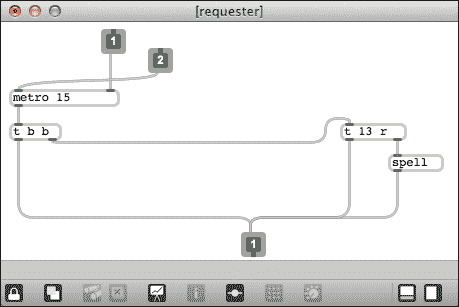

现在，检查包含此子补丁器的根补丁器。它会自动反转输入口，保持相关。

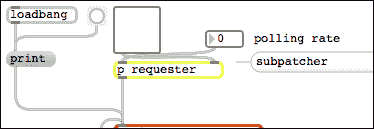

现在我们来看看其他子补丁器：


[p portHandler] 子补丁器


[p dataHandler] 子补丁器

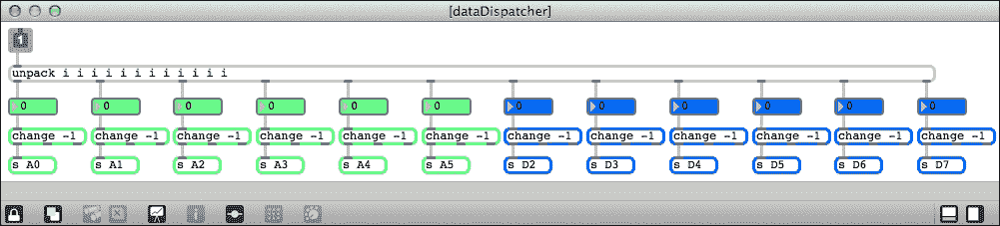

[p dataDispatcher] 子补丁器

在最后一张图中，我们可以看到一个输入口而没有输出口。实际上，我们只是在子补丁器内部封装了全局数据分发系统。这个系统使用 `[send]` 对象生成其数据总线。这是一个我们不需要甚至不想使用输出口的例子。使用输出口会变得混乱，因为我们不得不使用很多电线将每个请求这个或那个值的 Arduino 元素连接起来。

为了创建一个子补丁器，你只需输入 `n` 来创建一个新的对象，然后输入 `p`，一个空格，以及你的子补丁器名称。

当我设计这些示例时，我使用了一些比创建子补丁器、复制粘贴内部结构、从外部移除结构并添加输入口和输出口更快的方法。

此功能名为封装，是 Max 6 的 **编辑** 菜单的一部分。

您必须选择要封装在子模块内的模块部分，然后点击 **封装**，哇！您已经创建了一个包含与输入和输出正确连接的结构子模块。

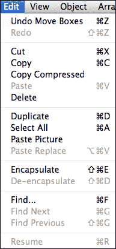

封装和解封装功能

您还可以解封装一个子模块。这将遵循与移除子模块和直接弹出内部整个结构相反的过程。

子模块化有助于保持事物井然有序且易于阅读。

我们可以想象，我们必须设计一个包含许多魔法和技巧的整个模块。这个是一个处理单元，一旦我们知道它做什么，完成之后，*我们不想知道它是如何做到的*，只想 *使用它*。

这通过将一些处理单元保持在盒子内并不过度混乱主模块，提供了一个很好的抽象级别。

您可以复制和粘贴子模块。如果您需要快速复制处理单元，这是一个强大的方法。但每个子模块与其他子模块完全独立。这意味着，如果您需要修改一个以更新它，您必须在每个模块的子模块中单独进行。

这可能真的很难。

在我进一步介绍 Arduino 之前，让我先向您介绍最后一个纯 Max 6 概念，现在命名为抽象。

#### 抽象和可重用性

任何创建并保存的模块都可以用作另一个模块中的新对象。我们可以通过在模块中键入 `n` 来创建一个新对象；然后我们只需键入之前创建并保存的模块的名称。

以这种方式使用的模块称为 **抽象**。

为了在模块中调用模块作为抽象，该模块必须位于 Max 6 的 *路径* 中，以便被找到。您可以通过转到 **选项** | **文件首选项** 来检查 Max 6 所知的路径。通常，如果您将主模块放在一个文件夹中，并将您想要用作抽象的其他模块放在同一个文件夹中，Max 6 就能找到它们。

Max 6 自身的抽象概念非常强大，因为它提供了 **可重用性**。

事实上，想象一下，您需要并且每天都在使用很多（或很大）的模块结构，几乎在每个项目中都会用到。您可以将它们放入您的磁盘上的一个特定文件夹中，该文件夹包含在您的 Max 6 路径中，然后您可以在您设计的每个模块中调用（我们称之为 *实例化*）它们。

由于每个使用它的模块只引用了实例化的那个模块，因此您只需改进您的抽象；每次您加载使用它的模块时，该模块将包含最新的抽象。

这在整个开发月份或年份中维护起来非常容易。

当然，如果您完全改变抽象以适应一个专用项目/补丁，您在使用其他补丁时可能会遇到一些问题。您必须小心，即使是非常简短的文档也要保持您的抽象。

让我们继续描述一些与 Arduino 相关的良好示例。

# 使用 LED 创建声音水平计

这个小型项目是 Max 6/Arduino 硬件和软件协作的典型例子。

Max 可以轻松监听声音并将它们从模拟域转换为数字域。

我们将使用 Arduino、一些 LED 和 Max 6 构建一个小型声音水平可视化器。

## 电路

我们将使用我们在第八章中设计的相同电路，*设计视觉输出反馈*，同时我们使用 595 类型移位寄存器的菊花链来多路复用 LED。

下图显示了电路：

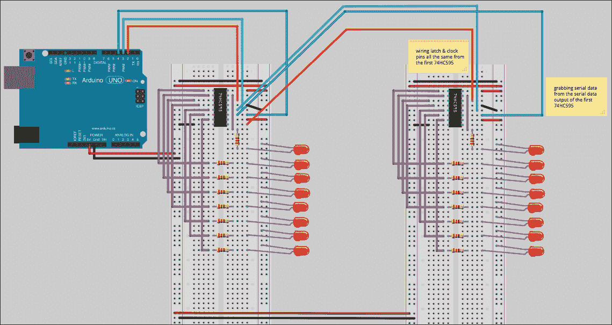

我们的八 LED 双串

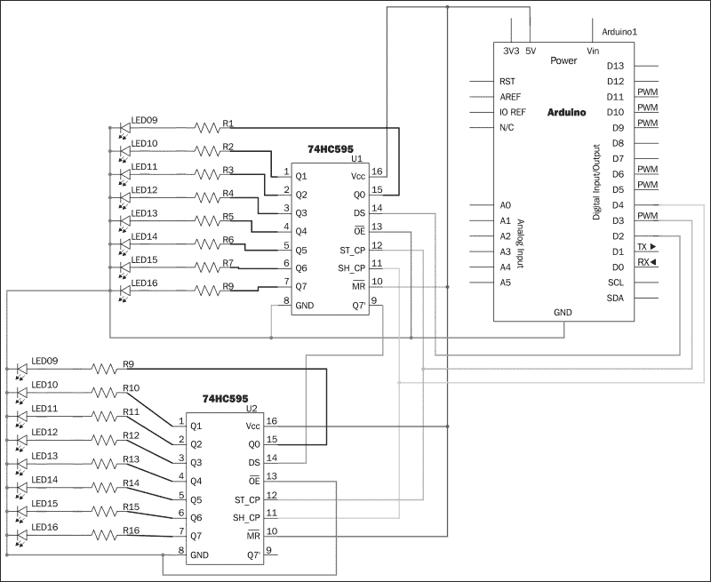

我们的八 LED 双串

基本想法是：

+   使用每个声音通道（左和右）的每串八个 LED

+   在 LED 串中显示声音水平

对于每个通道，开着的 LED 数量越多，声音水平就越高。

让我们先看看如何在 Max 6 中处理这个问题。

## 计算声音水平的 Max 6 补丁

看看下面的图，显示了 `SoundLevelMeters` 补丁：

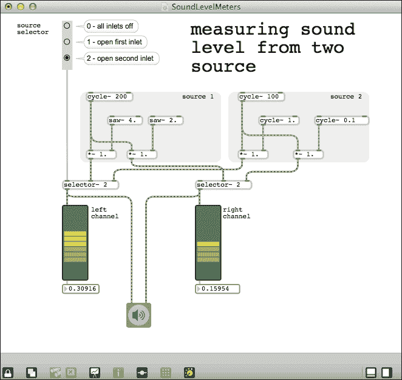

生成声音和测量声音水平

我们在这里使用 Max 6 框架的 MSP 部分，这部分与声音信号相关。在补丁中，我们有两个源（命名为 `source 1` 和 `source 2`）。每个源生成两个信号。我将每个源连接到一个 `[selector~ ]` 对象。

后者是用于信号的开关。左上角的源选择器提供了一个在 `source 1` 和 `source 2` 之间切换的方法。

我不会描述声音源的低成本魔法；这将涉及对合成技术的了解，而这超出了本主题的范围。

然后，我们有一个连接到每个 `[selector~ ]` 输出和一个小符号，比如一个扬声器的连接。这与您音频接口的声音输出有关。

我还使用了 `[meter~]` 对象来显示每个通道的级别。

最后，我添加了一个 `[flonum]` 对象来显示每次的级别当前值。

这些是我们将要发送给 Arduino 的数字。

让我们添加我们之前描述的串行通信构建块。

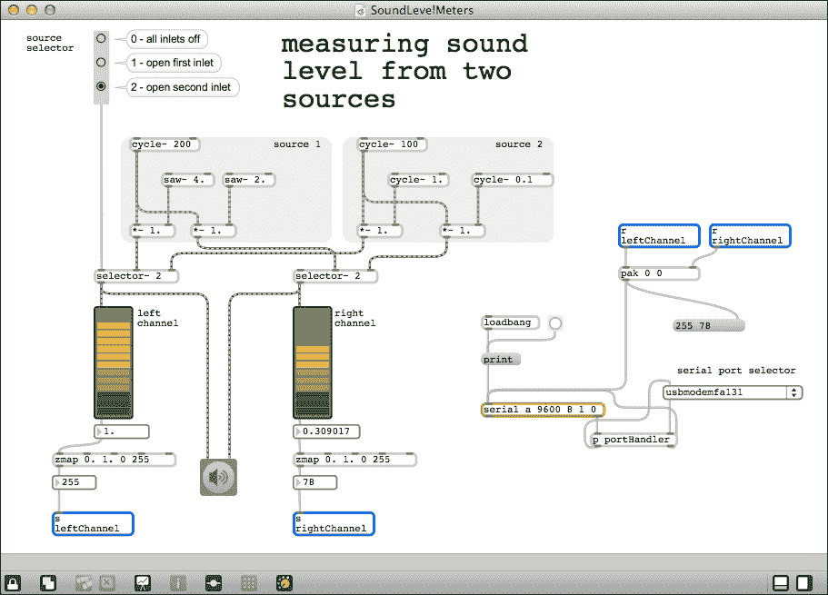

向 Arduino 发送数据

我们已经准备好了串行通信设置。

我们还有 `[zmap 0\. 1\. 0 255]` 对象。这些对象接受一个值，该值旨在在 `0\. 1` 之间，正如在参数中设置的那样，并将其缩放到 `0 255` 的范围。这为每个通道提供了一个字节数据。

我们使用两个数据总线将每个通道的值发送到 `[pak]` 对象。后者收集传入的消息并创建一个包含它们的列表。`[pak]` 与 `[pack]` 的区别在于 `[pak]` 在其任一输入接收到消息时就会发送数据，而不仅仅是当它接收到其左侧输入的消息时，就像 `[pack]` 一样。

因此，我们有了当电平值改变时，从计算机弹出到 Arduino 的消息列表。

## 用于读取字节的固件

让我们看看如何在 Arduino 中处理这个问题：

```cpp
#include <ShiftOutX.h>
#include <ShiftPinNo.h>

int CLOCK_595 = 4;    // first 595 clock pin connecting to pin 4
int LATCH_595 = 3;    // first 595 latch pin connecting to pin 3
int DATA_595 = 2;     // first 595 serial data input pin connecting to pin 2

int SR_Number = 2;    // number of shift registers in the chain

// instantiate and enabling the shiftOutX library with our circuit parameters
shiftOutX regGroupOne(LATCH_595, DATA_595, CLOCK_595, MSBFIRST, SR_Number);

// random groove machine variables
int counter = 0;
byte LeftChannel = B00000000 ;  // store left channel Leds infos
byte RightChannel = B00000000 ; // store right channel Leds infos

void setup() {
  // NO MORE setup for each digital pin of the Arduino
  // EVERYTHING is made by the library :-)
}

void loop(){ 

  if (Serial.available() > 0) {
    LeftChannel = (byte)Serial.parseInt();
    RightChannel = (byte)Serial.parseInt();

    unsigned short int data; // declaring the data container as a very local variable
    data = ( LeftChannel << 8 ) | RightChannel; // aggregating the 2 read bytes
    shiftOut_16(DATA_595, CLOCK_595, MSBFIRST, data);  // pushing the whole data to SRs

    // make a short pause before changing LEDs states
    delay(2);
  }
}
```

这与第八章中的固件相同，*设计视觉输出反馈*，但在这里我们正在读取真实值而不是生成随机值。

我们使用 `Serial.parseInt()` 在 `Serial.available()` 测试中做这件事。

这意味着一旦数据进入 Arduino 串行缓冲区，我们就会读取它。实际上，我们正在读取两个值，并在字节转换后，将它们存储在`LeftChannel`和`RightChannel`中。

然后，我们将数据处理到移位寄存器中，根据 Max 6 补丁发送的值点亮 LED。

让我们再举一个与声音文件和距离传感器玩耍的例子。

# 手部控制的音调转换效果

**音调转换**是所有与声音处理相关的领域都熟知的效果。它改变传入声音的音调。在这里，我们将使用 Max 6 实现一个非常便宜的音调转换器，但我们将关注如何控制这个声音效果。我们将通过在距离传感器上移动我们的手来控制它。

我们将使用与第六章中相同的电路，即*感知世界 – 使用模拟输入进行感知*。

## 带有传感器和固件的电路

以下电路显示了 Arduino 板连接到传感器：

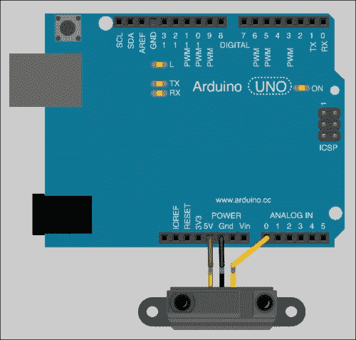

连接到 Arduino 的 Sharp 距离传感器

固件几乎也是相同的。我移除了关于距离计算的部分，因为我们确实不关心距离本身。

Arduino 的 ADC 提供 10 位的分辨率，这将给出从 0 到 1023 的数字。我们将使用这个值来校准我们的系统。

以下代码是固件。您可以在`Chapter12/PitchShift`文件夹中找到它：

```cpp
int sensorPin = 0;           // pin number where the SHARP GP2Y0A02YK is connected
int sensorValue = 0 ;        // storing the value measured from 0 to 1023

void setup() {
  Serial.begin(9600);
}

void loop(){
  sensorValue = analogRead(sensorPin); // read/store the value from sensor
  Serial.println(sensorValue);

  delay(20);    
}
```

一旦 Arduino 运行此固件，它就会向串行端口发送值。

## 用于改变声音和解析 Arduino 消息的补丁

我无法描述整个音调转换器本身。顺便说一句，您可以打开相关的子补丁来查看它是如何设计的。一切都是开放的。

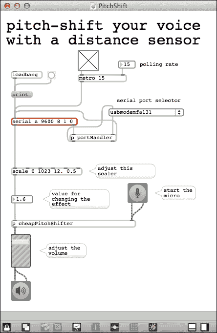

通过距离传感器控制的手部音调转换

正如我们之前描述的，我们必须选择正确的串行端口，然后敲击 `[serial]` 对象，以便使其弹出其缓冲区中的值。

在这里，我们使用了 `[scale]` 对象。它与我们已经使用过的 `[zmap]` 类似，因为它可以将一个范围映射到另一个范围，但它也可以与反转范围一起工作，并且不会截断值。

在这里，我将从 Arduino 的 ADC 接收到的值从 0 到 1023 映射到适合我们需求的 12.0 到 0.5。

如果我们将手靠近传感器，距离就小，如果我们把手移远，距离就会改变，效果也会被调制。

# 摘要

本章教我们如何使用 Max 6 处理 Arduino。

我们对 Max 6 中的一些常用技术有了更多的了解，并且我们练习了一些在这本书中学到的概念。显然，Max 6 中还有更多东西可以学习，我很乐意给你一些更好的学习指南。

首先，我建议你阅读 *所有* 的教程，从 Max 的教程开始，然后是 MSP，然后是数字声音，最后是如果你对视觉效果和 OpenGL 感兴趣的话，是 Jitter。听起来很明显，但我每天还是有两三个人问我从哪里开始学习 Max 6。答案是：教程。

然后，我建议你设计一个小型系统。少即是多。小型系统提供了易于维护、修改和支持的便捷方式。使用注释也是一种快速记住你在这一部分或那一部分尝试做什么的好方法。

最后，每天稍微修补一下是成功的关键。这需要时间，但我们不是都想成为大师吗？
