# 第四章：深入了解指针

当程序员需要以优化方式使用内存时，指针一直是他们的首选。指针使得访问任何变量、数组或数据类型的内容成为可能。你可以使用指针进行低级访问任何内容，并提高应用程序的整体性能。

在本章中，我们将探讨以下关于指针的食谱：

+   使用指针反转字符串

+   使用指针在数组中查找最大值

+   对单链表进行排序

+   使用指针查找矩阵的转置

+   使用指针访问结构

在我们开始介绍食谱之前，我想讨论一些与指针工作方式相关的事情。

# 什么是指针？

指针是一个包含另一个变量、数组或字符串内存地址的变量。当指针包含某个东西的地址时，它被称为指向那个东西。当指针指向某个东西时，它有权访问那个内存地址的内容。现在的问题是——我们为什么需要指针呢？

我们需要它们，因为它们做以下事情：

+   促进内存的动态分配

+   提供一种访问数据类型的方法（除了变量名外，你还可以通过指针访问变量的内容）

+   使函数能够返回多个值

例如，考虑一个`i`整数变量：

```cpp
int i;
```

当你定义一个整数变量时，内存中会为其分配两个字节。这组两个字节可以通过一个内存地址访问。变量分配的值存储在该内存位置中，如下所示：


图 4.1

在前面的图中，**1000**代表变量**i**的内存地址。尽管实际上内存地址很大，并且是十六进制格式，但为了简单起见，我选择了一个小的整数数字**1000**。值**10**存储在内存地址**1000**中。

现在，可以定义一个`j`整数指针如下：

```cpp
int *j;
```

这个`j`整数指针可以通过以下语句指向`i`整数：

```cpp
j=&i;
```

`&`（与号）符号表示地址，**i**的地址将被分配给**j**指针，如下所示。假设**2000**地址是**j**指针的地址，而**i**指针的地址**1000**存储在分配给**j**指针的内存位置中，如下所示：


图 4.2

可以通过以下语句显示`i`整数的地址：

```cpp
printf("Address of i is %d\n", &i); 
printf("Address of i is %d\n", j);
```

要显示`i`的内容，我们可以使用以下语句：

```cpp
printf("Value of i is %d\n", i);
printf("Value of i is %d\n", *j);
```

在指针的情况下，`&`（与号）表示内存地址，`*`（星号）表示内存地址中的内容。

我们还可以通过以下语句定义一个指向整数指针的指针：

```cpp
int **k;
```

这个指向 `k` 整数指针的指针可以使用以下语句指向 `j` 整数指针：

```cpp
k=&j;
```

通过前面的语句，将 **j** 指针的地址分配给指向 **k** 整数指针的指针，如下所示图所示。假设 **3000** 是 **k** 的内存地址：


图 4.3

现在，当你显示 `k` 的值时，它将显示 `j` 的地址：

```cpp
printf("Address of j =%d %d \n",&j,k);
```

要显示 `i` 到 `k` 的地址，我们需要使用 `*k`，因为 `*k` 表示它将显示 `k` 所指向的内存地址的内容。现在，`k` 指向 `j`，而 `j` 中的内容是 `i` 的地址：

```cpp
printf("Address of i = %d %d %d\n",&i,j,*k);
```

同样，要显示 `i` 到 `k` 的值，必须使用 `**k` 如下所示：

```cpp
printf("Value of i is %d %d %d %d \n",i,*(&i),*j,**k);
```

使用指针使我们能够精确地从所需的内存位置访问内容。但是，通过指针分配内存而不在任务完成后释放它可能会导致称为 **内存泄漏** 的问题。内存泄漏是一种资源泄漏。内存泄漏可能允许黑客未经授权访问内存内容，也可能阻止某些内容被访问，即使它们存在。

现在，让我们从本章的第一个菜谱开始。

# 使用指针反转字符串

在这个菜谱中，我们将学习如何使用指针反转字符串。最好的部分是，我们不会将字符串反转并复制到另一个字符串，而是直接反转原始字符串本身。

# 如何做到这一点…

1.  按如下所示输入一个字符串以分配给 `str` 字符串变量：

```cpp
printf("Enter a string: ");
scanf("%s", str);
```

1.  设置一个指针指向字符串，如下所示代码演示。该指针将指向字符串第一个字符的内存地址：

```cpp
ptr1=str;
```

1.  通过初始化一个 `n` 变量为 `1` 来找到字符串的长度。设置一个 `while` 循环，当指针到达字符串的空字符时执行，如下所示：

```cpp
n=1;
while(*ptr1 !='\0')
{
```

1.  在 `while` 循环内部，将执行以下操作：

+   指针向前移动一个字符。

+   变量 `n` 的值增加 1：

```cpp
ptr1++;
n++;
```

1.  指针将位于空字符，因此将指针向后移动一步，使其指向字符串的最后一个字符，如下所示：

```cpp
ptr1--;
```

1.  按如下所示设置另一个指针指向字符串的开始：

```cpp
ptr2=str;
```

1.  交换等于字符串长度一半的字符。为此，设置一个 `while` 循环执行 `n/2` 次，如下所示代码片段所示：

```cpp
m=1;
while(m<=n/2)
```

1.  在 `while` 循环内部，首先进行交换操作；也就是说，我们指针所指向的字符被交换：

```cpp
temp=*ptr1;
*ptr1=*ptr2;
*ptr2=temp;
```

1.  交换字符后，将第二个指针向前移动以指向其下一个字符，即字符串的第二个字符，并将第一个指针向后移动以使其指向第二个到最后一个字符，如下所示：

```cpp
ptr1--;
ptr2++;
```

1.  重复此过程 n/2 次，其中 n 是字符串的长度。当 `while` 循环完成后，我们将在屏幕上显示原始字符串的逆序形式：

```cpp
printf("Reverse string is %s", str);
```

使用指针反转字符串的 `reversestring.c` 程序如下：

```cpp
#include <stdio.h>
void main()
{
    char str[255], *ptr1, *ptr2, temp ;
    int n,m;
    printf("Enter a string: ");
    scanf("%s", str);
    ptr1=str;
    n=1;
    while(*ptr1 !='\0')
    {
        ptr1++;
        n++;
    }
    ptr1--;
    ptr2=str;
    m=1;
    while(m<=n/2)
    {
        temp=*ptr1;
        *ptr1=*ptr2;
        *ptr2=temp;
        ptr1--;
        ptr2++;;
        m++;
    }
    printf("Reverse string is %s", str);
}
```

现在，让我们看看幕后。

# 它是如何工作的...

我们将被提示输入一个字符串，该字符串将被分配给 `str` 变量。字符串不过是一个字符数组。假设我们输入名字 `manish`，名字中的每个字符将依次分配到数组的某个位置（参见 *图 4.4*）。我们可以看到，字符串的第一个字符，字母 **m**，被分配到 **str[0]** 位置，第二个字符串字符被分配到 **str[1]** 位置，依此类推。空字符，像往常一样，位于字符串的末尾，如下面的图所示：


图 4.4

为了反转字符串，我们将寻求两个指针的帮助：一个将被设置为指向字符串的第一个字符，另一个将被设置为指向字符串的最后一个字符。因此，第一个 **ptr1** 指针被设置为如下指向字符串的第一个字符：


图 4.5

字符的交换必须执行到字符串长度的一半；因此，下一步将是找到字符串的长度。在找到字符串的长度后，**ptr1** 指针将被设置为移动到字符串的最后一个字符。

此外，另一个 **ptr2** 指针被设置为指向字符串的第一个字符 **m**，如下面的图所示：


图 4.6

下一步是将 **ptr1** 和 **ptr2** 指针所指的字符串的第一个和最后一个字符进行交换（参见 *图 4.7 (a)*）。在交换 **ptr1** 和 **ptr2** 指针所指的字符后，字符串将如下所示 (*图 4.7 (b)*)：


图 4.7

在交换字符串的第一个和最后一个字符后，我们将交换字符串的第二和倒数第二个字符。为此，**ptr2** 指针将被向前移动并设置为指向下一行的下一个字符，而 **ptr1** 指针将被向后移动并设置为指向倒数第二个字符。

你可以在下面的 *图 4.8 (a)* 中看到，**ptr2** 和 **ptr1** 指针被设置为指向 **a** 和 **s** 字符。一旦这样做，**ptr2** 和 **ptr1** 指向的字符将再次进行交换。在交换 **a** 和 **s** 字符后，字符串将如下所示 (*图 4.8 (b)*)：

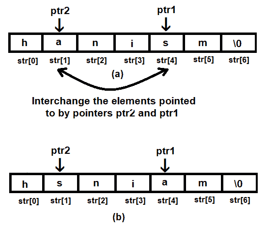

图 4.8

现在在反转字符串中剩下的唯一任务是交换第三个字符和倒数第三个字符。因此，我们将重复**ptr2**和**ptr1**指针的重新定位过程。在交换字符串中的**n**和**i**字符之后，原始的**str**字符串将被反转，如下所示：


图 4.9

在应用了前面的步骤之后，如果我们打印出**str**字符串，它将显示为反向。

让我们使用 GCC 编译`reversestring.c`程序，如下所示：

```cpp
D:\CBook>gcc reversestring.c -o reversestring
```

如果你没有错误或警告，这意味着`reversestring.c`程序已经被编译成一个可执行文件，称为`reversestring.exe`。让我们按照以下方式运行这个可执行文件：

```cpp
D:\CBook>./reversestring
Enter a string: manish
Reverse string is hsinam
```

哇！我们已经成功使用指针反转了一个字符串。现在，让我们继续下一个菜谱！

# 使用指针在数组中查找最大值

在这个菜谱中，将使用指针扫描数组的所有元素。

# 如何做到这一点…

1.  定义一个名为`max`的宏，大小为`100`，如下所示：

```cpp
#define max 100
```

1.  定义一个**p**整数数组，大小为**max**，如下所示：

```cpp
int p[max]
```

1.  指定数组中的元素数量，如下所示：

```cpp
printf("How many elements are there? ");
scanf("%d", &n);
```

1.  按如下所示输入数组的元素：

```cpp
for(i=0;i<n;i++)
    scanf("%d",&p[i]);
```

1.  定义两个**mx**和**ptr**指针，使它们指向数组的第一个元素，如下所示：

```cpp
mx=p;
ptr=p;
```

1.  **mx**指针将始终指向数组中的最大值，而**ptr**指针将用于比较数组剩余的值。如果**mx**指针指向的值小于**ptr**指针指向的值，则**mx**指针被设置为指向**ptr**指针指向的值。然后**ptr**指针将移动到指向下一个数组元素，如下所示：

```cpp
if (*mx < *ptr)
    mx=ptr;
```

1.  如果**mx**指针指向的值大于**ptr**指针指向的值，则**mx**指针保持不变，并继续指向相同的值，而**ptr**指针将移动到指向下一个数组元素，以便进行以下比较：

```cpp
ptr++;
```

1.  这个过程会重复，直到数组的所有元素（由**ptr**指针指向）都被与由**mx**指针指向的元素比较。最后，**mx**指针将指向数组中的最大值。要显示数组的最大值，只需显示由**mx**指针指向的数组元素，如下所示：

```cpp
printf("Largest value is %d\n", *mx);
```

使用指针在数组中查找最大值的`largestinarray.c`程序如下所示：

```cpp
#include <stdio.h>
#define max 100
void main()
{
    int p[max], i, n, *ptr, *mx;
    printf("How many elements are there? ");
    scanf("%d", &n);
    printf("Enter %d elements \n", n);
    for(i=0;i<n;i++)
        scanf("%d",&p[i]);
    mx=p;
    ptr=p;
    for(i=1;i<n;i++)
    {
        if (*mx < *ptr)
            mx=ptr;
        ptr++;
    }
    printf("Largest value is %d\n", *mx);
}
```

现在，让我们看看幕后。

# 它是如何工作的…

定义一个特定大小的数组，并在其中输入几个元素。这些将是我们要找到的最大值的值。输入几个元素后，数组可能看起来如下所示：

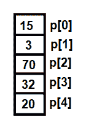

图 4.10

我们将使用两个指针来查找数组中的最大值。让我们将这两个指针命名为 **mx** 和 **ptr**，其中 **mx** 指针将用于指向数组的最大值，而 **ptr** 指针将用于将数组的其余元素与 **mx** 指针所指向的值进行比较。最初，两个指针都设置为指向数组的第一个元素，**p[0]**，如下面的图所示：

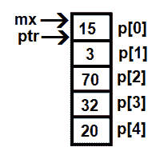

图 4.11

**ptr** 指针随后移动到指向数组的下一个元素，**p[1]**。然后，**mx** 和 **ptr** 指针所指向的值被比较。这个过程会持续进行，直到数组中的所有元素都被比较，如下所示：

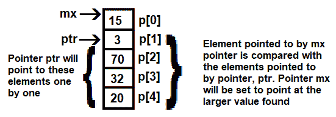

图 4.12

回想一下，我们希望 **mx** 指针始终指向较大的值。由于 15 大于 3（见 *图 4.13*），**mx** 指针的位置将保持不变，而 **ptr** 指针将移动到指向下一个元素，**p[2]**，如下所示：

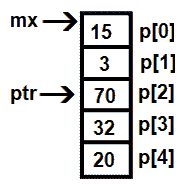

图 4.13

再次，**mx** 和 **ptr** 指针所指向的值，分别是 15 和 70，将被比较。现在，**mx** 指针所指向的值小于 **ptr** 指针所指向的值。因此，**mx** 指针将被设置为指向与 **ptr** 相同的数组元素，如下所示：

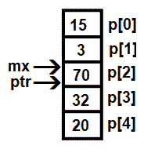

图 4.14

数组元素的比较将继续。想法是保持 **mx** 指针指向数组中的最大元素，如下面的图所示：


图 4.15

如 *图 4.15* 所示，**70** 大于 **20**，因此 **mx** 指针将保持在 **p[2]**，而 **ptr** 指针将移动到下一个元素，**p[4]**。现在，**ptr** 指针指向数组的最后一个元素。因此，程序将终止，显示由 **mx** 指针指向的最后一个值，这恰好也是数组中的最大值。

让我们使用 GCC 编译 `largestinarray.c` 程序，如下所示：

```cpp
D:\CBook>gcc largestinarray.c -o largestinarray
```

如果你没有错误或警告，这意味着 `largestinarray.c` 程序已经被编译成一个可执行文件，`largestinarray.exe`。现在，让我们按照以下方式运行这个可执行文件：

```cpp
D:\CBook>./largestinarray
How many elements are there? 5
Enter 5 elements
15
3
70
35
20
Largest value is 70
You can see that the program displays the maximum value in the array
```

哇！我们已经成功使用指针在数组中找到了最大的值。现在，让我们继续下一个菜谱！

# 对单链表进行排序

在这个菜谱中，我们将学习如何创建一个由整数元素组成的单链表，然后我们将学习如何按升序排序这个链表。

单链表由几个通过指针连接的节点组成。单链表中的一个节点可能如下所示：


图 4.16

如你所见，单链表中的一个节点是由两个部分组成的结构：

+   **数据**：这可以是一个或多个变量（也称为成员），可以是整数、浮点数、字符串或任何数据类型。为了使程序简单，我们将**数据**作为一个整型变量。

+   **指针**：这将指向节点类型的结构。在这个程序中，我们可以称这个指针为**next**，尽管它可以有任何一个名字。

我们将使用冒泡排序对链表进行排序。冒泡排序是一种顺序排序技术，通过比较相邻元素进行排序。它比较第一个元素和第二个元素，第二个元素和第三个元素，依此类推。如果元素不在期望的顺序中，则交换它们的值。例如，如果你正在按升序排序元素，并且第一个元素大于第二个元素，它们的值将被交换。同样，如果第二个元素大于第三个元素，它们的值也将被交换。

这样，你会发现，在第一次迭代的结束时，最大值会*冒泡*到列表的末尾。在第二次迭代后，第二大值将被*冒泡*到列表的末尾。总的来说，使用冒泡排序算法对 n 个元素进行排序需要 n-1 次迭代。

让我们了解创建和排序单链表的步骤。

# 如何操作...

1.  定义一个包含两个成员——`data`和`next`的节点。数据成员用于存储整数值，而`next`成员是一个指针，用于将节点链接如下：

```cpp
struct node
{
  int data;
  struct node *next;
};
```

1.  指定链表中的元素数量。输入的值将被分配给`n`变量，如下所示：

```cpp
printf("How many elements are there in the linked list ?");
scanf("%d",&n);
```

1.  执行一个`for`循环`n`次。在`for`循环内部，通过名为`newNode`创建一个节点。当被要求时，输入一个整数值并将其分配给`newNode`的数据成员，如下所示：

```cpp
newNode=(struct node *)malloc(sizeof(struct node));
scanf("%d",&newNode->data);
```

1.  设置两个指针`startList`和`temp1`，使它们指向第一个节点。`startList`指针将始终指向链表的第一个节点。`temp1`指针将用于链接节点，如下所示：

```cpp
startList = newNode;
temp1=startList;
```

1.  连接新创建的节点时，执行以下两个任务：

+   将`temp1`的下一个成员设置为指向新创建的节点。

+   将`temp1`指针移动到新创建的节点，如下所示：

```cpp
temp1->next = newNode;
temp1=newNode;
```

1.  当`for`循环结束时，我们将有一个单链表，其第一个节点由`startList`指向，最后一个节点的下一个指针指向 NULL。这个链表已经准备好进行排序过程。设置一个从`0`到`n-2`的`for`循环，即 n-1 次迭代，如下所示：

```cpp
for(i=n-2;i>=0;i--)
```

1.  在`for`循环内部，为了比较值，使用两个指针`temp1`和`temp2`。最初，`temp1`和`temp2`将被设置为指向链表的前两个节点，如下面的代码片段所示：

```cpp
temp1=startList;
temp2=temp1->next;
```

1.  在以下代码中比较`temp1`和`temp2`指向的节点：

```cpp
if(temp1->data > temp2->data)
```

1.  在比较前两个节点后，`temp1` 和 `temp2` 指针将被设置为指向第二个和第三个节点，依此类推：

```cpp
temp1=temp2;
temp2=temp2->next;
```

1.  链表必须按升序排列，因此 `temp1` 的数据成员必须小于 `temp2` 的数据成员。如果 `temp1` 的数据成员大于 `temp2` 的数据成员，则将数据成员的值通过一个临时变量 `k` 进行交换，如下所示：

```cpp
k=temp1->data;
temp1->data=temp2->data;
temp2->data=k;
```

1.  在执行 n-1 次比较和交换连续值迭代后，如果一对中的第一个值大于第二个值，链表中的所有节点将按升序排列。为了遍历链表并按升序显示值，将一个临时的 `t` 指针设置为指向 `startList` 指向的节点，即链表的第一个节点，如下所示：

```cpp
t=startList;
```

1.  一个 `while` 循环将执行，直到 `t` 指针达到 `NULL`。回想一下，最后一个节点的下一个指针被设置为 NULL，因此 `while` 循环将执行，直到遍历链表的所有节点，如下所示：

```cpp
while(t!=NULL)
```

1.  在 `while` 循环内，将执行以下两个任务：

+   指向 `t` 指针的节点的数据成员被显示出来。

+   将 `t` 指针移动到指向其下一个节点：

```cpp
printf("%d\t",t->data);
t=t->next;
```

创建单链表的 `sortlinkedlist.c` 程序，随后按升序对其进行排序，如下所示：

```cpp
/* Sort the linked list by bubble sort */
#include<stdio.h>
#include <stdlib.h>
struct node
{
  int data;
  struct node *next;
};
void main()
{
    struct node *temp1,*temp2, *t,*newNode, *startList;
    int n,k,i,j;
    startList=NULL;
    printf("How many elements are there in the linked list ?");
    scanf("%d",&n);
    printf("Enter elements in the linked list\n");
    for(i=1;i<=n;i++)
    {
        if(startList==NULL)
        {
            newNode=(struct node *)malloc(sizeof(struct node));
            scanf("%d",&newNode->data);
            newNode->next=NULL;
            startList = newNode;
            temp1=startList;
        }
        else
        {
            newNode=(struct node *)malloc(sizeof(struct node));
            scanf("%d",&newNode->data);
            newNode->next=NULL;
            temp1->next = newNode;
            temp1=newNode;
        }
    }
    for(i=n-2;i>=0;i--)
    {
        temp1=startList;
        temp2=temp1->next;
        for(j=0;j<=i;j++)
        {
            if(temp1->data > temp2->data)
            {
                k=temp1->data;
                temp1->data=temp2->data;
                temp2->data=k;
            }
            temp1=temp2;
            temp2=temp2->next;
        }
    }
    printf("Sorted order is: \n");
    t=startList;
    while(t!=NULL)
    {
        printf("%d\t",t->data);
        t=t->next;
    }
}
```

现在，让我们看看背后的情况。

# 它是如何工作的...

此程序分为两部分——第一部分是创建单链表，第二部分是对链表进行排序。

让我们从第一部分开始。

# 创建单链表

我们将首先创建一个名为 **newNode** 的新节点。当提示输入时，我们将为其数据成员输入值，然后设置下一个 **newNode** 指针为 **NULL**（如图 *4.17* 所示）。这个下一个指针将用于与其他节点连接（正如我们很快将看到的）：

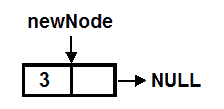

图 4.17

在创建第一个节点后，我们将执行以下两个指针指向它，如下所示：

+   **startList**：为了遍历单链表，我们需要一个指向列表第一个节点的指针。因此，我们将定义一个名为 **startList** 的指针，并将其设置为指向列表的第一个节点。

+   **temp1**：为了与下一个节点连接，我们还需要一个额外的指针。我们将称这个指针为 **temp1**，并将其设置为指向 **newNode**（见 *图 4.18*）：


图 4.18

我们现在将为链表创建另一个节点，并将其命名为**newNode**。指针一次只能指向一个结构。因此，当我们创建一个新节点时，之前指向第一个节点的**newNode**指针现在将指向最近创建的节点。我们将被提示输入新节点的数据成员的值，其下一个指针将被设置为**NULL**。

你可以在下面的图中看到，两个指针**startList**和**temp1**都指向第一个节点，而**newNode**指针指向新创建的节点。如前所述，**startList**将用于遍历链表，**temp1**将用于连接新创建的节点，如下所示：


图 4.19

要将第一个节点与**newNode**连接，**temp1**的下一个指针将被设置为指向**newNode**（见*图 4.20（a）*）。与**newNode**连接后，**temp1**指针将向前移动并设置为指向**newNode**（见*图 4.20（b）*），以便它可以再次用于连接未来可能添加到链表中的任何新节点：

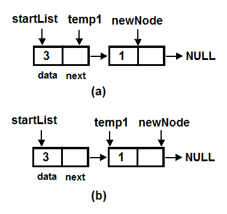

图 4.20

第三个和第四个步骤将重复应用于链表中的其余节点。最后，单链表将准备就绪，看起来可能像这样：


图 4.21

现在我们已经创建了单链表，下一步是将链表按升序排序。

# 对单链表进行排序

我们将使用冒泡排序算法对链表进行排序。在冒泡排序技术中，第一个值与第二个值进行比较，第二个值与第三个值进行比较，依此类推。如果我们想按升序排序我们的列表，那么在比较值时，我们需要将较小的值保持在顶部。

因此，在比较第一个和第二个值时，如果第一个值大于第二个值，则它们的顺序将被交换。如果第一个值小于第二个值，则不会发生交换，并将继续比较第二个和第三个值。

将会有 n-1 次这样的比较迭代，这意味着如果有五个值，那么就会有四次这样的比较迭代；并且每次迭代后，最后一个值将被排除在外——也就是说，当它到达目的地时，它将不会被比较。这里的“目的地”指的是在按升序排列时必须保持值的那个位置。

# 第一次迭代

为了对链表进行排序，我们将使用两个指针——**temp1**和**temp2**。将**temp1**指针设置为指向第一个节点，**temp2**设置为指向下一个节点，如下所示：


图 4.22

我们将按升序对链表进行排序，因此我们将较小的值保持在列表的开头。将比较**temp1**和**temp2**的数据成员。因为`temp1->data`大于`temp2->data`，即**temp1**的数据成员大于**temp2**的数据成员，它们的顺序将会互换（见以下图表）。在互换**temp1**和**temp2**指向的节点数据成员之后，链表将如下所示：


图 4.23

在此之后，两个指针将进一步移动，即**temp1**指针将被设置为指向**temp2**，而**temp2**指针将被设置为指向其下一个节点。我们可以在*图 4.24（a）*中看到，**temp1**和**temp2**指针分别指向值为 3 和 7 的节点。我们还可以看到`temp1->data`小于`temp2->data`，即 3 < 7。由于**temp1**的数据成员已经小于**temp2**的数据成员，因此不会发生值的互换，两个指针将简单地向前移动一步（见*图 4.24（b）*）。

现在，因为 7 > 4，它们的顺序将会互换。由**temp1**和**temp2**指向的数据成员的值将按以下方式互换（*图 4.24（c）*）：

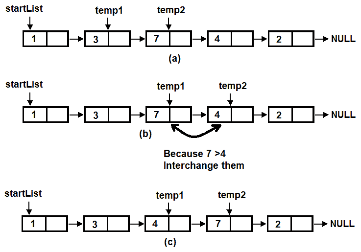

图 4.24

之后，**temp1**和**temp2**指针将向前移动一步，即**temp1**将指向**temp2**，而**temp2**将移动到其下一个节点。在以下*图 4.25（a）*中，我们可以看到**temp1**和**temp2**分别指向值为 7 和 2 的节点。再次比较**temp1**和**temp2**的数据成员。因为`temp1->data`大于`temp2->data`，它们的顺序将会互换。*图 4.25（b）*显示了数据成员值互换后的链表。


图 4.25

这是一次迭代，你可以注意到，经过这次迭代后，最大的值 7 已经被设置到我们期望的位置——链表的末尾。这也意味着在第二次迭代中，我们不需要比较最后一个节点。同样，在第二次迭代后，第二大的值将达到或被设置到其实际位置。链表中的第二大的值是 4，因此经过第二次迭代，第四个节点将刚好到达第七个节点。如何做到这一点？让我们看看冒泡排序的第二次迭代。

# 第二次迭代

我们将从比较前两个节点开始，因此 **temp1** 和 **temp2** 指针将被设置为分别指向链表的第一个和第二个节点（参见 *图 4.26 (a)*）。将比较 **temp1** 和 **temp2** 的数据成员。如清晰可见，`temp1->data` 小于 `temp2->data`（即 1 < 7），所以它们的位置不会交换。之后，**temp1** 和 **temp2** 指针将向前移动一步。我们可以在 *图 4.26 (b)* 中看到，**temp1** 和 **temp2** 指针被设置为分别指向值为 3 和 4 的节点：


图 4.26

再次，将比较 **temp1** 和 **temp2** 指针的数据成员。因为 `temp1->data` 小于 `temp2->data`，即 3 < 4，所以它们的位置将再次不会交换，**temp1** 和 **temp2** 指针将再次向前移动一步。也就是说，**temp1** 指针将被设置为指向 **temp2**，而 **temp2** 将被设置为指向其下一个节点。您可以在 *图 4.27 (a)* 中看到，**temp1** 和 **temp2** 指针被设置为分别指向值为 4 和 2 的节点。因为 4 > 2，它们的位置将交换。在交换这些值的位置后，链表将如 *图 4.27 (b)* 所示：


图 4.27

这是第二次迭代的结束，我们可以看到，第二大值，即四，按照升序被设置在我们期望的位置。所以，随着每一次迭代，一个值被设置在所需的位置。相应地，下一次迭代将需要少一次比较。

# 第三次和第四次迭代

在第三次迭代中，我们只需要进行以下比较：

1.  比较第一个和第二个节点

1.  比较第二个和第三个节点

经过第三次迭代后，第三大的值，即三，将被设置在我们期望的位置，即在节点四之前。

在第四次，也是最后一次迭代中，只有第一个和第二个节点将被比较。经过第四次迭代后，链表将按升序排序如下：


图 4.28

让我们使用 GCC 编译 `sortlinkedlist.c` 程序，如下所示：

```cpp
D:\CBook>gcc sortlinkedlist.c -o sortlinkedlist
```

如果没有错误或警告，这意味着 `sortlinkedlist.c` 程序已被编译成可执行文件，`sortlinkedlist.exe`。让我们按照以下方式运行这个可执行文件：

```cpp
D:\CBook>./sortlinkedlist
How many elements are there in the linked list ?5
Enter elements in the linked list
3
1
7
4
2
Sorted order is:
1       2       3       4       7
```

哇！我们已经成功创建并排序了一个单链表。现在，让我们继续下一个菜谱！

# 使用指针寻找矩阵的转置

这个菜谱最好的部分是，我们不仅将使用指针显示矩阵的转置，而且还将使用指针创建矩阵本身。

矩阵的转置是一个新矩阵，其行数等于原始矩阵的列数，列数等于原始矩阵的行数。以下图表显示了阶数为**2 x 3**的矩阵及其转置，阶数为**3 x 2**：


图 4.29

基本上，我们可以这样说，在将矩阵的行转换为列，列转换为行之后，你得到的就是它的转置。

# 如何做到这一点...

1.  定义一个 10 行 10 列的矩阵如下（如果你愿意，可以有一个更大的矩阵）：

```cpp
int a[10][10]
```

1.  按如下顺序输入行和列的大小：

```cpp
    printf("Enter rows and columns of matrix: ");
    scanf("%d %d", &r, &c);
```

1.  为保持矩阵元素，分配等于`r * c`数量的内存位置如下：

```cpp
    ptr = (int *)malloc(r * c * sizeof(int));
```

1.  按如下顺序输入矩阵的元素，这些元素将被依次分配到每个分配的内存中：

```cpp
    for(i=0; i<r; ++i)
    {
        for(j=0; j<c; ++j)
        {
            scanf("%d", &m);
             *(ptr+ i*c + j)=m;
        }
    }
```

1.  为了通过指针访问这个矩阵，将`ptr`指针设置为指向分配的内存块的第一个内存位置，如图 4.30 所示。当`ptr`指针被设置为指向第一个内存位置时，它将自动获取第一个内存位置的地址，因此`1000`将被分配给`ptr`指针：


图 4.30

1.  为了访问这些内存位置并显示它们的内容，在嵌套循环中使用`*(ptr +i*c + j)`公式，如图中代码片段所示：

```cpp
for(i=0; i<r; ++i)
{
    for(j=0; j<c; ++j)
    {
        printf("%d\t",*(ptr +i*c + j));
    }
    printf("\n");
}
```

1.  假设`r`行的值为二，列`c`的值为三。当`i=0`和`j=0`时，公式将计算如下：

```cpp
*(ptr +i*c + j);
*(1000+0*3+0)
*1000
```

它将显示内存地址的内容，`1000`。

当`i=0`和`j=1`时，公式将计算如下：

```cpp
*(ptr +i*c + j);
*(1000+0*3+1)
*(1000+1)
*(1002)
```

我们首先得到`*(1000+1)`，因为`ptr`指针是一个整数指针，每次我们在每个内存位置将值`1`加到它上面时，它将跳过两个字节，从而得到`*(1002)`，并且它将显示内存位置`1002`的内容。

同样，当`i=0`和`j=2`时，将导致`*(1004)`；即，内存位置`1004`的内容将被显示。使用这个公式，当`i=1`和`j=0`时将导致`*(1006)`；当`i=1`和`j=1`时将导致`*(1008)`；当`i=1`和`j=2`时将导致`*(1010)`。所以，当上述公式在嵌套循环中应用时，原始矩阵将如下显示：

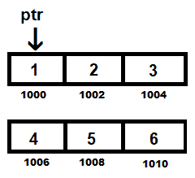

图 4.31

1.  要显示矩阵的转置，在嵌套循环中应用以下公式：

```cpp
*(ptr +j*c + i))
```

再次假设行（r=2）和列（c=3）的值，以下内存位置的内容将被显示：

| **i** | **j** | **内存地址** |
| --- | --- | --- |
| 0 | 0 | `1000` |
| 0 | 1 | `1006` |
| 1 | 0 | `1002` |
| 1 | 1 | `1008` |
| 2 | 0 | `1004` |
| 2 | 1 | `1010` |

因此，应用上述公式后，以下内存地址的内容将如图 4.32 所示。这些内存地址的内容将构成矩阵的转置：


图 4.32

让我们看看这个公式如何在程序中应用。

显示矩阵转置的指针的`transposemat.c`程序如下：

```cpp
#include <stdio.h>
#include <stdlib.h>
void main()
{
    int a[10][10],  r, c, i, j, *ptr,m;
    printf("Enter rows and columns of matrix: ");
    scanf("%d %d", &r, &c);
    ptr = (int *)malloc(r * c * sizeof(int));
    printf("\nEnter elements of matrix:\n");
    for(i=0; i<r; ++i)
    {
        for(j=0; j<c; ++j)
        {
            scanf("%d", &m);
             *(ptr+ i*c + j)=m;
        }
    }
    printf("\nMatrix using pointer is: \n");
    for(i=0; i<r; ++i)
    {
        for(j=0; j<c; ++j)
        {
           printf("%d\t",*(ptr +i*c + j));
        }
        printf("\n");
    }
    printf("\nTranspose of Matrix:\n");
    for(i=0; i<c; ++i)
    {
        for(j=0; j<r; ++j)
        {
             printf("%d\t",*(ptr +j*c + i));
        }
        printf("\n");
   }
}
```

现在，让我们看看幕后。

# 它是如何工作的...

每当定义一个数组时，它内部分配的内存是连续的。现在让我们定义一个 2 x 3 大小的矩阵，如图所示。在这种情况下，矩阵将被分配六个连续的内存位置，每个位置两个字节（见图 4.33）。为什么每个位置是两个字节？这是因为一个整数占用两个字节。这也意味着如果我们定义一个占用四个字节的浮点型矩阵，每个分配的内存位置将包含四个字节：


图 4.33

实际上，内存地址很长，并且是十六进制格式；但为了简单起见，我们将使用整型内存地址，并使用易于记忆的数字，如**1000**，作为内存地址。在内存地址**1000**之后，下一个内存地址是**1002**（因为一个整数占用两个字节）。

现在，为了使用指针以行主序形式显示原始矩阵元素，我们需要显示内存位置中的元素，**1000**，**1002**，**1004**，等等：

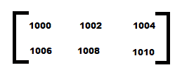

图 4.34

同样，为了使用指针显示矩阵的转置，我们需要显示内存位置中的元素；**1000**，**1006**，**1002**，**1008**，**1004**，和**1010**：


图 4.35

让我们使用 GCC 按照以下方式编译`transposemat.c`程序：

```cpp
D:\CBook>gcc transposemat.c -o transposemat
```

如果你没有错误或警告，这意味着`transposemat.c`程序已经被编译成可执行文件，`transposemat.exe`。让我们用以下代码片段运行这个可执行文件：

```cpp
D:\CBook>./transposemat
Enter rows and columns of matrix: 2 3

Enter elements of matrix:
1
2
3
4
5
6

Matrix using pointer is:
1       2       3
4       5       6

Transpose of Matrix:
1       4
2       5
3       6
```

哇！我们已经成功地使用指针找到了矩阵的转置。现在，让我们继续下一个菜谱！

# 使用指针访问结构

在这个菜谱中，我们将创建一个结构来存储特定客户下单的信息。结构是一种用户定义的数据类型，可以在其中存储不同数据类型的多个成员。该结构将包含用于存储订单号、电子邮件地址和密码的成员：

```cpp
struct cart
{  
    int orderno;
    char emailaddress[30];
    char password[30];
};
```

前面的结构名为`cart`，包含三个成员——用于存储客户下单订单号的`int`类型成员`orderno`，以及用于存储客户电子邮件地址和密码的字符串类型成员`emailaddress`和`password`。让我们开始吧！

# 如何做到这一点…

1.  定义一个名为`mycart`的`cart`结构体。同时，定义两个指向`cart`结构体的指针，`ptrcart`和`ptrcust`，如下所示：

```cpp
struct cart mycart;
struct cart *ptrcart, *ptrcust;
```

1.  输入订单号、电子邮件地址和密码，这些值将通过`mycart`结构体变量接受。如前所述，点操作符（`.`）将用于通过结构体变量访问结构体成员`orderno`、`emailaddress`和`password`，如下所示：

```cpp
printf("Enter order number: ");
scanf("%d",&mycart.orderno);
printf("Enter email address: ");
scanf("%s",mycart.emailaddress);
printf("Enter password: ");
scanf("%s",mycart.password);
```

1.  使用`ptrcart=&mycart`语句将`ptrcart`结构体指针设置为指向`mycart`结构体。因此，`ptrcart`结构体指针将能够通过箭头（`->`）操作符使用来访问`mycart`结构体的成员。通过使用`ptrcart->orderno`、`ptrcart->emailaddress`和`ptrcart->password`，可以访问并显示分配给`orderno`、`emailaddress`和`password`结构体成员的值：

```cpp
printf("\nDetails of the customer are as follows:\n");
printf("Order number : %d\n", ptrcart->orderno);
printf("Email address : %s\n", ptrcart->emailaddress);
printf("Password : %s\n", ptrcart->password);
```

1.  我们还将通过询问他们输入新的电子邮件地址和密码，并通过指向`ptrcart`结构体的指针接受新细节来修改客户的电子邮件地址和密码。因为`ptrcart`指向`mycart`结构体，所以新的电子邮件地址和密码将覆盖分配给`mycart`结构体成员的现有值：

```cpp
printf("\nEnter new email address: ");
scanf("%s",ptrcart->emailaddress);
printf("Enter new password: ");
scanf("%s",ptrcart->password);
/*The new modified values of orderno, emailaddress and password members are displayed using structure variable, mycart using dot operator (.).*/
printf("\nModified customer's information is:\n");
printf("Order number: %d\n", mycart.orderno);
printf("Email address: %s\n", mycart.emailaddress);
printf("Password: %s\n", mycart.password);
```

1.  然后，定义一个指向`*ptrcust`结构体的指针。使用以下`malloc`函数，为其分配内存。`sizeof`函数将找出每个结构体成员消耗的字节数，并返回整个结构体消耗的总字节数：

```cpp
ptrcust=(struct cart *)malloc(sizeof(struct cart));
```

1.  输入订单号、电子邮件地址和密码，所有这些值都将使用结构体指针以下格式分配给相应的结构体成员。显然，箭头操作符（`->`）将用于通过结构体指针访问结构体成员：

```cpp
printf("Enter order number: ");
scanf("%d",&ptrcust->orderno);
printf("Enter email address: ");
scanf("%s",ptrcust->emailaddress);
printf("Enter password: ");
scanf("%s",ptrcust->password);
```

1.  用户输入的值随后将通过指向`ptrcust`结构体的指针再次显示如下：

```cpp
printf("\nDetails of the second customer are as follows:\n");
printf("Order number : %d\n", ptrcust->orderno);
printf("Email address : %s\n", ptrcust->emailaddress);
printf("Password : %s\n", ptrcust->password);
```

以下`pointertostruct.c`程序解释了如何通过指针访问结构体：

```cpp
#include <stdio.h>
#include <stdlib.h>

struct cart
{
    int orderno;
    char emailaddress[30];
    char password[30];
};

void main()
{
    struct cart mycart;
    struct cart *ptrcart, *ptrcust;
    ptrcart = &mycart;
    printf("Enter order number: ");
    scanf("%d",&mycart.orderno);
    printf("Enter email address: ");
    scanf("%s",mycart.emailaddress);
    printf("Enter password: ");
    scanf("%s",mycart.password);
    printf("\nDetails of the customer are as follows:\n");
    printf("Order number : %d\n", ptrcart->orderno);
    printf("Email address : %s\n", ptrcart->emailaddress);
    printf("Password : %s\n", ptrcart->password);

    printf("\nEnter new email address: ");
    scanf("%s",ptrcart->emailaddress);
    printf("Enter new password: ");
    scanf("%s",ptrcart->password);
    printf("\nModified customer's information is:\n");
    printf("Order number: %d\n", mycart.orderno);
    printf("Email address: %s\n", mycart.emailaddress);
    printf("Password: %s\n", mycart.password);

    ptrcust=(struct cart *)malloc(sizeof(struct cart));
    printf("\nEnter information of another customer:\n");
    printf("Enter order number: ");
    scanf("%d",&ptrcust->orderno);
    printf("Enter email address: ");
    scanf("%s",ptrcust->emailaddress);
    printf("Enter password: ");
    scanf("%s",ptrcust->password);
    printf("\nDetails of the second customer are as follows:\n");
    printf("Order number : %d\n", ptrcust->orderno);
    printf("Email address : %s\n", ptrcust->emailaddress);
    printf("Password : %s\n", ptrcust->password);
}
```

现在，让我们看看幕后。

# 它是如何工作的...

当您定义一个结构体类型的变量时，该变量可以以下格式访问结构体的成员：

```cpp
structurevariable.structuremember
```

您可以在结构体变量和结构体成员之间看到一个点（`.`）。这个点（`.`）也被称为点操作符，或成员访问操作符。以下示例将使其更清晰：

```cpp
struct cart mycart;
mycart.orderno
```

在前面的代码中，您可以看到`mycart`被定义为`cart`结构体的结构体变量。现在，`mycart`结构体变量可以通过成员访问操作符（`.`）访问`orderno`成员。

您也可以定义一个指向结构体的指针。以下语句将`ptrcart`定义为指向`cart`结构体的指针。

```cpp
struct cart *ptrcart;
```

当结构体的指针指向一个结构体变量时，它可以访问该结构体变量的结构体成员。在以下语句中，指向`ptrcart`结构体的指针指向了`mycart`结构体变量的地址：

```cpp
ptrcart = &mycart;
```

现在，`ptrcart`可以访问结构体成员，但将使用箭头操作符（`->`）而不是点操作符（`.`）。以下语句使用指向结构体的指针访问结构体的`orderno`成员：

```cpp
ptrcart->orderno
```

如果你不想结构体指针指向结构体变量，那么需要为指向结构体的指针分配内存以访问结构体成员。以下语句通过为它分配内存来定义一个指向结构体的指针：

```cpp
ptrcust=(struct cart *)malloc(sizeof(struct cart));
```

上述代码分配了与`cart`结构体大小相等的内存，将该内存类型转换为指向`cart`结构体的指针，并将分配的内存赋值给`ptrcust`。换句话说，`ptrcust`被定义为指向结构体的指针，它不需要指向任何结构体变量，但可以直接访问结构体成员。

让我们使用 GCC 按照以下方式编译`pointertostruct.c`程序：

```cpp
D:\CBook>gcc pointertostruct.c -o pointertostruct
```

如果你没有收到任何错误或警告，这意味着`pointertostruct.c`程序已经被编译成一个可执行文件，名为`pointertostruct.exe`。让我们按照以下方式运行这个可执行文件：

```cpp
D:\CBook>./pointertostruct
Enter order number: 1001
Enter email address: bmharwani@yahoo.com
Enter password: gold

Details of the customer are as follows:
Order number : 1001
Email address : bmharwani@yahoo.com
Password : gold

Enter new email address: harwanibm@gmail.com
Enter new password: diamond

Modified customer's information is:
Order number: 1001
Email address: harwanibm@gmail.com
Password: diamond

Enter information of another customer:
Enter order number: 1002
Enter email address: bintu@yahoo.com
Enter password: platinum

Details of the second customer are as follows:
Order number : 1002
Email address : bintu@yahoo.com
Password : platinum
```

哇！我们已经成功使用指针访问了一个结构体。
